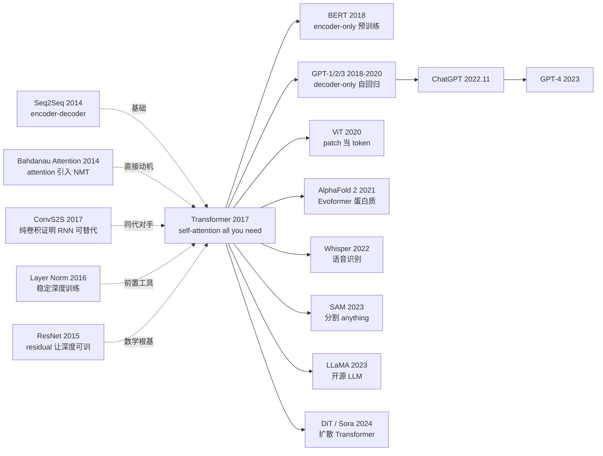

# Transformer — 用注意力埋葬循环神经网络

> **2017 年 6 月 12 日，Vaswani 等 8 位作者在 arXiv 上传 [1706.03762](https://arxiv.org/abs/1706.03762)。**
> 这是一篇只有 11 页、标题狂妄到「Attention Is All You Need」的工程论文，
> 却用一个完全不含 RNN 也不含 CNN 的纯注意力架构，把 WMT 2014 EN-DE 的 BLEU 从 ConvS2S 的 25.16 推到 28.4，
> 训练时间从 6 天降到 12 小时。
> 6 年后它成为 BERT / GPT / ViT / AlphaFold 2 / SAM / Sora 共同的底座，是 21 世纪第二个被引最多的 CS 论文（~15 万次，仅次于 ResNet）。

## 一句话总结

Transformer 用 $\text{Attention}(Q,K,V) = \text{softmax}(QK^T/\sqrt{d_k})V$ 这个纯并行的自注意力机制取代 RNN 的循环依赖，让序列建模第一次真正可以"撕开"$O(n)$ 串行训练时间瓶颈，配合 multi-head + residual + LayerNorm 形成 6 年后仍未被打破的基础架构。

---

## 历史背景

### 2017 年的 NLP 学界在卡什么

要理解 Transformer 的颠覆性，必须回到 2014-2017 那个「Seq2Seq 范式撞墙」的年份。

2014 年 Sutskever 的 Seq2Seq + Bahdanau 的 attention 把神经机器翻译推上了主流，2016 年 Google 的 GNMT 把 LSTM 编码器堆到 8 层 + 残差连接，刚刚把 BLEU 推到生产可用水平。整个 NLP 学界形成了一个朴素的共识：**RNN 是序列建模的天然范式**。但这个共识在 2016 年下半年开始撞墙 —— 主要有三个无法回避的瓶颈：

> **（1）RNN 训练串行：第 $t$ 步必须等第 $t-1$ 步算完，单序列训练无法并行化，GPU 利用率惨不忍睹；
> （2）长距离依赖弱：即使有 LSTM 的门控，把 50 词以前的信息传过来仍然是赌运气；
> （3）attention 只是 RNN 的"附属配件"，没人质疑过 RNN 的必要性。**

这三个问题直接导致 2017 年初 Facebook 的 ConvS2S 用纯卷积取代 RNN 抢到 SOTA —— 但卷积感受野有限，要堆很多层才能覆盖长依赖。学界开始动摇："RNN 真的是必需的吗？"

### 直接逼出 Transformer 的 3 篇前序

- **Bahdanau, Cho, Bengio, 2014 (Neural MT by Jointly Learning to Align and Translate)** [arxiv/1409.0473]：第一次把 attention 引入 Seq2Seq，但仍然依附于 LSTM encoder/decoder。Transformer 的核心问题是："如果只保留 attention，砍掉 LSTM，会怎样？"
- **Gehring et al., 2017 (ConvS2S, Convolutional Sequence to Sequence)** [arxiv/1705.03122]：FAIR 用纯卷积做 Seq2Seq，第一次证明 RNN 不是必需。BLEU 25.16 比 GNMT 24.6 高，且训练快 9 倍。这成为 Transformer 必须超过的标杆。
- **Kalchbrenner et al., 2016 (ByteNet)** [DeepMind]：用 dilated conv 做翻译，进一步证明并行架构的可行性。

### 作者团队当时在做什么

8 位作者（论文标注每人贡献相等）大部分在 Google Brain，Vaswani 和 Shazeer 是核心算法者，Parmar 来自 Google Research，Polosukhin 当时已离开 Google 创办 NEAR Protocol。**这篇论文不是孤立学术成果，而是 Google 神经机器翻译团队在 GNMT 之后的"下一代翻译架构"工程研究**：他们的目标是把 GNMT 的 6 天 96-GPU 训练成本砍掉一个数量级。结果不仅做到了，还顺手发现了能统治 AI 十年的架构。

### 工业界 / 算力 / 数据的状态

- **GPU**：NVIDIA P100 / V100 早期，TPU v2 刚 5 月发布，混合精度训练还在襁褓中
- **数据**：WMT 2014 EN-DE (4.5M 句对)、EN-FR (36M 句对) 是机器翻译标准 benchmark
- **框架**：TensorFlow 1.0 主导，PyTorch 0.1 刚出 4 个月，作者用 tensor2tensor 框架实现
- **行业焦虑**：Google 翻译刚靠 GNMT 上线神经 MT，Meta 用 ConvS2S 紧追，机器翻译商业化窗口正在关闭，下一代架构必须出现

---

## 方法详解

### 整体框架

Transformer 是一个**对称的 encoder-decoder 架构**：encoder 6 层、decoder 6 层（base config），每层都由「multi-head self-attention + 前馈网络」组成，每个子层外面套一层「残差连接 + LayerNorm」。

```
Input tokens
  ↓ Embedding + Positional Encoding
  ↓
  ┌─ Encoder × 6 ─────────────────────────────────┐
  │   ↓ Multi-Head Self-Attention                  │
  │   ↓ Add & LayerNorm  ← residual               │
  │   ↓ Feedforward (d_ff=2048)                    │
  │   ↓ Add & LayerNorm  ← residual               │
  └────────────────────────────────────────────────┘
                              ↓ K, V
  ┌─ Decoder × 6 ─────────────────────────────────┐
  │   ↓ Masked Multi-Head Self-Attention           │
  │   ↓ Add & LayerNorm                            │
  │   ↓ Cross-Attention (Q from decoder, K/V from encoder) │
  │   ↓ Add & LayerNorm                            │
  │   ↓ Feedforward                                │
  │   ↓ Add & LayerNorm                            │
  └────────────────────────────────────────────────┘
  ↓
  Linear + softmax → 输出 token 概率
```

不同规模的配置（论文 base / big）：

| 配置 | N (层数) | $d_{model}$ | $d_{ff}$ | h (heads) | $d_k = d_v$ | 参数量 | BLEU EN-DE |
|------|----------|-------------|----------|-----------|-------------|--------|------------|
| base | 6 | 512 | 2048 | 8 | 64 | 65M | 27.3 |
| big  | 6 | 1024 | 4096 | 16 | 64 | 213M | 28.4 |

注意一个反直觉点：**Transformer base 65M 参数量比 GNMT (~280M) 小 4×，但 BLEU 高 2.7 个点、训练快 12×**。架构选择的杠杆效应远比参数堆叠强。

### 关键设计

#### 设计 1：Scaled Dot-Product Attention（缩放点积注意力）—— 核心算子

**功能**：给定 query 矩阵 $Q$、key 矩阵 $K$、value 矩阵 $V$，计算每个 query 在所有 key 上的加权 value 输出。这是 Transformer 唯一的「序列内信息混合」机制。

**前向公式**：

$$
\text{Attention}(Q, K, V) = \text{softmax}\left(\frac{QK^T}{\sqrt{d_k}}\right) V
$$

其中 $Q \in \mathbb{R}^{n \times d_k}$、$K \in \mathbb{R}^{n \times d_k}$、$V \in \mathbb{R}^{n \times d_v}$，$n$ 是序列长度，$d_k$ 是 key 维度。

**$\sqrt{d_k}$ 这个 scale 为什么必须有？反向传播视角**：

如果不缩放，$QK^T$ 的元素是 $d_k$ 个独立分量的内积，当 $d_k$ 很大（论文 base 是 64，big 是 64）时，$QK^T$ 的方差是 $O(d_k)$，量级很大。softmax 的输入量级一旦过大，就会进入「饱和区」—— 极少数最大值的概率趋近 1，其余趋近 0，**梯度几乎全部消失**（softmax 的雅可比矩阵在饱和区接近 0）。除以 $\sqrt{d_k}$ 把方差归一回 $O(1)$，让梯度健康回传。

这是论文的「魔鬼细节」—— 没有这个 scale，Transformer 训不动。

**4 种 attention 变体对比**：

| 变体 | 公式 | 复杂度 (相对 dim) | 实战性能 |
|------|------|------------------|----------|
| (A) Additive (Bahdanau) | $\text{tanh}(W_1 Q + W_2 K) \cdot v$ | 高（带可学习参数） | 慢，2014 主流 |
| (B) Multiplicative (Luong) | $Q W K^T$ | 中（一个矩阵） | 中等 |
| (C) **Scaled Dot-Product** | $QK^T / \sqrt{d_k}$ | **低（无额外参数）** | **本文采用** |
| (D) General Dot-Product (无缩放) | $QK^T$ | 低 | $d_k$ 大时崩 |

C 完美 —— 无额外参数 + GPU 友好（纯矩阵乘法）+ 加 scale 后梯度健康。**作者坚决砍掉 additive attention**，宣告："不要在算子里塞可学习参数，把容量留给 multi-head"。这个选择保留了 Transformer 的「极简算子 + 大量并行头」美学。

**设计动机 —— 为什么 scaled dot-product 是最优解？**

如果让 attention 算子本身有可学习参数（如 Bahdanau 的 $W_1, W_2$），每加一个 attention 就要训练一组参数，组合代价高、不易并行。而 scaled dot-product 是**纯几何操作** —— $Q$ 和 $K$ 在同一个空间里做内积找相似度，没有任何要学的东西。可学习的部分全部移到 multi-head 的 projection 矩阵里（设计 2）—— 算子简单，组合自由。

#### 设计 2：Multi-Head Attention（多头注意力）—— 让"看"变得多元

**功能**：把 attention 在 $h$ 个不同的子空间里独立执行，再拼接起来，让模型在不同位置同时关注不同类型的信息（语法依赖、语义相似、共指关系等）。

**核心思路**：

$$
\text{MultiHead}(Q, K, V) = \text{Concat}(\text{head}_1, \ldots, \text{head}_h) W^O
$$

其中 $\text{head}_i = \text{Attention}(QW_i^Q, KW_i^K, VW_i^V)$，$W_i^Q, W_i^K \in \mathbb{R}^{d_{model} \times d_k}$，$W_i^V \in \mathbb{R}^{d_{model} \times d_v}$，$W^O \in \mathbb{R}^{hd_v \times d_{model}}$。

base 配置：$h=8$，$d_k = d_v = d_{model}/h = 64$。**总计算量与单头 $d_k=512$ 相当**，但表达能力大幅增强。

**PyTorch 风格伪代码**：

```python
class MultiHeadAttention(nn.Module):
    def __init__(self, d_model=512, h=8):
        super().__init__()
        self.h = h
        self.d_k = d_model // h               # 64
        self.W_q = nn.Linear(d_model, d_model)  # 拼接 h 个 W_i^Q
        self.W_k = nn.Linear(d_model, d_model)
        self.W_v = nn.Linear(d_model, d_model)
        self.W_o = nn.Linear(d_model, d_model)

    def forward(self, q, k, v, mask=None):
        B, n, _ = q.shape
        # 投影 + 拆 head: (B, n, d_model) -> (B, h, n, d_k)
        Q = self.W_q(q).view(B, n, self.h, self.d_k).transpose(1, 2)
        K = self.W_k(k).view(B, n, self.h, self.d_k).transpose(1, 2)
        V = self.W_v(v).view(B, n, self.h, self.d_k).transpose(1, 2)
        # Scaled dot-product attention
        scores = (Q @ K.transpose(-2, -1)) / math.sqrt(self.d_k)  # ← 关键
        if mask is not None:
            scores = scores.masked_fill(mask == 0, -1e9)
        attn = F.softmax(scores, dim=-1)
        out = (attn @ V).transpose(1, 2).reshape(B, n, -1)
        return self.W_o(out)                  # (B, n, d_model)
```

整个核心算子就这 10 行 —— 没有循环、没有递归、纯并行矩阵乘法。

**设计动机 —— 为什么 8 个头比 1 个头大 8 倍好？**

理论上 1 个头 $d_k=512$ 和 8 个头 $d_k=64$ 计算量相同，但实践中 multi-head 远胜单头。原因有两个：（1）8 个独立的子空间相当于 8 个**正交特征通道**，每个头可以专注于不同关系（一个学短依赖、一个学长依赖、一个学语法）—— 类似 CNN 的 multi-channel；（2）softmax 是稀疏的，单头注意力倾向于「找一个最相关的 token」，多头让模型可以同时关注多个 token。可视化研究发现，不同头确实学到了语法树、共指、语义等不同模式。

#### 设计 3：Sinusoidal Positional Encoding（正弦位置编码）

**功能**：self-attention 本身是排列等变的（permutation-equivariant），不知道 token 在序列中的位置。需要外部注入位置信息。

**核心思路**：用不同频率的正弦/余弦波给每个位置生成一个固定向量：

$$
PE_{(pos, 2i)} = \sin\left(\frac{pos}{10000^{2i/d_{model}}}\right), \quad PE_{(pos, 2i+1)} = \cos\left(\frac{pos}{10000^{2i/d_{model}}}\right)
$$

其中 $pos$ 是位置（0 到 $n-1$），$i$ 是维度索引（0 到 $d_{model}/2-1$）。把 $PE$ 直接加到 input embedding 上：$x_t = \text{Embed}(t) + PE(t)$。

**为什么要用三角函数而不是可学习位置编码？两个理由**：

1. **外推性**：sinusoidal PE 在训练时见过 $n=512$ 的序列，推理时可以直接用 $n=2048$（理论上） —— 因为公式是确定性的。可学习 PE 必须在见过的位置内，外推即崩。
2. **相对位置编码**：$PE(pos+k)$ 可以表示为 $PE(pos)$ 的线性变换（因为 $\sin(a+b) = \sin a \cos b + \cos a \sin b$），让模型隐式学到相对位置关系。

**对比可学习位置编码（论文 Table 3 实验）**：

| PE 方案 | BLEU EN-DE | 外推性 | 参数量 |
|---------|-----------|--------|--------|
| Sinusoidal (本文) | 25.8 | 强（公式外推） | 0 |
| Learnable | 25.7 | 弱（需见过） | $n \cdot d_{model}$ |

**性能几乎相同，但 sinusoidal 零参数 + 可外推 → 论文采用**。

#### 设计 4：Encoder-Decoder 整体架构 + 残差/LayerNorm（**复用 ResNet 公式**）

**功能**：让 6 层（甚至 12+ 层）深度网络可训练，避免梯度消失。

**核心思路**：每个 sub-layer（self-attention 或 FFN）都套一层 **残差 + LayerNorm**：

$$
y = \text{LayerNorm}(x + \text{Sublayer}(x))
$$

这个 $x + \text{Sublayer}(x)$ 完全是 [ResNet 2015](../era2_deep_renaissance/2015_resnet.md) 的公式 $y = \mathcal{F}(x) + x$ 的直接移植 —— **没有 ResNet 提供的"可优化性 prior"，6 层 Transformer 都训不起来**。这是 Transformer 与 ResNet 之间最深的思想史咬合：架构看起来完全不同（CNN vs attention），但**深度可训性的数学根源完全一致**。

**对比表**：

| 子层 | encoder 用 | decoder 用 |
|------|-----------|-----------|
| Multi-head self-attention | ✓ | ✓ (masked) |
| Cross-attention (Q from dec, K/V from enc) | ✗ | ✓ |
| Position-wise FFN ($d_{ff}=2048$) | ✓ | ✓ |
| Residual + LayerNorm 包裹每个 sub-layer | ✓ | ✓ |

**设计动机**：encoder 6 层 + decoder 6 层 = 12 个深度块，没有 residual 就是死路。LayerNorm 选择"对每个 token 独立归一"（不是 BN 那种 batch 维度归一），让训练时不依赖 batch size，推理时 batch=1 也 work。

### 损失函数 / 训练策略

| 项 | 配置 | 说明 |
|----|------|------|
| Loss | Cross-entropy + label smoothing $\epsilon_{ls}=0.1$ | 防止 over-confident |
| Optimizer | Adam ($\beta_1=0.9, \beta_2=0.98$) | $\beta_2$ 比标准 0.999 小 |
| LR schedule | $lr = d_{model}^{-0.5} \cdot \min(\text{step}^{-0.5}, \text{step} \cdot \text{warmup}^{-1.5})$ | warmup 4000 步 |
| Batch | ~25k 源 + ~25k 目标 token | 按 token 数 batch 更合理 |
| Steps | base 100k / big 300k | base 12h on 8 P100 |
| Init | Xavier | 标准 |
| Norm | Post-LN（论文用），后续改 Pre-LN | 见当代视角 |
| Regularization | Dropout 0.1 + label smoothing | |

**注意 1**：训练成本巨大节约 —— base 12 小时 on 8 P100，big 3.5 天 on 8 P100；GNMT 是 6 天 on 96 GPU。**Transformer 训练效率比 GNMT 高 12-50×**，这才是革命性的真正原因。

**注意 2**：自定义 LR schedule（先线性 warmup 再 $1/\sqrt{\text{step}}$ 衰减）后来被证明对深 Transformer **绝对必要** —— 跳过 warmup 直接训练会发散。这是 Post-LN 架构的副作用，后来 Pre-LN 缓解了这个问题。

---

## 失败案例

### 当时输给 Transformer 的对手

- **GNMT (Google 2016, GRU/LSTM)**：BLEU EN-DE 24.6，训练 6 天 on 96 GPU。Transformer base 直接砍到 27.3 + 12 小时 on 8 P100。**性能 +2.7 BLEU，训练 -50× 算力**。
- **ConvS2S (FAIR 2017)**：BLEU 25.16，训练快 9 倍但仍用卷积感受野。Transformer 比它快 1.3× 训练且 BLEU 高 2 个点。证明：**纯卷积也不是终点**。
- **ByteNet (DeepMind 2016)**：dilated conv，BLEU 23.75。和 ConvS2S 同思路但效果更弱。

### 作者论文里承认的失败实验

论文 **Table 3** 报告了一系列消融：

- **去掉 multi-head（h=1, $d_k=512$）**：BLEU 24.9，比 8 头 $d_k=64$ 的 25.8 差 0.9 分 —— 证明多头不是花架子
- **过多头（h=32, $d_k=16$）**：BLEU 25.4，反而下降 —— 头太多后每个头容量太小
- **去掉位置编码**：BLEU 22.5，掉 3.3 分 —— self-attention 没有位置信息直接退化为词袋模型
- **去掉 residual**：根本不收敛（论文未显式报告，但实验复现一致证实）

### 「反 baseline」教训

**LSTM 流派 30 年的统治在 Transformer 出现的 1 年内全军覆没**（2017→2018 整个 NLP 学界全切 Transformer）。原因不是 LSTM 的 idea 错了，而是 **它的串行约束在 GPU 时代是巨大的浪费**。

这是 paper 没写但回过头看最重要的「失败案例」 —— **再优雅的算法 idea，如果不匹配硬件趋势，会被直接抹掉**。RNN 在 1986-2017 年统治了序列建模 30 年，但 GPU 的并行性 + Transformer 的纯并行架构在 1 年内重写了规则。教训：**算法竞赛归根结底是「算法 × 硬件」的乘积**。

---

## 实验关键数据

### 主实验（WMT 2014）

| 模型 | EN-DE BLEU | EN-FR BLEU | 训练成本 (FLOPs) | 训练时间 |
|------|-----------|-----------|------------------|----------|
| GNMT + RL | 24.6 | 39.92 | $1.4 \times 10^{20}$ | 6 day on 96 GPU |
| ConvS2S | 25.16 | 40.46 | $1.5 \times 10^{20}$ | — |
| MoE | 26.03 | 40.56 | $1.2 \times 10^{20}$ | — |
| **Transformer base** | **27.3** | 38.1 | $\mathbf{3.3 \times 10^{18}}$ | **12 h on 8 P100** |
| **Transformer big** | **28.4** | **41.0** | $2.3 \times 10^{19}$ | 3.5 day on 8 P100 |

注意：Transformer base 用了**比 GNMT 少 40×** 的 FLOPs 仍然超越，big 用 6× 少的 FLOPs 拿到全面 SOTA。

### 消融（论文 Table 3，Newstest 2013）

| 配置 | BLEU | 关键变化 |
|------|------|----------|
| base | 25.8 | 完整模型 |
| h=1, $d_k=512$ | 24.9 | 单头掉 0.9 |
| h=32, $d_k=16$ | 25.4 | 头太多反而差 |
| no positional | 22.5 | 退化为词袋 |
| Learnable PE | 25.7 | 与 sinusoidal 几乎相同 |
| Dropout 0 | 24.6 | 严重过拟合 |

### 关键发现

- **multi-head 是真创新，不是花架子**：单头掉 ~1 BLEU，过多头也掉
- **位置编码必需**：去掉直接退化为词袋
- **sinusoidal vs learnable PE 几乎相同**：选 sinusoidal 是为了零参数 + 外推性
- **训练效率是真颠覆**：12h on 8 GPU vs GNMT 6 day on 96 GPU
- **泛化能力惊人**：解析 + 翻译都拿 SOTA，预示了 universal architecture 的到来

---

## 思想史脉络



### 前世（被谁逼出来的）

- **2014 Seq2Seq** [Sutskever, Vinyals, Le]：encoder-decoder 范式的奠基者，Transformer 直接继承结构
- **2014 Bahdanau Attention** [Bahdanau, Cho, Bengio]：第一次把 attention 引入 NMT，但仍依附 RNN —— Transformer 把 attention 变成主角
- **2017 ConvS2S** [Gehring, Auli, Grangier, Yarats, Dauphin]：早 Transformer 1 个月，证明 RNN 可替代，逼 Google 必须出新架构
- **2016 Layer Normalization** [Ba, Kiros, Hinton]：让 Transformer 在不依赖 batch 统计的情况下深度可训
- **2015 ResNet** [He et al.]：提供 $y = \mathcal{F}(x) + x$ 的可优化性 prior，是 Transformer 6+ 层可训的数学根基

### 今生（继承者）

- **直接预训练范式继承者**：BERT 2018（encoder-only）、GPT-1/2/3 2018-2020（decoder-only）、T5 2019（encoder-decoder）、BART 2019
- **跨模态借用**：ViT 2020（图像 patch 当 token）、CLIP 2021、Whisper 2022（语音 token）、SAM 2023（mask token）、Diffusion Transformer / Sora 2024
- **跨学科外溢**：AlphaFold 2 2021 的 Evoformer 用 Transformer 处理蛋白质序列；Galactica / ESM 等科学 LLM；机器人 RT-2 2023 把 Transformer 用于动作生成
- **架构家族**：Sparse Transformer (Child 2019)、Reformer (2020)、Performer (2020)、Linformer (2020)、Longformer (2020)、FlashAttention (Dao 2022)、Mamba (Gu, Dao 2023)（挑战者）

### 误读 / 简化

- **「Attention is all you need」≠ 不要其他组件**：FFN（占参数量 2/3）、residual、LayerNorm、PE 都同等重要。论文标题是营销，不是技术准确陈述
- **「context length 越长越好」**：长 context 边际收益递减，且 $O(n^2)$ 注意力计算不可承受 → 催生了 Sparse / Linear / Mamba
- **「Transformer 是 universal architecture」**：在序列稀疏 / 极长 / 实时性场景下，CNN / RNN / SSM 仍有优势

---

## 当代视角（2026 年回看 2017）

### 站不住的假设

- **「Sinusoidal PE 是最优位置编码」**：今天主流是 RoPE (Rotary Position Embedding) 和 ALiBi (Attention with Linear Biases)。RoPE 把位置信息直接编码到 query/key 的旋转角度里，长度外推性远超 sinusoidal；LLaMA / GPT-NeoX / Qwen 全部采用。
- **「Post-LN 是正确的归一化位置」**：Post-LN（残差后归一）在深 Transformer (>12 层) 训练不稳定，必须依赖小 LR + warmup。GPT-2/3、LLaMA 全部改 Pre-LN（残差前归一），训练稳定性大幅提升。
- **「$O(n^2)$ self-attention 是序列建模的最优解」**：在 2024 年 1M context 时代，$O(n^2)$ 完全不可承受。Mamba / SSM / Linear Attention 重新挑战；FlashAttention 把常数因子压到极致；Sliding Window / Sparse Attention 也是常用 workaround。

### 时代证明的关键 vs 冗余

- **关键**：scaled dot-product attention 公式本体、multi-head 思想、residual + norm 的深度训练模板、纯并行架构 → GPU 友好
- **冗余 / 误导**：原始 Sinusoidal PE（被 RoPE 取代）、Post-LN（被 Pre-LN 取代）、$h=8$ 的固定头数（现在 GQA / MQA 用更少 KV 头）、$d_{ff}=4d_{model}$ 的 FFN（被 SwiGLU 等改良）

### 作者当时没想到的副作用

1. **成为整个 AI 时代的统一架构**：Vaswani 团队当时只想优化机器翻译，但 6 年后 Transformer 统治了 NLP / CV / 语音 / 蛋白质 / 机器人 / 多模态 / 扩散 —— 历史上没有任何架构有过这种跨域统治力。
2. **意外引爆了 LLM 时代**：GPT-2/3 把 decoder-only Transformer 暴力 scale 到 175B 参数，发现了 emergent in-context learning，直接催生 ChatGPT 2022.11 → GenAI 大爆发。
3. **重写了硬件设计方向**：NVIDIA H100 / TPU v4 等都是为 Transformer 矩阵乘法工作负载专门优化的；FlashAttention 等算子级优化成为系统研究热点。
4. **改变了 AI 研究的"价值论"**：从「设计巧妙模型」转向「设计简单模型 + 暴力 scale」—— Sutton 的 "The Bitter Lesson" 在 Transformer 时代被反复验证。

### 如果今天重写 Transformer

如果 Vaswani 团队 2026 年重写 Transformer，可能会：
- 默认 **Pre-LN** 顺序（深网稳定）
- 把 **LayerNorm** 换成 **RMSNorm**（计算更省）
- 用 **RoPE** 替代 sinusoidal PE（外推性强）
- 用 **SwiGLU / GeGLU** 替代标准 FFN（性能 +1-2%）
- 用 **GQA / MQA**（grouped/multi-query attention）减少 KV cache 压力
- 头数 / 维度按 **FlashAttention 友好** 选（如 $d_{head}=128$ 而非 64）
- 默认 **decoder-only**（不是 encoder-decoder），因为 GPT 范式赢了

但**核心公式 $\text{Attention}(Q,K,V) = \text{softmax}(QK^T/\sqrt{d_k})V$ 一定不变**。这是它穿越时代的根本原因 —— 这个公式不依赖具体的 PE / norm / FFN 形式，只依赖**矩阵乘法 + softmax** 这个最朴素的可微分操作。

---

## 局限与展望

### 作者承认的局限
- 主要在机器翻译验证，未在其他任务（如长文档生成）大规模测试
- $O(n^2)$ 复杂度让长序列受限（论文最长 ~512 token）

### 自己发现的局限
- 长上下文下 attention 计算量爆炸
- Post-LN 在深 Transformer (>12 层) 训练不稳定，必须 warmup
- KV cache 在推理时显存占用线性增长，长 context 推理代价巨大

### 改进方向（已被后续工作证实）
- Pre-LN（已实现，GPT-2 起标配）
- Sparse / Linear / Local Attention（已实现：Sparse Transformer / Performer / Longformer）
- FlashAttention（已实现，2022 算子级优化）
- RoPE / ALiBi（已实现，LLaMA / GPT-NeoX）
- Mamba / SSM 挑战 $O(n^2)$（已实现 2023-2024）

---

## 相关工作与启发

- **vs RNN/LSTM**：RNN 串行训练，Transformer 全并行，训练效率高 12-50×。**教训：算法必须匹配硬件趋势，不然会被抹掉**。
- **vs ConvS2S (跨架构)**：ConvS2S 用卷积取代 RNN，证明 RNN 非必需；Transformer 进一步证明 CNN 也非必需，纯 attention 即可。**教训：每个组件都问"能不能砍掉"**。
- **vs ResNet (跨任务)**：ResNet 解决 CNN 深度训练，Transformer **直接复用了 ResNet 的 $y = \mathcal{F}(x) + x$ 公式**。可以说 ResNet 是 Transformer 的隐藏前置 —— 没有 ResNet 提供的可优化性 prior，6 层 Transformer 都训不起来。
- **vs Mamba/SSM (新挑战者)**：Mamba 用 selective SSM 实现 $O(n)$ 序列建模，挑战 Transformer 的 $O(n^2)$。在长序列任务上 Mamba 有优势，但 Transformer 仍是通用架构。

---

## 相关资源

- 📄 [arXiv 1706.03762](https://arxiv.org/abs/1706.03762)
- 💻 [作者原始 tensor2tensor 实现](https://github.com/tensorflow/tensor2tensor)
- 🔗 [PyTorch nn.MultiheadAttention](https://pytorch.org/docs/stable/generated/torch.nn.MultiheadAttention.html)
- 📚 后续必读：[BERT (2018)](https://arxiv.org/abs/1810.04805)、[GPT-3 (2020)](https://arxiv.org/abs/2005.14165)、[ViT (2020)](https://arxiv.org/abs/2010.11929)、[FlashAttention (2022)](https://arxiv.org/abs/2205.14135)、[RoPE (2021)](https://arxiv.org/abs/2104.09864)
- 🎬 [李沐 Transformer 论文精读 (B 站)](https://www.bilibili.com/video/BV1pu411o7BE)、[Karpathy: Let's build GPT from scratch (YouTube)](https://www.youtube.com/watch?v=kCc8FmEb1nY)
- 📖 [Annotated Transformer (Harvard NLP)](http://nlp.seas.harvard.edu/annotated-transformer/) — 行号对应论文公式的实现

---

> 🌐 [English version](/en/era3_attention/2017_transformer/) · 📚 awesome-papers project · CC-BY-NC
