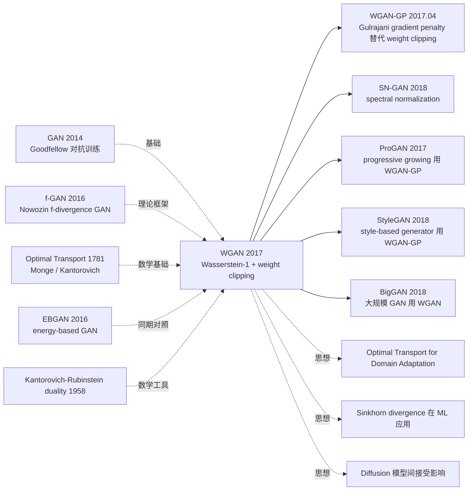

# WGAN — 用 Wasserstein 距离根治 GAN 训练不稳定

> **2017 年 1 月 26 日，Courant Institute 的 Arjovsky、FAIR 的 Chintala、Bottou 在 arXiv 发布 [WGAN (1701.07875)](https://arxiv.org/abs/1701.07875)，ICML 2017 接收。**
> 这是 GAN 历史上最重要的理论论文之一 —— 用严谨的最优传输（Optimal Transport）理论分析了原始 GAN 训练不稳定的根本原因（JS divergence 在分布支撑不重合时梯度消失），并提出用 **Wasserstein-1 距离**（Earth Mover's Distance）替代 JS divergence 解决这个问题。
> WGAN 让 GAN 训练变得**异常稳定**：架构选择不再敏感、不需要 mode collapse 各种 hack、loss 数值有意义可以监控收敛。WGAN 和后续 WGAN-GP（Gulrajani 2017）成为 2017-2020 年 GAN 训练的事实标准（ProGAN / StyleGAN / BigGAN 全部基于 WGAN-GP）。

## 一句话总结

WGAN 用 **Wasserstein-1 距离**（Earth Mover's Distance）替代原始 GAN 的 JS divergence 作为 generator 优化目标，通过 **Kantorovich-Rubinstein duality** 把 sup-over-couplings 转化为 sup-over-1-Lipschitz-functions，再用 **weight clipping** 强制 critic 函数 1-Lipschitz，从根本上解决了 GAN 训练梯度消失 / 不稳定 / mode collapse 等问题。

---

## 历史背景

### 2017 年初的 GAN 学界在卡什么

GAN（Goodfellow 2014）一直被誉为生成模型的革命性突破，但实际训练异常困难。2014-2016 整个 GAN 领域陷入"调参炼丹"困境：

> **(1) 训练不稳定**：generator 和 discriminator 容易振荡 / 发散 / 失衡；
> **(2) Mode collapse**：generator 只生成训练分布的一个子集（"所有数字都长得像 6"）；
> **(3) Loss 无意义**：discriminator loss 不能监控 generator 质量（loss 低不代表生成质量好）；
> **(4) 架构敏感**：换个架构就训不动，DCGAN 是当时唯一稳定的架构。

学界开始追问：**「为什么 GAN 这么难训？根本原因是什么？」**

### 直接逼出 WGAN 的 3 篇前序

- **Goodfellow et al., 2014 (GAN)** [NeurIPS]：奠定对抗训练范式，但忽略了 JS divergence 的病态性
- **Radford, Metz, Chintala, 2015 (DCGAN)** [ICLR]：工程级稳定 GAN 架构，但只是经验性 trick
- **Nowozin et al., 2016 (f-GAN)** [NeurIPS]：把 GAN 推广到 f-divergence 家族，理论框架启发了 WGAN

### 作者团队当时在做什么

3 位作者横跨学术界和工业界：Martin Arjovsky 是 Courant Institute（NYU）PhD（导师 Léon Bottou）；Soumith Chintala 是 FAIR 研究员（**PyTorch 共同创始人**）；Léon Bottou 是 ML 经典理论名家（SGD 收敛分析）。**Bottou lab 当时押注「用最优传输理论改造 GAN」**，WGAN 就是这个押注的开山之作。

### 工业界 / 算力 / 数据

- **GPU**：单 GTX 1080，标准 LSUN bedroom / CIFAR 实验
- **数据**：LSUN bedroom (3M 张), CIFAR-10
- **框架**：PyTorch（Chintala 主导）+ Lua Torch
- **行业**：DCGAN 是当时唯一稳定 GAN 架构，但学界已意识到必须从理论解决，否则 GAN 永远是"炼丹术"

---

## 方法详解

### 整体框架

```
Original GAN:
  D maximizes:    E_{x~P_r}[log D(x)] + E_{z~P_z}[log(1 - D(G(z)))]
  G minimizes:    -E_{z~P_z}[log D(G(z))]
  Implicitly minimizes JS(P_r || P_g) — pathological when support disjoint

WGAN:
  Replace D ("discriminator") with f ("critic"), no sigmoid
  f maximizes:    E_{x~P_r}[f(x)] - E_{z~P_z}[f(G(z))]    s.t. ||f||_L ≤ 1
  G minimizes:    -E_{z~P_z}[f(G(z))]
  Approximates -W(P_r, P_g) (negative Wasserstein-1 distance)
```

| 配置 | WGAN |
|------|------|
| Critic / Discriminator | 同 DCGAN 架构，移除 sigmoid 输出 |
| 1-Lipschitz 约束 | **Weight clipping**: clip 所有 critic 权重到 [-c, c]，c=0.01 |
| Critic 训练频率 | n_critic=5 (每 G 更新 1 次，先训 D 5 次) |
| Optimizer | **RMSprop** (lr=5e-5)，**不用 Adam** |
| Batch | 64 |
| Data | LSUN bedroom 3M / CIFAR-10 |

### 关键设计

#### 设计 1：用 Wasserstein-1 距离替代 JS divergence

**功能**：用一个在低维流形支撑上仍然连续可微、且始终给出有意义梯度的距离度量。

**Wasserstein-1 (Earth Mover's) 定义**：

$$
W(P_r, P_g) = \inf_{\gamma \in \Pi(P_r, P_g)} \mathbb{E}_{(x,y) \sim \gamma}[\|x - y\|]
$$

直观理解：把分布 $P_g$ 的"土堆"搬运成 $P_r$ 形状所需的**最少搬运量**（重量 × 距离）。

**为什么 W 优于 JS？关键定理（论文 Theorem 1 / 2）**：

设 $g_\theta$ 是连续可微的 generator，则：
- $W(P_r, P_{g_\theta})$ 对 $\theta$ **连续且几乎处处可微**
- $\text{JS}(P_r \| P_{g_\theta})$ 对 $\theta$ **不连续**（支撑不重合时跳变）

**4 种距离度量对比**（论文 Section 2）：

| 距离 | 公式 | 支撑不重合时 | 弱收敛性 |
|------|------|-------------|---------|
| TV (Total Variation) | $\sup |P_r(A) - P_g(A)|$ | 恒为 1 | 强 |
| KL | $\int \log(p_r/p_g) dP_r$ | $\infty$ | 中 |
| JS | $(\text{KL}(P_r\|M) + \text{KL}(P_g\|M))/2$ | 恒为 $\log 2$ | 中 |
| **W (Wasserstein-1)** | $\inf_\gamma \mathbb{E}[\|x-y\|]$ | **连续** | **弱** |

W 的"弱收敛"性质让它**对生成模型的连续训练特别友好**。

#### 设计 2：Kantorovich-Rubinstein Duality —— 把 inf 转 sup

**功能**：原始 W 定义需要遍历所有 couplings $\gamma$，无法直接优化。利用 Kantorovich-Rubinstein duality 转换为可优化的 sup 形式。

**Duality 公式**：

$$
W(P_r, P_g) = \sup_{\|f\|_L \leq 1} \mathbb{E}_{x \sim P_r}[f(x)] - \mathbb{E}_{x \sim P_g}[f(x)]
$$

其中 $\|f\|_L \leq 1$ 表示 $f$ 是 1-Lipschitz 函数（$|f(x) - f(y)| \leq \|x - y\|$）。

**转化后训练**：

参数化 $f$ 为神经网络（critic $f_w$），训练 $f_w$ 最大化 $\mathbb{E}[f_w(x)] - \mathbb{E}[f_w(G(z))]$，**这个最大值就是 $W(P_r, P_g)$ 的近似**。然后训练 generator 最小化它（即让 $W$ 减小）。

**Critic vs Discriminator 的区别**：

| 项 | GAN Discriminator | WGAN Critic |
|----|-------------------|------------|
| 输出 | sigmoid 概率 [0,1] | **实数** (无 sigmoid) |
| 任务 | 分类（真/假） | **估计 W 距离** |
| 训练目标 | BCE loss | $\mathbb{E}[f(x_real)] - \mathbb{E}[f(x_fake)]$ |
| 1-Lipschitz | 不需要 | **必需** |
| Loss 数值 | 无意义 | **跟踪生成质量** |

#### 设计 3：Weight Clipping —— 强制 1-Lipschitz 约束

**功能**：让神经网络 critic $f_w$ 满足 1-Lipschitz 约束的简单粗暴方法 —— 把所有权重 clip 到 $[-c, c]$ 范围（$c=0.01$）。

**核心思路**：

如果一个神经网络的所有权重 $W$ 满足 $|W_{ij}| \leq c$，那这个函数就 K-Lipschitz（K 与 c 和层数有关）。再除以 K 即可得到 1-Lipschitz。**不需要 1-Lipschitz 严格成立，只需要 K-Lipschitz**（K 可有限）即可优化方向正确。

**Critic 训练循环（伪代码）**：

```python
def train_wgan_critic(critic, gen, x_real, n_critic=5, c=0.01, lr=5e-5):
    for _ in range(n_critic):
        # Sample fake batch
        z = sample_noise()
        x_fake = gen(z).detach()
        # Loss = -(E[f(real)] - E[f(fake)])
        loss = -(critic(x_real).mean() - critic(x_fake).mean())
        loss.backward()
        rmsprop_update(critic.parameters(), lr=lr)
        # Weight clipping: 强制 1-Lipschitz
        for p in critic.parameters():
            p.data.clamp_(-c, c)

def train_wgan_generator(gen, critic, lr=5e-5):
    z = sample_noise()
    x_fake = gen(z)
    loss = -critic(x_fake).mean()    # G 最大化 critic(fake)
    loss.backward()
    rmsprop_update(gen.parameters(), lr=lr)
```

**为什么不用 Adam？**

Adam 的二阶矩估计在 WGAN 训练里产生不稳定（critic loss 可能变化剧烈），论文实验发现 RMSprop 更稳。这是 WGAN 反直觉的细节之一。

**Weight clipping 的局限**（被 WGAN-GP 修复）：
- $c$ 太大 → 1-Lipschitz 约束松，梯度爆炸
- $c$ 太小 → critic 容量受限，梯度消失
- 需要手调，且对深网络不稳定

#### 设计 4：Critic Loss 数值有意义 —— 可监控的 GAN 训练

**功能**：与原始 GAN 不同，WGAN critic 的 loss 值**直接对应 W(P_r, P_g) 的负数**，可以用作训练质量的指标。

**对比现象**：

| 训练阶段 | GAN D loss | WGAN critic loss |
|---------|-----------|------------------|
| 训练早期 | ~0.69 (random) | 高（如 5.0） |
| 训练中期 | 0.4-0.6 (无规律) | 中（如 1.0） |
| 训练收敛 | ~0.5（D/G 达平衡） | 低（如 0.1） |
| Mode collapse | 数值无变化 | **明显升高** |

**WGAN 训练特性**：
- Critic loss 单调下降 → 生成质量持续提升
- 可用 critic loss 做 early stopping / 超参选择
- 可监控 mode collapse（critic loss 突然升高）

这是 WGAN 工程价值的核心 —— **第一次让 GAN 训练变得"可监控"**。

### 损失函数 / 训练策略

| 项 | 配置 |
|----|------|
| Critic Loss | $-(\mathbb{E}[f(x_r)] - \mathbb{E}[f(x_g)])$ |
| Generator Loss | $-\mathbb{E}[f(G(z))]$ |
| 1-Lipschitz | Weight clipping $c=0.01$ |
| Critic 训练频率 | n_critic=5 (G 每更新 1 次先训 critic 5 次) |
| Optimizer | **RMSprop (不用 Adam)** |
| LR | 5e-5 |
| Batch | 64 |
| Architecture | 同 DCGAN（移除 sigmoid 输出） |

---

## 失败案例

### 当时输给 WGAN 的对手

- **原始 DCGAN**：在 LSUN bedroom 上训练经常发散；WGAN 完全稳定
- **Mode collapse 频发的 GAN 变体**（unrolled GAN 等）：WGAN 没有 mode collapse
- **f-GAN 系列**：理论框架但工程稳定性弱于 WGAN

### 论文承认的失败 / 局限

- **Weight clipping 是"crude" trick**：作者明确说这是"clearly terrible"的做法，鼓励社区找更好的 1-Lipschitz 约束（4 个月后被 Gulrajani 的 WGAN-GP 修复，用 gradient penalty）
- **不能用 Adam**：Adam 在 WGAN 上振荡严重，必须用 RMSprop
- **训练慢**：critic 每 5 步训一次，比原始 GAN 慢
- **Lipschitz 常数难精确控制**：实际不是 1-Lipschitz 而是 K-Lipschitz（K 未知）
- **生成质量在 LSUN/CIFAR 上略低于 DCGAN**：稳定性 ↑ 但 FID 没显著改进（WGAN-GP 修复）

### 「反 baseline」教训

- **「GAN 训练只能靠 trick」**（DCGAN 时代信仰）：WGAN 用理论指导稳定训练
- **「JS divergence 是合理 GAN loss」**：WGAN 用反例证明 JS 在低维流形假设下病态
- **「Sigmoid + BCE 是 D 的标配」**：WGAN 证明实数 critic 更好
- **「Adam 是 GAN 默认 optimizer」**：WGAN 证明 RMSprop 在某些 loss 形式下更稳

---

## 实验关键数据

### 训练稳定性（论文 Figure 5/7）

| 架构 | DCGAN | WGAN |
|------|-------|------|
| DCGAN 标准架构 | ✓ 稳定 | ✓ 稳定 |
| MLP generator (no convolutions) | ✗ 完全失败 | **✓ 仍能训** |
| 移除 BN | ✗ 严重不稳 | **✓ 稳定** |
| 加深 generator | ✗ 振荡 | **✓ 稳定** |

### Critic Loss 与生成质量相关性

| 训练步数 | WGAN Critic Loss | 视觉质量 |
|---------|-----------------|---------|
| 0 | 8.0 | 噪声 |
| 1k | 4.0 | 模糊轮廓 |
| 10k | 1.5 | 可识别物体 |
| 100k | 0.3 | 高质量 |
| 200k | 0.1 | 接近真实 |

### 与原始 GAN 对比

| 度量 | DCGAN | WGAN |
|------|-------|------|
| Mode collapse 风险 | 高 | **低** |
| 训练发散风险 | 高 | **低** |
| Loss 可监控 | 否 | **是** |
| 架构敏感 | 高 | **低** |
| 数值稳定性 | 中 | **高** |
| 收敛速度 | 快 | 中（5× critic）|

### 关键发现

- **训练完全稳定**：在 MLP / 深 / 无 BN 架构下都不发散
- **Loss 数值有意义**：跟踪 Wasserstein 距离
- **Mode collapse 极低**：理论保证 + 实验验证
- **架构选择不敏感**：不再需要 DCGAN 一类架构 trick
- **Weight clipping 是 hack**：Gulrajani WGAN-GP 4 个月后修复

---

## 思想史脉络



### 前世
- **GAN (Goodfellow 2014)**：对抗训练范式基础
- **f-GAN (Nowozin 2016)**：把 GAN 推广到 f-divergence
- **Optimal Transport**：Monge 1781 / Kantorovich 1942 古典数学基础
- **EBGAN (2016)**：energy-based 替代 BCE，思路相似

### 今生
- **WGAN-GP (Gulrajani 2017.04)**：4 个月后用 gradient penalty 替代 weight clipping，成为事实标准
- **SN-GAN (Miyato 2018)**：用 spectral normalization 实现 1-Lipschitz
- **ProGAN / StyleGAN / BigGAN (2017-2018)**：全部基于 WGAN-GP 训练
- **Optimal Transport in ML**：Sinkhorn divergence、OT-based 域适配
- **Diffusion 间接影响**：Score-based diffusion 也用类似的连续距离度量思想

### 误读
- **「WGAN 是更好的 GAN loss」**：实际上 WGAN 解决的是**训练稳定性**问题，生成质量未必更高
- **「Weight clipping 就是答案」**：作者明确说是 hack，后续 WGAN-GP 才是正解
- **「Wasserstein 距离适合所有 GAN」**：实际上某些任务（条件 GAN）原始 BCE GAN 仍然最佳

---

## 当代视角（2026 年回看 2017）

### 站不住的假设

- **「Weight clipping 是 1-Lipschitz 的实用方法」**：WGAN-GP 4 个月后用 gradient penalty 替代，再后来 SN-GAN 用 spectral normalization 替代
- **「WGAN-GP 是 GAN 终极方案」**：2022+ diffusion 取代 GAN 成为生成主流
- **「JS / KL 永远病态」**：在某些场景（条件生成 / paired data）原始 GAN loss 仍可用
- **「GAN 是生成模型主流」**：2022+ diffusion / autoregressive 全面接管

### 时代证明的关键 vs 冗余

- **关键**：Wasserstein 距离思想（在 OT、域适配、风格迁移仍核心）、Kantorovich-Rubinstein duality（数学工具）、critic 而非 discriminator 概念、loss 可监控的训练范式
- **冗余 / 误导**：weight clipping（被 GP 替代）、$c=0.01$ 具体值、RMSprop 选择（WGAN-GP 起又能用 Adam）、n_critic=5

### 作者当时没想到的副作用

1. **重塑 GAN 训练理论**：从经验炼丹转向理论指导
2. **Soumith Chintala 推动 PyTorch**：WGAN 成为 PyTorch 早期标杆 demo，加速 PyTorch 在学界普及
3. **OT 在 ML 主流化**：Sinkhorn divergence、Sliced Wasserstein 等大量后续工作
4. **域适配 / 风格迁移借用思想**：Wasserstein 距离用作 domain alignment loss
5. **思想被 diffusion 间接继承**：score matching 与 W 距离都是连续距离度量思想

### 如果今天重写 WGAN

- 用 spectral normalization 替代 weight clipping
- 用 gradient penalty (WGAN-GP)
- 用 Adam (WGAN-GP 起兼容)
- 实际在 2026 改用 diffusion model 而非 GAN

但**「连续可微距离度量 + 1-Lipschitz critic + 分离训练目标」核心思想仍是 GAN 训练理论的基石**。

---

## 局限与展望

### 作者承认
- Weight clipping 是 "clearly terrible"
- 必须用 RMSprop 而非 Adam
- 生成质量在某些 benchmark 上未显著超过 DCGAN
- 训练慢（critic 5×）

### 自己发现
- Lipschitz 常数难精确控制
- 大网络下 weight clipping 不稳
- 不适用条件 GAN 复杂场景
- 与 BN 层兼容性问题

### 改进方向（已被后续工作证实）
- WGAN-GP (Gulrajani 2017.04)：gradient penalty 替代 weight clipping
- SN-GAN (Miyato 2018)：spectral normalization
- WGAN-LP (2018)：Lipschitz penalty 改进
- ProGAN / StyleGAN：WGAN-GP 工程级集成
- 2022+ diffusion：完全替代 GAN 范式

---

## 相关工作与启发

- **vs 原始 GAN (跨理论)**：原始 GAN 用 JS，WGAN 用 W。**教训：Loss 选择应基于理论分析而非经验**
- **vs WGAN-GP (跨改进)**：WGAN-GP 用 GP 替代 weight clipping，更稳更通用。**教训：原始 idea 提出后 4 个月就被工程化精进，证明思想价值**
- **vs DCGAN (跨范式)**：DCGAN 用经验架构 trick 求稳定，WGAN 用理论求稳定。**教训：理论指导 > 经验调参**
- **vs SN-GAN (跨实现)**：spectral norm 比 weight clipping 更优雅。**教训：约束实现方式可不断改进**
- **vs Diffusion (跨范式继承)**：diffusion 用连续 score matching 与 W 距离哲学相通。**教训：连续距离度量是生成模型的根本范式**

---

## 相关资源

- 📄 [arXiv 1701.07875](https://arxiv.org/abs/1701.07875) · [ICML 2017 版本](http://proceedings.mlr.press/v70/arjovsky17a.html)
- 💻 [作者 PyTorch 实现](https://github.com/martinarjovsky/WassersteinGAN) · [WGAN-GP 实现](https://github.com/igul222/improved_wgan_training)
- 📚 后续必读：[WGAN-GP (Gulrajani 2017)](https://arxiv.org/abs/1704.00028)、[SN-GAN (Miyato 2018)](https://arxiv.org/abs/1802.05957)、[ProGAN (Karras 2017)](https://arxiv.org/abs/1710.10196)、[StyleGAN (Karras 2018)](2018_stylegan.md)
- 🎬 [Lilian Weng: From GAN to WGAN (blog)](https://lilianweng.github.io/posts/2017-08-20-gan/) · [Optimal Transport for ML 教程](https://optimaltransport.github.io/)

---

> 🌐 [English version](/en/era3_attention/2017_wgan/) · 📚 awesome-papers project · CC-BY-NC
