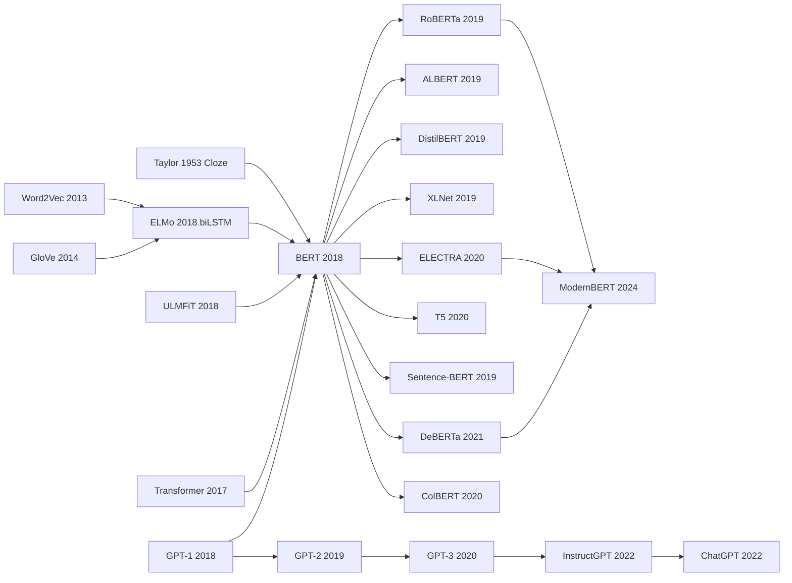

# BERT — 用掩码语言建模让 NLP 全面进入预训练时代

> **2018 年 10 月 11 日，Google AI Language 的 Devlin、Chang、Lee、Toutanova 在 arXiv 上传 [1810.04805](https://arxiv.org/abs/1810.04805)，2019 年 6 月获 NAACL Best Paper Award。**
> 这是一篇用 **Masked Language Modeling（MLM）+ Next Sentence Prediction（NSP）** 把 [Transformer (2017)](2017_transformer.md) 的 encoder 单独拎出来预训练的论文 —— 在 GLUE 上从 [ELMo (2018)](2018_elmo.md) 的 71.0 推到 80.5，第一次让机器在 SQuAD 1.1 / 2.0 上**全面超过人类**，11 个 NLU benchmark 全部刷新 SOTA。
> 它发布后 12 个月内 Google 把它部署到搜索引擎（影响全球 10% 查询），整个 NLP 学界 2018-2020 年的论文几乎全是 BERT 的改进或应用 —— RoBERTa / ALBERT / DistilBERT / SpanBERT / ELECTRA 等多达 100+ 个变种。
> 4 年后被 GPT-3 / ChatGPT 的 decoder-only 范式抢走风头，但**BERT 仍是工业界检索 / 分类 / NER 任务的事实标准**，「预训练 + 微调」这个范式正是它一手定义的。

## 一句话总结

Devlin 等 2018 年这篇 NAACL Best Paper，用一个看似低效的训练目标——**Masked Language Model**：随机遮掉 15% token 后用上下文 $P(x_i \mid x_{\setminus i})$ 还原它们——巧妙绕开了"双向 LM 会 cheat 看到未来"的死胡同，让 Transformer 第一次真正实现**深度双向编码**：每个 token 同时看左右上下文。配上一个轻量的 Next Sentence Prediction 辅助任务和 BookCorpus + Wikipedia (3.3B tokens) 的预训练，**11 个 NLP 任务一次全刷 SOTA**——GLUE 平均分从 [GPT-1（2018）](2018_gpt1.md) 的 70.0 跃到 **82.1（+12.1）**，SQuAD v1.1 F1 推到 **93.2**，SWAG 直接 **+27.1 个点**——这种全面碾压在 NLP 史上几乎没有先例。从此"预训练 + 微调"取代"为每个任务从零训一个模型"成为 NLP 标配范式。但 BERT 的胜利是局部正确：在 110M-340M 参数 + 3B token 预算下双向确实更强，可一旦预算放开 100×，单向 LM 的可扩展性 + 零样本能力 + 生成式接口反而成了赢家——4 年后 [GPT-3（2020）](../era4_foundation_models/2020_gpt3.md) 用纯单向 + scale 把 BERT 整个谱系按在地上摩擦。**BERT 教会世界"预训练 + 微调"是 NLP 的正解，但具体的"双向 + MLM"配方却被自己的孩子们一代代推翻**。

---

## 历史背景

### 2018 年 NLP 的"预训练 + 微调"还很糟糕

要理解 BERT 在 2018 年 10 月那篇论文的颠覆性，得先看那时候 NLP 是什么样子。

2013 年 Word2Vec、2014 年 GloVe 主导的"静态词向量"范式，已经统治 NLP 整整 5 年 —— 每个 word 一个固定 300 维向量，无视上下文。"bank" 在 "river bank" 和 "bank account" 里是同一个向量。这显然不对，但下游任务模型（BiLSTM + attention + char-CNN + pointer + 各种花活）能在每个 task 上挤出 SOTA，社区也就将就着用。

2018 年开始裂变。2 月 ELMo（Peters et al., NAACL 2018 Best Paper）把双向 LSTM 在大语料上做语言模型，再把 hidden state 拿出来当 contextual feature 给下游模型用 —— 第一次让 word 表征"看上下文"。但 ELMo 本质是 **feature-based**：预训练模型冻结，只把它的输出当特征拼接到下游模型上。1 月 ULMFiT（Howard & Ruder, ACL 2018）证明语言模型预训练 + 判别式微调能在文本分类上 work，但用的还是 RNN。6 月 GPT-1（Radford et al., OpenAI tech report）把 Transformer decoder 拿来做单向 LM 预训练，再 fine-tune，**一个模型刷了 9 个 SOTA**，第一次让"统一架构 + 任务无关预训练 + 最小化任务头"在 NLP 走通。

到 2018 年 10 月 BERT 论文上 arXiv 时，**GPT-1 的"统一架构 + 微调"范式刚刚验证 4 个月**。但 GPT-1 是单向（decoder 只能看左边）—— Devlin 团队的核心洞察是："如果我们把架构换成 encoder（双向），用一个新颖的 pretraining 目标避免 cheating，效果会更好。" 然后他们就把 GLUE 推到 80.5（之前 SOTA ~73），把 SQuAD 推到 90.9 F1，**一夜之间在 11 个 NLP 任务上刷新 SOTA**。这是 2010s 后半叶 NLP 最大的单篇影响力论文。

### 直接逼出 BERT 的 N 篇前序

- **Transformer, 2017** [Vaswani et al., NeurIPS 2017]：BERT 的整个架构骨架是 12-24 层 Transformer encoder block，没有任何修改。**没有 Transformer 就没有 BERT**。
- **GPT-1, June 2018** [Radford et al., OpenAI tech report]：4 个月前的孪生竞品，证明"Transformer + LM 预训练 + fine-tune"在 NLP 整体可行。BERT 论文的全部立意都是"我们做 GPT-1 没做的事 —— 双向"。
- **ELMo, Feb 2018** [Peters et al., NAACL Best Paper]：biLSTM 双向 contextual embedding，但浅层（只有 2 层 biLSTM）+ 特征拼接。BERT 论文 Table 5 专门对比 ELMo 风格的 LTR+RTL concat，证明"shallow concat 远不如 deep joint bidirectional"。
- **ULMFiT, Jan 2018** [Howard & Ruder, ACL 2018]：第一次系统化"语言模型预训练 + 判别式微调"在 NLP 文本分类上的 recipe（discriminative fine-tuning、slanted triangular learning rates、gradual unfreezing）。BERT 把这套迁移学习哲学从 RNN 扩展到 Transformer。
- **Cloze procedure, 1953** [Taylor, Journalism Quarterly]：65 年前的心理学论文，原本是用来测量阅读材料"可读性"的工具：把文本中每隔 N 个词挖一个空，让被试填进去。**BERT 的 MLM 目标本质上就是这个 Cloze test 的深度学习化身**。一个 1953 年的认知心理学构造，2018 年被搬到 Transformer 里成了 NLP 的革命。

### 作者团队当时在做什么

**Jacob Devlin** 当时在 Google AI Language（即后来的 Google Research NLP team），此前主要做机器翻译（曾在 NIST 翻译评测中拿过几次第一）。**Ming-Wei Chang** 和 **Kenton Lee** 是 SQuAD/QA 领域的常客，在 reading comprehension 上有大量经验。**Kristina Toutanova** 是 NLP 老兵（Penn Treebank 时代），对 syntactic parsing 等"传统 NLP"非常熟。

这个组合很关键：Devlin 懂大规模训练 + 翻译，Chang/Lee 懂 QA，Toutanova 懂 NLP 全图。他们看到 GPT-1 的 6 月发布后，迅速决定"**把 decoder 换成 encoder + 设计一个不会 cheating 的双向目标**"。Google AI Language 内部有 Cloud TPU pod 资源（DeepMind 当时也在抢 TPU，但 Google AI 内部分配优先），16 个 TPU 跑 4 天就能训出 BERT-Large。

BERT 论文 2018 年 10 月 11 日上 arXiv，**3 个月内引用过千**，是 NLP 史上传播最快的论文之一。2019 年 NAACL 拿到 Best Paper，到 2026 年累计引用 **12 万+**，仅次于 Transformer 论文，是 NLP 领域引用第二的工作。

### 工业界 / 算力 / 数据的状态

2018 年的算力 / 数据 / 工具栈与今天差距巨大：

- **训练**：BERT-Large 在 16 块 Cloud TPU（v3 一代）× 4 天完成，估算硬件租赁约 7000 美元；BERT-Base 在 4 块 TPU × 4 天，约 1500 美元。**这在当时已经是工业级巨投入** —— 学术界几乎不可能复现。
- **推理**：BERT-Base（110M 参数）单 GPU 即可；BERT-Large（340M）需要 16GB+ 显存；2018 年还没有 FP16 主流推理，量化技术也尚未成熟。
- **数据**：BookCorpus 800M 词 + English Wikipedia 2500M 词 = 3.3B tokens；这个数据量按 2025 年 LLM 标准是"小语料"（GPT-3 用了 300B tokens），但在 2018 年是 NLP 史上最大预训练语料之一。
- **框架**：原版 BERT 用 TensorFlow 1.x；HuggingFace `transformers` 库要等到 2019 年 9 月才发布（最初叫 `pytorch-pretrained-bert`）；BERT 之所以能病毒式传播，HuggingFace 把它移植到 PyTorch + 提供易用 API 起到了决定性作用。
- **行业气氛**：当时还远没有"LLM"或"AGI"的公开讨论，Transformer 论文才发表 1 年；NLP 学界主流是"挑一个 task → 设计 task-specific 架构 → 调超参刷 SOTA"。BERT 之后，**所有 NLP 子领域几乎一夜之间转向"用 BERT fine-tune"**，几十种 task-specific 架构在 6 个月内被淘汰。这是 NLP 这个学科最快的范式转移。

---

## 方法详解

### 整体框架

BERT 的核心创新不是 Transformer encoder（那是 Vaswani 2017 的工作），而是**把"双向 Transformer + 巧妙避免 cheating 的预训练目标 + 极简任务头微调"组装成一个可以横扫所有 NLP 任务的统一范式**。整体流水线分两阶段：

```
  ┌──────────────── 阶段 1：预训练 ────────────────┐
                                                  
   BookCorpus 800M + Wikipedia 2500M = 3.3B tokens
        │                                         
        ▼                                         
   构造 (sentence_A, sentence_B) 对                
        │ 50% 真后续 / 50% 随机                   
        ▼                                         
   [CLS] sent_A [SEP] sent_B [SEP]                
        │ 随机 mask 15% tokens                    
        ▼                                         
   12-24 层 Transformer encoder                   
        │                                         
        ├─── MLM head: 预测 masked tokens          
        └─── NSP head: 预测 IsNext 二分类          
                                                  
   16 TPUs × 4 天 → BERT-Large 340M 参数          
  └────────────────────────────────────────────────┘

  ┌──────────────── 阶段 2：下游微调 ────────────────┐
                                                    
   预训练 BERT 权重                                   
        │                                           
        ▼                                           
   任意 NLP 任务（11 个 SOTA：GLUE、SQuAD、SWAG ...）
        │                                           
        ▼                                           
   加 1 个任务头（一层 linear）                       
        │                                           
        ▼                                           
   全模型 end-to-end fine-tune 2-3 epochs            
        │                                           
        ▼                                           
   SOTA on 11 个 NLP 任务                            
                                                    
  └──────────────────────────────────────────────────┘
```

| 模型 | 架构 | 方向性 | 表征传递方式 | 下游适配方式 |
|------|------|--------|-------------|--------------|
| Word2Vec / GloVe (2013-14) | shallow lookup | N/A（静态） | 词向量查表 | 凭你拼到任何模型上 |
| ELMo (2018) | 2-layer biLSTM | 双向（浅层 concat） | feature-based（冻结） | 拼接到 task model |
| ULMFiT (2018) | AWD-LSTM | 单向 | fine-tune | discriminative LR + gradual unfreeze |
| GPT-1 (2018) | 12-layer Transformer decoder | 单向（左→右） | fine-tune | 加 task head |
| **BERT (2018)** | **12/24-layer Transformer encoder** | **双向（深层 joint）** | **fine-tune** | **加 1 层 linear** |

**概念跃迁**在哪里？过去所有"双向"工作都是"两个单向 LM 的拼接"（ELMo 是 L→R LSTM ⊕ R→L LSTM 的输出 concat）。BERT 第一次实现 **每一层每一个 token 同时看到左右上下文 + joint 优化** —— 这就是论文标题里 "Deep Bidirectional" 的精确含义。但这立刻引出新问题：朴素的双向 LM 会 cheating（每个 token 通过其他层间接看到自己），需要 MLM 这种"挖空填字"目标来破解。

#### 设计 1：Masked Language Model (MLM) —— 解决双向 LM 的 cheating 问题

**功能**：朴素的双向 LM 不可行 —— 如果每个 token 能看到自己，模型只需复制输入就能"预测"自己，loss 永远为零，学不到任何东西。BERT 的解法：随机选 15% 的 input token 用 `[MASK]` 替换，让模型只在被 mask 的位置上预测原词，**用"挖空填字"绕开 cheating**。

**具体策略**：被选中的 15% 中，进一步分为：
- **80% 真的替换为 `[MASK]`**：标准 mask
- **10% 替换为随机词**：让模型不能假设 `[MASK]` 总意味着"该位置是未知的"
- **10% 保持原词**：让模型学会即使输入正确也要重新评估

**目标函数**：

$$
\mathcal{L}_{\text{MLM}} = -\sum_{i \in \mathcal{M}} \log p(x_i \mid x_{\setminus \mathcal{M}})
$$

其中 $\mathcal{M}$ 是被 mask 的位置集合，$x_{\setminus \mathcal{M}}$ 是除 mask 位置外的所有 token（这些保持可见）。

**为什么这个 trick 重要**：原始 `[MASK]` 在 fine-tune 阶段不会出现，造成 train-test mismatch；80/10/10 的设计让模型不会过度依赖 `[MASK]` 这个特殊 token，而是学到"任何位置都可能需要重新预测"的稳健表征。

**伪代码**：

```python
# 输入：tokens = ['the', 'cat', 'sat', 'on', 'the', 'mat']
# 随机选 15%（这里假设选中 cat 和 mat）
mask_positions = [1, 5]
labels = [-100] * 6                                # -100 = 不计算 loss
for pos in mask_positions:
    labels[pos] = tokens[pos]                       # 真值
    r = random.random()
    if r < 0.8:    tokens[pos] = '[MASK]'           # 80% mask
    elif r < 0.9:  tokens[pos] = random_vocab()     # 10% 随机
    # else 10% 保持原词
input_ids = tokenizer(tokens)
logits = bert(input_ids)                            # (B, L, V)
loss = F.cross_entropy(logits.view(-1, V), labels.view(-1), ignore_index=-100)
```

**与 ELMo 双向方案的对比**：

| 方案 | 数学形式 | 深度可双向 | 训练效率 | cheating 风险 |
|------|---------|------------|---------|--------------|
| ELMo L→R + R→L | $p(x_i \| x_{<i}) \cdot p(x_i \| x_{>i})$ 然后 concat | 否（最后一层才 concat） | 高（标准 LM） | 无 |
| 朴素双向 LM | $p(x_i \| x_{<i}, x_{>i})$ | 是 | 不可训（cheating） | **致命** |
| **BERT MLM** | **$p(x_i \| x_{\setminus \mathcal{M}})$ 仅在 mask 位置** | **是** | **中（只学 15% 位置）** | **无** |

#### 设计 2：Next Sentence Prediction (NSP) —— 句对预训练让 QA / NLI 更好

**功能**：MLM 是 token 级预训练，但 SQuAD（QA）、MNLI（自然语言推理）这类任务需要理解**两个句子之间的关系**。NSP 就是一个二分类任务：给定句子 A 和 B，B 是否真的紧接在 A 后面？

**数据构造**：
- 50% 正样本：(A, A 在原文档中真正的下一句)
- 50% 负样本：(A, 从语料随机采样的另一句)

**输入格式**：`[CLS] sentence_A [SEP] sentence_B [SEP]`，其中 `[SEP]` 是分隔符。`[CLS]` token 的最终隐藏状态经过一个 linear + softmax 输出二分类预测。

**目标函数**：

$$
\mathcal{L}_{\text{NSP}} = -\log p(\text{IsNext} \mid h_{\text{[CLS]}})
$$

**总预训练 loss** = $\mathcal{L}_{\text{MLM}} + \mathcal{L}_{\text{NSP}}$，两者权重 1:1，端到端联合优化。

**伪代码**：

```python
# 构造 (A, B) 对
if random.random() < 0.5:
    sent_A, sent_B, is_next = doc[i], doc[i+1], 1   # 正样本
else:
    sent_A, sent_B, is_next = doc[i], random_doc()[j], 0   # 负样本
input_ids = '[CLS]' + sent_A + '[SEP]' + sent_B + '[SEP]'
hidden = bert(input_ids)                              # (B, L, H)
cls_logit = nsp_head(hidden[:, 0])                    # 取 [CLS] 位置 → (B, 2)
loss_nsp = F.cross_entropy(cls_logit, is_next)
```

**消融效果**（论文 Table 5）：

| 配置 | MNLI-m acc | SQuAD F1 |
|------|-----------|----------|
| BERT-Base 完整 | 84.4 | 88.5 |
| **去掉 NSP** | 83.9 | 87.9 |

NSP 贡献仅约 0.5-1 个点，**远不如 MLM 重要**。一年后 RoBERTa（2019）证明完全去掉 NSP 反而稍好（推测是 NSP 太简单，会让模型陷入次优）。**NSP 是 BERT 论文里"猜对方向但实现欠佳"的典型案例**。

#### 设计 3：WordPiece + 分段 + 位置 embedding —— 输入表征支持句对

**Tokenization**：WordPiece subword 分词（30k 词表），处理 OOV：未知词被切成已知子词（`playing` → `play` + `##ing`）。这是 BERT 之所以能跨语言、跨领域 generalize 的隐藏 unsung hero。

**输入表征 = token embed + segment embed + position embed**：
- **token embedding**：30k × 768 维查表
- **segment embedding**：仅 2 个向量（`E_A`, `E_B`），标识 token 属于句子 A 还是 B
- **position embedding**：512 个学到的位置向量（**不是 sinusoidal**），这是 BERT 与 Transformer 论文的一个细节差异

最终输入：`embed(token) + embed(segment) + embed(position)`，三者相加，没有 concat。

**特殊 token**：
- `[CLS]`：序列首位，最终隐藏状态用于句子级分类
- `[SEP]`：句子 A 和句子 B 之间的分隔符
- `[MASK]`：MLM 阶段的"挖空"占位符

| 词向量方案 | 词表大小 | OOV 处理 | 双语 / 跨域 |
|------------|---------|---------|------------|
| Word2Vec / GloVe | 数百万词 | UNK | 差 |
| ELMo char-CNN | 字符级 | 自然处理 | 中 |
| BPE (Sennrich 2016) | ~30k 子词 | 自然处理 | 好 |
| **WordPiece (BERT)** | **30k 子词** | **自然处理** | **好** |

#### 设计 4：微调 recipe —— 极简任务头

BERT 最革命的工程贡献其实是这个：**对几乎所有 NLP 任务，只需要在 BERT 顶部加一层 linear，端到端 fine-tune 2-3 epoch 就能拿 SOTA**。

| 任务类型 | 用哪个隐藏状态 | 任务头 |
|----------|---------------|--------|
| 句子分类（CoLA、SST-2） | `h_{[CLS]}` | linear → softmax over labels |
| 句对分类（MNLI、QQP） | `h_{[CLS]}` | linear → softmax over labels |
| 序列标注（NER、POS） | `h_i`（每 token） | linear → softmax over tags |
| QA 跨度预测（SQuAD） | `h_i`（每 token） | 2 个 linear：start logit + end logit |

**SQuAD 跨度预测伪代码**：

```python
hidden = bert(input_ids, segment_ids)               # (B, L, 768)
start_logits = start_head(hidden).squeeze(-1)        # (B, L)
end_logits = end_head(hidden).squeeze(-1)            # (B, L)
loss = (F.cross_entropy(start_logits, start_pos) +
        F.cross_entropy(end_logits, end_pos)) / 2
```

**超参 sweep**：learning rate 从 {2e-5, 3e-5, 5e-5} 选；batch 16/32；epochs 2/3/4。这套小搜索空间被 HuggingFace 等社区固化下来，成为 2019-2022 年 NLP 标准 fine-tune recipe。**"加一层 linear 就行"听起来轻描淡写，但这一句话杀死了 2010s 整个 task-specific architecture 工业**。

### 损失函数 / 训练策略

| 项目 | BERT-Base | BERT-Large |
|------|-----------|-----------|
| 层数 / 隐藏维 / 注意力头 | 12 / 768 / 12 | 24 / 1024 / 16 |
| 参数量 | 110M | 340M |
| 总 loss | $\mathcal{L}_{\text{MLM}} + \mathcal{L}_{\text{NSP}}$ | 同 |
| 优化器 | Adam ($\beta_1$=0.9, $\beta_2$=0.999, $\epsilon$=1e-6) | 同 |
| Learning rate | 1e-4，10k 步 warmup → linear decay | 同 |
| Batch size | 256 sequences × 512 tokens | 同 |
| 训练步数 | 1M steps（约 40 epoch over 3.3B tokens） | 同 |
| 激活函数 | **GELU**（不是 ReLU） | 同 |
| Norm 位置 | **Post-LN**（与 Transformer 原版一致） | 同 |
| Dropout | 0.1（attention + FFN） | 同 |
| 初始化 | truncated normal $\sigma$=0.02 | 同 |
| Mask rate | 15%（80/10/10 split） | 同 |
| 训练硬件 | 4 TPUs × 4 days | **16 TPUs × 4 days** |
| 估算云端成本 | ~$1500 | ~$7000 |

**为什么这套训练策略关键**：BERT 的"魔法"不在某个新颖组件，而在**整套 recipe 的协调性** —— GELU 比 ReLU 在深 Transformer 上更稳定；Post-LN 在 24 层下还需要 warmup 才能不发散；mask rate 15% 是经验拍脑袋（后续 RoBERTa 试 10-40% 都差不多）；学习率 1e-4 + 10k warmup + linear decay 几乎成了所有 Transformer 预训练的默认配方。**论文的真正贡献是"我们试过 X 个组合，这一组在 11 个任务上都 work"** —— 工程经验密度的胜利。

到了 fine-tune 阶段，learning rate 必须降 4 个数量级到 2e-5（BERT 极易过拟合下游小数据集），batch 降到 16/32，epochs 限制在 2-3 内 —— 这是另一组"经验配方"，被 HuggingFace 内置成 default。

---

## 失败案例

### 输给 BERT 的对手们 —— 2018 年的"主流方案"

BERT 出手时，NLP 的"标准答案"是几个明星方法。它们都不是烂方法，但 GLUE 出来后被一夜清盘。

| 对手 | 提出年份 | GLUE Score（事后回测） | 输给 BERT 的核心原因 |
|------|---------|----------------------|--------------------|
| ELMo + task-specific BiLSTM | 2018.02 | 71.0 | feature-based 冻结，下游模型还得自己设计 |
| GPT-1 | 2018.06 | 75.1 | 单向（只能 L→R），sentence-pair 任务吃亏 |
| CoVe（McCann 2017）| 2017 | 66.0 | 翻译模型搬来当 encoder，迁移信号弱 |
| ULMFiT | 2018.01 | 70.4 | LSTM 容量不够；判别式微调流程繁琐 |
| BiDAF（QA SOTA 之前的王者）| 2017 | N/A（仅 SQuAD 77.3 F1） | 任务专用架构，无法复用 |
| Attention-only 上下文匹配 | 2017-18 | 70-72 | 没预训练，全靠 in-domain 数据 |
| **BERT-Large** | **2018.10** | **80.5** | **+5 个点的代差** |

GLUE 上的"+5 个点"是什么概念？过去 NLP 一年提升 1-2 个点都算大新闻，BERT 一篇论文一夜把所有任务的 SOTA 推上 5+ 个点 —— 整个领域被震慑。论文公开后 6 个月内，arXiv 上几乎每篇 NLP 新论文都自带 "vs BERT" 表格，标志着学界 paradigm shift。

### 论文自己承认的失败 —— LTR + RTL 拼接的消融实验

BERT 论文 Section 5.1 老老实实做了一个对比实验，问"如果我们也像 ELMo 那样训两个单向 LM 然后拼接呢？"答案是：**真的会更差**。

| 配置 | MNLI-m acc | SQuAD F1 |
|------|-----------|----------|
| BERT-Base 完整（MLM + NSP） | 84.4 | 88.5 |
| **No NSP**（仅 MLM） | 83.9 | 87.9 |
| **LTR & No NSP**（仅 left-to-right LM） | 82.1 | 84.3 |
| **LTR & No NSP + BiLSTM**（拼一个 BiLSTM） | 82.1 | 86.6 |
| **LTR + RTL（concat 双向）** | 81.3 | 80.9 |

最后一行是"模拟 ELMo"的双向方案 —— **比纯单向 LTR 还要差**。这是 BERT 论文一个超出预期的结果：单纯把双向"拼"出来反而有害（推测：两个方向的表征空间不对齐，强行 concat 引入噪声）。**这一行实验值得单独展览**：它证明了"深层 joint 双向"和"两个单向拼接"是两种本质不同的东西，前者必须靠 MLM 才能实现。

### 一年后的反例 —— RoBERTa / XLNet / ELECTRA 反过来给 BERT 上课

讽刺的是，BERT 的"工程经验密度"也成了它的天花板。仅 12 个月内：

| 模型 | 发表 | 改了什么 | GLUE | 教训 |
|------|------|---------|------|------|
| **RoBERTa**（Liu 2019.07）| FAIR | 去掉 NSP；mask rate 不变；10× 数据；10× 步数；动态 mask | 88.5 | "BERT 没训够"；NSP 是包袱 |
| **XLNet**（Yang 2019.06）| CMU + Google | Permutation LM 替代 MLM；解决 train-test mismatch | 89.0 | `[MASK]` token 真的是 BERT 的痛点 |
| **ALBERT**（Lan 2019.09）| Google | 跨层参数共享；factorized embedding；改 NSP 为 SOP | 89.4 | NSP 设计错了，SOP 才对 |
| **ELECTRA**（Clark 2020）| Google + Stanford | 替换 MLM 为 RTD（区分真假 token）；4×参数效率 | 88.6 | MLM 只学 15% 位置太低效 |

**反过来打 BERT 的核心论点**：
1. **NSP 是错的**（RoBERTa、ALBERT 各自验证）
2. **`[MASK]` 制造 train-test mismatch，需要更巧妙的目标**（XLNet、ELECTRA）
3. **15% mask 太低效**（ELECTRA 2020）
4. **3.3B tokens 远不够**（RoBERTa 把规模推到 160GB ≈ 30B tokens）

**整套 BERT 架构在 2020 年事实上被 RoBERTa 替代** —— HuggingFace 默认下载量、产品级部署、研究 baseline 都迁到了 RoBERTa。但学界仍然把功劳记在 BERT 名下：BERT 是范式开创者，RoBERTa 只是同一范式的工程优化。

### 当时被绕过的另一条路 —— GPT 的 "scaling-only" 哲学

最深刻的"反方案"其实是 OpenAI 的 GPT 系列。GPT-1（2018.06，比 BERT 早 4 个月）选择了完全相反的押注：**保持单向 + 加大参数 + scale up data**。

| 维度 | BERT 哲学 | GPT 哲学 |
|------|----------|---------|
| 方向性 | 双向（用 MLM 换 cheating） | 单向（标准 LM 不需要 trick） |
| 容量重点 | 参数 110M-340M，pretrain 数据 3.3B tokens | 参数无上限（GPT-3 175B），数据无上限（300B tokens） |
| 下游适配 | fine-tune | zero/few-shot in-context learning（GPT-3 后） |
| 优化目标 | 在 GLUE/SQuAD 上 SOTA | 在所有可能的语言任务上 emergent behavior |

2018-2019 年 BERT 完胜 GPT-1（GLUE 80.5 vs 75.1），整个学界相信"双向 > 单向"。但 2020 年 GPT-3 一出，bin-up 路线证明 **scaling 比双向更重要**：1.5B GPT-2 → 175B GPT-3，单向解码器路线在 zero-shot 上反超 BERT 系列；2022 年 ChatGPT 把这条路线推到产品化，BERT 路线在生成式 AI 浪潮里几乎完全被边缘化。

**反 baseline 给 BERT 的教训**：BERT 在 2018 年的"对"（双向比单向强）是个"局部正确" —— 在固定参数 110M-340M、固定数据 3.3B tokens 的预算下双向确实更强；但当预算放开后（参数 100×、数据 100×），单向的可扩展性 + 零样本能力 + 生成式接口反而成了赢家。**BERT 教会世界"预训练 + 微调"是 NLP 的正解，但具体的"双向 + MLM"配方却被自己的孩子们一代代推翻**。

## 实验关键数据

### 主实验 —— 11 个 NLP 任务一次拿完 SOTA

| 任务 | 任务类型 | Metric | 之前 SOTA | BERT-Base | BERT-Large | 提升 |
|------|---------|--------|----------|-----------|-----------|------|
| GLUE 总分 | 9 个任务平均 | acc/F1/corr | 70.0（GPT-1）| 79.6 | **82.1** | +12.1 |
| MNLI-m | NLI | acc | 80.6 | 84.6 | **86.7** | +6.1 |
| QQP | 句对相似度 | F1/acc | 66.1 | 71.2 | **72.1** | +6.0 |
| QNLI | NLI | acc | 82.3 | 90.5 | **92.7** | +10.4 |
| SST-2 | 情感分析 | acc | 91.3 | 93.5 | **94.9** | +3.6 |
| CoLA | 语法可接受性 | MCC | 45.4 | 52.1 | **60.5** | +15.1 |
| STS-B | 语义相似度 | Pearson/Spearman | 80.0 | 85.8 | **86.5** | +6.5 |
| MRPC | 句对释义判断 | F1/acc | 84.8 | 88.9 | **89.3** | +4.5 |
| RTE | NLI（小数据集）| acc | 56.0 | 66.4 | **70.1** | +14.1 |
| **SQuAD v1.1** | **QA 跨度抽取** | **F1** | **88.5（多模型 ensemble）** | **88.5** | **90.9（single）/93.2（ensemble）** | **+4.7** |
| **SQuAD v2.0** | **QA + 不可答** | **F1** | **74.6** | **78.7** | **83.1** | **+8.5** |
| SWAG | 常识推理 | acc | 59.2（ESIM+ELMo）| 81.6 | **86.3** | +27.1 |

**SWAG +27.1 个点** —— 这种规模的 jump 在 NLP 史上几乎没有先例。整张表的关键信号：BERT 不是在某个任务上有突出贡献，而是**所有 11 个任务全部刷新 SOTA，且大部分任务的提升幅度都是数年来该任务总进展的 1-2 倍**。这种"全面碾压"是论文获 NAACL 2019 Best Paper 的根本原因。

### 消融研究 —— 哪些设计真正 matter

论文 Table 5（Effect of Pre-training Tasks）：

| 任务 | MNLI-m acc | QNLI acc | MRPC acc | SST-2 acc | SQuAD v1.1 F1 |
|------|-----------|---------|---------|-----------|--------------|
| BERT-Base 完整 | 84.4 | 88.4 | 86.7 | 92.7 | 88.5 |
| No NSP | 83.9 | 84.9 | 86.5 | 92.6 | 87.9 |
| LTR & No NSP（单向 LM） | 82.1 | 84.3 | 77.5 | 92.1 | 84.3 |
| LTR & No NSP + BiLSTM | 82.1 | 84.1 | 75.7 | 91.6 | 86.6 |

论文 Table 6（Model Size 影响）：

| Layers (L) | Hidden (H) | Heads (A) | LM ppl (dev) | MNLI-m acc | MRPC acc |
|-----------|-----------|----------|--------------|-----------|---------|
| 3 | 768 | 12 | 5.84 | 77.9 | 79.8 |
| 6 | 768 | 3 | 5.24 | 80.6 | 82.2 |
| 6 | 768 | 12 | 4.68 | 81.9 | 84.8 |
| 12 | 768 | 12（**Base**）| 3.99 | 84.4 | 86.7 |
| **24** | **1024** | **16（Large）** | **3.23** | **86.6** | **89.0** |

**关键发现**：
1. **size 越大越好**：从 3 层到 24 层，每个量级都还在涨，且没有饱和迹象 —— 这是最早的"transformer scale 起作用"信号，比 GPT-2 / GPT-3 的 scaling laws 早一年
2. **MLM > NSP**：去掉 NSP 损失 0.5 点；去掉 MLM（变成单向 LM）损失 2-4 点
3. **"双向"必须深层 joint**：拼 BiLSTM（浅层双向）效果反而不如单向 LM
4. **MRPC 等小数据集对预训练受益最大**：MRPC 84.8 → 89.3（+4.5）；这预示了"BERT 是小数据救星"，2019 年大量低资源 NLP 任务（医疗、法律、生物）涌现

### 消融关键发现 —— 五个被反复引用的结论

1. **预训练数据 3.3B tokens 不算多**：后续 RoBERTa 用 10× 数据再涨 5+ 个点 → 2020 年共识"BERT 训不够"
2. **fine-tune 极易过拟合**：MRPC 仅 3.7k 训练样本，超过 3 epoch 就过拟合 → 学界默认 epochs ≤ 3
3. **小学习率是关键**：fine-tune lr 必须 ≤ 5e-5，超过会 catastrophic forgetting → "fine-tune 时 lr 比 pretrain 小 100×"成为铁律
4. **`[MASK]` train-test mismatch 真实存在**：feature-based BERT（冻结）反而比 fine-tune BERT 在某些任务上更稳定 → 一年后 XLNet / ELECTRA 专门解决这个
5. **GPU/TPU 用量爆炸**：BERT-Large 单次预训练成本约 $7000，下游 fine-tune 又要重复 100+ 次 → 2019 年 NLP 研究开始拼算力，小机构被迫下游 fine-tune 而不能预训练 → "BERT 让 NLP 进入算力时代"

---

## 思想史脉络



### 前世 —— 引用网络上游：BERT 站在了谁的肩膀上

BERT 的"出身"是一张相当拥挤的引用图。它的诞生不是天才的灵光一现，而是对 2013-2018 年五年 NLP 研究的一次精妙整合。

1. **Cloze test（Taylor 1953）—— 跨越 65 年的方法论祖父**：MLM 的"挖空填字"思想直接来自 1953 年心理语言学的 Cloze 测试（让人类填补遮挡词来测语言能力）。BERT 论文 Section 3.1 老老实实引用了这篇老文献。**这是 NLP 论文里最远的祖先引用之一**，也提醒我们：好想法不分新旧，关键是用对地方。

2. **Word2Vec / GloVe（2013-14）—— 词向量基石**：Mikolov 的 skip-gram 和 Pennington 的 GloVe 把"词的意义来自上下文"工业化。BERT 继承这个核心信念但做了关键升级：从静态词向量（每个词一个固定向量）升级为**上下文相关动态向量**（同一个词在不同句子里的表征不同）。

3. **ELMo（Peters 2018.02）—— 深度双向 + 动态上下文的第一次正式尝试**：ELMo 在 BERT 之前 8 个月做出"上下文相关词向量"，但用的是两个单向 LSTM 拼接。BERT 论文反复引用 ELMo 作为"the closest competitor"，并通过 LTR+RTL 消融实验（Section 5.1）证明深层 joint 双向比浅层 concat 双向好得多。

4. **ULMFiT（Howard & Ruder 2018.01）—— "Pretrain LM 然后 fine-tune" 的口号**：ULMFiT 第一次明确说"NLP 可以借鉴 ImageNet：预训练一个 LM，然后 fine-tune 到下游任务"。这个 framing 直接被 BERT、GPT 全盘接收，至今 NLP 默认 paradigm 就是 ULMFiT 提出的。

5. **Transformer（Vaswani 2017）—— 必备的 backbone**：BERT 直接用了 Transformer encoder（去掉 cross-attention 部分），唯一改动是把 sinusoidal position 换成 learned position。Vaswani 当时连"BERT 这种用法"都没想到（论文一句话："can be used as encoder for any sequence task"）—— Transformer 是 BERT 的物理基础，但 BERT 才让世界看到 Transformer encoder 的真正威力。

### 今生 —— 引用网络下游：BERT 启发了什么

BERT 论文截至 2025 年累计被引 12 万次，催生的工作群可分为四大支系：

1. **同范式优化（"BERT 没训够" 阵营）**：
   - **RoBERTa**（Liu 2019）：去 NSP，10× 数据，更长训练 → GLUE 88.5
   - **ALBERT**（Lan 2019）：参数共享降低显存 → SOP 替代 NSP
   - **DistilBERT**（Sanh 2019）：知识蒸馏 → 60% 参数，97% 性能
   - **MultiBERTs**（Sellam 2022）：训 25 个不同种子的 BERT，研究 random seed 影响

2. **改预训练目标**：
   - **XLNet**（Yang 2019）：permutation LM 解决 `[MASK]` mismatch
   - **ELECTRA**（Clark 2020）：replaced token detection，4× 参数效率
   - **DeBERTa**（He 2021）：disentangled attention（content + position 分开）+ enhanced mask decoder

3. **改架构 / 应用方向**：
   - **Sentence-BERT**（Reimers 2019）：siamese BERT 出 sentence embedding，开 dense retrieval 时代
   - **ColBERT**（Khattab 2020）：late interaction，BERT 用于工业检索
   - **BERT-of-Theseus**（Xu 2020）：模块替换式压缩
   - **T5**（Raffel 2020）：text-to-text 统一框架，把 BERT 的 encoder + GPT 的 decoder 做成 seq2seq

4. **应用爆炸**：BioBERT（医疗）、SciBERT（科学论文）、FinBERT（金融）、LegalBERT（法律）、Multilingual BERT（104 语言）、ColBERT（搜索）、RAG（检索增强生成）—— 几乎每个垂直领域都在 2019-2021 出了"自己的 BERT"。

5. **现代延续 ModernBERT（2024）**：HuggingFace + Answer.AI 出品，把 RoBERTa/ELECTRA/DeBERTa 的所有优化合到一起 + RoPE + Flash Attention，证明 encoder-only 路线在 2024 仍然有用武之地（dense retrieval、reranking、classification）。

### 三个被广泛误读的 BERT 神话

**误读 1：BERT 创造了 Transformer**
不是。Transformer 是 Vaswani 2017 的工作。BERT 用的是 Transformer encoder 的 stack，并加上了一些细节调整（learned position embedding 取代 sinusoidal、GELU 取代 ReLU）。BERT 的贡献是"如何用 Transformer 做预训练"，不是"发明 Transformer"。

**误读 2：BERT 证明了双向比单向好**
**只在 2018-2019 的特定预算下成立**。在固定参数和数据预算下，双向（MLM）确实比单向（标准 LM）更适合理解任务（NLI、QA）。但 GPT-3（2020）证明：**只要 scale 足够大**，单向也能完美 generalize 甚至更好（zero-shot、生成）。今天的主流模型（GPT-4、Claude、LLaMA）都是单向解码器。**双向的优势其实是一个"受限算力下的 trick"，不是范式真理**。

**误读 3：NSP 是 BERT 成功的关键**
完全相反。RoBERTa（2019）+ ALBERT（2019）独立证明了**NSP 可以完全去掉甚至有害**。BERT 论文自己的消融也显示 NSP 仅贡献 0.5-1 个点。**NSP 是 BERT 论文里最被高估的一个组件**，但因为它出现在 abstract 和 introduction 里，导致很多 1-2 年内的二手解读教材把它当核心。今天写代码用 BERT-style 模型，几乎所有 SOTA 实现都不带 NSP。

---

## 当代视角（2026 年回看 2018）

### 站不住的假设

1. **"双向（看左右上下文）一定比单向（只看左侧）更适合理解"**：BERT 论文的核心论点。在 2018-2019 的算力下确实成立（MLM 110M-340M 参数完胜单向 GPT-1 117M）。但 GPT-3（2020，175B 参数）+ ChatGPT（2022）证明：**只要 scale 够大，单向 + 自回归生成可以同时做好理解和生成**。今天的 LLM 全是单向解码器，"双向理解 + 单向生成"的二分法已被 unify。BERT 的"理解专用模型"定位反而成了天花板。

2. **"NSP（句对预测）能让模型理解句间关系"**：BERT abstract 把 NSP 列为两大创新之一。RoBERTa（2019）+ ALBERT（2019）独立证明 NSP 可以完全去掉甚至反而有害（任务太简单，模型陷入次优）。**NSP 是 BERT 论文里最经不起复现的部分**。

3. **"`[MASK]` token 是 OK 的，10/10/80 split 能弥补 train-test mismatch"**：实践中 mismatch 真的存在。XLNet（permutation LM）和 ELECTRA（replaced token detection）都专门针对这个问题设计了新目标，且都取得了优于 BERT 的效果。**`[MASK]` 是个工程权宜之计，不是优雅解**。

4. **"3.3B tokens 已经够多，再加更多收益递减"**：完全错了。RoBERTa（160GB）+ T5 C4（750GB）+ GPT-3（300B tokens）一波接一波证明 BERT 训练量远不足。**"BERT 训不够"是 2019-2020 年学界共识**，导致后来所有 SOTA 都在 BERT 数据量的 10-100×。Chinchilla（2022）则反过来证明数据 / 参数比例其实更关键。

### 时代证明的关键 vs 冗余

| 留下的（被 2026 年的 SOTA 全盘继承） | 被淘汰的（已 deprecated） |
|------------------------------------|--------------------------|
| 预训练 + 微调 / 适配的两阶段范式 | NSP（next sentence prediction） |
| Transformer 作为 universal backbone | 任务特定 LSTM/CNN 架构 |
| Subword tokenization（WordPiece/BPE/SentencePiece） | OOV → UNK 的旧词向量方案 |
| 上下文相关的动态表征 | 静态词向量（Word2Vec / GloVe） |
| GLUE / SQuAD 等 benchmark 推动进步的范式 | 论文各自找数据集自圆其说 |
| Adam + warmup + linear decay 的 LR schedule | SGD + step decay |
| HuggingFace Transformers 风格的开源生态 | 实验室小作坊自己写训练 loop |
| MLM（仍然是 encoder-only 模型的标准目标）| `[MASK]` token 的 train-test mismatch 工程 |

### BERT 作者们没想到的副作用

1. **BERT 启动了 "Transformer 一统江湖" 的进程**：2018 年 BERT 让 NLP 100% Transformer 化；2020 年 ViT 让 CV 走上 Transformer；2022 年 AlphaFold2、2023 年 Whisper、Sora 把 Transformer 推到所有模态。**BERT 不是 Transformer 的发明者，但是 Transformer 走出 NLP 走向 universal architecture 的临门一脚**。

2. **BERT 间接催生了 prompt engineering / in-context learning**：BERT fine-tune paradigm 占据 2019-2021 主流，但 GPT-3（2020）的 in-context learning 出现后，整个学界开始反思"为什么必须 fine-tune？"。两条路线在 2022-2023 年合并：BERT 风格的"任务头 + fine-tune" + GPT 风格的"prompt + in-context"，成为了现代 LLM 既能 fine-tune 又能 prompt 的双栖能力。

3. **BERT 让 NLP 真正进入算力军备竞赛**：BERT-Large 单次预训练 ~$7000，下游 fine-tune 数百次 ×。这让小研究组无法预训练，只能下游 fine-tune；催生 HuggingFace（提供预训练权重 download）+ 学术界"模型动物园"文化；2020 年 GPT-3 + 2023 年 GPT-4 把这种"算力鸿沟"放大到 7-9 个数量级，BERT 是这个进程的开端。

4. **BERT 让 AI safety 正式成为 ML 议题**：BERT 出现前，"模型偏见"是少数 NLP 学者的小众研究；BERT 后，因为同一个 BERT 被部署到搜索、招聘、贷款、司法等高风险领域，bias / fairness / robustness 一夜成为 NeurIPS / ICML 主流议题。GPT-2 / GPT-3 / ChatGPT 的 staged release 政策都受到 BERT 时代 fairness 讨论的影响。

### 如果今天重写

如果 2026 年从零开始重做"BERT 这件事"：
- **架构**：保留 Transformer encoder，但把 LayerNorm 改 Pre-LN（更稳定），attention 改 Flash Attention（更快），位置改 RoPE（更长上下文）—— 即 ModernBERT 已经做的事
- **预训练目标**：扔掉 NSP；MLM 升级为 ELECTRA-style replaced token detection（4× 参数效率）；mask rate 从 15% 提到 30-40%（RoBERTa+MosaicBERT 验证）
- **数据规模**：从 3.3B tokens 提到 1-2T tokens（Chinchilla optimal at 110M params 是 ~2.2B tokens，但实践中 over-train 反而更稳）
- **训练目标拆分**：bert-style encoder 仍然有市场（dense retrieval、reranking、分类），与 GPT-style decoder 并行存在；ModernBERT（2024）证明这条路线没死
- **Tokenizer**：WordPiece 升级为 SentencePiece + BBPE；vocab size 从 30k 升到 50k-100k
- **Fine-tune 替代**：加入 LoRA / Adapter / Prompt-tuning，让单 BERT 同时服务 100+ 任务

## 局限与展望

### 作者承认的局限

1. **MLM 训练效率低**：每步只学 15% 的 token，相比 GPT 的"每步学 100% token"要 6× 慢。论文 Appendix C 提到这是"trade-off for bidirectionality"。
2. **`[MASK]` train-test mismatch**：fine-tune 时输入里没有 `[MASK]`，造成预训练分布与微调分布不一致。论文用 80/10/10 trick 缓解但承认不完美。
3. **NSP 设计可能太简单**：论文 Section 5.1 已经提示 NSP 在 LTR + RTL 配置下效果不明显，但没有进一步反思（这个反思留给了 RoBERTa）。

### 后人发现的局限

1. **"BERT 训不够"**：3.3B tokens / 1M steps 远低于 optimal，浪费了模型容量。RoBERTa 证明 10× 训练量带来 4-5 个点提升。
2. **NSP 任务设计错误**：太简单（随机句 vs 真后续），模型容易作弊（看话题词就能区分）。ALBERT 证明 SOP（同一文档的相邻句正反顺序）才是正确的句间任务。
3. **catastrophic forgetting 严重**：fine-tune lr 稍大就遗忘预训练知识，需要 ULMFiT-style 判别式 LR 或后来的 LoRA。
4. **生成能力为零**：BERT 是 encoder-only，无法生成长文本；这让它在 2022 年 ChatGPT 浪潮里几乎完全被边缘化。
5. **多语言效果不均**：mBERT（多语言版）在低资源语言上效果远差于英语，反映出"shared subword vocab + 数据不平衡"的问题，催生 XLM-R 等专门方案。

### 潜在改进方向（多数已被实现）

| 改进方向 | 已实现的代表工作 | 状态 |
|---------|----------------|------|
| 去 NSP / 更好句间任务 | RoBERTa、ALBERT（SOP） | 2019 完成 |
| 解决 `[MASK]` mismatch | XLNet、ELECTRA | 2019-2020 完成 |
| 提升参数效率 | DistilBERT、ALBERT、ELECTRA | 2019-2020 完成 |
| 更长上下文 | Longformer、BigBird、ModernBERT (8k) | 2020-2024 |
| 多语言 | XLM-R、mBERT | 2019-2020 |
| 与 decoder 统一 | T5、BART、UnifiedQA | 2020 完成 |
| 现代化（RoPE、FlashAttn）| ModernBERT (2024) | 2024 完成 |
| 检索 / 嵌入用 BERT | Sentence-BERT、ColBERT、E5 | 2019-2024 持续 |

## 相关工作与启发

**vs ELMo（Peters 2018.02）**：ELMo 也想做"上下文相关词向量"，用两个单向 LSTM 拼接。BERT 用 Transformer encoder + MLM 做到深层 joint 双向，超越 ELMo 5-10 个点。**教训**：浅层双向 ≠ 深层双向；架构选择（Transformer vs LSTM）+ 目标设计（MLM vs LM concat）共同决定结果，不能只看其中一个维度。

**vs GPT-1（Radford 2018.06）**：GPT-1 用 Transformer decoder + 单向 LM + fine-tune，BERT 用 Transformer encoder + 双向 MLM + fine-tune。两者范式高度相似，都开启了"预训练 + 微调"NLP 范式，但 GPT-1 当时输给 BERT。**教训**：在 2018 的算力下双向赢；但单向能 scale 到 GPT-3，双向不能（MLM 不能直接做生成）—— 长期来看路线选择比短期胜负更重要。

**vs Word2Vec（Mikolov 2013）**：Word2Vec 是静态词向量，BERT 是上下文相关动态向量。Word2Vec 把"词表征 = 上下文统计"工业化，BERT 升级为"词表征 = 上下文神经函数"。**教训**：好想法（上下文 → 表征）的形式可以从 lookup table 升级到深度神经网络，本质不变但容量天差地别。

**vs RoBERTa（Liu 2019.07）**：同范式工程优化的胜利。RoBERTa 几乎不改架构，只去 NSP + 加数据 + 加训练时间，刷掉 BERT 4-5 个点。**教训**：BERT 论文里"我们试了很多组合，这一组 work"留下了大量未优化的工程空间；任何范式 paper 都该被假设"没训够"，followup 有大量工程优化空间。

**vs InstructGPT / ChatGPT（OpenAI 2022）**：BERT 的"task head + fine-tune"和 ChatGPT 的"prompt + RLHF + zero-shot"是两条根本不同的下游适配路线。BERT 路线在 2018-2021 主导，ChatGPT 路线在 2022 后主导。**教训**：fine-tune 是"模型适配任务"，prompt 是"任务适配模型"；当模型变得足够大、足够 general，重心从前者转向后者。BERT 的 fine-tune paradigm 没有死（dense retrieval、分类仍然在用），但已经从主流退到 niche。

## 相关资源

- **arXiv 原文**：[1810.04805 - BERT: Pre-training of Deep Bidirectional Transformers for Language Understanding](https://arxiv.org/abs/1810.04805)
- **官方代码**：[google-research/bert](https://github.com/google-research/bert)（TensorFlow，原始实现，已基本停更）
- **HuggingFace 实现**：[transformers/bert](https://github.com/huggingface/transformers)（PyTorch，事实上的产业标准）
- **NAACL 2019 Best Paper 公告**：[NAACL 2019 Best Papers](https://naacl2019.org/blog/best-papers/)
- **后续优化论文**：
  - [RoBERTa（1907.11692）](https://arxiv.org/abs/1907.11692)
  - [ALBERT（1909.11942）](https://arxiv.org/abs/1909.11942)
  - [DistilBERT（1910.01108）](https://arxiv.org/abs/1910.01108)
  - [XLNet（1906.08237）](https://arxiv.org/abs/1906.08237)
  - [ELECTRA（2003.10555）](https://arxiv.org/abs/2003.10555)
  - [DeBERTa（2006.03654）](https://arxiv.org/abs/2006.03654)
  - [T5（1910.10683）](https://arxiv.org/abs/1910.10683)
  - [ModernBERT（2024.12）](https://arxiv.org/abs/2412.13663)
- **解读资源**：
  - [Jay Alammar - The Illustrated BERT, ELMo, and co.](http://jalammar.github.io/illustrated-bert/)（最经典的图解）
  - [BERTology（Rogers 2020）](https://arxiv.org/abs/2002.12327)（BERT 内部机制综述）
  - [Foundation Models（Bommasani 2021）](https://arxiv.org/abs/2108.07258)（把 BERT 放在 foundation model 历史中）
- **跨语言版本**：[English version of this note](/en/era3_attention/2018_bert/)


---

> 🌐 [English version](/en/era3_attention/2018_bert/) · 📚 awesome-papers project · CC-BY-NC