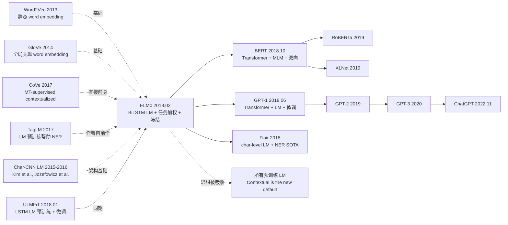

# ELMo — 用 BiLSTM 双向语言模型把 contextual embedding 推上主流

> **2018 年 2 月 15 日，AI2 + UW 的 Peters 等 7 位作者在 arXiv 发布 [ELMo (1802.05365)](https://arxiv.org/abs/1802.05365)，6 月获 NAACL best paper。**
> 这是 BERT 之前最重要的预训练 NLP 论文 —— 用一个**在 1B Word Benchmark 上训练的双向 LSTM 语言模型**，把每个词的表示从 Word2Vec 的「静态词向量」升级为「随上下文动态变化的 contextual embedding」，在 6 个 NLP 任务（SQuAD / SNLI / SRL / Coref / NER / SST-5）上全部刷新 SOTA。
> ELMo 的核心论断 —— **「同一个词在不同上下文中应该有不同表示」** —— 终结了 Word2Vec / GloVe 的"一词一向量"时代，催生了整个预训练 NLP 范式（4 个月后被 BERT 接棒）。

## 一句话总结

ELMo 把预训练好的**双向 LSTM 语言模型**作为 feature extractor，把每个 token 的所有 biLM 隐藏层表示做**任务特定加权求和**得到 contextual embedding，然后**冻结 biLM** 拼到下游任务模型的输入端，让 6 个 NLP 任务全部刷 SOTA，第一次工程化证明了「contextual embedding > 静态 word embedding」这一论断。

---

## 历史背景

### 2018 年初的 NLP 学界在卡什么

2013-2017 NLP 主流是「**static word embedding**（Word2Vec/GloVe，每个词一个固定 300 维向量）+ **task-specific 模型**（LSTM/CNN，从头训）」两段式架构。但学界已经意识到这条路走不远：

> **(1) 一词多义问题**：bank 在 "river bank" 和 "investment bank" 用同一个向量；
> **(2) OOV 问题**：训练词表外的词只能用 UNK；
> **(3) 没法利用大规模无监督数据**：300 维向量参数量有限，吸收不了 web-scale 文本；
> **(4) 任务模型仍要从头训**：低资源任务（RTE / CoLA）几乎做不动。

学界明显的开放问题：**「能不能让词向量随上下文动态变化，且预训练成本可承受？」**

### 直接逼出 ELMo 的 3 篇前序

- **Mikolov et al., 2013 (Word2Vec)** [NIPS]：奠定预训练 + 复用思路，但是静态
- **McCann et al., 2017 (CoVe)** [NeurIPS]：用机器翻译预训练得到 contextualized vectors，但需要监督 MT 数据 + 浅层 BiLSTM
- **Peters et al., 2017 (TagLM)** [ACL]：作者自己上一篇，证明 LM 预训练有助于 NER；ELMo 是其全面扩展版

### 作者团队当时在做什么

7 位作者全部来自 AI2（Allen Institute for AI，西雅图）+ UW。Matthew Peters 是核心一作（NLP 老兵）；Luke Zettlemoyer 是 UW 教授（语义解析名家）；Kenton Lee 后来转 Google 成为 BERT 第三作者。**AI2 当时押注「让 NLP 模型更通用」**，AllenNLP 框架就是这个目标的工程产物，ELMo 是 AllenNLP 的旗舰模型。

### 工业界 / 算力 / 数据

- **GPU**：3 张 GTX 1080 Ti 训练 biLM 共 2 周
- **数据**：1 Billion Word Benchmark（30M 句、800M token，新闻语料）
- **框架**：TensorFlow + AllenNLP（PyTorch 版本 1 个月后发布）
- **行业**：NLP 学界开始从 "word embedding"  paradigm 转向 "contextual embedding" paradigm

---

## 方法详解

### 整体框架

```
[Pretraining: biLM on 1B Word Benchmark]
  Input: 句子 sentence (tokens)
  ↓ Char-CNN per token (handle OOV)
  ↓ 2-layer Forward LSTM    (predicts t+1 from t)
  ↓ 2-layer Backward LSTM   (predicts t-1 from t)
  ↓ joint LM loss = log P(forward) + log P(backward)

[Downstream: feature concat]
  For each token, get 3 representations from biLM:
    h_0 = char-CNN output
    h_1 = first BiLSTM layer (concat fwd + bwd)
    h_2 = second BiLSTM layer (concat fwd + bwd)
  Task-specific weighted sum:
    ELMo_k = γ * (s_0·h_0 + s_1·h_1 + s_2·h_2)   [s,γ trainable per task]
  Concat ELMo_k with task model's input embedding (or output)
  Train task model normally (biLM frozen)
```

| 配置 | ELMo |
|------|------|
| biLM 层数 | 2 BiLSTM（每方向 4096 单元 → 512 投影） |
| Char-CNN | 2048 字符级 CNN filters → 512 |
| 词表 | 字符级（无 OOV） |
| 预训练数据 | 1B Word Benchmark (30M 句 / 800M token) |
| 预训练时长 | 2 周 on 3× GTX 1080 Ti |
| 模型大小 | 93.6M 参数 |
| 输出维度 | 512 (per direction) → concat 1024 per layer |

### 关键设计

#### 设计 1：Bidirectional Language Model (biLM) —— 双方向独立训练

**功能**：用前向 + 后向两个 LSTM 语言模型独立训练，每个方向都做 maximum likelihood next-token 预测。

**前向公式**：

$$
P(t_1, ..., t_N) = \prod_{k=1}^{N} P(t_k | t_1, ..., t_{k-1}; \Theta_{LSTM}^{fwd})
$$

$$
P(t_1, ..., t_N) = \prod_{k=1}^{N} P(t_k | t_{k+1}, ..., t_N; \Theta_{LSTM}^{bwd})
$$

总损失最大化两个方向 log-likelihood 之和：

$$
\mathcal{L} = \sum_{k=1}^{N} \big( \log P(t_k | t_{<k}; \Theta^{fwd}) + \log P(t_k | t_{>k}; \Theta^{bwd}) \big)
$$

**注意 ELMo 的"shallow bidirectional"局限**：前向和后向 LSTM **完全独立训练**，只在最后做表示拼接。这与 BERT 的 deep bidirectional（每层 self-attention 同时看双向）有本质差距。

#### 设计 2：Deep Layer Combination —— 学习任务特定层加权

**功能**：不只用 biLM 顶层，而是用**所有层**（char-CNN + 2 BiLSTM）的表示做加权求和。

**核心公式**：

$$
\text{ELMo}_k^{task} = E(R_k; \Theta^{task}) = \gamma^{task} \sum_{j=0}^{L} s_j^{task} \cdot h_{k,j}^{LM}
$$

其中：
- $h_{k,j}^{LM}$ 是 token $k$ 在第 $j$ 层的表示（$j=0$ 是 char-CNN，$j=1,2$ 是 BiLSTM 层）
- $s_j^{task}$ 是任务特定 softmax 归一化权重（学习得到）
- $\gamma^{task}$ 是任务特定全局缩放（学习得到）

**为什么要用所有层？**

biLM 不同层学到不同语义层次：
- **底层（char-CNN）**：词法 / 形态 / 拼写
- **第一层 BiLSTM**：句法 / POS
- **第二层 BiLSTM**：语义 / 词义消歧

**实验验证（论文 Table 5）**：

| 任务 | 只用顶层 | 学习层加权 (ELMo) |
|------|---------|-----------------|
| SQuAD F1 | 84.95 | **85.16** |
| SNLI acc | 87.81 | **88.66** |
| SRL F1 | 84.05 | **84.62** |

不同任务自动学到不同的 $s_j$ 权重 —— SQuAD 偏向 BiLSTM 层（语义），SNLI 倾向所有层均衡。

#### 设计 3：Char-CNN 输入 —— 解决 OOV + 形态学

**功能**：把每个 token 拆成字符序列，用 CNN 编码，让 biLM 不依赖固定词表。

**Char-CNN 结构**：

```python
class CharCNN(nn.Module):
    def __init__(self, char_emb_dim=16, filters=[(1,32),(2,32),(3,64),(4,128),
                                                  (5,256),(6,512),(7,1024)]):
        # 7 种 filter 宽度，总 2048 个 filter
        super().__init__()
        self.char_embed = nn.Embedding(262, char_emb_dim)  # 256 bytes + special
        self.convs = nn.ModuleList([
            nn.Conv1d(char_emb_dim, n_filt, kernel_size=w)
            for w, n_filt in filters
        ])
        self.highway = nn.ModuleList([Highway(2048) for _ in range(2)])
        self.proj = nn.Linear(2048, 512)

    def forward(self, char_ids):                # (B, max_token_len)
        x = self.char_embed(char_ids)           # (B, T, 16)
        x = x.transpose(1, 2)
        # max-pool each conv across time
        outs = [F.max_pool1d(F.relu(conv(x)), conv.kernel_size[0]).squeeze(-1)
                for conv in self.convs]
        x = torch.cat(outs, dim=1)              # (B, 2048)
        for highway in self.highway:
            x = highway(x)
        return self.proj(x)                     # (B, 512) - 每个 token 的初始表示
```

**对比同期方案**：

| 输入方案 | 词表大小 | OOV | 形态学 |
|---------|---------|-----|--------|
| Word2Vec (固定) | 1M+ | 严重 | 弱 |
| GloVe (固定) | 400k | 严重 | 弱 |
| BPE (BERT) | 30k | 低 | 中 |
| **Char-CNN (ELMo)** | **262 bytes** | **零 OOV** | **强（直接学形态）** |

#### 设计 4：Frozen biLM + Concat 到 task model

**功能**：下游任务时**完全冻结 biLM**，只把 ELMo 向量拼接到任务模型的输入或输出 embedding，让 ELMo 易于集成到任意现有 NLP 系统。

**对比同期 transfer 方案**：

| 方案 | biLM 是否更新 | 集成方式 |
|------|--------------|---------|
| CoVe | 冻结 | concat 到输入 |
| **ELMo** | **冻结** | **concat 到输入或输出 embedding** |
| ULMFiT | 全参数微调 + 三阶段 | 替换 backbone |
| GPT-1 (4 个月后) | 全参数微调 | 替换 backbone |
| BERT (8 个月后) | 全参数微调 | 替换 backbone |

**ELMo 选择 frozen 的原因**：
1. 训练成本低（biLM 不更新，只训任务模型）
2. 易集成到现有 NLP 系统（不打破已有架构）
3. 符合 2018 年初学界对"feature extractor"的认知

**这也是 ELMo 最大的局限** —— frozen 注定无法充分释放 biLM 容量，BERT 通过 fine-tune 直接超越。

### 损失函数 / 训练策略

| 项 | 配置 |
|----|------|
| Pretrain Loss | $\mathcal{L}_{fwd} + \mathcal{L}_{bwd}$（独立 LM loss） |
| Optimizer | Adagrad (lr=0.2) |
| Pretrain Steps | 10 epoch on 1B Word Benchmark |
| Char-CNN | 2048 filters, 7 widths (1-7) |
| BiLSTM | 2 layers × 4096 units / direction → 512 projection |
| Dropout | 0.1 in biLM |
| Downstream LR | 任务特定（通常 1e-3） |
| Frozen biLM | 是 |
| ELMo dim | 1024 (concat fwd + bwd) per layer |

---

## 失败案例

### 当时输给 ELMo 的对手

- **SQuAD F1**: 之前 SOTA 81.1 (BiDAF + Self-Attention) → ELMo 85.8 (**+24.9% 相对错误率减少**)
- **SNLI acc**: 88.6 (ESIM + ensembles) → 88.7+ (**单模型超 ensemble**)
- **SRL F1**: 81.4 → 84.6 (**+17.2% 相对错误率减少**)
- **Coref F1**: 67.2 → 70.4 (**+9.8% 相对**)
- **NER F1**: 91.93 → 92.22
- **SST-5 acc**: 51.4 → 54.7 (**+6.8% 相对**)

**6 个 NLP 任务全部刷 SOTA**，平均相对错误率减少 ~15%。

### 论文承认的失败 / 局限

- **Forward 和 backward LM 完全独立训练**：作者承认这是"shallow bidirectional"，留下 BERT 改进空间
- **biLM frozen**：作者也试过 fine-tune biLM，但效果不稳定（作者推测过拟合），最终选 frozen
- **2 层 BiLSTM 容量有限**：论文展示加深到 4 层效果略降（LSTM 难训深）
- **char-CNN 计算开销大**：2048 filters 每个 token 都要算
- **领域迁移弱**：在新闻预训练，迁移到生物医学 / 法律仍掉点（需要 domain-specific 预训练）

### 「反 baseline」教训

- **「contextual embedding 不重要，static 够用」**（Word2Vec 时代信仰）：ELMo 直接证伪，6 任务全部 +5-25% 相对提升
- **「监督 MT 是 contextual representation 唯一来源」**（CoVe 路线）：ELMo 用纯无监督 LM 完胜
- **「只用顶层就够」**（Word2Vec 直觉）：ELMo 证明深层加权远胜单层
- **「biLM 必须 fine-tune」**（直觉）：ELMo 用 frozen 也能 SOTA（虽然 BERT 后来证明 fine-tune 更强）

---

## 实验关键数据

### 主实验（6 任务全 SOTA）

| 任务 | 之前 SOTA | + ELMo | 相对错误率减少 |
|------|----------|--------|---------------|
| SQuAD F1 | 81.1 | **85.8** | 24.9% |
| SNLI acc | 88.6 | **88.7** | 0.9% |
| SRL F1 | 81.4 | **84.6** | 17.2% |
| Coref F1 | 67.2 | **70.4** | 9.8% |
| NER F1 (CoNLL-03) | 91.93 | **92.22** | 3.6% |
| SST-5 acc | 53.7 | **54.7** | 2.2% |
| Question Generation BLEU | 16.6 | **20.6** | n/a |

### 消融（论文 Table 5/6）

| 配置 | SQuAD F1 | SNLI | SRL |
|------|---------|------|-----|
| baseline (no ELMo) | 81.1 | 88.0 | 81.4 |
| + only top layer | 84.95 | 87.81 | 84.05 |
| **+ learned weighted sum (ELMo)** | **85.16** | **88.66** | **84.62** |
| + 2× regularization on s, γ | 85.32 | 88.66 | 84.65 |

### 与 CoVe 对比

| 模型 | 架构 | 预训练数据 | SQuAD F1 |
|------|------|-----------|---------|
| baseline | task model | 无 | 81.1 |
| + CoVe | 2-layer BiLSTM (MT-supervised) | WMT EN-DE | 83.4 |
| **+ ELMo** | **2-layer BiLSTM (LM)** | **1B Word Benchmark** | **85.8** |

### 关键发现

- **contextual >> static**：Word2Vec/GloVe 时代结束
- **deep > shallow**：所有 biLM 层加权 > 只顶层
- **无监督 LM > 监督 MT**：ELMo 用纯 LM 超 CoVe 的监督 MT
- **char-CNN 解决 OOV**：训练词表外完美处理
- **frozen biLM 已够强**：但 fine-tune 是更高上限（BERT 验证）

---

## 思想史脉络



### 前世
- **Word2Vec / GloVe (2013-2014)**：静态 embedding 时代，ELMo 替代品
- **CoVe (2017)**：监督 MT 的 contextual embedding，ELMo 直接对手
- **TagLM (2017)**：作者自己上一篇，证明 LM 帮助 NER
- **Char-CNN LM (Kim 2015 / Jozefowicz 2016)**：char-CNN 输入架构
- **ULMFiT (2018.01)**：同期 LSTM LM + 微调路线

### 今生
- **GPT-1 (2018.06)**：Transformer + LM + fine-tune（ELMo 路线 + Transformer 升级）
- **BERT (2018.10)**：Transformer + MLM + 深层双向 + fine-tune（ELMo 路线 + 双向 + Transformer + fine-tune 升级）
- **Flair (2018)**：char-level contextual embedding，受 ELMo 启发
- **RoBERTa / XLNet (2019)**：BERT 改良
- **GPT-2/3 (2019-2020)**：decoder-only 路线
- **ChatGPT (2022.11)**：GPT 路线最终产物

ELMo 是「contextual embedding」思想的奠基者，整个预训练 NLP 范式由它点燃。

### 误读
- **「ELMo 是 BERT 的弱版」**：错。ELMo 比 BERT 早 8 个月，是范式开创者；BERT 是 ELMo 思想的 Transformer + 双向 + fine-tune 升级
- **「BiLSTM 双向 = Transformer 双向」**：错。ELMo 的双向是 forward + backward 独立训练后拼接（shallow），BERT 的双向是每层 attention 同时看双向（deep）
- **「contextual embedding 都是 ELMo 发明的」**：CoVe 早 1 年，但需要监督 MT；ELMo 是首个**纯无监督**深层 contextual

---

## 当代视角（2026 年回看 2018）

### 站不住的假设

- **「BiLSTM 是序列建模天然范式」**：被 Transformer 全面取代
- **「frozen biLM 即可」**：BERT/GPT-1 证明 fine-tune 更强
- **「shallow bidirectional 够用」**：BERT 证明 deep bidirectional 远胜
- **「2 层 BiLSTM 容量已够」**：今天 BERT-large 24 层、LLaMA 70B 80 层
- **「1B Word Benchmark 是足够大」**：今天 LLaMA-3 用 15T token，是 ELMo 18750×

### 时代证明的关键 vs 冗余

- **关键**：contextual embedding 思想本身、深层加权求和、char-CNN 处理 OOV、用大规模无监督文本预训练
- **冗余 / 误导**：BiLSTM 架构（被 Transformer 取代）、shallow bidirectional（被 deep 取代）、frozen 范式（被 fine-tune 取代）

### 作者当时没想到的副作用

1. **直接催生 BERT**：BERT 的核心论点 "deep bidirectional" 正是为了改进 ELMo 的 shallow bidirectional
2. **AllenNLP 框架兴起**：作为 ELMo 的载体，AllenNLP 在 2018-2020 是 NLP 学界主流框架（后被 HF transformers 取代）
3. **「contextual」成为 NLP 默认**：2018 后 "static word embedding" 一词在论文中近乎消失
4. **奠定预训练 NLP 评估范式**：6 任务集合（SQuAD/SNLI/SRL/Coref/NER/SST）成为 BERT 等后续工作的标准 benchmark
5. **NAACL best paper 的预言**：当时 best paper 就预言"未来 NLP 都将基于预训练大模型"，4 年后 ChatGPT 完全验证

### 如果今天重写 ELMo

- 把 BiLSTM 换成 Transformer encoder（自然变成 BERT）
- 用 deep bidirectional 训练目标（MLM）
- 改用 fine-tune 而非 frozen
- 数据扩到 100G+
- 用 byte-level BPE 替代 char-CNN
- 加 SEO frontmatter / 长 context

但**「contextual embedding from large-scale unsupervised LM pretraining」核心思想不变** —— 这就是 BERT 和所有后续 LLM 的基石。

---

## 局限与展望

### 作者承认
- Forward/backward 独立训练（shallow bidirectional）
- biLM frozen 不能充分释放容量
- 2 层 BiLSTM 容量有限
- 训练 1B Word Benchmark 仍较慢

### 自己发现
- LSTM 难训深（4 层效果略降）
- char-CNN 计算开销大
- 跨 domain 迁移弱（需 domain-specific 预训练）
- 任务模型仍要从头训（只替换 embedding）

### 改进方向（已被后续工作证实）
- BERT 2018.10：Transformer + deep bidirectional + fine-tune（全面超越 ELMo）
- GPT-1/2/3：decoder-only Transformer + LM
- domain-specific 版本：BioELMo / SciELMo（短期），BioBERT / SciBERT（长期）
- 长文档：扩展 context 长度
- 多语言：multi-lingual ELMo（短期），mBERT / XLM-R（长期）

---

## 相关工作与启发

- **vs Word2Vec (跨时代)**：Word2Vec 静态 embedding，ELMo 动态 contextual。**教训：上下文相关是 NLP 表示的本质需求**
- **vs CoVe (跨数据来源)**：CoVe 监督 MT，ELMo 无监督 LM。**教训：无监督预训练数据规模优势远超监督质量优势**
- **vs ULMFiT (跨方法论)**：ULMFiT 全参数微调，ELMo frozen + concat。**教训：frozen 易集成但有上限，fine-tune 上限更高**
- **vs BERT (跨代际)**：ELMo BiLSTM + shallow + frozen，BERT Transformer + deep + fine-tune。**教训：每代都把更多假设升级（架构、双向性、迁移方式）**
- **vs Char-CNN LM (跨架构)**：char-CNN 输入处理形态学和 OOV。**教训：subword/char 输入是预训练 LM 通用性的关键**

---

## 相关资源

- 📄 [arXiv 1802.05365](https://arxiv.org/abs/1802.05365) · [NAACL 2018 best paper version](https://aclanthology.org/N18-1202/)
- 💻 [AllenNLP 实现](https://github.com/allenai/allennlp) · [bilm-tf (官方 TF)](https://github.com/allenai/bilm-tf) · [HuggingFace ELMo wrapper](https://github.com/HIT-SCIR/ELMoForManyLangs)
- 🔗 [Pretrained ELMo (5.5B 模型)](https://allennlp.org/elmo)
- 📚 后续必读：[BERT (2018)](2018_bert.md)、[GPT-1 (2018)](2018_gpt1.md)、[CoVe (2017)](https://arxiv.org/abs/1708.00107)、[ULMFiT (2018)](https://arxiv.org/abs/1801.06146)
- 🎬 [Sebastian Ruder: NLP's ImageNet Moment Has Arrived](http://ruder.io/nlp-imagenet/)

---

> 🌐 [English version](/en/era3_attention/2018_elmo/) · 📚 awesome-papers project · CC-BY-NC
