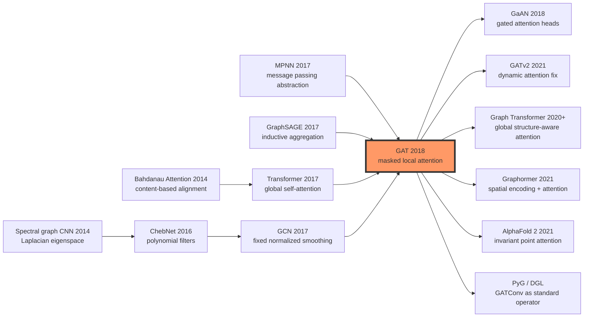

# Graph Attention Networks (GAT) — 为图神经网络植入注意力

> **2017 年 10 月 30 日，Petar Veličković、Guillem Cucurull、Arantxa Casanova、Adriana Romero、Pietro Liò、Yoshua Bengio 六位作者在 arXiv 发布 [Graph Attention Networks (1710.10903)](https://arxiv.org/abs/1710.10903)，随后被 ICLR 2018 接收。** GCN 刚把图卷积压缩成一次固定的邻居平均，GAT 立刻追问：如果每条边的权重不是度数常数，而是由节点特征当场算出来的注意力，会怎样？这个问题把 Transformer 的自注意力从全连接序列搬到稀疏图邻域，也把 PPI 归纳任务的 Micro-F1 推到 **0.973**。GAT 的长期影响不在于多赢了 Cora 一两个点，而在于它让“边权重可以学习”成为 GNN 之后十年的默认直觉。

## 一句话总结

Graph Attention Networks (GAT) 是 Veličković、Cucurull、Casanova、Romero、Liò、Bengio 六位作者 2018 年发表在 ICLR 的论文，它把 [GCN（2017）](2017_gcn.md) 的固定归一化邻居平均换成可学习的掩码自注意力：$e_{ij}=\mathrm{LeakyReLU}(\vec{a}^{T}[W\vec{h}_i\Vert W\vec{h}_j])$，再用 $\alpha_{ij}=\mathrm{softmax}_{j\in\mathcal{N}_i}(e_{ij})$ 聚合邻居。这个公式看起来只是把边权从 $1/\sqrt{d_i d_j}$ 改成了 attention score，却把图学习从“拓扑决定消息强度”推向“节点特征决定谁值得听”。在 Cora / CiteSeer 上，GAT 把 GCN 的 81.5 / 70.3 推到 83.0 / 72.5；更关键的是 PPI 归纳多标签任务里，GraphSAGE-LSTM 约 0.612 的 Micro-F1 被 GAT 拉到 0.973。

GAT 的反直觉点在于：它不是把 [Transformer（2017）](2017_transformer.md) 原样搬进图，而是把全局 self-attention 截断成稀疏邻域内的局部 attention，因此仍保留 $O(|V|FF' + |E|F')$ 的图线性复杂度。后来的 GATv2、Graph Transformer、Graphormer、AlphaFold 2 的 Invariant Point Attention 都在不同方向继承或修正这条路线：注意力不只是 NLP 的序列技巧，它可以成为结构化世界里重新定义“关系”的计算方式。

---

## 历史背景

### 2017 年的图学习在卡什么

2017 年的图神经网络刚刚走出“能不能训练”的阶段，还没有进入“怎样设计消息”的阶段。[GCN（2017）](2017_gcn.md) 用归一化邻接矩阵把谱图卷积简化成一行公式，证明节点分类可以端到端做；GraphSAGE 同年证明，如果聚合函数只依赖局部邻域而不依赖整张训练图，模型就能迁移到未见过的新图；Gilmer 等 5 位作者的 MPNN 则把分子图里的消息传递抽象成通用框架。问题是，这些方法大多仍把邻居看成一批需要平均、求和或池化的对象。

真正尴尬的地方在于：现实图里的邻居并不平等。论文引用图里，某篇论文的一个邻居可能提供核心主题线索，另一个邻居只是共同引用带来的噪声；蛋白质相互作用图里，一条边可能对应强功能关联，另一条边可能只是弱实验信号。GCN 的权重来自度数归一化，GraphSAGE 的 mean/pool 聚合来自手工选择的聚合器。它们都能传播信息，却很难在一次前向传播里回答“哪个邻居更值得听”。

### 直接逼出 GAT 的三股力量

第一股力量是 **GCN 的固定权重**。GCN 的传播项可以理解为对“自己 + 邻居”做度数归一化平均，权重由拓扑决定，不看节点内容。这使它简单、稳定、优雅，但也使它天然各向同性：同一个节点的邻居只因度数不同而权重不同，而不会因为语义匹配程度不同而权重不同。

第二股力量是 **GraphSAGE 的归纳学习压力**。工业图和生物图经常出现新节点、新子图甚至新图。如果模型只在训练时见过的固定图上工作，就很难服务实时推荐、分子筛选、欺诈检测等场景。GraphSAGE 把“学一个局部聚合函数”推到前台，GAT 接过这个问题，但把聚合函数换成了可学习的边级注意力。

第三股力量是 **Transformer 的自注意力冲击**。Vaswani 等 8 位作者在 2017 年用 self-attention 取代循环结构，证明 token 之间的关系可以由内容动态计算。GAT 的关键直觉是：序列上的 self-attention 可以看成完全图上的两两交互；图上的 attention 则是把这套机制用邻接矩阵掩码住，只允许一跳邻居参与计算。

### 作者团队当时的位置

第一作者 Petar Veličković 当时在 University of Cambridge 与 Pietro Liò 团队做图学习和生物网络方向的研究；Guillem Cucurull、Arantxa Casanova、Adriana Romero 与 MILA / 加拿大团队有密切联系；Yoshua Bengio 的参与也让这项工作自然连接到神经注意力和表示学习的主线。团队组合很有代表性：一边是图和生物网络，一边是深度学习注意力机制。

这篇论文并没有试图发明一个庞大系统。它的野心恰好相反：只定义一个可插拔的 **graph attention layer**，证明这个层能替换 GCN 的固定传播规则，并且能在转导节点分类与归纳多标签分类两类任务上同时成立。GAT 因此很快变成各类图学习库里的标准层。

### 当时的数据、算力与工程语境

GAT 的实验环境按今天眼光看很小：Cora、CiteSeer、Pubmed 是几千到几万节点的引用网络；PPI 是多个蛋白质相互作用图构成的归纳 benchmark。算力上，原论文用当时常见的单卡 GPU 就能完成主要实验。工程上，TensorFlow 版本官方代码发布在 `PetarV-/GAT`，后来 PyTorch、DGL、PyG 都把 GATConv 作为基础算子。

这个规模反而解释了 GAT 为什么容易传播。它不是一个靠大算力压出的结果，而是一个可以被几十行代码复现的层定义：线性变换、边级打分、邻域 softmax、多头聚合。这样的“低工程门槛 + 高概念辨识度”让 GAT 成为继 GCN 之后最容易进入教材和库实现的 GNN 论文之一。

---

## 方法详解

### 整体框架

GAT 的最小单元是一个 **graph attention layer**。输入是一张图 $G=(V,E)$、每个节点的特征 $h_i$，输出是更新后的节点表示 $h'_i$。与 GCN 先构造归一化邻接矩阵再做矩阵乘法不同，GAT 在每条边上即时计算注意力分数，然后只在节点的一跳邻域里做 softmax。

```
Graph G=(V,E), node features H
  ↓ shared linear projection W
Projected features Wh_i
  ↓ edge scoring on (i,j), j in N_i
Attention logits e_ij
  ↓ masked neighborhood softmax
Normalized coefficients alpha_ij
  ↓ weighted neighbor aggregation, K heads
Updated node features h'_i
```

| 组件 | GCN 的做法 | GAT 的做法 | 影响 |
|------|------------|------------|------|
| 边权重 | 度数归一化常数 | 特征相关的 attention score | 从各向同性变成各向异性 |
| 邻域 | 一跳邻居 + 自环 | 一跳邻居 + 自环 | 保持局部消息传递 |
| 泛化 | 原始实验偏转导 | 局部函数可用于新图 | 支持 PPI 归纳任务 |
| 计算 | 稀疏矩阵乘法 | 稀疏边级 attention | 更灵活但更耗显存 |

### 关键设计

#### 设计 1：掩码自注意力，把边权重变成可学习函数

GAT 首先用共享矩阵 $W$ 变换每个节点特征，然后对中心节点 $i$ 和邻居 $j$ 的变换后特征做拼接打分：

$$
e_{ij}=LeakyReLU(a^T[Wh_i || Wh_j])
$$

这里的 $a$ 是一个共享的单层注意力向量，`||` 表示拼接。注意力只在真实邻居集合 $N_i$ 内计算，因此它不是 Transformer 那种全连接 attention，而是被图结构掩码住的局部 attention。随后在邻域内归一化：

$$
alpha_{ij}=exp(e_{ij}) / sum_{k in N_i} exp(e_{ik})
$$

最后的节点更新是加权邻居求和：

$$
h'_i=sigma(sum_{j in N_i} alpha_{ij}Wh_j)
$$

这个设计的关键不是“用了 attention”四个字，而是 attention 的作用域。GAT 没有让所有节点互相看见，而是把图结构当成一个硬约束：只有存在边的节点对才会互相打分。这样做保留了图稀疏性，也让每个节点获得了内容自适应的局部滤波器。

#### 设计 2：多头注意力，用冗余头稳定小图训练

图数据常常比图像和文本更小、更稀疏，单个 attention head 很容易在早期训练中被噪声牵着走。GAT 借鉴 Transformer，把同一层复制成 $K$ 个独立注意力头。隐藏层通常把各头输出拼接起来：

$$
h'_i=concat_{k=1..K} sigma(sum_{j in N_i} alpha^k_{ij} W^k h_j)
$$

输出层则为了得到稳定分类分布，改用各头平均：

$$
h'_i=sigma((1/K) sum_{k=1..K} sum_{j in N_i} alpha^k_{ij} W^k h_j)
$$

在引用网络实验里，常见配置是第一层 8 个 head，每个 head 输出 8 维，拼接成 64 维；最后一层再输出类别数。这个设置并不奢侈，却足以让模型从多个角度判断邻居重要性。

#### 设计 3：不依赖谱分解，让模型自然支持归纳场景

谱图卷积早期方法往往依赖图拉普拉斯的特征空间，图一换，频域基底也换。GCN 虽然已经把谱推导压缩成局部传播公式，但标准实验仍是在单张固定图上做转导学习。GAT 的参数只包括 $W$ 和 $a$，它们不绑定某张图的节点数、拉普拉斯特征向量或具体邻接矩阵。

因此，训练好的 GAT 层可以直接放到一张新图上：只要新图有节点特征和边列表，就能根据每条边两端的特征计算 attention，再完成消息传递。PPI benchmark 正是利用这一点：模型在一批蛋白质相互作用图上训练，在未见过的图上评估。

#### 设计 4：线性复杂度的折中，而不是全图 Transformer

如果把 Transformer 直接套到 $N$ 个节点上，注意力矩阵是 $O(N^2)$。GAT 通过邻接掩码把候选对限制为边，复杂度约为：

$$
O(|V|FF' + |E|F')
$$

第一项来自所有节点共享线性变换，第二项来自每条边的打分与聚合。这个复杂度对稀疏图是线性的，但常数比 GCN 大，因为每条边都要保留 attention logits、softmax 权重以及多头中间结果。这就是 GAT 的核心工程取舍：它用更多边级计算换来可学习的邻居选择。

### 训练目标与复杂度

| 项目 | 原论文常用设置 |
|------|----------------|
| 引用网络结构 | 两层 GAT，第一层 8 heads × 8 hidden features |
| 激活函数 | hidden layer 使用 ELU |
| 正则化 | feature dropout + attention dropout |
| PPI 结构 | 更宽的多层多头 GAT，用于多标签分类 |
| 复杂度 | 约 $O(|V|FF' + |E|F')$ |
| 输出 | 转导任务用 softmax，PPI 用 sigmoid / 多标签损失 |

```python
import torch
import torch.nn as nn
import torch.nn.functional as F

class SparseGATLayer(nn.Module):
    def __init__(self, in_dim, out_dim, heads=8, negative_slope=0.2):
        super().__init__()
        self.heads = heads
        self.proj = nn.Linear(in_dim, heads * out_dim, bias=False)
        self.attn_src = nn.Parameter(torch.empty(heads, out_dim))
        self.attn_dst = nn.Parameter(torch.empty(heads, out_dim))
        self.leaky_relu = nn.LeakyReLU(negative_slope)
        nn.init.xavier_uniform_(self.attn_src)
        nn.init.xavier_uniform_(self.attn_dst)

    def forward(self, x, edge_index):
        src, dst = edge_index
        h = self.proj(x).view(x.size(0), self.heads, -1)
        logits = (h[src] * self.attn_src).sum(-1) + (h[dst] * self.attn_dst).sum(-1)
        logits = self.leaky_relu(logits)
        alpha = edge_softmax(dst, logits)
        msg = h[src] * alpha.unsqueeze(-1)
        return scatter_sum(msg, dst, dim=0, dim_size=x.size(0)).flatten(1)
```

这段概念代码强调了现代实现和论文公式之间的差别：论文用拼接 $[Wh_i || Wh_j]$ 写 attention，工程实现常把它拆成源节点项和目标节点项以便稀疏并行。数学上二者等价，关键都是让每条边拥有自己的可学习权重。

| 方法 | 聚合权重 | 是否动态 | 是否自然归纳 | 主要代价 |
|------|----------|----------|--------------|----------|
| DeepWalk / node2vec | 随机游走共现 | 否 | 否 | 不能直接用节点特征 |
| GCN | 度数归一化 | 否 | 有限制 | 固定各向同性平滑 |
| GraphSAGE-mean | 平均 / 池化 | 部分 | 是 | 邻居仍大体等权 |
| **GAT** | **边级 attention** | **是** | **是** | **多头注意力显存更高** |
| Graph Transformer | 全局 attention + 结构编码 | 是 | 是 | $O(N^2)$ 或需稀疏化 |

---

## 失败案例

### GCN 的固定平滑：所有邻居被迫同一种尺度发声

GCN 是 GAT 最直接、也最值得尊重的 baseline。它的强大来自简洁：把邻居信息按度数归一化后传播，再叠上可学习线性变换。可是这也带来一个硬限制：边权只由图结构决定，和节点内容无关。对同一个中心节点而言，一个主题高度相关的邻居和一个跨类别噪声邻居，可能因为度数相近而获得相似权重。

GAT 修复的不是 GCN 的训练方式，而是它的归纳偏置。GCN 假设局部平滑通常有益，GAT 则允许模型学习“哪些邻居值得平滑、哪些邻居应该降权”。这在同质性强的引用网络上只带来一两个点的提升，但在异质性更高、任务更复杂的图上意义更大。

### DeepWalk / node2vec 的特征盲区：节点向量不是局部函数

DeepWalk 和 node2vec 把图上的随机游走变成类似句子的序列，再用词向量训练节点 embedding。这个路线在 2014-2016 年非常有效，因为它简单、可扩展，也不要求手写图特征。但它的失败点同样明显：embedding 表本身绑定到训练图里的节点 ID，新节点进入时往往需要重新游走和重训；节点文本、属性、分子特征等高维语义也无法自然进入模型。

GAT 把表示从“节点 ID 的查表结果”改成“节点特征与邻居特征共同驱动的函数”。一个新节点只要有特征和邻接边，就可以通过前向传播得到表示。这不是单纯的工程便利，而是把图学习从静态 embedding 时代推向可部署的神经算子时代。

### GraphSAGE 的均匀聚合：能归纳，但不一定会挑邻居

GraphSAGE 是 GAT 的同代强 baseline。它已经解决了归纳学习问题，并用采样控制邻域规模。它的问题不在“不能泛化”，而在“如何刻画邻居重要性”。Mean aggregator 默认邻居平均；pool aggregator 通过非线性变换再池化；LSTM aggregator 甚至引入顺序敏感结构，但这些都没有明确为每条边学习一个中心节点相关的权重。

PPI 结果因此很有说服力。GraphSAGE-LSTM 在 PPI 上约 0.612 Micro-F1，已经比许多浅层方法强；GAT 直接到 0.973。这说明在多标签、跨图、局部关系复杂的任务里，能否对邻居做细粒度选择，远比“有没有归纳框架”本身更关键。

## 实验关键数据

### 转导节点分类：Cora / CiteSeer / Pubmed

GAT 在三组经典引用网络上验证转导节点分类。这里的测试节点在训练时已经属于同一张图，只是标签不可见；因此它主要检验模型是否能用少量标签和图结构传播语义。

| 方法 | Cora accuracy | CiteSeer accuracy | Pubmed accuracy | 主要短板 |
|------|---------------|-------------------|-----------------|----------|
| DeepWalk | 67.2 | 43.2 | 65.3 | 不使用节点特征 |
| Planetoid | 75.7 | 64.7 | 77.2 | 随机游走 + 半监督目标较重 |
| Chebyshev | 81.2 | 69.8 | 74.4 | 谱多项式复杂，泛化不便 |
| GCN | 81.5 | 70.3 | 79.0 | 固定归一化权重 |
| **GAT** | **83.0 ± 0.7** | **72.5 ± 0.7** | **79.0 ± 0.3** | Pubmed 与 GCN 持平 |

这些数字说明：GAT 在小引用网络上不是碾压式胜利。Cora 提升 1.5 点，CiteSeer 提升 2.2 点，Pubmed 基本持平。论文真正重要的地方不在于每个表格都大幅领先，而在于它证明了 attention 作为邻域聚合规则是可训练、稳定、且不输 GCN 的。

### 归纳多标签分类：PPI 的决定性差距

PPI benchmark 更能体现 GAT 的独特性。训练图和测试图不同，任务是蛋白质功能多标签分类，评价指标是 Micro-F1。这个设置要求模型学到可迁移的局部关系函数，而不是记住单张图的节点位置。

| 方法 | PPI Micro-F1 | 失败点 |
|------|--------------|--------|
| Random | 0.396 | 没有图学习 |
| MLP | 0.422 | 不使用边结构 |
| DeepWalk | 0.407 | 转导 embedding 难迁移 |
| GraphSAGE-GCN | 0.500 | 固定图卷积聚合较弱 |
| GraphSAGE-mean | 0.598 | 平均聚合不够细 |
| GraphSAGE-LSTM | 0.612 | 归纳但边级选择不足 |
| **GAT** | **0.973** | 注意力聚合解决主要瓶颈 |

PPI 的跃升是 GAT 论文最有历史辨识度的数字。它告诉后来的研究者：如果图上边的语义差异很大，那么“可学习的邻居选择”可能比更复杂的采样器、更长的随机游走或更深的平滑层更有效。

### 消融与训练信号

GAT 的论文还强调了多头机制和 attention dropout 的重要性。单头 attention 容易不稳定，多头拼接相当于让多个局部滤波器同时工作；对 attention 权重做 dropout，则可以防止模型过早把所有概率集中到少数边。

| 设计选择 | 作用 | 去掉后的典型风险 | 后续影响 |
|----------|------|------------------|----------|
| 多头拼接 | 降低 attention 方差 | 小图上训练不稳 | 成为 GNN attention 默认配置 |
| 输出层平均 head | 稳定分类概率 | logits 波动更大 | 被 PyG/DGL 实现沿用 |
| attention dropout | 防止依赖少数边 | 对噪声边过拟合 | 后续图正则化常用思想 |
| 邻接 mask | 保持稀疏计算 | 退化成昂贵全局 attention | 影响后续 sparse Transformer |

### 读这些结果时要小心什么

GAT 的引用网络提升不应被包装成“全面替代 GCN”。在低噪声、强同质、规模巨大的推荐图上，LightGCN 这类极简模型多年后仍然很强，因为它们省去了昂贵的特征变换和 attention。GAT 的真正适用区间，是局部邻居语义差异明显、边的重要性需要由特征判断、且任务允许为此支付更多显存的场景。

---

## 思想史脉络

### 前世：谱图卷积、消息传递与神经注意力三条线汇合

GAT 的思想不是从单一论文里长出来的。第一条线是谱图卷积：Bruna 等 3 位作者把卷积定义到图拉普拉斯的特征空间里，ChebNet 用多项式近似降低计算成本，GCN 再把它压缩成一阶局部平滑。第二条线是消息传递：MPNN 把图神经网络描述成消息函数、聚合函数和更新函数，GraphSAGE 强调这些函数应该能迁移到未见过的新图。第三条线是神经注意力：Bahdanau attention 让模型按内容对齐，Transformer 则把 self-attention 变成通用序列层。

GAT 的贡献就是把三条线接起来：保留 GCN / MPNN 的局部图结构，继承 GraphSAGE 的归纳取向，同时把 Transformer 的内容相关权重压缩到一跳邻域内。它没有废掉图结构，而是让图结构成为 attention 的 mask。



### 今生：从局部 attention 到图 Transformer

GAT 之后，“attention as edge weight” 很快成为图学习里的常用语言。GaAN 给不同 head 加门控，试图学习哪些 head 更重要；Heterogeneous Graph Attention Network 和 relational GAT 把 attention 扩展到多类型节点与多类型边；DGL、PyG、TensorFlow GNN 等库把 GATConv 做成入门级算子。对于很多学生来说，学完 GCN 之后的第二个图神经网络层就是 GAT。

更长远的分支是 Graph Transformer。GAT 只在一跳邻域里做 attention，而 Graph Transformer / Graphormer 重新打开全局 attention，再用最短路距离、边编码、中心性编码等结构信息补回图归纳偏置。换句话说，GAT 是“把 Transformer 收缩到图邻域”，Graphormer 是“把图结构注入 Transformer”。两者方向相反，却共享同一个问题意识：关系强度应该由模型学习，而不是只由人工拓扑常数指定。

### 误读：attention 权重不等于解释，GAT 也不等于万能图模型

GAT 最常见的误读是把 attention 权重当作解释。一个邻居得到高权重，确实说明它在当前层的当前 head 中贡献较大，但这不等于因果重要性，也不等于人类可解释的边语义。多层、多头、dropout、非线性叠加之后，单个 head 的权重图更像模型内部的一帧计算状态，而不是最终判断理由。

第二个误读是把 GAT 当成 Graph Transformer 的同义词。原始 GAT 仍是 message passing GNN：它的感受野随层数扩展，一层只看一跳邻居。现代 Graph Transformer 通常允许全局节点交互，并通过位置编码、边编码或路径编码让模型知道图结构。这个差异决定了它们在规模、表达力和过平滑 / 过压缩问题上的取舍。

第三个误读是认为动态 attention 自动解决所有 GNN 缺陷。GAT 缓解固定平滑问题，但不能彻底解决 oversquashing、远距离依赖、超大图采样、异配图上的错误传播等问题。它给后续工作提供的是一个强基元，而不是终点。

---

## 当代视角（2026 年回看）

### 从挑战 GCN 到成为标准算子

2026 年回看，GAT 的地位已经从“GCN 的一个聪明变体”变成“图神经网络工具箱里的基本层”。它未必总是最强 baseline，尤其在超大推荐图和低特征图上，简单传播模型可能更便宜、更稳。但 GAT 改变了研究者描述图学习问题的语言：邻接矩阵不只是给定结构，也可以是 attention 的候选集合；边不只是存在或不存在，也可以有由特征动态计算的强度。

这层意义超过了原论文的三个引用网络表格。后来的 GATv2、Graphormer、HGT、GraphGPS、AlphaFold 2 的关系注意力模块，都在不同层面延续同一个观念：结构化数据里的关系不是死的，它可以被条件化、重加权、重解释。

### 站不住的假设

第一，**attention 权重天然动态**这个假设后来被削弱。GATv2 在 2021 年指出，原始 GAT 的打分形式在一些设置下会产生静态注意力排序：对给定节点，邻居间的相对排序可能不如名字暗示得那样随查询变化。这个批评并没有否定 GAT 的历史价值，但提醒人们：公式里出现 attention，不等于模型获得了完整的查询相关表达力。

第二，**局部一跳 attention 足够表达图关系**这个假设并不总成立。GAT 仍然受到 message passing 范式限制，远距离信息需要多层传递，容易遭遇 oversquashing：大量远端信号被压进有限维向量。图 Transformer、子图 GNN、路径编码方法的兴起，正是因为一跳局部聚合在许多任务上不够。

第三，**attention 可解释**这个假设需要谨慎。GAT 的 attention score 可以作为观察模型行为的入口，但不是严格解释。多头之间可能分工不同，某些 head 可能只是正则化或冗余通道；高权重边也可能只是相关而非因果。

### 时代证明的关键与冗余

| 设计 | 后来被证明的地位 | 原因 |
|------|------------------|------|
| 邻域内 masked attention | 核心遗产 | 保留稀疏图结构，同时学习边权重 |
| 多头机制 | 核心工程技巧 | 降低方差，提升稳定性，已成库默认选项 |
| LeakyReLU + 拼接打分 | 可替换细节 | GATv2、dot-product attention 等可替代 |
| 全量小图训练 | 历史条件 | 大图场景需要采样、分块或 fused kernels |
| attention 可视化 | 有用但有限 | 可辅助诊断，不能直接当因果解释 |

GAT 的核心不是某个具体激活函数，也不是一定要使用拼接打分。真正留下来的，是“在图约束下学习关系强度”这一层抽象。

### 作者当时没想到的副作用

GAT 把 attention 带进图学习，也把 attention 的工程负担带了进去。每条边的每个 head 都要存储 score 和归一化权重，这在小图上无所谓，在十亿边图上就是系统问题。后来图学习库花了大量精力做 fused sparse attention、mini-batch neighbor sampling、CPU-GPU pipeline，某种程度上都是在替 GAT 这类层支付工程账单。

另一个副作用是 benchmark 叙事。PPI 的 0.973 太亮眼，使很多后续论文倾向于把 attention 当成理所当然的增强项。但在某些强同质图或低噪声推荐图里，attention 的额外参数不一定带来收益，反而可能过拟合。GAT 因此也提醒我们：更灵活的归纳偏置并不自动等于更好的生产模型。

### 如果今天重写 GAT

如果 2026 年重新写 GAT，论文很可能会做四件事。第一，用 GATv2 式打分或 dot-product attention 作为默认层，避免静态 attention 批评。第二，从一开始就包含大图 mini-batch 实验，报告吞吐、显存、边数扩展，而不只报告准确率。第三，把 heterophily、long-range reasoning、oversquashing 作为失败分析的一部分，而不是只在同质 citation networks 和 PPI 上展示。第四，更谨慎地讨论 attention 可解释性，把 attention map 作为诊断信号，而不是解释承诺。

## 局限与展望

### 作者承认或实验暴露的局限

GAT 的计算复杂度对边数线性，但多头 attention 的常数不小。对于大规模图，每条边都要计算并存储 logits、softmax 权重和消息，这比 GCN 的一次稀疏矩阵乘更昂贵。原始论文的主要实验规模较小，因此没有完整呈现工业级图上的吞吐和内存瓶颈。

其次，GAT 的优势依赖节点特征与边重要性之间存在可学习关系。如果图的特征很弱、边主要由协同过滤信号构成，或者邻居基本同质，attention 可能只是昂贵的噪声放大器。它也没有从根上解决深层 GNN 的过平滑、过压缩和远距离依赖问题。

### 自己发现的局限

GAT 的 attention 是局部且逐层的，这使它很适合作为“边权重自适应”的基元，却不适合作为完整的结构推理方案。复杂任务常常需要路径、子图、motif、全局约束和几何等信息。只靠一跳 attention，模型仍可能错过图中真正决定标签的远距离证据。

还有一个写作层面的局限：GAT 的历史叙事常被简化成“把 Transformer 用到图上”。这句话虽然方便传播，却掩盖了 GAT 更重要的工程判断：它没有照搬全局 attention，而是用邻接 mask 保住稀疏图的计算结构。

### 改进方向（已被后续工作验证）

后续路线大致分成四类。GATv2 改 attention 打分形式，修正表达力问题；Graph Transformer / Graphormer 引入全局 attention 与结构编码，处理长程依赖；GraphSAINT、Cluster-GCN、neighbor sampling 和 fused kernels 解决扩展性；HGT、R-GAT、GraphGPS 等方法把 attention 推向异构图、位置编码和混合局部-全局架构。

这些工作并不是推翻 GAT，而是在回答 GAT 留下的四个问题：怎样让 attention 真正动态，怎样让局部消息看到远处，怎样让边级计算可扩展，怎样让图结构不只是一跳邻接表。

## 相关工作与启发

- **GCN (2017)**：固定归一化邻域聚合，是 GAT 的直接参照物。
- **GraphSAGE (2017)**：把归纳式图学习推到中心位置，是 GAT 在泛化设置上的同代对照。
- **MPNN (2017)**：为 GAT 提供了消息传递语言，GAT 可以看成一种带 attention 的消息函数。
- **Transformer (2017)**：提供 self-attention 的机制灵感，但 GAT 关键在于邻接 mask 和稀疏局部化。
- **GATv2 (2021)**：指出原始 GAT 的静态 attention 问题，是理解 GAT 局限的必读后续。
- **Graphormer (2021)**：代表从局部 GAT 走向全局结构 attention 的另一条路线。

## 相关资源

- 论文：[Graph Attention Networks](https://arxiv.org/abs/1710.10903)
- 官方代码：[PetarV-/GAT](https://github.com/PetarV-/GAT)
- PyTorch 常用实现：[Diego999/pyGAT](https://github.com/Diego999/pyGAT)
- PyG 文档：[GATConv](https://pytorch-geometric.readthedocs.io/en/latest/generated/torch_geometric.nn.conv.GATConv.html)
- DGL 教程：[Graph Attention Networks](https://docs.dgl.ai/en/latest/tutorials/models/1_gnn/9_gat.html)
- 后续论文：[How Attentive are Graph Attention Networks?](https://arxiv.org/abs/2105.14491)


---

> 🌐 [English version](/en/era3_attention/2018_gat/) · 📚 awesome-papers project · CC-BY-NC