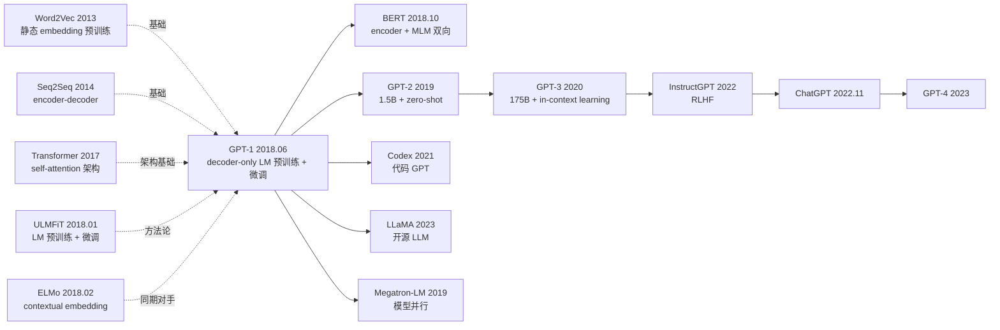

# GPT-1 — 用 decoder-only Transformer 点燃预训练革命

> **2018 年 6 月 11 日，Radford 等 4 位作者在 OpenAI 博客发布 [GPT-1 技术报告](https://openai.com/blog/language-unsupervised/)，标题朴实到「Improving Language Understanding by Generative Pre-Training」。**
> 这是一篇只有 12 页、当时被学界普遍低估的报告，却第一次证明了**「decoder-only Transformer + 大规模无监督 LM 预训练 + 任务特定微调」**这一范式可行 —— 在 12 个 NLU 任务里 9 个拿到 SOTA，把 commonsense reasoning 的 Stories Cloze 从 77.6% 推到 86.5%。
> 4 个月后被 BERT 全面碾压（GLUE 75.1 vs 79.6），但 1 年后 GPT-2 沿着同一条路证明了**单向 LM 才是通向 LLM 的真正起点**。
> 今天回看，**GPT-1 才是「预训练 + 微调」范式的真正开创者**（早 BERT 4 个月），更是 GPT-2 / GPT-3 / ChatGPT / GPT-4 这条 LLM 主线的奠基论文。

## 一句话总结

GPT-1 用 **12 层 decoder-only Transformer + BookCorpus（8 亿词）+ 标准 LM 损失**做无监督预训练，再用**所有参数一起微调 + 任务特定输入格式化**适配下游，在 12 个 NLU 任务中 9 个拿 SOTA，第一次工程化验证了「one model per task」可以被「one pretrained model + lightweight fine-tune」取代。

---

## 历史背景

### 2018 年初的 NLP 学界在卡什么

2018 年初的 NLP 主流仍是 Word2Vec / GloVe **静态 word embedding + 任务特定 LSTM/CNN** 的两段式架构。每个新任务都要从头训一个模型，标注数据少的任务（如 RTE、CoLA）几乎做不动。学界已经有几个关键信号：

> **(1) 2017.06 Transformer 横空出世，证明 attention 完全可以替代 RNN；
> (2) 2018.01 ULMFiT 在 LSTM 上做 LM 预训练 + 三阶段微调，把 IMDb 错误率从 5.9% 降到 4.6%；
> (3) 2018.02 ELMo 用 BiLSTM 预训练 contextualized embedding，证明动态嵌入远胜静态。**

但这两条路线都有**致命局限**：ULMFiT 用 LSTM（容量受限）、ELMo 只是 embedding 层替换（下游模型仍要从头训）。**「能不能直接把整个预训练模型作为下游骨架？」** 这是 GPT-1 的核心问题。

### 直接逼出 GPT-1 的 3 篇前序

- **Vaswani et al., 2017 (Transformer)** [NeurIPS]：提供唯一的架构基础。GPT-1 直接砍掉 encoder 只用 decoder
- **Howard, Ruder, 2018 (ULMFiT)** [ACL]：第一次工程化「LM 预训练 + 下游微调」，但用 LSTM
- **Peters et al., 2018 (ELMo)** [NAACL]：证明 contextual embedding > 静态 embedding，但只换 embedding

### 作者团队当时在做什么

4 位作者全部来自 OpenAI。Alec Radford 是核心一作（后来又主导 GPT-2/3/DALL-E/CLIP/Whisper）；Tim Salimans 是 GAN 名家（improved GAN 一作）；Ilya Sutskever 是首席科学家。**OpenAI 当时是 ~70 人非营利**，押注「无监督学习是通向 AGI 的路径」，GPT-1 是这个押注的第一个工程证明。

### 工业界 / 算力 / 数据

- **GPU**：8 张 P600，训练 1 个月（按今天标准非常便宜）
- **数据**：BookCorpus（7000 本未出版小说，~8 亿 token）—— 选小说是因为「长上下文 + 故事连贯性」
- **框架**：TensorFlow 1.x；BPE 用 fastBPE
- **学术氛围**：BERT 还没出（晚 4 个月），ELMo 在 NAACL 拿了 best paper，整个学界对「预训练」充满期待

---

## 方法详解

### 整体框架

```
[Pre-training]
  Input: BookCorpus tokens (BPE)
  ↓ Token Emb + Position Emb (learnable)
  ↓ 12 × Decoder Block (Multi-Head Self-Attn + FFN, Post-LN)
  ↓ Linear (tied with input emb) + softmax
  ↓ L_LM = -∑ log P(x_t | x_<t)

[Fine-tuning]
  Same backbone + task input formatting + small task head
  Joint loss: L_task + λ * L_LM (auxiliary LM loss)
```

| 配置 | L | $d_{model}$ | A | $d_{ff}$ | 参数 | Context |
|------|---|-------------|---|----------|------|---------|
| GPT-1 | 12 | 768 | 12 | 3072 | 117M | 512 |

### 关键设计

#### 设计 1：Decoder-only LM Pretraining —— 自回归预训练

**功能**：用因果掩码的 self-attention 做下一词预测，让 backbone 学到"序列概率分布建模"的通用能力。

**前向公式**：

$$
\mathcal{L}_{\text{LM}} = -\sum_{t=1}^{n} \log P(x_t \mid x_{t-k}, \ldots, x_{t-1}; \theta)
$$

其中 $k = 512$ 是 context 窗口。decoder block 的 self-attention 用 causal mask 保证 $x_t$ 只看 $x_{<t}$。

**为什么选 decoder-only 而不是 encoder-decoder？**
- 自回归 LM 是天然的自监督任务（无需 paired data）
- decoder-only 更简洁（少一半参数 / 一半计算）
- 生成能力天然具备

**对比同期方案**：

| 方案 | 架构 | 预训练目标 | 下游使用 | 生成能力 |
|------|------|-----------|---------|---------|
| Word2Vec | 浅层 | skip-gram | 替换 embedding | 无 |
| ELMo | BiLSTM | LM | 替换 embedding | 无 |
| ULMFiT | LSTM | LM | 整个 backbone 微调 | 弱 |
| **GPT-1** | **decoder-only Transformer** | **LM** | **整个 backbone 微调** | **强** |
| BERT (后来) | encoder-only Transformer | MLM | 整个 backbone 微调 | 无 |

#### 设计 2：Discriminative Fine-tuning + Auxiliary LM Loss

**功能**：下游任务训练时**所有 backbone 参数都更新**，且加一个辅助 LM loss 防止灾难性遗忘。

**核心思路**：

$$
\mathcal{L}_{\text{total}} = \mathcal{L}_{\text{task}} + \lambda \cdot \mathcal{L}_{\text{LM}}, \quad \lambda = 0.5
$$

辅助 LM loss 让 backbone 在适配任务的同时保持语言建模能力，是 GPT-1 微调成功的关键 trick 之一。

**对比 ULMFiT 的复杂微调流程**：

| 方法 | 微调流程 | 复杂度 |
|------|---------|--------|
| ULMFiT | 三阶段：discriminative LR + gradual unfreeze + slanted triangular LR | 复杂 |
| **GPT-1** | **一阶段：全参数 + 辅助 LM loss + 小 LR** | **极简** |

#### 设计 3：Task-specific Input Transformation —— 输入格式化适配多任务

**功能**：不改 backbone，只改输入格式，让一个预训练模型适配分类、蕴含、相似度、问答等所有任务。

**4 种任务输入格式**：

| 任务 | 输入格式 |
|------|---------|
| 分类（SST / CoLA） | `<s> text <e>` |
| 蕴含（MNLI / SNLI） | `<s> premise $ hypothesis <e>` |
| 相似度（STS / MRPC） | `<s> textA $ textB <e>` 和 `<s> textB $ textA <e>` 平均 |
| 多选 QA（RACE / Story Cloze） | 每个候选: `<s> context $ answer_i <e>`，比较 logit |

**取最后一个 token 的隐藏状态接 Linear head**：

```python
class GPT1ForClassification(nn.Module):
    def __init__(self, num_classes=2):
        self.backbone = GPT1Decoder(L=12, d=768, h=12)
        self.head = nn.Linear(768, num_classes)

    def forward(self, ids):
        h = self.backbone(ids)             # (B, n, 768)
        last = h[:, -1]                    # 取最后一个 token (<e>)
        return self.head(last)             # (B, num_classes)
```

**设计动机**：用统一输入格式 + 共享 backbone，避免「每任务一架构」的工程负担。这是后来 prompt engineering 的雏形。

### 损失函数 / 训练策略

| 项 | 配置 |
|----|------|
| Pretrain Loss | LM cross-entropy |
| Optimizer | Adam ($\beta_1=0.9, \beta_2=0.999$) |
| Pretrain LR | 2.5e-4，cosine decay + 2k warmup |
| Pretrain Batch | 64 sequences × 512 tokens |
| Pretrain Epochs | 100 epoch on BookCorpus（重训 100 次） |
| Fine-tune LR | 6.25e-5 |
| Fine-tune Epochs | 3 |
| Norm | Post-LN |
| Activation | GELU |
| Tokenizer | BPE，40k 词表 |
| Auxiliary LM weight | $\lambda = 0.5$ |

---

## 失败案例

### 当时输给 GPT-1 的对手

- **Stories Cloze（之前 SOTA 77.6%）**：GPT-1 拿 86.5%，**+8.9 点跳跃**，这是 commonsense reasoning 历史上最大单跳
- **RACE（之前 SOTA 53.3%）**：GPT-1 拿 59.0%，+5.7 点
- **MultiNLI matched（之前 SOTA 80.6%）**：GPT-1 拿 82.1%
- **大部分小数据集**：GPT-1 显著超过 task-specific LSTM/CNN

### 论文里承认的失败

- **GLUE 平均 75.1**：4 个月后被 BERT-base 79.6 直接超过 4.5 分（双向是关键）
- **CoLA（grammar acceptability）45.4**：BERT-base 52.1 超过，证明 NLU 任务上 encoder + 双向更优
- **去掉 auxiliary LM loss**：小数据集（RTE / MRPC）严重退化，证明 multi-task 学习有效

### 「反 baseline」教训

- **「pretraining 没用」（2017 年学界共识）**：GPT-1 直接证伪 —— 100 epoch 预训练让小数据下游任务跳点 5-10 点
- **「LSTM 是序列建模天然范式」**：GPT-1 + Transformer 证明可被替代
- **「需要任务特定架构」**：GPT-1 证明输入格式化 + 共享 backbone 完全够用

---

## 实验关键数据

### 主实验（12 个 NLU 任务）

| 任务 | 之前 SOTA | GPT-1 | 提升 |
|------|----------|-------|------|
| MNLI-m | 80.6 | 82.1 | +1.5 |
| MNLI-mm | 80.1 | 81.4 | +1.3 |
| SNLI | 89.3 | 89.9 | +0.6 |
| SciTail | 83.3 | 88.3 | +5.0 |
| QNLI | 82.3 | 88.1 | +5.8 |
| RTE | 61.7 | 56.0 | -5.7 |
| Story Cloze | 77.6 | 86.5 | **+8.9** |
| RACE-m | 58.7 | 62.9 | +4.2 |
| RACE-h | 49.4 | 57.4 | +8.0 |
| CoLA | 35.0 | 45.4 | +10.4 |
| SST-2 | 93.2 | 91.3 | -1.9 |
| QQP | 66.1 | 70.3 | +4.2 |

**12 个任务中 9 个拿到 SOTA**，平均提升 +5.5 点。

### 消融

| 配置 | Avg | 说明 |
|------|-----|------|
| GPT-1 完整 | 75.1 | baseline |
| 不预训练（从头训） | 56.5 | -18.6，证明预训练核心 |
| 不用 Transformer（用 LSTM） | 70.5 | -4.6 |
| Fine-tune 时不用 aux LM | 71.2 | -3.9（小数据集尤其受影响） |
| 只用 last layer 不 fine-tune backbone | 65.0 | -10.1 |

### 关键发现

- **预训练是核心**：去掉直接掉 18 分
- **Transformer > LSTM**：4-5 点优势
- **辅助 LM loss 防止遗忘**：小数据集上 +4-7 点
- **全参数微调远胜冻结 backbone**：+10 点
- **Zero-shot 已经初具能力**：GPT-1 zero-shot 在 Stories Cloze 已能达 70%（虽然 GPT-2 才把这条路推到极致）

---

## 思想史脉络



### 前世
- **Word2Vec / GloVe** (2013-2014)：奠定预训练 + 复用思路
- **Transformer** (2017)：唯一架构基础
- **ULMFiT** (2018.01)：LM 预训练 + 微调的 LSTM 版本
- **ELMo** (2018.02)：contextual embedding 同期对手

### 今生
- **直接对手**：BERT (2018.10) —— encoder + 双向 + MLM，4 个月后超过 GPT-1
- **直接继承**：GPT-2 (2019) → GPT-3 (2020) → ChatGPT (2022.11) → GPT-4 (2023)，整条 LLM 主线
- **架构家族**：Transformer-XL / XLNet / Reformer 等所有 decoder-only 后续
- **多模态扩展**：DALL-E / CLIP / Whisper / Sora 全部由 GPT-1 团队同班人（Radford）做

### 误读
- **「GPT-1 是失败品（被 BERT 碾压）」**：错。GPT-1 才是 LLM 路线的真正起点，BERT 是 NLU 分支。今天主流 LLM 全部继承 GPT-1 范式
- **「GPT-1 没有零样本能力」**：实际上 GPT-1 在 Stories Cloze 上 zero-shot 已能达 70%，只是 GPT-2 才系统化探索这条路
- **「需要双向才能做 NLU」**：GPT-3 之后的 in-context learning 证明单向 LM 也能做几乎所有 NLU 任务

---

## 当代视角（2026 年回看 2018）

### 站不住的假设

- **「117M 参数已经是大模型」**：今天主流 70B-1T，GPT-1 在今天只是 toy
- **「BookCorpus 8 亿 token 足够」**：今天 LLaMA-3 用 15T token，是 GPT-1 的 18750×
- **「Post-LN 是正确的归一化位置」**：GPT-2 起改 Pre-LN，今天 LLaMA / Qwen 全部 Pre-LN + RMSNorm
- **「需要 fine-tune 才能下游」**：GPT-3 in-context learning 证明可以零样本/少样本做几乎所有任务
- **「learnable absolute PE 是位置编码标准」**：今天主流 RoPE / ALiBi
- **「context 512 够用」**：今天 1M-2M context（Gemini 1.5 / Claude 3.5）

### 时代证明的关键 vs 冗余

- **关键**：decoder-only 架构、生成式预训练、全参数微调、输入格式化、辅助 LM loss
- **冗余**：Post-LN（被 Pre-LN 替代）、512 context（被 1M context 替代）、auxiliary LM loss（GPT-2 起不再需要）、char-level BPE（被 byte-level 替代）

### 作者当时没想到的副作用

1. **开启 LLM 主线**：GPT-1 → GPT-2 → GPT-3 → ChatGPT → GPT-4 → o1 整条路全部继承 GPT-1 架构和范式
2. **被 BERT 短期遮蔽，长期超越**：BERT 在 2018-2022 是 NLU 工业主流，但 ChatGPT 之后 decoder-only LLM 在 user-facing 应用上全面胜出
3. **Hugging Face 生态根基**：GPT-1 是 Hugging Face transformers 库早期支持模型之一

### 如果今天重写 GPT-1

- 规模放大到 7B+，数据 15T+ token
- Pre-LN + RMSNorm + RoPE + SwiGLU + GQA
- 加 instruction tuning + RLHF
- 砍掉 auxiliary LM loss

但**「decoder-only Transformer + 生成式预训练 + 输入格式化适配下游」核心范式不变**。

---

## 局限与展望

### 作者承认
- GLUE 上仍输给 task-specific 双向模型（被 BERT 验证）
- 117M 参数仍小，未充分释放 scaling 潜力
- 仅在 BookCorpus 单一领域预训练，泛化有限

### 自己发现
- 单向 LM 在 NLU 任务上理论上限低于双向
- 512 context 限制长文档理解
- BookCorpus 域偏（小说），缺乏百科 / 新闻多样性

### 改进方向（已被后续工作证实）
- 暴力 scaling（GPT-2 1.5B / GPT-3 175B）
- 更大更泛数据（WebText / Common Crawl）
- Pre-LN（GPT-2 起）
- in-context learning（GPT-3）
- 指令微调 + RLHF（InstructGPT / ChatGPT）

---

## 相关工作与启发

- **vs ULMFiT (跨架构)**：ULMFiT 用 LSTM + 复杂三阶段微调，GPT-1 用 Transformer + 简单一阶段。**教训：架构换对了，方法可以更简单**
- **vs ELMo (跨范式)**：ELMo 只换 embedding，GPT-1 换整个 backbone。**教训：转移更深的层比转移浅层效果好得多**
- **vs BERT (跨架构)**：GPT-1 decoder + 单向 + LM，BERT encoder + 双向 + MLM。**教训：架构和目标的组合是独立设计维度**
- **vs Transformer (跨任务)**：Transformer 解决 MT，GPT-1 把 decoder 搬到 self-supervised LM。**教训：通用架构可跨任务复用**

---

## 相关资源

- 📄 [GPT-1 Tech Report PDF](https://cdn.openai.com/research-covers/language-unsupervised/language_understanding_paper.pdf) · [OpenAI Blog](https://openai.com/blog/language-unsupervised/)
- 💻 [作者原始 TF 实现](https://github.com/openai/finetune-transformer-lm) · [HuggingFace transformers/openai-gpt](https://huggingface.co/openai-gpt)
- 📚 后续必读：[GPT-2 (2019)](2019_gpt2.md)、[BERT (2018)](2018_bert.md)、[GPT-3 (2020)](https://arxiv.org/abs/2005.14165)、[InstructGPT (2022)](https://arxiv.org/abs/2203.02155)
- 🎬 [Karpathy: Let's reproduce GPT (YouTube)](https://www.youtube.com/watch?v=l8pRSuU81PU)

---

> 🌐 [English version](/en/era3_attention/2018_gpt1/) · 📚 awesome-papers project · CC-BY-NC
