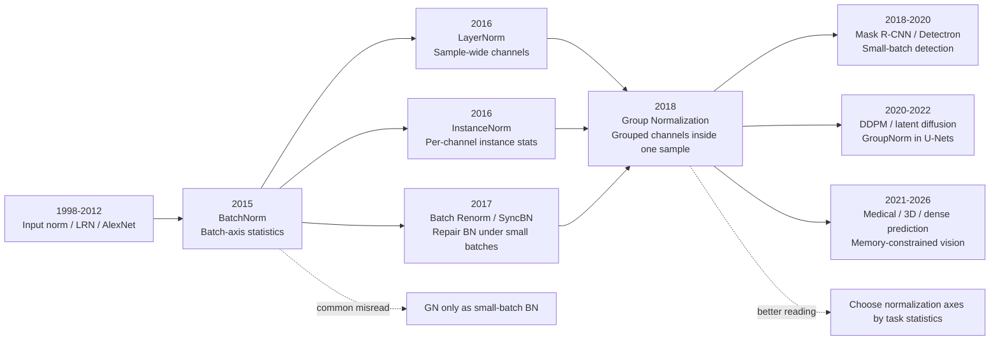

# Group Normalization - 让归一化摆脱 batch size

> **2018 年 3 月 22 日，Facebook AI Research 的 Yuxin Wu 与 Kaiming He 两位作者上传 [arXiv:1803.08494](https://arxiv.org/abs/1803.08494)，后来发表于 ECCV 2018。** 这篇论文没有发明更深的 backbone，也没有提出新的检测框架；它盯住了一个工程师每天都碰到、却很少被当成第一等问题的矛盾：BatchNorm 在 ImageNet 大 batch 上近乎完美，一到 detection、segmentation、video 这种显存吃紧的任务就开始失灵。GN 的答案只有一个 reshape：把通道切成组，在组内算均值和方差，不再看 batch 维。batch size 2 时，ResNet-50 上 BN error 是 34.7%，GN 仍是 24.1%。这 10.6 个百分点让归一化第一次真正从「要攒够 batch」变成「每张图自己也能站稳」。

## 一句话总结

Wu 与 He 两位作者 2018 年发表在 ECCV 的 **Group Normalization**，把 BatchNorm（2015） 的核心公式从跨样本统计改成组内通道统计：对特征 $x\in\mathbb{R}^{N\times C\times H\times W}$，先把通道划成 $G$ 组，再用 $\mu_i=\frac{1}{|S_i|}\sum_{k\in S_i}x_k$、$\hat{x}_i=(x_i-\mu_i)/\sqrt{\sigma_i^2+\epsilon}$ 在 $(C/G,H,W)$ 轴上归一化。它替代的失败 baseline 不是 BN 在大 batch 下的成功形态，而是小 batch 视觉任务里的 frozen BN、SyncBN、Batch Renorm、LayerNorm/InstanceNorm 妥协：ResNet-50 在 ImageNet batch size 2 时 BN error 暴涨到 34.7%，GN 维持 24.1%；Mask R-CNN R50-FPN long schedule 在 COCO 上从 frozen BN 的 38.6/34.5 box/mask AP 提升到 40.8/36.1。后续扩散模型 U-Net、高清分割、3D/医学影像都继承了这个 lesson：归一化层不只是优化技巧，它的统计轴决定了一个模型能不能在真实显存约束下训练。

---

## 历史背景

### 2018 年视觉任务的 batch size 焦虑

2018 年的计算机视觉已经不缺强 backbone。ResNet 让 50、101、152 层网络成为日常，FPN 和 Mask R-CNN 把检测与实例分割推到 COCO 时代，视频识别也开始把 2D CNN 扩成 3D 时空卷积。表面上看，视觉模型的主要矛盾是更深、更大、更高分辨率；真正卡住工程实践的，往往是一个更朴素的数：每张 GPU 上还能放几张图。

BatchNorm 在 2015 年之后几乎成了 CNN 的默认器官。它用 mini-batch 的均值和方差稳定训练，顺带带来一些正则噪声；在 ImageNet 分类里，每卡 32 张图、总 batch 256 这类设置让 BN 的统计量相当可靠。但检测、分割、视频理解不是这种世界。检测/分割要用 800 像素长边甚至更高分辨率，RoI head、mask head、FPN 多尺度特征都要显存；视频模型还要多一个时间轴，一个 32 帧或 64 帧 clip 就能吃掉大量内存。

于是出现了很尴尬的现实：越是需要高分辨率和复杂 head 的任务，每卡 batch size 越小；越是小 batch，BN 的统计量越不可信。Fast/Faster R-CNN 和 Mask R-CNN 的主流做法常常是 **Frozen BN**：从 ImageNet 预训练模型里拿 running mean / variance，把 BN 变成一个固定线性层，fine-tuning 时不再真正归一化。这能避免训练炸掉，却制造了 pretraining/fine-tuning 不一致，也让新 head 失去可靠归一化。

### BatchNorm 的成功留下了副作用

BN 的强大让社区一度把「训练深网」和「有大 batch」绑定在一起。这个绑定在大规模分类里看不出来，因为分类图像小、batch 大、BN 噪声还能正则化；到了 detection 或 3D video，它变成了架构设计的隐藏税。研究者必须在更长视频 clip、更高输入分辨率、更大模型容量和更可靠 BN 统计之间做 trade-off。

当时有几种补丁。Frozen BN 牺牲 fine-tuning 适配；SyncBN 把多个 GPU 的统计量同步起来，但代价是通信开销和硬件规模，还会限制异步训练；Batch Renorm 用 $r,d$ 修正 batch 统计和 population 统计的差距，却仍然依赖 batch；LayerNorm 不看 batch，但在 CNN 视觉识别上把所有通道混在一起，表达假设太粗；InstanceNorm 每个通道独立，适合风格迁移，却丢掉通道间对比信息。

GN 的切入点很干净：既不要求跨样本统计，也不把所有通道或单个通道推到极端，而是在通道维上取一个中间粒度。这个选择听起来小，但它改写了归一化层的默认问题：不是「怎样让 BN 在小 batch 下勉强可用」，而是「能不能设计一种从公式上就不依赖 batch 的 CNN 归一化」。

### 作者团队与 FAIR 的语境

Yuxin Wu 与 Kaiming He 当时都在 Facebook AI Research。何恺明此前已经是 ResNet、Faster R-CNN、Mask R-CNN、FPN 这条视觉主线的核心作者之一；这不是偶然背景。GN 的论文不是从抽象归一化理论里空降，而是从检测/分割系统的日常痛点里长出来的。FAIR 的 Detectron 代码库正是这些任务的主要实验平台，COCO 上的 frozen BN 习惯也在那里被工程化得很清楚。

这也解释了论文为什么同时做 ImageNet、COCO 和 Kinetics。ImageNet 证明 GN 不只是一个小 batch hack，在常规 batch 下也接近 BN；COCO 证明它解决了 detection/segmentation fine-tuning 的真实问题；Kinetics 证明它能让 3D video 模型把显存用在更长时间上下文上，而不是被 BN 的 batch 需求绑架。

### 直接逼出 GN 的前序工作

| 前序 | 归一化轴 | 当时贡献 | GN 继承 / 修正 |
|------|----------|----------|----------------|
| BatchNorm 2015 | $(N,H,W)$ | 稳定 CNN 训练，成为 ResNet/Inception 默认层 | 保留可学习 $\gamma,\beta$，删除 batch 依赖 |
| LayerNorm 2016 | $(C,H,W)$ | 适合 RNN/序列模型，不依赖 batch | 证明 batch-free 可行，但全通道假设对 CNN 太粗 |
| InstanceNorm 2016 | $(H,W)$ | 风格迁移中去除实例风格统计 | 保留 batch-free 思路，补回跨通道组信息 |
| Batch Renorm / SyncBN 2017-2018 | batch 修正 / 跨卡 batch | 尝试修 BN 小 batch 问题 | 仍在维护 batch 统计，GN 改为换统计轴 |

这几条线共同把问题推到 GN 面前：归一化必须保留 BN 的优化稳定性和 affine 自由度，但不能继续要求一个任务先满足大 batch 条件。GN 的简洁性就在于，它没有新增通信、没有维护复杂 correction，也没有要求新训练系统；它只是把统计集合 $S_i$ 换成「同一张图里的同一组通道」。

---

## 方法详解

### 整体框架：从 batch 轴换到组内通道轴

Group Normalization 的方法部分很短，因为它真正的动作只有一个：重新定义归一化统计量从哪里来。BatchNorm 的统计集合跨过 batch 轴，同一通道的所有样本和空间位置共同估计均值、方差；GN 则把每一张图单独拿出来，把通道切成若干组，只在同一张图、同一组通道和空间位置上估计统计量。它不是给 BN 加 correction，也不是让多张 GPU 互相通信凑出更大的 batch，而是把归一化层从 batch size 这个外部条件里解耦出来。

设输入特征为 $x\in\mathbb{R}^{N\times C\times H\times W}$，对任意元素 $i=(i_N,i_C,i_H,i_W)$，归一化族都可写成同一个模板：

$$
\hat{x}_i = \frac{x_i - \mu_i}{\sigma_i}
$$

其中均值与标准差来自某个统计集合 $\mathcal{S}_i$：

$$
\mu_i = \frac{1}{m}\sum_{k\in\mathcal{S}_i}x_k, \qquad
\sigma_i = \sqrt{\frac{1}{m}\sum_{k\in\mathcal{S}_i}(x_k-\mu_i)^2 + \epsilon}
$$

BN、LN、IN、GN 的区别不是公式长相，而是 $\mathcal{S}_i$ 的定义：

$$
\begin{aligned}
\mathcal{S}^{BN}_i &= \{k\mid k_C=i_C\} && \text{over } (N,H,W),\\
\mathcal{S}^{LN}_i &= \{k\mid k_N=i_N\} && \text{over } (C,H,W),\\
\mathcal{S}^{IN}_i &= \{k\mid k_N=i_N, k_C=i_C\} && \text{over } (H,W),\\
\mathcal{S}^{GN}_i &= \{k\mid k_N=i_N, \lfloor k_C/(C/G)\rfloor=\lfloor i_C/(C/G)\rfloor\} && \text{over } (C/G,H,W).
\end{aligned}
$$

最后仍然保留 BN 以来的可学习仿射变换：

$$
y_i = \gamma_{i_C}\hat{x}_i + \beta_{i_C}
$$

这个公式安排解释了 GN 的核心性格：它保留归一化层帮助优化的机制，也保留每个通道可学习的 scale / shift，但删除了 batch 统计带来的估计噪声、训练/推理不一致和迁移时冻结 BN 的麻烦。

| 方法 | 统计轴 | 依赖 batch size | 典型强项 | 在 GN 论文中的问题 |
|------|--------|-----------------|----------|--------------------|
| BN | $(N,H,W)$ | 是 | 大 batch ImageNet 分类 | batch size 2 时 ResNet-50 error 到 34.7% |
| LN | $(C,H,W)$ | 否 | RNN / Transformer 式序列模型 | CNN 中全通道共享统计过粗，ImageNet error 25.3% |
| IN | $(H,W)$ | 否 | 风格迁移、实例级风格去除 | 每通道独立太窄，ImageNet error 28.4% |
| GN | $(C/G,H,W)$ | 否 | 小 batch 视觉、检测、分割、视频 | 大 batch 下少了 BN 的随机正则，略低 0.5 点 |

### 关键设计 1：统计集合 $\mathcal{S}_i$ 是真正的创新

GN 的反直觉之处在于，它没有试图解释 BN 为什么有效之后再仿制 BN；它直接问：CNN 特征中有没有一个比「整个 batch」更可靠、比「单个通道」更有表达力的统计单元？答案是通道组。卷积网络的通道并不是无结构向量：底层可能有方向、颜色、频率，深层可能有纹理、部件、形状响应。把一组相关通道放在一起估计均值和方差，比 LN 的全通道混合更细，比 IN 的单通道归一更宽。

论文用经典手工特征做动机：SIFT、HOG、GIST、Fisher Vector 都把特征拆成若干局部或方向组，再在组内做归一化。GN 把这套老计算机视觉直觉移植到深度 CNN：一个 group 不是语义上预先命名的部件，而是给网络一个中间粒度的统计假设。这个假设足够弱，网络可以在通道排列中自适应；又足够强，归一化不会退化成每个通道孤立处理。

从优化角度看，GN 的统计量每次前向都来自当前样本自身，不随另一个样本是否恰好被放进同一个 mini-batch 而改变。因此同一张图在训练和推理时看到的是同一种归一化规则。BN 的优势是大 batch 时统计稳定且噪声可正则化；GN 的优势是当 batch size 被任务显存限制挤到 1 或 2 时，统计对象仍然有 $C/G\times H\times W$ 个元素，估计不会坍缩。

### 关键设计 2：32 组不是魔法数，而是中间粒度

论文默认使用 $G=32$。这个选择后来被许多实现当成固定习惯，但它更像一个稳健的中间点：$G=1$ 时 GN 退化为 LayerNorm，所有通道共享一套统计；$G=C$ 时 GN 退化为 InstanceNorm，每个通道各算各的。中间的 32 组让每组既包含足够多通道，又不把所有语义响应揉成一个总体。

ImageNet ablation 支持这个判断。固定组数时，$G=32$ 的 ResNet-50 validation error 是 24.1%，$G=64/16/8/4/2$ 都在 24.4-24.7% 附近，$G=1$ 也就是 LN 到 25.3%。固定每组通道数时，16 channels/group 最好，为 24.2%；1 channel/group 也就是 IN 到 28.4%。结论不是「32 必须正确」，而是「分组通道」这个中间假设比两个极端更适合 CNN 识别。

| 设置 | 含义 | ImageNet ResNet-50 error | 读法 |
|------|------|---------------------------|------|
| $G=1$ | 等价 LN | 25.3% | 全通道统计太粗 |
| $G=32$ | 论文默认 | 24.1% | 稳健中间点 |
| $G=64$ | 更细组 | 24.6% | 略差但仍可用 |
| 16 channels/group | 固定每组通道数 | 24.2% | 与默认非常接近 |
| 1 channel/group | 等价 IN | 28.4% | 失去跨通道信息 |

### 关键设计 3：训练、迁移、推理使用同一套规则

BN 有一个常被低估的工程复杂性：训练时使用 mini-batch 统计，推理时使用 running mean / variance；分类预训练时 batch 大，检测 fine-tuning 时 batch 小；如果 fine-tuning 继续更新 BN，统计量噪声太大，如果冻结 BN，又变成固定线性层，和新任务数据分布脱节。Mask R-CNN、Faster R-CNN 里的 Frozen BN 正是这种妥协。

GN 避开了这个状态机。它没有 population statistics，不需要维护 running mean，也没有训练/推理两套行为。检测 fine-tuning 时，把 backbone、box head、mask head 里的 BN 换成 GN，所有新层都能正常归一化；视频模型把空间轴扩为 $(T,H,W)$，仍然按组内通道与时空位置算统计；从 ImageNet 迁移到 COCO 或 Kinetics 时，归一化规则没有突然改变。

这个设计在 COCO 实验里尤其关键。论文指出，尝试在 detection batch size 2 下直接 fine-tune BN 会降低约 6 AP；而 frozen BN 虽然稳定，却实际上不再做归一化。GN 的收益来自两个地方：预训练特征迁移更一致，新初始化 head 也有可训练的归一化层。

### 关键设计 4：几行 reshape 就能落进现有框架

GN 的工程影响力和它的简单实现直接相关。一个 normalization layer 如果需要跨卡通信、特殊同步或复杂 correction，很容易停在论文里；GN 只需要 reshape、moment、reshape back。论文给出的 TensorFlow 代码几乎就是现代框架里 `GroupNorm` 的全部思想。

```python
def group_norm(x, gamma, beta, groups=32, eps=1e-5):
    # x: [N, C, H, W]
    n, c, h, w = x.shape
    x = x.reshape(n, groups, c // groups, h, w)
    mean = x.mean(axis=(2, 3, 4), keepdims=True)
    var = ((x - mean) ** 2).mean(axis=(2, 3, 4), keepdims=True)
    x = (x - mean) / (var + eps) ** 0.5
    x = x.reshape(n, c, h, w)
    return x * gamma + beta
```

这段代码背后的美学是：把复杂性放在统计轴选择上，而不是放在训练系统里。SyncBN 需要跨设备同步，Batch Renorm 需要额外的 $r,d$ 约束和 schedule，Frozen BN 需要管理预训练统计；GN 的依赖只有当前张量本身。这让它很快被 Detectron、PyTorch、医学影像框架和扩散模型 U-Net 接收。

### 与 BN/LN/IN 的关系

GN 最容易被误解成「小 batch BN」。更准确的说法是：它把归一化方法组织成一个轴选择谱系。BN 选 batch 轴，LN 选样本内所有通道，IN 选样本内单通道，GN 选样本内一组通道。它不是 BN 的补丁，而是把 BN、LN、IN 放到同一个公式里后，补上中间缺失的一格。

这也解释了为什么 GN 的影响没有像 ResNet 或 Transformer 那样以「架构革命」的姿态出现。它改变的是许多模型的可训练边界：当输入分辨率、视频时长、3D 体素或扩散 U-Net 的显存压力让 batch size 无法变大时，GN 让研究者继续扩大模型或上下文，而不必先解决 batch 统计。它不像一个新 backbone 那样显眼，却像一枚稳定的轴承，藏在许多后来的视觉系统里。

---

## 失败案例

### 失败 baseline 1：小 batch BatchNorm 不是轻微退化，而是统计失真

GN 论文最有杀伤力的 baseline 是最普通的 BN。ResNet-50 在 ImageNet 上每卡 32 张图时，BN validation error 是 23.6%，GN 是 24.1%，BN 仍然略强；但当每卡 batch size 降到 2，BN 变成 34.7%，GN 仍是 24.1%。这不是超参数没调好造成的小波动，而是 BN 估计对象本身变了：每个通道的均值和方差只来自 2 张图的空间位置，样本抽样噪声足以把特征分布晃到训练目标之外。

这个失败很重要，因为它戳破了一个常见误会：BN 的问题不是「batch size 小一点会慢一点」，而是「归一化值本身变成随机噪声」。当 batch size 从 32、16 到 8，BN 还能勉强维持；到 4 和 2，error 分别到 27.3% 和 34.7%。GN 的曲线几乎水平，24.1、24.2、24.0、24.2、24.1，说明性能主要由模型和优化决定，而不是由 mini-batch 恰好抽到谁决定。

| per-GPU batch size | BN error | GN error | GN 相对 BN |
|--------------------|----------|----------|------------|
| 32 | 23.6% | 24.1% | -0.5 点 |
| 16 | 23.7% | 24.2% | -0.5 点 |
| 8 | 24.8% | 24.0% | +0.8 点 |
| 4 | 27.3% | 24.2% | +3.1 点 |
| 2 | 34.7% | 24.1% | +10.6 点 |

### 失败 baseline 2：Frozen BN 让检测 fine-tuning 失去真正的归一化

检测和分割系统里的常规补丁是 Frozen BN。它用 ImageNet 预训练阶段保存下来的 running mean / variance，把 BN 变成 $y=\frac{\gamma}{\sigma}(x-\mu)+\beta$ 这样的固定线性层。这个做法能避免小 batch 统计炸掉，但它也意味着 fine-tuning 时新任务、新分辨率、新 RoI 分布并没有被当前数据重新归一化。

GN 论文在 COCO Mask R-CNN 上直接展示了这个代价。ResNet-50 C4 backbone 上，Frozen BN 是 37.7 box AP / 32.8 mask AP，GN 是 38.8 / 33.6。ResNet-50 FPN 长训练下，Frozen BN 是 38.6 / 34.5，GN 到 40.8 / 36.1。更关键的是，论文尝试过在 detection batch size 2 下直接 fine-tune BN，结果约掉 6 AP，所以它没有成为正式表格里的可竞争 baseline。

Frozen BN 的失败不是数值崩溃，而是表达能力被静态化。对于随机初始化的 box head、mask head，BN 如果冻结就没有意义；如果不冻结，统计又不可靠。GN 让这些 head 可以包含真正训练中的归一化层，这也是 FPN ablation 中「只在 box head 加 GN」就能把 box AP 从 38.6 提到 39.5 的原因。

### 失败 baseline 3：LN、IN、Batch Renorm、SyncBN 都只解决了一半

LayerNorm 和 InstanceNorm 都不依赖 batch，但它们的统计轴落在两个极端。LN 把同一张图的所有通道混在一起，对 CNN 识别来说假设太粗；IN 每个通道独立，适合风格迁移，却丢掉跨通道对比。ImageNet batch size 32 下，LN 是 25.3%，IN 是 28.4%，GN 是 24.1%。这个结果说明「不看 batch」本身不够，关键是选对样本内的统计粒度。

Batch Renorm 仍然站在 BN 框架里修补，用 $r,d$ 限制当前 batch 统计和 population statistics 的偏差。论文仔细调过 ResNet-50 的 $r_{max}=1.5,d_{max}=0.5$，batch size 4 时 BR error 是 26.3%，好过 BN 的 27.3%，但仍比 GN 的 24.2% 高 2.1 点。SyncBN 则把问题迁到系统层：跨 GPU 同步统计可以增大有效 batch，但带来通信、硬件规模、异步训练受限，并且在单机小资源或高分辨率任务中仍不优雅。

### 实验关键数据：GN 的价值随着任务显存压力变大而变大

GN 的实验设计很克制：ImageNet 先证明它不是只会救小 batch，COCO 再证明它能解决真实迁移任务，Kinetics 最后证明它能释放时序上下文。三组结果的共同模式是：当 BN 处在最适环境时，GN 接近但略弱；当任务必须牺牲 batch size 来换分辨率、head 或时间长度时，GN 的优势迅速放大。

| 场景 | BN / 常规做法 | GN | 关键信息 |
|------|---------------|----|----------|
| ImageNet R50, batch 32 | 23.6% top-1 error | 24.1% | 大 batch 下 BN 仍略强 |
| ImageNet R50, batch 2 | 34.7% | 24.1% | GN 低 10.6 点 error |
| COCO Mask R-CNN R50-C4 | 37.7 / 32.8 AP | 38.8 / 33.6 AP | fine-tuning 中 GN 胜过 Frozen BN |
| COCO Mask R-CNN R50-FPN long | 38.6 / 34.5 AP | 40.8 / 36.1 AP | box +2.2, mask +1.6 |
| COCO from scratch R101-FPN | SyncBN R50 34.5 box AP | GN R101 41.0 / 36.4 AP | GN 支持强 from-scratch detector |
| Kinetics R50-I3D, 64 frames | 73.3 / 90.8 top-1/top-5 | 74.5 / 91.7 | GN 让更长 clip 的收益显出来 |

这些数字让 GN 的定位很清楚：它不是为了在 ImageNet 大 batch 分类里击败 BN，而是为了把「能不能训练」从 batch size 约束中释放出来。它的胜负手发生在检测、分割、视频、医学图像、扩散模型这种显存被输入形态吃掉的场景。BN 需要一个理想训练环境，GN 更像真实训练环境里的默认保险。

---

## 思想史脉络

### 前世：从局部响应、批统计到通道分组

GN 的前世有两条线。一条是归一化作为优化工具：从 LeCun 早期输入标准化，到 AlexNet 的 Local Response Normalization，再到 BatchNorm（2015） 把隐藏层归一化变成深网默认组件。BN 的成功让大家相信，控制中间特征分布可以让很深的网络更容易训练。

另一条线是「组」作为视觉表示的自然单位。SIFT、HOG、GIST 这些手工特征并不是把所有维度当作一坨向量，而是在方向、空间 cell、频率或局部描述子上分组，再做组内归一化。ResNeXt、MobileNet、ShuffleNet 又把 group / depthwise / channel shuffle 变成 CNN 结构设计的一部分。GN 站在这两条线交叉处：它接受 BN 的优化目标，却从经典视觉和现代 grouped channel 设计里拿到了统计轴。

这也是 GN 和 LN/IN 的关系。LN 证明了 batch-free 归一化可以训练模型，但它的主要舞台是 RNN 和后来的 Transformer；IN 证明了每实例统计对生成和风格迁移有用，但它在识别任务中过度抹平通道差异。GN 补的是 CNN 识别中缺失的中间层级。

### 今生：扩散 U-Net 和高清视觉的默认层

GN 的后续影响最清楚地出现在那些天然 batch 很小的模型里。扩散模型的 U-Net 往往要处理高分辨率特征、skip connection、多尺度 attention 和长训练过程，有效 batch 不可能像 ImageNet 分类那样宽裕。DDPM（2020） 及其后继扩散 U-Net 大量采用 GroupNorm 或带条件调制的 GroupNorm；Stable Diffusion 这条潜空间扩散路线也继承了这种习惯。对这些模型来说，GN 不是论文里的 ablation，而是默认 building block。

在医学影像、3D 视觉、遥感、dense prediction 中，GN 的角色也类似。输入可能是 3D volume、超高分辨率图像、稀疏点云投影或长视频 clip，batch size 很难变大。研究者真正需要的是把显存花在空间/时间上下文上，而不是给 BN 攒统计量。GN 恰好把这个选择权还给模型设计。

### 误读：GN 不是「BN 的小 batch 版本」

最常见的误读是把 GN 当成 BN 在小 batch 下的替代品。这句话不算错，但太窄。GN 论文真正留下的是一个设计原则：归一化层的统计轴应该匹配任务的资源约束和表示结构。语言模型后来偏向 LN/RMSNorm，是因为序列模型天然不依赖图像通道组；扩散和分割偏向 GN，是因为高分辨率视觉天然受 batch size 限制；大 batch 分类仍可使用 BN，是因为 batch 统计在那个环境里又准又带正则。

另一个误读是认为 GN 总是优于 BN。论文自己很诚实：常规 ImageNet batch size 下，BN 23.6%，GN 24.1%，GN 少了一部分 batch 噪声正则。GN 的价值不是「所有环境绝对更好」，而是「当 BN 的前提不成立时，不再被迫用冻结、同步或牺牲输入规模来补救」。

### Mermaid 引用图



| 继承者 | 继承了什么 | 变形点 |
|--------|------------|--------|
| Mask R-CNN / Detectron | 小 batch 下 backbone 与 head 都可正常归一化 | 从分类迁移到 detection / segmentation fine-tuning |
| DDPM / diffusion U-Net | batch-independent normalization as default block | 与 timestep embedding、AdaGN / scale-shift conditioning 结合 |
| 医学与 3D 视觉 | batch size 1-2 时保持训练稳定 | 从 2D $(H,W)$ 扩到 3D $(D,H,W)$ 或时空 $(T,H,W)$ |
| Normalization-free networks | 反向继承 GN 的问题意识 | 尝试不用归一化，但需要更复杂初始化和训练配方 |

GN 的思想史位置不在「一个更高 AP 的 trick」，而在「把归一化层的统计对象显式暴露出来」。一旦你开始问 $\mathcal{S}_i$ 应该包含哪些元素，你就不再把 normalization 当黑盒层；你会把它当成模型对数据结构、硬件约束和优化路径的联合假设。

---

## 当代视角

### 站不住的假设

第一，论文里仍保留了「视觉 CNN 是主要舞台」的时代假设。2018 年 GN 面向 ResNet、Mask R-CNN、I3D 这条视觉卷积系统线；2026 年看，归一化格局已经更分裂：Transformer 主干通常使用 LayerNorm、RMSNorm 或它们的变体，视觉生成 U-Net 和 dense prediction 更常见 GN，超大 batch 分类或检测仍可能使用 BN / SyncBN。GN 没有成为所有模型的统一归一化层，它成为了小 batch 高分辨率视觉里的强默认。

第二，论文把组数 $G=32$ 作为稳健默认，但没有解决「组应该如何学习」的问题。现代模型如果重新设计，可能会让 grouping 与通道语义、attention head、条件调制或硬件 layout 联动，而不是固定顺序切通道。GN 的组是静态的，默认假设相邻通道形成合理组；这在普通 CNN 中足够好，但在混合架构、动态通道重排或跨模态特征里不一定最优。

第三，GN 舍弃 BN 的 batch 噪声正则后，常规大 batch 分类下略弱。论文已经指出 GN training error 更低但 validation error 略高，说明它更像优化稳定器，少了一部分随机正则。后来的实践通常用数据增强、dropout、stochastic depth、weight decay 或 EMA 补这部分泛化差距。

### 如果今天重写

如果今天重写 GN，方法部分可能会把它放进更宽的 normalization design space：统计轴、affine 参数、条件调制、是否有 running statistics、是否保持均值、是否只归一化 RMS、是否与 attention/head 结构对齐。它会和 RMSNorm、ScaleNorm、EvoNorm、Batch-Channel Norm、AdaGN、normalization-free networks 放在同一张地图里，而不只是和 BN/LN/IN 比。

实验也会扩展。除了 ImageNet、COCO、Kinetics，今天会补充 diffusion U-Net、latent diffusion、medical segmentation、3D detection、large-resolution semantic segmentation，以及 batch size 1 的极端设置。更有说服力的 ablation 会问：GN 的收益来自 batch independence，还是来自通道组统计？组数是否应该随 stage 改变？AdaGN 的条件 scale/shift 是否只是把 GN 变成一个更强的条件注入接口？

实现层面，今天的论文会更强调框架原生支持：`torch.nn.GroupNorm(num_groups, num_channels)` 已经是标准层；许多模型把 GN 写成 Conv-GN-SiLU 的模板。2018 年论文里「几行代码」是可采用性的论证；今天它已经变成默认工程常识。

### 局限、相关工作与资源

GN 的局限主要有三点。第一，它不是免费午餐：大 batch 分类中 BN 的统计噪声能带来正则，GN 常需要其他 regularizer 补足。第二，固定分组是假设而非学习结果，通道排列如果没有语义邻近性，组内统计未必最优。第三，GN 解决的是统计轴问题，不解决所有 normalization 相关问题，例如深层 residual scaling、优化器超参数、混合精度稳定性和极大模型的激活尺度控制。

相关工作可按三类读。基础归一化线包括 BatchNorm（2015）、LayerNorm、InstanceNorm、WeightNorm、Batch Renorm；视觉系统线包括 Mask R-CNN、FPN、Detectron、I3D；后续使用线包括 DDPM、latent diffusion / Stable Diffusion、医学影像 U-Net 变体，以及 normalization-free networks。官方资源则是论文的 [arXiv:1803.08494](https://arxiv.org/abs/1803.08494) 和 FAIR Detectron 的 [GN project code](https://github.com/facebookresearch/Detectron/tree/master/projects/GN)。

| 资源 | 用途 | 备注 |
|------|------|------|
| arXiv:1803.08494 | 原论文 | 公式、ImageNet/COCO/Kinetics 表格最完整 |
| Detectron GN project | 官方实现与 COCO 配置 | 展示 GN 如何替代 Frozen BN |
| PyTorch `GroupNorm` | 现代框架实现 | 默认不依赖 batch，常用于 Conv-GN-Activation |
| DDPM / latent diffusion 代码 | 后续影响样本 | GN 与条件调制结合最常见 |

### 读者应该带走什么

Group Normalization 的深层 lesson 是：归一化层不是一个中性插件，它把模型对数据、硬件和优化的假设写进了统计集合。BN 假设 mini-batch 是可信总体近似；LN 假设样本内所有通道可以共享尺度；IN 假设每个通道单独处理更好；GN 假设一组通道和空间位置足以提供稳定统计。换一个统计集合，模型能训练的任务边界就会改变。

这就是为什么 GN 值得进经典论文列表。它不像 ResNet 那样提供一个所有人都能画出来的模块，也不像 Transformer 那样改写整个 AI 主干；它解决的是更隐蔽但同样真实的问题：当真实任务不给你理想 batch size 时，模型还要继续训练。这个问题后来在检测、分割、视频、医学、扩散生成里反复出现，而 GN 给出的答案足够简单，简单到成了许多系统里最不显眼也最可靠的那一层。


---

> 🌐 [English version](/en/era3_attention/2018_group_norm/) · 📚 awesome-papers project · CC-BY-NC