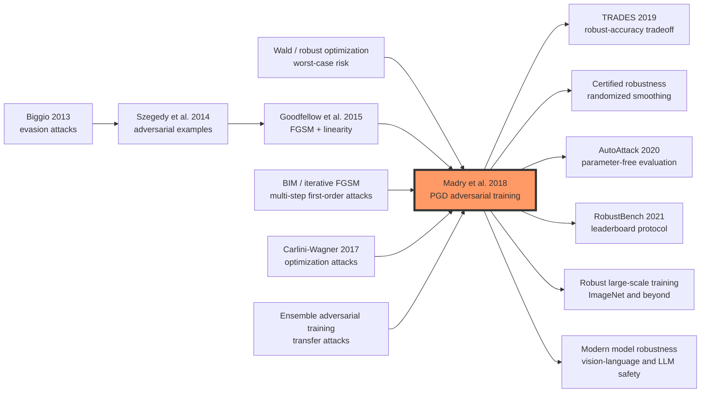

# PGD Adversarial Training — 把对抗鲁棒性写成最小最大问题

> **2017 年 6 月 19 日，Aleksander Madry、Aleksandar Makelov、Ludwig Schmidt、Dimitris Tsipras、Adrian Vladu 五位作者把 [arXiv 1706.06083](https://arxiv.org/abs/1706.06083) 上传到网上，后来发表于 ICLR 2018。** 这篇论文没有发明新网络层，也没有靠更大的模型刷干净数据集精度；它把一个令人不安的安全问题写成最小最大优化：先让攻击者在 ε 球里尽力增大损失，再让模型在这个最坏输入上学习。PGD 因此从一个普通优化器变成了鲁棒性研究的“压力测试机”：MNIST 在 100 步、20 次重启的白盒 PGD 下还能有 **89.3%**，CIFAR-10 在 ε=8 的 20 步 PGD 下仍有 **45.8%**。从此，谈防御不再只问“挡住了哪个攻击”，而要问“你优化的威胁模型是什么”。

## 一句话总结

PGD adversarial training 是 Madry、Makelov、Schmidt、Tsipras、Vladu 五位作者 2018 年发表在 ICLR 的论文，它把对抗鲁棒性从“给某个攻击打补丁”改写成鲁棒优化目标：$min_θ E_{(x,y)∼D}[max_{δ∈S} L(θ,x+δ,y)]$，其中内层攻击者在 $S={δ: ||δ||∞≤ε}$ 里找最坏扰动，外层训练器最小化这个最坏损失。它替代的失败 baseline 是 [FGSM adversarial training（2014）](../era2_deep_renaissance/2014_adversarial_examples.md) 及一批只防具体攻击的检测/蒸馏方法：自然训练的 MNIST 网络 clean accuracy 可到 99.2%，但 FGSM 后只剩 6.4%；FGSM 训练又会出现 label leaking，对 PGD 并不真正鲁棒。Madry 论文用随机初始化的多步 PGD 作为“first-order adversary”，把 MNIST 的 100 步、20 次重启白盒 PGD 精度推到 89.3%，CIFAR-10 的 20 步白盒 PGD 精度推到 45.8%。

这篇论文的反直觉点是：它没有证明神经网络全局安全，却把“经验防御”提升成可复现的优化协议。后续 TRADES、AutoAttack、RobustBench、certified robustness 和大规模鲁棒 ImageNet 训练都在继承或修正这个协议；而 [Transformer（2017）](2017_transformer.md) 之后的大模型时代也保留了同一个问题：模型越强，不代表局部最坏情况越安全。

---

## 历史背景

### 2014 到 2017：对抗样本从奇观变成安全问题

2014 年 Szegedy 等作者展示了一个尴尬事实：深度网络可以在肉眼几乎看不出差别的输入上给出完全错误的高置信度分类。2015 年 Goodfellow、Shlens、Szegedy 把这种现象解释为高维空间里的近似线性，并给出 FGSM：沿输入梯度符号走一步，就能得到强对抗样本。这个阶段的研究很像“发现漏洞”：大家知道模型会被攻击，但还不知道怎样定义一个足够清楚的防御目标。

到 2016-2017 年，问题变得更像安全工程而不是趣味现象。自动驾驶、医学影像、恶意内容检测都在把神经网络放进更敏感的系统；Carlini-Wagner 攻击证明 defensive distillation 并不可靠；Tramèr 等作者研究 transferability，说明黑盒攻击也能通过替代模型迁移。此时如果一篇防御论文只说“挡住了 FGSM”，已经不够了，因为稍微强一点的迭代攻击就可能绕过它。

### 旧防御为什么不够

PGD 论文瞄准的不是某一个失败方法，而是一整套评估习惯。很多防御当时把训练或检测绑定在一个具体攻击上：FGSM adversarial training 只看一步线性化；defensive distillation 改变 softmax 温度；feature squeezing 和检测器试图在输入或中间表示上发现异常。这些方法可能在原始攻击上有效，却常常没有说明“如果攻击者换一种优化过程，保证还剩多少”。

Madry 论文最重要的语言变化，是把“攻击/防御竞赛”改写成“威胁模型 + 最坏情况优化”。只要先指定允许扰动集合，比如图像里的 $||δ||∞≤ε$，防御目标就不应该是挡住某个脚本，而是让集合内所有扰动都不能造成高损失。这个视角让攻击和训练第一次出现在同一个公式里：攻击是内层最大化，防御是外层最小化。

### MIT 论文真正换掉的问题

这篇论文的作者团队来自 MIT，背景横跨优化、理论计算机科学和机器学习。它的风格也很 MIT：不先承诺一个新 architecture，而是先问“这个安全目标到底是什么”。论文借用 robust optimization 的老问题形式，回到 Wald 以来的 worst-case risk 思想，再把它接到深度学习的输入扰动上。

真正的新问题因此变成：内层最大化高度非凹，外层训练高度非凸，我们是否还能在合理时间里得到有意义的解？如果答案是否定的，robust optimization 只是漂亮公式；如果答案是肯定的，那么 adversarial training 就能从经验 trick 变成可复现训练协议。Madry 论文的实验主张正是后者：随机重启 PGD 找到的局部最大值虽然位置分散，但损失值高度集中，因此 PGD 可以作为一类 first-order adversary 的强代表。

### 当时的数据、算力与工程语境

论文实验集中在 MNIST 和 CIFAR-10。今天看这两个数据集很小，但 2017 年它们适合回答一个更基础的问题：在可控威胁模型下，强迭代攻击和对抗训练能否形成闭环。MNIST 使用两层卷积网络，扰动半径 $ε=0.3$；CIFAR-10 使用 ResNet 及 10 倍加宽版本，扰动半径 $ε=8$（按 0-255 像素尺度写法）。

工程上，论文还发布了 `MadryLab/mnist_challenge` 和 `MadryLab/cifar10_challenge`。这很关键：作者不是只给一个表，而是邀请社区攻击他们的模型。鲁棒性研究后来的评估文化，包括 RobustBench、AutoAttack 和大量 attack checklist，都可以看成这件事的延续：防御论文必须接受比作者训练时更苛刻的外部攻击。

---

## 方法详解

### 整体框架

PGD 论文的框架可以压成一句话：先定义攻击者能做什么，再训练模型抵抗这个攻击者能找到的最坏输入。它把常规经验风险最小化改成 robust risk minimization。常规训练只最小化自然样本上的损失；PGD adversarial training 则先在每个样本周围的扰动集合里找最大损失点，再用这个点更新模型。

| 组件 | 常规 ERM | PGD adversarial training | 作用 |
|------|----------|--------------------------|------|
| 输入 | 原始样本 $x$ | 最坏扰动样本 $x+δ$ | 把训练点从平均情况换成局部最坏情况 |
| 攻击 | 训练中没有内层攻击 | 多步 PGD 近似内层最大化 | 给模型持续施压 |
| 防御目标 | clean accuracy | adversarial loss | 对指定威胁模型负责 |
| 评估 | 自然测试集 | 白盒 PGD / CW / transfer attacks | 检查是否只适配单一攻击 |

这个框架的关键不在“PGD”三个字，而在它把攻击算法嵌进训练目标。PGD 是当时最实用、最强的一阶内层求解器；如果未来出现更强的威胁模型或更合适的内层优化器，公式仍然成立。

### 设计 1：鲁棒优化公式，把防御目标说清楚

论文的中心对象是 saddle-point problem：

$$
min_θ ρ(θ),  ρ(θ)=E_{(x,y)∼D}[ max_{δ∈S} L(θ,x+δ,y) ]
$$

这里 $S$ 是允许扰动集合，论文主要使用 $S={δ: ||δ||∞≤ε}$。内层 $max$ 是攻击者：在 ε 球里找让当前模型损失最大的输入。外层 $min$ 是训练器：改变参数，让这个最坏损失尽量小。

这个公式给了鲁棒性一个可审计目标。若内层最大化真的被求到全局最优，并且 adversarial loss 接近 0，那么集合 $S$ 内就没有能让模型高损失的攻击。现实里我们求不到全局最优，所以论文的说法更谨慎：PGD 给出的是一类 first-order adversary 下的强经验保证，而不是数学证书。

### 设计 2：PGD 作为“universal first-order adversary”

FGSM 可以看成只走一步的内层最大化：$x_adv=x+ε sign(∇_x L(θ,x,y))$。PGD 则把这一步重复多次，并且每一步后投影回允许扰动集合：

$$
x^{t+1}=Proj_{x+S}(x^t + α sign(∇_x L(θ,x^t,y)))
$$

论文强调随机起点。若从自然样本 $x$ 开始，PGD 可能只探索 ε 球里很窄的一条路径；随机从球内不同位置启动，再做投影梯度上升，可以更系统地扫描局部损失地形。作者用 $10^5$ 个随机重启观察到：不同局部最大值位置相距很远，但最终损失值高度集中。这正是“PGD 可作为一阶攻击代表”的实验依据。

| 攻击 | 步数 | 是否随机起点 | 主要问题 | PGD 论文里的角色 |
|------|------|--------------|----------|------------------|
| FGSM | 1 | 否 | 容易 label leaking，攻击太窄 | 失败 baseline |
| R+FGSM | 1+随机扰动 | 是 | 比 FGSM 强，但仍是浅搜索 | 中间 baseline |
| PGD | 多步 | 是 | 计算更贵 | 训练与评估的主攻击 |
| CW | 多步优化 | 可配置 | 损失函数不同，成本更高 | 独立强评估 |

### 设计 3：把 PGD 放进训练循环

训练时，PGD 不只是测试脚本，而是每个 batch 的内层子程序。流程是：对样本加随机扰动，运行 K 步 PGD 找近似最坏点，用这些对抗样本计算损失并更新参数。论文还指出，同一个样本会在多个 epoch 里反复出现，因此训练时每次遇到它都重新随机初始化，通常不需要在每个 batch 内做多次重启。

```python
def pgd_adversarial_training(model, batch, eps, alpha, steps, optimizer):
    x, y = batch
    delta = uniform(-eps, eps, shape=x.shape)
    for _ in range(steps):
        delta.requires_grad_(True)
        loss = cross_entropy(model(x + delta), y)
        grad = autograd_grad(loss, delta)
        delta = delta + alpha * sign(grad)
        delta = clamp(delta, -eps, eps).detach()
        delta = clamp(x + delta, 0, 1) - x
    optimizer.zero_grad()
    robust_loss = cross_entropy(model(x + delta), y)
    robust_loss.backward()
    optimizer.step()
```

这段伪代码里的 `delta` 就是内层攻击者的状态。外层优化器看不到自然样本的平均损失，而是看 PGD 找到的近似最坏损失。直觉上，这会迫使决策边界离训练样本的 ε 球更远。

### 设计 4：容量不是附属条件，而是鲁棒性的前提

论文的一个容易被低估的结论是：强 adversary 不是免费午餐，小模型可能学不动。作者在 MNIST 上从很小的卷积网络开始逐步加宽，在 CIFAR-10 上使用 ResNet 及 10 倍更宽版本。结论很直接：若模型容量不足，用 PGD 训练会让网络牺牲自然精度，甚至收敛到总预测同一类；容量上来后，saddle-point objective 的值才会明显下降。

这个发现后来被反复验证。鲁棒分类边界通常比自然分类边界更复杂，因为它要分开的是每个样本周围的整个 ε 球，而不是孤立点。更大的模型、更长训练、更强数据增强，往往不是追求漂亮 SOTA，而是为了让模型有足够函数空间容纳这种“厚边界”。

### 训练细节与复杂度

MNIST 设置使用 40 步 PGD，步长 0.01，扰动半径 $ε=0.3$；CIFAR-10 训练使用 7 步 PGD，步长 2，评估最强白盒攻击使用 20 步，扰动半径 $ε=8$。所有这些数字都体现一个取舍：内层 PGD 越强，训练越慢；内层太弱，模型可能只学会对付训练攻击。

从复杂度看，PGD adversarial training 约等于把每个 batch 的一次前后向传播放大到 K 次内层攻击加一次外层更新。若 K=7，训练成本粗略就是自然训练的 7-8 倍。后来的 fast adversarial training、free adversarial training、YOPO 等方法都在试图降低这个乘法成本，但它们仍然以 Madry 公式作为参照。

---

## 失败案例

### FGSM adversarial training：一步攻击太窄，训练信号会被模型反利用

PGD 论文最直接要替换的 baseline 是 FGSM adversarial training。FGSM 的想法很干净：用当前输入梯度的符号走一步，把样本推到 $\epsilon$ 球边界，再用这个样本训练模型。问题在于，它只看损失地形的一阶线性近似，而且只走一次。若模型在训练中反复看到这种固定模式，它可能不是学到“整个扰动集合都安全”，而是学到“这类一步扰动有某种可利用的标签线索”。

论文把这种现象称为 label leaking：FGSM 生成的扰动有时会携带标签相关的模式，导致模型在 FGSM 样本上的精度甚至高过自然样本。这不是防御成功，而是评估目标被训练过程污染。PGD 的多步随机初始化正是为了解决这个问题：不要让攻击者从固定点走一步，而是让它在扰动集合内多次上升、投影，逼近真正的局部最坏点。

### Defensive distillation：改变梯度形状，不等于改变最坏情况风险

Defensive distillation 曾经是 2016 年左右很受关注的防御。它通过高温 softmax 训练教师模型和学生模型，试图让决策边界更平滑、梯度更小。Carlini-Wagner 攻击很快证明，这种防御很多时候只是让原始攻击的梯度信息变差，而不是让模型在允许扰动集合内真正低损失。攻击者一旦换损失函数、换优化过程，防御就会坍塌。

PGD 论文没有把 defensive distillation 当成唯一靶子，但它提供了一个更普遍的诊断语言：如果防御只是让某个攻击脚本难以优化，却没有降低 $max_{\delta \in S} L(\theta, x+\delta, y)$，那它解决的是可优化性假象，不是鲁棒性。后来“gradient masking”成为鲁棒性论文审稿中最常见的警报词，Madry 论文在文化上推动了这个转变。

### 检测器与输入预处理：能发现异常，不等于能抵抗白盒攻击

另一类失败 baseline 是检测器、feature squeezing、输入量化、去噪预处理等方法。它们的逻辑是：对抗样本和自然样本在某些统计特征上不同，因此可以先检测或清洗，再交给分类器。这条路在黑盒或弱白盒设置下可能有效，但威胁模型一旦允许攻击者知道检测器，攻击目标就会变成“既骗过分类器，也绕过检测器”。

Madry 论文的视角会把这些组件都并入模型和损失里。只要攻击者能对整个系统求梯度，真正需要评估的仍然是最坏情况损失，而不是单独的检测准确率。这个观点后来影响很大：鲁棒性评估逐渐从“这个模块挡住了吗”转向“端到端系统在自适应攻击下还剩多少”。

### 只看 transfer 或单一白盒脚本：评估强度不够

2017 年前后的很多论文会报告 transfer attack、FGSM、BIM 或少量白盒迭代攻击。问题不是这些攻击没价值，而是单一攻击不能代表威胁模型。若防御只对某个步长、某个损失、某个初始化有效，它可能只是过拟合评估脚本。

PGD 论文的随机重启实验专门回应这一点。作者用大量随机初始点观察局部最大值，发现它们在输入空间中的位置相隔很远，但得到的损失值很接近。这不是严格证明，却给了一个强经验理由：在一阶攻击者范围内，随机重启 PGD 是一个很难被轻易绕过的压力测试。

## 实验关键数据

### MNIST：从脆弱高精度到可攻击挑战

MNIST 是论文里最清楚的实验沙盘。自然模型在干净测试集上几乎满分，但在简单攻击下迅速崩掉；PGD adversarial training 则牺牲一部分 clean accuracy，换来对强白盒 PGD 的高得多鲁棒精度。

| 模型 / 评估 | Clean accuracy | FGSM / 单步攻击 | 强 PGD / 多重启 | 读法 |
|-------------|----------------|-----------------|-----------------|------|
| 自然训练 MNIST | 99.2% | 6.4% | 接近崩溃 | 干净精度不代表局部鲁棒 |
| FGSM adversarial training | 看似较高 | 可能出现 label leaking | 对多步 PGD 不稳 | 训练攻击太弱 |
| PGD adversarial training | 98% 左右 | 稳定 | 89.3%（100 步、20 次重启） | 对一阶强攻击有效 |
| 只加小模型容量 | 下降明显 | 不稳定 | 可能预测单一类别 | 容量不足会扛不住 saddle point |
| 加宽模型容量 | clean / robust 更均衡 | 更稳定 | robust loss 明显下降 | 鲁棒性需要函数空间 |

这些数字的历史意义不在 MNIST 本身，而在评估方式：作者公开挑战模型，鼓励外部攻击者寻找更强白盒攻击。鲁棒性从“论文作者自测”开始转向“社区共同破防”。

### CIFAR-10：鲁棒性第一次显出真实成本

CIFAR-10 比 MNIST 更接近真实视觉任务。论文在 $\epsilon=8$ 的 $L_\infty$ 威胁模型下训练 ResNet 和更宽的 ResNet，显示鲁棒训练并不是免费附加项：自然精度会下降，训练成本会成倍增加，模型容量也会显著影响结果。

| 设置 | 训练攻击 | 评估攻击 | 代表性结果 | 含义 |
|------|----------|----------|------------|------|
| 自然训练 CIFAR-10 | 无 | 20 步 PGD | 鲁棒精度接近 0 | 标准 ERM 的边界太贴样本 |
| PGD 训练 ResNet | 7 步 PGD | 20 步 PGD | 约 45% 鲁棒精度 | 强训练攻击能显著抬高下限 |
| 10 倍宽模型 | 7 步 PGD | 20 步 PGD / CW | 比窄模型更稳 | 容量影响 saddle-point 优化 |
| 黑盒 transfer 攻击 | 替代模型 | transfer | 低于白盒威胁 | 白盒 PGD 是更严格评估 |

45.8% 这个数字按今天标准并不高，但它当时有两个价值。第一，它证明强白盒鲁棒性不是完全做不到；第二，它诚实展示了代价，鲁棒 CIFAR-10 远比普通 CIFAR-10 难。

### 随机重启与损失集中：PGD 不是随便挑的攻击

PGD 论文最有方法论味道的实验，是对内层优化地形的观察。作者从扰动集合内大量随机点启动 PGD，比较最后找到的局部最大值。结果是：这些点在输入空间里的位置可以差得很远，但最终损失高度集中。

| 观察对象 | 现象 | 论文给出的解释 | 对后续研究的影响 |
|----------|------|----------------|------------------|
| 多个随机初始点 | 收敛到不同位置 | 非凹地形有许多局部峰 | 需要 random restarts |
| 最终 loss 值 | 高度集中 | 一阶攻击能稳定找到相近坏点 | PGD 可作强代表攻击 |
| 对抗训练后地形 | 更难找到高损失点 | 外层训练抬高局部鲁棒性 | 训练 / 评估闭环成立 |

这个观察也解释了论文措辞里的谨慎：PGD 不是全局最优证书，而是经验上足够强、足够稳定的一阶 adversary。后来的 AutoAttack、RobustBench 都沿着同一原则继续加强评估：少相信单次攻击，多相信覆盖更广的攻击组合。

### 容量观察：鲁棒模型必须学更厚的边界

论文反复强调，鲁棒性需要更大的模型容量。这一点容易被“PGD 训练 recipe”盖住，但它对后续十年很关键。自然分类只需要把训练点分开；$L_\infty$ 鲁棒分类要把每个样本周围的一个小盒子分开。几何上，模型要学的是更厚、更复杂、更远离数据点的决策边界。

因此，PGD adversarial training 的失败有时不是攻击太强，而是模型容量太小、训练时间太短或优化预算不够。后来的 WideResNet、PreAct ResNet、大规模数据增强、semi-supervised robust training 都在回应这个观察：鲁棒性不是一个后处理插件，它会改变模型、数据和计算预算的整套设计。

---

## 思想史脉络

### 前世：鲁棒优化、对抗样本和强攻击评估汇合

PGD 论文的思想来源不是单一深度学习技巧。第一条线来自鲁棒优化和 minimax 决策：Wald 以来的 worst-case risk 思想一直在问，若环境选择最不利输入，决策者应该怎样控制损失。第二条线来自机器学习安全：Biggio 早期研究过线性分类器和 SVM 的 evasion attack，Szegedy 等作者把对抗样本带进现代深度网络。第三条线来自攻击算法本身：FGSM 证明一步梯度足以造成伤害，BIM / iterative FGSM 显示多步攻击更强，Carlini-Wagner 攻击则击穿了许多看似有效的防御。

Madry 论文把这三条线合在一起。它没有把攻击和防御看成两个互相追逐的脚本库，而是把它们写进同一个 saddle-point objective。攻击者负责内层最大化，训练器负责外层最小化；PGD 的角色是把这个抽象目标变成可跑、可复现、可挑战的实验协议。



### 今生：从 PGD recipe 到鲁棒性研究的公共语言

2018 年之后，PGD adversarial training 很快变成默认 baseline。一个新防御如果不和 Madry-style PGD training 比较，几乎无法说服鲁棒性社区。TRADES 把 robust accuracy 与 natural accuracy 的 tradeoff 写得更清楚，用 KL 项控制边界；MART、AWP、RST、semi-supervised robust training 则继续改训练目标、正则化和数据来源。它们不一定照搬 Madry 论文的每个超参数，但都承认同一个核心：训练必须面对一个强内层 adversary。

另一条后续线是评估。AutoAttack 用 APGD、FAB、Square Attack 等组合减少人工调参空间；RobustBench 把模型、威胁模型和攻击协议公开成 leaderboard；Athalye 等作者的 “Obfuscated Gradients” checklist 则把 gradient masking 变成防御论文的必查项。Madry 论文影响的不只是一个训练方法，而是整个领域的审稿标准：强白盒攻击、随机重启、明确威胁模型、公开代码，逐渐成为基本礼仪。

### 误读：PGD 不是安全证书，也不是所有攻击的终点

最常见的误读是把“PGD robust”当成“模型安全”。PGD 只覆盖给定扰动集合和一阶攻击者。若威胁模型换成 $L_2$、空间变换、补丁攻击、物理世界、分布偏移或语义扰动，PGD 训练得到的鲁棒性未必迁移。即使仍在 $L_\infty$ 球内，PGD 也只是强经验攻击，不是全局最大化证书。

第二个误读是认为 adversarial training 只是在训练中多跑几步攻击。真正重要的是威胁模型和目标函数。如果 $\epsilon$ 选得不合适，或者内层攻击太弱，模型可能出现 catastrophic overfitting、gradient masking 或只适配训练攻击。PGD 是工具，不是免检标签。

第三个误读是把鲁棒精度下降解释成训练失败。Madry 论文之后，越来越多工作发现 natural accuracy 与 robust accuracy 存在真实 tradeoff；某些对自然分类有用的非鲁棒特征，在对抗训练中会被主动丢弃。鲁棒模型不是普通模型加护甲，而是在学习另一种分类规则。

---

## 当代视角（2026 年回看）

### 从防御 recipe 到评估文化

2026 年回看，PGD adversarial training 的地位已经超过一个训练 recipe。它把鲁棒性论文的最低讨论单位从“某个攻击脚本”抬到“威胁模型、内层优化、外层训练和独立评估”。这套语言今天仍然有效：无论研究对象是视觉分类、语音识别、扩散模型、视觉语言模型还是 LLM jailbreak，人们都会先问攻击者能力边界是什么，再问模型是否只是在适配评估脚本。

这篇论文也让“公开接受攻击”成为一种学术姿态。MadryLab 的 MNIST / CIFAR challenge 不是普通代码发布，而是把模型放到社区面前接受白盒攻击。后来的 RobustBench、AutoAttack、AdvBench、jailbreak benchmark 都继承了这个精神：鲁棒性不能只由提出防御的人宣布，需要由更强、更独立、更自适应的攻击来检验。

### 站不住的假设

第一，**PGD 是所有威胁模型的充分代表**这个假设站不住。PGD 在小范数 $L_p$ 扰动里非常强，但真实系统还会面对旋转、裁剪、贴片、光照、物理打印、语义改写、提示注入和多轮交互攻击。PGD 让一类威胁模型变清楚，不等于覆盖所有安全问题。

第二，**经验鲁棒性会自然外推**这个假设站不住。一个模型在 CIFAR-10 $L_\infty$ 半径 8 下鲁棒，不代表它在 ImageNet、OpenImages、医学图像或真实摄像头数据上鲁棒。鲁棒性高度依赖数据分布、扰动集合和评估协议。

第三，**只要内层攻击足够强，外层训练就能解决问题**这个假设也过于乐观。强 PGD 训练昂贵、可能牺牲自然精度、可能需要更大模型和更多数据，还可能在错误威胁模型下优化出不相关的鲁棒性。鲁棒训练是安全工程的一部分，不是完整安全工程。

### 时代证明的关键与冗余

| 设计 / 观点 | 后来被证明的地位 | 原因 |
|-------------|------------------|------|
| 最小最大鲁棒优化公式 | 核心遗产 | 给防御目标一个可审计定义 |
| 随机重启多步 PGD | 核心经验工具 | 能有效暴露一阶威胁模型下的脆弱性 |
| 明确 $L_\infty$ 威胁模型 | 必要但不充分 | 便于比较，但不能代表全部安全风险 |
| MNIST / CIFAR challenge | 评估文化遗产 | 推动公开模型、公开攻击、公开排名 |
| PGD 即安全 | 被时代修正 | 只对指定扰动和攻击家族负责 |

真正留下来的不是某个固定步数或步长，而是一个研究习惯：先写清攻击者能做什么，再用足够强的内层搜索评估最坏情况，最后把训练方法放到比训练攻击更苛刻的外部检验下。

### 如果今天重写 PGD 论文

如果 2026 年重新写这篇论文，实验部分会更宽。除了 MNIST 和 CIFAR-10，很可能会加入 ImageNet 子集、物理扰动、语义扰动、patch attack、分布外测试，以及针对生成模型或 VLM 的安全评估。论文也会更早讨论 adaptive attack：攻击者知道防御、知道训练目标、知道预处理，并且可以组合多个损失和初始化。

训练部分也会更系统地报告计算代价。PGD 训练的 7-8 倍成本在 2018 年已经明显，在今天的大模型语境下更不可忽略。现代版本可能会比较 fast/free adversarial training、TRADES、AWP、large-scale data、self-supervised pretraining、certified methods，并把 clean / robust / compute 三者作为共同指标，而不是只看鲁棒精度。

## 局限与展望

### 作者承认或实验暴露的局限

论文最清楚的局限是：它给的是 empirical robustness，不是 formal certificate。PGD 找不到攻击，并不证明攻击不存在。只要内层优化没有全局最优保证，鲁棒性结论就依赖攻击强度。这个局限不是论文失误，而是深度网络非凸优化环境下的现实边界。

第二个局限是威胁模型窄。论文主要研究 $L_\infty$ 小扰动，这对图像像素空间很方便，但和人类感知、物理世界、语义变化并不完全一致。一个 $L_\infty$ 半径内的扰动可能肉眼可见，另一个语义等价改写却完全不在这个集合里。

第三个局限是成本和精度 tradeoff。PGD 训练昂贵，通常降低 clean accuracy，并且对容量、数据增强、训练日程非常敏感。论文已经看到容量问题，但后续十年才真正把数据规模和训练技巧展开。

### 自己发现的局限

PGD 论文的强势叙事有一个副作用：它让鲁棒性社区在很长时间里过度集中于固定 $L_p$ benchmark。这个集中带来了可比性，也带来了视野收缩。许多真实攻击不是像素小扰动，而是对象级变化、传感器变化、文本提示、工具调用或人机交互策略。

另一个局限是鲁棒训练容易被当成模型属性，而不是系统属性。实际部署里还有输入管线、传感器、压缩、阈值、人工审核、监控、回滚和权限边界。PGD 优化了分类器周围的局部损失，但系统安全需要更大的闭环。

### 改进方向（已被后续工作验证）

后续路线大致分成五类。TRADES 和 MART 改目标函数，更明确地处理 robust-natural tradeoff；AWP、extra data、semi-supervised robust learning 改训练稳定性和数据供给；AutoAttack 和 RobustBench 改评估协议；randomized smoothing、interval bound propagation、convex relaxation 等 certified methods 给出可证明半径；physical / semantic / patch / jailbreak attacks 则把威胁模型扩展到更真实的系统边界。

这些方向都没有推翻 Madry 论文。它们更像是在补全同一张地图：PGD adversarial training 标出了“经验鲁棒优化”这条主路，后续工作继续追问证书、成本、可扩展性、威胁模型真实性和系统级安全。

## 相关工作与启发

- **Szegedy et al. (2014)**：把现代深度网络的对抗样本现象带到主流视野。
- **Goodfellow et al. (2015)**：提出 FGSM 和线性解释，是 PGD 论文最直接的前序攻击。
- **Carlini-Wagner (2017)**：用优化攻击击穿 defensive distillation，推动更强评估标准。
- **Athalye et al. (2018)**：系统总结 obfuscated gradients，和 Madry 论文共同塑造防御评估文化。
- **TRADES (2019)**：把鲁棒性和自然精度 tradeoff 写成更明确的优化目标。
- **AutoAttack / RobustBench (2020-2021)**：把强评估和公开 leaderboard 制度化。

## 相关资源

- 论文：[Towards Deep Learning Models Resistant to Adversarial Attacks](https://arxiv.org/abs/1706.06083)
- 官方 MNIST challenge：[MadryLab/mnist_challenge](https://github.com/MadryLab/mnist_challenge)
- 官方 CIFAR-10 challenge：[MadryLab/cifar10_challenge](https://github.com/MadryLab/cifar10_challenge)
- 鲁棒性评测：[RobustBench](https://robustbench.github.io/)
- 评估工具：[AutoAttack](https://github.com/fra31/auto-attack)
- 背景综述：[Adversarial Robustness - Theory and Practice](https://adversarial-ml-tutorial.org/)


---

> 🌐 [English version](/en/era3_attention/2018_pgd/) · 📚 awesome-papers project · CC-BY-NC