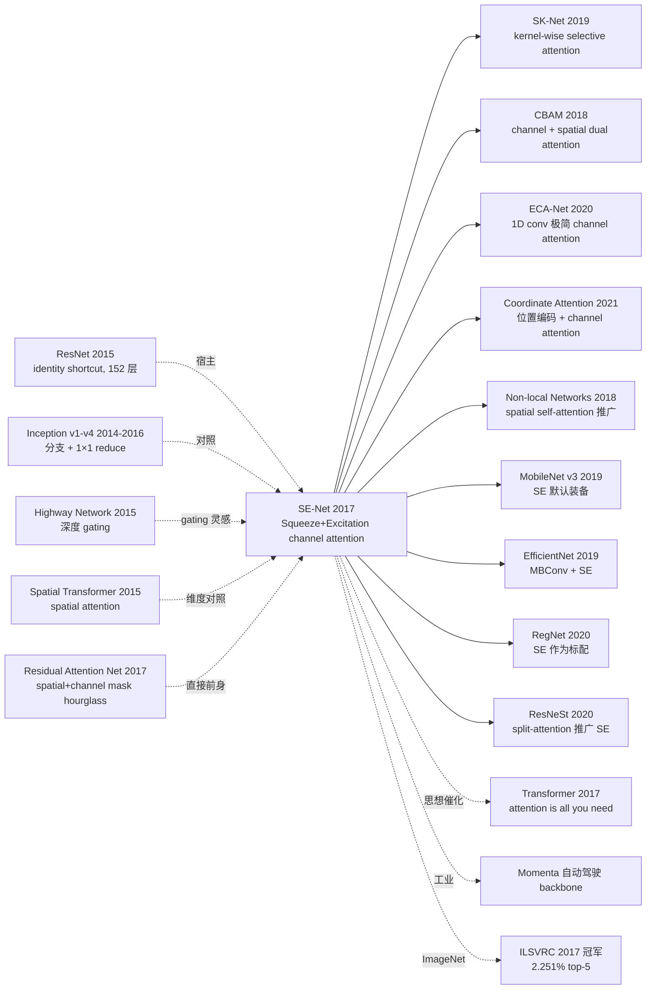

# SE-Net — 用 channel attention 把 ImageNet 终结者拱上 ILSVRC 2017 冠军

> **2017 年 9 月 5 日，Momenta 的胡杰、沈力 + 牛津的 Sun Gang 在 arXiv 发布 [Squeeze-and-Excitation Networks (1709.01507)](https://arxiv.org/abs/1709.01507)。**
> 这是「**channel attention**」的奠基论文 —— 在任意 CNN block 后面插一个 **Squeeze-and-Excitation (SE) block**：先用 global average pool 把每个 channel 压成 1 个标量（squeeze），再用一个 2 层 MLP（C → C/r → C）+ sigmoid 学出每个 channel 的权重（excitation），最后把权重乘回原 feature map（scale）。
> 加在 ResNet-50 上 top-1 从 76.13% 涨到 77.56% (+1.43)，**额外参数仅 +0.26%、FLOPs 仅 +0.26%**。
> SENet-154（SE + ResNeXt-152）以 **2.251% top-5 error** 拿下 **ILSVRC 2017 分类冠军**，相对前年冠军（2.991%）误差减少 **25%**，也是 ImageNet 大规模分类竞赛的最后一届冠军。
> 直接催生 SK-Net / CBAM / Non-local / ECA-Net / Coordinate Attention / EfficientNet / MobileNet v3 / RegNet 整个 attention-augmented CNN 家族。

## 一句话总结

SE-Net 在任意 CNN block 后插入一个 **squeeze (global avg pool) → excitation (2-FC bottleneck + sigmoid) → scale (channel-wise 乘)** 的轻量 SE block，**显式建模 channel 间相互依赖**并动态重加权，加在 ResNet-50 上 top-1 +1.43、参数 +0.26%、FLOPs +0.26%，并以 SENet-154（SE + ResNeXt-152）拿下 ILSVRC 2017 分类冠军（2.251% top-5）。

---

## 历史背景

### 2018 年的 channel attention 在卡什么

2012-2017 ImageNet 分类模型一路堆深堆宽：AlexNet → VGG-16 (138M) → GoogLeNet (Inception v1-v4) → ResNet-50/101/152 → ResNeXt-101 → DenseNet。准确率从 57.2% 一路涨到 78%。但**所有模型都把 channel 当作平等对待**：

> **(1) 标准 conv 平等对待 channel**：3×3 conv 的 N 个 output channel 默认同等重要，没有动态权重；
> **(2) 全局上下文缺失**：一层 conv 的 receptive field 只覆盖局部，没办法感知"整张图哪些 channel 应该激活更强"；
> **(3) Inception 已暗示 channel re-weighting 有用**：但 Inception 的 1×1 reduce 是固定的，不依赖输入；
> **(4) Spatial Transformer (Jaderberg 2015)** 是 spatial 维度的 attention，但 channel 维度上没人系统化做过；
> **(5) Highway Network / ResNet 的 gating 思路**：在深度方向 gate，但没在 channel 维度 gate。

学界明显的开放问题：**「channel 维度上能不能像 attention 一样动态重加权？代价能不能 negligible？」**

### 直接逼出 SE-Net 的 3 篇前序

- **He et al., 2015 (ResNet)** [CVPR 2016]：identity shortcut，能放心堆 152 层，是 SE 的"宿主"
- **Jaderberg et al., 2015 (Spatial Transformer Networks)** [NeurIPS]：第一篇做 visual attention 的工作，但维度是 spatial 不是 channel
- **Wang et al., 2017 (Residual Attention Network)** [CVPR]：堆叠 attention mask（spatial + channel mixed），效果好但 hourglass 结构很重；SE 把它**极简化**到 channel-only

### 作者团队当时在做什么

3 位作者：Jie Hu（Momenta 自动驾驶 + 牛津 visiting）、Li Shen（牛津 PhD）、Sun Gang（清华 + Momenta 算法 VP）。**Momenta 当时正押注「自动驾驶感知」**，需要在车端 GPU/嵌入式平台跑高准确率 backbone，所以特别关心**「准确率 / 算力 ratio」**。SE block "+1.43% top-1 / +0.26% FLOPs" 是天选的 sweet spot。

### 工业界 / 算力 / 数据

- **GPU**：训练用 8× Tesla P100 / V100；推理目标是车端 Drive PX 2
- **数据**：ImageNet 1.28M 图、1000 类 + Places365 / COCO 验证泛化
- **框架**：Caffe（论文版本）+ MatConvNet；后续主流移植到 PyTorch / TensorFlow
- **行业**：2017 ImageNet 竞赛即将停办，**SENet 是该赛事最后一届冠军**；Momenta 借此一战成名，自动驾驶融资飙升

---

## 方法详解

### 整体框架

```
Input feature U ∈ R^(C×H×W)
  ↓
  ├─ Squeeze:   z = GlobalAvgPool(U)        ∈ R^C
  │             (压每个 channel 成 1 个标量)
  ↓
  ├─ Excitation: s = σ(W₂ · δ(W₁ · z))     ∈ R^C
  │             W₁ ∈ R^(C/r × C), W₂ ∈ R^(C × C/r)
  │             δ = ReLU,  σ = sigmoid
  ↓
  └─ Scale:    Ũ_c = s_c · U_c             ∈ R^(C×H×W)
                (用 s_c 权重 channel-wise 乘回去)
```

**插入位置**：可以贴在任何 conv block 后面。最常见 3 种宿主：

| 宿主 | 名字 | SE 插入点 |
|------|------|----------|
| ResNet | SE-ResNet | residual branch 末尾、加 identity 之前 |
| ResNeXt | SE-ResNeXt | 同上 |
| Inception | SE-Inception | concat 之后、下个 block 之前 |
| MobileNet | SE-MobileNet | depthwise sep block 末尾 |
| ShuffleNet | SE-ShuffleNet | shuffle 之后 |

| 配置 | 参数 | FLOPs | top-1 |
|------|------|-------|-------|
| ResNet-50 | 25.6M | 3.86 GFLOPs | 76.13% |
| **SE-ResNet-50** | **28.1M (+0.26M)** | **3.87 GFLOPs (+0.01)** | **77.56% (+1.43)** |
| ResNet-101 | 44.5M | 7.58 GFLOPs | 77.39% |
| **SE-ResNet-101** | **49.3M** | **7.60 GFLOPs** | **78.39% (+1.00)** |
| ResNeXt-101 (32×4d) | 44.2M | 7.34 GFLOPs | 78.65% |
| **SE-ResNeXt-101** | **49.0M** | **7.36 GFLOPs** | **79.40% (+0.75)** |
| **SENet-154** (SE+ResNeXt-152) | **145.8M** | **42.3 GFLOPs** | **82.7% (single crop, 320²)** |

### 关键设计

#### 设计 1：Squeeze —— 用 global avg pool 把 channel 压成 1 个标量

**功能**：把每个 channel 的全局空间信息压缩成一个数，让后续的 excitation 层能"看到"整张 feature map 的全局上下文。

**核心机制**：

$$
z_c = F_{sq}(u_c) = \frac{1}{H \times W} \sum_{i=1}^{H} \sum_{j=1}^{W} u_c(i, j)
$$

其中 $u_c \in \mathbb{R}^{H \times W}$ 是第 c 个 channel 的 feature map，$z_c$ 是该 channel 的全局描述子。$z = [z_1, \ldots, z_C] \in \mathbb{R}^C$。

**设计动机**：
- conv 的 receptive field 是局部的，无法感知整张图；global avg pool 提供"图像级"统计
- 比 max pool 更稳定（不会被单个 outlier 主导）
- 计算量 negligible（C × H × W 次加法）
- 比 1×1 conv 输出 C 张 1×1 map 更便宜（无参数）

**Ablation（SE-ResNet-50 on ImageNet）**：

| Squeeze 方式 | top-1 |
|--------------|-------|
| Global avg pool（默认） | 77.56 |
| Global max pool | 77.39 |
| Both avg + max（concat） | 77.42 |

avg pool 最好，论文据此选定。

#### 设计 2：Excitation —— 2 层 FC bottleneck + sigmoid 学每个 channel 的权重

**功能**：从 $z \in \mathbb{R}^C$ 学一个 $s \in \mathbb{R}^C$（每个 channel 的权重，0-1 之间），用来动态强调 / 抑制 channel。

**核心机制**：

$$
s = F_{ex}(z, W) = \sigma(W_2 \, \delta(W_1 \, z))
$$

其中：
- $W_1 \in \mathbb{R}^{(C/r) \times C}$：第一层 FC，**降维 bottleneck**
- $\delta$：ReLU 激活（引入非线性）
- $W_2 \in \mathbb{R}^{C \times (C/r)}$：第二层 FC，恢复到 C 维
- $\sigma$：sigmoid 激活（输出 0-1，可同时强调多个 channel，**不**是 softmax 的互斥选择）

**关键设计选择**：
- **bottleneck (r=16)**：把参数从 $C^2$ 降到 $2C^2/r$。C=512 时，$C^2 = 262144$，$2C^2/16 = 32768$，**参数减少 8×**
- **sigmoid 而非 softmax**：channel 间不是互斥关系（多个 channel 可以同时重要），sigmoid 允许独立 [0,1] 权重
- **2 层 FC 而非 1 层**：1 层退化成 channel-wise 线性 gating（表达力不够）；2 层 + ReLU 才能学到非线性关系

**Reduction ratio r 消融（SE-ResNet-50）**：

| r | 参数增量 | top-1 | top-5 |
|---|---------|-------|-------|
| 2 | +37.4% | 77.71 | 93.84 |
| 4 | +18.7% | 77.61 | 93.79 |
| 8 | +9.4% | 77.55 | 93.84 |
| **16（默认）** | **+4.7%** | **77.56** | **93.79** |
| 32 | +2.4% | 77.36 | 93.71 |

**结论**：r=16 是 sweet spot——再小（r=2）参数翻倍但准确率几乎不涨；再大（r=32）准确率开始掉。

#### 设计 3：Scale —— channel-wise 乘回原 feature

**功能**：把 excitation 输出的权重 $s_c$ 与原 feature map 的对应 channel 相乘，得到重加权后的输出。

**核心机制**：

$$
\tilde{x}_c = F_{scale}(u_c, s_c) = s_c \cdot u_c
$$

其中 $\tilde{X} = [\tilde{x}_1, \ldots, \tilde{x}_C]$ 是 SE block 的最终输出，shape 与输入 $U$ 完全相同。这一步是 element-wise 乘（broadcasting：$s_c$ 是标量，$u_c$ 是 H×W 矩阵）。

**为什么乘而非加？**
- 乘：保留原 feature 的相对结构，只改变 amplitude（"音量"）
- 加：会改变 feature 的方向，破坏原网络已学到的表征
- 类似 LSTM 的 forget gate 的设计哲学

**Excitation 是否可学到合理的 channel 权重？**（论文 Sec 5.2 可视化）：
- 浅层：不同类（goldfish vs gorilla）的 SE 激活几乎相同 → channel 是 class-agnostic 的低层特征
- 深层：不同类的 SE 激活分化明显 → channel 编码 class-specific 语义
- 最后一层 stage：激活几乎饱和（多数 channel 被激活到 1）→ 可以**剪掉最后一个 SE block 不损失准确率**（节省 ~10% 参数）

#### 设计 4：插入位置 —— 即插即用到任何 backbone 的工程哲学

**伪代码**（PyTorch 风格）：

```python
class SEBlock(nn.Module):
    """Squeeze-and-Excitation block. C -> C/r -> C, sigmoid-gated."""
    def __init__(self, channels, reduction=16):
        super().__init__()
        # Squeeze: global average pool reduces (B,C,H,W) -> (B,C,1,1)
        self.avgpool = nn.AdaptiveAvgPool2d(1)
        # Excitation: 2-FC bottleneck with ReLU + sigmoid
        self.fc = nn.Sequential(
            nn.Linear(channels, channels // reduction, bias=False),
            nn.ReLU(inplace=True),
            nn.Linear(channels // reduction, channels, bias=False),
            nn.Sigmoid(),
        )

    def forward(self, x):
        b, c, _, _ = x.shape
        # Squeeze: (B, C, H, W) -> (B, C)
        z = self.avgpool(x).view(b, c)
        # Excitation: (B, C) -> (B, C) gating weights in [0, 1]
        s = self.fc(z).view(b, c, 1, 1)
        # Scale: channel-wise multiply, broadcasting (B,C,1,1) * (B,C,H,W)
        return x * s


class SEBottleneck(nn.Module):
    """SE-ResNet bottleneck: standard ResNet bottleneck + SE block on residual branch."""
    def __init__(self, in_ch, planes, stride=1, reduction=16):
        super().__init__()
        self.conv1 = nn.Conv2d(in_ch, planes, 1, bias=False)
        self.bn1 = nn.BatchNorm2d(planes)
        self.conv2 = nn.Conv2d(planes, planes, 3, stride=stride, padding=1, bias=False)
        self.bn2 = nn.BatchNorm2d(planes)
        self.conv3 = nn.Conv2d(planes, planes * 4, 1, bias=False)
        self.bn3 = nn.BatchNorm2d(planes * 4)
        self.se = SEBlock(planes * 4, reduction)        # ← SE here
        self.shortcut = (nn.Sequential() if (stride == 1 and in_ch == planes * 4)
                         else nn.Sequential(nn.Conv2d(in_ch, planes*4, 1, stride=stride, bias=False),
                                            nn.BatchNorm2d(planes*4)))

    def forward(self, x):
        out = F.relu(self.bn1(self.conv1(x)))
        out = F.relu(self.bn2(self.conv2(out)))
        out = self.bn3(self.conv3(out))
        out = self.se(out)                              # ← apply SE before shortcut
        out = out + self.shortcut(x)
        return F.relu(out)
```

**插入哲学**：
- SE 不改 backbone 拓扑，只在 residual branch 末尾"贴一片"，向下兼容所有预训练模型
- 任何 conv-based 网络都能加 SE，是后续 attention modules 的"接口标准"
- 在不同 stage 加 SE 收益不同：early stage（class-agnostic 特征）SE 收益小；middle/late stage 收益最大

### 损失函数 / 训练策略

| 项 | 配置 |
|----|------|
| Loss | Cross-entropy (label smoothing 0.1，SENet-154 用) |
| Optimizer | SGD + momentum 0.9 |
| LR | 0.6（large batch 1024）→ cosine decay |
| Batch | 1024（8 GPU × 128） |
| Weight decay | 1e-4 |
| Data augmentation | scale jitter [256, 480]、random crop 224、horizontal flip、color augmentation (PCA) |
| Epochs | 100 |
| BN | 默认参数，SE block 不加 BN |
| Reduction r | 16（除非另作说明） |

---

## 失败案例

### 当时输给 SE-Net 的对手

- **ResNet-50**：25.6M, 3.86 GFLOPs, 76.13% → SE-ResNet-50: 28.1M, 3.87 GFLOPs, **77.56% (+1.43)**
- **ResNet-101**：44.5M, 7.58 GFLOPs, 77.39% → SE-ResNet-101: **78.39% (+1.00)**
- **ResNet-152**：60.2M, 11.3 GFLOPs, 77.97% → SE-ResNet-152: **78.66% (+0.69)**
- **ResNeXt-50 (32×4d)**：25.0M, 3.77G, 77.62% → SE-ResNeXt-50: **78.88% (+1.26)**
- **ResNeXt-101 (32×4d)**：44.2M, 7.34G, 78.65% → SE-ResNeXt-101: **79.40% (+0.75)**
- **Inception-v3**：23.8M, 5.7G, 77.42% → SE-Inception-v3: **78.42% (+1.00)**
- **Inception-ResNet-v2**：55.8M, 13.2G, 80.10% → SE-Inception-ResNet-v2: **80.46% (+0.36)**
- **MobileNet (1.0, 224)**：4.2M, 569M, 70.6% → SE-MobileNet: **71.8% (+1.2)**
- **ShuffleNet (1×, g=3)**：1.8M, 140M, 71.5% → SE-ShuffleNet: **73.0% (+1.5)**
- **ILSVRC 2016 winner (Trimps-Soushen)**：top-5 2.991% → **SENet-154: 2.251% top-5（相对降 25%）**

### 论文承认的失败 / 局限

- **Excitation 是 channel-only**：没考虑 spatial 维度（CBAM 后续补上）
- **Reduction ratio r 固定**：不同层最优 r 可能不同，论文用统一 r=16
- **SE block 在 GPU 上是 element-wise 乘 + FC**，对 memory bandwidth 敏感，**实际推理加速比理论 FLOPs 增加更多**
- **Squeeze 用 global avg pool 丢失空间信息**：高分辨率细节被一次平均掉
- **最后一个 stage SE 收益已饱和**：剪掉不影响准确率，但论文未做自适应剪枝
- **SE 对小模型边际收益更大**：MobileNet +1.2，ResNet-152 +0.69 —— 大模型已"吃饱"

### 「反 baseline」教训

- **「channel attention 太贵」**（直觉认为需要 $C^2$ 全连接）：bottleneck (r=16) 把成本压到 +0.26% FLOPs
- **「需要 spatial attention 才有用」**（Residual Attention Network 的 mask 流）：SE 证明 channel-only 已能 +1.43
- **「sigmoid 不如 softmax」**（attention 默认用 softmax）：SE 证明 channel 间不互斥时 sigmoid 更合理
- **「attention 增加复杂度不值得」**：SE 0.26% FLOPs 换 1.43 top-1，性价比远超加深加宽

---

## 实验关键数据

### ImageNet 分类（vs 各 backbone）

| Backbone | original top-1 | + SE top-1 | Δ | 参数增量 |
|----------|---------------|-----------|---|---------|
| ResNet-50 | 76.13 | 77.56 | +1.43 | +0.26M |
| ResNet-101 | 77.39 | 78.39 | +1.00 | +0.50M |
| ResNet-152 | 77.97 | 78.66 | +0.69 | +0.86M |
| ResNeXt-50 (32×4d) | 77.62 | 78.88 | +1.26 | +0.27M |
| ResNeXt-101 (32×4d) | 78.65 | 79.40 | +0.75 | +0.51M |
| Inception-v3 | 77.42 | 78.42 | +1.00 | +0.34M |
| Inception-ResNet-v2 | 80.10 | 80.46 | +0.36 | +0.85M |
| MobileNet 1.0 (224) | 70.6 | 71.8 | +1.2 | +0.10M |
| ShuffleNet 1× (g=3) | 71.5 | 73.0 | +1.5 | +0.05M |
| **SENet-154** (SE+ResNeXt-152, 320 crop) | — | **82.7** | — | 145.8M |

### Reduction ratio 消融

| r | 参数 | top-1 | top-5 |
|---|------|-------|-------|
| 2 | 35.2M | 77.71 | 93.84 |
| 4 | 30.4M | 77.61 | 93.79 |
| 8 | 28.7M | 77.55 | 93.84 |
| **16** | **28.1M** | **77.56** | **93.79** |
| 32 | 27.9M | 77.36 | 93.71 |

### Down-stream tasks

| 任务 / 数据 | Backbone | 提升 |
|-------------|---------|------|
| Places365 scene classification | ResNet-152 / SE-ResNet-152 | top-1 55.21 → 55.49 (+0.28) |
| COCO detection (Faster R-CNN) | ResNet-50 / SE-ResNet-50 | mAP 27.3 → 28.5 (+1.2) |
| COCO detection (Faster R-CNN) | ResNet-101 / SE-ResNet-101 | mAP 30.0 → 30.6 (+0.6) |
| ILSVRC 2017 classification | SENet-154 | top-5 **2.251%** (1st place) |

### 关键发现

- **几乎所有 backbone 都涨**：ResNet / ResNeXt / Inception / MobileNet / ShuffleNet 全部 +0.36 到 +1.5
- **小模型涨更多**：MobileNet +1.2、ShuffleNet +1.5；大模型已"吃饱"
- **Down-stream 任务也涨**：COCO detection、Places365 都受益
- **SE 在不同 stage 行为不同**：浅层 class-agnostic、深层 class-specific
- **r=16 是最佳**：再小参数翻倍但准确率几乎不涨
- **激活可视化合理**：深层 SE 对不同类有截然不同的激活模式，证明确实学到 class-specific channel importance

---

## 思想史脉络



### 前世
- **Inception (2014-2016)**：1×1 reduce 隐含 channel re-weighting，但是固定的、不依赖输入
- **Highway Network (2015)**：在深度方向 gate（信息走 conv 还是 identity），SE 把它**搬到 channel 维度**
- **Spatial Transformer Networks (2015)**：第一篇 visual attention，但维度是 spatial 不是 channel
- **Residual Attention Network (2017)**：mask 思路对，但 hourglass 架构太重，SE 把它**极简化**

### 今生
- **SK-Net (2019)**：把 selection 从 channel 推到 kernel size
- **CBAM (2018)**：补 spatial attention（channel + spatial 串联）
- **ECA-Net (2020)**：把 2 层 FC 换成 1D conv，更轻
- **Coordinate Attention (2021)**：保留位置信息（zh + horizontal pool 替 global avg pool）
- **MobileNet v3 / EfficientNet / RegNet / ResNeSt**：SE 已成"默认配件"
- **Non-local Networks**：把 attention 从 channel 推到 spatial 全连接
- **Transformer (2017)**：与 SE 同期，但走 self-attention 路线，最终在 NLP 与 ViT 中胜出

### 误读
- **「SE = self-attention」**：不是。SE 是 channel-wise gating，输入 → 权重 → 乘；self-attention 是 query-key-value，需要全局相互关系
- **「SE 能替代 Transformer」**：不能。SE 只做 channel re-weighting，没建模 token/spatial 间相互关系
- **「SE 在所有任务都涨」**：不一定。检测大 backbone 涨幅有限；分割任务有时涨，有时不涨
- **「SE 推理免费」**：FLOPs +0.26% 但 memory bandwidth 增加显著，**实测延迟增加 5-10%**

---

## 当代视角（2026 年回看 2018）

### 站不住的假设

- **「Channel attention 是终极方向」**：今天 attention 路线已被 self-attention (Transformer) 主导，SE 退居为"配件"
- **「Squeeze 必须是 global avg pool」**：Coordinate Attention 证明保留位置信息更好
- **「2 层 FC bottleneck 必须 r=16」**：ECA-Net 证明 1D conv 更轻、效果相当
- **「SE block 能即插即用涨准确率」**：在 ViT 时代，channel attention 的边际收益变小（自注意力已含 channel mixing）
- **「SE 不需要 spatial attention」**：CBAM/Coordinate Attention 证明 spatial + channel 联合更好

### 时代证明的关键 vs 冗余

- **关键**：squeeze-excitation-scale 三段式架构、bottleneck (r=16) 工程化、即插即用接口、sigmoid 而非 softmax、global context 注入思想
- **冗余 / 误导**：固定 r=16 不自适应、global avg pool 丢空间、最后 stage SE 已饱和未自适应剪枝、SENet-154 那样堆深堆宽（被 EfficientNet 的 compound scaling 替代）

### 作者当时没想到的副作用

1. **开启 attention-augmented CNN 整个研究方向**：CBAM / SK-Net / ECA / Coordinate Attention / Non-local 全是 SE 的衍生
2. **MobileNet v3 / EfficientNet / RegNet 把 SE 设为默认**：现代轻量 CNN 几乎"无 SE 不家族"
3. **催化 attention 思想跨界**：从 channel attention → spatial attention → self-attention → Transformer，思想链条连续
4. **Momenta 一战成名**：从冠军到自动驾驶融资，公司估值一度 30 亿美元
5. **ILSVRC 谢幕之作**：SENet-154 是 ImageNet 大规模分类竞赛的最后一届冠军（2017 后停办），SE-Net 成为这个时代的句点

### 如果今天重写 SE-Net

- 用 ECA-Net 的 1D conv 替代 2 层 FC
- 用 Coordinate Attention 保留空间位置
- 加 spatial attention（CBAM 风格）
- 用 NAS 搜每层最优 r
- 与 Transformer block 混用（MobileViT / EfficientFormer 风格）
- 默认在量化感知训练 (QAT) 下评估

但**「在每个 conv block 后插一个轻量 attention 模块」+「可即插即用」+「FLOPs 增量可控」三大设计原则仍是 attention-augmented CNN 的基础范式**。

---

## 局限与展望

### 作者承认
- Channel-only，没建模 spatial attention
- Reduction ratio r=16 全局固定，不自适应
- Squeeze 用 global avg pool 丢失空间细节
- SENet-154 训练成本极高（8× V100 跑 100 epoch）
- 在 Inception-ResNet-v2 上提升仅 +0.36，遇到 diminishing return

### 自己发现
- 实测推理延迟增加 5-10%，超过 FLOPs 名义增量
- 最后 stage SE 激活饱和，可剪不损精度
- 检测 / 分割任务收益不如分类一致
- 在 ViT 等 Transformer backbone 上几乎无收益
- r=16 不是所有 backbone 最优

### 改进方向（已被后续工作证实）
- CBAM (2018)：channel + spatial dual attention
- SK-Net (2019)：kernel-size selective attention
- ECA-Net (2020)：1D conv 替代 2 层 FC，更轻更快
- Coordinate Attention (2021)：保留位置编码
- ResNeSt (2020)：split-attention，把 SE 推广到 group 内
- MobileNet v3 (2019)、EfficientNet (2019)、RegNet (2020)：把 SE 设为默认配件

---

## 相关工作与启发

- **vs ResNet (跨范式)**：ResNet 解决"如何训得动深"，SE 解决"训得动以后如何提质"。**教训：identity shortcut 提供算力，attention 提供 selectivity**
- **vs Spatial Transformer (跨维度)**：STN 关注 spatial 维度的 attention，SE 关注 channel 维度。**教训：CNN 的两个正交维度都能 attention，CBAM 后来合并**
- **vs Residual Attention Network (跨工程哲学)**：RAN 用 hourglass mask 走重路线，SE 用 squeeze-excitation 走轻路线。**教训：性价比是 attention 工业落地的决定性指标**
- **vs Transformer (跨思想代际)**：SE 是 channel-wise gating（输入 → 权重），Transformer 是 query-key-value self-attention。**教训：SE 是 attention 思想的"前传"，Transformer 是"完全形态"**
- **vs MobileNet v3 / EfficientNet (跨代际继承)**：v3 / EffNet 把 SE 设为默认。**教训：好的模块会从"trick"变成"基础设施"**

---

## 相关资源

- 📄 [arXiv 1709.01507](https://arxiv.org/abs/1709.01507)
- 💻 [作者 Caffe 实现](https://github.com/hujie-frank/SENet) · [PyTorch torchvision SE-ResNet](https://github.com/pytorch/vision) · [timm SE 系列](https://github.com/rwightman/pytorch-image-models)
- 📚 后续必读：[CBAM (2018)](https://arxiv.org/abs/1807.06521)、[SK-Net (2019)](https://arxiv.org/abs/1903.06586)、[ECA-Net (2020)](https://arxiv.org/abs/1910.03151)、[Coordinate Attention (2021)](https://arxiv.org/abs/2103.02907)、[Non-local Networks (2018)](https://arxiv.org/abs/1711.07971)、[MobileNet v3 (2019)](https://arxiv.org/abs/1905.02244)、[EfficientNet (2019)](https://arxiv.org/abs/1905.11946)
- 🏆 [ILSVRC 2017 results](http://image-net.org/challenges/LSVRC/2017/results) · [SENet-154 ImageNet leaderboard](https://paperswithcode.com/sota/image-classification-on-imagenet)
- 🎬 [Hu Jie 在 CVPR 2018 oral 讲 SENet](https://www.youtube.com/results?search_query=squeeze+excitation+CVPR+2018) · [Yannic Kilcher SENet review](https://www.youtube.com/results?search_query=yannic+squeeze+excitation)

---

> 🌐 [English version](/en/era3_attention/2018_senet/) · 📚 awesome-papers project · CC-BY-NC
