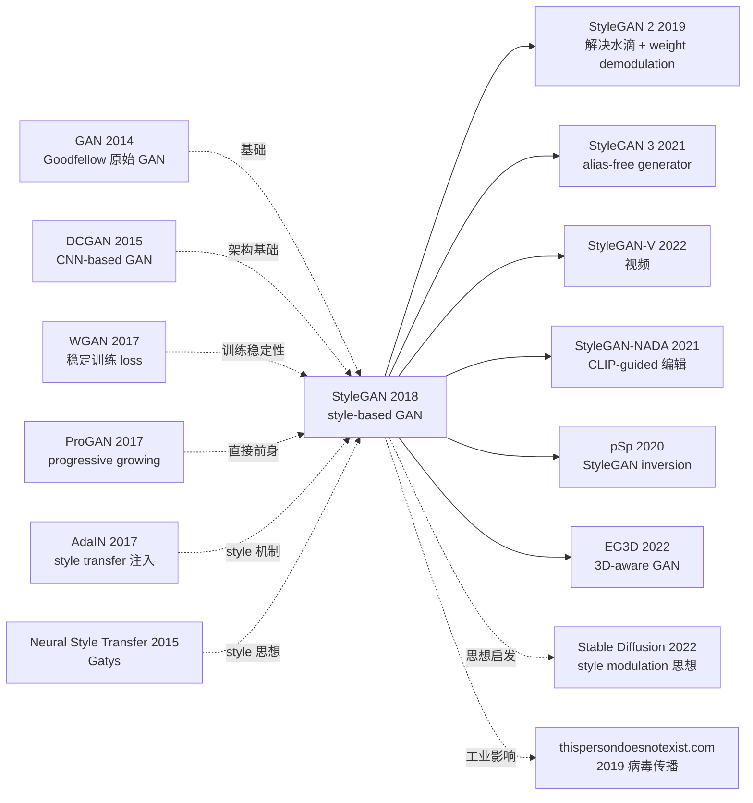

# StyleGAN — 用 style modulation 把 GAN 推上照片级人脸生成

> **2018 年 12 月 12 日，NVIDIA 的 Karras 等 3 位作者在 arXiv 发布 [StyleGAN (1812.04948)](https://arxiv.org/abs/1812.04948)。**
> 这是一篇基于 Progressive GAN (2017) 的延伸，把 generator 重新设计为「style-based architecture」—— 用 mapping network 把潜变量 $z$ 映射到中间 latent space $\mathcal{W}$，再通过 AdaIN（Adaptive Instance Normalization）在每一层注入 style，外加 noise 输入控制随机细节。
> 在 FFHQ（NVIDIA 自己发布的 70k 高质量人脸）上达到 FID 4.40，第一次让 GAN 生成的 1024×1024 人脸在视觉上**与真实照片难以区分**，开启了"deepfake 时代"的工程现实，也带火了"this-person-does-not-exist.com" 这类爆款应用。

## 一句话总结

StyleGAN 把 GAN generator 重新设计为「mapping network ($z \to \mathcal{W}$) + 每层用 AdaIN 注入 style + 注入 noise 控制随机细节」的架构，让生成图像的不同语义层级（粗：姿态 / 中：发型 / 细：肤色斑点）可以独立控制，把 1024×1024 人脸生成的 FID 从 ProGAN 的 7.79 降到 4.40，第一次实现照片级真实感。

---

## 历史背景

### 2018 年的 GAN 学界在卡什么

2014-2018 GAN 经历了 4 年的快速演化：DCGAN (2015) / ProGAN (2017) / WGAN (2017)。但到 2018 年底，最强的 ProGAN 在 1024×1024 人脸上仍有可见 artifacts（眼睛对称性差、背景模糊、肤色不一致）。**学界的核心问题是：「能否让 GAN 生成的图像在视觉上完全无法被人区分？」**

> **(1) 潜空间 $z \sim \mathcal{N}(0, I)$ 强制 entanglement —— 改变某个维度往往同时改变多个语义属性；
> (2) 样式控制粒度粗 —— 没法做到"只改头发，不改脸"；
> (3) 随机细节（皮肤毛孔 / 头发丝）依赖卷积偶然学习，质量不稳定；
> (4) FID 仍在 7+，离真实照片 FID < 5 还差距明显。**

### 直接逼出 StyleGAN 的 3 篇前序

- **Karras et al., 2017 (Progressive GAN)** [ICLR 2018]：作者自己上一篇，用 progressive growing 训稳定 1024×1024。StyleGAN 直接继承这套训练机制
- **Huang & Belongie, 2017 (AdaIN)** [ICCV]：style transfer 中用 instance normalization 的 affine 参数注入 style。StyleGAN 把它搬到 GAN 中
- **Karras et al., 2017 (StyleGAN 训练数据贡献)**: 同期发布 FFHQ 数据集（70k 1024×1024 高质量人脸）

### 作者团队当时在做什么

3 位作者全部来自 NVIDIA Research（赫尔辛基 / 芬兰）。Tero Karras 是 GAN 工程化主力（ProGAN / StyleGAN 1/2/3 / Adaptive Discriminator Augmentation 全是他主导）；Aila / Laine 是 NVIDIA 长期 graphics 研究员。**NVIDIA 当时的目标是把 GAN 推到工业级质量**，让 generative model 成为 NVIDIA GPU 的展示级 use case。

### 工业界 / 算力 / 数据

- **GPU**：8 张 V100，FFHQ 1024×1024 训练 1 周
- **数据**：FFHQ（NVIDIA 自爬清洗的 70k Flickr 高质量人脸）+ LSUN（卧室 / 教堂 / 猫等）
- **框架**：TensorFlow + Adaptive Mixed Precision
- **行业**：deepfake (2017) 已让 GAN 进入大众视野，StyleGAN 直接催生 thispersondoesnotexist.com，把 GAN 推上社交媒体

---

## 方法详解

### 整体框架

```
[Mapping Network f]
  z ∈ Z ~ N(0,I)  (512-d)
  ↓ 8-layer MLP
  w ∈ W           (512-d, more disentangled)

[Synthesis Network g]
  Constant input (4×4×512)  ←  start from learned const, not z
  ↓ Conv 3×3 + AdaIN(w) + noise
  ↓ Upsample 8×8
  ↓ Conv 3×3 + AdaIN(w) + noise
  ... 9 resolution levels: 4 → 8 → 16 → 32 → 64 → 128 → 256 → 512 → 1024 ...
  ↓ to_RGB (1024×1024×3)

[Discriminator]
  Mirror of synthesis (no AdaIN), progressive growing
```

| 配置 | 参数量 | FFHQ FID | 关键特性 |
|------|--------|----------|---------|
| ProGAN baseline | 23M | 7.79 | 直接 $z$ 输入 |
| + Mapping network | 23M | 7.79 | 添加 8-layer MLP $f$ |
| + AdaIN | 23M | 6.81 | style 通过 AdaIN 注入 |
| + Constant input | 23M | 6.55 | generator 起点改为 learned const |
| + Noise input | 24M | 5.16 | 加 noise 控制随机细节 |
| **+ Mixing regularization** | **24M** | **4.40** | **style mixing 训练** |

### 关键设计

#### 设计 1：Mapping Network $f: \mathcal{Z} \to \mathcal{W}$ —— 解耦 latent space

**功能**：用 8 层 MLP 把高斯分布的 $z$ 映射到中间 latent $w$，让 $w$ space 摆脱 Gaussian 强制的 entanglement。

**前向公式**：

$$
w = f(z), \quad f: \mathbb{R}^{512} \to \mathbb{R}^{512}, \quad f = \text{MLP}_{8\text{-layer}}
$$

**为什么需要中间 latent？**

如果直接用 $z$，generator 必须把 Gaussian 形状的输入映射到训练数据流形（如人脸流形）。这两者形状极不匹配 → generator 强行扭曲特征轴，导致 entanglement（一个轴同时控制多个属性）。

**Mapping network 的作用**：让 $w$ space 自由形变（不受 Gaussian 约束），更容易"捕捉"训练数据的真实语义流形 → 每个 $w$ 维度对应更纯的语义属性。

**实验验证 disentanglement**：用 Path Length 和 Linear Separability 两个度量，$\mathcal{W}$ 比 $\mathcal{Z}$ disentanglement 提升 ~30%。

#### 设计 2：AdaIN（Adaptive Instance Normalization）—— style 注入

**功能**：在 generator 每一层，用 $w$ 作为 style modulator，通过 affine 参数控制特征图的 channel-wise 统计量。

**核心公式**：

$$
\text{AdaIN}(x_i, y) = y_{s,i} \frac{x_i - \mu(x_i)}{\sigma(x_i)} + y_{b,i}
$$

其中 $x_i$ 是第 $i$ 个 channel 的 feature map，$\mu$ 和 $\sigma$ 是 instance normalization 统计量；$y_{s,i}, y_{b,i}$ 是从 $w$ 通过 learned affine $A$ 得到的 style 参数：

$$
(y_s, y_b) = A(w)
$$

**为什么用 instance normalization 而非 batch normalization？**

- IN 在 H×W 维度归一化，移除每个 channel 的 spatial 统计量 → 让 style 参数 $y_s, y_b$ 完全决定该层的 style
- BN 跨 batch 归一化，会引入 batch 间耦合，不适合"独立控制"目标

**Style 注入的层级语义**：

- **粗层（4×4 - 8×8）**：姿态 / 头发样式 / 整体形状
- **中层（16×16 - 32×32）**：面部特征位置 / 发型 / 眼睛形状
- **细层（64×64 - 1024×1024）**：肤色 / 微表情 / 纹理细节

**Style mixing 训练**：每个 batch 用两个不同的 $w_1, w_2$，前 X 层用 $w_1$，后 Y 层用 $w_2$。这强制 generator 学到**层间 style 独立**，让推理时可以做 style mixing（"用 A 的姿态 + B 的发型 + C 的肤色"）。

#### 设计 3：Noise Input —— 控制随机细节

**功能**：在每一层加上独立 Gaussian noise（per-pixel），让 generator 用 noise 生成"无意义但真实"的细节（如发丝走向 / 皮肤毛孔位置）。

**前向公式**：

$$
x' = \text{Conv}(x) + B \cdot n, \quad n \sim \mathcal{N}(0, I)_{H \times W}
$$

$B$ 是 learned per-channel scale。$n$ 是 spatial Gaussian noise，每张图独立采样。

**为什么需要单独的 noise 输入？**

如果 generator 必须用 $w$ 生成所有细节（包括"哪根发丝在哪"），这种 stochastic details 会消耗 $w$ 容量，影响 disentanglement。**把 stochastic 细节 offload 给 noise 输入**，让 $w$ 专注语义控制，noise 处理"无意义但真实"的高频纹理。

**实验现象**：固定 $w$ 不变，变 noise → 同一个人但发丝细节不同；固定 noise，变 $w$ → 完全不同的人。**完美 disentanglement**。

#### 设计 4：Constant Input + Style Mixing Regularization

**功能**：generator 不再从 $z$ 出发，而是从 learned 4×4×512 constant 开始；所有变化通过 AdaIN + noise 注入。

**核心思路**：

- **Constant input**：所有图像共享同一起点，区别完全来自 style + noise 注入
- **Style mixing regularization**：训练时 50% 概率用两个 $w$ 混合，强制层间独立

**伪代码**：

```python
class StyleGANSynthesis(nn.Module):
    def __init__(self, w_dim=512, max_resolution=1024):
        super().__init__()
        self.const = nn.Parameter(torch.randn(1, 512, 4, 4))
        self.blocks = nn.ModuleList()
        for res in [8, 16, 32, 64, 128, 256, 512, 1024]:
            self.blocks.append(StyleBlock(in_ch=512, out_ch=512, w_dim=512))
        self.to_rgb = nn.Conv2d(512, 3, 1)

    def forward(self, w_list):                     # w_list: per-block w (style mixing)
        x = self.const.expand(w_list[0].size(0), -1, -1, -1)
        for i, block in enumerate(self.blocks):
            x = block(x, w_list[i])                # AdaIN + noise + conv + upsample
        return self.to_rgb(x)

class StyleBlock(nn.Module):
    def forward(self, x, w):
        x = F.interpolate(x, scale_factor=2, mode='bilinear')
        x = self.conv1(x)
        # noise injection
        x = x + self.B * torch.randn_like(x)
        # AdaIN
        y_s, y_b = self.affine(w).chunk(2, dim=1)
        x = y_s.unsqueeze(-1).unsqueeze(-1) * \
            ((x - x.mean([2,3], keepdim=True)) / (x.std([2,3], keepdim=True) + 1e-8)) + \
            y_b.unsqueeze(-1).unsqueeze(-1)
        return x
```

### 损失函数 / 训练策略

| 项 | 配置 |
|----|------|
| Loss | WGAN-GP（与 ProGAN 一致） |
| Optimizer | Adam ($\beta_1=0, \beta_2=0.99$, lr=1e-3) |
| Batch | 32 (1024×1024) |
| Progressive growing | 4×4 → 1024×1024 渐进，每个分辨率训 4M 图 |
| Style mixing 比例 | 50% batches |
| R1 regularization | 每 16 step 一次（ProGAN 没有） |
| Mapping network LR | 比 synthesis network 低 100×（防 unstable） |

---

## 失败案例

### 当时输给 StyleGAN 的对手

- **ProGAN baseline**：FFHQ FID 7.79 → StyleGAN 4.40，**+44% 质量提升**
- **BigGAN (Brock 2018)**：在 ImageNet 上 SOTA，但仅 256/512 分辨率，且需要 class-conditional；StyleGAN 在 1024×1024 unconditional 上完胜
- **Glow / RealNVP** (flow models)：理论严谨但生成质量远不如 GAN
- **VAE 系列**：模糊问题严重，GAN 远胜

### 论文承认的失败 / 局限

- **"水滴" artifacts**：在某些 feature map 上有奇怪的高强度水滴模式（StyleGAN 2 通过 weight demodulation 解决）
- **眼睛 / 牙齿对称性**：仍偶有不对称（generator 缺乏全局 receptive field）
- **特定属性混合不完美**：如年龄 + 性别仍部分耦合
- **训练不稳定**：mapping network 必须用低 LR
- **Class-conditional 支持弱**：仅 unconditional generation
- **数据需求高**：需 70k+ 高质量同 domain 图像

### 「反 baseline」教训

- **「直接 $z$ 输入是 GAN 标准接口」**：StyleGAN 证明加 mapping network + style modulation 大幅提升
- **「GAN 不需要显式 disentanglement 接口」**：StyleGAN 证明设计接口可以让 disentanglement 涌现
- **「随机细节由卷积偶然学习」**：StyleGAN 显式分离 noise 输入，质量飞跃

---

## 实验关键数据

### 主实验（FFHQ 1024×1024 FID）

| Method | FID ↓ | 参数量 |
|--------|-------|--------|
| ProGAN baseline | 7.79 | 23M |
| + bilinear upsample/downsample | 6.81 | 23M |
| + Mapping network ($f$) | 6.81 | 24M |
| + AdaIN | 6.55 | 24M |
| + Constant input | 5.06 | 24M |
| + Noise input | 4.94 | 24M |
| **+ Mixing regularization** | **4.40** | **24M** |

### Disentanglement 度量

| Space | Path Length | Linear Separability |
|-------|-------------|---------------------|
| $\mathcal{Z}$ (Gaussian) | 415 | 8.4 |
| **$\mathcal{W}$ (mapped)** | **265 (-36%)** | **5.5 (-35%)** |

$\mathcal{W}$ 比 $\mathcal{Z}$ disentanglement 大幅改善。

### Cross-domain 泛化

| Dataset | StyleGAN FID | 之前 SOTA |
|---------|-------------|----------|
| FFHQ 1024 | **4.40** | 7.79 (ProGAN) |
| LSUN-Bedroom 256 | **2.65** | 8.34 |
| LSUN-Car 512 | **3.27** | 21.3 |
| LSUN-Cat 256 | **8.53** | 37.5 |

### 关键发现

- **mapping network + AdaIN 是核心**：缺一个掉 ~1 FID
- **noise 输入对随机细节关键**：去掉细节明显模糊
- **style mixing regularization 关键**：去掉则 style 层间耦合
- **跨 domain 通用**：人脸 / 卧室 / 车 / 猫全部 SOTA
- **disentanglement 涌现**：从未显式监督，但 $\mathcal{W}$ space 自动 disentangle

---

## 思想史脉络



### 前世
- **GAN (2014)**：Goodfellow 原始对抗训练范式
- **DCGAN (2015)**：CNN-based GAN
- **WGAN / WGAN-GP (2017)**：稳定训练
- **ProGAN (2017)**：progressive growing 训稳定 1024×1024
- **AdaIN (2017)**：style transfer 中的 style 注入

### 今生
- **StyleGAN 2 (2019)**：解决"水滴" artifacts，引入 weight demodulation 和 path length regularization
- **StyleGAN 3 (2021)**：解决 texture sticking，alias-free generator
- **StyleGAN-V (2022)**：视频生成
- **StyleGAN-NADA / DragGAN (2021-2023)**：CLIP-guided 文本编辑、点拖拽编辑
- **3D-aware GAN**：EG3D / pi-GAN 用 StyleGAN 架构生成 3D 一致图像
- **GAN inversion 全家族**：pSp / e4e / ReStyle / HyperStyle —— 把真实图像映射到 $\mathcal{W}$ space 实现编辑
- **Diffusion 借用思想**：Stable Diffusion 的 cross-attention conditioning 与 AdaIN 的 style modulation 同构

### 误读
- **「StyleGAN 是 deepfake 元凶」**：StyleGAN 是无条件生成（不针对真人），但工程能力被滥用。NVIDIA 后续研究包括检测 StyleGAN 生成图像
- **「diffusion 完全取代了 StyleGAN」**：在 unconditional generation / 单 domain 高质量上，StyleGAN 仍极强；diffusion 在 conditional / 多 domain 上占优
- **「style 控制是 StyleGAN 独有」**：思想已被 diffusion / Transformer-based generation 广泛吸收

---

## 当代视角（2026 年回看 2018）

### 站不住的假设

- **「GAN 是图像生成终极方法」**：2022 年起 diffusion model（Stable Diffusion / DALL-E 2 / Imagen）成为新主流，因其训练稳定性 + 文本条件 + 多样性都强于 GAN
- **「Progressive growing 是必须的」**：StyleGAN 2 之后改为不 progressive，效果更好
- **「AdaIN 是最佳 style 注入方式」**：StyleGAN 2 用 weight demodulation 取代 AdaIN，解决水滴
- **「单 domain 训练已够」**：今天 multi-domain / multi-modal 是新主流（CLIP 条件 / Diffusion）
- **「FFHQ 70k 已大」**：今天 LAION-5B 50 亿图

### 时代证明的关键 vs 冗余

- **关键**：mapping network ($z \to w$) 思想、style modulation 接口、noise 输入解耦细节、style mixing 训练、$\mathcal{W}$ space disentanglement
- **冗余**：AdaIN（被 weight demodulation 取代）、progressive growing（被 multi-scale loss 取代）、constant input（diffusion 不需要）

### 作者当时没想到的副作用

1. **deepfake / 假新闻 公关危机**：StyleGAN 直接催生 thispersondoesnotexist.com (2019) 等爆款应用，引发 deepfake 监管讨论
2. **GAN inversion / 编辑 全新研究方向**：StyleGAN 的 disentangled $\mathcal{W}$ space 让真实图像编辑成为可能，催生 pSp / e4e / DragGAN 等大量后续工作
3. **3D / 视频生成**：EG3D / StyleGAN-V 把 2D StyleGAN 架构扩展到 3D / 视频
4. **思想被 diffusion 继承**：Stable Diffusion 的 cross-attention conditioning 本质上是 AdaIN 的扩展
5. **NVIDIA GPU 营销**：StyleGAN 成为 NVIDIA GPU 的标志性 demo，推动消费级 GPU 在 AI 领域的普及

### 如果今天重写 StyleGAN

- 砍掉 progressive growing
- 用 weight demodulation 替代 AdaIN
- 加 alias-free upsample（StyleGAN 3）
- 加 CLIP 条件（让生成可控）
- 改用 diffusion 而非 GAN（如果做 conditional generation）

但**「mapping network + style modulation + 分层注入」核心范式仍是 disentangled controllable generation 的最佳实践之一**。

---

## 局限与展望

### 作者承认
- "水滴" artifacts（StyleGAN 2 解决）
- 眼睛 / 牙齿对称性偶失
- 仅 unconditional，缺 class-conditional 支持
- mapping network 训练不稳定（必须低 LR）
- 1024×1024 训练成本高

### 自己发现
- $\mathcal{W}$ space 仍非完美 disentangled
- 多人脸 / 复杂场景效果差
- 不适用 imperfect domain（如手写 / 草稿）
- GAN 训练 mode collapse 隐患仍在

### 改进方向（已被后续工作证实）
- StyleGAN 2 (2019)：weight demodulation + path length reg
- StyleGAN 3 (2021)：alias-free
- StyleGAN-NADA (2021)：CLIP-guided
- DragGAN (2023)：交互式编辑
- 转 diffusion (2022+)：稳定训练 + 多样性

---

## 相关工作与启发

- **vs ProGAN (跨代际继承)**：ProGAN 解决稳定 1024 训练，StyleGAN 在其上加 style 控制接口。**教训：训练机制和架构设计是正交维度，可分别优化**
- **vs DCGAN (跨代际)**：DCGAN 引入 CNN，StyleGAN 引入 style modulation。**教训：每代 GAN 都把更多 inductive bias 显式化**
- **vs AdaIN (跨任务)**：AdaIN 用于 style transfer，StyleGAN 把它搬到 generation。**教训：好的 building block 可跨任务迁移**
- **vs Diffusion (跨范式)**：Diffusion 用迭代去噪，StyleGAN 用一次前向。**教训：generation 范式的演化是质量 + 控制 + 多样性的不断 trade-off**
- **vs CLIP (跨模态)**：StyleGAN 后期与 CLIP 结合（StyleGAN-NADA / DragGAN）实现文本控制。**教训：单模态强模型 + 跨模态 grounding 是 powerful 组合**

---

## 相关资源

- 📄 [arXiv 1812.04948](https://arxiv.org/abs/1812.04948) · [CVPR 2019 版本](https://openaccess.thecvf.com/content_CVPR_2019/papers/Karras_A_Style-Based_Generator_Architecture_for_Generative_Adversarial_Networks_CVPR_2019_paper.pdf)
- 💻 [作者原始 TF 实现](https://github.com/NVlabs/stylegan) · [PyTorch 复现](https://github.com/rosinality/style-based-gan-pytorch)
- 🔗 [thispersondoesnotexist.com](https://thispersondoesnotexist.com/) · [FFHQ dataset](https://github.com/NVlabs/ffhq-dataset)
- 📚 后续必读：[StyleGAN 2 (2019)](https://arxiv.org/abs/1912.04958)、[StyleGAN 3 (2021)](https://arxiv.org/abs/2106.12423)、[DragGAN (2023)](https://arxiv.org/abs/2305.10973)
- 🎬 [Two Minute Papers: StyleGAN](https://www.youtube.com/watch?v=kSLJriaOumA)

---

> 🌐 [English version](/en/era3_attention/2018_stylegan/) · 📚 awesome-papers project · CC-BY-NC
