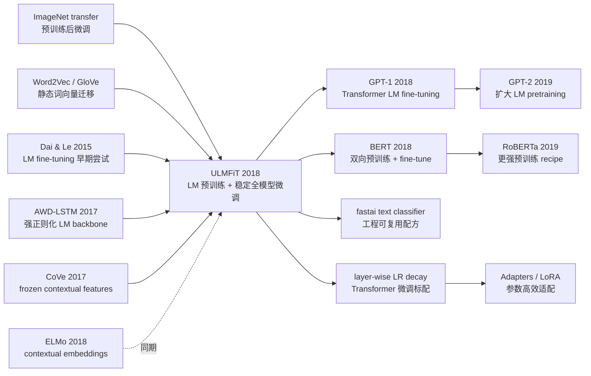

# ULMFiT — 让 NLP 预训练微调真正可用

> **2018 年 1 月，Jeremy Howard 与 Sebastian Ruder 把 [arXiv:1801.06146](https://arxiv.org/abs/1801.06146) 上传到 arXiv，题目朴素到像一份工程备忘录：Universal Language Model Fine-tuning for Text Classification。** 这篇 ACL 2018 论文没有 Transformer、没有万亿 token、也没有巨型 GPU 集群，只用一个 3 层 AWD-LSTM 说明了一个后来统治 NLP 的事实：预训练语言模型不是只能当 frozen embedding，用对微调配方后，整个模型都可以迁移。IMDb 错误率从当时常见的 5.9% 降到 4.6%，100 个标注样本能追上从头训练多 10-100 倍数据的模型。ULMFiT 很快被 BERT/GPT 的光芒盖过，但它先把问题说清楚了：NLP 也应该有自己的 ImageNet 时刻。

## 一句话总结

Howard 与 Ruder 2018 年发表在 ACL 的 ULMFiT，把 NLP 迁移学习从“下载一个 Word2Vec/GloVe 向量”推进到“预训练整个语言模型，再稳定地全模型微调”：先在 WikiText-103 上训练 AWD-LSTM 语言模型，再用目标语料继续最小化 $\mathcal{L}_{LM}=-\sum_t \log p(x_t\mid x_{<t})$，最后靠 discriminative fine-tuning、slanted triangular learning rates 和 gradual unfreezing 微调分类器。它击败的不是某个单一 baseline，而是一整套当时主流路线：CoVe/ELMo 风格的 frozen feature、从头训练的 CNN/LSTM、Dai & Le 式需要海量领域语料的 LM fine-tuning。IMDb 测试错误率降到 4.6%（CoVe 8.2%、此前常见 SOTA 5.9%），AG 从 DPCNN 的 6.87% 降到 5.01%，并在 100 个标注样本下追上从头训练多 10-100 倍数据的模型。真正反直觉的是，ULMFiT 后来被 [GPT-1](2018_gpt1.md) 和 [BERT](2018_bert.md) 在架构上替换，却没有被方法论上替换：现代 Transformer 微调、layer-wise LR decay、adapter/LoRA 仍在重复它的核心课题——如何在保留预训练知识的同时，把模型推向新任务。

---

## 历史背景

### 2017 年底的 NLP 为什么缺一个 ImageNet 时刻

2017 年底，计算机视觉已经把迁移学习当成日常操作：先在 ImageNet 上预训练，再把卷积网络微调到检测、分割、细粒度分类。NLP 却还停在更浅的一层。Word2Vec、GloVe 和 fastText 很有用，但它们大多只迁移 embedding；句子分类、问答、自然语言推理仍要给每个任务设计 LSTM/CNN/attention 结构，然后从随机初始化训练大部分参数。对于 IMDb、TREC 这类中小数据集，这意味着训练慢、过拟合重、调参脆弱。

更尴尬的是，语言模型预训练并不是没人想过。Dai & Le 2015 已经尝试过半监督序列学习，CoVe 2017 把机器翻译 encoder 的表示迁移到下游任务，Peters 等作者的 ELMo 也在 2018 年初证明 contextual embedding 很强。但这些方法常常把预训练模型当成特征提取器，或者需要大量领域内文档，或者在 fine-tuning 时很容易灾难性遗忘。ULMFiT 要解决的不是“语言模型有没有知识”，而是更工程化的问题：**怎样微调一个语言模型，才能让它既记得通用语言，又愿意适应目标任务。**

### 直接逼出 ULMFiT 的三条线索

- **ImageNet fine-tuning**：视觉领域已经证明“通用预训练 + 任务微调”比从头训练可靠，ULMFiT 明确把语言模型称作 NLP 的 ImageNet 对应物。
- **Dai & Le 2015**：首次系统讨论 LM fine-tuning，但论文中 ULMFiT 指出它在 10k 标注样本下仍过拟合，并且需要数百万领域内文档。
- **AWD-LSTM 2017**：Merity 等作者用 weight dropout、variational dropout 等技巧把 LSTM LM 做到很强，ULMFiT 直接借它作为 backbone，避免把贡献混在新架构里。
- **CoVe / hypercolumns / ELMo 路线**：这些方法把预训练表示拼接给下游模型，证明迁移有用，却也暴露了 frozen feature 的上限。

### 作者团队和 fast.ai 的特殊位置

Jeremy Howard 不是典型意义上的学院派 NLP 一作。他来自 Kaggle、创业和 fast.ai 教育社区，关心的是“普通工程师能不能少标数据、少调结构、把模型用起来”。Sebastian Ruder 则长期研究迁移学习、多任务学习和优化，是这篇论文里把经验配方压成学术语言的人。两人的组合很重要：ULMFiT 的贡献不是提出一个更炫的网络，而是把一组训练手艺变成可复用 recipe。

论文里的开源链接指向 `nlp.fast.ai/ulmfit`，后来这些想法也进入 fastai library。它和同年 Google/OpenAI 的路线气质不同：BERT/GPT 是“更强架构 + 更大预训练”的工业化路径；ULMFiT 是“把现有模型微调稳”的平民路径。正因为如此，它对后来许多中小团队尤其有影响。

### 当时的算力、数据和任务气氛

ULMFiT 的预训练语料是 WikiText-103：28,595 篇维基文章、约 1.03 亿词。今天看很小，但在 2018 年初，它足以回答一个关键问题：如果只有一个通用 LM，再给目标任务少量文本，能否跨任务迁移？论文选了 6 个文本分类数据集，覆盖情感、问题分类、主题分类，也覆盖 TREC-6 的 5.5k 样本到 Yelp-full 的 650k 样本。

这不是为了炫榜单，而是为了证明“universal”这个词不是广告。相同的 3 层 AWD-LSTM、相同的大体超参、相同的三阶段流程，能在长影评、短问题、新闻标题和百科主题上都工作。ULMFiT 因此更像一次范式校准：它告诉 NLP 社区，迁移学习的核心不是 embedding 文件，而是可微调的预训练模型。

---

## 方法详解

### 整体流程：三阶段而不是一个端到端大模型

ULMFiT 的方法论很克制：不发明新任务、不发明新 decoder、不把下游任务包成复杂输入格式，而是把一个强语言模型分三步迁移到分类任务。论文 Figure 1 的三张图其实就是后来“pretrain -> adapt -> fine-tune”的雏形。

| 阶段 | 输入 | 更新哪些参数 |
|------|------|--------------|
| General-domain LM pretraining | WikiText-103 的通用文本 | AWD-LSTM 语言模型全参数 |
| Target task LM fine-tuning | 目标任务的无标签/带标签文本 | 同一个 LM，全参数但分层学习率 |
| Target task classifier fine-tuning | 目标任务标注样本 | LM backbone + 新增分类头，逐层解冻 |

这三步把两个风险分开处理：**分布迁移**由第二步 LM fine-tuning 吸收，**监督任务适配**由第三步 classifier fine-tuning 完成。如果直接从通用 LM 跳到分类器，模型会被小数据集的监督信号拉坏；如果只用 frozen representation，分类器又碰不到真正有用的高层语言知识。ULMFiT 的核心正是在二者之间找一条可控的通道。

### 关键设计 1：AWD-LSTM LM pretraining —— 先拿到可迁移的语言先验

ULMFiT 使用 Merity 等作者的 AWD-LSTM，而不是普通 LSTM。AWD-LSTM 的关键不是结构复杂，而是正则化强：embedding dropout、variational dropout、weight dropout、activation regularization 一起压住 RNN 过拟合。论文强调它“没有 attention、shortcut 或其他复杂附件”，这句话很重要：如果一个朴素 LSTM 加强正则化后都能迁移，说明瓶颈不是 Transformer 是否出现，而是 **fine-tuning recipe 是否成熟**。

语言模型预训练目标仍是标准下一词预测：

$$
\mathcal{L}_{LM} = -\sum_{t=1}^{T} \log p(x_t \mid x_{<t}; \theta)
$$

| 组件 | 论文设置 | 为什么重要 |
|------|----------|------------|
| 预训练语料 | WikiText-103，28,595 篇文章，约 103M 词 | 足够通用，又能在当年成本下训练 |
| Embedding | 400 维 | 控制参数量，适合中小任务 |
| LSTM 层数 | 3 层 | 层级表示足够支持 discriminative LR |
| Hidden size | 每层 1150 hidden activations | AWD-LSTM 的标准强配置 |
| BPTT | 序列长度 70，variable length BPTT | 保留长文档训练效率 |
| Dropout | layer 0.4 / RNN 0.3 / embedding 0.05 / weight 0.5 | 防止 LM 在小任务上迅速过拟合 |

设计动机是把“语言常识”先压到模型里：词法、句法、长距离依赖、情感倾向都来自 LM 任务，而不是来自每个分类数据集的几千条标注。这里的反直觉点是，预训练语料不必和任务完全同域；第二阶段会负责吸收领域差异。

### 关键设计 2：Discriminative fine-tuning —— 不同层用不同学习率

ULMFiT 观察到 RNN 层也有类似 CNN 的层级性质：低层更通用，高层更任务相关。于是它不再对所有参数使用同一个学习率，而是给第 $l$ 层单独设置 $\eta^l$：

$$
\theta_t^l = \theta_{t-1}^l - \eta^l \nabla_{\theta^l} J(\theta)
$$

论文给出的经验规则是先选最后一层学习率 $\eta^L$，再令下层学习率递减：$\eta^{l-1}=\eta^l/2.6$。这听起来像调参细节，但它解决的是灾难性遗忘的核心：越靠近输入的层越像语言基础设施，更新要慢；越靠近输出的层越像任务接口，更新可以快。

| 层级 | 学到什么 | ULMFiT 的更新策略 |
|------|----------|------------------|
| 低层 | 词形、短语、局部语法 | 小学习率，尽量保留 |
| 中层 | 句法关系、文体、领域词汇 | 中等学习率，温和适配 |
| 高层 | 情感、主题、分类相关模式 | 大学习率，快速转向任务 |

这个思想后来以 layer-wise learning-rate decay 的名字进入 Transformer fine-tuning。BERT 微调里常见的“底层 lr 小、顶层 lr 大”，本质上就是 ULMFiT 的神经网络时代版本。

### 关键设计 3：Slanted triangular learning rates —— 先冲到好区域，再慢慢收敛

只分层还不够，学习率随时间怎么变也关键。ULMFiT 提出 slanted triangular learning rates (STLR)：训练前 10% 线性升高学习率，快速离开预训练权重附近的不合适局部区域；后 90% 线性降低，慢慢贴合任务。

$$
\begin{aligned}
cut &= \lfloor T \cdot cut\_frac \rfloor \\
p &= \begin{cases}
t/cut, & t < cut \\
1 - \frac{t-cut}{cut \cdot (1/cut\_frac - 1)}, & t \ge cut
\end{cases} \\
\eta_t &= \eta_{max} \cdot \frac{1 + p \cdot (ratio - 1)}{ratio}
\end{aligned}
$$

论文默认 $cut\_frac=0.1$、$ratio=32$、$\eta_{max}=0.01$。这套 schedule 和 Leslie Smith 的 triangular LR 有亲缘关系，但 ULMFiT 把它做成“一次短上升 + 长下降”，更适合小数据微调。

```python
def discriminative_stlr(max_lr, num_layers, total_steps, cut_frac=0.1, ratio=32):
    layer_lrs = [max_lr / (2.6 ** (num_layers - 1 - layer)) for layer in range(num_layers)]
    cut = int(total_steps * cut_frac)
    for step in range(total_steps):
        if step < cut:
            progress = step / max(cut, 1)
        else:
            progress = 1 - (step - cut) / max(cut * (1 / cut_frac - 1), 1)
        scale = (1 + progress * (ratio - 1)) / ratio
        yield [lr * scale for lr in layer_lrs]
```

设计动机可以用一句话概括：小数据微调既怕“动太慢学不到任务”，也怕“动太快忘掉预训练”。STLR 用短促的高学习率解决前者，用长尾衰减解决后者。

### 关键设计 4：Gradual unfreezing + concat pooling —— 分类器微调不要一口吞下整个模型

第三阶段给 LM 加上两个线性块作为分类头。分类头从头训练，风险最大；如果一开始就解冻所有层，分类 loss 会把预训练表示一起搅乱。ULMFiT 因此从最后一层开始，每个 epoch 多解冻一层，直到所有层都参与训练。这和 Felbo 等作者的 chain-thaw 类似，但不是每次只训练一个层，而是逐步扩大可训练集合。

分类输入也不是只取最后一个 hidden state。长文本的分类信号可能出现在任何位置，所以 ULMFiT 把最后状态、max pooling 和 mean pooling 拼接起来：

$$
\mathbf{h}_c = [\mathbf{h}_T, \mathtt{maxpool}(\mathbf{H}), \mathtt{meanpool}(\mathbf{H})]
$$

这里 $\mathbf{H}=\{\mathbf{h}_1,\ldots,\mathbf{h}_T\}$。这一步看似小，却让 IMDb 这种多段影评任务不必把情感线索全压到最后一个 token。论文还提出 BPTT for Text Classification (BPT3C)，把长文档切成固定长度 batch，用前一段 final state 初始化后一段，同时跟踪用于 pooling 的 hidden states，从而让 RNN 分类器能处理较长输入。

### 损失函数 / 训练策略

ULMFiT 的训练不是一个单独 trick，而是几个互相补位的约束：强 LM 提供先验，目标 LM fine-tuning 消化分布差异，分类阶段用分层学习率、STLR 和逐层解冻防止遗忘。论文的默认超参也尽量保持跨数据集一致，只在 epoch 数和 dropout 上做少量调整。

| 项目 | 设置 | 作用 |
|------|------|------|
| Backbone | AWD-LSTM，3 层，400 embedding，1150 hidden | 强正则化语言模型 |
| General pretraining | WikiText-103 | 学通用语言先验 |
| Target LM fine-tuning LR | base 0.004 | 适应领域文本 |
| Classifier fine-tuning LR | base 0.01 | 适应标签任务 |
| Optimizer | Adam，$\beta_1=0.7$，$\beta_2=0.99$ | 比默认 Adam 更适合该设置 |
| Batch size | 64 | 跨任务统一 |
| Pooling | last + max + mean | 捕捉长文本中局部强信号 |
| Bidirectionality | 前向/后向 LM 各训一个分类器并平均 | IMDb 单模型 5.30 降到双向 4.58 |

从今天看，这些技巧都很朴素；从 2018 年初看，它们把“fine-tuning NLP model 会崩”这个经验问题拆成了可控流程。ULMFiT 的真正贡献就是让迁移学习从论文直觉变成工程默认值。

---

## 失败案例

### 当时输给 ULMFiT 的路线

ULMFiT 的“失败 baseline”不只是某个模型分数低，而是 2018 年前 NLP 迁移学习的几种默认假设一起失效：只迁移 embedding 不够，只拼接 frozen contextual feature 也不够，普通全模型 fine-tuning 又会遗忘。

| 路线 / Baseline | 当时代表 | 输在哪里 |
|-----------------|----------|----------|
| Frozen feature transfer | CoVe / hypercolumns / ELMo 风格 | 预训练模型不随任务更新，上限受限 |
| Scratch-trained classifier | oh-LSTM、Virtual adversarial、CNN/LSTM | 每个任务从头学，低标注场景样本效率差 |
| Deep text CNN | DPCNN、char-level CNN | 大数据上强，但不能复用通用语言知识 |
| 早期 LM fine-tuning | Dai & Le 2015 | 10k 标注样本仍会过拟合，还需要数百万领域文档 |
| CV 式只训最后层 | Last-layer fine-tuning | TREC-6 上验证错误率 16.09%，比从头训练还糟 |

最有意思的是最后一行。视觉里常见的“冻结 backbone，只训最后几层”搬到 NLP 并不稳，因为文本分类里的任务信号常常需要重排整条序列表示。ULMFiT 的 gradual unfreezing 不是保守主义，而是在告诉模型：先学分类头，再逐步允许高层、低层一起移动。

### 作者论文里承认的失败实验

- **无预训练**：IMDb/TREC-6/AG 验证错误率是 5.63 / 10.67 / 5.52；加 WikiText-103 预训练后变成 5.00 / 5.69 / 5.38，TREC-6 几乎腰斩。
- **Vanilla LM**：没有 AWD-LSTM 正则化时，IMDb/TREC-6/AG 是 5.98 / 7.41 / 5.76；AWD-LSTM 变成 5.00 / 5.69 / 5.38。LM 质量直接决定迁移上限。
- **Regular full fine-tuning**：目标 LM fine-tuning 只做 full update，在 TREC-6 上 6.54，比不 fine-tune 的 6.38 还差；加 discriminative LR 和 STLR 后才到 5.69。
- **Classifier full fine-tuning 太激进**：论文曲线显示 full fine-tuning 往往第一轮后很快达到低误差，然后开始反弹，说明预训练知识被监督信号冲掉。
- **Cosine annealing 不是通用替代**：在 AG 上 cosine 稍强，但在 IMDb/TREC-6 上不如 STLR；小数据需要更短的上升和更长的衰减。

这组失败实验让 ULMFiT 的贡献更清楚：不是“预训练有用”这句泛话，而是“预训练只有配上正确微调动态才稳定有用”。

---

## 实验关键数据

### 主实验：六个文本分类数据集

论文统一报告 test error rate，越低越好。ULMFiT 在六个数据集上都达到或刷新当时 SOTA，而且多数提升来自同一套超参和同一流程。

| Dataset | 任务类型 | 最强对照 | 对照错误率 | ULMFiT 错误率 |
|---------|----------|----------|------------|---------------|
| IMDb | Sentiment | oh-LSTM / Virtual adversarial | 5.9 | **4.6** |
| TREC-6 | Question | LSTM-CNN | 3.9 | **3.6** |
| AG | Topic | DPCNN | 6.87 | **5.01** |
| DBpedia | Topic | DPCNN | 0.88 | **0.80** |
| Yelp-bi | Sentiment | DPCNN | 2.64 | **2.16** |
| Yelp-full | Sentiment | DPCNN | 30.58 | **29.98** |

IMDb 是最能说明问题的数字：CoVe 是 8.2，强 LSTM/CNN 系列是 5.9，ULMFiT 双向模型到 4.6。它没有为 IMDb 设计专门结构，只是把通用语言模型稳定搬过去。

### 关键消融：到底是哪一步起作用

| 消融设置 | IMDb | TREC-6 | AG | 结论 |
|----------|------|--------|----|------|
| Without pretraining | 5.63 | 10.67 | 5.52 | 小数据尤其依赖通用 LM 先验 |
| With pretraining | **5.00** | **5.69** | **5.38** | 预训练显著降低错误率 |
| Vanilla LM | 5.98 | 7.41 | 5.76 | 普通 LM 能迁移但不稳 |
| AWD-LSTM LM | **5.00** | **5.69** | **5.38** | 正则化 LM 是关键底座 |
| No LM fine-tuning | 6.99 | 6.38 | 6.09 | 只靠通用域不够 |
| Full + discr + STLR | **5.00** | **5.69** | **5.38** | 领域 LM adaptation 必需 |
| From scratch classifier | 9.93 | 13.36 | 6.81 | 分类器从头学样本效率很差 |
| Freez + discr + STLR | **5.00** | **5.69** | 5.38 | 三个微调技巧互补 |

这里最漂亮的对比是 TREC-6：无预训练 10.67，带预训练 5.69；从头分类 13.36，完整 ULMFiT 5.69。对于只有 5.5k 训练样本的短问题分类，预训练不是锦上添花，而是能不能训练好的分水岭。

### 低标注样本和双向模型

| 现象 | IMDb | AG | TREC-6 |
|------|------|----|--------|
| 100 标注样本，supervised ULMFiT | 追上从头训练 10x 数据 | 追上从头训练 20x 数据 | 明显优于从头训练 |
| 100 标注样本，semi-supervised ULMFiT | 追上从头训练 100x 数据 | 追上从头训练 50x 数据 | 与 supervised 接近 |
| 额外无标签数据 | 50k IMDb 文档 | 100k AG 文档 | 短文本收益较小 |
| 双向 ensemble | 单模型 5.30 -> 双向 4.58 | 论文主要报告整体提升 | 前向/后向平均更稳 |

低标注实验是 ULMFiT 最被低估的部分。它预告了后来大模型时代的一个常识：标注样本并不总是瓶颈，关键是预训练模型能否把无标签文本中的结构变成可迁移的参数。

### 关键发现

- **小数据收益最大**：TREC-6 和 IMDb 的预训练/微调收益远大于大规模 Yelp-full。
- **LM 质量决定上限**：同样的 fine-tuning recipe 下，AWD-LSTM 明显强于 vanilla LM。
- **目标域 LM fine-tuning 不是可选项**：即使有 WikiText-103，目标语料继续训练仍能显著改善分类。
- **微调动态比模型结构更重要**：普通 LSTM 加正确 recipe 能击败更复杂的 task-specific architecture。
- **双向只是加分，不是核心**：前向模型已经成立，前向/后向平均把 IMDb 从 5.30 推到 4.58。

---

## 思想史脉络



### 前世（被谁逼出来的）

ULMFiT 的第一条前世来自视觉。Yosinski 等作者关于可迁移特征的研究、ImageNet 模型在检测/分割里的复用，让 Howard 与 Ruder 有了一个清晰类比：语言模型可以成为 NLP 的 ImageNet。这个类比今天听起来普通，但在当时很锋利，因为 NLP 社区更习惯把迁移学习理解为“初始化 embedding”。

第二条前世来自早期 NLP 半监督学习。Dai & Le 2015 已经把语言模型拿来 fine-tune，但效果和适用性都不够稳定；CoVe 和 ELMo 证明 contextual representation 有价值，却倾向于 frozen feature 或拼接特征。ULMFiT 把这些线索合在一起：语言模型是 source task，目标任务文本负责 domain adaptation，监督标签负责最后的 decision boundary。

第三条前世是 AWD-LSTM。没有 Merity 等作者的强正则化 LM，ULMFiT 很可能会被 RNN 过拟合拖垮。论文选择 AWD-LSTM 也让贡献边界很清楚：架构借现成强者，创新放在 fine-tuning 动态上。

### 今生（继承者）

| 继承者 | 继承了什么 | 改掉了什么 |
|--------|------------|------------|
| GPT-1 | LM pretraining + downstream fine-tuning | 把 AWD-LSTM 换成 decoder-only Transformer |
| BERT | 预训练模型整体微调 | 把单向 LM 换成 MLM + NSP 的 encoder-only 预训练 |
| fastai text classifier | 三阶段微调 recipe | 把论文技巧打包给工程用户 |
| Layer-wise LR decay | 分层学习率思想 | 在 Transformer 里变成更系统的层级衰减 |

ULMFiT 对 GPT-1/BERT 的影响常被低估，因为后者的架构更强、更有名。但如果只看方法论，ULMFiT 已经说出了后来所有 NLP 预训练论文的基本句式：先在大语料上学通用语言，再用少量任务数据微调整个模型。GPT-1 把 backbone 换成 Transformer decoder；BERT 把目标换成 MLM；T5、RoBERTa、DeBERTa 继续优化预训练目标和数据。底层范式仍是 ULMFiT 讲清楚的那件事。

更长远的继承发生在微调技术里。Layer-wise learning-rate decay、adapter tuning、LoRA、prefix tuning 都在处理同一个张力：新任务需要改变模型，但预训练知识不能被冲掉。ULMFiT 的 discriminative fine-tuning 和 gradual unfreezing 是这条技术线的早期、朴素、但非常清晰的版本。

### 误读 / 简化

- **“ULMFiT 只是 LSTM 时代的小插曲”**：架构上是小插曲，方法论上不是。它比 GPT-1/BERT 更早把“预训练整个 LM 后微调”系统化。
- **“它的贡献是 AWD-LSTM”**：AWD-LSTM 是借来的 backbone。论文贡献是三阶段迁移流程和微调动态。
- **“有了 Transformer 后 ULMFiT 就过时”**：具体模型过时了，问题没有过时。BERT 微调不稳、LLM adapter 设计、LoRA rank 选择，仍在处理同一个灾难性遗忘/任务适配平衡。
- **“只要预训练足够大，微调技巧就不重要”**：大模型缓解了很多问题，但 instruction tuning、RLHF、adapter 和 continual learning 反而让微调稳定性更重要。

ULMFiT 在思想史里的位置很像一座桥：它从静态词向量和 frozen feature 的时代过来，走向全参数预训练模型的时代。桥本身很快被更大的桥替换，但它第一次证明这条河能过。

---

## 当代视角（2026 年回看 2018）

### 站不住的假设

第一，**AWD-LSTM 不是预训练语言模型的最终形态**。ULMFiT 发表几个月后，GPT-1、BERT 和后续 Transformer 预训练模型迅速证明：RNN 的顺序瓶颈、容量上限和并行效率都不适合继续扩展。ULMFiT 的三阶段流程活了下来，LSTM backbone 很快退出主线。

第二，**文本分类不是预训练模型的终点任务**。ULMFiT 主要验证 sentiment/question/topic classification，这让它看起来像“分类器论文”。后来的 GPT/BERT 证明，同样的 pretrain/fine-tune 思想可以扩展到自然语言推理、问答、抽取、生成、检索、代码和多模态任务。ULMFiT 低估的不是迁移学习本身，而是迁移学习可以吞掉多大的任务空间。

第三，**逐层解冻不是唯一稳定微调方案**。在 BERT 之后，常见做法变成全参数微调 + 小学习率 + warmup，或者 adapter/LoRA 这类参数高效更新。Gradual unfreezing 对 3 层 LSTM 很自然，对 24/96 层 Transformer 就显得笨重。但它背后的原则仍成立：靠近输入和靠近输出的参数不应该被同等对待。

### 时代证明的关键 vs 冗余

| 设计 | 今天是否保留 | 判断 |
|------|--------------|------|
| “预训练整个 LM 后微调” | 保留 | 已成为 NLP 和 LLM 的默认范式 |
| Target-domain continued pretraining | 保留 | domain-adaptive pretraining / continued pretraining 仍常用 |
| Discriminative fine-tuning | 保留为思想 | 变成 layer-wise LR decay、parameter groups |
| Slanted triangular LR | 部分保留 | 具体形状少见，但 warmup + decay 成为标配 |
| Gradual unfreezing | 场景化保留 | 小模型/迁移学习有用，大 Transformer 多用 LoRA/adapter |

最经得起时间考验的是“微调动态”这个视角。ULMFiT 没有把迁移学习简化成“初始化好一点”，而是把训练过程本身当作核心对象：什么时候更新、更新哪一层、用多大学习率、如何避免遗忘。这恰好也是 2026 年大模型后训练最关心的问题。

### 如果今天重写 ULMFiT

如果 2026 年重写 ULMFiT，backbone 几乎一定会换成 decoder-only 或 encoder-only Transformer，预训练语料从 WikiText-103 扩到 web-scale 或至少 domain-scale，tokenizer 也会从 word-level/RNN 习惯切到 BPE/SentencePiece。目标任务不应只限文本分类，还会加入 NLI、QA、生成式分类和 instruction following。

| 2018 ULMFiT | 2026 版本可能会怎样改 | 原因 |
|-------------|----------------------|------|
| AWD-LSTM | DeBERTa/RoBERTa/T5 或小型 decoder LM | 更强容量和并行效率 |
| WikiText-103 | 大规模网页 + 领域语料 continued pretraining | 覆盖更广语言和领域 |
| Gradual unfreezing | LoRA / adapters / selective freezing | 更适合深 Transformer |
| STLR | cosine/linear warmup-decay + scheduler search | 工具链和经验更成熟 |
| 单纯分类头 | prompt/classification head 双路线 | 兼容生成式和判别式评估 |
| 前后向两个 LM ensemble | 单个双向 encoder 或 decoder prompting | Transformer 已吸收上下文建模能力 |

但论文的核心问题不会变：**如何把预训练知识迁移到新任务，同时不把它擦掉。** 今天的 LoRA 学习率、adapter 插入位置、instruction tuning 数据混合比例，本质上都在回答 ULMFiT 提出的同一个问题。

---

## 局限与展望

### 作者承认的局限

论文自己已经指出，ULMFiT 只在文本分类上验证，虽然方法可以延伸到序列标注，但更复杂的自然语言推理、问答等任务可能需要新的预训练和微调方式。作者也承认 WikiText-103 不是最丰富的预训练语料，更大、更广、更贴近目标领域的数据可能进一步提升表现。

另一个作者明确提到的方向是理解预训练 LM 到底捕捉了什么知识、fine-tuning 过程中这些知识如何变化。这个问题在 2026 年仍未完全解决，只是对象从 3 层 LSTM 换成了千亿参数 Transformer。

### 自己发现的局限

ULMFiT 的适用面被文本分类限制住了。它没有真正解决 span extraction、structured prediction、多句推理、开放式生成这些更复杂任务，也没有展示跨语言迁移的强证据。论文里的“universal”更准确地说是“同一套流程能覆盖多种文本分类数据集”。

此外，它的工程 recipe 对超参仍然敏感：dropout、学习率、epoch、冻结顺序都需要经验。fastai 把这些经验封装得很好，但这也说明 ULMFiT 不是一个即插即用的理论结论，而是一套实践性很强的训练术。

### 后续已经证实的改进方向

- **更强 backbone**：GPT-1/BERT/RoBERTa/T5 证明 Transformer 是更可扩展的预训练底座。
- **更大更多样数据**：从 WikiText-103 到 Common Crawl、Books、C4、The Pile，预训练语料规模变成决定性因素。
- **更稳定微调**：warmup、layer-wise decay、weight decay、adapter、LoRA、prompt tuning 都是 ULMFiT 问题的后续答案。
- **任务格式统一**：GPT 系列把许多分类任务转成生成/next-token，T5 把所有任务转成 text-to-text。
- **持续预训练**：domain-adaptive pretraining、continual pretraining 在医学、法律、代码等领域仍继承 ULMFiT 的 target LM fine-tuning 思路。

---

## 相关工作与启发

ULMFiT 和 ELMo 的关系最微妙。ELMo 更像 representation paper：预训练双向 LM，然后把 hidden states 当 contextual embeddings 给下游模型。ULMFiT 更像 adaptation paper：预训练 LM 本身就是下游模型骨架，必须被微调。BERT 后来把两者合在一起：contextual representation 是模型内部状态，fine-tuning 更新整个 backbone。

和 GPT-1 相比，ULMFiT 的优势是先说清楚了“微调为什么会坏、怎样不坏”；劣势是 backbone 无法 scale。GPT-1 把 LSTM 换成 Transformer decoder 后，很多 ULMFiT 的复杂流程可以简化，但 GPT-1 仍继承了它最重要的句法：预训练 LM，然后下游任务微调。

| 对比对象 | ULMFiT 的关系 | 留下的启发 |
|----------|---------------|------------|
| ELMo | 同期 contextual LM，但偏 frozen feature | fine-tune 上限更高，feature-based 更易集成 |
| GPT-1 | 方法论继承者，架构替换者 | 换对 backbone 后，recipe 可以大幅简化 |
| BERT | 把 full-model fine-tuning 变成主流 | ULMFiT 的 layer-wise 思想仍服务微调稳定性 |
| LoRA / adapters | 参数高效时代的后代 | 不更新全部参数，也是在避免遗忘 |
| Domain-adaptive pretraining | 直接继承 target LM fine-tuning | 领域文本仍是便宜的迁移信号 |

ULMFiT 的最大启发是：经典论文不一定靠新算子改变世界，有时靠的是把一组脆弱经验整理成可传播流程。它没有定义大模型架构，却定义了一个问题——预训练模型如何被安全地改造成任务模型。

---

## 相关资源

| 类型 | 资源 | 说明 |
|------|------|------|
| Paper | [arXiv 1801.06146](https://arxiv.org/abs/1801.06146) | 原始 ACL 2018 论文 |
| Code / models | [nlp.fast.ai/ulmfit](https://nlp.fast.ai/ulmfit) | 论文开源模型与代码入口 |
| Backbone | [AWD-LSTM paper](https://arxiv.org/abs/1708.02182) | ULMFiT 使用的强正则化 LM |
| Follow-up | [GPT-1](2018_gpt1.md) / [BERT](2018_bert.md) | Transformer 时代继承并放大预训练微调范式 |
| Context | [ELMo](2018_elmo.md) / [GPT-2](2019_gpt2.md) | 同期 contextual feature 与后续 scaling 路线 |

读 ULMFiT 时，最好不要把它当作“过时的 LSTM 分类器”。更好的读法是把它放在 2018 年那条窄桥上：一边是静态词向量和任务专用模型，另一边是 BERT/GPT 的全模型预训练时代。ULMFiT 证明桥能走通。


---

> 🌐 [English version](/en/era3_attention/2018_ulmfit/) · 📚 awesome-papers project · CC-BY-NC