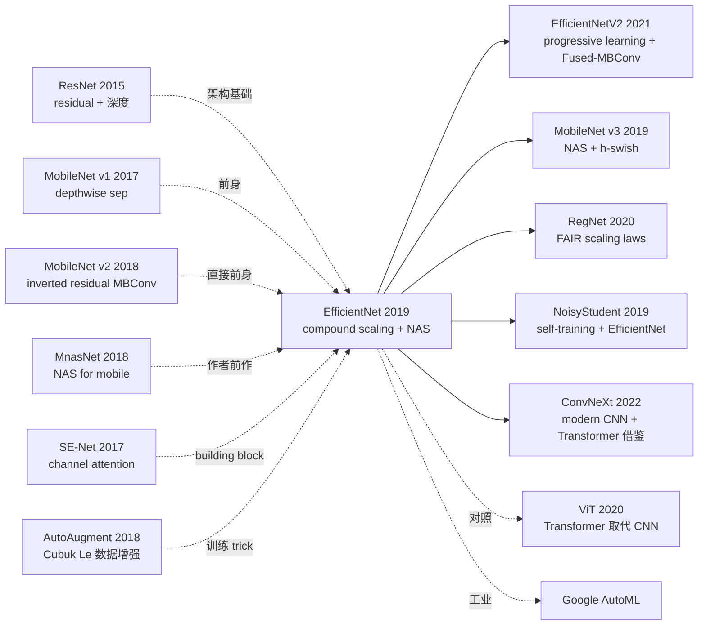

# EfficientNet — 用 compound scaling 重新定义 CNN 模型效率

> **2019 年 5 月 28 日，Google Brain 的 Tan & Le 在 arXiv 发布 [EfficientNet (1905.11946)](https://arxiv.org/abs/1905.11946)，ICML 2019 接收。**
> 这是 CNN scaling 史上最重要的论文 —— 第一次系统研究"模型如何 scale up"问题，提出 **compound scaling** 法则：**深度 / 宽度 / 输入分辨率必须按固定比例同时缩放**，而非像之前那样单独调一个维度。
> 用 NAS 搜出 baseline EfficientNet-B0 (5.3M params)，再按 compound scaling 公式生成 B1-B7。**EfficientNet-B7 (66M params) 在 ImageNet 拿 84.4% top-1，比之前 SOTA GPipe (557M params) 高 0.1%，但参数少 8.4×、推理快 6.1×**。
> EfficientNet 主导了 2019-2021 年 ImageNet 排行榜，催生了 EfficientNetV2 / MobileNetV3 / ResNeSt / RegNet 等大量后续工作，是 ViT 时代之前的 CNN 巅峰。

## 一句话总结

EfficientNet 用 **compound scaling**（$d=\alpha^\phi, w=\beta^\phi, r=\gamma^\phi$，约束 $\alpha \cdot \beta^2 \cdot \gamma^2 \approx 2$）让深度 / 宽度 / 分辨率三维度按固定比例同时 scale，再配合 NAS 搜索的 EfficientNet-B0 baseline (MBConv + SE blocks)，从 B0 (5.3M / 0.39G FLOPs / 77.3%) 到 B7 (66M / 37G FLOPs / 84.4%) 沿着 Pareto 前沿覆盖 8 个规模的 SOTA 模型。

---

## 历史背景

### 2019 年 CNN scaling 学界在卡什么

2012-2018 ImageNet SOTA 一路演化：AlexNet (60M, 57.2%) → VGG (138M, 71.5%) → Inception v3 (24M, 78%) → ResNet-50 (25M, 76%) → ResNet-152 (60M, 78.6%) → ResNeXt-101 (84M, 80.5%) → SENet-154 (146M, 82.7%) → GPipe (557M, 84.3%)。但**所有 scaling 都是 ad-hoc 的**：

> **(1) 加深**（ResNet 50→101→152）：return diminishes 快，收益从 +2 → +0.6 → +0.4
> **(2) 加宽**（WideResNet 调宽 ResNet）：很快饱和
> **(3) 加分辨率**（提高输入图像）：内存爆炸 + return 也快饱和
> **(4) 三个维度互相依赖**：但没人系统研究这个依赖

学界明显的开放问题：**「同时增大三个维度，应该用什么比例？」** GPipe 用 557M 暴力 scale 已是当时极限，但效率极低。

### 直接逼出 EfficientNet 的 3 篇前序

- **Sandler et al., 2018 (MobileNet v2)** [CVPR]：提出 inverted residual + linear bottleneck (MBConv)，是 EfficientNet 的 building block
- **Tan et al., 2018 (MnasNet)** [CVPR 2019]：作者上一篇，用 NAS 搜手机端 CNN，搜索空间和方法直接复用到 EfficientNet
- **Hu et al., 2017 (SE-Net)** [CVPR 2018]：channel attention 模块，被嵌入 EfficientNet 的 MBConv

### 作者团队当时在做什么

2 位作者全部来自 Google Brain。Mingxing Tan 是 NAS / 高效 CNN 主力（MnasNet / EfficientNet / EfficientNetV2 / NoisyStudent 等）；Quoc V. Le 是 Google senior 研究员（NAS / Seq2Seq / AutoAugment 共同作者）。**Google Brain 当时押注「自动化模型设计 + 系统化 scaling」战略**，EfficientNet 是这个押注的代表作。

### 工业界 / 算力 / 数据

- **TPU**：训练 B7 在 256 个 TPU v3 上 ~5 天
- **数据**：ImageNet 1.28M 训练 + 50k 验证
- **框架**：TensorFlow + 自家 NAS 框架（基于 MnasNet）
- **行业**：CV 学界对"准确率排行榜"狂热，Google / FAIR / NVIDIA 互相竞争 ImageNet SOTA

---
## 方法详解

### 整体框架

```
Step 1: NAS Search
  目标: 在 mobile FLOPs constraint 下找最佳架构
  搜索空间: MBConv (mobile inverted bottleneck) + SE block
  → EfficientNet-B0 (5.3M params, 0.39B FLOPs, 77.3% top-1)

Step 2: Compound Scaling
  约束: depth=α^φ, width=β^φ, resolution=γ^φ
        s.t. α·β²·γ² ≈ 2 (FLOPs ≈ 2^φ)
  Grid search small (φ=1) → α=1.2, β=1.1, γ=1.15
  Generate B1, B2, ..., B7 by setting φ=1, 2, 3, ..., 7
```

| 模型 | φ | depth | width | resolution | params | FLOPs | top-1 |
|------|---|-------|-------|-----------|--------|-------|-------|
| B0 | 0 | 1.0 | 1.0 | 224 | 5.3M | 0.39G | 77.3% |
| B1 | 1 | 1.2 | 1.1 | 240 | 7.8M | 0.70G | 79.2% |
| B2 | 2 | 1.4 | 1.2 | 260 | 9.2M | 1.0G | 80.3% |
| B3 | 3 | 1.7 | 1.3 | 300 | 12M | 1.8G | 81.6% |
| B4 | 4 | 2.0 | 1.4 | 380 | 19M | 4.2G | 82.9% |
| B5 | 5 | 2.4 | 1.6 | 456 | 30M | 9.9G | 83.6% |
| B6 | 6 | 2.8 | 1.8 | 528 | 43M | 19G | 84.0% |
| **B7** | **7** | **3.2** | **2.0** | **600** | **66M** | **37G** | **84.4%** |

### 关键设计

#### 设计 1：Compound Scaling 公式 —— 系统化 CNN scaling

**功能**：把"如何 scale up CNN"从 ad-hoc 经验变成有理论指导的公式。

**核心公式**：

定义 baseline 网络的深度 $d_0$、宽度 $w_0$、分辨率 $r_0$。在新模型上：

$$
d = \alpha^\phi, \quad w = \beta^\phi, \quad r = \gamma^\phi
$$

满足约束：

$$
\alpha \cdot \beta^2 \cdot \gamma^2 \approx 2, \quad \alpha \geq 1, \beta \geq 1, \gamma \geq 1
$$

直觉：FLOPs 与 depth $d$ 成正比，与 width 平方 $w^2$ 成正比，与 resolution 平方 $r^2$ 成正比，所以 FLOPs $\propto d \cdot w^2 \cdot r^2 = (\alpha \beta^2 \gamma^2)^\phi \approx 2^\phi$。**φ 增加 1 → FLOPs 翻倍**。

**Grid search**（论文 Section 3.3）：固定 φ=1，在小搜索空间找最佳 $(\alpha, \beta, \gamma)$，发现：

$$
\alpha = 1.2, \quad \beta = 1.1, \quad \gamma = 1.15
$$

验证：$1.2 \cdot 1.1^2 \cdot 1.15^2 = 1.2 \cdot 1.21 \cdot 1.3225 = 1.92 \approx 2$ ✓

然后**固定这组比例**，让 φ 增加生成 B1, B2, ..., B7。

**对比单维度 scaling**：

| Scaling 方式 | 样例 | top-1 from B0 (77.3%) | FLOPs |
|-------------|------|---------------------|-------|
| width only (×2 w) | β=2 | 79.4% (+2.1) | 0.93G |
| depth only (×2 d) | α=2 | 79.7% (+2.4) | 0.84G |
| resolution only (×2 r) | γ=2 | 79.4% (+2.1) | 1.30G |
| **compound (B3, φ=3)** | α=1.7,β=1.3,γ=1.5 | **81.6% (+4.3)** | **1.8G** |

Compound scaling 在相似 FLOPs 下显著胜出。

#### 设计 2：NAS 搜索 EfficientNet-B0 baseline —— 起点决定上限

**功能**：用 NAS 搜出一个 mobile-FLOPs 约束下的最佳架构作为 baseline，避免在弱 baseline 上 scale 浪费。

**搜索方法**：基于 MnasNet 的 NAS framework，搜索目标：

$$
ACC(m) \times \left[\frac{\text{FLOPs}(m)}{T}\right]^w
$$

其中 $T=400M$ 是目标 FLOPs，$w=-0.07$ 是权衡因子。

**搜索空间（搜索哪些架构超参）**：
- Convolutional ops: regular conv, depthwise conv, MBConv (mobile inverted bottleneck)
- Kernel size: 3 or 5
- Squeeze-and-Excitation ratio: 0 or 0.25
- Skip ops: pooling, identity, none
- Channel size, number of layers per block

**搜出的 EfficientNet-B0 架构**：

| Stage | Operator | Resolution | Channels | Layers |
|-------|----------|-----------|----------|--------|
| 1 | Conv 3×3 | 224×224 | 32 | 1 |
| 2 | MBConv1, k3×3 | 112×112 | 16 | 1 |
| 3 | MBConv6, k3×3 | 112×112 | 24 | 2 |
| 4 | MBConv6, k5×5 | 56×56 | 40 | 2 |
| 5 | MBConv6, k3×3 | 28×28 | 80 | 3 |
| 6 | MBConv6, k5×5 | 14×14 | 112 | 3 |
| 7 | MBConv6, k5×5 | 14×14 | 192 | 4 |
| 8 | MBConv6, k3×3 | 7×7 | 320 | 1 |
| 9 | Conv 1×1 + Pool + FC | 7×7 | 1280 | 1 |

#### 设计 3：MBConv + SE Block —— 高效 building block

**功能**：每个 MBConv 块（mobile inverted bottleneck conv）由 expand → depthwise → SE → project 4 步组成，加上 residual connection。

**MBConv 结构**：

```python
class MBConv(nn.Module):
    def __init__(self, in_ch, out_ch, kernel=3, stride=1, expand_ratio=6, se_ratio=0.25):
        super().__init__()
        hidden_ch = in_ch * expand_ratio
        # Step 1: Expand (1×1 conv)
        self.expand = nn.Sequential(
            nn.Conv2d(in_ch, hidden_ch, 1, bias=False),
            nn.BatchNorm2d(hidden_ch),
            nn.SiLU())                                # Swish/SiLU activation
        # Step 2: Depthwise conv
        self.depthwise = nn.Sequential(
            nn.Conv2d(hidden_ch, hidden_ch, kernel, stride=stride,
                      padding=kernel//2, groups=hidden_ch, bias=False),
            nn.BatchNorm2d(hidden_ch),
            nn.SiLU())
        # Step 3: SE block
        squeeze_ch = max(1, int(in_ch * se_ratio))
        self.se = nn.Sequential(
            nn.AdaptiveAvgPool2d(1),
            nn.Conv2d(hidden_ch, squeeze_ch, 1),
            nn.SiLU(),
            nn.Conv2d(squeeze_ch, hidden_ch, 1),
            nn.Sigmoid())
        # Step 4: Project (1×1 conv, no activation)
        self.project = nn.Sequential(
            nn.Conv2d(hidden_ch, out_ch, 1, bias=False),
            nn.BatchNorm2d(out_ch))
        self.use_residual = (stride == 1 and in_ch == out_ch)

    def forward(self, x):
        out = self.expand(x)
        out = self.depthwise(out)
        out = out * self.se(out)              # SE attention
        out = self.project(out)
        if self.use_residual:
            out = out + x                     # Inverted residual
        return out
```

**4 个关键 building block 选择**：
- **MBConv**：expand → depthwise → project，参数效率高
- **SE block**：channel attention，免费提升 ~1%
- **SiLU/Swish 激活**：$\text{SiLU}(x) = x \cdot \sigma(x)$，比 ReLU 平滑
- **Inverted residual**：在 expanded space skip connect

#### 设计 4：训练增强 —— AutoAugment + Stochastic Depth + Dropout

**功能**：利用各种正则化让大模型不 overfit。

**关键正则化技巧**：

| 技巧 | 作用 |
|------|------|
| **AutoAugment** | NAS 搜出的数据增强策略 (rotation/shear/color jitter etc.) |
| **Dropout** | B0 0.2 → B7 0.5 (大模型加更多 dropout) |
| **Stochastic Depth** | 训练时随机丢 layer，深网更稳 |
| **Label Smoothing** | 0.1 |
| **EMA weights** | 训练保留 EMA 副本作为推理权重 |
| **Larger LR + warmup** | 适配 TPU 大 batch |

### 损失函数 / 训练策略

| 项 | 配置 |
|----|------|
| Loss | Cross-entropy + label smoothing 0.1 |
| Optimizer | RMSprop with momentum 0.9, decay 0.9 |
| LR | 0.256，每 2.4 epoch 衰减 0.97 |
| Batch | 4096 (256 TPU v3) |
| Weight decay | 1e-5 |
| Dropout | 0.2 (B0) → 0.5 (B7) |
| Activation | SiLU/Swish |
| 训练 epoch | 350 |
| Augmentation | AutoAugment + RandAugment |

---

## 失败案例

### 当时输给 EfficientNet 的对手

- **GPipe** (Google 2018, 557M params): ImageNet 84.3% → EfficientNet-B7 84.4% (66M params, **8.4× 少**)
- **AmoebaNet-B (NAS-search)** (135M, 83.5%) → B6 (43M, 84.0%, **3.1× 少**)
- **ResNeXt-101 + SE** (146M, 82.7%) → B5 (30M, 83.6%, **4.9× 少**)
- **NASNet-A** (89M, 82.7%) → B4 (19M, 82.9%, **4.7× 少**)
- **ResNet-50** (26M, 76.0%) → **B0 (5.3M, 77.3%, 5× 少 + 高 1.3%)**

### 论文承认的失败 / 局限

- **NAS 搜索昂贵**：B0 baseline NAS search 花费数千 TPU-hours
- **Depthwise conv GPU 慢**：实际推理在 GPU 上 EfficientNet 不一定比 ResNet 快（depthwise conv 优化弱）
- **训练慢**：B7 训练 5 天 on 256 TPU
- **大模型 OOM**：B6/B7 在单 V100 上推理需大显存
- **Compound scaling 系数固定**：α=1.2/β=1.1/γ=1.15 在不同 baseline 上未必最佳

### 「反 baseline」教训

- **「单维度 scaling 已够」**（ResNet-152, WideResNet）：EfficientNet 证明三维度协同 scale 远优
- **「scale up 是 ad-hoc 工程」**：EfficientNet 提出系统化原则
- **「准确率第一」**（GPipe 路线）：EfficientNet 把 Pareto frontier 视角带入 CV
- **「手工架构 > NAS」**（部分 SOTA 信仰）：EfficientNet 用 NAS baseline + scaling 全面胜

---

## 实验关键数据

### ImageNet 主实验

| 模型 | 参数 | FLOPs | top-1 | top-5 |
|------|------|-------|-------|-------|
| ResNet-50 | 26M | 4.1G | 76.0 | 93.0 |
| ResNet-152 | 60M | 11G | 78.6 | 94.3 |
| Inception-ResNet-v2 | 56M | 13G | 80.1 | 95.1 |
| ResNeXt-101 | 84M | 32G | 80.9 | 95.6 |
| AmoebaNet-A | 87M | 23G | 82.8 | 96.1 |
| AmoebaNet-C | 155M | 41G | 83.5 | 96.5 |
| GPipe | **557M** | - | 84.3 | 97.0 |
| **EfficientNet-B7** | **66M** | **37G** | **84.4** | **97.1** |

### Scaling 单/双/三维对比（Section 3.3）

| Scaling | top-1 increment from B0 | FLOPs |
|---------|-------------------------|-------|
| width only (β=2) | +2.1 (79.4) | 0.93G |
| depth only (α=2) | +2.4 (79.7) | 0.84G |
| resolution only (γ=2) | +2.1 (79.4) | 1.30G |
| **compound (B3)** | **+4.3 (81.6)** | **1.8G** |

### Transfer learning（论文 Table 5）

| 数据集 | EfficientNet | 之前 SOTA | 提升 |
|-------|-------------|----------|------|
| CIFAR-10 | 98.9 | 98.4 | +0.5 |
| CIFAR-100 | 91.7 | 89.3 | +2.4 |
| Birdsnap | 81.8 | 81.2 | +0.6 |
| Stanford Cars | 93.6 | 94.7 | -1.1 (略输) |
| Flowers | 98.8 | 97.7 | +1.1 |
| FGVC Aircraft | 92.9 | 92.9 | 平 |
| Oxford Pets | 95.4 | 95.9 | -0.5 |

### 关键发现

- **Compound scaling 在 8 个规模都 work**
- **B7 8.4× 少参数超过 GPipe**：参数效率史无前例
- **Transfer learning 也 SOTA**：8 个迁移数据集 5 个超过之前
- **NAS baseline 比手工 baseline 重要**：用 ResNet 做 baseline + compound scaling 性能不如 EfficientNet 系列

---

## 思想史脉络



### 前世
- **ResNet (2015)**：架构基础
- **MobileNet v1/v2 (2017-2018)**：MBConv block 来源
- **MnasNet (2018)**：作者上一篇 NAS for mobile
- **SE-Net (2017)**：channel attention building block
- **AutoAugment (2018)**：训练增强

### 今生
- **EfficientNetV2 (2021)**：作者自己改进版，progressive learning + Fused-MBConv
- **MobileNet v3 (2019)**：用 NAS 搜更小 mobile 模型
- **RegNet (Facebook 2020)**：scaling laws CNN 的另一支
- **NoisyStudent (2019)**：作者自己用 EfficientNet + self-training 把 ImageNet 推到 88.4%
- **ConvNeXt (2022)**：现代化 CNN，从 Transformer 借鉴
- **ViT 时代 (2020+)**：Vision Transformer 在大数据集上超越 EfficientNet

### 误读
- **「EfficientNet 是 ImageNet 终极方案」**：2020+ ViT/Swin/MAE 全面超越
- **「Compound scaling 系数通用」**：α/β/γ 在不同 baseline 上需重新搜
- **「Pareto 最优 = 实际最优」**：在 GPU 上 EfficientNet 慢于 ResNet（depthwise conv 慢）

---

## 当代视角（2026 年回看 2019）

### 站不住的假设

- **「CNN 是 ImageNet 终结架构」**：ViT/Swin (2020+) 全面超越
- **「Compound scaling 是普适法则」**：在 ViT 上 scaling 比例完全不同
- **「66M params 是大模型」**：今天 ViT-G 1.8B / SAM 1B
- **「ImageNet 1.28M 是合理 benchmark size」**：今天 LAION-5B 50 亿图
- **「Depthwise sep 是 mobile 最优」**：今天 MobileViT / EfficientFormer 用 attention + conv 混合

### 时代证明的关键 vs 冗余

- **关键**：Compound scaling 思想（被 ViT/Swin 等借鉴）、NAS baseline + scaling 框架、SiLU/Swish 激活、SE 集成
- **冗余 / 误导**：α=1.2/β=1.1/γ=1.15 具体值（baseline-dependent）、AutoAugment 复杂策略（被 RandAugment 简化）、EfficientNet B0 NAS 搜索（v2 简化为人工设计）

### 作者当时没想到的副作用

1. **Pareto frontier 视角进入主流**：之后所有 ImageNet 论文必报告 params/FLOPs/accuracy 三轴对比
2. **NoisyStudent + EfficientNet 推 ImageNet 到 88.4%**：用 self-training + 300M 未标注数据
3. **AutoML 工业兴起**：Google AutoML / Vertex AI 都基于 NAS + EfficientNet 思想
4. **改变 CV 论文写法**：之前只报 top-1，之后必报 efficiency frontier
5. **被 ViT 时代终结但思想留存**：Swin/SwinV2/CoAtNet 都用 compound scaling 思想

### 如果今天重写 EfficientNet

- 用 EfficientNetV2 的 Fused-MBConv 替代 MBConv（GPU 友好）
- 用 progressive learning（小 res 起，逐渐 scale up）
- 加 ViT 元素（CoAtNet 风格 conv + attention 混合）
- 用 ConvNeXt block 替代 MBConv
- 默认 RandAugment 而非 AutoAugment
- 数据扩到 ImageNet-21k 预训练

但**「compound scaling 三维度协同」核心原则在今天 ViT/Swin/CoAtNet 的 scaling 上仍是基础**。

---

## 局限与展望

### 作者承认
- NAS 搜索昂贵（数千 TPU-hours）
- B7 训练慢（5 天 on 256 TPU）
- Depthwise conv GPU 上慢
- α/β/γ 系数 baseline-dependent
- Memory 受限（B7 推理需大显存）

### 自己发现
- 部分迁移数据集略输（Stanford Cars / Pets）
- 在 GPU 上推理速度不如理论 FLOPs 预测
- 训练对超参敏感

### 改进方向（已被后续工作证实）
- EfficientNetV2 (2021)：Fused-MBConv + progressive learning
- NoisyStudent (2019)：self-training 推到 88.4%
- ConvNeXt (2022)：现代化 CNN
- Transition to ViT/Swin (2020+)

---

## 相关工作与启发

- **vs 单维度 scaling (跨范式)**：之前 ResNet-50→152 单 scale 深度，EfficientNet 三维度协同。**教训：scaling 是多维度问题，不是单维度调节**
- **vs MnasNet (跨规模)**：MnasNet 只搜 mobile，EfficientNet 搜 baseline + scaling。**教训：NAS 搜小 baseline + 法则放大 = 高效路线**
- **vs GPipe (跨参数效率)**：GPipe 暴力 557M，EfficientNet 智能 66M。**教训：8.4× 参数效率证明 architecture + scaling 设计的杠杆**
- **vs ViT (跨架构)**：ViT 在大数据上超 EfficientNet。**教训：CNN 时代结束，但 scaling 法则仍指导 ViT**
- **vs MobileNet v3 (跨同期)**：MobileNet v3 用 NAS 搜 mobile，EfficientNet 用 NAS + scaling 通用。**教训：NAS + scaling 比 NAS 单独更通用**

---

## 相关资源

- 📄 [arXiv 1905.11946](https://arxiv.org/abs/1905.11946) · [ICML 2019](http://proceedings.mlr.press/v97/tan19a.html)
- 💻 [作者 TF 实现](https://github.com/tensorflow/tpu/tree/master/models/official/efficientnet) · [PyTorch Image Models (timm)](https://github.com/rwightman/pytorch-image-models)
- 🔗 [HuggingFace EfficientNet](https://huggingface.co/google/efficientnet-b7)
- 📚 后续必读：[EfficientNetV2 (2021)](https://arxiv.org/abs/2104.00298)、[MobileNet v3 (2019)](https://arxiv.org/abs/1905.02244)、[NoisyStudent (2019)](https://arxiv.org/abs/1911.04252)、[ConvNeXt (2022)](https://arxiv.org/abs/2201.03545)
- 🎬 [Yannic Kilcher: EfficientNet paper review](https://www.youtube.com/watch?v=3svIm5UC94I)

---

> 🌐 [English version](/en/era3_attention/2019_efficientnet/) · 📚 awesome-papers project · CC-BY-NC
