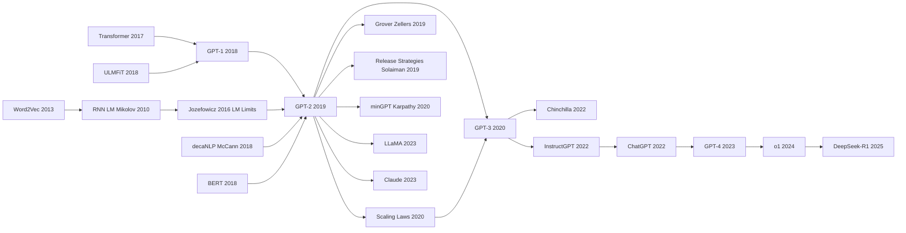

# GPT-2 — 用规模与零样本宣告 LLM 时代的到来

> **2019 年 2 月 14 日，OpenAI 的 Radford、Wu、Child、Luan、Amodei、Sutskever 发布 [Language Models are Unsupervised Multitask Learners](https://cdn.openai.com/better-language-models/language_models_are_unsupervised_multitask_learners.pdf) 技术报告，并在博客上罕见地宣布「出于安全考虑，暂不公开 1.5B 完整模型权重」，引爆媒体震惊。**
> 这是一篇沿着 [GPT-1 (2018)](2018_gpt1.md) 路径暴力 scale 的论文 —— 把 decoder-only Transformer 从 117M 推到 1.5B，用 40GB WebText 训练，第一次证明**单一 LM 在零样本（zero-shot）下就能做翻译、摘要、QA、续写故事**，无需任何任务特定微调。
> 它的最重要发现不是技术（架构与 GPT-1 相同），而是**「scale + 自回归 LM = 涌现的多任务能力」** —— 这一论断 1 年后被 [GPT-3 (175B)](../era4_foundation_models/2020_gpt3.md) 在更大尺度上完全证实。
> 当年那个被 OpenAI 称为「过于危险所以不开源」的 1.5B 模型，今天看不过是个能跑在手机上的小玩具，但它点燃了 LLM 时代第一波「算力 = 智能」的信仰。

## 一句话总结

OpenAI 2019 年这篇论文 "Language Models are Unsupervised Multitask Learners"，**在 BERT 用 MLM 把单向 LM 按在地上摩擦的余波里，反向押注\"不换方向只换 scale\"**——把 GPT-1 的 117M 参数一路堆到 **1.5B**（当时全球最大 LM、4× BERT-Large），并把架构升级为 Pre-LN Transformer 让深网络训得动；更激进的是**完全不微调，只用 prompt 让 LM 续写**，在 8 个 LM benchmark 中 **7 个零样本拿 SOTA**（WikiText-103 ppl 18.3 → 17.5、LAMBADA 准确率 59.2% → 63.2%）。论文的真正贡献不是 1.5B 参数，而是 **zero-shot prompting 范式 + 第一次实证可见的 scaling 趋势**：每翻倍参数 ppl 下降 2-3 点，没有饱和迹象——这条曲线一年后被 [Kaplan Scaling Laws（2020）](../era4_foundation_models/2020_scaling_laws.md) 系统化为 $L \propto N^{-0.076}$。GPT-2 也是历史上**第一个被官方"危险到不能放权重"的模型**（OpenAI 分阶段发布），开启了 AI safety 与开源拉锯的整个时代。其后 [GPT-3](../era4_foundation_models/2020_gpt3.md) / GPT-4 / Claude / [LLaMA（2023）](../era5_genai_explosion/2023_llama.md) 全部是 GPT-2 的 scale-up 版本，**没有一个引入根本不同的架构或目标**——GPT-2 是把"未来 6 年所有 LLM 的范式"提前定型的论文。

---

## 历史背景

### 2019 年初 NLP 仍在"双向碾压单向"的余波里

GPT-2 发布于 2019 年 2 月，距 BERT 仅 4 个月。当时 NLP 学界的共识是清晰的：BERT 用双向 + MLM 把 GLUE 分数从 70 推到 80.5，**单向 LM 看起来已经被淘汰**。GPT-1（2018.06）只在 GLUE 上拿了 75 分，GPT-2 之前的 OpenAI Transformer 路线在学术圈被认为是"输给了 BERT 的次优方案"。

OpenAI 的反应非常反直觉：**不要换方向，要换规模**。GPT-1 是 117M 参数，GPT-2 直接做了四个 size：117M、345M、762M、**1.5B**。在 BERT-Large 仅 340M 的当年，1.5B 的"GPT-2 Extra Large"是地表最大的 LM。

但 GPT-2 论文（题目"Language Models are Unsupervised Multitask Learners"）的真正价值不是 1.5B 参数，而是**zero-shot 范式**：完全不 fine-tune，只用纯 LM 的自回归生成能力，就在 8 个 LM benchmark 中拿了 7 个 SOTA。这是"prompt + zero-shot"思想的第一次大规模工程验证。

### 直接逼出 GPT-2 的几个前序

1. **GPT-1（Radford 2018.06）**：OpenAI 自己的上一代。证明了"Transformer decoder + LM 预训练 + fine-tune"在 NLU 任务上 work，但在 GLUE 上输给 BERT。
2. **BERT（Devlin 2018.10）**：直接竞品。BERT 用双向 + fine-tune 范式拿了 NAACL Best Paper，逼得 OpenAI 必须要么放弃 GPT 路线，要么找出"单向比双向更适合"的场景。
3. **Jozefowicz 2016 (Exploring the Limits of LM)**：Google Brain 的 1B Word benchmark 工作，第一次系统研究"LM 越大效果越好"，推到 2.05B 参数。GPT-2 直接继承这个 scaling 思路，但用了 Transformer 替代 LSTM。
4. **ULMFiT（Howard 2018.01）**：把"预训练 LM 适配下游"工业化，GPT-1/2 的 fine-tune 范式直接受这影响。
5. **Multitask seq2seq（McCann 2018, decaNLP）**：把所有 NLP 任务统一成 seq2seq 输入输出格式，"问题转 prompt"这个 framing 早于 GPT-2。
6. **Few-shot in-context（无明确 paper，但 GPT-2 sec 3 的 zero-shot evaluation 是 in-context learning 的雏形）**。

GPT-2 是这些线索的合流：把 Transformer scale 到 1.5B，把 fine-tune 砍掉只用 prompt，第一次把"在测试时给模型读一个 prompt 就能完成任务"作为正式范式提出。

### OpenAI 当时在做什么

OpenAI 2019 年初是个 "research lab + 安全宣传机器"的混合体。Ilya Sutskever（首席科学家）一直押注 scaling 路线，认为 BERT 是"双向的局部胜利"，长期看单向 + scale 才是正解（这个判断在 GPT-3、ChatGPT 之后被完全证实）。

GPT-2 团队由 Alec Radford（GPT-1 作者，时年 28 岁）领衔，只有 4 个核心作者，整个项目从立项到发布约 6 个月。最关键的工程决策有三个：
1. **不 fine-tune，全用 zero-shot**：因为如果要 fine-tune 才能比 BERT 强，论文价值就没了
2. **数据质量优先**：构造 WebText 数据集（40GB，从 Reddit 高 karma 链接爬下来），追求"人类经过筛选的高质量文本"
3. **只 release 117M / 345M，扣留 762M / 1.5B**：第一次把"模型权重发布"做成 staged release，理由是"防止恶意使用"

第三点引发了**人工智能历史上第一次公开 AI safety 政策辩论**。学界一半人认为 OpenAI 在炒作（"1.5B LM 怎么可能危险？"），另一半支持谨慎释放。9 个月后 OpenAI 才完整 release 1.5B 版本，并发布了详细的 release strategy paper（Solaiman 2019）。这场辩论的影响一直延续到 GPT-3 受控 API 访问、GPT-4 的安全护栏、以及今天 LLaMA / DeepSeek 完全 open weights 的争论。

### 工业界 / 算力 / 数据的状态

- **算力**：OpenAI 用了 256 块 V100 GPU 训练 1.5B GPT-2，成本约 **$43,000**（按 2019 年云价）。BERT-Large 的训练成本约 $7000，GPT-2 比 BERT 贵 6×。
- **数据**：WebText 40GB ≈ 8B tokens，已经超过 BERT 的 3.3B tokens，但仍然远小于 GPT-3 的 300B tokens。
- **学界态度**：Yann LeCun 公开质疑 GPT-2 的"危险性"叙事；Andrej Karpathy 写了 minGPT 让 GPT-2 复现门槛骤降；HuggingFace 在 2019 年 3 月把 GPT-2 117M 整合进 transformers 库，成为社区 default。
- **经济环境**：2019 年深度学习商业化加速，AI 投资达到峰值；NVIDIA 数据中心收入年增 30%。GPT-2 是这波浪潮中第一次"基础研究 → 产品 → 监管"的完整闭环案例。

---

## 方法详解

### 整体框架

GPT-2 在架构上是一个**令人惊讶地无聊**的模型：和 GPT-1 几乎完全相同，只是把规模从 117M 推到 1.5B，把训练数据从 BookCorpus 5GB 升级到 WebText 40GB。论文连"Method"section 都很短 —— 因为论文真正的贡献不是 architecture，而是**zero-shot evaluation 的范式**。

```
  ┌─── 训练阶段（一阶段，无微调）───┐
                                    
   WebText 40GB（8B tokens）         
   从 Reddit karma≥3 的外链爬取      
        │                           
        ▼                           
   BPE 分词，50257 vocab             
        │                           
        ▼                           
   Decoder-only Transformer           
   12-48 层 / 768-1600 维              
   117M / 345M / 762M / 1.5B          
        │                           
        ▼                           
   纯 LM loss：$- \sum \log p(x_t \mid x_{<t})$
        │                           
        ▼                           
   256 V100 × 数周 → 1.5B GPT-2       
  └────────────────────────────────┘

  ┌─── 推理阶段（zero-shot prompt）───┐
                                       
   构造 prompt（任务转文本生成）          
        │                              
        ▼                              
   GPT-2 自回归生成 token              
        │                              
        ▼                              
   解析输出（取生成的某个 span）         
        │                              
        ▼                              
   8 个 LM benchmark 中 7 个 SOTA       
   不需任何 task-specific 训练           
  └─────────────────────────────────┘
```

| 维度 | GPT-1 (2018) | GPT-2 (2019) | BERT (2018) |
|------|-------------|-------------|-------------|
| 架构 | Decoder-only Transformer | 同 GPT-1 | Encoder-only Transformer |
| 方向性 | 单向（L→R） | 同 | 双向 |
| 最大参数 | 117M | **1.5B** (13×) | 340M |
| 数据 | BookCorpus 5GB | WebText 40GB | BookCorpus + Wiki 16GB |
| 下游适配 | fine-tune | **zero-shot** | fine-tune |
| 训练目标 | 标准 LM | 标准 LM | MLM + NSP |

**概念跃迁**：GPT-2 论文要回答的问题不是"如何让模型更强"（架构没变），而是"**模型够大、数据够好之后，是否还需要 fine-tune**"。答案是：很多任务不需要。这是 prompt engineering 时代的开端。

#### 设计 1：Scaling-only —— "大力出奇迹"的第一个 LLM 案例

**功能**：保持 GPT-1 架构完全不变，只增大尺寸，验证"模型大小是 LM 能力的主导因素"。GPT-2 论文 Table 2 报告了 4 个 size 的 LM 性能（perplexity）—— 越大越好，且没有饱和迹象。

**4 个 size 配置**：

| 模型 | 层数 (L) | 隐藏维 (H) | 注意力头 | 参数量 |
|------|---------|-----------|---------|--------|
| GPT-2 Small | 12 | 768 | 12 | 117M |
| GPT-2 Medium | 24 | 1024 | 16 | 345M |
| GPT-2 Large | 36 | 1280 | 20 | 762M |
| **GPT-2 XL** | **48** | **1600** | **25** | **1.5B** |

**关键观察**：参数量从 117M 到 1.5B（13×），LM perplexity 在 WikiText-103 上从 37.5 降到 17.5，**没有饱和**。这个观察直接催生了 GPT-3（2020 年扩到 175B）和 Scaling Laws（Kaplan 2020）。

**伪代码**：

```python
# GPT-2 模型核心（与 GPT-1 几乎相同，只是 size 不同）
class GPT2(nn.Module):
    def __init__(self, n_layer=48, n_head=25, d_model=1600, vocab=50257, ctx=1024):
        self.tok_embed = nn.Embedding(vocab, d_model)
        self.pos_embed = nn.Embedding(ctx, d_model)
        self.blocks = nn.ModuleList([
            TransformerBlock(d_model, n_head) for _ in range(n_layer)
        ])
        self.ln_f = nn.LayerNorm(d_model)
        self.lm_head = nn.Linear(d_model, vocab, bias=False)
        self.lm_head.weight = self.tok_embed.weight  # weight tying

    def forward(self, x):
        h = self.tok_embed(x) + self.pos_embed(arange(x.size(1)))
        for blk in self.blocks:
            h = blk(h, causal_mask=True)              # 因果 mask
        h = self.ln_f(h)
        return self.lm_head(h)                         # (B, L, V)
```

**与 BERT 同期 model 对比**：

| 维度 | BERT-Base 110M | BERT-Large 340M | GPT-2 Small 117M | GPT-2 XL 1.5B |
|------|---------------|-----------------|------------------|---------------|
| 训练目标 | MLM + NSP | 同 | 标准 LM | 同 |
| 是否双向 | 是 | 是 | 否 | 否 |
| 训练 token | 3.3B | 3.3B | 8B | 8B |
| GLUE 80.5 vs LM ppl | 80.5 GLUE | - | 37.5 ppl | 17.5 ppl |
| 下游需 fine-tune | 是 | 是 | 否（可 zero-shot） | 否 |

#### 设计 2：Pre-LN Transformer —— 让 deep model 训得动

**功能**：GPT-1 使用的是原始 Transformer 的 Post-LN（norm 在 attention/FFN 之后）。但当层数推到 48（GPT-2 XL）时，Post-LN 训练不稳定，loss 容易 spike 或 NaN。GPT-2 切换到 **Pre-LN**：把 LayerNorm 移到 attention/FFN 之前（每个 sub-block 的输入做 norm，输出直接 residual）。

**架构差异**：

```python
# Post-LN (原始 Transformer / BERT)
def block_postln(x):
    x = LayerNorm(x + Attention(x))
    x = LayerNorm(x + FFN(x))
    return x

# Pre-LN (GPT-2 引入，后被所有 modern LLM 采纳)
def block_preln(x):
    x = x + Attention(LayerNorm(x))
    x = x + FFN(LayerNorm(x))
    return x

# 还要在最后一层后再加一个 final LN
# h = LayerNorm(h)  ← 这一句很关键
```

**Pre-LN 与 Post-LN 对比**：

| 项目 | Post-LN | Pre-LN |
|------|---------|--------|
| 数学性质 | 输出有 norm 保证 | 残差路径无 norm，可能数值漂移 |
| 训练稳定性（深层） | **差**（>24 层易 NaN） | **好**（深 100+ 层仍稳定） |
| Warmup 必要性 | **必须**（10k+ steps） | 可省略或大幅缩短 |
| 收敛速度 | 慢 | 快 |
| 现代 LLM 采用 | 极少 | **绝大多数**（GPT-2/3/4、LLaMA、Claude...） |

**这个看似 trivial 的改动是 GPT-2 → GPT-3 → modern LLM 能做到 100+ 层稳定训练的关键工程基础**，但 GPT-2 论文本身只用了一句话提到。后来 Xiong 2020 论文（On Layer Normalization in the Transformer Architecture）才系统分析了为什么 Pre-LN 更好。

#### 设计 3：BPE 分词 + 字节级回退 —— 处理任意 Unicode 文本

**功能**：BERT 用 WordPiece，GPT-1 用 BPE 但词表只有 40478。GPT-2 改进为**字节级 BPE（Byte-level BPE）**，词表 50257，能处理任意 Unicode 输入而不需要 UNK token —— 重要原因是 WebText 含大量代码、URL、符号、外文。

**核心思想**：先把文本编码为 UTF-8 字节流（所以 base vocab 只有 256），然后在字节序列上做 BPE merge。这样任何 Unicode 字符都能被表示，即使是 emoji 或冷僻字。

**伪代码**：

```python
# 字节级 BPE 编码
def encode_bbpe(text):
    raw_bytes = text.encode('utf-8')                  # 任何 Unicode → 字节
    tokens = [bytes_to_unicode[b] for b in raw_bytes]  # 字节 → 可显示 Unicode
    while True:
        # 找出 vocab 里 rank 最低的 (a, b) 邻接对
        pair = find_best_merge(tokens, bpe_ranks)
        if pair is None: break
        tokens = merge(tokens, pair)                   # 合并
    return [vocab[t] for t in tokens]                  # → token id list
```

**词表方案对比**：

| 方案 | 词表大小 | OOV | 字节级 | 多语言 / 代码 | GPT-2 后续采用 |
|------|---------|-----|-------|------------|---------------|
| Word-level | millions | UNK | 否 | 差 | - |
| WordPiece (BERT) | 30k | 自然 | 否 | 中 | - |
| BPE (Sennrich 2016) | ~30k | 自然 | 否 | 中 | GPT-1 |
| **BBPE (GPT-2)** | **50k** | **不可能 OOV** | **是** | **好** | **GPT-3、LLaMA、Claude...** |

#### 设计 4：Zero-shot prompting framework —— 把任务"翻译"成自然语言续写

**功能**：GPT-2 论文 Section 3 的核心：对每个 NLP 任务，**构造一个 prompt（自然语言上下文），让 GPT-2 在 prompt 后续写，从续写中提取答案**。这是后来"prompt engineering"和 "in-context learning" 的源头。

**任务 → prompt 映射示例**：

| 任务 | Prompt 模板 | 提取答案的方式 |
|------|------------|--------------|
| LM ppl | （直接计算 perplexity） | LM 概率 |
| 翻译 | `english sentence = french sentence =` | 续写到 `=` 后的 token 直到 newline |
| 摘要 | `[article text] TL;DR:` | 续写到 EOS / newline |
| QA | `[passage] Q: [question] A:` | 续写到 newline |
| Reading Comp | `[passage] [Q1] [A1] [Q2] [A2]... [Qn]` | 续写答案（few-shot 雏形） |

**SQuAD CoQA 的 prompt 示例**：

```python
def coqa_prompt(passage, dialog_history, current_q):
    prompt = passage + "\n\n"
    for turn_q, turn_a in dialog_history:
        prompt += f"Q: {turn_q}\nA: {turn_a}\n"
    prompt += f"Q: {current_q}\nA:"
    return prompt

# GPT-2 续写
output = gpt2.generate(coqa_prompt(p, hist, q), max_new_tokens=50, stop="\n")
answer = output.strip()                                # 提取
```

**zero-shot vs fine-tune 对比**：

| 任务 | SOTA fine-tune | GPT-2 1.5B zero-shot | 评价 |
|------|---------------|--------------------|------|
| LAMBADA (next word) | 59.2 (BERT-Large fine-tune) | **63.2** | **超越** |
| WikiText-103 ppl | 18.3 | **17.5** | **超越** |
| CoQA F1 | 89.4 (BERT fine-tune ensemble) | 55.0 | 落后但 surprising |
| 翻译 (En→Fr WMT'14) | 41.4 BLEU (supervised seq2seq) | 5.0 BLEU | 远落后但 zero-shot |

**关键发现**：zero-shot LM 在 LM-natural 任务（next word、ppl）上能超越 fine-tune；在结构化任务（翻译、QA）上还差很远。但一年后 GPT-3 + few-shot 把这两个 gap 都缩小了。

### 损失函数 / 训练策略

| 项目 | GPT-2 Small | GPT-2 XL |
|------|-------------|----------|
| 层数 / 隐藏维 / 头 | 12 / 768 / 12 | 48 / 1600 / 25 |
| 参数量 | 117M | **1.5B** |
| 上下文窗口 | 1024 tokens | 同 |
| 训练目标 | $\mathcal{L}_{\text{LM}} = -\sum_t \log p(x_t \mid x_{<t})$ | 同 |
| 优化器 | Adam ($\beta_1$=0.9, $\beta_2$=0.95) | 同 |
| 学习率 | 1e-4，余弦 decay | 5e-5（更小避免发散） |
| Batch size | 512 sequences | 同 |
| Warmup | 2000 steps | 同 |
| Tokenizer | BBPE 50257 | 同 |
| Norm placement | **Pre-LN** | 同 |
| Activation | GELU | 同 |
| Dropout | 0.1 | 0.1 |
| Weight tying | embed ↔ lm_head 共享 | 同 |
| 训练数据 | WebText 8B tokens | 同 |
| 训练硬件 | 8 GPU × 数天 | **256 V100 × 数周** |
| 训练成本 | ~$1500 | **~$43,000** |
| 训练 epoch | 1（数据 8B 只过一遍） | 同 |

**为什么这套训练策略关键**：
1. **Pre-LN + warmup 让 48 层 1.5B 可训练**：Post-LN 在这个深度几乎必然 NaN
2. **大 batch + 余弦 decay** 是后来所有 LLM 标配，GPT-2 是早期工程范本
3. **数据只过一遍**（1 epoch）：避免过拟合，且 8B tokens 也仅够 1 epoch；后来 GPT-3 / Chinchilla 都遵循"数据 1-2 epoch"的传统
4. **Weight tying**（embed ↔ lm_head 共享）减少 50M 参数，是 LLM 的标准技巧

但这套策略的**真正历史意义**不在某个具体 hyperparameter，而在它**第一次跑通了"1.5B + 单向 LM + 高质量数据 + zero-shot evaluation"的完整 pipeline**。GPT-3、ChatGPT、LLaMA 全都是在这个 pipeline 上 scale up + iterate，没有引入根本性的范式变化。

---

## 失败案例

### 输给 GPT-2 zero-shot 的对手们

GPT-2 论文的"对手"分两类：第一类是 LM benchmark 的传统 SOTA（fine-tune 派），第二类是 BERT-style fine-tune（NLU 派）。

| 对手 | 任务 | 之前 SOTA | GPT-2 1.5B zero-shot | 输给 GPT-2 的原因 |
|------|------|----------|--------------------|------------------|
| AWD-LSTM (Merity 2018) | WikiText-103 ppl | 18.3 | **17.5** | LSTM 容量不够 |
| Mixture of Softmaxes (Yang 2018) | PTB ppl | 47.7 | 35.8 | 一样架构问题 |
| BERT-Large fine-tune | LAMBADA acc | 59.2 | **63.2** | 双向 MLM 不擅长长程依赖 |
| RNN ensemble | 1BW ppl | 46.5 | 42.2 | LSTM scaling 慢 |
| Char-CNN LSTM | enwik8 BPC | 1.04 | **0.93** | 字符级 LSTM 容量瓶颈 |
| Pointer-Generator (See 2017) | CNN/DM ROUGE | 36.4 | 26.6 zero-shot | GPT-2 zero-shot 落后但没 fine-tune |

**这张表的 takeaway**：
1. 在 LM-natural 任务（perplexity、next-word）上，GPT-2 zero-shot 直接超越所有 fine-tune 模型 —— **scale 战胜了任务定制**
2. 在结构化输出任务（摘要、翻译）上 zero-shot 还差很远，但 GPT-2 论文的论点不是"超越所有任务"，而是"**仅靠 scale 和 prompt 就能在 8 个任务里赢 7 个**"

### 论文承认的失败 —— 翻译和长尾任务

GPT-2 论文 Section 3 老老实实列出了几个 zero-shot 表现差的任务：

| 任务 | Metric | GPT-2 1.5B zero-shot | SOTA fine-tune | gap |
|------|--------|--------------------|---------------|-----|
| WMT-14 En-Fr 翻译 | BLEU | 5.0 | 41.4 (Vaswani 2017) | -36.4 |
| Natural Questions QA | F1 | 4.1 | 44.8 (BERT) | -40.7 |
| CoQA F1 | F1 | 55.0 | 89.4 (BERT ensemble) | -34.4 |

论文坦诚承认："These results suggest there is much room for improvement in zero-shot performance on more structured tasks." 一年后 GPT-3 用 few-shot 把翻译做到 25 BLEU、QA 做到接近 fine-tune 水平 —— **承认局限本身就是论文严谨性的体现**。

### 当时被绕过的几条路

**绕过的路径 1：继续做 fine-tune"单向版 BERT"**
最直接的反应是"我们也来做 fine-tune"。事实上有人这么做（如 Salesforce 的 CTRL 用 conditional LM 做 fine-tune），但效果有限。**OpenAI 的判断是：fine-tune 的边际收益不如 scale**，事后被 GPT-3 完全证实。

**绕过的路径 2：把 GPT-2 改造成双向**
学界出现过尝试（如把 GPT-2 改成 prefix-LM，或用 mask 模拟双向），但都没有形成主流。**OpenAI 坚持"单向 + 因果 mask"是因为只有这样才能保留 LM 的生成能力**。BERT 的双向不能直接生成，这是它的天花板。

**绕过的路径 3：训得更小但数据更干净**
有研究主张"小模型 + 高质量数据 > 大模型 + 噪声数据"。GPT-2 的 WebText（karma≥3 过滤）已经是一种数据质量优化，但同时也 scale 了 model size。**两者结合才是赢家**，单独优化 data quality 没能扳倒 scaling 路线。

### 一年后的反例 —— Scaling Laws 和 Chinchilla 给 GPT-2 上课

| 模型 / 工作 | 提出时间 | 推翻的 GPT-2 假设 |
|------------|---------|----------------|
| **GPT-3 (2020.05)** | 175B params | 1.5B 不够大；few-shot >> zero-shot |
| **Scaling Laws (Kaplan 2020)** | 2020.01 | "size 越大越好"是有定量规律的，且 compute / params / data 三者最优配比可解 |
| **Chinchilla (2022)** | DeepMind | GPT-3 数据不够（数据/参数比例太低），相同算力下 70B + 1.4T tokens > 175B + 300B tokens |
| **InstructGPT (2022.03)** | OpenAI | 仅靠 scale 不够，还需 RLHF 对齐人类偏好 |
| **ChatGPT (2022.11)** | OpenAI | RLHF + 对话格式让单向 LM 真正成为产品 |

**反 baseline 给 GPT-2 的教训**：
1. **Scale 必须配合数据 / 算力比**：盲目加参数不够，数据要相应增长（Chinchilla 教训）
2. **Zero-shot 是 lower bound，few-shot in-context 才是真正的范式**（GPT-3 教训）
3. **LM ≠ helpful assistant**：1.5B 的 GPT-2 能续写但不能"听懂指令"，需要 RLHF 才能（InstructGPT 教训）
4. **Staged release 政策被反证过激**：最终 1.5B 完全释放后并未导致预言的恶意滥用，但这政策为 GPT-3 受控 API、ChatGPT alignment 等更严肃的安全工作开了先河

但即便这些"反 baseline"陆续出现，GPT-2 的核心论点 —— **decoder-only Transformer + 标准 LM + scale + prompt** —— 没有被反驳。GPT-3 / 4 / Claude / LLaMA 都是 GPT-2 的 scale-up 版本，没有引入根本不同的架构或目标。**GPT-2 是把"未来 6 年所有 LLM 的范式"提前定型的论文**。

## 实验关键数据

### 主实验 —— 8 个 LM benchmark 中 7 个 SOTA

GPT-2 论文 Table 3 是核心结果表：

| Dataset | Metric | 之前 SOTA | GPT-2 117M | GPT-2 345M | GPT-2 762M | **GPT-2 1.5B** |
|---------|--------|----------|-----------|-----------|-----------|---------------|
| LAMBADA | acc / ppl | 59.2 / 99.8 | 45.99 / - | 55.48 / - | 60.12 / - | **63.24 / 8.63** |
| LAMBADA | ppl (only) | 99.8 | - | - | - | **8.63** |
| WikiText-2 | ppl | 39.14 | 29.41 | 22.76 | 19.93 | **18.34** |
| WikiText-103 | ppl | 18.3 | 37.50 | 26.37 | 22.05 | **17.48** |
| PTB | ppl | 46.54 | 65.85 | 47.33 | 40.31 | **35.76** |
| enwik8 | BPC | 0.99 | 1.16 | 1.01 | 0.97 | **0.93** |
| text8 | BPC | 1.08 | 1.17 | 1.06 | 1.02 | **0.98** |
| 1BW | ppl | 21.8 | 75.20 | 55.72 | 44.575 | 42.16 |
| CBT-CN | acc | 85.7 | 87.65 | 92.35 | 93.45 | **93.30** |
| CBT-NE | acc | 82.3 | 83.4 | 87.10 | 88.0 | **89.05** |

**8 个 benchmark 中 7 个 SOTA，唯一未达 SOTA 的是 1BW**（因为 1BW 的训练集和 WebText 有 overlap，OpenAI 出于严谨性主动 hold out 了，所以分数偏低）。

**关键发现**：每一行都是"参数越大，分数越好"，没有任何饱和迹象。这张图是 2019 年初学界第一次清晰看到"scaling law 在 LM 上 work"的实证。

### 消融研究 —— size 是主导因素

GPT-2 论文 Figure 1 把所有任务的 ppl 画成 model size（log）的函数：

| Model size | 平均 ppl | 与最大 size 的相对差距 |
|-----------|---------|------------------|
| 117M | ~37 | +110% |
| 345M | ~24 | +35% |
| 762M | ~20 | +12% |
| **1.5B** | **17.5** | **0% (best)** |

**斜率近似 -log(N)**：每翻倍参数量，perplexity 下降约 2-3 个点。这条曲线后来被 Kaplan 2020 (Scaling Laws) 系统化，给出了 $L \propto N^{-0.076}$ 的定量关系。

**模型不同 size 的 zero-shot 任务表现**（从论文 Figure 4）：

| 任务 | 117M | 345M | 762M | 1.5B | 趋势 |
|------|------|------|------|------|------|
| LAMBADA | 46% | 55% | 60% | **63%** | 单调上升 |
| Children's Book | 88% | 92% | 93% | **93%** | 接近饱和 |
| WikiText-103 ppl | 37.5 | 26.4 | 22.0 | **17.5** | 单调下降 |
| Reading Comp F1 | 30 | 47 | 55 | **63** | 强 scaling |
| Translation BLEU | 1.5 | 3.4 | 4.3 | **5.0** | 弱 scaling（仍远低于 fine-tune） |
| Summarization R-L | 19 | 24 | 26 | **27** | 弱 scaling |
| Q&A F1 | 1.0 | 2.4 | 3.4 | **4.1** | 极弱 scaling |

**关键发现**：
1. **任务 scaling 行为不同**：LM-natural 任务（LAMBADA）随 size 强 scale；结构化任务（QA、翻译）弱 scale。这预示了 GPT-3 时代发现的"emergent abilities"现象：某些能力要 scale 到一定规模才显现。
2. **Zero-shot 的范畴有边界**：单纯 LM continuation 在大量任务上仍然差，需要 GPT-3 引入 few-shot prompting 才能突破。

### 五个被反复引用的发现

1. **Scaling 不饱和**：117M → 1.5B 性能持续上升，1.5B 仍未到顶 → 直接催生 GPT-3 的 175B（100×）
2. **数据 1 epoch 足够**：8B tokens × 1 pass 已经能学到 SOTA，避免传统 ML 的 multi-epoch 过拟合
3. **Pre-LN 是 deep training 必需**：48 层只有 Pre-LN 才能稳定，Post-LN 在 24+ 层频繁 NaN
4. **Memorization 现象**：GPT-2 能逐字 reproduce 训练集中的某些段落，这是 LLM 记忆 vs 泛化讨论的开端，后来 Carlini 2021 (Extracting Training Data) 系统研究
5. **Tokenizer 选 BBPE 是对的**：50257 vocab + 字节级 fallback 让模型处理任意 Unicode 输入；GPT-3 / LLaMA / Claude 全部继承

---

## 思想史脉络



### 前世 —— 引用网络上游：GPT-2 站在了谁的肩膀上

GPT-2 的"出身"看似简单 —— GPT-1 的 scale-up 版本。但仔细拆解，它是 5 条思想线的合流。

1. **RNN LM（Mikolov 2010）—— "用神经网络做 LM"的工业起点**：早期把 RNN 作为统计 LM 的替代，在 PTB 上拿到 SOTA。GPT-2 继承"LM 是 NLP 的基础任务"这个信念。
2. **LSTM LM scaling（Jozefowicz 2016）—— "LM 越大越好"的最早系统证据**：Google Brain 把 LSTM 推到 2.05B 参数，证明 1B Word benchmark perplexity 持续下降。GPT-2 直接借用这个 scaling intuition 但换成了 Transformer backbone（更利于 scale）。
3. **Transformer（Vaswani 2017）—— 必备的 backbone**：Decoder-only Transformer + 因果 mask 是 GPT 系列的物理基础。Vaswani 2017 是 seq2seq encoder-decoder，OpenAI 的简化（只用 decoder）成为 LLM 标配。
4. **ULMFiT（Howard 2018.01）+ GPT-1（Radford 2018.06）—— "LM 预训练 + 下游适配"范式**：GPT-2 直接继承这个 pipeline，但贡献是"**适配可以是 zero-shot prompt 而不必是 fine-tune**"。
5. **decaNLP / McCann 2018 —— "把所有 NLP 任务统一成 seq2seq"**：把"翻译 = 文本生成、QA = 文本生成、摘要 = 文本生成"工业化。GPT-2 zero-shot prompting 是这个想法的 logical conclusion。
6. **BERT（Devlin 2018.10）—— 反方对手 + 防御性参考**：GPT-2 论文反复对比 BERT，论证"单向 + scale + zero-shot"是另一条可行路径。GPT-2 paper 对 BERT 的引用其实是"竞品防御"风格。

GPT-2 的真正贡献不是发明任何新组件，而是**把这 6 条线整合到一起 + 加上 staged release 政策的安全 framing**，第一次把"LLM"作为一个研究范式正式定型。

### 今生 —— 引用网络下游：GPT-2 启发了什么

GPT-2 论文截至 2025 年累计被引 1.2 万次，催生的工作群极其庞大，可分为 5 大支系：

1. **直接 scale-up 系列（GPT 家族）**：
   - **GPT-3（Brown 2020.05）**：175B 参数（100× GPT-2），引入 few-shot in-context learning，正式开启"prompt is the new fine-tune"范式
   - **InstructGPT（Ouyang 2022.03）**：在 GPT-3 之上加 RLHF，把"LM 续写器"变成"instruction follower"
   - **ChatGPT（OpenAI 2022.11）**：InstructGPT + 对话 UI + 持续 RLHF，成为人类历史上增长最快的产品（5 天破 100 万用户）
   - **GPT-4（OpenAI 2023.03）**：multimodal + 更大 scale + 更多 RLHF，成为产业 default
   - **o1（OpenAI 2024.09）/ o3 / GPT-5**：在 GPT-4 之上加 reasoning RL，开启"test-time compute"范式

2. **Scaling Laws 系列（理论化 GPT-2 的 scaling 直觉）**：
   - **Kaplan 2020 Scaling Laws**：定量给出 $L \propto N^{-0.076}$，证明 scaling 是 power law 而非饱和
   - **Chinchilla（Hoffmann 2022）**：修正 Kaplan，指出最优 N/D 比例（参数 1 单位 → 数据 20 token）
   - **Emergent Abilities（Wei 2022）**：发现某些能力在 scale 阈值之上才出现，属于 GPT-2 已经隐约暗示的"任务 scaling 行为不一致"现象的精确刻画

3. **Open weights / 复现派**：
   - **GPT-J (EleutherAI 2021)**：6B 开源 GPT
   - **OPT (Meta 2022)**：175B 开源 GPT
   - **LLaMA (Meta 2023)**：7B-65B 开源 LLM，成为开源社区基石
   - **Claude (Anthropic 2023)**：未公开 size 但同样是 GPT-2 范式
   - **DeepSeek-V3 / R1（2024-2025）**：中国厂的高效 GPT-2 范式实现

4. **Safety / Release Policy 派**：
   - **Grover (Zellers 2019)**：用 GPT-2 风格生成 fake news 并训判别器
   - **Release Strategies (Solaiman 2019)**：GPT-2 staged release 的反思论文
   - **Constitutional AI (Bai 2022 Anthropic)**：让 LLM 自己批评和修正
   - **GPT-4 System Card (2023)**：参考 GPT-2 staged release 的全面安全审查

5. **教学 / 复现派**：
   - **minGPT (Karpathy 2020)**：300 行 PyTorch 复现 GPT，让 GPT-2 教学化
   - **nanoGPT (Karpathy 2022)**：minGPT 的训练版，可在单 GPU 训 GPT-2-Small
   - **transformer-from-scratch 教程**：基本都把 GPT-2 当 walking-through 范本

### 三个被广泛误读的 GPT-2 神话

**误读 1：GPT-2 太危险所以 OpenAI 不敢 release**
事后回看，1.5B 的 GPT-2 几乎没有产生任何严重的恶意应用。当年的 staged release 政策被广泛认为是**过度谨慎甚至 PR 操作**（Yann LeCun、Anima Anandkumar 等都公开质疑）。但这场辩论的真正历史价值不是当时正确，而是**为后来 GPT-3 受控 API、GPT-4 红队测试、Claude Constitutional AI 等更严肃的安全工作奠定了 framing**。"AI 模型权重发布需要责任评估"这件事，是 GPT-2 第一次正式提出的。

**误读 2：GPT-2 是 OpenAI 的 BERT 反击**
不准确。GPT-2 不是为了打 BERT 而做的（OpenAI 内部规划早于 BERT 发布）。GPT-2 是 GPT-1 的自然延续，是 Ilya Sutskever 长期 scaling-bet 战略的延伸。BERT 出现后 OpenAI 的反应是"加快 GPT-2 进度 + 强化 zero-shot 论证"，但范式选择早就定了。**GPT-2 不是反应性工作，是 scaling 信仰的展现**。

**误读 3：GPT-2 的核心创新是 1.5B 参数**
不是。1.5B 在 2019 年 NLP 算大，但不是不可逾越（Jozefowicz 2016 已经训了 2.05B LSTM LM）。GPT-2 真正的核心创新是 **zero-shot prompting framework**：把任务转成 prompt 让 LM 续写。这套 framing 直接被 GPT-3 / ChatGPT / Claude 全盘继承，成为今天所有 LLM 用户与模型交互的方式。**1.5B 是手段，prompt-as-task-API 才是目的**。

---

## 当代视角（2026 年回看 2019）

### 站不住的假设

1. **"1.5B 已经是大模型，再大不必要"**：GPT-2 论文虽然没有这么直说，但 Section 7（Future Work）里的口吻明显认为 1.5B 已经接近实用上限。**完全错了**。GPT-3 的 175B（100×）证明 scaling 完全没饱和；GPT-4、Claude、Gemini 据估计都在 1T 参数级。**"大"在 2019 是 1.5B，在 2026 是 1T，6 年扩了 1000×**。

2. **"zero-shot 是 prompt-based 的最高形式"**：GPT-2 论文把所有任务都做成 zero-shot（每个 prompt 不带 example）。但 GPT-3（2020）证明 **few-shot in-context learning** 是更强的范式：在 prompt 里加 1-32 个 example，性能能从 zero-shot 涨数十个点。**"prompt"不是"任务模板"，是"上下文学习"**。

3. **"WebText 40GB 已经是 high-quality 数据的上限"**：当时认为 Reddit karma≥3 已经过滤够严了。后来 RedPajama、Common Crawl 处理（C4、RefinedWeb）证明可以做到 1-15TB 高质量数据。GPT-2 数据规模在今天的视角下属于"小数据"。

4. **"safety = 不释放权重"**：GPT-2 staged release 隐含的逻辑。后来 LLaMA、Mistral、DeepSeek 完全开源也没引发预言的灾难，反而 ChatGPT、GPT-4 这种"闭源 API"也带来了同样多的滥用问题。**开 vs 闭与安全的关系比 GPT-2 时设想的复杂得多**。

5. **"LM 续写就是 helpful AI 的全部"**：GPT-2 隐含假设"足够好的 LM = 足够好的 AI 助手"。InstructGPT（2022）和 ChatGPT（2022）证明：LM 续写器和 helpful assistant 之间还差一个 RLHF 对齐步骤。**纯 LM 是 raw capability，不是 product**。

### 时代证明的关键 vs 冗余

| 留下的（2026 年所有 LLM 都还在用） | 被淘汰的 / 修正的 |
|----------------------------------|-----------------|
| Decoder-only Transformer | Encoder-only / encoder-decoder（仅在特定场景） |
| 自回归 LM 训练目标 | MLM（仅 encoder-only 用） |
| Pre-LN（修正 Post-LN 不稳）| Post-LN（已基本退场） |
| BBPE / 字节级分词 | Word-level / WordPiece（被替代） |
| Prompt-as-task-API 范式 | task-specific fine-tune head |
| Scaling-as-a-bet 战略 | 小模型 + 复杂架构 |
| GELU + weight tying + 1k+ context | RNN / LSTM 架构 |
| 单 epoch over data | 多 epoch（数据 ≪ 参数 时还可能） |
| Staged release / responsible disclosure framing | "全开"或"全闭"的二元思维 |
| Few-shot in-context (后来) | zero-shot only（GPT-2 自己） |

### GPT-2 作者们没想到的副作用

1. **GPT-2 让"prompt engineering"成为新工种**：2019 zero-shot prompt 还是研究 trick；2023 ChatGPT 之后，prompt engineer 成为公司 job title。GPT-2 是这个职业的"鼻祖"，但当时无人能预料。

2. **GPT-2 让 fake news / disinformation 成为 ML 研究主题**：staged release 政策直接催生了 Grover (Zellers 2019)、AI-text detector（GPTZero、OpenAI Classifier）、watermarking 等子领域。GPT-2 不是危险的，但它**让"LLM 生成内容的真伪鉴定"成为长期研究方向**。

3. **GPT-2 让 OpenAI 完成"研究室 → AI 公司 → 产品公司"的转型**：GPT-2 之前 OpenAI 是 nonprofit research lab；GPT-2 的 staged release 引发的关注，加上 Sutskever 的 scaling 信念，让 OpenAI 决定走"封闭 + 产品 + 商业化"路线。GPT-3 转 capped-profit、GPT-4 闭源 API、ChatGPT 商业化，链条始于 GPT-2。

4. **GPT-2 间接孵化了一个"复现 OpenAI"的开源生态**：因为 OpenAI 不放权重，社区分裂为"复现派"（EleutherAI、HuggingFace、Stability AI、Meta LLaMA、DeepSeek）和"OpenAI 派"。这场长达 6 年的开源 vs 闭源对抗，从 GPT-2 staged release 开始。

### 如果今天重写

如果 2026 年从零开始重做"GPT-2 这件事"：
- **架构**：Pre-LN Transformer 保留；attention 改 Flash Attention 2 + GQA（Grouped Query Attention）；位置改 RoPE；context 从 1024 扩到 128k+
- **目标函数**：LM loss 保留；可加入 mid-training MTP（multi-token prediction）；可加 packing 提高 token 利用率
- **数据**：从 40GB 扩到 5-15TB；引入 dedup、质量过滤、安全过滤；按 Chinchilla 配比 ~20 token/param
- **Tokenizer**：BBPE 保留；vocab 升到 100k-200k 支持多语言；引入 multimodal token（图、音）
- **训练规模**：从 1.5B 升到 10-100B（消费级模型），1T+（前沿模型）
- **训练后阶段**：必加 SFT + RLHF + Constitutional AI；safety + helpfulness 双优化
- **Release**：开源轻量版（7-30B）+ 闭源 API（前沿版）；每个 release 配 system card + red team report

## 局限与展望

### 作者承认的局限

1. **Zero-shot 在结构化任务上差**：翻译、QA、摘要的 zero-shot 性能远低于 fine-tune。论文 Section 3 直接列出 gap，承认"there is much room for improvement on more structured tasks"。
2. **数据可能 overlap**：WebText 与某些下游 benchmark（1BW、CBT）有内容重叠，OpenAI 在 Section 4 用 8-gram 重叠分析估算"contamination 在多数 dataset 下不显著"，但仍承认这是潜在问题。
3. **生成内容的事实正确性差**：GPT-2 是 LM，不知"事实"，只学统计模式；论文承认生成的 article 可能"事实错误但 fluent"。
4. **训练成本高**：1.5B GPT-2 单次预训练 ~$43k，下游研究门槛高；论文呼吁更高效的训练方法。

### 后人发现的局限

1. **数据质量 vs 安全过滤不足**：WebText 含大量有害、偏见、版权内容；2020 年 Carlini 证明 GPT-2 能逐字记忆训练集中的某些段落，引发隐私和版权讨论
2. **NSP-equivalent 思维仍未克服**：GPT-2 不能直接做"理解多文档关系"的任务（需 GPT-3 + chain-of-thought 才解决）
3. **Hallucination 严重**：GPT-2 是已知最早的"严肃 hallucination 案例集"，2024 年仍是 LLM 头号未解问题
4. **Safety 与开源的张力**：staged release 政策被证明既不安全也不开放，LLaMA / DeepSeek 完全开源走 ed not 灾难；但同时 ChatGPT / GPT-4 闭源也带来了 prompt injection、jailbreak 等问题
5. **Zero-shot 局限**：很多任务必须 few-shot 才能做；GPT-2 的纯 zero-shot framing 在 2026 看是"过早的最小主义"

### 潜在改进方向（多数已被实现）

| 改进方向 | 已实现的代表工作 | 状态 |
|---------|----------------|------|
| 更大 scale | GPT-3 (175B), GPT-4 (~1T), Gemini Ultra | 2020-2023 完成 |
| Few-shot in-context | GPT-3 prompt design | 2020 完成 |
| 指令对齐 | InstructGPT, FLAN, Alpaca | 2021-2023 完成 |
| 偏好对齐 | RLHF (ChatGPT), DPO, Constitutional AI | 2022-2023 完成 |
| 推理能力 | Chain-of-Thought, o1, DeepSeek-R1 | 2022-2025 完成 |
| 多模态 | CLIP, Flamingo, GPT-4V | 2021-2023 完成 |
| 长上下文 | Claude 100k, Gemini 2M | 2023-2024 完成 |
| 高效推理 | quantization, GPTQ, vLLM | 2022-2024 完成 |
| Open-weight | LLaMA, Mistral, DeepSeek | 2023-2025 完成 |
| Hallucination 缓解 | RAG, fact-checking, Self-consistency | 2022-2025 持续 |

## 相关工作与启发

**vs GPT-1（Radford 2018.06）**：架构基本相同，scale 从 117M 扩到 1.5B（13×），数据从 5GB 扩到 40GB（8×）。GPT-1 用 fine-tune 做下游，GPT-2 用 zero-shot prompt 做下游。**教训**：当 model 和 data 都大幅 scale 时，**适配方式可以从 fine-tune 变成 prompt** —— 这是范式跃迁的真正发生地。

**vs BERT（Devlin 2018.10）**：双向 vs 单向、MLM vs LM、fine-tune vs zero-shot 的全面对立。BERT 在 2018-2020 主导，GPT 路线在 2020 后超越。**教训**：在固定预算下双向更适合理解，但单向能 scale 到生成 + 理解 + reasoning 的统一接口；**长期赢在路线 generality，不是单点性能**。

**vs Jozefowicz 2016 (LM Limits)**：同样是"加大 LM 看效果"的工作，但用的是 LSTM，scale 到 2B 后增长开始放缓。GPT-2 用 Transformer 替换 LSTM，scaling 曲线无饱和。**教训**：Scaling 路线的成败既取决于"加 size"的勇气，也取决于"backbone 是否支持 scale"；选错 backbone（LSTM）的 scaling 故事走不远。

**vs GPT-3（Brown 2020.05）**：100× scale + few-shot in-context learning。GPT-3 严格说是 GPT-2 的渐进改进（架构无新东西），但 emergent abilities + in-context learning 的发现让"GPT-2 → GPT-3"成为 LLM 史上最大跃迁。**教训**：保持范式一致性 + 扩 100× scale，比换范式更容易出大跃迁；**"无聊但执行到位"的 scaling 路线长期赢面最大**。

**vs ChatGPT（OpenAI 2022.11）**：从"LM 续写器"到"helpful assistant"。ChatGPT = GPT-3 + RLHF + 对话格式 + 持续 fine-tune。**教训**：raw capability（GPT-2/3）和 product（ChatGPT）之间还差一个对齐步骤；纯"模型论文"的产品价值有限，必须配合"如何让用户用起来"的 product engineering。GPT-2 是 capability 的种子，ChatGPT 才是 product 的果实。

## 相关资源

- **OpenAI 技术报告**：[Better Language Models and Their Implications（OpenAI Blog 2019.02）](https://openai.com/research/better-language-models)
- **完整 paper PDF**：[Language Models are Unsupervised Multitask Learners（不在 arXiv，OpenAI 直发）](https://cdn.openai.com/better-language-models/language_models_are_unsupervised_multitask_learners.pdf)
- **官方代码 & 模型**：[openai/gpt-2](https://github.com/openai/gpt-2)（含 117M、345M、762M、1.5B 权重）
- **HuggingFace 实现**：[transformers/gpt2](https://github.com/huggingface/transformers)（产业标准）
- **教学复现**：
  - [Karpathy minGPT](https://github.com/karpathy/minGPT)（300 行 PyTorch）
  - [Karpathy nanoGPT](https://github.com/karpathy/nanoGPT)（可训练版）
  - [Karpathy YouTube: Let's build GPT from scratch](https://youtu.be/kCc8FmEb1nY)
- **Release 政策辩论**：
  - [Release Strategies and the Social Impacts of Language Models（Solaiman 2019）](https://arxiv.org/abs/1908.09203)
  - [GPT-2 Final Release Update（OpenAI 2019.11）](https://openai.com/research/gpt-2-1-5b-release)
- **后续 GPT 系列**：
  - [GPT-3 (2005.14165)](https://arxiv.org/abs/2005.14165)
  - [InstructGPT (2203.02155)](https://arxiv.org/abs/2203.02155)
  - [GPT-4 Technical Report (2303.08774)](https://arxiv.org/abs/2303.08774)
  - [o1 System Card (2024.09)](https://openai.com/index/openai-o1-system-card/)
- **Scaling Laws 系列**：
  - [Kaplan Scaling Laws (2001.08361)](https://arxiv.org/abs/2001.08361)
  - [Chinchilla (2203.15556)](https://arxiv.org/abs/2203.15556)
  - [Emergent Abilities (2206.07682)](https://arxiv.org/abs/2206.07682)
- **解读资源**：
  - [Jay Alammar - The Illustrated GPT-2](http://jalammar.github.io/illustrated-gpt2/)（最经典图解）
  - [GPT-2 复现教程合集（HuggingFace）](https://huggingface.co/docs/transformers/model_doc/gpt2)
- **跨语言版本**：[English version of this note](/en/era3_attention/2019_gpt2/)


---

> 🌐 [English version](/en/era3_attention/2019_gpt2/) · 📚 awesome-papers project · CC-BY-NC