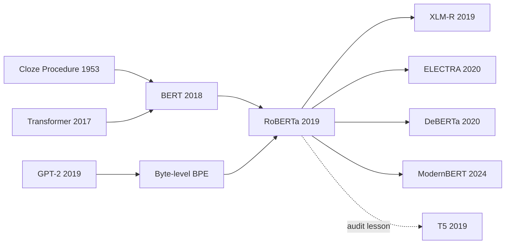

# RoBERTa — 把 BERT 重新训对的工程清醒剂

> **2019 年 7 月 26 日，Facebook AI 与华盛顿大学的 Yinhan Liu、Myle Ott、Naman Goyal、Jingfei Du、Mandar Joshi、Danqi Chen、Omer Levy、Mike Lewis、Luke Zettlemoyer、Veselin Stoyanov 在 arXiv 上传 [1907.11692](https://arxiv.org/abs/1907.11692)。** 这篇论文最反直觉的地方，是它几乎没有发明新模型：仍然是 [BERT](2018_bert.md) 的 encoder，仍然是 MLM，真正的刀锋落在训练配方上。它把静态 mask 换成动态 mask，去掉 NSP，把数据从 16GB 扩到 160GB，用 8K batch 和更长训练把 BERT 重新训了一遍，然后在 GLUE、SQuAD、RACE 上追平或超过 XLNet。RoBERTa 像一次冷静的工程审计：别急着给目标函数起新名字，先确认旧模型是不是根本没训够。

## 一句话总结

Liu、Ott、Goyal、Du、Joshi、Chen、Levy、Lewis、Zettlemoyer、Stoyanov 2019 年发表并收入 ICLR 2020 的 RoBERTa，核心不是把 [BERT（2018）](2018_bert.md) 的目标函数换掉，而是证明同一个 MLM：$\mathcal{L}_{MLM}=-\sum_{i\in M}\log p(x_i\mid x_{\setminus M})$ 在训练得更认真时仍然很强。它把 BERT 的静态 mask 改成每次喂入时重新采样的动态 mask，删除 Next Sentence Prediction，把输入改为 full-sentences packing，用 byte-level BPE、8K sequence batch、160GB 语料和 500K steps 重新预训练；结果 GLUE test average 到 **88.5**，SQuAD 2.0 test F1 到 **89.8**，RACE test accuracy 到 **83.2**。它打败的不是某个单一 baseline，而是 2019 年一串 post-BERT 叙事：XLNet 说 permutation LM 才是关键，ALBERT/SpanBERT 说目标设计才是关键，RoBERTa 则提醒社区先控制数据、batch、步数和 tokenizer。后续 [T5（2019）](2019_t5.md) 和 XLM-R、ELECTRA、DeBERTa 都继承了这条教训：预训练论文里的“新方法”常常混着训练预算，工程变量不拆开，思想史就会把调参误读成发明。

---

## 历史背景

### BERT 胜利后的 2019 年并不平静

2018 年 10 月 [BERT](2018_bert.md) 发布后，NLP 社区几乎立刻形成了一个简单叙事：Transformer encoder + MLM + NSP 是“理解任务”的正确答案。半年之内，GLUE、SQuAD、RACE、NER、检索、问答、推荐里的强 baseline 都变成了“fine-tune BERT”。这件事的速度太快，快到很多后续论文还没来得及回答一个基本问题：BERT 到底赢在什么地方？是双向 encoder？是 MLM？是 NSP？是 BookCorpus + Wikipedia？还是 Google 的 TPU 训练预算？

2019 年上半年，这个问题变得更混乱。OpenAI 的 GPT-2 把单向 decoder 扩到 1.5B 参数，用 WebText 展示了“规模 + 生成式接口”的另一条路；XLNet 在 6 月提出 permutation language modeling，声称能同时保留自回归训练的密度和双向上下文；SpanBERT、ERNIE、MASS、UniLM 等工作不断提出新的 mask 粒度、句子任务、实体任务和 encoder-decoder 变体。每篇论文都报告了更高分数，但训练数据、batch size、步数、tokenizer、fine-tuning trick 常常一起变化。也就是说，分数在涨，因果却不清楚。

RoBERTa 就是在这个气氛里出现的。它的姿态很不像一篇“新模型”论文：不换 Transformer block，不发明新 attention，不声称 NSP 的替代目标多么优雅，而是把 BERT 作为一个工程对象重新训练、重新消融、重新比较。论文摘要第一句就说清楚困难：预训练很贵，很多数据集私有，超参数对结果影响很大。RoBERTa 的历史价值在于把当时的竞赛从“谁的目标函数名字更响”拉回到“我们是否做了公平的控制实验”。

### FAIR 与华盛顿大学团队为什么适合做这件事

作者团队的构成也解释了这篇论文的风格。Myle Ott 与 fairseq 团队长期做大规模序列建模和分布式训练；Omer Levy、Luke Zettlemoyer、Veselin Stoyanov 熟悉 NLP benchmark 与表征学习；Danqi Chen 与 Mandar Joshi 深耕阅读理解和问答；Yinhan Liu、Naman Goyal、Jingfei Du 则把这套研究做成可复现实验与可发布模型。RoBERTa 不是一个单点灵感，而是 FAIR 当时序列建模基础设施成熟后的系统复现。

这一点很关键。BERT 原版基于 TensorFlow 1.x 与 Google TPU 生态，很多研究组只能下载 checkpoint 做下游 fine-tune，很难从头复现预训练。RoBERTa 用 PyTorch/fairseq 发布代码和模型，把“BERT 级预训练”从 Google 内部配方推进到更开放的工程生态。它还收集了 CC-News，并结合 OpenWebText、Stories、BookCorpus、Wikipedia，把公开或近公开数据扩到 160GB，让社区能够更诚实地比较“数据规模”与“目标函数创新”。

## 研究背景与动机

### 问题不是再发明 BERT，而是拆开变量

BERT 原论文把两个因素绑在一起：一方面是概念创新，即 deep bidirectional encoder + MLM；另一方面是具体训练配方，即静态 mask、NSP、16GB 数据、256 sequences batch、1M updates、先短序列再长序列、30K WordPiece。后续论文往往拿“自己的新目标 + 更多数据 + 更大 batch + 更久训练”去和 BERT 论文中的分数对比。这样当然能涨分，但读者无法判断：提升来自目标函数，还是来自训练预算？

RoBERTa 的动机正是切开这个结。它先固定 BERT-base 架构做 controlled replication，然后逐个考察 mask 策略、输入格式、NSP、batch size、tokenizer、数据规模和训练步数。最后再把这些选择聚合到 BERT-large 规模上，问一个更尖锐的问题：如果不改 MLM，只把 BERT 训练得更充分，它能否追上那些“post-BERT”方法？论文答案是能，而且经常能超过。

### RoBERTa 真正想回答的四个问题

第一，BERT 的静态 mask 是否浪费数据？原实现预处理时生成 mask，并把数据复制 10 份，因此同一个句子在 40 个 epoch 中会重复看到相同 mask。RoBERTa 改成动态 mask，每次喂给模型时重新采样，尤其适合更长训练和更大语料。

第二，NSP 是否真的必要？BERT 认为 NSP 帮助句间关系任务，但 RoBERTa 发现去掉 NSP，并用 full-sentences 或 doc-sentences packing，至少不差，通常更好。这个结论直接改变了后续 encoder 预训练的默认配方。

第三，BERT 是否训练不足？RoBERTa 把数据从 16GB 扩到 160GB，把 batch 提到 8K sequences，把训练从 100K 推到 300K、500K steps。结果每一次增加数据或训练长度都带来收益，最长训练还没有明显过拟合信号。

第四，tokenizer 与公开数据是否会影响所谓“模型创新”的比较？RoBERTa 使用 GPT-2 风格的 byte-level BPE，50K vocab，不再依赖启发式预处理和 `[UNK]`。它不是最重要的分数来源，但让大规模、多域、公开数据更容易被统一编码。

---

## 方法详解

### 整体框架

RoBERTa 的方法可以概括为一句话：**保留 BERT 的模型和 MLM，系统重写训练配方**。论文明确说从 BERT-base 的配置开始做分析：$L=12, H=768, A=12$，约 110M 参数；最终主模型使用 BERT-large 规模：$L=24, H=1024, A=16$，约 355M 参数。它不是“RoBERTa architecture”，而是“RoBERTa pretraining approach”。

| 组件 | BERT 原配方 | RoBERTa 配方 | 作用 |
|------|-------------|--------------|------|
| 架构 | Transformer encoder | 基本保持 encoder | 避免把架构变化混进实验 |
| 目标 | MLM + NSP | MLM only | 检验 NSP 是否真的必要 |
| Mask | 静态预处理，数据复制 10 份 | 每次输入动态采样 | 降低重复 mask 的浪费 |
| 输入 | segment-pair，常含两个片段 | full-sentences / doc-sentences | 让 512 token 更充分 |
| 数据 | BookCorpus + Wikipedia，约 16GB | 五份语料合计 160GB | 控制数据规模影响 |
| 优化 | batch 256，1M steps | batch 8K，最多 500K steps | 更适合分布式训练 |
| 词表 | 30K WordPiece | 50K byte-level BPE | 减少预处理和 `[UNK]` 依赖 |

训练目标仍然是 MLM：随机选中 token 集合 $M$，最小化 $-\sum_{i\in M}\log p(x_i\mid x_{\setminus M})$。也就是说，RoBERTa 没有否定 BERT 的核心目标；它否定的是“BERT 论文中那组超参数已经代表 MLM 上限”的默认假设。

### 设计 1：动态掩码，把同一句话变成更多训练信号

BERT 原实现把 masking 放在数据预处理阶段。为了避免每条样本永远只有一种 mask，它把训练数据复制 10 份，因此一个序列在 40 个 epoch 中大约会用同一种 mask 出现 4 次。对于短训练这还能接受；一旦训练更久、数据更多，静态 mask 就开始浪费上下文组合。

RoBERTa 的动态 mask 很直接：每次 batch 构造时重新采样 15% token，仍然沿用 BERT 的 80/10/10 规则。论文 Table 1 显示，在 BERT-base 规模上，dynamic masking 与 static masking 接近或略好：SQuAD 2.0 F1 从 78.3 到 78.7，SST-2 从 92.5 到 92.9。数字不夸张，但它的意义在于可扩展性：训练从 100K 拉到 500K steps 后，模型不再反复背同一组空。

```python
def roberta_mask(tokens, mask_rate=0.15):
    labels = [-100] * len(tokens)
    for index in sample_positions(tokens, rate=mask_rate):
        labels[index] = tokens[index]
        draw = random.random()
        if draw < 0.8:
            tokens[index] = "<mask>"
        elif draw < 0.9:
            tokens[index] = random_bpe_token()
        else:
            tokens[index] = tokens[index]
    return tokens, labels
```

这段伪代码与 BERT 很像，差异不在损失函数，而在调用时机：不是离线预处理一次，而是在 data loader 中反复生成。这个“小改动”后来成了 MLM 预训练的默认选项。

### 设计 2：去掉 NSP，并重新组织输入

BERT 的 NSP 目标把两个 segment 拼成 `[CLS] A [SEP] B [SEP]`，让模型判断 B 是否接在 A 后面。RoBERTa 认为这里至少有两个混淆变量：是否有 NSP loss，以及输入到底是短 sentence-pair 还是能填满 512 token 的 segment/document block。于是论文比较四种格式。

| 输入格式 | NSP | 构造方式 | SQuAD 1.1/2.0 | MNLI-m | RACE |
|----------|-----|----------|---------------|--------|------|
| segment-pair | yes | BERT 风格片段对 | 90.4/78.7 | 84.0 | 64.2 |
| sentence-pair | yes | 自然句对，更短 | 88.7/76.2 | 82.9 | 63.0 |
| full-sentences | no | 连续句子可跨文档 | 90.4/79.1 | 84.7 | 64.8 |
| doc-sentences | no | 连续句子不跨文档 | 90.6/79.7 | 84.7 | 65.6 |

结论很干净：用自然句对会伤害性能，因为输入太短，模型学不到长依赖；去掉 NSP 并用 full/doc sentences 不会伤害，反而改善。RoBERTa 最终选择 full-sentences，不是因为它分数最高，而是因为它 batch size 更稳定，便于与其他实验对齐。这里的工程判断很典型：最好分数和最好实验控制不总是一回事。

### 设计 3：更大 batch、更多数据、更久训练

RoBERTa 最有杀伤力的结论是“BERT was significantly undertrained”。论文先说明等价计算量：BERT-base 的 batch 256、1M steps，约等价于 batch 2K、125K steps，或 batch 8K、31K steps。大 batch 通过梯度累积和分布式数据并行更容易扩展，并且在调高学习率后能改善 MLM perplexity 与下游性能。

| batch | steps | peak lr | MLM ppl | MNLI-m | SST-2 |
|-------|-------|---------|---------|--------|-------|
| 256 | 1M | 1e-4 | 3.99 | 84.7 | 92.7 |
| 2K | 125K | 7e-4 | 3.68 | 85.2 | 92.9 |
| 8K | 31K | 1e-3 | 3.77 | 84.6 | 92.8 |

最终 RoBERTa-large 训练用 8K sequences batch，warmup 30K steps，peak learning rate 4e-4，Adam $\beta_2=0.98$，线性衰减，最多 500K steps。数据从 BookCorpus + Wikipedia 的 16GB，扩展到 CC-News 76GB、OpenWebText 38GB、Stories 31GB 等组合，总量超过 160GB。论文的消融非常有说服力：同样 BERT-large 架构，Books+Wiki 100K steps 已经让 SQuAD 1.1/2.0 到 93.6/87.3，加入 160GB 数据到 94.0/87.7，训练到 300K 到 94.4/88.7，500K 到 94.6/89.4。每一行都在涨。

### 设计 4：byte-level BPE，减少 tokenizer 的隐性假设

BERT 使用 30K WordPiece，训练前会做启发式 tokenization。RoBERTa 借鉴 GPT-2 的 byte-level BPE，用 bytes 作为基本单元，训练 50K subword vocab，不需要额外预处理，也不会产生 unknown token。论文承认早期实验里 byte-level BPE 对部分任务略差，并非主要涨分来源；但它在大规模、多域、网页文本上更稳，尤其适合 OpenWebText 和 CC-News 这类噪声语料。

| Tokenizer | 词表 | 预处理依赖 | `[UNK]` | 适用场景 |
|-----------|------|------------|---------|----------|
| BERT WordPiece | 30K | 启发式规则较多 | 可能出现 | 清洗过的 Wikipedia/Books |
| GPT-2 byte BPE | 50K | 直接从 bytes 出发 | 基本不需要 | 网页、新闻、多域文本 |
| RoBERTa 选择 | 50K byte BPE | 与 fairseq 数据管线统一 | 无 unknown 依赖 | 160GB 混合语料 |

这部分常被读者忽略，但它提示了预训练工程中的一个老问题：tokenizer 不是中性管道。词表大小、字节级编码、预处理规则都会改变训练分布，也会影响“公平复现”。RoBERTa 没有把 tokenizer 包装成思想突破，只把它列为稳健训练配方的一部分，这正是这篇论文的气质。

---

## 失败案例

### 输给 RoBERTa 的不是 BERT，而是未控变量

RoBERTa 最有意思的“失败案例”不是某个老模型突然失效，而是 2019 年很多漂亮叙事被它迫使降温。BERT 已经证明 encoder-only MLM 很强；XLNet、SpanBERT、ALBERT、ERNIE 等工作进一步提出新目标或新结构。RoBERTa 的问题是：这些提升里有多少真的来自新目标？如果把 BERT 也用同样大的数据、同样久的训练、同样认真的 fine-tuning 重训一次，差距还在吗？

| 对手或叙事 | 当时主张 | RoBERTa 的反证 | 核心教训 |
|------------|----------|----------------|----------|
| BERT 原配方 | MLM + NSP 已经足够强 | 去 NSP、动态 mask、更多训练后明显更强 | 原配方不是上限 |
| XLNet | permutation LM 是关键突破 | RoBERTa 用 MLM 追平或超过多项 XLNet 结果 | 目标函数不能脱离预算比较 |
| sentence-pair NSP | 句对任务需要 NSP | sentence-pair+nsp 明显更差 | 输入太短比 loss 更伤 |
| 私有大数据优势 | 新模型更强可能来自数据 | RoBERTa 构造 CC-News 等公开可描述语料 | 数据来源必须透明 |
| leaderboard ensemble | 多任务/集成才能冲顶 | RoBERTa 单任务 fine-tuning 也能到 GLUE 88.5 | 训练配方本身很强 |

这就是 RoBERTa 与传统 “failed baselines” section 的不同：它并不是拿一个新模块把旧模块打掉，而是把基线重新做强，逼迫所有后续方法面对更高的比较标准。某种意义上，被 RoBERTa 打败的是“拿弱 BERT 当稻草人”的实验习惯。

### 论文自己试出的负结果

RoBERTa 并不是所有改动都涨分。第一，sentence-pair+nsp 明显变差：SQuAD 1.1/2.0 从 segment-pair 的 90.4/78.7 掉到 88.7/76.2，MNLI-m 从 84.0 到 82.9，RACE 从 64.2 到 63.0。这个结果说明，BERT 里看似“句子关系”的成功可能有一部分来自更长 segment，而不是 NSP 本身。

第二，byte-level BPE 在早期实验中对一些任务略差。论文仍然采用它，是因为通用编码和无 `[UNK]` 对大规模混合语料更稳。这里没有粉饰：RoBERTa 承认 tokenizer 不是涨分主因，而是工程稳健性的选择。

第三，doc-sentences 在分数上略优于 full-sentences，但会导致 batch size 随文档长度变化，不利于可比实验。最终选择 full-sentences，是为了让实验更稳定。这类取舍很能体现论文气质：它愿意牺牲一点点局部最优，换取更干净的系统比较。

### 为什么这些 baseline 会输

RoBERTa 给出的根本解释是：预训练模型的比较很容易被“预算变量”污染。数据多 10 倍、训练久 5 倍、batch 大 32 倍、fine-tuning 多扫几组 learning rate，都可能让一个看似新颖的目标函数胜出。只比较最终 leaderboard 分数，就会把工程变量误当成算法变量。

这也是它对 2019 年 NLP 的一次方法论纠偏。BERT 的成功让社区突然进入算力时代，但论文写作仍然沿用小模型时代的习惯：提出新目标，给一个分数，宣称更好。RoBERTa 要求研究者把训练制度也当成方法的一部分。这个要求后来变成 foundation model 论文的基本常识：数据、tokenizer、训练步数、batch、learning rate schedule、过滤规则，都是模型的一部分。

## 实验关键数据

### 消融研究：每一层工程改动都在累积

RoBERTa 的核心消融在 Table 6：固定 BERT-large 架构与 MLM，逐步增加数据和训练长度。最关键的信号不是某一项数字，而是没有出现“已经饱和”的迹象。

| 配置 | data | bsz | steps | SQuAD 1.1/2.0 | MNLI-m | SST-2 |
|------|------|-----|-------|---------------|--------|-------|
| RoBERTa + Books/Wiki | 16GB | 8K | 100K | 93.6/87.3 | 89.0 | 95.3 |
| + additional data | 160GB | 8K | 100K | 94.0/87.7 | 89.3 | 95.6 |
| + pretrain longer | 160GB | 8K | 300K | 94.4/88.7 | 90.0 | 96.1 |
| + pretrain even longer | 160GB | 8K | 500K | 94.6/89.4 | 90.2 | 96.4 |
| BERT-large | 13GB | 256 | 1M | 90.9/81.8 | 86.6 | 93.7 |
| XLNet-large + extra data | 126GB | 2K | 500K | 94.5/88.8 | 89.8 | 95.6 |

这张表的冲击力在于：RoBERTa 最终并没有靠新 objective 胜出，而是靠“旧 objective + 正确训练”。SQuAD 2.0 从 BERT-large 81.8 到 89.4，MNLI-m 从 86.6 到 90.2，SST-2 从 93.7 到 96.4；这些差距足以重新解释一批 post-BERT 论文的贡献来源。

### 最终 benchmark：GLUE、SQuAD、RACE 三线验证

最终模型在三个 benchmark 上同时站住。GLUE leaderboard test average 到 88.5，超过 XLNet 的 88.4；SQuAD 2.0 test F1 到 89.8，在不用额外 QA 数据的系统里尤其强；RACE test accuracy 到 83.2，高于 XLNet-large 的 81.7。

| Benchmark | 设置 | BERT-large | XLNet-large | RoBERTa | 备注 |
|-----------|------|------------|-------------|---------|------|
| GLUE test avg | ensemble, single-task fine-tune | - | 88.4 | 88.5 | 2019-07-25 leaderboard |
| MNLI test | matched/mismatched | - | 90.2/89.8 | 90.8/90.2 | GLUE 4/9 tasks SOTA |
| SQuAD 1.1 dev | single model | 90.9 F1 | 94.5 F1 | 94.6 F1 | 仅用 SQuAD 数据 |
| SQuAD 2.0 test | single model | - | 89.1 F1 | 89.8 F1 | XLNet 数字依赖额外数据 |
| RACE test | single model | 72.0 | 81.7 | 83.2 | middle/high 都领先 |

从历史角度看，GLUE 88.5 不是最重要的遗产；更重要的是它把“公平比较”这件事制度化。RoBERTa 之后，如果一个预训练论文说自己比 BERT 强，读者会自然追问：和 RoBERTa 比呢？数据一样吗？训练 token 一样吗？fine-tuning sweep 一样吗？这就是它作为经典论文的资格。

---

## 思想史脉络

### Mermaid 引用图



### 前世：从 Cloze 到 BERT，再到“复现实验也是贡献”

RoBERTa 的最远祖先可以追到 Cloze test：把文本挖空，让读者根据上下文恢复缺失词。BERT 把这个思想搬到 Transformer encoder 里，用 MLM 解决双向语言模型会偷看自身的问题。Transformer 提供架构，Cloze 提供训练任务，BERT 把两者组合成预训练 + 微调范式。

RoBERTa 的前世还包括 GPT-2。它没有继承 GPT-2 的 decoder-only 路线，却继承了 byte-level BPE 和 WebText/OpenWebText 的数据直觉：真实网页文本虽然脏，但规模和多样性有价值。这让 RoBERTa 成为一个混血节点：模型骨架来自 BERT，tokenizer 和数据哲学部分来自 GPT-2，实验气质则来自机器翻译里大 batch、分布式训练、复现严谨性的传统。

更重要的是，RoBERTa 把“复现实验”抬成了一种一流贡献。在小模型时代，复现常被看作低价值工作；在预训练时代，复现本身就是科学问题，因为训练预算、数据过滤和超参选择足以改变结论。RoBERTa 是这一转向的早期标志。

### 今生：RoBERTa 之后的 encoder 家族

XLM-R 几乎直接把 RoBERTa 配方搬到跨语言场景：更大多语数据、去 NSP、MLM、RoBERTa-style 训练，成为多语言 encoder 的强基线。DeBERTa 继承了 RoBERTa 的训练底座，再在 disentangled attention 和增强解码上做结构改良。ELECTRA 接过 RoBERTa 的样本效率问题，指出 MLM 每步只监督 15% token 太浪费，于是用 replaced token detection 让每个位置都产生训练信号。

T5 的继承更像方法论层面。T5 做了更大规模的 text-to-text transfer study，系统比较目标、数据、架构和规模。它和 RoBERTa 共同把 2019 年的预训练研究从“单点 SOTA”推进到“控制变量研究”。今天 foundation model 报告里常见的数据表、token 数、训练步数、ablation、scaling 曲线，都可以在 RoBERTa/T5 这类工作里看到早期形态。

### 误读：把 RoBERTa 当成“去 NSP 就够了”

最常见的误读是把 RoBERTa 简化成“BERT without NSP”。去 NSP 当然重要，但论文真正的结论更重：BERT-style MLM 的表现高度依赖训练制度。动态 mask、full-sentences、8K batch、160GB 数据、500K steps、byte-level BPE、fine-tuning sweep 合在一起，才构成 RoBERTa。

第二个误读是把它看成纯工程调参，没有思想贡献。这恰好反了。RoBERTa 的思想贡献不是新模块，而是把工程变量提升为科学变量。它迫使后续论文承认：如果训练预算不同，单靠 leaderboard 分数无法证明目标函数更好。

第三个误读是认为 RoBERTa 证明 encoder 路线会长期压过 decoder。它只证明在 2019 年 NLU benchmark 和固定范式下，MLM encoder 仍然极具竞争力。两三年后 GPT-3、InstructGPT、ChatGPT 显示 decoder-only 生成式接口会成为主舞台；但在检索、reranking、分类、embedding、低延迟理解任务中，RoBERTa 的后代仍然活得很好。

---

## 当代视角

### 站不住的假设

第一，RoBERTa 仍然默认 GLUE/SQuAD/RACE 这类判别式 benchmark 能代表“语言理解”。2026 年回看，这个假设明显不够。LLM 的核心能力已经从选择题、分类、抽取式 QA，转向开放生成、工具使用、长上下文、多轮交互和偏好对齐。RoBERTa 在 NLU benchmark 上极强，但它没有自然语言生成接口，也不能像 decoder-only LLM 那样做 in-context learning。

第二，它仍然把 fine-tuning 当作主要下游适配方式。这个假设在 2019 年非常合理；2020 年 GPT-3 之后，prompting 和 in-context learning 开始动摇它；2022 年 ChatGPT 之后，instruction tuning 和 RLHF 让“任务适配模型”的重心转向“模型理解指令”。RoBERTa 没有错，只是属于 fine-tuning 作为默认入口的最后一个高峰。

第三，RoBERTa 认为继续扩大 encoder 预训练会持续带来 NLU 收益，这在局部成立，却没有预见生成式路线的产品优势。一个 encoder 可以把句子理解得很好，但不能直接写邮件、解释代码、调用工具或进行多轮对话。接口形态最终改变了模型路线的社会影响力。

### 2026 年仍然保留下来的东西

| 保留下来的教训 | 今天在哪里还可见 | 为什么没过时 |
|----------------|------------------|--------------|
| 训练预算必须被控制 | LLM technical report 的 token/compute 表 | 不控制预算就无法比较方法 |
| 数据规模和数据质量是方法的一部分 | Chinchilla、LLaMA、Gemini、Qwen | 数据不只是背景资源 |
| tokenizer 会影响结论 | byte BPE、SentencePiece、tiktoken | 词表改变训练分布 |
| 强 baseline 比新模块更重要 | modern ablation / eval suites | 弱 baseline 会制造假创新 |
| encoder 仍适合判别式任务 | retrieval、reranking、embedding、classification | 延迟低、成本低、表示稳定 |

RoBERTa 的长期价值不是“它最终赢了 decoder”，而是“它教会社区如何比较预训练方法”。今天读 GPT、LLaMA、Claude、Gemini、Qwen 的技术报告，仍然会看到 RoBERTa 式追问：数据是什么，token 多少，训练多久，batch 多大，baseline 是否重新调过，评测是否公平。

## 局限与展望

### 三类局限

第一类是论文自己承认的局限。RoBERTa 没有系统研究架构变化，明确把 larger architectures 留给未来；它也承认数据规模与数据多样性在实验中被耦合，无法严格分辨“更多数据”和“更多域”哪个贡献更大。byte-level BPE 的收益也没有完整展开。

第二类是后人发现的局限。MLM 仍然只监督被 mask 的 token，样本效率不如 ELECTRA 这类 replaced-token detection；encoder-only 不能直接生成，难以成为 ChatGPT 式产品核心；GLUE/SQuAD/RACE 后来被发现容易被 benchmark-specific tricks 榨干，不能代表开放语言能力。

第三类是生态局限。RoBERTa 的强大来自大规模训练，1024 张 V100 训练一天的设定对多数实验室并不现实。它推动了开源 checkpoint 文化，却也加深了“少数机构预训练，多数机构 fine-tune”的格局。这个结构后来在 GPT-3/GPT-4 时代被进一步放大。

## 相关工作与启发

### 与邻近论文的关系

与 [BERT（2018）](2018_bert.md) 相比，RoBERTa 是最强的内部审计：它保留 BERT 的核心，拆掉 NSP，扩大数据和训练，证明原配方远未到顶。与 XLNet 相比，RoBERTa 是“新目标未必是因果”的提醒：permutation LM 很有想法，但如果 BERT-style MLM 训练得更充分，差距会消失或缩小。

与 SpanBERT、ALBERT、ELECTRA 相比，RoBERTa 处在分叉点上。SpanBERT 继续探索 mask 什么，ALBERT 探索如何更省参数和更好句间任务，ELECTRA 解决 MLM 低效率；RoBERTa 则先把“标准 BERT 训练制度”校准到足够强。没有这个校准，后续很多效率或结构改进都无法公平衡量。

与 [T5（2019）](2019_t5.md) 相比，两者共同定义了 2019 年的第二波预训练研究：不再只是发明一个目标，而是系统比较目标、数据、模型、训练长度和下游格式。T5 走向 text-to-text 和 encoder-decoder，RoBERTa 守住 encoder-only；两者都让预训练研究更像实验科学。

## 相关资源

### 阅读与代码

- **arXiv 原文**：[1907.11692 - RoBERTa: A Robustly Optimized BERT Pretraining Approach](https://arxiv.org/abs/1907.11692)
- **官方实现**：[fairseq RoBERTa examples](https://github.com/pytorch/fairseq/tree/main/examples/roberta)
- **模型卡与现代使用**：[HuggingFace roberta-base](https://huggingface.co/roberta-base)
- **前序论文**：[BERT: Pre-training of Deep Bidirectional Transformers for Language Understanding](https://arxiv.org/abs/1810.04805)
- **同时代对照**：[XLNet: Generalized Autoregressive Pretraining for Language Understanding](https://arxiv.org/abs/1906.08237)
- **后续方法论继承**：[T5: Exploring the Limits of Transfer Learning with a Unified Text-to-Text Transformer](https://arxiv.org/abs/1910.10683)
- **样本效率方向**：[ELECTRA: Pre-training Text Encoders as Discriminators Rather Than Generators](https://arxiv.org/abs/2003.10555)
- **现代 encoder 复兴**：[ModernBERT](https://arxiv.org/abs/2412.13663)
- **跨语言扩展**：[XLM-R](https://arxiv.org/abs/1911.02116)
- **跨语言版本**：[English version of this note](/en/era3_attention/2019_roberta/)


---

> 🌐 [English version](/en/era3_attention/2019_roberta/) · 📚 awesome-papers project · CC-BY-NC