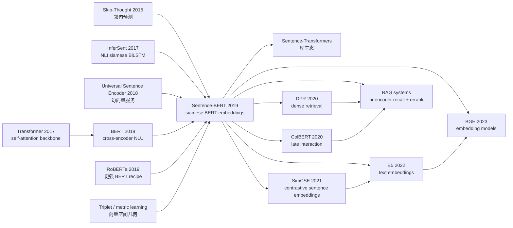

# Sentence-BERT — 把 BERT 变成可检索的句向量引擎

> **2019 年 8 月 27 日，UKP Lab / TU Darmstadt 的 Nils Reimers 与 Iryna Gurevych 在 arXiv 上传 [1908.10084](https://arxiv.org/abs/1908.10084)。** 这篇论文没有发明新的 Transformer block，也没有重新预训练一个庞然大物；它只问了一个很朴素的问题：既然 [BERT](2018_bert.md) 做句对判断必须把两个句子一起塞进 cross-encoder，那我们能不能先把每个句子单独编码成向量，再用余弦相似度检索？答案把一个 2019 年几乎不可用的流程改写成基础设施：10,000 个句子两两比较从 **49,995,000 次 BERT 推理 / 约 65 小时**，变成 **10,000 次编码 / 约 5 秒**。SBERT 的真正影响不在 GLUE 榜单，而在它把 BERT 从“精读两句话的判别器”改造成了“能给百万句库建索引的语义坐标系”。

## 一句话总结

Reimers 与 Gurevych 2019 年发表在 EMNLP-IJCNLP 的 Sentence-BERT，把 [BERT（2018）](2018_bert.md) 从 cross-encoder 改造成共享权重的 siamese / triplet bi-encoder：每个句子先得到 $s=\mathrm{pool}(\mathrm{BERT}(x))$，句对训练时用 $(u, v, |u-v|)$ 做 NLI 分类、用 $\cos(u,v)$ 做 STS 回归、用 $\max(\|s_a-s_p\|-\|s_a-s_n\|+\epsilon,0)$ 做 triplet learning。它替代的失败 baseline 很清楚：原生 BERT/RoBERTa 在 STS 上很准，却必须为 10,000 句子的每一对跑 $n(n-1)/2=49{,}995{,}000$ 次推理，约 65 小时；直接拿 BERT `[CLS]` 当句向量更糟，7 个 STS 任务平均 Spearman 只有 **29.19**，还不如平均 GloVe 的 **61.32**。SBERT 用 NLI 微调和 mean pooling 把无监督 STS 平均分推到 **76.55/76.68**，同时把相似句检索降到约 **5 秒 + 0.01 秒余弦计算**。后续 [T5（2019）](2019_t5.md) 统一了 text-to-text 接口，而 SBERT 统一的是检索接口：bi-encoder 召回、cross-encoder rerank、向量数据库、RAG、SimCSE、E5、BGE 这条工业链条都从这里获得了可用的 BERT 句向量。反直觉点是：它的胜利不是“更深的模型”，而是承认 cross-attention 太贵，主动放弃句对级交互，换来可索引的语义空间。

---

## 历史背景

### 2019 年：BERT 很强，但不适合“找相似句”

2018 年 10 月 BERT 发布后，NLP 社区很快形成一种新默认：只要任务能写成“输入一个句子”或“输入两个句子”，就把 token 拼成 `[CLS] A [SEP] B [SEP]`，让 Transformer 的 self-attention 在两句话之间充分交互，再在 `[CLS]` 上接一个分类或回归头。这个做法对 GLUE、SQuAD、STS Benchmark 都非常有效，因为 BERT 可以在每一层比较词与词、短语与短语、上下文与上下文。

问题是，检索和聚类不是“给定一对句子，判断相似度”，而是“给定一个库，在所有句子里找最近邻”。如果库里有 $n$ 个句子，cross-encoder 要跑 $n(n-1)/2$ 次。SBERT 论文用一个非常刺眼的例子把问题钉死：10,000 个句子需要 49,995,000 次 BERT 推理，在一张 V100 上约 65 小时。Quora 里有 4,000 多万问题，如果每个新问题都和全库 cross-encode，单次查询需要 50 小时以上。换句话说，BERT 在句对任务上是精密显微镜，却不是搜索引擎。

更尴尬的是，当时很多人以为“把单句丢进 BERT，然后拿 `[CLS]` 或平均 token 向量”就能得到句向量。论文的实验直接拆穿了这个习惯：在 7 个 STS 数据集上，BERT `[CLS]` 平均 Spearman 只有 29.19，平均 BERT token 向量 54.81，前者甚至远低于平均 GloVe 的 61.32。BERT 的预训练目标让 `[CLS]` 适合接任务头，不自动让它成为几何意义上的语义坐标。

### 直接逼出 SBERT 的几条前序线索

SBERT 的出现不是孤立的。2015 年 Skip-Thought 试图用 encoder-decoder 预测邻近句，2017 年 InferSent 用 SNLI/MultiNLI 训练 siamese BiLSTM，并证明自然语言推理数据能教模型“句子级语义”；2018 年 Universal Sentence Encoder 把 Transformer 和 DAN 做成可直接调用的句向量服务；同年 BERT 把上下文编码能力推到新高度，但仍停留在 cross-encoder 接口。

这里最关键的前序其实是 **InferSent**：它已经使用 $(u, v, |u-v|, u*v)$ 这类句对特征做 NLI 分类，然后把单句 encoder 输出当 sentence embedding。SBERT 的灵感很清楚：保留 InferSent 的 siamese 训练哲学，把 BiLSTM 换成 BERT/RoBERTa，并把推理阶段收敛到“单句编码 + 余弦相似度”。这不是炫技式创新，而是一次架构接口移植。

另一个前序是 metric learning 和 triplet network。人脸识别、图像检索很早就知道：如果目标是最近邻搜索，就应该训练一个空间，让 anchor 靠近 positive、远离 negative。SBERT 把这个思想搬到句子上，并保留了 NLI 分类、STS 回归、Wikipedia section triplet 三套训练入口。

### 作者团队与 UKP Lab 的位置

Nils Reimers 与 Iryna Gurevych 来自 TU Darmstadt 的 UKP Lab。这个实验室长期做 argument mining、语义相似度、信息检索和 NLP 工具化，SBERT 的问题意识非常工程：不是“怎样把排行榜再刷 0.3 分”，而是“怎样让 BERT 能被拿去做语义搜索、聚类和大规模去重”。这也解释了论文为什么花大量篇幅报告计算速度、smart batching、AFS 跨主题泛化、Wikipedia triplet，而不只盯着 STS Benchmark。

论文在 EMNLP-IJCNLP 2019 发表，代码以 `sentence-transformers` 形式开源。这个名字后来比论文标题还重要：它把 SBERT 从一篇方法论文变成了一个标准库，抽象出 `SentenceTransformer.encode()` 这个接口。2020 年以后，很多研究者第一次使用 dense retrieval，并不是从 DPR 或 ColBERT 的论文开始，而是从 `pip install sentence-transformers` 开始。

### 当时的产业需求已经在等它

2019 年的工业 NLP 有大量“BERT 很准但太慢”的场景：FAQ 匹配、重复问题检测、客服检索、候选文档召回、相似评论聚类、主题去重、实体描述匹配。传统 TF-IDF/BM25 速度快但语义弱；cross-encoder BERT 语义强但没法全库扫描；USE/InferSent 可用但上限被 BiLSTM 或早期 Transformer 限制。SBERT 正好卡在中间：它保留 BERT 的预训练知识，又把句子压成可缓存、可索引、可近邻搜索的向量。

这篇论文的历史定位因此很特别。BERT 是“预训练 + 微调”时代的象征，SBERT 是“预训练模型进入检索系统”的转接头。它没有结束 cross-encoder，反而确定了后来最常见的两阶段范式：第一阶段用 bi-encoder 快速召回，第二阶段用 cross-encoder 精排。今天 RAG、企业搜索、embedding API、向量数据库的默认工程形态，都可以在 SBERT 这里看到早期轮廓。

---

## 方法详解

### 整体框架

SBERT 的核心改动可以一句话讲完：把 BERT 的 cross-encoder 拆成两个共享权重的单句 encoder，并强制它们输出可比较的固定长度向量。原始 BERT 做 STS 时输入是 `[CLS] s_1 [SEP] s_2 [SEP]`，两句话在每一层 self-attention 中交互，最后输出一个分数。这种架构精度高，因为它可以做细粒度 token-to-token alignment；但它不能预先缓存单句表示，每换一个候选句都要重跑整张网络。

SBERT 的输入则是两个相同的 BERT/RoBERTa 分支：$s_1$ 通过 encoder 得到 token hidden states，$s_2$ 也通过同一个 encoder 得到 hidden states；两个分支参数完全共享。随后用 pooling 把每个句子的 token states 压成一个向量 $u$ 和 $v$。训练时根据数据类型选择分类、回归或 triplet loss；推理时丢掉任务头，只保留向量，用 cosine / Manhattan / Euclidean 距离比较。

| 维度 | BERT cross-encoder | SBERT bi-encoder | 影响 |
|------|--------------------|------------------|------|
| 输入 | `[CLS] A [SEP] B [SEP]` | 分别编码 A 与 B | SBERT 可缓存单句向量 |
| 交互 | 每层 attention 都跨句交互 | 训练时通过 loss 对齐，推理时不交互 | 精度略降但可扩展 |
| 复杂度 | $O(n^2)$ 次 Transformer 推理 | $O(n)$ 次编码 + 向量相似度 | 10,000 句从 65h 到约 5s |
| 典型用途 | reranking、精细判别 | recall、聚类、去重、ANN 检索 | 后来形成两阶段检索范式 |

### 关键设计

#### 设计 1：Siamese / triplet 结构 —— 共享权重而不是共享输入

**功能**：让 BERT 学会“单独看一个句子时也能放到语义空间里”。两个句子不再拼接成一条序列，而是分别进入同一个 encoder。共享权重很重要：如果两个分支各自有参数，得到的向量空间可能漂移；共享后，所有句子都被同一函数 $f_\theta(x)$ 映射到同一坐标系。

这种设计继承了 metric learning 的基本直觉：模型不只是预测一个标签，而是学习一个空间。NLI 里的 entailment / contradiction / neutral 提供了“相近/相远”的弱监督；STS 的 0-5 分提供连续相似度；Wikipedia section triplets 提供 anchor-positive-negative 顺序约束。

| 训练数据 | 结构 | 监督信号 | 推理保留什么 |
|----------|------|----------|--------------|
| SNLI + MultiNLI | siamese pair | 3 类 NLI 标签 | 句向量 + cosine |
| STS Benchmark | siamese pair | 0-5 相似度分数 | 句向量 + cosine |
| Wikipedia sections | triplet | positive 比 negative 更近 | 句向量 + nearest neighbor |
| AFS arguments | siamese pair | 论点相似度 | 句向量 + cosine |

#### 设计 2：Pooling —— `[CLS]` 不是天然句向量

**功能**：BERT 输出的是每个 token 的 hidden state，不是句子向量。SBERT 在输出层上加 pooling，论文测试了三种策略：取 `[CLS]`、对所有 token 做 mean pooling、对所有 token 做 max-over-time。默认配置是 **MEAN**。

为什么 mean pooling 这么重要？BERT 原始预训练中的 `[CLS]` 主要服务 NSP / 下游分类头，它没有被训练成“几何上可比较”的句子代表。mean pooling 虽然朴素，却把所有 token 的上下文信息平均到同一向量里，训练时再通过 NLI/STS loss 把这个平均向量塑形。论文的消融显示，在 NLI 分类目标下 pooling 影响较小；在 STSb 回归目标下，MEAN 得到 87.44，CLS 得到 86.62，而 MAX 只有 69.92。

| Pooling | NLI 训练后 STSb dev | STSb 回归训练后 dev | 解释 |
|---------|---------------------|---------------------|------|
| MEAN | **80.78** | **87.44** | 默认策略，稳定吸收全句信息 |
| MAX | 79.07 | 69.92 | 对 Transformer token states 太尖锐 |
| CLS | 79.80 | 86.62 | 可用，但不如 mean 稳定 |
| 未微调 BERT CLS | 29.19（7 STS 平均） | - | 几何空间不可直接用 |

#### 设计 3：三套 objective —— 分类、回归、triplet 对应三种数据

**分类目标**用于 NLI。给定两个句向量 $u$ 与 $v$，SBERT 拼接 $(u, v, |u-v|)$，接一个 softmax 分类器预测 entailment / contradiction / neutral。论文试过加入 $u*v$，但在 SBERT 架构里反而略降；最关键的是 $|u-v|$，它显式告诉分类器每个维度的距离。

$$
o = \mathrm{softmax}(W_t [u; v; |u-v|])
$$

**回归目标**用于 STS。训练时直接最大化向量余弦相似度与人工相似度分数的一致性，使用 MSE loss；推理时同样只算 cosine。这保证训练接口和检索接口一致。

$$
\mathcal{L}_{\mathrm{STS}} = \left(\cos(u,v) - y\right)^2
$$

**Triplet 目标**用于 Wikipedia section。给定 anchor $a$、positive $p$、negative $n$，要求 anchor 到 positive 的距离至少比 negative 近 $\epsilon$，论文用 Euclidean distance，margin $\epsilon=1$。

$$
\mathcal{L}_{\mathrm{tri}} = \max(\|s_a-s_p\| - \|s_a-s_n\| + \epsilon, 0)
$$

#### 设计 4：推理接口 —— 先编码，再索引，再精排

SBERT 最有生命力的部分不是 loss，而是推理接口。一个模型只要能把句子变成固定维向量，就可以接入向量索引、近邻搜索、聚类算法和去重 pipeline。论文自己已经提到，计算 10,000 个 SBERT 向量约 5 秒，计算全量 cosine 约 0.01 秒；若使用优化索引结构，Quora 相似问题查询可降到毫秒级。

```python
from sentence_transformers import SentenceTransformer, util

model = SentenceTransformer("bert-base-nli-mean-tokens")
corpus_emb = model.encode(corpus_sentences, normalize_embeddings=True)
query_emb = model.encode([query], normalize_embeddings=True)
scores = util.cos_sim(query_emb, corpus_emb)[0]
top_ids = scores.argsort(descending=True)[:100]
```

这段接口背后的取舍很清楚：SBERT 牺牲了 cross-encoder 的细粒度交互，所以第一阶段排序不会永远比 BERT cross-encoder 准；但它把候选集从百万级压到百级，然后可以再让 cross-encoder 精排。后来的 DPR、ColBERT、monoT5 reranking、RAG pipeline 都沿用了这个“召回快、精排准”的分工。

### 损失函数 / 训练策略

论文的训练设置刻意朴素，正因为朴素才容易扩散。NLI 阶段把 SNLI 的 570k 句对和 MultiNLI 的 430k 句对合并，用 3-way softmax 训练 1 个 epoch；batch size 16，Adam，learning rate $2\mathrm{e}{-5}$，10% linear warmup，默认 MEAN pooling。STS 阶段在 STS Benchmark 上用 regression objective 微调；triplet 阶段用约 1.8M Wikipedia section triplets 训练 1 个 epoch。

| 项目 | 配置 |
|------|------|
| Backbone | BERT-base / BERT-large / RoBERTa-base / RoBERTa-large |
| 默认 pooling | MEAN over token output vectors |
| NLI 数据 | SNLI 570k + MultiNLI 430k |
| NLI loss | cross-entropy over entailment / contradiction / neutral |
| STS loss | cosine similarity + MSE |
| Triplet loss | Euclidean distance, margin $\epsilon=1$ |
| Optimizer | Adam, lr $2\mathrm{e}{-5}$, batch 16, 10% warmup |
| 训练成本 | NLI fine-tuning 少于 20 分钟（论文报告） |

真正值得注意的是，SBERT 没有要求重新预训练 BERT。它是一个轻量 fine-tuning recipe：拿已有 BERT/RoBERTa 权重，用句对/三元组监督把输出空间改造成可比较向量空间。这也是它能快速变成库和生态的原因。

---

## 失败案例

### 失败 baseline 1：原生 BERT cross-encoder 太贵

SBERT 论文最漂亮的地方，是它没有把“计算复杂度”放在附录里，而是放在摘要和引言第一屏。BERT/RoBERTa 作为 cross-encoder 时，确实能在 STS Benchmark 上做到很高分；但它们没有独立句向量，因此不能把库离线编码。所有候选对都必须重新拼接并前向传播。

| 场景 | Cross-encoder BERT | SBERT | 差异 |
|------|--------------------|-------|------|
| 10,000 句找最相似 pair | 49,995,000 次推理，约 65h | 10,000 次编码，约 5s | 从二次 Transformer 到线性编码 |
| Quora 40M 问题找相似问句 | 单查询 50h+ | 索引后毫秒级 | 从不可用到在线服务 |
| 层级聚类 | 需要全量 pair score | 可直接对向量聚类 | 聚类从实验变成工具 |
| reranking | 精度强 | 第一阶段召回不如 cross-encoder 细 | 两者后来互补 |

这不是 BERT 的“错误”，而是接口不匹配。Cross-attention 的优势是精细，代价是每一对都要重算；semantic search 的核心需求是可缓存、可索引。SBERT 把问题从“更强的句对模型”改写成“更可用的单句表示”。

### 失败 baseline 2：直接拿 `[CLS]` 当句向量

2019 年很多教程和代码库把 BERT `[CLS]` 当作句向量，这看起来合理：`[CLS]` 不是整句表示吗？SBERT 的实验显示，至少在 cosine similarity 这个几何接口下，这个直觉很危险。BERT `[CLS]` 在 7 个 STS 任务平均 Spearman 只有 29.19，平均 token embedding 也只有 54.81，二者都说明“上下文编码强”不等于“向量空间好”。

| 方法 | 7 个 STS 平均 Spearman | 结论 |
|------|------------------------|------|
| Avg. GloVe embeddings | 61.32 | 老式静态词向量反而更适合 cosine |
| Avg. BERT embeddings | 54.81 | 有上下文但空间没被训练成相似度空间 |
| BERT CLS-vector | 29.19 | `[CLS]` 未经监督不能直接当句向量 |
| SBERT-NLI-large | 76.55 | NLI 监督把空间塑形成功 |
| SRoBERTa-NLI-large | 76.68 | RoBERTa backbone 略好但不是本质 |

这组数字后来被无数 embedding 教程引用，因为它给了一个明确警告：预训练 encoder 的 pooled output 不是免费 sentence embedding。要让 cosine 有意义，必须用相似度相关目标训练几何空间。

### 失败 baseline 3：InferSent / USE 上限不够

InferSent 和 Universal Sentence Encoder 并不是弱 baseline。它们分别代表 2017-2018 年最强的可用句向量路线：一个用 NLI 训练 BiLSTM，一个用 Transformer/DAN 做大规模句编码。SBERT 击败它们的关键，不是换了一个 loss，而是把 BERT 的上下文知识放入同样的 siamese 训练框架。

| 模型 | 7 STS 平均 | SentEval 平均 | 主要短板 |
|------|------------|---------------|----------|
| InferSent-GloVe | 65.01 | 85.59 | BiLSTM 容量与预训练知识不足 |
| Universal Sentence Encoder | 71.22 | 85.10 | QA/论坛等数据有优势，但任务覆盖不稳 |
| SBERT-NLI-base | 74.89 | 87.41 | 更慢，但语义空间更强 |
| SBERT-NLI-large | 76.55 | 87.69 | 当时最强通用句向量之一 |

一个细节很有意思：USE 在 SICK-R 和 TREC 上更强，论文解释为 USE 训练数据包含问答页面和论坛，对这些任务更贴近。这说明 SBERT 不是所有数据分布上的绝对胜利；它的胜利更像“用 BERT 初始化 + NLI 微调”建立了更好的默认起点。

### 失败 baseline 4：SBERT 自己也输给 cross-encoder

SBERT 不是万能替代品。论文在 STS Benchmark 的 supervised 设置里显示，BERT cross-encoder 仍然更准：BERT-NLI-STSb-large 88.77，SBERT-NLI-STSb-large 86.10。原因很直接：cross-encoder 能让两个句子的 token 在每一层互相看见，特别适合细粒度判别；SBERT 必须先把单句压成向量，压缩会损失交互信息。

更明显的失败出现在 AFS cross-topic：SBERT-base 从 10-fold 设置的 74.13 Spearman 掉到跨主题的 50.65；BERT-base 也下降，但仍有 57.23。argument similarity 不只是语义相近，还要求相同 claim 与相同 reasoning。对于未见主题，单句向量很难独立编码足够的论证结构。

这组失败反而让 SBERT 的历史位置更清楚：它不是“取代 BERT”，而是“把 BERT 变成候选生成器”。后来工业系统很少只用一个 SBERT 完成所有排序，而是用 SBERT / DPR / E5 / BGE 做召回，再用 cross-encoder 或 LLM reranker 精排。

## 实验关键数据

### STS 无监督：SBERT 把 BERT 输出空间修好了

| Model | STS12 | STS13 | STS14 | STS15 | STS16 | STSb | SICK-R | Avg. |
|-------|-------|-------|-------|-------|-------|------|--------|------|
| Avg. GloVe | 55.14 | 70.66 | 59.73 | 68.25 | 63.66 | 58.02 | 53.76 | 61.32 |
| Avg. BERT | 38.78 | 57.98 | 57.98 | 63.15 | 61.06 | 46.35 | 58.40 | 54.81 |
| BERT CLS | 20.16 | 30.01 | 20.09 | 36.88 | 38.08 | 16.50 | 42.63 | 29.19 |
| InferSent-GloVe | 52.86 | 66.75 | 62.15 | 72.77 | 66.87 | 68.03 | 65.65 | 65.01 |
| USE | 64.49 | 67.80 | 64.61 | 76.83 | 73.18 | 74.92 | **76.69** | 71.22 |
| SBERT-NLI-large | 72.27 | **78.46** | **74.90** | 80.99 | 76.25 | **79.23** | 73.75 | 76.55 |
| SRoBERTa-NLI-large | **74.53** | 77.00 | 73.18 | **81.85** | **76.82** | 79.10 | 74.29 | **76.68** |

关键不是每个数据集都赢，而是平均上形成代差：比 InferSent 高 11.5 分左右，比 USE 高 5.4 分左右，更重要的是把“原生 BERT 句向量很差”这个事实量化了。

### STS 监督：速度换精度的边界

| Model | STSb Spearman | 训练设置 | 说明 |
|-------|---------------|----------|------|
| BERT-STSb-base | 84.30 ± 0.76 | 只训 STSb | cross-encoder 很准但不可索引 |
| SBERT-STSb-base | 84.67 ± 0.19 | 只训 STSb | base 级别几乎不输 |
| SRoBERTa-STSb-base | **84.92 ± 0.34** | 只训 STSb | base 最好 |
| BERT-NLI-STSb-large | **88.77 ± 0.46** | NLI + STSb | cross-encoder 上限最高 |
| SBERT-NLI-STSb-large | 86.10 ± 0.13 | NLI + STSb | 少 2.7 分，换来可检索 |
| SRoBERTa-NLI-STSb-large | 86.15 ± 0.35 | NLI + STSb | 与 SBERT 接近 |

这张表给了一个长期有效的经验法则：如果候选只有几十个，cross-encoder 更好；如果候选是十万、百万、千万，bi-encoder 必须先上场。

### AFS / WikiSec / SentEval：SBERT 的可迁移性与边界

| 任务 | 数据规模 / 设置 | 主要结果 | 解读 |
|------|-----------------|----------|------|
| AFS 10-fold | 6,000 论点对 | SBERT-large 75.93 Spearman，BERT-large 76.38 | 同主题内几乎追平 cross-encoder |
| AFS cross-topic | 留一主题测试 | SBERT-large 53.10，BERT-large 60.34 | 未见主题论证结构仍难 |
| WikiSec triplets | 1.8M train / 222,957 test | SBERT-large 0.8078 accuracy，Dor et al. 0.74 | triplet loss 明显有效 |
| SentEval | 7 个迁移分类任务 | SBERT-large 87.69 平均，InferSent 85.59 | 句向量也能做迁移特征 |

这些实验展示了 SBERT 的双重性：它足够通用，能在 STS、迁移分类和 Wikipedia triplet 上统一工作；它也有压缩损失，对论证结构、领域外语义和需要细粒度 token alignment 的任务不如 cross-encoder。

### 计算效率：论文真正的杀手锏

| Model | CPU sentences/s | GPU sentences/s | 备注 |
|-------|-----------------|-----------------|------|
| Avg. GloVe | 6469 | - | 极快但语义弱 |
| InferSent | 137 | 1876 | CPU 更快，GPU 略慢于 SBERT smart batching |
| Universal Sentence Encoder | 67 | 1318 | 比 SBERT smart batching 慢 55% 左右 |
| SBERT-base | 44 | 1378 | Transformer 编码较重 |
| SBERT-base + smart batching | 83 | 2042 | CPU +89%，GPU +48% |

如果只看 embedding throughput，SBERT 不如 GloVe；如果只看精度，SBERT 不如最强 cross-encoder。但工程系统看的是“足够准 + 足够快 + 可索引”。SBERT 正是在这个三角形中找到了 2019 年最好的折中点。

---

## 思想史脉络



### 前世：它站在谁的肩膀上

SBERT 的上游可以分成三条线。第一条是“句向量”线：Skip-Thought 想通过预测邻句学到通用句表示，InferSent 用 SNLI/MultiNLI 监督让句向量带上推理语义，Universal Sentence Encoder 把句向量做成可直接调用的工程服务。这条线解决的是“句子应该有一个向量表示”。

第二条是“预训练 Transformer”线：[Transformer](2017_transformer.md) 提供 backbone，[BERT](2018_bert.md) 提供强上下文编码器，RoBERTa 提供更稳的训练 recipe。SBERT 没有改变 Transformer 结构，而是把它的使用方式从句对判别改成单句编码。

第三条是 metric learning：triplet loss、人脸识别和图像检索早就证明，向量空间不是自然产生的，需要任务约束塑形。SBERT 把 NLI、STS 和 Wikipedia triplet 都看成塑形信号，训练一个“句子之间距离有意义”的空间。

### 今生：它启发了什么

最直接的后继是 `sentence-transformers` 生态。它不仅复现了 SBERT，还把 pooling、loss、dataset reader、model hub、batch encoding、向量归一化、cross-encoder reranking 都产品化。对很多开发者来说，SBERT 不是一篇论文，而是一行 `model.encode()`。

研究线上，DPR 把 bi-encoder 用到开放域 QA 检索；ColBERT 承认单向量压缩过强，改用 late interaction 保留 token 级表示；SimCSE 用 dropout noise 和 contrastive learning 重新训练句向量；E5、GTE、BGE 等 embedding 模型把 instruction、query/document 前缀、多语料对比学习接到同一接口上。它们未必都直接复用 SBERT loss，但都继承了“文本先变向量，再索引检索”的系统形态。

产业线上，SBERT 的后代进入了向量数据库、RAG、企业搜索、客服问答、代码检索、推荐召回、去重聚类。今天的 embedding API 常常比 SBERT 大得多、训练数据复杂得多，但最核心的 API 仍然是：输入一段文本，输出一个向量，向量之间用距离排序。

### 三个常见误读

**误读 1：SBERT 只是 BERT 加 mean pooling。** 不是。直接 mean pooling BERT 在 STS 上只有 54.81；SBERT 的关键是 siamese/triplet fine-tuning 把空间训练成可比较。Pooling 是接口，监督才是几何。

**误读 2：SBERT 证明 bi-encoder 比 cross-encoder 好。** 也不是。论文自己的 STSb supervised 结果显示，cross-encoder 仍然更准。SBERT 证明的是 bi-encoder 在大规模候选集上不可替代，而不是在所有 pairwise 判断上更强。

**误读 3：SBERT 的贡献只是检索加速。** 加速是表层。更深的贡献是把预训练语言模型的输出变成可存储的对象：向量可以离线计算、版本化、索引、聚类、监控、缓存、和业务数据库绑定。这是模型进入信息系统的关键一步。

---

## 当代视角

### 站不住的假设

**假设 1：NLI 微调就足够定义通用句向量。** 2019 年这很合理，因为 SNLI/MultiNLI 是少数百万级高质量句对监督。但 2021 年后的 SimCSE、Contriever、E5、BGE 证明，NLI 只是一个不错的起点，不是终点。大规模弱监督 query-document 对、对比学习、hard negative mining、instruction 前缀、领域混合数据，都会显著改变 embedding 的检索能力。

**假设 2：单向量足以表达一段文本。** SBERT 的单向量接口极其成功，但 ColBERT、SPLADE、late interaction retrievers 说明，某些检索任务需要 token 级或 sparse+dense 的细粒度匹配。单向量是最易部署的折中，不是信息保留的上限。

**假设 3：cosine similarity 是语义相似度的最终接口。** Cosine 让系统简单、稳定、可索引，但现代 embedding 模型往往还要区分 query embedding 与 document embedding，使用 asymmetric prompts，甚至用 learned reranker 修正向量空间的偏差。SBERT 的 cosine 接口仍是基础层，却不再独自承担最终判断。

**假设 4：BERT/RoBERTa encoder 是最佳骨架。** 2026 年的 embedding 模型可能来自 encoder-only、decoder-only hidden states、双塔模型、MoE、multilingual encoder 或长上下文模型。SBERT 的核心不是 BERT 这个具体 backbone，而是 bi-encoder 这个系统协议。

### 时代证明的关键 vs 冗余

| 被保留下来的关键 | 逐渐被替换的部分 |
|------------------|------------------|
| bi-encoder：离线编码 + 在线近邻搜索 | 只用 NLI 作为主要训练数据 |
| siamese / triplet / contrastive 训练思想 | 单纯 `[CLS]` 或简单 pooling 的信念 |
| cosine / dot product 作为索引友好接口 | 无 hard negative 的浅层监督 |
| bi-encoder recall + cross-encoder rerank 两阶段范式 | 认为 bi-encoder 能单独完成所有排序 |
| `sentence-transformers` 风格的模型库与 API | 只支持英文、短句、STS 风格数据 |

最经得住时间考验的是“接口”：文本进来，向量出去，向量可缓存、可索引、可批量比较。具体训练 recipe 已经换了很多轮，但这个接口几乎没有变化。

### 作者当时没想到的副作用

1. **向量数据库的爆发**：SBERT 让“把自然语言存在向量库里”变成普通工程选择。Milvus、FAISS、Pinecone、Weaviate、Qdrant 等系统的普及，离不开这种稳定 embedding 接口。

2. **RAG 的默认召回层**：2020 年以后，RAG 系统需要先从大语料中找候选证据，再交给生成模型。SBERT 不是 RAG 的全部，但它定义了早期 dense recall 的可用形态。

3. **embedding API 产品化**：OpenAI、Cohere、Voyage、Jina、BAAI 等后来提供的 embedding 服务，本质上都在出售 SBERT 式接口的更强版本：输入文本，返回向量，按距离排序。

4. **评价方式的迁移**：STS Spearman 在论文里是核心指标，但工业 embedding 后来更看重 MTEB、BEIR、Recall@k、nDCG、领域检索和多语言性能。SBERT 打开了门，也暴露出 STS 不能代表真实检索。

### 如果今天重写 SBERT

如果 2026 年重新做这篇论文，核心会保留 bi-encoder，但训练和评测会完全现代化：训练数据不只 SNLI/MultiNLI，而是 NLI、STS、问答对、网页点击、弱监督 query-document、合成 hard negatives 和 instruction pairs 的混合；loss 不只 softmax / MSE / triplet，而是 InfoNCE、多负样本对比学习、in-batch negatives、teacher cross-encoder distillation；backbone 可能是 ModernBERT、DeBERTa、XLM-R、E5-style encoder 或长上下文 encoder；评测会覆盖 MTEB/BEIR、多语言、长文档、代码、医疗、法律和安全场景。

但最核心的段落不会改：cross-encoder 准但 $O(n^2)$，bi-encoder 牺牲交互换来 $O(n)$ 编码和可索引空间。这个 trade-off 仍然是检索系统的地基。

## 局限与展望

### 作者承认或实验暴露的局限

SBERT 的第一类局限是压缩损失。句子被压成一个固定向量后，词级对齐、否定范围、数量比较、实体关系、论证结构都会被压扁。AFS cross-topic 的大幅下降就是证据：相同 claim 与相同 reasoning 不能只靠一个通用语义坐标轻松解决。

第二类局限是数据依赖。NLI 监督适合教模型区分蕴含、矛盾和中立，但检索任务常常是 query-document 非对称匹配，不等同于“两个句子是否语义相同”。这就是后来的 E5/BGE 会引入 query/document prompt 和检索语料的原因。

第三类局限是长度。原始 SBERT 主要面向句子或短段落，BERT 的 512 token 上限和 mean pooling 都不适合长文档。实际系统需要 chunking、hierarchical embedding、late interaction 或多向量表示。

### 后人发现的局限

| 局限 | 后续解决方向 | 代表路线 |
|------|--------------|----------|
| 单向量信息压缩过强 | late interaction / multi-vector | ColBERT |
| NLI 数据与检索分布不匹配 | query-document contrastive training | DPR、E5、BGE |
| 缺 hard negatives | cross-encoder mining / in-batch negatives | ANCE、RocketQA |
| 英文和短句偏置 | 多语言、多领域、多任务混合 | LaBSE、mE5、BGE-M3 |
| STS 指标过窄 | 大规模检索 benchmark | BEIR、MTEB |

### 展望

SBERT 的继承者已经不只是“句向量模型”，而是“文本表示基础设施”。未来的 embedding 模型会更长上下文、更强多语言、更懂工具和代码、更能区分任务指令，也会在隐私、版权、可删除性和向量库安全上遇到新问题。可即便模型换成 decoder hidden states 或多向量 retriever，SBERT 提出的基本工程协议仍会存在：把文本转成可比较对象，让信息系统能用近邻搜索调用语言模型的语义能力。

## 相关工作与启发

**vs BERT（2018）**：BERT 是强 cross-encoder，SBERT 是把它改造成可缓存 bi-encoder。教训是：模型能力必须和系统接口匹配；最高单对精度不等于可部署检索能力。

**vs InferSent（2017）**：InferSent 已经证明 NLI 监督能训练句向量，SBERT 把 backbone 换成 BERT 后大幅提高上限。教训是：旧范式遇到新 backbone，常常能比“全新结构”更快产生影响。

**vs Universal Sentence Encoder（2018）**：USE 更像产品化句向量服务，SBERT 更像开源可训练 recipe。教训是：好 API 与可复现训练同样重要，后者更容易催生研究生态。

**vs DPR / ColBERT（2020）**：DPR 把 bi-encoder 用到 QA 证据检索，ColBERT 用 late interaction 修补单向量损失。教训是：SBERT 定义了第一阶段召回，但检索系统会不断在速度和交互之间调节。

**vs SimCSE / E5 / BGE（2021-2023）**：这些工作把 contrastive learning、instruction、hard negatives 和大规模弱监督引入 embedding。教训是：SBERT 的接口活下来了，训练数据和 loss 一直在进化。

## 相关资源

- 论文原文：[arXiv 1908.10084 - Sentence-BERT: Sentence Embeddings using Siamese BERT-Networks](https://arxiv.org/abs/1908.10084)
- 官方代码与生态：[UKPLab/sentence-transformers](https://github.com/UKPLab/sentence-transformers)
- 文档：[Sentence Transformers Documentation](https://www.sbert.net/)
- 相关模型：[all-MiniLM-L6-v2](https://huggingface.co/sentence-transformers/all-MiniLM-L6-v2)、[multi-qa-mpnet-base-dot-v1](https://huggingface.co/sentence-transformers/multi-qa-mpnet-base-dot-v1)
- 后续必读：[DPR](https://arxiv.org/abs/2004.04906)、[ColBERT](https://arxiv.org/abs/2004.12832)、[SimCSE](https://arxiv.org/abs/2104.08821)、[E5](https://arxiv.org/abs/2212.03533)、[BGE](https://arxiv.org/abs/2309.07597)
- 评测基准：[BEIR](https://arxiv.org/abs/2104.08663)、[MTEB](https://arxiv.org/abs/2210.07316)


---

> 🌐 [English version](/en/era3_attention/2019_sentence_bert/) · 📚 awesome-papers project · CC-BY-NC