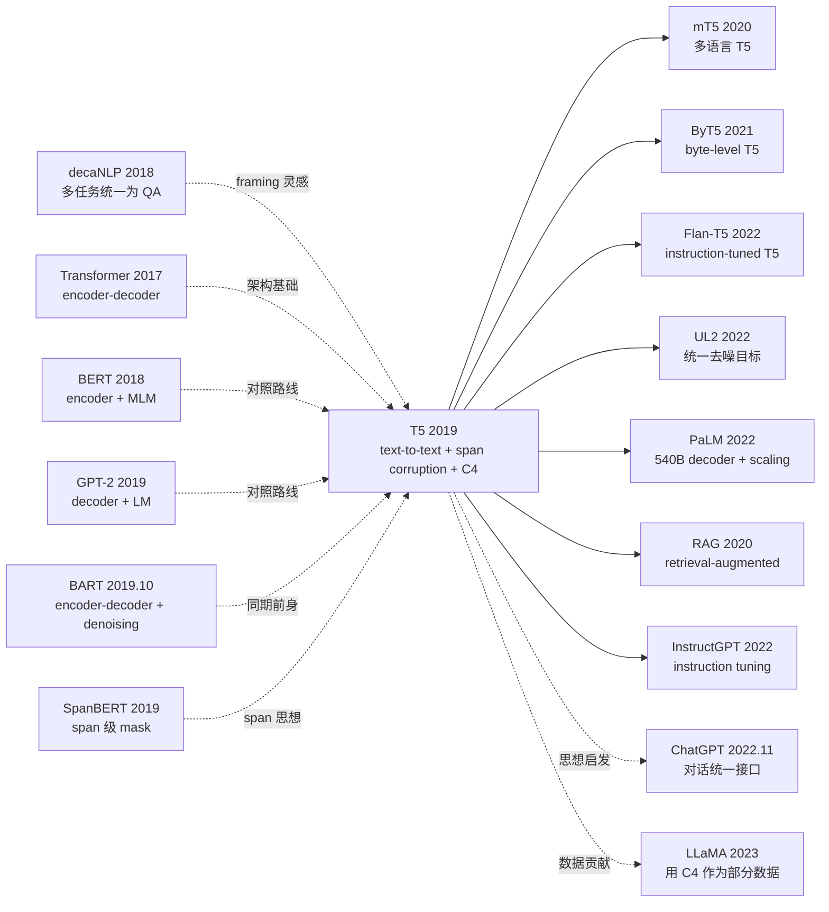

# T5 — 把所有 NLP 任务统一成 text-to-text

> **2019 年 10 月 23 日，Raffel 等 9 位作者在 arXiv 发布 [T5 (1910.10683)](https://arxiv.org/abs/1910.10683)，长达 53 页（含附录 67 页），是 NLP 史上最系统化的 transfer learning 实验报告之一。**
> 这是一篇**没有任何"新"模型组件**的论文，却把 BERT 时代以来零散的 transfer learning 设计选择——架构（encoder-only / decoder-only / encoder-decoder）、预训练目标（LM / MLM / span corruption）、数据规模（10GB - 1TB）、模型规模（60M - 11B）——全部做了**严格对照实验**，最终给出明确建议：**「encoder-decoder + span corruption + C4 + 大模型」是最强组合**。
> T5 还顺手发布了 **C4 (Colossal Clean Crawled Corpus, 750GB)**，今天 LLaMA / Falcon / RedPajama 都仍以 C4 作为核心数据源之一。它的 11B 模型把 GLUE / SuperGLUE / SQuAD 等 24 个 benchmark 全部刷到 SOTA。

## 一句话总结

T5 通过**把所有 NLP 任务（分类 / 翻译 / 摘要 / QA / 文本相似度）统一成「文本输入 → 文本输出」格式**，配合 **encoder-decoder Transformer + span corruption 预训练 + 750GB 的 C4 语料**，证明这套统一框架在 24 个 benchmark 上全部刷新 SOTA，标志着 NLP 从「per-task model」彻底走向「per-corpus model」的范式。

---

## 历史背景

### 2019 年的 NLP 学界在卡什么

2018-2019 是 NLP 的"预训练大爆发"年：BERT (2018.10) / GPT-2 (2019.02) / RoBERTa (2019.07) / XLNet (2019.06) / ALBERT (2019.09) 一年内 5 个里程碑。但这些工作各自做了不同的设计选择：BERT 用 encoder-only + MLM、GPT-2 用 decoder-only + LM、XLNet 用 permutation LM、ALBERT 砍参数共享。**学界缺乏一个统一的对照实验来回答「到底哪个设计最好」**。

> **(1) 架构：encoder-only / decoder-only / encoder-decoder 哪个最强？
> (2) 预训练目标：LM / MLM / span corruption / shuffle 哪个最有效？
> (3) 数据规模：10GB / 100GB / 1TB 各带来多少提升？
> (4) 模型规模：100M / 1B / 11B 哪个能 scale up？
> (5) 任务格式：怎么把分类 / 回归 / 序列标注 / QA 统一？**

T5 的目标就是**用一套统一框架做这 5 个维度的全因子对照实验**，然后取每个维度的最优值组合成最终模型。

### 直接逼出 T5 的 3 篇前序

- **Devlin et al., 2018 (BERT)**：encoder-only + MLM 范式
- **Radford et al., 2019 (GPT-2)**：decoder-only + LM + zero-shot
- **Lewis et al., 2019 (BART)**：encoder-decoder + denoising 预训练（早 T5 4 个月）

### 作者团队当时在做什么

9 位作者全部来自 Google Research。Colin Raffel（一作，后转 HuggingFace 后又创办 Answer.AI）；Noam Shazeer 是 Transformer 共同作者 + Mixture of Experts 名家（后创办 Character.AI）；Peter Liu 是 Google Brain 文本摘要专家。**Google Brain NLP 团队当时的目标是「找到 NLP 的统一范式」**，T5 就是这个目标的工程产物。

### 工业界 / 算力 / 数据

- **TPU**：T5-11B 在 1024 个 TPU v3 上训练 ~2 周，估算成本 ~130 万美元
- **数据**：自爬清洗的 **C4 (750GB)**，从 Common Crawl 启发式过滤而来
- **框架**：TensorFlow + Mesh-TensorFlow（早期模型并行）
- **行业**：NLP 工业开始大规模押注预训练模型，T5 是 Google 与 OpenAI 的 GPT-2/3 路线竞争的关键工程

---

## 方法详解

### 整体框架

```
[Pre-training: Span Corruption on C4 (750GB)]
  Input:  "Thank you <X> me to your party <Y> week"
  Target: "<X> for inviting <Y> last <Z>"
  ↓ Encoder-Decoder Transformer
  ↓ Cross-entropy on target tokens
[Fine-tuning: Multi-task with task prefix]
  All tasks formatted as text-to-text
  Same encoder-decoder + small LR fine-tune
```

| 配置 | T5-Small | T5-Base | T5-Large | T5-3B | T5-11B |
|------|---------|---------|----------|-------|--------|
| 参数 | 60M | 220M | 770M | 3B | 11B |
| Encoder layers | 6 | 12 | 24 | 24 | 24 |
| $d_{model}$ | 512 | 768 | 1024 | 1024 | 1024 |
| $d_{ff}$ | 2048 | 3072 | 4096 | 16384 | 65536 |
| Heads | 8 | 12 | 16 | 32 | 128 |

### 关键设计

#### 设计 1：Text-to-Text 统一框架 —— 任务前缀 + 文本输出

**功能**：把分类 / 回归 / 序列标注 / QA / 翻译 / 摘要全部变成「带前缀的输入文本 → 输出文本」。

**4 类任务统一示例**：

| 任务类型 | 输入 | 输出 |
|---------|------|------|
| 分类（GLUE/SST-2） | `sst2 sentence: it is great.` | `positive` |
| 回归（GLUE/STS-B） | `stsb sentence1: ... sentence2: ...` | `3.4`（文本表示数值，离散到 0.2 间隔） |
| 翻译（WMT EN-DE） | `translate English to German: Hello` | `Hallo` |
| 摘要（CNN/DM） | `summarize: <article>` | `<summary>` |
| QA（SQuAD） | `question: ... context: ...` | `answer text` |
| NLI（MNLI） | `mnli premise: ... hypothesis: ...` | `entailment / neutral / contradiction` |

**对比 BERT / GPT 的多任务方案**：

| 模型 | 多任务方案 | 任务接口 |
|------|-----------|---------|
| BERT | 每任务加不同 head | 分类 head / span head / token head |
| GPT-2 | prompt + zero-shot | 自回归生成 |
| **T5** | **统一 text-to-text + 任务前缀** | **encoder-decoder 生成** |

**设计动机**：text-to-text 接口把任务差异完全转移到输入格式，模型架构 + 损失 + 训练流程完全统一，是 transfer learning 工程化的极致。

#### 设计 2：Span Corruption 预训练目标 —— BERT MLM 的连续版

**功能**：随机选连续片段（span）遮蔽，让模型预测被遮蔽的 spans。

**核心机制**：

输入 "Thank you for inviting me to your party last week"
随机选 15% token 组成 spans（平均长度 3）：
- "for inviting" → 替换为 `<X>`
- "last" → 替换为 `<Y>`

**输入**：`Thank you <X> me to your party <Y> week`
**目标**：`<X> for inviting <Y> last <Z>`（每个 span 用唯一 sentinel token 标记，最后用 `<Z>` 终止）

损失函数仍是 cross-entropy on target tokens，但**只在 sentinel + span 内的 token 上计算**。

**对比 5 种预训练目标（论文 Table 4）**：

| 目标 | 公式描述 | GLUE | SQuAD F1 | 翻译 BLEU |
|------|---------|------|---------|----------|
| Standard LM | $P(x_t \| x_{<t})$（GPT 风格） | 73.78 | 78.94 | 26.0 |
| BERT-style MLM | 15% 单 token mask | 82.96 | 86.78 | 26.7 |
| Deshuffling | 打乱 token 重排序 | 73.17 | 73.93 | 25.4 |
| **Span Corruption (T5)** | **15% span mask（平均长 3）** | **83.28** | **87.24** | **27.6** |
| Random Replace + Reconstruct | 替换为随机 token | 79.37 | 80.94 | 26.5 |

**Span Corruption 全面胜出**，且**目标序列比 BERT MLM 短很多**（只输出被遮的 spans，节省计算）。

#### 设计 3：Encoder-Decoder 架构 —— 对照实验显示是最优

**功能**：用标准 Transformer encoder-decoder（与原 Transformer 几乎相同），不是 BERT 的 encoder-only 也不是 GPT 的 decoder-only。

**3 种架构对照实验**（论文 Table 2）：

| 架构 | 参数共享 | GLUE | SQuAD F1 | 翻译 BLEU |
|------|---------|------|---------|----------|
| Encoder-Decoder（标准 Transformer） | 否 | 83.28 | **87.24** | **27.6** |
| Encoder-Decoder（共享参数） | 是 | 82.81 | 86.34 | 27.4 |
| Decoder-only（GPT 风格） | - | 78.94 | 84.59 | 26.5 |
| Encoder-only（BERT 风格） | - | 不适用 generation | 84.81 | - |

**Encoder-Decoder 在 generation 任务（翻译 / 摘要）上完胜**，在 NLU 任务上也略胜。这是 T5 最反潮流的发现 —— 当时 BERT (encoder-only) 主导 NLU、GPT (decoder-only) 主导生成，T5 证明 encoder-decoder 在统一框架下两类都最强。

**T5 与原 Transformer 的小差异**：
- **Pre-LN**（与 GPT-2 一致）
- **去掉 embedding bias**
- **去掉 layer norm bias**
- **Relative Position Bias**（不用 sinusoidal / learnable absolute PE，而是相对位置 bias，加到 attention logits 上）

#### 设计 4：C4 数据集 —— 750GB 的清洗版 Common Crawl

**功能**：构造一个**超大规模、高质量、公开**的预训练语料，解决 BooksCorpus / Wikipedia 太小的问题。

**清洗规则（启发式过滤）**：

1. 只保留以 `.`, `!`, `?`, `"` 结尾的句子（去碎片）
2. 滤掉少于 5 句的页面（去骨架页）
3. 去重（句子级）
4. 滤掉含污秽词的页面（用 List-of-Bad-Words）
5. 滤掉 "JavaScript must be enabled" 这类页面（去 JS 渲染失败）
6. 滤掉 "lorem ipsum" 占位符
7. 滤掉花括号 `{` `}` 多的页面（代码 / JSON）

最终：从 Common Crawl（April 2019 snapshot）的 ~6TB 清洗到 **750GB / 1560 亿 token**。

**伪代码**：

```python
def build_c4(common_crawl_dump):
    docs = []
    for page in common_crawl_dump:
        if not page.text:
            continue
        sentences = split_sentences(page.text)
        if len(sentences) < 5:
            continue
        sentences = [s for s in sentences if s.endswith(('.', '!', '?', '"'))]
        if any(bad_word in page.text for bad_word in BAD_WORDS):
            continue
        if 'javascript must be enabled' in page.text.lower():
            continue
        if '{' in page.text or '}' in page.text:
            continue
        docs.append(' '.join(sentences))
    docs = dedup_by_sentence(docs)
    return docs                                  # 750GB / 156B token
```

**对比同期数据集**：

| 数据集 | 规模 | 来源 | 公开 | 清洗强度 |
|--------|------|------|------|---------|
| BookCorpus | 5GB | 小说 | 是 | 低 |
| WikiText-103 | 0.5GB | 维基 | 是 | 高 |
| WebText (GPT-2) | 40GB | Reddit 高赞 | **否** | 中 |
| **C4 (T5)** | **750GB** | **Common Crawl** | **是** | **高（启发式）** |
| The Pile (2020) | 825GB | 22 域 | 是 | 中 |

C4 是当时**最大的公开清洗预训练语料**，至今（2026）仍是 LLaMA / Falcon / RedPajama 的核心数据源之一。

### 损失函数 / 训练策略

| 项 | 配置 |
|----|------|
| Pretrain Loss | Span corruption cross-entropy |
| Optimizer | AdaFactor（不是 Adam，省显存） |
| LR | 1e-3 inverse-square-root schedule |
| Pretrain Batch | 128 sequences × 512 tokens |
| Pretrain Steps | 524k（约 1T token，1/3 epoch on C4） |
| Fine-tune LR | 1e-3 |
| Fine-tune Steps | 262k（per task） |
| Norm | Pre-LN，无 bias |
| Position | Relative position bias |
| Activation | ReLU（base/large）/ GeGLU（11B 版） |
| Tokenizer | SentencePiece, 32k 词表 |

---

## 失败案例

### 当时输给 T5 的对手

- **GLUE 排行榜**：T5-11B 平均 90.3，超过 RoBERTa-large 88.5（+1.8 分）和 XLNet-large 89.5
- **SuperGLUE**：T5-11B 89.3，超过之前 SOTA RoBERTa 84.6（+4.7 分），首次超人类 baseline 89.0
- **CNN/DM 摘要**：ROUGE-L 21.55 → 28.07（+6.5 分）
- **WMT EN-DE 翻译**：28.4 (Transformer) → 29.4 (T5-11B)
- **SQuAD 1.1**：F1 93.1 → 95.1，**第一次超过有监督 BERT 集成 SOTA**

### 论文承认的失败 / 局限

- **Decoder-only 在 generation 任务上输给 encoder-decoder**：这与 GPT 路线的押注相反，但作者 honestly report
- **Span corruption 与 BERT MLM 差距较小**：只在 generation 任务上明显占优，NLU 上 +0.3 分
- **多任务训练略输于单独 fine-tune**：T5 也尝试了 mixed multi-task fine-tuning，但比单独 fine-tune 略差（论文 Table 14）
- **11B 模型在某些任务（如 ReCoRD）上仍未饱和**：暗示 scaling 还能继续，催生 GPT-3 175B
- **C4 清洗启发式简单**：今天 LM-based filtering / dedup 更精细

### 「反 baseline」教训

- **「encoder-only 才是 NLU 之王」**（BERT 路线信仰）：T5 证明 encoder-decoder 在统一框架下也能拿 NLU SOTA
- **「decoder-only 是生成之王」**（GPT 路线信仰）：T5 在生成任务上反超
- **「BookCorpus + Wikipedia 已够」**（学界普遍）：T5 用 750GB C4 证明数据规模重要
- **「per-task fine-tune 是最佳实践」**：T5 证明**per-corpus pretrain + 统一 fine-tune** 才是上限
- **「需要新架构创新才能进步」**：T5 证明**严格对照实验 + 选最优组合 + scale up**比新架构更有效

---

## 实验关键数据

### 主实验（24 benchmark SOTA）

| Benchmark | 之前 SOTA | T5-11B | 提升 |
|-----------|----------|--------|------|
| GLUE | 88.5 (RoBERTa) | 90.3 | +1.8 |
| SuperGLUE | 84.6 (RoBERTa) | 89.3 | +4.7 |
| SQuAD 1.1 F1 | 93.1 | 95.1 | +2.0 |
| SQuAD 2.0 F1 | 88.6 | 90.6 | +2.0 |
| CNN/DM ROUGE-L | 21.55 | 28.07 | +6.5 |
| WMT EN-DE BLEU | 28.4 | 29.4 | +1.0 |
| WMT EN-FR BLEU | 41.0 | 41.5 | +0.5 |
| ReCoRD acc | 84.0 | 90.6 | +6.6 |
| MultiRC F1a | 83.4 | 87.4 | +4.0 |
| BoolQ acc | 87.1 | 91.2 | +4.1 |

### 架构 + 目标对照（论文 Table 2 + 4）

| Architecture | Objective | GLUE | SQuAD F1 |
|-------------|-----------|------|---------|
| Encoder-Decoder | Span | **83.28** | **87.24** |
| Encoder-Decoder | LM | 80.88 | 84.45 |
| Decoder-only | LM | 78.94 | 84.59 |
| Decoder-only | Span | 79.46 | 84.85 |
| Encoder-only | MLM | - | 84.81 |

### Scaling（论文 Table 14）

| 模型 | 参数 | C4 训练 token | GLUE | SQuAD F1 | CNN/DM ROUGE-L |
|------|------|--------------|------|---------|---------------|
| T5-Small | 60M | 137B | 77.4 | 79.10 | 19.24 |
| T5-Base | 220M | 137B | 82.7 | 85.44 | 20.34 |
| T5-Large | 770M | 137B | 86.4 | 89.40 | 21.10 |
| T5-3B | 3B | 1.0T | 88.5 | 91.26 | 22.54 |
| **T5-11B** | **11B** | **1.0T** | **89.7** | **91.44** | **23.06** |

**所有维度单调提升，无饱和**。

### 关键发现

- **encoder-decoder + span corruption 是最强组合**
- **C4 750GB 比 BookCorpus 5GB 显著提升**（+5-7 GLUE 分）
- **scale 到 11B 仍单调提升**：暗示 GPT-3 决策合理
- **多任务训练略输于单独 fine-tune**：迁移学习仍以单任务为主
- **任务前缀的格式细节重要**：好的前缀能 +1-2 分

---

## 思想史脉络



### 前世
- **Transformer (2017)**：encoder-decoder 架构基础
- **BERT (2018)**：encoder + MLM 对照
- **GPT-2 (2019)**：decoder + LM 对照
- **decaNLP (2018)**：多任务统一为 QA 的早期 framing
- **SpanBERT (2019)**：span-level mask 思想
- **BART (2019.10)**：早 T5 4 个月，encoder-decoder + denoising

### 今生
- **多语言 / 跨模态扩展**：mT5 2020、ByT5 2021、PaLM 2022（按 T5 范式 scale 到 540B）
- **指令微调**：Flan-T5 2022（在 T5 上做 instruction tuning，开 instruction-tuning 范式之先）
- **目标改进**：UL2 2022（统一多种 denoising 目标）、PEGASUS 2020（gap-sentence 摘要预训练）
- **检索增强**：RAG 2020（在 T5 基础上加检索）
- **数据贡献**：C4 至今（2026）仍是 LLaMA / Falcon / RedPajama 等主流开源 LLM 的核心数据源
- **思想被 GPT-3 范式继承**：text-to-text 接口本质上是 in-context learning 的雏形

### 误读
- **「T5 是 BERT 的升级版」**：错。T5 是 BERT/GPT 路线之外的第三条路（encoder-decoder + span）
- **「text-to-text 一定是最佳接口」**：在分类任务上 task-specific head 仍可能更精确
- **「11B 是 NLP 终点」**：GPT-3 175B 4 个月后证明还能继续 scale 16×

---

## 当代视角（2026 年回看 2019）

### 站不住的假设

- **「encoder-decoder 是最佳架构」**：post-ChatGPT 时代 decoder-only LLM (GPT-4 / Claude / LLaMA) 在 user-facing 应用上完胜 encoder-decoder。但 **T5 在 backend embedding / dense retrieval / 摘要任务上仍是金标准**
- **「11B 已经够大」**：今天主流 70B-1T，T5-11B 在 GPT-4 / Claude 3.5 面前是中等模型
- **「per-task fine-tune 是最佳实践」**：被 in-context learning + RLHF 颠覆 —— GPT-3+ 不需要任务特定 fine-tune
- **「C4 启发式清洗已够」**：今天 LM-based filtering 更精细
- **「encoder-decoder 训练效率比 decoder-only 高」**：被推翻 —— FlashAttention + KV cache 让 decoder-only 推理效率反超

### 时代证明的关键 vs 冗余

- **关键**：text-to-text 统一框架、span corruption 目标、C4 数据集、严格对照实验方法论、encoder-decoder 在 generation 上的优势
- **冗余 / 误导**：sentinel token 设计（GPT-3 in-context learning 完全不需要）、relative position bias（被 RoPE 取代）、AdaFactor（被 Adam + ZeRO 取代）

### 作者当时没想到的副作用

1. **C4 成为 NLP 数据基础设施**：今天 90%+ 的开源 LLM 都用 C4 / mC4 作为部分预训练数据
2. **Flan-T5 开 instruction-tuning 范式之先**：2022 年 Flan-T5 把 1800+ 任务用 instruction format 微调，启发后来的 InstructGPT / ChatGPT
3. **统一 text-to-text 接口被 ChatGPT 完整继承**：ChatGPT 的对话格式本质上是 text-to-text 的极致
4. **改变了 NLP benchmark 设计哲学**：T5 之前 benchmark 各自独立，T5 之后大家更注重"统一框架可对比"
5. **开启 transfer learning 系统化研究方向**：T5 的对照实验方法论被广泛模仿（如 GPT-3 的 scaling laws、Chinchilla）

### 如果今天重写 T5

- 改成 **decoder-only**（per ChatGPT 经验）
- 加 **instruction tuning + RLHF**
- 用 **byte-level BPE**（per GPT-3）
- 用 **RoPE / ALiBi** 替代 relative position bias
- 用 **SwiGLU** 替代 ReLU
- 用 **GQA / MQA** 减少 KV cache
- 数据扩到 **15T token**（per LLaMA 3，Chinchilla-balanced）
- 加 **数据 LM-based filtering**（per Falcon）

但**「text-to-text 统一接口 + 大规模高质量数据 + 严格对照」核心思想不变**。

---

## 局限与展望

### 作者承认
- 11B 训练成本极高（百万美元级），学术界难复现
- 多任务训练略输于单独 fine-tune
- C4 清洗启发式简单，未做 LM-based filtering
- 序列长度仅 512，长文档受限
- 不能做 zero-shot prompt（仍需任务前缀对应的 fine-tune 数据）

### 自己发现
- encoder-decoder 推理时 KV cache 不能跨 step 复用，效率低于 decoder-only
- relative position bias 外推性弱
- AdaFactor 在小模型上不如 Adam

### 改进方向（已被后续工作证实）
- mT5 (2020)：多语言扩展
- Flan-T5 (2022)：instruction tuning
- UL2 (2022)：统一多种 denoising 目标
- LongT5 (2022)：长文档（4k+ context）
- ByT5 (2021)：byte-level tokenization
- 转 decoder-only（GPT-3/4 路线）

---

## 相关工作与启发

- **vs BERT (跨架构)**：BERT encoder-only + MLM，T5 encoder-decoder + span corruption。**教训：encoder-decoder 在 generation 上有架构优势**
- **vs GPT-2 (跨架构)**：GPT decoder-only + LM + zero-shot，T5 encoder-decoder + span + 多任务 fine-tune。**教训：架构选择需匹配任务类型**
- **vs BART (跨同期)**：BART 早 T5 4 个月提出 encoder-decoder + denoising，T5 是更系统化的对照实验。**教训：原创 idea 不一定胜过 thorough engineering**
- **vs Transformer (跨任务)**：Transformer 解决 MT，T5 把 encoder-decoder 推广到所有 NLP 任务。**教训：通用架构可跨任务复用**
- **vs Flan-T5 (跨代际)**：Flan-T5 在 T5 上加 instruction tuning，证明 T5 框架与 instruction tuning 完美兼容。**教训：好的预训练范式应该易于扩展到新训练目标**

---

## 相关资源

- 📄 [arXiv 1910.10683](https://arxiv.org/abs/1910.10683) · [JMLR 2020](https://jmlr.org/papers/v21/20-074.html)
- 💻 [作者原始 TF 实现](https://github.com/google-research/text-to-text-transfer-transformer) · [HuggingFace transformers/t5](https://huggingface.co/docs/transformers/model_doc/t5)
- 🔗 [t5-base on HF Hub](https://huggingface.co/t5-base) · [t5-11b](https://huggingface.co/t5-11b) · [Flan-T5](https://huggingface.co/google/flan-t5-xxl)
- 📦 数据集：[C4 on TF Datasets](https://www.tensorflow.org/datasets/catalog/c4) · [mC4 (multilingual)](https://huggingface.co/datasets/mc4)
- 📚 后续必读：[mT5 (2020)](https://arxiv.org/abs/2010.11934)、[Flan-T5 (2022)](https://arxiv.org/abs/2210.11416)、[UL2 (2022)](https://arxiv.org/abs/2205.05131)、[PaLM (2022)](https://arxiv.org/abs/2204.02311)
- 🎬 [Yannic Kilcher: T5 paper explained](https://www.youtube.com/watch?v=91iLu6OOrwk)

---

> 🌐 [English version](/en/era3_attention/2019_t5/) · 📚 awesome-papers project · CC-BY-NC
