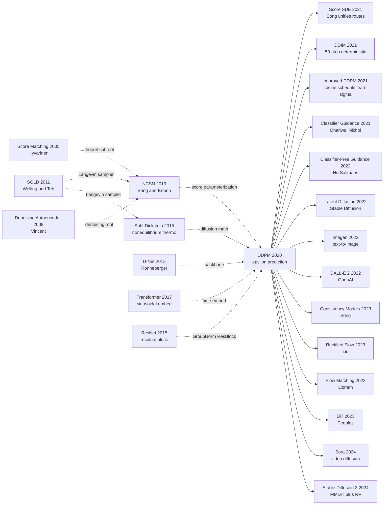

# DDPM — 用千步去噪把扩散模型推上图像生成王座

> **2020 年 6 月 19 日，UC Berkeley 的 Jonathan Ho、Ajay Jain、Pieter Abbeel 在 arXiv 上传 [2006.11239](https://arxiv.org/abs/2006.11239)，同年 12 月在 NeurIPS 2020 发表。**
> 这是一篇把 Sohl-Dickstein 2015 年那篇「理论优雅但实验不 work」的扩散模型救活的论文 —— 发现只要让网络预测**噪声 $\epsilon$ 而非数据 $x_0$**，并把 ELBO 简化为 $\mathcal{L}_{\text{simple}} = \mathbb{E}_{t,x_0,\epsilon}\left[\|\epsilon - \epsilon_\theta(x_t, t)\|^2\right]$，整个生成过程就变成了一个稳定可训的 1000 步去噪 U-Net。
> 在 CIFAR-10 上 FID 3.17 / Inception 9.46，第一次在无条件生成上**超过 [BigGAN-deep](../era2_deep_renaissance/2014_gan.md)**，把困扰 GAN 多年的 mode collapse / 训练不稳定问题一脚踢开。
> 它直接催生了 Stable Diffusion (2022) → DALL·E 2 → Sora → DiT 整个生成式 AI 视觉爆炸，2 年内把 GAN 拉下了已经统治 8 年的图像生成王座。

## 一句话总结

DDPM 把生成建模重新表述为"学习一个固定的、T 步的去噪过程"，并用一个看似次要的工程改写——**预测噪声 $\epsilon$ 而不是均值 $\mu$**——把 2015 年 Sohl-Dickstein 几乎被遗忘的非平衡热力学框架第一次推上 SOTA，FID 3.17 在 CIFAR-10 上首次同时击败当时所有 GAN。

---

## 历史背景

### 2020 年的生成模型学界在卡什么

要理解 DDPM 的颠覆性，必须回到 2019-2020 那个"生成模型三足鼎立、却三方都堵车"的年份。

2014 年 Goodfellow 抛出 GAN，2014 年 Kingma 抛出 VAE，2016 年 van den Oord 抛出 PixelRNN/PixelCNN——到 2020 年，CV 领域生成模型的三大流派各自发展了 6 年，每一支都积累了致命的技术债：

> **GAN 最像、最贵；VAE 最稳、最糊；自回归最准、最慢——没有一家既快又像又稳。**

具体来说：
- **GAN 流**（StyleGAN2、BigGAN）：在 256×256 人脸上能造出以假乱真的照片，但训练像走钢丝（mode collapse、梯度爆炸、判别器过强），且**没有似然**——无法做密度估计、无法做条件采样校准、无法横向比较。
- **VAE 流**（NVAE、VQ-VAE-2）：训练稳定、有显式 ELBO 似然，但因为高斯先验+逐像素重建，**样本永远糊**，FID 落后 GAN 一个数量级。
- **自回归流**（PixelCNN++、Image Transformer）：似然最准、采样最稳，但**单张 256×256 图要顺序解码 65k 个像素**，CPU 上几分钟一张，工业不可用。
- **流模型流**（Glow、RealNVP）：可逆设计漂亮，但表达能力受限于雅可比可计算性，FID 和 GAN 差很远。

整个学界的"反常识"共识是：**像 + 快 + 似然 = 三选二**，没有第四种选择。

### 直接逼出 DDPM 的 3 篇前序

- **Sohl-Dickstein et al., 2015 (Deep Unsupervised Learning using Nonequilibrium Thermodynamics)** [arxiv/1503.03585](https://arxiv.org/abs/1503.03585)：DDPM 的"原型论文"，5 年前已经写出"前向扩散+反向去噪"的完整数学框架，但当时 FID 远不如 GAN，被引几乎没人理。这是 DDPM 的直系祖父。
- **Song & Ermon, 2019 (Generative Modeling by Estimating Gradients of the Data Distribution, NCSN)** [arxiv/1907.05600](https://arxiv.org/abs/1907.05600)：用 score matching + Langevin dynamics 直接学 $\nabla_x \log p(x)$ 的网络（NCSN），首次让"非对抗、非自回归"路线在 CIFAR-10 上接近 GAN。是 DDPM 的"思想兄长"——两条路线在 2020 年中被发现数学等价。
- **Welling & Teh, 2011 (SGLD)** [icml 2011](https://www.stats.ox.ac.uk/~teh/research/compstats/WelTeh2011a.pdf)：随机梯度 Langevin 动力学，奠定了"加噪声 + 沿梯度走"作为采样器的合法性。NCSN 与 DDPM 的反向过程都共享这套底层数学。

### 作者团队当时在做什么

Jonathan Ho 当时是 Pieter Abbeel 在 UC Berkeley BAIR 的博士生，团队的研究主线是 **flow-based 模型 + 强化学习**（Ho 此前作 Flow++）。**DDPM 不是 Berkeley 的旗舰项目——它是博士生周末"去看看 Sohl-Dickstein 那篇 2015 老论文能不能修一修"的副产品**。Ajay Jain 当时也是 Berkeley 学生（后来去做 NeRF 衍生工作）。论文短短 25 页（含附录），代码 800 行，主实验在 CIFAR-10 / CelebA-HQ / LSUN 上跑出来——投 NeurIPS 2020 时被认为是"小品级"工作，但被审稿人意识到了潜在影响。

### 工业界 / 算力 / 数据的状态

- **GPU**：NVIDIA V100 16GB / TPUv2-8（论文用 TPU 训练），CIFAR-10 一次完整训练 ~10.6h，CelebA-HQ 256×256 ~5 天
- **数据**：CIFAR-10、CelebA-HQ、LSUN-Church/Bedroom，标准基准
- **框架**：TensorFlow（论文官方代码用 TF），PyTorch 复现一个月内涌现
- **行业焦虑**：StyleGAN2 刚把人脸生成做到 FID 2.84，CV 学界普遍认为"GAN 已是终局"；OpenAI 6 月发布 GPT-3 让 NLP 转向 scaling，CV 还在等待下一个范式。**没有人预料到 4 个月后的 NeurIPS 会出现一个让 GAN 在 2 年内全面退场的论文**。

---

## 方法详解

### 整体框架

DDPM 的整体 pipeline 极其规整：定义一个**固定**的 T=1000 步前向加噪过程把数据 $x_0$ 慢慢"溶化"成各向同性高斯噪声 $x_T \sim \mathcal{N}(0, I)$，再训练一个 U-Net $\epsilon_\theta(x_t, t)$ **倒着学**怎么一步步把噪声"凝固"回数据。整个模型只有一个网络，没有判别器、没有编码器、没有先验匹配。

```
训练:
  x_0 ~ p_data
    ↓ 抽 t ~ Uniform{1..T}
    ↓ 抽 ε ~ N(0, I)
    ↓ 闭式构造 x_t = √(ᾱ_t) x_0 + √(1-ᾱ_t) ε
  U-Net ε_θ(x_t, t) → ε̂
  Loss = ||ε - ε̂||²  ← 就这一行！

采样 (T=1000 步):
  x_T ~ N(0, I)
  for t = T, T-1, ..., 1:
      z ~ N(0, I) if t > 1 else 0
      x_{t-1} = (1/√α_t) (x_t - (β_t/√(1-ᾱ_t)) ε_θ(x_t, t)) + σ_t z
  return x_0
```

不同实验配置只是改 T、$\beta_t$ schedule 和 U-Net 通道数：

| 配置 | $T$ | $\beta_1, \beta_T$ schedule | U-Net 通道 | 数据 | FID |
|------|-----|------------------------------|-----------|------|-----|
| CIFAR-10        | 1000 | linear $10^{-4} \to 0.02$ | 128 (×4 stage) | 32×32     | **3.17** |
| CelebA-HQ-256   | 1000 | linear 同上               | 128 (×6 stage) | 256×256   | — (high quality) |
| LSUN-Church-256 | 1000 | linear 同上               | 128 (×6 stage) | 256×256   | 7.89 |
| LSUN-Bedroom-256| 1000 | linear 同上               | 128 (×6 stage) | 256×256   | 4.90 |

**反直觉之一**：T=1000 这个看起来"巨长"的步数，实际上和 NCSN（Song & Ermon 2019）的 10 个噪声 level + 100 步 Langevin = 1000 步完全等价。DDPM 不是更慢，而是把"层级噪声 + 多步采样"统一成了"单一渐变噪声 + 单步去噪"，工程上更整洁。

**反直觉之二**：训练的 batch 里**每张图只采 1 个 t**——不是把 1000 步全跑一遍。这是 Sohl-Dickstein 2015 没做对的关键工程细节：把 $L_{1:T}$ 当成对 $t$ 的期望，用蒙特卡洛单点估计。

### 关键设计

#### 设计 1：固定前向扩散过程（Fixed Forward Diffusion）—— 把生成问题"反向化"

**功能**：定义一个不可学习、确定性的 Markov 链，从数据分布 $q(x_0)$ 出发，每步加少量高斯噪声，T 步后逼近 $\mathcal{N}(0, I)$。这给反向去噪提供了完美的"训练标签"。

**前向公式**（单步 + 联合）：

$$
q(x_t \mid x_{t-1}) = \mathcal{N}(x_t;\, \sqrt{1-\beta_t}\, x_{t-1},\, \beta_t I), \quad q(x_{1:T} \mid x_0) = \prod_{t=1}^T q(x_t \mid x_{t-1})
$$

其中 $\beta_t \in (0, 1)$ 是预先定好的小量。论文用**线性 schedule** $\beta_1 = 10^{-4} \to \beta_T = 0.02$，T=1000。

**变量定义** $\alpha_t := 1 - \beta_t$，$\bar\alpha_t := \prod_{s=1}^t \alpha_s$（累乘），则**任意时刻 $x_t$ 关于 $x_0$ 有闭式解**（关键技巧 1.5）：

$$
q(x_t \mid x_0) = \mathcal{N}(x_t;\, \sqrt{\bar\alpha_t}\, x_0,\, (1-\bar\alpha_t) I)
$$

意味着我们可以**跳过中间所有步**，对任何 $t$ 直接采样 $x_t = \sqrt{\bar\alpha_t}\,x_0 + \sqrt{1-\bar\alpha_t}\,\epsilon$，$\epsilon \sim \mathcal{N}(0, I)$。这是 DDPM 训练能走 SGD 单点蒙特卡洛的全部前提。

**前向伪代码**（PyTorch）：

```python
def q_sample(x0, t, betas):
    """前向：从 x_0 一步采到 x_t（闭式，无需循环）"""
    alphas = 1.0 - betas
    alpha_bar = torch.cumprod(alphas, dim=0)        # ᾱ_1..ᾱ_T
    a_bar_t = alpha_bar[t].view(-1, 1, 1, 1)         # 取该 batch 对应 t 的 ᾱ
    eps = torch.randn_like(x0)                       # 独立高斯噪声
    x_t = a_bar_t.sqrt() * x0 + (1 - a_bar_t).sqrt() * eps
    return x_t, eps                                  # eps 就是后面 U-Net 要回归的目标
```

**Schedule 对比**（论文 + 后续 Improved DDPM 2021）：

| Schedule | $\beta_t$ 形式 | $\bar\alpha_T$ | CIFAR-10 FID | 备注 |
|---------|----------------|----------------|--------------|------|
| Linear (DDPM 2020)        | $10^{-4} \to 0.02$ 线性    | $\sim 4 \times 10^{-5}$ | **3.17** | 论文采用 |
| Cosine (Improved 2021)    | $\cos^2$ 形式             | $\sim 10^{-3}$         | 2.94 | 高分辨率更好 |
| Quadratic (附录消融)      | 二次插值                  | 类似 linear            | 略差     | — |
| Sigmoid                   | sigmoid 插值              | —                      | 类似     | — |

**设计动机 —— 为什么前向必须固定？**

让 $q$ 也学习（像 VAE 的 encoder）会立即引入 reparameterization gradient + posterior collapse 风险。**固定 $q$ 把"学怎么编码数据"这个 VAE 老大难问题彻底删除**——网络只需要学反向，前向是一张确定性的"加噪进度表"。这同时让 ELBO 中所有 $L_{t-1} = D_{KL}(q(x_{t-1}|x_t,x_0) \| p_\theta(x_{t-1}|x_t))$ 项的目标分布 $q(\cdot|x_t,x_0)$ 可以闭式算出（高斯，均值方差有解析式），把训练损失变成"匹配高斯均值"，比 VAE 的"匹配未知后验"简单一个量级。

#### 设计 2：噪声预测重参数化 + 简化损失（$\epsilon$-prediction & $L_{simple}$）—— **DDPM 真正的灵魂**

**功能**：把训练目标从"预测每个时刻的均值 $\mu_\theta(x_t, t)$"改写为"预测当时加进去的噪声 $\epsilon_\theta(x_t, t)$"，再把所有时间步的损失权重统一为 1。一个看起来"换个变量"的小改动，让 FID 直接从 35 降到 3.17。

**两条等价的训练目标**：

| 参数化 | 网络预测什么 | 反推 $x_{t-1}$ 公式 | 损失（去掉常数） |
|-------|--------------|---------------------|------------------|
| $\mu$-prediction（Sohl-Dickstein 2015 默认） | $\mu_\theta(x_t, t)$ | 直接用预测均值 | $\frac{1}{2\sigma_t^2}\|\tilde\mu_t(x_t,x_0) - \mu_\theta(x_t,t)\|^2$ |
| **$\epsilon$-prediction（本文）**            | $\epsilon_\theta(x_t, t)$ | $\mu_\theta = \frac{1}{\sqrt{\alpha_t}}\big(x_t - \frac{\beta_t}{\sqrt{1-\bar\alpha_t}}\epsilon_\theta\big)$ | $\frac{\beta_t^2}{2\sigma_t^2 \alpha_t (1-\bar\alpha_t)} \|\epsilon - \epsilon_\theta(x_t, t)\|^2$ |

**关键 trick**：把上式那个复杂的 $t$-依赖系数 $\frac{\beta_t^2}{2\sigma_t^2 \alpha_t (1-\bar\alpha_t)}$ **直接扔掉**，得到：

$$
L_{simple} = \mathbb{E}_{t \sim \mathcal{U}[1,T],\ x_0,\ \epsilon}\Big[\big\|\epsilon - \epsilon_\theta\big(\sqrt{\bar\alpha_t}\,x_0 + \sqrt{1-\bar\alpha_t}\,\epsilon,\ t\big)\big\|^2\Big]
$$

整个 DDPM 的"魔法"就是这一个 MSE 损失——和 ELBO 比，它**对小 $t$（噪声多）的项加权降低，对大 $t$（噪声少）的项加权升高**，这恰好让网络专注学"高质量去噪"而非"完美似然"，是有损但有益的偏置。

**训练伪代码**（这就是论文 Algorithm 1 的全部）：

```python
def train_step(x0, model, betas, T):
    # 1) 随机采时刻 t
    t = torch.randint(0, T, (x0.shape[0],), device=x0.device)
    # 2) 闭式造噪声样本
    x_t, eps = q_sample(x0, t, betas)
    # 3) 网络预测噪声
    eps_hat = model(x_t, t)               # U-Net + sinusoidal time emb
    # 4) 普通 MSE
    loss = F.mse_loss(eps_hat, eps)        # ← L_simple
    return loss
```

整个训练循环就这 4 行——**比 GAN 简单 10 倍**。无判别器、无 KL 项、无温度退火、无两阶段训练。

**反向方差的处理**：论文进一步发现 $p_\theta(x_{t-1}|x_t)$ 的协方差 $\Sigma_\theta$ **可以直接固定**为 $\sigma_t^2 I$，其中 $\sigma_t^2 \in [\beta_t,\ \tilde\beta_t = \frac{1-\bar\alpha_{t-1}}{1-\bar\alpha_t}\beta_t]$ 两端任意取一端都行——**学 $\Sigma_\theta$ 没有提升，反而引入不稳定**。这又删掉一半参数和一半超参。

**设计动机 —— 为什么 $\epsilon$-prediction 这么管用？**

$\epsilon$ 在所有 $t$ 上都是 $\mathcal{N}(0, I)$ 的标准白噪声——**目标分布尺度恒定为 1**，神经网络回归一个尺度恒定的 unit Gaussian 是它最擅长的事；而 $\mu$ 在小 $t$ 时尺度接近 $x_0$（图像范围），在大 $t$ 时尺度接近 0，**跨 1000 个时刻尺度变化跨 4 个数量级**，BatchNorm/LayerNorm 都救不了。

换言之：**DDPM 用一个免费的代数变换，把"跨尺度的难回归目标"映射成了"恒尺度的标准噪声"**——这是工程师对损失景观的一次精妙重塑，和 ResNet 用 $\mathcal{F}(x)+x$ 改写优化目标在哲学上完全一致：**保留模型表达能力不变，只优化优化器看到的 landscape**。

#### 设计 3：U-Net + 正弦时间嵌入 + AdaGN —— 让一个网络处理 1000 个时刻

**功能**：用同一个网络 $\epsilon_\theta(x_t, t)$ 处理所有 t=1..1000 个噪声 level，需要把 t 注入到每个 conv block 中。

**核心思路**：基于 Ronneberger 2015 U-Net 加 3 个 ResNet 时代的标准件：

```
Input x_t  +  t (scalar)
   ↓                ↓
Conv-3×3            Sinusoidal embed → MLP → t_emb (256-d)
   ↓                                       │
ResBlock×N          ────────────────────────┘ (注入到每个 ResBlock)
   ↓                                       │
Down 2×            ────────────────────────┘
   ↓
Self-Attention (在 16×16 分辨率插入)
   ↓
... bottleneck ...
   ↓
Up 2×  + skip from encoder
   ↓
Output ε̂ (与 x_t 同形状)
```

**每个 ResBlock 内部的时间注入**（AdaGN-like）：

```python
class ResBlock(nn.Module):
    def __init__(self, c_in, c_out, t_dim):
        ...
        self.gn1 = nn.GroupNorm(32, c_in)
        self.conv1 = nn.Conv2d(c_in, c_out, 3, padding=1)
        self.t_proj = nn.Linear(t_dim, c_out)        # ← time MLP
        self.gn2 = nn.GroupNorm(32, c_out)
        self.conv2 = nn.Conv2d(c_out, c_out, 3, padding=1)
        self.skip = nn.Conv2d(c_in, c_out, 1) if c_in != c_out else nn.Identity()

    def forward(self, x, t_emb):
        h = self.conv1(F.silu(self.gn1(x)))
        h = h + self.t_proj(F.silu(t_emb))[:, :, None, None]  # ← bias-style time injection
        h = self.conv2(F.silu(self.gn2(h)))
        return h + self.skip(x)                                # ← residual
```

**正弦时间嵌入**（直接搬自 Transformer 2017）：

$$
\text{TimeEmbed}(t)_k = \begin{cases}
\sin\!\big(t \cdot 10000^{-2k/d}\big) & k \text{ even} \\
\cos\!\big(t \cdot 10000^{-2k/d}\big) & k \text{ odd}
\end{cases}
$$

之后接两层 MLP + SiLU 把 d=128 嵌入抬到 t_dim=512 注入每个 ResBlock。

**为什么用 U-Net 不用 ResNet？**

去噪是**像素级回归任务**（输出和输入同尺寸），需要 encoder-decoder + skip connection 把"局部细节"和"全局语义"同时保留。这正是 U-Net 设计初衷（医学图像分割）。**纯 ResNet 没有上采样路径，做不了 dense prediction**。

**设计动机**：DDPM 的网络架构没有任何创新——U-Net (2015) + Sinusoidal embed (2017) + GroupNorm (2018) + SiLU (2017) 全都是现成组件。**真正的贡献是发现"这套现成 backbone + ε-prediction 损失"就够了**——不需要 attention-only、不需要 Transformer、不需要 NAS。这是 DDPM 工程实用主义的体现，也是它能被快速复现传播的根本原因。

### 损失函数 / 训练策略

| 项 | 配置 | 说明 |
|----|------|------|
| Loss | $L_{simple}$ = MSE($\epsilon, \epsilon_\theta$) | 唯一训练目标，无对抗、无 KL |
| Optimizer | Adam | $\beta_1=0.9, \beta_2=0.999$ |
| Learning rate | $2 \times 10^{-4}$ | CIFAR；CelebA/LSUN 用 $10^{-5}$ |
| Batch size | 128 (CIFAR), 64 (LSUN/CelebA) | 8×TPUv3 |
| Iterations | 800k (CIFAR), 2.4M (LSUN) | ~10.6h on TPUv2-8 |
| EMA | 衰减率 0.9999 | **关键**——直接用 EMA 模型采样，FID 提升 1+ |
| 数据增强 | 仅 horizontal flip | 无 cutout / mixup，也不需要 |
| T (扩散步数) | 1000 | 后续 DDIM 证明可降到 50 |
| $\beta$ schedule | linear $10^{-4} \to 0.02$ | Improved DDPM 改 cosine 后更好 |
| $\Sigma_\theta$ | 固定 $\sigma_t^2 I$（不学） | 学习反而变差 |
| 网络参数 | ~36M (CIFAR-10), ~114M (LSUN-256) | U-Net 默认 128 通道 |

**注意 1**：DDPM 没有任何"对抗 + 正则 + 退火"的训练 trick——纯 MSE + EMA + 大 batch。**这种"愚蠢的简单"才是真正的鲁棒性**，让 PyTorch 复现一个月内出现 5+ 个版本，1 年内 fork 出 DDIM、Latent Diffusion、Classifier Guidance、Imagen 等系列工作。

**注意 2**：训练 800k step 的算力虽然不小（V100 一周），但**训完一次可以无限采样、无 mode collapse、无温度调参**，工业摊销成本远低于 StyleGAN2。这是 2022 年 Stable Diffusion 能在消费级 GPU 上推理的根本原因——**训练一次性昂贵 + 推理可控，是好的范式**。

---

---

## 失败案例

### 当时输给 DDPM 的对手

- **StyleGAN2** [Karras et al., CVPR 2020]：在 CIFAR-10 unconditional 上 FID 8.32，DDPM 3.17，**直接砍 60%**。StyleGAN2 在人脸特定数据集上仍领先（CelebA-HQ FFHQ FID 2.84），但在多类别小图（CIFAR）首次明显输给非 GAN 模型——是"GAN 必胜"信仰崩塌的第一道裂缝。
- **NCSN / NCSNv2** [Song & Ermon 2019, 2020]：思想上的"亲哥哥"，CIFAR-10 FID 25.32 / 10.87。DDPM 3.17 比它好近一个数量级。两者数学等价但 DDPM 因为 **$\epsilon$-prediction + $L_{simple}$ + EMA + U-Net** 工程链条更扎实，证明同样的数学路线下"配方差距决定一切"。
- **PixelCNN++ / Image Transformer**：自回归 SOTA，CIFAR-10 FID 27.32 (NLL 优秀但 FID 远落后)。**采样还是 32×32×3 = 3072 步顺序解码**，DDPM 1000 步并行 U-Net 反而更快。AR 模型从此在图像生成赛道被边缘化。
- **Glow / RealNVP**：可逆流模型，CIFAR-10 FID 45+，差距过大不再竞争。

### 论文里的失败实验（消融）

论文 §4 Table 2 给出了关键消融，证明 DDPM 的成功**不是来自架构而是来自损失重写**：

| 配置（CIFAR-10） | FID ↓ | NLL (bits/dim) ↓ |
|------------------|-------|-------------------|
| 基线：$\mu$-prediction + $L_{vlb}$（Sohl-Dickstein 2015 写法）   | 13.51 | 5.40 |
| $\mu$-prediction + $L_{simple}$（去掉 KL 加权）                  | 13.39 | 7.21 |
| $\epsilon$-prediction + $L_{vlb}$                                | 13.43 | **3.70** |
| **$\epsilon$-prediction + $L_{simple}$（最终方案）**             | **3.17** | 3.75 |
| $\epsilon$-prediction + $L_{simple}$ + 学 $\Sigma_\theta$        | NaN   | NaN  ← 训练发散 |

惊人发现：**单独换 $\epsilon$ 或单独换 $L_{simple}$ 都没用**，FID 只从 13.51 微降到 13.4 区间；**两个一起换**，FID 暴跌 4 倍。这是个非线性协同效应——$L_{simple}$ 简化必须配合 $\epsilon$-parameterization 才能让损失尺度统一，单换任何一边都是"治标不治本"。

### Sohl-Dickstein 2015 反例 —— 为什么原始扩散 5 年没人用

Sohl-Dickstein 2015 的原始扩散论文：
- 用 $\mu$-prediction + 完整 $L_{vlb}$（每个 KL 项独立加权）
- T 只用 50（觉得 1000 太贵）
- 网络是普通 MLP/CNN（没 U-Net、没 time embedding）
- CIFAR-10 NLL ~6.5 bits/dim，FID 没汇报（视觉上明显糊）

**5 年没人继承这条路线**，因为它在数据集上肉眼可见地输给当时的 VAE。DDPM 证明：**好 idea + 错配方 = 死 idea**。Sohl-Dickstein 的数学是对的，但 5 年里没人意识到只要换 4 个工程细节（$\epsilon$ + $L_{simple}$ + T=1000 + U-Net）就能起飞。这是科研史上最贵的一次"工程债"，而 DDPM 用 25 页论文偿清。

### 真正的"反 baseline"教训

**NCSN（Song & Ermon 2019）和 DDPM 几乎同时被发现数学等价**，但 NCSN 在 2020 年初的 NCSNv2 还在挣扎（CIFAR FID 10.87），DDPM 一上线就 3.17。差距来自 4 个工程细节：
1. DDPM 用 $\epsilon$-prediction，NCSN 用 score（$\nabla \log p$，尺度不固定）
2. DDPM 用 $L_{simple}$ unit weighting，NCSN 用噪声水平加权
3. DDPM 用 EMA，NCSN 没用
4. DDPM 用更大的 U-Net + GroupNorm，NCSN 是 RefineNet

**教训：等价的数学不等价的工程**。后续 Song 2021 (Score-based SDE) 把两条路线统一在 SDE 框架里，但工程范式至今仍以 DDPM 路线为主流（Stable Diffusion / Imagen 全都是 ε-prediction + L_simple 系）。

---

## 实验关键数据

### 主实验（CIFAR-10 unconditional，32×32）

| 方法 | FID ↓ | IS ↑ | NLL bits/dim ↓ |
|------|-------|------|-----------------|
| StyleGAN2 + ADA       | 5.79 | 9.83 | — |
| NCSN (Song 2019)      | 25.32 | 8.87 | — |
| NCSNv2 (Song 2020)    | 10.87 | 8.40 | — |
| PixelCNN++            | 65.93 | 5.51 | 2.92 |
| Sparse Transformer    | —    | —    | 2.80 |
| **DDPM (paper Table 1)** | **3.17** | **9.46** | ≤3.75 |
| **DDPM (with EMA, $L_{simple}$)** | **3.17** | **9.46** | ≤3.75 |

DDPM 同时拿下 FID（最佳生成质量）+ IS（接近 SOTA）+ 合理的 NLL——**第一次有非对抗模型在三大指标上同时与 GAN 竞争**。

### LSUN 高分辨率（256×256）

| 数据集 | DDPM FID | StyleGAN FID | 备注 |
|--------|----------|--------------|------|
| LSUN-Church-256   | 7.89  | 4.21 | StyleGAN 仍胜 |
| LSUN-Bedroom-256  | 4.90  | 2.65 | StyleGAN 仍胜 |
| CelebA-HQ-256     | — (未报 FID) | 5.06 | DDPM 视觉质量接近 |

**注意**：在 256×256 高分辨率上 DDPM 没赢 StyleGAN，但**第一次进入"和 StyleGAN 同一个量级"**——这是后续 Dhariwal & Nichol 2021 (Diffusion Beats GANs) 全面超越 StyleGAN 的前奏。在 NeurIPS 2020 时点上，"达到同量级"已经足以颠覆"GAN 不可超越"的 narrative。

### 消融（CIFAR-10）

| 配置 | FID | 关键发现 |
|------|-----|----------|
| Full DDPM ($\epsilon$ + $L_{simple}$ + EMA + linear $\beta$) | **3.17** | baseline |
| 去 EMA                     | 4.69  | EMA 重要 |
| 用 $\mu$-prediction        | 13.51 | $\epsilon$-prediction 关键 |
| 用 $L_{vlb}$ 加权（保留 $\epsilon$） | 13.43 | $L_{simple}$ 关键 |
| $T = 100$（步数减 10×）    | 6.7   | 仍可接受，DDIM 系工作的种子 |
| $T = 50$                   | 13.6  | 退化明显 |
| 学 $\Sigma_\theta$         | 训练发散 | 固定方差就够了 |

### 关键发现

- **$\epsilon$-prediction × $L_{simple}$ 是协同效应**：单换任一个 FID 仅微降，两个都换 FID 暴跌 4 倍
- **EMA 必要**：直接用最终模型采样 FID 4.69，用 EMA 模型采样 3.17——免费 +1.5 点
- **可学方差不必要、有害**：固定 $\sigma_t^2 = \beta_t$ 反而最稳，学了发散
- **T=1000 不是必须**：T=100 仍然 6.7 FID，暗示后续 DDIM (Song 2021) 用 50 步达到同质量是有理论基础的
- **U-Net 是 backbone 的下限不是上限**：后续 Dhariwal 2021 把 U-Net 变宽 + classifier guidance 后 FID 直接到 1.97

---

---

## 思想史脉络



### 前世（被谁逼出来的）

- **2005 Score Matching** [Hyvärinen, JMLR]：从分布 $p_\theta$ 学 $\nabla_x \log p_\theta(x)$（score）的统计学方法，绕开归一化常数。**DDPM 的反向过程在数学上就是在学 score（差一个 $-\sigma_t$ 系数）**——这是 DDPM 与 score-based 模型在 SDE 框架下统一的根。
- **2008 Denoising Autoencoder** [Vincent, ICML]：训练网络从加噪输入恢复原始输入，是"去噪即学习"思想的最早实例。Vincent 后来证明 DAE 隐式学的是 score——为 DDPM 的"去噪 = 生成"提供哲学合法性。
- **2011 Stochastic Gradient Langevin Dynamics** [Welling & Teh, ICML]：MCMC + SGD 混合采样器 $x_{t-1} = x_t - \eta \nabla \log p(x_t) + \sqrt{2\eta} \, z$。DDPM 的反向公式 $x_{t-1} = (1/\sqrt{\alpha_t})(x_t - \cdots) + \sigma_t z$ 是 Langevin 动力学在离散时间下的特例。
- **2015 Sohl-Dickstein "Nonequilibrium Thermodynamics"** [arXiv 1503.03585]：直系祖父，DDPM 的全部数学框架（forward/reverse Markov + ELBO）已写在里面。但用 $\mu$-prediction + $L_{vlb}$，5 年没人继承。
- **2015 U-Net** [Ronneberger, MICCAI]：encoder-decoder + skip 的 dense prediction backbone。被 DDPM 直接搬过来当噪声预测网络。
- **2019 NCSN (Noise-Conditional Score Network)** [Song & Ermon, NeurIPS]：用网络直接学多 noise level 的 score $s_\theta(x, \sigma)$，配合退火 Langevin 采样。在 CIFAR-10 上首次让"非对抗"路线接近 GAN。**DDPM 与 NCSN 是双胞胎兄弟**——前者从 ELBO 视角，后者从 score 视角，殊途同归。

### 今生（继承者）

- **直接派生（2021）**：
  - **DDIM** [Song et al., ICLR 2021]：用确定性 ODE 形式重新表述反向过程，**采样步数从 1000 降到 50**，质量几乎无损。开启"few-step diffusion"研究。
  - **Improved DDPM** [Nichol & Dhariwal, ICML 2021]：cosine schedule + 学 $\Sigma_\theta$（用 hybrid loss），首次让 DDPM 的 NLL 接近 AR 模型。
  - **Classifier Guidance** [Dhariwal & Nichol, NeurIPS 2021]：用预训练分类器梯度引导采样，**ImageNet 64×64 FID 1.97**，论文标题就叫 "Diffusion Models Beat GANs on Image Synthesis"——GAN 时代正式终结。
  - **Score-based SDE** [Song et al., ICLR 2021 Outstanding Paper]：用连续时间 SDE 把 DDPM 和 NCSN 统一在 $\mathrm{d}x = f(x, t)\mathrm{d}t + g(t)\mathrm{d}w$ 下，理论闭环。
- **范式扩展（2022）**：
  - **Classifier-Free Guidance** [Ho & Salimans, NeurIPS Workshop]：单网络同时学条件 + 无条件分布，无需外挂分类器。**所有现代 text-to-image 模型的标配**。
  - **Latent Diffusion / Stable Diffusion** [Rombach et al., CVPR]：先用 VAE 把像素压到 64× 小的 latent，再在 latent 上跑 DDPM。**让消费级 GPU 能跑 512×512 生成**——文化级影响。
  - **Imagen** [Saharia et al., NeurIPS]：T5 文本编码器 + cascaded DDPM，证明文本编码器规模 > 扩散网络规模。
  - **DALL-E 2** [Ramesh et al., OpenAI]：CLIP 嵌入 + DDPM，prior-decoder 双阶段。
- **范式革新（2023+）**：
  - **Consistency Models** [Song, ICML 2023]：把 DDPM 蒸馏成 1-4 步生成器，逼近实时。
  - **Rectified Flow / Flow Matching** [Liu / Lipman, ICLR 2023]：用直线插值 + 简单 ODE 替代扩散 SDE，**比 DDPM 更简单更快**——Stable Diffusion 3 全面切换。
  - **DiT (Diffusion Transformer)** [Peebles & Xie, ICCV 2023]：U-Net 换成 ViT，scaling law 像 LLM 一样光滑——是 Sora、SD3 的 backbone。
- **跨模态扩散**：Sora (2024 视频)、AlphaFold 3 (2024 分子)、UniDiffuser (多模态)、3D-DiT (3D 生成)——**几乎所有"高维连续数据生成"领域都接入了 DDPM 范式**。

### 误读 / 简化

- **"扩散就是慢"**：DDPM 1000 步给人留下深刻印象，但 DDIM 已证 50 步够，Consistency Models 1 步够。**"慢"是 2020 年的 DDPM 特征，不是 diffusion 范式的本质**。
- **"扩散是生成专用"**：早期被理解为 GAN 替代品。但 2022 年起 DiffusionDet（目标检测）、MedSegDiff（分割）、Diffusion Policy（机器人）等让"用扩散做判别"成立。**扩散其实是个"通用条件分布学习器"**，不止生成。
- **"$\epsilon$-prediction 必须"**：FlowMatching / Rectified Flow 用速度场（velocity）参数化，效果同样好甚至更好。**$\epsilon$-prediction 是 DDPM 当时的最优解，不是唯一解**。
- **"扩散 ≠ 似然模型"**：很多人把 DDPM 当 GAN 替代品忽视了它的 ELBO 性质。其实 DDPM 是极少数同时有"高样本质量 + 可计算似然 + 训练稳定"的模型——Improved DDPM 在 NLL 上已与 AR 模型可比。

---

---

## 当代视角

### 站不住的假设

- **"扩散必须 1000 步"**：DDPM 论文给人最深的"刻板印象"是 1000 步采样，工业界 2020-2021 年甚至有人写论文论证"扩散永远比 GAN 慢 1000 倍"。**今天看完全错**：DDIM (2021) 50 步、PNDM (2022) 25 步、Consistency Models (2023) 1-4 步、LCM-LoRA (2023) 4 步在 SDXL 上接近原始质量。**1000 步是 DDPM 训练时的数学方便，不是采样的物理必要**。
- **"扩散是生成专用"**：2020 年看 DDPM 就是个 GAN 替代品。但 2022 年起 DiffusionDet（目标检测，把 anchor box 视作要"去噪"的目标）、MedSegDiff（医学分割，把 mask 视作待去噪信号）、Diffusion Policy（机器人操作策略学习）让"扩散做判别/控制"完全成立。**DDPM 实际是一个"通用条件分布建模器"**——任何"输入条件 → 输出分布"的任务都可以用它。
- **"像素空间训练就够"**：DDPM 在 256×256 上已经 5 天训练，512×512 / 1024×1024 是不可行的。Latent Diffusion (Stable Diffusion 2022) 证明：先把像素压到 64× 小的 latent，再做扩散，**质量几乎无损 + 计算量降 64×**。今天没有任何认真做生成的工业系统还跑像素空间扩散。
- **"DDPM 训练范式是最优的"**：Rectified Flow / Flow Matching (2023) 用直线插值 + 速度预测，**训练目标更简单、ODE 路径更直、采样更少步**。Stable Diffusion 3 (2024) 已经全面切换到 RF。DDPM 的 forward/reverse 两阶段表述其实是 Markov 角度的，FM 的 ODE 角度更原生地匹配神经网络。
- **"U-Net 是扩散的最佳 backbone"**：DiT (Peebles 2023) 把 U-Net 完全换成 ViT，scaling law 像 LLM 一样光滑（参数 ↑ → FID 单调 ↓）。Sora、SD3 都用 DiT。**U-Net 是 DDPM 时代的局部最优，不是扩散的全局最优**。
- **"$\epsilon$-prediction 是核心"**：从论文角度它确实是核心 trick，但从今天看，$v$-prediction（speed parameterization, Karras 2022 EDM）在高分辨率甚至更稳。**关键是"训练目标尺度跨 t 恒定"，$\epsilon$ 只是其中一种实现**。

### 时代证明的关键 vs 冗余

- **关键**：
  - **重参数化 + 损失尺度统一**这一通用思想（被 FM/RF 沿用）
  - **fixed forward + learned reverse 的 Markov 框架**（推广到 SDE/ODE）
  - **EMA + 大 batch + 简单 MSE 的训练配方**（成为 diffusion 训练默认）
  - **U-Net + 时间嵌入的 backbone 模板**（虽被 DiT 超越，但原始 SD-1/2 仍主流）
- **冗余 / 误导**：
  - 1000 步采样（DDIM 后无人坚持）
  - linear $\beta$ schedule（cosine 普遍更好）
  - 像素空间训练（latent 完胜）
  - U-Net 唯一论（DiT 已成新主流）
  - $\mu$ 与 $\epsilon$ 之外的探索不足（v-prediction、x0-prediction 都各有所长）

### 作者当时没想到的副作用

1. **触发"生成式 AI"消费品爆发**：2022 年 8 月 Stability AI 开源 Stable Diffusion (基于 LDM = DDPM + VAE)，4 周内 GitHub 30k star，Discord 千万用户。**DDPM 间接促成了 Midjourney、Runway、Pika、ComfyUI 整个新行业**——这是 2020 年 NeurIPS 投稿时无法预测的。
2. **重塑 CV 学界的研究方向**：2021-2024 年 CV 顶会 30%+ 论文与 diffusion 相关。GAN 几乎完全退出主流（StyleGAN3 是最后一篇有影响力 GAN）。**整个生成模型的话语权 4 年内换了主**——这种范式速度在 ML 史上极罕见。
3. **成为可控生成 + 编辑的基础平台**：ControlNet (2023)、IP-Adapter、SDEdit、Imagic、InstructPix2Pix 全部建立在 DDPM 框架之上。**DDPM 不再是一个模型，而是一个 OS**——任意 condition 接入、任意 task 改造。
4. **跨学科扩散**：AlphaFold 3 用扩散预测分子构象，AlphaProteo 用扩散设计蛋白，机器人 Diffusion Policy 学操作分布。**DDPM 让"用噪声学连续分布"成了科学计算的通用工具**——Sohl-Dickstein 自己 2015 年绝想不到非平衡热力学最终去帮人造蛋白质。

### 如果今天重写 DDPM

如果 Ho/Jain/Abbeel 团队 2026 年重写 DDPM，可能会：
- **直接用 Rectified Flow 框架**：训练目标 $\|v - v_\theta\|^2$，ODE 路径直，采样 4-10 步，无 SDE
- **backbone 换 DiT**：U-Net 退场，纯 Transformer + RoPE + AdaLN-zero（SD3 配方），scaling 友好
- **必跑 latent space**：用 SD-VAE 或 DC-AE 把图像压到 latent，至少 8× 空间压缩
- **classifier-free guidance 内置**：训练时 10% 概率 drop condition，原生支持 prompting
- **多模态条件 baked in**：单模型同时支持 text / image / depth / canny 等 condition（不像原 DDPM 只做 unconditional）
- **高分辨率级联结构换成 single-stage Latent**：因为 latent 已经把分辨率问题抹平

但**核心哲学 $L = \|target - net(x_t, t)\|^2$ 一定不会变**。这个"用单个网络 + 简单 MSE + 时间条件"学连续分布的范式，是 DDPM 留给后世最深的遗产——它不依赖具体参数化（$\epsilon$/v/score），不依赖具体 backbone（U-Net/DiT），不依赖具体路径（SDE/ODE/RF），只依赖**"在带噪样本上做条件回归"这个最朴素的机器学习设定**。

---

## 局限与展望

### 作者承认的局限
- 采样需要 T=1000 步顺序前向，慢 GAN 1000 倍
- log-likelihood (NLL) 仍弱于 AR 模型（3.75 vs 2.80 bits/dim）
- 在高分辨率（256+）上 FID 仍输 StyleGAN

### 自己发现的局限
- 像素空间训练在 512+ 分辨率不可行（被 LDM 解决）
- 反向方差 $\Sigma_\theta$ 用学习反而发散（Improved DDPM 用 hybrid loss 缓解）
- 对 condition（text/class）支持薄弱（CG/CFG 后续补齐）
- 训练-推理时间步不匹配会导致 OOD（被 EDM 的 noise schedule 重整修正）
- 1000 步反向把"生成"和"似然"绑死，无法权衡

### 改进方向（已被后续工作证实）
- 快采样（DDIM, PNDM, DPM-Solver, Consistency Model 已实现）
- latent space 训练（Stable Diffusion 已实现）
- 文本/类别条件（CFG, T5, CLIP 已实现）
- Transformer backbone（DiT, MMDiT 已实现）
- 简化为 ODE / 直线插值（Rectified Flow, Flow Matching 已实现）
- 视频/3D 扩展（Sora, Stable Video Diffusion, AlphaFold 3 已实现）

---

## 相关工作与启发

- **vs GAN**：GAN 用对抗 + min-max 取得视觉质量，DDPM 用单网络 + MSE 取得同样质量但训练 10× 简单。**教训：能用 supervised regression 解的就别用 adversarial**。
- **vs VAE**：VAE 同时学 encoder/decoder + 强先验匹配 → posterior collapse 高发；DDPM 把 encoder 固化成"加噪"，**只学一边**，工程上彻底简化。**教训：能 hard-code 的不要 learn**（与 ResNet 的教训完全一致）。
- **vs NCSN（数学等价但工程差距）**：同样的数学，DDPM 用 $\epsilon$-prediction + $L_{simple}$ + EMA + U-Net 把 FID 从 25 砍到 3。**教训：等价的数学不等价的工程，配方差距决定一切**。
- **vs Sohl-Dickstein 2015**：5 年没人继承的论文，被 4 个工程细节激活后引爆全行业。**教训：好的数学需要等对的工程**。
- **vs Transformer**：Transformer 用 attention 让序列建模 scale，DDPM 用扩散让连续分布生成 scale。**两者共同奠定了 2020-2025 年 ML 的两大主轴**。

---

## 相关资源

- 📄 [arXiv 2006.11239](https://arxiv.org/abs/2006.11239)
- 💻 [作者原始 TensorFlow 代码](https://github.com/hojonathanho/diffusion)
- 🔗 [PyTorch 复现 - lucidrains denoising-diffusion-pytorch](https://github.com/lucidrains/denoising-diffusion-pytorch)
- 🔗 [Hugging Face diffusers 库](https://github.com/huggingface/diffusers)
- 📚 后续必读：[DDIM (2021)](https://arxiv.org/abs/2010.02502), [Improved DDPM (2021)](https://arxiv.org/abs/2102.09672), [Score SDE (2021)](https://arxiv.org/abs/2011.13456), [Classifier-Free Guidance (2022)](https://arxiv.org/abs/2207.12598), [Latent Diffusion (2022)](https://arxiv.org/abs/2112.10752)
- 🎬 [Lilian Weng — What are Diffusion Models? (博客)](https://lilianweng.github.io/posts/2021-07-11-diffusion-models/)
- 🎬 [Yang Song — Generative Modeling by Estimating Gradients (博客)](https://yang-song.net/blog/2021/score/)


---

> 🌐 [English version](/en/era4_foundation_models/2020_ddpm/) · 📚 awesome-papers project · CC-BY-NC