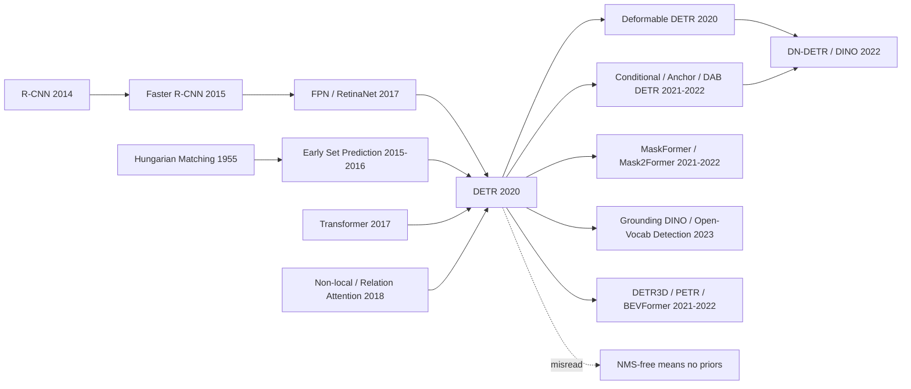

# DETR — 把目标检测改写成集合预测的 Transformer

> **2020 年 5 月 26 日，Facebook AI 的 Nicolas Carion、Francisco Massa、Gabriel Synnaeve、Nicolas Usunier、Alexander Kirillov、Sergey Zagoruyko 等 6 位作者把 [arXiv:2005.12872](https://arxiv.org/abs/2005.12872) 上传到网上。** 当时目标检测的日常语言还是 anchor、proposal、RoI、FPN、NMS；DETR 做了一件看起来近乎任性的事：把一张图里的物体当成一个无序集合，用 100 个 learned object queries 一次性吐出所有框，再用 Hungarian matching 让每个真值物体只认领一个预测。它没有在 COCO 上碾压 Faster R-CNN，甚至小目标明显更差；但它把检测从“调一堆后处理规则”改写成“端到端集合预测”，给后来 Deformable DETR、DINO、Mask2Former、Grounding DINO 和开放词表检测打开了同一扇门。

## 一句话总结

Carion 等 2020 年发表在 ECCV 的 DETR 把目标检测从 [R-CNN（2014）](../era2_deep_renaissance/2014_rcnn.md) 以来的“proposal / anchor / NMS 工程流水线”改写成一个集合预测问题：给定 $N=100$ 个 learned object queries，Transformer decoder 并行输出 $\hat{y}=\{(\hat{p}_i,\hat{b}_i)\}_{i=1}^{N}$，再用 $\hat{\sigma}=\arg\min_{\sigma}\sum_i \mathcal{L}_{match}(y_i,\hat{y}_{\sigma(i)})$ 做 Hungarian matching，保证每个真值框只匹配一个预测。它在 COCO 上以 41M 参数、86 GFLOPs 达到 42.0 AP，和增强版 Faster R-CNN-FPN+ 的 42.0 AP 打平；但同一张表也暴露了真正的代价：小目标 AP_S 低 5.5 点，大目标 AP_L 高 7.7 点，且需要 500 epoch 长训练。DETR 的历史意义不在“第一版就更强”，而在证明检测可以摆脱 anchor 和 NMS，沿着 [Transformer（2017）](../era3_attention/2017_transformer.md) 的端到端范式走向 Deformable DETR、DINO、Mask2Former 与 Grounding DINO。

---

## 历史背景

### 目标检测在 2020 年已经很强，但不像“端到端”

DETR 出现时，目标检测不是一个缺少强 baseline 的领域。恰恰相反，2015 年之后的检测系统已经高度成熟：Faster R-CNN 用 RPN 取代 selective search，FPN 解决多尺度特征，Mask R-CNN 把 box 扩展成 instance mask，RetinaNet 用 focal loss 让 one-stage detector 重新变得有竞争力，FCOS / CenterNet 又把 anchor-free 方案推到台前。COCO 上的 detector 已经能稳定产出可用结果，Detectron2 这类库也把训练、评测、部署流程封装得很完整。

但这种成熟有一个代价：检测系统越来越像“由深度网络驱动的专家系统”。一个典型 detector 里有 anchor 形状、anchor/ground truth 匹配规则、正负样本采样、RoIAlign、feature pyramid、box regression 参数化、score threshold、NMS 阈值、test-time augmentation 等组件。很多组件不可微，或者即使可微也不是由最终任务统一学习出来的。研究者常说 detection 是 end-to-end，但这个 end-to-end 往往只覆盖 backbone 和 head；proposal 分配、重复框合并、尺度处理仍然是手工规则在管。

DETR 的问题意识就从这里来：如果机器翻译可以从 phrase table 和 beam of hand-written features 走向 Transformer，目标检测是否也能从 anchor/proposal/NMS 走向一个统一可学习的映射？这不是为了少写几行代码，而是为了把 detection 的结构归纳偏置从“人为设计一套几何启发式”变成“让模型学习一组互相竞争的对象槽”。

### Transformer 热潮已经到了视觉门口

2017 年 Transformer 在 NLP 里证明了一个新的默认答案：只要把输入变成 token 序列，自注意力可以直接建模全局关系。2018-2020 年，BERT、GPT-2、RoBERTa、T5、GPT-3 把这个范式推向规模化；视觉领域也开始试探注意力机制，Non-local Networks、Attention Augmented Conv、Image Transformer 等工作都在说明“卷积不是唯一能处理图像的算子”。

但在 DETR 发表的 2020 年 5 月，ViT 还没有正式成为视觉 backbone 的共识，Swin Transformer 也还没有出现。把 Transformer 放进 detection pipeline 不是“顺手换个 backbone”，而是要回答更难的问题：图像里物体数量不固定，输出没有顺序，多个预测框可能高度重叠，评估指标又对定位误差非常敏感。NLP 的序列输出有自然顺序；检测的输出集合没有。

因此 DETR 的关键不是“用了 Transformer”，而是把 Transformer 的 parallel decoding 和一个 permutation-invariant 的集合损失接上。没有 Hungarian matching，100 个 object queries 只会产生一堆重复框；没有 decoder self-attention，查询之间不能互相抑制；没有 global encoder attention，模型难以在拥挤场景里区分实例。Transformer 在 DETR 里不是装饰，而是承接集合预测约束的结构部件。

### FAIR 团队的位置：Detectron 系统与 NLP 式统一

这篇论文的作者组合也很有意思。Francisco Massa 和 Alexander Kirillov 与 FAIR / Detectron 生态关系紧密，熟悉 Mask R-CNN、panoptic segmentation、COCO 评测和 detection 工程细节；Gabriel Synnaeve、Nicolas Usunier 则来自更广的序列建模和强化学习背景；Sergey Zagoruyko 曾在 residual networks、wide networks 和工程实现上有经验。换句话说，这不是一群 NLP 研究者直接闯入 CV，也不是 detection 社区内部再调一个 head，而是 FAIR 内部两种文化的接合：一边知道传统 detector 哪些部件难以替代，一边相信通用序列模型可以吃掉领域规则。

Meta 2020 年 5 月 27 日的官方博客也把 DETR 放在“让 NLP 和 computer vision 更统一”的叙事里。这个表述很重要：DETR 没有把自己包装成 COCO leaderboard paper，而是把自己包装成架构范式 paper。它愿意承认当时的小目标和训练效率问题，因为真正要争的是检测问题的表述方式。

### 论文真正要赌的命题

DETR 的赌注可以压缩成一句话：检测不一定要先枚举候选框，再删除重复框；检测可以直接输出一个集合。

这件事在数学上听起来很自然，在工程上却很危险。集合预测要同时解决三个困难：第一，输出顺序任意，loss 不能要求“第 7 个预测对应第 7 个物体”；第二，预测数量固定但真实物体数量变化，空槽必须学会输出 no-object；第三，重复预测必须在训练时就被惩罚，否则测试时仍然需要 NMS。DETR 用 Hungarian matching 把第一和第三个问题合在一起，用 no-object 类解决第二个问题，再用 Transformer decoder 的 object queries 承担“槽位之间互相沟通”的角色。

这也是为什么 DETR 的第一版性能曲线很别扭：大目标更好，小目标更差，训练很慢。它牺牲了 FPN 和 anchor 里大量人为注入的局部/尺度先验，换来一个更统一、更可扩展的形式。后来的 Deformable DETR、Conditional DETR、DAB-DETR、DN-DETR、DINO，本质上都是在回答同一个问题：能不能把被 DETR 丢掉的优化先验以更可学习、更少手工的方式加回来？

## 研究背景与动机

### 为什么研究动机不是“把 Transformer 塞进检测”

如果只把 DETR 理解成“Transformer 用于目标检测”，很容易低估它。2020 年前后，给 CNN detector 加一个 attention block 的工作已经不少，Relation Network、Non-local block、attention augmented convolution 都能提高一定性能。DETR 不满足于这种局部替换，因为只加 attention 仍然保留了原 detector 的中心假设：先生成大量候选，再用 NMS 处理重复。

DETR 真正想消掉的是 detection pipeline 里最顽固的三个非神经部件：anchor/proposal 先验、启发式 assignment、NMS 后处理。它的研究动机不是“Transformer 更强”，而是“Transformer decoder + set loss 是否足以承担原来由这些规则承担的结构约束”。这也是论文标题里的 End-to-End 的含义：不是所有层都可微这么简单，而是最终预测集合的生成、去重、类别/框选择都被同一个 loss 约束。

### 论文解决的三件事

第一，DETR 给检测提供了一个清楚的集合 loss：先用 Hungarian algorithm 在预测集合和真值集合之间做一对一匹配，再对匹配结果计算分类与框回归损失。这样训练时就已经知道“一个物体只能由一个 query 负责”，重复框不再靠测试时的 NMS 清理。

第二，DETR 把 object queries 变成 detector 的核心抽象。它们不是类别 embedding，也不是 anchor box，而是一组可学习的 slots。每个 query 通过 decoder self-attention 与其他 query 竞争，通过 cross-attention 看图像特征，最后决定自己是否输出物体。这个抽象后来几乎成为 query-based detection / segmentation 的共同语言。

第三，DETR 证明这种极简形式在 COCO 上不是玩具。R50 版本 42.0 AP 与增强 Faster R-CNN-FPN+ 打平，R101/DC5 版本继续提高，panoptic segmentation 也能用同一套 box decoder 加 mask head 扩展。这给后续研究一个明确坐标：第一代 DETR 的性能不是天花板，而是一个足够强的可替代起点。

---

## 方法详解

### 整体框架

DETR 的结构可以用一句话描述：**CNN 提局部视觉特征，Transformer 做全局集合推理，Hungarian loss 负责把无序预测集合和无序真值集合对齐。** 它不是把 Faster R-CNN 的某个模块替换成 Transformer，而是把整个检测流水线重新写成“图像到集合”的映射。

| 模块 | 输入 | 输出 | 作用 |
|------|------|------|------|
| CNN backbone | 图像 $x \in \mathbb{R}^{3\times H_0\times W_0}$ | feature map $f \in \mathbb{R}^{C\times H\times W}$ | 提取局部纹理、边缘、部件和高层语义 |
| 1x1 projection + positional encoding | $f$ | token sequence $z_0 \in \mathbb{R}^{HW\times d}$ | 把二维特征压到 Transformer 维度，并补回空间位置信息 |
| Transformer encoder | 图像 tokens | contextual image memory | 让每个位置看见全图，提前分离实例和上下文 |
| Transformer decoder | $N=100$ object queries + image memory | $N$ 个 object embeddings | 让查询之间竞争，并通过 cross-attention 读取图像 |
| FFN heads + Hungarian loss | object embeddings | class / box / no-object | 预测最终集合，并在训练时一对一匹配真值 |

这套 pipeline 的反直觉点在于：DETR 没有显式“候选框”。100 个 object queries 不是 100 个类别，也不是 100 个 anchor；它们更像 100 个可学习的空槽。每个槽可以选择负责一个物体，也可以输出 no-object。训练时 Hungarian matching 决定哪个槽负责哪个真值框；测试时直接保留非 no-object 槽，按分数排序即可，不需要 NMS。

与传统 detector 的差别可以更具体地看：

| 传统检测组件 | Faster R-CNN / RetinaNet 中的角色 | DETR 的替代方式 | 代价 |
|--------------|----------------------------------|----------------|------|
| Anchor / proposal | 给每个位置预设候选几何形状 | learned object queries + 绝对坐标回归 | 缺少强尺度先验，小目标吃亏 |
| Heuristic assignment | IoU 阈值或采样规则决定正负样本 | Hungarian 一对一全局匹配 | 早期训练信号稀疏 |
| NMS | 测试时删除重复框 | loss 已经惩罚重复匹配 | 依赖 decoder 层间通信学会互斥 |
| RoI crop / pooling | 对每个候选区域抽局部特征 | cross-attention 从全图 memory 读取 | 定位学习更难但更统一 |
| FPN 多尺度头 | 不同尺度特征检测不同大小物体 | 原版只用单尺度 stride-32 / DC5 stride-16 | 原版 AP_S 明显低 |

### 设计 1：Hungarian set loss —— 先匹配，再监督

**功能**：把检测从“每个 anchor 是否为正样本”改成“预测集合和真值集合之间的一对一最优匹配”。设真值集合为 $y=\{y_i\}_{i=1}^{M}$，预测集合为 $\hat{y}=\{\hat{y}_j\}_{j=1}^{N}$，其中 $N=100$ 且 $N>M$，真值集合用 no-object padding 到长度 $N$。DETR 先寻找代价最低的排列：

$$
\hat{\sigma}=\arg\min_{\sigma\in\Sigma_N}\sum_{i=1}^{N}\mathcal{L}_{match}(y_i,\hat{y}_{\sigma(i)})
$$

匹配完成后，再对每个匹配对计算 Hungarian loss：

$$
\mathcal{L}_{Hungarian}(y,\hat{y})=\sum_{i=1}^{N}\left[-\log \hat{p}_{\hat{\sigma}(i)}(c_i)+\mathbf{1}_{c_i\neq\varnothing}\mathcal{L}_{box}(b_i,\hat{b}_{\hat{\sigma}(i)})\right]
$$

这里 $\mathcal{L}_{box}$ 是 $\ell_1$ 与 generalized IoU 的线性组合；no-object 类的分类项会被降权 10 倍，避免 100 个槽里大多数为空导致类别不平衡。这个设计最重要的效果不是提高某个 AP 数字，而是**把重复框问题提前到训练阶段解决**。如果两个 query 都想预测同一个物体，Hungarian matching 只会让其中一个拿到真值监督，另一个会被推向 no-object 或其他对象。

一段极简训练伪代码如下：

```python
def detr_loss(pred_logits, pred_boxes, targets):
    cost_class = -pred_logits.softmax(-1)[:, targets.labels]
    cost_l1 = pairwise_l1(pred_boxes, targets.boxes)
    cost_giou = -generalized_iou(pred_boxes, targets.boxes)
    assignment = hungarian(cost_class + lambda_l1 * cost_l1 + lambda_giou * cost_giou)
    labels = make_no_object_labels(pred_logits, assignment, targets.labels)
    cls_loss = cross_entropy(pred_logits, labels, no_object_weight=0.1)
    box_loss = l1_and_giou(pred_boxes[assignment.pred], targets.boxes[assignment.gt])
    return cls_loss + box_loss
```

**设计动机**：传统 detector 的 assignment 是局部的：每个 anchor/proposal 根据 IoU 阈值独立决定正负。DETR 的 assignment 是全局的：所有预测槽一起竞争所有真值物体。这个全局竞争使得“集合里不要有重复元素”成为 loss 的一部分，而不是 NMS 的后处理补丁。

### 设计 2：Object queries —— 把“候选框”变成可学习槽位

DETR 的 object queries 常被误解成 anchor 的新名字。其实原版 DETR 的 queries 没有预设中心、宽高或类别，它们只是一组 learned positional embeddings。每个 query 进入 decoder 后，通过 self-attention 看其他 query，通过 cross-attention 看图像 memory，最后被 FFN 解码成类别与归一化框坐标。

$$
q_k^{(0)}=e_k,\quad q_k^{(l+1)}=\operatorname{DecoderLayer}(q_k^{(l)},\{q_m^{(l)}\}_{m=1}^{N},\operatorname{Encoder}(x)),\quad \hat{y}_k=\operatorname{FFN}(q_k^{(L)})
$$

这让 object queries 具备了两层含义。训练早期，它们只是可学习索引；训练后期，它们会形成一定的空间和尺度偏好。论文的 slot 分析显示，不同 query 会偏好不同区域和框形状，但不是硬编码类别：即使训练集中几乎没有“同一图里 24 只长颈鹿”的样本，模型仍能在合成图里找到大量同类实例，说明 query 没有简单记死“每类最多几个”。

| 解释角度 | object query 不是 | object query 更像 | 证据 |
|----------|------------------|------------------|------|
| 类别 | 不是 car/person/dog embedding | 可输出任意类别的检测槽 | 同一 query 可在不同图预测不同类 |
| 几何 | 不是固定 anchor box | 带有软空间/尺度偏好的槽位 | slot 可视化显示区域和框形态偏好 |
| 序列 | 不是第 k 个输出对象 | 无序集合中的一个候选元素 | Hungarian loss 对排列不敏感 |
| 后续演化 | 不是最终答案 | query-based detector 的起点 | DAB-DETR / DINO 把 query 改成动态 anchor box |

**设计动机**：object queries 的价值在于给集合预测一个可微接口。模型需要“最多 100 个物体”的容量，又不能先生成候选框。learned queries 正好提供固定计算图：100 个槽始终存在，loss 决定哪些槽被激活，decoder 决定槽之间如何协商。

### 设计 3：Transformer encoder-decoder —— 用全局注意力替代局部候选流程

DETR 的 encoder 先把 CNN 输出的 $H\times W$ 特征展平成 token 序列。因为 Transformer 本身对排列不敏感，必须加入空间 positional encoding；论文 ablation 显示完全不用空间位置会从 40.6 AP 掉到 32.8 AP，损失 7.8 点。encoder 的职责是让每个图像位置看见全局上下文，提前把实例边界和对象关系编码进 memory。

decoder 的职责更独特：它不是像机器翻译那样自回归生成第 1、2、3 个 token，而是在每层并行更新 100 个 queries。query 之间的 self-attention 让它们知道“别人已经看到了什么”，cross-attention 让它们去图像 memory 里取证。最后每层 decoder 后都加辅助损失，强迫中间层也学会预测对象；论文显示从第一层到最后一层 AP 累计提升 8.2 点。

注意力的核心计算仍是标准 Transformer：

$$
\operatorname{Attention}(Q,K,V)=\operatorname{softmax}\left(\frac{QK^\top}{\sqrt{d}}\right)V
$$

但 DETR 把 $Q$ 的语义改掉了：在 encoder 里 $Q$ 来自图像 token；在 decoder cross-attention 里 $Q$ 来自 object queries，$K,V$ 来自图像 memory。这一步把“找候选区域”的行为交给了 query-to-image attention。

| 组件 | 删除时的影响 | 说明 |
|------|--------------|------|
| Encoder layers | 0 层时 AP 36.7，6 层时 AP 40.6 | 全局图像推理主要改善中/大目标 |
| Spatial positional encoding | 完全不用时 AP 32.8 | 检测必须知道位置，纯内容 attention 不够 |
| Decoder depth | 第一层到最后一层 +8.2 AP | 多层 query 通信逐步消除重复预测 |
| FFN capacity | transformer FFN 变小会掉约 2.3 AP | token mixing 后仍需足够 per-token 变换 |

**设计动机**：传统 detector 通过 region proposal 明确告诉网络“看这里”。DETR 反过来：先让图像 token 互相交流，再让 object queries 自己学会看哪里。这更难训练，但一旦成功，检测就不再需要把“哪里可能有物体”写成外部规则。

### 设计 4：训练 recipe 与尺度代价 —— 简洁架构不是免费午餐

DETR 第一版最容易被忽略的一点是训练代价。论文短 schedule 是 300 epochs，主比较用 500 epochs；代码仓 README 里说单机 8 张 V100 训练 300 epochs 大约 6 天。相比 Faster R-CNN 的常规 1x/3x/9x schedule，DETR 需要更长时间才能让 queries 学会定位、分工和去重。

$$
\mathcal{L}_{box}(b,\hat{b})=\lambda_{L1}\lVert b-\hat{b}\rVert_1+\lambda_{giou}\mathcal{L}_{GIoU}(b,\hat{b})
$$

为什么这么慢？一个原因是监督稀疏。传统 dense detector 一张图会产生大量正负 anchors，每个局部位置都有训练信号；DETR 一张图通常只有几十个对象，100 个 queries 里大多数是 no-object。另一个原因是尺度先验少。FPN 天然给小目标高分辨率特征，原版 DETR 用 stride-32 单尺度特征，小目标信息在进入 Transformer 前已经丢了一部分。

| 版本 | GFLOPs / FPS | 参数 | AP | AP_S | AP_L | 观察 |
|------|--------------|------|----|------|------|------|
| Faster R-CNN-FPN+ R50 | 180 / 26 | 42M | 42.0 | 26.6 | 53.4 | 小目标强，规则多 |
| DETR R50 | 86 / 28 | 41M | 42.0 | 20.5 | 61.1 | 总 AP 打平，小目标弱，大目标强 |
| DETR-DC5 R50 | 187 / 12 | 41M | 43.3 | 22.5 | 61.1 | 提高分辨率，算力约翻倍 |
| DETR-DC5 R101 | 253 / 10 | 60M | 44.9 | 23.7 | 62.3 | 最强原版配置，仍落后小目标 |

**设计动机**：这些代价反而解释了 DETR 的影响力。它没有靠隐藏的工程技巧赢，而是把缺点暴露得很干净：慢收敛、弱小目标、稀疏匹配。后续三年 DETR 系列的核心进展，几乎都在补这三处：Deformable attention 补多尺度和收敛，conditional / anchor queries 补定位先验，denoising / hybrid matching 补稀疏监督。第一版 DETR 的价值，就是把问题重新摆成了一个可系统修补的形式。

---

## 失败案例

### Faster R-CNN：最强 baseline 没被打垮

DETR 最诚实的一点，是它没有把 Faster R-CNN 写成已经过时的稻草人。论文专门构造了增强版 Faster R-CNN baseline：同样的数据增强、更长的 9x schedule、GIoU loss，并用 Detectron2 里高度优化的实现。结果并不是“Transformer 一上来就全面碾压”：R50 版本 DETR 与 Faster R-CNN-FPN+ 都是 42.0 AP。

这件事很重要。它说明 DETR 的第一性贡献不是绝对精度，而是结构简化。传统 detector 的局部先验太强了，尤其是 FPN 对小目标、anchor/proposal 对定位初期训练、NMS 对重复框的处理，都在 COCO 上积累了多年工程优势。DETR 第一版把这些东西一次性拿掉，还能打平，已经足够说明 set prediction 有生命力。

| Baseline / 失败对象 | DETR 想替代什么 | 论文里的结果 | 留下的问题 |
|---------------------|----------------|--------------|------------|
| Faster R-CNN-FPN+ | proposal + RoI + FPN + NMS | R50 同为 42.0 AP | 小目标更强，训练更省 |
| Anchor-based one-stage | 大量默认框 + dense assignment | DETR 无 anchor 也能竞争 | dense detector 收敛更快 |
| Earlier set predictors | RNN 顺序输出框 | DETR 用并行 decoder 更有效 | 第一版仍需长训练 |
| Learnable / Soft NMS | 后处理学习化 | DETR 训练时消除重复 | 依赖 decoder 自注意力充分学习 |

### 早期 set prediction：概念对了，规模不够

DETR 并不是第一篇想把检测写成集合预测的论文。Stewart 等人的 End-to-End People Detection in Crowded Scenes、Romera-Paredes 的 Recurrent Instance Segmentation 都试过用 bipartite matching 或 recurrent decoder 输出一组实例。它们的问题不在想法，而在工程条件：数据集小、baseline 弱、decoder 顺序生成、模型表达能力不足，无法证明“这条路能在 COCO 级别竞争”。

DETR 从这些失败里继承了两个教训。第一，loss 必须 permutation-invariant，否则模型会被任意输出顺序干扰。第二，输出元素之间必须能交流，否则重复预测不可避免。它选择 Transformer decoder 而不是 RNN decoder，本质上就是把“一个一个吐框”换成“所有槽并行协商”。

### NMS 的失败与成功：最后一层不需要，早期层仍需要

DETR 论文对 NMS 的分析很漂亮。作者在不同 decoder 层输出上加标准 NMS：第一层时 NMS 有帮助，因为 query 之间还没有充分通信，重复框很多；到后面几层，self-attention 已经让 queries 互相抑制，NMS 的收益消失；最后一层加 NMS 反而会轻微降低 AP，因为它错误删掉了一些 true positive。

这不是“永远不需要 NMS”的简单口号，而是一个更细的结论：**只要 decoder 有足够层数和辅助损失，NMS 的功能可以被内部注意力学走。** 但这也意味着如果模型太浅、训练不足、query 设计不稳定，重复预测仍然会回来。后续的 DN-DETR、DINO 和 hybrid matching 之所以重要，就是因为它们让这种内部去重更容易学。

### 小目标：原版 DETR 最明显的短板

DETR 的失败案例里最硬的一项是小目标。R50 DETR 的 AP_S 是 20.5，而增强 Faster R-CNN-FPN+ 是 26.6；即使 DETR-DC5 把特征 stride 从 32 改到 16，AP_S 也只有 22.5。这个短板不是偶然误差，而是架构选择的直接后果：原版 DETR 缺少 FPN 式多尺度特征，CNN 输出在进入 Transformer 前已经把很多小物体细节压掉。

| 问题 | 表现 | 根因 | 后续修复 |
|------|------|------|----------|
| 小目标弱 | DETR R50 AP_S 20.5 vs FPN+ 26.6 | 单尺度 stride-32 特征 | Deformable DETR 多尺度 sparse attention |
| 收敛慢 | 主结果 500 epochs | 一对一匹配监督稀疏 | Conditional / DAB / DN / DINO |
| 查询语义不稳定 | 训练早期重复框多 | learned query 无几何先验 | anchor query / dynamic anchor box |
| 空槽多 | 100 slots 中多数 no-object | 类别极不平衡 | no-object 降权 + denoising queries |

这些失败没有削弱 DETR，反而让它变成一个研究平台。一个好范式的标志不是第一版没有缺点，而是缺点能被明确定位并系统修补。

## 实验关键数据

### COCO detection：总 AP 打平，误差结构换了

DETR 的主实验是 COCO 2017 detection。最重要的表不是最高 AP，而是 R50 对 R50 的比较：DETR R50 用 41M 参数、86 GFLOPs、28 FPS 达到 42.0 AP；Faster R-CNN-FPN+ R50 用 42M 参数、180 GFLOPs、26 FPS 也是 42.0 AP。DETR 的算力更低、速度相近，但误差结构完全不同：AP_S 低 6.1 点，AP_L 高 7.7 点。

| 模型 | GFLOPs / FPS | 参数 | AP | AP_S | AP_L |
|------|--------------|------|----|------|------|
| Faster R-CNN-FPN+ R50 | 180 / 26 | 42M | 42.0 | 26.6 | 53.4 |
| Faster R-CNN-R101-FPN+ | 246 / 20 | 60M | 44.0 | 27.2 | 56.0 |
| DETR R50 | 86 / 28 | 41M | 42.0 | 20.5 | 61.1 |
| DETR-DC5 R50 | 187 / 12 | 41M | 43.3 | 22.5 | 61.1 |
| DETR-DC5 R101 | 253 / 10 | 60M | 44.9 | 23.7 | 62.3 |

这张表的阅读方式应该是“范式替换的诊断图”。如果只看 AP，DETR 只是打平；如果看 AP_L，它证明全局注意力对大物体和上下文关系有优势；如果看 AP_S，它也证明 FPN 这样的多尺度先验不是可以随便丢掉的工程残留。

### Ablation：每个关键设计都真的在工作

论文的 ablation 说明 DETR 不是“把 Transformer 堆上去就好”。encoder 层数、位置编码、decoder 深度、GIoU、辅助损失都显著影响结果。尤其是“不用位置编码 AP 32.8”这条，直接反驳了一个常见误解：Transformer 并不会自动知道二维几何，位置必须被显式注入。

| Ablation | 结果 | 解释 |
|----------|------|------|
| Encoder 0 层 | AP 36.7，AP_L 54.2 | 缺少全局图像推理，大物体最受伤 |
| Encoder 6 层 | AP 40.6，AP_L 60.2 | 全局上下文帮助实例分离 |
| 无空间位置编码 | AP 32.8 | 检测任务必须保留位置 |
| 只有 L1 无 GIoU | AP 35.8 | 盒子尺度不变性不足 |
| GIoU + L1 | AP 40.6 | 两种 box loss 互补 |

这些数字说明 DETR 的简洁不是“少即是多”的审美姿态，而是把少数结构件压到足够关键的位置：集合匹配负责去重，位置编码负责几何，encoder 负责全局场景，decoder 负责槽位竞争，GIoU 负责定位质量。

### 训练与实现：简单代码，昂贵优化

DETR 的 repo 说 inference 可以写成 50 行 PyTorch，这句话很有传播力，也是真的有意义：没有 anchor generator、proposal sampler、RoIAlign、class-specific NMS 这些模块，理解一张图的前向流程确实更像普通神经网络。

但训练不是 50 行能轻松解决的问题。原版模型需要很长 schedule；短 schedule 300 epochs，主比较 500 epochs。仓库 README 写到单机 8 张 V100 训练 300 epochs 约 6 天；论文则报告 16 张 V100 上 300 epochs 约 3 天。也就是说，DETR 把推理/架构复杂度降了下来，却把一部分难度转移到了优化和训练时间上。

### Panoptic segmentation：集合预测自然扩展到 mask

DETR 的 panoptic 结果常被低估。论文不是只做 box detection，还展示了如何在 decoder 输出上加 mask head，把 thing 和 stuff 统一成一组 mask 预测。最终每个像素用 argmax 归属到某个 mask，因此天然不会有 overlapping mask 的后处理冲突。

| 模型 | Backbone | PQ | PQ_th | PQ_st | Mask AP |
|------|----------|----|-------|-------|---------|
| PanopticFPN++ | R50 | 42.4 | 49.2 | 32.3 | 37.7 |
| UPSNet-M | R50 | 43.0 | 48.9 | 34.1 | 34.3 |
| PanopticFPN++ | R101 | 44.1 | 51.0 | 33.6 | 39.7 |
| DETR R50 | R50 | 43.4 | 48.2 | 36.3 | 31.1 |
| DETR-R101 | R101 | 45.1 | 50.5 | 37.0 | 33.0 |

这里的有趣之处是：DETR 的 mask AP 对 thing 其实不高，却能在 PQ 上竞争甚至领先，尤其 PQ_st 更强。论文的解释是 global reasoning 对 stuff 类别很有帮助。这预示了后来的 MaskFormer / Mask2Former：segmentation 不必永远是 per-pixel classification，也可以是 query-to-mask set prediction。

---

## 思想史脉络

### 前世：从“候选区域”到“集合预测”

DETR 的前史有两条线。第一条是目标检测本身的工程演化：R-CNN 把 ImageNet CNN 特征带进 region proposals，Fast/Faster R-CNN 把共享特征和 proposal generation 学进网络，FPN/RetinaNet/FCOS 把多尺度和 dense detection 做到成熟。这条线的目标一直是“更准、更快、更少阶段”，但它并没有真正摆脱候选框和后处理。

第二条线是集合预测和注意力。Hungarian matching 很早就是 assignment 问题的标准工具；Stewart 等人的人群检测、Romera-Paredes 的 recurrent instance segmentation 都试过直接输出实例集合；Non-local Networks 和 Relation Networks 说明对象之间的关系可以用 attention-like 操作建模；Transformer 则给了一个可扩展的并行 decoder。DETR 的原创性在于把这两条线合起来：用 Transformer 处理对象槽之间的关系，用 Hungarian loss 处理集合排列和去重。

| 前序思想 | 代表工作 | DETR 继承了什么 | DETR 改掉了什么 |
|----------|----------|----------------|----------------|
| Region-based detection | R-CNN / Faster R-CNN | 强 COCO 评测、box/class head 传统 | 不再依赖 proposal 和 RoI crop |
| Dense one-stage detection | YOLO / SSD / RetinaNet / FCOS | 单次前向的效率目标 | 不再用 dense anchors 或 grid centers |
| Multi-scale feature prior | FPN / EfficientDet | 小目标需要尺度信息这一事实 | 第一版弱化了该先验，后续再补 |
| Set prediction loss | Stewart 2016 / recurrent instances | permutation-invariant matching | 从顺序 RNN 改成并行 Transformer |
| Global attention | Non-local / Transformer | 全局关系建模 | 把 attention 放到 detector 的核心输出结构 |

### 今生：DETR 家族如何修补第一版

DETR 之后最重要的后继几乎都不是“再加一个更大 backbone”，而是针对第一版的三个缺陷修补：慢收敛、小目标弱、query 缺少几何先验。

Deformable DETR 是最直接的修复。它让每个 query 只在少数采样点上做 multi-scale deformable attention，把全局 dense attention 改成稀疏可学习采样。这样既拿回 FPN 式尺度信息，又显著加快收敛。Conditional DETR、Anchor DETR、DAB-DETR 则围绕 query 的空间含义动刀：与其让 query 完全自由地学几何，不如把 reference point 或 dynamic anchor box 显式放进 query。DN-DETR / DINO 再进一步，用 denoising queries 和更强的 query selection 让训练不只依赖稀疏一对一匹配。

这一串工作说明一个微妙事实：DETR 丢掉的很多先验并不是“错的”，只是原来的实现太手工。后继工作的成功路线不是回到传统 detector，而是把尺度、位置、密集监督这些先验重新写成可学习模块。

### 横向影响：检测之外的 query-based 视觉

DETR 对 segmentation 的影响甚至比 box detection 更直接。MaskFormer 把语义分割改写成 mask classification：模型不再给每个像素独立分类，而是预测一组 mask queries，每个 query 负责一个区域。Mask2Former 用 masked attention 继续强化这条线，成为 semantic / instance / panoptic segmentation 的统一框架。这个转变和 DETR 的精神完全一致：输出是一组对象式元素，而不是每个像素或每个 anchor 的局部判断。

在开放词表检测里，GLIP、OWL-ViT、Grounding DINO 把 DETR / DINO 风格的 query detector 和文本对齐结合起来，让“检测某个词描述的对象”成为可能。在自动驾驶里，DETR3D、PETR、BEVFormer 把 queries 变成 3D reference points 或 BEV slots。到 2023-2025 年，query 已经从 DETR 论文里的 100 个检测槽，扩展成视觉系统里通用的“对象接口”。

### Mermaid 引用图



### 常见误读：NMS-free 不等于无先验

DETR 最常见的误读是“它证明先验都没用”。事实正相反：第一版 DETR 正是因为拿掉了太多先验，才暴露出小目标弱和收敛慢。真正的 lesson 不是“把所有规则删除”，而是“把规则重新写成训练目标和可学习结构”。Hungarian matching 仍然是强先验：它规定一个物体只能有一个匹配。object queries 仍然是强先验：它规定最多输出固定数量的槽。positional encoding 仍然是强先验：它告诉模型二维几何存在。

另一种误读是“DETR 是 Transformer 胜利”。更准确地说，DETR 是 set loss 与 Transformer decoder 的共同胜利。只换 Transformer backbone 不能自动去掉 NMS；只用 Hungarian loss 也不保证 query 之间能学会互斥。它的思想史位置在二者的交叉点上。

### 继承关系的一句话版本

R-CNN 家族证明了“检测可以靠深度特征”，FPN/RetinaNet/FCOS 把检测工程磨到高性能，Transformer 提供全局并行建模，Hungarian matching 提供集合监督。DETR 把这些线索合成一个新问题表述：**目标检测不是候选框筛选，而是对象集合生成。** 后来的 Deformable DETR 和 DINO 让这个表述变得高效，Mask2Former 和 Grounding DINO 则证明它不只属于 COCO boxes，而属于更广义的视觉对象建模。

---

## 当代视角

### 哪些假设站不住了

从 2026 年回看，DETR 最站得住的是问题重写，最站不住的是第一版实现里的几条隐含假设。

第一，**“纯 learned queries 足够”**并不完全成立。原版 object queries 很优雅，但收敛慢、定位语义不稳定。DAB-DETR、DINO 等后继把 reference point / dynamic anchor box 放回 query，说明几何先验仍然有价值，只是应该被写成可学习状态，而不是手工 anchor 列表。

第二，**“单尺度全局 attention 可以替代 FPN”**不成立。COCO AP_S 已经说明小目标需要高分辨率和多尺度路径；Deformable DETR 的成功进一步确认，query 需要在多尺度特征上进行稀疏采样，而不是只看 stride-32 memory。

第三，**“一对一匹配本身就足够高效”**也不成立。Hungarian matching 给了漂亮的集合定义，但监督太稀疏。DN-DETR、DINO、H-DETR 和 CO-DETR 通过 denoising、hybrid matching、辅助 one-to-many assignment 来增强训练信号，说明端到端形式需要更丰富的优化支架。

| 原版假设 | 2026 年判断 | 证据 | 现代修正 |
|----------|-------------|------|----------|
| learned queries 可从零学会几何 | 部分成立 | 能工作但慢收敛 | reference points / dynamic anchors |
| 单尺度 feature memory 足够 | 不成立 | AP_S 长期落后 | multi-scale deformable attention |
| NMS-free 就能去掉所有重复问题 | 部分成立 | 浅层仍有重复框 | deeper decoder + denoising + hybrid matching |
| 检测只需固定类别 softmax | 被扩展 | 开放词表需求上升 | text-conditioned detection / grounding |
| Transformer detector 主要是 box 模型 | 被扩展 | segmentation/query masks 更成功 | MaskFormer / Mask2Former / SAM pipelines |

### 如果今天重写 DETR

如果 2026 年重写 DETR，论文可能不会从 ResNet-50 + 单尺度 Transformer decoder 开始，而会采用更接近 DINO / Grounding DINO 的系统：强预训练 backbone，multi-scale deformable attention，reference-point queries，denoising training，混合 one-to-one / one-to-many assignment，再接文本条件或 mask head。

但值得强调的是，这样的“现代 DETR”并不是背叛原论文，而是把原论文提出的形式打磨到工业可用。核心仍然是集合输出：每个对象、mask 或文本短语由一个 query 表示；匹配和注意力决定这些 queries 如何分工；后处理规则尽量退到最少。

### 今天仍然值得学的 lesson

DETR 最值得保留的 lesson 是：**好的研究范式会把问题重新暴露出来。** 传统 detector 把重复框、小目标、多尺度、assignment、后处理都塞在不同模块里；DETR 把它们集中暴露在 set loss 和 query decoder 里。这样做第一版不一定更强，但它让后续改进有了清晰坐标。

第二个 lesson 是“简洁不等于无先验”。DETR 看起来简洁，是因为它把先验压缩成少数关键部件：Hungarian matching、no-object class、object queries、positional encoding、auxiliary losses。今天做新模型时，真正的问题不是“要不要先验”，而是“先验应该是不可学习规则，还是可学习结构”。

第三个 lesson 是“端到端不等于一次到位”。DETR 的端到端定义很美，但第一版训练成本高，小目标弱；后继工作花了三年才把它变成强 detector。这提醒我们：端到端范式通常先赢在问题表述，再赢在工程细节。

### 现代影响表

| 方向 | 继承 DETR 的部分 | 代表后继 | 改进点 |
|------|----------------|----------|--------|
| 高效检测 | set prediction + queries | Deformable DETR / DINO / RT-DETR | 多尺度、快速收敛、实时化 |
| 统一分割 | query-to-mask set prediction | MaskFormer / Mask2Former | semantic / instance / panoptic 统一 |
| 开放词表 | query detector + language grounding | GLIP / OWL-ViT / Grounding DINO | 文本条件类别与 phrase grounding |
| 自动驾驶 | object queries as 3D / BEV slots | DETR3D / PETR / BEVFormer | 多视角 3D 和时序 BEV 表示 |
| 交互式视觉 | 对象槽作为提示接口 | SAM pipelines with Grounding DINO | 检测、分割、文本提示串联 |

## 局限与展望

### 原版局限

DETR 的局限很明确。第一，小目标性能弱，核心原因是单尺度低分辨率特征；第二，收敛慢，核心原因是一对一匹配监督稀疏；第三，固定 100 queries 和固定 COCO 类别让它不适合开放世界；第四，Transformer 全局 attention 在高分辨率特征上成本高；第五，object queries 的解释性有限，虽然有空间偏好，但不是稳定的可控接口。

这些局限多数已经被后续工作部分解决，但没有完全消失。比如 Deformable DETR 加速了收敛，却引入更复杂的 attention sampling；DINO 变强了，但训练 recipe 也更重；Grounding DINO 扩展到文本，却依赖更大规模的预训练和数据清洗。DETR 的问题没有被“消灭”，只是从第一版的简洁模型移动到更大的系统工程里。

### 未来展望

未来 DETR-like 模型最值得看的方向有三条。第一是开放世界：query 不只输出 COCO 类别，而要和文本、mask、3D box、track id、关系一起对齐。第二是数据效率：如何在少标注或弱标注下训练稳定的 object queries，而不是依赖大规模 detection labels。第三是可控性：让 query 成为用户可指定、可编辑、可追踪的对象接口，而不是模型内部的隐变量。

如果这些方向继续推进，DETR 的最终影响可能不只是“让 detection 不用 NMS”，而是让视觉模型拥有一种统一的对象层 API：一组 slots 对应一组视觉实体，每个实体可以被分类、分割、跟踪、ground 到语言、放到 3D 空间里。

## 相关工作与启发

### 相关工作脉络

DETR 最直接的相关工作是 R-CNN/Faster R-CNN/FPN/RetinaNet/FCOS 这一整条检测线；更抽象的相关工作是 Transformer、Hungarian matching、set prediction、non-local attention。它的后继则分成几个家族：Deformable DETR 解决多尺度与收敛，Conditional/Anchor/DAB 解决 query 几何，DN/DINO 解决训练信号，MaskFormer/Mask2Former 把 query 迁移到 mask，Grounding DINO/GLIP 把 query 接到语言。

这条脉络给研究者的启发是：不要只问“能不能把某个通用架构塞进某个领域”，而要问“这个领域里哪些手工规则其实是在表达某种结构约束，能否用 loss 和 architecture 把约束学出来”。DETR 的成功不是 Transformer 的品牌胜利，而是重新表述任务的胜利。

### 对今天做研究的启发

第一，找一个被工程规则覆盖太久的任务，把规则背后的结构说清楚。第二，不要害怕第一版暴露缺点；只要缺点集中、可解释、可修补，范式就可能继续长。第三，评估新范式时不要只看 single number。DETR 的 42.0 AP 打平 baseline 看似平淡，但 AP_S/AP_L 的差异已经告诉后人该修哪里。

## 相关资源

### 推荐阅读

| 类型 | 资源 | 说明 |
|------|------|------|
| 论文 | [End-to-End Object Detection with Transformers](https://arxiv.org/abs/2005.12872) | 原始 arXiv / ECCV 2020 论文 |
| 代码 | [facebookresearch/detr](https://github.com/facebookresearch/detr) | 官方 PyTorch 代码、model zoo、Colab |
| 官方解读 | [Meta AI blog](https://ai.meta.com/blog/end-to-end-object-detection-with-transformers/) | 2020 年 5 月发布时的非技术阐释 |
| 关键后继 | [Deformable DETR](https://arxiv.org/abs/2010.04159) | 修复小目标与慢收敛的第一代核心后继 |
| 现代系统 | [Grounding DINO](https://arxiv.org/abs/2303.05499) | DETR/DINO 思路与文本 grounding 的代表 |

### 复现建议

如果只是理解 DETR，不建议从完整训练开始；先跑官方 Colab 或加载 torch hub 预训练模型，看 decoder attention 和 100 个 query 的输出。真正训练时，要从 Deformable DETR 或 DINO 的现代实现开始，因为原版 DETR 的 500 epoch schedule 对个人复现不友好。阅读顺序可以是：DETR 原文方法与 Table 1，Deformable DETR 的 multi-scale attention，DAB/DN/DINO 的 query 与 training trick，再看 Mask2Former / Grounding DINO 如何把 query 扩展到 mask 和语言。


---

> 🌐 [English version](/en/era4_foundation_models/2020_detr/) · 📚 awesome-papers project · CC-BY-NC