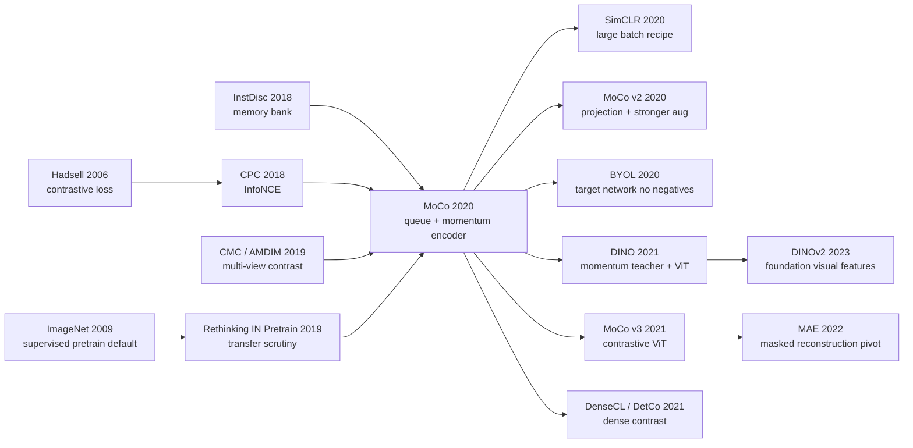

# MoCo：用队列和动量编码器，把视觉自监督从 pretext task 带向通用表示学习

> 2019 年 11 月，[MoCo](https://arxiv.org/abs/1911.05722) 把一个朴素问题问得很锋利：如果视觉对比学习本质上是在查字典，为什么字典非得等于一个 mini-batch，或者是一整套早已过期的 memory bank？Kaiming He、Haoqi Fan、Yuxin Wu、Saining Xie、Ross Girshick 等 5 位作者给出的答案，是一个 65,536 项的队列和一个 $m=0.999$ 的动量编码器。它没有发明新的 pretext task，却让无标签 ImageNet 表征在 VOC/COCO 等下游检测分割上超过监督预训练，悄悄把 CV 自监督的目标从“刷线性分类”改成了“可迁移的通用视觉表示”。

## 一句话总结

He、Fan、Wu、Xie、Girshick 等 5 位作者 2020 年发表在 CVPR 的 MoCo，把视觉对比学习重写成“动态字典查找”：query $q$ 只需在一个正例 $k_+$ 和 $K$ 个负例中做 $\mathcal{L}_q=-\log \frac{\exp(q\cdot k_+/\tau)}{\sum_i\exp(q\cdot k_i/\tau)}$，但字典由 FIFO queue 维护，key encoder 用 $\theta_k\leftarrow m\theta_k+(1-m)\theta_q$ 慢速更新。这个设计同时打掉了两个失败 baseline：end-to-end in-batch negatives 被 8×32GB V100 的 1024 batch 卡住，memory bank 虽能做大字典却因特征陈旧只到 58.0%；MoCo v1 用标准 ResNet-50、$K=65536$、$m=0.999$ 做到 ImageNet linear 60.6%，并在 VOC/COCO/LVIS/Cityscapes 的 7 个检测分割任务上超过监督预训练。它的反直觉点是：最重要的贡献不是一个新 pretext task，而是“字典足够大，同时足够一致”这个工程化约束；后续 [SimCLR](2020_simclr.md) 证明大 batch 可以替代队列，[MoCo v2](https://arxiv.org/abs/2003.04297) 吸收 projection head 和强增广冲到 71.1%，[MAE](2022_mae.md) 则由同一团队把问题转向 masked reconstruction。

---

## 历史背景

### 2019 年底：视觉自监督的“BERT 焦虑”

MoCo 出现时，NLP 已经被 BERT 改写。2018 年的 BERT 让“先在无标签数据上预训练，再拿少量标签适配下游任务”成为默认路线；CV 学界当然也想要自己的 BERT moment，但 2019 年的视觉自监督还没有给出足够硬的答案。

当时的 ImageNet 监督预训练仍是工业界最可靠的起点。检测、分割、姿态、长尾实例分割等任务里，大家默认先拿 ResNet 在 ImageNet-1k 上 supervised pretrain，再 fine-tune。问题是，这条路线天然受限于 1000 类标签空间：它学到的表征很强，但它仍然被“分类标签告诉你应该看哪里”这件事塑形。无标签图像规模远比有标签图像大，Instagram、Flickr、Web 图像都在爆炸式增长，CV 社区却缺少一个能稳定利用这些图像的通用机制。

MoCo 的历史位置就在这里：它没有宣称“视觉版 BERT”已经到来，却把最核心的基础设施补上了。它让对比学习从一组互不兼容的 pretext tricks，变成一个可以系统调参、可以迁移到检测分割、可以用更大无标签数据训练的表示学习框架。

### MoCo 之前的四条路线都不够稳

2014-2019 年的视觉自监督大致有四条路线。

- **Pretext task 路线**：context prediction、jigsaw、rotation、colorization。它们直觉漂亮，但往往把模型逼去解一个人为设计的小游戏，ImageNet linear 和下游迁移都弱。
- **生成式路线**：autoencoder、BiGAN、BigBiGAN。它们能重建或生成图像，但像素级目标太关心纹理和颜色，和识别语义之间有缝隙。
- **聚类路线**：DeepCluster、LocalAgg。它们能产生伪标签，但训练流程复杂，需要反复重新聚类，工程上不够直接。
- **对比路线**：InstDisc、CPC、AMDIM、CMC。数学最干净，核心是“正例拉近、负例推远”，但卡在负例字典如何维护：mini-batch 太小，memory bank 又太旧。

MoCo 是对第四条路线的工程化回答。它不再把贡献放在“发明一个新 pretext task”，而是直接问：如果所有这些方法都在做 dictionary lookup，那么字典应该如何构造？答案是两个条件：**足够大，足够一致**。

### 直接前序：InstDisc、CPC、CMC 与 Rethinking ImageNet Pre-training

MoCo 的血缘非常清楚。

InstDisc / NPID (Wu et al., CVPR 2018) 把每张图片视为自己的类别，用 memory bank 存所有训练样本的特征。这解决了负例数量问题，却制造了另一个问题：memory bank 中的特征来自过去许多训练步，编码器状态不一致。MoCo 继承“instance discrimination”这个任务，但把 memory bank 换成更短生命周期的 queue。

CPC (van den Oord et al., 2018) 给了 InfoNCE 的损失形式；CMC (Tian et al., 2019) 和 AMDIM (Bachman et al., 2019) 证明多视角对比能学到视觉语义。MoCo 没有推翻这些数学，而是把它们塞进标准 ResNet-50 和标准检测迁移流程里，验证“这套东西能不能成为 CV 里的通用预训练”。

还有一篇容易被忽略的内部前序：Kaiming He、Ross Girshick、Piotr Dollar 2019 年的 *Rethinking ImageNet Pre-training*。那篇论文提醒社区：在 COCO 等大数据检测任务上，从随机初始化训练足够久也能接近 supervised pretrain；因此真正有意义的问题不是“线性分类能否好看”，而是“预训练表征在受控 fine-tuning schedule 下是否真的有迁移价值”。MoCo 继承了这个评价态度，所以它最有力量的数字不是 60.6% linear，而是 7 个检测/分割任务超过监督预训练。

### FAIR 团队的特殊位置

MoCo 的作者阵容很有辨识度：Kaiming He、Ross Girshick、Saining Xie 代表了 2015-2019 年视觉 backbone、检测、分割工程体系的核心经验；Yuxin Wu 是 Detectron2 和大规模视觉训练基础设施的重要作者；Haoqi Fan 也长期在视频、视觉预训练与工程系统之间工作。

这解释了 MoCo 的文风：它不是一篇“新损失函数论文”，更像一篇“把自监督放进真实视觉系统”的论文。它关心的是 queue 能不能训、BN 会不会作弊、VOC/COCO/LVIS/Cityscapes 上会不会迁移、Instagram-1B 这种不干净数据能不能用。这种评价方式让 MoCo 和许多只报 ImageNet linear 的自监督论文区分开来。

## 研究背景与动机

### 大字典和一致性为何互相冲突

对比学习需要负例。负例越多，模型越难靠局部捷径蒙混过关，也越可能学到可分辨的语义边界。但视觉图像不像词表 token，它们没有天然离散词典；所谓“字典”只能由编码器把图像投到特征空间后动态生成。

这就产生了 MoCo 的核心矛盾：

- **End-to-end mini-batch**：所有 key 都由当前编码器生成，当然一致；但字典大小被 batch size 限制。论文中 8 张 32GB Volta GPU 最大只能撑到 batch 1024，而且大 batch 优化本身很脆。
- **Memory bank**：可以存下全数据集级别的负例；但每个样本上次被编码的时间不同，特征来自许多历史 encoder，字典“不一致”。

MoCo 的 queue + momentum encoder 正是为这组矛盾设计的折中：queue 让字典大，momentum encoder 让相邻 mini-batch 的 key 不至于来自剧烈变化的编码器。它不是追求理论最纯，而是追求训练过程中每一步的比较足够可信。

### 为什么不是再发明一个 pretext task

MoCo 选择了最朴素的 instance discrimination：同一张图的两次增广是正例，不同图是负例。这个选择很重要，因为它把注意力从“任务设计”挪到了“机制设计”。

如果 MoCo 同时发明复杂 pretext task，读者很难判断效果来自任务、损失、字典大小、还是 encoder 维护方式。论文反过来把任务固定到最简单，把损失固定到 InfoNCE，把 backbone 固定到标准 ResNet，然后只比较 end-to-end、memory bank、MoCo 三种机制。这种克制让结论非常干净：**60.6% 不是因为任务更花哨，而是因为动态字典终于同时大且一致**。

这也是 MoCo 后来能成为基础设施的原因。MoCo v2 可以吸收 SimCLR 的 projection head 和强增广；MoCo v3 可以搬到 ViT；DenseCL、DetCo 可以把对比从图像级推进到 dense prediction。原始论文留下的不是某个固定任务，而是一个可被替换组件包围的训练骨架。

---

## 方法详解

### 整体框架

MoCo 的整体框架可以压缩成一句话：**把对比学习看成一个 $(K+1)$ 类字典查找问题，然后用 queue 和 momentum encoder 让这个字典既大又相对一致**。

训练时，对同一张图采两次随机增广得到 $x^q$ 和 $x^k$。query encoder $f_q$ 产生 $q=f_q(x^q)$；key encoder $f_k$ 产生 $k=f_k(x^k)$，这个 $k$ 是正例。负例来自一个长度为 $K$ 的 queue，里面存放此前若干 mini-batch 的 key 表示。每一步训练只反传 $f_q$，再用指数滑动平均更新 $f_k$，最后把当前 batch 的 key 入队、最旧 key 出队。

| 组件 | MoCo v1 设置 | 为什么重要 |
|---|---|---|
| Backbone | ResNet-50 / ResNeXt / wider ResNet | 不为 pretext task 特制，方便迁移到检测分割 |
| Pretext task | instance discrimination | 同图两视图为正例，不同图为负例 |
| Dictionary | FIFO queue, main $K=65536$ | 负例数量不受 batch size 限制 |
| Key encoder | momentum update, default $m=0.999$ | 让 queue 中 key 的编码器状态缓慢漂移 |
| Loss | InfoNCE with temperature $\tau$ | 一个正例 + $K$ 个负例的 softmax 分类 |
| IN-1M training | batch 256, 8 GPUs, 200 epochs | ResNet-50 约 53 小时 |
| Evaluation | ImageNet linear + downstream fine-tuning | 真正价值在迁移而非只看 linear |

### 关键设计

#### 设计 1：InfoNCE 字典查找视角 —— 把“自监督”写成一个分类问题

**功能**：给定 query $q$、正例 key $k_+$ 和 $K$ 个负例 key，模型要从 $K+1$ 个候选里找出正例。相似度用点积，温度 $\tau$ 控制 softmax 的硬度。

$$
\mathcal{L}_q = -\log \frac{\exp(q\cdot k_+ / \tau)}{\sum_{i=0}^{K}\exp(q\cdot k_i / \tau)}
$$

这个公式的美感在于它不需要图像标签。标签由数据增广自动生成：同一张图的两个 view 是唯一正例，其余图像都是负例。MoCo 不是第一个用 InfoNCE 的视觉论文，但它把 InfoNCE 的瓶颈说得最清楚：损失函数本身不难，难的是每一步 softmax 里到底放哪些 key。

**设计动机**：早期 pretext task 常把模型困在“解决人造任务”里，InfoNCE 则直接优化表示空间的可分辨性。它允许不同任务、不同 backbone、不同数据规模共享同一训练目标，这也是 MoCo 能变成框架而不是一次性技巧的基础。

#### 设计 2：FIFO queue —— 把字典大小和 batch size 解耦

**功能**：把当前 mini-batch 的 key 编码后入队，把最旧的一批 key 出队。这样每个 batch 只需计算 $N$ 个新 key，却能与 $K$ 个历史 key 对比。

| 机制 | 字典大小 | 一致性 | 主要问题 |
|---|---|---|---|
| End-to-end in-batch | 受 batch size 限制，论文最大约 1024 | 高，当前 encoder 生成 | 大 batch 显存和优化都困难 |
| Memory bank | 可接近全数据集 | 低，特征来自过去许多 encoder | stale features 造成比较不可信 |
| **MoCo queue** | 可设为 65,536 等大值 | 中高，队列生命周期短 | 需要 momentum encoder 控制漂移 |

queue 的关键不是“存更多负例”这么简单，而是它把显存瓶颈挪走了。SimCLR 用 4096 batch 解决负例数量，MoCo 用 256 batch + queue 解决；这使它在 2020 年更容易被普通多卡 GPU 复现，也更像一个能移植到视频、检测、医学图像等场景的机制。

**设计动机**：视觉输入是连续高维空间，负例太少时模型只需学到粗糙区分；负例足够多时，特征空间被迫铺开。queue 是一个低成本近似：它不是全量字典，但足以覆盖更多图像实例。

#### 设计 3：Momentum encoder —— 让历史 key 不至于“过期得太快”

**功能**：key encoder 不通过反向传播直接更新，而是跟随 query encoder 做指数滑动平均：

$$
\theta_k \leftarrow m\theta_k + (1-m)\theta_q
$$

其中 $m\in[0,1)$，论文默认 $m=0.999$。直觉上，$f_q$ 是快学生，每一步按梯度更新；$f_k$ 是慢教师，只缓慢跟随。queue 中 key 来自最近若干 mini-batch，它们虽然不是同一时刻编码出来的，但若 $f_k$ 变化足够慢，这些 key 仍可被视为近似一致。

| Momentum $m$ | 0 | 0.9 | 0.99 | 0.999 | 0.9999 |
|---|---|---|---|---|---|
| ImageNet linear top-1 | fail | 55.2 | 57.8 | **59.0** | 58.9 |

这个消融是 MoCo 最“自证”的实验之一。没有 momentum 时训练 loss 震荡、不收敛；$m=0.9$ 明显退化；$m=0.99$ 到 $0.9999$ 才进入稳定区间。换言之，MoCo 的 queue 能工作，不是因为“历史负例越多越好”，而是因为历史负例来自一个慢速演化的编码器。

**设计动机**：memory bank 的缺陷是 feature-level stale；MoCo 的修复不是给每个样本保存更精确的历史，而是让生成历史 key 的函数本身变慢。这是一个非常工程师式的选择：不追求严格同步，只把分布漂移压到足够小。

#### 设计 4：Shuffling BatchNorm —— 堵住一个几乎看不见的作弊通道

**功能**：在多 GPU 训练中，MoCo 对 key 分支做 batch shuffle，使 key encoder 的 BatchNorm 统计不泄露“哪个 query 和哪个 key 来自同一子 batch”的信息。forward 后再 unshuffle，把正例对应关系恢复。

论文发现，如果不处理 BN，模型会很快把 pretext task 训练准确率刷到 99.9% 以上，但 kNN 监控的表征质量反而下降。这说明网络找到了一个非语义捷径：利用 batch statistics 的“签名”判断正例，而不是学习图像内容。

**设计动机**：这件事在 MoCo 里格外重要，因为 query 和 key 是成对进入训练流程的。BN 的跨样本通信会把配对信息泄露给模型。Shuffling BN 的价值不在于提升一个点数，而在于保证整个对比任务没有被暗门污染。

### 损失函数与训练策略

MoCo v1 的伪代码很短，核心就是“query 反传，key 慢更新，queue 滚动”。

```python
def moco_step(images, f_q, f_k, queue, momentum=0.999, temperature=0.07):
    x_q = augment(images)
    x_k = augment(images)

    q = normalize(f_q(x_q))
    with torch.no_grad():
        shuffle_for_batchnorm(x_k)
        k = normalize(f_k(x_k))
        undo_shuffle(k)

    positive = (q * k).sum(dim=1, keepdim=True)
    negative = q @ queue.T
    logits = torch.cat([positive, negative], dim=1) / temperature
    labels = torch.zeros(len(images), dtype=torch.long, device=images.device)
    loss = F.cross_entropy(logits, labels)

    loss.backward()
    optimizer.step()                 # update f_q only
    ema_update(f_k, f_q, momentum)    # update f_k slowly
    queue.enqueue(k.detach())
    queue.dequeue_oldest()
    return loss
```

几个训练细节决定了 MoCo 的“可复现性”：

- **IN-1M 预训练**：batch 256，8 GPUs，初始学习率 0.03，SGD momentum 0.9，weight decay 0.0001，200 epochs，120/160 epoch 降学习率。
- **Linear eval**：冻结 backbone，只训练全连接分类器 100 epochs；分类器学习率搜索到 30，weight decay 0。
- **IG-1B 预训练**：约 940M Instagram 图像，64 GPUs，batch 1024，训练 1.25M iterations。论文承认 IG-1B 提升稳定但不巨大，说明 instance discrimination 还没有充分吃掉超大规模数据。

方法层面的精髓是：MoCo 把复杂性留在训练机制里，部署时什么都不留。预训练完成后，queue、key encoder、projection-like contrast head 都可以丢弃，下游只拿普通 ResNet features。这让它和真实视觉系统天然兼容。

---

## 失败案例

### 机制 baseline 1：end-to-end in-batch negatives 输在“字典太小”

End-to-end 对比学习是最自然的方案：query encoder 和 key encoder 都由反向传播更新，所有 key 都来自当前 mini-batch，所以字典完全一致。它的问题也很直接：字典大小等于 batch size。MoCo 论文里，高端 8×32GB Volta 机器最大只撑到 1024 batch；再往上不只是显存问题，large-batch SGD 本身还需要 linear learning-rate scaling，且没有证据能稳定外推到 65,536 级别负例。

这个 baseline 没有“算法错误”，它只是把表示学习的问题推给硬件。SimCLR 后来证明，如果你能拿到 4096/8192 batch 和 LARS/TPU，in-batch route 可以非常强；但在 MoCo 的设定里，end-to-end 机制无法给出足够大的字典，因此成为一个被算力上限卡住的失败路线。

### 机制 baseline 2：memory bank 输在“大但陈旧”

Memory bank 看起来完美解决了负例数量：把每个样本的特征都存起来，训练时从全局 bank 里抽 negative。InstDisc 正是这条路线。但 MoCo 指出，memory bank 的大字典是用一致性换来的。每个样本上次被编码的时间不同，bank 里混着许多历史 encoder 的输出；当 query 用当前 encoder 计算时，它正在和“不同时代的特征”比较。

论文给出一个很有说服力的数字：在同一 instance discrimination task、同一 InfoNCE、$K=65536$ 下，改进版 memory bank 为 58.0%，MoCo 为 60.6%，差 2.6 个点。这个差距几乎就是“一致性”的价格。

| 机制 | 代表设定 | ImageNet linear top-1 | 输在哪里 |
|---|---|---|---|
| End-to-end | 当前 batch negatives，最大约 1024 | 小 $K$ 时接近 MoCo | 负例数受显存与优化限制 |
| Memory bank | InfoNCE, $K=65536$ | 58.0% | 特征来自许多历史 encoder |
| **MoCo** | queue, $K=65536$, $m=0.999$ | **60.6%** | 需要额外 key encoder 与 queue 机制 |

### 机制之外的对手：pretext、生成式、复杂架构

MoCo 的 ImageNet linear 数字并不是全场最高。CPC v2、CMC、AMDIM large 都能在某些设定下超过 60.6%。但这些方法往往用了更大的网络、更特殊的输入拆分、更复杂的多视角或 patch-level 结构。MoCo 的关键比较对象不是“谁最高”，而是“谁用标准 ResNet-50、标准迁移 pipeline、最少 task-specific architecture 得到可迁移表征”。

这解释了为什么 MoCo R50 的 60.6% 看似不如 AMDIM large 的 68.1%，却在思想史上更稳：AMDIM large 有 626M 参数，MoCo R50 只有 24M；CPC v2 用 R170 wider 和 patch/context 结构，MoCo 用普通 ResNet 特征直接接检测系统。

### 论文里的失败实验：小 momentum、无 Shuffling BN、只看 linear

MoCo 自己也留下了几类“不要这么做”的实验教训。

- **无 momentum**：$m=0$ 时训练 loss 震荡并失败，说明 queue 不能和快速变化的 encoder 硬拼。
- **小 momentum**：$m=0.9$ 只有 55.2%，比 $m=0.999$ 低 3.8 点，说明 key encoder 必须慢。
- **不做 Shuffling BN**：pretext task 训练准确率迅速超过 99.9%，但表示质量下降，说明模型利用 BN 统计作弊。
- **只看 ImageNet linear**：MoCo v1 的 60.6% 不算惊艳，但下游检测分割超过监督预训练；如果只按 linear 排名，读者会错过论文真正的价值。

真正的失败 baseline 教训是：视觉自监督不是单指标游戏。大字典、一致 key、无泄漏训练、标准下游迁移，四件事必须一起成立。

## 实验关键数据

### ImageNet linear evaluation：60.6% 的含义

MoCo v1 的主表把它放在 2014-2019 年自监督方法的长队中。它的绝对数字不是最高，但“标准 ResNet-50 + 24M 参数 + 无特殊架构”这一约束非常关键。

| 方法 | Backbone / 参数 | ImageNet linear top-1 | 备注 |
|---|---|---|---|
| Exemplar | R50w3× / 211M | 46.0% | early instance-style pretext |
| Jigsaw | R50w2× / 94M | 44.6% | spatial pretext |
| Rotation | Rv50w4× / 86M | 55.4% | pretext task 强 baseline |
| BigBiGAN | R50 / 24M | 56.6% | 生成式路线 |
| InstDisc | R50 / 24M | 54.0% | memory bank 祖先 |
| LocalAgg | R50 / 24M | 58.8% | 聚合/邻域路线 |
| CPC v2 | R170 wider / 303M | 65.9% | patch/context 特化结构 |
| CMC | R50 L+ab / 47M | 64.1% | 双分支颜色空间 |
| AMDIM large | AMDIM large / 626M | 68.1% | 大模型、多尺度 InfoMax |
| **MoCo v1** | **R50 / 24M** | **60.6%** | 标准 ResNet，可直接迁移 |
| **MoCo v1** | **R50w4× / 375M** | **68.6%** | 大模型后追上最强自监督 |

这个表的历史意义在于：MoCo 证明“通用机制 + 标准 backbone”已经能进入强竞争区间。它不是最终 SOTA，却让后续工作可以在一个干净骨架上继续堆 recipe。

### Downstream transfer：真正改变叙事的表

MoCo 最强的证据来自下游任务。论文报告 MoCo 在 7 个检测或分割任务上超过 ImageNet 监督预训练，覆盖 VOC、COCO、LVIS、Cityscapes 和 DensePose。

| 下游任务 | 监督 IN-1M | MoCo IN-1M | MoCo IG-1B | 关键结论 |
|---|---|---|---|---|
| VOC detection C4 AP | 53.5 | **55.9** | **57.2** | 小数据检测收益最大 |
| COCO detection C4 2× AP_box | 40.0 | **40.7** | **41.1** | 受控 schedule 下超过监督 |
| COCO instance seg C4 2× AP_mask | 34.7 | **35.4** | **35.6** | mask 表征同样受益 |
| COCO keypoint AP | 65.8 | **66.8** | **66.9** | 监督预训练无明显优势 |
| COCO DensePose AP75 | 50.6 | **53.9** | **54.3** | 定位敏感任务提升 3.7 点 |
| Cityscapes semantic mIoU | 74.6 | **75.3** | **75.5** | 城市场景分割超过监督 |
| VOC semantic mIoU | **74.4** | 72.5 | 73.6 | 负例：并非所有任务都赢 |

这张表改变了 MoCo 的定位。若只看 ImageNet linear，MoCo 是 2020 对比学习浪潮中的一个强 baseline；若看下游，MoCo 是“无标签视觉预训练可以替代甚至超过有标签 ImageNet 预训练”的证据。

### 这些数字教会了社区什么

第一，**linear eval 不等于迁移价值**。MoCo v1 linear 只有 60.6%，但检测分割迁移非常强；这为后来 MAE 等方法“linear probe 一般、fine-tune 很强”的评价争议埋下伏笔。

第二，**标准 backbone 比局部 SOTA 更重要**。一个必须 patchify、双分支、特殊 receptive field 的方法，即使 linear 高，也很难进入通用视觉系统。MoCo 的普通 ResNet 形态让它成了工业可用 baseline。

第三，**大数据不是自动魔法**。IG-1B 比 IN-1M 稳定更好，但提升有限。论文自己承认，简单 instance discrimination 没有充分开发 10 亿级无标签数据。这条未完成问题后来被 CLIP 的图文监督、DINOv2 的数据筛选、MAE 的 masked objective 继续追问。

---

## 思想史脉络



### 前世：从 Siamese contrastive 到 instance dictionary

MoCo 的思想根不是“图像增广”本身，而是更早的 Siamese / contrastive loss。Hadsell、Chopra、LeCun 2006 年用 contrastive loss 学不变映射：相似样本拉近，不相似样本推远。2018 年 CPC 把这件事整理成 InfoNCE，把表示学习、互信息下界、softmax 分类连接起来。

真正把这条线带进 ImageNet 视觉自监督的是 InstDisc。它的洞察很大胆：既然没有标签，就把每张图片当成自己的类别。这个想法把自监督从“预测旋转/拼图”带到“实例级判别”。但 InstDisc 需要 memory bank，bank 里的特征陈旧。MoCo 的贡献就是把 InstDisc 的任务保留，把 bank 的维护方式换掉。

| 前序节点 | MoCo 继承了什么 | MoCo 改写了什么 |
|---|---|---|
| Hadsell contrastive loss | 正例近、负例远 | 从 pairwise margin 变成 softmax dictionary |
| CPC / InfoNCE | $K+1$ 类对比损失 | 从序列/patch 预测扩展到通用视觉实例 |
| InstDisc | 每张图作为独立实例 | memory bank 改成 queue + momentum encoder |
| CMC / AMDIM | 多视角增广提供正例 | 去掉复杂视角结构，保留普通 ResNet |
| Rethinking IN Pretrain | 重视下游迁移而非只看分类 | 用 7 个检测分割任务证明无标签预训练价值 |
| Mahajan IG-1B | 大规模社交图像可用于预训练 | 把弱监督 hashtags 改成无监督 instance discrimination |

### 今生：MoCo 作为 joint-embedding 时代的基础设施

MoCo 之后，视觉自监督进入了一个很短但很密集的爆发期。SimCLR 证明，如果 batch 足够大，queue 可以被拿掉；MoCo v2 反过来吸收 SimCLR 的 projection head 和强增广，把 R50 linear 从 60.6% 拉到 71.1%。这不是“谁打败谁”的故事，更像是两个系统互相补全：MoCo 给出机制，SimCLR 给出 recipe。

BYOL 和 SimSiam 则抓住了 MoCo 的另一个元素：online/target encoder 的非对称性。它们大胆移除了负例，证明只要目标网络、stop-gradient、predictor 等结构处理得当，表示也不一定会 collapse。DINO 又把这个 momentum teacher 思想搬到 ViT，并意外获得 object-centric attention map。

到 2022 年，MAE 从同一 FAIR 系谱中出现，看似从 contrastive 转向 reconstruction。其实 MoCo 的底层问题没有消失：如何在无标签图像中构造一个稳定、可扩展、对迁移有用的训练信号。只是“正负例字典”被换成了“mask 后的可预测视觉结构”。

### 被误读的地方：MoCo 不是“queue 比 batch 好”

MoCo 最常见的误读是把它简化成“queue 方法”。这太窄。2020 年以后的事实证明，queue 不是永恒真理：SimCLR 用大 batch 走通，BYOL/DINO 几乎不需要显式 negatives，MAE 干脆不用对比损失。

MoCo 真正留下的思想是三条。

第一，**训练目标的机制比 pretext task 名字更重要**。同样 instance discrimination，end-to-end、memory bank、MoCo 的结果不同。

第二，**自监督评估必须看迁移**。MoCo 的历史地位来自检测/分割，而不只是 ImageNet linear。

第三，**无标签表示学习需要防作弊工程**。Shuffling BN 这种细节听上去琐碎，却决定模型到底在学语义还是在学 batch 统计。

今天看，MoCo 更像是从“手工 pretext task 时代”到“通用 joint-embedding / foundation vision 时代”的桥。它没有成为最终形态，但它把桥修得足够结实，后来的 SimCLR、BYOL、DINO、MAE、DINOv2 都从桥上走过。

---

## 当代视角

### 站不住的假设

- **“负例是自监督表示学习的必要条件”**：MoCo 的世界观默认 contrastive learning 需要足够多 negatives。2020 年以后 BYOL、SimSiam、Barlow Twins、VICReg、DINO 证明，负例不是必要条件；真正必要的是避免 collapse 的结构约束、teacher/target dynamics、variance/covariance 约束或 predictor/stop-gradient 等机制。MoCo 的问题意识仍然对，但“必须靠 $K$ 个负例”已经不是定论。
- **“queue 是扩展对比学习的最佳解”**：SimCLR 用超大 batch 替代 queue，CLIP 用图文 batch 做跨模态对比，SigLIP 又把 softmax denominator 改成 sigmoid pairwise loss。queue 是 2019-2020 年 GPU 条件下极聪明的折中，不是永恒结构。
- **“ImageNet linear 是最核心评测”**：MoCo 自己已经动摇了这个假设。后来 MAE、BEiT、iBOT 等方法进一步证明，linear probe 可能低估非线性 fine-tune 表征。今天严肃评估 SSL，必须同时看 linear、fine-tune、dense prediction、robustness、few-shot 和 out-of-distribution transfer。
- **“ConvNet 是视觉自监督默认 backbone”**：MoCo v1 是标准 ResNet 时代的论文。2021 年后 ViT 迅速接管大规模视觉预训练，DINO、MoCo v3、MAE、DINOv2 都说明 attention backbone 与自监督更匹配，尤其在大模型和多尺度表示上。
- **“随机无标签图像越多越好”**：MoCo 的 IG-1B 提升稳定但不大。DINOv2、CLIP、DataComp 等后续路线说明，数据筛选、去重、语义覆盖、图文配对质量和安全过滤往往比裸规模更重要。

### 时代证明的关键 vs 冗余

| 论文元素 | 今天是否仍关键 | 当代判断 |
|---|---|---|
| Momentum / target encoder | **关键** | BYOL、DINO、EMA teacher 都继承了慢速目标网络思想 |
| Queue dictionary | 局部关键 | 在中小 batch 和 dense contrast 中仍有价值，但被大 batch/无负例方法部分替代 |
| InfoNCE softmax | 关键但不唯一 | CLIP 沿用，SigLIP/Barlow Twins/VICReg 改写 |
| Shuffling BN / 防作弊工程 | **关键** | 后续 SSL 反复证明 shortcut leakage 是一等问题 |
| ImageNet linear protocol | 有用但不充分 | 只能作为诊断，不能代表迁移价值 |
| 标准下游检测分割评测 | **关键** | 今天仍是判断视觉表征是否“可用”的硬指标 |

MoCo 最经得住时间考验的部分，不是 queue 本身，而是**机制清晰 + 评估扎实 + 工程防作弊**。这些东西不像 headline number 那么耀眼，却是真正让一篇方法论文成为基础设施的条件。

### 作者当时没想到的副作用

1. **把 SSL recipe 竞赛推到极高速度**：MoCo v1 2019 年 11 月挂 arXiv，SimCLR 2020 年 2 月出现，MoCo v2 2020 年 3 月吸收 SimCLR recipe。几个月内，一个方向完成了“机制、消融、改进版、互相吸收”的高速循环。
2. **让检测/分割社区认真对待无标签预训练**：过去自监督论文常被认为只是 ImageNet linear 游戏；MoCo 用 VOC/COCO/LVIS/Cityscapes 让 detection/segmentation 研究者看到实际收益。
3. **催生 medical / remote sensing / robotics 的默认 baseline**：这些领域标签昂贵、图像丰富，MoCo 的 batch 256 + queue 机制比 SimCLR 的超大 batch 更友好，因此迅速成为许多垂直领域的默认预训练起点。
4. **间接塑造 foundation vision 的评价文化**：CLIP、DINOv2、SAM、MAE 时代都继承了一个观念：好的视觉预训练必须在多个下游任务上表现，而不只是一个 closed-vocabulary classification number。

### 如果今天重写 MoCo

如果 2026 年重写 MoCo，论文很可能不会只用 ResNet-50 + ImageNet-1k + linear eval。一个现代版本大概会这样写：

- **Backbone 换 ViT/ConvNeXt 混合家族**：同时测 ViT-B/L/H，报告 attention map、dense transfer 和 scaling law。
- **目标网络仍保留，但 queue 不再是唯一主角**：会把 MoCo queue、DINO teacher、BYOL predictor、VICReg variance/covariance 放在同一个统一 joint-embedding 框架中比较。
- **数据从 IN-1M/IG-1B 换成 curated web-scale**：强调去重、语义覆盖、长尾类别和数据治理，而不是只报“1B images”。
- **评测从 linear 扩成表征套件**：ImageNet linear 只是一个小表；主表会包含 COCO、ADE20K、LVIS、iNat、few-shot、OOD、robustness、retrieval。
- **目标函数可能混合 contrastive + masked prediction**：今天最强视觉表示往往不是纯 contrast，也不是纯 reconstruction，而是多目标组合。

但核心哲学仍会保留：**不要相信一个漂亮 pretext 名字；要问训练过程中信息如何流动、shortcut 如何被堵住、表征是否能迁移**。这是 MoCo 穿过 2020-2026 后仍然有价值的部分。

## 局限与展望

### 作者承认的局限

- **IG-1B 提升有限**：论文明确说，从 IN-1M 到 IG-1B 的提升稳定但相对较小，说明简单 instance discrimination 未充分利用大规模非 curated 数据。
- **pretext task 过于简单**：作者在结尾提到，MoCo 可以适配 masked autoencoding 等其他 pretext task，暗示 instance discrimination 不是终点。
- **VOC semantic segmentation 是负例**：MoCo 在 VOC semantic segmentation 上落后监督预训练，说明无标签表征并非全面胜利。
- **超参仍不少**：$K$、$m$、$\tau$、augmentation、BN shuffle、训练 schedule 都影响结果，MoCo 并不是“无脑可用”。

### 进一步暴露的局限

- **False negatives**：同类图像在 instance discrimination 中被当作负例，尤其在细粒度、长尾或多实例图像中会伤害语义聚合。
- **语义上限受增广定义约束**：如果 augmentation 没有覆盖真正的任务不变性，模型学到的表示也会偏。
- **queue 仍有陈旧问题**：momentum encoder 只是缓解，不是消除。队列越长，历史 key 越可能过时；队列越短，负例覆盖又不足。
- **图像级 contrast 不天然适合 dense tasks**：MoCo 的迁移很强，但像素级/区域级任务后来仍需要 DenseCL、PixPro、DetCon 等改造。
- **无语言语义对齐**：MoCo 学到的是视觉内部结构，不具备 CLIP 式开放词表能力。

### 已被后续证实的改进方向

- **Recipe 改进**：MoCo v2 加 projection head、MLP head、strong augmentation，R50 linear 从 60.6% 到 71.1%。
- **Backbone 改进**：MoCo v3、DINO、MAE 把自监督搬到 ViT，并暴露了 ViT SSL 的 instability 与 scaling 优势。
- **负例替代**：BYOL、SimSiam、Barlow Twins、VICReg 证明 collapse prevention 可以不靠显式 negatives。
- **Dense SSL**：DenseCL、PixPro、DetCo 将 instance-level contrast 延伸到局部区域和像素级预测。
- **Masked prediction**：MAE/BEiT/iBOT 证明 masked image modeling 是更适合大 ViT 的路线之一。

## 相关工作与启发

- **vs SimCLR**：SimCLR 问“如果 batch 足够大，queue 能不能删掉？”MoCo 问“如果 batch 不够大，能不能稳定维护大字典？”两者不是敌人，而是对同一个负例规模问题的两种硬件假设。
- **vs BYOL / DINO**：BYOL 和 DINO 继承的是 MoCo 的 target encoder 思想，而不是 queue。它们说明 MoCo 真正有生命力的组件是“慢速目标网络”。
- **vs CLIP**：CLIP 把图像-图像对比换成图像-文本对比，负例来自 batch 内其他 caption。它继承 InfoNCE 逻辑，但把语义来源从 augmentation 换成自然语言。
- **vs MAE**：MAE 抛弃 contrastive dictionary，却继承了 MoCo 的评估文化：看 fine-tune、看 dense transfer、看大模型 scaling，而不迷信单一 linear probe。
- **vs 监督预训练**：MoCo 的关键不是“无监督永远更好”，而是证明监督 ImageNet 不是唯一默认入口。标签不再是预训练的必要条件，而只是众多信号之一。

## 相关资源

- 📄 [arXiv:1911.05722](https://arxiv.org/abs/1911.05722)
- 📄 [CVPR openaccess paper](https://openaccess.thecvf.com/content_CVPR_2020/html/He_Momentum_Contrast_for_Unsupervised_Visual_Representation_Learning_CVPR_2020_paper.html)
- 💻 [facebookresearch/moco](https://github.com/facebookresearch/moco)
- 📄 [MoCo v2: Improved Baselines with Momentum Contrastive Learning](https://arxiv.org/abs/2003.04297)
- 📄 [SimCLR](https://arxiv.org/abs/2002.05709)
- 📄 [BYOL](https://arxiv.org/abs/2006.07733)
- 📄 [DINO](https://arxiv.org/abs/2104.14294)
- 📄 [MAE](https://arxiv.org/abs/2111.06377)


---

> 🌐 [English version](/en/era4_foundation_models/2020_moco/) · 📚 awesome-papers project · CC-BY-NC