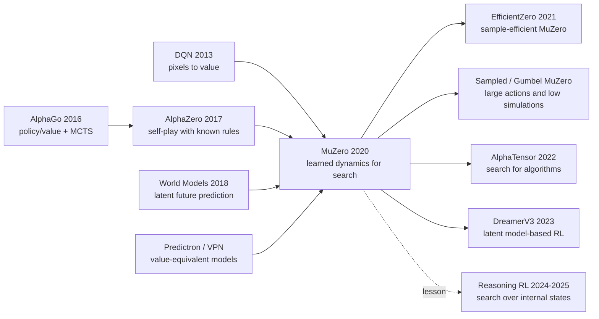

# MuZero — 在不知道规则的世界里用学来的模型规划

> **2019 年 11 月，DeepMind 在 arXiv 发布 [1911.08265](https://arxiv.org/abs/1911.08265)；2020 年 12 月，《Nature》刊出 [MuZero](https://www.nature.com/articles/s41586-020-03051-4)。** AlphaGo 需要围棋规则，AlphaZero 需要棋类模拟器，MuZero 则把最硬的那根拐杖也拿掉：它不知道提子、将军、升变，也不知道 Atari 的像素下一帧会怎样，却靠一个只预测 **reward / policy / value** 的隐含模型，在 Go、chess、shogi 和 57 款 Atari 上同时站到顶端。它的反直觉之处不在「学会世界」，而在证明规划并不需要还原世界；只要学到对决策有用的未来，模型就可以在自己发明的状态空间里搜索。

## 一句话总结

Schrittwieser、Antonoglou、Hubert、Simonyan 等 12 位作者在 2020 年发表于 *Nature* 的 MuZero，是 DeepMind 从 [DQN（2013）](../era2_deep_renaissance/2013_dqn.md) 到 AlphaGo / [AlphaZero（2017）](../era3_attention/2017_alphazero.md) 这条线的关键闭环：它保留 MCTS + policy/value network 的强规划能力，却不再要求外部提供游戏规则。核心接口只有三行：$s^0=h_\theta(o_{1:t})$，$(r^k,s^k)=g_\theta(s^{k-1},a^k)$，$(p^k,v^k)=f_\theta(s^k)$；训练目标也只逼模型预测 reward、search policy 和 value，而不是重建下一帧像素或合法棋盘状态。结果是，在 20B Atari frames 下 MuZero 达到 2041.1% median / 4999.2% mean human-normalized score，超过 R2D2 的 1920.6% / 4024.9%；在 200M frames 的 Reanalyze 设置下达到 731.1% median，也超过 LASER 的 431%。它真正替代的 baseline 不是某个网络层，而是两种旧信念：model-free 才能处理 Atari、planning 必须知道规则。反直觉 lesson 是：最有用的 world model 不一定像世界，只要它让搜索做出更好的行动。

---

## 历史背景

### 2019 年：规划很强，但被规则锁住

MuZero 出现前，强化学习里有一个很尴尬的断层。会规划的系统很强，但通常需要一个可靠的环境模型；不需要模型的系统更通用，却常常像条件反射一样行动。

AlphaGo 和 AlphaZero 属于前一类。它们把神经网络和 Monte Carlo Tree Search 接在一起，让 policy network 缩小搜索空间，让 value network 评估局面，再通过大量模拟把策略一步步改好。这套系统在 Go、chess、shogi 上几乎是完美的，因为棋类游戏天然给你一个 `step(state, action)`：落子是否合法、下一盘面是什么、游戏有没有结束，规则都清清楚楚。只要规则给定，MCTS 就能向未来看很多步。

DQN、Rainbow、R2D2 属于后一类。它们不用知道 Atari 的内部规则，只看像素和分数，也能学出很强的控制策略。但它们通常没有显式搜索。一次前向传播给出一个动作价值或策略分布，行动很快，规划很少；在需要「想几步」的任务里，学习信号会变得又稀又吵。

所以 2019 年的关键问题不是「能不能训练一个更大的网络」，而是一个更尖锐的接口问题：**有没有可能让一个 agent 像 AlphaZero 一样搜索，却又像 DQN 一样不需要规则？** MuZero 正是卡在这条缝里。

### DeepMind 的三条线如何汇合

DeepMind 做 MuZero 并不是突然转向。它更像过去十年三条路线的交汇点。

第一条是 **pixel-to-action**。DQN 证明了卷积网络可以直接从 Atari 原始像素中学控制，把「深度表示」带进强化学习。但 DQN 的模型是反应式的：它学 $Q(s,a)$，却不问「如果这样做，之后世界会怎样展开」。

第二条是 **search-with-value**。AlphaGo、AlphaGo Zero、AlphaZero 证明，搜索不必靠手写评估函数；神经网络可以同时给出 policy prior 和 value estimate，让 MCTS 变成可学习的策略改进器。问题是，这条线仍然把规则当成免费午餐。

第三条是 **learned world model**。Predictron、Value Prediction Networks、World Models、Dreamer 这一批工作都在尝试让模型在隐含空间里预测未来。但许多方法仍把「学模型」理解成「预测下一帧或重建观测」。这在 Atari 上尤其吃亏：模型会花容量去画背景、分数闪烁、无关物体，却不一定学到对决策最关键的变量。

MuZero 的创新感来自这三条线的重新配线：从 DQN 拿来「不看规则也能从像素学」，从 AlphaZero 拿来「MCTS 是强大的 policy improvement operator」，从 value-equivalent model 拿来「模型只需要对价值等价，不需要物理等价」。

### 论文发布时的工程条件

这篇论文的工程背景也很重要。2019-2020 年，DeepMind 已经有成熟的 AlphaZero 自博弈基础设施、分布式 replay buffer、TPU 集群，以及一整套把搜索结果回灌给网络的训练管线。MuZero 不是一个小实验室能轻易复现的算法原型；它是建立在 AlphaZero 工业系统之上的下一代系统。

论文中报告的设置相当重：棋类任务使用 800 simulations per search，Atari 使用 50 simulations per search；训练 unroll $K=5$ 步；棋类 mini-batch size 为 2048，Atari 为 1024；每个任务训练 1M mini-batches。附录还写明，棋类使用 16 个 TPU 训练、1000 个 TPU 自博弈，Atari 每个游戏使用 8 个 TPU 训练、32 个 TPU 生成经验。这个规模解释了为什么 MuZero 的思想很快被反复引用，但真正能复现完整系统的人并不多。

## 研究背景与动机

### 要解决的不是「预测世界」，而是「可规划的抽象」

传统 model-based RL 往往默认：先学一个环境模型，再用这个模型规划。问题在于，「环境模型」这个词太容易把研究带偏。对于像素任务来说，如果你要求模型预测下一帧 RGB，那它就会被迫解决一个几乎等价于视频生成的问题；而视频生成里许多最难的细节，和决策没有任何关系。

MuZero 的动机是把这个目标砍到最低限度。一个状态表示是否好，不取决于它能不能还原成原始图片，而取决于它能不能支持三类预测：下一步 reward、搜索后得到的 policy、从这里往后的 value。换句话说，MuZero 学的不是「世界长什么样」，而是「在这个世界里行动，哪些未来后果对规划有用」。

这也是论文里最现代的一点：hidden state 没有被要求对应真实环境状态。它可以是模型自己发明的一套坐标，只要在这套坐标中 MCTS 能稳定地比较行动后果。这个选择把 model-based RL 从像素级模拟器的包袱里解放出来。

### 为什么 Atari 和棋类必须放在同一篇论文里

单看棋类，MuZero 可能只是 AlphaZero 的简化版；单看 Atari，它可能只是又一个重型 deep RL 系统。把两者放在一起，论文想证明的命题才成立：同一套算法既能在规则清楚、规划极强的棋类上追平 AlphaZero，又能在视觉复杂、规则未知的 Atari 上超过 model-free SOTA。

这个实验组合有点刻意，但很有效。棋类回答「学来的模型能不能支撑精密规划」；Atari 回答「没有规则、只有像素和奖励时，规划还有没有用」。MuZero 同时通过这两个测试，才让「learned model + search」从一个漂亮想法变成一个可信范式。

---

## 方法详解

### 整体框架：把 AlphaZero 的搜索放进一个学来的隐含世界

MuZero 的算法表面上像 AlphaZero：都有 policy/value network，都用 MCTS 生成更强的 policy target，都把搜索后的分布回灌给网络训练。真正的差别在搜索树内部。AlphaZero 的每条边调用外部规则模拟器；MuZero 的每条边调用一个神经网络动力学函数。搜索树不是长在真实棋盘或 Atari emulator 上，而是长在模型自己维护的 hidden state 上。

这个 hidden state 没有被要求可解释。论文说得很明确：$s^k$ 没有环境状态的语义，它只是整个模型的隐藏状态；它的唯一职责是支持未来 policy、value、reward 的预测。这个设定让 MuZero 避开了「预测下一帧像素」这个陷阱。

$$
s^0 = h_\theta(o_1, \ldots, o_t), \qquad
(r^k, s^k) = g_\theta(s^{k-1}, a^k), \qquad
(p^k, v^k) = f_\theta(s^k)
$$

| 函数 | 输入 | 输出 | 在规划中的角色 |
|---|---|---|---|
| representation $h_\theta$ | 历史观察 $o_{1:t}$ | root hidden state $s^0$ | 把真实世界压进可搜索状态 |
| dynamics $g_\theta$ | hidden state $s^{k-1}$ + 假设动作 $a^k$ | reward $r^k$ + next hidden state $s^k$ | 在脑内走一步 |
| prediction $f_\theta$ | hidden state $s^k$ | policy $p^k$ + value $v^k$ | 给 MCTS prior 和叶子估值 |

从数据流看，MuZero 每一轮训练是一个闭环：actor 用当前网络跑 MCTS，得到行动和搜索 policy；环境返回真实 reward 和下一观察；轨迹进入 replay buffer；learner 从 buffer 抽片段，把模型 unroll $K=5$ 步，要求每一步的 reward/policy/value 都对齐真实轨迹和当时搜索结果。网络越好，搜索越好；搜索越好，训练标签越好。

### 关键设计 1：只预测规划所需的三元组

MuZero 的第一刀是砍掉 reconstruction。许多 model-based RL 方法试图学完整转移模型：给定当前像素和动作，预测下一帧像素；或者至少预测一个可以重建观测的 latent state。MuZero 反过来问：如果模型只是为了规划，为什么要学那些对动作选择没有帮助的细节？

于是它只监督三类量：observed reward $u$、MCTS 产生的 search policy $\pi$、n-step / final return value target $z$。训练目标是：

$$
\ell_t(\theta)=\sum_{k=0}^{K}\left[
\ell_r(u_{t+k}, r_t^k) + \ell_v(z_{t+k}, v_t^k) + \ell_p(\pi_{t+k}, p_t^k)
\right] + c\|\theta\|^2
$$

这是一种 value-equivalent model 的思想：模型不必与环境转移等价，只要对 planning value 等价。比如 Atari 里的背景云、闪烁分数、装饰物都可能被 hidden state 忽略；围棋里的「气」也不必显式命名，只要模型知道某些动作会导致低 value 或 reward。这不是偷懒，而是把容量集中到决策变量上。

这个选择解释了 MuZero 为什么比「看起来更完整」的 world model 更适合 MCTS。搜索树需要的是可递归、可比较、可回传的 value，不是高清无码预测视频。

### 关键设计 2：把 AlphaZero 的 MCTS 接到学习动力学上

MuZero 的搜索仍然是 AlphaZero 风格的 UCB / PUCT。每个 internal node 存统计量 $N,Q,P,R,S$：访问次数、平均价值、policy prior、即时 reward、下一个 hidden state。selection 阶段沿着最大 UCB 的边走；expansion 阶段调用一次 dynamics 和 prediction；backup 阶段把包含中间 reward 的 discounted return 回传到路径上。

$$
a^k = \arg\max_a\left[Q(s,a) + P(s,a)\frac{\sqrt{\sum_b N(s,b)}}{1+N(s,a)}
\left(c_1 + \log\frac{\sum_b N(s,b)+c_2+1}{c_2}\right)\right]
$$

这里最重要的改动不是公式本身，而是公式作用的对象变了。AlphaZero 在真实规则给出的下一盘面上搜索；MuZero 在 $g_\theta$ 生成的 hidden state 上搜索。一个 simulation 最多调用一次 dynamics 和一次 prediction，因此每次搜索的计算阶数仍与 AlphaZero 同级。

为了让 Atari 这种 unbounded score 环境也能用 PUCT，MuZero 对 search tree 内观察到的 $Q$ 做 min-max normalization，把不同量纲的 value 压到 $[0,1]$。这避免了为每个游戏手工设定分数范围，也延续了「少给先验」的设计原则。

### 关键设计 3：端到端 unroll 训练

MuZero 训练时不是只监督 root state。给定 replay buffer 中的一段真实轨迹，它先用 $h_\theta$ 编码初始观察，然后按照真实动作序列反复调用 $g_\theta$，在每个 unrolled step 都让 $f_\theta$ 输出 policy/value，并让 $g_\theta$ 输出 reward。这样，模型必须学会让 hidden state 在多步递归后仍然对 planning 有用。

Atari 的 value target 用 n-step bootstrap：

$$
z_t = u_{t+1} + \gamma u_{t+2} + \cdots + \gamma^{n-1}u_{t+n} + \gamma^n \nu_{t+n}
$$

棋类没有中间 reward，最终胜负 $\{-1,0,+1\}$ 就是主要监督；Atari 有变尺度 reward，所以论文用 categorical support 和可逆 value transform 来稳定训练。附录中还提到两个工程细节：每个 head 的 loss 按 $1/K$ 缩放，dynamics 起点的梯度按 $1/2$ 缩放，避免 unroll 步数增加时梯度量级失控。

| 旧路线 | 学什么 | 用什么规划 | MuZero 的替换 |
|---|---|---|---|
| AlphaZero | 已知规则下的 policy/value | 真实规则模拟器 | 用 $g_\theta$ 替代规则模拟器 |
| DQN / R2D2 | $Q(s,a)$ 或 recurrent Q | 不显式搜索 | 用 MCTS 做 policy improvement |
| Pixel world model | 下一帧或重建观测 | 在预测像素上间接规划 | 只学 reward/policy/value |
| Value Prediction Network | value-oriented latent rollout | 较弱或有限的 search | 接入完整 AlphaZero 式 MCTS |

### 关键设计 4：Reanalyze 和尺度工程

MuZero 还有一个容易被低估的部分：Reanalyze。普通训练里，某个旧时间步的 policy target 来自当时的网络和搜索；网络后来变强以后，这个 target 可能已经过时。MuZero Reanalyze 会回到 replay buffer 里的旧轨迹，用最新网络重新跑 MCTS，把更新鲜的 policy target 用于训练。

论文报告的 Reanalyze 设置里，80% 的更新使用重新搜索得到的新 policy target；value target 也用较新的 target network 重新 bootstrap。这相当于让 agent 不必重新与环境交互，就能用更强的大脑复盘旧经验。200M frames 设置下，MuZero Reanalyze 的 median human-normalized score 达到 731.1%，明显高于 IMPALA、Rainbow、LASER。

尺度工程同样关键。棋类每步 800 simulations，Atari 每 4 帧做一次搜索、每次 50 simulations；棋类 self-play actor 很重，Atari actor 相对轻；Atari 输入包含 32 帧 RGB 和 32 个历史动作，因为某些动作的效果不会立即显示在画面上。这些细节让 MuZero 更像一个系统论文，而不只是一个 loss 函数。

### 一个最小伪代码视图

下面的伪代码省略了分布式 actor、prioritized replay、categorical support 等工程细节，只保留 MuZero 最小闭环。

```python
def muzero_update(trajectory, network, optimizer, K=5):
    observations, actions, rewards, search_policies, value_targets = trajectory

    hidden = network.representation(observations.history_at_t())
    total_loss = 0.0

    for k in range(K + 1):
        policy, value = network.prediction(hidden)
        total_loss += policy_loss(policy, search_policies[k])
        total_loss += value_loss(value, value_targets[k])

        if k == K:
            break

        reward, hidden = network.dynamics(hidden, actions[k])
        total_loss += reward_loss(reward, rewards[k])

    optimizer.zero_grad()
    total_loss.backward()
    optimizer.step()
```

读这段伪代码时要注意一个微妙点：`hidden` 从来没有被 decoder 拉回像素空间。它只要能让 `prediction` 和下一次 `dynamics` 继续工作，就是合格状态。MuZero 的模型不是模拟器的神经网络替身，而是一个专门为搜索服务的内部语言。

---

## 失败案例

### 失败 1：像素级世界模型

MuZero 最直接反对的是「先学一个能预测下一帧的世界模型，再在里面规划」这条路线。它听起来完整，实际很脆。Atari 画面里有大量与行动无关的变化：背景动画、分数闪烁、物体外观、随机噪声。如果模型要把这些细节都预测好，训练目标会被视觉还原牵着走。

SimPLe 一类方法证明了用 learned model 做 Atari 有希望，但在完整 Atari 57 上仍明显落后于 model-free SOTA。MuZero 的论文直接指出，过去的 pixel-level 或 reconstruction-oriented 方法没有在视觉复杂域里构造出能有效规划的模型。失败原因不是「模型不够大」这么简单，而是目标错了：你在优化一个视频预测器，却想得到一个决策模型。

### 失败 2：只学 Q 值的 model-free 对照

论文里有一个很关键的 ablation：在 MuZero 框架内，把训练目标换成 R2D2 风格的 model-free Q-learning，去掉 policy/value 双头和搜索，只保留一个 Q-function head。这个对照很公平，因为网络规模和训练量尽量保持一致。

结果是，在 Ms. Pac-Man 上，这个 Q-learning 版本可以达到 R2D2 类似水平，但学得更慢，最终分数显著低于 MCTS-based training。这个实验说明 MuZero 的提升并不只是「用了更大的 backbone」或「用了 DeepMind 的系统」。真正的差异在于，搜索产生的 policy improvement target 比高偏差、高方差的 Q-learning target 更强。

### 失败 3：完美规则模拟器

AlphaZero 在棋类上非常强，但它的搜索需要完美规则。对于棋类这不是问题；对于真实世界、机器人、工业控制、复杂游戏，这几乎就是应用壁垒。你可以把 AlphaZero 看成一个非常好的 planner，但 planner 的每一步都要问外部世界：「如果我这样做，合法不合法？下一状态是什么？」

MuZero 的失败 baseline 正是这个依赖。它没有证明规则不重要，而是证明规则不必以手写 simulator 的形式给出。只要模型能在 hidden state 中产生足够好的 reward/value/policy，MCTS 就能在这个内部空间里工作。

### 失败 4：搜索预算不是越大越万能

MuZero 也暴露了自己的失败边界。在 Go 中，增加 thinking time 可以让 learned model 几乎像 perfect simulator 一样扩展，论文报告从约 0.1 秒训练预算扩到 10 秒搜索仍然有效。但在 Atari 上，规划收益更快 plateau：性能随 simulations 增加到约 100 仍有提升，之后基本趋平甚至略降。

这说明 MuZero 的 learned dynamics 在 Atari 上仍有误差。搜索越深，模型误差越可能累积；如果环境随机性强、奖励极稀疏，hidden model 很难学到可靠的可规划结构。Table S1 中 Montezuma's Revenge、Venture、Pitfall 等游戏表现很差，正好提醒读者：MuZero 是巨大进步，但不是稀疏探索的终极解法。

| 被替代/暴露的 baseline | 代表方法 | 为什么不够 | MuZero 的回答 |
|---|---|---|---|
| 像素级模型 | SimPLe / next-frame models | 容量浪费在视觉重建，规划误差累积 | 不重建像素，只预测 reward/policy/value |
| 纯 Q-learning | R2D2-style ablation | target 噪声大，学习慢，无显式 policy improvement | MCTS 产生更强的训练 policy |
| 已知规则搜索 | AlphaZero | 必须手写 simulator，难迁移到未知环境 | 用 learned dynamics 替代 simulator |
| 盲目加深搜索 | long search in Atari | learned model 误差导致收益 plateau | 搜索深度要受模型可靠性约束 |

## 实验关键数据

### 棋类：不懂规则也能追平 AlphaZero

在 Go、chess、shogi 上，MuZero 的评价方式很直接：和 AlphaZero 用同样 800 simulations per move 对弈，用 Elo 衡量相对强度。结果显示，MuZero 匹配 AlphaZero 的超人类表现；在 Go 上甚至略高于 AlphaZero，尽管 MuZero 每个节点只用 16 个 residual blocks，而 AlphaZero 用 20 个。

这个结果比「又刷高一个 Elo」更重要。它说明 MuZero 学出的 hidden dynamics 足以支撑极精密的棋类搜索。棋类是对规划误差极敏感的领域，一步错可能整盘崩；如果 learned model 只是粗略模拟，很难在这里接近 AlphaZero。

### Atari 57：在 model-free 主场刷新 SOTA

Atari 是反过来的压力测试。这里没有给规则，观测是像素，环境更噪，奖励更复杂。MuZero 在 57 个 Arcade Learning Environment 游戏上刷新 mean 和 median human-normalized score，20B frames 设置下达到 2041.1% median / 4999.2% mean；同期 R2D2 是 1920.6% / 4024.9%，而且用了 37.5B frames。

论文还指出，MuZero 在 42/57 个游戏中超过 R2D2，并在所有游戏上超过此前最好的 model-based 方法 SimPLe。这个组合特别有说服力：它既打败了 model-free 主场强者，又打败了之前的 learned-model 路线。

### Reanalyze：用新模型重算旧经验

在 200M frames 的小数据设置下，MuZero Reanalyze 的 median human-normalized score 达到 731.1%，mean 达到 2168.9%。对比很清楚：IMPALA median 191.8%，Rainbow 231.1%，LASER 431%。

这组数字说明 Reanalyze 的价值不是装饰。重新用最新网络搜索旧轨迹，相当于把 replay buffer 从「静态记忆」变成「可复盘数据集」。这也是后来很多 offline RL、self-play、LLM reasoning 系统会重新重视「用新策略重标旧样本」的原因。

### 消融实验暴露了真正的增益来源

论文的 Ms. Pac-Man 消融很有启发。用 Q-learning 目标替换 MuZero 目标时，模型最终显著低于 MCTS-based training；把训练时的 simulations 从很少提高到更多时，学习速度和最终表现都提升；即使只有 6 次 simulations per move，少于 Ms. Pac-Man 的动作数，MuZero 仍能学出有效策略。

这说明搜索不是简单枚举动作，而是在 policy prior、value、hidden dynamics 三者之间做 generalization。MCTS 给网络提供了一个比单步 Q target 更结构化的改进方向。

| 设置 / 方法 | 数据量 | Median HNS | Mean HNS | 关键信息 |
|---|---:|---:|---:|---|
| Ape-X | 22.8B frames | 434.1% | 1695.6% | 分布式 model-free baseline |
| R2D2 | 37.5B frames | 1920.6% | 4024.9% | 之前的 Atari model-free SOTA |
| MuZero | 20.0B frames | 2041.1% | 4999.2% | 57 游戏 mean/median 新 SOTA |
| IMPALA | 200M frames | 191.8% | 957.6% | 小数据 model-free baseline |
| Rainbow | 200M frames | 231.1% | - | 经典 DQN 系改进 |
| LASER | 200M frames | 431% | - | 之前强小数据 baseline |
| MuZero Reanalyze | 200M frames | 731.1% | 2168.9% | 旧经验重搜索带来样本效率 |

---

## 思想史脉络

### 前世：三条线在 MuZero 汇合

MuZero 的思想史位置很清楚：它不是单纯的 world model 论文，也不是单纯的 AlphaZero 工程扩展，而是把「从像素学控制」「用搜索改进策略」「在隐含空间建模未来」三件事接到一起。

DQN 给了第一块拼图：只要输入是像素、输出是动作价值，agent 不需要手写特征也能控制 Atari。AlphaGo / AlphaZero 给了第二块拼图：搜索可以被神经网络引导，MCTS 不只是 evaluation-time trick，而是训练过程中产生更好策略标签的 machinery。World Models、Dreamer、Predictron、Value Prediction Networks 给了第三块拼图：未来可以被压到 latent space 里，而 latent model 不必和真实世界逐像素一致。

MuZero 的贡献是把第三块拼图改造成第二块拼图能用的形状。它没有说「学一个世界模型，然后希望它自然有用」；它直接把模型训练成 MCTS 需要的接口。

### 今生：哪些后来工作真正继承了它

MuZero 的直接后继大致分三类。

第一类是**样本效率改造**。EfficientZero 加入 self-supervised consistency，让 hidden state 在真实轨迹和模型 rollout 之间更稳定，目标是解决 MuZero「会玩但太吃数据/算力」的问题。Gumbel MuZero 和 Sampled MuZero 则分别处理低 simulation budget、大动作空间等搜索效率问题。

第二类是**应用迁移**。AlphaTensor、AlphaDev 把 AlphaZero/MuZero 式的 search-and-learn 套到算法发现上：状态不再是棋盘，而是一个程序或张量分解过程；动作不再是落子，而是改写算法。这里继承的不是 Atari 细节，而是「用搜索生成更强训练信号」的系统思想。

第三类是**并行的 world-model 路线**。DreamerV3 不走 MCTS，而是在 latent space 里做 imagination rollout 和 actor-critic 更新；它和 MuZero 像两条分岔路：一个相信 tree search，一个相信可微想象和 policy learning。两者共同证明，真正重要的是把未来压成可决策的内部状态。

### 误读：它没有学会「物理世界」

关于 MuZero 最常见的误读是：它学会了游戏规则。这个说法太粗。MuZero 没有显式学会「围棋一块棋没有气就被提掉」或「chess 的王不能走进被将军的位置」。它学到的是某些 hidden transition 会导致某些 reward/value/policy 后果。

这个差别很重要。规则是可解释、可验证、可外推的符号系统；MuZero 的 dynamics 是一个为搜索服务的预测器。它可以在训练分布内极强，但不保证能回答任意反事实规则问题。说它「学会规则」容易把读者带回旧的模拟器思维；更准确的说法是：它学会了一个足以让搜索成功的效用动力学。

### 一张思想谱系图



| 思想节点 | MuZero 继承了什么 | MuZero 改了什么 |
|---|---|---|
| DQN | 从像素学行为，不依赖规则 | 加上显式搜索和 policy improvement |
| AlphaZero | policy/value + MCTS + self-play | 去掉外部规则模拟器 |
| World Models | 在 latent space 中预测未来 | 不要求重建观测，只要求规划相关预测 |
| Predictron / VPN | value-equivalent model 的思想 | 接入动作、reward、MCTS 和大规模评测 |
| EfficientZero / Sampled MuZero | 沿用 hidden dynamics + search | 改善样本效率、动作空间和低预算搜索 |
| Reasoning RL | 借走「内部状态搜索」隐喻 | 把状态从游戏局面换成文本/思维轨迹 |

---

## 当代视角

### 六年后回看：它赢在抽象，而不是游戏分数

站在 2026 年回看，MuZero 最耐看的地方不是 Atari 分数，也不是「DeepMind 又赢了棋类」。这些数字很强，但会被新算法刷新。真正留下来的思想是：**模型可以只为决策服务，不必为复原现实服务。**

这个思想后来在很多地方反复出现。视觉语言模型不一定需要生成像素，检索模型不一定需要理解完整语义，LLM reasoning 系统也不一定需要显式世界模型；只要内部表示能支持比较、搜索、反思、选择，它就是有用模型。MuZero 是这一类「任务相关抽象」在强化学习里的代表作。

### 站不住的假设

MuZero 也让几条当年的假设站不住了。

第一，**model-based RL 必须预测观测**。MuZero 证明了，对于规划，value-equivalent 比 pixel-equivalent 更关键。第二，**Atari 是 model-free RL 的主场**。MuZero 在 57 游戏上超过 R2D2 和 SimPLe，说明只要模型目标设计正确，learned model 也能在视觉复杂域里规划。第三，**搜索必须依赖真实规则**。棋类结果证明，learned dynamics 可以在精密规划任务里接近 perfect simulator。

但另一些乐观假设也没站住。MuZero 没有让 model-based RL 立刻进入机器人和真实世界；它仍需要大量交互、稳定奖励、可重复评估，以及昂贵搜索。论文里的「可能通向 messy real-world environments」更像方向宣言，而不是已完成迁移。

### 如果今天重写 MuZero

如果今天重写 MuZero，我会保留它的三函数接口和 search-improvement loop，但会动几个地方。

第一，会加入更强的 self-supervised consistency，让 hidden state 在真实 rollout、模型 rollout、数据增强下保持稳定，这已经被 EfficientZero 证明很有价值。第二，会把 dynamics 从 deterministic 扩成 stochastic 或 ensemble，因为真实世界和许多游戏并不确定；单一 hidden transition 容易过度自信。第三，会降低 MCTS 的推理成本，例如用 learned policy 做 candidate pruning、用 Gumbel / sampled search 处理大动作空间。第四，会把 offline data 和 online search 更系统地结合，让 Reanalyze 不只是 replay 技巧，而是一个持续重标数据的训练范式。

| 2020 年的设定 | 今天可能的改写 | 为什么 |
|---|---|---|
| deterministic dynamics | stochastic / ensemble dynamics | 处理随机环境与模型不确定性 |
| 只用 reward/policy/value 监督 | 加 consistency / representation loss | 提高样本效率和 hidden state 稳定性 |
| 固定 MCTS 预算 | sampled / Gumbel / learned pruning | 降低大动作空间搜索成本 |
| replay buffer + Reanalyze | offline-online 混合重标 | 更充分利用旧经验与新策略 |

### 和 2025 年推理系统的关系

把 MuZero 直接等同于 LLM reasoning 会过度类比。MuZero 有环境交互、有可验证 reward、有 MCTS 树、有可训练 dynamics；LLM 推理通常面对文本状态、弱验证信号和更开放的动作空间。两者不是同一个算法。

但思想上的呼应是真实的：都在尝试把一次性反应变成内部搜索。MuZero 在 hidden state 里展开行动后果，o1 / DeepSeek-R1 一类系统在文本或 latent 思维轨迹中展开候选解法；MuZero 用 value/policy/reward 监督 internal model，reasoning RL 用 preference、verifier、outcome reward 或 self-play 信号监督推理路径。MuZero 给今天最有用的提醒是：别执着于让内部状态「像真实世界」；应该问它能否稳定地区分更好的行动。

## 局限与展望

### 仍然难走出可模拟环境

MuZero 的标题说「without rules」，但它仍然需要一个可反复交互、可评估 reward 的环境。Atari 和棋类虽然规则没有直接给 agent，但训练系统仍可以跑大量 episodes；真实机器人、医疗决策、工业控制往往不能这么试错。没有便宜交互，MuZero 的自博弈和 replay 机制就很难原样搬过去。

此外，MuZero 的实验环境大多是完全可观测或近似可观测的。真实世界常常部分可观测、非平稳、多主体、奖励延迟且含噪。deterministic hidden dynamics 在这些设置下会遇到更强的 epistemic uncertainty。

### 推理成本和随机性

MuZero 的推理不是一次网络前向，而是每步都跑多次 MCTS。棋类 800 simulations、Atari 50 simulations 的成本可以接受，是因为这些 benchmark 环境相对便宜；在机器人或线上系统里，每次 action 前跑一棵树可能太慢。

另一个限制是随机性。论文把 stochastic transition 留给 future work，这在确定性棋类里无伤大雅，在 Atari 上已经能看到搜索收益 plateau；在真实世界里，模型不确定性会更强。MuZero 的后继需要显式处理 stochastic dynamics、risk-sensitive value 和不确定性校准。

## 相关工作与启发

### 读这篇论文时最该连起来看的线

MuZero 最适合和四组论文一起读。向前读 [DQN](../era2_deep_renaissance/2013_dqn.md)，看 deep RL 如何从像素学控制；读 [AlphaGo](../era2_deep_renaissance/2016_alphago.md) 和 [AlphaZero](../era3_attention/2017_alphazero.md)，看 MCTS + policy/value network 如何成为强 planner；横向读 World Models、Dreamer、Value Prediction Networks，看 latent model-based RL 的其他路线；向后读 EfficientZero、Sampled MuZero、Gumbel MuZero、AlphaTensor、AlphaDev，看 MuZero 的接口如何被改造成更省样本或更宽领域的系统。

这些论文连起来会看到一个清晰趋势：AI 系统不断把人类先验从外部模块移进可学习表示中。AlphaGo 还依赖人类棋谱和规则，AlphaGo Zero 去掉棋谱，AlphaZero 统一棋类，MuZero 去掉规则，后来的算法发现系统则把「搜索 + 学习」搬到程序空间。

### 给今天研究者的启发

MuZero 给研究者最实用的启发有两条。第一，建模目标要和下游决策耦合。一个世界模型如果不能支持规划，再逼真也只是生成器；一个抽象模型如果能稳定改进行动，即使不可解释也有价值。第二，搜索不仅是 inference trick，也可以是 training signal generator。MCTS 产生的 policy target 是 MuZero 的核心监督之一，这个思想对后来的 self-play、verifier-guided reasoning、offline relabeling 都有启发。

## 相关资源

### 官方与论文

- Nature 论文：[Mastering Atari, Go, Chess and Shogi by Planning with a Learned Model](https://www.nature.com/articles/s41586-020-03051-4)
- arXiv 预印本：[1911.08265](https://arxiv.org/abs/1911.08265)
- DeepMind 官方博客：[MuZero: Mastering Go, chess, shogi and Atari without rules](https://deepmind.google/discover/blog/muzero-mastering-go-chess-shogi-and-atari-without-rules/)
- 相关后继：[EfficientZero](https://arxiv.org/abs/2111.00210)、[AlphaTensor](https://www.nature.com/articles/s41586-022-05172-4)、[AlphaDev](https://www.nature.com/articles/s41586-023-06004-9)、[DreamerV3](https://arxiv.org/abs/2301.04104)
- 社区实现：[muzero-general](https://github.com/werner-duvaud/muzero-general)


---

> 🌐 [English version](/en/era4_foundation_models/2020_muzero/) · 📚 awesome-papers project · CC-BY-NC