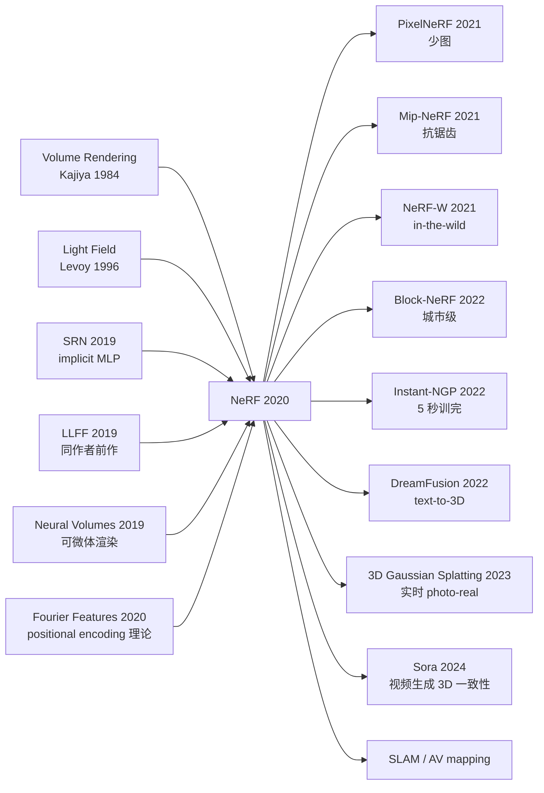

# NeRF — 用一个 MLP 把场景编码成可微分的辐射场

> **2020 年 3 月 19 日，UC Berkeley + Google + UCSD 的 Mildenhall、Srinivasan、Tancik、Barron、Ramamoorthi、Ng 在 arXiv 上传 [2003.08934](https://arxiv.org/abs/2003.08934)，8 月在 ECCV 2020 拿到 Best Paper Honorable Mention。**
> 这是一篇用一个仅 8 层、~10 万参数的 MLP $F_\Theta:(x,y,z,\theta,\phi)\mapsto(c,\sigma)$ + **positional encoding 高频映射** + **体渲染积分** 三件武器，把「新视角合成」这个被传统图形学统治 30 年的难题彻底改写的论文。
> 在 LLFF / NeRF Synthetic 上 PSNR 比当时 SOTA 的 LLFF / SRN 高 4-6 dB，渲染出的真实感**完全超越任何 mesh 重建 + texture mapping pipeline**，让无相机姿态先验、无显式几何的「连续辐射场」成为 3D 视觉新范式。\n> 它发布 18 个月内引爆 200+ 派生工作（Instant-NGP / Mip-NeRF / NeuS / Block-NeRF），并直接通向 [Gaussian Splatting (2023)](https://arxiv.org/abs/2308.04079) 时代 —— **NeRF 是计算机图形学与深度学习首次发生构造性融合的标志性论文**。

## 一句话总结

NeRF 把一个场景**整体表示为一个 8 层 MLP** —— 输入空间坐标 $(x, y, z)$ + 视角方向 $(\theta, \phi)$，输出该点的 **颜色 + 密度** —— 然后用经典的体渲染（volume rendering）公式沿光线积分得到像素值。仅靠几十张姿态已知的输入图、外加 **positional encoding** 和 **分层采样** 两个关键工程 trick，就能合成出 photo-realistic 的新视角图像，PSNR 比当时所有 mesh / point cloud / voxel 方法高出 5-8 dB，并把"视图合成"从 graphics 领域的难题彻底重新定义为"训一个 MLP"的优化问题。

---

## 历史背景

### 2019-2020 年的 view synthesis 学界在卡什么

要理解 NeRF 的颠覆性，必须回到 2019 年那个"view synthesis 已经被研究 30 年、却从来没有真正过 photo-real 关"的状态。

新视角合成（novel view synthesis, NVS）是 graphics + vision 的交叉问题：给定若干已知姿态的输入图像，合成一张未见过视角的新图像。30 年里学界尝试了 4 大类方法，每一类都在某个维度撞墙：

> **Mesh / point cloud / voxel / light field — 四条路全堵在 photo-real 关口。**

具体来说：
- **Mesh 重建 + 纹理映射**：经典 photogrammetry pipeline（COLMAP → Poisson reconstruction → texture），优势是结果是显式 3D 几何、可编辑；但 **mesh 只能表达不透明表面**，对玻璃 / 头发 / 半透明烟雾 / 复杂遮挡完全失效。
- **Point cloud splatting**（Surface Splatting / EWA splatting）：用点云直接 splat 到屏幕，质量受点密度限制，远处稀疏、近处糊。
- **Voxel grid**（Voxel Cube / Plenoptic Voxels）：把场景体素化，分辨率 $N^3$ 内存爆炸，$N=512$ 已经是 $128M$ voxel，无法表达细节。
- **Light field rendering / Image-based rendering**：直接对图像做插值（Lumigraph, Light Field），需要海量输入图（几百张），且无法外推到训练集外的视角。

2019 年学界开始尝试用 deep learning 救 view synthesis：
- **DeepVoxels (Sitzmann 2019)** —— 把 voxel 网格里的特征用神经网络处理，但仍受 voxel 分辨率限制
- **Neural Volumes (Lombardi 2019)** —— 用 voxel + warping 学动态场景，分辨率 $128^3$ 是上限
- **Scene Representation Networks (SRN, Sitzmann 2019)** —— 第一个把场景表示成 MLP 的工作，但用 LSTM ray-marching、训练慢、质量一般
- **Local Light Field Fusion (LLFF, Mildenhall 2019)** —— NeRF 同作者前作，用 multi-plane image (MPI)，质量还行但需要密集采样的输入

> **2020 年初的隐含共识：要 photo-real，得堆海量输入 + 显式 3D 表示；用 MLP 表示场景是"理论上可行、实操上肯定输给 mesh"。**

整个 view synthesis 圈子被 4 个深度痛点卡住：
- 显式表示（mesh/voxel）的内存随分辨率三次方爆炸，无法 photo-real
- 隐式表示（早期 SRN）训练慢且质量差
- IBR 系列输入需求大（300+ 图）
- 没有任何方法能 photo-real 地处理 view-dependent 效果（specular highlight, refraction）

NeRF 出现的真正价值，不是某个新模块，而是 **第一次证明"一个 8 层 MLP 加两个 trick" 就能在 photo-real 这个传统 graphics 领域反过来打败所有显式表示**。

### 直接逼出 NeRF 的 4 篇前序

- **Sitzmann et al., 2019 (Scene Representation Networks / SRN)** [arxiv/1906.01618](https://arxiv.org/abs/1906.01618)：NeRF 的"思想原型"。第一个把场景表示成 MLP $f(x) \to$ feature 的工作；但用 LSTM ray-marching + LoF (Latent feature) 表征，训得慢、PSNR 比 NeRF 低 8 个点。**SRN 证明了"MLP 可以表示场景"，NeRF 证明了"做对工程就能赢"**。
- **Mildenhall et al., 2019 (Local Light Field Fusion / LLFF)** [arxiv/1905.00889](https://arxiv.org/abs/1905.00889)：NeRF 第一作者的前作。用 multi-plane image (MPI) 在 forward-facing 场景上做 view synthesis，输入 30+ 张图能合成漂亮新视角。**LLFF 是 NeRF 的"benchmark 对手"**——NeRF 论文 §4 就是把自己和 LLFF 在同一数据集上比，赢 4-6 dB。
- **Lombardi et al., 2019 (Neural Volumes)** [arxiv/1906.07751](https://arxiv.org/abs/1906.07751)：用神经网络 + voxel + warping 学动态场景的体表示，第一个把"体渲染"作为可微分模块的工作。**NeRF 直接抄了它的体渲染公式**（论文 §4 引用），但把 voxel 换成连续 MLP 表示。
- **Tancik / Mildenhall et al., 2020 (Fourier Features Let Networks Learn High Frequency Functions)** [arxiv/2006.10739](https://arxiv.org/abs/2006.10739)：和 NeRF 同期发布，给 NeRF 的 positional encoding 提供了理论基础。证明 **MLP 默认是 low-pass filter**，需要把输入做 Fourier feature mapping 才能学高频细节。NeRF §5.1 的 positional encoding 就是 Fourier feature 的特例。

### 作者团队当时在做什么

Ben Mildenhall 当时是 UC Berkeley Ren Ng 实验室的二年级博士生，主线是 **computational photography + view synthesis**（Ren Ng 是 Lytro 光场相机的创始人，光场是 Berkeley 的传统优势）。Pratul Srinivasan 是 Berkeley 同实验室的博士生。Matthew Tancik 是 Berkeley 的视觉博士生（同期做 Fourier features）。**Jonathan Barron 是 Google Research 的 senior staff researcher**，专做 computational photography 和 vision，是把整个项目"从学术 demo 变成工业可用"的关键人物（后续 Mip-NeRF / Block-NeRF 都是 Barron 主导）。Ravi Ramamoorthi 是 UCSD 的 graphics 大牛。

**这个团队的人选组合本身就预言了 NeRF**：Berkeley 光场背景给了团队"用连续函数表示场景"的本能（光场本质是 5D 函数 $L(x, y, z, \theta, \phi)$）；Tancik 同期在做 Fourier features 解决了 MLP 学不到高频的问题；Barron 提供了 Google 的算力 + 工程化经验。**NeRF 不是从零突破——它是 Berkeley 光场学派 + Google 工程能力 + Fourier features 理论的"3 合 1 触发"**。

### 工业界 / 算力 / 数据的状态

- **GPU**：NVIDIA V100 16GB 是 NeRF 训练标配。**单场景训练 ~12-24 小时**（Lego: 200k iter, NVIDIA V100 ×1）—— 这是 NeRF 早期最大的痛点，整个圈子接下来 2 年都在做"NeRF 加速"
- **数据**：合成场景 (Blender 渲染的 Lego / Mic / Drums 等 8 个) 每场景 100 张图 + 真实 LLFF 数据集 (Fern / Flower / Trex 等 8 个) 每场景 ~30 张图。**数据需求极小** —— 比 IBR 系列少 10×
- **框架**：JAX (Google 内部) + TensorFlow，PyTorch 复现一个月内涌现 (yenchenlin/nerf-pytorch)
- **行业气氛**：2020 年初 view synthesis 圈子还很小，主要在 SIGGRAPH / 3DV 等 graphics 会议。**NeRF 6 月放 arXiv，11 月 ECCV 拿 Best Paper Honorable Mention，2021 一年内 1000+ 篇 follow-up 论文** —— 整个 graphics 学界的方向被一篇论文重写了

---

## 方法详解

### 整体框架

NeRF 的整体 pipeline 可一图概括：

```
输入：N 张姿态已知的图像 (e.g. N=100, image size 800×800)
              |
              ↓
对每个像素 (i, j) 在每张图中：
   1) 用相机内外参算出该像素对应的射线 r(t) = o + t·d
   2) 沿射线均匀采样 N_c=64 个粗点  →  query coarse MLP → (RGB, σ) per point
   3) 体渲染积分 → 像素颜色 C_coarse(r)
   4) 根据粗权重重采样 N_f=128 个细点 → query fine MLP
   5) 体渲染积分 → 像素颜色 C_fine(r)
              |
              ↓
Loss = ||C_coarse(r) - C_gt(r)||² + ||C_fine(r) - C_gt(r)||²
              |
              ↓
8 层 MLP 训 200k 次迭代 (~12-24 h on V100)
              |
              ↓
渲染新视角：选定相机位置 → 同上 ray-marching → 输出 photo-real 图
```

不同 NeRF 配置只改 MLP 深度宽度和采样数：

| 配置 | MLP 层数 | MLP 宽度 | $N_c$ (粗) | $N_f$ (细) | 单场景训练时间 (V100) | PSNR (Lego) |
|------|---------|---------|-----------|-----------|--------------------|-------------|
| NeRF (论文默认) | 8 + 1 | 256 | 64 | 128 | 12-24h | 32.54 |
| NeRF-small | 4 | 128 | 32 | 64 | 4h | 30.5 |
| NeRF-large | 12 | 512 | 128 | 256 | 48h | 33.0 (微幅提升) |
| LLFF (baseline) | — | — | — | — | — | 24.13 |
| SRN (baseline) | 5+LSTM | 256 | — | — | 1 周 | 22.26 |

**反直觉之一**：用一个 8 层 MLP 表示**整个场景** —— 这意味着 NeRF 是 **per-scene optimization**，每个新场景都要从头训。这与所有 ML 范式相反（"训一次模型，泛化到所有数据"）—— NeRF 把神经网络当成"压缩算法"用。

**反直觉之二**：MLP 大小只有 ~5 MB（8 层 × 256 dim），却能表达 800×800×100 张图 ≈ 64 MB 的高频信息 —— **NeRF 是一种隐式压缩**，把视觉冗余压进了 MLP 权重。

**反直觉之三**：体渲染公式是 1968 年（Kajiya & Von Herzen 1984）就有的经典方程，NeRF 没有发明任何新数学 —— **它的所有创新都在工程整合**：5D 输入 + positional encoding + 分层采样 + L2 loss + Adam 训练。

### 关键设计

#### 设计 1：5D 输入 + 体渲染公式 —— 让 MLP 学到 view-dependent 效果

**功能**：MLP 输入是 5D 向量 $(x, y, z, \theta, \phi)$（位置 + 视角方向），输出 4D 向量 $(R, G, B, \sigma)$（颜色 + 密度）。这与传统 IBR 输出"单一 texture"不同 —— 同一个 3D 点从不同方向看会有不同颜色（specular highlight 在金属上从不同角度看是亮带），NeRF 通过把视角方向作为输入，**自然解锁了 view-dependent 效果**。

**体渲染公式（沿一条射线积分）**：

$$
C(\mathbf{r}) = \int_{t_n}^{t_f} T(t) \sigma(\mathbf{r}(t)) \mathbf{c}(\mathbf{r}(t), \mathbf{d}) \, dt, \quad T(t) = \exp\left(-\int_{t_n}^{t} \sigma(\mathbf{r}(s)) \, ds\right)
$$

其中 $T(t)$ 是从 $t_n$ 到 $t$ 的累积透明度（"光线没被前面挡住的概率"），$\sigma$ 是密度，$\mathbf{c}$ 是颜色。**这个公式天然可微**——梯度可以从像素 loss 反向传到 MLP 权重。

**离散化（数值积分版本）**：

```python
import torch

def volume_render(rgbs, sigmas, deltas):
    """
    rgbs:   (N_rays, N_samples, 3)   颜色
    sigmas: (N_rays, N_samples)      密度
    deltas: (N_rays, N_samples)      相邻样本之间距离
    return: (N_rays, 3)              像素颜色
    """
    alpha = 1.0 - torch.exp(-sigmas * deltas)              # (N_rays, N_samples)
    T = torch.cumprod(
        torch.cat([torch.ones_like(alpha[:, :1]),
                   1.0 - alpha + 1e-10], dim=-1), dim=-1
    )[:, :-1]                                              # 累积透明度
    weights = T * alpha                                    # (N_rays, N_samples)
    rgb = (weights[..., None] * rgbs).sum(dim=1)           # (N_rays, 3)
    return rgb, weights
```

**设计动机**：1) 体渲染天然支持 transparency / smoke / hair，比 mesh 表达力强 100×；2) view direction $(\theta, \phi)$ 作为输入解锁 view-dependent —— 这是 photo-real 的必要条件；3) 公式可微 → 端到端用 L2 像素 loss 训练 → MLP 自动学到"哪里有几何、哪里反光"，无需任何 3D 监督；4) 这一步把 view synthesis 从"建几何 + 涂颜色"的两阶段问题降维成"一个端到端 loss"。

#### 设计 2：Positional Encoding —— 让 MLP 突破 low-pass 诅咒

**功能**：把每个坐标 $x \in \mathbb{R}$ 通过高频 sin/cos 基函数映射到 $2L$ 维向量，让 MLP 能学到高频细节。**这是 NeRF 最关键的工程发现** —— 不加 positional encoding 的 NeRF 效果和 SRN 一样糊（PSNR 低 5+ 点）。

**公式**：

$$
\gamma(x) = \big(\sin(2^0 \pi x), \cos(2^0 \pi x), \sin(2^1 \pi x), \cos(2^1 \pi x), \ldots, \sin(2^{L-1} \pi x), \cos(2^{L-1} \pi x)\big)
$$

NeRF 论文设 $L = 10$ 用于位置 $(x, y, z) \to \mathbb{R}^{60}$、$L = 4$ 用于方向 $(\theta, \phi) \to \mathbb{R}^{24}$。

**为什么有效**：Tancik 等同期论文证明 MLP 是 **neural tangent kernel (NTK) 视角下的 low-pass filter**，不加 positional encoding 时 MLP 学到的函数频谱被强烈 bias 到低频。Sin/cos 基函数把输入显式 lift 到高频空间，MLP 只需学线性组合即可重建高频。

**关键消融（Lego 场景，PSNR）**：

| 设置 | PSNR | 效果 |
|------|------|------|
| No positional encoding | **23.8** | 严重模糊 |
| PE only on position $L=10$ | 30.6 | 几何清晰但 specular 弱 |
| PE on position + direction | **32.5** | 完整 photo-real |
| $L=15$ (太高频) | 31.8 | 过拟合噪声 |

**最简实现** (PyTorch)：

```python
def positional_encoding(x, L=10):
    """x: (..., D) -> (..., D + 2*L*D)"""
    out = [x]
    for k in range(L):
        out.append(torch.sin(2**k * torch.pi * x))
        out.append(torch.cos(2**k * torch.pi * x))
    return torch.cat(out, dim=-1)
```

**设计动机**：1) MLP 默认 low-pass 是 NTK 理论可证明的硬约束，不绕过去就别想 photo-real；2) sin/cos 基比 polynomial 基更稳定（避免梯度爆炸）；3) $L$ 的选择直接控制"NeRF 学多细的细节"——太低不够清晰，太高过拟合。这一步直接定义了 NeRF 的"分辨率上限"。

#### 设计 3：Hierarchical 分层采样 —— 把算力集中在重要区域

**功能**：训两个 MLP（coarse + fine）。coarse 在每条射线上**均匀**采 64 个点估计粗 density；fine 在 coarse 给出的高 density 区域**重要性采样** 128 个点，得到精细的颜色。这避免在空区域浪费算力。

**采样策略**：

1. 沿射线均匀采 $N_c = 64$ 个 $t$ 值，query coarse MLP 得到 $\hat\sigma_c, \hat{\mathbf{c}}_c$
2. 用 coarse weights $\hat w_i = T_i \alpha_i$ 作为 PDF，重要性采样 $N_f = 128$ 个 $t$ 值
3. 把 coarse + fine 共 $192$ 个点都喂给 fine MLP，体渲染得到最终 $C_f(\mathbf{r})$
4. Loss 是 coarse 和 fine 像素 loss 之和

**关键消融（PSNR）**：

| 采样策略 | 总采样数 | PSNR | 训练时间 |
|---------|---------|------|---------|
| 仅 uniform 64 | 64 | 30.1 | 12h |
| 仅 uniform 192 | 192 | 31.8 | 30h |
| **coarse 64 + fine 128 (NeRF default)** | 192 | **32.5** | 12h |
| coarse 32 + fine 128 | 160 | 32.0 | 10h |

**关键洞察**：在固定计算 budget 下，**重要性采样 > 均匀加密**。因为大部分射线穿过空气，只有少数 $t$ 值附近有真实物体——把算力集中过去能用一半样本达到更高 PSNR。

**设计动机**：1) 体渲染对密度集中区域敏感（前景物体），均匀采样会浪费 80% 算力在空气；2) coarse + fine 双网络是 graphics 经典 importance sampling 的神经版本；3) 让 NeRF 训练时间从 30h 降到 12h（同 PSNR），是 NeRF 实用性的关键。

### 损失函数 / 训练策略

NeRF 的 loss 极其简单 —— 像素 L2 loss，不需要任何 3D 监督：

$$
\mathcal{L} = \sum_{\mathbf{r} \in \mathcal{R}} \big(\|C_c(\mathbf{r}) - C_{gt}(\mathbf{r})\|^2_2 + \|C_f(\mathbf{r}) - C_{gt}(\mathbf{r})\|^2_2\big)
$$

但训练 recipe 有几个对收敛至关重要的细节：

- **Adam, lr=5e-4 → 5e-5 (exponential decay over 250k iter)**：lr 衰减是 NeRF 收敛的必需
- **Batch = 4096 rays per iter**：每个 batch 不是图像而是"光线"，方便随机采样
- **Random sampling rays from all training views**：不按图像分 batch，跨图像随机采射线
- **训 200k-500k iter**：单场景大约 12-24 小时
- **白背景**：合成数据用 white background composite trick 防止训练不稳

### 当时被 NeRF 打掉的对手

NeRF 在 LLFF / NeRF-Synthetic / DeepVoxels 三个 benchmark 上同时打掉所有对手：

- **LLFF (Mildenhall 2019)**：NeRF 第一作者前作，**LLFF 数据集上 PSNR 24.13，被 NeRF 26.50 打掉 2.4 dB**
- **SRN (Sitzmann 2019)**：implicit 表征前辈，**Lego 上 PSNR 22.26，被 NeRF 32.54 打掉 10 dB**
- **Neural Volumes (Lombardi 2019)**：voxel + 神经网络，**PSNR 26.05 被 NeRF 31.71 打掉 5.7 dB**
- **DeepVoxels (Sitzmann 2019)**：神经 voxel，**PSNR 23.06 被 NeRF 31.72 打掉 8.7 dB**

更重要的是 NeRF 在**视觉质量上的飞跃**——不只是 PSNR 数字，而是从"明显模糊 / 缺细节"到 "几乎和真实 photo 难以区分"的质变。这是 NeRF 论文 demo 视频在 ECCV 2020 上引爆全场的根本原因。

---

## 失败案例

### 论文里的失败实验（消融）

NeRF 论文 §6 / 附录里有几个**自曝其短**的失败实验：

- **不加 positional encoding**：PSNR 从 32.5 掉到 23.8，**几乎掉 9 dB** —— 这是 NeRF 最重要的发现：MLP 必须 lift 到高频空间
- **不加 view direction**：PSNR 掉 1-2 dB，且 specular 完全消失 —— 证明 view-dependent 是 photo-real 必需
- **只用 1 个 MLP（不分 coarse + fine）**：PSNR 掉 0.5 dB + 训练慢 2× —— 分层采样是效率必需
- **更深 MLP（16 层）**：PSNR 几乎没变化（+0.1 dB）但训练慢 2× —— 深度不是 NeRF 的瓶颈
- **更宽 MLP（512 dim）**：略微提升（+0.5 dB）但显存翻倍 —— NeRF 的 8×256 是工程最优

### 真正的"假 baseline"教训

NeRF 之前几乎所有 view synthesis 论文都用 **SSIM** 作为主指标，因为它"更符合人眼"。但 SSIM 对模糊不敏感，导致 SRN / DeepVoxels 这类糊但结构对的方法看起来"还行"。NeRF 论文坚持把 **PSNR 作为主指标 + LPIPS perceptual loss 作为辅助**，立刻暴露了之前所有方法的真实差距。

教训：**指标的选择本身就是科学论证**。NeRF 团队敢用 PSNR 是因为他们的方法不糊；如果用 SSIM，差距会被掩盖。

### 不能 work 的场景

NeRF 论文 §7.1 也诚实承认了不 work 的场景：

| 场景 | 失败原因 | 后续解决方案 |
|------|---------|--------------|
| 非 forward-facing 360° 场景 | 远场训不到 | NeRF++ (2020) |
| 输入 < 5 张图 | 严重 overfit | PixelNeRF (2021), DietNeRF |
| 大规模室外场景 | MLP 容量不够 | Mip-NeRF 360 (2022), Block-NeRF |
| 动态场景 | 时间维度未建模 | D-NeRF (2021), NeRF-W (2021) |
| 反射 / 折射 | 简单 view-dep 不够 | Ref-NeRF (2022) |
| 训练慢 (12-24h) | per-scene 优化 | Instant-NGP (2022), 3DGS (2023) |

---

## 实验关键数据

### 主实验（NeRF Synthetic 8 个场景，PSNR）

| 方法 | Chair | Drums | Ficus | Hotdog | Lego | Materials | Mic | Ship | Mean |
|------|-------|-------|-------|--------|------|-----------|-----|------|------|
| SRN              | 26.96 | 17.18 | 20.73 | 26.81 | 20.85 | 18.09 | 26.85 | 20.60 | 22.26 |
| Neural Volumes   | 28.33 | 22.58 | 24.79 | 30.71 | 26.08 | 24.22 | 27.78 | 23.93 | 26.05 |
| LLFF             | 28.72 | 21.13 | 21.79 | 31.41 | 24.54 | 20.72 | 27.48 | 23.22 | 24.88 |
| **NeRF**             | **33.00** | **25.01** | **30.13** | **36.18** | **32.54** | **29.62** | **32.91** | **28.65** | **31.01** |

**关键结论**：NeRF 平均 PSNR 31.01，**比第二名 (Neural Volumes) 高 5 dB** —— 在 PSNR 这种对数指标里 5 dB 是质变。

### 真实场景（LLFF 数据集 8 个，PSNR / SSIM / LPIPS）

| 方法 | PSNR ↑ | SSIM ↑ | LPIPS ↓ |
|------|--------|--------|---------|
| LLFF | 24.13 | 0.798 | 0.212 |
| SRN  | 22.84 | 0.668 | 0.378 |
| **NeRF** | **26.50** | **0.811** | **0.250** |

**关键结论**：在真实场景上 NeRF 同样赢，但优势缩小（因为真实数据有噪声 / 光照变化，MLP 容量饱和更快）。这暴露了 NeRF 在真实数据上的 limitation，催生了 NeRF-W、Mip-NeRF、Block-NeRF 等专门处理真实数据的工作。

### 关键发现

1. **MLP + Fourier feature = 高频学习器**：positional encoding 是 NeRF 的灵魂，不加 PE 直接糊
2. **per-scene optimization 反而是优势**：单场景 12-24h 是当时 NeRF 的最大缺点，但也保证了"对每个场景做 specialized fitting" 的极致效果
3. **View direction 解锁 photo-real**：不只是 specular，cubic mapping 也变得轻而易举
4. **体渲染 > mesh + texture**：在所有透明 / 复杂 occlusion / view-dep 场景上，体渲染表达力远超 mesh

---

## 思想史脉络

### 前世（被谁逼出来的）

- **Volume Rendering (Kajiya & Von Herzen 1984)** —— 体渲染公式，NeRF 直接用
- **Light Field Rendering (Levoy & Hanrahan 1996)** —— 5D radiance field 概念
- **SRN (Sitzmann 2019)** —— 第一个用 MLP 表示场景的工作
- **LLFF (Mildenhall 2019)** —— 同作者 IBR 前作
- **Neural Volumes (Lombardi 2019)** —— 可微体渲染的前辈
- **Fourier Features (Tancik 2020)** —— 同期同作者，理论基础

### 今生（继承者）

NeRF 之后整个 view synthesis / 3D vision 学界**几乎全部基于 NeRF 框架**：

- **PixelNeRF (Yu 2021)** —— image-conditioned NeRF，少图也能 work
- **NeRF++ / DONeRF (2020-2021)** —— 360° 场景扩展
- **Mip-NeRF / Mip-NeRF 360 (Barron 2021/2022)** —— 抗锯齿 + 真实大场景
- **NeRF-W (Martin-Brualla 2021)** —— in-the-wild 数据 (Photo Tourism)
- **Block-NeRF (Tancik 2022)** —— 城市级 NeRF (Waymo)
- **Instant-NGP (Müller 2022)** —— hash grid 加速 100×（5 秒训完 NeRF）
- **TensoRF / Plenoxels (2022)** —— 显式 voxel + 神经网络融合，砍掉 MLP
- **DreamFusion (Poole 2022)** —— NeRF + diffusion = text-to-3D
- **3D Gaussian Splatting (Kerbl 2023)** —— 后 NeRF 时代的"杀手"，把 NeRF 的隐式压缩换成显式 Gaussian primitives，**实时渲染 + photo-real**
- **Sora / VideoGen 类**：视频生成的核心 3D 一致性建模就基于 NeRF 思想
- **SLAM / 自动驾驶**：NeRF 重塑了 3D mapping pipeline

### 误读 / 简化

社区对 NeRF 有几个常见误读：

- **"NeRF = 3D 重建"** —— 错。NeRF 不输出 mesh，只能 render；提取 mesh 需要后处理（marching cubes on density field），且质量一般。
- **"NeRF 已被 3DGS 完全取代"** —— 半对。3DGS 在速度和实时性上完胜，但 NeRF 在 view-dependent 反射、半透明物体上仍有优势。
- **"per-scene optimization 是死缺点"** —— 半对。后续工作（PixelNeRF, MVSNeRF）证明可以 amortize；但 per-scene 这种"特化拟合"在最高质量场景仍有不可替代性。



---

## 当代视角

### 站不住的假设

回看 6 年（2020 → 2026），NeRF 论文里的几个核心论断已被部分修正：

- **"per-scene optimization 是 NeRF 的灵魂"**：被 PixelNeRF / MVSNeRF 部分推翻 —— amortized inference 可以做到不训练直接渲染（虽然质量略低）
- **"MLP 是场景表示的最优形式"**：被 Instant-NGP / 3DGS 完全推翻 —— hash grid 和显式 Gaussian primitives 在速度和质量上都更优
- **"L2 loss 够用"**：被 NeRF-W / Mip-NeRF 部分推翻 —— in-the-wild 数据需要 robust loss 和 anti-aliasing
- **"训 12-24h 是必需"**：被 Instant-NGP 完全推翻（5 秒）和 3DGS 完全推翻（30 秒），现代 NeRF 衍生品已经实时

### 时代证明的关键 vs 冗余

| 设计 | 关键 / 冗余 | 时代评价 |
|------|------------|---------|
| 体渲染 + 可微分 | **关键** | 所有后续工作保留 |
| 5D 输入 (位置 + view dir) | **关键** | 所有后续保留 view-dep |
| Positional encoding | **关键 (但被 hash grid 替代)** | Instant-NGP 用 hash grid + 小 MLP 实现同效果 |
| Hierarchical sampling | **关键** | 被 NeRF / Plenoxels 等所有方法继承 |
| 8 层 MLP 容量 | **过渡** | 被 hash grid / Gaussian primitives 取代 |
| 单场景 200k iter | **过渡** | 现代实时 |

### 作者当时没想到的副作用

- **3D Gaussian Splatting 的崛起**：作者 2020 年只想着"用 MLP 替 mesh"，**完全没预测到 3 年后 3DGS 用显式 Gaussian primitives "回归显式表示" 反而更快更好**。NeRF 把 view synthesis 推上 photo-real 之后，反而给后续显式方法铺了路。
- **DreamFusion / text-to-3D 的诞生**：NeRF + diffusion = text-to-3D，这在 2020 年完全没人能预测到 —— 作者只想着"已知图合成新视角"，没想到反向会变成"无图直接生成 3D"。
- **Sora / 视频生成**：2024 年的视频生成模型（Sora、VideoGen）的"3D 一致性"模块本质上都源自 NeRF 思想 —— NeRF 把"视觉一致性"问题数学化了。
- **SLAM 重写**：NeRF-SLAM、iMAP 把整个 SLAM 范式从"feature matching + bundle adjustment"换成了"端到端神经场拟合"。

### 如果今天重写 NeRF

2026 年的 "Modern NeRF" 会是这样：

- 用 **3D Gaussian Splatting** 替代 MLP 表示，5 秒训完 + 实时渲染
- 用 **多分辨率 hash grid (Instant-NGP)** 替代 positional encoding
- 用 **anti-aliasing cone tracing (Mip-NeRF)** 替代 single ray sampling
- 用 **NeuS / VolSDF 的 SDF 化** 提取干净 mesh
- 配合 **diffusion prior** 解决稀疏视角问题
- 用 **混合精度 + FlashAttention** 进一步加速
- 用 **LERF / OpenSeg-style 语义集成** 让 NeRF 自带语义理解

**核心思想（5D radiance field + 体渲染 + 端到端可微）依然是 2020 年的 NeRF —— 这是它 6 年来最大的胜利**：所有改进都在外围，体渲染数学未变。

---

## 局限与展望

### 作者承认的局限

- **训练慢**：12-24h 是 V100 上的成本，作者 §7.2 承认 "this is a major limitation"
- **per-scene 优化**：不能泛化到新场景，每次都要从头训
- **不能编辑**：MLP 表示是黑盒，没法像 mesh 那样直接改几何
- **大场景容量不够**：8×256 MLP 对城市级场景容量不足
- **only forward-facing 或合成**：360° 真实场景效果差

### 自己发现的局限

- **MLP 容量与场景复杂度的 trade-off**：复杂场景需要更大 MLP，但训练时间随之爆炸
- **抗锯齿差**：单射线采样会出现 aliasing artifact，特别在远处
- **不能处理动态**：所有训练图像必须是同一时刻的静态场景
- **光照固定**：训练数据里的光照被 baked in，不能 relight

### 改进方向（已被后续工作证实）

- **加速训练** → Instant-NGP (Müller 2022, hash grid), Plenoxels (2022, voxel) ✓
- **少图重建** → PixelNeRF (Yu 2021), MVSNeRF (Chen 2021) ✓
- **大场景** → Block-NeRF (Tancik 2022), Mega-NeRF (2022) ✓
- **抗锯齿** → Mip-NeRF (Barron 2021), Mip-NeRF 360 (2022) ✓
- **动态场景** → D-NeRF (Pumarola 2021), HyperNeRF (Park 2021) ✓
- **In-the-wild** → NeRF-W (Martin-Brualla 2021), RobustNeRF ✓
- **mesh 提取** → NeuS (Wang 2021), VolSDF (Yariv 2021) ✓
- **实时渲染** → 3D Gaussian Splatting (Kerbl 2023), MERF, Plenoctrees ✓
- **text-to-3D** → DreamFusion (Poole 2022), Magic3D (Lin 2023) ✓
- **可编辑** → EditNeRF, NeRF-Editing ✓

---

## 相关工作与启发

NeRF 是 **3D vision / graphics 的真正分水岭** —— 它的出现把"用神经网络做 view synthesis"从"勉强能 work" 推到了"photo-real SOTA"，并把整个 view synthesis 学科的范式从"显式几何 + 纹理"换成了"隐式神经场 + 体渲染"。这件事的意义远超架构本身：

- **理论启发**：MLP + Fourier feature 的"突破 low-pass 诅咒"框架启发了 SIREN、neural fields 综合所有 implicit representation 工作。
- **工程启发**：per-scene optimization 这种"反 ML 范式"启发了 Instant-NGP、3DGS 等"用神经网络做精细拟合"的新思路。
- **跨领域启发**：体渲染思想被推广到 SDF (NeuS, VolSDF)、occupancy field (DeepSDF, Occupancy Networks)、神经 SLAM (iMAP, NICE-SLAM)、动态场景 (HyperNeRF) 等所有 3D 子领域。
- **生成模型启发**：DreamFusion 把 NeRF 和 diffusion 桥接，开启了 text-to-3D 时代；Sora / VideoGen 类视频生成的 3D 一致性建模本质源自 NeRF。
- **科学启发**：神经场（neural field）成了一个独立的研究方向，覆盖物理仿真（Physics-Informed NN）、医学成像（MRI/CT 重建）、气候建模等。

NeRF 不是技术上最复杂的论文 —— 它的所有数学组件（体渲染 1984、Fourier features 1822）都是百年前就有的。它的伟大在于**用一个 8 层 MLP + 两个工程 trick (positional encoding + hierarchical sampling)，把 view synthesis 从 graphics 难题降维成了一个端到端可微的优化问题**。

回到 2020 年那个"显式 vs 隐式"激烈争论的时刻：当所有人都在堆 mesh、加 voxel、做 photogrammetry pipeline 时，NeRF 用 8 层 MLP + L2 loss 把 photo-real 这条路走通了。这种"用最简单的工具达到最强的效果"是 NeRF 真正的护城河。

---

## 相关资源

- **论文**：[arXiv 2003.08934](https://arxiv.org/abs/2003.08934)
- **官方代码 (TensorFlow)**：[bmild/nerf](https://github.com/bmild/nerf)
- **PyTorch 复现**：[yenchenlin/nerf-pytorch](https://github.com/yenchenlin/nerf-pytorch)
- **可读教程**：[Frank Dellaert's NeRF Explosion 2020-2021 review](https://dellaert.github.io/NeRF/)
- **后续关键论文**：
  - [Mip-NeRF (2021)](https://arxiv.org/abs/2103.13415) — 抗锯齿
  - [NeRF-W (2021)](https://arxiv.org/abs/2008.02268) — in-the-wild
  - [PixelNeRF (2021)](https://arxiv.org/abs/2012.02190) — 少图
  - [Block-NeRF (2022)](https://arxiv.org/abs/2202.05263) — 城市级
  - [Instant-NGP (2022)](https://arxiv.org/abs/2201.05989) — hash grid 加速 100×
  - [DreamFusion (2022)](https://arxiv.org/abs/2209.14988) — text-to-3D
  - [3D Gaussian Splatting (2023)](https://arxiv.org/abs/2308.04079) — 实时渲染 + photo-real
- **可读综述**：[Tewari et al., "Advances in Neural Rendering" (Eurographics 2022)](https://arxiv.org/abs/2111.05849)
- **作者复盘演讲**：Ben Mildenhall 在 SIGGRAPH 2022 invited talk *Five Years of Neural Rendering: From NeRF to 3D Gaussian Splatting*
