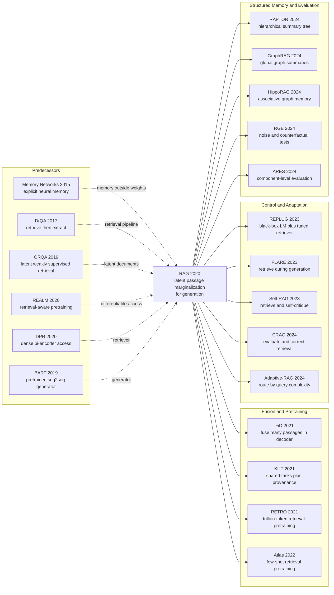

# RAG — 把维基百科变成生成模型的可替换记忆

> **2020 年 5 月 22 日，Patrick Lewis、Ethan Perez、Aleksandra Piktus 等 12 位作者把 [arXiv:2005.11401](https://arxiv.org/abs/2005.11401) 上传到 arXiv，随后发表于 NeurIPS 2020。** 当时最强的「闭卷」路线试图把事实全塞进 110 亿参数的 T5；这篇论文却把一部分记忆搬出权重，放进 2100 万段可搜索、可替换的维基百科文本，再让 4 亿参数级 BART 在生成时读取它。结果不是一个更大的语言模型，而是一种新的系统边界：RAG-Sequence 在 Natural Questions 上以 44.5 EM 超过 T5-11B 的 34.5 和 DPR 的 41.5；换掉 2016/2018 两版索引，模型无需重训就会随之回答两代国家领导人。它最反直觉的遗产是：模型知道什么，不必只由参数决定。

## 一句话总结

Patrick Lewis、Ethan Perez、Aleksandra Piktus 等 12 位作者发表于 NeurIPS 2020 的 RAG，把 [BERT（2018）](/era3_attention/2018_bert/) 家族的 DPR 双塔检索器与 BART-large 生成器接成一个含隐变量文档 $z$ 的概率模型：RAG-Sequence 计算 $\sum_z p_\eta(z\mid x)\prod_i p_\theta(y_i\mid x,z,y_{<i})$，整句共享同一份证据；RAG-Token 则把求和移进乘积，让每个 token 都能重新混合证据。它没有文档标签，只靠答案的边缘似然共同微调 query encoder 与生成器。Natural Questions 上，626M 神经组件构成的 RAG-Sequence 得到 44.5 EM，超过「把知识塞进参数」的 T5-11B（34.5）和「检索后抽取」的 DPR（41.5）；即使 top-K 文档不含答案字符串，它仍有 11.8% 能答对。后来 [GPT-3（2020）](/era4_foundation_models/2020_gpt3/) 把参数记忆推到极致，[ReAct（2022）](/era4_foundation_models/2022_react/) 则把检索扩展成显式工具行动，而 FiD、RETRO、Atlas、Self-RAG 与 GraphRAG 持续改写「何时查、查什么、怎样用」。隐藏 lesson 不是「检索能消灭幻觉」：论文自己的 BM25、null document 与 retrieval collapse 实验恰好说明，外部记忆只是把错误从模型权重转移为一条可观察、可更新、也必须单独评测的检索链。

---

## 历史背景

### 2020 年的知识密集型 NLP 卡在哪里

2020 年春天，NLP 已经有一套看似顺畅的路线：先预训练一个大模型，再把所有下游任务改写成分类或 text-to-text。BERT 把上下文表征变成通用接口，BART 和 T5 又把分类、问答、摘要统一到序列生成。然而一碰到「谁在某年担任某国总统」「一部作品由谁创作」这类知识密集型问题，统一接口并没有消除知识的物理边界。事实被压在参数里，能否取出取决于训练语料、模型容量和 prompt；知识过期后，很难只改一条记录；答案错了，也无法像搜索系统那样查看证据路径。[LAMA（Petroni 等，EMNLP 2019）](https://aclanthology.org/D19-1250/) 已证明语言模型确实能充当隐式知识库，但它同时把「能背下来」与「能可靠访问」之间的距离暴露出来。[Closed-book QA（Roberts、Raffel、Shazeer，2020）](https://arxiv.org/abs/2002.08910) 将这条路线推到 T5-11B：Natural Questions 达到 34.5 EM，却需要 110 亿参数承担语言能力与事实存储两种职责。

另一边，开放域问答已经会「开卷」。[DrQA（Chen 等，ACL 2017）](https://aclanthology.org/P17-1171/) 先用稀疏搜索从维基百科取文档，再由 reader 抽取答案；[ORQA（Lee、Chang、Toutanova，ACL 2019）](https://aclanthology.org/P19-1612/) 和 [REALM（Guu 等，2020）](https://arxiv.org/abs/2002.08909) 把检索文档当隐变量，开始让下游信号反向训练 retriever；[DPR（Karpukhin 等，EMNLP 2020）](https://aclanthology.org/2020.emnlp-main.550/) 用两个 BERT-base 编码器替代 BM25，在多项数据集上把 top-20 passage retrieval accuracy 绝对提高 9–19 个点。但这些系统的终点仍通常是「从某段文字截出一个 span」。它们能找到答案，却不擅长综合数段证据、改写成完整句子或执行开放式生成。参数模型会说但证据封闭，检索模型有证据但输出受限，RAG 正是在这条断裂处出现。

### 直接逼出 RAG 的四条线

第一条是**外部记忆**。[Memory Networks（Weston、Chopra、Bordes，2015）](https://arxiv.org/abs/1410.3916) 把长期记忆与可学习访问机制写进神经网络，[End-To-End Memory Networks（Sukhbaatar 等，2015）](https://arxiv.org/abs/1503.08895) 再用可微注意力去掉强监督步骤。它们给了 RAG「记忆不必等于权重」的语言，却没有现成的、预装 2100 万段百科文本的通用生成器。

第二条是**开放域检索问答**。DrQA 建立「retrieve then read」工程范式，ORQA/REALM 把检索改成潜变量学习，DPR 则在 RAG 上传前一个多月提交 arXiv:2004.04906，提供可直接初始化的高召回 dense retriever。RAG 没有重新发明 DPR，而是把它从抽取流水线里拆出来，当成生成模型的可微先验 $p_\eta(z\mid x)$。

第三条是**预训练 seq2seq**。[BART（Lewis 等，2019）](https://arxiv.org/abs/1910.13461) 证明一个 4 亿参数级 denoising encoder-decoder 可以稳定完成问答与生成；T5 证明任务可以统一成输入文本到输出文本。于是 RAG 不必从头训练会说话的模型，只需把 passage 与输入拼接，让 BART 学会读检索结果。

第四条是**参数记忆的争论**。LAMA 问「语言模型是不是知识库」，closed-book QA 问「参数到底能装多少知识」，[kNN-LM（Khandelwal 等，ICLR 2020）](https://openreview.net/forum?id=HklBjCEKvH) 则把最近邻数据存储直接插进语言模型概率。这四条线在 2020 年前五个月同时到位，RAG 的贡献不是发明每个零件，而是给出一个可在多任务上 fine-tune、可生成、可边缘化证据的统一接口。

### 作者团队为何能把它们接起来

作者名单本身就是路线图。Fabio Petroni、Tim Rocktäschel、Sebastian Riedel、Patrick Lewis 参与 LAMA，把参数知识的问题定义清楚；Vladimir Karpukhin、Patrick Lewis、Wen-tau Yih 参与 DPR，掌握 dense retrieval；Mike Lewis 与 Naman Goyal 参与 BART，提供 seq2seq 生成器。RAG 的 12 位作者跨 Facebook AI Research、University College London 与 New York University，把三组近邻项目在同一篇论文中接上。这也解释了为什么系统看起来「自然」：每个组件都已经在团队手里完成预训练，真正缺的是概率耦合和跨任务验证。

NeurIPS 的[官方 meta-review](https://proceedings.neurips.cc/paper_files/paper/2020/file/6b493230205f780e1bc26945df7481e5-MetaReview.html) 当时就准确抓住这一点：组合得整洁，但并非惊人的架构创新；主要弱点是 novelty，强实证结果和潜在实践影响足以支持接收。六年后回看，这个判断比「横空出世」更有解释力。RAG 的影响来自它把已有零件压成可复用系统边界，并给这条边界命名，而不是靠一个此前无人见过的层。

### 当时的数据、算力与工程边界

主实验把 2018 年 12 月英文维基百科切成互不重叠的 100-word chunks，共 2100 万段。DPR document encoder 预先编码整库，FAISS 用 HNSW 近似做 maximum inner-product search。训练采用 Fairseq、mixed precision 与 8 张 32 GB NVIDIA V100；未压缩索引占约 100 GB CPU memory，论文提交后提供的压缩形式降到 36 GB。这个配置说明 2020 年的 RAG 不是今日常见的「调用一个 embedding API + 向量数据库」：它需要维护百科级离线索引、CPU 检索与多 GPU 生成训练之间的数据通路。

规模也决定了设计取舍。BART-large 在附录中记为 406M 参数，DPR 的 query/document BERT-base 各 110M，神经组件合计 626M；但 document encoder 在任务微调时冻结，否则每次更新都要重算 2100 万向量。系统只训练 query encoder 与 BART。检索训练用 $K\in\{5,10\}$，测试时再按任务调节；短答案的 RAG-Sequence 最终可取 50 段并做 Thorough Decoding。换句话说，论文展示的不是一个廉价技巧，而是一笔明确的交换：用外部存储、检索延迟与多路生成，换取可更新知识和更小的参数记忆压力。

## 研究背景与动机

### 从封闭参数到可读写记忆

论文把 BART 权重称为 **parametric memory**，把维基百科向量索引称为 **non-parametric memory**。这个命名最重要的地方不在术语，而在操作权限：参数记忆通过预训练吸收语言规律与常见事实，压缩强、泛化好，却不能精确地删改一条事实；非参数记忆保留原始文本，人可以查看、替换和追加，却依赖检索质量。RAG 不要求二选一。检索到「The Sun Also Rises」的片段后，BART 参数里已学会的书名补全能力可以接着完成句子；若检索段落只给线索、不含答案字符串，生成器仍可能组合出正确答案。Natural Questions 上，这类 top-K 无答案字符串的案例仍有 11.8% 被答对，正好展示两种记忆不是简单复制关系。

热切换实验把「可写」变成可测结果。作者为 82 个在 2016 至 2018 年间更换任职者的世界领导职位构建两版维基索引：匹配年份时分别答对 70% 与 68%，交叉使用旧问新库或新问旧库时降到 12% 与 4%。这不是说权重中的旧事实已经删除，而是证明外部记忆能在不反向传播的情况下改变系统行为。模型更新从「重新训练全部知识」变成「更新一部分可见语料」，正是后来企业知识库、实时搜索和私有文档问答抓住的工程价值。

### 论文真正提出的问题

RAG 要解决的核心并非「如何搜文档」，而是：**当检索结果没有文档标签时，如何把多个候选证据纳入生成概率，并让最终答案反过来训练检索？** 论文将 passage $z$ 设为 latent variable，用 $p_\eta(z\mid x)$ 表示 DPR 的检索先验，用 $p_\theta(y_i\mid x,z,y_{<i})$ 表示 BART 的条件生成，再对 top-K 文档求和。这样，训练样本只需 $(x,y)$，不必为每个任务再标「正确文档」。

第二个问题是边缘化粒度：一整句是否应由同一文档负责，还是每个 token 都可切换证据？RAG-Sequence 与 RAG-Token 正是两种答案。前者更接近「选一个来源再写完整答案」，后者更接近「写每个词时混合多份来源」。论文没有宣布其中一个普遍胜出：RAG-Sequence 在 Natural Questions、CuratedTrec 与 MS-MARCO 更强，RAG-Token 在 Jeopardy Q-BLEU-1 更强；任务需要几份事实、输出多长、解码成本多高，共同决定选择。这种保留两种概率语义、让实验而非口号决定的做法，是原论文比后来「检索即拼 prompt」更严谨的部分。

---

## 方法详解

### 整体框架：先检索，再把文档当隐变量生成

RAG 接收输入序列 $x$，先让 DPR query encoder 得到向量 $q(x)$，再从 2100 万段维基文本中用 maximum inner-product search 取 top-K passages。每一段 $z_k$ 都与原输入拼接，分别送入同一个 BART-large。关键不在「把检索文本塞进 prompt」这一步，而在最后：系统不提前把某一段判成唯一真相，而是将 passage 当 latent variable，用 retriever probability $p_\eta(z_k\mid x)$ 对多个生成分布 $p_\theta(y\mid x,z_k)$ 做边缘化。

```text
Input x
  -> DPR query encoder q(x)
  -> FAISS MIPS over 21M fixed passage vectors
  -> top-K {(z_k, p_eta(z_k|x))}
  -> K copies of [passage z_k ; input x]
  -> shared BART-large encoder-decoder
  -> K conditional generation distributions
  -> latent-document marginalization
  -> output y
```

| 组件 | 论文实例 | 参数/规模 | 任务微调时状态 |
|---|---|---:|---|
| Query encoder | BERT-base from DPR | 110M | 更新 |
| Document encoder | BERT-base from DPR | 110M | 冻结 |
| Generator | BART-large | 406M | 更新 |
| Non-parametric memory | Dec. 2018 Wikipedia | 21M × 100-word passages | 可替换，不反向传播 |

这套框架有一个容易被后来的「naive RAG」遮住的反直觉点：**检索结果不是确定性上下文，而是带概率的候选解释**。若 passage A 的 retrieval score 高但不利于生成正确答案，passage B 的 score 稍低却让目标序列概率大，边缘似然会把训练信号同时传给生成器和 query encoder。检索和生成因此不是两个完全独立的 API 调用，而是同一个概率目标的两部分。

### 关键设计一：参数记忆与非参数记忆分工

**功能**：让语言规律、常见知识与表达能力留在 BART 权重中，同时把长尾事实、可追溯文本和可更新知识放进外部索引。论文没有声称两类记忆彼此隔离；恰恰相反，生成时它们相乘并互相补足。

对于一个 passage $z$，生成器的条件概率是：

$$
p_\theta(y\mid x,z)=\prod_{i=1}^{N}p_\theta(y_i\mid x,z,y_{1:i-1})
$$

BART 看到的是 passage 与 input 的拼接。下面的伪代码保留论文语义而省略 tokenizer 与 padding；两种语言版本使用同一段代码，避免把解释差异误写成算法差异。

```python
def encode_with_memory(generator, input_ids, passages):
    conditioned = []
    for passage in passages:
        # The generator receives raw, human-readable evidence plus the input.
        joint_input = concatenate(passage.token_ids, input_ids)
        conditioned.append(generator.encode(joint_input))
    return stack(conditioned)  # [batch, K, sequence, hidden]
```

| 记忆类型 | 存什么 | 如何更新 | 优点 | 失败方式 |
|---|---|---|---|---|
| Parametric | BART 权重中的语言与事实模式 | 训练或微调 | 压缩、泛化、可补全 | 过期、难定位、会幻觉 |
| Non-parametric | 原始 Wikipedia passages + dense vectors | 替换/追加索引 | 可读、可追溯、长尾覆盖 | 检索错、语料偏、延迟高 |
| RAG hybrid | 两者的条件概率乘积 | 分别维护权重与索引 | 证据引导生成，生成补足线索 | 可能忽略证据或过度服从错误证据 |
| Parametric-only BART | 仅模型权重 | 重新训练 | 系统简单 | 论文中生成更泛、更少事实细节 |

**设计动机**：闭卷 T5-11B 证明扩大参数能提高事实问答，却把「知识更新」变成昂贵的权重操作；纯 extractive reader 则要求答案字符串真的出现在某段文档里。RAG 允许 passage 只提供线索。论文在 Natural Questions 上专门统计：当 top-K 文档都不含答案字符串时，RAG 仍有 11.8% 的答案正确。这里不是生成器凭空胜利，而是外部证据缩小语义空间，参数记忆完成同义改写、关系组合或常见实体补全。

热切换实验进一步说明分工。对 82 个领导职位，2016 index 配 2016 答案为 70%，2018 index 配 2018 答案为 68%；错配时只有 12% 与 4%。可替换索引改变了回答，但并未证明权重里的冲突事实消失。**因此 hybrid memory 的正确理解是「外部记忆可以主导一部分行为」，不是「外部记忆覆盖了参数中的一切」。**

### 关键设计二：DPR 把检索变成可学习先验

**功能**：从 2100 万段中快速产生一个 top-K 概率分布，并让最终答案的 loss 调整 query representation。DPR 是 bi-encoder：文档侧与查询侧分别用 BERT-base 编码，分数是内积。

$$
p_\eta(z\mid x)=\frac{\exp(d(z)^\top q(x))}{\sum_{z'\in\operatorname{topK}(x)}\exp(d(z')^\top q(x))},\qquad d(z)=\operatorname{BERT}_d(z),\quad q(x)=\operatorname{BERT}_q(x)
$$

严格说，论文公式写的是对全库成比例，实际训练和生成用 top-K 截断后归一化。FAISS/HNSW 负责近似 maximum inner-product search；它返回 passage IDs 与 scores，再在候选集合上 softmax。

```python
def retrieve(query_encoder, fixed_index, input_ids, top_k):
    query = query_encoder(input_ids)              # trainable BERT_q
    scores, passage_ids = fixed_index.mips(query, top_k)
    retrieval_probs = softmax(scores, dim=-1)     # p_eta(z | x) over top-K
    passages = fixed_index.lookup_text(passage_ids)
    return passages, retrieval_probs
```

| 检索方案 | 表示 | 是否随任务答案学习 | 论文中的角色 | 关键代价 |
|---|---|---|---|---|
| BM25 | 稀疏词项重合 | 否 | Ablation | 同义表达召回弱，但 FEVER 很强 |
| Frozen DPR | Dense BERT vectors | 否 | Ablation | 有 NQ/TQA 先验，不能适配新任务 |
| Fine-tuned DPR query | Fixed $d(z)$ + trainable $q(x)$ | 是 | 主模型 | top-K 外文档没有梯度 |
| Fully updating DPR | Trainable $d(z)$ and $q(x)$ | 理论上是 | 未采用 | 需要周期性重建 21M index |

**设计动机**：若同时更新 document encoder，旧向量立刻与新 encoder 不一致，整个索引要频繁重算。REALM 在预训练时承担了这种成本，RAG 论文明确说没有发现它是强性能所必需，于是冻结 $\operatorname{BERT}_d$，只更新 $\operatorname{BERT}_q$。这是一个影响深远的工程妥协：它让 RAG 可以在 8 张 V100 上完成，却也让 passage space 锁定在 DPR 对 Natural Questions 与 TriviaQA 学到的几何结构里。

论文 Table 6 给出最重要的反例。Dense retrieval 在四个 QA 任务上远胜 BM25，例如 NQ dev 的 RAG-Sequence 从 31.8 升到 44.0；但 FEVER-3 上 BM25 为 75.1，主模型只有 74.5。实体中心的 claim 与词面匹配天然相合。**DPR 不是「更现代所以处处更好」；检索器的归纳偏置必须与任务匹配。**

### 关键设计三：RAG-Sequence 与 RAG-Token 的边缘化顺序

**功能**：明确回答「一份证据负责多大范围的输出」。两种模型使用完全相同的 DPR 与 BART，差别只有 sum 和 product 的顺序，却产生不同的概率语义与解码成本。

RAG-Sequence 先求每个 passage 对完整序列的 likelihood，再在 passage 间求和：

$$
p_{\text{RAG-Sequence}}(y\mid x)\approx\sum_{z\in\operatorname{topK}(x)}p_\eta(z\mid x)\prod_{i=1}^{N}p_\theta(y_i\mid x,z,y_{1:i-1})
$$

RAG-Token 则先在每个 token 位置混合文档分布，再把各位置相乘：

$$
p_{\text{RAG-Token}}(y\mid x)\approx\prod_{i=1}^{N}\sum_{z\in\operatorname{topK}(x)}p_\eta(z\mid x)p_\theta(y_i\mid x,z,y_{1:i-1})
$$

```python
def marginal_nll(retrieval_log_probs, token_log_probs, mode):
    # token_log_probs shape: [batch, K, target_length]
    if mode == "sequence":
        per_doc_sequence = token_log_probs.sum(dim=-1)
        log_p_y = logsumexp(retrieval_log_probs + per_doc_sequence, dim=1)
    elif mode == "token":
        per_token = logsumexp(
            retrieval_log_probs.unsqueeze(-1) + token_log_probs, dim=1
        )
        log_p_y = per_token.sum(dim=-1)
    return -log_p_y.mean()
```

| 属性 | RAG-Sequence | RAG-Token | 何时两者相同 | 论文观察 |
|---|---|---|---|---|
| Latent variable | 每个输出序列一个 $z$ | 每个 token 一个 $z_i$ | 输出长度为 1 | FEVER 分类等价 |
| 证据切换 | 整句不切 | token 间可切 | $K=1$ | Jeopardy 多事实时 Token 更强 |
| 标准 beam search | 不能直接用 | 可以 | 不适用 | Sequence 需 per-document beams |
| 典型优势 | 序列一致性、短答案 | 混合多文档、长生成 | 任务依赖 | NQ/CT/MS-MARCO 偏 Sequence |

Hemingway 的 Jeopardy 可视化把差别讲得最清楚。生成 “The Sun Also Rises” 时，相关 passage posterior 升高；生成 “A Farewell to Arms” 时，另一段主导；书名首词出现后 posterior 又变平，因为 BART 的参数记忆足以补完标题。RAG-Token 能在一个输出中改变证据负责者，而 RAG-Sequence 会寻找一段对整句总体最合理的文档。

反直觉的是，更灵活不等于总是更好。RAG-Sequence 在 NQ test 为 44.5，略高于 Token 的 44.1；CuratedTrec 是 52.2 对 50.0；MS-MARCO 的 Sequence ROUGE-L/BLEU-1 为 40.8/44.2，也优于 Token 的 40.1/41.5。Token 级混合可以拼信息，也可能让局部最优证据破坏整句一致性。原论文保留两个模型，正因为「证据粒度」本身是任务假设。

### 关键设计四：答案监督下的潜变量训练与可替换索引

**功能**：不标注 passage，只给 input-output pair，就让 retriever 倾向于那些能帮助 generator 产生目标答案的文档。目标是负边缘对数似然：

$$
\mathcal{L}(\eta,\theta)=-\sum_j\log p_{\eta,\theta}(y_j\mid x_j)
$$

top-K 选择本身是离散的，梯度不会穿过 FAISS 去发现候选集外的新文档；但在当前 top-K 内，$p_\eta$ 的 softmax 权重可微。若某 passage 令正确答案 likelihood 更高，loss 就提高它相对其他候选的概率。训练由此更新 query encoder 与 BART，同时保持 document vectors 稳定。

```python
def rag_training_step(batch, query_encoder, fixed_index, generator, mode):
    passages, retrieval_probs = retrieve(
        query_encoder, fixed_index, batch.input_ids, top_k=batch.top_k
    )
    token_log_probs = generator.score_targets(
        inputs=batch.input_ids,
        passages=passages,
        targets=batch.target_ids,
    )
    loss = marginal_nll(retrieval_probs.log(), token_log_probs, mode)
    loss.backward()  # updates BERT_q and BART; fixed_index/BERT_d stay frozen
    return loss
```

| 监督信号 | 是否需要 | 传到哪里 | 论文证据 | 局限 |
|---|---|---|---|---|
| Target answer $y$ | 是 | Query encoder + BART | 所有任务主训练 | 长输出可能给 retriever 弱梯度 |
| Gold passage ID | 否 | 不适用 | FEVER 也不用 evidence supervision | 初始化 DPR 已见过 NQ/TQA retrieval labels |
| Document-vector gradient | 否 | Document encoder 冻结 | 避免重建索引 | 新领域几何可能不匹配 |
| Index replacement | 推理时可选 | 直接改变候选事实 | 2016/2018 leader swap | 不能自动解决来源冲突 |

**设计动机**：为每个新生成任务标 passage 成本高，也会把检索器锁死在人工证据定义上。边缘化让答案本身充当弱监督，RAG 因而能用同一架构覆盖 QA、Jeopardy question generation 与 FEVER classification。但 Appendix H 给出边界：story generation 中 retriever 会 collapse，反复取同一批文档，随后 generator 学会忽略它们，性能退回 BART。目标只有在任务确实需要外部事实、答案对 passage 有可辨识依赖时，才会产生健康的 retrieval gradient。

索引可替换与可微训练并不矛盾。训练固定 document vectors，是为了稳定几何；推理替换整套索引，则是在同一 embedding interface 下更换 memory contents。2016/2018 实验说明这条接口有效，也提示现实系统必须做版本管理：同一权重搭配不同 corpus 就是不同知识系统，不能只给模型 checkpoint 版本号。

### 损失、训练与解码配方

RAG 没有新 optimizer，也没有额外 passage loss。创新集中在 latent-document likelihood 与如何近似它。论文给出的可复现配方如下；没有公开在论文中的学习率或 batch size 不在这里补猜。

$$
\hat{y}=\arg\max_y p_{\eta,\theta}(y\mid x)
$$

```python
def decode_rag_sequence(per_doc_beams, retrieval_log_probs, thorough=False):
    candidates = union_all(per_doc_beams)
    scores = {}
    for candidate in candidates:
        doc_scores = []
        for doc_id in range(len(per_doc_beams)):
            if candidate in per_doc_beams[doc_id] or thorough:
                seq_log_p = score_with_document(candidate, doc_id)
                doc_scores.append(retrieval_log_probs[doc_id] + seq_log_p)
        scores[candidate] = logsumexp(stack(doc_scores), dim=0)
    return max(scores, key=scores.get)
```

| 项目 | 论文配置 | 为什么重要 |
|---|---|---|
| Optimizer | Adam | 优化 query encoder 与 BART |
| Precision | Mixed precision | 8×V100 上容纳多文档生成 |
| Training hardware | 8 × NVIDIA V100 32 GB | 论文主训练环境 |
| Corpus | Dec. 2018 English Wikipedia | 所有任务共享同一知识源 |
| Passage unit | Disjoint 100-word chunks | 2100 万段，不保留跨 chunk 重叠 |
| Training K | 5 or 10 | 论文未观察到显著训练差异 |
| QA test K | Token 15; Sequence 50 | 短答案允许更多候选 |
| QA decoding | Greedy; Sequence Thorough | Beam search 没有改善 QA |
| MS-MARCO/Jeopardy K | 10 | 两种 RAG 统一设置 |
| Generation decoding | Beam 4; Sequence Fast | Thorough 没有改善长生成 |
| Index RAM | ~100 GB; compressed 36 GB | 检索可在 CPU 完成 |
| Updated parameters | BERT query + BART | Document encoder/index 固定 |

RAG-Token 可以把边缘化后的 next-token probability 直接交给普通 beam search。RAG-Sequence 必须按文档分别生成候选，再把同一候选跨文档重算与相加；Thorough Decoding 补齐候选未出现在某文档 beam 里的概率，Fast Decoding 则把这些项近似为零。这个实现差异解释了为什么 RAG-Sequence 的概率假设看起来更简单，推理却更昂贵。

最后，$K$ 不是「越大越好」的常数。NQ 上 Sequence 随 test-time documents 增加而单调提高，Token 在 10 段达到峰值；MS-MARCO 上 Token 的 ROUGE-L 随 K 提高，但 BLEU-1 下降。更多候选增加召回，也稀释 posterior、提高噪声与计算。2026 年系统把 reranker、query rewriting、context compression 放到 RAG 前后，根源都在处理这笔召回—噪声—成本三角债务。

---

## 失败案例

### 当时输给 RAG 的三类对手

第一类是**纯参数闭卷模型**。T5-11B 把事实都压进 110 亿参数，在 Natural Questions 上得到 34.5 EM；加 salient span masking（T5-11B+SSM）后是 36.6。RAG-Sequence 用 BART-large、DPR 两个 BERT-base encoder 和外部索引组成 626M 神经组件，在同一任务达到 44.5。差距不是「BART 比 T5 更大」带来的，恰好相反，T5 参数多约 17 倍。闭卷路线的假设是，只要模型足够大，知识访问就可以退化为参数解码；RAG 证明，在 2020 年的模型与数据规模上，把长尾事实交给可检索存储更省参数也更准。

生成任务上的 parametric baseline 是同一个 BART-large 去掉 retriever。Open MS-MARCO 上 BART 的 ROUGE-L/BLEU-1 为 38.2/41.6，RAG-Sequence 为 40.8/44.2，两个指标都绝对提高 2.6。Jeopardy 上 BART Q-BLEU-1 为 19.7，RAG-Token 为 22.2。更关键的是人工对照：452 对生成里，标注者在 factuality 上选择 RAG 更好的比例为 42.7%，选择 BART 更好的只有 7.1%。这不等于 RAG 有 42.7% factual accuracy，而是成对偏好；即便如此，它仍直接否定「流畅的 BART 参数已经足够生成知识文本」。

第二类是**retrieve-and-extract 流水线**。DPR 先密集检索，再用 cross-encoder rerank 与 extractive reader 截出答案，NQ/WQ/CT test 分别为 41.5/41.1/50.6。RAG 最佳结果分别为 44.5/45.5/52.2。抽取系统的设计假设是答案必须以连续 span 出现在候选文本里；RAG 可以利用只含线索的文档，再由参数记忆改写。论文的强诊断数据是：NQ 中 top-K passages 都不含 answer string 时，RAG 仍答对 11.8%，严格抽取器在该子集理论上只能是 0。

第三类是**固定或词面检索**。Table 6 的 dev ablation 把 task-learned DPR query encoder 换成 frozen DPR 或 BM25。NQ 上 RAG-Sequence 从主模型 44.0 降到 frozen 41.2、BM25 31.8；TriviaQA 从 55.8 降到 52.1、44.1；WebQuestions 从 44.9 降到 41.8、36.6。失败的不是「检索」这个动作，而是检索器没有从最终答案学到任务相关的查询几何。

### 作者实际试过但放弃的方案

最明确的失败写在 Appendix F：作者为 top-K passages 再加一个 empty document，让模型在「没有有用证据」时选择 null。null logit 有三种实现：学习一个 null-document embedding、学习一个静态 bias、或用 neural network 预测。三种都没有提高性能，最终模型全部删掉。Open MS-MARCO 中，一些问题本来就无法靠维基百科回答；RAG 对这类输入往往反复取某些固定文档，generator 实际学会忽略它们。这个结果说明，隐式忽略在该实验里比显式 null gate 简单，但它不等价于可靠 abstention。

第二个失败来自 Appendix H 的 story generation preliminary experiments。Retriever 逐渐 collapse，无论输入是什么都取同一批文档；随后 generator 发现文档没有信息，直接忽略 retrieval，整体表现退回 BART。作者给出两个可能原因：故事生成对外部事实的需求不明确，或长 target sequence 向 retriever 提供的梯度过于稀薄。这是原论文自己给出的硬反例：latent marginal likelihood 并不会自动学出有意义的检索。

第三个失败发生在 decoding。开放域 QA 中，beam search 没有改善结果，所以论文使用 greedy decoding。Open MS-MARCO 与 Jeopardy 的 RAG-Sequence 中，Thorough Decoding 需要为每个未出现在某 document beam 的候选补做 forward pass，但没有带来改进，作者改用 Fast Decoding，把缺失候选在该文档下的概率近似为零。这里作者主动选择了概率上更粗糙但计算更便宜的方案。

第四个不是模块失败，而是监督边界。论文没有训练 FEVER 的 evidence-sentence extraction 子任务，因为 RAG 使用的维基 dump 与 FEVER 不同，无法直接对齐 gold evidence。RAG-3way classification 达到 72.5，离使用复杂 pipeline 的 76.8 仍差 4.3；2-way 为 89.5，离使用 gold evidence 的 92.2 差 2.7。统一架构降低了专用工程，却没有自动赢过拥有更强监督的任务系统。

### 论文结果里的反例：检索不是单调增益

**BM25 在 FEVER 上赢了。** Table 6 中 BM25 的 FEVER-3/2 dev accuracy 是 75.1/91.6，主模型 DPR 是 74.5/90.6，frozen DPR 更低到 72.9/89.4。FEVER claim 通常实体词明确，词面重合就是强信号；dense semantic matching 可能取回主题相关但无法直接验证 claim 的段落。这个反例后来成为 hybrid search 的理由：稀疏与密集检索不是时代替换关系。

**更多文档不总会更好。** Figure 3 显示 NQ 上 RAG-Sequence 随 test-time passages 增加而单调改善，RAG-Token 却在 10 段达到峰值；MS-MARCO 上，增加文档让 Token 的 ROUGE-L 上升但 BLEU-1 下降。多取文档扩大 recall，也扩大 posterior competition 与噪声。固定 top-K 不能同时适配短事实问答、长生成和分类。

**更灵活的 RAG-Token 也不总会赢。** 它在 Jeopardy 的 BLEU-1/Q-BLEU-1 为 17.3/22.2，高于 Sequence 的 14.7/21.4，符合多事实问题需要 token 级切换证据的解释；但 Sequence 在 NQ、CT 与 MS-MARCO 更好，而且 distinct trigram ratio 更高。把 passage choice 做到 token 粒度增加表达能力，也增加局部证据拼接的不一致风险。

**换索引只更新索引能影响的部分。** 2016/2018 leader test 的匹配结果为 70%/68%，并非接近 100%；错配仍有 12%/4% 正确，说明一部分答案来自权重或稳定常识。Hot swap 证明行为可改，不证明参数记忆会服从、来源会无冲突、或每项新知识都会被用到。

### 真正的反 baseline 教训

RAG 不是最早把搜索接到神经模型上的工作。DrQA 早三年建立 retrieve-then-read，ORQA 与 REALM 已经有 latent dense retrieval，DPR 与 RAG 几乎同期，BART 则提供现成 generator。官方 meta-review 甚至把 novelty 列为主要弱点。为什么最后是 RAG 变成通用名词？因为它把竞争路线各自最强的部分放进一个足够简单的概率接口：DPR 提供可扩展访问，BART 提供开放输出，latent marginalization 去掉 task-specific passage labels，统一实验横跨 extractive-style QA、abstractive QA、question generation 与 classification。

这里的工程哲学不是「端到端一定胜过 pipeline」，而是：**先把系统边界画在最容易替换、最容易测错的地方。** RAG 把事实语料放到权重外，因此 corpus 可版本化；把文档概率显式写进生成 likelihood，因此 retriever 可做 ablation；保留 Sequence 与 Token 两种语义，因此失败可以归因到证据粒度。后来的产品常把 RAG 简化成 embedding、top-K、prompt 三步，反而丢掉了原论文最严谨的部分：检索和生成必须分别评测，证据可见也不代表答案有证据支持。

## 实验关键数据

### 主实验：开放域问答与生成

Table 1 的测试集结果构成论文最核心的量化论据。TriviaQA 同时列标准 open-domain split 与 TQA-Wiki split；RAG 在标准 split 没有超过 DPR 的 57.9，但在与 T5 可比的 Wiki split 达到 68.0。因而准确说法是：RAG 在 NQ、WQ、CT 建立新结果，并在 T5 可比的 TQA-Wiki 上领先，而不是无条件横扫 TriviaQA 的每个 split。

| Family | Model | NQ EM | TQA standard / Wiki EM | WQ EM | CT EM |
|---|---|---:|---:|---:|---:|
| Closed book | T5-11B | 34.5 | - / 50.1 | 37.4 | - |
| Closed book | T5-11B + SSM | 36.6 | - / 60.5 | 44.7 | - |
| Open book | REALM | 40.4 | - / - | 40.7 | 46.8 |
| Open book | DPR | 41.5 | 57.9 / - | 41.1 | 50.6 |
| RAG | RAG-Token | 44.1 | 55.2 / 66.1 | **45.5** | 50.0 |
| RAG | **RAG-Sequence** | **44.5** | 56.8 / **68.0** | 45.2 | **52.2** |

生成与分类测试把同一架构放到完全不同的输出形态。星号表示使用 gold context/evidence 的外部 SotA；RAG 不使用 MS-MARCO 提供的 gold passages，也不使用 FEVER evidence supervision。

| Model | Jeopardy B-1 | Jeopardy QB-1 | MS-MARCO R-L | MS-MARCO B-1 | FEVER-3 Acc. | FEVER-2 Acc. |
|---|---:|---:|---:|---:|---:|---:|
| SotA with gold where marked | - | - | 49.8* | 49.9* | 76.8 | 92.2* |
| BART | 15.1 | 19.7 | 38.2 | 41.6 | 64.0 | 81.1 |
| **RAG-Token** | **17.3** | **22.2** | 40.1 | 41.5 | **72.5** | **89.5** |
| **RAG-Sequence** | 14.7 | 21.4 | **40.8** | **44.2** | equivalent | equivalent |

### 检索消融与人工评价

Table 6 是 dev set，不应与上面的 test score 混用。它同时回答两个问题：task fine-tuning 是否真的改变 retrieval，以及 dense 是否必然胜过 sparse。

| Variant | NQ | TQA | WQ | CT | Jeopardy B-1 | Jeopardy QB-1 | MS R-L | MS B-1 | FVR3 | FVR2 |
|---|---:|---:|---:|---:|---:|---:|---:|---:|---:|---:|
| RAG-Token-BM25 | 29.7 | 41.5 | 32.1 | 33.1 | 17.5 | 22.3 | 55.5 | 48.4 | **75.1** | **91.6** |
| RAG-Sequence-BM25 | 31.8 | 44.1 | 36.6 | 33.8 | 11.1 | 19.5 | 56.5 | 46.9 | - | - |
| RAG-Token-Frozen | 37.8 | 50.1 | 37.1 | 51.1 | 16.7 | 21.7 | 55.9 | 49.4 | 72.9 | 89.4 |
| RAG-Sequence-Frozen | 41.2 | 52.1 | 41.8 | 52.6 | 11.8 | 19.6 | 56.7 | 47.3 | - | - |
| **RAG-Token** | **43.5** | **54.8** | **46.5** | 51.9 | **17.9** | **22.6** | 56.2 | **49.4** | 74.5 | 90.6 |
| **RAG-Sequence** | **44.0** | **55.8** | 44.9 | **53.4** | 15.3 | 21.5 | **57.2** | 47.5 | - | - |

Jeopardy 的 452 对人工评价采用 pairwise majority，下面各列总和为 100%。它证明偏好方向，不应被改写成绝对 factuality 或 specificity accuracy。

| Majority judgment | More factual | More specific |
|---|---:|---:|
| BART better | 7.1% | 16.8% |
| RAG better | **42.7%** | **37.4%** |
| Both good | 11.7% | 11.8% |
| Both poor | 17.7% | 6.9% |
| No majority | 20.8% | 20.1% |

论文还在不采用 diversity-promoting decoding 的条件下统计 distinct/total trigrams。RAG-Sequence 在两个生成任务中都最接近 gold diversity，说明 retrieval 不只增加事实，也减少 parametric generator 的高频模板复用。

| Model | MS-MARCO distinct trigrams | Jeopardy distinct trigrams |
|---|---:|---:|
| Gold | 89.6% | 90.0% |
| BART | 70.7% | 32.4% |
| RAG-Token | 77.8% | 46.8% |
| **RAG-Sequence** | **83.5%** | **53.8%** |

### 六个关键发现

1. **外部记忆在相近甚至更小的参数预算下胜过闭卷存储。** NQ 上 44.5 对 34.5，且对手 T5-11B 远大于 RAG 的 626M 神经组件；这里的增益不能归因于简单扩参。
2. **生成能突破 extractive upper bound。** Top-K 不含答案字符串时仍有 11.8% 正确，说明 passage 可以提供关系线索而非复制目标 span。
3. **任务学习主要发生在 query side。** 冻结 DPR 相比 fine-tuned query encoder 在所有任务都退化，证明答案边缘似然确实在塑造 retrieval，而非 BART 单独吸收一切。
4. **稀疏检索没有被淘汰。** FEVER 的 BM25 75.1/91.6 高于 DPR 74.5/90.6，是整篇论文最值得保留的反直觉消融。
5. **证据粒度影响生成风格。** Token 在 Jeopardy Q-BLEU-1 最强，Sequence 在 MS-MARCO 与 diversity 更强，没有一种 marginalization 支配所有任务。
6. **可更新不等于可信。** Index swap 能改变领导人答案，论文的 Broader Impact 同时承认 Wikipedia 会有错误与偏见；可写 memory 也让错误、污染和对抗文本进入模型路径。

---

## 思想史脉络

### 引用与继承图



图里的虚线不是「引用次数」，而是六种直接输入：外部记忆概念、retrieve-then-read 流水线、latent retrieval、retrieval-aware pretraining、DPR 访问器与 BART 生成器。实线则表示 RAG 之后被清楚改写的系统问题。这样画能避免一个常见叙事错误：把 2020 RAG 说成检索生成的起点。它更准确的位置是一个汇合点，后来又分裂成 passage fusion、预训练、黑盒接入、主动检索、结构化 memory 与评测六条线。

### 前世：哪些工作把 RAG 逼出来

- **2015 Memory Networks**（Weston、Chopra、Bordes，[arXiv:1410.3916](https://arxiv.org/abs/1410.3916)）：将长期记忆与可学习访问写入网络，提供「权重之外还有 memory」的概念原型；RAG 把小型 memory slots 换成了人类可读写的原始文本库。
- **2017 DrQA**（Chen、Fisch、Weston、Bordes，[ACL 2017](https://aclanthology.org/P17-1171/)）：证明 Wikipedia-scale retrieve-then-read 可行，但 TF-IDF + extractive reader 将输出锁在 passage spans；RAG 保留检索规模，换成开放生成。
- **2019 ORQA**（Lee、Chang、Toutanova，[ACL 2019](https://aclanthology.org/P19-1612/)）：在只有 question-answer supervision 时把文档设为 latent，给 RAG 的 marginal likelihood 提供直接概率祖先；它仍聚焦 extractive QA。
- **2019 BART**（Lewis 等，[arXiv:1910.13461](https://arxiv.org/abs/1910.13461)）：提供预训练 encoder-decoder，使 retrieved passage 能以普通文本拼接到输入，生成器无需为每项任务从头训练。
- **2020 REALM**（Guu 等，[arXiv:2002.08909](https://arxiv.org/abs/2002.08909)）：把 dense retrieval 插入 masked-language-model pretraining，并周期更新 index；RAG 借走 differentiable latent access，却冻结 document encoder 以降低任务微调成本。
- **2020 DPR**（Karpukhin 等，[EMNLP 2020](https://aclanthology.org/2020.emnlp-main.550/)）：用 BERT bi-encoder 把 top-20 retrieval accuracy 相对 Lucene-BM25 提高 9–19 个绝对点，直接成为 RAG 的检索初始化与 2100 万段索引接口。

这里还夹着两条观念线。[LAMA](https://aclanthology.org/D19-1250/) 证明参数会存事实，[closed-book T5](https://arxiv.org/abs/2002.08910) 证明模型规模能换来问答准确率；RAG 接受这两点，却拒绝「所以所有知识都该留在参数里」的推论。[kNN-LM](https://openreview.net/forum?id=HklBjCEKvH) 同期把 token-level nearest-neighbor distribution 与 LM 混合，说明概率模型可以显式组合参数与数据存储。RAG 的特殊一步，是把检索对象改成人类可读 passage，并将组合推到任意 seq2seq 输出。

### 今生：继承者如何改写原问题

- **直接派生：如何融合更多 passage。** [FiD（Izacard、Grave，EACL 2021）](https://aclanthology.org/2021.eacl-main.74/) 分别编码大量 passages，再让 decoder 跨 passage attention 汇总，性能随 retrieved passages 增加而改善；它放弃 RAG 显式的 Sequence/Token latent mixture，换取更直接的多证据融合。[KILT（Petroni 等，NAACL 2021）](https://arxiv.org/abs/2009.02252) 则统一 Wikipedia snapshot、任务与 provenance metrics，让「答对」之外还能测「找对来源」。
- **跨训练阶段：让 retrieval 参与预训练。** [RETRO（Borgeaud 等，2021）](https://arxiv.org/abs/2112.04426) 从 2 trillion token database 检索相邻 chunks，用 frozen BERT retriever 与 chunked cross-attention 从头训练 LM，并报告以少 25 倍参数达到可比 GPT-3/Jurassic-1 的 Pile 表现。[Atlas（Izacard 等，2022）](https://arxiv.org/abs/2208.03299) 针对 few-shot knowledge tasks 预训练 retrieval-augmented LM，仅用 64 个 Natural Questions examples 就超过 42% accuracy。RAG 的 task-time coupling 被推进到 pretraining-time memory design。
- **跨模型接口：把生成器当黑盒。** [REPLUG（Shi 等，2023）](https://arxiv.org/abs/2301.12652) 与 [In-Context RALM（Ram 等，TACL 2023）](https://arxiv.org/abs/2302.00083) 不修改 LM architecture，只把文档放进 context；REPLUG 再让 frozen LM 监督 retriever。这条线牺牲原始 RAG 的端到端 generator tuning，换来可接 API-only 模型的部署性。
- **主动与纠错：决定何时检索、是否相信。** [FLARE（Jiang 等，EMNLP 2023）](https://arxiv.org/abs/2305.06983) 用下一句预测与 low-confidence tokens 在长文生成途中触发 retrieval；[Self-RAG（Asai 等，2023）](https://arxiv.org/abs/2310.11511) 学习 retrieval 与 reflection tokens；[CRAG（Yan 等，2024）](https://arxiv.org/abs/2401.15884) 先评价 retrieved documents，再触发纠错或 web search；[Adaptive-RAG（Jeong 等，NAACL 2024）](https://arxiv.org/abs/2403.14403) 按 query complexity 在 no-retrieval、single-step 与 iterative strategies 之间路由。它们都在修原始 RAG「每个输入固定取 K 段」的假设。
- **跨记忆结构：从扁平 chunks 到层级与图。** [RAPTOR（Sarthi 等，2024）](https://arxiv.org/abs/2401.18059) 递归聚类、摘要，构建多层树；[GraphRAG（Edge 等，2024）](https://arxiv.org/abs/2404.16130) 用 entity communities 与预生成 summaries 回答全局 corpus questions；[HippoRAG（Gutiérrez 等，NeurIPS 2024）](https://arxiv.org/abs/2405.14831) 把 knowledge graph 与 Personalized PageRank 组合做 multi-hop associative retrieval。它们都指出 100-word flat chunks 擅长局部事实，却不天然表达跨段关系。
- **跨任务渗透：从短 QA 到对话、工具与长上下文。** [Internet-Augmented Dialogue（Komeili、Shuster、Weston，2021）](https://arxiv.org/abs/2107.07566) 让对话模型生成 live web query；[WebGPT（Nakano 等，2021）](https://arxiv.org/abs/2112.09332) 把一次性向量检索扩成可浏览、可收集 references 的行动策略；[ReAct（2022）](/era4_foundation_models/2022_react/) 再将 search 嵌入 Thought-Action-Observation 循环。检索从前处理模块变成 agent action。
- **评测反过来约束架构。** [RGB（Chen 等，AAAI 2024）](https://arxiv.org/abs/2309.01431) 将能力拆成 noise robustness、negative rejection、information integration 与 counterfactual robustness；[RECALL（Liu 等，2023）](https://arxiv.org/abs/2311.08147) 证明 external context 也会携带 counterfactual knowledge；[ARES（Saad-Falcon 等，NAACL 2024）](https://aclanthology.org/2024.naacl-long.20/) 和 [RAGChecker（Ru 等，2024）](https://arxiv.org/abs/2408.08067) 分别测 context relevance、faithfulness、answer relevance 与模块级 trade-off。原论文的 EM/BLEU 已无法覆盖系统失效面。
- **跨学科外溢：谨慎地说，没有一条已核验的独立学科定律。** 原论文 Broader Impact 提出可换 medical index，后续 survey 扩展到多模态与专业领域；但把「在医疗/法律语料上部署」说成 RAG 已改变医学或法学方法，证据不足。可验证的外溢是工程接口跨领域复用，领域可靠性仍须由各自数据、来源与评测承担。

### 误读与过度简化

1. **「RAG 发明了 retrieval + generation。」** 不对。DrQA、Wizard of Wikipedia、retrieve-and-refine、ORQA、REALM 都在它之前。RAG 的独特贡献是把预训练 DPR、预训练 seq2seq 与 latent-document marginalization 组合成跨任务生成 recipe，并通过 Sequence/Token 两种概率语义验证。
2. **「检索到的 passage 就是 citation，因此答案可追溯。」** 原论文说 retrieved knowledge 可以被 inspected，但没有 claim-level entailment 或 citation precision 评测。Retriever 找到主题相关段落，不代表生成的每个事实由它支持；KILT、WebGPT、ARES 等后续工作正是为了补 provenance 与 faithfulness 缺口。
3. **「RAG 消灭 hallucination。」** 论文只报告相对 BART 更 factual 的 pairwise human preference，并在 Broader Impact 承认 Wikipedia 可能错误、有偏。Appendix H 还展示 retriever collapse。RGB 与 RECALL 后来进一步证明 noise、negative evidence 与 counterfactual context 会诱导新错误。
4. **「RAG 就是把 top-K 文本贴进 prompt。」** 这是 2023 年 black-box RAG 的常见实现，不是 2020 论文的完整定义。原模型对 passage 分布做概率 marginalization，并用 answer loss 调 query encoder；REPLUG 与 In-Context RALM 的价值之一，恰恰是后来证明简化接口也能工作。
5. **「Non-parametric memory 免费而且无限。」** Index vectors 不通过梯度训练，不等于没有成本。原系统的 2100 万段索引约占 100 GB CPU RAM，压缩后仍为 36 GB；每多一个 passage 都可能增加 BART forward 与 decoding cost。外部记忆把参数成本转成存储、检索、版本、权限和延迟成本。

---

## 当代视角

### 站不住的四个假设

1. **每个输入都应固定检索 top-K。** 原始 RAG 对所有样本先取 5 或 10 段，测试时按任务统一调 K。这个规则实现简单，却没有区分「2+2 等于几」与需要多跳证据的问题。[Self-RAG（2023）](https://arxiv.org/abs/2310.11511) 学习按需检索并用 reflection tokens 评价证据；[Adaptive-RAG（NAACL 2024）](https://arxiv.org/abs/2403.14403) 按 query complexity 在 no-retrieval、single-step 与 iterative retrieval 之间路由；[FLARE（EMNLP 2023）](https://arxiv.org/abs/2305.06983) 则在生成途中遇到 low-confidence future tokens 才查。到 2026 年，固定 K 更适合作为 baseline，不适合作为系统原则。
2. **扁平的 100-word chunks 足以表示知识。** 它对「谁」「何时」「在哪里」这类局部事实有效，却会切断跨段关系、层级主题与全库概览。[RAPTOR（2024）](https://arxiv.org/abs/2401.18059) 用递归摘要树跨 abstraction levels 检索；[GraphRAG（2024）](https://arxiv.org/abs/2404.16130) 明确指出普通 RAG 无法回答 “What are the main themes in the dataset?” 这类 global questions，于是构建 entity communities 与 summaries；[HippoRAG（NeurIPS 2024）](https://arxiv.org/abs/2405.14831) 用 graph + Personalized PageRank 处理 multi-hop association。Chunking 不是预处理细节，而是 memory schema。
3. **预训练 DPR 的语义空间可以迁移到所有任务。** 原论文自己已经用 FEVER 否定它：BM25 dev accuracy 75.1/91.6，高于 fine-tuned DPR 的 74.5/90.6。[Contriever（2021）](https://arxiv.org/abs/2112.09118) 的出发点也是 supervised dense retrievers 在无训练数据的新领域迁移差，甚至被 BM25 超过。2026 年的严谨系统需要把 sparse、dense、metadata filters 与 reranking 当可组合部件，而不是把单一 embedding model 当通用真理。
4. **检索相关文本就足以降低幻觉并提供 provenance。** 原论文只证明相对 BART 的 factuality pairwise preference，没有逐 claim attribution。[RGB（AAAI 2024）](https://arxiv.org/abs/2309.01431) 显示模型仍难做 negative rejection、information integration 与 counterfactual robustness；[RECALL（2023）](https://arxiv.org/abs/2311.08147) 直接把错误外部知识放进 context，发现现有模型容易被干扰；[ARES（NAACL 2024）](https://aclanthology.org/2024.naacl-long.20/) 因而把 context relevance、answer faithfulness、answer relevance 分开评估。检索把证据变得可见，但「可见」「相关」「支持」「被答案正确使用」是四个不同命题。

### 时代留下的关键与淘汰的细节

| 2026 年判断 | 原论文设计 | 为什么留下或被替代 |
|---|---|---|
| 关键 | 参数记忆 + 外部可更新记忆 | 仍是私有知识、时效信息与模型能力分工的清晰边界 |
| 关键 | Retriever 与 generator 分模块 | 允许独立替换、版本化、评测和访问控制 |
| 关键 | 证据作为不确定 latent variable | 提醒系统不要把 top-1 检索误当确定真相 |
| 冗余 | BART-large + DPR 的固定组合 | 后续可换 instruction-tuned LLM、sparse/dense/hybrid retriever |
| 冗余 | 所有输入固定 top-K、一次性检索 | FLARE、Self-RAG、Adaptive-RAG 改成按需与迭代控制 |
| 误导 | Retrieved passage 天然等于 provenance | 后续评测证明 relevance 与 faithfulness 必须分开测 |

最耐久的不是 2018 Wikipedia、BART 或 HNSW，而是**把记忆接口从模型权重中显式切出来**。这使更新、删除、权限、审计与数据归属第一次能在不重训 generator 的情况下讨论。另一方面，原论文的 exact latent marginalization 没有成为产品实现的唯一主流：黑盒 API 时代更常见的是把检索文本直接放进 context，[REPLUG](https://arxiv.org/abs/2301.12652) 与 [In-Context RALM](https://arxiv.org/abs/2302.00083) 也从研究上证明这种简化可行。这里应区分「RAG 思想留下」与「RAG-Sequence 代码成为标准」。

### 作者当时没预见的三个副作用

1. **模型发布变成了 corpus 发布问题。** 同一 checkpoint 搭配不同 index 会给出不同答案，2016/2018 leader swap 已经预示这一点。后来系统还加入 query rewriting、reranker、filters、chunker 与 citation layer；只记录 generator 版本无法复现实验。RAG 把 MLOps 从 model artifact 扩展到整条 knowledge pipeline。
2. **检索质量催生了一门独立的系统评测学。** 原论文主要看 EM、BLEU、ROUGE 与 pairwise human preference；KILT 加 provenance，Ragas、ARES 与 RAGChecker 再拆 retrieval relevance、faithfulness、answer relevance 和 component diagnostics。错误不再只有「模型答错」，还包括找漏、找错、排序错、证据冲突、模型忽略证据与模型曲解证据。
3. **检索从前处理变成了 agent action。** Internet-Augmented Dialogue 生成 web query，WebGPT 学会浏览并收集 references，[ReAct（2022）](/era4_foundation_models/2022_react/) 将 search 放进 Thought-Action-Observation trajectory。RAG 论文里一次性调用的 $p_\eta(z\mid x)$，后来变成模型可多次触发、根据 observation 改写的工具循环；这也把错误面从一次 retrieval 扩大到策略、停止条件与来源选择。

### 如果在 2026 年重写这篇论文

- **保留两个 memory 的边界，但不绑定 BART/DPR。** Generator 应覆盖强 instruction-following 模型；retriever 至少比较 BM25、dense、hybrid 与 reranker，避免把一个 encoder 的偏好误写成 RAG 性质。
- **把 corpus construction 变成方法章节。** 记录来源许可、时间戳、去重、chunk boundaries、metadata、删除机制与版本 hash；分别测试 flat chunks、hierarchical summaries 与 graph memory。
- **把 retrieval policy 从固定 K 改成可决策动作。** 允许 no retrieval、single retrieval、iterative retrieval 与 live search，并报告质量、延迟、token 与检索调用成本。
- **把 provenance 提升为输出合同。** 每个可核验 claim 绑定 passage span，测 citation precision/recall、entailment 与 unsupported-claim rate，而不是把 retrieved IDs 当引用。
- **加入受控错误语料。** 测无答案、过期、互相冲突、恶意注入、counterfactual 和权限不可见文档；评估模型何时拒答、何时信参数、何时信外部来源。
- **与 long context 正面对照。** [Li 等（EMNLP Industry 2024）](https://arxiv.org/abs/2407.16833) 的比较发现资源充足时 long-context 平均更强，而 RAG 显著更便宜，并用 Self-Route 在两者间路由。新论文应报告 RAG、完整长上下文与 hybrid 三者，而不是默认检索必需。

不会变的是最小概率骨架：对候选证据 $z$ 保留不确定性，并比较 $p_\eta(z\mid x)p_\theta(y\mid x,z)$，而不是把检索第一名当 oracle。今天可能用 reranker score、LLM relevance judge 或多轮 policy 替代原始 DPR softmax，但**承认 evidence selection 会错，并把这种不确定性带进生成与评测**，仍是 RAG 最值得保留的数学纪律。

## 局限与展望

### 作者明确承认的局限

知识源只有 2018 年 12 月英文 Wikipedia。论文的 Broader Impact 明确承认 Wikipedia 不会完全正确、无偏；把医疗索引接入只是潜在应用，不是医疗可靠性证明。DPR 初始化使用 Natural Questions 与 TriviaQA retrieval supervision，因此「下游无需 passage labels」不等于整个 retriever 从未看过检索标签。Document encoder 被冻结，避免周期性重建 2100 万向量，也限制了新领域适配。FEVER 因维基版本不一致没有完成 evidence extraction 子任务。

生成与来源之间也缺一层。论文可以展示 top-K passages，可以做 index hot swap，却没有逐句验证生成 claim 是否被 passage entail。Jeopardy 人评只覆盖 452 对，且报告成对偏好；Open MS-MARCO 部分问题无法由 Wikipedia 回答。作者还在 Appendix H 记录 story generation 的 retrieval collapse，并在 Appendix F 记录三种 null-document mechanism 全部无增益。这些不是边角料，而是模型适用条件。

### 站在 2026 年补出的局限

第一，top-K truncation 是不可微的候选瓶颈。若正确 passage 从未进入 top-K，answer loss 无法把它拉进来；query encoder 只能重排已经见到的候选附近。第二，100-word disjoint chunks 会制造边界错误，标题、表格、引用与跨段关系可能被拆开。第三，可写 memory 同样可被写入错误：RECALL/RGB 的 counterfactual tests 说明模型可能过度服从 retrieved context，外部化并未消灭幻觉，只是增加 retrieval-induced hallucination 与 prompt-injection 面。

第四，index hot swap 的成功容易掩盖冲突处理。参数记忆、多个来源和时间版本不一致时，原模型没有 source authority、recency policy 或 uncertainty calibration。第五，非参数不等于低成本：原始索引需 100 GB RAM，压缩后 36 GB；RAG-Sequence 对每个 document 跑生成并做跨 beam scoring，延迟随 K 增长。第六，EM/BLEU 不足以评估系统：它们不告诉你 retrieval 是否完整、answer 是否引用正确、拒答是否恰当，也不覆盖数据权限与删除是否生效。

### 已被后续工作验证的改进方向

- **联合预训练 retrieval 与 generation**：原论文 Discussion 提议从头共同预训练；RETRO 与 Atlas 分别在大规模 language modeling 和 few-shot knowledge tasks 上推进这条线。
- **更强的 evidence fusion**：FiD 让 decoder 跨大量独立编码 passages 聚合，直接验证增加可用证据和更好融合可以超过早期 latent mixture。
- **自适应 retrieval**：FLARE、Self-RAG、CRAG、Adaptive-RAG 分别处理生成途中查询、反思、检索纠错和复杂度路由，降低无条件 top-K 的噪声与成本。
- **结构化与多尺度 memory**：RAPTOR、GraphRAG、HippoRAG 处理长文层级、global question 与 multi-hop relation，补 flat passage index 的表达缺口。
- **黑盒兼容**：REPLUG 与 In-Context RALM 证明无需改 generator architecture 也能获得 retrieval gains，使 RAG 可接 frozen 或 API-only LMs。
- **组件化评测**：KILT、RGB、Ragas、ARES、RECALL 与 RAGChecker 把 provenance、noise、faithfulness 与 counterfactual robustness 变成显式指标。未来进步不应再只用 answer accuracy 概括。

## 相关工作与启发

### 六组对照与工程教训

- **vs REALM**：REALM 在 masked-LM pretraining 中学习 latent retrieval，并周期性更新 document index；RAG 用预训练 DPR + BART，在 task fine-tuning 时冻结 document side，把能力扩展到开放生成。RAG 更易落地，REALM 的 joint pretraining 更彻底。**教训：先决定 retrieval 是基础模型训练的一部分，还是可替换的下游组件。**
- **vs DPR**：DPR 的终点是 rerank + extract，证据字符串必须含答案；RAG 的 generator 可以利用线索并输出不在 passage 中逐字出现的答案，因此 top-K 无 answer string 时仍有 11.8% 正确。代价是生成会添加 unsupported content。**教训：extractive constraint 是可靠性护栏，也是表达上限。**
- **vs FiD**：RAG 显式计算 document mixture，FiD 独立编码 passages 后让 decoder attention 融合，后者更擅长大量证据，但没有同样清晰的 passage posterior 语义。**教训：可解释的概率分解与强融合能力往往需要取舍，不能只看最终 EM。**
- **vs RETRO / Atlas**：原始 RAG 在每个下游任务微调，RETRO 和 Atlas 把 external memory 写进预训练阶段。它们让 retrieval 成为基础能力，却提高训练与 index coupling。**教训：越早接入 memory，模型越会用；也越难独立更换它。**
- **vs REPLUG / In-Context RALM**：原始 RAG 更新 query encoder 与 generator；黑盒方案只 prepend documents，部署快、可接 API，但 generator 未必学会校准或忽略噪声。**教训：接口兼容性不是免费午餐，要用 faithfulness 与 negative-rejection tests 补偿。**
- **vs Long Context**：长上下文可一次看到完整 corpus slice，避免 retrieval miss；[Lost in the Middle](https://arxiv.org/abs/2307.03172) 证明模型又可能因证据位置而失效，RAG 则便宜但可能切错、找漏。2024 对照研究发现资源充足时 long context 平均更强，RAG 成本更低。**教训：检索和长上下文不是宗派选择，应按问题与成本路由。**

## 相关资源

### 论文、代码与后续必读

- 论文：[arXiv:2005.11401](https://arxiv.org/abs/2005.11401)；[可检索 HTML（含附录）](https://arxiv.org/html/2005.11401)
- 正式记录：[NeurIPS 2020 proceedings](https://proceedings.neurips.cc/paper/2020/hash/6b493230205f780e1bc26945df7481e5-Abstract.html)；[官方 meta-review](https://proceedings.neurips.cc/paper_files/paper/2020/file/6b493230205f780e1bc26945df7481e5-MetaReview.html)
- 官方会议信息：[NeurIPS 2020 virtual poster page](https://neurips.cc/virtual/2020/public/poster_6b493230205f780e1bc26945df7481e5.html)（公开页保留 poster session 与 preview-video 入口，完整视频需会议登录）
- 当前实现：[Transformers RAG documentation](https://huggingface.co/docs/transformers/model_doc/rag)；[RAG source modules](https://github.com/huggingface/transformers/tree/main/src/transformers/models/rag)
- 原始 checkpoints：[AI at Meta RAG models](https://huggingface.co/facebook/models?search=rag)，包括 `facebook/rag-sequence-nq` 与 `facebook/rag-token-nq`
- 直接后继：[FiD / EACL 2021](https://aclanthology.org/2021.eacl-main.74/)；[Atlas](https://arxiv.org/abs/2208.03299)；[Self-RAG](https://arxiv.org/abs/2310.11511)
- 结构化 memory：[RAPTOR](https://arxiv.org/abs/2401.18059)；[GraphRAG](https://arxiv.org/abs/2404.16130)；[HippoRAG](https://arxiv.org/abs/2405.14831)
- 评测与综述：[ARES / NAACL 2024](https://aclanthology.org/2024.naacl-long.20/)；[RAG survey](https://arxiv.org/abs/2312.10997)；[RAG vs long context](https://arxiv.org/abs/2407.16833)

本地 `paper_notes` 中未检索到 arXiv:2005.11401 的独立简版笔记，因此这里不添加虚构的站内链接。英文版链接由页面 frontmatter 与文末导航自动提供。


---

> 🌐 [English version](/en/era4_foundation_models/2020_rag/) · 📚 awesome-papers project · CC-BY-NC