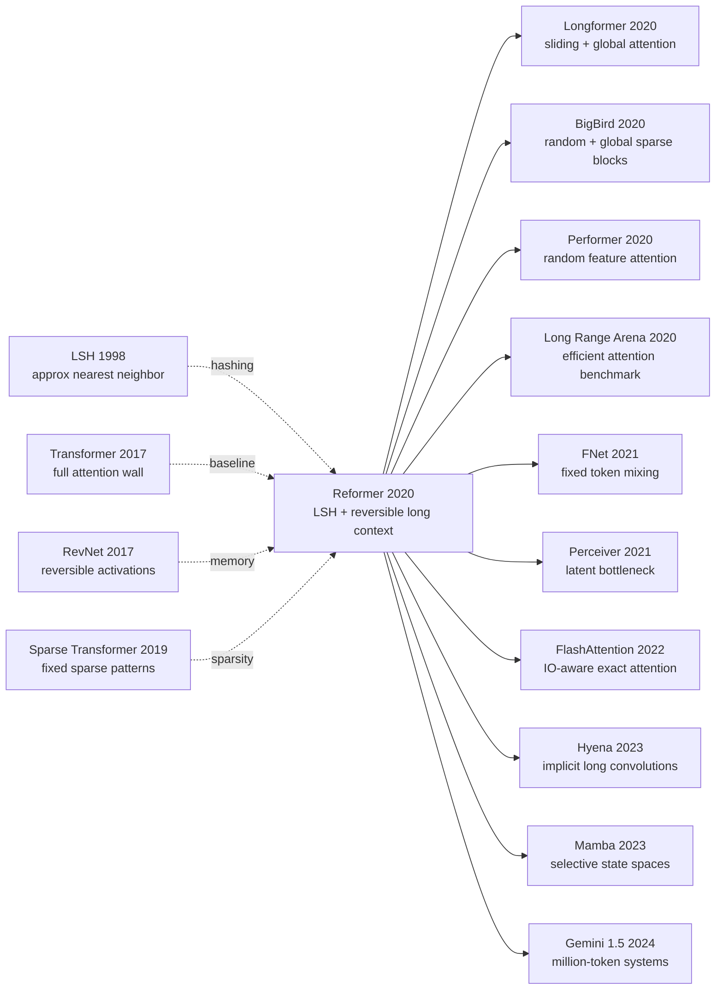

# Reformer — 用 LSH 和可逆层把 Transformer 推向百万级上下文

> **2020 年 1 月，Nikita Kitaev、Lukasz Kaiser、Anselm Levskaya 在 ICLR 2020 oral 论文 [Reformer: The Efficient Transformer](https://arxiv.org/abs/2001.04451) 里问了一个很刺耳的问题：Transformer 真的是因为“太大”才难训练，还是因为它把显存花错了地方？** 标准自注意力要为 100K 个词比较 $100K \times 100K$ 个位置，训练还要把每一层激活都留到反向传播；Reformer 的回答不是再堆机器，而是把注意力改成 LSH 找近邻、把残差层改成可逆、把前馈层分块计算。Google Research 同月把它描述为“单个 16GB accelerator 处理 100 万词上下文”的 Transformer。今天看，LSH attention 没有成为大模型工业主流，但这篇论文把 2020 年之后所有 long-context 论文都推到同一个问题面前：上下文长度不是一句口号，而是一张需要精算的内存账。

## 一句话总结

Kitaev、Kaiser、Levskaya 2020 年发表于 ICLR 的 Reformer 把 Transformer（2017） 的长序列瓶颈拆成两笔账：注意力矩阵的 $O(L^2)$ 与训练激活的 $O(NL)$，再分别用 LSH attention 把相似 token 哈希到同一桶、用 reversible residual layers 反向重建激活，把复杂度表述为近似 $O(L\log L)$ 注意力和“只存一份激活”。论文在 enwik8-64K、imagenet64 12K 序列、WMT14 En-De 上证明：可逆层几乎不掉 BLEU（base 100K steps 27.6 vs Transformer base 27.3），LSH 在 8 个 hash round 下接近 full attention，12 层 Reformer 可到 enwik8 1.05 bits/dim。它真正替代的失败 baseline 不是某个低分模型，而是“把长上下文交给 full attention + activation checkpointing + 大机器硬扛”的工程习惯；后续 [Longformer（2020）](https://arxiv.org/abs/2004.05150)、BigBird、Performer、FlashAttention、Mamba/Gemini 1.5 都在用不同方式回答同一个问题。反直觉点是：Reformer 最有影响力的并不是 LSH 这条具体路线，而是把“长上下文”从模型能力问题改写成可计算的内存复杂度问题。

---

## 历史背景

### 2020 年的 Transformer 学界在卡什么

2017 年 Transformer 把 RNN 从机器翻译主舞台赶下去之后，大家很快发现一个尴尬事实：attention 的表达能力很强，但账单来得也很快。句子级翻译时，几十到几百个 token 还好；BERT/GPT-2 时代把窗口推到 512、1024、2048 时，训练已经要靠混合精度、梯度累积、checkpointing 和模型并行；一旦文本、音乐、图像、视频被展平成 10K、64K、100K 级序列，标准 full attention 的 $L \times L$ 矩阵直接把显存吃空。

Reformer 论文开头的算术很有代表性：0.5B 参数只占约 2GB，64K tokens、1024 hidden、batch size 8 的输入激活也约 2GB；按这个粗算，单层大模型似乎应该能在单个 accelerator 上跑。真正的破口在三个地方：每层激活都要为反向传播保存一次，前馈层 $d_{ff}$ 往往是 $d_{model}$ 的 4 倍，注意力在时间和显存上都是 $O(L^2)$。换句话说，Transformer 长不起来，不只是“参数太多”，而是中间状态太胖。

当时已有几条路线在尝试缓解：Sparse Transformer 用固定稀疏图案省掉部分 pairwise attention；Transformer-XL/Compressive Transformer 通过 recurrence 或压缩记忆延长有效历史；Adaptive Attention Span 让每个头学习窗口长度；Memory Networks / Product Key Memory 则把大记忆检索当外部 lookup。它们都碰到同一个难题：要么稀疏模式太手工，要么长程依赖不够灵活，要么额外记忆需要特殊监督。Reformer 的独特之处在于，它把“内容相似的 token 应该互相关注”直接转成近似最近邻搜索问题，再把训练显存问题转成可逆网络问题。

### 直接逼出 Reformer 的 4 条前序线

- **Transformer (Vaswani et al., 2017)**：给出 scaled dot-product attention，也给出 $O(L^2)$ 这个长序列硬墙。Reformer 的所有设计都围绕如何保留 Transformer 的建模能力、砍掉它的显存账单。
- **Sparse Transformer (Child et al., 2019)**：证明图案化 sparse attention 可以把图像/音乐序列推长，但固定 pattern 不知道内容相似性。Reformer 的 LSH attention 可以看成“内容驱动的 sparse attention”。
- **RevNet (Gomez et al., 2017)**：用可逆残差块做“反向传播不存激活”。Reformer 把这个 CV 里的节省显存技巧移植到 Transformer，把 attention 和 feed-forward 分别放进可逆块的 $F/G$ 两支。
- **Angular LSH (Andoni et al., 2015)**：提供了把向量按角距离哈希到桶的实用方案。Reformer 不发明 LSH，而是把 LSH 接进 QK attention 的内循环。

### 作者团队当时在做什么

Nikita Kitaev 当时是 UC Berkeley 学生，Lukasz Kaiser 是 Google Research 研究员，Anselm Levskaya 也在 Google。Kaiser 的名字对 Transformer 史很关键：他是 Tensor2Tensor、Trax、Mesh-TensorFlow 生态的重要作者，长期在研究如何把模型训练做成可扩展系统。Reformer 官方代码放在 Google Trax，Google Research 2020 年 1 月的博客也明确把这篇论文放在“研究开放”的工程传统里。

这个作者组合决定了论文气质：它不是单纯追榜的语言模型论文，而像一次系统工程审计。论文没有声称自己拿下所有 NLP SOTA，也没有把实验包装成“百万 token 理解能力已经解决”；它更像在说：如果你真的想让 Transformer 看完整本书、整段视频、整张高分辨率图，先把 attention 和 activation 两张账算清楚。

### 工业界 / 算力 / 数据的状态

- **硬件状态**：V100/TPU v3 是主流研究硬件，16GB 显存仍是许多单卡实验的边界；“单个 accelerator 上训练长序列”本身就是很强的卖点。
- **模型状态**：BERT、GPT-2、T5 已经证明预训练可扩展，但上下文窗口通常只有几百到几千 token；GPT-3 还没正式发表，LLM scaling 的工业化刚要开始。
- **任务状态**：enwik8、imagenet64、WMT14 En-De 这类任务足以暴露长序列和显存问题，但还不是今天那种百万 token retrieval / codebase / video QA 任务。
- **社区焦虑**：所有人都知道长上下文重要，但很少有人能说清“长上下文到底贵在哪里”。Reformer 的历史价值正在于把问题拆成可验证的算法部件。

## 研究背景与动机

### 领域现状

2020 年初，Transformer 已经从“机器翻译结构”变成 NLP 的默认骨架，但默认骨架的默认设定仍然很短：BERT 512，GPT-2 常见 1024，T5 也主要服务文本到文本任务。另一方面，真实世界的序列远不止这个长度：一本小说几十万词，视频帧展平成 patch 后动辄数万位置，64×64 RGB 图像按像素序列也接近 12K token。标准 Transformer 在这些输入上不是“效果稍差”，而是直接放不进显存。

### 现有痛点

痛点有三层。第一，full attention 需要显式或隐式处理每个 query 对每个 key 的相似度，$L=64K$ 时矩阵规模已经不是普通实验能承受的量级。第二，训练时每一层输入都要保留到 backward，层数越深，激活栈越厚。第三，Transformer 的 feed-forward 层通常 $d_{ff}=4d_{model}$，很多显存其实花在 MLP 中间张量上，而不是 attention 本身。

### 核心矛盾

长上下文需要内容选择：真正有用的不是所有 token 两两相看，而是让一个 token 找到少数可能相关的远处 token。但如果选择机制本身也要看完所有 pair，它就没有省钱。Reformer 的核心矛盾是：**如何在不先计算 $QK^T$ 的情况下，找到“值得 attention 的候选集合”**。LSH 给出一个近似答案：用随机旋转和哈希桶让相似向量高概率落在一起，再只在桶内做局部 full attention。

### 本文目标

Reformer 想证明三件事：第一，LSH attention 可以足够接近 full attention，尤其在多轮 hash 时；第二，可逆 Transformer 不会因为省激活而明显掉性能；第三，把 LSH、reversibility、chunking 组合起来后，模型能在 64K/12K 级序列上训练，并把 Google 博客中“单 16GB accelerator、百万词窗口”的工程想象变成可信方向。

### 核心 idea

Reformer 的核心 idea 不是一个单点 trick，而是一套“只保留必要信息”的原则：attention 只在内容近邻中精算，层间激活只在需要反传时重建，前馈层只按 chunk 暂存局部中间张量。它没有推翻 Transformer；它把 Transformer 的每个显存热点都换成“可近似、可重算、可分块”的形式。

---

## 方法详解

### 整体框架

Reformer 可以理解为“把标准 decoder-only Transformer 的三块显存热点逐一替换”：attention 从 full softmax 变成 LSH 近似，residual stack 从不可逆变成可逆，feed-forward/output 从整段并行变成 chunked computation。它仍然保留 Transformer 的基本块：embedding、multi-head attention、position-wise feed-forward、residual、LayerNorm；所以它不是一个新序列模型家族，而是对 Transformer 执行长上下文版本的内存手术。

```text
输入序列 x[1:L]
  -> token / pixel embedding + positional encoding
  -> N 个 Reformer block:
       split hidden into x1, x2
       y1 = x1 + LSHAttention(LayerNorm(x2))
       y2 = x2 + FeedForward(LayerNorm(y1))   # feed-forward 可按 chunk 计算
       output hidden = concat(y1, y2)
  -> chunked output logits / loss
```

Reformer 与标准 Transformer 最大的不同在于：标准模型默认“先建完整 $QK^T$，再 softmax”；Reformer 先用 hash 把候选集合变小，再对候选集合做普通 attention。换句话说，Reformer 不是让 attention 变成另一种数学对象，而是让 full attention 只在“可能相关的一小块邻域”里发生。

| 组件 | 标准 Transformer | Reformer | 主要收益 | 主要代价 |
|------|------------------|----------|----------|----------|
| Attention | full scaled dot-product | shared-QK + LSH bucket attention | $O(L^2)$ 近似降到 $O(L\log L)$ | 近似误差、hash round 超参 |
| Residual stack | 每层激活都存 | reversible residual block | 激活显存不随层数线性增长 | backward 需要重算 |
| Feed-forward | 全序列一次性算 | chunked feed-forward | 避免 $bLd_{ff}$ 峰值 | wall-clock 略慢 |
| Output loss | 全序列 logits 一次性算 | chunked log-prob / loss | 大词表时省显存 | 实现更复杂 |
| Position | 常规位置编码 / axial 变体 | 长序列位置处理仍是难点 | 可跑更长序列 | 外推能力未真正解决 |

**反直觉点**：Reformer 最重要的“模型能力”来自节省显存，而不是增加参数。它的 claim 不是“LSH 比 full attention 更准”，而是“当 full attention 已经放不进机器时，近似 attention + 可逆训练让问题重新可训练”。这也是为什么它在 WMT14 这种短句翻译上没有使用 LSH attention：句子短于典型 128-token LSH chunk 时，近似机制没有必要。

### 关键设计

#### 设计 1：Shared-QK + Angular LSH Attention —— 不算完整 $QK^T$ 也能找候选邻居

**功能**：把每个 token 的 query/key 向量投到同一空间，使用 angular locality-sensitive hashing 把相似向量高概率分到同一 bucket，只在同桶 token 之间做 attention。这样无需先构造完整 $L \times L$ 相似度矩阵，就能获得近似的内容邻域。

核心前提是 shared-QK：Reformer 令 key 等于归一化 query，$k_j = q_j / \|q_j\|$。这样每个位置只有一个向量需要 hash，query 和 key 的 bucket 天然一致，避免“某个 bucket 里有 query 没有 key”的批处理问题。angular LSH 使用随机旋转矩阵 $R$，把向量投到多个 signed axes 上，再用最大投影的轴作为 bucket。

$$
h(x) = \arg\max([xR; -xR]), \quad k_j = \frac{q_j}{\|q_j\|}, \quad \mathcal{P}_i = \{j : h(q_i) = h(q_j)\}
$$

**PyTorch 风格伪代码**：

```python
def angular_lsh_buckets(query_vectors, num_buckets, random_rotations):
    normalized_queries = query_vectors / query_vectors.norm(dim=-1, keepdim=True)
    projections = normalized_queries @ random_rotations
    signed_projections = torch.cat([projections, -projections], dim=-1)
    bucket_ids = signed_projections.argmax(dim=-1) % num_buckets
    return bucket_ids, normalized_queries
```

| 候选选择方式 | 是否内容驱动 | 是否需完整 $QK^T$ | 长程依赖 | Reformer 的判断 |
|--------------|--------------|-------------------|----------|-----------------|
| Full attention | 是 | 是 | 最强 | 准但太贵 |
| Local window | 否 | 否 | 弱 | 省但漏远处信息 |
| Fixed sparse pattern | 部分 | 否 | 中等 | pattern 手工化 |
| **LSH bucket** | **是** | **否** | **强但近似** | 本文选择 |

**设计动机**：长文本里“相似内容在远处再次出现”是常态：变量名、实体、押韵模式、图像中重复纹理都可能隔很远。固定局部窗口看不到它们；full attention 看得到但太贵。LSH 是一个折中：它不保证每个相关 token 都在同桶，但多轮 hash 可以提高碰撞概率。论文里的 duplication task 正是为了测试这种非局部 lookup：只靠局部 sparse attention 无法复制前半段，而 LSH train/eval 可以接近完美。

#### 设计 2：Sorted Chunk Attention + Multi-round Hashing —— 把不规则 bucket 变成可批处理矩阵

**功能**：LSH bucket 大小天然不均匀，不适合 GPU/TPU 批处理。Reformer 先按 bucket id 排序，再把排序后的序列切成固定大小 chunk；每个 chunk 只 attend 自己和前一个 chunk，从而把“同桶近邻”变成规整矩阵计算。

设排序后位置为 $s_i$，chunk size 为 $m$，第 $r$ 轮 hash 的可见集合为：

$$
\mathcal{E}^{(r)}_i = \left\{ j : \left\lfloor\frac{s^{(r)}_i}{m}\right\rfloor - 1 \leq \left\lfloor\frac{s^{(r)}_j}{m}\right\rfloor \leq \left\lfloor\frac{s^{(r)}_i}{m}\right\rfloor \right\}, \quad \mathcal{P}_i = \bigcup_{r=1}^{n_r}\mathcal{P}^{(r)}_i
$$

为了避免重复 hash round 里同一个 key 被多次计数，论文在 masking term 中加入 $\log N_{i,j}$ 修正；为了 shared-QK 不让 token 永远最关注自己，causal setting 下还把 $i=j$ 的 self-attention mask 掉，除非这是唯一合法 target。

```python
def lsh_attention_round(hidden_states, bucket_ids, chunk_size):
    order = torch.argsort(bucket_ids, stable=True)
    sorted_states = hidden_states[order]
    chunks = sorted_states.reshape(-1, chunk_size, hidden_states.size(-1))
    previous_chunks = torch.roll(chunks, shifts=1, dims=0)
    candidate_blocks = torch.cat([previous_chunks, chunks], dim=1)
    attended_chunks = attend_within_blocks(chunks, candidate_blocks)
    return invert_permutation_and_merge(attended_chunks, order)
```

| Hash rounds | 计算成本 | Duplication task eval 表现 | 解释 |
|-------------|----------|---------------------------|------|
| LSH-1 | 最低 | train LSH-1, eval LSH-1: 77.9% | 相关 token 漏桶明显 |
| LSH-2 | 中等 | train LSH-2, eval LSH-2: 98.1% | 大多数匹配找回 |
| LSH-4 | 较高 | train LSH-4, eval LSH-4: 99.9% | 接近完美 |
| LSH-8 | 最高 | LSH-trained models eval LSH-8: 99.9-100% | eval 时可用更多 hash 换精度 |

**设计动机**：Reformer 的 LSH attention 不是“把所有 bucket 各自 for-loop 算一遍”。那样在硬件上很慢。排序 + chunk 的妙处是把 content sparsity 映射成局部 dense attention，让 accelerator 仍然吃到矩阵乘法。这里也暴露了 Reformer 的复杂性：算法上看似优雅，工程上要处理排序、反排序、重复计数、causal mask、chunk overflow，这些细节后来也是 LSH attention 没有成为通用 LLM kernel 的原因之一。

#### 设计 3：Reversible Transformer Blocks —— 反向传播时把激活“倒推回来”

**功能**：标准 residual block 的 backward 需要保存每层输入；reversible block 让下一层输出足以恢复上一层输入，因此训练时无需把每层 activation 都存在显存里。Reformer 把 hidden state 分成两半，attention 与 feed-forward 分别作为可逆块的两支。

$$
y_1 = x_1 + F(x_2), \quad y_2 = x_2 + G(y_1); \qquad x_2 = y_2 - G(y_1), \quad x_1 = y_1 - F(x_2)
$$

在 Reformer 中，$F$ 是 attention，$G$ 是 feed-forward，LayerNorm 被移入 residual branch 内部。论文强调为了参数量可比，$x_1$ 与 $x_2$ 都保留 $d_{model}$ 大小，而不是把 hidden size 对半砍掉。

```python
class ReversibleTransformerBlock(nn.Module):
    def forward(self, hidden_pair):
        hidden_left, hidden_right = hidden_pair
        updated_left = hidden_left + self.attention(self.norm_attention(hidden_right))
        updated_right = hidden_right + self.feed_forward(self.norm_ffn(updated_left))
        return updated_left, updated_right

    def reverse(self, updated_pair):
        updated_left, updated_right = updated_pair
        hidden_right = updated_right - self.feed_forward(self.norm_ffn(updated_left))
        hidden_left = updated_left - self.attention(self.norm_attention(hidden_right))
        return hidden_left, hidden_right
```

| 训练方式 | 激活显存 | 额外计算 | 数值行为 | 适用场景 |
|----------|----------|----------|----------|----------|
| 普通 residual | 随层数线性增长 | 无 | 最简单 | 短序列 / 小模型 |
| Gradient checkpointing | 存部分激活 | backward 重算部分层 | 通用 | 常规大模型 |
| **Reversible block** | **近似不随层数增长** | **backward 重算 F/G** | 结构受限 | 长序列深模型 |

**设计动机**：Reformer 论文的一个冷静判断是：即使 attention 省了，深层模型仍会被 activation stack 卡住。可逆层解决的是与 $L^2$ 无关的另一个瓶颈。它的代价也很明确：每次 backward 要重新算 attention/FFN，训练时间会增加；结构也必须满足可逆形式。但在长序列场景里，能 fit into memory 往往比省一点计算更重要。

#### 设计 4：Feed-forward / Output Chunking —— 不改变函数，只改变峰值显存

**功能**：Transformer 的 FFN 是逐位置独立的，所以整段序列一次性算和分 chunk 逐段算在数学上等价。Reformer 利用这个性质，把 $d_{ff}$ 中间张量拆成多个小块，降低峰值显存；大词表输出层的 log-prob / loss 也可按序列片段计算。

$$
Y_2 = [Y_2^{(1)}; \ldots; Y_2^{(c)}] = [X_2^{(1)} + \mathrm{FFN}(Y_1^{(1)}); \ldots; X_2^{(c)} + \mathrm{FFN}(Y_1^{(c)})]
$$

```python
def chunked_feed_forward(hidden_states, feed_forward, chunk_size):
    outputs = []
    for hidden_chunk in hidden_states.split(chunk_size, dim=1):
        outputs.append(feed_forward(hidden_chunk))
    return torch.cat(outputs, dim=1)
```

| 模块 | 标准峰值显存 | Chunked 峰值显存 | 是否改变模型函数 | 主要代价 |
|------|--------------|------------------|------------------|----------|
| FFN hidden | $bLd_{ff}$ | $b(L/c)d_{ff}$ | 否 | loop / kernel launch |
| Output logits | $bL|V|$ | $b(L/c)|V|$ | 否 | loss 聚合复杂 |
| Reversible reverse pass | 全层输入已存 | 需按块重算 | 否 | backward 变慢 |

**设计动机**：chunking 是 Reformer 里最不“论文感”的设计，却很关键。LSH attention 解决 attention matrix，可逆层解决层数，但 $d_{ff}$ 和 vocabulary logits 仍然能制造显存尖峰。chunking 的好处是不会改模型、不会改 loss、不会引入近似误差；它只是承认“并行计算全序列”不是免费的。很多后来的长上下文系统沿用同一种思路：把理论复杂度和实际峰值显存分开优化。

### 损失函数 / 训练策略

Reformer 没有提出新的语言模型损失。它的实验主要使用标准自回归 next-token loss 或对应任务损失，真正改变的是 attention / residual / chunking 的实现。论文用 Adafactor 训练 enwik8-64K 和 imagenet64 ablation，WMT14 En-De 则遵循 Transformer 超参；所有实验并行在 8 个设备上。

| 维度 | 论文设置 | 目的 |
|------|----------|------|
| 长文本任务 | enwik8-64K, $2^{16}=64K$ tokens | 测试超长字符级语言模型 |
| 图像任务 | imagenet64, 12K-length serialized image sequence | 测试长序列图像生成 |
| Translation | WMT14 English-German | 检查可逆层在短序列 seq2seq 中是否掉 BLEU |
| Ablation model | 3 layers, $d_{model}=1024$, $d_{ff}=4096$, 8 heads, batch size 8 | 让 full Transformer baseline 仍可跑 |
| Optimizer | Adafactor | 降低 optimizer memory |
| Large model | up to 20-layer big Reformer | 验证长序列深模型可 fit |

最终复杂度表的直觉可以这样读：标准 Transformer 同时有 $bn_hL^2$ attention 项和 $bLd_{ff}n_l$ activation 项；Reformer 试图把它们压到 $bn_hLn_rc$ 与 $bLd_{model}$ 级别，其中 $n_r$ 是 hash rounds，$c$ 是固定 chunk 相关常数。它不是“免费线性化”，而是把不可承受的二次矩阵换成可调的 hash-round / chunk-size 预算。

这也是 Reformer 留给后人的方法论：长上下文模型不能只报最大窗口，还要说明窗口背后的四张账——attention compute、attention memory、activation memory、output/logit memory。只优化其中一张，另外三张仍可能让模型跑不起来。

---

## 失败案例

### 当时真正失败的 baseline 是什么

Reformer 的失败案例不能按“某个模型分数低于它”来读。它面对的最大 baseline 是 2020 年大家默认的工程姿势：保留 full attention，用更强硬件、更小 batch、更短窗口、activation checkpointing 和模型并行去硬扛。这个 baseline 在短序列上当然强；但当输入变成 64K、100K、甚至百万级 token 时，它不是输在 BLEU，而是输在“根本跑不起来”。

| Baseline | 失败点 | 论文证据 / 语境 | Reformer 的回答 |
|----------|--------|-----------------|-----------------|
| Full attention Transformer | $O(L^2)$ attention 在 64K+ 直接爆显存/时间 | 论文说明大模型无法在单机 fine-tune；large full baseline 太慢太占显存 | LSH attention |
| Memory-efficient full attention | attention matrix 可重算但复杂度仍是 $O(L^2)$ | 论文把它列为 baseline，但指出只省存储不省计算 | 近似稀疏候选集合 |
| Fixed sparse attention | 可省计算，但 pattern 不由内容决定 | Sparse Transformer 是直接前序；远处相关 token 可能漏掉 | 内容驱动 LSH bucket |
| Gradient checkpointing | 只存部分激活，但仍随层数和模块增长 | 解决不了 $d_{ff}$ / output logits 峰值 | 可逆层 + chunking |

这里最关键的失败是“满矩阵注意力作为永恒默认值”。Reformer 不是证明 full attention 在质量上差，而是证明 full attention 在长序列上没有工程生存空间。这个 distinction 很重要：如果任务只有 128 token，Reformer 自己也不用 LSH；如果任务是 64K token，full attention 的“更准”已经没有意义，因为它太贵。

### 论文里的反例与消融

论文最漂亮的反例是 duplication synthetic task。任务形式是 $0w0w$，模型只在后半段计 loss；它必须从远处复制前半段 token，局部窗口 sparse attention 理论上做不到。实验结果显示，full-attention 模型如果直接换成 LSH eval，会掉很多；但从头用 LSH attention 训练的模型，在 eval 时增加 hash rounds 后几乎完美。

| Train / Eval | Full Attention | LSH-8 | LSH-4 | LSH-2 | LSH-1 |
|--------------|----------------|-------|-------|-------|-------|
| Full Attention | 100% | 94.8% | 92.5% | 76.9% | 52.5% |
| LSH-4 | 0.8% | 100% | 99.9% | 99.4% | 91.9% |
| LSH-2 | 0.8% | 100% | 99.9% | 98.1% | 86.8% |
| LSH-1 | 0.8% | 99.9% | 99.6% | 94.8% | 77.9% |

这个表有两个反直觉点。第一，full-attention 训练出来的模型不一定能无痛切到 LSH eval；attention pattern 是训练分布的一部分。第二，LSH-trained 模型在 LSH-8 eval 下反而可达 99.9-100%，说明近似机制不是只能“损失质量换速度”，而是可以通过 train/eval 一致性学会利用自己的稀疏结构。

### 失败教训

Reformer 也暴露了自己的失败边界。LSH attention 需要 hash、sort、chunk、mask、unpermute，一整套操作在 2020 年硬件上并不比 dense matmul 友好；序列不够长时，排序开销会盖过节省；现代 GPU/TPU kernel 对 dense attention 的优化又非常快，后来 FlashAttention 证明 exact attention 只要做对 IO，也能在常见长度上击败复杂 sparse kernel。

所以 Reformer 的失败不是“论文错了”，而是“它选了一条算法上优雅、系统上很难工业化的路线”。它成功地指出 full attention 的长序列账单，但后来的工业界往往用另一组答案付款：FlashAttention、paged KV cache、RoPE scaling、retrieval、block sparse、state-space models，而不是直接复用 LSH attention。

## 实验关键数据

### 主实验设置

论文实验故意选了能暴露长序列问题的任务，而不是只在短句翻译上刷分。enwik8-64K 把字符语言模型切成 $2^{16}=64K$ tokens；imagenet64 被序列化成约 12K 长度；WMT14 En-De 用来隔离“可逆层是否掉性能”这个问题，因为短句场景没必要用 LSH。

| 任务 | 序列长度 / 数据 | 模型设置 | 主要问题 |
|------|-----------------|----------|----------|
| Duplication synthetic | 1024 tokens | 1-layer, $d=256$, 4 heads | LSH 是否能找远程重复 |
| enwik8-64K | 64K tokens | 3-layer ablation / 12-layer tuned | 长文本 LM 与速度 |
| imagenet64 | ~12K tokens | 3-layer ablation / deeper Reformer | 长图像序列生成 |
| WMT14 En-De | 短句翻译 | reversible encoder-decoder | 可逆层是否损伤 BLEU |

### WMT14 与可逆层数据

WMT14 表证明的是“可逆层不是免费午餐，但质量上可以接近普通 Transformer”。论文没有在 WMT 上用 LSH，因为 test set 句子都短于典型 LSH chunk；这里隔离测试的是 reversible Transformer。

| Model | BLEU | sacreBLEU uncased | sacreBLEU cased | 结论 |
|-------|------|-------------------|-----------------|------|
| Transformer base | 27.3 | — | — | 原始 baseline |
| Transformer big | 28.4 | — | — | 强 baseline |
| Reversible base, 100K steps | 27.6 | 27.4 | 26.9 | 不掉 base 质量 |
| Reversible base, 500K, no weight sharing | 28.0 | 27.9 | 27.4 | 更久训练更强 |
| Reversible big, 300K, no weight sharing | 29.1 | 28.9 | 28.4 | 接近/超过 big baseline |

这组数据说明可逆结构的主要风险不在质量，而在训练实现与重算成本。如果一个系统愿意用 backward 重算换显存，可逆层是可行选择。

### 长序列和速度数据

论文没有给出一个“Reformer 全面打败所有模型”的整齐 leaderboard；它给的是更系统的证据链：shared-QK 不伤性能，可逆层不伤学习曲线，LSH round 越多越接近 full attention，序列越长 LSH attention 相对越快，大模型能 fit 并训练。

| 证据点 | 数据 | 含义 |
|--------|------|------|
| Shared-QK ablation | enwik8 上训练曲线不差于常规 Q/K | LSH 的前置约束可接受 |
| Reversible ablation | enwik8 / imagenet64 曲线与普通 Transformer 接近 | 省激活不必显著掉分 |
| Large Reformer | 12-layer, 20K steps, enwik8 test 1.19 bits/dim | 深层长序列模型可训练 |
| Tuned large Reformer | 12-layer longer run, enwik8 test 1.05 bits/dim | 质量可继续提升 |
| Google blog claim | up to 1M words on one 16GB accelerator | 工程想象被公开产品化表达 |

### 关键发现

- **LSH 不是 plug-and-play eval trick**：full attention 训练后直接切 LSH 会掉；LSH 最好从训练开始就进入模型分布。
- **可逆层是最稳的节省项**：论文中 reversible Transformer 的学习曲线和 WMT BLEU 都很接近原模型。
- **chunking 虽不起眼但必要**：不处理 $d_{ff}$ 和 output logits，attention 省下来的显存仍可能被 MLP/词表吃掉。
- **长序列越长，Reformer 越有意义**：短句翻译中 LSH 没必要；64K/100K 级任务才体现 asymptotic benefit。
- **这篇论文的数字不是最终答案**：后来的 Long Range Arena、FlashAttention、Mamba 等工作都说明，评估 efficient attention 需要更标准的任务、kernel 和 wall-clock 口径。

---

## 思想史脉络

### Mermaid 引用图



### 前世（被谁逼出来的）

- **1998 LSH / approximate nearest neighbor**：Reformer 的“先找候选再精算”来自经典近似最近邻思想。它把 attention 的 candidate selection 从神经网络内部的 softmax 计算，搬到 hash collision 这个可预处理的离散结构上。
- **2017 Transformer**：Transformer 让所有 token 两两交互成为默认，但也把 $O(L^2)$ 带进每个长序列任务。Reformer 的论文标题里“Efficient Transformer”不是修饰词，而是对原始 Transformer 的显存审计。
- **2017 RevNet**：Gomez 等人的可逆残差网络证明了“深度网络可以不存每层激活”。Reformer 把这个想法从图像分类搬到序列模型，把 attention/FFN 放进可逆 residual 的两支。
- **2019 Sparse Transformer**：Child 等人的稀疏模式说明 long sequence generation 可以绕开 full attention，但固定 pattern 缺少内容自适应。Reformer 继承“稀疏化”动机，改用 LSH 让 token 自己决定远处邻居。
- **2019 Adaptive Attention Span / Product Key Memory**：这些工作都在问同一个问题：Transformer 是否必须把每个位置看成等价候选？Reformer 的回答是“不必，先检索”。

### 今生（继承者）

**直接派生**：Longformer、BigBird、ETC、Routing Transformer、Linformer、Performer、Sparse Sinkhorn Attention、Synthesizer、FNet、Nyströmformer 都可以放在 Reformer 同一张地图上：它们不一定继承 LSH，但都继承“full attention 不是唯一默认值”的问题意识。Longformer/BigBird 选择更容易 kernel 化的稀疏结构，Performer/Nyströmformer 选择低秩或随机特征近似，FNet/Synthesizer 则更激进地问 attention 是否必须依赖 pairwise dot product。

**跨架构借用**：Perceiver 用 latent bottleneck 把超长输入压到少量 latent queries；LongT5、Memorizing Transformer、LongNet、Infini-attention 则把 long context 与 memory / compression / dilation 结合。它们与 Reformer 的技术路线不同，但都接受了同一个前提：上下文长度必须由架构和系统共同支付。

**跨任务渗透**：OpenAlex 的 citing list 显示，Deformable DETR、LoFTR、MaX-DeepLab、ViViT、Autoformer、Anomaly Transformer 等视觉/时间序列工作都引用了 Reformer 或 efficient attention 语境。长上下文不只是文本问题；高分辨率图像、视频、遥感、时间序列同样会把 token 数推到 full attention 的边界。

**跨学科外溢**：没有一个明确的“Reformer 被物理/生物直接吸收”的单一路线。更准确的说法是，它参与了一个更大的迁移：近似检索、可逆计算、chunked execution 这些系统思想进入了科学机器学习和长序列建模工具箱，但 Reformer 本身不是像 DDPM 那样跨学科扩散的核心模板。

### 误读 / 简化

- **误读 1：Reformer = LSH attention。** 这只说对了三分之一。论文真正的组合是 LSH attention + reversible layers + chunking；如果只换 attention，不处理 activation stack 和 $d_{ff}$，长序列训练仍会卡住。
- **误读 2：Reformer 证明 approximate attention 是未来唯一方向。** 后来并不是这样。FlashAttention 说明 exact attention 通过 IO-aware kernel 可以在很多实际长度上更强；Mamba/Hyena 说明另一条路是离开 attention。Reformer 证明的是 full attention 的账必须被优化，不是 LSH 一定胜出。
- **误读 3：百万 token context 在 2020 年已经被解决。** Google blog 的“1 million words on one 16GB accelerator”是工程可运行性的强 claim，不等价于今天 LLM 意义上的百万 token 推理、检索、needle-in-a-haystack 或多跳推理能力。能 fit、能 train、能可靠使用，是三个不同层级。
- **误读 4：Reformer 失败了所以不重要。** LSH route 没成为主流，不代表论文价值低。很多经典论文的作用不是留下最终模块，而是把问题定义清楚；Reformer 把 long context 从“多给模型一点窗口”变成 attention compute、attention memory、activation memory、kernel efficiency 的联合问题。

---

## 当代视角

### 站不住的假设

- **“LSH attention 会成为长上下文默认内核。”** 2026 年看，这个假设站不住。现代 LLM 系统更常用 FlashAttention / ring attention / paged KV cache / block sparse / retrieval / RoPE scaling / state-space models。原因不只是算法精度，而是 kernel 生态：hash+sort+chunk+unpermute 对硬件不友好，dense exact attention 反而因为 IO 优化变得非常强。
- **“只要 attention 复杂度降下来，长上下文就解决了。”** 不对。Reformer 自己已经指出 activation memory、feed-forward 峰值、output logits 都是账单。今天的长上下文 LLM 还要面对 KV cache、position extrapolation、训练数据长度分布、needle retrieval、multi-hop reasoning、evaluation contamination。attention 只是账单之一。
- **“百万 token fit 等于百万 token 理解。”** Google Research 2020 年的 1M-word claim 是工程里程碑，但今天大家会追问模型是否能在百万 token 中稳定找 needle、跨文档综合、保留细节、避免位置偏置。Reformer 解决的是可运行性，不是全部认知能力。
- **“Approximate attention 一定比 exact attention 更便宜。”** FlashAttention 之后，这个判断不再总成立。理论复杂度低不等于真实 wall-clock 快；内存访问、kernel fusion、排序开销、batch 形状都能改变结论。
- **“长上下文必须由 attention 完成。”** Mamba、Hyena、RetNet、RWKV 让另一条路线重新有吸引力：用状态空间、隐式卷积或 recurrent-like 机制建模长程依赖，再把 attention 留给局部或检索场景。

### 时代证明的关键 vs 冗余

Reformer 被时代证明的关键，是它把 long context 拆成多张账：attention compute、attention memory、activation memory、FFN/output peak memory。今天任何严肃长上下文系统都必须同时报这些指标。它还提前强调了 train/eval attention pattern 的一致性：不是随便把 full attention 模型换成 sparse attention 就能不掉。

相对冗余的是具体 LSH 机制。LSH 在理论上漂亮，但在通用大模型里被更容易优化的方案挤到边缘：固定/块稀疏更容易实现，低秩/随机特征更像矩阵近似，FlashAttention 直接优化 exact attention，SSM 则绕开 attention。Reversible Transformer 也没有成为 LLM 主流默认，因为大规模训练更常用 activation checkpointing、tensor/pipeline parallel、ZeRO/FSDP 等系统方案；但“重算换显存”这个思想仍然活着。

### 如果今天重写 Reformer

如果 2026 年重写 Reformer，它大概率不会把 LSH 作为唯一主角。一个现代版本可能会：

- **用 FlashAttention 作为 exact-attention baseline**，明确区分理论复杂度和真实 kernel 时间。
- **把 LSH 与 block sparse / sliding window / global tokens 做混合**，避免纯 hash 导致排序开销和局部结构缺失。
- **把 RoPE scaling / ALiBi / positional interpolation 放进核心实验**，因为长上下文失败常常来自位置外推，而不只是 attention memory。
- **在 Long Range Arena、needle-in-a-haystack、code retrieval、long-document QA 上评估**，而不仅是 enwik8 / imagenet64。
- **把 KV cache 与推理成本纳入设计**，因为现代 LLM 的长上下文瓶颈常发生在 serving 阶段，不只在训练阶段。
- **与 SSM / recurrent alternatives 正面对比**，承认长程依赖已经不再是 attention 家族内部问题。

但核心哲学不会变：先问“显存花在哪里”，再决定模型结构。Reformer 留下的不是 LSH 这个唯一答案，而是一种工程伦理：不要用宏大的 context length 数字掩盖内存账。

## 局限与展望

### 作者承认 / 论文呈现的局限

- LSH attention 是近似，hash rounds 越少越可能漏掉相关 token；论文用 duplication task 直接展示 LSH-1 eval 明显退化。
- LSH attention 对短序列没意义；WMT14 中句子短于 128-token chunk，作者明确不用 LSH。
- Reversible layers 省显存但要 backward 重算，训练时间不是免费。
- chunking 降峰值显存但引入额外 loop / kernel overhead。
- 论文实验更多证明“可训练、可接近 full attention”，没有建立后来标准化的长上下文理解 benchmark。

### 自己发现的局限

- **Kernel 复杂度**：hash/sort/unpermute 在真实硬件上不如 dense matmul 自然，导致理论收益不容易转成 wall-clock 收益。
- **位置编码问题未解决**：长序列 attention 省了，不代表模型能外推到更长位置；现代 long-context 方法对 RoPE/ALiBi/位置插值的依赖说明这是一条独立难题。
- **质量评估不够现代**：enwik8 bits/dim 与 imagenet64 生成可以证明可训练，但不能证明长文推理、检索和记忆可靠性。
- **生态迁移成本高**：Reformer 依赖 Trax/JAX 生态与复杂 kernel，PyTorch/HuggingFace 主流栈里复用成本高。
- **可逆结构限制架构自由度**：现代 Transformer block 里有 gated MLP、MoE、cross-attention、adapter、LoRA 等模块，可逆化不总是自然。

### 改进方向

- **系统层**：用 FlashAttention、sequence parallel、paged attention、ring attention 作为强 baseline，再评估任何 sparse approximation。
- **算法层**：混合 local/global/retrieval attention，而不是纯 LSH；对 hash bucket 加入 learned routing 或稳定排序。
- **模型层**：结合 SSM/Hyena/Mamba 这类线性长序列模块，把 attention 留给关键检索位置。
- **评估层**：从 bits/dim 转向 long-context QA、multi-hop retrieval、codebase navigation、video temporal reasoning。
- **训练层**：让 train context length、inference context length、position encoding、data curriculum 一起设计，避免只拉长窗口。

## 相关工作与启发

### 与后继路线的关系

Reformer 与 Longformer/BigBird 的关系像“内容驱动稀疏”与“结构化稀疏”的分叉。Reformer 更灵活，但 kernel 更复杂；Longformer/BigBird 更手工，但容易稳定实现。与 Performer/Linformer/Nyströmformer 的关系则是“哈希近邻”与“矩阵近似”的分叉：前者选择候选集合，后者近似 softmax 或低秩结构。

与 FlashAttention 的关系最有意思：FlashAttention 没有降低 $O(L^2)$ 理论复杂度，却通过 tiling 和 SRAM-aware 计算极大降低真实显存访问；它像是对 Reformer 的反驳：先别急着近似数学，先把 exact attention 的系统实现做对。与 Mamba/Hyena 的关系则是更大的路线分歧：如果 attention 的账太难付，也许长程建模可以由状态空间或长卷积支付。

对研究者的启发有三条。第一，复杂度表不是论文装饰，而是方法的核心主张。第二，长上下文要同时看训练和推理；只解决训练显存不够。第三，失败的模块也可能留下成功的问题定义。Reformer 的 LSH 没有统治 LLM，但它定义的内存账单仍然统治长上下文研究。

## 相关资源

- 📄 [arXiv 2001.04451 — Reformer: The Efficient Transformer](https://arxiv.org/abs/2001.04451)
- 📝 [OpenReview ICLR 2020 page](https://openreview.net/forum?id=rkgNKkHtvB)
- 🧠 [Google Research blog — Reformer: The Efficient Transformer](https://research.google/blog/reformer-the-efficient-transformer/)
- 💻 [Official Trax Reformer code](https://github.com/google/trax/tree/master/trax/models/reformer)
- 📚 后续必读：[Longformer](https://arxiv.org/abs/2004.05150), [BigBird](https://arxiv.org/abs/2007.14062), [Performer](https://arxiv.org/abs/2009.14794), [FlashAttention](https://arxiv.org/abs/2205.14135), [Mamba](https://arxiv.org/abs/2312.00752)
- 🔍 评估线索：[Long Range Arena](https://arxiv.org/abs/2011.04006), [Efficient Transformers: A Survey](https://arxiv.org/abs/2009.06732)


---

> 🌐 [English version](/en/era4_foundation_models/2020_reformer/) · 📚 awesome-papers project · CC-BY-NC