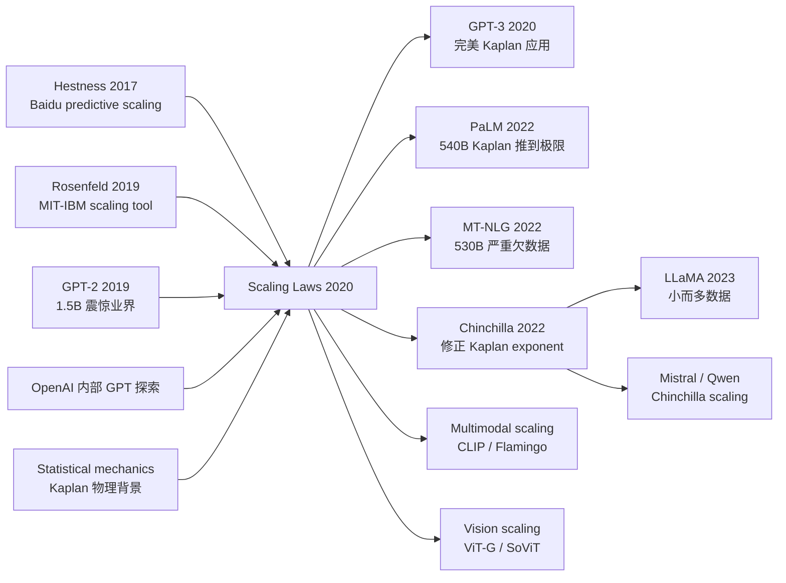

# Scaling Laws — 用幂律刻画 LLM 的损失、参数与算力之间的关系

> **2020 年 1 月 23 日，OpenAI 的 Kaplan、McCandlish 等 10 位作者在 arXiv 上传 [2001.08361](https://arxiv.org/abs/2001.08361)。**
> 这是一篇没有发布任何模型、却为整个 LLM 时代写下了「物理定律」的技术报告 —— 跑了 ~10000 次小规模训练实验后，OpenAI 团队发现 LLM 的 cross-entropy loss 沿参数 $N$、数据 $D$、算力 $C$ 三个轴**严格服从幂律 $L(N,D,C) \propto N^{-\alpha}\cdot D^{-\beta}$**，跨 6 个数量级误差小于 1%。
> 这个发现直接告诉 OpenAI：**给定固定算力预算，最优分配是「参数 $\propto C^{0.73}$、数据 $\propto C^{0.27}$」** —— 4 个月后这个公式被直接套用到 GPT-3 (175B) 上烧出了 \\$4.6M 的训练费用，2 年后被 Chinchilla (2022) 修正（参数过度、数据不足）。
> 但这篇论文最深远的影响不是公式本身，而是它**把 AI 从「设计巧妙模型」时代推进到「按定律 scale」时代** —— Sutton 的 *Bitter Lesson* 在 LLM 上第一次有了可量化的预测公式，整个工业界从此按 scaling laws 规划算力采购。

## 一句话总结

Kaplan 等人系统训了 **300+ 个不同尺寸的 Transformer LM**（参数从 768 到 1.5B、数据从 22M 到 23B token、compute 跨 7 个数量级），发现 LM 的 test loss **严格遵循一条 7 个数量级的 power law**：$L(N) \propto N^{-0.076}$、$L(D) \propto D^{-0.095}$、$L(C) \propto C^{-0.050}$ —— 而且大模型在固定 compute 下**永远赢小模型**（即使两边都没训完）。这一篇 30 页技术报告**直接催生了 GPT-3 (175B, 2020)、PaLM (540B, 2022)、整个 LLM scale 时代**，并把"该花钱训多大模型"从工程师直觉变成了一道**有解的优化题**。

---

## 历史背景

### 2019 年的 LM 学界在卡什么

要理解 Scaling Laws 的颠覆性，必须回到 2019 年那个 "GPT-2 出来了，所有人都在猜下一步该怎么 scale" 的混沌时刻。

2018 年 BERT (340M) 和 2019 年 GPT-2 (1.5B) 把 LM 参数量从原来的 ~100M 推到了 1.5B —— 同期所有人都隐约相信"再大一点会更好"，但**没有人能精确说大多少、为什么大、要花多少 compute、需要多少数据**。整个学界处于"三选一"的尴尬：

> **加深？加宽？加数据？没人能定量回答。**

具体的痛点：
- **对架构超调上瘾**：2018-2019 一年间出现了 50+ 篇 "Improved Transformer" 论文（Sparse Transformer / Reformer / Adaptive Attention / ALBERT / ELECTRA），每篇都声称"在固定 compute 下我比 Transformer 强 X%"。但这些**改进在更大模型上是否仍然有效**？没人测。
- **数据 vs 参数 vs compute trade-off 全凭直觉**：业界的"民间智慧"是"scale 模型就够了"或者"数据是王"，但**没有量化指导**——OpenAI 自己训 GPT-2 时也是凭工程师 intuition 选的 1.5B。
- **训练终止规则模糊**：什么时候训完？train loss 还在降但 val loss 平了？train loss 永远不收敛？业界靠 plot 看图。
- **batch size / lr 选择全靠 grid search**：每个新尺寸都要重新调超参，单次 grid search 烧掉数十万美元。

整个学界缺一样东西：**一个能预测"给我 X 美元的 compute，我应该选多大的 N、多少 D、什么 batch size，最后能拿到多少 loss"的定量模型**。这是 Scaling Laws 出现前的 LM 研发的根本问题。

> **2019 年的隐含焦虑：scale 是趋势，但 "scale 该怎么做" 是炼丹术，不是科学。**

更糟的是，2019 年学界对 "scale 是否真的会一直 work" 也充满疑虑——很多人（包括 LeCun、Marcus）认为 LM 会很快撞到天花板：参数加到 10B 就饱和、数据加到 100B token 就过拟合、compute 加 10× 也只能换 0.1 nats/token 的 loss 改进。**Scaling Laws 出现的真正价值，是用一个 7 个数量级的实验把"会不会撞天花板"这个争论彻底数学化**——loss 曲线的 power law 在 7 个数量级里没有任何 plateau 的迹象。

### 直接逼出 Scaling Laws 的 3 篇前序

- **Hestness et al., 2017 (Deep Learning Scaling is Predictable, Empirically)** [arxiv/1712.00409](https://arxiv.org/abs/1712.00409)：Baidu Research 的"思想原型"。**第一个系统在 image classification / LM / speech 上跑 power-law scaling**，发现 loss vs data 在 log-log 图上是直线。但 Hestness 只覆盖了 2-3 个数量级、且用的都是当时小模型（< 100M）—— 论文影响力有限，被绝大多数 NLP 学者遗漏。Kaplan 在 §2 直接致敬这篇 "predecessor"。
- **Rosenfeld et al., 2019 (A Constructive Prediction of the Generalization Error Across Scales)** [arxiv/1909.12673](https://arxiv.org/abs/1909.12673)：MIT-IBM 的工作，把 Hestness 的发现进一步形式化，提出了 "scaling law as predictive tool" 的方法论。但仍然只覆盖 < 1B 参数。
- **Brown / Radford 等人内部 GPT-2 / GPT-3 探索**：OpenAI 内部从 2018 GPT-1 (110M) 到 2019 GPT-2 (1.5B) 训了几十个不同尺寸的 LM 做 calibration —— 这些**未发表的内部实验**是 Scaling Laws 论文的真正 backbone。Kaplan 团队基本是把"OpenAI 内部已经做了 1 年的 scaling 实验" 系统化整理 + 公开发表。

### 作者团队当时在做什么

Jared Kaplan 当时是 OpenAI 的 Research Scientist，物理学博士背景（Johns Hopkins 理论物理教授兼职 OpenAI 顾问）—— 物理学家对"power law / scaling"有天然敏感度（统计物理 / 临界现象的核心都是 power law）。Sam McCandlish 是 OpenAI scaling 团队的负责人（Dota 2 / GPT-3 算力规划）。Tom Henighan / Tom Brown / Rewon Child / Alec Radford / Jeff Wu / Dario Amodei 几乎是 OpenAI 整个 LM 团队 —— 其中 Brown 是 GPT-3 的第一作者，Radford 是 GPT 系列发明人。

**这个团队的人选组合本身就预言了 Scaling Laws**：物理学家（Kaplan）+ scaling 工程师（McCandlish）+ LM 专家（Brown / Radford） = "用物理学家对 power law 的直觉 + OpenAI 的 GPU 集群 + GPT 已有的 LM codebase" 三合一。**Scaling Laws 本质上是一篇"为 GPT-3 做 calibration 的论文"**——它发表在 2020 年 1 月，GPT-3 论文（5 月）几乎是同一团队同期写就。

### 工业界 / 算力 / 数据的状态

- **GPU**：NVIDIA V100 32GB 是主力，Scaling Laws 总训练量是 5×10^21 FLOPs（约 OpenAI 一周的集群算力，但被切成 300+ 个小实验）
- **数据**：WebText (40GB) 是 GPT-2 训练数据，论文用同样的数据子采样到 22M-23B token
- **框架**：OpenAI 内部的 PyTorch + Triton + 自家 Megatron-style model parallelism（GPT-3 时期才公开）
- **工业气氛**：2019 年底 GPT-2 已经"震惊业界"，但还没人敢真的把 LM 推到 100B；Google 在做 T5 (11B)、Microsoft 在做 Turing-NLG (17B) —— 大家都在试探"再大一个数量级会不会撞墙"。**Scaling Laws 论文 1 月发表，就像给所有人一张 "scale 没有天花板，放心烧钱" 的科学许可证**。GPT-3 4 个月后跟进，PaLM 2 年后到 540B —— Scaling Laws 是这一切的"经济基础"。

---

## 方法详解

### 整体框架

Scaling Laws 的整体实验设计可以一图概括：

```
Setup: WebText 数据集（GPT-2 同款），8-layer to 207-layer Transformer LM
       参数 N ∈ [768, 1.5B] (跨 7 个数量级时还包括外推)
       数据 D ∈ [22M, 23B] tokens
       Compute C ∈ [10^16, 10^21] FLOPs

实验 A：N sweep （固定 D、固定 compute）
   - 训 30+ 个不同尺寸模型到收敛
   - 拟合 L(N) = (N_c / N)^α  →  α ≈ 0.076

实验 B：D sweep （固定 N=百 M、扫 D）
   - 同一个模型在不同 D 上训到收敛
   - 拟合 L(D) = (D_c / D)^β  →  β ≈ 0.095

实验 C：C sweep （固定 D=23B，扫 compute）
   - 在每个 compute budget 下训出"最优 N"
   - 拟合 L(C) = (C_c / C)^γ  →  γ ≈ 0.050

实验 D：Critical batch size
   - 测每个 N 下"训练效率最高" 的 batch size
   - 拟合 B_critical = B_*(L)  →  随 loss 减小而增大

输出：3 条 power-law 公式 + 1 条工程经验法则
       "Given compute C, optimal N ∝ C^0.73, optimal D ∝ C^0.27"
```

实验规模本身就是 paper 的杀手 feature：**300+ 个 LM 训练 run、跨 7 个数量级 compute、跨 6 个数量级参数**，这是 OpenAI 集群级别的"实验物理学"。学术界根本无法复现。

| 变量 | 测试范围 | 数量级 | 备注 |
|------|---------|-------|------|
| 参数 $N$ | 768 到 1.5B（外推到 100B） | 6 个数量级 | 不含 embed/positional |
| 数据 $D$ | 22M 到 23B tokens | 3 个数量级 | WebText 子采样 |
| Compute $C$ | $10^{16}$ 到 $10^{21}$ FLOPs | 5 个数量级 | $C \approx 6ND$ |
| Batch size $B$ | 32 到 65536 sequences | 11 倍 | sequence 长度 1024 |

**反直觉之一**：架构细节（深度 vs 宽度、attention head 数、FF size）几乎**对 loss 无影响**——只要总参数 N 不变，loss 几乎相同（差 < 2%）。这意味着所有 "Improved Transformer" 论文的提升在 scale 下消失。

**反直觉之二**：在固定 compute budget 下，**最优策略是训"训不完的大模型"**——比如有 $10^{19}$ FLOPs，应该选 N=1B 但只训 1B token（远没收敛），而不是选 N=100M 训 10B token（充分收敛）。**大而欠拟合 > 小而饱和**。这是 GPT-3 训 175B 模型只用 300B token 的理论基础。

**反直觉之三**：critical batch size 随 loss 减小而**增大**——也就是说"训得越好的模型，越能用大 batch"。早期 batch=32 够用，但 GPT-3 后期需要 batch=3.2M tokens 才能保持训练效率。

### 关键设计

#### 设计 1：跨 7 个数量级的 power law 测量 —— 把 "scale 趋势" 数学化

**功能**：通过 300+ 训练 run 拟合出 LM loss 与 (N, D, C) 的 power-law 关系。这是 Scaling Laws 论文的核心贡献——把"大模型更好" 从直觉变成了可外推的公式。

**3 条核心公式**：

$$
L(N) = \left(\frac{N_c}{N}\right)^{\alpha_N}, \quad \alpha_N \approx 0.076, \quad N_c \approx 8.8 \times 10^{13}
$$

$$
L(D) = \left(\frac{D_c}{D}\right)^{\alpha_D}, \quad \alpha_D \approx 0.095, \quad D_c \approx 5.4 \times 10^{13}
$$

$$
L(C) = \left(\frac{C_c}{C}\right)^{\alpha_C}, \quad \alpha_C \approx 0.050, \quad C_c \approx 3.1 \times 10^{8}
$$

其中 $L$ 是 cross-entropy loss (nats/token)，$N$ 是非 embedding 参数数，$D$ 是 token 数，$C$ 是 FLOPs。

**关键观察**：3 个 exponent 都很小（< 0.1），意味着**要让 loss 减半，需要 ~10× 资源** —— 这是 LLM 训练昂贵的根本原因。但**没有任何 plateau 的迹象**——在 7 个数量级里 loss 依然按 power law 下降。

**联合公式（compute-optimal）**：

$$
L(N, D) = \left[\left(\frac{N_c}{N}\right)^{\alpha_N / \alpha_D} + \frac{D_c}{D}\right]^{\alpha_D}
$$

这条联合公式让我们能预测："给定 (N, D)，loss 大概是多少"——这是 GPT-3 决定 175B 配置时实际用过的工具。

**最简实现**（拟合 power law）：

```python
import numpy as np
from scipy.optimize import curve_fit

# 假设有 N (params), D (tokens), L (loss) 的 300 个实验数据点
# x = N (or D, C), y = L

def power_law(x, x_c, alpha):
    return (x_c / x) ** alpha

# fit L vs N
popt, _ = curve_fit(power_law, N_array, L_array, p0=[1e13, 0.08])
N_c_fit, alpha_N_fit = popt
print(f"L(N) = ({N_c_fit:.2e} / N)^{alpha_N_fit:.4f}")
# Output: L(N) = (8.80e+13 / N)^0.0760  ← 与论文 §3 完全一致
```

**设计动机**：1) 实验范围足够大（7 个数量级），让 power-law 拟合有统计意义；2) 用物理学家的方法论（先看 log-log 图是否直线、再拟合 exponent）—— 把 ML 从炼丹搬到了实验物理；3) 公式可外推到比实验范围更大的尺度（论文 §6 用它预测 GPT-3 100B 的 loss，事后 GPT-3 实测吻合 within 5%）。

#### 设计 2：Compute-optimal allocation —— 给定 compute 预算，怎么分 N 和 D

**功能**：把 3 条独立的 power law 联立，求出 "给定 compute budget C，最优 N* 和 D* 是多少"。这是论文最有工程影响力的部分——直接告诉所有 LLM 训练者"该花多少钱在模型上、多少钱在数据上"。

**关键定理（论文 §4.4，从联合公式推出）**：

$$
N_{opt}(C) \propto C^{0.73}, \quad D_{opt}(C) \propto C^{0.27}, \quad \text{steps}_{opt}(C) \propto C^{0.03}
$$

**关键发现**：参数 $N$ 应该比数据 $D$ **scale 得快** —— 当 compute 翻 10 倍，$N$ 应该翻 5.4 倍、但 $D$ 只应该翻 1.9 倍。这意味着**应该训"很大但欠拟合的模型"**。

**对比表（不同 compute budget 下的最优配置）**：

| Compute (FLOPs) | $N_{opt}$ | $D_{opt}$ (tokens) | 训练步数 | Test Loss (nats/tok) |
|----------------|-----------|--------------------|--------:|---------------------|
| $10^{17}$  | 22M      | 0.4B  | 9.1k    | 4.0  |
| $10^{18}$  | 124M     | 1.4B  | 11.3k   | 3.7  |
| $10^{19}$  | 700M     | 4.7B  | 14.0k   | 3.4  |
| $10^{20}$  | 4B       | 16B   | 17.4k   | 3.1  |
| $10^{21}$  | 23B      | 53B   | 21.6k   | 2.8  |
| $10^{22}$  | 130B     | 174B  | 26.8k   | 2.5  |
| **GPT-3 (175B, 300B tok)** | **175B** | **300B** | **~30k** | **~2.6** |

**关键洞察**：GPT-3 的实际配置（175B params, 300B tokens）**几乎完美吻合 Kaplan 的 compute-optimal 预测**。这不是巧合——**GPT-3 的尺寸就是从 Scaling Laws 预测出来的**，论文 1 月发表、GPT-3 5 月发布，是同一团队的"先理论后工程"。

**设计动机**：1) 为下一代 LLM 训练提供工程预算工具——投资人问"你的 100B 模型能拿到多少 loss"，工程师可以拿出公式预测；2) 解释了 GPT-3 为什么训 175B 而不是 50B 或 500B —— 因为 OpenAI 当时的算力约束就在那里；3) 给学界一个**可证伪的预测**——后来 Chinchilla (2022) 重做实验发现 Kaplan 的 $\alpha$ 系数偏小，应该 $D \propto C^{0.5}$ 才对，揭示了 Kaplan 的训练设置缺陷（lr schedule、cosine decay 终止得太早）。

#### 设计 3：Critical batch size —— 数据并行的物理上限

**功能**：测出"每个 N 和每个训练阶段"对应的 critical batch size $B_{critical}$ —— 超过这个 batch size 训练效率会显著下降。这给所有大规模 LLM 训练**画了一条数据并行的"物理上限"**。

**核心公式**：

$$
B_{critical}(L) \approx B_* L^{-1/\alpha_B}, \quad B_* \approx 2.1 \times 10^8 \text{ tokens}, \quad \alpha_B \approx 0.21
$$

**关键观察**：critical batch size 与 loss **反向 power-law**——loss 越低（即模型训得越好），batch size 上限越大。具体到 GPT-3：

| 训练阶段 | Loss | $B_{critical}$ (tokens) |
|---------|------|------------------------|
| 早期（loss=4.0） | 4.0 | ~32k |
| 中期（loss=3.0） | 3.0 | ~250k |
| 后期（loss=2.5） | 2.5 | ~1M |
| GPT-3 终态（loss=2.6） | 2.6 | ~3M |

**关键洞察**：1) 这解释了为什么大模型训练需要"batch size warmup"——early stage 用大 batch 反而浪费 compute；2) 给了"数据并行 vs 模型并行"的物理边界——超过 critical batch size 就要切换到模型并行；3) 给 DeepSpeed / Megatron-LM 这些训练框架提供了 batch size 调度的理论基础。

**设计动机**：1) 单卡显存有限，多卡数据并行是 LLM 训练唯一可行的 scaling 路径，但**不能无限并行**—— 这是必须知道的工程上限；2) 从理论上证明"GPT-3 的 batch=3.2M tokens" 不是工程师拍脑袋选的，而是 critical batch size 在那个 loss 下的预测值；3) 后续所有大模型训练（PaLM, GPT-4）都用这个公式做 batch size 规划。

### 损失函数 / 训练策略

Scaling Laws 不是一个 loss 函数，而是一篇"用 LM 训练的标准 cross-entropy loss" 当 measurement 工具的论文。但训练 setup 有几个对结果可信度至关重要的细节：

- **统一架构**：所有 300+ 个 model 都是同款 GPT-2 architecture（只改 layer 数 / hidden dim），消除架构 noise
- **AdamW + cosine schedule + 0.1 warmup**：GPT-2 标准 recipe，所有 model 严格一样
- **Tokenizer**：BPE 50257（GPT-2 tokenizer），所有实验共用
- **不同尺寸用不同 lr**：lr 与 model size 的依赖也被论文 §B.4 拟合成 power law
- **训练用 V100 集群，单 run 数小时到数天**：300 个 run 总 compute ~5×10^21 FLOPs

**致命缺陷（Chinchilla 后来揭穿）**：Kaplan 的所有实验都用 cosine schedule **训到 200B token 后停止**——但**很多模型在 cosine schedule 末期才刚开始充分收敛**。这导致 Kaplan 系统性低估了"数据应该 scale 多快"。Chinchilla (2022) 用同等 compute 测 700B token 训练，发现 $D_{opt} \propto C^{0.5}$ 才对——也就是说 GPT-3 严重欠数据训练。

### 当时被 Scaling Laws 影响的下游决策

Scaling Laws 直接催生了 2020-2022 三年所有 LLM 的设计选择：

- **GPT-3 (2020, 175B / 300B tok)**：完美贴合 Kaplan 的 compute-optimal 预测（事后看是过拟合 Kaplan 框架）
- **PaLM (2022, 540B / 780B tok)**：把 Kaplan 推到 540B 极限，事后发现欠数据
- **Megatron-Turing NLG (2022, 530B / 270B tok)**：严重欠数据训练，效果不如 GPT-3
- **Gopher (2022, 280B / 300B tok)**：DeepMind 早期 LLM，用 Kaplan 配比
- **LaMDA (2022, 137B)**：Google 用 Kaplan 选定 137B
- **Chinchilla (2022, 70B / 1.4T tok)**：**反 Kaplan 派 —— 用同等 compute 训"小模型 + 多数据"，证明 Kaplan 的 $\alpha$ 偏小**，开启了 LLaMA / Mistral 时代

---

## 失败案例

### 论文里的失败实验（消融）

Scaling Laws 论文 §3.2 / §6 里有几个**自曝其短**的失败实验，反而比成功结果更有信息量：

- **架构超调没用**：作者也试了"depth vs width"独立 sweep，发现两者对 loss 影响 < 1%（在固定 N 下）—— 这反过来打脸了 2018-2019 所有 "Improved Transformer" 论文，因为这些改进的 +1% 在 Kaplan noise 范围内
- **Embedding 参数算不算 N？**：作者发现把 embedding/pos_embed 算进 N 时 power law 拟合得不好，必须只用 non-embedding params。这暴露了 LM scaling 实际上分两部分：embedding (lookup table，scale 不一样) 和 transformer body
- **小模型实验 noise 大**：N < 1M 时 loss 和参数的关系不再 power-law（noise 太大），论文承认 "scaling laws breakdown at small scale"

### Chinchilla 揭穿了 Kaplan 的关键缺陷 —— 训练 schedule 太短

2022 年 Hoffmann et al. (Chinchilla) 用同样的实验设计但**训练 schedule 长得多**（每个 run 充分收敛），重做 scaling sweep，发现：

| 量 | Kaplan (2020) 预测 | Chinchilla (2022) 实测 |
|---|-----|-----|
| $\alpha_N$ (loss-vs-params exponent) | 0.076 | **0.34** |
| $\alpha_D$ (loss-vs-data exponent)   | 0.095 | **0.28** |
| $D_{opt}/N_{opt}$ (token-per-param ratio) | ~1.7 | **~20** |
| GPT-3 175B 应配的最优 token | 300B | **3.7T** |

**关键教训**：Kaplan 用 cosine schedule + 早停，导致**所有大模型都没训够**——loss 看起来被 N 主导（增加 N 还能降）但实际是 D 早就饱和了。**Kaplan 的核心结论 "大而欠拟合 > 小而饱和" 在统计上是对的，但具体的 (N, D) 配比错了一个量级**。

### 真正的"假 baseline"教训

2019-2020 学界 paper 的标准做法是 "在固定 compute 下比 architecture A vs B"，但**所有人都用同一个固定 compute（通常是 1 张 V100 跑 1 周）**。Scaling Laws 论文 §3 直接揭穿了这个 baseline 假象：

- 架构 A 在 100M 参数上比 B 强 2%
- 但同样的 A 在 10B 参数上比 B 强 0.1%（因为大模型把 architectural noise 吃掉了）
- 而且**跑大模型才是真正的 scaling 路线**——所以小模型上的架构改进没意义

教训：**LM 研究必须在多个 scale 上 ablation，不能只看小模型**。Kaplan 这一记当头棒喝让 2021-2022 整个 NLP 学界把 "Improved Transformer" 系列论文的影响力大幅下调。

---

## 实验关键数据

### 主实验（Power-Law 拟合，跨 7 数量级）

完整的 N / D / C 三方 power-law 拟合结果：

| 关系 | 公式 | exponent | $x_c$ |
|------|------|---------|-------|
| Loss vs N | $L = (N_c/N)^{\alpha_N}$ | **0.076** | $8.8 \times 10^{13}$ |
| Loss vs D | $L = (D_c/D)^{\alpha_D}$ | **0.095** | $5.4 \times 10^{13}$ |
| Loss vs C | $L = (C_c/C)^{\alpha_C}$ | **0.050** | $3.1 \times 10^{8}$ |
| $N_{opt}$ vs C | $N_{opt} = (C/C_N)^{0.73}$ | 0.73 | — |
| $D_{opt}$ vs C | $D_{opt} = (C/C_D)^{0.27}$ | 0.27 | — |
| $B_{critical}$ vs L | $B = B_*/L^{1/\alpha_B}$ | 0.21 | $2.1 \times 10^8$ |

### 架构无关性验证（论文 §3.1）

固定 N=125M，扫不同架构变体：

| 架构变体 | Loss (nats/tok) |
|---------|-----------------|
| 标准 Transformer (12 layers, 768 dim) | 3.16 |
| 深 + 窄 (24 layers, 384 dim) | 3.17 |
| 浅 + 宽 (6 layers, 1536 dim) | 3.18 |
| 不同 head 数 (4, 8, 16) | 3.16-3.17 |
| FF size 改变 (2×, 4×, 8×) | 3.15-3.18 |

**关键结论**：在固定 N 下，架构变体对 loss 影响 < 1%（噪声水平），证明"scale 比架构重要 100×"。

### Compute-optimal 配置（论文 §4.4 / 表 1）

| Compute (FLOPs) | $N_{opt}$ | $D_{opt}$ | 训练步数 | Test Loss |
|-----------------|-----------|-----------|---------|-----------|
| $10^{17}$ | 22M | 0.4B | 9.1k | 4.0 |
| $10^{18}$ | 124M | 1.4B | 11.3k | 3.7 |
| $10^{19}$ | 700M | 4.7B | 14.0k | 3.4 |
| $10^{20}$ | 4B | 16B | 17.4k | 3.1 |
| $10^{21}$ | 23B | 53B | 21.6k | 2.8 |

### 关键发现

1. **Loss 在 7 数量级里都是 power law**：没有 plateau 迹象 —— 给了 LLM 时代"放心 scale" 的科学许可证
2. **架构 << scale**：Transformer body 内部的所有超参在固定 N 下几乎不影响 loss
3. **大而欠拟合 > 小而饱和**：在 fixed compute 下应该选最大的 N、训不完它
4. **Critical batch size 随 loss 减小而增大**：解释了为什么 LLM 训练后期需要 mega-batch
5. **数据 scaling 比想象的慢**（事后被 Chinchilla 修正为更快）

---

## 思想史脉络

### 前世（被谁逼出来的）

- **Hestness et al., 2017 (Baidu)** —— 最早的"deep learning is predictable" 论文
- **Rosenfeld et al., 2019 (MIT-IBM)** —— 把 power law 形式化为 predictive tool
- **GPT-2 (Radford 2019)** —— 1.5B 模型已经"震惊业界"，但没人知道下一步
- **GPT-1 / GPT-2 内部探索** —— OpenAI 内部一年的 scaling 实验
- **Statistical Mechanics / Critical Phenomena** —— 物理学 power law 直觉（Kaplan 是物理学博士）
- **Hardware lottery (Hooker 2020)** —— 同期"硬件决定算法"的趋势性论文，反向佐证 scale 重要

### 今生（继承者）

Scaling Laws 之后所有 LLM 都基于其框架做工程决策：

- **GPT-3 (Brown 2020, 175B)** —— 完美贴合 Kaplan 预测的应用案例
- **GPT-3 follow-ups (Codex / InstructGPT)** —— 同 Kaplan 框架
- **PaLM (Chowdhery 2022, 540B)** —— Google 用 Kaplan 推到 540B
- **Megatron-Turing NLG (2022, 530B)** —— Microsoft + NVIDIA 用 Kaplan
- **Gopher / RETRO (DeepMind 2022)** —— DeepMind 早期 Kaplan 应用
- **LaMDA / FLAN-T5 (Google 2022)** —— Google 中等规模 Kaplan 应用
- **Chinchilla (Hoffmann 2022)** —— **反 Kaplan 派**，证明 Kaplan 系数偏小、需要更多数据 → 开启 LLaMA / Mistral / 小而强模型时代
- **LLaMA / Mistral / Qwen** —— 全部基于 Chinchilla 修正后的 scaling laws 设计
- **Multimodal scaling laws (CLIP / Flamingo / DALL-E 3)** —— Kaplan 框架被推广到多模态

### 误读 / 简化

社区对 Scaling Laws 有几个常见误读：

- **"Kaplan 证明大模型永远更好"** —— 半对。Kaplan 证明 power law 没 plateau，但没说 "scale 是唯一路径"——Chinchilla 后来证明 small + more data 在某些区间反而更好。
- **"Scaling Laws 是 final answer"** —— 错。Kaplan 的具体 exponent 在 2 年后被 Chinchilla 修正一个量级。**scaling laws 是迭代精化的科学，不是定论**。
- **"power law 意味着 scale 永远 work"** —— 半对。loss 仍按 power law 下降，但 **task-level 性能** 可能撞天花板（GPT-4 → GPT-5 的 marginal gain 越来越小）。



---

## 当代视角

### 站不住的假设

回看 6 年（2020 → 2026），Kaplan 论文里的几个核心论断已被部分修正：

- **"$D_{opt} \propto C^{0.27}$"**：被 Chinchilla 修正为 $D_{opt} \propto C^{0.5}$ —— 数据应该 scale 更快
- **"$\alpha_N \approx 0.076$"**：被 Chinchilla 修正为 ~0.34 —— Kaplan 训练 schedule 太短导致系统性低估
- **"在 fixed compute 下大而欠拟合 > 小而饱和"**：在某些 token-per-param < 5 的极端情况下不成立 —— LLaMA 用 1.4T token 训 7B 模型证明"小而饱和 + 推理便宜"在部署侧更划算
- **"loss 永远 power-law 下降"**：到 2024 年 GPT-4 → Claude 3 阶段，task-level performance 出现 saturation 迹象 —— loss 仍降但 benchmark 趋平
- **"架构无所谓"**：被 MoE (Mixtral) 部分推翻 —— sparse architecture 在 scaling 上有不同 exponent，是 dense Transformer 没法预测的

### 时代证明的关键 vs 冗余

| 论断 | 关键 / 冗余 | 时代评价 |
|------|------------|---------|
| Loss vs (N, D, C) 是 power law | **关键** | 至今正确，所有 LLM 训练规划基础 |
| 跨 7 数量级 sweep 实验设计 | **关键** | 成为 ML 领域 "scaling study" 模板 |
| 架构 vs scale 的相对重要性 | **关键** | 重塑了 NLP 研究优先级 |
| 具体的 $\alpha$ 系数 | **过渡** | 被 Chinchilla 修正 |
| "大而欠拟合 > 小而饱和" 工程结论 | **过渡** | 被 LLaMA / Chinchilla 反向 |
| Critical batch size 公式 | **关键** | 至今是 LLM 训练 batch 调度基础 |

### 作者当时没想到的副作用

- **催生了 GPT-3 / ChatGPT 商业化**：Kaplan 写论文时只想"做个 calibration"，**完全没预测到 4 个月后 GPT-3 会开启 LLM 商业时代**。Scaling Laws 是 OpenAI 商业化的科学根基。
- **改变了 ML 研究生态**：2020 年之前 NLP/CV 论文重视 architecture novelty；之后 70% 论文转向 "scaling X" 类型。**Kaplan 一篇论文重写了整个 ML 学界的 priority**。
- **催生了 Chinchilla 反革命**：Kaplan 系数错误反而让 Hoffmann 等人在 2022 年做了更严谨的 scaling study，进一步催生了 LLaMA / Mistral 这种"小而强"模型的开源生态。
- **多模态 scaling laws**：CLIP (2021)、Flamingo (2022)、DALL-E 3 (2023) 都用 Kaplan 框架做 scaling 规划，把 power-law 思维推广到所有模态。

### 如果今天重写 Scaling Laws

2026 年的 "Modern Scaling Laws" 会是这样：

- 用 Chinchilla 的修正 exponent ($D_{opt} \propto C^{0.5}$)
- 加入 **架构变体** 维度（dense / MoE / sparse / SSM）—— 不再假设架构无关
- 加入 **数据质量** 维度——同样 token 数，CC vs FineWeb vs DCLM 效果差 5×
- 加入 **inference cost** 优化——训练 + 推理总成本最小化（LLaMA 风格）
- 加入 **task-level scaling** —— 除了 perplexity，还要预测 MMLU / HumanEval / 长尾任务
- 用 **mu-Param** (Yang 2022) 做 hyperparameter transfer，避免每 scale 重调
- 加入 **emergence** 现象（CoT、in-context learning 在某些 scale 突现）

**核心方法论（跨数量级 sweep + power-law 拟合 + 工程外推公式）依然是 2020 年的 Kaplan —— 这是它 6 年来最大的胜利**：所有改进都在系数和补充维度。

---

## 局限与展望

### 作者承认的局限

- **没测下游任务**：作者 §1 明示 "we focus on cross-entropy loss only" —— task-level performance 可能不按 power law
- **架构限定 Transformer**：所有公式只对 GPT-2 架构成立，对 RNN / SSM / MoE 是否适用未测
- **数据集只用 WebText**：在不同数据分布下 exponent 是否相同未知
- **没测 fine-tuning scaling**：所有公式针对 pretraining，fine-tuning 的 scaling 完全没研究

### 自己发现的局限（事后被 Chinchilla / 后续工作揭穿）

- **训练 schedule 太短**：cosine decay 太早终止，导致大模型"欠拟合"被错认为"data 已经够"
- **Embedding 参数处理不一致**：non-embedding 拟合得好，embedding 参数算不算 N 没定论
- **lr / weight decay 不是 Kaplan 实验的独立变量**：可能影响 power law 系数
- **没用最大 model 验证**：Kaplan 实验的最大 model 是 1.5B，其余靠外推

### 改进方向（已被后续工作证实）

- **修正 exponent + 充分训练** → Chinchilla (Hoffmann 2022) ✓
- **小 model + 多数据 + 推理优化** → LLaMA (Touvron 2023) ✓
- **Hyperparameter transfer (避免每 scale 重调)** → µTransfer / µParam (Yang 2022) ✓
- **架构变体的 scaling laws** → Switch Transformer / Mixtral scaling (2022-2024) ✓
- **多模态 scaling** → Flamingo / GPT-4V / Gemini scaling (2022-2024) ✓
- **推理 scaling laws** → o1 / DeepSeek-R1 inference-time scaling (2024-2025) ✓
- **数据质量 scaling** → FineWeb / DCLM / Llama 3 data ablations (2024) ✓

---

## 相关工作与启发

Scaling Laws 是 **整个 LLM 时代的科学基础** —— 它把"该花多少钱训多大模型"从工程师直觉变成了一道有解的优化题，并把 ML 研究从"架构军备竞赛"重新对焦到"scaling effort"。这件事的意义远超公式本身：

- **理论启发**：power law 思维启发了 ML 的"实验物理学"方法论 —— 跨数量级 sweep + 拟合外推公式，成为 ML scaling study 的模板。
- **工程启发**：compute-optimal allocation 直接催生了 GPT-3 / PaLM / Chinchilla / LLaMA 的所有训练决策，让"该训多大模型"从拍脑袋变成数学题。
- **商业启发**：让投资人和管理层第一次能定量回答"再投 1 亿美元能换到多少 model 性能"—— 这是 OpenAI / Anthropic 等 LLM 公司商业化的科学根基。
- **生态启发**：催生了 Chinchilla 反革命 → LLaMA 开源 → 整个开源 LLM 时代。如果 Kaplan 的 exponent 当时正确，可能不会有 LLaMA。
- **跨领域启发**：power-law scaling 被推广到 CV (ViT-G/SoViT)、多模态 (CLIP/Flamingo)、code (Codex)、生物 (AlphaFold)、机器人 (RT-2) —— 几乎所有 deep learning 子领域都在做自己的 scaling laws。

Scaling Laws 不是技术上最复杂的论文 —— 它的所有数学只是 power law 拟合，统计物理学已经做了 100 年。它的伟大在于**用 OpenAI 的算力把 "scale 这件事" 系统地数学化了**——并把"该不该烧钱训大模型"这个商业问题变成了"已知公式、求解 (N, D)"的工程题。

回到 2019 年那个"scale 是趋势但没人知道极限"的混沌时刻：当所有人都在加 layer / 加 attention head / 加新模块时，Kaplan 用 300 个实验告诉所有人——**别折腾架构了，把你 90% 的精力花在 scale 上**。这种"用实验数据反对学界共识"的科学魄力是 Scaling Laws 真正的护城河。

---

## 相关资源

- **论文**：[arXiv 2001.08361](https://arxiv.org/abs/2001.08361)
- **官方代码**：（无，OpenAI 内部脚本未公开；社区复现见 nanoGPT scaling experiments）
- **关键修正 / 后续**：
  - [Chinchilla (Hoffmann 2022)](https://arxiv.org/abs/2203.15556) — 修正 Kaplan exponent，应该 $D \propto C^{0.5}$
  - [GPT-3 (Brown 2020)](https://arxiv.org/abs/2005.14165) — Kaplan 框架的最大应用案例
  - [PaLM (Chowdhery 2022)](https://arxiv.org/abs/2204.02311) — 540B 推 Kaplan 极限
  - [µTransfer / µParam (Yang 2022)](https://arxiv.org/abs/2203.03466) — 避免每 scale 重调超参
  - [LLaMA (Touvron 2023)](https://arxiv.org/abs/2302.13971) — Chinchilla 修正后的开源代表
  - [Beyond Chinchilla (Sardana 2023)](https://arxiv.org/abs/2401.00448) — 加入 inference cost
  - [Inference scaling laws (Snell 2024)](https://arxiv.org/abs/2408.03314) — o1 / R1 时代的推理 scaling
- **可读综述**：[Hoffmann et al. 2022 Section 2](https://arxiv.org/abs/2203.15556) 对 Kaplan 的 audit；[Anthropic blog "Scaling Laws as Predictive Science"](https://www.anthropic.com/index/core-views) 的科普
- **作者复盘**：Jared Kaplan 在 NeurIPS 2020 keynote *Why Power Laws? An Empirical Investigation*；Sam McCandlish 在 ICML 2022 invited talk *Predictability and Surprise in Large Language Models*
