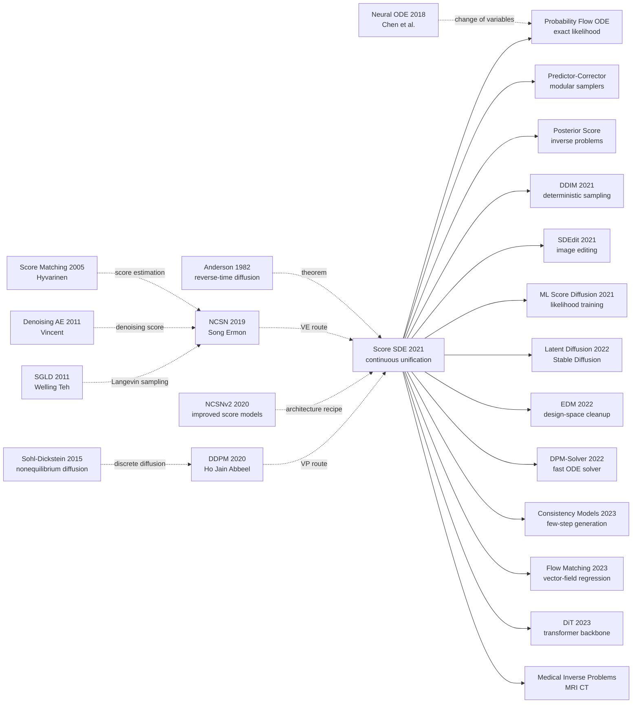

# Score SDE — 用随机微分方程统一扩散与 score-based 生成

> **2020 年 11 月 26 日，Yang Song、Jascha Sohl-Dickstein、Diederik P. Kingma、Abhishek Kumar、Stefano Ermon、Ben Poole 等 6 位作者把 [arXiv:2011.13456](https://arxiv.org/abs/2011.13456) 上传到 arXiv，随后以 ICLR 2021 Oral 发表。** 这篇论文的独特气味不在于又造了一个扩散模型，而在于它说清楚了一个当时还很混乱的事实：NCSN 的 score matching、DDPM 的反向马尔可夫链、Langevin 采样和 neural ODE 不是几条互相竞争的路线，而是同一条连续时间 SDE 的不同离散化。它把生成、似然、插值、可控编辑和逆问题放进同一个公式盒子里，同时给出 CIFAR-10 FID 2.20、IS 9.89、2.99 bits/dim 和 1024px 样本，让扩散模型从“好用的去噪技巧”变成了可以继续长出整个生态的数学语言。

## 一句话总结

Song、Sohl-Dickstein、Kingma、Kumar、Ermon、Poole 等 6 位作者 2020 年提交、2021 年发表于 ICLR Oral 的这篇论文，把 score-based 生成模型写成连续时间随机微分方程：前向过程 $\mathrm{d}\mathbf{x}=\mathbf{f}(\mathbf{x},t)\mathrm{d}t+g(t)\mathrm{d}\mathbf{w}$ 把数据慢慢扩散到噪声，反向过程 $\mathrm{d}\mathbf{x}=[\mathbf{f}(\mathbf{x},t)-g(t)^2\nabla_{\mathbf{x}}\log p_t(\mathbf{x})]\mathrm{d}t+g(t)\mathrm{d}\bar{\mathbf{w}}$ 只要知道每个时刻的 score 就能从噪声生成数据。它替代的不是某个单一 baseline，而是把 [NCSN 2019](https://arxiv.org/abs/1907.05600) 的 annealed Langevin、DDPM 2020 的离散反向链、neural ODE 似然和逆问题后验采样统一成同一个框架；实验上，NCSN 的 CIFAR-10 FID 25.32、NCSNv2 的 10.87、DDPM 的 3.17 被推进到 2.20，并同时拿到 2.99 bits/dim。反直觉点在于：这篇理论味很重的论文，真正改变工程生态的不是“更复杂的数学”，而是给后来的 DDIM、SDEdit、DPM-Solver、EDM、Consistency Models 和 Flow Matching 提供了一个共同坐标系。

---

## 历史背景

### 2019-2020 年，生成模型的地图还没有统一

2020 年下半年，图像生成领域看起来热闹，其实非常分裂。GAN 阵营靠 StyleGAN2、BigGAN 和 ADA 把视觉质量推到肉眼难辨，但训练还是靠 min-max 对抗、没有显式似然、mode coverage 一直说不清。VAE 和 normalizing flow 阵营有似然、有概率解释，却常常输在样本锐度。自回归模型在 bits/dim 上漂亮，但像素级串行解码让高分辨率采样很难成为工业默认。与此同时，score-based 生成和 DDPM 各自起飞，却像两种语言在描述同一件事。

更微妙的是，扩散路线本身也有两个故事版本：Sohl-Dickstein 2015 从非平衡热力学和变分推断出发，强调固定前向扩散和学习反向链；Song & Ermon 2019 从 score matching 出发，强调学习 $\nabla_x\log p_\sigma(x)$ 并用 annealed Langevin dynamics 逐级降噪。到 DDPM 2020 出现时，Ho、Jain、Abbeel 把离散扩散的视觉质量推到 CIFAR-10 FID 3.17，但“它和 score matching 究竟是什么关系”仍然需要一个更干净的数学解释。

### 两条路线的表面差异太大

NCSN 看起来像一个采样器论文：选一串噪声尺度 $\sigma_1<\cdots<\sigma_N$，训练一个 noise-conditional score network，然后从大噪声到小噪声做 Langevin MCMC。DDPM 看起来像一个 latent-variable model：定义 $q(x_t|x_{t-1})$，优化 ELBO 的某个简化版本，再从 $p_\theta(x_{t-1}|x_t)$ 祖先采样。一个说 score matching，一个说 ELBO；一个说 MCMC，一个说 reverse Markov chain；一个历史上连着 energy-based model，一个历史上连着 VAE。

Score SDE 的历史贡献，是把这两个看似不同的故事压成同一句话：**它们都是把数据分布沿时间推到简单先验，再用 time-dependent score 把过程倒过来。** SMLD 是 variance-exploding SDE 的离散化，DDPM 是 variance-preserving SDE 的离散化；所谓采样算法，也只是你选择了哪种数值方法去解 reverse-time SDE。

### 作者团队站在两条线的交叉点上

这篇论文的作者组合本身就像一张路线图。Yang Song 和 Stefano Ermon 是 NCSN / NCSNv2 的直接作者，代表 score matching + Langevin 的 Stanford 线；Jascha Sohl-Dickstein 是 2015 年扩散概率模型的原始作者，代表非平衡热力学线；Diederik P. Kingma 是 VAE 和 flow 时代概率生成模型的关键人物；Ben Poole、Abhishek Kumar 当时在 Google Brain，连接了大规模实验和 likelihood/representation 的关切。

所以 Score SDE 不是“某个组又发明了一个扩散变体”，而是几个历史分支在 2020 年末的一次会师。它把 NCSN 的经验教训、DDPM 的工程成功、Anderson 1982 的 reverse-time diffusion theorem、Neural ODE 的 change-of-variables 工具放在同一张桌上，给后来整个 diffusion 生态提供了一个可以继续扩展的坐标系。

## 研究背景与动机

### 论文真正要解决的问题

如果只看摘要，Score SDE 像一篇理论统一论文；如果看它在 2021-2026 年的后续影响，它其实解决了三个非常工程的问题。

第一，**采样器如何系统设计**。NCSN 的 annealed Langevin、DDPM 的 ancestral sampling、ODE solver、MCMC corrector 在旧框架里像一堆经验技巧。SDE 框架把它们变成“predictor”和“corrector”的可组合模块：predictor 负责沿 reverse-time SDE 前进一步，corrector 负责用 score-based MCMC 把当前边际分布拉回去。

第二，**高质量样本和精确似然能否共存**。GAN 没有似然，DDPM 有 ELBO 但不是精确 likelihood，flow 有精确 likelihood 但样本质量弱。Probability flow ODE 说：对每个 SDE，都存在一个共享相同边际分布的 deterministic ODE。沿这个 ODE 用 instantaneous change of variables 就能算 exact likelihood，于是同一个 score model 可以既采样又做密度估计。

第三，**可控生成是否一定要重新训练条件模型**。Score SDE 把条件生成写成 posterior score：$\nabla_x\log p_t(x|y)=\nabla_x\log p_t(x)+\nabla_x\log p_t(y|x)$。这意味着只要前向测量过程 $p(y|x)$ 的梯度可写或可近似，无条件 score model 就可以做 inpainting、colorization、压缩感知、医学重建等逆问题。

### 为什么 SDE 是合适语言

SDE 的优势不是“显得高级”，而是它给扩散模型提供了三个缺失的自由度。

- **连续时间**：不再被 1000 个离散 step 绑死，可以讨论任意噪声 schedule、任意数值 solver、任意 adaptive step size。
- **统一离散模型**：SMLD、DDPM、sub-VP 不再是三个模型，而是三种 forward SDE / discretization 选择。
- **接上数值分析**：一旦问题被写成 SDE/ODE，Euler-Maruyama、Runge-Kutta、predictor-corrector、Hutchinson trace estimator 这些成熟工具就能直接进入生成模型。

这也是 Score SDE 的深层历史位置：DDPM 让 diffusion 变得好用；Score SDE 让 diffusion 变得可解释、可组合、可推广。前者赢了 2020 年的样本质量，后者定义了此后几年“扩散模型为什么能被改造成一切”的语法。

---

## 方法详解

### 整体框架

Score SDE 的核心框架可以用一张流程图概括：先选一个前向 SDE 把数据 $\mathbf{x}(0)\sim p_0$ 推到一个简单先验 $\mathbf{x}(T)\sim p_T$，再训练 time-dependent score network $\mathbf{s}_\theta(\mathbf{x},t)$ 去近似每个中间边际分布的 score，最后选择一种数值方法把 reverse-time SDE 或 probability-flow ODE 从 $T$ 解回 $0$。

$$
\mathrm{d}\mathbf{x}=\mathbf{f}(\mathbf{x},t)\,\mathrm{d}t+g(t)\,\mathrm{d}\mathbf{w}
$$

这里 $\mathbf{f}$ 是 drift，$g$ 是 diffusion coefficient，$\mathbf{w}$ 是 Wiener process。前向过程没有可学习参数，这一点很关键：模型不是学习“如何加噪”，而是只学习“每个噪声时刻往哪里去噪”。

根据 Anderson 1982，扩散过程的反向也是一个 SDE：

$$
\mathrm{d}\mathbf{x}=\left[\mathbf{f}(\mathbf{x},t)-g(t)^2\nabla_{\mathbf{x}}\log p_t(\mathbf{x})\right]\mathrm{d}t+g(t)\,\mathrm{d}\bar{\mathbf{w}},\quad t:T\rightarrow 0
$$

所以训练任务变成了 score estimation：

$$
\theta^*=\arg\min_\theta\ \mathbb{E}_{t\sim U(0,T)}\mathbb{E}_{\mathbf{x}(0)}\mathbb{E}_{\mathbf{x}(t)|\mathbf{x}(0)}\left[\lambda(t)\left\|\mathbf{s}_\theta(\mathbf{x}(t),t)-\nabla_{\mathbf{x}(t)}\log p_{0t}(\mathbf{x}(t)|\mathbf{x}(0))\right\|_2^2\right]
$$

对 VE、VP、sub-VP 这类 affine SDE，$p_{0t}(\mathbf{x}(t)|\mathbf{x}(0))$ 是高斯分布，真实 conditional score 可以闭式算出，因此训练仍然是普通的 denoising score matching。

### 关键设计

#### 设计 1：把有限噪声尺度推广成连续时间 SDE

**功能**：把 NCSN 的离散噪声尺度和 DDPM 的离散 $\beta_t$ 链都看成某个连续 SDE 的离散化。这样，模型选择不再是“用 NCSN 还是 DDPM”，而是“选哪条前向 SDE、用什么离散化和 solver”。

| 名称 | 前身 | 连续形式 | 直觉 |
|------|------|----------|------|
| VE SDE | SMLD / NCSN | $\mathrm{d}\mathbf{x}=\sqrt{\frac{\mathrm{d}\sigma^2(t)}{\mathrm{d}t}}\mathrm{d}\mathbf{w}$ | 均值不变，方差爆炸 |
| VP SDE | DDPM | $\mathrm{d}\mathbf{x}=-\frac{1}{2}\beta(t)\mathbf{x}\mathrm{d}t+\sqrt{\beta(t)}\mathrm{d}\mathbf{w}$ | 方差保持在有限范围 |
| sub-VP SDE | 本文提出 | VP 的 diffusion 项缩小 | 牺牲部分样本质量，换更好 likelihood |

这个设计的厉害之处在于它把“模型家族”和“采样器”解耦了。DDPM 的 ancestral sampling 只是 VP reverse-time SDE 的一种特定离散化；NCSN 的 annealed Langevin 只是 VE 路线上的 corrector-heavy sampler。于是后续研究可以自由替换 SDE、solver、score network，而不必重写整个理论。

#### 设计 2：reverse-time SDE + predictor-corrector 采样

**功能**：把采样拆成两类动作：predictor 负责沿反向 SDE 做数值积分，corrector 负责用 score-based MCMC 修正当前噪声时刻的边际分布。原始 NCSN 和 DDPM 都变成 PC 框架的特例。

| 采样器 | Predictor | Corrector | 代表含义 |
|--------|-----------|-----------|----------|
| NCSN 原始采样 | identity | Annealed Langevin | 只校正，不显式预测 |
| DDPM ancestral | Ancestral / reverse diffusion | identity | 只预测，不做 MCMC 校正 |
| PC sampler | Euler / reverse diffusion / probability flow | Langevin / HMC | 先预测，再校正 |
| ODE sampler | Probability flow ODE | optional | deterministic, 可做 likelihood |

简化的 PC sampler 可以写成：

```python
def pc_sample(prior, timesteps, score_model, predictor, corrector):
    x = prior.sample()
    for t_next, t in reversed(list(zip(timesteps[:-1], timesteps[1:]))):
        x = predictor(x, t, t_next, score_model)
        x = corrector(x, t_next, score_model)
    return x
```

设计动机很朴素：纯 predictor 会累积离散化误差，纯 corrector 又把大量计算花在 MCMC 上；PC 把二者的职责分开，通常比“多跑一倍 predictor step”更划算。论文 Table 1 也显示，在相同或相近 score function evaluation 下，加 corrector 往往比简单加密离散步更有效。

#### 设计 3：probability flow ODE，把扩散模型接到 likelihood 和 latent space

**功能**：对任意前向 SDE，构造一个 deterministic ODE，它和原 SDE 在每个时间 $t$ 有相同的 marginal distribution。这个 ODE 没有随机项，因此可以像 continuous normalizing flow 一样计算 exact likelihood、做 latent encoding、插值和 temperature scaling。

$$
\mathrm{d}\mathbf{x}=\left[\mathbf{f}(\mathbf{x},t)-\frac{1}{2}g(t)^2\nabla_{\mathbf{x}}\log p_t(\mathbf{x})\right]\mathrm{d}t
$$

把真实 score 换成 $\mathbf{s}_\theta$ 后，这就是一个 neural ODE。通过 instantaneous change of variables：

$$
\log p_0(\mathbf{x}(0))=\log p_T(\mathbf{x}(T))+\int_0^T \nabla\cdot \tilde{\mathbf{f}}_\theta(\mathbf{x}(t),t)\,\mathrm{d}t
$$

散度项可以用 Hutchinson trace estimator 估计。这个设计让 score model 同时拥有三种身份：SDE 采样器、ODE likelihood model、invertible latent encoder。对 2021 年的生成模型格局来说，这很反直觉，因为当时大家习惯把“GAN 级样本质量”和“flow 级 likelihood”当成两套互斥工程。

#### 设计 4：posterior score，把逆问题变成条件反向 SDE

**功能**：如果有观测 $y$ 和前向测量过程 $p(y|x)$，条件生成可以通过 posterior score 完成，而不一定需要重新训练一个条件 score model。

$$
\nabla_{\mathbf{x}}\log p_t(\mathbf{x}|y)=\nabla_{\mathbf{x}}\log p_t(\mathbf{x})+\nabla_{\mathbf{x}}\log p_t(y|\mathbf{x})
$$

把这个 posterior score 放进 reverse-time SDE，就能从 $p(x|y)$ 采样。论文展示了 class-conditional CIFAR-10、LSUN inpainting、LSUN colorization；后续医学 MRI、CT 重建、压缩感知、deblurring、super-resolution 都继承了这个视角。它的核心 lesson 是：score model 学到的不是一个固定 generator，而是一个可被物理观测模型“插入”的 prior gradient。

### 实现配方

Score SDE 的方法不是纯理论，论文也给了非常实用的配方。NCSN++ / DDPM++ 基本继承 DDPM 的 U-Net，但补上了 StyleGAN / BigGAN 时代的稳定化组件。

| 模块 | 选择 | 作用 |
|------|------|------|
| Backbone | NCSN++ / DDPM++ U-Net | 以 ResBlock + attention 处理多尺度图像 |
| Time embedding | random Fourier features / sinusoidal | 让网络接受连续 $t$ 或离散 step |
| Sampling | PC sampler, ODE sampler | 在样本质量、速度、likelihood 之间切换 |
| EMA | VE 用 0.999，VP 用 0.9999 | 明显稳定 FID |
| Architecture tricks | FIR up/downsample, skip rescaling, BigGAN block | 把 score network 推到 GAN 级视觉质量 |

最终最好样本质量来自 NCSN++ continuous deep + VE SDE + PC sampler：CIFAR-10 FID 2.20、IS 9.89。最好 likelihood 来自 DDPM++ continuous deep + sub-VP SDE + probability flow ODE：uniformly dequantized CIFAR-10 上 2.99 bits/dim。这个分工也揭示了一个重要事实：**不同 SDE 在样本质量和 likelihood 上有不同偏好，Score SDE 给的是设计空间，不是单一答案。**

---

## 失败案例

### 被统一或超越的路线

Score SDE 的“失败 baseline”不是单个模型被打败，而是几条当时各有硬伤的生成路线被重新摆位：

| 路线 | 当时表现 | 为什么不够 | Score SDE 的回应 |
|------|----------|------------|------------------|
| NCSN / SMLD | NCSN FID 25.32，NCSNv2 FID 10.87 | score matching 可行，但采样器与噪声尺度经验性强 | 解释为 VE SDE，加入 PC sampler 和 NCSN++ |
| DDPM | FID 3.17，样本质量强 | 离散链解释漂亮，但 exact likelihood、可控生成和 solver 设计不够统一 | 解释为 VP SDE，并接上 probability flow ODE |
| GAN | StyleGAN2-ADA unconditional FID 2.92 | 样本锐，但训练不稳、无 likelihood、mode coverage 难审计 | 无对抗训练下达到 FID 2.20 |
| Flow / Neural ODE | likelihood 清楚 | 样本质量常弱于 GAN / diffusion | 用 probability flow ODE 把 score model 接回 exact likelihood |

这张表背后的关键判断是：Score SDE 不是“又一个把 GAN 打下去的模型”，而是把 GAN、flow、DDPM、NCSN 各自的优点拆开重新组合。它让非对抗生成同时谈样本质量、似然、latent code、逆问题，而这些能力在 2020 年以前通常分散在不同模型家族里。

### 论文暴露出的失败点

论文最有价值的地方之一，是承认“连续时间框架”并不会自动让所有采样器变好。Table 1 里，probability flow 作为纯 ODE predictor 在 VE SDE 上单独使用时 FID 很差；corrector-only 也不如 predictor + corrector 的组合。换句话说，SDE 统一不是魔法，数值解法仍然决定质量。

| 失败或弱项 | 具体现象 | 教训 |
|------------|----------|------|
| 纯 ODE 采样 | VE SDE 上 probability flow predictor FID 明显劣化 | deterministic path 不一定适合最高样本质量 |
| 纯 corrector | C2000 往往不如 P2000 或 PC1000 | MCMC 修正不能替代反向动力学 |
| 离散模型插值 | P2000 需要对原本 1000 noise scale 做 ad-hoc 插值 | 连续时间训练比事后插值更自然 |
| 超高分辨率 | 1024px CelebA-HQ 有脸部对称性等瑕疵 | 框架可扩展，不等于架构已经成熟 |

这些“失败”后来都变成研究入口：DPM-Solver、EDM、PNDM、UniPC 等工作继续改善 ODE/SDE solver；Latent Diffusion 解决像素空间成本；DiT 替代 U-Net 的局部卷积归纳偏置；Consistency Models 直接学习概率流轨迹上的一致映射。

### 方法没有解决的失败

Score SDE 没有解决采样慢的问题。PC sampler 在 CIFAR-10 上能给出 FID 2.20，但它仍然需要大量 score function evaluation；probability flow ODE 可以用 adaptive solver 减少 NFE，但纯 ODE 质量和 SDE+corrector 之间仍有差距。论文结论也明确承认：如何结合 score-based 模型的稳定训练和 GAN 这类 implicit model 的快速采样，是未来方向。

它也没有解决 discrete data 的自然建模问题。Score 是连续密度的梯度，文本、离散 token、categorical graph 等对象需要额外 relaxation、embedding 或离散扩散变体。这个限制后来才由 discrete diffusion、masked diffusion、flow matching over simplex 等路线逐步处理。

最后，它把 solver design space 打开了，但也把超参数空间一起打开了：SDE 类型、$\lambda(t)$ 权重、time interval 的 $\epsilon$ 截断、SNR、corrector 步数、ODE tolerance、EMA rate 都会影响结果。Score SDE 给了语言和框架，但没有给“一键最优”的 recipe。

---

## 实验关键数据

### CIFAR-10 主结果

| 模型 | 条件设置 | FID ↓ | IS ↑ | NLL bits/dim ↓ |
|------|----------|-------|------|----------------|
| NCSN (Song & Ermon 2019) | unconditional | 25.32 | 8.87 | — |
| NCSNv2 (Song & Ermon 2020) | unconditional | 10.87 | 8.40 | — |
| DDPM (Ho et al. 2020) | unconditional | 3.17 | 9.46 | ≤3.75 |
| StyleGAN2-ADA | unconditional | 2.92 | 9.83 | — |
| DDPM++ | unconditional | 2.78 | 9.64 | — |
| DDPM++ cont. (VP) | unconditional | 2.55 | 9.58 | 3.16 |
| DDPM++ cont. (sub-VP) | unconditional | 2.61 | 9.56 | 3.02 |
| NCSN++ cont. deep (VE) | unconditional | **2.20** | **9.89** | — |
| DDPM++ cont. deep (sub-VP) | unconditional | 2.41 | 9.57 | **2.99** |

这组数字说明了两个互补结论。第一，VE + NCSN++ + PC sampler 是当时样本质量最强路线，FID 2.20 比 unconditional StyleGAN2-ADA 2.92 更好。第二，sub-VP + DDPM++ + probability flow ODE 是 likelihood 最强路线，2.99 bits/dim 让 score-based diffusion 接近甚至超过许多 flow baseline。

### 采样器消融

| 设置 | 代表数值或现象 | 结论 |
|------|----------------|------|
| VE/SMLD predictor-only | P1000 约 4.98，P2000 约 4.88 | 多一倍 predictor 步只小幅改善 |
| VE/SMLD PC | PC1000 约 3.24 | 加 corrector 比盲目加步更有效 |
| VP/DDPM predictor-only | P1000 约 3.24，P2000 约 3.21 | DDPM 离散链本身已经强 |
| VP/DDPM PC | PC1000 约 3.18 | corrector 仍有小幅收益 |

这里的重点不是某个小数点，而是趋势：一旦有 score function，采样器不必被模型论文原本的 ancestral rule 绑住。Score SDE 把“如何解反向过程”变成一个独立研究问题，这正是后续 fast sampler 爆发的起点。

### 高分辨率与可控生成

| 能力 | 实验设置 | 结果 | 意义 |
|------|----------|------|------|
| 1024px 生成 | CelebA-HQ / FFHQ 风格人脸 | 首次展示 score-based 1024×1024 高保真样本 | 证明路线可扩展到高维图像 |
| Class conditioning | CIFAR-10 + noisy classifier | 通过 conditional reverse SDE 生成指定类别 | 早期 classifier guidance 原型 |
| Inpainting | LSUN bedroom / church | 一个无条件 score model 补全遮挡区域 | 逆问题可不重训生成器 |
| Colorization | LSUN grayscale input | 同一框架输出多样彩色结果 | posterior score 可表达多解后验 |

这些实验今天看可能没有 Stable Diffusion 那样“产品级”，但在 2021 年非常关键：它们证明 score model 学到的是一个可组合的 prior，而不是只能从随机噪声出图的黑盒 generator。

### 关键结论

- **样本质量**：NCSN++ cont. deep (VE) 把 CIFAR-10 unconditional FID 推到 2.20，超过当时 unconditional StyleGAN2-ADA。
- **似然**：DDPM++ cont. deep (sub-VP) 通过 probability flow ODE 达到 2.99 bits/dim。
- **可控性**：class conditioning、inpainting、colorization 都可以用 posterior score / conditional reverse SDE 表达。
- **可扩展性**：1024px 样本证明 score-based route 不再局限于 CIFAR-10。
- **最重要的实验 lesson**：不同目标对应不同 SDE / solver 组合，Score SDE 的贡献是把这些选择变成可枚举的设计空间。

---

## 思想史脉络



### 前世（被谁逼出来的）

- **Anderson 1982**：给出 reverse-time diffusion equation，是整篇论文最底层的数学钥匙。没有这个定理，“从加噪 SDE 推出反向 SDE”就没有简洁闭式。
- **Hyvarinen 2005 score matching**：证明可以直接学习 $\nabla_x\log p(x)$，绕开 partition function。Score SDE 的神经网络本质上就是 time-dependent score estimator。
- **Vincent 2011 denoising score connection**：解释了为什么“从噪声样本恢复干净样本”会学习到 score，为 denoising score matching 提供桥梁。
- **Welling & Teh 2011 SGLD / Langevin MCMC**：让“沿 score 走一步 + 加噪声”成为合法采样器。NCSN 的 annealed Langevin 和 Score SDE 的 corrector 都从这里来。
- **Sohl-Dickstein 2015 diffusion probabilistic model**：离散 forward diffusion + learned reverse chain 的祖先。Score SDE 把它识别为 VP SDE 的离散化。
- **Song & Ermon 2019/2020 NCSN/NCSNv2**：多噪声尺度 score matching + annealed Langevin 的直接前身。Score SDE 把它识别为 VE SDE 的离散化。
- **Ho et al. 2020 DDPM**：用 $L_{simple}$、U-Net 和 $\epsilon$-prediction 把 diffusion 推到 GAN 级视觉质量。Score SDE 在理论上解释了 DDPM 为什么也是 score-based model。

### 今生（继承者）

- **DDIM / probability-flow 方向**：DDIM 不是 Score SDE 的直接同一篇论文，但它和 probability flow ODE 共同把 diffusion 从纯随机链推向 deterministic / non-Markovian sampler。后来的 DPM-Solver、PNDM、DEIS、UniPC 都沿着“把采样当数值 ODE/SDE 求解”这条线走。
- **SDEdit / inverse-problem 方向**：SDEdit 用“先把输入加到某个噪声水平，再反向去噪”的方式做 image editing；医学 MRI、CT、压缩感知、deblurring 等工作则把 posterior score 写进反向 SDE。Score SDE 的第 5 节是这些工作的共同语法。
- **Likelihood / representation 方向**：Maximum Likelihood Training of Score-Based Diffusion Models、probability-flow likelihood、latent interpolation、temperature scaling 都继承了本文“同一个 score model 可以有 ODE 编码”的视角。
- **Design-space 方向**：EDM 把噪声 schedule、preconditioning、solver、parameterization 重新拆开；Flow Matching / Rectified Flow 进一步把轨迹学习改写成 vector-field regression。它们不一定沿用 SDE 形式，但都继承了本文“生成模型可以先选路径再学速度/score”的坐标系。
- **现代大模型方向**：Stable Diffusion、Imagen、DiT、Sora 等系统工程多数采用 DDPM/ODE/solver 体系的混合版本。用户看到的是 text-to-image 产品，底层仍然在处理 Score SDE 定义过的那些对象：噪声时间、score/velocity、solver、guidance、latent path。

### 误读 / 简化

- **“Score SDE 就是 DDPM 的理论解释”**：不完整。它确实解释了 DDPM，但同样解释 NCSN、SMLD、probability-flow likelihood、posterior score 和 inverse problems。只把它当 DDPM 注脚，会低估它对 solver 和 control 的影响。
- **“SDE 越复杂越好”**：论文实际给出的教训相反。VE、VP、sub-VP 是可选设计点，不同目标偏好不同 SDE；真正重要的是把 SDE、训练目标、solver 和 architecture 一起调。
- **“ODE sampler 解决采样慢”**：Probability flow ODE 打开了 fast sampling 和 likelihood，但纯 ODE 当时并不总是最高质量。后续 fast sampler 需要更好的离散化、distillation 或 consistency training。
- **“Score model 等于 denoiser”**：在工程实现上常常可以这么说，但思想史上 score model 更像一个可组合的 prior gradient。它能被 measurement likelihood、classifier gradient、text guidance、ODE solver 接入，这比“去噪网络”宽得多。
- **“这篇论文的影响只在图像生成”**：后续机器人策略、蛋白质结构、医学成像、科学反问题都继承了 score / diffusion prior 的语言。图像只是最早爆炸的显示器。

---

## 当代视角

### 站不住的假设

- **“SDE 形式是最终答案”**：2021 年看，SDE 是最自然的统一语言；到 2026 年看，它更像一个重要中间层。Flow Matching、Rectified Flow、Consistency Models 把很多问题改写成 ODE 速度场或一致性映射，少了随机过程术语，但仍继承“选一条噪声到数据的路径，再学沿途向量场”的思想。
- **“score 参数化就是扩散模型的核心”**：今天的工业模型常用 $\epsilon$-prediction、$v$-prediction、flow velocity、rectified velocity，甚至直接学 consistency function。Score 是理论上最干净的对象，但工程上不一定是最佳输出参数化。
- **“probability flow ODE 足以解决采样效率”**：它打开了 deterministic sampling 和 likelihood，但真正让采样进入 10 步、4 步、1 步区间的是 DPM-Solver、EDM sampler、distillation、LCM、Consistency Models 等后续技术。
- **“像素空间 score model 可以一路扩到产品级”**：Score SDE 已经展示 1024px 样本，但成本巨大且细节仍有瑕疵。Stable Diffusion 的关键一步是 latent space；DiT / MMDiT 又进一步改变 backbone。像素空间 SDE 是概念证明，不是最终产品路线。
- **“inverse problems 只需要 posterior score 公式”**：公式优雅，但真实 MRI、CT、deblurring、super-resolution 需要处理 measurement noise、operator mismatch、data consistency、guidance strength 和 domain prior。后续 DPS、score-MRI、Diffusion Posterior Sampling 等工作才把这条线工程化。

### 时代证明的关键 vs 冗余

**真正留下来的关键**：

- 连续时间视角：噪声 schedule、solver、parameterization 变成可拆的设计维度。
- Reverse-time dynamics：从 learned denoiser 到 generative sampler 的桥梁被写清楚。
- Probability-flow ODE：让 diffusion/score model 接上 likelihood、latent encoding、ODE solver 和 distillation。
- Predictor-corrector 思想：把“走动力学”和“修正边际分布”分开，后来影响了许多 sampler 和 guidance 解释。
- Posterior score：把条件生成、编辑和逆问题放进同一个 Bayesian gradient 语言。

**今天看显得冗余或过渡性的部分**：

- 复杂 SDE 分类本身不是用户关心的接口，工业系统更关心 solver NFE、质量、延迟和可控性。
- PC sampler 在高质量小图上很漂亮，但现代大模型更常用 ODE sampler、distilled sampler 或 flow-based sampler。
- NCSN++ / DDPM++ 架构是当时最强 recipe，但后续被 ADM U-Net、LDM U-Net、DiT、MMDiT 等替换。
- 精确 likelihood 在图像生成产品里不是主指标，但它对理解、压缩、OOD、representation 仍有理论价值。

### 作者当时没想到的副作用

1. **“solver 研究”变成扩散模型主赛道**：Score SDE 把采样明确写成数值解 SDE/ODE，直接为 DPM-Solver、PNDM、DEIS、UniPC、EDM sampler、consistency distillation 打开了空间。扩散模型后来的很多速度提升，本质上都在回答本文提出的 solver 问题。
2. **文本到图像系统继承了这套语言**：Stable Diffusion 用户不会说 reverse-time SDE，但 sampler 菜单里的 Euler、Heun、DPM++、UniPC、SDE、ODE 都是本文坐标系的工程化回声。
3. **逆问题与科学计算重新发现生成模型 prior**：从 MRI/CT 到蛋白质结构、机器人策略，很多任务不需要“生成漂亮图”，而需要“从 noisy observation 里采样合理 posterior”。Score SDE 的 posterior score 视角给了这些任务共同入口。
4. **理论统一反过来促进工程分叉**：一旦 NCSN/DDPM/ODE 被放进同一个框架，研究者就能放心地混搭：latent diffusion 用 DDPM 训练和 ODE sampler，EDM 改噪声尺度，Flow Matching 改路径，Consistency Models 蒸馏 ODE 轨迹。统一没有减少分支，反而让分支更有秩序。

### 如果今天重写 Score SDE

如果 2026 年重写这篇论文，核心仍会保留“路径 + 向量场 + solver”的骨架，但表达方式会更宽：

- 把 SDE、ODE、flow matching、rectified flow 放在同一个 stochastic/interpolant 框架下，而不是以 SDE 为唯一中心。
- 同时讨论 score、noise、velocity、data prediction、consistency function 的等价与差异，并明确哪种参数化适合哪类 solver。
- 默认在 latent space 和 high-dimensional token/patch space 实验，而不只展示 CIFAR-10 与 CelebA-HQ。
- 把 classifier-free guidance、text conditioning、多模态 conditioning 纳入主文，而不是只在 class conditioning / inpainting / colorization 上证明可控性。
- 用现代 fast sampler 指标报告 NFE-quality curve，而不仅是 1000/2000 step PC sampler 与 ODE tolerance。
- 更系统地讨论数据版权、生成内容风险、医学逆问题的可靠性边界。2021 年这不是 ICLR 论文的中心，2026 年已经绕不开。

但这篇论文最值得保留的一句话不会变：**如果你能估计每个噪声时刻的 score，生成、似然、编辑和逆问题就都是同一个动力系统的不同读法。**

---

## 局限与展望

### 作者承认的局限

- 采样仍比 GAN 慢，PC sampler 尤其需要大量 score function evaluation。
- sampler 的选择带来额外超参数，自动选择和调参仍是开放问题。
- Probability flow ODE 虽然支持 likelihood 和较快采样，但纯 ODE 采样质量不总是最好。
- 离散数据不适合直接定义 score，需要额外连续化或模型变体。
- 高分辨率样本虽然可行，但 1024px 实验仍有明显视觉瑕疵，架构远未成熟。

### 后续已经解决或仍在推进的方向

- **快采样**：DDIM、PNDM、DPM-Solver、EDM、UniPC、Consistency Models、LCM 把 NFE 从上千步推到几十步、几步甚至一步。
- **高分辨率效率**：Latent Diffusion / Stable Diffusion 把扩散过程搬到压缩 latent，显著降低成本。
- **更强 backbone**：ADM U-Net、LDM U-Net、DiT、MMDiT 替代了早期 NCSN++ / DDPM++ 配方。
- **条件生成**：Classifier guidance、classifier-free guidance、CLIP/T5 text encoder、ControlNet/IP-Adapter 把 posterior/guidance 思想产品化。
- **逆问题可靠性**：DPS、score-MRI、PnP diffusion、Diffusion Posterior Sampling 等路线继续处理 measurement consistency 和不确定性。
- **理论泛化**：Schrodinger bridge、optimal transport、flow matching、rectified flow 把本文的 SDE/ODE 语言扩到更一般的路径学习。

---

## 相关工作与启发

### 与几条主线的关系

- **vs DDPM**：DDPM 是强工程配方，Score SDE 是统一语法。没有 DDPM，Score SDE 缺少“这条路线真能赢 GAN”的证据；没有 Score SDE，DDPM 很容易被误读成一个特殊去噪技巧。
- **vs NCSN**：NCSN 是 score route 的起点，Score SDE 是把它接回 diffusion / ODE / likelihood 的桥。NCSN 证明 score 可以生成图像，Score SDE 证明 score 可以组织整个模型族。
- **vs normalizing flow**：flow 从一开始就有 exact likelihood，但架构受可逆性限制；Score SDE 用 probability flow ODE 在采样后接上 likelihood，不要求 score network 自身可逆。
- **vs GAN**：GAN 的优点是快和锐，缺点是训练/似然/coverage；Score SDE 证明非对抗路线也能达到或超过 GAN 质量，并保留概率解释。
- **vs Flow Matching / Rectified Flow**：后者把随机扩散进一步简化为 deterministic vector-field regression。它们不是否定 Score SDE，而是把本文“连续路径 + solver”的思想压成更直接的工程形式。

---

## 相关资源

- Paper: [arXiv:2011.13456](https://arxiv.org/abs/2011.13456)
- OpenReview: [ICLR 2021 Oral](https://openreview.net/forum?id=PxTIG12RRHS)
- Official code: [yang-song/score_sde](https://github.com/yang-song/score_sde)
- PyTorch code: [yang-song/score_sde_pytorch](https://github.com/yang-song/score_sde_pytorch)
- Author tutorial: [Generative Modeling by Estimating Gradients of the Data Distribution](https://yang-song.net/blog/2021/score/)
- Curated bibliography: [Score-Based Generative Modeling](https://scorebasedgenerativemodeling.github.io/)
- Related deep note: DDPM (2020)
- Follow-up papers: [DDIM](https://arxiv.org/abs/2010.02502), [Maximum Likelihood Training of Score-Based Diffusion Models](https://arxiv.org/abs/2101.09258), [SDEdit](https://arxiv.org/abs/2108.01073), [DPM-Solver](https://arxiv.org/abs/2206.00927), [EDM](https://arxiv.org/abs/2206.00364), [Consistency Models](https://arxiv.org/abs/2303.01469)


---

> 🌐 [English version](/en/era4_foundation_models/2020_score_sde/) · 📚 awesome-papers project · CC-BY-NC