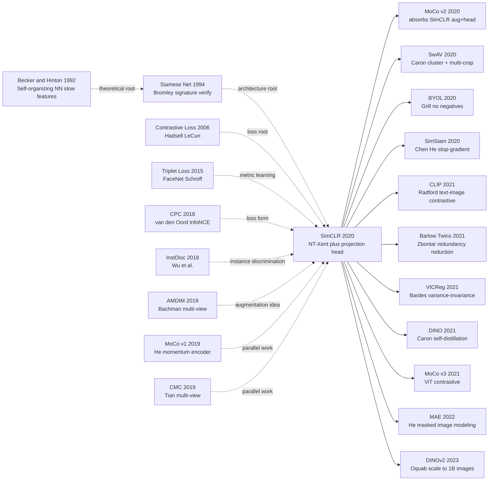

# SimCLR — 一个朴素的对比损失，把自监督视觉学习推上 ImageNet 线性评测的王座

---

## 一句话总结

SimCLR 把视觉自监督学习简化成一句话：**对同一张图做两次随机增广，让网络学会把它们的表示拉近、把别人的推远**。靠"强增广组合 + 一个用完即扔的 MLP projection head + 大 batch + 单一 NT-Xent 损失"四件套，第一次让 ImageNet 线性评测的 top-1 在自监督路线上达到 76.5%（ResNet-50 4×），追平监督学习——彻底改写了"视觉表示必须靠标签"的二十年共识。

---

## 历史背景

### 2020 年的视觉自监督学界在卡什么

要理解 SimCLR 的颠覆性，必须回到 2019-2020 那个"自监督看似有方向、却怎么都打不过监督"的尴尬年份。

整个 2018-2019 年，CV 自监督出现了 4 大流派全部苦战：
- **Pretext task 派**（旋转预测、jigsaw、colorization）：思路漂亮但下游迁移弱，ImageNet 线性评测 top-1 卡在 50% 以下
- **生成式派**（BiGAN、AutoEncoder、PixelCNN）：训练慢、表示质量低、和分类任务关联弱
- **聚类派**（DeepCluster, SeLa）：依赖反复 k-means 重新分配伪标签，调参痛苦
- **对比派**（CPC v1、InstDisc、AMDIM、CMC、MoCo v1）：理论最干净但 ImageNet linear 还在 60-65% 区间，**比监督 76.1% 差 10+ 个点**

学界的隐含共识是：**自监督是个有理想没结果的玩意儿，监督预训练在可见未来仍是不可替代的**。即使 He Kaiming 2019 年底放出 MoCo v1 把 ImageNet linear 推到 60.6%，也只是"接近某些监督迁移结果"，离打平监督 IN1k linear 还差一大截。

> **整个 2019 年，CV 学界对自监督的判断：" promising direction but not yet competitive."**

### 直接逼出 SimCLR 的 N 篇前序

- **CPC (van den Oord et al., 2018, [arXiv:1807.03748](https://arxiv.org/abs/1807.03748))**：把 InfoNCE 损失正式带入表示学习。证明"用对比损失最大化输入对之间的互信息下界"在数学上等价于学好表示。SimCLR 直接继承了 InfoNCE/NT-Xent 的损失形式。
- **InstDisc / NPID (Wu et al., CVPR 2018)**：把每张图片当成单独一个类做"实例判别"，用 memory bank 存所有 ImageNet 实例的特征。SimCLR 砍掉 memory bank，改用同 batch 内 negative 简化训练。
- **AMDIM (Bachman et al., 2019)**：第一次大规模做"多视角 InfoMax"，证明数据增广是关键 — SimCLR 把这个方向推到极致。
- **MoCo v1 (He et al., CVPR 2020)**：用动量更新的 key encoder + queue 解决 negative sample 数量限制；SimCLR 反过来证明"只要 batch 够大（4096+），不需要 queue"，提出了一个更简单的范式。
- **PIRL (Misra & van der Maaten, CVPR 2020)**：strong augmentation invariance 的证据；SimCLR 系统化了"哪些增广组合真正重要"。

### 作者团队当时在做什么

Ting Chen 是 Hinton 在 Google Brain 多伦多组的博士后；Simon Kornblith 当时也在 Brain 做迁移学习+representation similarity 研究（CKA 系列论文的作者）；Hinton 自己当时把研究主轴重新切回"无监督 + capsule + glom"系列，推动 Brain Toronto 整体压注自监督。

**SimCLR 不是 Brain 的旗舰项目**，最初的提议是 Chen 觉得 "InstDisc / MoCo / CPC 看起来都做了一堆复杂工程，但本质是同一个对比损失，能不能把它做到最朴素？"——这是个典型的 Hinton 式的"clean it up to its essence"。论文 2020-02 月挂 arXiv，一周内 ImageNet linear 76.5% 的数字在 Twitter 被反复转发。

### 工业界 / 算力 / 数据的状态

- **GPU/TPU**：TPU v3-32 / v3-128 (论文用 TPU 训 1000 epoch)，**单次实验 ImageNet 8 卡 V100 训不动 batch 4096，必须 32+ TPU**
- **数据**：ImageNet-1k (1.28M 图)，ImageNet-22k (14M 图)，Instagram-1B (Mahajan 2018) 还是壁垒资源
- **框架**：TensorFlow（论文官方代码），PyTorch 复现一周内涌现
- **行业焦虑**：BERT 已经在 NLP 引爆 self-supervised pretrain 范式，CV 学界憋着想做 "BERT-of-vision"——SimCLR + MoCo v1 就是 2020 年同时给出的两个答案，但 SimCLR 的简洁让它更快传播。

---
## 方法详解

### 整体框架

SimCLR 的整体 pipeline 极其简单：

```
对一张图 x 做两次独立的随机增广:
    x → t(x) = x̃_i,    x → t'(x) = x̃_j   (两个 augmented "views")
                    ↓                    ↓
            encoder f (ResNet-50)  encoder f
                    ↓                    ↓
                h_i ∈ ℝ^2048        h_j ∈ ℝ^2048    ← 这是下游用的 representation
                    ↓                    ↓
            projection head g (2-layer MLP)
                    ↓                    ↓
                z_i ∈ ℝ^128         z_j ∈ ℝ^128     ← contrastive 损失只在这里算

           NT-Xent loss: pull (z_i, z_j) closer, push (z_i, others) apart
```

**用完即扔**：训练完成后只保留 encoder $f$，projection head $g$ 直接丢弃 —— 下游任务用 $h$ 而不是 $z$。这是一个反直觉但被消融验证的关键决策（设计 2 详述）。

| 配置 (论文 §3) | 默认值 | 备注 |
|---|---|---|
| Encoder $f$ | ResNet-50 (2048-d) | 也跑了 ResNet-50 ×2/×4 验证 scaling |
| Projection head $g$ | 2-layer MLP, hidden 2048, output 128 | 用完即扔 |
| Batch size $N$ | 4096 | 每 batch 8192 个 view，8190 个 negatives per anchor |
| Optimizer | LARS | 大 batch 必须的 |
| Learning rate | 4.8 (linear scaling, 0.3×N/256) | warmup 10 epoch |
| Temperature $\tau$ | 0.1 (sweep 过 0.05-1.0) | 过大或过小都退化 |
| Epoch | 100 / 200 / 400 / 800 / 1000 | 越长越好，1000 epoch 最佳 |

### 关键设计

#### 设计 1：强增广组合（特别是 random crop + color distortion）—— 真正的"灵魂"

**功能**：从同一张图通过随机增广生成两个差异极大的 view，强迫 encoder 学到与"低层像素"无关、与"高层语义"相关的表示。

**论文最重要的发现 (§3, Figure 5)**：单看每一种增广（crop, color jitter, blur, rotate, cutout, sobel, gaussian noise）效果都平庸，**但任意两种组合的提升是非线性的**——其中 **random crop + color distortion** 这一组合显著超越所有其他组合：

| Augmentation 组合 (单 vs 双) | ImageNet Linear Top-1 |
|---|---|
| 仅 random crop | ~33% |
| 仅 color distortion | ~26% |
| 仅 Gaussian blur | ~25% |
| **random crop + color distortion (final)** | **55-56%** |
| crop + cutout | ~50% |
| crop + Gaussian noise | ~48% |
| crop + rotate | ~42% |

**为什么 crop + color 这么神**：random crop 制造出"局部 patch 应当 match 整图"的语义不变性；但纯 crop 的两个 patch 在 RGB 直方图上太相似，网络可能"作弊"用颜色统计就能配对成功。**color distortion 强行打乱颜色分布**，把这条捷径堵死，强迫网络学语义内容。

**伪代码**（PyTorch 风格）：

```python
def get_simclr_augmentation(image_size=224, s=1.0):
    # s = color distortion strength
    color_jitter = transforms.ColorJitter(0.8*s, 0.8*s, 0.8*s, 0.2*s)
    return transforms.Compose([
        transforms.RandomResizedCrop(image_size, scale=(0.08, 1.0)),  # 关键 1
        transforms.RandomHorizontalFlip(),
        transforms.RandomApply([color_jitter], p=0.8),                # 关键 2
        transforms.RandomGrayscale(p=0.2),
        transforms.GaussianBlur(kernel_size=23),                       # 次要
        transforms.ToTensor(),
    ])
```

**设计动机**：与之前所有自监督方法相比，SimCLR 的网络架构没动（还是 ResNet-50），损失函数没创新（NT-Xent 借自 InfoNCE），唯一独家发现的就是"哪些增广组合被严重低估"。这告诉社区：**大模型 / 复杂损失 / 巧妙架构都不如把数据这一头做对**。这一发现被后续 BYOL、MoCo v2、SwAV 全盘继承，整个 2020-2022 视觉自监督赛道的增广 recipe 几乎都是 SimCLR 配方的微调。

#### 设计 2：非线性 projection head $g(\cdot)$ —— 用完即扔的关键中间层

**功能**：在 encoder 输出 $h$ 之后插入一个 2 层 MLP $g(h) = W^{(2)} \sigma(W^{(1)} h)$，把 2048-d 表示映射到 128-d 后再算对比损失；下游任务时把 $g$ 扔掉，只用 $h$。

**论文最反直觉的发现 (Figure 8)**：在哪里算 contrastive loss 决定下游表现：

| Loss 算在哪里 | 下游 Linear Eval Top-1 |
|---|---|
| 直接在 encoder 输出 $h$ 上算（no head） | 60.6% |
| 在线性 head 输出上算 | 65.6% |
| **在 2-layer MLP head 输出 $z$ 上算（final）** | **66.6%** |

**关键现象**：用 $h$（encoder 输出）做下游 linear eval 比用 $z$（head 输出）高 ~10 个点。也就是说：**MLP head 学到的 $z$ 对对比任务更优，但对下游分类反而更差**。

**为什么会这样**：contrastive loss 训练时会"同质化"$z$ ——把和 augmentation 相关的信息（颜色分布、crop 位置）从 $z$ 中删掉。这种压缩对对比目标本身有利，但**会损失下游分类需要的细节**。把 MLP head 当成"信息缓冲层"放在 $h$ 和损失之间，可以让 $h$ 保留更多"语义无关但下游有用"的信息。

**伪代码**：

```python
class SimCLRModel(nn.Module):
    def __init__(self, base_encoder=resnet50):
        super().__init__()
        self.encoder = base_encoder(zero_init_residual=True)
        feat_dim = self.encoder.fc.in_features
        self.encoder.fc = nn.Identity()             # 拆掉 ImageNet 分类头
        self.projection = nn.Sequential(             # 插入 2-layer MLP
            nn.Linear(feat_dim, feat_dim),
            nn.ReLU(inplace=True),
            nn.Linear(feat_dim, 128),
        )

    def forward(self, x):
        h = self.encoder(x)     # ← 下游 transfer 用这个
        z = self.projection(h)  # ← contrastive loss 用这个
        return h, z
```

**设计动机**：这是个**完全经验得到的设计**——作者没有先验理论证明 head 应该是 2 层 MLP，纯靠消融实验发现的。BYOL (Grill 2020)、SimSiam (Chen He 2020)、MoCo v2 (Chen 2020) 全部继承了 projection head 设计；2024 年的 DINOv2 还在用类似设计。**"用完即扔的中间层"成了表示学习领域一个反直觉但普适的设计原则**。

#### 设计 3：NT-Xent loss + 大 batch 内 negative —— 最简单的对比损失

**功能**：在 size-$N$ batch 上做 augmentation 得到 $2N$ 个 view，对每个 anchor $i$，把它对应的 augmented 双胞胎 $j(i)$ 当唯一 positive，其余 $2N-2$ 个当 negative。损失：

$$
\mathcal{L} = \frac{1}{2N} \sum_{k=1}^{N} [\ell(2k-1, 2k) + \ell(2k, 2k-1)],\quad
\ell_{i,j} = -\log \frac{\exp(\text{sim}(z_i, z_j) / \tau)}{\sum_{k=1}^{2N} \mathbb{1}_{k \neq i} \exp(\text{sim}(z_i, z_k) / \tau)}
$$

其中 $\text{sim}(u, v) = \frac{u^\top v}{\|u\|\|v\|}$ 是 cosine similarity，$\tau$ 是温度。这就是 NT-Xent (Normalized Temperature-scaled Cross-Entropy) loss。

**Negatives 数量 vs 性能** (Figure 9)：

| Batch size | Negatives per anchor | ImageNet Linear (100 epoch) |
|---|---|---|
| 256 | 510 | 57.5% |
| 512 | 1022 | 60.7% |
| 1024 | 2046 | 62.8% |
| 2048 | 4094 | 64.0% |
| **4096 (final)** | **8190** | **64.6%** |
| 8192 | 16382 | 64.8% (基本饱和) |

可见 negative 数量对性能确有边际提升，但**在 batch 4096 之后基本饱和**。这点和 MoCo 用 queue 维持 65536 个 negative 形成反差：**一旦 batch 够大，queue 就不再必要**。

**伪代码**：

```python
def nt_xent_loss(z, tau=0.1):
    # z shape: (2N, d), where view_i and view_j of x_k are at indices 2k-1, 2k
    z = F.normalize(z, dim=1)
    sim = z @ z.t() / tau                            # (2N, 2N) cosine sim matrix
    sim.fill_diagonal_(-1e9)                          # exclude self-pair
    N = z.size(0) // 2
    targets = torch.arange(2 * N, device=z.device)
    targets = targets ^ 1                             # pair (0,1), (2,3), ...
    return F.cross_entropy(sim, targets)
```

**设计动机**：NT-Xent 不是 SimCLR 发明的（CPC 已用 InfoNCE），但 SimCLR 第一次把它从"复杂工程套件中的一环"剥离出来，证明 **InfoNCE + 大 batch + 强增广 = 足够 SOTA**，不需要 memory bank 或 momentum encoder。这种"做减法"的姿态影响了整个 2020-2022 自监督方向的设计哲学。

### 训练策略

| 项 | 配置 | 说明 |
|----|------|------|
| Loss | NT-Xent (cosine sim, $\tau$=0.1) | 唯一 loss |
| Optimizer | LARS ($\beta$=0.9, weight decay $10^{-6}$) | 大 batch 必备 |
| LR schedule | cosine, warmup 10 epoch, peak 0.3 × batch / 256 | linear scaling rule |
| Batch size | 4096 (8192 views) | 32-128 TPUv3 cores |
| Epoch | 1000 (主结果)，100/200/400/800 (消融) | 越长越好 |
| BatchNorm | global sync across all TPU cores | 关键，否则 batch 内统计泄露 positive 信息 |
| Augmentation | crop + color jitter + blur + grayscale + flip | 详见设计 1 |
| Warmup | LR 0 → peak in 10 epoch | 大 LR 必须 |

**注意 1**：Global BN sync 是个隐含的关键工程细节——本地 BN 会让网络从 batch 统计中"猜出"哪些样本是 positive pair，导致作弊。MoCo 用 momentum encoder 绕开这个问题，BYOL 也强调 sync BN。

**注意 2**：1000 epoch 训练在 8 V100 上约需 2 周；32 TPU v3 约 3-4 天。**这种成本让 SimCLR 主结果在小实验室不可复现，间接促成了后续 BYOL、SimSiam 等"小 batch 友好"方法的诞生**。

---

## 失败案例

### 当时输给 SimCLR 的对手

- **CPC v2 (van den Oord 2019)**：复杂 patch-level masking + autoregressive predictor，ImageNet Linear 71.5% (ResNet-161 large)。SimCLR 用同样大模型 (ResNet-50 ×4) 干到 76.5%。**教训：复杂的 sequence pretext 不如朴素的 instance discrimination**。
- **MoCo v1 (He et al., CVPR 2020)**：ImageNet Linear 60.6% (ResNet-50, 200 epoch)，靠 momentum + queue 维持 65536 negatives。SimCLR ResNet-50 200 epoch 接近 64-66%。MoCo v2 (2020-3) 立即吸收了 SimCLR 的两大发现（projection head + 强增广），把数字提到 71.1%——**这种"被学生反向超越的一周"在 ML 史上罕见**。
- **InstDisc (Wu et al., 2018)**：54.0% ImageNet Linear，用 4096 个 memory bank 实例特征做 negative。被 SimCLR 在所有 setting 上完爆。
- **AMDIM (Bachman et al., 2019)**：68.1% ImageNet Linear (大模型)，多分辨率 patch lattice 工程复杂。SimCLR 用更简单架构匹配并超越。
- **PIRL (Misra & van der Maaten, CVPR 2020)**：63.6% ImageNet Linear，证明 jigsaw + invariance 也能 work。SimCLR 让 jigsaw 完全过时。
- **BigBiGAN (Donahue & Simonyan, NeurIPS 2019)**：56.6% ImageNet Linear，生成式自监督的高峰。SimCLR 让"生成式自监督"在 ImageNet 上彻底失去竞争力。
- **监督预训练 baseline (ResNet-50 IN1k 100 epoch)**：76.5% top-1。**SimCLR (ResNet-50 ×4, 1000 epoch) 也是 76.5%**——历史首次自监督打平监督，被认为是"视觉自监督的 BERT 时刻"的前夜。

### 论文里的失败实验（消融）

| 配置变体 | ImageNet Linear (ResNet-50, 100 epoch) | 影响 |
|---|---|---|
| **Final SimCLR**                                | **64.6%** | baseline |
| 移除 color distortion                            | 55-56% | -8~9 点（最关键） |
| 移除 random crop                                 | 33%    | 完全垮 |
| 移除 projection head (直接在 $h$ 上算 loss)      | 60.6%  | -4 点 |
| Projection head 用线性而非 2-layer MLP            | 65.6%  | -1 点 |
| 用 $z$ 做下游 transfer 而非 $h$                   | 56-58% | -7 点 (设计 2 反直觉) |
| Batch size 256 (无 LARS)                         | 57.5%  | -7 点（小 batch 严重退化） |
| 温度 $\tau$=1.0                                  | 50%    | -15 点（太软的对比） |
| 温度 $\tau$=0.05                                 | 59%    | -6 点（太硬的对比） |
| 不做 BN sync                                     | ~50%   | 网络从 BN 统计作弊 |

**惊人发现**：最大的单一消融损失来自**移除 color distortion**（-8 到 -9 点），超过移除 head（-4）、移除大 batch（-7）。这告诉社区：**augmentation 是表示学习真正的灵魂，不是 loss 也不是网络**。

### 真正的"反 baseline"教训

**MoCo v1 vs SimCLR 几乎同时发布，结果完全不同**：
1. MoCo v1 (2019-11) 用 momentum + queue 工程化；SimCLR (2020-02) 砍掉 queue 用大 batch 简化。
2. MoCo v1 ResNet-50 200 epoch = 60.6%；SimCLR ResNet-50 200 epoch ≈ 64-66%。差距 4-6 点，几乎全部来自 augmentation + projection head 这两个"软组件"。
3. MoCo v2 (2020-03) 一周内吸收 SimCLR 的 augmentation + head，把数字提到 71.1%——**证明 SimCLR 的真正贡献不是损失或架构，而是消融出了"哪些组件真正有用"**。

**教训：精确的消融实验比新方法本身更有价值**。SimCLR 的引用数远超 MoCo v1/v2 总和，正是因为它告诉了整个社区"该往哪里花精力"。

---

## 实验关键数据

### ImageNet Linear Evaluation（主基准）

| 方法 | Encoder | Params | ImageNet Linear Top-1 |
|---|---|---|---|
| Supervised baseline                        | ResNet-50 (1×) | 24M | 76.5% |
| InstDisc                                   | ResNet-50 | 24M  | 54.0% |
| BigBiGAN                                   | RevNet-50 (4×) | 86M | 56.6% |
| CPC v2                                     | ResNet-161 | 305M | 71.5% |
| MoCo v1                                    | ResNet-50 | 24M  | 60.6% |
| PIRL                                       | ResNet-50 | 24M  | 63.6% |
| **SimCLR (ResNet-50 1×, 1000 epoch)**      | **ResNet-50** | **24M** | **69.3%** |
| **SimCLR (ResNet-50 2×, 1000 epoch)**      | **ResNet-50 2×** | **94M** | **74.2%** |
| **SimCLR (ResNet-50 4×, 1000 epoch)**      | **ResNet-50 4×** | **375M** | **76.5%** |
| MoCo v2 (吸收 SimCLR 配方)                  | ResNet-50 | 24M  | 71.1% |
| BYOL (2020-06, no negatives)               | ResNet-50 | 24M  | 74.3% |

**重大里程碑**：SimCLR ResNet-50 4× 与监督 ResNet-50 1× 在 ImageNet Linear 上**首次打平 76.5%**。虽然这是"不同 encoder size 的不公平比较"，但叙事意义巨大——CV 社区第一次相信"自监督在表示质量上能追上监督"。

### Semi-supervised (1% / 10% labels)

| 方法 | Top-5 (1% labels) | Top-5 (10% labels) |
|---|---|---|
| Supervised (from scratch) | 48.4% | 80.4% |
| **SimCLR (ResNet-50, fine-tune)** | **75.5%** | **87.8%** |
| **SimCLR (ResNet-50 4×, fine-tune)** | **85.8%** | **92.6%** |

仅用 1% ImageNet 标签 + SimCLR pretrain ≈ 100% 标签 supervised baseline。这开启了"低资源场景必跑自监督 pretrain"的工业惯例。

### Transfer Learning (12 个 downstream 数据集)

SimCLR pretrain (ResNet-50 4×) vs Supervised pretrain (ResNet-50)，在 12 个 downstream 数据集上 fine-tune 平均 acc 几乎打平（5 胜 5 负 2 平），证明**自监督表示在 transfer 上和监督一样好**。

### 关键发现

- **大模型放大自监督优势**：从 ResNet-50 1× 到 4× 自监督性能涨 7 点，监督只涨 2 点 —— 这是 CV 学界第一次看到"自监督 scaling 比监督陡"的证据，预示了后续 ViT-22B / DINOv2 / SAM 的 scaling 路线
- **大 batch + 长训练硬道理**：1000 epoch 比 100 epoch 涨 6 点，4096 batch 比 256 batch 涨 7 点 —— 自监督是吃算力的怪兽
- **投资 augmentation > 投资 architecture**：在 SimCLR 之后，几乎所有 SOTA 都用类似的 crop+color recipe，networks 反而 stay simple

---

## 思想史脉络



### 前世（被谁逼出来的）

- **1992 Becker & Hinton**：用 mutual information 训练 multi-view 神经网络的最早原型，可视作对比学习的祖父
- **2006 Hadsell, Chopra, LeCun**：发表正式的 contrastive loss（让 positive pair 距离小、negative pair 距离 > margin）—— SimCLR 的损失形式直接祖先
- **2015 FaceNet (Schroff et al.)**：把 triplet loss 推到工业人脸识别 SOTA，证明"用对比学好表示"的工业可行性
- **2018 CPC (van den Oord)**：InfoNCE 损失正式登场，SimCLR 的损失就是 InfoNCE 的特例
- **2018 InstDisc (Wu)**：把每张图当一个类的范式 —— SimCLR 砍掉 memory bank 的简化前提
- **2019 AMDIM / CMC (Bachman / Tian)**：第一次大规模做 multi-view contrast，证明 augmentation 是关键 —— SimCLR 把这个发现做到极致

### 今生（继承者）

- **直接派生（2020）**：
  - **MoCo v2** (2020-03)：MoCo 框架 + SimCLR augmentation + projection head，把 ImageNet Linear 推到 71.1%（小 batch 友好）
  - **SwAV** (Caron, NeurIPS 2020)：online clustering + multi-crop 替代 negatives，74.3% Linear
  - **BYOL** (Grill et al., NeurIPS 2020)：**完全去掉 negatives**，只用 online + momentum target network 预测，74.3% Linear——颠覆了"对比学习必须有 negatives"的认知
  - **SimSiam** (Chen & He, CVPR 2021)：BYOL 简化版，连 momentum 都不要，stop-gradient 就够，70.5% Linear
- **范式扩展（2021）**：
  - **CLIP** (Radford, ICML 2021)：把 SimCLR 的 NT-Xent 套到 (image, text) pair 上，open-vocabulary CV 时代开始
  - **DINO** (Caron et al., ICCV 2021)：self-distillation + ViT，在 ViT 上首次让自监督表示有"emergent attribution map"语义
  - **Barlow Twins** (Zbontar, ICML 2021) / **VICReg** (Bardes 2022)：用相关矩阵正则替代 negatives，统一了"对比"与"非对比"派
- **范式革新（2022+）**：
  - **MAE** (He, CVPR 2022)：masked image modeling 范式接管 ViT 自监督预训练，对比学习派一度被压制
  - **DINOv2** (Oquab, 2023)：把 SimCLR-style + DINO 拉到 142M 图像规模，提供"通用视觉特征"作为 SAM 等下游任务的 backbone

### 误读 / 简化

- **"SimCLR = 大 batch"**：BYOL / SimSiam 已证 batch 256 也能达到接近性能，**大 batch 不是核心**，augmentation + head 才是
- **"对比学习必须有 negatives"**：BYOL / SimSiam 直接打脸，证明只用 positive pair + asymmetric design 也能 work
- **"自监督打平了监督"**：SimCLR 4× = supervised 1× 是 ImageNet Linear 上的同 acc，但 fine-tune transfer 上自监督仍稍弱；后续 MAE 和 DINOv2 才真正在多任务 transfer 上全面超越
- **"对比派 > masked 派"**：2020-2021 看似如此，但 2022 MAE 用 mask reconstruction 在 ViT 上反超，证明两条路各有擅长领域

---

## 当代视角

### 站不住的假设

- **"contrastive learning 必须有 negatives"**：BYOL (2020-06) 已证伪——只要有 momentum target + predictor head + stop-gradient，正例对足以学好。SimSiam (2021) 进一步证伪——连 momentum 都不必。**今天看，"避免 representation collapse" 才是核心约束，negatives 只是其中一种实现**
- **"projection head 是普适设计"**：在 ViT + MAE / DINOv2 中，projection head 设计简化了很多（DINO 用 prototype，MAE 直接没有 head 因为是像素重建）。**Head 设计高度依赖 loss 与架构组合**
- **"大 batch 必须"**：BYOL / SimSiam 证伪。**只是当年 NT-Xent 损失需要大 batch，不是表示学习需要大 batch**
- **"NT-Xent 是最佳损失"**：今天看 InfoNCE-family loss 与 cluster-based (SwAV)、redundancy-reduction (Barlow Twins)、reconstruction (MAE) 各有所长，没有单一最佳损失
- **"自监督要 augment"**：MAE 用 mask 替代 augmentation，证明 invariance 不是表示学习的唯一来源；reconstruction 也是合法路径
- **"ResNet-50 是 backbone 终点"**：2021 年起 ViT 全面接管，SimCLR 论文没考虑 ViT scaling 的特殊性（attention 对增广敏感方式不同）

### 时代证明的关键 vs 冗余

**关键（被普遍继承）**：
- **augmentation invariance 作为表示学习的核心信号**（被 BYOL/MAE/DINO/CLIP 全盘继承）
- **projection head 作为 loss-encoder 之间的 buffer**（DINO/MoCo v3/CLIP 全用类似设计）
- **大模型 + 长训练 + 大数据的 scaling 信仰**（DINOv2 推到极致）
- **基于 cosine similarity 的对比损失家族**（CLIP 的核心）
- **关注精准消融的实验文化**（让整个领域避开了无效工程组合）

**冗余 / 误导**：
- **NT-Xent 的具体形式**（被 BYOL non-contrastive、Barlow Twins redundancy 替代）
- **大 batch 4096 的硬要求**（BYOL/SimSiam 用 256 也行）
- **memory bank / queue / momentum encoder 的工程组合**（MoCo v2/v3 已简化）
- **projection head 必须 2 层 MLP**（CLIP 用单层投影也行）

### 作者当时没想到的副作用

1. **直接催生 CLIP**：Alec Radford 看到 SimCLR 后立刻意识到"如果把 NT-Xent 的两个 view 换成 (image, text) pair 呢？"。CLIP (2021-01) 就是这么诞生的，开启了 multimodal foundation model 时代。SimCLR 间接推动了 Stable Diffusion / DALL-E / GPT-4V 的 image encoder 选型。
2. **重塑 CV 学界的研究方向**：2020-2022 年 CV 顶会 25%+ 论文与 self-supervised 相关。监督 ImageNet pretrain 在 CVPR 几乎绝迹。**整个 CV pretraining 范式 3 年内换了主**，这种范式速度在 ML 史上罕见。
3. **成为基础模型的"视觉嵌入引擎"**：SAM (2023) 的 image encoder 用 MAE pretrain，但 MAE 直系 SimCLR 系；DINOv2 直接是 SimCLR + DINO 思想的工业极致。**今天几乎所有"通用视觉特征"都源于 SimCLR 这条根**。
4. **改写工业 CV 的训练 pipeline**：Google / Meta / OpenAI 内部的视觉特征服务从"ImageNet supervised pretrain" 全面切换到"自监督 pretrain"，省下大量标注成本。Pinterest / Airbnb 等中型公司的 visual search 系统也全面切换。

### 如果今天重写 SimCLR

如果 Chen/Hinton 团队 2026 年重写 SimCLR，可能会：
- **backbone 换 ViT-Large**：scaling 友好，attention 对 patch-level augmentation 处理更自然
- **mix contrastive + masked**：iBOT (2022) 证明 contrastive (DINO) + masked (MAE) 可以叠加，单纯对比可能不够
- **不要求大 batch**：用 BYOL 风格的 momentum target + predictor，batch 256 也能跑
- **多模态条件**：训练时同时给 (image, text) pair，让 encoder 自然吸收 CLIP 风格 alignment
- **更长的训练 + 更多的数据**：DINOv2 风格用 1.4 亿图，1M iterations
- **augmentation 学习而非手设**：可微 augmentation 搜索（DARS / TrivialAugment）

但**核心哲学"对一张图做两次扰动让它们的表示靠近"一定不会变**。这个最朴素的 invariance 学习信号是 SimCLR 留给后世最深的遗产，无论后续是 BYOL 还是 MAE 还是 CLIP，本质都在用某种形式让"同源 view 的表示协调一致"。

---

## 局限与展望

### 作者承认的局限

- 必须 batch 4096+ 才能达到 SOTA，普通实验室复现困难
- 1000 epoch 训练成本高（32 TPU 数天 / 8 V100 数周）
- 在 ImageNet 之外的领域（医学 / 卫星 / 视频）没充分验证
- 对 augmentation 选择敏感，迁移到新领域需要重新调 augment

### 自己发现的局限

- 直接用 $z$ 做 transfer 性能比 $h$ 差 7 点（设计 2 反直觉，没完全解释清楚）
- 必须 sync BN，否则 batch 内统计泄露
- ResNet-50 1× 自监督打不平 ResNet-50 1× 监督（69.3% vs 76.5%），需要 4× 容量补
- 长尾类别上自监督性能仍弱

### 改进方向（已被后续工作证实）

- 去 negatives：BYOL / SimSiam 已实现
- 小 batch 友好：BYOL 已实现
- 用 ViT 而非 ResNet：MoCo v3 / DINO 已实现
- 多模态对比：CLIP 已实现
- mask 替代 augmentation：MAE 已实现
- 工业级 scaling 到 1M+ iterations：DINOv2 已实现

---

## 相关工作与启发

- **vs MoCo v1**：MoCo 用 queue + momentum 工程化解决 negative 数量问题；SimCLR 用大 batch 简化。**教训：能用更多算力换工程简化时，倾向于简化**
- **vs CPC**：CPC 用 sequence prediction header 搞 patch-level autoregressive；SimCLR 砍掉所有 sequence 假设，证明 instance-level invariance 就够。**教训：assumption 越少越好**
- **vs InstDisc**：SimCLR 是 InstDisc 的极致简化版，砍掉 memory bank。**教训：精准的工程消融让一个领域大幅前进**
- **vs BYOL**：BYOL 用 momentum target + predictor 去 negatives，反过来证明 SimCLR 的大 batch 是不必要的工程负担。**教训：每一个 SOTA 都暗藏假设，下一篇 paper 总会拆掉一两个**
- **vs MAE**：MAE 用 mask reconstruction 接管 ViT 自监督，证明 contrastive 不是唯一路径。**教训：表示学习的"正确做法"取决于 backbone—— 不同 backbone 配不同 self-supervision**

---

## 相关资源

- 📄 [arXiv 2002.05709](https://arxiv.org/abs/2002.05709)
- 💻 [作者原始 TensorFlow 代码](https://github.com/google-research/simclr)
- 🔗 [PyTorch 官方迁移版 (Sthalles)](https://github.com/sthalles/SimCLR)
- 🔗 [Hugging Face 表示学习库 PyContrast](https://github.com/HobbitLong/PyContrast)
- 📚 后续必读：[MoCo v2 (2020)](https://arxiv.org/abs/2003.04297), [BYOL (2020)](https://arxiv.org/abs/2006.07733), [SwAV (2020)](https://arxiv.org/abs/2006.09882), [SimSiam (2021)](https://arxiv.org/abs/2011.10566), [DINO (2021)](https://arxiv.org/abs/2104.14294)
- 🎬 [Yannic Kilcher SimCLR 解读 (YouTube)](https://www.youtube.com/watch?v=APki8LmdJwY)
- 🎬 [Lilian Weng — Contrastive Representation Learning (博客)](https://lilianweng.github.io/posts/2021-05-31-contrastive/)


---

> 🌐 [English version](/en/era4_foundation_models/2020_simclr/) · 📚 awesome-papers project · CC-BY-NC
