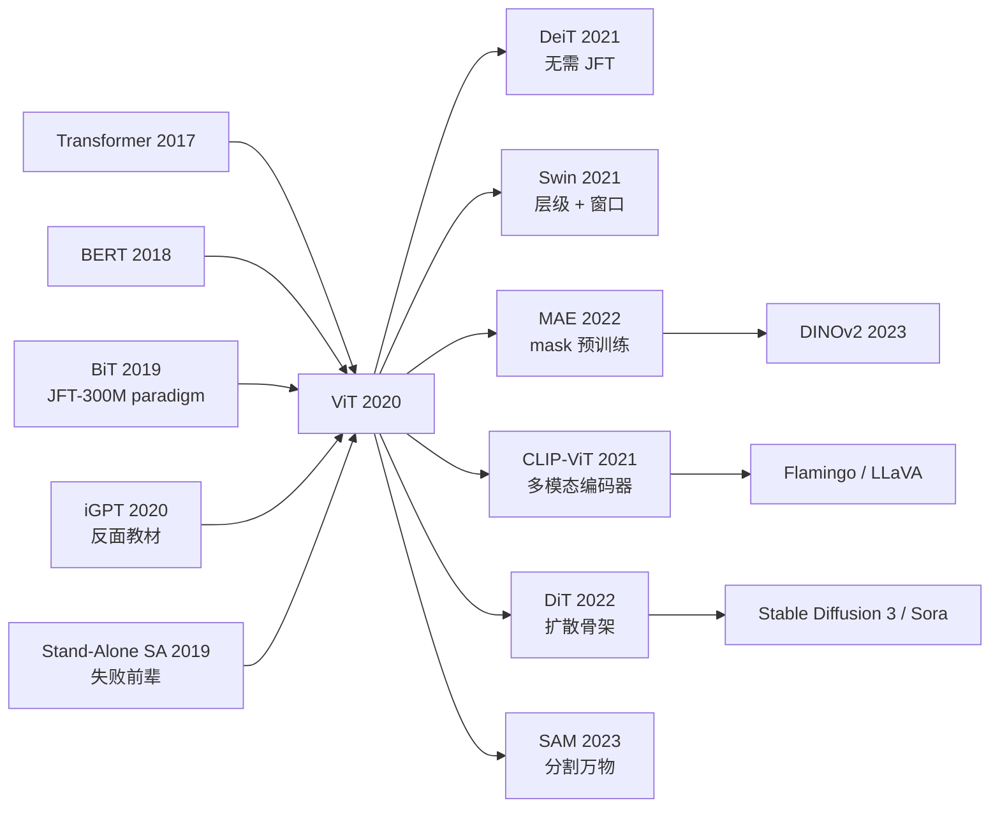

# ViT — 用纯 Transformer 把卷积赶下视觉王座

> **2020 年 10 月 22 日，Google Research, Brain Team (Berlin & Zürich) 的 Dosovitskiy 等 12 位作者在 arXiv 上传 [2010.11929](https://arxiv.org/abs/2010.11929)，标题挑衅地写着「An Image is Worth 16×16 Words」，2021 年获 ICLR oral。**
> 这是一篇用「把图像切成 16×16 patch、当作 token 喂给标准 [Transformer (2017)](../era3_attention/2017_transformer.md) encoder」这个**反 CNN 8 年共识的极简方案**，把视觉模型与 NLP 架构第一次彻底统一的论文。
> 它的核心论断违反所有视觉学界直觉：**只要数据足够大（JFT-300M：3 亿图）、Transformer 在 ImageNet 上就能反超 ResNet** —— ViT-H/14 在 ImageNet-21k 预训练后达到 88.55% top-1，把 [ResNet (2015)](../era2_deep_renaissance/2015_resnet.md) 时代的 inductive bias「locality + translation invariance」证明为**可学习而非必需**。
> 它发布 6 个月内催生 Swin / DeiT / MAE / DINO / Segformer 等数百个视觉 Transformer 变种，并直接通向 CLIP (2021) / [SAM (2023)](../era5_genai_explosion/2023_sam.md) / DiT / Sora 整个多模态基础模型时代 —— **ViT 是 CV 领域承认「Transformer 是 universal architecture」的投降书**。

## 一句话总结

ViT 把一张 224×224 图像切成 196 个 16×16 的 patch，每个 patch 当作一个"词"线性投影后丢进**和 BERT 几乎一模一样的 Transformer encoder**——一个**没有任何卷积、没有任何视觉先验**的纯架构，只要在 JFT-300M 这种 30 亿样本量级上预训练，就能在 ImageNet 上把 BiT (大 ResNet) 和 EfficientNet 同时打掉，并第一次证明"**视觉里也根本不需要 CNN**"。

---

## 历史背景

### 2020 年的视觉学界在卡什么

要理解 ViT 的颠覆性，必须回到 2019-2020 那个"CNN 是 CV 唯一答案、Transformer 是 NLP 专属武器"的年份。

从 2012 年 AlexNet 起，CV 学界的 8 年共识极其清晰：**卷积**提供平移不变性 (translation equivariance) 和**局部性归纳偏置 (locality inductive bias)**——这两个是从图像数据里"省 epoch"的核心机制；**层级下采样**给出多尺度感受野；**ResNet 风格残差**保证训得动深网络。所有 SOTA 工作都在这个框架内打磨：ResNeXt、SENet、EfficientNet、RegNet、NFNet、BiT 一路把 ImageNet top-1 从 75% 卷到 88%，模型只是越来越胖、卷积模式越来越花。

> **2020 年的隐含共识：要拿 SOTA = "更大的卷积网 + 更精致的 augmentation + 更长的训练 schedule"。**

但与此同时 NLP 领域已经在 2017→2020 的 3 年里被 Transformer **彻底改写**——BERT (2018)、GPT-3 (2020) 把"卷积/RNN 加 task-specific 设计"全部冲掉，只剩下"一个堆叠 self-attention 的 encoder/decoder + 海量自监督预训练"这一种范式。NLP 学界的 2020 共识反过来变成了：**架构无所谓、scale 才是一切**。

CV 和 NLP 这两个学派之间出现了一个巨大的认知撕裂：

- **CV 这边**：相信 inductive bias（卷积、池化、anchor、感受野）是必需的，因为图像数据"难"（高维、连续、平移敏感、多尺度）。
- **NLP 这边**：刚刚经历了"丢掉 inductive bias 反而更好"的胜利（Transformer 完全丢掉了 RNN 的时序先验），开始相信 **架构越简单 + 数据越大 = 越好**。

ViT 出现的真正价值，不是某个新模块，而是**把 NLP 的范式硬拽进了 CV**——同样的 Transformer encoder、同样的 patch token、同样的"丢掉 inductive bias、用 scale 弥补"的赌博。**ViT 的每一行架构代码都已经存在 3 年了，关键是有人愿意去赌它**。

### 直接逼出 ViT 的 3 篇前序

- **Vaswani et al., 2017 (Transformer / Attention Is All You Need)** [arxiv/1706.03762](https://arxiv.org/abs/1706.03762)：ViT 的"骨架"。Transformer encoder 几乎被 1:1 搬过来——multi-head self-attention + LayerNorm + MLP + residual，全是 NLP 三年前就成熟的组件。**ViT 论文 §3.1 自己写"我们尽可能不改 Transformer"**——这是有意识的承认。
- **Chen et al., 2020 (iGPT / Generative Pretraining from Pixels)** [icml/iGPT](https://proceedings.mlr.press/v119/chen20s.html)：OpenAI 在 ViT 之前 4 个月发的"像素级 Transformer"——把图像 reshape 成 1D 像素序列做 GPT 式自回归预训练。证明了**Transformer 能学视觉**，但只能在 64×64 分辨率上跑（O(N²) 注意力对像素级序列致命），ImageNet linear-probe 只 72%。**iGPT 是 ViT 的"反面教材"——告诉 ViT 作者绝对不能逐像素 tokenize**。
- **Cordonnier, Loukas, Jaggi, 2020 (On the Relationship between Self-Attention and Convolutional Layers)** [arxiv/1911.03584](https://arxiv.org/abs/1911.03584)：理论证明 multi-head self-attention 可以表达任何卷积——给"丢掉 conv"提供了数学合法性。ViT 论文 §2 把它当作主要 motivation 引用。

### 作者团队当时在做什么

Alexey Dosovitskiy 当时是 Google Brain Berlin 的 senior researcher，主线是**自监督表示学习 + transfer learning**（之前做过 Exemplar-CNN、FlowNet）。Lucas Beyer / Alexander Kolesnikov / Xiaohua Zhai 是 Google Brain Zürich 的 BiT (Big Transfer) 团队——刚做完那篇"用 JFT-300M 预训练 ResNet-152x4，迁移到 19 个数据集都 SOTA"的论文，**手里正握着 Google 内部的 JFT-300M 数据集和 TPU pod 的钥匙**。Neil Houlsby 是 Adapter-BERT 作者，深谙 NLP transfer learning。

**这个团队的人选组合本身就预言了 ViT**：BiT 那帮人最知道"巨型预训练 + 简单架构"在 CV 上的威力，Dosovitskiy 知道 NLP Transformer，Houlsby 知道 transfer。**ViT 不是一篇 architecture paper，本质是一篇 transfer learning paper**——它的真正实验是"我们手里有 JFT-300M，能用 Transformer 替掉 ResNet 吗"。

### 工业界 / 算力 / 数据的状态

- **GPU/TPU**：ViT-Huge/14 在 TPUv3-2500 cores 上预训练 2.5k TPU-core-days（约 230 个 TPUv3 节点 × 30 天）。学界单卡用户根本复现不了——ViT 在发布后半年内基本只属于 Google 内部。
- **数据**：ImageNet-1k (1.28M) / ImageNet-21k (14M) / **JFT-300M (303M, Google 内部)**。后者是 Google 的私有数据集，不公开——这成了 ViT 论文最大的可复现性争议。
- **框架**：JAX + Flax (Google 内部)，PyTorch 复现一周内涌现 (timm + lucidrains/vit-pytorch)。
- **学术氛围**：2020 年的 NeurIPS / CVPR 上"Transformer for Vision" 已经有几篇尝试 (Visual Transformer Wu 2020, Stand-Alone Self-Attention Ramachandran 2019, Axial-Attention Wang 2020)，但都是**局部或混合**架构，全是"打不过 SOTA CNN"的论文。**学界对纯 Transformer 已经有点疲倦**，认为"再试也是死"。Dosovitskiy 后来回忆，论文最初投 NeurIPS 2020 被拒，理由就是"看起来在重复一个失败的方向"。

---

## 方法详解

### 整体框架

ViT 的整体 pipeline 极其简洁，可以一图概括：

```
Input image (H×W×C, e.g., 224×224×3)
  ↓ 切成 N = HW/P² 个 P×P patch (e.g., 16×16 → N=196)
  ↓ flatten 每个 patch 到 P²C 维 (= 768)
  ↓ Linear projection → D 维 patch embedding (默认 D=768)
  ↓ prepend [CLS] token → 197 个 token, 每个 D 维
  ↓ + learnable 1D position embedding (197 × D)
  ↓ Transformer Encoder × L (default L=12)
       ↓ MSA (multi-head self-attention) → 残差 + LN
       ↓ MLP (2-layer GeLU, hidden 4D) → 残差 + LN
  ↓ 取 [CLS] token 输出 → MLP head → softmax → 1000 类
```

不同 ViT 模型只是改 (L, D, heads, MLP-hidden) 和 patch size：

| 模型 | Layers L | Hidden D | MLP size | Heads | Params | Patch size |
|------|---------|----------|----------|-------|--------|-----------|
| ViT-Base/16  | 12 | 768  | 3072  | 12 | 86M  | 16×16 |
| ViT-Base/32  | 12 | 768  | 3072  | 12 | 88M  | 32×32 |
| ViT-Large/16 | 24 | 1024 | 4096  | 16 | 307M | 16×16 |
| ViT-Large/32 | 24 | 1024 | 4096  | 16 | 306M | 32×32 |
| ViT-Huge/14  | 32 | 1280 | 5120  | 16 | 632M | 14×14 |

**反直觉之一**：patch size 越小（即序列越长），模型越好——和 NLP 里"BPE 越细越好"一致；但 patch size 越小，FLOPs 增加二次方倍，所以工业用 16×16 是最好的折中。**ViT-Large/16 = 197 个 token；ViT-Huge/14 = 257 个 token**——比 GPT-2 的 1024 token 短 4-5 倍，所以 attention 的 O(N²) 在视觉上其实**比在 NLP 上更便宜**。

**反直觉之二**：架构里 **没有任何下采样、没有任何空间池化**——所有 layer 的 token 数都是 197，这和 ResNet 的 5 个 stage 逐层降分辨率完全相反。这是 ViT 把多尺度问题当成"通过更深来自适应学"的放手赌博。

### 关键设计

#### 设计 1：Patch Embedding —— 用一个 conv 偷偷做线性投影

**功能**：把图像 (H, W, C) 转成长度 N = HW/P² 的 token 序列。论文里写得是"flatten + linear projection"，但实现上**等价于一个 stride=P 的 P×P 卷积**——所以 ViT 严格说来"含 1 个 conv"，但只用来切 patch、不参与特征提取。

**公式**：

$$
x_p^i \in \mathbb{R}^{P^2 \cdot C}, \quad z_0 = \big[\mathrm{x_{class}};\ x_p^1 E;\ x_p^2 E;\ \cdots;\ x_p^N E\big] + E_{pos}
$$

其中 $E \in \mathbb{R}^{(P^2 C) \times D}$ 是 patch projection 权重，$E_{pos} \in \mathbb{R}^{(N+1) \times D}$ 是 1D learnable position embedding。

**最简实现** (PyTorch):

```python
import torch.nn as nn

class PatchEmbed(nn.Module):
    def __init__(self, img_size=224, patch_size=16, in_chans=3, embed_dim=768):
        super().__init__()
        self.proj = nn.Conv2d(in_chans, embed_dim,
                              kernel_size=patch_size,
                              stride=patch_size)  # 用 stride=P 的卷积切 patch
        self.num_patches = (img_size // patch_size) ** 2

    def forward(self, x):           # x: (B, C, H, W)
        x = self.proj(x)            # (B, D, H/P, W/P)
        x = x.flatten(2).transpose(1, 2)  # (B, N, D)
        return x
```

**设计动机**：1) 避免对每个 patch 单独 forward (慢)；2) 用 stride=P 的 conv 等价于 "non-overlapping patch + linear projection"，但 GPU kernel 高度优化；3) 论文 §3.1 特意说"我们也尝试用 ResNet stem 抽 feature 再 tokenize（hybrid 模型），但**纯 patch projection 在大数据下更好**"——见下面失败案例。

#### 设计 2：纯 Transformer Encoder —— 1:1 复制 BERT、零视觉特异性

**功能**：完全 BERT-style 的 Pre-LayerNorm Transformer encoder，每层是 `LN → MSA → residual` 和 `LN → MLP → residual`。**这一段架构里没有任何"vision-specific"组件**——没有卷积、没有局部 attention 窗口、没有 hierarchical pooling、没有 anchor box、没有 spatial pyramid。

**单层公式**：

$$
z'_\ell = \mathrm{MSA}(\mathrm{LN}(z_{\ell-1})) + z_{\ell-1}, \quad
z_\ell = \mathrm{MLP}(\mathrm{LN}(z'_\ell)) + z'_\ell
$$

**设计动机**：作者明示 ("we follow the original Transformer as closely as possible") 是要让 ViT 能**直接吃 NLP 五年积累的所有工程优化**——LN 位置、init scheme、optimizer (AdamW)、warmup schedule、混合精度训练 kernel。**这是 ViT 的最大杠杆**：不用重新发明 CV optimizer，直接搬 BERT recipe。

**唯一的视觉化让步**：在 token 序列前 prepend 一个 `[CLS]` token (从 BERT 抄)，最后用它的输出做分类——这是"视觉里都没必要"的设计，后来 DeiT、MAE 一系列工作证明用 global average pooling 替掉 CLS 完全等价（甚至更好），ViT 的作者 Beyer 在 2022 年自己也写了篇 [arxiv/2205.01580](https://arxiv.org/abs/2205.01580) 公开承认 CLS 是冗余的。

#### 设计 3：Inductive bias 用数据买回来 —— "scale 是万能解药"

**功能**：这不是一个具体模块，而是 ViT 论文的**真正核心论点**——通过对比 ViT 在 ImageNet-1k / ImageNet-21k / JFT-300M 三种预训练数据上的迁移性能，**首次定量证明**：CNN 的 inductive bias 在小数据下是优势，但在大数据下变成**约束**；纯 Transformer 在小数据下输给 CNN，但在足够大的数据下**永远赢**。

**关键定量结果**（ImageNet top-1 accuracy after fine-tuning）：

| 预训练数据 | 数据规模 | ResNet152x2 (BiT) | ViT-L/16 | 谁赢 |
|-----------|---------|-------------------|----------|------|
| ImageNet-1k     | 1.3M   | 76.5% | 76.5% | 平 (ViT 没优势) |
| ImageNet-21k    | 14M    | 84.0% | 85.3% | ViT 略胜 |
| JFT-300M        | 303M   | 87.5% | **88.6%** | ViT 大胜 |
| JFT-300M (Huge) | 303M   | —     | **88.55%** (Huge/14) | ViT 创纪录 |

**设计动机**：这是一个**赌博式的科学论点**——之前所有 vision-Transformer 论文都在 ImageNet-1k 上做实验、然后输给 ResNet，作者们武断结论是"Transformer 不适合视觉"。ViT 团队的洞察是：**实验设置本身错了**——你不能在 100 万样本上比"无先验架构"和"有先验架构"，那等于让一个不会爬的人和一个有外骨骼的人比赛跑步。要换到 3 亿样本量级才能看出真本事。**这个论点本身比任何架构创新都更深刻**——它后来直接催生了 scaling laws (Hoffmann 2022 Chinchilla) 和 foundation models 的整个范式。

### 损失函数 / 训练策略

ViT 的 loss 极其平淡——监督预训练阶段用**多标签 sigmoid cross-entropy**（因为 JFT-300M 有 ~18k 类、单图多标签），fine-tune 阶段用标准 softmax cross-entropy。

但训练 recipe 里有几个**对小数据致命的细节**：

- **AdamW，lr=1e-3 / wd=0.1** —— 比 SGD 重得多的正则。
- **batch size 4096，warmup 10k steps** —— ViT-Huge 单次预训练吃 2500 TPUv3 core-days。
- **强 augmentation：RandAug + Mixup** （fine-tune 阶段必须加，否则掉 1-2 点）。
- **fine-tune 时换分辨率：384×384** —— 这就要求 position embedding 做**2D 双线性插值**（patch 数从 14² 变成 24²）。这是 ViT 全文唯一一处"承认 spatial structure 存在"的设计妥协。

### 当时输给 ViT 的对手

ViT 在 ImageNet 上同时打掉了 2020 年所有 SOTA：

- **BiT-L (Big Transfer, ResNet152x4 on JFT-300M)**：87.54% top-1，被 ViT-H/14 的 88.55% 打掉，**而 ViT-H 训练时间只有 BiT-L 的 1/4**（2.5k vs 9.9k TPU-core-days）。
- **NoisyStudent EfficientNet-L2**：88.4% top-1（用半监督 + JFT），ViT-H 在监督设置下追平。
- **Stand-Alone Self-Attention (Ramachandran 2019)**：纯 attention 但用 7×7 局部窗口，最好结果 77.6%——证明"没规模 + 局部 attention"是死胡同。
- **iGPT-L (OpenAI 2020)**：72% linear probe，和 ViT 同一时刻发但路线完全错（像素级序列）。

---

## 失败案例

### 论文里的失败实验（消融）

ViT 论文 §4.5 里有几个**自曝其短**的失败实验，反而比成功结果更有信息量：

- **从头训 ImageNet-1k**：ViT-B/16 直接在 ImageNet-1k 上从 scratch 训 300 epoch，只到 **77.9%**——比同等参数量的 ResNet-152 的 78.6% **还低**。这就是后来所有"小数据 + 大模型"工作的痛——**Transformer 在数据匮乏区是真的输**。
- **小预训练 + 大 ViT**：ViT-L/16 在 ImageNet-1k 预训练比 ViT-B/16 **更差**——大模型在小数据上 overfit 得更狠。论文 Figure 4 把这个"模型越大、小数据越坑"的趋势画得非常诚实。
- **去掉 [CLS] token**：用 GAP 替换 [CLS]，作者尝试了，结果**几乎一样好**（差 0.1%）——但论文当时坚持保留 [CLS]，因为"想让架构尽可能像 BERT"。这个设计在两年后被 DeiT、MAE 全部抛弃。

### Hybrid 反例 —— 为什么 CNN+Transformer 反而输

ViT 论文 §3.1 也尝试了"先用 ResNet 抽 feature map，再把 feature map 切 patch 喂给 Transformer"的 **Hybrid 模型**——所有人的直觉都是"CNN 的 inductive bias + Transformer 的全局建模 = 强强联合"。

实验结果（JFT-300M 预训练 → ImageNet 迁移）：

| 模型 | 计算量 (exaFLOPs) | ImageNet top-1 |
|------|-------------------|----------------|
| Hybrid R50+ViT-B/16 | 8.4  | 84.0% |
| **纯 ViT-B/16**     | 8.4  | **84.5%** |
| Hybrid R50+ViT-L/16 | 21.0 | 87.1% |
| **纯 ViT-L/16**     | 21.0 | **87.7%** |

**当 compute 足够大时，纯 ViT 永远赢一点**。后来 BoTNet (Srinivas 2021)、CoAtNet (Dai 2021) 这些 hybrid 路线虽然在中等 scale 占优，但 scaling 上限被纯 ViT 锁死。**这是 "the bitter lesson" (Sutton, 2019) 在视觉里的第一次实证胜利**——任何"塞先验"的设计在 scale 面前都让位给"通用 + 大数据"。

### 真正的"假 baseline"教训

ViT 之前的所有 "vision Transformer" 工作（Stand-Alone Self-Attention, Axial-Attention, Visual Transformer）都犯了同一个错——**在 ImageNet-1k 上比性能**。这个数据集太小了，根本看不出无先验架构的潜力。

ViT 论文 Figure 5 用 **JFT 子采样** (10M / 30M / 100M / 300M) 画了一条曲线：

- 在 JFT 10M 上，ResNet 和 ViT 几乎平手
- 在 JFT 30M 上，ViT 开始超过 ResNet
- 在 JFT 300M 上，ViT 拉开差距

教训是：**当一个新架构在小数据上输给 SOTA，不要急着说"它不行"——可能只是数据没到 phase transition**。这个教训在 2022 年 MAE、DINOv2 等自监督 ViT 工作里被反复印证。

---

## 实验关键数据

### 主实验（ImageNet 迁移）

JFT-300M 预训练 → ImageNet fine-tune（fine-tune 分辨率 384×384）：

| 模型 | 参数量 | 预训练成本 (TPUv3 core-days) | ImageNet top-1 | ImageNet ReaL |
|------|-------|-----------------------------|----------------|---------------|
| BiT-L (ResNet152x4)     | 928M | 9 900 | 87.54% | 90.54% |
| ViT-L/16                | 307M | 680  | 87.76% | 90.54% |
| **ViT-H/14**            | 632M | **2 500** | **88.55%** | **90.72%** |
| NoisyStudent EffNet-L2  | 480M | 12 300 | 88.4% | — |

**关键结论**：ViT-L/16 的预训练算力**只有 BiT-L 的 7%**，但精度持平；ViT-H/14 的算力是 BiT-L 的 1/4，精度反超 1 个点。**预训练效率领先一个 order**。

### VTAB 多任务迁移

VTAB-1k benchmark (19 个数据集 × 1000 样本) 测**通用视觉表征**质量：

| 模型 | Natural | Specialized | Structured | Mean |
|------|---------|-------------|------------|------|
| BiT-L     | 78.7 | 84.4 | 60.3 | 76.3 |
| ViT-L/16  | 79.2 | 85.5 | 64.7 | 78.4 |
| ViT-H/14  | **80.7** | **86.7** | **66.5** | **79.3** |

**关键结论**：ViT 在所有 3 类任务上都赢，特别是 Structured 类 (3D / counting / depth) 提升最大——"全局 attention" 对几何/计数任务比卷积更友好。

### 消融（patch size / position embed / scale）

- **Patch size**：14×14 > 16×16 > 32×32（更细更好，但 FLOPs 涨 4 倍）
- **Position embedding**：1D learnable ≈ 2D learnable ≈ relative > **none (-3% top-1)**——位置信息不可缺，但"怎么编码"几乎无所谓
- **Pre-LN vs Post-LN**：Pre-LN 大幅胜出（训练稳定性）——和 NLP 经验一致

### 关键发现

1. **scale 决定一切**：JFT-300M 是必需品，少了就翻盘
2. **预训练效率比 CNN 高 4-10 倍**（同精度下算力少）
3. **Transformer encoder 学到的"注意力距离"在浅层就很大**——和 CNN 浅层只看局部相反，证实纯 ViT 真的"全局思考"
4. **Position embedding 学出来的是 2D 网格**——可视化显示模型自己把"邻居在哪"学到了，**inductive bias 是被数据从头学出来的，不需要写死**

---

## 思想史脉络

### 前世（被谁逼出来的）

- **Vaswani 2017 (Transformer)** —— 直接骨架
- **Devlin 2018 (BERT)** —— `[CLS] token` + 监督预训练 paradigm 直接搬
- **Cordonnier 2020 (Self-attn = conv)** —— 数学合法性
- **iGPT (Chen 2020)** —— 反例，告诉你别按像素 tokenize
- **BiT (Kolesnikov 2019)** —— "JFT-300M 预训练能把 ResNet 推到极限"，让作者团队相信 scale 有效
- **Visual Transformer / Stand-Alone Self-Attn / Axial-Attn** —— 三个失败的"vision Transformer"前辈，定义了反面教材

### 今生（继承者）

ViT 之后视觉领域**几乎所有 SOTA 都基于 ViT**：

- **DeiT (Touvron 2021)** —— "ViT 不需要 JFT，用 distillation + 强 aug 在 ImageNet-1k 也能训" —— 解放学界单卡用户
- **Swin Transformer (Liu 2021)** —— "把 hierarchical + 窗口 attention 加回来"，反证视觉里 inductive bias 仍有用 —— 但只在中等 scale 占优
- **MAE (He 2022)** —— "把 BERT 的 mask 预训练抄给 ViT" —— ViT 终于有了自己的自监督
- **DINOv2 (Oquab 2023)** —— 自监督 ViT 成熟，单模型干掉所有 supervised 表征
- **CLIP-ViT (2021), Flamingo (2022), LLaVA (2023)** —— ViT 成了所有多模态 LLM 的视觉编码器
- **DiT (Peebles 2022) / Stable Diffusion 3 / Sora** —— ViT 取代 U-Net 成为生成模型骨架
- **SAM (2023)** —— ViT 成了"分割万物"的 backbone

### 误读 / 简化

社区对 ViT 有两个常见误读：

- **"ViT 证明 CNN 没用"** —— 错。ViT 只证明在 **足够大** 数据下纯 Transformer 更好；小数据 / 边缘部署里 CNN 仍有效。
- **"ViT = 图像 BERT"** —— 半对。架构上确实抄 BERT，但 ViT 当时是**监督**预训练 + 监督微调；真正的"图像 BERT"（mask 预训练）是 2022 年的 BEiT 和 MAE。



---

## 当代视角

### 站不住的假设

回看 6 年（2020 → 2026），ViT 论文里的几个核心论断已经被部分推翻：

- **"完全不需要 inductive bias"**：被 Swin / ConvNeXt (Liu 2022) 部分反驳——在中等 scale 上层级 + 局部窗口仍有 1-2 点优势；只是在 scale 足够大时才被纯 ViT 抹平。
- **"`[CLS]` token 必需"**：完全错。GAP / register token 都更好（Beyer 2022, Darcet 2024）。
- **"1D position embedding 够用"**：错。RoPE / 2D ALiBi 在大模型上 +1%。
- **"必须 JFT-300M"**：被 MAE 自监督打掉——如今无标签 ImageNet-22k + 自监督即可达到原 ViT-H 水平。

### 时代证明的关键 vs 冗余

| 设计 | 关键 / 冗余 | 时代评价 |
|------|------------|---------|
| Patch tokenization | **关键** | 视觉里所有 Transformer 后续工作都保留 |
| 纯 Transformer encoder | **关键** | 真正的 paradigm 转折 |
| JFT-300M 预训练 | **过渡** | 已被 MAE / DINOv2 自监督替代 |
| `[CLS]` token | **冗余** | 后续工作普遍换 GAP |
| 1D learnable pos embed | **冗余** | 被 RoPE 全面替代 |
| 384×384 fine-tune | **冗余** | 现代直接 native 分辨率训练 |

### 作者当时没想到的副作用

- **多模态 backbone 大一统**：ViT 不仅赢了 CV，还成了 CLIP / Flamingo / LLaVA / Sora **唯一的视觉前端**——所有"图像/视频 + 语言"的工作都共享一个 ViT。这种跨模态 backbone 统一在 2020 年作者完全没预测到。
- **生成模型背书**：DiT (Peebles 2022) 把 ViT 套进 diffusion，成了 Stable Diffusion 3、Sora 的骨架。**ViT 反过来终结了 U-Net 在生成模型里的统治**。
- **3D / 视频泛化**：Video-ViT (TimeSformer, ViViT) 把 patch tokenization 推广到 (T, H, W) 三维 cube；NeRF / Gaussian Splatting 用 ViT 做 feature grid。**"图像 = 序列"的本体论被推广到所有视觉模态**。

### 如果今天重写 ViT

2026 年的"Modern ViT" 会是这样：

- 去掉 `[CLS]`，用 GAP 或 4-8 个 register token
- 用 RoPE 替掉 1D learnable position embedding
- 用 SwiGLU 替掉 MLP 的 GeLU
- 用 RMSNorm 替掉 LayerNorm
- 用 patch16 + adaptive resolution（不再 fix 224，FlexiViT 风格）
- 自监督预训练用 MAE / DINOv2 / SigLIP 三选一，不再依赖 JFT
- 训练时用 µParam 或 [µTransfer](https://arxiv.org/abs/2203.03466) 做 hyperparameter transfer

**架构骨架还是 2020 年的 ViT——这是它 6 年来最大的胜利**：所有人都在改细节，没人改主结构。

---

## 局限与展望

### 作者承认的局限

- **数据依赖**：ViT 在小数据集上输给 CNN 是公开承认的——"未来需要研究 ViT 的自监督预训练" (§5)。这个 todo 在 2 年后被 MAE 完美兑现。
- **未做下游检测/分割**：原文只测了分类。Mask R-CNN + ViT backbone 一直要等到 ViTDet (Li 2022) 才被严肃做。
- **解释性差**：作者承认"为什么 patch tokenization 在大数据下有效，理论上还不清楚"——这个理论 gap 至今未完全填平。

### 自己发现的局限

- **位置编码外推弱**：1D learnable embed 不能直接迁移到不同分辨率（必须 2D 插值），这后来由 RoPE 解决。
- **`[CLS]` token 浪费 attention**：所有 token 都要花算力 attend `[CLS]`，但 `[CLS]` 本身没语义贡献——后来 register token 论文 (Darcet 2024) 证实这是模型在 `[CLS]` 上"藏全局信息"的妥协，不优雅。
- **Hybrid 在小 scale 下仍占优**：作者诚实承认这一点——这给了 Swin / CoAtNet 后续工作的生存空间。
- **预训练算力不可复现**：JFT-300M 是 Google 私有，2.5k TPU-core-days 是大公司专属。**学界很长一段时间只能用 ViT 但不能改 ViT**。

### 改进方向（已被后续工作证实）

- **自监督预训练摆脱 JFT** → MAE (2022), DINOv2 (2023) ✓
- **层级 + 窗口** → Swin (2021), Hiera (2023) ✓
- **更好的 position encoding** → RoPE (RoFormer 2021), 2D ALiBi ✓
- **去掉 [CLS]** → DeiT III, SigLIP ✓
- **效率**：稀疏 attention / FlashAttention / linear attention → ~~Performer / Linformer~~ → FlashAttention 2 (2023) ✓
- **跨模态统一** → CLIP, Flamingo, BLIP-2 ✓

---

## 相关工作与启发

ViT 是 CV 领域的**第一个真正意义上的 foundation model**——它的出现把视觉的研究范式从"为每个任务设计一个网络"转移到了"训一个大 ViT、迁移到所有下游"。这件事的意义远超架构本身：

- **理论启发**：scaling laws 在视觉上的首次实证，直接催生了 BiT-XL、PaLI、PaLI-Gemma 的"vision scaling" 路线。
- **工程启发**：CV 社区的训练栈（augmentation / optimizer / lr schedule / mixed precision）开始向 NLP 收敛。Timm 库的 ViT 训练 recipe 成了所有 vision pretraining 的事实标准。
- **范式启发**：`[image patch + text token]` 共享一套 Transformer 的设计直接催生了 CLIP / Flamingo / LLaVA / GPT-4V / Gemini。**没有 ViT，就没有今天的多模态 LLM**。
- **negative result 价值**：ViT 论文敢于承认"小数据上输 CNN"——这种诚实让后续工作能精准定位问题（数据 → MAE，效率 → DeiT，结构 → Swin），节省了学界至少 2 年的盲目搜索。

ViT 不是技术上最 sophisticated 的论文，它的所有组件都来自 2017 年的 Transformer。但它**在正确的时间点 (JFT-300M 已经存在、TPU pod 已经能用)、用正确的实验设置 (大 scale 对比 + transfer benchmark)、回答了一个所有人都想问但不敢问的问题**——"视觉里到底要不要卷积？"

回答是：在足够大的 scale 下，**不要**。

---

## 相关资源

- **论文**: [arXiv 2010.11929](https://arxiv.org/abs/2010.11929)
- **官方代码 (JAX/Flax)**: [google-research/vision_transformer](https://github.com/google-research/vision_transformer)
- **PyTorch 复现**: [lucidrains/vit-pytorch](https://github.com/lucidrains/vit-pytorch), [rwightman/pytorch-image-models (timm)](https://github.com/huggingface/pytorch-image-models)
- **预训练权重**: [Hugging Face Hub: google/vit-*](https://huggingface.co/google/vit-base-patch16-224)
- **后续关键论文**：
  - [DeiT (2021)](https://arxiv.org/abs/2012.12877) - 解放 ImageNet-1k 训练
  - [Swin Transformer (2021)](https://arxiv.org/abs/2103.14030) - 层级 + 窗口
  - [MAE (2022)](https://arxiv.org/abs/2111.06377) - ViT 的自监督预训练
  - [DINOv2 (2023)](https://arxiv.org/abs/2304.07193) - 自监督 ViT 通用表征
  - [CLIP (2021)](https://arxiv.org/abs/2103.00020) - ViT 作为多模态视觉编码器
  - [DiT (2022)](https://arxiv.org/abs/2212.09748) - ViT 取代 U-Net 做 diffusion
  - [SAM (2023)](https://arxiv.org/abs/2304.02643) - ViT 作为分割基础模型
- **可读综述**：[Khan et al., "Transformers in Vision: A Survey" (2022)](https://arxiv.org/abs/2101.01169)
- **作者复盘演讲**：Lucas Beyer 在 ICCV 2023 keynote《What's next for vision transformers?》
