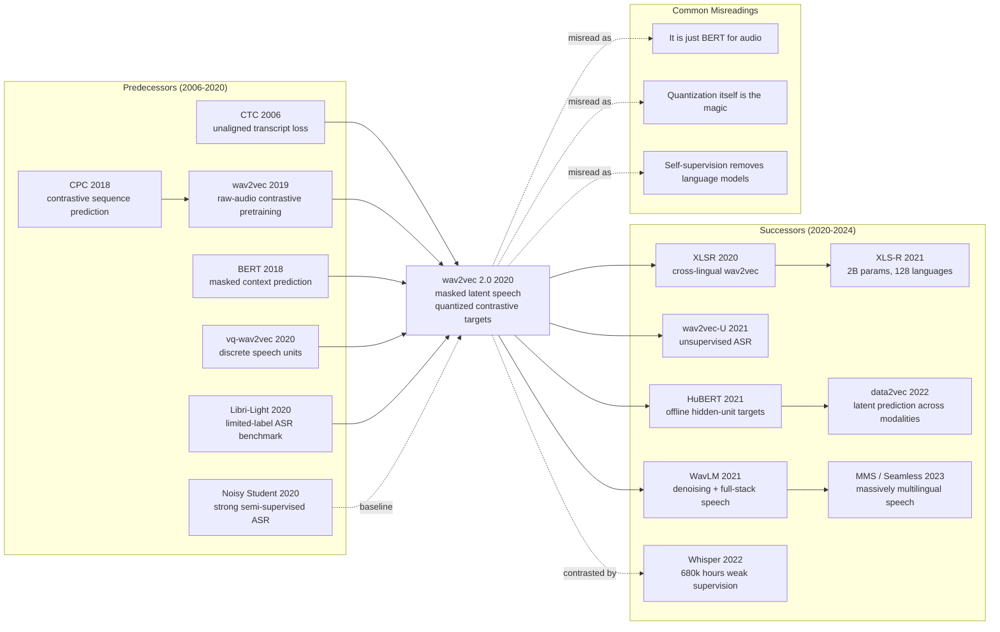

# wav2vec 2.0 - 让语音识别先听 5.3 万小时、再看 10 分钟标注

> **2020 年 6 月 20 日，Facebook AI 的 Alexei Baevski、Henry Zhou、Abdelrahman Mohamed、Michael Auli 四位作者把 [arXiv:2006.11477](https://arxiv.org/abs/2006.11477) 上传到 arXiv。** 这篇论文的戏剧性不在于又把 LibriSpeech 刷低了几个 WER 点，而在于它把语音识别最昂贵的东西从「人工转写」换成了「先让模型自己听」。wav2vec 2.0 用 5.3 万小时无标注 LibriVox 音频预训练后，只看 10 分钟转写数据，就在 LibriSpeech test-clean/test-other 上做到 4.8/8.2 WER；用 1 小时标注就超过此前 100 小时半监督系统。它把 BERT 的 mask 思想、CPC 的对比学习、离散语音单元和 CTC 微调压进一条流水线，给低资源语言留下了一个很现实的承诺：不是每种语言都必须先攒出上千小时转写，才能拥有可用的 ASR。

## 一句话总结

Baevski、Zhou、Mohamed、Auli 四位作者 2020 年发表在 NeurIPS 的 wav2vec 2.0，把语音识别从「先收集大量转写，再训练声学模型」改写成「先用无标注音频学表征，再用极少转写校准」。核心方法是原始波形经 CNN 得到潜变量 $z_t$，在潜空间 mask 约一半时间步，Transformer 产生上下文化表示 $c_t$，再用 $\mathcal{L}_m=-\log \frac{\exp(\mathrm{sim}(c_t,q_t)/\kappa)}{\sum_{\tilde q\in Q_t}\exp(\mathrm{sim}(c_t,\tilde q)/\kappa)}+\alpha\mathcal{L}_d$ 从 100 个干扰项里找回正确的量化语音单元，最后用 CTC 微调到转写任务。它替代的不是某个小模块，而是 vq-wav2vec / Discrete BERT 的两阶段离散化流程和 Noisy Student 式复杂自训练：10 分钟标注 + 5.3 万小时无标注就达到 4.8/8.2 WER，1 小时标注就超过此前 100 小时半监督系统。和 BERT (2018) 把文本预训练变成默认范式、SimCLR (2020) 把视觉对比学习推向主流类似，wav2vec 2.0 让语音领域第一次相信「大规模自监督预训练 + 小标注微调」不是辅助技巧，而是 ASR 的新底座；反直觉之处在于，模型要学会转写，第一步不是看文字，而是先把声音切成可预测的离散世界。

---

## 历史背景

### 2020 年的语音识别困境

2020 年的自动语音识别已经不是 HMM-GMM 的时代了。端到端模型、CTC、RNN-T、Transformer Transducer、Conformer 都已经出现，LibriSpeech 这种英语朗读数据集也被刷到很低的 WER。但这些成绩有一个共同前提：**你得先有很多小时的转写音频**。论文开头点出的那个数字很刺眼：世界上有接近 7000 种语言，而能够拿出几百到几千小时高质量转写数据的语言只是极少数。

这让 ASR 和 NLP 在同一时间走向了不同世界。NLP 已经被 BERT、GPT-2、RoBERTa 改造成「先在海量无标注文本上预训练，再在小任务上微调」；语音识别仍然更像「每个语言、每个域、每种口音都要重新攒标注」。问题不只是成本。语音标注比文本标注更慢，因为转写要听完整段声音，方言、口音、重叠说话、噪声、专有名词都会让标注价格上升。对低资源语言来说，标注不是训练集小一点的问题，而是项目能不能启动的问题。

wav2vec 2.0 抓住的正是这个矛盾：**声音本身是无限便宜的，转写才贵**。互联网、播客、广播、有声书、电话录音里有海量无标注语音；如果模型能先从这些声音里学到稳定的声学和音系结构，再用少量转写对齐到文字，ASR 的经济模型就会改变。

### 自监督从文本和视觉压过来

wav2vec 2.0 不是凭空出现的。2018-2020 年，机器学习里最强的横向趋势是 self-supervised pretraining：BERT 用 mask token 学文本上下文，GPT 系列用 next-token prediction 学语言分布，CPC 用 contrastive predictive coding 学序列表征，SimCLR / MoCo 用图像增强对比学习让视觉自监督接近监督预训练。

语音领域也有前序。2019 年的 wav2vec 已经证明，原始波形上的对比预测能帮助 ASR；ICLR 2020 的 vq-wav2vec 又把语音离散化，得到类似「语音 token」的中间表示。但这些方法还没解决两个关键问题：第一，离散化和上下文建模往往是两步走，误差会被前一步固化；第二，语音不像文本那样天然有词边界和 token，模型既要学「单位是什么」，又要学「上下文怎么预测单位」。

这也是 wav2vec 2.0 的方法味道很像 BERT、但又不能直接照抄 BERT 的原因。文本里 `[MASK]` 对应的是一个词或子词；语音里没有现成 token，只有连续波形。论文的核心工程判断是：先用 CNN 把波形压成短时潜变量，再在潜变量上 mask，让 Transformer 用上下文恢复一个**模型自己学习出来的离散目标**。这一步把「声音没有词表」的问题转成了「训练时一起学一个词表」。

### Facebook AI 的前序路线

这篇论文背后的团队不是突然闯入 ASR。Facebook AI 当时已经有 fairseq、wav2letter++、wav2vec、vq-wav2vec、Libri-Light 等一条连续语音路线。Michael Auli 团队的优势在于：他们既熟悉 NLP 预训练，也有可规模化的语音训练工程；既能写论文，也能把代码和模型放进 fairseq 让社区复现。

第一作者 Alexei Baevski 在 2019-2020 年连续推动了 vq-wav2vec、wav2vec 2.0、后来的 data2vec；Abdelrahman Mohamed 曾在语音识别和深度学习声学模型上长期工作；Michael Auli 则是 fairseq 和 Facebook NLP/语音系统的核心人物。这个组合让 wav2vec 2.0 带着一种很明显的跨域口味：**用 NLP 的预训练范式，解决语音标注经济学的问题**。

### 论文发表时的工程条件

wav2vec 2.0 的贡献常被讲成「方法很简单」，但它不是小实验。论文在 LibriSpeech 960 小时和 LibriVox / Libri-Light 53.2k 小时上预训练；BASE 模型用 64 张 V100 约 1.6 天，LARGE 在 LibriSpeech 上用 128 张 V100 约 2.3 天，在 53.2k 小时数据上约 5.2 天。它已经是 2020 年典型的 foundation-model 早期形态：模型规模不是今天的十亿级，但训练方式已经是「大量无标注数据 + 大模型 + 下游微调」。

Meta AI 2020 年 9 月 24 日发布博客和开源模型时，主打的不是 NeurIPS 论文里的漂亮公式，而是一个更容易被产业理解的数字：**10 分钟转写 + 5.3 万小时无标注音频，在 LibriSpeech clean/noisy 上做到 5.2/8.6 WER**。arXiv 论文摘要给出的最终 test-clean/test-other 数字是 4.8/8.2。无论用哪个表述，故事都很清楚：标注时间从 100 小时压到 1 小时甚至 10 分钟，ASR 还没有崩。

---

## 研究背景与动机

### 问题定义

本文要解决的问题可以写成一句话：**给定大量无标注语音 $x$ 和极少量转写 $(x, y)$，怎样先学出一个可迁移的语音表示，再用 CTC 把它接到文字上？** 这和普通声学模型训练不同。普通训练直接最小化转写损失，标注少时会过拟合；wav2vec 2.0 先构造一个不需要文字的预训练任务，让模型学会预测被 mask 掉的声音结构。

这个任务有三个难点。第一，语音输入是连续波形，没有像文本那样的离散 token。第二，语音单位长度可变，音素边界并不显式，25ms 的片段可能只覆盖一个音素的一部分。第三，很多连续信号细节对 ASR 没价值：麦克风、背景噪声、说话人音色、房间混响都会让「重建原信号」变成一个错误目标。模型应该保留可转写的语言信息，而不是记住录音条件。

### 核心目标

wav2vec 2.0 的目标不是「完全无监督语音识别」，而是更务实的两阶段方案：第一阶段从无标注音频里学表征；第二阶段用少量转写微调。这个设定避开了端到端无监督 ASR 里最难的「声音到文字排列」问题，却抓住了真实世界最紧的瓶颈：很多语言确实可以收集无标注音频，但很难组织大规模人工转写。

方法上的目标也很明确：把 vq-wav2vec 的离散单元、BERT 的 mask、CPC / SimCLR 的对比损失、CTC 的弱对齐训练合成一条流水线。真正的设计重心不是单个模块有多新，而是这些模块如何分工：CNN 处理原始波形，Transformer 处理长上下文，量化器只作为预测目标，contrastive loss 让目标足够抽象，CTC 则把预训练表示落到文字。

---

## 方法详解

### 整体框架

wav2vec 2.0 可以被看成一条四段流水线：**原始波形 → CNN 潜变量 → Transformer 上下文 → 量化目标上的对比学习 → CTC 微调**。它不先做人类设计的滤波器组，也不要求音素边界。输入是一段原始音频 $x$，feature encoder $f$ 直接把波形压成一串潜在表示 $z_1,\dots,z_T$；context network $g$ 在部分位置被 mask 后输出上下文化表示 $c_1,\dots,c_T$；quantizer 把未 mask 的 $z_t$ 离散化成目标 $q_t$；训练目标要求 $c_t$ 在一堆干扰项里识别出真正的 $q_t$。

最重要的设计细节是：**Transformer 的输入保持连续，预测目标才离散**。如果把输入也量化，Transformer 一开始就损失了大量细节；如果目标不量化，模型又会偷懒地预测说话人、噪声、通道等无关细节。wav2vec 2.0 用连续输入保留上下文建模信息，用离散目标逼模型学语言相关的结构。

| Component | BASE | LARGE | Why it matters |
|---|---:|---:|---|
| Feature encoder | 7 temporal conv blocks | same | maps waveform to 49 Hz latent frames |
| Transformer | 12 layers, 768 dim, 8 heads | 24 layers, 1024 dim, 16 heads | provides sequence context over masked spans |
| Quantizer | G=2, V=320 | G=2, V=320 | up to 102.4k codeword combinations |
| Pretraining scale | 64 V100, 1.6 days on LS-960 | 128 V100, 2.3 days on LS-960 / 5.2 days on LV-53k | makes low-label transfer work |

整体训练逻辑可以压成下面这段伪代码：

```python
def wav2vec2_pretrain(waveform):
    z = feature_encoder(waveform)              # [T, d], about one frame every 20 ms
    mask = sample_span_mask(z, p=0.065, M=10)  # about 49% latent steps masked
    z_masked = replace_with_mask_embedding(z, mask)
    c = transformer_context(z_masked)          # contextual states
    q = product_quantizer(z.detach())          # discrete targets from unmasked latents
    positives = q[mask]
    negatives = sample_distractors(q, mask, K=100)
    loss = contrastive(c[mask], positives, negatives) + 0.1 * diversity_loss(q)
    return loss
```

### 关键设计 1：原始波形到潜变量

feature encoder 是 7 个 temporal convolution block，每个 block 是一维卷积、layer norm、GELU。stride 是 `(5,2,2,2,2,2,2)`，kernel width 是 `(10,3,3,3,3,2,2)`，最后得到约 49 Hz 的 latent sequence：相邻 latent 间隔约 20ms，receptive field 约 25ms。

这个设计的意义不是「CNN 很新」，而是把语音从高频波形变成适合 Transformer 处理的 token-like 序列。16 kHz 的原始音频如果直接喂 Transformer，15 秒就是 24 万个采样点，注意力复杂度完全不可承受；CNN stride 把它压成约 750 个 latent step，长度上变得像文本句子。

$$
z_1,\dots,z_T = f(x), \qquad c_1,\dots,c_T = g(\mathrm{mask}(z_1,\dots,z_T))
$$

这里 $f$ 处理局部声学，$g$ 处理长程上下文。一个容易忽略的细节是 fine-tuning 时 feature encoder 冻结，不继续训练；只有 Transformer 和上层输出头适配 CTC。这样做减少小标注场景下的过拟合，也让预训练学到的底层声学表示不被 10 分钟数据破坏。

### 关键设计 2：在潜空间里 mask

wav2vec 2.0 不在 waveform 上 mask，也不在频谱图上 mask，而是在 CNN 输出的 latent frame 上 mask。论文设置 $p=0.065$：随机选一部分时间步作为起点，每个起点向后 mask $M=10$ 个 latent step，span 可以重叠。对 15 秒音频来说，最后约 49% 的 latent step 被 mask，平均 span 长度 14.7 个 step，约 299ms。

这和 BERT 的 15% token mask 看起来不同，原因是语音高度冗余。相邻 20ms 片段非常相似，如果只 mask 一个点，模型可以靠局部平滑轻松猜中；mask 接近 300ms 的连续片段，才迫使 Transformer 利用更长的上下文。附录消融也说明，mask span 太短会让自监督任务变得容易，但下游 WER 变差。

### 关键设计 3：量化目标与对比损失

量化器用 product quantization：$G=2$ 个 codebook，每个有 $V=320$ 个 entry，每组选择一个 entry 后拼接，理论组合数是 $320^2=102{,}400$。选择过程用 Gumbel-softmax 和 straight-through estimator，使得前向是 hard codeword，反向还能传播梯度。

$$
p_{g,v} = \frac{\exp((l_{g,v}+n_v)/\tau)}{\sum_{k=1}^{V}\exp((l_{g,k}+n_k)/\tau)}, \qquad n_v=-\log(-\log u_v)
$$

对每个被 mask 的位置 $t$，模型拿 context output $c_t$ 去区分正确的量化目标 $q_t$ 和 $K=100$ 个来自同一 utterance 其他 mask 位置的干扰项。损失是 cosine similarity 上的 InfoNCE 变体，再加一个 codebook diversity loss，鼓励 codebook entry 被均匀使用。

$$
\mathcal{L}_m = -\log \frac{\exp(\mathrm{sim}(c_t,q_t)/\kappa)}{\sum_{\tilde q\in Q_t}\exp(\mathrm{sim}(c_t,\tilde q)/\kappa)}, \qquad
\mathcal{L}=\mathcal{L}_m+\alpha\mathcal{L}_d
$$

这个设计的关键不是「离散化」本身，而是离散化的位置。论文消融显示，连续输入 + 量化目标的 dev WER 是 7.97；输入和目标都量化会变成 12.18；连续目标则是 8.58。换句话说，模型需要连续输入来理解上下文，但需要离散目标来避免把噪声、说话人、通道细节当成预测对象。

### 关键设计 4：CTC 微调

预训练结束后，wav2vec 2.0 在 Transformer 顶部加一个随机初始化线性层，输出字符类别：LibriSpeech 里是 29 个字符相关 token 加 word boundary。微调时用 CTC loss，不需要逐帧对齐；模型自己学会把帧级输出 collapse 成文字序列。小标注场景下，论文先训练输出层 10k updates，再放开 Transformer；feature encoder 仍然冻结。

| Design choice | Alternative it avoided | Evidence in paper | Lesson |
|---|---|---|---|
| Continuous Transformer input, quantized target | quantize both input and target | 7.97 WER vs 12.18 WER | keep acoustic detail for context, abstract target for prediction |
| Latent-span masking | single-frame or waveform masking | 49% masked, mean 299 ms span | speech needs long missing spans to avoid local interpolation |
| Contrastive target selection | waveform or filter-bank reconstruction | continuous target worsens to 8.58 WER | do not reward recording-condition reconstruction |
| CTC fine-tuning | full seq2seq training from tiny labels | 10 min / 1 h settings remain trainable | weak alignment is enough once representations are strong |

这个表也解释了 wav2vec 2.0 为什么能成为后续 HuBERT、WavLM、XLS-R 的起点：它把语音 SSL 的接口定义清楚了。前端可以换，target 可以换，损失可以换，但「大量无标注音频预训练一个上下文化 speech encoder，再用少量标注微调」这个框架留下来了。

---

## 失败案例

wav2vec 2.0 的价值不只是「自己跑得好」，还在于它清楚地说明了几条当时看起来合理的语音预训练路线为什么不够好。它不是单纯把模型加大，而是在目标函数和信息瓶颈上做了非常明确的取舍。

### 失败 baseline 1：纯监督 ASR

纯监督系统在高资源英语上已经很强。ContextNet、Conformer、Transformer Transducer、CTC Transformer 等系统可以把 LibriSpeech 做到很低 WER；但这些方法的默认前提是你拥有 100 小时、960 小时甚至更多转写。标签一旦降到 10 分钟或 1 小时，普通声学模型会迅速过拟合：模型能记住少量句子，却学不到稳定的音系结构。

wav2vec 2.0 的对照最有冲击力：10 分钟标注只有 48 条录音，平均每条 12.5 秒。这个规模在传统 ASR 里几乎不够训练一个像样声学模型；但 LARGE + 53.2k 小时无标注预训练后，带 Transformer LM 解码可以做到 4.8/8.2 WER。它证明纯监督路线输在数据经济学，不是输在某个架构小缺陷。

### 失败 baseline 2：两阶段 vq-wav2vec / Discrete BERT

vq-wav2vec 和 Discrete BERT 的路线是先学离散语音单元，再用这些单元训练上下文模型。这个想法很自然：既然 BERT 需要 token，就先把语音变成 token。但两阶段流程有一个问题：第一阶段量化器犯的错会被第二阶段继承；上下文模型只能在已经被压扁的离散序列上工作。

wav2vec 2.0 的修正是「连续输入，离散目标」。Transformer 看到的是保留声学细节的连续 latent，只有预测对象是量化后的 target。论文消融显示，输入和目标都量化时 dev WER 从 7.97 变成 12.18；这解释了为什么早期离散化路线会卡住。离散化不是错，错在太早把信息门关上。

### 失败 baseline 3：重建式或连续 target 自监督

另一个常见直觉是做重建：mask 掉一段声音，让模型重建原始波形、filterbank 或连续 latent。问题在于，语音里的很多可重建信息对 ASR 无用。背景噪声、说话人音色、房间混响、麦克风响应都可以帮助重建，却不应该主导表示学习。

论文里 continuous target 的消融给了直接证据：连续输入 + 连续目标的 dev WER 是 8.58，弱于连续输入 + 量化目标的 7.97。更有意思的是，连续 target 会让训练时识别正确 latent 的准确率从 62% 升到 78%，看起来预训练任务更容易了，但下游更差。这是一个经典 self-supervised learning 教训：**pretext task 越容易，不等于 representation 越好**。

### 失败 baseline 4：复杂 self-training

Noisy Student / iterative pseudo-labeling 代表 2020 年强半监督 ASR 路线：先训练 teacher，给无标注音频打伪标签，过滤，再训练 student，循环多轮。这套系统很有效，但工程复杂，依赖解码器、伪标签质量、过滤策略和多轮训练调参。

wav2vec 2.0 的优势是流程更短：无标注预训练一次，少量标注微调一次。和 Noisy Student 在 100 小时标注上的 4.2/8.6 WER 相比，wav2vec 2.0 LARGE 只用 LibriSpeech 960h 无标注预训练、100 小时标注微调，就达到 2.3/5.0；在 1 小时标注时仍能达到 3.9/7.6。它不是说 self-training 没用，而是证明「表示预训练」可以先把最难的数据稀缺问题砍掉一大半。

| Baseline | Why it looked reasonable | Where it failed | wav2vec 2.0 correction |
|---|---|---|---|
| Pure supervised ASR | strong on 960h English | collapses under 10 min / 1 h labels | pretrain on raw unlabelled audio |
| Two-stage discrete units | BERT needs tokens | early quantization loses context detail | continuous input, quantized target |
| Reconstruction / continuous target | natural for autoencoding | learns speaker/noise/channel shortcuts | contrastive target over discrete units |
| Iterative self-training | strong semi-supervised baseline | complex multi-round pseudo-label pipeline | one pretrain phase, one CTC fine-tune phase |

---

## 实验关键数据

wav2vec 2.0 的实验不是只证明「可以预训练」，而是系统地展示了三件事：标签越少，预训练越值钱；无标注数据越多，低资源越稳；离散 target 的位置决定效果。

### 关键数据 1：10 分钟 / 1 小时低资源

最有历史记忆点的是低资源结果。LARGE 模型在 53.2k 小时 LibriVox / Libri-Light 无标注音频上预训练，再用 10 分钟标注微调，带 Transformer LM 的 test-clean/test-other WER 是 4.8/8.2。这个设置只有 48 条标注录音，平均 12.5 秒。1 小时标注时，同样的 53.2k 小时预训练得到 2.9/5.8；即使只用 LibriSpeech 960h 无标注预训练，也有 3.9/7.6。

### 关键数据 2：100 小时与 960 小时

在 100 小时标注设置中，Noisy Student 是强基线，test-clean/test-other 为 4.2/8.6；wav2vec 2.0 LARGE 用同样 960h 无标注音频预训练后达到 2.3/5.0，相对错误率下降 45%/42%。这很关键，因为 100 小时不是玩具低资源，而是许多真实语音项目能承受的上限。

全 960 小时标注时，LARGE + 53.2k 小时无标注预训练达到 1.8/3.3，尤其在 noisy test-other 上超过当时很多强监督 / 半监督系统。它说明预训练不是小标注时的临时拐杖；在高资源设置下，它仍然能改善鲁棒性。

| Setting | Unlabeled pretrain | Labeled data | Decoder | test-clean / test-other WER |
|---|---:|---:|---|---:|
| Low-resource extreme | 53.2k h LibriVox | 10 min | Transformer LM | 4.8 / 8.2 |
| Low-resource | 53.2k h LibriVox | 1 h | Transformer LM | 2.9 / 5.8 |
| Comparable to Noisy Student | 960 h LibriSpeech | 100 h | Transformer LM | 2.3 / 5.0 |
| High-resource | 53.2k h LibriVox | 960 h | Transformer LM | 1.8 / 3.3 |
| TIMIT phoneme recognition | 960 h LibriSpeech | TIMIT | no LM | 7.4 / 8.3 PER |

### 关键数据 3：TIMIT 与消融

TIMIT phoneme recognition 是一个更直接的「语音单位」测试。wav2vec 2.0 LARGE 在 LibriSpeech 960h 上预训练、无 LM 微调 TIMIT，dev/test PER 是 7.4/8.3；vq-wav2vec 是 9.6/11.6，原始 wav2vec 是 12.9/14.7。这个结果支持论文的核心说法：离散 latent 确实和音素结构相关。

最能解释方法成败的是量化消融：

| Input to Transformer | Target in contrastive loss | dev WER | Interpretation |
|---|---|---:|---|
| continuous | quantized | 7.97 | best balance of context detail and abstract target |
| quantized | quantized | 12.18 | too much input information lost |
| quantized | continuous | 11.18 | worst of both worlds |
| continuous | continuous | 8.58 | target contains nuisance details |

这张表几乎就是 wav2vec 2.0 的方法论摘要：**不要把语音过早离散化，也不要让模型预测过细的连续信号**。一个好的 self-supervised target 必须刚好卡在「可预测」和「对下游有用」之间。

---

## 思想史脉络

wav2vec 2.0 是 2020 年语音自监督的收敛点：CPC 给它对比学习目标，BERT 给它 mask 预训练模板，vq-wav2vec 给它离散语音单元，CTC 给它小标注微调的落地方式。它之后的主线也很清楚：HuBERT 改 target，WavLM 改任务覆盖，XLS-R 改语言规模，data2vec 改成跨模态统一目标，Whisper 则用弱监督大数据从另一侧挑战它。



### 前世：从 CPC 到 BERT 化语音

第一条前世是 **CTC (2006)**。没有 CTC，wav2vec 2.0 的小标注微调很难成立，因为模型需要在没有帧级对齐的情况下从音频到字符。CTC 给出了弱对齐损失，让预训练 encoder 可以接一个简单线性头完成 ASR。

第二条是 **CPC / wav2vec**。CPC 证明了序列里「从上下文预测未来」可以用 contrastive loss 学到好表征；wav2vec 2019 把这个思想搬到原始语音上。wav2vec 2.0 继承的是这个判别式目标，而不是重建式 autoencoder。

第三条是 **BERT / masked prediction**。BERT 让「mask 一部分输入，让模型用上下文恢复」成为最有生命力的预训练模板。wav2vec 2.0 的关键是承认语音没有现成 token，于是用 CNN latent + quantizer 自己造 token。

第四条是 **vq-wav2vec / Discrete BERT**。它们证明语音离散单元有价值，但也暴露了两阶段流程的问题。wav2vec 2.0 的继承方式很微妙：保留离散 target，拒绝离散 input。

### 今生：wav2vec 2.0 长出的五条枝

第一条枝是跨语言。XLSR 和 XLS-R 把 wav2vec 2.0 的方法扩到多语言无标注音频，后者甚至训练到 2B 参数、128 种语言、近 50 万小时公开语音。这条线把论文的「低资源语言承诺」变成真实研究计划。

第二条枝是 target 改造。HuBERT 用离线 k-means hidden units 替代在线 quantizer，并把 masked prediction 做成更接近分类任务的形式；WavLM 再加入 denoising，让表征不仅服务 ASR，也服务 speaker、emotion、separation 等 full-stack speech tasks。

第三条枝是无监督 ASR。wav2vec-U 用 wav2vec 表征切分无标注音频，再通过 adversarial training 学 phoneme 映射，在 TIMIT 上把无监督 PER 从 26.1 降到 11.3。这条线证明好的 speech representation 可以把最难的无监督识别问题推进一大步。

第四条枝是统一自监督。data2vec 不再预测离散语音单元，而是用 teacher network 的 contextual latent 作为目标，试图用同一种目标处理 speech、vision、language。它是 wav2vec 2.0 思想的抽象化：重要的不是语音单位本身，而是 mask view 预测 full-view representation。

第五条枝是弱监督挑战。Whisper 用 68 万小时多语言弱监督转写训练，强调 zero-shot robustness，而不是少标注 fine-tuning。它没有否定 wav2vec 2.0，但说明一旦有足够多噪声标注，工业路线可能从「自监督 + 小标注」切到「弱监督 + 大标注」。

### 误读：三种常见误解

**误读 1：wav2vec 2.0 只是 BERT for audio。** 这句话有帮助但太粗。BERT 的 token 是人类定义的词表，wav2vec 2.0 的 token 是模型学习出来的短时声学单位；BERT mask 15% token，wav2vec 2.0 mask 约 49% latent step；BERT 用词表 softmax，wav2vec 2.0 用对比损失和 codebook diversity。相似的是范式，不是细节。

**误读 2：量化本身就是魔法。** 论文消融恰恰说明，量化放错位置会明显变差。把 input 也量化，WER 从 7.97 掉到 12.18；用 continuous target 又会让模型预测无关细节。魔法不是「离散」，而是「连续上下文 + 离散目标」这个信息瓶颈。

**误读 3：自监督预训练消灭语言模型。** 论文最强低资源数字大量依赖 Transformer LM 解码。无 LM 的 10 分钟设置仍然很差；语言模型负责把音素级/字符级猜测约束成真实词序列。wav2vec 2.0 减少的是声学标注需求，不是让文本侧先验失效。

---

## 当代视角

### 站不住的假设

1. **「语音 SSL 的 target 应该在线学习」。** wav2vec 2.0 的在线 Gumbel quantizer 很优雅，但 HuBERT 证明，离线 k-means target 只要一致性足够，也能匹配或超过 wav2vec 2.0。后来很多系统更关心 target 是否稳定、是否适合 scale，而不是是否端到端学习。
2. **「ASR 是唯一核心下游」。** 论文主要围绕 LibriSpeech WER 展开。WavLM、SUPERB 等后续工作证明，通用 speech representation 还应该服务 speaker verification、emotion recognition、speaker diarization、speech separation、intent classification。ASR 只是 speech foundation model 的一个出口。
3. **「无标注数据一定比弱标注数据更重要」。** Whisper 证明 68 万小时弱监督转写可以在 zero-shot 鲁棒性上非常强。2026 年看，纯自监督和弱监督不是谁消灭谁，而是数据可得性不同：有大量噪声 transcript 时，弱监督更直接；只有原始音频时，wav2vec 2.0 式 SSL 更现实。
4. **「低资源只靠英语预训练迁移」。** XLS-R、MMS、Seamless 等工作证明，多语言预训练本身非常关键。英语 LibriSpeech 是方法验证的好平台，但真正的低资源语言需要跨语言共享单位、跨语种音系覆盖和更复杂的数据治理。

### 时代证明的关键 vs 冗余

| Element | 2020 role | 2026 judgment | Why |
|---|---|---|---|
| Masked latent prediction | core | still central | speech SSL still relies on missing-span contextual learning |
| Continuous input + discrete target | core | partly central | HuBERT changes target construction but keeps target abstraction |
| Gumbel product quantizer | mechanism | replaceable | offline clusters and teacher latents often work better at scale |
| LibriSpeech WER as main metric | evaluation anchor | too narrow | SUPERB / multilingual / robustness tasks reveal more dimensions |

### 如果今天重写 wav2vec 2.0

如果 2026 年重写这篇论文，我会保留「原始语音大规模预训练 + 小标注 CTC/seq2seq 微调」这个核心框架，但会改三件事。第一，target 不会只押注在线 quantizer，而会系统比较 HuBERT-style cluster target、data2vec-style teacher latent、phoneme-aware pseudo target。第二，评测不只看 LibriSpeech WER，而会同时报告 SUPERB、Common Voice、多语言 ASR、说话人任务、噪声鲁棒性和 domain shift。第三，训练数据会从单一英语 audiobook 扩到多语言、多域、多口音，明确讨论数据许可和方言覆盖。

但最不会变的是它的核心哲学：**语音模型应该先从听觉世界本身学结构，再用文字把结构命名**。这和纯监督 ASR 的顺序相反，也是论文最持久的影响。

---

## 局限与展望

### 作者承认的局限

论文在结尾已经承认，进一步提升可能需要更强的 seq2seq 架构和 word-piece vocabulary。它当时用的是 character-level CTC，和 Transformer LM 的 word-level vocabulary 不完全匹配，解码反馈会延迟。论文还主要在 LibriSpeech、Libri-Light、TIMIT 上验证，语言、口音和真实噪声类型仍然有限。

### 站在 2026 年看到的局限

最大的局限是评测太英语、太 audiobook、太 ASR。LibriSpeech 是干净朗读语音，和电话、会议、嘈杂街道、儿童语音、代码切换、多说话人场景差距很大。第二，10 分钟设置的强结果高度依赖外部 LM；没有 LM 时 WER 仍然很高，说明 acoustic representation 和 lexical prior 还没有真正统一。第三，模型虽然学到短时离散单位，但这些单位和人类音素、音节、词边界的关系仍然是后验分析，不是可控接口。

### 改进方向

已经被后续证明有效的方向包括：HuBERT 式离线 target、WavLM 式 denoising、多语言 XLS-R 式 scale、data2vec 式 teacher latent、Whisper 式弱监督大数据、MMS / Seamless 式 massively multilingual speech。未来更有价值的问题不是「再低 0.1 WER」，而是如何让 speech foundation model 对低资源语言、方言、公平性、隐私和部署成本负责。

---

## 相关工作与启发

### 与相邻经典工作的关系

| Work | Relation to wav2vec 2.0 | What changed after it | Lasting lesson |
|---|---|---|---|
| BERT | supplies masked contextual pretraining template | speech needs learned units, not fixed tokens | modality matters even when the recipe rhymes |
| CPC / wav2vec | supplies contrastive sequence prediction | masking and quantized targets improve transfer | predictive coding becomes more useful with BERT-style context |
| HuBERT | replaces online quantizer with offline hidden units | target consistency beats target elegance | stable pseudo-labels can outperform end-to-end cleverness |
| WavLM | adds denoising and full-stack speech goals | speech SSL expands beyond ASR | representation should preserve speaker and environment when useful |
| Whisper | uses weak supervision at massive scale | challenges pure SSL in high-resource web settings | labels are not binary; noisy labels can scale too |

对研究者最有用的启发有三条。第一，预训练任务不要奖励错误的信息；语音重建容易学到录音条件，量化 target 则迫使模型抽象。第二，信息瓶颈的位置比模块名字更重要；同样是量化，放在 input 和放在 target 完全不同。第三，低资源不是一个 benchmark 标签，而是产品和语言生态里的真实约束；wav2vec 2.0 的影响来自它改变了「多少转写才够启动」这个问题。

---

## 相关资源

- Paper: [arXiv:2006.11477](https://arxiv.org/abs/2006.11477)
- Code and pretrained models: [fairseq wav2vec examples](https://github.com/pytorch/fairseq/tree/main/examples/wav2vec)
- Release post: [Meta AI - Wav2vec 2.0: Learning the structure of speech from raw audio](https://ai.meta.com/blog/wav2vec-20-learning-the-structure-of-speech-from-raw-audio/)
- Follow-up: [HuBERT](https://arxiv.org/abs/2106.07447), [WavLM](https://arxiv.org/abs/2110.13900), [XLS-R](https://arxiv.org/abs/2111.09296), [data2vec](https://arxiv.org/abs/2202.03555), [Whisper](https://arxiv.org/abs/2212.04356)
- Benchmark context: [LibriSpeech](https://www.openslr.org/12), [Libri-Light](https://ai.meta.com/blog/a-new-open-benchmark-for-speech-recognition-with-limited-or-no-supervision/), [SUPERB](https://superbbenchmark.org/)


---

> 🌐 [English version](/en/era4_foundation_models/2020_wav2vec2/) · 📚 awesome-papers project · CC-BY-NC