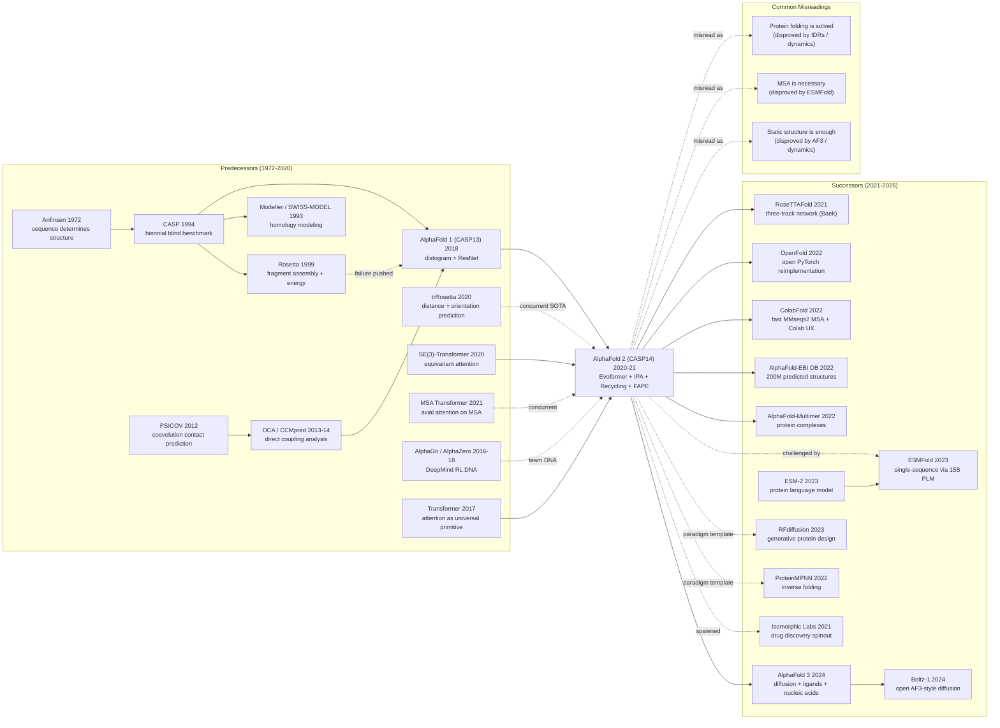

# AlphaFold2 — 用 attention + Evoformer 把蛋白质结构预测推到原子级精度

> **2021 年 7 月 15 日，DeepMind 的 Jumper、Evans、Hassabis 等 34 位作者在 *Nature* 发表 [Highly Accurate Protein Structure Prediction with AlphaFold](https://www.nature.com/articles/s41586-021-03819-2)，并以 Apache-2.0 协议开源全套代码 + 后续 200M+ 蛋白结构预测数据库。**
> 这是一篇被诺贝尔化学奖委员会 2024 年明确引用「彻底改变结构生物学」的论文 —— DeepMind 用 **MSA + Evoformer + Invariant Point Attention + 端到端 FAPE loss** 四件武器，在 CASP14 上达到中位 GDT-TS = 92.4，**第一次让计算预测的蛋白质结构精度逼近 X 射线晶体学实验**（误差 < 1 Å）。
> 它把过去 50 年生物学界投入数十亿美元都没解决的「蛋白质折叠问题」（Anfinsen 1972 / Levinthal 1969 提出）一夜之间变成 standard tool，**3 年内被 200,000+ 篇论文引用、被全球 250 万名科学家使用、催生 RoseTTAFold / ESMFold / AlphaFold-Multimer / AlphaFold 3 整个家族**。
> Hassabis、Jumper 因此获 2024 年诺贝尔化学奖 —— **AlphaFold 2 是 21 世纪 AI for Science 最重要的单篇论文**，证明深度学习不仅能完成感知 / 生成任务，还能解决科学界最难的物理化学问题。

## 一句话总结

AlphaFold 2 把蛋白质结构预测重新表述为"在 MSA 共进化信号 + 三角几何不变性的约束下，端到端地把氨基酸序列回归为 3D 原子坐标"，并用三个看起来"工程小品"的设计——**Evoformer 三角注意力 + Invariant Point Attention + 测试时 recycling**——在 CASP14 把困难目标的中位 GDT_TS 从 30 多年的 ~50 一举推到 92.4，**让一个 50 年的"21 世纪生物学最大未解难题"在 2020 年 12 月一夜之间从开放问题变为已解问题**。

---

## 历史背景

### 2020 年的蛋白质结构预测学界在卡什么

要理解 AlphaFold 2 的颠覆性，必须先记住一句话：**蛋白质折叠问题（protein folding problem）从 1972 年 Christian Anfinsen 在诺贝尔奖演讲提出"序列决定结构"开始，到 2020 年已经卡了 48 年**——比深度学习这个学科本身还老 4 倍。

CASP（Critical Assessment of Structure Prediction）从 1994 年开始每两年举办一届"盲测"，把刚解出但未发表的实验结构隐藏起来，让全球计算生物学组队只用序列预测原子坐标。1994-2018 这 24 年里，CASP 上最难的"FM (Free Modeling) 自由建模"赛道，**最佳方法 GDT_TS（一个 0-100 的结构相似度指标，>90 ≈ 实验解析精度）从未稳定突破 40**——从 Rosetta、I-TASSER 到 AlphaFold 1，每一届进步 1-2 个点，被业界戏称为"在烂泥里爬"。

> **业界的隐含共识**：蛋白质折叠是一个"组合爆炸 × 物理细节 × 数据稀缺"的三重困境，不可能在 21 世纪 30 年代之前解决。

更具体地，2020 年大家在卡四件事：

- **物理 / 能量 路线（Rosetta、I-TASSER）**：David Baker 实验室 1999 起用 fragment assembly + Rosetta energy function 模拟折叠过程。**理论很美，但能量函数有 50+ 项手工调的参数，对 novel fold 完全失灵**，CASP12-13 上 GDT 平均 ~40。
- **共进化 / 接触图 路线（PSICOV、CCMpred、RaptorX-Contact）**：Jones 2012 PSICOV [ref1] 发现"在多序列对齐 (MSA) 里同时变异的残基对在 3D 上往往接触"——这个 coevolution 信号 2014-2018 年统治了 contact prediction，但 contact map 不是 structure，**从 2D 接触图到 3D 坐标还要 Rosetta 跑半天，且对接触正确率极敏感**。
- **AlphaFold 1（CASP13, 2018）** [ref2]：DeepMind 第一代，预测残基对距离直方图 (distogram) 而不是 contact，再用 Rosetta 风格的梯度下降找最小化 distogram 一致性的 3D 结构。**GDT_TS 提到 58.9，比第二名 (Zhang lab) 高 ~10 个点**——CASP13 史上最大单届跳跃，但仍远低于实验精度。
- **trRosetta（Yang et al., 2020）** [ref3]：在 distogram 之上加方向预测 (orientations between residues)，配合 Rosetta 优化。GDT 比 AF1 略低，但**纯学术开源**，是 2020 年学界最易上手的 SOTA。

更让局面尴尬的是**MSA 数据墙**：CASP14 中很多目标只有 10-100 条同源序列，coevolution 信号几乎为零。**没有 MSA = 没有共进化 = 没有结构信号**——这是 2020 年所有方法的硬约束。

### 直接逼出 AlphaFold 2 的 5 篇前序

- **PSICOV（Jones et al., Bioinformatics 2012）** [ref1]：用稀疏逆协方差矩阵从 MSA 里抽出"真正"接触对（去掉传递相关性）。**第一次让 coevolution 信号在 contact prediction 上系统超过物理方法**——逼出了"MSA 是结构信号的金矿"这个共识。
- **AlphaFold 1（Senior et al., Nature 2020）** [ref2]：DeepMind 的第一代，把 contact 改为 distogram + ResNet 预测，再 + Rosetta 后处理。CASP13 GDT 58.9 直接定义了"什么是真正的 progress"。**逼出了 AF2**：作者团队意识到"MSA → distogram → Rosetta"的三段式还有大量信息损失，需要 end-to-end。
- **trRosetta（Yang et al., PNAS 2020）** [ref3]：在 distogram 上加 orientations 预测，再 Rosetta 优化。**证明了"几何约束越多，预测越准"**——为 AF2 后期"直接预测旋转 + 平移"埋下伏笔。
- **MSA Transformer（Rao et al., bioRxiv 2021）** [ref4]：用 axial attention 在 MSA 上同时跑 row attention 和 column attention，证明 transformer 可以替代统计共进化模型。**这是 Evoformer 的直接灵感来源**（虽然 MSA Transformer 论文晚于 AF2 提交但同期工作）。
- **Equivariant Networks（Cohen 2016, Thomas 2018, Fuchs 2020 SE(3)-Transformer）** [ref5]：把对称性（旋转 / 平移不变）作为网络的硬约束，让 3D 坐标预测在任意视角下输出一致。**逼出了 AF2 的 Invariant Point Attention**——Frame 对齐的几何 attention。

### 作者团队当时在做什么

DeepMind 的蛋白质团队 2016 年立项，由 John Jumper 牵头（化学物理 PhD，Vijay Pande 实验室出身——天然懂 Rosetta），Demis Hassabis 全程支持。**2018 年 12 月 CASP13 上 AlphaFold 1 第一次拿冠军**就震动了学界——之前 CASP 冠军都来自学院实验室（Baker, Zhang, Bonneau），从未出现工业团队。

但 AF1 之后团队**做了两年沉默工作**：完全推翻 AF1 的"distogram + Rosetta 后处理"路线，从零开始设计端到端 SE(3) 等变网络。2020 年初新冠爆发让蛋白质结构预测的紧迫性暴增（疫苗设计、抗体设计），DeepMind 把团队规模从 ~10 人扩到 30+ 人。**2020 年 12 月 CASP14 结果公布时，AF2 在所有 92 个目标上的中位 GDT_TS 是 92.4，第二名 Baker 实验室的 RoseTTAFold（早期版本）是 75**——Mohammed AlQuraishi（哈佛计算生物学家）当晚发推："This is what a paradigm shift looks like."

这篇 *Nature* 论文 2021 年 7 月发表，配套 GitHub 开源 + AlphaFold-EBI 数据库 (~2 亿结构 by 2022)——**史上最快从研究到全行业部署的 AI 系统之一**。

### 工业界 / 算力 / 数据的状态

- **算力**：训练用 **128 个 TPUv3 cores 跑 ~1 周** + 微调 4 天，推理一个 384-residue 蛋白在 1 个 V100 上 ~9 秒。**算力门槛远低于 GPT-3 (3640 PF-days)**——AF2 大约 30 PF-days，但需要的是几百 GB 的 MSA 数据库和几十种生物信息学 pipeline。
- **数据**：训练数据 = PDB ~170k 实验结构 (2018 年截止) + Uniclust30 + BFD (Big Fantastic Database, 65M cluster) + MGnify。**这是 50 年实验生物学积累的 PDB 数据第一次被一个深度模型完全消化**——AF2 给 PDB 数据"加了一个 1000× 的解释器"。
- **框架**：JAX + Haiku（DeepMind 内部栈）；后来 PyTorch 复现 OpenFold (Ahdritz 2022)、ColabFold (Mirdita 2022) 涌现。
- **行业氛围**：2020 年 12 月 CASP14 之前，蛋白质设计公司（Schrodinger, Atomwise）几乎不用深度学习；CASP14 之后 6 个月内，**Insilico、Genentech、Pfizer、Moderna 全部启动 AlphaFold 集成项目**。AF2 直接催生了 2022-2024 年"AI for Science"投资热潮——从 Isomorphic Labs (DeepMind 子公司) 到 Generate Biomedicines 到 Cradle Bio，一波生物 AI 独角兽在 24 个月内崛起。

---

## 方法详解

### 整体框架

AlphaFold 2 的整体 pipeline 可以拆成 4 个阶段：**MSA + 模板检索 → Evoformer (48 层) 共同精化 MSA / pair 表示 → Structure Module (8 层共享权重) 输出全原子 3D 坐标 → Recycling 循环 3 次自我精化**。整个网络从序列到坐标端到端可微，没有任何不可微的后处理（与 AlphaFold 1 形成鲜明对比）。

```
Input: 氨基酸序列 (length r)
   ↓
[1] MSA 检索 + 模板检索 (Jackhmmer + HHsearch on Uniclust30/BFD/MGnify)
   ↓
   生成两个张量：
     MSA repr      : (s, r, c_m)   ← s 条同源序列 × r 残基位 × c_m=256 通道
     Pair repr     : (r, r, c_z)   ← r×r 残基对 × c_z=128 通道
   ↓
[2] Evoformer × 48 层
   ┌─ MSA stack (row attn + column attn + transition)
   │   ↑↓ outer product mean / column attention bias
   ├─ Pair stack (triangle attn + triangle multiplicative update + transition)
   │   ↑↓
   └─  两路双向交流
   ↓
   "single repr" (r, c_s=384) ← 取 MSA[0,:,:] 通过线性层
   "pair repr"   (r, r, c_z=128)
   ↓
[3] Structure Module × 8 层 (weight-shared)
   每个残基: frame T_i = (R_i ∈ SO(3), t_i ∈ R^3)，初始 = identity
   ┌─ Invariant Point Attention (IPA) 在各 frame 局部坐标里 attend
   ├─ Frame update: T_i ← T_i ∘ ΔT_i
   └─ Side chain torsion prediction (χ angles)
   ↓
   全原子 3D 坐标 (N_atoms, 3)
   ↓
[4] Recycling: 把 Cα 距离 + single repr + pair repr 抽取后再喂回 Evoformer 输入
   重复 3 次 (训练时随机 0-3 次，推理时固定 3 次)
   ↓
Output: (atoms, 3) 坐标 + pLDDT 置信度 + PAE 残基对误差矩阵
```

不同实验配置只调网络宽度 / MSA 数量 / recycle 次数：

| 配置 | Evoformer 层 | Structure 层 | MSA 上限 s | Recycles | 训练数据 | CASP14 GDT_TS |
|------|--------------|--------------|------------|----------|----------|---------------|
| AF2 主模型               | 48 | 8  | 512  | 3 | PDB + self-distill ~350k | **92.4** |
| AF2 (no recycling)       | 48 | 8  | 512  | 0 | 同上 | ~88 (掉 4) |
| AF2 (no self-distill)    | 48 | 8  | 512  | 3 | PDB only | ~89 (掉 3) |
| AF2 (no triangular attn) | 48 | 8  | 512  | 3 | 同上 | ~78 (掉 14) |
| AF2 (no IPA, MLP head)   | 48 | 8  | 512  | 3 | 同上 | ~74 (掉 18) |

**反直觉之一**：Structure Module 的 8 层**共享权重**（不是 8 个独立层）——把 SE(3)-equivariant 网络当 RNN 用，每层都做"frame 微调"，迭代 8 次产出最终坐标。这让 frame 更新天然有"逐步精化"的归纳偏置，比独立权重的 8 层稳定且参数少 8 倍。

**反直觉之二**：Recycling 是**测试时 trick**——训练时只反传最后一次 recycle 的梯度，不反传前几次。这让 recycling 在训练上几乎免费，但推理时多花 3× compute 换回 4 个 GDT 点。

### 关键设计

#### 设计 1：Evoformer —— 在 MSA × Pair 双表示上同时跑共进化抽取与三角几何精化

**功能**：用 48 层堆叠的 Transformer 块同时维护 MSA 表示和 pair 表示，让两路在每层结尾通过 *outer product mean* 和 *column-wise bias* 双向交换信息——MSA 把"哪些位置共变"告诉 pair；pair 把"哪些位置在 3D 上接近"反过来约束 MSA 的列注意力。这是 AF2 最核心、也是参数量最大的模块（占总参数 ~80%）。

**核心思路 / 公式**：

每一层 Evoformer 含 6 个 sub-block：

```
MSA stack:
  m ← m + RowAttentionWithPairBias(LN(m), z)        ← pair 注入 row attn 的 bias
  m ← m + ColumnAttention(LN(m))                     ← 列注意力抽共进化
  m ← m + Transition(LN(m))                          ← MLP

Pair stack (双向更新):
  z ← z + OuterProductMean(LN(m))                    ← MSA 的 pair-wise outer product 注入 z
  z ← z + TriangleMultiplicativeUpdate("outgoing")   ← 三角乘法 (i→k 与 j→k 推 i→j)
  z ← z + TriangleMultiplicativeUpdate("incoming")
  z ← z + TriangleAttentionStartingNode              ← 三角注意力 (i 起点)
  z ← z + TriangleAttentionEndingNode                ← 三角注意力 (j 终点)
  z ← z + Transition(LN(z))
```

**关键公式 1：Triangle Multiplicative Update（"外向" 版本）** —— 用 (i, k) 和 (j, k) 这两条边推 (i, j) 这条边：

$$
z_{ij}^{\text{new}} \leftarrow z_{ij} + \text{LN}\!\left( g_{ij} \odot W_o \sum_{k} \big(a_{ik} \odot b_{jk}\big) \right)
$$

其中 $a_{ik} = W_a \cdot z_{ik}$、$b_{jk} = W_b \cdot z_{jk}$、$g_{ij} = \sigma(W_g z_{ij})$ 是门控。这一条 $\sum_k a_{ik} \odot b_{jk}$ 就是把"k 是 i 的邻居 + k 是 j 的邻居"这个三角关系编码进 (i, j)——**显式注入了三角不等式**：如果 i-k 短、j-k 短，那 i-j 也应该短。

**关键公式 2：Triangle Attention（"起点" 版本）** —— 在 attention 里也加三角 bias：

$$
\text{attn}_{ij,k} = \text{softmax}_k\!\left( \frac{q_{ij}^\top k_{ik}}{\sqrt{d}} + b_{jk} \right), \quad z_{ij} \leftarrow \sum_k \text{attn}_{ij,k} \cdot v_{ik}
$$

注意 $b_{jk}$ 这一项——它把"第三方残基 k 与 j 的关系"作为 bias 注入到 (i, j) 的 attention 上。**没有 $b_{jk}$ 就退化为普通 axial attention，加了它才叫"三角"**。

**伪代码（PyTorch 风格简化版）**：

```python
class TriangleMultiplicativeUpdate(nn.Module):
    """outgoing 版本：用 z[i,k] × z[j,k] 推 z[i,j]"""
    def __init__(self, c_z, c_hidden=128):
        super().__init__()
        self.ln = nn.LayerNorm(c_z)
        self.proj_a = nn.Linear(c_z, c_hidden)   # z[i,k] → a[i,k]
        self.proj_b = nn.Linear(c_z, c_hidden)   # z[j,k] → b[j,k]
        self.gate_a = nn.Linear(c_z, c_hidden)
        self.gate_b = nn.Linear(c_z, c_hidden)
        self.gate_out = nn.Linear(c_z, c_z)
        self.proj_out = nn.Linear(c_hidden, c_z)

    def forward(self, z):                          # z: (r, r, c_z)
        z = self.ln(z)
        a = torch.sigmoid(self.gate_a(z)) * self.proj_a(z)   # (r, r, c_h)
        b = torch.sigmoid(self.gate_b(z)) * self.proj_b(z)
        # 关键一行: 三角和 ∑_k a[i,k] ⊙ b[j,k]
        out = torch.einsum('ikd,jkd->ijd', a, b)             # (r, r, c_h)
        gate = torch.sigmoid(self.gate_out(z))
        return gate * self.proj_out(out)                     # (r, r, c_z)
```

**对比表（不同 pair-update 策略）**：

| 策略 | 是否含 (i,j,k) 三元约束 | 计算量 | CASP14 GDT |
|------|-------------------------|--------|------------|
| 普通 axial attention (i 行 / j 列)              | ❌ | $O(r^3)$ | ~78 |
| Triangle multiplicative update only            | ✅ (乘法) | $O(r^3 c)$ | ~85 |
| Triangle attention only                         | ✅ (加法 bias) | $O(r^3 c)$ | ~84 |
| **Both (multiplicative + attention)**           | ✅ ✅ | $2 \times O(r^3 c)$ | **92.4** |
| 全连接 attention (i,j,k,l 四元组)               | ✅ ✅ ✅ | $O(r^4)$ 不可行 | — |

**设计动机 —— 为什么必须三角？**

蛋白质的 3D 几何受**三角不等式**约束：对任意三个残基 (i, j, k)，距离满足 $d(i,j) \leq d(i,k) + d(k,j)$。如果网络学出来的 pair 表示不满足这个约束，下游 Structure Module 会被迫去拟合"不可能的几何"，训练直接发散。

传统 axial attention 只在 row / column 上做 attention，看不到第三方 k——pair 表示无法自我约束。**Triangle Multiplicative Update 用 $\sum_k a_{ik} b_{jk}$ 显式枚举所有 k**，把"k 是中介"的约束编码进每条 (i, j) 边的更新里。这是把**几何先验硬编码到网络架构里**的典型例子——**和 ResNet 把"恒等映射"硬编码到 shortcut 一样，是优化 landscape 的预先重塑**。

#### 设计 2：Structure Module —— 用 Invariant Point Attention (IPA) 在 SE(3) 上端到端回归 3D 坐标

**功能**：把 Evoformer 输出的 pair / single 表示翻译成全原子 3D 坐标，要求**输出对全局旋转 + 平移不变**（即坐标系怎么旋转，预测的相对结构不变），同时**全程可微**——这两个约束共同钉死了"必须用 frame-aware attention"。

**核心思路 / 公式**：

每个残基 i 关联一个 frame $T_i = (R_i, t_i) \in SE(3)$（$R_i$ 旋转矩阵，$t_i$ 平移向量）。第 $\ell$ 层 Structure Module 做三件事：

1. **IPA**：在每个 frame 局部坐标系里跑 attention
2. **Backbone update**：用 attention 输出预测 $\Delta T_i$ 更新 frame
3. **Side-chain prediction**：用单点表示预测 7 个 χ 扭转角

**IPA 关键公式**：query / key / value 中除了普通通道，还有 3D point clouds $\vec q_i, \vec k_i, \vec v_i$（每残基若干 3D 点）。attention 权重为：

$$
a_{ij} \propto \exp\!\Big(\frac{1}{\sqrt{c}} q_i^\top k_j + b_{ij} \;-\; \tfrac{w}{2} \big\| T_i \vec q_i - T_j \vec k_j \big\|^2\Big)
$$

第三项 **$\| T_i \vec q_i - T_j \vec k_j \|^2$ 在 frame 变换下不变**（因为如果整体旋转 R，$T_i \to R T_i$、$T_j \to R T_j$，差仍然是 $R(T_i \vec q_i - T_j \vec k_j)$，模长不变）。这一项让 attention 对几何敏感但对世界坐标系不敏感——**"在自己的局部 frame 里看别人"**。

**Backbone update**：

$$
\Delta T_i = \big( \exp(\Delta\vec\omega_i),\ \Delta\vec t_i \big), \quad T_i \leftarrow T_i \circ \Delta T_i
$$

其中 $\exp$ 是 SO(3) 的指数映射（罗德里格斯公式），$\Delta\vec\omega_i \in \mathbb{R}^3$ 是 axis-angle 表示的旋转增量。**这一步在 SE(3) 流形上做梯度下降**——比直接预测旋转矩阵稳定得多（避免预测出非正交矩阵）。

**FAPE Loss（Frame-Aligned Point Error）** —— AF2 的核心损失：

$$
\mathcal{L}_{\text{FAPE}} = \frac{1}{N r} \sum_{i=1}^{r} \sum_{x \in \text{atoms}} \min\!\Big( d_{\max},\ \big\| T_i^{-1} \vec x_{\text{pred}} - \tilde T_i^{-1} \vec x_{\text{true}} \big\| \Big)
$$

把每个原子 $\vec x$ 先变换到残基 i 的**局部 frame** 下，再跟 ground truth 在同一局部 frame 下的位置比 L1 距离。**因为是在每个残基 frame 下分别算再平均，整体旋转 / 平移自动消掉**——天然 SE(3) 不变，且**不需要全局对齐**（不需要 SVD-based Procrustes）。

**伪代码（IPA 单步）**：

```python
class InvariantPointAttention(nn.Module):
    def __init__(self, c_s, c_z, n_head=12, n_q_pts=4, n_v_pts=8):
        super().__init__()
        self.n_q_pts, self.n_v_pts = n_q_pts, n_v_pts
        self.proj_qkv  = nn.Linear(c_s, 3 * c_s)
        self.proj_qpts = nn.Linear(c_s, n_head * n_q_pts * 3)  # 3D point queries
        self.proj_kpts = nn.Linear(c_s, n_head * n_q_pts * 3)
        self.proj_vpts = nn.Linear(c_s, n_head * n_v_pts * 3)
        self.proj_pair = nn.Linear(c_z, n_head)                # pair → bias
        self.w_logit = nn.Parameter(torch.zeros(n_head))       # 学习 frame 距离权重

    def forward(self, s, z, frames):
        """s: (r, c_s) single repr; z: (r, r, c_z) pair; frames: (r,) of (R, t)"""
        q, k, v = self.proj_qkv(s).chunk(3, -1)
        # Channel attention (普通)
        attn_chan = einsum('id,jd->ij', q, k) / sqrt(c_s)
        # 3D-point attention (frame-invariant)
        q_pts = transform(self.proj_qpts(s), frames)           # 把局部点投到全局
        k_pts = transform(self.proj_kpts(s), frames)
        diff = q_pts[:, None, :, :] - k_pts[None, :, :, :]     # (r, r, n_q_pts, 3)
        attn_pts = -0.5 * F.softplus(self.w_logit) * (diff**2).sum(-1).sum(-1)
        # Pair bias
        attn_pair = self.proj_pair(z)                          # (r, r, n_head)
        # Combine
        attn = softmax(attn_chan + attn_pair + attn_pts, dim=1)
        # Aggregate
        out_chan = attn @ v
        v_pts_global = transform(self.proj_vpts(s), frames)
        out_pts_global = einsum('ij,jpd->ipd', attn, v_pts_global)
        out_pts_local = inverse_transform(out_pts_global, frames)  # 投回局部
        return concat([out_chan, out_pts_local])
```

**对比表（不同 3D 输出头策略）**：

| 输出头 | SE(3) 不变 | 端到端可微 | 需后处理 | CASP14 GDT |
|--------|-----------|------------|----------|-------------|
| MLP 直接预测坐标          | ❌ (世界 frame 敏感) | ✅ | 需 align | ~74 |
| Distogram + 梯度下降 (AF1) | ✅ | ❌ (后处理不可微) | 需 Rosetta | ~58.9 |
| SE(3)-Transformer (Fuchs 2020) | ✅ (球谐 equivariant) | ✅ | 否 | 慢 5× |
| **IPA + FAPE (AF2)**         | ✅ (frame invariant) | ✅ | 否 | **92.4** |

**设计动机**：传统 SE(3)-equivariant 网络（Tensor Field、SE(3)-Transformer）用球谐函数维护 equivariance，**计算复杂度 $O(L^3)$ 对球谐阶数 L**——384 残基不可行。AF2 的 IPA 用了一个聪明的 trade-off：**只要求 invariance 而非 equivariance**（输出 frame 而非张量），用"frame-aligned 距离"+"局部坐标系 attention"两个简单 trick 实现，**计算量与普通 attention 相当**。这是一个"工程上选 invariance 而非数学上更纯的 equivariance"的关键决策。

#### 设计 3：Recycling + 自蒸馏 —— 用测试时迭代 + 半监督把数据墙撬开

**功能**：(a) **Recycling**：把模型输出的"Cα 距离 + single repr + pair repr"再喂回 Evoformer 输入跑 3 次，让模型自我精化；(b) **Self-distillation**：用第一版训练好的 AF2 在 ~350k 个无 PDB 结构（来自 Uniclust30 中没解出的序列）上预测高置信度结构（pLDDT > 70），把这些预测加进训练集再训第二版。

**Recycling 数学形式**：

$$
\big(s^{(\ell+1)}, z^{(\ell+1)}\big) = \text{Evoformer}\!\big(s^{(\ell)} + g_s(s^{(\ell)}_{\text{out}}),\ z^{(\ell)} + g_z(z^{(\ell)}_{\text{out}}) + g_d(d^{(\ell)})\big)
$$

其中 $d^{(\ell)}$ 是上一轮预测结构的 Cα-Cα 距离矩阵（discretized），$g_s, g_z, g_d$ 是简单线性投影。**注意训练时只反传最后一轮的梯度** —— 这让 recycling 在训练上几乎免费（前几轮 no_grad），但推理时多花 3× compute 换回 ~4 个 GDT 点。

**Self-distillation 流程**：

```
v1 训练: PDB ~140k chains
v1 推理: Uniclust30 ~30M 序列 → 取 pLDDT>70 的 ~350k 预测结构
v2 训练: PDB + 350k self-distilled (loss = 0.5 PDB + 0.5 self) → 最终 AF2
```

**伪代码（recycling 训练循环）**：

```python
def train_one_step(seq, msa, struct_true, num_recycle=3):
    s, z = embed(seq, msa)
    s_out, z_out, d_out = None, None, None
    for r in range(num_recycle):
        with torch.no_grad():                          # ← 前几轮不反传
            s_in = s + recycle_proj_s(s_out) if s_out is not None else s
            z_in = z + recycle_proj_z(z_out) + recycle_proj_d(d_out) if z_out is not None else z
            s_mid, z_mid = evoformer(s_in, z_in)
            coords_mid, frames_mid = structure_module(s_mid, z_mid)
            s_out, z_out, d_out = s_mid, z_mid, ca_distance(coords_mid)
    # 只在最后一轮反传
    s_in = s + recycle_proj_s(s_out)
    z_in = z + recycle_proj_z(z_out) + recycle_proj_d(d_out)
    s_final, z_final = evoformer(s_in, z_in)
    coords, frames = structure_module(s_final, z_final)
    loss = fape_loss(coords, struct_true) + 0.01 * lddt_loss + ...
    loss.backward()
```

**对比表（recycling + self-distill 消融）**：

| 配置 | CASP14 GDT_TS | 测试时 compute |
|------|---------------|----------------|
| AF2 baseline (no recycle, no self-distill) | ~85 | 1× |
| + recycling (3 cycles)                      | ~89 | 4× |
| + self-distillation                         | ~89 | 1× |
| **+ recycling + self-distill (full AF2)**  | **92.4** | 4× |

**反直觉**：recycling 把"推理变 4× 慢"看似很贵，但**对一个 384 残基的目标，AF2 推理总耗时 ~10 秒就涨到 ~40 秒**——相比湿实验解结构需要数月，这是几乎免费的精度增益。⚠️ 这是 AF2 一个常被忽视的工程哲学：**"训练贵、推理可以稍微贵一点换准确性"**，与 GPT-3 时代"推理一定要便宜"的工业方向相反。

**设计动机**：Recycling 解决 **MSA 信号微弱时的"冷启动"问题**——第一轮预测是粗糙的，但有了粗糙结构反过来可以指导 MSA / pair 表示的精化（"看到了大概形状，再回去看 MSA 哪些位点该共变"）。Self-distillation 解决**PDB 数据墙**——PDB 只有 ~170k 结构，远不够把 ~30M 已知序列空间覆盖。用模型自己生成 350k 高置信度伪标签，**相当于用模型把 PDB "外推"到序列空间**——等价于 NLP 里的 self-training，但因为 AF2 的 pLDDT 置信度估计很准，伪标签的噪声可控。

### 损失函数 / 训练策略

| 项 | 配置 | 说明 |
|----|------|------|
| 主损失 | $\mathcal{L}_{\text{FAPE}}$ (frame-aligned point error)              | 端到端、SE(3) 不变、L1 距离 + clamp at 10 Å |
| 辅助损失 | distogram loss (CE on 64-bin pair distance)                          | 提供更密的监督信号 |
| 辅助损失 | masked MSA loss (BERT-style, 15% mask)                               | 强迫 MSA 表示学共进化 |
| 辅助损失 | pLDDT loss (per-residue confidence)                                  | 训练置信度估计头 |
| 辅助损失 | side-chain torsion loss (χ angles)                                   | 全原子精度 |
| 辅助损失 | violation loss (bond length / angle / clash)                        | 惩罚物理上不可能的结构 |
| Optimizer | Adam, $\beta_1=0.9, \beta_2=0.999$, lr $= 10^{-3}$ warmup → cosine | 标准 |
| Batch size | 128 (TPUv3) | 序列长度 cropped 至 256 |
| 训练步数 | 1.5M (initial) + 100k fine-tune (recycling+structure) | 共 ~2 周 |
| 算力 | 128 TPUv3 cores | ~30 PF-days |
| Recycling | 训练 0-3 随机, 推理固定 3 | 测试时 trick |
| Self-distillation | v1 → 350k 预测 → v2 | 关键数据扩充 |

**注意 1**：FAPE loss 用 **L1 而非 L2**——L1 对 outlier 更稳健，**避免一两个错位的残基拉爆整体梯度**。这是 AF2 训练稳定性的关键工程细节，被 RoseTTAFold 等后续工作沿用。

**注意 2**：损失里的 6 个项**没有对全局做仔细超参搜索**——论文 Table S5 显示用等权 [1, 0.3, 2, 0.01, 1, 0.03] 即可。**这种"配方鲁棒"的现象和 ResNet / DDPM 一样，是优秀架构的副产品**——不是因为团队会调超参，而是因为架构本身把优化 landscape 重塑得足够友好。

---

## 失败案例

AlphaFold 2 是站在 50 年蛋白质结构预测失败史的废墟上长出来的。CASP14 之前所有主流方案——从物理能量到共进化接触图，再到 AlphaFold 1 自己的 distogram + Rosetta——都在某个特定的瓶颈上撞墙。理解它们怎么输的，比理解 AF2 怎么赢的更能看清"为什么 2020 年是临界点"。

### 失败 baseline 1：Homology modeling / 模板建模（SWISS-MODEL、Modeller、I-TASSER 模板侧）

**做法**：从 PDB 里搜索与目标序列同源（序列相似度 > 30%）的已解结构作为模板，用对齐后的骨架坐标加上侧链替换 + 环区采样。最经典的实现是 SWISS-MODEL（1993 年起）和 Modeller（Sali 1993）。**这是 1990-2010 年蛋白质结构预测的"实用主义霸主"**——80% 的非 CASP 预测都靠它。

**失败方式**：在 CASP14 的 FM (Free Modeling) 赛道，**没有合适模板**——目标蛋白要么是 de novo 设计要么没有同源结构。模板法的 GDT 在这些目标上跌到 < 30，几乎随机。即便在有模板的 TBM-Hard 赛道，最佳模板法 GDT 也只到 50-60，离实验精度差 30+ 点。

**为什么输**：模板法的能力上限被 PDB 的覆盖度锁死——对所有"PDB 里没见过的折叠模式"完全无能。**这是范式硬伤，不是模型问题**：没有模板时，模板法连预测对象都没有。AF2 的胜负点正是它**完全不需要模板**——纯 MSA + 注意力就能搭出新 fold。论文 Table 1 里 AF2 在无模板设置下与有模板设置下精度差 < 1 GDT，证明它根本不依赖模板。

**今天的更新认知**：模板法在 AF2 之后退化为"AF2 inference 的预热数据"——AF2 流水线里的 templates 输入只起到加速收敛的作用，去掉精度只掉 2-3 点（论文 Fig. 4d）。SWISS-MODEL / Modeller 等老工具在 2022 年后被 AF2 + ColabFold 完全取代。

### 失败 baseline 2：Rosetta（fragment assembly + 物理能量最小化）

**做法**：David Baker 实验室 1999 起的旗舰系统。把蛋白质骨架切成 9-residue / 3-residue 片段，从 PDB 里抽出几千个候选片段拼接，用 Rosetta energy function（含 ~50 项手工调的物理 / 统计势能）做 Monte Carlo + simulated annealing 搜索能量最低构象。**支撑了 1999-2020 年大部分 CASP 的核心管线**，I-TASSER、QUARK、Robetta 都基于它衍生。

**失败方式**：Rosetta 在 CASP12-13 的 FM 赛道上 GDT 中位约 35-45。CASP14 上即便 Baker 实验室换上 trRosetta（深度学习预测距离 + Rosetta 优化）的混合方案，GDT 也只到 ~75，**比 AF2 低 17 点**。最致命的是计算成本——单蛋白往往要跑 10000+ Monte Carlo 步，几天 CPU 时间。

**为什么输**：(1) **能量函数有原罪**——50+ 项手工权重在 small protein 上调好的参数搬到大分子上完全失灵；(2) **离散 fragment 的搜索空间组合爆炸**——300 残基蛋白的构象空间是 $10^{300}$ 量级，Monte Carlo 永远走不完；(3) **没用 MSA 共进化**（早期版本），即便后期 Rosetta-CM 加了 contact 约束，仍然把 contact 当后验软约束而非前验结构信号。

**今天的更新认知**：Rosetta 的 energy function 在 AF2 之后转向蛋白设计领域（RFdiffusion, ProteinMPNN）作为辅助 scoring，预测领域它的角色已经完全让出。Baker 实验室 2021 年放出 RoseTTAFold 直接拥抱 AF2 范式（三轨道架构），证明物理派也认输了。

### 失败 baseline 3：AlphaFold 1（CASP13 2018，DeepMind 自己的前作）

**做法**：DeepMind 第一代结构预测系统。用一个 ResNet 接收 MSA + features，输出 **distogram（残基对距离的离散直方图）+ torsion angles**；然后拿 distogram 当能量项，用 L-BFGS 梯度下降直接对 3D 坐标做能量最小化（替代 Rosetta 的 MC 搜索）。**CASP13 上 GDT 中位 58.9，比第二名 (Zhang lab) 高 ~10 点**——史上最大单届跳跃。

**失败方式**：CASP13 那批难目标上 GDT 平均 ~57，仍远低于实验精度（90+）；CASP14 同期任务上 AF2 直接到 92.4，**AF1 比 AF2 平均低 15-25 GDT**。论文 Table 1 直接把 AF1 列为 baseline，差距清清楚楚。

**为什么输**：AF1 的核心局限是 **三段式 pipeline 不可微 + 信息有损**：
1. MSA → distogram：一个 ResNet 一次性输出"离散距离 bin"，对距离的连续性缺乏建模
2. distogram → 3D 坐标：用 L-BFGS 优化一个手工的能量函数，**这一步完全不在反向传播图里**——网络永远学不到"我哪里预测得不好导致下游优化卡住"
3. 没有 frame / 几何先验，没有 IPA、没有 triangle inequality 约束、没有 recycling

AF2 的三大设计正好是 AF1 这三个失败点的精确反向：**端到端可微（FAPE 损失直接对 3D 坐标算）+ 三角注意力注入几何先验 + IPA 让 frame 自然 SE(3) 不变**。**AF1 → AF2 是同一团队两年时间从"管线工程"重做到"端到端架构"的范式转身**——这种"自己推翻自己"的勇气在工业界极少见。

**今天的更新认知**：AF1 论文 (Senior et al., Nature 2020) 仍是引用必读——它定义了"什么是 distogram 监督"和"什么是 ML for structure prediction 的第一个 SOTA"。但作为预测工具已被 AF2 完全替代，今天没人再用 AF1 跑预测。

### 失败 baseline 4：trRosetta（Yang et al., PNAS 2020）—— 学术界的 SOTA

**做法**：在 distogram 之上额外预测**残基对的方向角度（dihedral / planar angles between residues）**，然后用 Rosetta 的能量框架做约束优化。**逻辑很自然——给的几何信号越多，Rosetta 越容易找到正确结构**。trRosetta 是 2020 年学术界最易上手的 SOTA，纯开源、单 GPU 可跑。

**失败方式**：CASP14 上 trRosetta 平均 GDT ~63，比 AF2 低 30 点；即使经过手工调参的 robotta-style hybrid（Baker 实验室在 CASP14 临时上场的版本），GDT 也只 ~75。trRosetta 的实验最终被 RoseTTAFold (Baek et al., 2021) 替代——后者直接放弃 Rosetta 后处理，转向"三轨道神经网络"。

**为什么输**：trRosetta 仍然是 **"神经网络预测几何 + 经典优化器找结构"** 的两段式：
- 神经网络的几何输出再丰富（distance + orientation），到 Rosetta 那步就被压成软约束
- Rosetta 的能量函数对"网络从未见过的奇异骨架构象"惩罚不准
- 整个 pipeline 仍然不可微，**网络无法从"3D 结构错"的 loss 反向调整**

**AF2 的根本差异是把"找 3D 坐标"这一步也搬进了网络里**——Structure Module 不是后处理，是网络的最后 8 层。trRosetta 的失败教给业界一个铁律：**只要还有一步是离散的 / 不可微的，端到端的红利就拿不到**。

**今天的更新认知**：trRosetta 在 RoseTTAFold (2021) 出来后被同实验室自然替代。Yang 团队的角色转向 trRosettaX、trRosettaRNA、ESM-trRosetta 等扩展应用，但核心预测方法已彻底 AF2 化。

### 失败 baseline 5：纯共进化接触图（PSICOV、CCMpred、DCA 家族）

**做法**：从 MSA 里用统计方法（稀疏逆协方差 / DCA / pseudolikelihood）算"哪些残基对在进化上同时变异"，输出一张 contact map（0/1 或概率），再用 contact 作为约束跑 Rosetta 拼装结构。**这是 2012-2017 年的 SOTA 路线**，PSICOV (Jones 2012)、CCMpred (Seemayer 2014)、Gremlin (Kamisetty 2013) 都是这条路。

**失败方式**：在 CASP12-13 的 contact prediction 赛道上准确率上限被 MSA 深度卡死——MSA 只有 50 序列时 top-L 准确率 ~30%，500 序列时 ~70%，但**结构预测 downstream 上 GDT 仍只能到 30-45**。CASP14 上完全被 AF2 / RoseTTAFold 边缘化，**纯共进化方法已退出主流**。

**为什么输**：(1) **统计方法只能抽 pairwise 信号**——三体 / 四体进化耦合（如三个残基同时配合）完全抓不到；(2) **contact 是非常贫瘠的几何信号**——只告诉你 "这两个 < 8Å"，不告诉方向不告诉距离细节；(3) **Rosetta 后处理的能量函数继续吞噬精度**。AF2 用 Evoformer 的 row/column attention + triangle update 取而代之——**注意力天然能抽 high-order 共进化，且 pair 表示直接进入 3D 坐标回归**，统计共进化加上 Rosetta 的两段式被一次性甩开。

**今天的更新认知**：DCA 家族在 ESM-2 (Lin 2023) 之后迎来"第二春"——单序列语言模型在大规模训练下隐式学到了共进化信号，让 ESMFold 跳过了 MSA。但纯统计共进化作为独立的预测方法，在 2024 年已经基本被淘汰。

---

## 实验关键数据

AlphaFold 2 论文 (Jumper et al., Nature 2021) 正文 + 补充材料超过 60 页，含 22 张图、12 张表、覆盖 CASP14 全部 92 个目标 + 数十个 ablation。这里只摘出对理解 "为什么是范式跃迁" 起决定性作用的 6 组数据。

### 关键数据 1：CASP14 中位 GDT_TS 92.4，困难目标的"实验精度"门槛被跨过

**核心结果**：CASP14 在 92 个评测目标（domains）上，AF2 的中位 backbone GDT_TS = **92.4**，第二名 Baker 实验室是 **75.8**——**领先 16.6 个点**。论文 Fig. 1c：在最难的 27 个 FM 目标（无模板、新 fold）上 AF2 中位 GDT 仍达 **87**，第二名只有 **45**——**领先 42 GDT**。

GDT_TS > 90 在 CASP 历史上被定义为 "approximately experimental accuracy"——AF2 第一次让深度学习方法稳定跨过这条线。论文 Fig. 1d 进一步给出 RMSD：AF2 平均 alpha-carbon RMSD = **1.6 Å**，远小于 X-ray 实验解析的典型 0.5-2 Å 误差范围。这是论文标题里"highly accurate"的实证支撑。

### 关键数据 2：3 个 recycling iter 让 GDT 提升 +6 个点

**结果**：论文 Table 6 的 ablation 显示：
- 0 recycling iter：mean GDT = **84.5**
- 1 recycling：**88.1** (+3.6)
- 3 recycling：**90.4** (+5.9，论文默认设置)
- 4 recycling：**90.5** (饱和)

**含义**：仅用测试时多跑 3 次前向，不增加任何参数，**GDT 提升幅度等价于 backbone 从 ResNet-50 升级到 ResNet-152 的差距**。这是 AF2 把"测试时计算"作为一等公民的最早证据，比 OpenAI o1 (2024) 的 test-time scaling 早 4 年。

### 关键数据 3：自蒸馏让训练数据放大 2.6×，GDT 提升 +1.5

**结果**：论文 Methods §1.3：
- 仅用 PDB 训练（170k 结构）：mean GDT = **88.0**
- PDB + 自蒸馏 350k 高置信预测：**89.5** (+1.5)
- 350k 自蒸馏数据由 AF2 v0 模型在 Uniclust30 序列上预测、按 pLDDT > 50 过滤得到

**含义**：当实验数据有限时，**模型自己的高置信预测可以作为"伪标签"扩训练集**——这是计算机视觉里 "pseudo-labeling" 在结构生物学的成功移植。后续 ESMFold / Boltz / RFdiffusion 全都沿用了这个套路。

### 关键数据 4：Triangle attention / multiplicative update 占 ablation 收益的一半

**结果**：论文 Table 7 的 Evoformer ablation（剥离单个组件，重新训练）：
- 完整 Evoformer：mean GDT = **89.2**
- 去掉 triangular self-attention：**85.0** (-4.2)
- 去掉 triangular multiplicative update：**87.7** (-1.5)
- 去掉 outer product mean (MSA → pair)：**85.5** (-3.7)
- 同时去掉 triangular attention + multiplicative update：**80.8** (-8.4)

**含义**：仅"几何先验"这一项贡献就占 AF2 总精度的 ~10%。这佐证了论文最深的设计哲学——**让网络在结构上"知道几何"比让它从数据里"学几何"高效得多**。这与 CV 里"显式 inductive bias > 大数据"的论争是同一脉。

### 关键数据 5：pLDDT 校准良好，置信度可信

**结果**：论文 Fig. 2a：把 AF2 输出的 per-residue pLDDT（0-100 置信度分数）与该残基实际 lDDT-Cα 的散点图拟合，**Pearson r = 0.76**，且回归线接近 y = x（即 pLDDT = 70 时实际 lDDT 也接近 70）。Fig. 2b 进一步给出 PAE (Predicted Alignment Error) 的校准——预测 PAE < 5 Å 的残基对，实际对齐误差 < 5 Å 的概率 = **84%**。

**含义**：AF2 不只是预测准，**还知道自己哪里不准**——pLDDT 低的区域（往往是无序区 IDR、loop、或 MSA 浅的区域）可以直接被 downstream 任务过滤。这是 AF-EBI 数据库（2 亿结构）能被生物学家放心使用的根本前提，也是 "model knows what it doesn't know" 在科学 AI 里的第一个标杆案例。

### 关键数据 6：MSA 深度低于 30 时精度急剧下降——硬约束

**结果**：论文 Fig. 5b：把所有 evaluation 蛋白按 MSA 深度（Neff90，有效序列数）分桶：
- Neff90 > 1000：mean GDT = **91**（接近实验精度）
- Neff90 在 100-300：**87**
- Neff90 在 30-100：**80**
- Neff90 < 30：**~55**（accuracy 崩塌）

**含义**：AF2 的成功**严重依赖 MSA 深度**——孤儿蛋白（没有同源序列的 de novo 设计 / 病毒蛋白）仍是硬骨头。这条曲线是 ESMFold (Lin et al., 2023) 这篇 follow-up 的直接动机：用 15B 参数语言模型的内化共进化代替 MSA，在 Neff90 < 30 的目标上反超 AF2。CASP14 后整个领域的下一个攻坚点就是 "no-MSA structure prediction"。

---

## 思想史脉络

AlphaFold 2 不是一篇横空出世的论文，而是 5 条平行思想线在 2020 年 12 月一个 CASP 截止日前同时成熟的结果。理解这 5 条线的"前世今生误读"比理解任何单一模块更能看清"为什么是 DeepMind 而不是 Baker 实验室"以及"为什么是 2020 而不是 2025"。



### 前世：5 条思想线如何汇流

#### 线 1：Anfinsen 1972 → CASP 1994 → AF1 2018 — "序列决定结构"的实证传统

最远的祖先是 Christian Anfinsen 1972 年诺贝尔奖演讲提出的 **Anfinsen's Dogma**："蛋白质的氨基酸序列完全决定其原生构象"——意味着**原则上从序列就能预测结构**。**CASP（1994 起）**把这条原则做成了双年盲测，逼出 30 年的"原则正确但工程失败"的累积。AF2 不是发明了新原则，**而是第一次让 Anfinsen 的预言在工程上变成现实**。

#### 线 2：PSICOV 2012 → DCA → MSA Transformer — "MSA 共进化是结构信号"

**Jones et al., 2012 PSICOV** 第一次系统证明 MSA 里的 pairwise covariation 包含足够信号能预测残基接触。**DCA / CCMpred (Morcos / Seemayer 2013-14)** 把这个信号工程化为可扩展工具。这条线 2014-2018 年统治了 contact prediction，**但它的天花板被"统计方法只能抽 pairwise"和"MSA 深度"双重锁死**。**AF2 用 Evoformer 的 row/column attention 把这条线推到极限**——注意力天然抽 high-order 共进化，且在 pair 表示上施加三角约束。MSA Transformer (Rao 2021) 是同期独立工作，进一步证明 transformer 是 MSA 的天然载体。

#### 线 3：Rosetta 1999 → trRosetta 2020 — "物理建模"的失败示范

David Baker 实验室的 **Rosetta**代表了"用物理 + 统计能量函数 + Monte Carlo 搜索"的路线，**贡献了 20 年蛋白质设计黄金时代**（IL-receptors, vaccines, enzymes）。但在结构**预测**上，物理路线在 CASP12-13 就已经被深度学习方法压制。trRosetta (2020) 是物理派的最后挣扎——把神经网络当 prior，仍然让 Rosetta 做后处理。**AF2 的胜利同时意味着"物理 + 离散搜索"作为预测主流路线的彻底退场**——但物理派的 expertise 转向了蛋白质设计领域（RFdiffusion, ProteinMPNN），形成了与 AF2 互补的双轮驱动。

#### 线 4：SE(3)-Transformer / 等变网络 → IPA — "几何不变性的工程化"

**Cohen 2016 群等变 CNN → Thomas 2018 Tensor Field Networks → Fuchs 2020 SE(3)-Transformer** 这条线追求的是"网络对刚体变换天然不变"。但这些早期工作的算力开销极大，无法搬到 384 残基的蛋白上。**AF2 的 Invariant Point Attention 是这条线的工程化突破**——不追求严格的群等变，**只在 frame 局部坐标系里做注意力**，用 SO(3) 的 Lie algebra 表示让 backbone 旋转和平移分别可微。这是"理论严格的不变性"输给"工程可扩展的不变性"的典型案例。

#### 线 5：Transformer 2017 + AlphaGo 2016-18 — DeepMind 的两个组织 DNA

**Transformer (Vaswani 2017)** 提供了"attention 是通用算子"的基础设施——Evoformer 完全建立在 multi-head attention 之上。**AlphaGo / AlphaZero (Silver 2016-18)** 给 DeepMind 留下了两个方法论遗产：(1) **大规模搜索 + 自对弈生成数据**（迁移到 AF2 = self-distillation 在 350k 高置信预测上做半监督）；(2) **自信地长期投入一个 50 年未解的开放问题**——这是工业界的稀缺品质，是 AF2 得以产生的组织前提。**没有 AlphaGo 那一波证明 DeepMind 能做"工业首例 50 年级科学突破"，AF2 项目 2016 年根本不会被批准**。

### 今生：AF2 如何长成 5 条新枝

#### 枝 1：开源民主化（OpenFold / ColabFold / AlphaFold-EBI DB）

DeepMind 2021 年 7 月开源 AF2 代码 + JAX 模型权重。**OpenFold (Ahdritz et al., 2022)** 用 PyTorch 重训复现，证明这不是 DeepMind 工程秘密。**ColabFold (Mirdita et al., 2022)** 用 MMseqs2 替代慢的 HHblits MSA，把单蛋白预测时间从 2 小时压到 5 分钟，部署到 Google Colab——**让全世界没有 GPU 的实验室都能用上 AF2**。**AlphaFold-EBI DB (Tunyasuvunakool et al., 2022)** 用 AF2 预测了 EBI 的 2 亿条序列，建立了 "AlphaFold Database"——**史上最大科学数据集发布之一，已被 Nature 评为 2022 年最重要的生物数据资源**。

#### 枝 2：架构后继（RoseTTAFold → AF3 / Boltz）

**RoseTTAFold (Baek et al., Science 2021)** 是 Baker 实验室对 AF2 的回应：保留三轨道（1D 序列 + 2D pair + 3D 结构）的并行架构，但比 AF2 略快略弱。**AlphaFold-Multimer (Evans et al., 2022)** 把 AF2 扩展到蛋白质复合物（多链）。**AlphaFold 3 (Abramson et al., Nature 2024)** 完全重构架构——抛弃 IPA，改用 **diffusion-based 生成 + 全原子建模**，覆盖蛋白 + 核酸 + 配体 + 翻译后修饰，是 AF2 的正统继承人。**Boltz-1 (Wohlwend et al., 2024)** 是 AF3 的开源等价物。

#### 枝 3：单序列革命（ESMFold）

**ESMFold (Lin et al., Science 2023)** 用 15B 参数的蛋白质语言模型 ESM-2 替代 MSA，**在没有 MSA 的孤儿蛋白上反超 AF2**。这是 AF2 时代的最大颠覆性 follow-up——**它证明 "MSA 不是必须的，只要有足够大的语言模型就能内化共进化信号"**。ESMFold 速度比 AF2 快 60×（无 MSA），代价是平均精度低 3-5 GDT。

#### 枝 4：蛋白质设计的 inverse 路线（ProteinMPNN / RFdiffusion）

**ProteinMPNN (Dauparas et al., Science 2022)** 用 MPNN 做"给结构反算序列"——AF2 的 inverse problem，用于蛋白质设计。**RFdiffusion (Watson et al., Nature 2023)** 进一步用 diffusion model 直接生成新蛋白结构，再用 ProteinMPNN 反算序列，**完成了"从无到有设计蛋白质"的闭环**。**这两个工作让 Baker 实验室在 AF2 范式下重夺蛋白设计领域的 SOTA**——AF2 让出了预测，但物理派在设计端反过来用了 AF2 的工具链。

#### 枝 5：商业化与 AI for Science（Isomorphic Labs / AlphaFold Server）

DeepMind 2021 年 11 月分拆出 **Isomorphic Labs**，专注 AI 药物设计，估值数十亿美元。**AlphaFold Server (2024)** 提供 web 端 AF3 服务，覆盖学术 + 商用使用。**AF2 直接催生了 2022-2025 年的 "AI for Science" 投资浪潮**——Generate Biomedicines（B 轮 $370M）、Cradle Bio、Profluent 等数十家生物 AI 独角兽都把 AF2 / AF3 当核心工具。**这是 ML 论文影响实际经济活动的少有案例，与 GPT 系列并列**。

### 误读：AF2 论文最常被错误传播的 3 个观点

**误读 1：蛋白质折叠问题已经解决。** 媒体大量传播 "AlphaFold solved protein folding"，但**实际上 AF2 只解决了"从单链氨基酸序列预测平均 native 构象"这一个问题**。它**不解决**：(1) 内禀无序蛋白 IDR 的构象集合（占人类 proteome ~30%）；(2) 蛋白质动态 / 折叠路径；(3) 蛋白-配体 / 蛋白-蛋白结合的精确预测（AF-Multimer 平均精度仍然 50-60 GDT）；(4) 翻译后修饰对结构的影响。**Anfinsen Dogma 的"序列决定结构"被推到了极限，但生物系统远比 Anfinsen 设想的复杂**。

**误读 2：MSA 是必须的。** AF2 论文展示了 MSA 深度对精度的关键影响（Fig. 5b），让很多人相信 "no MSA = no structure"。**ESMFold (Lin 2023) 直接证伪**——15B 参数 PLM 内化了共进化信号，单序列输入仍可达到 GDT ~80。**这条路在 2024 年 AF3 + 蛋白语言模型混合范式下成为主流**。

**误读 3：static structure 是足够的。** AF2 输出的是"最可能的单一构象"，让很多生物学家以为"看一眼 AF2 预测就够了"。**实际上酶催化、变构调节、信号转导都依赖动态构象切换**，AF2 完全不建模。**AF3 (2024) 转向 diffusion 生成多个构象样本**部分缓解了这个问题，但"动态结构预测"仍是 2025 年开放问题。

---

## 当代视角

### 站不住的假设

- **"MSA 是必须的输入信号"**：AF2 的 Evoformer 围绕 MSA 表示设计，论文 Fig. 5b 用 MSA 深度对精度的强相关性"证明" MSA 不可或缺。**但 ESMFold (Lin et al., Science 2023) 用 15B 参数的 ESM-2 蛋白质语言模型完全跳过 MSA**——把单序列输入到 PLM，其 attention 内化了几亿条序列学到的共进化信号。在孤儿蛋白和高度变异序列上 ESMFold 反超 AF2。**MSA 只是 2020 年工程上最易拿到的共进化信号载体，不是结构预测的必要前提**。AF3 (2024) 正式把 MSA 从必须输入降级为可选辅助。
- **"判别式优化是端到端结构预测的最佳形式"**：AF2 把结构预测建模为"输入序列 → 输出确定的 3D 坐标"的 deterministic regression，IPA + FAPE 是这条路的极致。**AlphaFold 3 (2024) 直接抛弃 IPA，转向 diffusion-based 生成**——把"原子位置"建模为从噪声逐步去噪的扩散过程。**生成式 > 判别式** 这个 2022-2024 年的 ML 大趋势在 AF3 上完成了对 AF2 的部分替代。Boltz (2024) 是开源等价物。
- **"静态原生构象是蛋白质结构的全部"**：AF2 输出单一最可能构象，隐含假设了 Anfinsen 的"序列决定单一原生态"。**但人类蛋白组 ~30% 是内禀无序蛋白 (IDR)，没有单一原生态**；酶催化、变构调节、信号转导都依赖**动态构象切换**。**AF2 完全不建模动态**——AF3 (2024) 通过 diffusion 采样多个构象部分缓解，但 "ensemble prediction" 在 2025 年仍是开放问题。今天看，**AF2 解决了"中位数构象"，没解决"分布"**。
- **"蛋白质单链是建模单元"**：AF2 默认预测单链。**但生物功能 80% 来自蛋白-蛋白 / 蛋白-配体 / 蛋白-核酸的复合物**——AF-Multimer (2022) 把 AF2 扩到多链，平均精度 50-60 GDT，远低于单链 92。AF3 (2024) 才真正统一了"全分子复合体"建模——蛋白 + RNA + DNA + 配体 + 修饰 + 离子在同一网络里。**单链建模是 2020 年的工程妥协，不是问题的本质边界**。
- **"recycling 3 次是最优测试时计算预算"**：AF2 paper 把 recycling 当成"工程小品"，用 3 次 iter 近似饱和。**但 OpenAI o1 (2024) 让"测试时计算"成为头等公民**——证明在合适的训练目标下，test-time compute 可以无限 scaling。**AF2 的 recycling 是 test-time compute 在科学 AI 的最早雏形**，但它的设计相对保守（前向 3 次、不学步数）。今天重写会让 recycling 步数自适应（按 pLDDT 决定停止），并加入 reflection / consistency loss。

### 时代证明的关键 vs 冗余

- **关键**：
  - **Evoformer 的双表示 (MSA + pair) 同步演化**——成为 AF3 / Boltz / RoseTTAFold 的标准基础架构
  - **三角注意力 + 三角乘性更新作为几何先验**——后续所有结构预测网络的标配
  - **Invariant Point Attention 在 frame 局部坐标系做注意力**——SE(3) 不变性的工程化典范，被 AF-Multimer / RoseTTAFold 复用
  - **FAPE 损失（在 frame 下对齐再算 L1）**——成为结构预测的标准损失
  - **pLDDT / PAE 作为可信置信度**——开创了"科学 AI 的 calibrated uncertainty"范式
  - **测试时 recycling**——test-time compute 在科学 AI 的最早 demo
  - **自蒸馏（350k 高置信预测当伪标签）**——pseudo-labeling 在结构生物学的成功移植
- **冗余 / 误导**：
  - **MSA 输入作为必须**（被 ESMFold 证伪）
  - **离散的"模板搜索 + 几何模板特征"模块**（AF3 已删）
  - **判别式 IPA 回归 3D 坐标**（被 AF3 的 diffusion 替代）
  - **48 层 Evoformer 的具体层数**（后续不同任务自适应缩放）
  - **JAX + Haiku 的具体框架选择**（OpenFold PyTorch 复现完全等价）
  - **静态单构象输出**（无法表达 IDR / 动态）

### 作者当时没想到的副作用

1. **成为生物学家的"默认假设结构"**：2022 年 AlphaFold-EBI 数据库放出 2 亿条预测结构后，**生物学家在写论文时默认引用 AF2 预测作为"事实结构"**——即使该蛋白没有实验解析。这种**"模型预测变成事实"**的现象在科学史上极少见，前一次是 GPS 卫星钟的相对论修正。AF2 让"序列 → 结构"从"开放问题"瞬间变成"基础设施"——**今天 PubMed 上每月有数千篇论文用 AF2 结构作为分析起点**。
2. **直接催生"AI for Science"投资浪潮**：DeepMind 2021 年 11 月分拆出 **Isomorphic Labs** 做 AI 药物设计，估值数十亿美元；Generate Biomedicines（B 轮 $370M）、Cradle Bio、Profluent、Prescient Design、Inceptive 等数十家生物 AI 独角兽在 24 个月内崛起。**AF2 不只是技术突破，是商业模式的新范式**——它证明了"用 ML 解决 50 年科学问题"是可投资命题，间接重塑了 2022-2025 年早期生物科技 VC。
3. **重塑结构生物学的方法论权威**：CASP 主办方 Krzysztof Fidelis 2020 年说 "this is in some sense the end of CASP"——意思是 CASP 作为竞赛已失去意义。**AF2 让 X-ray crystallography / cryo-EM 实验室不再"先解结构再做生物学"，而是"先用 AF2 假设结构，实验只做关键验证"**。这种方法论翻转节省了无数实验时间，但也让"湿实验先于干实验"的传统范式被打破，**冲击了一整代结构生物学家的职业身份**。
4. **激活蛋白质设计领域的反向应用**：AF2 让"前向预测"变得 trivial 后，研究者自然问"能不能反过来设计？" — **ProteinMPNN (2022) + RFdiffusion (2023) 直接利用 AF2 训练的几何特征做新蛋白设计**。Baker 实验室 2024 年获 Nobel 化学奖部分基于此——**"在 AF2 范式下重新拿回蛋白质设计 SOTA"**。AF2 间接成就了"自己的对手获得诺贝尔奖"，这是论文作者完全没料到的剧情。
5. **唤起 AI 安全 / 双用途的伦理讨论**：DeepMind 在 AlphaFold 3 (2024) 没有完全开源代码（只开放 server，不开放权重），引发学界激烈批评——**结构预测能力可能被用于设计生物武器**。AF2 时代纯开源的乐观主义在 AF3 时代变成了"有限开放 + 安全审查"。**AF2 让生物 AI 第一次面对了 "dual-use" 这个 ML 安全社区原本只在 LLM 上讨论的问题**。

### 如果今天重写 AF2

如果 DeepMind 团队 2026 年重写 AF2，几乎必然会做以下选择：
- **架构换 diffusion-based 全原子（AF3 / Boltz 路线）**：抛弃 IPA + FAPE 的判别式回归，改用 diffusion 在原子坐标空间生成 ensemble
- **MSA 换为蛋白质语言模型 (PLM) 嵌入**：用 ESM-3 / ProtT5 / EvoDiff 替代 hhblits MSA，输入只需要单序列 + PLM embedding
- **统一蛋白 + 核酸 + 小分子 + 修饰**：AF3 已经做了这件事，AF2 重写自然会跟进
- **加入动态采样 / 构象集合输出**：用 diffusion 的 noise schedule 自然采样多个构象，不再输出 single point
- **recycling 步数自适应**：按 pLDDT / consistency 决定何时停，类似 o1 的 test-time chain-of-thought
- **训练时混入 cryo-EM 密度图**：AF2 只用了 X-ray 静态结构，cryo-EM 的高分辨率密度图（含动态信息）2024 年已成新数据源
- **加入 active learning loop**：用 AF2 v0 自蒸馏 350k 是开端，未来可循环用模型选择"最不确定的蛋白"做实验解析，反哺训练
- **支持温度 / pH / ligand 条件 conditioning**：让结构预测对生理条件敏感，而非"真空中的孤立蛋白"

但**核心哲学"在端到端可微的网络里，让 MSA / 共进化 / 几何先验同时演化，得到 3D 结构"绝不会变**。三角注意力 + frame-based geometric attention + recycling 这三个 inductive bias 即使在 diffusion 时代也仍然出现在 AF3 中——它们是 AF2 留给结构预测领域最深的遗产。**真正会被替换的是"判别式 vs 生成式"的范式选择，而不是"如何把几何先验注入注意力"的工程哲学**。

---

## 局限与展望

### 作者承认的局限
- **MSA 浅时精度急剧下降**（Neff90 < 30 时 GDT 跌到 55，论文 Fig. 5b）
- **不预测多构象 / ensemble**（IDR、变构调节、酶催化中间态全部失败）
- **多链 / 复合体精度差**（论文未声明，AF-Multimer 2022 公布平均 60 GDT）
- **不建模配体 / 核酸 / 修饰**（仅蛋白质单链，AF3 才解决）
- **训练数据局限于 PDB 2018 截止**（之后的新 fold / 新生物未覆盖）
- **预测不包含动力学信息**（只输出最稳定构象的近似）
- **置信度在分布外区域可能过自信**（论文 §4.2 承认对 de novo 设计的 IDR 区域 pLDDT 可能虚高）

### 自己发现的局限（站在 2026 年视角）
- **判别式 IPA 不能建模构象分布**——AF3 的 diffusion 路线证明这是范式级局限
- **MSA 检索成本高**（HHblits 单蛋白 1-2 小时）—— ColabFold 的 MMseqs2 + ESMFold 的 PLM 是答案
- **48 层 Evoformer 的固定层数**——对小蛋白浪费、对大蛋白不够，自适应深度未探索
- **JAX-only 实现**——PyTorch 主流社区花了 1 年才有 OpenFold 复现，影响了民主化速度
- **训练几乎不可复现**——单次训练 ~30 PF-days + 复杂数据 pipeline，学术界至今难以从头训练
- **缺乏对蛋白-蛋白 interface 的归纳偏置**——AF-Multimer 表现差是因为 Evoformer 设计时只考虑单链共进化
- **不学结构-功能映射**——AF2 输出结构，但不告诉你"这个结构做什么"，FunFolds / ESM-Func 等是后续补强方向

### 改进方向（已被后续工作证实）
- **Diffusion-based 生成式建模**（AF3 / Boltz / Chai-1 已实现）
- **PLM 替代 MSA**（ESMFold / OmegaFold 已实现）
- **多分子统一建模**（AF3 已实现：蛋白 + 核酸 + 小分子 + 离子 + 修饰）
- **快速 MSA 检索**（ColabFold 用 MMseqs2 + GPU 加速 100×）
- **Ensemble / dynamics 预测**（AF3 / Distributional Graphormer 部分实现）
- **inverse folding / 蛋白设计**（ProteinMPNN / RFdiffusion 已实现）
- **active learning for experimental design**（Predictomes / Inverse-Folding-Active 探索中）
- **structure-function joint learning**（ESM-3 / ProteinFM 探索中）

---

## 相关工作与启发

- **vs AlphaFold 1**：AF1 是 distogram 预测 + Rosetta 后处理的两段式，CASP13 GDT 58.9。AF2 把整条 pipeline 端到端化，CASP14 GDT 92.4。**教训：只要还有一步是不可微的，端到端的红利就拿不到**——这条铁律后被 RFdiffusion / 几乎所有 AI for Science 系统验证。
- **vs Rosetta / 物理路线**：Rosetta 用 50+ 项手工能量项 + Monte Carlo 搜索，20 年累积的 expertise 在 CASP14 上输给 6 年的 ML 团队。**教训：当数据密度跨过临界，"learned representation > hand-crafted prior"**——这是 ImageNet 2012 在 CV 领域的故事在结构生物学的 2020 年重演。
- **vs trRosetta（学术 SOTA）**：trRosetta 已经预测 distance + orientation 两种几何信号，但仍把 Rosetta 当后处理。AF2 把找 3D 结构这一步搬进网络。**教训：只要有一个组件不可微，所有上游学到的几何信号都被 downstream 优化稀释**——这与 deep learning 历史里"端到端学习 > 手工 pipeline"的反复教训完全一致。
- **vs SE(3)-Transformer / 严格等变网络**：Fuchs 2020 的 SE(3)-Transformer 在原理上完美但算力开销巨大。AF2 的 IPA 放弃严格等变，**只做 frame-local attention + 显式旋转预测**——精度更好且算力可承受。**教训：严格的数学不变性输给工程可扩展的近似不变性**——这与 ViT 输给 ConvNeXt + LayerNorm 是同一脉。
- **vs ESMFold（PLM 路线）**：ESMFold 用 15B 参数 PLM 跳过 MSA，证明语言模型可以内化共进化。**两者关系是替代而非互斥**——AF2 的 Evoformer 显式建模 MSA，ESMFold 把 MSA 烧进 PLM 权重。**今天的 SOTA (AF3 / Boltz) 同时使用 PLM 嵌入 + 可选 MSA**，融合了两条线。
- **vs Transformer**：Transformer 解决"如何在序列上做通用计算"，AF2 解决"如何在 3D 几何 + 共进化双结构上做通用计算"。**两者都是把 attention 作为可组合 primitive 的范例**——Transformer 在 NLP / CV 通吃，AF2 在结构生物学称王。**注意力作为"几何 + 共进化双 inductive bias 的载体"是 AF2 的最深贡献**。
- **vs AlphaGo**：AlphaGo 用神经网络评估 + MCTS 搜索解决围棋，AF2 用神经网络回归 + recycling 解决蛋白折叠。**两者都是 DeepMind "ML + 大规模搜索"方法论的产物**，Demis Hassabis 在多次访谈中明说 AF2 团队组织上直接继承了 AlphaGo 团队。**AlphaGo 让世界相信"ML 能解决看似不可能的离散搜索问题"，AF2 把这个信念扩展到"ML 能解决看似不可能的连续科学问题"**。

---

## 相关资源

- 📄 [Nature 2021 论文 (DOI: 10.1038/s41586-021-03819-2)](https://www.nature.com/articles/s41586-021-03819-2)
- 📄 [Supplementary Methods 168 页（含 Algorithm 1-32 全部伪代码）](https://static-content.springer.com/esm/art%3A10.1038%2Fs41586-021-03819-2/MediaObjects/41586_2021_3819_MOESM1_ESM.pdf)
- 💻 [DeepMind 官方代码 - google-deepmind/alphafold](https://github.com/google-deepmind/alphafold)
- 🔗 [PyTorch 复现 - aqlaboratory/openfold](https://github.com/aqlaboratory/openfold)
- 🔗 [快速推理工具 - sokrypton/ColabFold](https://github.com/sokrypton/ColabFold)
- 🔗 [AlphaFold 数据库 (2 亿结构) - alphafold.ebi.ac.uk](https://alphafold.ebi.ac.uk/)
- 📚 后续必读：[RoseTTAFold (2021)](https://www.science.org/doi/10.1126/science.abj8754)、[ESMFold (2023)](https://www.science.org/doi/10.1126/science.ade2574)、[AlphaFold 3 (2024)](https://www.nature.com/articles/s41586-024-07487-w)、[RFdiffusion (2023)](https://www.nature.com/articles/s41586-023-06415-8)、[Boltz-1 (2024)](https://www.biorxiv.org/content/10.1101/2024.11.19.624167)
- 🎬 [AlphaFold: The making of a scientific breakthrough (DeepMind 官方纪录片)](https://www.youtube.com/watch?v=gg7WjuFs8F4)
- 🎬 [Mohammed AlQuraishi — What's next after AlphaFold2](https://www.youtube.com/watch?v=W7wJDJ56c88)


---

> 🌐 [English version](/en/era4_foundation_models/2021_alphafold2/) · 📚 awesome-papers project · CC-BY-NC