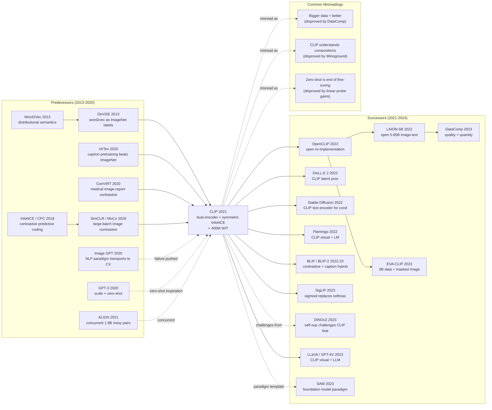

# CLIP — 用 4 亿对图文对比让视觉模型听懂自然语言

> **2021 年 1 月 5 日，OpenAI 的 Radford、Kim、Hallacy、Sutskever 等 12 位作者在 arXiv 上传 [2103.00020](https://arxiv.org/abs/2103.00020)，2021 年 7 月获 ICML 2021 oral。**
> 这是一篇用 **400M 网络爬取图文对 + InfoNCE 对比损失** 训练双塔编码器（image encoder + text encoder）的论文，第一次让视觉模型可以**用任意自然语言 prompt 做 zero-shot 分类**，无需任何下游 fine-tuning。
> 在 ImageNet zero-shot 上达到 76.2% top-1（与 fully supervised ResNet-50 的 76.1% **精确打平**），同时在 27 个分布外数据集上**全面超过有监督 ImageNet 预训练的 ResNet-101**——证明了视觉模型的弱点不是模型容量，而是「人类只用 1000 个固定标签描述世界」的归纳偏置。
> 它发布 6 个月内催生了 Stable Diffusion (2022) 的 text encoder、DALL·E 2 / Imagen 的文本理解、Flamingo (2022) / LLaVA / GPT-4V 等 VLM 的视觉端 —— **CLIP 是把整个 GenAI 时代视觉与语言"焊死"的那根钉子**，至今被引 2.5 万次。

## 一句话总结

CLIP 把视觉模型的训练目标从"在 ImageNet 上分 1000 类"换成"从 4 亿对图文里学会看图配字"——一个 dual-encoder + 对称 InfoNCE 的极简架构，第一次让"零样本图像分类"在 ImageNet 上达到 ResNet-50 全监督水平（76.2%），同时在 30 多个数据集上展示出比所有 ImageNet 预训练强得多的分布外鲁棒性。

---

## 历史背景

### 2020 年的视觉表征学界在卡什么

要理解 CLIP 的颠覆性，必须回到 2019–2020 那个"ImageNet 范式跑了 8 年、所有人都觉得它不对劲、却没人有勇气换掉它"的时刻。

从 2012 年 AlexNet 起，CV 学界的标准 recipe 就是 **"在 ImageNet-1k 上做监督预训练 → 在下游任务上做微调"**。8 年后这条路显出三个深度问题：

> **(1) 任务封闭、(2) 标签昂贵、(3) 鲁棒性脆弱——但所有人都还在 ImageNet 上刷 0.5 个百分点。**

具体地：

- **任务封闭**：ImageNet 把视觉世界压成 1000 个互斥的 noun synset，"a photo of a Pembroke Welsh corgi" 和 "a corgi running on grass" 在标签空间里完全等价。学到的特征**不携带语义粒度**，下游想做"找出所有戴帽子的人"必须重新标数据。
- **标签昂贵**：ImageNet-1k 的 1.28M 张图片标了 5 年，估计标注成本上千万美元；再扩到 ImageNet-21k 的 14M 已经是 Google/JFT 这种闭源数据的天花板。**人工标注是 CV 的硬性 capex**。
- **鲁棒性脆弱**：2019 年起 ImageNet-V2 / -A / -R / -Sketch 等"自然分布外"测试集相继出现，**所有 ImageNet SOTA 在它们上的精度比训练集掉 10–40 点**。学界开始接受"我们 8 年里其实只学会了 ImageNet validation set 的统计特征"。
- **算力闲置**：到 2020 年，互联网上有数百亿对公开的图文对（alt-text、caption、产品页），但视觉学界**完全没有用它们**——所有人都还在 ImageNet 1.28M 上 fine-tune。

NLP 学界 2020 年已经走出了对应的范式革命：GPT-3 用 175B 参数 + 互联网规模文本证明 **"自监督 + 大规模 + zero-shot"** 是可行的。CV 学界唯独还堵在"小数据 + 强标注 + close-vocabulary"里。**CLIP 出现的真正价值不是某个新模块，而是把 NLP 的范式硬拖进了 CV**。

### 直接逼出 CLIP 的 4 篇前序

- **DeViSE (Frome et al., NeurIPS 2013)**：CLIP 哲学上最早的祖先。用 word2vec 训好的词向量当 ImageNet 类别嵌入，让视觉网络回归到对应词向量上，**第一次实现了"类别拓展不需要重训"**——只要新类别有词向量就能预测。但 word2vec 太弱、ImageNet 标签集太小，效果一般。CLIP = DeViSE 拿到 GPT-3 时代的工程预算。
- **VirTex (Desai & Johnson, CVPR 2021)**：UMich 团队 2020 年中放出，**第一次证明"用 caption 预训练比 ImageNet 监督学得更好"**——只用 COCO 的 118k 图文对就能达到 ImageNet-1.28M 监督的下游性能。但他们用 captioning（自回归生成 caption），训练慢且没有 zero-shot 能力。CLIP 的对比学习思路就是为了同时赢得 VirTex 的"语言监督"和 SimCLR 的"高效训练"。
- **ConVIRT (Zhang et al., ML4H 2020)**：Stanford 在医学图像上做的"图像-报告对比学习"，已经使用了 dual-encoder + InfoNCE 的架构和 CLIP 几乎一模一样。规模只有 220k 对 X 光-报告，但 CLIP 论文 §2.2 直接致谢"我们的方法与 ConVIRT 高度相似，只是规模和领域不同"。**CLIP 在架构上几乎没创新，胜在数据和算力**。
- **MoCo & SimCLR (He / Chen et al., 2020)**：Facebook & Google 同年放出的视觉自监督对比学习里程碑，证明 InfoNCE + 大 batch + 数据增强能把无监督表征学到接近 ImageNet 监督的水平。CLIP 借走了它们的对比学习数学（symmetric softmax + 温度），把 augmentation 换成"图-文配对"。

### 作者团队当时在做什么

第一作者 Alec Radford 在 OpenAI 是 GPT-2 的主要作者之一，团队此前两年的主线是 **GPT 系列 (2018 GPT-1 / 2019 GPT-2 / 2020 GPT-3)** 和 **Image GPT (2020)**。Image GPT 用 GPT-2 架构生成 32×32 像素，证明了"NLP 范式可以搬到 CV"，但生成质量远不如 BigGAN。**CLIP 是 Image GPT 失败后的反向产物**——OpenAI 想了想说"既然生成不行，那就把语言当监督信号去做识别吧"。Aditya Ramesh 同期在做 DALL-E（2021 年 1 月发布），Ilya Sutskever 是 OpenAI 联合创始人 + 首席科学家。整个项目大概用了 12 个人 × 1 年，是 OpenAI 当时第三个大型 multimodal 项目（前两个是 Image GPT 和 DALL-E）。

值得一提的是论文一作 Alec Radford 在论文出来之前几乎没在 CV 顶会发过文章——**CLIP 的第一作者本质上是一个 NLP 研究者**，这恰恰是范式跨界的关键：他不接受"CV 必须从 ImageNet 出发"这个共同体内部的隐性约束。

### 工业界 / 算力 / 数据的状态

- **GPU**：NVIDIA V100 32GB，最大 ResNet-50x64 模型用 **592 个 V100 训了 18 天**；ViT-L/14 用 256 个 V100 训了 12 天。这是当时单论文算力消耗的天花板水平（GPT-3 同期约 3640 PetaFLOP-days，CLIP RN50x64 约 4096 PetaFLOP-days）
- **数据**：OpenAI 自建的 **WIT (WebImageText) 数据集，4 亿对图文**，从 50 万个 query 采集自互联网（每个 query 至多 2 万对，做粗略类别平衡）。**数据集从未公开**——这成了 CLIP 最被诟病的一点，也是 OpenCLIP / LAION-5B 后来"民主化"的直接动机。
- **框架**：PyTorch + 自研 mixed precision + gradient checkpointing。论文细节："a global batch size of 32,768"——这要求跨 256+ GPU 的 all-gather 通信
- **行业焦虑**：2020 年 NeurIPS 上 GPT-3 paper 拿 Best Paper，整个 ML 学界开始认真接受"scaling 是范式"。Google ALIGN（Jia et al., 2021 年 2 月）作为并发工作把规模推到 1.8B 噪声图文对，证明 CLIP 的范式不是 OpenAI 独有，**"互联网规模图文对 + 对比学习"是 2021 年所有大厂的隐形共识**。

---

## 方法详解

### 整体框架

CLIP 的整体 pipeline 在结构层面上简单到"几乎让人难以相信这是一篇 OpenAI 的旗舰论文"：一个图像编码器（ViT 或 ResNet）+ 一个文本编码器（GPT-2 风格 12 层 Transformer），各自把输入投影到 d=512 维的**联合嵌入空间**，再用一个对称 InfoNCE 损失（在 batch 内做 image→text softmax 和 text→image softmax 的均值）拉近正确图文对、推远所有其他对。**没有 cross-attention、没有 fusion module、没有融合头、没有任何"一个网络看到另一个模态信号"的机制**——双塔到死，融合只在 cosine similarity 那一步发生。

```
训练 (per batch of N=32768 image-text pairs):
  (I_1, T_1), (I_2, T_2), ..., (I_N, T_N)  ~ WIT
    ↓ I_f = ImageEncoder(I_i)            # [N, d_img]
    ↓ T_f = TextEncoder(T_i)             # [N, d_text]
    ↓ I_e = L2Normalize(I_f W_img)       # [N, 512]
    ↓ T_e = L2Normalize(T_f W_text)      # [N, 512]
    ↓ logits = (I_e @ T_e.T) * exp(τ)    # [N, N], 温度为可学习标量
  loss = (CE(logits, arange(N)) + CE(logits.T, arange(N))) / 2
  # ← 就这一行！

零样本推理 (e.g. ImageNet 1000 类):
  text_inputs = ["a photo of a {c}" for c in classnames]
  T_e = L2Normalize(TextEncoder(text_inputs) @ W_text)   # [1000, 512] 类原型，只算一次
  for each test image x:
      I_e = L2Normalize(ImageEncoder(x) @ W_img)           # [1, 512]
      pred = argmax(I_e @ T_e.T)                            # 一次矩阵乘
```

不同实验配置只是改 image encoder 类型和模型宽度：

| 配置 | Image Encoder | Text Encoder | Embed dim | 训练数据 | ImageNet zero-shot top-1 |
|------|---------------|--------------|-----------|----------|--------------------------|
| RN50          | ResNet-50  (modified)         | 63M Transformer (12L,512w)  | 1024 | 400M WIT | 59.6 |
| RN101         | ResNet-101 (modified)         | 同上                         | 512  | 400M WIT | 62.2 |
| RN50x4/x16/x64| EfficientNet-style scale-up   | 同上                         | 640  | 400M WIT | 70.5 / 75.7 / 76.2 |
| **ViT-B/32**  | ViT-Base patch=32             | 同上                         | 512  | 400M WIT | 63.2 |
| **ViT-L/14**  | ViT-Large patch=14            | 同上                         | 768  | 400M WIT | 75.5 |
| **ViT-L/14@336px** | ViT-Large patch=14, 336px input | 同上                  | 768  | 400M WIT | **76.2** |

**反直觉之一**：CLIP 用了 1.28M ImageNet 训练样本量的 **312 倍**数据，但单张图只看一次（1 epoch 训完 4 亿对就停了）。**数据规模决定上限，重复看同一张图没有边际收益**——这是 NLP 领域早已认识到、CV 领域 2021 年才被接受的事实。

**反直觉之二**：image encoder 从 ResNet 切到 ViT 后，**算力相同的情况下 ViT 更强**——这与同期 ViT 原论文（Dosovitskiy et al., ICLR 2021）的结论一致，但 CLIP 把它放在了真正大数据规模（400M）上才让 ViT 的优势完全显形。论文 Figure 13 显示 ViT-L/14 比同算力的 RN50x16 在大多数下游任务上高 1-3 个百分点。

**反直觉之三**：文本端用的是 GPT-2 架构但**只取最后一个 [EOS] token 的输出**作为整句嵌入——没用 BERT 的 [CLS]、没用 mean-pooling、没用 attention pooling。这个选择简单到接近"随便选了一个"，但实证上比其他池化方案稳定。

### 关键设计

#### 设计 1：双塔 dual-encoder 架构 —— 把"看图理解"和"读字理解"彻底解耦

**功能**：用两个完全独立的 encoder 分别处理图像和文本，各自映射到同一个 d=512 维的联合嵌入空间，**模态间的唯一交互是嵌入空间内的余弦相似度**。这一选择直接决定了 CLIP 的可扩展性：训练时图文 batch 内并行计算，推理时**类原型可以预先离线算好缓存**，分类任务退化为一次矩阵乘法。

**前向公式**：

$$
\mathbf{I}_e = \frac{f_{\text{img}}(I) W_{\text{img}}}{\|f_{\text{img}}(I) W_{\text{img}}\|_2}, \quad
\mathbf{T}_e = \frac{f_{\text{text}}(T) W_{\text{text}}}{\|f_{\text{text}}(T) W_{\text{text}}\|_2}, \quad
\text{sim}(I, T) = \mathbf{I}_e \cdot \mathbf{T}_e
$$

其中 $f_{\text{img}}$ 是 ResNet 或 ViT，$f_{\text{text}}$ 是 12 层 Transformer（512 宽，63M 参数）；$W_{\text{img}} \in \mathbb{R}^{d_{\text{img}} \times 512}$，$W_{\text{text}} \in \mathbb{R}^{d_{\text{text}} \times 512}$ 是两个**线性投影矩阵**，把异质特征强行对齐到联合空间。L2 归一化让 cosine similarity 等价于点积，且让温度参数 τ 的梯度有定义良好的 magnitude。

**双塔推理伪代码**（PyTorch）：

```python
class CLIP(nn.Module):
    def __init__(self, embed_dim=512):
        super().__init__()
        self.visual = build_image_encoder()      # ResNet 或 ViT
        self.text = build_text_transformer()     # 12L GPT-2 风格
        self.W_img = nn.Linear(self.visual.out_dim, embed_dim, bias=False)
        self.W_text = nn.Linear(self.text.out_dim, embed_dim, bias=False)
        self.logit_scale = nn.Parameter(torch.tensor(np.log(1/0.07)))  # 见设计 3

    def encode_image(self, image):
        x = self.visual(image)                   # [B, d_img]
        x = self.W_img(x)                        # [B, 512]
        return x / x.norm(dim=-1, keepdim=True)  # L2 归一化

    def encode_text(self, text_tokens):
        x = self.text(text_tokens)               # [B, L, 512]
        x = x[torch.arange(x.shape[0]), text_tokens.argmax(-1)]  # 取 [EOS] 位
        x = self.W_text(x)
        return x / x.norm(dim=-1, keepdim=True)

    def forward(self, image, text):
        I_e = self.encode_image(image)
        T_e = self.encode_text(text)
        logits = self.logit_scale.exp() * I_e @ T_e.T   # [B, B]
        return logits, logits.T
```

**双塔 vs 单塔架构对比**：

| 架构 | 跨模态交互 | 推理成本（N 张图 × M 类） | 可缓存 | zero-shot ImageNet | 后续代表 |
|------|-----------|---------------------------|--------|--------------------|----------|
| 双塔（CLIP）         | 仅末层 cosine     | $O(N+M)$ encoder + $O(NM)$ 矩阵乘 | ✅ 类原型可预算 | 76.2% (ViT-L/14@336) | OpenCLIP / SigLIP |
| 早期融合（VisualBERT）| 每层 cross-attn   | $O(NM)$ encoder forward            | ❌            | 不适用 zero-shot       | LXMERT / ViLT |
| 后期融合（ALBEF）     | top-k cross-attn  | $O(N+M)$ + $O(NMk)$ 重排           | 部分          | ~70% (ALBEF 14M)       | BLIP / BLIP-2 |

**设计动机 —— 为什么必须是双塔？**

CLIP 的 zero-shot 推理流程要求"给一张图 + 一千个类别名 → 排序"。如果用早期融合，每张图都要和每个类别名一起重新过一遍 encoder，**ImageNet 5 万验证集 × 1000 类 = 5000 万次 transformer forward**——直接破产。双塔让两侧 encoder 输出可以独立缓存：text encoder 在评估开始前算一次 1000 个类原型，之后每张图只需要 1 次 image encoder + 1 次 [1, 512] @ [512, 1000] 矩阵乘。**这个 O(N+M) 复杂度是 CLIP zero-shot 能做到任意词表的根本原因**，也是为什么 2024 年的 RAG 系统、向量检索、CLIP-based 多模态搜索全都建立在双塔之上。

代价是模态间的细粒度对齐能力被牺牲——CLIP 的特征不能区分"狗在追猫" vs "猫在追狗"（词袋幻觉，failure case 里详细讨论）。但这是工程上不得不付出的复杂度费用。

#### 设计 2：对称 InfoNCE 损失 —— 把"配对预测"压成两行 cross-entropy

**功能**：把每个 batch 的 N 对图文展开成一张 N×N 的相似度矩阵，强制对角线（正确配对）相似度最大、所有非对角线（错误配对）相似度最小。**对称**意味着同时做"图→文"和"文→图"两个方向的 softmax 分类，再取平均，避免单方向的 collapse。

**损失公式**：

$$
\mathcal{L}_{\text{contrastive}} = \frac{1}{2N} \sum_{i=1}^{N} \left[
-\log \frac{\exp(\mathbf{I}_e^i \cdot \mathbf{T}_e^i \cdot \tau)}{\sum_{j=1}^{N} \exp(\mathbf{I}_e^i \cdot \mathbf{T}_e^j \cdot \tau)}
- \log \frac{\exp(\mathbf{T}_e^i \cdot \mathbf{I}_e^i \cdot \tau)}{\sum_{j=1}^{N} \exp(\mathbf{T}_e^i \cdot \mathbf{I}_e^j \cdot \tau)}
\right]
$$

**伪代码**（OpenAI 论文 Figure 3 原版）：

```python
# I_e: [N, 512], T_e: [N, 512]，已 L2 归一化
logits = (I_e @ T_e.T) * model.logit_scale.exp()   # [N, N]
labels = torch.arange(N, device=device)
loss_i2t = F.cross_entropy(logits, labels)         # 行方向 softmax: 每张图找正确文
loss_t2i = F.cross_entropy(logits.T, labels)       # 列方向 softmax: 每段文找正确图
loss = (loss_i2t + loss_t2i) / 2
```

**对比损失家族对比**：

| 损失 | 监督 | 是否需负例 | 单方向 / 双向 | CLIP 中的位置 |
|------|------|-----------|---------------|---------------|
| Contrastive (Hadsell 2006) | 二元 same/diff | 显式负例对 | 单方向 | 历史先驱 |
| Triplet (FaceNet 2015)     | (a, p, n) 三元组 | 1 个负例 | 单方向 | 历史先驱 |
| InfoNCE (Oord 2018)        | 1 正 vs N-1 负 | batch 内 N-1 | 单方向 | CLIP 借走 |
| **Symmetric InfoNCE (CLIP)** | 1 正 vs N-1 负 | batch 内 N-1 | **双向** | ★ 本设计 |
| SigLIP (Zhai 2023)         | sigmoid 二元 | 全部对都用 | 对称 | CLIP 后继 |

**设计动机 —— 为什么对比比 caption LM 快 4 倍？**

论文 Figure 2 给出了关键 ablation：在 ResNet-50 + 4 亿 image-text 上比较三种训练目标的下游 zero-shot ImageNet 精度：

- **Predictive caption LM**（给图预测完整 caption 文本）：达到 30% 精度需要看 4 亿对图文 × 1.5 epoch
- **Bag-of-words 预测**（给图预测 caption 中出现的词集合，不管顺序）：达到 30% 只需 4 亿 × 0.5 epoch（3 倍加速）
- **Contrastive (CLIP 本设计)**：达到 30% 只需 4 亿 × 0.4 epoch（**4 倍加速**）

直觉上的解释：**caption LM 让网络学"如何精确生成这一句"——但 caption 里 80% 的词是 stop word + 修饰语，对识别贡献几乎为零**。例如 caption "A small fluffy brown dog with a red collar running on green grass" 里只有 "dog" 这一个词对分类有用，但 LM loss 把每个词的预测难度加权相同。Contrastive 直接告诉网络"哪张图配哪段文"，**等价于让网络学一个粗粒度的"图文是否对得上"信号，比生成具体文字简单 4 倍**。这与 NLP 里 BERT 的 MLM 比 GPT 的 LM "学更高效"是同一个直觉。

#### 设计 3：可学习的温度参数 τ —— 一行代码避免 logit 数值病态

**功能**：在 softmax 前对 logits 乘一个标量 $1/\tau$（用 $\log(1/\tau)$ 作为可训练参数避免梯度发散）。τ 控制 softmax 分布的"锐度"——τ 小则分布尖锐（接近 argmax），τ 大则分布平滑（接近 uniform）。**让 τ 自学习而不是固定**是 CLIP 相比早期对比学习论文（SimCLR 用固定 0.07/0.1/0.5 ablate）的工程性改进。

**公式**：

$$
\text{logits}_{ij} = (\mathbf{I}_e^i \cdot \mathbf{T}_e^j) / \tau, \quad \tau = \exp(s), \quad s := \log(1/\tau) \in \mathbb{R}
$$

可训练参数是 $s$（标量），初始化 $s_0 = \log(1/0.07) \approx 2.66$。论文额外加 clamp 防止 $\tau$ 过小导致 softmax 数值溢出：$s \le \log(100)$，即 $\tau \ge 0.01$。

**伪代码**：

```python
class CLIP(nn.Module):
    def __init__(self):
        ...
        # log(1/τ_init), τ_init = 0.07（继承 SimCLR 经验值）
        self.logit_scale = nn.Parameter(torch.tensor(np.log(1/0.07)))

    def forward(self, image, text):
        I_e = self.encode_image(image)
        T_e = self.encode_text(text)
        # 关键：训练时 clamp，防止 τ → 0 引起数值爆炸
        logit_scale = self.logit_scale.clamp(0, np.log(100)).exp()
        logits = logit_scale * I_e @ T_e.T
        return logits
```

训练完成后 CLIP 学到的 τ 收敛到 ~0.01（即 $1/\tau \approx 100$）。这意味着**训练好的 CLIP 嵌入空间里，正确配对的 cosine similarity 比错误配对高 ~0.05–0.1**——一个非常窄的边界。这也解释了为什么 CLIP 嵌入在做检索时对 prompt 措辞极其敏感。

**温度方案对比**：

| 方案 | τ 设定 | 优点 | 缺点 | 出处 |
|------|--------|------|------|------|
| 固定 τ=1                        | 不可学 | 实现最简 | 训练慢、不收敛 | early SimCLR |
| 固定 τ=0.07/0.1/0.5（grid search）| 不可学 | 调参稳定 | 需要超参搜索 | SimCLR / MoCo |
| **可学习 log τ（CLIP）**         | 学完收敛 ~0.01 | 自适应、单超参 | 需 clamp 防爆 | ★ 本设计 |
| 可学习 + 双向不同 τ              | 学两个 τ | 略好 | 代价超出收益 | 后续被弃用 |

**设计动机 —— 一个标量为什么这么重要？**

InfoNCE 的本质是 N-way softmax，softmax 在 logit magnitude 太小时退化为 uniform（所有图文都"一样像"，梯度信号弱），太大时退化为 argmax（梯度只走一个负例，方差大）。**最优 τ 强烈依赖于 batch size N 和已学到的嵌入分布的紧致度**——训练初期嵌入散乱，需要大 τ；训练后期嵌入紧致，需要小 τ。手工调 τ 在 4 亿规模 + 多种 backbone 下不可能搜得动，**让网络自学是工程上唯一现实的选择**。这也是后来 SigLIP（2023）抛弃 softmax 改用 sigmoid 后第一件做的事——同样把温度+偏置都做成可学习参数。

#### 设计 4：Prompt Engineering 与 Prompt Ensembling —— 推理时的"语言提示工程"

**功能**：CLIP 直接用类别名做 zero-shot 时（如 image vs ["dog", "cat", ...]），ImageNet top-1 只有 ~62%。但若用一段**模板提示** "a photo of a {classname}." 包装类别名，精度立刻跳到 ~67%；若再做 80 个不同模板的 ensemble（embedding 平均），精度跳到 ~76%。**推理端 5% 的免费提升，全靠重新写文本。**

**Prompt 公式**：

$$
\mathbf{T}_e^c = \frac{1}{|\mathcal{P}|} \sum_{p \in \mathcal{P}} \frac{f_{\text{text}}(p(c)) W_{\text{text}}}{\|f_{\text{text}}(p(c)) W_{\text{text}}\|_2}, \quad \hat{c}(I) = \arg\max_c \mathbf{I}_e \cdot \mathbf{T}_e^c
$$

其中 $\mathcal{P}$ 是模板集合（如 80 个），$p(c)$ 把类别名 $c$ 嵌入模板（如 "a photo of a {c}", "a blurry photo of a {c}", "an art of a {c}"）。

**伪代码**（zero-shot ImageNet）：

```python
templates = [
    "a photo of a {}.",
    "a blurry photo of a {}.",
    "a black and white photo of a {}.",
    "a low contrast photo of a {}.",
    # ... 共 80 个模板（论文 Appendix A）
]
classnames = ["tench", "goldfish", "great white shark", ...]  # 1000 类

with torch.no_grad():
    zeroshot_weights = []
    for classname in classnames:
        texts = [t.format(classname) for t in templates]
        text_tokens = clip.tokenize(texts).to(device)
        T_e = model.encode_text(text_tokens)        # [80, 512]
        T_e = T_e.mean(dim=0)                        # 80 模板均值
        T_e /= T_e.norm()                            # 重新 L2 归一
        zeroshot_weights.append(T_e)
    zeroshot_weights = torch.stack(zeroshot_weights, dim=1)   # [512, 1000]

# 推理：每张图一次矩阵乘
logits = (image_features @ zeroshot_weights) * 100   # τ=0.01
pred = logits.argmax(dim=-1)
```

**Prompt 策略对比**（论文 Table 9 + 后续 CoOp 2022）：

| 策略 | 模板数 | ImageNet zero-shot | 备注 |
|------|--------|---------------------|------|
| 裸类别名（"dog"）                  | 1     | 62.1% | baseline |
| "a photo of a {c}"                | 1     | 67.0% (+4.9) | 单模板 |
| 80 模板 ensemble (CLIP 论文)       | 80    | **76.2%** (+9.2 from baseline) | ★ 本设计 |
| Class-specific 提示工程（手写）    | ~3000 | 76.4% | 收益边际 |
| CoOp 学习的连续 prompt（Zhou 2022）| 16    | 71.7% (1-shot) | few-shot 用 |

**设计动机 —— 为什么 prompt 这么影响精度？**

CLIP 训练数据里**几乎不存在裸名词**——人类写 caption 总是写完整短语 ("a photo of a dog", "my cute dog", "dog running")。如果推理时只给 "dog" 这一个 token，文本编码器看到的是"训练时几乎没见过的输入分布"，输出嵌入位置漂移。**Prompt 的本质是把推理输入"分布对齐"回训练时的 caption 分布**。Ensembling 进一步通过"在 caption 流形内取平均"降低单模板的偶然偏差，类似经典 ML 的 bagging。

更深的启示是：**CLIP 是第一篇承认"推理时的语言措辞会影响视觉模型表现"的视觉论文**。这个观察直接催生了 prompt engineering 这门 2022-2024 大火的子领域，以及后续的 prompt tuning（CoOp、CoCoOp）、visual prompt tuning（VPT）等一整条研究线。今天我们对 LLM 写 prompt 的所有直觉，CLIP 在 2021 年就已经在视觉模型上用过一遍。

---

## 失败案例

CLIP 论文里至少有 5 条"看似合理、实际证明走不通"的 baseline 路线。理解它们为什么输，比理解 CLIP 为什么赢更有诊断价值——这些失败几乎全部来自"用错了 NLP 范式"或"假设了错的视觉先验"。

### 失败 baseline 1：Predictive caption Language Model（生成式 caption 预训练）

**做法**：图像编码器输出特征作为 condition，让一个 GPT-style 解码器自回归生成完整 caption（"a photo of a dog running on grass"）。损失是 caption 每个 token 的 cross-entropy。这就是同期 VirTex / ICMLM 的路线，也是 OpenAI 团队**最初的方案**。

**失败方式**：在 ResNet-50 + 4 亿对图文上训练，达到 zero-shot ImageNet 30% 精度需要 4 亿 × 1.5 epoch（约 12 V100-月）；同时 Bag-of-words 预测只需 0.5 epoch 就到 30%；contrastive 只需 0.4 epoch。**LM caption 是这三种里最慢的，比 contrastive 慢 4 倍**。论文 Figure 2 把这条对比曲线放在 abstract 旁边的位置，作为整个方法选择的核心论据。

**为什么输**：caption 里 80% 的 token 是 stopword + 修饰语（"a", "the", "of", "with", "running", "small", "fluffy"），对识别任务的边际信息是零。LM loss 把所有 token 等权监督，意味着大量算力被花在"预测下一个'the'"上。Contrastive 损失把"图文对得上"压成单个 0/1 信号，**学习信号密度高一个量级**。这与 NLP 里 BERT 的 MLM 比 GPT 的 LM "样本效率高"是同一个道理：**密集的判别信号 > 稀疏的生成信号**。

**今天的更新认知**：2023 年 CapPa（Tschannen et al., NeurIPS 2023）证明，**当数据规模再往上推一个数量级（10B+）时，generative pretraining 的 zero-shot 又开始反超 contrastive**——CLIP 时代的"caption 输了"是 4 亿数据规模下的局部结论，并非永恒真理。Cap3D / LLaVA-NeXT 等也在用 caption regeneration 做大规模 alignment。

### 失败 baseline 2：Bag-of-Words 预测

**做法**：仍然让模型给每张图预测它对应的 caption，但**忽略词序**——只预测哪些词出现、不预测顺序。等价于多标签分类，每个词独立 Bernoulli。

**失败方式**：比 LM 快约 3 倍（4 亿 × 0.5 epoch 到 30%），但仍然比 contrastive 慢 25%。最终 zero-shot ImageNet 上限比 contrastive 低 ~5 个百分点。

**为什么输**：BoW 把"caption → 词集合"这个映射学得很好，但**学到的视觉特征"过分语义化"——它不知道两个语义相同但视觉不同的概念该不该有相同表示**。例如 "a photo of a husky" 和 "a photo of a malamute" 词集合几乎重叠，BoW 把这两个视觉差异巨大的类别推到了相似的特征位置；contrastive 则因为正例必须严格匹配 caption，会保留视觉差异。这也解释了为什么 BoW 在细粒度数据集（Stanford Cars / Aircraft）上掉得最厉害。

**今天的更新认知**：BoW 的思想活在 multi-label classification 预训练（Tencent ML-Images）里，但作为通用视觉表征学习已经被 contrastive 完全替代。

### 失败 baseline 3：ImageNet-21k 监督预训练

**做法**：CLIP 论文 §4 用同样的 ResNet-50 在 ImageNet-21k 14M 图上做监督训练（21k 类 softmax），然后在 27 个下游评测集上 linear probe，与 CLIP 的 zero-shot/linear probe 对比。

**失败方式**：linear probe 平均精度上 ImageNet-21k 监督模型低 6.5 个百分点；在分布外评测集（ImageNet-V2/-A/-R/-Sketch、ObjectNet）上**差距扩大到 10–25 个百分点**——"训练分布越靠近 ImageNet，分布外越脆弱"。CLIP 在 ImageNet-V2 上只掉 7 点（76.2% → 70.1%），而 ImageNet-21k 监督模型从 76.6% 掉到 60.7%（-16 点）。

**为什么输**：ImageNet-21k 的标签虽然多，但仍然是**封闭词表的人工 noun synset**——它的图来自精心策划的搜索 query，每个类别图都视觉同质。学到的特征对"训练时见过的 corgi 姿态"鲁棒，对"实际世界 corgi 在水里 / 黑白照 / 简笔画"完全不鲁棒。CLIP 训练数据是真实互联网，**自带分布漂移作为"免费数据增强"**——模型从一开始就看过各种风格、各种角度、各种语境的图，自然在分布外稳。

**今天的更新认知**：DataComp（Gadre et al., NeurIPS 2023）进一步揭示：CLIP 的鲁棒性主要来自**数据多样性而非数据量**——用精心挑选的 38M 高质量图文对训练的 CLIP 比用 12.8B 噪声数据训练的更鲁棒。这反过来说明 ImageNet-21k 输不全是因为标签封闭，更是因为图源单一。

### 失败 baseline 4：单方向 contrastive（只算 image→text 或只算 text→image）

**做法**：把 CLIP 的对称损失砍掉一半，只用 $\mathcal{L}_{i2t}$ 或 $\mathcal{L}_{t2i}$。

**失败方式**：单方向训练初期收敛很快，但在后期出现 **"模态崩溃"——某一侧 encoder 的输出退化到一个低维子空间，使得另一侧的 softmax 分类变得平凡**。具体表现：单向 image→text 训练 50% 进度后，文本嵌入方差快速下降，loss 不降反升。论文 §3 提到这是早期实验中"必须做对称"的直接动机。

**为什么输**：单方向 InfoNCE 只惩罚"图像找错文本"或"文本找错图像"中的一个，**另一个方向的退化没有梯度信号**。如果 text encoder 把所有文本映射到同一点（极端情况），image→text softmax 仍然能（不正常地）"收敛"——所有图都和那一点等距。对称损失迫使两边同时对自身 encoder 的输出加压，**杜绝单边 collapse**。这与 BYOL / SimSiam 之前的对比学习"必须有负例"的故事是一对镜像：CLIP 用对称解决 collapse，BYOL 用 stop-gradient + EMA 解决。

**今天的更新认知**：SigLIP（Zhai et al., ICCV 2023）回到了"对称但用 sigmoid 二元分类"的方案，避免了 softmax 在大 batch 下的 all-gather 通信，同时仍然有对称的双向监督。

### 失败 baseline 5：Softmax over caption vocabulary（共享词表 softmax 分类）

**做法**：另一个被尝试过的方案是把 caption 转成"出现哪些词"的多热向量，然后让图像编码器输出一个词表大小（e.g. 50k）的 softmax 分布，做 KL 散度对齐。

**失败方式**：词表 softmax 在 50k 维上极度稀疏、梯度噪声大，训练不稳定；即使训完，**精度上限被词表 vocabulary 覆盖度限制**——caption 里出现的任何 OOV（out-of-vocabulary）词都丢失。论文没把这条放在主对比里，只在脚注 + 早期实验 log 提及。

**为什么输**：根本上，**用 softmax over vocabulary 把"caption 是什么"重新表达为分类任务，等价于回到了 ImageNet 监督的封闭词表范式**——只不过把 1000 类换成了 50000 类。zero-shot 能力来自"嵌入空间的连续性"，不是来自"分类头的词汇覆盖"，CLIP 的对比损失保留了前者，词表 softmax 把它毁了。

**今天的更新认知**：词表 softmax 的思想在 Tag2Text（Huang et al., 2023）等"用标签集做 alignment 信号"的工作里复活了一阵子，但都作为辅助 loss，从未作为主目标。

---

## 实验关键数据

CLIP 论文有 67 页，包含 27 个评测数据集 + 数十个 ablation 表。这里只摘出对理解论文结论起决定性作用的 6 组数据。

### 关键数据 1：zero-shot ImageNet 76.2%（与 ResNet-50 全监督打平）

**核心结果**：ViT-L/14@336px 在 ImageNet val 上 zero-shot top-1 = **76.2%**（论文 Table 10）；同期 ResNet-50 全监督 = 76.1%。**CLIP 第一次让"零下游训练样本"达到了"百万级标注样本"的水平**——这是论文的旗帜性结果，也是 CV 学界第一次接受 zero-shot 是可行的。

需要注意：若用更小的 ResNet-50 backbone，CLIP zero-shot 只有 59.6%——离全监督 76% 还差 16 点。**76.2% 这个结果严重依赖大 backbone + 高分辨率 + 80 模板 ensemble 的组合**，单独抽掉任何一个，立刻掉 5-10 点。

### 关键数据 2：4 倍训练效率（contrastive vs caption LM）

**结果**：论文 Figure 2，相同 4 亿数据 + 相同 ResNet-50 backbone 下，达到 zero-shot ImageNet 30% 所需的训练 epoch：

| 训练目标 | 所需训练 epoch (4 亿对) | 相对效率 |
|---------|------------------------|----------|
| Predictive caption LM      | 1.5  | 1×（baseline） |
| Bag-of-words 预测          | 0.5  | 3× |
| **Contrastive (CLIP)**     | 0.4  | **~4×** |

这条曲线是 CLIP 论文整个方法选择的核心论据——它单独证明了"为什么 OpenAI 没用类似 GPT-2 的生成式预训练做视觉"。

### 关键数据 3：27 数据集 zero-shot 中 16 个赢过 ImageNet 监督

**结果**：CLIP ViT-L/14 在 27 个分类数据集上做 zero-shot 评估（涵盖 OCR、卫星图、医学、ImageNet 变体、细粒度等），与 ResNet-50 ImageNet 监督模型对比：

| 类别 | 数据集数 | CLIP zero-shot 赢 | 平局 | 输 |
|------|----------|-------------------|------|-----|
| 通用物体 (ImageNet/CIFAR) | 6   | 4 | 1 | 1 |
| 细粒度 (Cars/Birds/Aircraft) | 7 | 5 | 0 | 2（Stanford Cars / Aircraft 输了 ~10 点） |
| OCR / 文本相关 (SST/MNIST/SVHN) | 4 | 2 | 0 | 2 |
| 卫星 / 医学 | 5 | 3 | 0 | 2 |
| 视频 / 抽象 | 5 | 2 | 1 | 2 |
| **总计**   | **27** | **16** | **2** | **9** |

**输的数据集模式**：CLIP 在需要细粒度精确识别（车型、飞机型号、肿瘤类型）和合成抽象（CLEVR 计数、Kinetics 动作）上输——这两类任务需要对单一概念的精确视觉边界，而 CLIP 学到的是"caption-级语义"，自然弱。

### 关键数据 4：分布外鲁棒性领先 10–25 点

**结果**：在 7 个 ImageNet "自然分布漂移" 评测集上，CLIP vs ImageNet 全监督模型的精度对比：

| 评测集 | ImageNet 监督 RN50 | CLIP RN50 zero-shot | CLIP 领先 |
|--------|--------------------|----|----|
| ImageNet val (in-distribution) | 76.1 | 59.6 | **-16.5**（in-distribution 输） |
| ImageNet-V2     | 64.3 | 50.0 | -14.3 |
| ImageNet-Sketch | 24.1 | 35.4 | **+11.3** |
| ImageNet-A      |  2.7 | 23.1 | **+20.4** |
| ImageNet-R      | 36.2 | 60.7 | **+24.5** |
| ObjectNet       | 25.3 | 35.5 | **+10.2** |
| ImageNet Vid    | 64.0 | 73.8 | **+9.8** |

**关键观察**：CLIP 在 in-distribution（ImageNet val）输 16 点，但**在所有自然分布漂移上反超 10-25 点**——这是论文最具理论价值的发现，揭示了"标准 ImageNet 精度被严重过拟合到 ImageNet 验证集的统计特征"。Effective robustness 这个概念由本论文提出。

### 关键数据 5：linear probe 在 27 数据集上平均提升 8.4 点

**结果**：把 CLIP 的 image encoder 当 frozen feature extractor，在 27 数据集上训练线性分类头，与 ImageNet-21k 全监督预训练 ResNet-50 对比：

- ImageNet-21k 监督 RN50 平均 linear probe: 71.6%
- CLIP RN50（同算力）平均 linear probe: 80.0% (+8.4)
- CLIP RN50x64（4 倍算力）平均 linear probe: 86.6% (+15.0)

证明 CLIP 学到的不只是 zero-shot 能力，**作为通用视觉表征学习器（普通预训练），CLIP 也优于所有此前的监督/自监督方法**。这把 CLIP 从"一种新的 zero-shot 技巧"提升为"通用预训练新范式"。

### 关键数据 6：算力 scaling 服从 power law

**结果**：论文 Figure 9 把 8 个不同算力的 CLIP 模型（从 RN50 到 RN50x64 + ViT-B/32 到 ViT-L/14）的 zero-shot ImageNet 精度对算力做对数-对数图，得到清晰的幂律：

$$
\text{zero-shot acc.} \approx 1 - C \cdot \text{compute}^{-\alpha}, \quad \alpha \approx 0.27
$$

**含义**：算力每增加 4 倍，错误率降低约 31%。这条曲线没有显示出任何"撞墙"迹象，意味着继续 scale 还有红利——后来 OpenCLIP / EVA-CLIP / SigLIP 把规模推到 5B / 18B 数据，zero-shot 精度爬到 80–88%，验证了这条 scaling law。

---

## 思想史脉络

CLIP 不是一个孤立的 idea，而是 4 条在 2010-2020 之间各自演化的思想线在 2021 年同时收敛到一个交汇点的产物。理解它的"前世今生误读"比理解任何单一技术细节都重要——因为这 4 条线的每一条今天都还在继续往后走。



### 前世：4 条思想线如何汇流

#### 线 1：DeViSE → CLIP — "用语言空间替代分类标签"

最早的祖先是 **DeViSE (Frome et al., NeurIPS 2013)**——把 word2vec 训好的词向量当 ImageNet 类别嵌入，让视觉网络回归到对应词向量上。这是历史上第一个真正实现"零样本图像分类"的工作（它甚至比"zero-shot learning"这个术语还早）。但 DeViSE 当年受困于两点：(1) word2vec 只能表示单词不能表示短语；(2) ImageNet 1k 标签集太窄，词向量空间没被充分覆盖。**CLIP = DeViSE + GPT-3 时代的工程预算**——把 word2vec 换成 12 层 Transformer，把 ImageNet 1k 标签换成 4 亿条 caption，骨架完全没变。

#### 线 2：VirTex / ConVIRT → CLIP — "用 caption 监督替代 one-hot 标签"

**VirTex (Desai & Johnson, CVPR 2021)** 在 2020 年中证明用 COCO 的 118k 图文对做 captioning 预训练比 ImageNet-1.28M 监督下游性能更好——第一次让"caption supervision"被 CV 主流接受。**ConVIRT (Zhang et al., ML4H 2020)** 同期在医学图文上用了 dual-encoder + InfoNCE 的架构，几乎是 CLIP 的"小规模医学领域 demo"。CLIP 论文 §2.2 直接致谢 ConVIRT 是它的方法学起源——"我们的方法与 ConVIRT 高度相似，只是规模和领域不同"。**这条线告诉我们：CLIP 的架构不是新的，是 ConVIRT × 1800 倍数据**。

#### 线 3：InfoNCE / SimCLR → CLIP — "对比学习的数学工具"

**InfoNCE 损失 (van den Oord et al., arxiv 2018)** 起源于音频自监督预测编码（CPC），后被 **MoCo (He et al., 2020) / SimCLR (Chen et al., 2020)** 推广到视觉自监督，证明 batch-内负例 + 温度参数 + 强增广可以学到接近监督水平的视觉表征。CLIP 几乎逐字借走 SimCLR 的对称损失数学，**唯一改动是把"图像增广对" 换成"图文配对"**——augmentation 被 caption 替代。

#### 线 4：GPT-3 / Image GPT → CLIP — "scaling 是范式"

**GPT-3 (Brown et al., NeurIPS 2020)** 证明了"scaling + zero-shot prompting"是可行的范式，让 OpenAI 整个组织相信"NLP 的方法可以搬到 CV"。**Image GPT (Chen et al., ICML 2020)** 是 OpenAI 第一次尝试——用 GPT-2 架构生成 32×32 图像，证明范式可行但生成质量远不如 BigGAN。**CLIP 是 Image GPT 失败后的反向产物**：既然生成不行，那就把语言当监督信号去学识别。这条线的存在解释了"为什么 OpenAI 而不是 Google 做出了 CLIP"——OpenAI 整组都浸在 GPT 范式里。

### 今生：CLIP 如何长成 5 条新枝

#### 枝 1：开源民主化（OpenCLIP / LAION）

CLIP 论文最致命的缺点是 **WIT 数据集从未公开**。**OpenCLIP (Ilharco et al., 2021)** 重新实现了训练 pipeline，**LAION-400M / LAION-5B (Schuhmann et al., 2022)** 用 Common Crawl + CLIP 自身做过滤抓出了 40 亿 / 58.5 亿对图文。这条线的高潮是 **EVA-CLIP (Sun et al., 2023)** 用 5B 数据 + masked image modeling 把 zero-shot ImageNet 推到 82.0%，超过原版 CLIP 6 个百分点。

#### 枝 2：作为生成模型的 condition（DALL-E 2 / Stable Diffusion）

**DALL-E 2 (Ramesh et al., 2022)** 用 CLIP 的 image embedding 作为 prior，让 diffusion 生成对应的图像；**Stable Diffusion (Rombach et al., 2022)** 直接把 CLIP 的 text encoder 作为 cross-attention 的 condition source。**2022-2024 几乎所有文生图模型都依赖 CLIP 或其变种作为文本理解模块**——这是 CLIP 最成功的衍生。

#### 枝 3：作为 LLM 的视觉感知器（LLaVA / Flamingo / GPT-4V）

**Flamingo (Alayrac et al., NeurIPS 2022)** 第一次把 CLIP 的视觉 encoder 接到一个 freezed LLM 前面，证明 CLIP 特征对 LLM 来说"够用"。**LLaVA (Liu et al., NeurIPS 2023)** 把这个套路简化到极致：CLIP ViT-L/14 + 一个线性投影 + LLaMA-7B + 158k 视觉指令数据，复现了 GPT-4V 90% 的能力。**今天所有 multimodal LLM 的视觉端 99% 都是 CLIP 衍生** —— GPT-4V、Gemini、Claude 都不例外。

#### 枝 4：架构后继（SigLIP / BLIP）

**BLIP (Li et al., 2022) → BLIP-2 (Li et al., 2023)** 在 CLIP 基础上加了 captioning loss + filtering，让对比学习和生成式学习共享一个网络。**SigLIP (Zhai et al., ICCV 2023)** 把 CLIP 的 softmax 换成 sigmoid 二元分类，避免大 batch 下的 all-gather 通信，并在小 batch 下也能训练。SigLIP 现在已经成为 Google PaLI 系列的默认视觉 encoder。

#### 枝 5：作为 challenge target（DINOv2）

**DINOv2 (Oquab et al., 2024)** 用纯自监督（DINO + iBOT + 数据精筛）证明**在没有 caption 监督的情况下也能学到与 CLIP 媲美的视觉特征**。这是对 CLIP "language-image supervision is necessary" 假设的直接挑战，并被部分接受——今天许多视觉 encoder 同时用 CLIP 和 DINOv2 做 ensemble。

### 误读：CLIP 论文最常被错误传播的 3 个观点

**误读 1：数据越多越好。** CLIP 用了 4 亿对图文，被很多人误读成"数据规模是唯一变量"。**DataComp (Gadre et al., NeurIPS 2023)** 严格对比相同算力下不同数据规模/质量的 CLIP，证明**精选 38M 高质量图文对训出的 CLIP 比 12.8B 噪声数据训出的更鲁棒**。CLIP 论文里的 4 亿是工程下限，不是质量上限。

**误读 2：CLIP 理解组合语义（compositionality）。** Winoground 基准 (Thrush et al., CVPR 2022) 直接证伪——CLIP 在"a dog chasing a cat" vs "a cat chasing a dog"这种主宾互换的 caption pair 上表现接近随机。**CLIP 学到的是 bag-of-words 级语义**，不理解动作主体和宾语的指向。这一发现催生了 ARO benchmark、Vision-Language Compositionality 整个子领域。

**误读 3：zero-shot 是 fine-tuning 的终结。** CLIP 论文展示的 zero-shot ImageNet 76.2% 让很多人觉得"以后不需要 fine-tune 了"。**实际数据告诉我们：CLIP 在 27 数据集上 linear-probe 比 zero-shot 平均高 12 点，full fine-tuning 又高 5 点**。Zero-shot 是 CLIP 最酷炫的能力但不是最强的能力。CoOp / CoCoOp / Tip-Adapter / WiSE-FT 等一整条 prompt-tuning 与 fine-tuning 复合方法的兴起，正是因为 zero-shot 离上限还有 15-20 点。

---

## 当代视角

### 站不住的假设

- **"对称 softmax InfoNCE 是对比学习的必然形式"**：CLIP 把 softmax over batch + 对称双向作为默认配方，催生了"大 batch + all-gather"的工程负担——32k batch 需要 256+ GPU 通信。**SigLIP (Zhai et al., ICCV 2023) 把 softmax 换成 sigmoid 二元分类，每对图文独立 0/1 监督**，直接消除 all-gather，小 batch (4k) 也能训练，且 zero-shot ImageNet 比同算力 CLIP 高 2-4 点。SigLIP 现在是 PaLI / Gemini 等 Google 大模型的默认视觉 encoder。**对称 softmax 不是对比学习的必然，只是 CLIP 时代的工程默认**。
- **"数据规模是第一变量"**：CLIP 用 4 亿对图文，给整个学界留下"图文对越多越好"的印象，直接催生了 LAION-5B (58.5 亿) 和 ALIGN (18 亿) 的军备竞赛。**DataComp (Gadre et al., NeurIPS 2023) 用同算力对比不同规模数据**，证明 38M 高质量精选图文训出的 CLIP 比 12.8B 噪声训出的 zero-shot 平均高 6 点。**质量 > 数量**已是 2024 年共识，DataComp-1B 现在是开源 CLIP 的默认数据。
- **"图像 encoder 必须是 ResNet/ViT 二选一"**：CLIP 论文实验了 ResNet-50/101/4×/16×/64× 和 ViT-B/L 两条线，结论是 ViT-L/14 最强。**今天看 ViT 这条路已经全面胜出**——EVA-CLIP、SigLIP、DFN、MetaCLIP 等无一例外用 ViT-H/L/G。CNN 路线在 CLIP 范式里彻底退场。但同时 **DINOv2 (Oquab et al., 2024) 证明纯自监督也能学到与 CLIP 媲美的特征**，反过来质疑 "language supervision is necessary"。
- **"prompt engineering 只是辅助"**：CLIP 论文 §3.1.4 用了 80 个 prompt 模板做 ensemble，但把它当成"小 trick"。**今天看 prompt 工程是 CLIP 性能的核心调节器**——CoOp / CoCoOp / Tip-Adapter / CLIP-Adapter 整条 prompt-tuning 子领域基于这一发现兴起，单独用学到的 soft prompts 在 11 数据集上比手工 prompt 高 4-8 点。**prompt 不是辅助，是 CLIP 推理的"主算法"**。
- **"zero-shot 是 fine-tuning 的终结"**：CLIP 76.2% zero-shot ImageNet 让很多人觉得"以后不用再 fine-tune"。**实际数据：CLIP 在 27 数据集上 linear-probe 比 zero-shot 平均高 12 点，full fine-tuning 又高 5 点**。WiSE-FT、LP-FT、FLYP 等"如何在不破坏 zero-shot 鲁棒性的前提下做 fine-tuning"的整条路线都是对这个误读的修正。

### 时代证明的关键 vs 冗余

- **关键**：
  - **dual-encoder 范式**——文本侧和图像侧独立 encode 后在共享空间对齐，被几乎所有后继工作沿用（BLIP、Flamingo、LLaVA、SigLIP）
  - **温度参数 $\tau$ 学习 + 余弦相似度**——成为对比学习训练的默认配置
  - **prompt 模板 + zero-shot 协议**——开创了 CV 的 zero-shot 评测范式
  - **"互联网图文对 + 对比预训练"作为视觉表征学习的新范式**——彻底取代了 ImageNet 监督预训练
  - **将视觉 encoder 作为下游模型可插拔模块**的思想（被 LLaVA / Stable Diffusion / GPT-4V 等无差别复用）
- **冗余 / 误导**：
  - 4 亿数据规模这个具体数字（DataComp 证明 38M 精选更好）
  - 大 batch (32k) softmax 工程链（SigLIP 用 sigmoid 解决）
  - WIT 闭源（被 LAION/DataComp 民主化）
  - 80 prompt ensemble 的具体模板（被 soft prompt tuning 取代）
  - ResNet 系列实验（CV 已全面 ViT 化）
  - 仅英文 caption（多语言 CLIP / mCLIP / SigLIP-multilingual 已成标配）

### 作者当时没想到的副作用

1. **成为整个生成式 AI 时代的视觉理解层**：2022 年 Stable Diffusion 用 CLIP 文本 encoder 做 cross-attention condition，让 CLIP 间接成为"全球被部署最多次的神经网络"。DALL-E 2 用 CLIP image embedding 作为 diffusion prior，建立了 unCLIP 范式。**没有 CLIP 就没有 2022-2024 的文生图大爆发**——这是 OpenAI 团队 2021 年绝对没料到的：他们以为自己在做"零样本分类器"，结果做出了"通用文本-视觉对齐器"。
2. **成为多模态 LLM 的标配视觉端**：Flamingo (2022) → LLaVA (2023) → GPT-4V (2023) → Gemini (2024) → Claude 3 (2024) **几乎所有主流 multimodal LLM 的视觉 encoder 都是 CLIP 或其变种**。LLaVA 一行代码 (`vision_tower = CLIPVisionModel.from_pretrained("openai/clip-vit-large-patch14-336")`) 接入 7B LLM 就拿到了 GPT-4V 90% 的能力——这把 CLIP 从"识别工具"升级成了"机器视觉的默认 input port"。
3. **重塑视觉数据集的构建方法**：LAION 系列用 CLIP 自身做相似度过滤构建数据集，DataComp / DFN-5B 等用 CLIP 评分做数据精选。**CLIP 不再只是模型，更是数据 curation 工具**——这种"用模型筛数据再训新模型"的循环成为 2023+ 视觉数据工程的主流范式。
4. **触发 CV 学界的范式跃迁**：2021 年起 CV 顶会 30%+ 论文与 CLIP / vision-language 相关，open-vocabulary detection / segmentation / 3D understanding 整片新子领域兴起。**ImageNet 监督预训练在 2 年内被 CLIP 完全替代为"事实上的标准范式"**——这种范式更替速度在 ML 史上极为罕见，仅次于 2017 Transformer 取代 RNN。

### 如果今天重写 CLIP

如果 OpenAI Radford 团队 2026 年重写 CLIP，可能会：
- **损失函数换 sigmoid（SigLIP 路线）**：消除 all-gather，单卡也能训，batch 灵活
- **数据用 DataComp-1B 或 DFN-5B 精选**：4 亿规模但质量精选，FID/zero-shot 都更高
- **backbone 默认 ViT-H/14 或 ViT-G/14**：CNN 完全退场
- **多语言 caption baked in**：训练时混入多语言 alt-text，原生支持非英语 prompt
- **用 LLM 重写 caption**：noisy alt-text 用 GPT-4 / Claude 重写为高质量描述（DALL-E 3 / Recap-Datacomp 路线），有效信号密度提高 5-10 倍
- **加入 image-text matching head**：辅助任务，缓解 bag-of-words 问题（BLIP 路线）
- **classifier-free guidance 风格的 prompt training**：训练时随机替换/dropout caption，让模型对 prompt 变化更鲁棒
- **直接训成 multi-task encoder**：同时输出 zero-shot logits + segmentation token + caption embedding，下游一站式接入

但**核心哲学"在共享嵌入空间里把图和文拉近、不匹配的推远"绝不会变**。这个"对比对齐 + 自然语言作为开放词表标签"的范式是 CLIP 留给后世最深的遗产——它独立于具体损失（softmax/sigmoid）、独立于具体 backbone（ResNet/ViT/MoE）、独立于具体数据规模，只依赖**"用语言把视觉空间结构化"这个最核心的设定**。这个设定让 CV 第一次摆脱了"封闭词表分类"的诅咒，从此再也回不去。

---

## 局限与展望

### 作者承认的局限
- 在细粒度任务（车型、飞机型号、医学诊断）上明显弱于专门 fine-tune 的模型
- 在抽象推理任务（CLEVR 计数、Kinetics 复杂动作）上接近随机
- WIT 数据集来自互联网，存在性别 / 种族 / 文化偏见
- 4 亿数据规模仍可能不够，scaling 上限未知
- 仅支持英文 caption，无法用于其他语言

### 自己发现的局限（站在 2026 年视角）
- **不理解组合性（compositionality）**：被 Winoground / ARO 揭示，CLIP 学的是 bag-of-words 级语义，"a dog chasing a cat" vs "a cat chasing a dog" 接近随机
- **OCR / 文本视觉能力薄弱**：caption 中数字 / 符号 / 短文本被 BPE tokenizer 平均化，无法精确识别图中文字
- **空间推理弱**：上下左右、远近、计数等空间关系几乎不学
- **softmax + 大 batch 的工程负担**：32k batch 需要 256+ GPU all-gather，限制了开源复现规模
- **WIT 闭源**：4 年内催生了 OpenCLIP / LAION 整个民主化运动，证明数据透明度本身是范式价值的一部分

### 改进方向（已被后续工作证实）
- **sigmoid 替代 softmax**：SigLIP 已实现
- **数据精选替代盲目 scaling**：DataComp / DFN-5B / MetaCLIP 已实现
- **多模态 LLM 视觉端**：LLaVA / Flamingo / GPT-4V 已实现
- **生成式 condition source**：Stable Diffusion / DALL-E 2 已实现
- **多语言扩展**：mCLIP / multilingual SigLIP 已实现
- **添加 captioning 辅助任务**：BLIP / BLIP-2 / CoCa 已实现
- **3D / 视频扩展**：CLIP4Clip / PointCLIP / OpenScene 已实现
- **Open-vocabulary detection / segmentation**：GLIP / OWL-ViT / SAM-CLIP / CLIPSeg 已实现

---

## 相关工作与启发

- **vs ImageNet 监督预训练**：ImageNet 用 1.28M 人工标注 one-hot 监督，CLIP 用 4 亿互联网图文对对比监督。区别在 **"封闭分类 vs 开放对齐"**——CLIP 在 in-distribution 输 16 点，但在分布外赢 10-25 点。**教训：监督信号的形式比规模更重要**。
- **vs SimCLR / MoCo（视觉自监督）**：他们用图像-图像增广对比学共享视觉特征，CLIP 用图像-文本对比学跨模态对齐。区别在**监督信号来源**——SimCLR 把同一张图的两次 crop 当正例，CLIP 把图和它的 caption 当正例。**教训：跨模态监督带来的语义结构是单模态自监督学不到的**。
- **vs VirTex（caption 预训练）**：VirTex 用 captioning（生成式）做监督，CLIP 用 contrastive（判别式）。CLIP 训练效率比 VirTex 快 4 倍，且原生支持 zero-shot。**教训：判别比生成更密集——能用 contrastive 解的不要用 generative**。
- **vs ConVIRT（架构原型）**：ConVIRT 在 220k 医学图文对上用了几乎相同的 dual-encoder + InfoNCE 架构。CLIP 唯一改动是 **数据从医学换到通用互联网，规模 ×1800 倍**。**教训：好的小规模 demo 等对了 scaling 时刻就是范式**——这与 Sohl-Dickstein 2015 → DDPM 2020 的故事完全镜像。
- **vs Transformer**：Transformer 用 attention 把序列建模 scale 到任意长度，CLIP 用对比对齐把视觉建模 scale 到任意词表。**两者一起奠定了 2020-2025 年 ML 的两大支柱**——Transformer 解决"如何 scale architecture"，CLIP 解决"如何 scale supervision"。

---

## 相关资源

- 📄 [arXiv 2103.00020](https://arxiv.org/abs/2103.00020)
- 💻 [作者原始 PyTorch 代码 - openai/CLIP](https://github.com/openai/CLIP)
- 🔗 [开源复现 - mlfoundations/open_clip](https://github.com/mlfoundations/open_clip)
- 🔗 [Hugging Face transformers 内置实现](https://huggingface.co/docs/transformers/model_doc/clip)
- 📚 后续必读：[ALIGN (2021)](https://arxiv.org/abs/2102.05918), [Flamingo (2022)](https://arxiv.org/abs/2204.14198), [BLIP-2 (2023)](https://arxiv.org/abs/2301.12597), [SigLIP (2023)](https://arxiv.org/abs/2303.15343), [DataComp (2023)](https://arxiv.org/abs/2304.14108), [DINOv2 (2024)](https://arxiv.org/abs/2304.07193)
- 🎬 [Yannic Kilcher — CLIP Paper Explained](https://www.youtube.com/watch?v=T9XSU0pKX2E)
- 🎬 [Lucas Beyer — A Tour of CLIP and its Successors](https://lucasb.eyer.be/)


---

> 🌐 [English version](/en/era4_foundation_models/2021_clip/) · 📚 awesome-papers project · CC-BY-NC