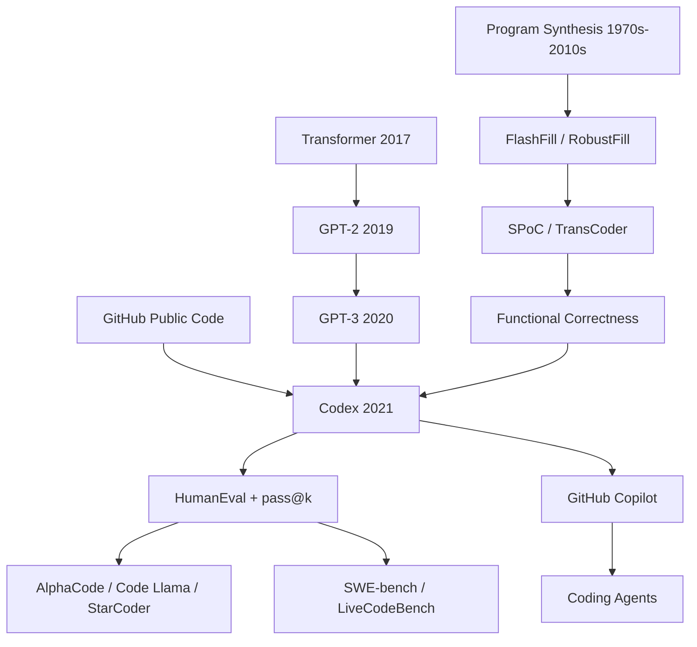

# Codex — 把大语言模型训练到会写代码

> **2021 年 7 月 7 日，Mark Chen、Jerry Tworek、Heewoo Jun、Qiming Yuan 等 58 位作者把 [arXiv:2107.03374](https://arxiv.org/abs/2107.03374) 上传到 arXiv。** 这篇论文没有发明新的 Transformer 层，也没有把语言模型包装成聊天机器人；它做的是一件更直接的事：把 GPT 在公开 GitHub 代码上微调，然后用 164 道手写 Python 题和单元测试问它“你写的程序能不能真的跑对”。结果很刺眼：GPT-3 在 HumanEval 上几乎为 0，GPT-J 为 11.4%，Codex-12B 单次采样达到 28.8%，100 次采样达到约 70%。一个月后，OpenAI Codex 进入 API private beta；更早一点，GitHub Copilot 已经把这种能力塞进 IDE。软件工程从“人写、机器补全”进入了“机器先写、人负责验证”的时代。

## 一句话总结

Chen 等 2021 年的 Codex 论文把 GPT-3（2020） 的“互联网文本 next-token prediction”推进到公开 GitHub 代码：先用交叉熵 $\mathcal{L}=-\sum_t \log p_\theta(x_t\mid x_{<t})$ 微调最多 12B 参数的 GPT，再用 HumanEval 的 164 道手写 Python 函数题和单元测试评估 functional correctness，并用 $\mathrm{pass@}k=\mathbb{E}[1-\binom{n-c}{k}/\binom{n}{k}]$ 衡量“多次采样中至少一次写对”的概率。它替代的不是某个复杂程序综合系统，而是三个当时真正能比的失败基线：GPT-3 近 0%，GPT-J-6B 11.4%，TabNine 2.6% pass@1；Codex-12B 单样本 28.8%，100 样本约 70%。这篇论文的隐藏 lesson 是：代码生成的突破不在“模型懂了程序语义”，而在“自然语言意图、开源代码语料、可执行测试”第一次闭环；后来的 InstructGPT（2022）、AlphaCode、Code Llama、SWE-bench 和 coding agent 都是在扩展这个闭环。

---

## 历史背景

### 代码生成在 2021 年前为什么像“演示”，不像“能力”

在 Codex 之前，机器写代码并不是空白领域。FlashFill 用输入输出例子合成字符串变换，DeepCoder 在小 DSL 里搜索程序，SPoC 从伪代码生成 C++，CodeBERT 和 CodeSearchNet 把自然语言与代码对齐到检索和理解任务上。问题在于，这些系统大多被困在三个边界里：语言受限、任务受限、评价受限。它们能在受控环境里展示漂亮样例，却很难回答一个工程师真正关心的问题：我给你一个自然语言意图，你能不能写出一段 Python，跑测试时真的正确？

2020 年的 GPT-3 让这个问题突然变得尖锐。GPT-3 没有专门训练成程序综合器，却已经能根据 docstring 写出短小函数的雏形。OpenAI 团队在 Codex 论文开头说得很清楚：GPT-3 的早期实验暴露出 rudimentary code generation 能力，因此他们假设“公开代码足够多，专门微调的 GPT 会擅长 coding tasks”。换句话说，Codex 不是从程序语言理论出发，而是从大语言模型的 scaling 经验出发：如果自然语言的统计规律可以被 next-token prediction 捕获，那么代码这种“高结构、高复用、强测试”的文本会不会更适合？

| 时间 | 事件 | 对 Codex 的意义 |
|------|------|----------------|
| 2017 | Transformer 发布 | GPT/Codex 的 decoder-only 骨架成为可能 |
| 2019 | GPT-2 展示大规模生成 | “一个模型覆盖多种文本任务”成为 OpenAI 主线 |
| 2020 | GPT-3 提出 few-shot scaling | Codex 直接继承 GPT-3 架构与 scaling 直觉 |
| 2021-06 | GitHub Copilot technical preview | 代码模型从论文评测提前进入 IDE 产品 |
| 2021-07 | Codex 论文上传 arXiv | HumanEval 和 pass@k 成为代码 LLM 的公共坐标 |

### 为什么是 OpenAI、GitHub 和 2021 年

Codex 诞生在一个很特殊的工业交叉点。OpenAI 有 GPT-3 的训练栈和大型 decoder-only 模型经验；GitHub 有全世界最大的公开代码生态；Microsoft Azure 提供训练基础设施；开发者社区已经接受“自动补全”是 IDE 的正常组成部分。把这些东西接起来，模型不再只是论文里的 program synthesis prototype，而是可以直接放到 VS Code 里建议下一行代码的生产系统。

论文作者块本身也能看出这不是一个普通 academic project：Mark Chen、Jerry Tworek、Heewoo Jun、Qiming Yuan 等 58 位作者来自 OpenAI，少数作者标注 Anthropic AI 或 Zipline affiliation，但工作在 OpenAI 完成。Acknowledgement 明确感谢 GitHub 合作构建 Copilot，感谢 Microsoft Azure 支持训练基础设施。这个语境很重要：Codex 论文既是研究论文，也是产品发布后的技术解释。它解释的不是“我们能不能在 benchmark 上刷分”，而是“为什么一个已经进入 IDE 的模型应该被这样评估、这样讨论风险”。

OpenAI 2021 年 8 月 10 日的 Codex 公告继续强化了这点。公告称 Codex 是 GPT-3 的 descendant，训练数据包含自然语言和来自公开来源的数十亿行代码；Codex 最擅长 Python，也能处理 JavaScript、Go、Perl、PHP、Ruby、Swift、TypeScript、Shell 等十多种语言；Python 上下文窗口约 14KB，而 GPT-3 只有 4KB。论文版本只集中评测 Python 函数合成，产品叙述却已经把它定位成“自然语言操控软件”的接口。研究与产品在这里第一次贴得非常近。

### HumanEval 为什么必须手写

Codex 最关键的历史动作不是模型训练，而是造了 HumanEval。论文强调，训练数据来自 GitHub 的大规模公开代码，其中已经包含大量竞赛题、面试题、教程和测试答案。如果直接用 LeetCode、Codeforces 或 APPS 的公开题，很难分清模型是在解决问题，还是在复述训练集中见过的解法。于是团队手写了 164 道 Python 函数题，每题包含函数签名、docstring、函数体占位和若干单元测试，平均 7.7 个测试。

这个设计把代码模型评测从“生成文本像不像答案”改成“生成程序能不能通过执行”。BLEU、exact match、CodeBLEU 这类指标会惩罚等价但写法不同的程序，也会奖励和参考答案相似但逻辑错误的程序。HumanEval 的选择更粗暴也更工程化：把候选代码放进沙箱跑测试，过了就是过了，没过就是没过。它不完美，因为测试覆盖有限；但它比字符串匹配更接近软件工程的真实反馈回路。

HumanEval 的另一个历史意义是把“多次尝试”合法化。传统 benchmark 往往追求一次输出的准确率，而程序员写代码本来就会运行、失败、修改、再运行。Codex 论文把这个事实编码进 pass@k：生成 $k$ 个样本，只要其中一个通过测试，就把这个问题视为解决。这一指标后来被 coding model 社区几乎完整继承。

## 研究背景与动机

### 研究问题：模型会补全代码，还是会解决任务

Codex 要回答的问题不是“语言模型能不能写出像代码的字符串”。GPT-3 已经能做到这件事。真正的问题是：当 prompt 是一个函数签名加 docstring，模型生成的函数体是否满足 docstring 中的语义约束？这一步把 code completion 与 program synthesis 分开。前者常常只需要局部语法和项目风格，后者必须把自然语言约束转成可执行行为。

论文选择 standalone Python functions，是一个保守但聪明的中间点。它避开了仓库依赖、文件系统状态、包版本、数据库、网络调用这些工程复杂度，同时保留了算法、简单数学、字符串处理、列表处理、边界条件等核心编程能力。这个任务足够窄，可以自动测试；又足够宽，能暴露模型是否真的把 docstring 里的约束绑定到了变量和操作上。

### 动机 1：从语料规模验证“代码也是语言”

训练侧的动机很直接：公开 GitHub 上有足够多代码，且代码本身带有自然语言注释、docstring、变量名、README、测试、提交痕迹。论文使用 2020 年 5 月抓取的 5400 万个公开 GitHub 仓库，先得到 179GB 小于 1MB 的 unique Python files，过滤自动生成文件、异常长行和低字母数字比例文件后保留 159GB。对一个 12B 模型来说，这已经足够让“Python 程序分布”成为可学习对象。

但 Codex 并不是简单把 GPT-3 的 tokenizer 原封不动搬过来。论文指出 GPT-3 文本 tokenizer 对代码低效，最大浪费来自空白字符；于是他们增加了表示不同长度 whitespace runs 的 token，使代码 token 数约减少 30%。这个细节常被忽略，却很能说明 Codex 的工程性质：如果缩进是 Python 语义的一部分，tokenizer 就不能把它当普通文本噪声。

### 动机 2：用测试把“生成”变成“搜索”

Codex 的另一个动机是把 stochastic decoding 转换成可验证搜索。单次采样不是终点；如果可以生成 100 个候选并运行单元测试，模型的输出空间就变成一个可搜索空间。论文在摘要中报告 Codex-12B 单样本解决 28.8%，100 样本解决 70.2%；正文表格中同一方向的 pass@100 数字达到 72.31%。这不是传统语言建模的胜利，而是“生成 + 过滤”的胜利。

这也解释了为什么论文花了很大篇幅讨论沙箱。运行模型生成的代码本身有风险：GitHub 上有恶意程序，生成程序也可能读写文件、访问网络或持久化状态。HumanEval 的公开仓库 README 至今仍把执行调用注释掉，要求用户先阅读“不要在没有 robust security sandbox 的情况下运行不可信代码”的警告。Codex 的 evaluation loop 从第一天就和安全工程绑在一起，而不是事后补丁。

### 动机 3：为 Copilot 时代建立公共语言

如果只看模型，Codex 是 GPT 微调；如果只看产品，它是 Copilot 背后的补全能力。但论文真正留下来的公共语言是三件事：HumanEval、pass@k、functional correctness。没有这三件事，AI 编程助手只能靠 demo 视频说服用户；有了它们，社区至少可以争论一个模型在相同任务、相同采样预算、相同测试标准下是否更强。

这套语言也暴露了自己的局限：164 道函数题无法代表软件工程，pass@k 可能鼓励暴力采样，单元测试可能被偶然通过。但历史上很多关键 benchmark 的价值并不在完美，而在让领域有第一个共同坐标。Codex/HumanEval 对代码模型的作用，正类似 ImageNet 对视觉、GLUE 对 NLP、MMLU 对通用知识的作用：它先把争论变成可测量的东西，然后再被后来者指出不够难、不够真实。

---

## 方法详解

### 整体框架：GPT 先学文本，再学代码，最后用测试裁判

Codex 的方法如果只写成一句话，会显得过分简单：拿 GPT 模型，在 GitHub Python 上继续做 next-token prediction，然后用 docstring prompt 让它补全函数体。它没有新的注意力机制，没有程序执行器，也没有显式 AST 搜索。论文的核心贡献在于把三件本来分开的东西接成闭环：大规模代码语料、随机采样、可执行单元测试。

训练目标仍是标准自回归语言建模。给定 token 序列 $x_1,\ldots,x_T$，模型最小化：

$$
\mathcal{L}_{\text{code}}(\theta)=-\sum_{t=1}^{T}\log p_\theta(x_t\mid x_{<t}).
$$

推理时，HumanEval prompt 由函数头和 docstring 组成，模型继续生成函数体，直到遇到停止序列（如新的 `def`、`class`、`print` 等）。每个候选样本被放入沙箱，用隐藏在题目里的单元测试执行。于是“生成代码”变成了一个 stochastic proposal generator，“单元测试”变成了 verifier。

| 模型/系统 | 训练或数据 | HumanEval pass@1 | HumanEval pass@100 | 论文中的角色 |
|-----------|------------|------------------|--------------------|--------------|
| GPT-3 | 通用自然语言 GPT | 近 0% | 近 0% | 证明通用语言模型不会自然会编程 |
| GPT-J-6B | The Pile，含约 8% GitHub | 约 11.4% | 约 27.7% | 开源代码暴露带来非零能力 |
| TabNine | 商业代码补全系统 | 2.6% | 7.6% | 工业 autocomplete baseline |
| Codex-300M | GitHub Python 微调 | 13.17% | 36.27% | 小模型已超过 GPT-J/TabNine |
| Codex-12B | GitHub Python 微调 | 28.81% | 72.31% | 主结果，证明 code fine-tuning + sampling 有效 |

### 设计 1：GitHub Python 微调，把“代码分布”从自然语言里拆出来

Codex 的第一层设计是数据。论文从 2020 年 5 月的 5400 万个公开 GitHub 仓库中收集 Python 文件：只保留小于 1MB 的 unique files，先得到 179GB；再过滤明显自动生成文件、平均行长大于 100、最大行长大于 1000、字母数字字符比例过低的文件，得到 159GB。这个过滤不是为了得到“完美代码”，而是为了让模型主要看到人类开发者会读写的 Python。

这种 fine-tuning 与从零训练 code model 不同。GPT 预训练阶段已经学到英语、Markdown、网页、数学符号、JSON、命令行片段、少量代码等混合表示；Codex 只是把概率质量重新压到“代码跟随自然语言意图”的区域。用条件概率写，就是把一个通用模型 $p_{\theta_0}(x_t\mid x_{<t})$ 调成更偏向代码的 $p_{\theta_c}(x_t\mid x_{<t}, \text{Python/GitHub})$。

这个选择的隐藏收益是 prompt interface 不需要重新设计。用户可以写英文 docstring，模型继续生成 Python；IDE 可以给上文代码，模型继续补全下文；API 可以传入“解释这段代码”或“把这段代码改成 TypeScript”。自然语言和代码在同一 token 序列里出现，是 GPT 系列的弱约束，也是 Codex 成为产品而不是窄程序综合器的原因。

### 设计 2：代码 tokenizer 的 30% 压缩，保护上下文预算

论文最工程但最关键的改动之一，是给 tokenizer 增加 whitespace-run token。Python 的缩进不是排版，而是语法；同时代码里连续空格和换行比自然语言多得多。GPT-3 的文本 tokenizer 会把空白拆得很碎，使同样 4KB 或 14KB 上下文里能放下的代码更少。Codex 通过额外 token 表示不同长度的空白序列，让代码大约少用 30% token。

这看起来像低层细节，但对代码模型意义很大。代码任务常常需要同时看到函数签名、docstring、前置 helper、局部变量命名、import 和缩进层级。少 30% token 等价于多看一大段上下文，尤其在 2021 年上下文窗口还很短时。这也解释了 OpenAI 公告为什么强调 Codex 在 Python 上有约 14KB memory，而 GPT-3 只有 4KB：代码助手的体验并不只由模型参数决定，也由它能装进多少上下文决定。

| 组件 | 普通 GPT 文本建模 | Codex 的调整 | 为什么重要 |
|------|------------------|--------------|------------|
| 数据 | 大规模网页/书籍/混合文本 | 159GB 过滤后 GitHub Python | 把概率质量推向可执行代码 |
| Tokenizer | 面向自然语言片段 | 增加 whitespace-run tokens | 代码 token 数约减少 30% |
| Prompt | 任意文本续写 | 函数头 + docstring + body | 把自然语言意图变成条件生成 |
| Stop rule | 生成到长度上限 | 遇到 `def/class/print` 等停 | 防止模型继续生成额外函数 |

### 设计 3：HumanEval + pass@k，把代码生成评估改成可执行概率

Codex 最长寿的设计不是模型，而是评估。HumanEval 每题给一个 Python 函数 prompt，模型生成 completion，测试框架运行若干断言。对每个任务，论文生成 $n=200$ 个样本，记其中通过测试的样本数为 $c$，然后用无偏估计器计算 pass@k：

$$
\mathrm{pass@}k = \mathbb{E}_{\text{Problems}}\left[1-\frac{\binom{n-c}{k}}{\binom{n}{k}}\right].
$$

这个公式的意义比表面大。它不是简单的 $1-(1-\hat p)^k$，因为后者用有限样本估计时有偏；论文专门给出数值稳定实现，避免组合数溢出。更重要的是，pass@k 把“多次采样”作为正式预算：k 越大，模型可以用更高 temperature 获取多样性；只要一个样本正确，任务就算解决。

```python
import numpy as np

def estimate_pass_at_k(num_samples, num_correct, k):
    if num_samples - num_correct < k:
        return 1.0
    return 1.0 - np.prod(1.0 - k / np.arange(num_samples - num_correct + 1, num_samples + 1))

# In Codex-style evaluation, run this per task, then average across tasks.
```

这段评估代码改变了社区直觉。对自然语言生成来说，多样本采样往往被看成“刷分”；对代码生成来说，只要有测试，采样就是搜索。Codex 证明 temperature 也应随 k 改变：679M 模型在 pass@1 上最优温度约 $T^*=0.2$，pass@100 上最优温度约 $T^*=0.8$。低温负责高置信单样本，高温负责覆盖更多程序空间。

### 设计 4：Codex-S 与样本排序，把“模型输出”变成候选集合

基础 Codex 只在 GitHub 文件分布上微调，而 HumanEval 要求“从 docstring 合成 standalone function”。论文因此又构造了更贴近任务的训练问题，过滤出 Codex-12B 本身能用 100 个样本解决且测试稳定的题，再在这些 standalone functions 上继续监督微调，得到 Codex-S。这个设计看起来有点递归：先用模型帮忙筛数据，再训练更贴近评测分布的模型。

Codex-S 的收益清楚：论文图注报告，Codex-S 单样本解决 37.7%，高于 Codex-12B 的 28.8%；如果从 100 个样本中选通过单元测试的样本，可达 77.5%。即使没有隐藏测试可以直接过滤，平均 token log-probability 也能帮助在多个样本中排序。论文发现 mean log-prob ranking 优于随机选择，而 sum log-prob 可能因为偏好短答案而更差。

这透露出 Codex 后来影响 coding agent 的核心思想：模型一次输出不是最终答案，而是一批候选、一个搜索前沿、一个可以被测试、排序、回译、人工审阅的对象。Codex-S、Codex-D、mean log-prob ranking、unit-test filtering 都是在 2021 年尝试给这个前沿加 verifier。

### 为什么这个方法看起来简单，却改变了领域

Codex 没有把程序当成 AST、类型推导或符号搜索问题，而是把程序当成一种可以条件生成的文本；同时它又没有把代码评估停留在文本相似度，而是回到执行和测试。这个组合很反直觉：训练时完全是语言建模，评估时完全是软件工程。两端的不一致正是它的力量。

从方法论上看，Codex 给后来的代码 LLM 留下了四条路线。第一，继续扩大 code pretraining 数据与模型规模。第二，把评估从 HumanEval 扩到 APPS、MBPP、LiveCodeBench、SWE-bench。第三，把 verifier 从单元测试扩到编译器、静态分析、CI、用户反馈和 reward model。第四，把一次补全扩成 agent loop：生成、运行、观察错误、修改、再运行。今天看 Codex，最重要的不是 12B 参数本身，而是这条闭环第一次被清楚地写进论文。

---

## 失败案例

### 失败 1：GPT-3 会“像程序”，但几乎不会“过测试”

Codex 最有说服力的 baseline 是 GPT-3。因为 Codex 本质上就是 GPT 微调，如果 GPT-3 已经能在 HumanEval 上表现不错，那么“代码微调”就只是锦上添花。论文结果恰好相反：所有 comparable GPT models 在 HumanEval 上接近 0%。这不是因为 GPT-3 完全看不懂 Python；它能写出语法上像函数的片段，也能补出常见模式。但 HumanEval 要求的是边界条件、变量绑定、返回值、空列表、大小写、递归、排序、数学约束这些可执行语义。GPT-3 的文本能力在这里被测试剥掉了包装。

这个失败很重要，因为它纠正了一个早期误解：代码生成不是“把自然语言模型稍微 prompt 一下”就能得到的附属能力。公开代码语料、tokenizer、上下文窗口、采样策略、测试评估都必须参与进来。Codex 的 28.8% pass@1 之所以震撼，正是因为 GPT-3 的 near 0% 把起点压得很低。

### 失败 2：BLEU/字符串匹配会奖励错误的相似性

另一个失败 baseline 是评价指标本身。代码有一个自然语言没有的特殊性质：大量程序可以功能等价但文本不同，文本相似的程序也可能因为一个边界条件完全错误。论文对 Codex-12B 在 HumanEval 上的样本计算 BLEU，发现正确与错误解法的 BLEU 分布高度重叠，因此 BLEU 的提升并不等价于 functional correctness 的提升。

这件事后来变成代码 LLM 评测的基本常识，但在 2021 年并不显然。NLP 社区长期习惯 BLEU、ROUGE、exact match；代码领域也有 CodeBLEU 这样的结构化相似度指标。Codex 论文把评价重心推向执行：如果两个程序都过测试，文本差异不重要；如果一个程序看起来像参考答案但测试失败，文本相似度不应该拯救它。

### 失败 3：商业 autocomplete 不是 program synthesis

TabNine baseline 也很有历史味道。TabNine 是当时成熟的商业代码补全系统，但在 HumanEval 上只有 2.6% pass@1、7.6% pass@100，大致相当于 Codex-12M 这种极小模型。它说明 IDE autocomplete 与从 docstring 合成函数不是同一个任务。Autocomplete 擅长局部统计：变量名、常见 API、下一行 boilerplate；HumanEval 要求全局约束和函数级正确性。

这并不是说 autocomplete 不重要，而是说 Copilot/Codex 改变了产品边界。传统补全是在开发者已经知道要写什么时减少敲字；Codex 开始承担“根据意图提出完整实现”的角色。这个角色变化带来了生产力，也带来 over-reliance：用户可能把看似正确的完整函数当成答案，而不是把它当成需要测试和审查的候选。

### 失败 4：弱测试和公开题库会把 benchmark 变成记忆游戏

Codex 论文也隐含批评了很多早期代码 benchmark。APPS、Codeforces、LeetCode、GitHub 上的公开题目都很有价值，但对一个在大量公开代码上训练的模型来说，它们容易污染。论文提到 Codeforces 问题已有十多个公开仓库包含解答；这正是 HumanEval 必须手写的原因。

更微妙的是弱测试问题。如果测试覆盖不足，模型可以写出通过测试但语义错误的程序。论文在相关工作里提到 generate-and-validate patch generation 中的经典问题：算法可能通过删除失败功能来通过弱测试。Codex 没有彻底解决这个问题，只是把它显性化了。后来 SWE-bench、LiveCodeBench、private tests、CI-based evaluation 都是在扩大这个问题的测试面。

| Baseline / 失败对象 | 表面上看起来能做什么 | HumanEval 或论文结论 | 暴露的问题 |
|---------------------|----------------------|----------------------|------------|
| GPT-3 | 能根据 docstring 写像样代码 | comparable GPT models 近 0% | 文本生成不等于可执行正确性 |
| BLEU / exact match | 衡量与参考答案相似度 | 正确/错误样本 BLEU 分布重叠 | 字符串相似度不等于功能等价 |
| TabNine | 成熟 IDE autocomplete | 2.6% pass@1, 7.6% pass@100 | 局部补全不等于函数综合 |
| 公开竞赛题弱测试 | 题量大、看起来真实 | 可能污染或被弱测试钻空子 | benchmark 需要手写/更新/隐藏测试 |

## 实验关键数据

### HumanEval 主结果：微调和采样各贡献一半故事

HumanEval 的主表给了最清楚的尺度。Codex-300M 已经达到 13.17% pass@1，接近 GPT-J-6B 的 11.4%；Codex-2.5B 到 21.36%；Codex-12B 到 28.81%。如果看 pass@100，差距更大：Codex-12B 达到 72.31%。摘要中用更保守的表述说 100 samples per problem 可解决 70.2%。两者都指向同一个结论：code fine-tuning 让单样本从 0 变成可用，多样本采样让模型从“偶尔写对”变成“多数题至少能写出一个对的”。

| 模型 | 参数规模 | pass@1 | pass@10 | pass@100 | 关键解读 |
|------|----------|--------|---------|----------|----------|
| Codex-300M | 300M | 13.17% | 20.37% | 36.27% | 小模型已能超过 GPT-J pass@1 |
| Codex-2.5B | 2.5B | 21.36% | 35.42% | 59.50% | 规模提升带来平滑收益 |
| Codex-12B | 12B | 28.81% | 46.81% | 72.31% | 主模型，多样本收益最大 |
| Codex-S-12B | 12B + supervised functions | 37.7% | 未作为主表列出 | 77.5% with unit-test selection | 更贴近任务分布的微调有效 |
| GPT-J-6B | 6B | 约 11.4% | 未作为主表列出 | 约 27.7% | The Pile 中代码暴露不足以追上 Codex |

### APPS 结果：从函数合成到竞赛编程会立刻掉档

APPS 是更难的竞赛编程数据集，包含 5000 个训练题和 5000 个测试题，题目通常要求完整程序从 stdin 读入、向 stdout 输出，而不是写一个 standalone function。Codex 论文没有在 APPS 上 fine-tune，而是做了 1-shot 格式提示，并采样最多 1000 个解法；还利用题目公开的 3 个 input/output examples 做过滤。

结果很有启发性：Codex-12B 在 introductory 难度上 raw pass@1000 约 25.02%，filtered pass@1 约 22.78%；但在 competition 难度上 raw pass@1000 只有 3.23%，filtered pass@1 约 3.04%。这说明 Codex 不是“会编程”的通用体，而是很擅长短函数 synthesis；一旦要求复杂算法、输入输出协议、效率和隐藏测试，能力马上收缩。

| APPS 设置 | Introductory | Interview | Competition | 关键解读 |
|-----------|--------------|-----------|-------------|----------|
| GPT-Neo 2.7B raw pass@1 | 3.90% | 0.57% | 0.00% | APPS 论文中的基线很弱 |
| 1-shot Codex raw pass@1 | 4.14% | 0.14% | 0.02% | 单样本几乎无法处理难题 |
| 1-shot Codex raw pass@1000 | 25.02% | 3.70% | 3.23% | 大采样能补一些搜索深度 |
| 1-shot Codex filtered pass@1 | 22.78% | 2.64% | 3.04% | 公开样例过滤显著提升实用选择 |

### 失败模式数据：长链操作和变量绑定是硬伤

论文的 limitation section 很坦率。第一，Codex 训练极不 sample efficient：它看过数以亿行计的代码，但强学生上完入门课后应能解出比 Codex-12B 更大比例的 HumanEval 题。第二，在合成的 chained docstring 任务中，每多一个基础操作，pass rate 大约下降 2 到 3 倍。第三，模型会把操作绑定到错误变量上，尤其当 docstring 里变量和操作数量都增加时。

这些失败今天看仍然熟悉。代码 LLM 往往能写出局部合理的片段，却在长约束、状态更新、变量对应关系、边界条件上崩掉。Codex 把问题说得很早：这不是语法失败，而是 specification binding 失败。模型可以生成“像正确解”的程序，但没有稳定的内部机制保证每条自然语言约束都被执行。

### 安全与部署数据：评测本身就是风险模型

Codex 论文没有把安全放在附录边角，而是把它作为部署 code generation 的核心问题。HumanEval harness 要运行不可信代码，因此论文设计 sandbox，目标是防止生成程序修改环境、获得持久化、访问敏感资源或泄露数据。公开仓库 README 也强烈建议不要在没有 robust sandbox 的情况下运行模型生成代码，并故意注释掉 execution call。

更广的安全讨论包括 over-reliance、automation bias、不安全代码建议、恶意使用、能耗和法律问题。论文谨慎地说，在当时能力水平下 Codex 不会显著降低 malware development 门槛，但仍可能生成可嵌入更复杂系统的恶意组件，也经常使用不安全的 cryptographic configurations。这个姿态影响了后来的代码助手评估：评测不仅要问“会不会写”，还要问“会不会让用户误信、会不会执行危险副作用、会不会复制或生成不该生成的代码”。

---

## 思想史脉络

### 前世：从程序综合到“代码也是互联网文本”

Codex 的祖先有两条线。第一条是程序综合：Manna & Waldinger 的自动程序构造、FlashFill 的例子驱动合成、RobustFill、DeepCoder、SPoC，都相信“程序应该被搜索或构造出来”。这条线的强项是可验证、可约束、可解释；弱点是语言和任务空间窄，难以直接吃掉 GitHub 那种混乱但巨大的真实代码分布。

第二条是大语言模型：Transformer、GPT-2、GPT-3 证明 next-token prediction 能把大规模文本压进一个生成模型。Codex 的关键跳跃在于把代码放到第二条线里，同时把第一条线的执行验证接回来。它没有放弃 neural generation，也没有放弃 correctness；它把二者用 HumanEval/pass@k 绑在一起。



### 今生：Codex 之后，代码模型沿三条路线扩散

第一条路线是模型和数据的开放化。Codex 本身没有公开权重，也没有公开训练数据；HumanEval 开源了，模型没有。后来的 CodeGen、SantaCoder、StarCoder、Code Llama、DeepSeek-Coder 把“公开代码预训练 + 代码指令/填空/补全”做成开放生态。Codex 证明路线可行，后继者把路线从 OpenAI API 里搬出来。

第二条路线是竞赛和执行搜索。AlphaCode 把“多样本生成 + 过滤”推到 Codeforces 风格竞赛题，采样数量从 100 级别扩到更大的候选池，并用聚类、过滤、测试去选答案。这里的思想非常 Codex：模型不是一次给答案，而是给一堆可能程序，评测器和选择器决定最终提交。

第三条路线是仓库级 agent。HumanEval 的函数很短，不涉及 repo state；真实软件工程要读 issue、定位文件、改多个模块、跑测试、处理失败日志。SWE-bench、RepoBench、CodeRepair、各类 coding agent 把 Codex 的 loop 扩到“生成 patch + 执行测试 + 迭代修改”。今天的 agent 不再只是 completion model，但它的最小闭环仍然是 Codex 式的：intent -> code -> execution feedback -> selection/update。

| 后继方向 | 代表工作/系统 | 继承 Codex 的部分 | 变异点 |
|----------|---------------|------------------|--------|
| 开放代码 LLM | StarCoder / Code Llama / DeepSeek-Coder | GitHub-scale code pretraining | 更重视开放数据、license、infilling 和 instruction |
| 竞赛编程 | AlphaCode | 多样本生成 + 过滤 | 更大采样池、更复杂算法题 |
| 评测升级 | MBPP / LiveCodeBench / SWE-bench | functional correctness | 从短函数扩到新题、真实 issue、CI |
| 产品化助手 | Copilot / Cursor / coding agents | IDE 内自然语言到代码 | 从补全扩到多文件编辑和工具调用 |
| 安全治理 | sandbox / insecure-code evals | 运行不可信代码必须隔离 | 加入供应链、许可证、隐私和安全策略 |

### 误读：Codex 不是“程序员被替代”的论文

最常见的误读是把 Codex 看成“AI 会写代码，所以程序员要消失”。论文自己的数据恰好反驳了这个说法。Codex-12B 单样本只有 28.8%，APPS competition raw pass@1000 也只有 3.23%；长链 docstring 每增加一步通过率就掉 2 到 3 倍；模型会把操作绑定到错误变量，还会生成不安全配置。Codex 证明的是“模型可以提出候选程序”，不是“模型可以承担软件工程责任”。

第二个误读是把 pass@k 当成真实性能。pass@100 或 pass@1000 是在有 verifier 的场景下才有意义；没有单元测试、没有隐藏测试、没有人工审查，多样本采样只会产生更多看似合理的错误。Codex 的真正 lesson 是“生成和验证必须一起设计”。只拿生成端炫耀，等于把论文最重要的一半拿掉。

第三个误读是把 HumanEval 当作永久标准。HumanEval 的历史价值很大，但 164 道手写题很快被模型和 prompt 工程摸透，也容易成为训练污染目标。它是共同坐标，不是终点。后来的 LiveCodeBench 和 SWE-bench 正是在修正 HumanEval 太短、太静态、太函数级的问题。

### 思想史位置：把 AI 编程从 NLP 分支变成软件工程问题

Codex 的思想史位置很特殊。它站在 GPT-3 之后、Copilot 之前/之中；它一只脚在 NLP scaling，另一只脚在软件工程的测试文化。论文最持久的影响不是某个 architecture trick，而是把 code LLM 的评价从“语言模型分支”拉回“程序必须执行正确”的工程问题。

如果用一句话概括这条脉络：Codex 把程序生成从“模型能不能写出像代码的文本”改写成“模型能不能在可执行反馈下搜索到正确程序”。这就是为什么它同时影响了 benchmark、产品、agent、安全和开源社区。它不是最后答案，但它是后面几乎所有答案都必须回应的起点。

---

## 当代视角

### 2026 年回看：哪些判断站住了

Codex 最经得起时间检验的判断，是 functional correctness 会成为代码模型评测的中心。2021 年之后，几乎所有严肃代码生成 benchmark 都绕不开执行、测试、编译或 CI：MBPP 继续短函数评测，APPS/CodeContests 推向竞赛题，SWE-bench 推向真实 GitHub issue，LiveCodeBench 用持续更新减少污染。它们都在回应同一个问题：模型写的东西能不能在某个可执行标准下成立？

第二个站住的判断是 sampling matters。AlphaCode、后来的 coding agents、self-repair、test-time compute、pass@k 曲线，都把多次尝试看成能力的一部分。对代码来说，这不是作弊，而是接近开发过程：写一个候选、运行、看错、换一个候选。Codex 没有显式 agent loop，但它已经把“候选集合 + verifier”作为评测对象。

第三个站住的判断是安全与产品体验不可分。HumanEval README 的 sandbox 警告看起来像评测细节，其实是所有代码助手的原罪：一旦模型输出能被执行，错误和恶意就会直接作用到用户机器、依赖供应链、数据和生产系统。今天的 IDE agent、terminal agent、CI agent 都在重新面对这条警告。

### 站不住的假设：HumanEval 能长期代表编程能力

最站不住的假设，是 HumanEval 这样的短函数集足以代表编程能力。它在 2021 年非常必要，因为领域需要第一个公共坐标；但到 2026 年，HumanEval 已经太小、太静态、太容易被训练污染，也太容易被 prompt engineering 和样例记忆打穿。一个模型可以 HumanEval 很高，却不会改真实仓库、不会读报错、不会处理依赖冲突、不会理解架构边界。

第二个需要修正的假设，是 pass@k 能直接转化成用户价值。pass@100 在有隐藏测试时有意义；但真实用户常常没有完整测试，或者测试本身就是错的。多样本采样可能带来更多候选，也可能带来更多看似合理的安全漏洞、许可证风险和维护负担。今天的代码助手必须把“生成更多”转成“验证更好”，否则 pass@k 只是算力堆出来的幻觉。

第三个假设是“模型越大，alignment 会自然变好”。Codex 论文反而已经看到相反迹象：更大模型可能更会模仿 prompt 中的 bug，automation bias 也会随能力提升而更危险。2026 年的 agent 时代进一步说明，能力越强的代码模型越需要边界、审计、权限控制和可回滚机制。

| 2021 年隐含假设 | 2026 年状态 | 为什么需要修正 |
|----------------|-------------|----------------|
| HumanEval 可代表代码能力 | 只代表短函数 synthesis | 真实工程有仓库状态、依赖、CI、多人协作 |
| pass@k 越高越好 | 需要 verifier 和成本约束 | 无测试时多样本会放大错误候选 |
| Copilot 只是 autocomplete | 已扩展为 agentic coding | 工具调用和多文件修改扩大风险面 |
| 开源代码可直接当训练语料 | 需要许可证/隐私/治理 | 数据权属与生成相似代码争议持续存在 |
| 安全可以靠用户小心 | 需要系统级 guardrails | 用户会受 automation bias 影响 |

### 如果今天重写这篇论文

如果 2026 年重写 Codex，第一件事会是把 HumanEval 扩展成多层评测，而不是单一 benchmark。短函数仍然保留，用于快速 sanity check；再加 live problems 防污染，repo-level issue 修复测工程能力，security tasks 测危险行为，license/memorization probes 测数据风险，human-in-the-loop studies 测开发者如何实际使用建议。

第二件事会是把 verifier 写成系统的一部分。2021 年的 Codex 论文把模型和评测分开：模型生成，外部测试评估。今天更自然的写法是“生成器 + 执行器 + 选择器 + 修复器 + 权限控制”的完整系统。一个现代 Codex 论文会报告 token cost、wall-clock latency、test budget、flake rate、sandbox escape risk、CI failure categories，而不只报告 pass@1/pass@100。

第三件事会是更严肃地处理数据透明度。Codex 的训练数据来自公开 GitHub，但具体数据未发布，模型权重未公开。后来的 StarCoder/BigCode 显示，代码模型需要更细的治理：license filtering、opt-out、PII removal、dataset documentation、near-duplicate analysis。今天这已经不是附属伦理段落，而是代码模型能否被广泛信任的基础设施。

### 从 Codex 到 coding agent：真正改变的是责任边界

Codex 让模型开始写函数；coding agent 让模型开始改项目。这听起来只是规模扩大，实际上是责任边界改变。函数补全错了，用户可以看一眼；多文件 patch 错了，可能引入隐性回归、破坏安全策略、绕过架构约定，甚至在 terminal 里执行危险命令。Codex 的 sandbox 警告在 agent 时代变成权限模型：模型能读什么、改什么、运行什么、联网到哪里、何时需要人类确认。

因此，Codex 的现代意义不是“AI 会写代码了”，而是“代码生成成为一种需要工程治理的基础能力”。它把模型能力、评测标准、产品入口和风险模型第一次放在同一张桌上。后来的所有系统，无论开源 code LLM、Copilot 类助手还是自主 coding agent，都在扩展这张桌子。

## 局限与展望

### 论文自身的局限

Codex 论文最大局限是评测范围窄。HumanEval 的 164 题都是短 Python 函数，不覆盖大型项目、外部依赖、性能约束、并发、数据库、UI、云 API、构建系统和长期维护。APPS 结果已经显示，一旦转向竞赛编程和完整程序，能力迅速下降。论文虽然承认 coding 是 broad activity，但主结果仍然容易被读者误解成“编程能力”的代表。

第二个局限是模型和数据不可复现。HumanEval 开源，但 Codex 权重、训练数据、过滤细节和产品版本都不可复现。论文说 production version distinct from research Codex powers GitHub Copilot，这意味着公开评测模型与用户实际接触模型之间还有一层产品差异。对学术理解来说，这很正常；对社会影响和法律争议来说，这留下了空白。

第三个局限是测试本身不等于 correctness。HumanEval 平均 7.7 个测试，只能覆盖有限路径。一个程序通过测试，不代表满足完整 specification；一个程序失败，也可能只是因测试假设不清。Codex 论文开启了 functional correctness 方向，但没有解决 specification completeness 问题。

### 未来展望：代码模型会更像工程系统，而不是单模型

未来的代码生成研究会越来越不像“训练一个模型”，更像“搭一个工程系统”。模型负责提出候选；retrieval 负责找到仓库上下文；parser 和 type checker 负责结构约束；unit tests 和 integration tests 负责执行反馈；static analyzers 和 security scanners 负责风险；human review 负责意图和责任。Codex 是这个系统的生成端原型。

更远一点，代码模型的价值可能不在“少写几行代码”，而在把自然语言需求快速落成可运行 artifact：脚本、测试、数据分析、微服务、迁移 patch、实验 pipeline。风险也同样随之扩大：越接近生产系统，越不能只用 pass@k 衡量。真正的指标会变成 maintainability、security, latency, cost, review burden, rollback safety 和 team workflow fit。

## 相关工作与启发

### 相关工作：Codex 连接了两批文献

第一批是 code intelligence 文献：CodeBERT、CodeSearchNet、CodeXGLUE、TransCoder、SPoC、APPS。这些工作已经证明代码和自然语言可以联合建模，或者 functional correctness 比 exact match 更有意义。Codex 把它们推到 GPT scale，并通过 Copilot 产品化让问题进入主流视野。

第二批是 LLM scaling 与 alignment 文献：GPT-2、GPT-3、scaling laws、learning from human feedback、InstructGPT。Codex 继承了 scaling 的能力，又提前暴露了 alignment 的代码版本：模型会模仿 bug、会建议不安全代码、会让用户过度依赖。这个连接解释了为什么代码模型后来同时属于 NLP、PL、SE、安全和 HCI 社区。

### 启发：写代码模型论文时要同时写 verifier

Codex 给后来的研究者一个很实用的启发：不要只报告生成器。代码任务天然有执行反馈，论文应该同时说明 verifier 是什么、测试覆盖如何、采样预算多少、失败如何分类、安全边界在哪里。否则一个漂亮的 pass@1 数字很难转化成真实工程价值。

另一个启发是 benchmark 要能随时间更新。HumanEval 的成功也带来它的过度使用；一旦 benchmark 被反复训练、提示、泄露，它就从“能力测量”变成“文化常识”。LiveCodeBench 这种持续更新任务，SWE-bench 这种真实 issue 任务，都是对 Codex 成功后的副作用做修正。

## 相关资源

### Primary materials

| 类型 | 名称 | 链接 |
|------|------|------|
| 论文 | Evaluating Large Language Models Trained on Code | https://arxiv.org/abs/2107.03374 |
| 代码/数据 | HumanEval evaluation harness | https://github.com/openai/human-eval |
| 产品公告 | OpenAI Codex announcement | https://openai.com/index/openai-codex/ |
| 后继评测 | SWE-bench | https://www.swebench.com/ |
| 后继评测 | LiveCodeBench | https://livecodebench.github.io/ |

这些资源最好一起读：arXiv 论文解释模型和评测；HumanEval README 暴露执行不可信代码的安全边界；OpenAI 公告说明 Codex 如何被产品化；SWE-bench 和 LiveCodeBench 则展示 2021 年那套短函数评测如何被 2024 年后的仓库级、动态题评测替代。


---

> 🌐 [English version](/en/era4_foundation_models/2021_codex/) · 📚 awesome-papers project · CC-BY-NC