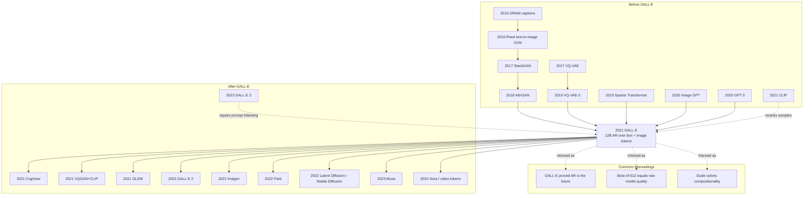

# DALL-E — 把图像生成改写成语言模型问题

> **2021 年 1 月 5 日，OpenAI 先在博客发布 [DALL·E](https://openai.com/index/dall-e/)，随后在 2 月 24 日把论文 [arXiv:2102.12092](https://arxiv.org/abs/2102.12092) 放上 arXiv。** 这不是今天意义上的“最会画图”的模型：它的 256×256 图像会糊，组合关系会错，漂亮样例还要从 512 张候选里用 CLIP 挑出来。但它第一次把文生图说成一个极其简单、也极其昂贵的问题：把文字和图像都离散成 token，交给一个 12B 自回归 Transformer 续写。DALL·E 1 的历史地位正在这里：它不是扩散时代的赢家，而是让整个行业相信“图像也可以被语言模型化”的那次公开点火。

## 一句话总结

Ramesh、Pavlov、Goh、Gray 等 8 位作者在 ICML 2021 的 DALL-E 论文，把 text-to-image 从“为 MS-COCO/CUB 设计 GAN 结构、辅助损失和额外标注”改写为一个 GPT 式序列建模问题：先用 dVAE 把 $256\times256$ 图像压成 $32\times32=1024$ 个离散视觉 token（8192 词表），再把最多 256 个 BPE 文本 token 与图像 token 拼成 1280 长度序列，用 12B sparse Transformer 最大化 $p_\psi(y,z)=\prod_t p(s_t\mid s_{<t})$。它没有在每个数据集上训练，却在 MS-COCO 人评中让样本相对 DF-GAN 以 90.0% 获选“更真实”、93.3% 获选“更匹配文本”；同时在 CUB 上落后最强专用模型近 40 FID 点，清楚暴露了“规模可以给通用性，但专业分布仍要适配”的边界。

DALL-E 1 后来很快被 GLIDE、DALL-E 2、Imagen 和 Stable Diffusion（2022） 的扩散路线压过，但它和同日发布的 CLIP（2021） 共同完成了范式切换：CLIP 证明图像可以用语言监督识别，DALL-E 证明图像可以被语言模型生成。最反直觉的 lesson 是，DALL-E 真正留下的不是 12B 自回归采样器，而是“先把视觉世界离散成可预测 token，再让语言控制视觉”的接口；后来的 VQGAN、Parti、Muse、VQ-Diffusion、DALL-E 3 乃至视频 token 化，都在反复继承或修正这个接口。

---

## 历史背景

### 2020 年前的文生图为何像专用小模型工程

DALL-E 出现前，text-to-image generation 不是一个“基础模型”问题，而更像一个小数据集上的视觉合成工程。典型论文会围绕 MS-COCO、CUB-200 或 Oxford Flowers 做模型设计：caption 先由 RNN/attention 编码成向量，再喂给多尺度 GAN；为了让结果不崩，还要加 object part label、segmentation mask、text-image matching loss、attention map、dynamic memory 或额外判别器。StackGAN 先画 64×64 再超分到 256×256，AttnGAN 用词级 attention 改善局部细节，DM-GAN 用 memory module 修补文本信息，DF-GAN 用 deep fusion 简化结构。每一步都在往“更像这个 benchmark”的方向调。

这条路线的核心问题不是 GAN 不够聪明，而是任务定义太窄：模型学到的是“MS-COCO caption 的句式 + COCO 对象分布 + 论文作者设计的若干辅助损失”。一旦 prompt 写成“a tapir made of accordion”或“an armchair in the shape of an avocado”，它就没有明确的训练支点。更糟的是，GAN 时代的成功样例往往依赖人工挑图；看上去像开放式创作，实际上是固定数据集上的条件分布拟合。DALL-E 的反击点很直接：如果小模型需要那么多手工假设，也许真正缺的是规模和通用序列建模，而不是第 N 个 GAN 模块。

### GPT-3 与 Image GPT 给 OpenAI 的错误启发

2020 年 OpenAI 已经被 GPT-3 改变了思维方式。GPT-3 的 175B 参数模型展示了一个强烈信号：当模型、数据和上下文长度足够大时，任务不一定要重新定义成 supervised head；很多能力可以通过 prompt 从同一个语言模型里“冒出来”。同年 Image GPT 又把这个想法搬到像素：把 32×32 图像当成像素 token 序列，训练 GPT-2 风格 Transformer。Image GPT 的生成质量并不漂亮，却证明“视觉也可以序列化”不是空话。

DALL-E 正是从这两个项目之间长出来的。它继承 GPT-3 的 scaling 信念，也继承 Image GPT 的“图像是 token 序列”假设，但避开了 Image GPT 的致命上下文长度问题：不直接预测 256×256×3 个像素，而是先用 dVAE 把图像压成 1024 个视觉 token。这样，视觉生成就能被放进 1280 token 的上下文里：最多 256 个文本 token 加 1024 个图像 token。DALL-E 并没有发明 Transformer，也没有发明离散视觉码本；它的历史贡献是把这些组件组合成一个让人一眼能看懂的命题：**文生图可以是语言模型续写。**

### DALL-E 与 CLIP 同日发布的分工

2021 年 1 月 5 日，OpenAI 同时发布 DALL-E 和 CLIP。事后看，这像一次有意安排的双响：DALL-E 负责“生成”，CLIP 负责“判断”。DALL-E 博客中的互动样例并不是每个 prompt 只采一张图，而是从 512 张候选里用 CLIP 重新排序后展示前 32 张。换句话说，早期 DALL-E 的惊艳效果已经依赖一个独立的图文匹配模型做搜索。

这也解释了后来两条线的命运。DALL-E 1 作为生成器很快被扩散模型超越，因为自回归逐 token 采样又慢又容易累积局部错误；CLIP 作为判别式对齐器却变成了整个生成式视觉生态的基础组件：DALL-E 2 用 CLIP latent，Stable Diffusion 早期使用 CLIP text encoder，VQGAN+CLIP 社区实验直接把 CLIP 当作外部审美和语义梯度。DALL-E 的故事因此有点反讽：它证明了“语言能控制图像”，但真正把这句话变成通用接口的，常常是同一天发布的 CLIP。

## 研究背景与动机

### 目标：把图像生成改写成语言模型问题

论文的动机可以压成一个矛盾：传统文生图为了在固定数据集上提高 fidelity，不断引入结构假设；但开放式文本提示要求模型理解世界知识、属性绑定、风格、位置、材料、文字和隐含背景细节，这些东西很难靠专用结构枚举。DALL-E 选择把“结构设计”换成“统一建模”：图像先离散化，文本也离散化，然后在一个 Transformer 里学习二者的联合分布。

这个目标不是“让 MS-COCO FID 最低”。如果只追求 COCO 或 CUB，专用 GAN 和后来的扩散模型都能更省算力地赢。DALL-E 真正追求的是 zero-shot flexibility：不看下游 caption 标签，也能在 MS-COCO 这样的标准数据上产生可比较样本；输入一个奇怪组合，也能试着用语言把视觉概念拼出来；给半张图和一句话，也能做 rudimentary image-to-image translation。它的成功和失败都服务于同一个判断：scale 能不能把图文生成从 benchmark engineering 推向 foundation-model behavior。

---

## 方法详解

### 整体框架

DALL-E 的方法可以看成两段式压缩加续写。第一段训练一个 discrete VAE，把 256×256 RGB 图像压成 32×32 的离散 token 网格；第二段固定这个视觉 tokenizer，再把文本 token 和图像 token 拼成一个序列，用 decoder-only sparse Transformer 做自回归建模。推理时先给文本，模型从左到右生成 1024 个图像 token，再由 dVAE decoder 还原成图像。最后，通常还要采样很多候选，并用 CLIP 重新排序。

| 阶段 | 输入 | 模型 | 输出 | 关键数字 |
|---|---|---|---|---|
| Stage 1 | 256×256 RGB 图像 | dVAE encoder/decoder | 32×32 视觉 token | 8192 码本 |
| Stage 2 | 文本 token + 图像 token | 12B sparse Transformer | 联合 token 分布 | 1280 上下文 |
| Sampling | prompt 文本 | 自回归采样 | 512 张候选图 | temperature 1 |
| Selection | prompt + 候选图 | CLIP/contrastive model | top-k 样本 | top 32 展示 |

核心数据流如下：

```python
def dalle_generate(prompt, transformer, dvae, clip_ranker, num_samples=512):
    text_tokens = bpe_encode(prompt.lower(), max_len=256)
    candidates = []
    for _ in range(num_samples):
        image_tokens = autoregressive_sample(
            transformer,
            prefix=text_tokens,
            length=32 * 32,
            temperature=1.0,
        )
        image = dvae.decode(image_tokens.reshape(32, 32))
        candidates.append(image)
    return clip_ranker.top_k(prompt, candidates, k=32)
```

这段伪代码也暴露了 DALL-E 1 的根本取舍：它把所有复杂视觉生成都交给一个统一 Transformer，因此概念上极简；但每张图要顺序生成 1024 个视觉 token，还要 best-of-512 搜索，因此采样成本很高。后来的扩散模型没有推翻“语言条件视觉生成”这个目标，而是推翻了“逐 token 自回归是最好的生成器”这个实现。

### 关键设计 1：dVAE 视觉词表 —— 先把像素变成可预测的词

**功能**：直接把 256×256×3 个像素塞进 Transformer 会得到 196608 个位置，既超出上下文长度，也会把建模能力浪费在短程像素纹理上。DALL-E 先训练 dVAE，把图像压成 32×32=1024 个离散 token，每个 token 取 8192 种 code 之一。这样上下文长度缩小 192 倍，Transformer 看到的是“视觉词”而不是原始像素。

$$
\log p_{\theta,\psi}(x,y) \geq \mathbb{E}_{z\sim q_\phi(z\mid x)}\left[\log p_\theta(x\mid y,z)-\beta D_{KL}\big(q_\phi(z\mid x)\,\|\,p_\psi(y,z)\big)\right]
$$

这里 $q_\phi$ 是 dVAE encoder 给出的 32×32 categorical 分布，$p_\theta$ 是 dVAE decoder，$p_\psi$ 是后续 Transformer prior。论文实践中使用 Gumbel-softmax relaxation 而不是 VQ-VAE 的 online cluster assignment；KL 权重最终增到 $\beta=6.6$，relaxation 温度退火到 $1/16$，重建项使用 logit-Laplace likelihood。

| 视觉表示 | token 数 | 词表/取值 | 优点 | 代价 |
|---|---:|---:|---|---|
| 原始像素 | 196608 | 256/channel | 无压缩损失 | 上下文不可承受 |
| Image GPT 32×32 像素 | 3072 | 256/channel | 序列化简单 | 分辨率太低 |
| VQ-VAE-2 latent | 多尺度 | learned codebook | 质量高 | 训练/采样复杂 |
| DALL-E dVAE | 1024 | 8192 | 1280 token 内可建模 | 丢高频细节 |

**设计动机**：dVAE 不是为了得到最好的重建图，而是为了让 Transformer 能“读”图像。论文 Figure 1 明确承认重建会丢猫毛纹理、店招文字、插画细线；但主要物体轮廓仍可识别。这个选择让 DALL-E 从像素级图像模型变成视觉 token 语言模型，牺牲高频 fidelity，换来跨模态统一建模。

### 关键设计 2：单流自回归 Transformer —— 文本和图像共用一个序列

**功能**：DALL-E 不把文本作为外部 condition 注入图像生成器，而是把文本 token 和图像 token 拼成一个长度最多 1280 的序列。Transformer 先读文本，再逐步预测图像 token。每个图像 token 在所有 64 层里都可以 attend 到全部文本 token；图像之间则使用 row、column、convolutional sparse attention mask，降低长序列注意力成本。

$$
s = [y_1,\ldots,y_m, z_1,\ldots,z_{1024}],\quad
p_\psi(y,z)=\prod_{t=1}^{m+1024}p_\psi(s_t\mid s_{<t})
$$

训练损失把文本 cross-entropy 和图像 cross-entropy 分开归一化，再按 $1/8$ 与 $7/8$ 加权，因为目标主要是图像建模。模型是 12B decoder-only sparse Transformer：64 层、62 个 attention head、每头 64 维，$d_{model}=3968$。文本词表是 16384 BPE token；图像词表是 8192 visual code。

| 设计选择 | DALL-E 做法 | 为什么重要 | 后来命运 |
|---|---|---|---|
| 条件方式 | 文本和图像拼成单流 | 最像 GPT，最统一 | DALL-E 2 改成 CLIP latent |
| 图像顺序 | 32×32 raster token | 简单可训练 | AR 采样慢 |
| 注意力 | row/column/conv sparse masks | 让 1280 context 可训练 | 被 DiT/latent diffusion 改写 |
| 损失权重 | 文本 1/8，图像 7/8 | 避免模型过度学 caption LM | 后续多改用条件生成目标 |

**设计动机**：单流建模最大化了“把一切都当语言”的统一性。它不需要 cross-attention module、不需要专门的 fusion block，也不需要为每个数据集重训条件头。代价是图像生成必须按 token 顺序排队，局部错误会一直传下去；而且模型要同时学文本分布和图像分布，算力效率并不高。DALL-E 的美感来自统一接口，弱点也来自统一接口。

### 关键设计 3：稀疏注意、混合精度和分布式训练 —— 12B 不是自然能训起来的

**功能**：DALL-E 论文有一半篇幅不像“模型结构论文”，更像一份 2021 年大模型训练事故复盘。12B 参数模型用 1024 张 16GB V100 训练，单模型 16 位存储也要约 24GB，超过单卡显存。团队同时使用参数分片、activation checkpointing、per-resblock gradient scaling、PowerSGD 低秩梯度压缩和自定义 16-bit 格式，才让训练跑完 430000 updates。

$$
\text{PowerSGD compression ratio}=1-\frac{5r}{8d_{model}},\quad r=896,\ d_{model}=3968\Rightarrow \text{about }86\% \text{ communication saved}
$$

混合精度最棘手的问题是 underflow：越靠后的 resblock，activation gradient 越小，普通 loss scaling 覆盖不了 12B 模型的梯度动态范围。DALL-E 为每个 resblock 单独维护 gradient scale，发现非有限值就跳过该 resblock 的更新并调低 scale；没有非有限值则缓慢调高。这个设计不是论文的“生成能力”核心，却是 DALL-E 能存在的工程前提。

| 工程问题 | 直接后果 | DALL-E 解决方案 | 代价 |
|---|---|---|---|
| 单卡放不下 12B | 24GB > 16GB V100 | 8 卡机器内参数分片 | 通信复杂 |
| 16 位梯度下溢 | 后层梯度变 0 | per-resblock gradient scaling | 训练逻辑复杂 |
| 跨机器带宽慢 | all-reduce 成瓶颈 | PowerSGD 低秩压缩 | 近似梯度 |
| 激活占显存 | batch/模型受限 | activation checkpointing | 反向重算 |

**设计动机**：如果说 GPT-3 证明了“规模出能力”，DALL-E 则证明多模态生成的规模更难。图像 token 序列比纯文本更重，图像 decoder 和样本重排又额外消耗资源。论文把这些工程细节写得很实，是因为当时没有现成的 ZeRO+FSDP+bf16 生态可直接套用。DALL-E 的方法简洁，但训练系统一点也不简洁。

### 关键设计 4：CLIP 重排 —— 生成器后面接一个判卷老师

**功能**：DALL-E 的公开样例通常不是“采一张就展示”，而是先采 $N=512$ 张候选，再用预训练 contrastive model（CLIP）给每张图和 caption 的匹配程度打分，选 top-k 展示或评估。论文 Figure 6/9(c) 显示，增加重排样本数会改善 MS-COCO FID 和 IS，收益到 32 左右开始明显递减，但默认仍用 512。

$$
\hat{x}=\arg\max_{x_i\sim p_\psi(\cdot\mid y),\ i=1\ldots N}\; \mathrm{CLIPScore}(x_i,y),\quad N=512
$$

这一步本质上把生成问题变成“生成 + 搜索”：Transformer 给出多样候选，CLIP 负责选择更像 prompt 的候选。它类似 VQ-VAE-2 的 rejection sampling，也类似后来 diffusion guidance 的雏形，只是 DALL-E 的 guidance 是离线后验筛选，不是采样过程中实时改变轨迹。

| 选择策略 | 是否改训练 | 是否改采样轨迹 | 需要多少候选 | 效果 |
|---|---|---|---:|---|
| 单样本采样 | 否 | 否 | 1 | 便宜但不稳 |
| DALL-E CLIP rerank | 否 | 否 | 32-512 | 显著提升匹配 |
| CLIP guidance | 否 | 是 | 每步优化 | 更强但不稳定 |
| classifier-free guidance | 训练时 drop condition | 是 | 1 条轨迹 | 扩散时代标准 |

**设计动机**：DALL-E 的 Transformer 学到的是联合分布 $p(y,z)$，不保证单次 ancestral sample 就是最符合人类审美和 prompt 的样本。CLIP 重排把“模型知道什么”与“我们愿意展示什么”分开，极大改善了观感，也提醒读者：DALL-E 的 2021 年震撼不是裸采样能力，而是大模型生成器和大模型评估器组合后的系统能力。

---

## 失败案例

### 输给 DALL-E 的旧路线

- **AttnGAN / DM-GAN / DF-GAN 这条 benchmark GAN 路线**：它们在 MS-COCO 上更像“为一个数据集调好的专用合成器”。DALL-E 没有使用 MS-COCO caption 训练，却在人评里让样本相对 DF-GAN 以 90.0% 获选更真实、93.3% 获选更匹配 caption。这里 DALL-E 赢的不是所有指标，而是开放 prompt 下的主观质量与语义匹配。
- **依赖额外标注的 text-to-image 系统**：Reed 之后很多方法引入 object part label、segmentation mask、fine-grained user attention 或额外 supervision。DALL-E 的论点是，复杂辅助信息可以被规模和弱监督图文对部分替代；当然，这只在通用数据分布上成立，专业数据集仍会反击。
- **直接像素自回归的 Image GPT 路线**：Image GPT 证明视觉可序列化，但 32×32 分辨率过低；如果直接预测 256×256 像素，上下文长度不可承受。DALL-E 的 dVAE 视觉词表就是对 Image GPT 的修正：保留 GPT 式训练，丢掉像素级上下文。
- **单次采样即展示的生成范式**：DALL-E 公开效果依赖 CLIP best-of-512 重排，说明裸生成器并不稳定。旧式 GAN 论文也常被质疑 cherrypicking；DALL-E 的区别是把挑样本变成可复现的判别模型重排，而不是人工挑图。
- **小数据集“泛化”叙事**：早期论文也会说 zero-shot 到 held-out category，但那通常发生在同一数据集的类别拆分里。DALL-E 的 zero-shot 更接近“完全没有用这个 benchmark 的 caption 训练，却直接用它评估”，因此概念上更接近基础模型。

### DALL-E 论文自己暴露的失败实验

DALL-E 的诚实之处在于，它没有把所有失败藏起来。论文明确写到 dVAE 重建会损失细节；变量绑定并不稳定；CUB 专业鸟类分布上远落后专用方法；训练数据与验证图像有一定重叠，需要去重控制。也就是说，它不是“通用模型碾压所有专用模型”，而是“通用模型第一次在开放文本能力上显得值得押注”。

| 失败点 | 论文/博客证据 | 直接原因 | 后续修复方向 |
|---|---|---|---|
| 高频细节丢失 | 猫毛、店招文字、细线会被 dVAE 扭曲 | 8× 空间压缩 + 8192 离散码本 | 更强 VAE / latent diffusion |
| 变量绑定不稳 | 刺猬穿毛衣遛狗时可能两只动物都穿衣 | AR token 模型缺组合约束 | 更好 caption + cross-attn + VLM feedback |
| CUB 表现差 | FID 落后 leading prior 近 40 点 | 专业细粒度分布少见 | fine-tune / domain data |
| 数据重叠风险 | MS-COCO 21%，CUB 12% 图像 overlap | web crawl 包含验证图片 | dedup + data governance |
| 展示依赖重排 | 默认 N=512 CLIP rerank | 单样本质量方差高 | guidance / diffusion prior |

关键 lesson：DALL-E 的失败不是小瑕疵，而是后来模型路线的路线图。高频细节丢失推动更好 autoencoder；变量绑定失败推动 prompt recaptioning 和更强文本编码器；采样慢和重排依赖推动 diffusion guidance；专业分布失败推动 fine-tuning 和 adapter。

## 实验关键数据

### MS-COCO：zero-shot 但人评压过 DF-GAN

DALL-E 最有说服力的实验不是单一 FID，而是“zero-shot + 人评”。论文在 MS-COCO caption 上采样，对比 DF-GAN。五人投票中，DALL-E 样本 90.0% 的任务被选为更真实，93.3% 被选为更匹配共同 caption。注意，这不是说 FID 全面碾压；论文说它的 FID 距离最佳先前方法约 2 点，并且轻微 blur 后会更有利，说明 dVAE 压缩牺牲了高频但保住了语义结构。

| 指标/设置 | DALL-E 结果 | 对照 | 解释 |
|---|---:|---|---|
| 训练方式 | zero-shot | prior work trained on COCO | 未用 COCO caption 训练 |
| 人评 realism | 90.0% majority vote | DF-GAN | 人类更常选 DALL-E |
| 人评 caption match | 93.3% majority vote | DF-GAN | 语义匹配更强 |
| FID 描述 | within about 2 points | best prior approach | 不是指标绝对碾压 |
| 去重控制 | 21% overlap removed check | MS-COCO val | 移除后无显著变化 |

这组结果对 2021 年的意义是：一个互联网图文大模型可以不用 benchmark caption 训练，直接在 benchmark 上与专用模型竞争。它把“预训练大模型 + zero-shot 评估”的 GPT-3 叙事搬到了视觉生成。

### CUB 与专业分布：规模不是万能药

CUB 是 DALL-E 论文里最重要的负结果。鸟类数据集强调细粒度纹理、局部形态和专业物种差异，而 DALL-E 的通用互联网分布对这些细节覆盖不足。论文写到它在 CUB 上比 leading prior 的 FID 差近 40 点，并推测 zero-shot approach 不容易在专业分布上相比 fine-tuned 模型占优。

| 数据集 | DALL-E 状态 | 关键数字 | 结论 |
|---|---|---:|---|
| MS-COCO | 通用场景 caption | 90.0/93.3 人评胜 DF-GAN | 通用语义优势明显 |
| CUB-200 | 细粒度鸟类 caption | nearly 40 FID gap | 专业分布仍需适配 |
| CUB overlap | web crawl 可能含图 | 12% overlap | 去除后差异仍在 |
| 未来方向 | fine-tuning | paper explicitly leaves open | scale + adaptation |

这个负结果今天看反而很成熟：基础模型通常提供广覆盖先验，专用任务再靠 fine-tuning、adapter、LoRA 或检索增强补齐。DALL-E 已经把这个边界写在 2021 年的实验里。

### 重排与能力样例：漂亮结果来自生成加搜索

OpenAI 博客展示的能力包括概念组合、属性控制、文字渲染、视角变化、室内/服装设计、地理与时间知识、Raven 矩阵式视觉推理和 image-to-image translation。论文更谨慎：这些能力“with varying degrees of reliability”出现。最关键的是，样例通常通过 CLIP 从 512 张候选中重排得到 top 32，而不是单次采样。

| 能力 | 代表 prompt | 可靠性判断 | 后续影响 |
|---|---|---|---|
| 概念组合 | avocado armchair / tapir made of accordion | 惊艳但不稳定 | 创意生成进入公众视野 |
| 属性绑定 | hedgehog in sweater walking a dog | 经常混淆主体 | 组合性 benchmark 兴起 |
| 文字渲染 | neon sign reads backprop | 能做短词但易错 | DALL-E 3 才明显改善 |
| 图像到图像 | same cat as sketch on bottom | rudimentary | inpainting/editing 路线 |
| CLIP 重排 | best of 512 | 显著提升观感 | guidance 思想前身 |

这些实验共同说明：DALL-E 的“zero-shot”不是传统分类意义上的 zero-shot，而是一个大生成模型在未专门训练的任务上表现出可调用的能力。它的样例有戏剧性，也有脆弱性；二者一起构成了它的历史价值。

---

## 思想史脉络

DALL-E 的思想史不是“文生图从 GAN 进化到 Transformer”这么简单。它其实接上了四条线：caption-conditioned generation 想让语言控制图像，VQ-VAE 想把图像变成离散符号，Sparse Transformer 想让长序列可训练，GPT-3 想证明 prompt 可以成为统一接口。DALL-E 把四条线合成一句话：给图像一个词表，再让语言模型写图像。



### 前世：从 caption-GAN 到视觉 token

第一条前世是 **caption-conditioned generation**。Mansimov 的 DRAW、Reed 的 GAN、StackGAN、AttnGAN、DM-GAN 和 DF-GAN 都在回答同一个问题：如何把一句 caption 变成一张图。它们逐步加上多尺度、attention、matching loss 和 fusion module，但数据规模仍被 MS-COCO/CUB 限住。DALL-E 继承了问题，抛弃了大多数手工结构。

第二条前世是 **discrete visual representation**。VQ-VAE 和 VQ-VAE-2 证明图像可以通过离散码本表示，且 token 级生成可以绕开像素空间的高维负担。DALL-E 的 dVAE 比 VQ-VAE-2 更像服务于 Transformer 的 tokenizer：视觉 token 的目的不是压缩艺术品，而是把图像变成可被语言模型预测的符号序列。

第三条前世是 **long-sequence Transformer engineering**。Sparse Transformer 给出 row/column/convolutional attention mask，让长序列生成不至于被 dense attention 成本压垮。DALL-E 的 1280 token 在今天看不长，但在 2021 年用 12B 参数和 16GB V100 训练，已经是工程边界。

第四条前世是 **GPT-3 / Image GPT 的 prompt 信仰**。DALL-E 没有给“绘制 avacado chair”“渲染文字”“做 image-to-image translation”分别设计任务头，它相信这些能力可能从同一个 joint distribution 里涌现。这个信仰在今天看来熟悉，在 2021 年的图像生成领域却是激进的。

### 今生：DALL-E 把文生图带入基础模型叙事

DALL-E 最直接的后继是 CogView、Parti、Muse 这类离散 token 生成路线。它们继续把图像看成 token 序列，只是换用更强 tokenizer、更大模型或 masked generation。另一条后继是 VQGAN+CLIP 社区实验：DALL-E 没公开完整 12B 权重，社区便用可获得的 VQGAN 和 CLIP 拼出一个“能被 prompt 驱动的图像生成器”，这条线把 DALL-E 的公众想象力扩散到了开源圈。

更大的后继其实是扩散路线。GLIDE 明确比较 CLIP guidance 和 classifier-free guidance，并且人评优于 DALL-E；DALL-E 2 把自回归图像 token 换成 CLIP latent prior + diffusion decoder；Imagen 用 T5 文本编码器加扩散模型，把 COCO zero-shot FID 推到 7.27；Latent Diffusion/Stable Diffusion 则把生成放进连续 latent，用开源权重赢得生态。它们都在某种意义上“击败 DALL-E 1”，但击败的是实现，不是目标。

| 思想线 | DALL-E 之前 | DALL-E 的转折 | 后续继承者 |
|---|---|---|---|
| 文本控制图像 | caption-GAN / AttnGAN | 语言模型式 prompt 控制 | DALL-E 2 / Imagen / SD |
| 视觉离散化 | VQ-VAE / VQ-VAE-2 | 1024 visual tokens 成为生成单位 | Parti / Muse / VQ-Diffusion |
| 大模型 scaling | GPT-3 / Image GPT | 12B 多模态 AR 模型 | CogView / Parti / Sora |
| 生成后筛选 | VQ-VAE-2 rejection sampling | CLIP best-of-512 rerank | CLIP guidance / CFG |
| 开放能力展示 | benchmark sample grid | prompt gallery 变成产品叙事 | DALL-E 3 / Midjourney / SD community |

### 误读：DALL-E 不是“扩一下 GAN 就行”

第一种误读是把 DALL-E 看成“GAN 之后的更大生成模型”。这会错过它真正的范式切换：DALL-E 不再为图像合成设计专门生成器，而是把图像降维成 token 后交给通用序列模型。GAN 是图像领域的生成器；DALL-E 是语言模型世界对图像领域的一次接管。

第二种误读是把 best-of-512 样例当成裸模型质量。DALL-E 的公开结果是系统能力：AR generator 给候选，CLIP evaluator 选样本。忽略这个搜索步骤，就会高估单次采样的稳定性，也会低估 CLIP 在早期 GenAI 图像系统中的地位。

第三种误读是认为规模已经解决组合性。论文自己的 hedgehog sweater 例子说明相反：模型常把属性绑定给错误对象。DALL-E 让组合性问题更可见，而不是把它解决了。Winoground、DrawBench、T2I-CompBench、DALL-E 3 的 recaptioning 和 VLM feedback，都是这条未解问题的后续。

---

## 当代视角

### 已经站不住的假设

- **“自回归视觉 token 是文生图主干”**：DALL-E 1 的最大假设是 GPT 式 next-token prediction 可以直接成为图像生成主干。2022 年以后，GLIDE、Imagen、DALL-E 2、Stable Diffusion 证明扩散/flow 在图像质量、并行性和可控性上更适合。AR 视觉 token 没死，Parti/Muse 仍在探索，但主流生产系统不再用 1024 token 顺序采样来画图。
- **“离散 dVAE 足够保真”**：DALL-E 的 dVAE 把图像压成 32×32 token，历史上很关键，但高频细节、文字和细线损失明显。Latent Diffusion 改用连续 latent，SDXL/SD3 继续升级 VAE，说明“视觉 tokenizer”必须服务于生成质量，而不只是让 Transformer 可训练。
- **“CLIP 重排可以替代生成过程控制”**：best-of-512 在演示里有效，但成本高且不能修复所有结构错误。扩散时代的 classifier-free guidance、negative prompt、ControlNet、IP-Adapter 和 VLM feedback 把控制移到采样轨迹和条件接口里。离线重排变成辅助，不再是核心控制机制。
- **“更多 web 图文对自然带来组合性”**：DALL-E 的属性绑定失败、CLIP 的 Winoground 失败、早期 SD 的手指/文字/空间关系失败，都说明 web-scale 不等于 compositional understanding。DALL-E 3 之后的经验更像是：需要高质量 caption、LLM 重写、偏好反馈和专门评测一起补。
- **“256×256 已足够展示能力”**：2021 年 256×256 很震撼；2026 年用户默认要求 1024×1024、多图一致性、局部编辑、风格保持和视频连续性。DALL-E 1 的分辨率在历史上成立，在产品标准上早已过时。

### 经受住时间检验的部分

- **视觉 token/latent 作为中间接口**：不管是离散 token 还是连续 latent，现代生成系统几乎都先离开像素空间。DALL-E 的 dVAE、LDM 的 VAE、视频模型的 spatiotemporal patches 都在同一条思想线上。
- **语言是生成视觉的主控制面**：DALL-E 把“prompt gallery”变成了展示 AI 能力的标准形式。今天的图像、视频、3D、音频生成仍围绕自然语言 prompt 展开。
- **生成器 + 评估器的系统观**：DALL-E 用 CLIP 重排，后来有 CLIP guidance、CFG、reward model、aesthetic predictor、VLM critique。生成模型不再只是 sampler，而是 sampler + scorer + editor + safety filter 的系统。
- **zero-shot 评估的范式**：它把 GPT-3 的“先预训练再直接评估”带进文生图。今天评估基础模型时，zero-shot/few-shot prompt capability 仍是核心叙事。

### 作者没有预见的副作用

1. **视觉创作的社会冲击比论文结论大得多**：OpenAI 博客已经提到经济影响、偏见和伦理挑战，但 2022-2024 年的实际冲击远超 2021 年语气：插画、广告、游戏概念设计、素材站和版权诉讼都被生成图像卷入。
2. **“prompt 工程”变成大众技能**：DALL-E 让非研究者第一次直观看到一句自然语言能控制视觉输出。后来的 Midjourney、Stable Diffusion、DALL-E 3 把 prompt 写作变成一种创作技巧。
3. **闭源演示刺激开源替代**：DALL-E 1 没有公开完整权重。社区用 VQGAN+CLIP、后来用 Stable Diffusion 补上开放可运行的版本。闭源震撼与开源追赶从此成为 GenAI 的固定节奏。
4. **评估从 FID 转向人类偏好和复杂 prompt**：DALL-E 的人评、DrawBench、GenEval、T2I-CompBench、VLM-as-judge 都在说明：FID 不足以描述 prompt following、组合关系和审美质量。

### 如果今天重写

如果 2026 年重写 DALL-E 1，最可能的版本不会是“更大的 sparse AR Transformer”。它大概率会采用更高质量的 latent tokenizer，使用 DiT/MMDiT 或 rectified-flow backbone，把文本侧换成 T5/LLM 级编码器，并用 LLM/VLM 重写 caption。训练数据会先经过去重、版权过滤、安全分类和高质量 captioning；采样时会内置 CFG/flow guidance，而不是只靠离线 CLIP rerank。模型也会原生支持编辑、inpainting、style reference、多图一致性和短视频扩展。

但有一个核心不会变：**把视觉对象变成模型能操作的中间表示，再让自然语言控制这个表示的生成。** DALL-E 1 的具体生成器过时了，这个接口没有过时。

## 局限与展望

### 论文当时已经承认的局限

- dVAE 重建会损失高频细节，尤其是文字、细线和纹理。
- 变量绑定不稳定，复杂属性组合会把颜色、衣物或主体关系混淆。
- 专业细粒度数据集 CUB 上明显落后专用方法。
- 训练数据来自互联网，可能包含偏见、重复、验证图像重叠和版权/伦理风险。
- 结果展示强依赖 CLIP reranking，单样本能力没有公开样例看起来那么稳。
- 训练成本极高，1024 张 V100 和 12B 参数不是学术界可复现的设置。

### 2026 回看新增的局限

- AR 采样延迟与质量/成本比不适合交互式产品。
- 256×256 分辨率无法满足现代图像生成标准。
- 纯 caption 弱监督不足以学会精细空间关系和可读文字。
- 缺少明确安全层与 provenance 机制，在后来的版权和深伪争议中显得不够。
- 没有开放完整权重，导致学术界难以复现实验和系统性消融。
- 评估仍偏向 COCO/CUB/FID/IS，无法覆盖真实用户 prompt 的长尾复杂性。

### 已经被验证的改进方向

扩散/flow 取代 AR 作为主生成器已经被 GLIDE、DALL-E 2、Imagen、LDM、SD3 反复验证；更强文本编码器由 Imagen、DALL-E 3、PixArt 和 SD3 验证；连续 latent 由 LDM/Stable Diffusion 验证；高质量 caption 与 recaptioning 由 DALL-E 3 和后来的开源训练配方验证；可控生成由 ControlNet、IP-Adapter、InstructPix2Pix、GLIGEN 等验证；安全与数据治理则从“论文附注”变成了产品上线前的硬要求。

## 相关工作与启发

### 与后续路线的比较

DALL-E 1 今天最适合被当作“转折点”而不是“终点”。它向前接 GAN 和 VQ-VAE，向后接扩散、CLIP latent、latent diffusion、masked token generation 和 prompt-heavy creative tools。比较这些路线时，不要只看 FID；要看生成成本、可控性、开放性、文本理解和生态可触达性。

| 工作 | 与 DALL-E 的关系 | 赢过 DALL-E 的地方 | 仍继承的东西 |
|---|---|---|---|
| CLIP (2021) | 同日发布，给 DALL-E 重排 | 成为更通用的视觉语言接口 | 语言监督视觉 |
| GLIDE (2021) | OpenAI 后继 diffusion | 人评优于 DALL-E，支持编辑 | 文本条件生成 |
| DALL-E 2 (2022) | 官方继任 | CLIP latent + diffusion 更高质 | 语言控制图像 |
| Imagen (2022) | Google diffusion 路线 | T5 文本理解，COCO FID 7.27 | 大规模 zero-shot |
| Stable Diffusion (2022) | 开源生态胜利者 | latent diffusion + open weights | 图文基础模型叙事 |
| DALL-E 3 (2023) | prompt following 修正版 | caption 重写和文本渲染 | DALL-E 品牌与目标 |

启发很直接：一个论文可以在“最终技术路线”上输掉，却在“问题重写方式”上赢得历史。DALL-E 1 的 AR 图像生成器不是今天的标准，但它把文生图从小 benchmark 推到大模型时代；后来的赢家都是在它打开的问题空间里重新选工具。

## 相关资源

### 必读资料

- 原论文：[Zero-Shot Text-to-Image Generation](https://arxiv.org/abs/2102.12092)
- OpenAI 博客：[DALL-E: Creating images from text](https://openai.com/index/dall-e/)
- 代码与 dVAE：[openai/DALL-E](https://github.com/openai/DALL-E)
- 同日搭档：CLIP (2021)
- 官方后继：[DALL-E 2 / CLIP latents](https://openai.com/index/hierarchical-text-conditional-image-generation-with-clip-latents/)
- diffusion 转向：[GLIDE](https://arxiv.org/abs/2112.10741)、[Imagen](https://arxiv.org/abs/2205.11487)、Latent Diffusion / Stable Diffusion
- 离散 token 后继：[Parti](https://arxiv.org/abs/2206.10789)、[Muse](https://arxiv.org/abs/2301.00704)
- 评估补课：DrawBench、GenEval、T2I-CompBench、Winoground


---

> 🌐 [English version](/en/era4_foundation_models/2021_dalle/) · 📚 awesome-papers project · CC-BY-NC