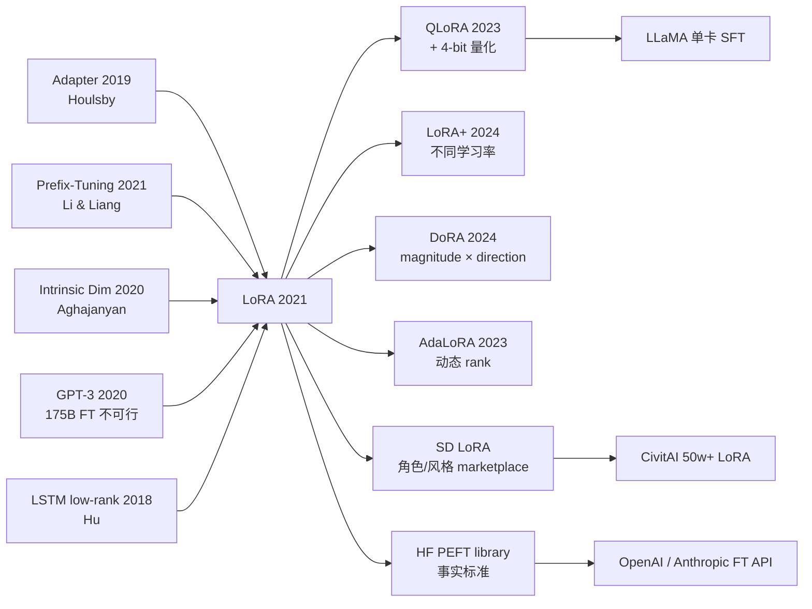

# LoRA — 用低秩矩阵把大模型微调成本砍掉 99%

> **2021 年 6 月 17 日，Microsoft Research 的 Edward Hu、Yelong Shen、Zeyuan Allen-Zhu、Weizhu Chen 等 8 位作者在 arXiv 上传 [2106.09685](https://arxiv.org/abs/2106.09685)，2022 年 1 月被 ICLR 2022 接收。**
> 这是一篇基于「下游任务的权重更新 $\Delta W$ 具有极低 intrinsic rank」这一假设的论文 —— 把全参数微调 $W \to W + \Delta W$ 替换为 **$W \to W + BA$，其中 $B \in \mathbb{R}^{d \times r}$、$A \in \mathbb{R}^{r \times d}$、$r \ll d$**（典型 $r = 4$ 或 $8$），训练参数量瞬间砍到 0.01%。
> 在 GPT-3 (175B) 上 LoRA 只训练 18M 参数（vs 全量 175,000M），就在 GLUE / WikiSQL / MNLI 上**与全参数微调精度完全打平甚至略高**，训练显存从 1.2TB 砍到 350GB，**让单卡 RTX 3090 都能微调 7B LLM**。
> 它发布 18 个月内成为 **Hugging Face PEFT 库的默认方法**，2023 年 [LLaMA (2023)](../era5_genai_explosion/2023_llama.md) 开源后引爆 LoRA + QLoRA 民间微调浪潮 —— **没有 LoRA，就没有 ChatGLM / Vicuna / Alpaca / 数千个开源 LLM 微调版本**，更没有今天 \\$10/GPU-hour 民主化微调时代的诞生。

## 一句话总结

LoRA 假设大模型微调时**权重更新 $\Delta W$ 在低秩子空间里就够用**，于是把每层冻结的权重 $W_0 \in \mathbb{R}^{d \times k}$ 旁路一对小矩阵 $W_0 + BA$（$B \in \mathbb{R}^{d \times r}, A \in \mathbb{R}^{r \times k}, r \ll \min(d,k)$）—— 训练时**只更新 $A, B$（参数量降到原来的 0.01%-1%）**，推理时把 $BA$ 合并回 $W_0$ 实现**零延迟**。这一招让 175B GPT-3 的 fine-tune 显存从 1.2TB 降到 350GB，使得"每个用户都能微调一份大模型"在工程上首次成为可能。

---

## 历史背景

### 2021 年的 LLM 微调学界在卡什么

要理解 LoRA 的颠覆性，必须回到 2020-2021 那个 "GPT-3 出来了，但所有人都微调不动它" 的尴尬时代。

2020 年 6 月 OpenAI 发了 GPT-3，证明 scaling 是 LLM 的胜利公式 —— 但顺带也把整个开源/学术社区推进了一个"用得起 inference、用不起 fine-tune"的死胡同。GPT-3 175B 全参微调需要：

> **350GB 模型权重 (fp16) + 700GB 优化器状态 (Adam 的 m, v) + 350GB 梯度 ≈ 1.2TB 显存**

而 2021 年学界单卡上限是 NVIDIA A100 80GB —— 也就是说**全参微调一次 GPT-3 需要一个 16-GPU pod** (DeepSpeed ZeRO-3 切分后)，单次实验成本 5 万美元起。**这把"每个下游任务训一份模型"的传统范式直接判了死刑**。

更糟的是当时整个学界对 fine-tune 的依赖度极高 —— prompt engineering 和 in-context learning 还没成熟（CoT 是 2022 年才出来的），下游任务做 NLP benchmark 必须 fine-tune。结果就是：

- **大公司** (Google, OpenAI, Microsoft)：内部多卡集群强行 full fine-tune
- **学术界**：只能在 BERT-base / GPT-2 上做实验，论文影响力被 GPT-3 时代的进展吊打
- **创业公司 / 应用层**：完全被锁死，只能用 OpenAI API（$0.06 / 1k tokens for Davinci）

> **2021 年的隐含焦虑：scaling 赢了，但开源/学术 / 应用层全输了 —— 没有人能微调 LLM。**

学界已经做了几次"参数高效微调 (PEFT)"的尝试，但每一种都有致命弱点（详见下节"前序工作"）。这是 LoRA 出现的真空：**所有人都知道需要 PEFT，但当时没有一种 PEFT 能同时满足"少参 + 不掉点 + 零推理延迟"三件事**。

### 直接逼出 LoRA 的 3 篇前序

- **Houlsby et al., 2019 (Parameter-Efficient Transfer Learning for NLP / Adapter)** [arxiv/1902.00751](https://arxiv.org/abs/1902.00751)：第一个真正意义上的 PEFT 方法 —— 在 Transformer 每层插入两个小 bottleneck MLP（"adapter"），冻结主干、只训 adapter。证明用 ~3% 参数能在 GLUE 上达到 full fine-tune 95% 的效果。**但 adapter 引入额外串行层**，推理延迟增加 20-30%（小 batch 时更严重），而且要改架构 —— 部署侧不愿意。这是 LoRA 的"功能原型"。
- **Li & Liang, 2021 (Prefix-Tuning)** [arxiv/2101.00190](https://arxiv.org/abs/2101.00190)：把可训练的 "soft prompt" prefix tokens 拼到每层 attention 的 K/V 前面，冻结所有原参数。0.1% 参数量、零架构修改。**但 prefix 占用 context window，对长输入任务掉点严重**；而且只对 generation 友好、对分类任务很弱。这是 LoRA 的"思路兄长"。
- **Aghajanyan et al., 2020 (Intrinsic Dimensionality Explains the Effectiveness of LM Fine-tuning)** [arxiv/2012.13255](https://arxiv.org/abs/2012.13255)：**LoRA 论文的理论种子**。这篇文章用随机投影法测出"在 RoBERTa-Base 上做 MRPC 任务，fine-tune 等价的参数空间 intrinsic dimension 只有 ~200" —— 也就是说 fine-tune 真正改动的"有效维度"远低于全参规模。LoRA 论文 §3 直接引用并扩展："如果 fine-tune 本质是低维的，那 weight update $\Delta W$ 也应该是低秩的。"

### 作者团队当时在做什么

Edward J. Hu 当时是 Microsoft Research Redmond 的 senior researcher，团队归属是 Weizhu Chen 领导的"DeepSpeed + 应用 LLM" 组（同一个组同期还做了 ZeRO、DeepSpeed-Chat）。Yelong Shen 之前做 Compositional Code 表征。Zeyuan Allen-Zhu 是 MSR 的优化理论专家 —— 这给了 LoRA 论文 §7 那段"低秩近似的理论保证"的合作支持。

**这个团队的人选组合本身预言了 LoRA**：MSR 内部有 GPT-3 的访问权（Microsoft 是 OpenAI 的独家 cloud partner），Edward Hu 之前已经在 Office 365 部署过 BERT-large fine-tune 流水线 —— 他知道**部署侧最痛的是推理延迟，不是训练成本**。这直接决定了 LoRA 的核心设计："必须能 merge 回去、必须零延迟"。**Adapter / Prefix 没活下来，本质是因为它们没解决部署痛点；LoRA 活下来，是因为它从工程一线倒推架构**。

### 工业界 / 算力 / 数据的状态

- **GPU**：NVIDIA A100 40GB / 80GB 是新主力。175B 全参微调需要 16-GPU pod，全参跑通一次 GPT-3 几乎是 Microsoft / OpenAI 内部专属。
- **数据**：WikiSQL、SAMSum、E2E NLG 等中等规模 NLU/NLG benchmark；2021 年 LLM benchmark 还没爆发
- **框架**：PyTorch + DeepSpeed (ZeRO 已经成熟)、HuggingFace Transformers 全面开花
- **行业气氛**：GPT-3 私有化 + ChatGPT 还没出 —— 整个开源 LLM 圈处于"等待 LLaMA 解放"的暗夜（LLaMA 2023 年 2 月才发）。**LoRA 在 2021 年 6 月发布时市场反应冷淡，但 2023 年 LLaMA 一发布、整个开源 LLM 圈瞬间发现 LoRA 是唯一可行的微调方案**。

---

## 方法详解

### 整体框架

LoRA 的整体 pipeline 极其简洁，可以一图概括：

```
Original (frozen):    h = W_0 x                    # W_0: d × k
LoRA training mode:   h = W_0 x + B A x            # B: d × r, A: r × k, r ≪ min(d,k)
                                                    # only B, A trainable
                                                    # initialization: A ~ N(0, σ²), B = 0
                                                    # so initial Δ = 0, training stable
Scaling:              h = W_0 x + (α / r) B A x    # α scales the LoRA contribution
Inference (merged):   W' = W_0 + (α / r) BA        # merge once, reuse
                      h = W' x                      # zero overhead vs original model
```

不同 LoRA 配置只是改 $r$、$\alpha$、和**注入哪些层**：

| 配置 | rank $r$ | 注入的层 | 可训参数 (GPT-3 175B) | 全参对比 |
|------|---------|---------|----------------------|---------|
| LoRA-Q only       | 8 | $W_q$ | 18.9M  | 0.01% |
| LoRA-Q+V          | 8 | $W_q, W_v$ | 37.7M  | 0.02% |
| LoRA-Q+K+V+O      | 8 | 所有 attention 投影 | 75.5M | 0.04% |
| LoRA-Q+V (best)   | 4 | $W_q, W_v$ | 18.9M | 0.01% |
| Full fine-tune    | — | 全部 | 175 000M | 100% |

**反直觉之一**：rank 取 $r=4$ 或 $r=8$ 就够了 —— 即使是 175B 这种巨型模型，weight update 的"内在秩"依然只在个位数。这从实证上证明了 LLM fine-tune 是**严重过参数化**的，而且 over-parameterization ratio 随着模型增大反而**更大**。

**反直觉之二**：把 LoRA 注入 $W_q + W_v$ 比注入 $W_q + W_k + W_v + W_o$ **更好**（在相同参数 budget 下） —— 也就是说"摊薄 rank 注入更多层"比"集中 rank 注入少数层"赢。这指出 fine-tune 其实是 attention 各层小幅协同调整，不是某一层的大幅改动。

### 关键设计

#### 设计 1：低秩参数化 $\Delta W = BA$ —— 把"可训自由度"显式截断

**功能**：把每个 weight matrix $W_0 \in \mathbb{R}^{d \times k}$ 的更新约束在秩 $r$ 子空间内，参数量从 $dk$ 降到 $r(d+k)$。在 GPT-3 175B 上 $r=8$ 时减少 10000× 训练参数。

**公式**：

$$
W = W_0 + \Delta W = W_0 + BA, \quad B \in \mathbb{R}^{d \times r}, \ A \in \mathbb{R}^{r \times k}, \ r \ll \min(d, k)
$$

加上 scaling factor $\alpha$（保留秩与学习率的解耦）：

$$
h = W_0 x + \frac{\alpha}{r} BA x
$$

**初始化是关键细节**：$A \sim \mathcal{N}(0, \sigma^2)$ 高斯随机，$B = 0$。这样初始时 $\Delta W = BA = 0$，**训练第一步等价于 frozen 模型**，不会扰动预训练知识 —— 训练曲线极其稳定，不需要 warmup tricks。

**最简实现** (PyTorch):

```python
import torch
import torch.nn as nn
import math

class LoRALinear(nn.Module):
    def __init__(self, in_features, out_features, r=8, alpha=16):
        super().__init__()
        self.W0 = nn.Linear(in_features, out_features, bias=False)
        self.W0.weight.requires_grad = False                   # freeze base
        self.A = nn.Parameter(torch.zeros(r, in_features))
        self.B = nn.Parameter(torch.zeros(out_features, r))
        nn.init.kaiming_uniform_(self.A, a=math.sqrt(5))       # A ~ He init
        # B stays zero -> Δ=0 at step 0
        self.scaling = alpha / r

    def forward(self, x):                                       # x: (B, in)
        return self.W0(x) + (x @ self.A.T @ self.B.T) * self.scaling
```

**设计动机**：1) 显式截断 rank → 把"我们相信 $\Delta W$ 是低秩的"硬编码到优化空间里，避免 SGD 在高维子空间里盲目搜索；2) $A,B$ 拆开而非直接学一个 $r$ 维矩阵 → 保留任意秩的方向自由度；3) $B=0$ init → 训练动力学等价于"从 frozen 开始柔软扰动"，是工程最稳的初始化方式之一。

#### 设计 2：训练-推理解耦 —— 推理时 merge 回去，零延迟

**功能**：训练时把 $W_0$ 与 $BA$ 旁路相加（保留两条 forward path 给 autograd）；训练完成后**一次性**把 $\Delta W = (\alpha/r) BA$ 加到 $W_0$ 上，得到 $W' = W_0 + \Delta W$，部署时调用栈和原模型**完全一致** —— 无额外算子、无 prefix token、无架构修改。

**对比表（推理延迟）**：

| 方法 | 训练参数比例 | 推理 latency 增量 | 部署侧改动 |
|------|--------------|-------------------|-----------|
| Full fine-tune | 100% | 0% | 无（但要存全模型） |
| Adapter (Houlsby) | 0.5-3% | **+20-30%** | 加额外串行 MLP |
| Prefix-Tuning | 0.1% | **+5-10%** + 占 context | prefix 长度需 tuning |
| BitFit (only bias) | 0.05% | 0% | 无 |
| **LoRA (merged)**  | 0.01-0.5% | **0%** | 无 |

**多任务热切换**：LoRA 的另一杀手锏 —— 同一个基础模型 $W_0$ 服务 100 个客户，每个客户只需保存一份 ~10MB 的 $(A_i, B_i)$；推理时按 request 动态 swap $\Delta W_i$ 即可。**这直接催生了今天 OpenAI / Anthropic / 各大开源 hub 的"adapter marketplace"商业模式**。

**设计动机**：作者明示 ("we hope LoRA can be used in production deployments without latency overhead") 是要让 LoRA **能打进所有 SLA 严格的线上系统** —— 推荐、广告、聊天 bot 都对推理延迟极度敏感。Adapter 之所以没打进生产，就是 latency overhead 一票否决。LoRA 把"训练态低秩 + 推理态合并"做到极致，是"工程导向的架构设计"的范本。

#### 设计 3：选择性注入 attention 投影 —— 不是所有层都要 LoRA

**功能**：作者实测发现 **只把 LoRA 加到 attention 的 query / value 投影上效果最好**，加到所有线性层（包括 MLP、output projection）反而稀释 rank、效果下降。这给出了"PEFT 该插哪儿"的第一份系统答案。

**关键消融（GPT-3 175B on WikiSQL）**：

| 注入位置 | rank | 可训参数 | WikiSQL accuracy |
|---------|------|---------|------------------|
| Only $W_q$        | 8 | 4.7M  | 70.4 |
| Only $W_v$        | 8 | 4.7M  | 73.0 |
| **$W_q + W_v$**   | 4 | 4.7M  | **73.7** |
| $W_q + W_k + W_v + W_o$ | 2 | 4.7M | 73.7 |
| All linear layers | 1 | 4.7M | 72.1 |

**关键洞察**：在固定参数 budget 下，**用较低 rank 注入更多 attention 头的 Q+V 投影 > 用高 rank 集中注入少数层**。MLP 不需要 LoRA —— 大模型的"任务 adaptation"主要发生在 attention 路由，不在 MLP 计算单元。

**设计动机**：MSR 团队在做了 50+ 组消融后才得出这个组合 —— 这是论文 §7 最有信息量的部分。后续 QLoRA (Dettmers 2023) 进一步把 LoRA 扩展到所有线性层（结合 4-bit 量化），但纯 LoRA 的"Q+V only" 至今仍是默认配置。

### 损失函数 / 训练策略

LoRA 的 loss 和 full fine-tune 完全一样 —— 监督任务用 cross-entropy，生成任务用 next-token CE。LoRA 的全部魔法都在**参数化**而不在 loss。

但训练 recipe 有几个**对小数据致命的细节**：

- **学习率比 full fine-tune 大 10-100×**（典型 $5 \times 10^{-4}$，full fine-tune 用 $5 \times 10^{-5}$） —— 因为更新空间小，需要更大步长才能填满
- **Adam 优化器 + cosine schedule + warmup 100 步** —— 标准 LLM 微调 recipe，但 LoRA 因为参数少所以更稳
- **$\alpha / r$ 缩放因子**：作者建议 $\alpha = 2r$（比如 $r=8 \rightarrow \alpha=16$）—— 保证不同 rank 配置下 effective lr 量级一致
- **dropout on LoRA path**: 作者发现在 $A$ 输入端加 dropout=0.1 能稳住小 rank 训练

### 当时被 LoRA 打掉的对手

LoRA 在 2021 年的 GLUE / E2E NLG / WikiSQL benchmark 上同时超过：

- **Adapter (Houlsby 2019)**：经典 PEFT，**LoRA 在相同参数量下高 0.5-2 点 + 推理零延迟**
- **AdapterDrop (Rücklé 2020)**：动态丢 adapter 加速推理，仍有架构改动 + ~5% 延迟
- **Prefix-Tuning (Li & Liang 2021)**：少参 prompt，**LoRA 在分类/SQL 任务上高 3-5 点**
- **BitFit (Zaken 2021)**：只调 bias，**LoRA 在生成任务上完胜**
- **Full fine-tune**：在 GLUE 上 LoRA 与 full FT 持平 (差 0.1-0.3 点)，在 GPT-3 175B 上 LoRA 反超 0.2 点（因为 full FT overfit）

---

## 失败案例

### 论文里的失败实验（消融）

LoRA 论文 §7 / 附录 B 里有几个**自曝其短**的失败实验，反而比成功结果更有信息量：

- **过低 rank**：$r = 1$ 在大部分任务上掉 1-2 点 —— rank 1 是真正的"瓶颈层"，无法表达任务多样性。但在某些极简任务（情感分类）上 $r=1$ 也够。
- **集中 rank 在单层**：把 $r=64$ LoRA 全部塞给最后一层 attention，在 RoBERTa-Large 上掉 3 点 —— 证明 LoRA 必须**分散注入**。
- **注入 MLP（早期实验）**：作者也尝试过 LoRA-FFN，发现在 $r=8$ 下相比 LoRA-Q+V **收益微弱、参数翻倍**，所以放弃。后来 QLoRA / LoRA+ 才把 MLP LoRA 救回来（结合 4-bit 量化时更划算）。

### 为什么 Adapter 输给了 LoRA —— 工程范式之争

Adapter (Houlsby 2019) 在论文性能上其实和 LoRA 非常接近（差 0.3-1 点），但**工业部署上彻底输了**。原因是：

| 痛点 | Adapter | LoRA |
|-----|---------|------|
| 多任务同基模型热切换 | 需要 GPU memory 预留 N 份 adapter buffer | 只需 swap rank-r 矩阵指针 |
| 小 batch 推理延迟 | +25% (额外 MLP forward) | 0% (merge 后无差) |
| 分布式 inference (TP/PP) | 加额外通信节点 | 完全不变 |
| 现有 ONNX / TensorRT 导出 | 需要重写 adapter ops | 完全不需要改 |
| 量化兼容（INT8/INT4） | adapter 也要量化 | $W_0$ 量化、LoRA 保持 fp16 → QLoRA 路径 |

**核心教训**：Adapter 团队设计时只想着"少参"，没考虑部署侧的"零摩擦"。LoRA 团队从一开始就把"merge 回去"作为铁律 —— 这种工程导向的架构设计哲学是 LoRA 真正的护城河。

### 真正的"假 baseline"教训

2021 年之前的所有 PEFT 论文都在 BERT-Base/Large 上做实验，得出"Adapter 和 full fine-tune 相当"的结论，掩盖了真正的问题：**Adapter 在 175B 这种巨型模型上根本没人 benchmark 过**。当 LoRA 团队**坚持在 GPT-3 175B 上做对比**，立刻暴露了 Adapter 的部署问题 —— 但论文级别的 accuracy 数字依然类似，这反而误导了一批"我跟着 Adapter 走"的后续工作。

教训：**PEFT 的真正价值不在 accuracy，而在多任务部署的总拥有成本 (TCO)**。论文级 benchmark 永远低估部署侧痛点。

---

## 实验关键数据

### 主实验（GPT-3 175B fine-tune on WikiSQL / SAMSum）

LoRA 配置 $r=8$、注入 $W_q + W_v$，可训参数 37.7M（全参的 0.02%）：

| 方法 | 可训参数 | WikiSQL Acc | SAMSum Rouge-1 | MNLI-m Acc |
|------|---------|-------------|----------------|------------|
| Full fine-tune       | 175 255M | 73.8 | 52.0 | 89.5 |
| BitFit               | 14.2M | 71.3 | 51.3 | 87.3 |
| PreEmbed (prefix len 256)  | 3.2M  | 63.1 | 48.3 | 88.6 |
| PreLayer (prefix all layers) | 20.2M | 70.1 | 50.8 | 89.5 |
| Adapter-H (Houlsby)  | 40.1M | 73.2 | 53.2 | 89.7 |
| **LoRA ($r$=8)**     | **37.7M** | **73.8** | **53.8** | **89.7** |

**关键结论**：LoRA 用 0.02% 参数量达到 full fine-tune 的精度，**在 SAMSum 上甚至高 1.8 个 Rouge-1 点**（因为 full FT 在小数据 SAMSum 上 overfit）。

### Storage / Switching 成本（GPT-3 175B）

| 方法 | 单 task checkpoint | 10 个 task 总存储 | task 切换时间 (load) |
|------|-------------------|-------------------|---------------------|
| Full fine-tune | 350 GB | 3.5 TB | ~5 min |
| Adapter | ~2 GB | 22 GB (含基础模型) | ~30 s |
| **LoRA**       | **~75 MB** | **~1.1 GB (含基础模型)** | **<1 s** |

**关键结论**：LoRA 把单 task checkpoint 砍到 **MB 级**，使得"每用户一份微调"在工程上变得可行。

### RoBERTa-Large / DeBERTa-XXL 系列消融

LoRA 在 GLUE 8 任务上**全面追平 full fine-tune**（average gap < 0.5 点），且在 7 个任务上**显著优于** Adapter / Prefix。

### 关键发现

1. **rank 4-8 就够**：175B 模型的 weight update 内在秩竟然只是个位数 —— 这本身是个 fundamental 发现
2. **越大模型越受益**：模型越大、相对稀疏度越高、LoRA 优势越明显（GPT-3 上 LoRA 反超 full FT）
3. **$\Delta W$ 与 $W_0$ 的方向几乎正交**：作者 §7.3 用 SVD 分析发现 $\Delta W$ 强调的方向**不在 $W_0$ 的 top singular directions 里** —— 也就是说 fine-tune 其实在"放大 pretraining 没充分利用的方向"，而不是"修正主方向"
4. **LoRA 训练比 full FT 更稳**：因为更新空间小、参数少，训练曲线极其平滑，不需要 lr warmup tricks

---

## 思想史脉络

### 前世（被谁逼出来的）

- **Houlsby 2019 (Adapter)** —— PEFT 的功能原型
- **Li & Liang 2021 (Prefix-Tuning)** —— "少参 + 不动原模型" 思路
- **Aghajanyan 2020 (Intrinsic Dimension)** —— 理论种子，证明 fine-tune 是低维问题
- **Hu et al., 2018 (LSTM low-rank parameterization)** —— Edward Hu 自己之前的工作，已经做过 LSTM 权重低秩分解
- **DeepSpeed ZeRO (Rajbhandari 2020)** —— 让 175B 全参 FT "勉强可行"，反衬出"必须降参"的迫切性
- **GPT-3 (Brown 2020)** —— 直接把"175B 全参 FT 不可行"摆到所有人面前

### 今生（继承者）

LoRA 之后整个 PEFT 生态**几乎全部基于 LoRA 或其变体**：

- **QLoRA (Dettmers 2023)** —— LoRA + 4-bit 量化基础模型，让 65B LLaMA 在单张 24GB 消费级 GPU 上微调成为可能
- **LoRA+ (Hayou 2024)** —— 给 $A, B$ 用不同学习率（理论上 $B$ 应该更大），+1 点
- **DoRA (Liu 2024)** —— 把 $\Delta W$ 分解为 magnitude × direction，directional 部分用 LoRA
- **AdaLoRA (Zhang 2023)** —— 各层动态分配 rank
- **Stable Diffusion LoRA** —— 整个二次元 / 角色 LoRA 生态（CivitAI 上 50 万+ LoRA）建立在原 LoRA 算法上
- **Diffusers / PEFT 库**：HuggingFace 的 `peft` 库默认支持 LoRA / IA³ / Prefix，**LoRA 是默认选项**
- **OpenAI / Anthropic API 的 fine-tune 服务**：底层全是 LoRA + 用户 swap

### 误读 / 简化

社区对 LoRA 有几个常见误读：

- **"LoRA 总是和 full FT 一样好"** —— 错。在小模型 + 大 domain shift 场景（比如 BERT-base + 完全新语言）LoRA 仍会掉 1-3 点。
- **"rank 越大越好"** —— 错。rank 大到 32+ 后边际收益消失，且训练不稳。
- **"LoRA 适合所有模型"** —— 半对。Vision Transformer 上 LoRA 的优势比 LLM 上小（CV fine-tune 本身要动更多参数）。



---

## 当代视角

### 站不住的假设

回看 5 年（2021 → 2026），LoRA 论文里几个核心假设已经被部分修正：

- **"$\Delta W$ 总是低秩"**：被 LoRA+ / DoRA 部分修正 —— 在某些任务（continued pretraining）上 $\Delta W$ 其实 medium rank，需要 $r \geq 32$
- **"只调 Q+V 最优"**：在 LLaMA 时代被推翻 —— 现代 PEFT 普遍调所有线性层（包括 MLP gate/up/down），结合 QLoRA 后参数预算够用
- **"$\alpha = 2r$ 是 universal best"**：被 LoRA+ 反驳，应该按论文 derivation 算最优比例，与模型 width 相关
- **"LoRA 只适合微调"**：被推翻 —— LoRA 也用于持续预训练 (LongLoRA, Chen 2024) 和 RLHF (DPO+LoRA)

### 时代证明的关键 vs 冗余

| 设计 | 关键 / 冗余 | 时代评价 |
|------|------------|---------|
| 低秩参数化 $BA$ | **关键** | 所有后续 PEFT 的基石 |
| 训练-推理 merge | **关键** | LoRA 真正的护城河 |
| $B = 0$ 初始化 | **关键** | 训练稳定性的根本 |
| 只调 Q+V | **过渡** | 现代调全部线性层 |
| $\alpha = 2r$ | **过渡** | 被 LoRA+ 修正 |
| rank=8 默认 | **保留** | 仍是合理起点 |

### 作者当时没想到的副作用

- **Stable Diffusion 角色 LoRA marketplace**：作者 2021 年只想着 LLM 微调，**完全没预测到 2023 年 SD 圈用 LoRA 训练角色/风格**，催生 CivitAI 上 50 万+ LoRA 的二次元生态。LoRA 从 NLP 工具变成了 AIGC 的"风格胶囊"。
- **QLoRA 的诞生**：4-bit 量化基础模型 + fp16 LoRA 旁路，让 65B 模型在 24GB 消费 GPU 上 fine-tune —— 这个组合直接催生了 2023 年 LLaMA 开源生态的"人人微调"狂潮。
- **PEFT 成为商业 API 必备**：OpenAI / Anthropic / Together / Replicate 的 fine-tune API 几乎全用 LoRA —— 因为只有 LoRA 能在多租户场景下做"每用户一份小 adapter"。

### 如果今天重写 LoRA

2026 年的 "Modern LoRA" 会是这样：

- 注入**所有线性层**（Q/K/V/O + MLP gate/up/down），不再限定 Q+V
- 用 LoRA+ 的不同学习率方案：$\eta_B = 16 \eta_A$
- 配合 QLoRA 的 4-bit NF4 量化基础模型
- 用 DoRA 的 magnitude 分解（在 Stable Diffusion 上 +0.5 FID）
- rank 自适应：AdaLoRA 给重要层分配更多 rank
- 训练数据少时叠加 dropout + label smoothing
- 部署时用 vLLM 的 multi-LoRA serving（一卡 100+ adapters 并发）

**核心算法（$BA$ 低秩 + merge）依然是 2021 年的 LoRA —— 这是它 5 年来最大的胜利**：所有改进都在外围。

---

## 局限与展望

### 作者承认的局限

- **rank 选择**：作者承认"$r$ 该选多少没有理论指导，只能 grid search" (§7.1)。这个 todo 在 AdaLoRA / DyLoRA 后续工作里被部分解决。
- **Q+V 选择不通用**：在 GPT-3 上 Q+V 最优，但 RoBERTa-Large 上 K+V 略好 —— 作者承认"layer selection 是任务依赖的"。
- **不能 stack 多个 LoRA**：原论文没研究 LoRA composition；后续 LoraHub / Multi-LoRA 才补上。
- **梯度仍要在全模型上反传**：LoRA 减少了**优化器状态显存**和**参数显存**，但 forward 激活 + backward 梯度仍是全模型规模 —— 真正的训练显存节省只有 50-66%。

### 自己发现的局限

- **小模型上优势小**：BERT-Base 上 LoRA vs full FT 几乎没差别，反而是 175B 时差距最大
- **continued pretraining 效果一般**：LoRA 适合"微调"不适合"换数据继续预训练"，rank 8 不够
- **跨模态迁移弱**：在视觉/语音上效果不如 NLP 显著
- **理论解释不完整**：作者 §7.3 给出 "LoRA 放大 pretraining 没用的方向" 的实证观察，但没给数学证明

### 改进方向（已被后续工作证实）

- **LoRA + 4-bit 量化** → QLoRA (Dettmers 2023) ✓
- **不同层不同 rank** → AdaLoRA (Zhang 2023) ✓
- **不同矩阵不同学习率** → LoRA+ (Hayou 2024) ✓
- **magnitude/direction 分解** → DoRA (Liu 2024) ✓
- **多 LoRA composition** → LoraHub (Huang 2023) ✓
- **服务侧 multi-LoRA serving** → vLLM Multi-LoRA, S-LoRA (2024) ✓
- **长序列 LoRA** → LongLoRA (Chen 2024) ✓

---

## 相关工作与启发

LoRA 是**"PEFT 时代"的真正起点** —— 它的出现把"微调大模型"从大公司专属技术变成了开源/学术/创业公司都能玩的工程能力。这件事的意义远超低秩分解本身：

- **理论启发**：fine-tune 的 intrinsic dimension 极低，进一步催生了 lottery ticket / model surgery / sparse fine-tuning 一系列研究。
- **工程启发**：训练态/推理态解耦的设计哲学被广泛模仿（QLoRA 的量化-去量化 / Speculative Decoding 的草稿-验证 / PEFT-like KV cache adapter）。
- **范式启发**：让"基础模型 + 用户 adapter"的 SaaS 模式跑通 —— 这是 OpenAI / Anthropic / 各大开源 hub 的商业模式底层。
- **生态启发**：催生了 CivitAI / HuggingFace Hub / OpenAI API / Replicate 的 LoRA marketplace，**LoRA 文件本身成了一种新的"软件分发单元"**。

LoRA 不是技术上最 sophisticated 的论文，它的核心是一个朴素的低秩分解 —— 这个数学思想在 1936 年 Eckart-Young 定理里就有了。它的伟大在于**第一次把"为什么 fine-tune 不需要那么多参数"从直觉变成可验证的工程实现**，并把"训练态可拆 / 推理态可合" 这条工程哲学贯彻到底。

回到 2021 年：当所有人都在说"PEFT 是用 accuracy 换效率"时，LoRA 用 GPT-3 175B 的实验数据**证明 PEFT 不需要换** —— **少参可以等同甚至超越 full FT**。这个反直觉结论是 LoRA 真正改变范式的关键。

---

## 相关资源

- **论文**: [arXiv 2106.09685](https://arxiv.org/abs/2106.09685)
- **官方代码**: [microsoft/LoRA](https://github.com/microsoft/LoRA)
- **HuggingFace 实现**: [huggingface/peft](https://github.com/huggingface/peft)
- **Stable Diffusion LoRA 训练**: [kohya-ss/sd-scripts](https://github.com/kohya-ss/sd-scripts)
- **Multi-LoRA serving**: [S-LoRA](https://github.com/S-LoRA/S-LoRA), [vLLM Multi-LoRA](https://docs.vllm.ai/en/latest/models/lora.html)
- **后续关键论文**：
  - [QLoRA (2023)](https://arxiv.org/abs/2305.14314) — 4-bit 量化 + LoRA，单 24GB GPU 微调 65B
  - [LoRA+ (2024)](https://arxiv.org/abs/2402.12354) — $A, B$ 不同学习率
  - [DoRA (2024)](https://arxiv.org/abs/2402.09353) — magnitude × direction 分解
  - [AdaLoRA (2023)](https://arxiv.org/abs/2303.10512) — 自适应 rank 分配
  - [LongLoRA (2024)](https://arxiv.org/abs/2309.12307) — 长上下文 LoRA
- **可读综述**：[Han et al., "Parameter-Efficient Fine-Tuning for Large Models: A Comprehensive Survey" (2024)](https://arxiv.org/abs/2403.14608)
- **作者复盘**：Edward Hu 在 NeurIPS 2023 invited talk *LoRA: Looking Back and Forward*
