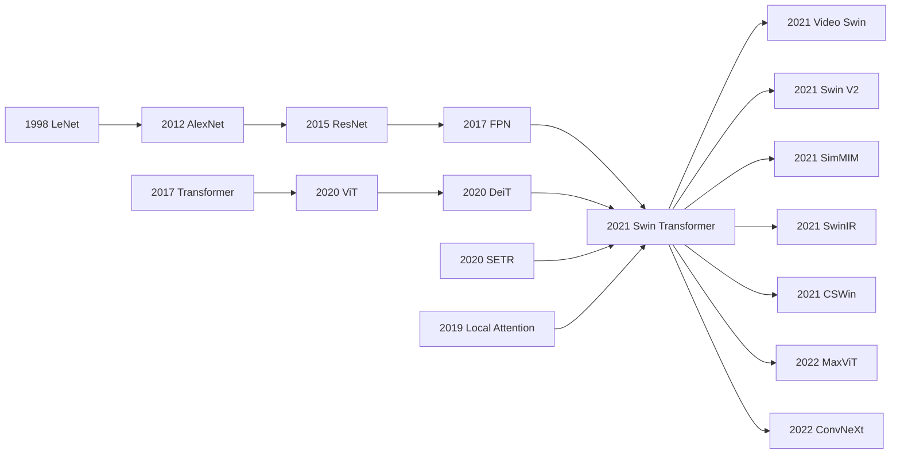

# Swin Transformer - 用 shifted windows 把 ViT 改造成通用视觉骨干

> **2021 年 3 月 25 日，Liu、Lin、Cao、Hu 等 8 位作者把 [arXiv:2103.14030](https://arxiv.org/abs/2103.14030) 上传到 arXiv；同年 10 月，这篇论文拿下 ICCV 2021 Marr Prize。** 这篇论文的反直觉不在于“Transformer 比 CNN 更强”，而在于它承认 CNN 的老偏置仍然有用：层级特征、局部窗口、平移相关的位置偏置，都被重新塞回 Transformer。Swin Transformer 用一个看似朴素的 shifted window，把 ViT 从只能做 ImageNet 分类的单尺度模型，改造成可以直接替换 ResNet/FPN 的通用视觉骨干：ImageNet 87.3 top-1，COCO 58.7 box AP / 51.1 mask AP，ADE20K 53.5 mIoU。它是视觉 Transformer 真正进入检测、分割和工业模型库的那一下“接口对齐”。

## 一句话总结

Liu、Lin、Cao、Hu 等 8 位作者 2021 年发表在 ICCV 的 Swin Transformer，用四级 patch-merging 金字塔和 shifted window attention，把 ViT（2020） 的全局自注意力从 $\Omega(\text{MSA})=4hwC^2+2(hw)^2C$ 改成固定窗口下的 $\Omega(\text{W-MSA})=4hwC^2+2M^2hwC$，再通过相邻 block 的窗口平移补上跨窗口连接。它替代的失败 baseline 很具体：DeiT-S 必须额外加 deconvolution 才能接入 Cascade Mask R-CNN，却只有 48.0 box AP / 41.4 mask AP；Swin-T 在几乎同级复杂度下做到 50.5 / 43.7，不 shift 的窗口版本也从 50.5 / 43.7 掉到 47.7 / 41.5。论文最高配置拿到 ImageNet 87.3 top-1、COCO 58.7 box AP / 51.1 mask AP、ADE20K 53.5 mIoU，并把“视觉 Transformer 可以当通用 backbone”变成 2021-2023 年检测、分割、视频、医学影像和生成模型的默认假设。隐藏 lesson 是：Swin 并没有证明 CNN 偏置过时，恰恰证明 Transformer 想进入真实视觉系统，必须先学会尊重尺度、局部性和硬件访问模式。

---

## 历史背景

### 2020 年：Transformer 已经赢了 NLP，却还没真正接管视觉

2020 年的机器学习共同体已经很难再把 Transformer 当成“某个 NLP 模块”。从 2017 年的 Transformer 到 2018 年的 BERT，再到 2020 年的 GPT-3，语言模型已经证明了一个新范式：只要 token 化合理、模型可扩展、训练目标简单，注意力结构可以吞下巨量数据并长出迁移能力。视觉领域当然也被这种成功吸引，但问题没有那么直接。文本 token 是离散的、序列长度通常可控；图像像素是二维密集网格，物体尺度从几个像素到整张图都可能成立。把所有 patch 两两做全局 self-attention，复杂度会随 token 数平方增长，而检测和分割又恰好需要高分辨率特征图。

所以早期视觉 Transformer 的成功有一个隐含边界：它们更像“图像分类器”，而不是“视觉系统的骨干”。ViT 把图像切成 16x16 patch，直接喂给标准 Transformer，在 JFT-300M 级别的数据上取得惊人分类效果；DeiT 证明精心训练后，ViT 可以只用 ImageNet-1K 学好。但这两条线都没有解决一个工业界更关心的问题：我能不能把 ResNet 从 Mask R-CNN、UPerNet、FPN、RetinaNet 这些成熟系统里拔掉，换成 Transformer，而不重写整个视觉栈？Swin Transformer 的历史位置就在这里。它不是第一篇把 Transformer 用到图像上的论文，而是第一篇让大部分 CV 工程师相信 Transformer 可以当通用 backbone 的论文。

### ViT/DeiT 给了分类答案，却没有给密集预测答案

ViT 的结构非常干净：固定 patch、单尺度 token 序列、全局 attention、最后取 class token 做分类。这个设计在 ImageNet 上优雅，但一进入 COCO 或 ADE20K 就露出接口问题。目标检测需要不同尺度的物体特征，分割需要像素级预测，FPN/U-Net 这样的模块期待的是一组 H/4、H/8、H/16、H/32 的多尺度 feature maps。ViT 只给一个低分辨率序列，想接进检测框架，就要额外用 deconvolution 或 reshaping 硬造层级特征；想处理更高分辨率，global attention 又会把计算量推到不可接受。

Swin 论文在实验里把这个问题写得很尖锐。DeiT-S 要接 Cascade Mask R-CNN，必须额外加 deconvolution 层来构造层级特征，结果 48.0 box AP / 41.4 mask AP；Swin-T 在近似规模下直接输出层级特征，达到 50.5 / 43.7，而且 FPS 更高。ADE20K 上，DeiT-S + UPerNet 只有 44.0 mIoU，Swin-T 是 46.1，Swin-S 是 49.3。这里输掉的不是“Transformer 能不能识别图像”，而是“单尺度 Transformer 能不能服务密集视觉接口”。Swin 的答案很工程化：既然下游系统需要金字塔，那 Transformer backbone 就应该自己长出金字塔。

### 微软亚洲研究院的切入点：不要把 CNN 偏置全扔掉

Swin 的作者团队来自 Microsoft Research Asia，这一点并不只是 affiliation 信息。MSRA 在 2010 年代长期参与视觉 backbone、检测和分割系统的核心演化，从 ResNet、FPN 相关生态到 Cascade、MMDetection 这类工程框架，团队成员很清楚视觉模型的“好用”不只看 ImageNet top-1。一个 backbone 如果不能给检测器多尺度特征、不能在高分辨率下跑得动、不能被现有训练 recipe 接住，就算分类精度漂亮，也很难真正替换 CNN。

这解释了 Swin 的品味：它表面上是 Transformer 论文，骨子里却非常 CNN。Patch merging 对应 pooling/stride；局部窗口对应局部感受野；四个 stage 对应 ResNet 的 C2-C5；相对位置偏置保留了平移相关的空间先验；shifted window 则像一种用 attention 写成的跨块通信机制。论文没有把 CNN 偏置当作旧时代包袱，而是把它们翻译成 Transformer 可接受的形式。正因为这种“保守的激进”，Swin 才能在 2021 年同时说服 Transformer 阵营和检测/分割工程阵营。

### 这篇论文为什么会拿到 Marr Prize

ICCV 2021 Marr Prize 给 Swin Transformer，并不只是奖励一个新的 attention trick。它奖励的是一个范式转换完成时刻：Transformer 不再只是分类论文里的主角，而开始变成视觉任务栈的基础设施。Swin 的摘要里列出的数字很有象征性：ImageNet-1K 87.3 top-1、COCO test-dev 58.7 box AP / 51.1 mask AP、ADE20K 53.5 mIoU。三个 benchmark 覆盖分类、检测、实例分割、语义分割，这比单点 SOTA 更关键。

更重要的是，Swin 给后来的视觉论文提供了一种可复制的语言：局部窗口降低复杂度，层级结构适配 dense prediction，少量跨窗口机制恢复信息流。这套语言很快扩散到 Video Swin、SwinIR、Swin-Unet、SwinV2、CSWin、Focal Transformer、MaxViT，也刺激 ConvNeXt 反过来证明“现代化 CNN 仍然能打”。一篇论文如果只是赢了表格，影响通常停在 leaderboard；Swin 让后来者可以围绕同一个接口继续争论，这就是 Marr Prize 级别的影响。

## 研究背景与动机

### 视觉 backbone 的三项硬需求

通用视觉 backbone 不是单纯追求分类精度的网络。它至少要满足三项硬需求。第一，**多尺度表示**：小物体、人体、道路、天空、文字都可能同时出现在一张图里，下游任务需要不同分辨率的语义层。第二，**高分辨率可承受**：检测和分割输入常见 800-1600 像素短边，不能把所有 token 做全局两两 attention。第三，**接口兼容**：FPN、UPerNet、Mask R-CNN、Cascade Mask R-CNN、MMDetection、MMSegmentation 都已经形成了成熟 pipeline，backbone 最好能像 ResNet 一样输出一组 feature maps，而不是要求下游全部重写。

CNN 天然满足这三点，但它的代价是长程建模能力弱，依赖局部卷积堆叠慢慢扩展感受野。标准 Transformer 天然有全局交互，却在这三点上都不友好。Swin 的动机就是在这两个极端之间找一个工程可行点：保留 Transformer block 的表达能力，同时把视觉系统真正需要的尺度、局部性、金字塔和内存访问模式补回来。

### Swin 的核心问题定义

Swin 论文真正提出的问题可以写成一句话：**能否构造一个 Transformer backbone，使它像 CNN 一样输出层级特征，像局部卷积一样线性扩展，又像 Transformer 一样通过 attention 建模内容相关关系？** 这不是一个纯理论问题，而是一个接口问题。它要求模型在 ImageNet 上能分类，在 COCO 上能直接作为 detector backbone，在 ADE20K 上能接 UPerNet，还要在 V100 上有可接受 throughput。

这个问题定义决定了 Swin 的每个设计都很克制。它没有引入复杂的跨模态结构，没有做花哨的 token pruning，也没有试图让 attention 完全全局化。它只做四件事：patch partition、patch merging、window attention、shifted window。每一件事都能对应到一个清晰的失败模式：patch partition 把像素变成 token，patch merging 解决多尺度，window attention 解决复杂度，shifted window 解决窗口孤岛。这样的设计不炫技，但非常难得，因为它让复杂系统里的每个模块都有职责边界。

### 它解决的不是单个 benchmark，而是接口问题

很多论文的叙事是“我在某个数据集上比前人高 X 点”。Swin 当然也有漂亮数字，但它更深的贡献是把 Transformer 对齐到视觉工程接口。COCO 里的四个框架实验特别说明这一点：Cascade Mask R-CNN、ATSS、RepPointsV2、Sparse R-CNN 都只是把 backbone 从 ResNet-50 换成 Swin-T，就得到 +3.4 到 +4.2 box AP 的提升。这说明 Swin 不是只为某个 detector head 定制，它更像一个真正可替换的底座。

这也是为什么后续模型库迅速接纳 Swin。一个新 backbone 如果需要重新设计训练 pipeline、数据增强、检测头、mask head、loss、部署 kernel，它的学术价值再高也很难扩散。Swin 的胜利在于它看起来像 Transformer，使用起来却像 ResNet：给我输入图像，我给你多尺度特征，你按原来方式接 FPN/UPerNet 即可。这种“可被替换”的属性，是很多革命性结构缺少的工程美德。

### 论文的真正赌注

Swin 的赌注不是“未来视觉一定属于窗口 attention”。到 2026 年看，这个赌注显然过窄：大 ViT、ConvNeXt、hybrid CNN-Transformer、masked image modeling、open-vocabulary VLM 都各自占住了生态位。Swin 真正赌的是另一件事：视觉 Transformer 要想成为基础设施，必须重新设计 token 尺度和计算图，而不是把 NLP Transformer 原样搬过来。

这个赌注仍然成立。无论今天用的是 Swin、ViTDet、ConvNeXt、InternImage、Mamba-style vision blocks，还是 diffusion/VLM 里的 patch/token mixer，核心问题都没有消失：高分辨率图像有太多 token，物体尺度变化太大，下游接口需要层级语义，硬件不喜欢不规则访存。Swin Transformer 的历史价值，就是把这些问题第一次以一个干净、可训练、可替换、能赢大表格的 backbone 形式压到同一张纸上。

---

## 方法详解

### 整体框架：四级金字塔 Transformer

Swin Transformer 的整体结构可以理解为“把 ResNet 的四级 feature pyramid 用 Transformer block 重写”。输入图像先被切成不重叠的 4x4 patch，每个 patch 的 RGB 像素展平成 48 维向量，再经过线性层投影到 C 维 token。之后网络分成四个 stage：Stage 1 保持 H/4 x W/4 分辨率，Stage 2/3/4 分别通过 patch merging 把分辨率降到 H/8、H/16、H/32，同时把通道从 C 扩到 2C、4C、8C。每个 stage 内部堆叠若干 Swin Transformer block，block 之间交替使用普通窗口注意力 W-MSA 和 shifted window 注意力 SW-MSA。

| 模型 | C | block 深度 | 典型复杂度 | ImageNet-1K top-1 |
|---|---:|---:|---:|---:|
| Swin-T | 96 | {2,2,6,2} | 29M / 4.5G | 81.3 |
| Swin-S | 96 | {2,2,18,2} | 50M / 8.7G | 83.0 |
| Swin-B | 128 | {2,2,18,2} | 88M / 15.4G | 83.5 |
| Swin-L | 192 | {2,2,18,2} | 197M / 103.9G at 384 | 87.3 with 22K pretrain |

这个设计最重要的不是某个单点模块，而是输出接口。CNN backbone 的下游系统习惯拿 C2/C3/C4/C5 做 FPN 或 decoder，Swin 也给出同样分辨率的四组特征，因此可以自然替换 ResNet/ResNeXt。论文的检测和分割实验几乎都在强调这一点：不是为每个任务重写 Transformer，而是让 Transformer 先变成一个合格 backbone。

### 关键设计一：Patch Merging 让 Transformer 长出 FPN 接口

Patch merging 是 Swin 的“下采样层”。在 stage 之间，它把相邻 2x2 token 的特征拼接起来，形成 4C 维向量，再用线性层投影到 2C。这样 token 数减少 4 倍、空间分辨率减半、通道数加倍，和 CNN 里 stride=2 的下采样非常接近。

$$
\mathbf{x}_{i,j}^{(s+1)} = W_m\,[\mathbf{x}_{2i,2j}^{(s)};\mathbf{x}_{2i+1,2j}^{(s)};\mathbf{x}_{2i,2j+1}^{(s)};\mathbf{x}_{2i+1,2j+1}^{(s)}], \quad W_m \in \mathbb{R}^{4C \times 2C}
$$

这一步解决了 ViT 的两个痛点。第一，单尺度 token 序列不适合密集预测；patch merging 直接产生 H/4、H/8、H/16、H/32 四级输出。第二，视觉对象有尺度变化；越深层的 token 需要更大感受野和更高语义浓度。Swin 没有通过复杂 decoder 去补救单尺度表示，而是从 backbone 内部让尺度自然出现。

| 设计选择 | 输出形态 | 对检测/分割的影响 | 代价 |
|---|---|---|---|
| ViT 单尺度序列 | 一个低分辨率 token grid | 需要 deconvolution 才能接 FPN/UPerNet | 接口补丁多 |
| CNN stride/pooling | C2-C5 feature maps | 下游生态成熟 | 长程关系弱 |
| Swin patch merging | H/4 到 H/32 四级 token maps | 直接替换 ResNet backbone | 下采样规则仍是手工设计 |

### 关键设计二：Window MSA 把二次复杂度压回线性复杂度

标准 self-attention 会让每个 token 看所有 token。若特征图有 h x w 个 patch、通道为 C，那么 attention 的 token-token 项随 (hw)^2 增长。Swin 把特征图切成固定大小 M x M 的窗口，只在窗口内做 self-attention。M 默认为 7，窗口大小固定后，复杂度随图像大小线性增长。

$$
\Omega(\text{MSA}) = 4hwC^2 + 2(hw)^2C, \qquad \Omega(\text{W-MSA}) = 4hwC^2 + 2M^2hwC
$$

这条公式是 Swin 的核心工程账本。第一项 4hwC^2 来自 Q/K/V 和输出投影，两个版本相同；第二项才是 attention 交互的差异。global MSA 要让所有 token 两两交互，窗口 attention 只让每个 token 和 M^2 个邻居交互。只要 M 固定，计算量就能随 h*w 线性扩展。

| Attention 方式 | 交互范围 | 复杂度随图像增大 | 硬件友好性 | Swin 里的角色 |
|---|---|---|---|---|
| Global MSA | 全图 token | 二次增长 | 矩阵大、显存重 | ViT baseline |
| Window MSA | 固定 M x M 局部窗口 | 线性增长 | batched window 易并行 | Swin 基础算子 |
| Sliding-window attention | 每个 query 一个局部邻域 | 线性但 key set 不共享 | 访存低效 | 被 Swin 替代 |
| Shifted Window MSA | 平移后的固定窗口 | 线性增长 | cyclic shift + mask | Swin 关键算子 |

### 关键设计三：Shifted Window 让局部窗口互相说话

如果只做窗口 attention，窗口之间没有通信。Swin 的解决方案不是扩大窗口，也不是每层插全局 attention，而是在相邻 block 中把窗口划分平移半个窗口大小。第 l 个 block 用规则窗口 W-MSA，第 l+1 个 block 用向左上 cyclic shift 后的 SW-MSA。这样后一层的每个窗口会覆盖前一层多个窗口的区域，信息就能跨窗口传播。

$$
\begin{aligned}
\hat{\mathbf{z}}^{l} &= \text{W-MSA}(\text{LN}(\mathbf{z}^{l-1})) + \mathbf{z}^{l-1}, \\
\mathbf{z}^{l} &= \text{MLP}(\text{LN}(\hat{\mathbf{z}}^{l})) + \hat{\mathbf{z}}^{l}, \\
\hat{\mathbf{z}}^{l+1} &= \text{SW-MSA}(\text{LN}(\mathbf{z}^{l})) + \mathbf{z}^{l}, \\
\mathbf{z}^{l+1} &= \text{MLP}(\text{LN}(\hat{\mathbf{z}}^{l+1})) + \hat{\mathbf{z}}^{l+1}.
\end{aligned}
$$

实现上的关键是 cyclic shift 和 attention mask。直接平移窗口会产生更多边界窗口，论文举的例子是 2x2 窗口变成 3x3，计算量变成 2.25 倍。Swin 先 cyclic shift，把窗口数量保持不变；但 shift 后同一个 batched window 里可能包含原图上不相邻的子区域，于是用 mask 禁止它们互相 attention。这样得到“像滑动窗口一样跨边界、像非重叠窗口一样批处理”的折中。

```python
def swin_block_pair(tokens, window_size=7, shift_size=3):
    x = tokens + window_msa(layer_norm(tokens), window_size)
    x = x + mlp(layer_norm(x))

    shifted = cyclic_shift(x, shifts=(-shift_size, -shift_size))
    shifted = shifted + masked_window_msa(layer_norm(shifted), window_size)
    shifted = shifted + mlp(layer_norm(shifted))
    return cyclic_shift(shifted, shifts=(shift_size, shift_size))
```

论文消融显示，这不是装饰模块。Swin-T 不 shift 时 ImageNet top-1 是 80.2，COCO 是 47.7 box AP / 41.5 mask AP，ADE20K 是 43.3 mIoU；加入 shifted windows 后分别变成 81.3、50.5 / 43.7、46.1。最大的收益恰好出现在检测和分割，说明跨窗口连接主要解决的是密集预测里的上下文传播。

### 关键设计四：相对位置偏置保留视觉平移先验

Transformer 原版没有卷积那种天然平移结构。ViT 通常给输入 token 加 absolute position embedding，但 dense prediction 对空间相对关系更敏感：两个 patch 相隔多少、方向如何，往往比它们在原图绝对坐标更重要。Swin 在每个 attention head 里加入 2D relative position bias，把偏置加到 QK 相似度上。

$$
\text{Attention}(Q,K,V)=\text{SoftMax}\left(\frac{QK^\top}{\sqrt{d}}+B\right)V, \quad B \in \mathbb{R}^{M^2 \times M^2}, \quad \hat{B}\in\mathbb{R}^{(2M-1)\times(2M-1)}
$$

这里真正学习的是较小的 \(\hat{B}\)，因为一个 M x M 窗口内任意两个 token 的相对位移只落在 \([-M+1,M-1]\) 的二维范围。fine-tuning 时如果窗口大小变化，论文用 bicubic interpolation 迁移这个 bias 表。

| 位置方案 | ImageNet top-1 | COCO box/mask AP | ADE20K mIoU | 结论 |
|---|---:|---:|---:|---|
| no pos. | 80.1 | 49.2 / 42.6 | 43.8 | 分类和分割都不稳 |
| abs. pos. | 80.5 | 49.0 / 42.4 | 43.2 | 分类略涨，dense 反而掉 |
| abs.+rel. pos. | 81.3 | 50.2 / 43.4 | 44.0 | 叠加不如只用相对偏置 |
| rel. pos. | 81.3 | 50.5 / 43.7 | 46.1 | 默认方案，dense 最强 |

这个结果很有历史意味。ViT 叙事常被理解为“抛弃卷积归纳偏置”，但 Swin 的 dense prediction 消融反过来说明：视觉任务仍然需要某种平移相关的先验。Swin 的做法不是回到卷积核，而是在 attention logit 上学习相对位置偏置。它没有否定 Transformer，反而让 Transformer 学会用视觉方式思考空间。

---

## 失败案例

### 失败一：直接把 ViT/DeiT 当密集预测 backbone

ViT/DeiT 在分类上给了 Transformer 进入视觉的信心，但它们并不是现成的 dense prediction backbone。它们输出单尺度 token grid，缺少类似 ResNet C2-C5 的多级特征。论文为了公平比较，让 DeiT-S 额外加 deconvolution 层去构造层级特征，才能接入 Cascade Mask R-CNN 和 UPerNet。这个补丁本身就说明 baseline 的接口不自然。

数字很直接。COCO Cascade Mask R-CNN 下，DeiT-S 得到 48.0 box AP / 41.4 mask AP，Swin-T 是 50.5 / 43.7，而且 DeiT-S 的 FPS 只有 10.4，Swin-T 是 15.3。ADE20K 上，DeiT-S + UPerNet 是 44.0 mIoU，Swin-T 是 46.1。失败不在于 DeiT 不会分类，而在于 dense prediction 的核心对象不是一张图一个 label，而是一组空间对齐的特征图。

### 失败二：只做窗口注意力但不 shift

窗口注意力解决了复杂度，却制造了“窗口孤岛”。如果每一层都使用同样的非重叠窗口，窗口内部 token 可以交互，窗口边界两侧的信息却要等到 patch merging 或更深层才能间接见面。对于分类，这个问题可能还不致命；对于检测和分割，边界、上下文和跨区域关系会直接影响结果。

Swin 论文的 ablation 把这个失败模式量化得很清楚。Swin-T 不 shift 时，ImageNet top-1 是 80.2，COCO 是 47.7 box AP / 41.5 mask AP，ADE20K 是 43.3 mIoU。加上 shifted windows 后，三项变成 81.3、50.5 / 43.7、46.1。也就是说，shift 带来的分类收益只有 +1.1，但 COCO box AP +2.8、ADE20K +2.8。这个差异说明 shifted window 的真正价值不是“又高一点分类精度”，而是让局部 attention 能服务空间密集任务。

### 失败三：滑动窗口注意力的理论优雅和硬件现实

在局部 attention 里，滑动窗口看起来是更自然的方案：每个 query 都看自己周围的邻域，像卷积一样平移。问题是 attention 不是卷积。卷积的 kernel 权重在所有位置共享，硬件可以高度优化；滑动窗口 attention 的每个 query 对应不同 key set，访存和 batching 都更差。论文引用 Stand-Alone Self-Attention 和 Local Relation Networks 这条线，明确指出它们在实际 latency 上吃亏。

Swin 的 shifted window 是对这个失败的工程回答。它不让每个 query 拿不同邻域，而是保持非重叠窗口的批处理形式，再用 cyclic shift + mask 模拟跨窗口连接。论文报告，shifted-window 结构相对 sliding-window 变体，在 Swin-T/S/B 上分别快 4.1/1.5、4.0/1.5、3.6/1.5 倍（naive/kernel 两种实现口径），而精度相近。这里最值得记住的是：有效算法不只看 FLOPs，还要看内存访问模式。

### 失败四：位置编码从分类迁移到密集预测时掉链子

ViT 常用 absolute position embedding，但这种做法在 dense prediction 里不稳。绝对位置告诉模型“这个 patch 在图像哪里”，相对位置告诉模型“两个 patch 之间相隔多少、方向如何”。检测和分割更常需要后者，尤其窗口 attention 的决策发生在局部二维网格中。

Swin 的位置编码 ablation 很有启发。没有位置编码时，Swin-T 是 80.1 top-1、49.2 / 42.6 AP、43.8 mIoU；absolute position 是 80.5、49.0 / 42.4、43.2；relative position bias 是 81.3、50.5 / 43.7、46.1。absolute position 对分类略有帮助，却伤害 COCO 和 ADE20K。这个失败说明分类精度高的 positional recipe 未必能迁移到 dense prediction，视觉 backbone 需要更接近相对几何的空间先验。

| 失败路线 | 表面合理性 | 论文中的失败证据 | Swin 的修正 |
|---|---|---|---|
| 直接用 DeiT | 分类上强，结构简单 | COCO 48.0 / 41.4，ADE20K 44.0 | 四级层级特征 |
| 只用固定窗口 | 复杂度线性 | 不 shift 时 COCO 47.7 / 41.5，ADE20K 43.3 | 交替 shifted windows |
| 滑动窗口 attention | 局部交互自然 | 实际 latency 明显更差 | 非重叠窗口 + cyclic shift |
| absolute position | ViT 分类 recipe 成熟 | dense prediction 低于 relative bias | 2D relative position bias |
| 纯 CNN backbone | 工程生态成熟 | 同框架下 AP/mIoU 低于 Swin | CNN 接口 + attention 表达 |

## 实验关键数据

### ImageNet-1K / 22K：同等复杂度下超过 DeiT 和 ViT

ImageNet 实验首先证明 Swin 不是为了检测和分割牺牲分类能力。常规 ImageNet-1K 训练下，Swin-T 用 29M 参数和 4.5G FLOPs 达到 81.3 top-1，比复杂度相近的 DeiT-S 高 1.5 点。Swin-B 在 224 分辨率达到 83.5，比 DeiT-B 的 81.8 高 1.7；在 384 分辨率达到 84.5，比 DeiT-B 的 83.1 高 1.4。ImageNet-22K pretrain 后，Swin-B 384 达到 86.4，Swin-L 384 达到 87.3。

| 模型 | 预训练 | 分辨率 | 参数/FLOPs | top-1 |
|---|---|---:|---:|---:|
| DeiT-S | ImageNet-1K | 224 | 22M / 4.6G | 79.8 |
| Swin-T | ImageNet-1K | 224 | 29M / 4.5G | 81.3 |
| DeiT-B | ImageNet-1K | 224 | 86M / 17.5G | 81.8 |
| Swin-B | ImageNet-1K | 224 | 88M / 15.4G | 83.5 |
| ViT-B/16 | ImageNet-22K | 384 | 86M / 55.4G | 84.0 |
| Swin-B | ImageNet-22K | 384 | 88M / 47.0G | 86.4 |

### COCO：换 backbone 就能让四个检测框架普遍涨点

COCO 实验的强处不是单个 detector head，而是四个不同框架都涨。Cascade Mask R-CNN、ATSS、RepPointsV2、Sparse R-CNN 都只替换 backbone，训练设置保持一致，Swin-T 相对 ResNet-50 都得到 +3.4 到 +4.2 box AP。这个实验证明 Swin 的收益来自 backbone 表示，而不是某个 detector 的调参。

| 框架 | ResNet-50 box AP | Swin-T box AP | 提升 | 备注 |
|---|---:|---:|---:|---|
| Cascade Mask R-CNN | 46.3 | 50.5 | +4.2 | 同 3x schedule |
| ATSS | 43.5 | 47.2 | +3.7 | 同 multi-scale training |
| RepPointsV2 | 46.5 | 50.0 | +3.5 | 同 AdamW 设置 |
| Sparse R-CNN | 44.5 | 47.9 | +3.4 | 同 backbone 替换 |
| HTC++ test-dev | 56.0 previous box AP | 58.7 Swin-L | +2.7 | 系统级 SOTA |

### ADE20K：层级特征让 Transformer 真正进入语义分割

语义分割比检测更依赖空间细节和多尺度上下文。ADE20K 结果显示，Swin 与 UPerNet 的组合非常自然。Swin-T 达到 46.1 mIoU，Swin-S 49.3，ImageNet-22K 预训练的 Swin-B 达到 51.6，Swin-L 达到 53.5。相比前一代 transformer segmentation 强 baseline SETR 的 50.3，Swin-L 高 3.2。

| 方法 | Backbone | 预训练 | ADE20K val mIoU | 说明 |
|---|---|---|---:|---|
| UPerNet | ResNet-101 | ImageNet | 44.9 | CNN baseline |
| UPerNet | DeiT-S | ImageNet-1K | 44.0 | 需 deconv 接口补丁 |
| UPerNet | Swin-T | ImageNet-1K | 46.1 | 同 UPerNet 框架 |
| UPerNet | Swin-S | ImageNet-1K | 49.3 | 无 22K 预训练 |
| SETR | T-Large | ImageNet-22K | 50.3 | 前 SOTA |
| UPerNet | Swin-L | ImageNet-22K | 53.5 | +3.2 over SETR |

### Ablation：论文最有说服力的不是最高分，而是消融

最高分说明系统强，消融说明为什么强。Swin 的关键消融都指向同一结论：视觉 Transformer 想当 backbone，不能只靠“attention”这个词。它需要跨窗口通信，需要相对位置偏置，需要硬件友好的局部计算。特别是 shifted window 和 relative position bias 的收益，在 COCO/ADE20K 上比 ImageNet 更大，说明这些设计服务的是 dense prediction 的结构需求。

| 消融项 | ImageNet top-1 | COCO box/mask AP | ADE20K mIoU | 解读 |
|---|---:|---:|---:|---|
| w/o shifting | 80.2 | 47.7 / 41.5 | 43.3 | 窗口孤岛明显伤 dense |
| shifted windows | 81.3 | 50.5 / 43.7 | 46.1 | 跨窗口通信有效 |
| no pos. | 80.1 | 49.2 / 42.6 | 43.8 | 空间先验不足 |
| abs. pos. | 80.5 | 49.0 / 42.4 | 43.2 | 分类 recipe 不适配 dense |
| rel. pos. | 81.3 | 50.5 / 43.7 | 46.1 | 相对几何最稳 |

---

## 思想史脉络

### 前世：卷积金字塔和 Transformer 的合流

Swin 的前世有两条线。一条是 CNN backbone 线：LeNet 证明局部卷积适合视觉，AlexNet 把深度 CNN 推到 ImageNet，ResNet 让深层 backbone 可训练，FPN 把多尺度 feature maps 变成检测标准接口，U-Net/UPerNet 把 encoder-decoder 结构变成分割常识。另一条是 Transformer 线：Attention Is All You Need 给出通用 self-attention block，ViT 把图像切成 patch 并证明分类可行，DeiT 把 ViT 训练 recipe 压到 ImageNet-1K。

Swin 的新意不是从零发明第三条路，而是把两条线缝合起来。它接受 Transformer 的 token mixing 和内容相关 attention，也接受 CNN 的层级、局部性和下游接口。这种混合不是折中主义，而是对视觉问题的约束做了诚实响应：图像有二维空间，有尺度变化，有高分辨率，有成熟 dense prediction 工具链。忽略这些约束，Transformer 会很漂亮但不够好用。

### Swin 的位置：把 ViT 变成可替换 ResNet 的骨架

如果说 ViT 的问题是“Transformer 能不能看图”，Swin 的问题就是“Transformer 能不能像 ResNet 一样被使用”。这两者差别很大。ViT 在分类 benchmark 上证明了模型族的潜力；Swin 在检测、分割、视频和低层视觉里证明了接口的迁移性。它把视觉 Transformer 从“任务模型”推向“骨干模型”。

这种位置决定了 Swin 的影响方式。后续很多论文并不是直接继承 shifted window 的每个细节，而是继承了“层级 Transformer backbone”这个问题设置。CSWin 改 window geometry，Focal Transformer 改局部-全局交互，MaxViT 用 block/grid multi-axis attention，SwinV2 解决大模型和大分辨率训练，ConvNeXt 则从反方向证明 CNN 也能现代化。Swin 成为一个参照物：你要么解释为什么比它更强，要么解释为什么不需要它的层级和局部性。

### 今生：SwinV2、Video Swin、SimMIM 和任务迁移

Swin 最直接的后继来自同一生态。SwinV2 处理更大容量和更高分辨率训练，引入 scaled cosine attention、post-normalization 和 log-spaced continuous position bias。Video Swin 把 2D shifted windows 扩展到时空窗口，让视频动作识别在 Kinetics 和 Something-Something 上受益。SimMIM 则把 masked image modeling 和 Swin/SwinV2 结合，说明层级 backbone 也能吃自监督预训练红利。

任务迁移更能体现 Swin 的接口价值。SwinIR 把 Swin block 用到超分、去噪、JPEG artifact removal；Swin-Unet 和 Swin UNETR 把它放进医学分割；StyleSwin 把 shifted-window attention 放进 GAN 生成器；Mask2Former、OneFormer 等分割系统经常把 Swin 当作强 backbone。这个传播路径说明，Swin 的关键遗产不是单个 COCO 分数，而是“高分辨率视觉任务也可以使用 Transformer backbone”的默认心理模型。

### 旁支：局部注意力家族如何扩散

Swin 之后，局部 attention 并没有收敛到唯一形态。CSWin 用 cross-shaped windows 让水平/垂直长条交互更容易；Focal Transformer 让局部细粒度和远处粗粒度同时进入 attention；MaxViT 把 block attention 和 grid attention 交替使用；MViT/PVT 系列通过 pooling 或金字塔降采样处理 dense tasks；ViTDet 则展示大 ViT 也可以通过 simple feature pyramid 进入检测。

这些旁支反过来说明 Swin 的 shifted window 不是终点，而是一种成功的中间语言。它把问题定义清楚了：局部性如何给出可承受计算，跨区域信息如何流动，层级特征如何进入下游接口。后来的论文可以替换其中任意一块，但很难绕开这三个问题。

### 误读：Swin 不是“窗口注意力等于 CNN”

一种常见误读是把 Swin 简化为“Transformer 又回到了卷积”。这个说法抓到了一半：Swin 确实把局部性和层级结构带回来了。但另一半同样重要：窗口内部仍然是内容相关的 self-attention，不是固定卷积核；relative position bias 是对空间关系的可学习偏置，不是平移等变的硬约束；shifted windows 让局部区域之间的信息流动由 token 内容决定，而不是由固定 kernel 权重决定。

更准确的说法是：Swin 把 CNN 的工程接口和 Transformer 的内容自适应建模放在同一个 backbone 里。它不是 CNN 的倒退，也不是 pure Transformer 的胜利宣言，而是视觉模型在 2021 年对现实约束的一次成熟妥协。这个妥协之所以重要，是因为后来几乎所有强视觉基础模型都在做类似事情：在全局建模、局部先验、尺度控制和硬件效率之间重新分配预算。

### Mermaid 引用图



| 节点 | 与 Swin 的关系 | 继承或分歧 |
|---|---|---|
| FPN / U-Net | 视觉金字塔接口的来源 | Swin 用 patch merging 复刻多尺度输出 |
| ViT / DeiT | 直接 Transformer 前序 | Swin 保留 block，重做尺度与复杂度 |
| SETR / PVT | 并行 dense Transformer 探索 | Swin 以 shifted windows 给出更实用 backbone |
| SwinV2 / Video Swin | 官方后继 | 继续扩展容量、分辨率和时空建模 |
| CSWin / Focal / MaxViT | 局部注意力旁支 | 重写 window geometry 或局部-全局路径 |
| ConvNeXt | 反向影响 | 用现代 recipe 证明 CNN 可重新竞争 |

---

## 当代视角

### 2026 年回看：Swin 赢的是 backbone 工程接口

到 2026 年再看 Swin Transformer，它最耐久的贡献不是“shifted window 是否是最佳 attention 形式”，而是“Transformer backbone 应该如何接入视觉工程系统”。今天的强视觉系统已经很丰富：大 ViT 可以用 feature pyramid 进入检测，ConvNeXt/InternImage 等卷积或类卷积模型仍然强，DINO/MAE/CLIP 类预训练改变了 backbone 的训练方式，SAM 和 open-vocabulary segmentation 又把 prompt 和 mask decoder 推到中心。但这些路线都没有推翻 Swin 当年指出的问题：高分辨率视觉任务需要控制 token 预算，需要多尺度输出，需要硬件可执行的局部/全局交互。

所以 Swin 更像一次接口标准化，而不是最终架构答案。它告诉研究者：如果你要做视觉 Transformer，不要只给 ImageNet top-1；请告诉我高分辨率怎么办、FPN 接口怎么办、分割解码器怎么办、窗口或 token 的访存怎么办。这个标准一旦建立，后来的论文就必须在同一张工程账本上说话。

### 站不住的假设一：局部窗口会成为视觉 Transformer 的终局

2021 年看，shifted window 似乎可能成为视觉 Transformer 的标准答案。但几年后，局部窗口只是答案之一。ViTDet 证明大 ViT 配 simple feature pyramid 也能做好检测；MaxViT 和 CSWin 说明窗口形状可以重写；MViT/PVT 说明 token 下采样可以替代固定窗口；SAM 这类模型则用大规模数据和强 prompt decoder 改变了 dense prediction 的分工。

这不削弱 Swin，反而说明它的真正价值在问题定义。局部窗口不是终局，但“高分辨率 token 不能无脑全局 attention”仍然成立。Swin 的 shifted window 是 2021 年最干净的可行解之一，不是所有未来视觉模型的唯一模板。

### 站不住的假设二：层级结构一定来自手工金字塔

Swin 用 patch merging 手工构造层级，这是当时最稳的选择。但后来 masked image modeling、DINO-style self-supervision、large-scale VLM pretraining 让模型可以在更弱结构假设下学到强表征。大 ViT 通过中间层特征、adapter、simple feature pyramid，也能提供 dense prediction 所需的尺度信息。换句话说，层级表示仍然重要，但未必必须以 Swin 的四级 patch-merging 形式出现。

今天更准确的说法是：视觉系统需要某种尺度组织，不一定需要固定金字塔。固定金字塔的优点是可解释、可部署、接现有框架很方便；缺点是尺度边界人为，token 预算分配死板。未来模型可能会更动态地分配分辨率和计算，但它们仍然在回应 Swin 当年强调的尺度问题。

### 站不住的假设三：密集预测只需要更强 backbone

Swin 时代，backbone 仍是检测和分割性能的核心杠杆。今天这个判断仍有一部分成立，但不再完整。Mask2Former、SAM、open-vocabulary detection、grounded segmentation 等系统显示，decoder、query 设计、prompt 表示、文本对齐、数据规模同样重要。一个强 backbone 可以提供好特征，但不能单独解决开放词表、交互式分割、长尾类别和多模态 grounding。

因此，Swin 的局限也很清楚：它让 Transformer 成为强视觉特征抽取器，却没有重新定义视觉任务的输入输出协议。CLIP 改变了标签空间，DETR 改变了检测的 set prediction 形式，SAM 改变了分割的 prompt 接口；Swin 改变的是 backbone。它的影响很深，但影响层级明确。

### 如果今天重写 Swin Transformer

如果今天重新写 Swin，核心结构可能会保留三点：层级输出、局部计算、跨区域通信。但实现会更现代。训练上会默认使用 stronger augmentation、EMA、layer-scale、AdamW/large-batch recipe、masked image modeling 或 DINO/CLIP-style pretraining。结构上可能会加入更平滑的 position bias、更灵活的 window/grid attention、稀疏全局 token、或者 task-adaptive token pruning。部署上会从第一天就考虑 fused kernels、FlashAttention-style primitives、ONNX/TensorRT 和移动端内存布局。

更重要的是，今天的 Swin 可能不会只讲“backbone for recognition”。它会同时讨论 open-vocabulary recognition、image-text pretraining、segmentation prompt、video/3D/medical transfer，甚至和 diffusion/VLM encoder 的关系。2021 年的 Swin 把 Transformer 接入了视觉 backbone；2026 年的版本需要把 backbone 接入 foundation model 工作流。

### 仍然有效的 lesson

Swin 留下的最强 lesson 是工程审美：一个架构要成为基础设施，必须尊重下游接口和硬件现实。论文中最漂亮的不是某个复杂公式，而是 shifted window 这个小技巧同时满足三个条件：线性复杂度、跨窗口连接、可批处理。Patch merging 也一样，不是理论上最优的尺度建模方式，却是最容易让 Transformer 进入现有检测/分割栈的方式。

这种审美在今天依然重要。大模型时代容易把“规模”当成万能解释，但视觉系统仍然会被分辨率、显存、延迟、decoder 接口、数据标注和部署环境限制。Swin 的价值在于提醒我们：经典论文不一定靠最大胆的假设取胜，有时靠的是把正确约束放进模型结构，让系统终于可以被大规模使用。

| 2021 年看法 | 2026 年修正 | 仍然保留的洞见 |
|---|---|---|
| shifted window 可能是标准视觉 attention | 只是多个局部/全局混合方案之一 | 高分辨率 token 预算必须受控 |
| 四级 patch merging 是层级 Transformer 的自然形态 | 层级可由 adapters、FPN、预训练特征或动态 token 形成 | dense prediction 需要尺度组织 |
| 更强 backbone 足以推动检测/分割 | decoder、prompt、语言对齐和数据同样关键 | backbone 接口仍影响整个系统 |
| CNN 会被 Transformer 全面替代 | ConvNeXt 等证明 CNN 可现代化 | CNN 偏置仍是有价值的设计语言 |

## 局限与展望

### 局限一：窗口边界和长程关系仍要靠间接传播

Shifted window 解决了固定窗口孤岛，但它不是全局 attention。远距离 token 之间的信息仍然需要多层传播、patch merging 或后续 decoder 才能充分交互。对于大目标、跨图关系、全局布局推理、开放词表定位，这种间接传播可能不够直接。后来的 MaxViT、Focal Transformer、ViTDet 和 SAM-style systems，某种程度上都在重新分配局部与全局交互预算。

### 局限二：高分系统依赖厚重训练 recipe

Swin 的结构简洁，但最高分系统并不轻。ImageNet-22K pretraining、HTC++、multi-scale testing、强数据增强、长 schedule、UPerNet/Mask R-CNN 系统工程都参与了最终数字。论文做了 backbone-only 比较，已经尽力公平；但读表时仍要分清“架构贡献”和“系统 recipe 贡献”。这也是后来 ConvNeXt 引发讨论的原因：很多所谓架构差距，会被现代训练 recipe 缩小。

### 局限三：开放词表和生成式视觉不是它的主场

Swin 处理的是视觉 backbone，不处理自然语言标签空间，也不提供 promptable mask 接口。CLIP/ALIGN 改变了视觉分类的开放词表能力，SAM 改变了分割交互，diffusion/VLM 则把视觉 encoder 放进生成和多模态推理链条。Swin 可以作为这些系统的特征抽取器或模块，但它本身没有定义新的语义接口。

### 展望：局部性、尺度和 token 预算仍是基础设施问题

未来视觉模型会不断换模块名：window attention、state space block、dynamic token sparsity、implicit neural representation、multi-modal encoder。名字会变，基础问题不会变。如何在高分辨率下控制 token，如何把局部纹理和全局语义结合，如何给 dense tasks 提供可用尺度，如何让模型在 GPU/边缘设备上真正快，这些都是 Swin 提前放到中心的问题。

## 相关工作与启发

### 对 backbone 设计的启发

Swin 告诉 backbone 设计者：不要只优化单个任务的 leaderboard，要优化“被下游系统采用”的条件。输出尺度、特征语义、延迟、显存、训练稳定性、模型库接口，都是架构的一部分。一个模型如果能无缝替换 ResNet，它的扩散速度会远超一个只在单任务上高分的模型。

### 对视觉基础模型的启发

视觉 foundation model 不只需要大数据和大模型，还需要合适的 token 组织。CLIP、DINO、MAE、SAM 等路线都在不同层面处理“图像如何 token 化、如何保留空间结构、如何输出可用表征”的问题。Swin 的贡献是让层级 token 组织成为这场讨论的一部分。

### 对工程部署的启发

Swin 论文花了不少篇幅讨论 sliding window 的真实 latency 和 cyclic shift 的 batching，这在学术论文里并不总是常见。它提醒我们，FLOPs 不是部署成本的全部。访存模式、kernel fusion、batch 形状、框架原语是否优化，都会决定一个方法能否进入模型库和产品。

### 对研究品味的启发

Swin 的研究品味是“少量关键结构，解决明确接口问题”。它没有把新颖性押在复杂模块堆叠上，而是把每个组件对应到一个失败 baseline。这个写法值得学习：好的方法 section 不只是介绍模型长什么样，还应该让读者看到每个设计为什么非有不可。

| 启发对象 | 可复用 lesson | 可能的误用 |
|---|---|---|
| Backbone 研究 | 输出接口和下游兼容性是架构质量的一部分 | 只在 ImageNet 上比较 |
| Dense prediction | 多尺度特征仍然是基础需求 | 把金字塔当唯一答案 |
| Efficient attention | FLOPs 和 latency 要同时看 | 忽略 kernel/访存现实 |
| Foundation models | token 组织影响迁移能力 | 以为 scale 自动解决一切 |

## 相关资源

### 论文与官方实现

| 资源 | 链接 | 用途 |
|---|---|---|
| arXiv paper | [2103.14030](https://arxiv.org/abs/2103.14030) | 论文原文、摘要、版本记录 |
| ICCV OpenAccess | [CVF page](https://openaccess.thecvf.com/content/ICCV2021/html/Liu_Swin_Transformer_Hierarchical_Vision_Transformer_Using_Shifted_Windows_ICCV_2021_paper.html) | 官方会议页面和引用信息 |
| Official code | [microsoft/Swin-Transformer](https://github.com/microsoft/Swin-Transformer) | ImageNet 模型、下游任务入口、后续项目 |
| Object detection code | [Swin-Transformer-Object-Detection](https://github.com/SwinTransformer/Swin-Transformer-Object-Detection) | COCO / MMDetection 使用入口 |
| Semantic segmentation code | [Swin-Transformer-Semantic-Segmentation](https://github.com/SwinTransformer/Swin-Transformer-Semantic-Segmentation) | ADE20K / MMSegmentation 使用入口 |

### 后续论文

SwinV2 是最直接的扩展，重点解决大容量和高分辨率训练；Video Swin 说明 shifted windows 可以扩展到时空维度；SimMIM 把 Swin 放进 masked image modeling；SwinIR、Swin-Unet、Swin UNETR 展示了图像恢复和医学分割迁移；ConvNeXt 则是理解 Swin 历史影响时必须一起读的“反向论文”。

### 推荐阅读路线

如果想系统理解 Swin，建议先读 ViT（2020） 和 DeiT，确认单尺度 Transformer 的优势与限制；再读 Swin 原文的 Figure 2、Table 1、Table 2、Table 4，抓住复杂度、COCO/ADE20K 和 ablation；然后读 SwinV2 与 ConvNeXt，看 2022 年社区如何同时沿着 Transformer 扩展和 CNN 复兴两条路回应 Swin。


---

> 🌐 [English version](/en/era4_foundation_models/2021_swin_transformer/) · 📚 awesome-papers project · CC-BY-NC