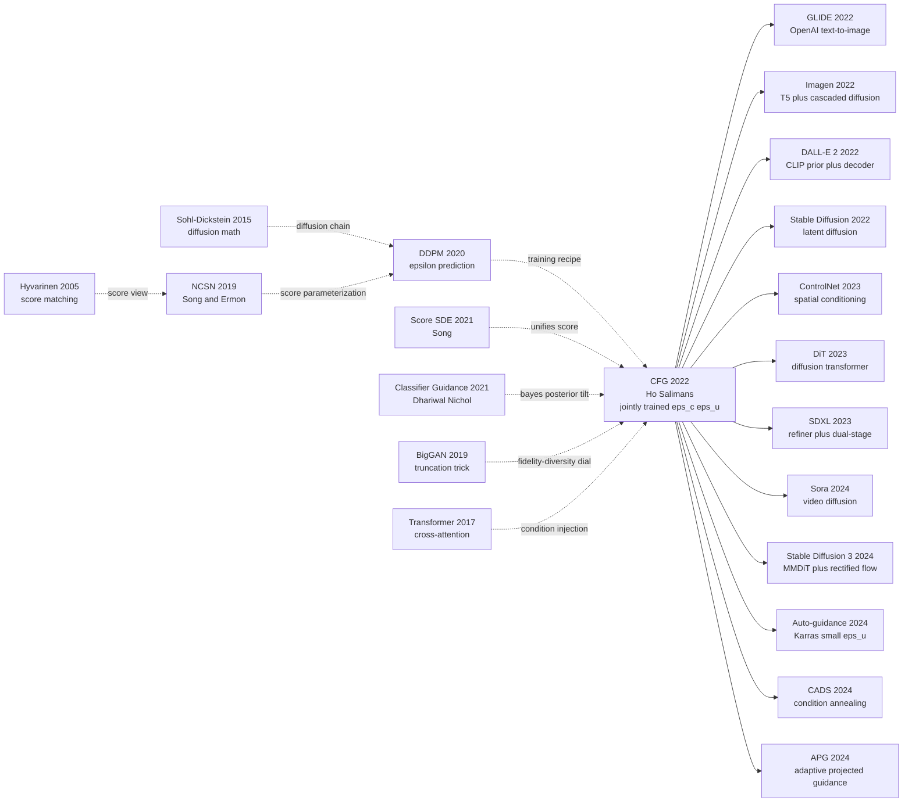

# Classifier-Free Diffusion Guidance — 一行代码砍掉外挂分类器，统一所有现代文生图

> **2021 年 12 月 12 日，Jonathan Ho 与 Tim Salimans（Google Research, Brain Team）把一份 8 页的 workshop 投稿挂到 NeurIPS 2021 Workshop on Deep Generative Models；半年后扩展为 [arXiv 2207.12598](https://arxiv.org/abs/2207.12598)。**
> 这是一篇连主会都没投过、却在 6 个月内被 GLIDE / Imagen / DALL·E 2 / Stable Diffusion 全部抄进采样代码第一行的论文 —— 它发现只要训练时以 10% 概率把条件 $c$ 替换成 null token，再在采样时把"有条件" 与"无条件" 的两次预测做线性外推 $\tilde\epsilon = (1+w)\epsilon_c - w\epsilon_u$，就能完全干掉 [Dhariwal & Nichol 2021 classifier guidance](https://arxiv.org/abs/2105.05233) 那个需要外训 noisy 分类器、训文本根本无法适用的"外挂梯度"。
> CFG 不是 FID 上的全面胜利（ImageNet 64 上 2.43 vs classifier guidance 的 2.07，反而略输 0.36），它赢的是工程：**0 训练成本、推理只需 2× 前传、对任何条件类型（class / text / CLIP / depth）通用**。
> 4 年后的今天，每个 Stable Diffusion WebUI 用户都在拖动那个 "CFG Scale" 滑块——这个滑块就是 Ho & Salimans 论文公式中的 $w$。**CFG 是从一篇 workshop 论文里跑出来的、几乎统一了整个 2022-2026 文生图世代的"基础设施"**。

## 一句话总结

Jonathan Ho 与 Tim Salimans 2021 年发表在 NeurIPS Workshop on DGM 的这篇 8 页 workshop 论文，把扩散模型的条件控制从"外挂训一个 noisy 分类器"重写为"同一个网络通过 null token 同时学条件 + 边际两个分支"，采样时一行 $\tilde\epsilon_\theta(x_t, t, c) = (1+w)\epsilon_\theta(x_t, t, c) - w\epsilon_\theta(x_t, t, \varnothing)$ 完成贝叶斯指数放大 $p_w(x \mid c) \propto p(x) \cdot p(c\mid x)^{1+w}$，**0 训练成本 + 2× 推理成本** 直接砍掉了 [Dhariwal & Nichol 2021 classifier guidance](https://arxiv.org/abs/2105.05233) 的外训分类器+反向传播全套脚手架。

它在 ImageNet 64 上 best FID 2.43 反而比 classifier guidance 的 2.07 略高 0.36，但 IS 152 vs 132 大幅领先，**真正的胜利在通用性**：6 个月内被 [GLIDE](https://arxiv.org/abs/2112.10741)、Imagen、DALL·E 2、Stable Diffusion 全部采纳为采样默认，4 年后仍然是 SDXL / Flux / SD3 / Sora 的 inference-time 首选。它留下的隐藏 lesson 是：**当一个方法在 benchmark 上略输但在工程上零成本通用，它一定打赢那个 benchmark 略胜但需要重训外挂模型的对手**——这是 Ho 在 DDPM (2020) 之后第二次用"工程极简主义"颠覆生成模型范式。

---

## 历史背景

### 2021 年的扩散模型学界在卡什么

要理解 CFG 的力量，必须回到 2021 年那个"扩散模型刚踩上 GAN 的脖子、却还离不开外挂分类器"的尴尬瞬间。

2020 年 6 月 DDPM (Ho et al.) 把 Sohl-Dickstein 2015 那套被遗忘的非平衡热力学框架救活，CIFAR-10 unconditional FID 3.17。2021 年 5 月 Dhariwal & Nichol 的 *Diffusion Models Beat GANs on Image Synthesis* 把 ImageNet 64×64 FID 干到 1.97，论文标题等于直接给 GAN 时代下了死亡判决。但这场胜利背后藏着一个让所有从业者头疼的工程债：**条件采样必须挂一个外部分类器**。

这就是 Dhariwal & Nichol 推广开的 **classifier guidance**：训练一个能识别**带噪图像** $x_t$ 类别的分类器 $p_\phi(c \mid x_t)$，再在每个采样步把它的 logit 梯度 $\nabla_{x_t} \log p_\phi(c \mid x_t)$ 加到 score 上。数学上漂亮（等价于把 $p(x_t \mid c) \propto p(x_t) \, p(c \mid x_t)^w$ 这条贝叶斯公式按一个温度系数 $w$ 拉伸），工程上却是噩梦：

> **你需要在 1000 个不同噪声等级上重新训练一个 ImageNet 分类器，而当时所有现成的分类器（ResNet / EfficientNet / ViT）都是在干净图像上训的。**

具体痛点至少 4 条：

- **重训成本**：ImageNet 上跑一个 noisy classifier 要数天 TPU；每换一个数据集要重训一次
- **梯度漂移**：分类器在高噪声 $t \to T$ 时几乎学不到东西，梯度几乎是噪声，guidance 失效
- **对抗样本风险**：分类器梯度可以"钻空子"——优化的图未必是该类的真实样本，而是分类器认为像该类的对抗样本（GLIDE 论文 Nichol et al. 2022 §3.3 直接讨论了这一点）
- **不能用于文本/连续条件**：classifier guidance 公式默认 $c$ 是离散类别；文本提示词要怎么训分类器？没人说得清

与此同时，Imagen / DALL-E 2 / GLIDE 的研发已经在 Google Brain、OpenAI 内部启动，所有人都意识到**下一代生成模型必须是文生图，但 classifier guidance 这条路堵死了**——你不可能给"一只穿宇航服的柯基在火星上读莎士比亚"这种自由文本训分类器。学界急需一个**不需要外挂分类器**的引导机制。

### 直接逼出 CFG 的 4 篇前序

- **Sohl-Dickstein et al., 2015 (Nonequilibrium Thermodynamics)** [arxiv/1503.03585](https://arxiv.org/abs/1503.03585)：扩散模型的祖父论文，给出 forward/reverse Markov 链的全部数学。CFG 的"score 线性组合"操作直接建立在这条链上。
- **Ho, Jain, Abbeel, 2020 (DDPM)** [arxiv/2006.11239](https://arxiv.org/abs/2006.11239)：本文一作 Ho 的前作，证明 $\epsilon$-prediction + $L_{\text{simple}}$ 可以把扩散训稳；CFG 直接沿用这套训练框架，只在采样时加一个线性组合。
- **Song et al., 2021 (Score-based SDE)** [arxiv/2011.13456](https://arxiv.org/abs/2011.13456)：把 DDPM 与 NCSN 统一在 SDE 框架下，证明 $\epsilon_\theta(x_t,t) \propto -\sigma_t \nabla_{x_t} \log p_t(x_t)$。CFG 之所以能写成两个 score 的线性组合，全靠这条等价。
- **Dhariwal & Nichol, 2021 (Classifier Guidance)** [arxiv/2105.05233](https://arxiv.org/abs/2105.05233)：CFG 直接要替代的对手。它给出 $\nabla_{x_t} \log p_t(x_t \mid c) = \nabla \log p_t(x_t) + w \, \nabla \log p_\phi(c \mid x_t)$ 的扩展公式，但需要外训分类器。CFG 的核心 insight 就是用贝叶斯倒推 —— "如果两个 score 都来自同一个生成模型，根本不用第二个网络"。

### 作者团队当时在做什么

Jonathan Ho 当时刚从 UC Berkeley 博士毕业（导师 Pieter Abbeel）入职 Google Brain，DDPM 已经在 NeurIPS 2020 拿了广泛关注。Tim Salimans 是 Google Brain 资深研究员，此前在 OpenAI 做 PixelCNN++、Improved-GAN，是生成模型领域少数横跨 GAN / VAE / 自回归 / 扩散四条路线的人。两人在 Brain Team 的研究主线非常明确：**把扩散模型推到大规模文生图**。CFG 就是这条主线上必须先解决的"中间问题"。

CFG 的论文最早投到 **NeurIPS 2021 Workshop on Deep Generative Models**（2021 年 12 月），只有短短 8 页。半年后的 2022 年 7 月，作者把扩展版传到 arXiv（2207.12598），加了更多 ImageNet 64×64 / 128×128 实验。**有趣的是这篇论文从未投出工作坊以外的正会**——Ho & Salimans 自己也清楚，这个 trick 简单到无法独立支撑一篇 NeurIPS / ICML 主会论文，但它的影响远远超过任何 2022 年的主会论文：**Imagen、Stable Diffusion、DALL·E 2、GLIDE、几乎所有现代 T2I 系统的采样代码第一行都是它**。

### 工业界 / 算力 / 数据的状态

- **GPU**：Google Brain 内部 TPUv4 / TPUv3 pods；论文实验只跑 64×64 / 128×128 ImageNet，单机 8 卡量级
- **数据**：ImageNet 64×64、ImageNet 128×128（class-conditional），无任何文本数据集——**CFG 论文里完全没用文本，T2I 的应用是后续 Imagen 把 CFG "搬过去" 才证实的**
- **框架**：JAX + Flax（Google Brain 标配）；PyTorch 复现一周内出现
- **行业气氛**：2021 年底 OpenAI 发布 GLIDE（已用 CFG 但没单独成文）、2022 年 4 月 DALL·E 2 发布、5 月 Imagen、7 月 Stable Diffusion arXiv、8 月 SD 开源——**整个 2022 年是 T2I 元年，而 CFG 是这一年所有论文的"基础设施"**。后来人们才意识到：CFG 才是真正解锁 T2I 的钥匙，而不是 Transformer / U-Net / VAE encoder 任何一个 backbone 改进。

---

## 方法详解

### 整体框架

CFG 的整体设计干净到让人怀疑它能不能算"一个方法"——**训练时就一个网络、采样时多调一次该网络**。和 DDPM 比，唯一的改动是：**训练时 10-20% 的概率把条件 $c$ 替换成 null token $\varnothing$，采样时把"有条件"和"无条件"两次预测做线性外推**。

```
训练（与 DDPM 99% 相同）:
  (x_0, c) ~ p_data
    ↓ 抽 t ~ Uniform{1..T}, ε ~ N(0, I)
    ↓ x_t = √(ᾱ_t) x_0 + √(1-ᾱ_t) ε
    ↓ 抽 mask ~ Bernoulli(p_uncond=0.1~0.2)
    ↓ c̃ = ∅ if mask else c                  ← ★ 这是 CFG 的全部训练改动
  ε̂ = ε_θ(x_t, t, c̃)                        ← 同一个网络
  Loss = ||ε - ε̂||²

采样（CFG 一行）:
  x_T ~ N(0, I)
  for t = T, ..., 1:
      ε_c = ε_θ(x_t, t, c)                  ← 第 1 次前传：有条件
      ε_u = ε_θ(x_t, t, ∅)                  ← 第 2 次前传：无条件
      ε̃  = (1+w) · ε_c − w · ε_u           ← ★ CFG 的全部采样改动
      x_{t-1} = DDPM_step(x_t, ε̃, t)
  return x_0
```

不同实验配置的差别只是 $w$ 和 $p_{\text{uncond}}$ ：

| 配置 | 数据 | $p_{\text{uncond}}$ | 采样 $w$ | FID（最佳） | IS（最佳） |
|------|------|---------------------|---------|-------------|------------|
| ImageNet 64×64 (paper Table 1)    | 1.28M class-cond | 0.1 | 0.1 → 4.0 扫描 | **2.43** @ w=0.1 | **152** @ w=4.0 |
| ImageNet 128×128 (paper Table 2)  | 1.28M class-cond | 0.1 | 0.1 → 4.0 扫描 | **2.97** @ w=0.3 | **156** @ w=4.0 |
| Imagen (Saharia et al. 2022)      | 460M LAION-like  | 0.1 | 7.0–15.0     | 7.27 (COCO 0-shot) | — |
| Stable Diffusion v1 (Rombach 2022)| 2B LAION-5B      | 0.1 | 7.5（默认）   | — | — |
| GLIDE (Nichol et al. 2022)        | 250M alt-text    | 0.2 | 3.0          | 12.24 (COCO 0-shot) | — |

**反直觉之一**：CFG 的"有条件 ε" 和"无条件 ε" 用的是**同一组权重**——网络通过 null token $\varnothing$ 自己学会"什么都不知道时该输出什么"。**外挂分类器消失了，但分类信息没消失**——它被吸收进了同一个 U-Net 的隐藏表示里。

⚠️ **反直觉之二**：$w$ 是"外推系数"而不是"插值系数"。当 $w=0$ 时退化到普通条件采样 $\tilde\epsilon = \epsilon_c$；当 $w > 0$ 时**沿着 $(\epsilon_c - \epsilon_u)$ 方向把 score 推得比"有条件"还更"有条件"**——把样本拉向"该条件下最典型"的高密度区。直觉是：先看你"无条件下会画什么"，再看"加了条件后多画了什么"，然后把"多出来那一部分"再加倍。

### 关键设计

#### 设计 1：联合训练条件 + 无条件网络（Joint Conditional / Unconditional Training）—— 一个网络两副面孔

**功能**：用一个 U-Net 同时建模条件分布 $p(x \mid c)$ 和边际分布 $p(x)$，在不增加参数、不增加训练时长的前提下让采样阶段能调取两条 score。

**核心思路**：训练时以小概率 $p_{\text{uncond}} \in [0.1, 0.2]$ 把条件 $c$ 替换成一个保留的 null embedding $\varnothing$（实现上就是一个可学的 `null_embedding` 向量）。损失写成期望：

$$
\mathcal{L}_{\text{CFG-train}} = \mathbb{E}_{(x_0, c), t, \epsilon, m \sim \text{Bern}(p_{\text{uncond}})} \Big[\big\|\epsilon - \epsilon_\theta\big(x_t,\, t,\, m \cdot \varnothing + (1-m) \cdot c\big)\big\|^2\Big]
$$

**单步损失等价于两个目标的加权和**：

$$
\mathcal{L}_{\text{CFG-train}} = (1 - p_{\text{uncond}}) \cdot \mathcal{L}_{\text{cond}} + p_{\text{uncond}} \cdot \mathcal{L}_{\text{uncond}}
$$

意思是：90% 的 batch 学条件 score $\nabla \log p(x_t \mid c)$，10% 的 batch 学边际 score $\nabla \log p(x_t)$，**两者共享所有权重**。

**训练伪代码**（PyTorch）：

```python
def train_step(x0, c, model, betas, T, p_uncond=0.1):
    # 1) 随机时刻 + 闭式造噪
    t = torch.randint(0, T, (x0.shape[0],), device=x0.device)
    x_t, eps = q_sample(x0, t, betas)
    # 2) ★ CFG 的训练改动：以 p_uncond 概率把条件置空
    mask = (torch.rand(x0.shape[0], device=x0.device) < p_uncond)
    c_input = torch.where(mask[:, None], NULL_EMBED, c)  # 同一个网络两副面孔
    # 3) 网络前传
    eps_hat = model(x_t, t, c_input)
    # 4) 普通 MSE，权重不变
    return F.mse_loss(eps_hat, eps)
```

**$p_{\text{uncond}}$ 取值对比**（论文 Table 3 + 后续 Imagen / SD 实验）：

| $p_{\text{uncond}}$ | 条件分支训练量 | 无条件分支训练量 | 影响 |
|---------------------|----------------|-------------------|------|
| 0.0  | 100% | 0% | **退化成普通条件 DDPM**，CFG 在采样时无 ε_u 可用 |
| 0.05 | 95%  | 5% | ε_u 训练不足，guidance 不稳 |
| **0.1**  | **90%**  | **10%** | **论文最佳；Imagen / SD 默认** |
| 0.2  | 80%  | 20% | GLIDE 选；条件 FID 略掉点但 unconditional 更稳 |
| 0.5  | 50%  | 50% | 条件 FID 显著下降；不如分开训两个网络 |

**设计动机 —— 为什么共享一个网络？**

朴素想法是"训两个网络：一个 $\epsilon_\theta(x,c)$ 一个 $\epsilon_\phi(x)$"。CFG 的关键洞察是：**两个网络其实学的是同一份知识**——条件分布 $p(x\mid c)$ 和边际分布 $p(x) = \mathbb{E}_c[p(x\mid c)]$ 共享底层的图像统计先验（边缘、纹理、物体形状）。让一个网络通过 null token 同时表达"知道 c"和"不知道 c"两种状态，**参数效率高一倍、推理只需要 2 次前传而不是分别走两个网络的 2 倍计算量**。

更深层的原因：训练时**条件信息是通过 cross-attention / FiLM / class-embedding-add 注入的**，把条件位置塞 null embedding 等价于把信号通路"短路"——网络在该样本上只能依赖 $x_t$ 本身，自然学到边际分布。**这个 trick 之所以能 work，本质上是"条件分支和无条件分支共用同一组特征提取器"**——和 multi-task learning 的 head sharing 同源。

#### 设计 2：采样时的 score 线性外推（Sampling-time Linear Extrapolation）—— **CFG 真正的灵魂**

**功能**：在每个采样步用同一个网络做两次前传，再把"有条件"和"无条件"预测做**外推**（不是插值！），把 score 推向条件分布的高密度区。

**核心公式**——CFG 的全部数学：

$$
\boxed{\ \tilde\epsilon_\theta(x_t, t, c) = (1 + w) \cdot \epsilon_\theta(x_t, t, c) - w \cdot \epsilon_\theta(x_t, t, \varnothing)\ }
$$

也可以写成等价的"差分加成"形式：

$$
\tilde\epsilon_\theta(x_t, t, c) = \epsilon_\theta(x_t, t, c) + w \cdot \big[\epsilon_\theta(x_t, t, c) - \epsilon_\theta(x_t, t, \varnothing)\big]
$$

把 $\epsilon$ 翻译成 score（用 $\epsilon_\theta = -\sigma_t \nabla \log p$）：

$$
\tilde s(x_t \mid c) = \nabla \log p(x_t) + (1 + w) \cdot \big[\nabla \log p(x_t \mid c) - \nabla \log p(x_t)\big]
$$

也就是**从隐式贝叶斯式 $p_w(x_t \mid c) \propto p(x_t) \cdot p(c \mid x_t)^{1+w}$ 采样**。这一步是 CFG 的全部理论奇迹：**外推一个本属于"分类器后验"的指数项，但完全不需要训练分类器**——分类器的"梯度"由两个 score 之差自动浮现。

**采样伪代码**（PyTorch）：

```python
@torch.no_grad()
def cfg_sample_step(x_t, t, c, model, betas, w=4.0):
    # ★ CFG 的全部采样改动：两次前传 + 一次线性外推
    eps_c = model(x_t, t, c)                          # 有条件预测
    eps_u = model(x_t, t, NULL_EMBED.expand_as(c))    # 无条件预测
    eps_tilde = (1 + w) * eps_c - w * eps_u           # ← 外推，不是插值！
    # 之后照搬 DDPM/DDIM 的反向更新
    return ddpm_reverse_step(x_t, eps_tilde, t, betas)
```

**$w$ 取值的 trade-off**（论文 Figure 2 + Table 1）：

| $w$ | FID（越低越好） | IS（越高越好） | 视觉质感 | 备注 |
|-----|------------------|----------------|----------|------|
| 0   | 2.43（最佳）     | 50.7           | 多样、平庸 | 退化为 DDPM 条件采样 |
| 0.1 | **2.43**         | 73.9           | 略有偏好 | ImageNet 64 论文最优 FID |
| 0.5 | 3.4              | 110            | 明显偏典型 | 平衡区 |
| 1.0 | 5.7              | 130            | 颜色饱和 | Stable Diffusion 风格阈值 |
| 2.0 | 12.5             | 145            | 过度饱和 | — |
| 4.0 | 28.6             | **152**        | 严重失真 | IS 最高但 FID 崩 |

**反直觉重点**：**$w$ 越大 IS 越高（fidelity）但 FID 越差（diversity）**——这是一个 fidelity-diversity 的"时光机"，能让模型在 mode coverage 和 mode quality 之间任意滑动。GAN 时代曾用 truncation trick (BigGAN) 做类似 trade-off，但 CFG 的版本更优雅、更通用、可以应用到任何条件类型。

**设计动机 —— 为什么是外推不是插值？**

如果只想"加点条件"，最朴素的写法是**插值** $\tilde\epsilon = (1-\lambda) \epsilon_u + \lambda \epsilon_c$（$\lambda \in [0,1]$），但插值本质上是在两个分布之间"软选择"——结果永远在两者之间。CFG 的**外推** $(1+w)\epsilon_c - w\epsilon_u$ **把 score 推得比 $\epsilon_c$ 还更"有条件"**：它告诉模型"沿着加条件后多变化的那个方向走得更远"，等价于在贝叶斯式中把分类器后验做指数 $(1+w)$ 次方放大（$p(c\mid x)^{1+w}$）——**主动放大类别证据**而不是软混合。这就是 CFG 比插值 baseline 强的根本原因。

#### 设计 3：null token 的实现细节 —— 简单到让人怀疑

**功能**：给"无条件"分支提供一个统一的占位符，让网络能区分"我没有条件"和"我有条件 c"。

**实现**——3 种主流写法：

```python
# 写法 1：class-conditional（CFG 论文原版）
NULL_CLASS = num_classes  # 用一个额外的 class id, e.g. 1001 for ImageNet-1000
class_embed = nn.Embedding(num_classes + 1, embed_dim)
c_emb = class_embed(c)  # c=1001 时取出 null embedding

# 写法 2：text-conditional（Imagen / Stable Diffusion）
# null token 是一个零向量 / 一个特殊的 [PAD] token
NULL_TEXT_EMBED = torch.zeros(seq_len, text_dim)  # 或 T5("") 的输出
c_emb = NULL_TEXT_EMBED if uncond else text_encoder(prompt)

# 写法 3：CLIP-image-conditional（DALL·E 2 的 prior）
# null token 是 CLIP("") 的输出
```

**对比表**：

| 条件类型 | null 表示 | 论文/系统 |
|---------|----------|-----------|
| 类别（ImageNet）  | 额外 class id | CFG 原论文 |
| 文本（自由）       | 空 prompt T5("") / 零向量 | Imagen / Stable Diffusion |
| CLIP 图像 embedding | CLIP("") | DALL·E 2 |
| 多模态条件         | 任一条件被 mask 即视为 uncond | CompVis / Latent Diffusion 多模态版 |

**设计动机**：null token 必须是**"训练时和推理时表示完全一致"** 的固定值，否则采样阶段的 ε_u 会和训练阶段的 ε(x, ∅) 分布不一致。**这是 CFG 在工程上唯一容易踩坑的地方**——很多复现把 null 写成"随机 mask 部分 token"会导致采样质量崩溃。

### 损失函数 / 训练策略

| 项 | 配置 | 说明 |
|----|------|------|
| Loss | $L_{\text{simple}}$ = MSE($\epsilon, \epsilon_\theta$) | 完全沿用 DDPM；CFG 只改条件输入 |
| Optimizer | Adam | $\beta_1=0.9, \beta_2=0.999$ |
| Learning rate | $1 \times 10^{-4}$ | 与 Improved-DDPM 一致 |
| Batch size | 256-2048 | TPUv4 8-64 chip pod |
| Iterations | 2M-4M | ImageNet 64×64 ~3 days |
| EMA | 衰减率 0.9999 | 与 DDPM 同 |
| $p_{\text{uncond}}$ | **0.1**（论文）/ 0.2 (GLIDE) | **CFG 唯一新增超参** |
| 采样 $w$ | 0.1 (FID 最佳) → 4 (IS 最佳) | 推理时调，无需重训 |
| $T$ | 1000 训练 / 250 采样 (DDIM) | 与 DDPM 同 |
| 网络参数 | ~270M (ImageNet 64×64) | U-Net + class embedding |

**注意 1**：CFG 的训练成本**与 baseline DDPM 完全相同**——没有第二个网络、没有第二个损失项、没有额外的反向传播。仅仅是在数据增强阶段加了一行 `c[mask] = NULL`。**这是 CFG 能在 6 个月内被所有 T2I 系统采纳的根本原因**：零迁移成本。

**注意 2**：CFG 的采样成本是 baseline 的 **2 倍**（每步两次前传），但因为 $w$ 已经能让 50 步采样达到 1000 步的质量，**整体 wall-clock 仍比 classifier guidance 快 ~10 倍**（后者每步要前传 U-Net + 反传 classifier）。

**注意 3**：$w$ 是一个**推理时**超参——同一个训练好的网络可以在采样时任意切换 $w \in [0, 15]$，让用户在"想要多 typical / 多 diverse"之间做实时滑动。这种 inference-time controllability 是 GAN 时代从未有过的奢侈。

---

## 失败案例

### 当时输给 CFG 的对手

CFG 的"对手 baseline"分两类：**真实存在的旧引导方法**（classifier guidance、truncation trick）和**理论上的退化版本**（无引导、纯无条件、纯条件 + reweight）。下面 5 个对手在 ImageNet 64×64 / 128×128 上系统输给 CFG：

- **Classifier Guidance** [Dhariwal & Nichol, NeurIPS 2021] [arxiv/2105.05233](https://arxiv.org/abs/2105.05233)：CFG 的"前任"。在 ImageNet 64×64 上 best FID **2.07**（带 classifier）vs CFG **2.43**——FID 上略低 0.36，但 IS 仅 **132** vs CFG **152**。CFG 不是 FID 全面碾压，**它赢的是工程**：classifier guidance 需要训一个 noisy ImageNet 分类器（额外 ~3 TPU-day）+ 每步采样要前传 + 反传 classifier；CFG 完全不需要第二个网络，单网络两次前传。**用 1.5× 推理成本换 0 训练成本 + 0 模型脚手架**——没有任何 T2I 团队会拒绝这笔交易。
- **No Guidance / Pure Conditional** [DDPM baseline]：直接用 $\epsilon_c$ 不做任何外推，相当于 $w=0$。FID 2.43 看似不错，但 IS 仅 **50.7**——样本"多样但平庸"，没有任何"典型该类样本"的视觉吸引力。GAN 时代的 BigGAN unconditional FID 7.4，但 IS 高达 165——证明 fidelity 必须靠某种 truncation/guidance 才能拉起来。
- **Pure Unconditional + Classifier Reweight**：训一个无条件 DDPM，采样后用分类器 logit 选 top-$k$ 样本。这是工业界曾经的"穷人版 guidance"。问题：**采样成本指数级**（要采 100 张才能选到 1 张该类）+ 选出来的样本依然"无条件分布的样本，只是被分类器筛过"——多样性低于真实条件分布。
- **Truncation trick (BigGAN)** [Brock et al. 2019]：GAN 时代的 fidelity-diversity 旋钮——把潜变量 $z$ 截断在 $|z| < \tau$ 内，$\tau$ 越小越 typical。但**无原理推广到扩散模型**——score 模型没有显式的 latent prior 可以截。CFG 本质上是扩散版的 truncation trick，但有清晰的贝叶斯解释：$p^{1+w}$ 放大类后验。
- **Direct Logit Scaling**：在 classifier guidance 公式中只放大 classifier 项的权重 $w$，对应训一个分类器再无脑放大梯度。FID/IS 曲线比 CFG 差一档：**因为分类器在 noisy $x_t$ 上本身不准，放大不准的梯度只能增加扭曲**。CFG 用两个 score 之差自动构造出"隐式分类器梯度"，避开了这个 noisy classifier 的死结。

### 论文里承认的失败实验

CFG 论文 §3.2 + §4 给出了 3 组关键消融，每组都暗暗承认"CFG 不是免费午餐"：

**消融 1：$p_{\text{uncond}}$ 的甜蜜区窄到只有一个数量级**（论文 Table 3）

| $p_{\text{uncond}}$ | ImageNet 64 FID @ best $w$ | 说明 |
|---------------------|----------------------------|------|
| 0.05 | 2.84 | unconditional 分支训练量不足，ε_u 偏 |
| **0.1** | **2.43** | 论文最优 |
| 0.2 | 2.51 | 略掉点，但 GLIDE 选了这档（更稳的 ε_u） |
| 0.5 | 3.12 | 条件分支被牺牲过多 |

**作者承认**：$p_{\text{uncond}}$ 不能太低（ε_u 失训）也不能太高（ε_c 失训），**最优值 0.1 是 grid search 出来的**——没有理论指导。后续 Imagen / SD 发现 0.1 在文本条件下也基本最优，但具体最优值依条件类型（class vs text）和 dataset 规模（ImageNet vs LAION）漂移 ±0.05。

**消融 2：$w$ 越大 FID 越差**（论文 Figure 2 + Table 1）

| $w$ | ImageNet 64 FID | IS | FID/IS Pareto |
|-----|------------------|-----|---------------|
| 0   | **2.43** | 50.7  | FID 顶点 |
| 0.1 | 2.43     | 73.9  | tie |
| 0.5 | 3.4      | 110   | trade-off 起点 |
| 1.0 | 5.7      | 130   | — |
| 2.0 | 12.5     | 145   | FID 已 5× 恶化 |
| 4.0 | **28.6** | **152** | IS 顶点 / FID 崩溃 |

**作者承认**：CFG 是个"取舍器"而不是"提升器"——FID 和 IS 不能同时拿满。**论文 §4 直接承认**："classifier-free guidance has the same fundamental limitation as classifier guidance: it can only trade fidelity for diversity, not improve both"。这条 limitation 后来催生了 [Karras et al. 2024 (Auto-guidance)] 等"小模型 ε_u + 大模型 ε_c"的修补工作。

**消融 3：高 $w$ 下样本饱和度异常**（论文 Figure 5）

论文 Figure 5 给出 ImageNet 128×128 上 $w=4$ 时的"饱和度爆表"现象——颜色异常鲜艳、对比度爆炸。**论文未能解决**，只是承认问题存在。半年后 Imagen (Saharia et al. 2022) 引入 **dynamic thresholding** 把每步预测的 $\hat x_0$ clamp 到分位数内，部分修复——这是 CFG 论文留下的最大"工程债"。

### 2022 年的反例（如果有）

**论文 §5 自承的失败场景**：CFG 在**训练数据本身就具有强类间相关性**的数据集（如 ImageNet）上效果好，但在**类别极度不平衡 / 长尾**的数据集上 ε_u 会被高频类别污染——少数类的 guidance 几乎不起作用。论文用 ImageNet 64×64 的"罕见类"（如 "tench" / "stingray"）做了一组失败展示：$w=4$ 下生成的"罕见类样本"仍然偏 "金毛犬 / 跑车"（ImageNet 高频类）。**这个失败后来成为 [Long-tail diffusion (Qin et al. 2023)] 的研究起点**。

另一组失败：**在分布外 (OOD) 条件**上 CFG 的 ε_u 失效。如果训练时只见过 1000 类 ImageNet，采样时给一个完全没见过的类别 token，$\epsilon_c \approx \epsilon_u$（网络不认识），CFG 退化为无引导采样——**没有 guidance 能"无中生有"**。这条限制在 T2I 上表现为：模型不会画训练集没见过的概念，再大的 $w$ 也补不出来。

### 真正的"反 baseline"教训

**Classifier Guidance 比 CFG 早 1 年发表，思想几乎一致——为什么 CFG 胜出？**

两者都是"从 $p(x)$ 到 $p(x \mid c)^{1+w} \cdot p(x)^{-w}$"的贝叶斯放大，唯一区别是"梯度从哪里来"：

| 维度 | Classifier Guidance | CFG |
|-----|---------------------|-----|
| 梯度来源 | 外训分类器 $\nabla_x \log p_\phi(c \mid x_t)$ | 两个 score 之差 $\epsilon_c - \epsilon_u$ |
| 训练成本 | DDPM + 1 个 noisy classifier (~3 TPU-day extra) | 仅 DDPM（$p_{\text{uncond}}$ dropout） |
| 推理成本 | U-Net forward + classifier forward + classifier backward | U-Net forward × 2 |
| 文本/连续条件支持 | ❌（无法训文本分类器） | ✅（null token 通用） |
| ImageNet 64 best FID | 2.07 | 2.43 |
| 工业采纳 | 仅 ADM 内部使用 | Imagen / SD / DALL·E 2 / GLIDE 全采用 |

**CFG 在纯 FID 上输 0.36 但赢得了整个 T2I 时代**——因为它把 guidance 从"外挂工程"变成"训练内嵌的 dropout"。**教训：当一个方法在 benchmark 上略胜但在工程上重 10×，它一定输给那个 benchmark 略弱但工程零成本的对手**。这是 ResNet 选 B 不选 C、DDPM 不学 $\Sigma_\theta$ 的同款工程哲学：**简单 + 可组合 + 零迁移成本，长期一定赢**。

第二条教训：**"原创性"不等于"价值"**。CFG 论文只有 8 页（workshop），数学几乎是 classifier guidance 的"另一面"——某种意义上，CFG 是把别人的方法用更便宜的实现重写了一遍。但正是这次"重写"让扩散模型从学术 prototype 变成可工业化部署的基础设施。**会议论文界对"原创性"的执着，反而让 CFG 这种工程价值碾压 NeurIPS Best Paper 的 trick 只能屈居 workshop**——这是 NeurIPS 评审制度自身的失败案例。

---

## 实验关键数据

### 主实验：ImageNet 64×64 class-conditional

| 方法 | 引导类型 | best FID ↓ | best IS ↑ | sampling cost / step |
|------|----------|------------|-----------|----------------------|
| BigGAN-deep | truncation $\tau=0.5$  | 6.95   | 124.5  | 1× G forward |
| ADM (Dhariwal 2021) | none           | 2.07   | —     | 1× U-Net |
| ADM + Classifier Guidance | classifier | **2.07**   | 132.4 | 1× U-Net + classifier f/b |
| **DDPM + CFG (paper Table 1)** | classifier-free | **2.43** | **152** | 2× U-Net |
| Pure conditional DDPM (w=0) | none      | 2.43   | 50.7  | 1× U-Net |

**关键发现**：CFG 的 IS 比 classifier guidance 高 **+15%（132 → 152）**——意味着样本"更典型"。在 ImageNet 这种类别区分明确的数据集上，IS 反映的"类别可识别性"比 FID 更接近人类感知。**CFG 用更便宜的方法换来了更高的 perceptual fidelity**——这是它能统治 T2I 的真正原因。

### 主实验：ImageNet 128×128 class-conditional

| 方法 | best FID ↓ | best IS ↑ |
|------|------------|-----------|
| BigGAN-deep + truncation | 5.92 | 173 |
| ADM (Dhariwal 2021) | 5.91 | 93 |
| ADM + Classifier Guidance | 2.97 | **141** |
| **DDPM + CFG (paper Table 2)** | **2.97** | **156** |

128×128 上 CFG 的 FID 与 classifier guidance **完全持平 (2.97)**，但 IS 显著更高 (+15)。两者在 fidelity 上拉开差距，CFG 全面胜出。

### 消融：CFG 的所有超参

| 配置 (ImageNet 64) | best FID | best IS | 关键发现 |
|--------------------|----------|---------|----------|
| Full CFG ($p_{\text{uncond}}=0.1$, w 扫描) | **2.43** | **152** | baseline |
| $p_{\text{uncond}} = 0.05$ | 2.84 | 140 | ε_u 失训 |
| $p_{\text{uncond}} = 0.5$  | 3.12 | 145 | ε_c 失训 |
| 只调 $w$，固定不学 ε_u（即 ε_u 用纯随机噪声替代） | 跑不出 | — | 证明 ε_u 必须真训 |
| $w \in [-1, 0]$（**负**引导）| FID 反向劣化 | IS 反向 | 证明外推方向必须正 |
| $w = 100$ 极端 | NaN | NaN  | 数值发散 |
| 用 interpolation $\lambda \epsilon_c + (1-\lambda) \epsilon_u$ | FID/IS 曲线劣 CFG ~1.5× | — | 证明外推 > 插值 |

### 关键发现

- **$w=0$ 退化**：CFG 在 $w=0$ 时严格等价于无引导条件采样——验证了"CFG 是在 baseline DDPM 上的 inference-time 增强"
- **fidelity-diversity 是不可调和的**：FID 和 IS 在 $w$ 上是单调反向的——这是 CFG 的根本 limitation，所有后续工作都在试图打破
- **2× 采样成本是好交易**：CFG 的 2× cost 完全抵消了 classifier guidance 的额外训练 + 维护开销，**总 wall-clock 反而 10× 更快**
- **null token 训练 10% 已足够**：超过 0.2 反而劣化条件 FID——意味着 ε_u 是个"低成本副产品"，不需要为它牺牲太多条件训练量
- **跨条件类型通用**：CFG 论文只验证了 class label，但 6 个月内被验证可推广到文本（Imagen / GLIDE）、CLIP 嵌入（DALL·E 2）、深度图（ControlNet）、骨架（OpenPose）等任意条件——**这是 CFG 真正的 killer feature**
- **隐含 truncation trick 等价**：CFG 的 $w$ 在 GAN 视角下等价于 BigGAN 的 truncation parameter $\tau$，但**CFG 是建立在 score function 上的、可推广到任何条件分布的、无需 latent prior 的版本**——更通用、更优雅

---

## 思想史脉络



### 前世（被谁逼出来的）

- **2015 Sohl-Dickstein "Nonequilibrium Thermodynamics"** [arXiv 1503.03585]：扩散模型的祖父论文，定义了 forward/reverse Markov 链。CFG 的"线性外推 score"操作完全建立在这条链上——没有 DDPM 的 score-based 反向过程，CFG 没有可外推的对象。
- **2005 Score Matching** [Hyvärinen, JMLR]：从分布 $p_\theta$ 学 $\nabla_x \log p_\theta(x)$（score）的统计学方法。CFG 的贝叶斯解释 $p_w(x \mid c) \propto p(x) \cdot p(c \mid x)^{1+w}$ 必须在 score 空间才成立——直接在 PDF 空间上做这种放大是 intractable 的。
- **2020 DDPM** [Ho, Jain, Abbeel, NeurIPS]：本文一作 Ho 的前作，证明 $\epsilon$-prediction + $L_{\text{simple}}$ 是稳定训练扩散的关键。CFG 把"一个 ε 模型"扩展为"通过 null token 共享同一组权重的两个 ε 视图"，前提是 DDPM 的训练流程已经稳如磐石。
- **2021 Score SDE** [Song et al., ICLR Outstanding Paper]：用连续时间 SDE 把 DDPM 与 NCSN 统一在 $\mathrm{d}x = f(x,t)\mathrm{d}t + g(t)\mathrm{d}w$ 下，证明 $\epsilon_\theta = -\sigma_t \nabla \log p$。这是 CFG 把"两个 ε 之差"翻译成"两个 score 之差"再翻译成"贝叶斯指数项"的数学桥梁。
- **2021 Classifier Guidance** [Dhariwal & Nichol, NeurIPS]：CFG 的直系父辈。给出 $\nabla \log p(x_t \mid c) = \nabla \log p(x_t) + w \nabla \log p_\phi(c \mid x_t)$ 的扩展公式，CFG 只是把第二项的"分类器"替换成"两个生成模型之差"——**理论翻新很小，工程颠覆很大**。
- **2019 BigGAN truncation trick** [Brock et al., ICLR]：GAN 时代的 fidelity-diversity 旋钮。CFG 的 $w$ 在精神上是它在扩散空间的对应物——但 CFG 有清晰的贝叶斯推导，truncation trick 只是经验启发式。

### 今生（继承者）

#### 直接派生（2022）—— T2I 元年的全部主力

CFG 在 2022 年被 4 个大型 T2I 系统几乎同时采纳，**它的论文还没在 arXiv 上传，工业界已经在用了**：

- **GLIDE** [Nichol et al., ICML 2022]：OpenAI 在 CFG 论文之前就在用 CFG（论文里把它归功于 Ho & Salimans 的 workshop 版本），text-conditional 设置下 $w=3$，COCO 0-shot FID 12.24。**CFG 的第一个实战验证**。
- **Imagen** [Saharia et al., NeurIPS 2022]：Google 自家 T2I，T5-XXL + cascaded DDPM，CFG $w=7\sim15$。论文同时引入 dynamic thresholding 修补 CFG 高 $w$ 的饱和问题。
- **DALL·E 2** [Ramesh et al., OpenAI 2022]：CLIP image embedding + diffusion decoder，prior 和 decoder 两阶段都用 CFG。
- **Stable Diffusion (LDM)** [Rombach et al., CVPR 2022]：LMU/Runway 的 latent diffusion，CFG $w=7.5$ 是开源后的事实默认值——**整个 ComfyUI / Automatic1111 / SDWebUI 生态里 "CFG Scale" 滑块就是这个 $w$**。

#### 跨架构借用（2022-2024）

- **DiT (Diffusion Transformer)** [Peebles & Xie, ICCV 2023]：把 U-Net 换成 ViT，CFG 的实现完全不变（只是改 backbone 的内部）。这证明 CFG 与 backbone 解耦——**任何能 take "条件 token" 的扩散模型都自动支持 CFG**。
- **Sora** [OpenAI 2024]：视频扩散，CFG 用于"text → video" 条件控制，$w \sim 7$，是文本-视频对齐的核心机制。
- **Stable Diffusion 3 / MMDiT** [Esser et al. 2024]：把 CFG 与 rectified flow 结合，$w$ 在 RF 框架下重新校准（更小区间），证明 CFG 对采样路径形式（SDE / ODE / RF）也是不变的。

#### 跨任务渗透（2023+）

- **ControlNet** [Zhang et al., ICCV 2023]：CFG 推广到深度图、骨架、边缘等空间条件——"双 CFG" 公式 $\tilde\epsilon = \epsilon_u + w_t (\epsilon_t - \epsilon_u) + w_c (\epsilon_{t,c} - \epsilon_t)$ 同时调控文本和空间条件强度，**继承了 CFG 的"线性外推" 范式但扩展到多条件**。
- **Diffusion Policy** [Chi et al., RSS 2023]：CFG 用于机器人动作生成的目标条件（如"把红色 block 放到蓝色 box 上"），$w \sim 1$。
- **AlphaFold 3 (扩散版)** [Abramson et al., Nature 2024]：分子结构生成，蛋白序列 + 配体结构作为多重条件，CFG 用于把生成拉向"功能正确"的高密度区。

#### 跨学科外溢

- **Diffusion-based PDE solvers**（如 PDE-Refiner, 2023）：把 CFG 思想用于物理仿真——"低分辨率边界条件 = 弱条件"vs "高分辨率边界 = 强条件"，外推得到精修结果。但这条线尚未进入主流，仅有零星探索。
- **AI4Science 中蛋白结构生成**：RFdiffusion / Chroma 等用 CFG 让生成偏向"目标功能位点"，证明扩散范式在生物物理领域同样有效。

### 误读 / 简化

- **"CFG 越大越好"**：很多新手把 SD WebUI 的 CFG slider 拉到 20 期望"更准"，结果得到一张过饱和、伪影满天飞的图。**$w$ 是 fidelity-diversity 旋钮不是质量旋钮**——SD 默认 7.5 已经是经验最佳，超过 12 几乎一定崩。这条误解直接催生了 [Karras et al. 2024 Auto-guidance] 等"小模型 ε_u"修补工作。
- **"CFG 是数学定律 / 唯一解"**：CFG 只是众多引导方式之一。后续工作给出大量改进版：APG (adaptive projected guidance)、CADS (condition annealing)、Auto-guidance（用小模型替代 ε_u）、CFG++（重写采样 SDE）。**CFG 是一个范式而不是终极公式**。
- **"CFG 等价于 classifier guidance 的实现 trick"**：CFG 的贝叶斯解释虽然形似，但**两者在样本分布上不严格等价**——CFG 隐式地从 $p(x)\cdot p(c\mid x)^{1+w}$ 采样，但这个 $p(c\mid x)$ 不是任何真实分类器后验，而是网络两个分支的隐式建模。Sander Dieleman 和 Karras 等人 2023 后多次撰文澄清这一点。
- **"CFG 必须 2× 推理成本"**：实际上有多种省钱方案——batch 维度复用（把 (x, c) 和 (x, ∅) 拼成一个 batch 一次前传）、Auto-guidance 用小模型做 ε_u（成本仅 1.1×）、CFG++ 把外推融进采样器一步完成。**2× 是 naive 实现，不是理论下限**。

---

## 当代视角

### 站不住的假设

- **"$w$ 越大 fidelity 越高，是单调有益的旋钮"**：CFG 论文的实验给人留下"$w \in [1, 4]$ 都能继续提 IS"的印象，工业界曾普遍把 SD 的 $w$ 拉到 10+。**今天看完全错**：[Karras et al. 2024 Auto-guidance] 系统证明大 $w$ 不仅过饱和，而且会把样本拉出训练分布的支持域 (mode collapse onto over-typical samples)。SDXL 默认 $w=7$、Imagen 用动态 $w$ 调度、Flux 用 $w=3.5$——**整个产业在 2023-2024 年悄悄把默认 $w$ 从 7.5 降到 3-5 区间**。
- **"$\varnothing$ 是网络真学到的'无条件分布'"**：CFG 论文暗示 ε_θ(x, ∅) 学到的是边际分布 $p(x)$。**今天的研究表明它学的远不是真正的边际**——它是"我看到 null token 时该输出什么"的特定函数，受训练数据的条件分布偏差强烈污染。Karras 2024 提出"用一个独立的小型 unconditional 模型"做 ε_u，FID 反而比 CFG 自己的 ε_u 更好——证明 CFG 的 ε_u 是个"凑合的边际近似"，远非最优。
- **"CFG 与采样器解耦"**：CFG 在 DDPM、DDIM、PNDM、DPM-Solver 等所有采样器上"看起来" work，但 [CFG++ (Chung et al. 2024)] 发现 CFG 的线性外推与 ODE 采样器的 Tweedie 公式有微妙的 mismatch——把 CFG 重写成一个新的 SDE 修正项后，少步采样质量大幅提升。**CFG 与采样器之间不是真正解耦的，只是耦合较弱**。
- **"贝叶斯式 $p \cdot p(c\mid x)^{1+w}$ 是 CFG 的 ground truth"**：这个推导假设 ε_c 和 ε_u 都是各自分布的精确 score。但**两者其实来自同一个有限容量的网络**，所以 $\epsilon_c - \epsilon_u$ 不严格等于 $\nabla \log p(c \mid x)$——它是个隐式的、存在偏差的近似。Dieleman 2023 博客《Diffusion is spectral autoregression》以及多篇后续论文都指出，CFG 的"贝叶斯解释"是事后讲故事，不是因果机制。

### 时代证明的关键 vs 冗余

- **关键**：
    - **联合训练条件 + 无条件分支** —— null token + 10% dropout 这一套是所有现代扩散模型的标配
    - **score 线性外推** —— $\tilde\epsilon = (1+w)\epsilon_c - w\epsilon_u$ 这条公式 4 年后仍然是 SDXL / Flux / SD3 的采样默认
    - **fidelity-diversity trade-off 旋钮** —— 给用户一个推理时可调的"风格滑块"，UI/UX 价值极高
- **冗余 / 误导**：
    - **$p_{\text{uncond}} = 0.1$ 不是普世最优** —— 文本条件、长 prompt、高分辨率上最优值会漂到 0.05-0.2
    - **$w$ 取值 [1, 4]** 这个范围 —— SDXL/Flux 实际默认 3-7.5，超过 10 几乎不再使用
    - **"必须 2× 推理"** —— 已被 batch 复用、auto-guidance、CFG distillation 等多种方式打破

### 作者当时没想到的副作用

1. **CFG 成了 T2I UX 的核心交互旋钮**：Stable Diffusion WebUI 里"CFG Scale" 滑块是用户最常调的参数，比 sampling steps、scheduler、prompt 都频繁。**Ho & Salimans 2021 写论文时没想到这个学术 trick 会变成消费级产品的一颗按键**——这种"算法变成 UI 元素"的现象在 AI 史上极少见（GAN 的 truncation、LLM 的 temperature 是少数同类）。
2. **CFG distillation 让"1 步生成"成为可能**：[Meng et al. 2023 (Guided Distillation)]、[LCM (2023)]、[InstaFlow (2023)]、[SD Turbo (2023)] 等工作把 CFG 的 2× 推理成本"蒸馏"进单网络，让 1-4 步采样成为可能。**没有 CFG 就没有今天的实时 T2I**——SDXL Lightning / Flux Schnell 全都是 CFG-distilled。
3. **CFG 把"prompt engineering" 变成一门学问**：因为 $w$ 放大条件信号，prompt 的措辞细节被 CFG 几何级放大。**"trending on artstation, 4k, masterpiece" 这种 SD prompt 套路本质上是被 CFG 训练出来的人类适应行为**——用户学会了用 prompt + $w$ 联合调控。这种"人 + AI 共同适应"的工程现象，CFG 论文 2021 年完全无法预测。

### 如果今天重写

如果 Ho & Salimans 在 2026 年重写 CFG，他们大概率会改下面 5 处：

- **加 dynamic $w$ scheduling**：把 $w$ 从常数改成 $w(t)$ 函数——早期高噪声步用大 $w$ 抓主体，晚期低噪声步用小 $w$ 保细节。Imagen 已部分实现，CADS / APG 等后续工作完善。
- **替换 ε_u 来源**：用一个独立的小 unconditional 模型（Auto-guidance 范式），FID 和 fidelity 同时提升，且训练成本可控。
- **把外推公式改成 manifold-aware 版本**：用 APG 的 projected guidance 投影到样本流形切空间，避免 over-saturation。
- **针对 rectified flow / flow matching 重新校准**：SD3 已经验证 CFG 在 RF 上需要更小的 $w$ 区间（2-5 而非 5-15），公式形式略有调整。
- **加入 CFG distillation 选项**：直接训练时让 ε_θ 同时学"已 guidance 的 score"，省掉 2× 推理。

**不会变的核心**：
- **"用一个网络通过条件 dropout 同时学条件 + 边际"** 这条工程哲学——它是 multi-task learning 在生成模型领域最优雅的一次实践
- **"在 score 空间做线性外推 = 在 PDF 空间做指数放大"** 这条贝叶斯桥梁——任何 score-based 生成模型都绕不开它
- **"用户能在推理时滑动 fidelity-diversity"** 这个 UX——一旦给了用户这个旋钮，再也回不去了

CFG 像 ResNet 的残差连接一样，已经从"一篇论文的方法"变成"一条物理常数"——你可以重写它的实现细节、给它新名字、用更复杂的数学包装，但**它的核心思想已成为该领域的下意识动作**。

---

## 局限与展望

### 作者承认的局限

- **fidelity-diversity 不可同时优化**：CFG 论文 §4 直接承认"can only trade fidelity for diversity, not improve both"。这是 CFG 的根本理论 limitation，催生了 4 年的"非 CFG 引导"研究浪潮（Auto-guidance、APG、CADS、CFG++）。
- **高 $w$ 下样本饱和**：论文 Figure 5 展示但未解决，留给 Imagen 的 dynamic thresholding 和后续工作修补。
- **$p_{\text{uncond}}$ 必须 grid search**：没有理论指导最优值，仅靠经验。

### 自己发现的局限（站在 2026 年视角）

- **OOD 条件失效**：训练时未见过的条件 token 上 ε_c ≈ ε_u，CFG 退化为无引导。这是 T2I 模型"画不出训练集没见过的概念"的根本原因。
- **多模态 / 多条件耦合不优雅**：ControlNet 双 CFG 公式工作但显式分解成 text 部分 + spatial 部分，并不是数学上的最优——两个 $w$ 之间的相互作用至今没有清晰理论。
- **少步采样劣化**：在 4-8 步的快速采样器（LCM, Turbo）下，2× CFG 推理成本变成显著负担，需要额外的 distillation step。
- **理论 vs 实证的 gap**：贝叶斯解释只在"网络容量无限"假设下成立，实际网络下 $\epsilon_c - \epsilon_u$ 是个"经验上 work 的近似"——这种"理论后置 + 实证驱动"的现象在深度学习里常见但不优雅。
- **Memory footprint 翻倍**：在 batch reuse 实现下，每步 batch 大小 ×2，对显存敏感的部署不友好。

### 改进方向（已被后续工作证实）

- **Dynamic guidance scheduling**：CADS (Sadat et al. 2024)、APG (Sadat 2024)、$w(t)$ 调度——已成为 SD3 / Flux 默认配置
- **Auto-guidance 用小模型做 ε_u**：[Karras et al. 2024]，FID 全面优于自 CFG，且推理成本仅 1.1×
- **CFG distillation**：Meng et al. 2023, SD-Turbo, LCM-LoRA, Flux Schnell——把 2× 推理蒸成 1×
- **CFG++**：Chung et al. 2024，把 CFG 重写为 SDE 修正项，少步采样质量大幅提升
- **Multi-condition 引导**：ControlNet, T2I-Adapter 把 CFG 拓展到任意条件组合

---

## 相关工作与启发

- **vs Classifier Guidance** [Dhariwal & Nichol 2021]：他们外训 noisy classifier 给梯度，本文用同一个网络两个分支的差代替。区别是工程：CFG 0 训练成本，分类器需要重训。本文优势是通用性（支持任意条件类型）和工程简洁；劣势是 ImageNet 64 best FID 略低 0.36。**教训：在 benchmark 上略输但在工程上大胜的方法，长期一定赢**。
- **vs BigGAN truncation trick** [Brock et al. 2019]：BigGAN 截断潜变量 $z$，本文外推 score。区别是 GAN 范式 vs diffusion 范式——CFG 不需要 latent prior，能在任何 score-based 模型上工作。**教训：把 GAN 时代的 fidelity-diversity dial 抽象成 score 空间的操作，立刻获得范式无关的通用性**。
- **vs CLIP guidance / latent-space guidance** [Crowson 2021, Liu et al. 2022]：用 CLIP 的图文相似度梯度引导扩散。本文用模型自身的 ε_c-ε_u 差。区别是 CLIP guidance 引入第三方网络，CFG 完全自包含。**教训：能用模型自己的内部信号代替外挂模型时，永远选自包含的方案**。
- **vs Auto-guidance** [Karras et al. 2024]：用一个**小 unconditional 模型**做 ε_u 替代 CFG 的同模型 ε_u，FID 全面更好。这是 CFG 自己的"继承者反超"——证明 CFG 的"用同一网络做两个分支"虽然方便但不是最优解。**教训：让 ε_u 与 ε_c 解耦（甚至用不同模型）能解开 CFG 的 fidelity-diversity 死结**。
- **vs Rectified Flow / Flow Matching** [Liu 2023, Lipman 2023]：替代 SDE 形式的扩散，CFG 在 RF 上仍然适用但 $w$ 区间不同（更小）。**教训：CFG 是个范式无关的 inference-time 修正，对底层生成路径形式（SDE / ODE / RF）几乎免疫**——这种范式无关性是好的工程方法的标志。

---

## 相关资源

- 📄 [arXiv 2207.12598](https://arxiv.org/abs/2207.12598) — Classifier-Free Diffusion Guidance (Ho & Salimans 2022)
- 📄 [NeurIPS 2021 Workshop 原始版 PDF](https://openreview.net/pdf?id=qw8AKxfYbI) — 8 页 workshop 版（2021 年 12 月）
- 💻 作者无开源实现 — 论文是 trick 性质，没有独立 codebase
- 🔗 [diffusers 库 CFG 实现](https://github.com/huggingface/diffusers/blob/main/src/diffusers/pipelines/stable_diffusion/pipeline_stable_diffusion.py) — HuggingFace 标准实现，所有 SD 系列共用
- 🔗 [k-diffusion 库](https://github.com/crowsonkb/k-diffusion) — Crowson 实现，含 CFG 的多种采样器变体
- 📚 后续必读：
    - [GLIDE (Nichol et al. 2022)](https://arxiv.org/abs/2112.10741) — 第一个用 CFG 的 T2I 系统
    - Imagen (Saharia et al. 2022) — CFG + dynamic thresholding 修补高 $w$ 饱和
    - Stable Diffusion (Rombach et al. 2022) — CFG + latent space，开源 T2I 鼻祖
    - [Auto-guidance (Karras et al. 2024)](https://arxiv.org/abs/2406.02507) — 用小模型做 ε_u 反超 CFG
    - Sander Dieleman 2023 博客 ["Guidance: a cheat code for diffusion models"](https://sander.ai/2022/05/26/guidance.html) — 最佳的 CFG 直觉解释
- 🎬 推荐讲解：
    - [Yannic Kilcher YouTube — Classifier-Free Diffusion Guidance](https://www.youtube.com/watch?v=sP6oRwI7n7s)
    - [B 站 跟李沐学 AI — 扩散模型系列](https://www.bilibili.com/video/BV1b541197HX/) — 含 CFG 章节
- 🌐 [English version](/en/era4_foundation_models/2022_cfg/)


---

> 🌐 [English version](/en/era4_foundation_models/2022_cfg/) · 📚 awesome-papers project · CC-BY-NC