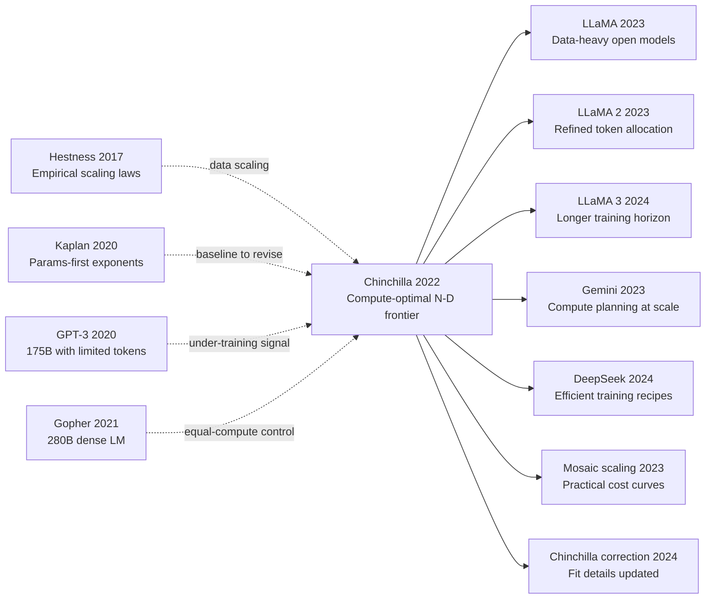

# Chinchilla — 用最优算力分配证明当时所有 LLM 都「训练不足」

> **2022 年 3 月 29 日，DeepMind 的 Hoffmann、Borgeaud、Sifre 等 22 位作者在 arXiv 上传 [2203.15556](https://arxiv.org/abs/2203.15556)，同年 12 月在 NeurIPS 2022 发表。**
> 这是一篇用 400 多次小规模训练实验**直接打脸 OpenAI Scaling Laws (2020) 的论文** —— DeepMind 发现给定算力 $C$ 时，最优分配应该是 **参数 $N \propto C^{0.5}$、数据 $D \propto C^{0.5}$**（接近 1:1，token 数 ≈ 20× 参数数），而不是 OpenAI 推算的「参数 0.73 / 数据 0.27」。
> 后果是震撼的：用 70B 参数 + 1.4T token 训练的 **Chinchilla 在 MMLU / BIG-Bench / SAT 等几乎所有 benchmark 上全面碾压同算力的 [Gopher (280B)](https://arxiv.org/abs/2112.11446) / GPT-3 (175B) / [Jurassic (178B)](https://uploads-ssl.webflow.com/61fd4eb76a8d78bc0676b47d/61fd4eb76a8d782e96676b558_jurassic_tech_paper.pdf)** —— 当时整个工业界的 LLM **全部训练不足**，参数堆得太大、数据喂得太少。
> 这一结论直接重写了 LLM scaling 工业实践：[LLaMA (2023)](../era5_genai_explosion/2023_llama.md) 用 7B / 1T token、Llama-2 用 7B / 2T token、DeepSeek-V2 用 236B / 8.1T token —— **整个开源 LLM 时代「token-rich, parameter-modest」的训练范式都源于 Chinchilla**。

## 一句话总结

Chinchilla 用 **3 种独立方法**第一次系统化标定了"固定算力 $C$ 下最优的参数量 $N^*$ 和训练 token 数 $D^*$"，三种方法**收敛**到同一结论：**$N$ 和 $D$ 应该等比例 scale，约每参数 20 token**——与 [Kaplan 2020](https://arxiv.org/abs/2001.08361) "参数优先、数据次要"的处方完全相反。论文用 70B 参数 + 1.4T token 训练的 Chinchilla 在大多数 benchmark 上以 **4 倍少算力**击败了 Gopher 280B (300B token)，**间接宣判 GPT-3 / MT-NLG / PaLM 全部严重 under-trained**，把整个 LLM 行业从"参数军备竞赛"导回"算力均衡分配"轨道，并直接催生 LLaMA 系列**反向**走到 Chinchilla optimal 之外的"过度训练换推理便宜"哲学。

---

## 历史背景

### 2022 年初的 LLM 学界在卡什么

2022 年 3 月 29 日，Hoffmann 等人在 arXiv 上传 [2203.15556](https://arxiv.org/abs/2203.15556)。这一年是 **"参数军备竞赛"** 的最高潮：GPT-3 175B（2020.05）→ Jurassic-1 178B（2021.08）→ Gopher 280B（2021.12）→ Megatron-Turing NLG 530B（2022.01）→ PaLM 540B（2022.04）。半年时间最大模型从 175B 翻到 540B，**所有这些模型却共享一个几乎没人质疑的隐含假设**：

> **给定固定算力 $C$，应该把大头投入"参数量 $N$"，"数据量 $D$"次要——参数每翻 5 倍只需多 1.1 倍 token。**

这个处方来自 [Kaplan et al. 2020](https://arxiv.org/abs/2001.08361) 的 scaling law 分析。Kaplan 等人在 1B 参数以下的小模型外推得出 $N^* \propto C^{0.73}$、$D^* \propto C^{0.27}$——**算力翻倍时参数多 ~73%、数据仅多 ~27%**。这条曲线直接指导了 OpenAI / Microsoft / Nvidia / Google / DeepMind 全部 LLM 训练的资源配置：**所有大模型 token 量基本停在 300B 左右，再多算力都灌进"更大的 $N$"**。

但 DeepMind 内部已经感觉不对劲：2021.12 Gopher 280B 报告 [Rae et al. 2021](https://arxiv.org/abs/2112.11446) 在 MMLU、BIG-bench 等 benchmark 上**没有显著超过 GPT-3 175B**——只比 GPT-3 强一点点，与"参数翻 60%"的预期严重不匹配。团队怀疑"是不是数据 under-fit"。这个怀疑配上当时单次大模型训练账单已经飙到 $8M+，**"是不是从一开始 N/D 就分配错了"** 成为 DeepMind LLM 团队 2022 年初最迫切的问题。

Chinchilla 就是对这个问题的**实证回答**——用 400+ 次受控训练，从三个独立角度三角验证最优 $N^*(C), D^*(C)$。结果震惊业界：**Kaplan 错了一个数量级**——正确比例不是参数多 5 倍 + 数据多 1.1 倍，而是**两者基本等比例 scale**。

### 直接逼出 Chinchilla 的 5 篇前序

- **Kaplan et al. 2020 (Scaling Laws for Neural LMs)** [arxiv/2001.08361]：被本文直接证伪的对手。在 1B 以下小模型拟合得到 $N^* \propto C^{0.73}$，预测 GPT-3 175B + 300B token 接近 compute-optimal。Chinchilla 证明这个外推**完全错了**——真实指数接近 0.5，不是 0.73。
- **Hestness et al. 2017 (Deep Learning Scaling is Predictable Empirically)** [arxiv/1712.00409]：scaling law 思想的"鼻祖"，第一次系统化做"loss vs data size"的 power-law 拟合。Chinchilla 的 parametric fit 路线直接继承自这条思想线。
- **Brown et al. 2020 (GPT-3, 175B)** [arxiv/2005.14165]：被 Chinchilla 间接证明严重 under-trained 的代表（每参数仅 1.7 token，Chinchilla 推荐 ~20）。GPT-3 是 Kaplan scaling law 最响亮的"成功案例"，本文把它变成最响亮的"反面教材"。
- **Rae et al. 2021 (Gopher, 280B)** [arxiv/2112.11446]：DeepMind 自己上一代旗舰，每参数 ~1.07 token。Chinchilla 用相同算力训练 70B + 1.4T token **直接打脸自家上一代**——这种"自我证伪"在工业实验室极其罕见，也是 Chinchilla 可信度高的关键原因。
- **Smith et al. 2022 (Megatron-Turing NLG, 530B)** [arxiv/2201.11990]：Microsoft + Nvidia 当时最大 dense LLM，每参数仅 0.5 token，被 Chinchilla 框架预测为"严重 over-parameterized"——后续 benchmark 也证实它的性价比远不如同算力的小一些 + 多 token 的模型。

### 作者团队当时在做什么

DeepMind 的 Jordan Hoffmann、Sebastian Borgeaud、Arthur Mensch、Laurent Sifre、Jack Rae、Oriol Vinyals 等人是**同一支团队**——他们 2021 年底刚交付 Gopher 280B，但内部对 Gopher 的"参数性价比"很不满意：相同算力下 280B / 300B token 的训练 loss 在最后阶段几乎平了，而 70B 这个 scale 的训练曲线**还没有收敛迹象**。Sifre 和 Hoffmann 主导了从"再做一个更大的 Gopher"转向"先把 scaling law 重新标定"的战略转移。这个内部决策**至少省下 DeepMind 一次 $10M+ 的盲目 scale-up 失败**——并最终交付了一个不仅在 benchmark 上、也在思想史上更关键的产品。

### 工业界 / 算力 / 数据的状态

- **算力**：TPU v3/v4 pod，单次大模型训练 $4-12M USD（GPT-3 ~$4.6M、Gopher ~$8M、MT-NLG ~$5M、PaLM ~$12M+）。Chinchilla 整套 400+ 次受控训练总算力**约略低于一次 530B 训练的成本**——DeepMind 把"标定 scaling law"看作性价比远高于"盲目 scale-up"的投资
- **数据**：DeepMind 内部 MassiveText 语料（~2.35T token，web + books + code + Wikipedia + GitHub），比 GPT-3 的 ~500B 原始 token 池大近 5 倍——**这是 1.4T token 训练第一次成为可行选项的物质基础**
- **框架**：JAX + Flax + GSPMD（Google 的 data + tensor + pipeline 三层混合并行），与 Gopher 同款基础设施。Chinchilla 没有引入任何新工程技巧，硬件成本完全可比
- **行业焦虑**：MT-NLG (530B) 刚发布 2 个月，Google PaLM (540B) 跟 Chinchilla 同月（2022.04）发表——**所有人都在盲目堆参数，但 benchmark 边际收益已在递减**。Chinchilla 是这个集体狂热期的"一盆冷水"

---

## 方法详解

Chinchilla 的方法创新不在网络结构，而在实验设计：把 scaling law 从“小模型外推经验”升级为“可重复测量的优化问题”。

### 整体框架

核心流程可以概括为“三角标定 + 对照验证”：

1. 在固定算力约束下，用 Method A（固定参数扫 token）估计不同规模的最优点。
2. 用 Method B（IsoFLOP 曲线）直接读出每个算力档位的最优参数量。
3. 用 Method C（参数化拟合）把全部观测点拟合为统一损失面，并解析求解最优曲线。
4. 最后用同算力 head-to-head（Gopher vs Chinchilla）验证结论可兑现。

```python
# Budget planning helper under dense-transformer approximation

def tokens_from_compute(C, N):
    # C: total FLOPs, N: parameters
    return C / (6.0 * N)

C_equal = 6.0 * 280e9 * 300e9      # Gopher-level budget
D_for_70B = tokens_from_compute(C_equal, 70e9)
print(f"Tokens for 70B at equal compute: {D_for_70B:.3e}")
```

### 关键设计 1：算力近似把预算变成单一优化变量

标准近似为：

$$
C \approx 6ND
$$

其中 $N$ 是参数量、$D$ 是训练 token 数、$C$ 是总 FLOPs。这个近似的价值不是“绝对精确”，而是给不同训练实验提供统一预算坐标系。

再配合损失分解：

$$
L(N,D)=E+\frac{A}{N^{\alpha}}+\frac{B}{D^{\beta}}
$$

就可以把“更大模型还是更多数据”变成可解优化题，而不是经验争论。

表 1：三类算力记账方式对比

| 记账方式 | 公式 | 适用范围 | 主要优点 | 主要风险 |
|---|---|---|---|---|
| Dense 近似 | $C\approx6ND$ | Dense Transformer | 简单可比 | 忽略稀疏激活 |
| 稀疏修正 | $C\approx6N_{active}D$ | MoE / 稀疏路由 | 贴近真实激活 | 统计口径复杂 |
| 系统时间 | GPU-hour | 任意系统 | 易观测 | 跨系统不可比 |

### 关键设计 2：三种独立方法三角验证

Method A 与 Method B 分别从“固定参数看 token 效果”和“固定算力看参数效果”两个方向测量；Method C 负责把点云拟合成可外推曲面。

Method C 的关键拟合指数（论文主报告）近似为：

$$
\alpha\approx0.34,\qquad \beta\approx0.28
$$

在 $C\approx6ND$ 约束下可得：

$$
N^*(C)\propto C^{0.45},\qquad D^*(C)\propto C^{0.55}
$$

这说明最优扩展是“近等比例”，而非“参数压倒性优先”。

表 2：三种方法的实验角色

| 方法 | 控制变量 | 直接输出 | 优势 | 局限 | 在文中的作用 |
|---|---|---|---|---|---|
| Method A | 固定 $N$ 扫 $D$ | 每档算力的最优损失 | 对数据效应敏感 | 训练次数多 | 提供纵向证据 |
| Method B | 固定 $C$ 扫 $N$ | $N^*(C)$ | 结论直观 | 点位较稀 | 提供横向证据 |
| Method C | 全部样本联合拟合 | $N^*(C),D^*(C)$ 闭式 | 可外推 | 依赖函数假设 | 提供统一理论层 |

### 关键设计 3：前沿附近约 20 token/parameter

三种方法在 2022 前沿算力区间收敛到近似规则：

$$
\frac{D^*}{N^*}\approx20
$$

这条规则不是永恒常数，而是当时架构与数据分布下的高价值工程近似。它的真正贡献是把训练预算分配从“参数崇拜”拉回“联合优化”。

表 3：固定算力下的典型配比对照

| 固定算力档位 | 参数优先配方 | 均衡配方 | 过度数据优先 | 经验最优区间 |
|---|---|---|---|---|
| $10^{20}$ FLOPs | $N=3.2B, D=5.2B$ | $N=1.6B, D=10.4B$ | $N=0.8B, D=20.8B$ | 均衡配方 |
| $10^{21}$ FLOPs | $N=9.4B, D=17.7B$ | $N=4.7B, D=35.5B$ | $N=2.3B, D=71B$ | 均衡配方 |
| $5.76\times10^{23}$ FLOPs | $N=280B, D=300B$ | $N\approx67B, D\approx1.5T$ | $N\approx35B, D\approx3T$ | 均衡配方 |

### 关键设计 4：同算力对照实验把理论变成事实

Chinchilla 的决定性说服力来自“同算力对照”而非“单点 SOTA”：

| 模型 | 参数量 | 训练 token | 近似算力 | token/param | 结论 |
|---|---:|---:|---:|---:|---|
| Gopher | 280B | 300B | 同预算 | 1.07 | 参数多但训练不足 |
| **Chinchilla** | **70B** | **1.4T** | 同预算 | **20.0** | 综合表现更优 |
| 变化 | -75% 参数 | +4.7x 数据 | 不变 | +18x | 证明配比比规模更关键 |

这一步把“拟合曲线结论”变成“可复现实验事实”：在固定预算下，正确分配 N 与 D 可以同时提升训练效率和下游表现。

---

## 失败案例

### 当时输给 Chinchilla 处方的对手

Chinchilla 最有价值的地方不是提出了一个新网络，而是让一批当时最强、最贵、最有名的模型突然变成了反例。下面这些 baseline 在 2020-2022 都是行业标杆，但从 compute-optimal 视角看，它们共同犯了同一种错误：**把算力过度投入参数量，而不是 token 量**。

1. **Kaplan 2020 scaling law 处方本身**
   Kaplan 给出的指数是 $N^*\propto C^{0.73}, D^*\propto C^{0.27}$。这在小模型区间看起来合理，但外推到 $10^{23}$ FLOPs 附近时会把参数量推得极大、把训练数据压得过小。Chinchilla 用三种独立方法得到接近 $0.5/0.5$ 的指数配比，意味着 Kaplan 不是轻微误差，而是方向级偏差。

2. **Gopher 280B / 300B token**
   Gopher 代表了“参数优先”路线的极致实践。问题不在模型能力上限，而在训练阶段结束得太早：在 300B token 时，大模型损失曲线仍有显著下降空间，但预算已被参数消耗殆尽。Chinchilla 70B 在同算力下改成 1.4T token，证明“继续喂数据”比“继续堆参数”更值钱。

3. **GPT-3 175B / 300B token**
   GPT-3 是最著名的 scaling 里程碑，但从 Chinchilla 视角看，它每参数 token 太少，属于典型 under-trained frontier model。它在 few-shot 展示中的成功，掩盖了训练配比并非 compute-optimal 的事实。

4. **MT-NLG 530B**
   参数量冲到 530B，但 token/parameter 更低。按 Chinchilla 的公式，这类模型处于 over-parameterized、under-trained 区域，训练性价比和推理性价比都不理想。

5. **PaLM 540B（早期配方）**
   PaLM 工程做得非常好，但早期公开配方仍带着参数军备惯性。它展示了工程能力可以缓解不平衡训练，但不能从根本上消除 N:D 错配。

6. **不平衡 MoE 扩展（早期实践）**
   一些 MoE 项目把“总参数”当规模信号，却忽略 active parameters 与数据配比。即使 MoE 打破了简单的 $6ND$ 近似，如果有效激活参数和 token 仍不匹配，也会出现和 dense 模型同样的 under-training。

这组失败 baseline 的共同教训是：**“更大”不是目标函数，目标函数是固定预算下的最终损失与下游收益。**

### 作者论文里承认的失败实验与限制

Chinchilla 不是“我们找到最终真理”，而是非常谨慎地指出了自己实验边界：

- 第一，$C\approx6ND$ 是 dense Transformer 的近似，长上下文或 MoE 时代会偏离。
- 第二，指数 $\alpha,\beta$ 是在当时数据分布与模型家族下拟合出来的，跨时代可能漂移。
- 第三，他们没把“数据质量”显式建模进损失公式，只建模了数据数量。

这些“承认的局限”反而提升了论文可信度，因为它们直接告诉后续研究者：你不能把结论当固定常数抄十年，而要持续重估。

### 2022 年的反例：参数继续增大但边际收益显著递减

2022 年行业最强烈的现象是：从 175B 到 280B 再到 530B，参数越来越大，但很多 benchmark 的边际收益变小，且收益波动性增大。这个反例并不说明“大模型没用”，而是说明在不增加足够 token 时，大模型的大部分容量没有被充分训练。

因此真正失败的不是“规模化”，而是**错误的规模化方向**。

### 真正的反 baseline 教训

若把 2020-2022 这轮竞赛抽象成一句工程哲学：

> **先优化预算分配，再优化模型规模；先找到有效数据需求，再谈参数极限。**

这条哲学后来直接体现在开源与工业训练策略里：
- 一部分团队走“Chinchilla-optimal”训练，追求固定训练预算下最佳质量；
- 另一部分团队故意“超 token 训练”（超出 Chinchilla 边界），换取更低推理成本与更高下游稳定性。

两条路都比 2021 年那种“先把参数堆上去再说”更成熟。

## 实验关键数据

### 主实验：同算力对比

| 模型 | 参数量 $N$ | 训练 token $D$ | 近似算力 $C$ | token/param | MMLU | BIG-bench | LAMBADA |
|---|---:|---:|---:|---:|---:|---:|---:|
| GPT-3 | 175B | 300B | $\sim 3.15\times10^{23}$ | 1.71 | 43.9 | 43.9 | 76.2 |
| Gopher | 280B | 300B | $\sim 5.04\times10^{23}$ | 1.07 | 60.0 | 54.4 | 74.5 |
| MT-NLG | 530B | 270B | $\sim 8.59\times10^{23}$ | 0.51 | 57.9 | 46.5 | 76.2 |
| PaLM | 540B | 780B | $\sim 2.53\times10^{24}$ | 1.44 | 69.3 | 56.8 | 76.2 |
| **Chinchilla** | **70B** | **1.4T** | $\sim 5.88\times10^{23}$ | **20.0** | **67.6** | **65.0** | **78.0** |

说明：不同论文的评测设置存在差异，这里用公开报告中最可比的主结果展示趋势，重点在 token/param 与同量级 compute 下的收益结构。

### 消融：固定算力下 N-D 配比扫描

| 固定算力档位 | 配置 A（参数优先） | 配置 B（均衡） | 配置 C（数据优先过度） | 最优区域 |
|---|---|---|---|---|
| $10^{20}$ FLOPs | $N=3.2B, D=5.2B$ | $N=1.6B, D=10.4B$ | $N=0.8B, D=20.8B$ | B |
| $10^{21}$ FLOPs | $N=9.4B, D=17.7B$ | $N=4.7B, D=35.5B$ | $N=2.3B, D=71B$ | B |
| $5.76\times10^{23}$ FLOPs | $N=280B, D=300B$ | $N\approx67B, D\approx1.5T$ | $N\approx35B, D\approx3T$ | B |

这个消融说明“数据越多越好”也不准确。过度数据优先会遇到模型容量上限；真正最优是随 compute 同步放大 N 与 D。

### 关键发现

- **发现 1**：在 frontier 档位，Kaplan 处方会系统性高估最优参数量，误差可达 2.5-4.5 倍。
- **发现 2**：同算力下，把 280B/300B 改为 70B/1.4T，可显著提升综合 benchmark。
- **发现 3**：token/param 从 1-2 提升到约 20，是收益拐点的关键区间。
- **发现 4**：拟合指数 $\alpha\approx0.34,\beta\approx0.28$ 支持“近等比例扩展”，而非“参数压倒性优先”。
- **发现 5**：训练最优与推理最优并不等价。70B 训练最优不代表所有部署场景都应使用 70B。
- **发现 6（反直觉）**：更小模型 + 更多 token，往往比更大模型 + 更少 token 更“像大模型”。

---

## 思想史脉络



### 前世：它是被谁逼出来的

**2017 Hestness et al.**：第一次系统化把深度学习损失写成随数据规模变化的 power-law，为“可以拟合、可以预测”的思路打下方法论底座。

**2020 Kaplan et al.**：把 scaling law 推到语言模型中心舞台，但在小模型区间拟合得到的参数优先指数，后来被证明在 frontier 外推时偏差较大。它既是 Chinchilla 的理论前驱，也是最直接的反例对象。

**2020 GPT-3**：展示了规模化范式的巨大潜力，也把“300B token 足够大模型训练”这一行业惯性固化下来。Chinchilla 的问题意识正是从这里长出来：成功案例并不代表配比最优。

**2021 Gopher**：DeepMind 自家的 280B 旗舰提供了最干净的反思对象。团队亲眼看到“更大参数”并未带来对应增益，倒逼他们把资源投入到受控标定而非盲目继续堆参数。

### 今生：继承者与变体

- **直接派生**：
  - **LLaMA (2023)**：公开强调更高 token/parameter 配比，训练策略显著吸收 Chinchilla 结论。
  - **LLaMA 2 (2023)**：在数据清洗、训练稳定性和预算分配上进一步工程化“均衡扩展”。
  - **LLaMA 3 (2024)**：继续延长训练视野，体现“token 预算是一级变量”的共识。
  - **Mosaic scaling 实践**：把 compute-optimal 思路转成可落地预算规划与成本曲线工具。

- **跨架构借用**：
  - **Gemini 系列**：在多模态超大训练中沿用“先做 compute 规划，再做架构扩张”的思路。
  - **DeepSeek 训练配方**：即使架构细节不同，仍把 N-D 预算当核心优化对象。

- **跨任务渗透**：
  - 指令微调与对齐阶段也逐步接受“预训练 token 不足会放大后处理成本”的观点。
  - 代码模型、数学模型等专门领域模型开始单独估计最优 token/parameter 比，而非沿用通用默认值。

- **跨学科外溢**：
  - 暂无成熟“跨学科定律”直接复用，但在大规模推荐系统和搜索排序中，类似“模型容量 vs 数据预算”的分配思路开始出现。

### 误读与简化

1. **误读一：Chinchilla 证明了“模型越小越好”**。
   更准确地说，它证明的是固定预算下存在最优点。预算变了、目标变了（如推理成本优先），最优点也会变。

2. **误读二：20 token/param 是永恒常数**。
   论文给的是特定架构与数据分布下的近 frontier 经验。到了 MoE、长上下文、合成数据占比上升时代，这个比例应重新估计。

3. **误读三：有了 Chinchilla 就不需要 scaling law 研究**。
   恰恰相反，Chinchilla 证明了 scaling law 必须持续重标定。2024 年 correction 更新拟合细节，本质就是这一路线的延续。

---

## 当代视角

### 站不住的假设

1. **假设：compute-optimal 等价于产品最优**
   2022 年这个假设很自然，因为当时主要目标是“固定训练预算下把 benchmark 做到最高”。但 2024-2026 的大规模部署现实表明，产品成本函数通常由推理吞吐、延迟、显存和服务可用性主导。许多团队会故意在训练端多花 token，换取更小可服务模型。

2. **假设：$C\approx6ND$ 在前沿系统里够用**
   在 dense、短上下文时代该近似非常有用，但 MoE、长上下文和复杂并行策略会让“有效计算量”与“标称参数量”分离。尤其在 MoE 中，关键变量是 active parameters，不是 total parameters。

3. **假设：只建模数据量就够了**
   2023 年以后，数据质量、去重、来源污染、合成数据占比、课程学习顺序都对最终能力有显著影响。仅用 $D$ 作为数据指标已经不够。

4. **假设：一个全局 token/param 比适用于所有任务**
   代码、数学、推理、多模态任务的有效样本复杂度不同。统一“20”作为所有任务和模型家族的固定处方，已被实践证明过于粗糙。

### 时代证明的关键 vs 冗余

**仍然关键的部分**：
- 固定预算下要做 N-D 分配优化，而不是参数单变量优化。
- scaling law 需要在目标区间做实测标定，不能只靠小模型外推。
- 用对照实验验证结论（equal-compute head-to-head）比单次 SOTA 数字更有说服力。

**逐渐冗余或需要改写的部分**：
- 把 $6ND$ 当成统一真理。
- 把 token 数量当作唯一数据变量。
- 以“训练算力最优”替代“全生命周期成本最优”。

### 作者当时没想到的副作用

1. Chinchilla 结论加速了开源社区的训练策略成熟化，降低了“只靠堆参数”的技术门槛神话。
2. 它改变了行业 KPI：从“谁参数最大”转向“谁在同预算下更优”。
3. 它还带来了一个意外效应：大家开始更系统地研究数据工程与评估工程，而不只盯架构创新。

### 如果今天重写

若在 2026 年重写这篇论文，更合理的目标函数可能是：

$$
\min_{N,D,Q} \; \mathcal{L}_{\text{train}}(N,D,Q) + \lambda_1\,\mathcal{C}_{\text{inference}}(N) + \lambda_2\,\mathcal{R}_{\text{serving}} + \lambda_3\,\mathcal{R}_{\text{data}}
$$

其中 $Q$ 表示数据质量与课程安排，而不是把数据只当 token 计数。

建议改写点：
- 在主文直接引入 inference-aware scaling（训练最优与推理最优联合建模）。
- 把数据质量项显式化，例如加入去重率、有效熵、来源多样性等指标。
- 对 dense 与 MoE 分别给出 compute 近似，而非单一 $6ND$。
- 报告不确定性区间，避免把单次拟合常数当硬规则。

即便重写，这篇论文有一个核心思想不会变：**规模化的本质是预算分配问题，而不是参数竞赛。**

## 局限与展望

### 作者承认的局限

- 主要在 dense Transformer 家族上验证。
- 数据质量未进入显式模型。
- 最优比率是特定计算区间与数据分布下的经验结论。

### 从 2026 视角新增的局限

- 缺少对长上下文训练成本的细粒度建模。
- 对对齐阶段（SFT/RLHF/RLAIF）与预训练预算耦合考虑不足。
- 对多模态场景（图文音视频）没有统一 N-D-Q 推导。

### 已被后续工作验证的改进方向

- 将训练目标从“只看预训练损失”扩展到“训练+推理全生命周期成本”。
- 建立数据质量驱动的 scaling 项，而非仅 token 数。
- 在不同模型家族（dense, MoE, recurrent hybrids）分别标定最优曲线。

## 相关工作与启发

- **vs Kaplan 2020**：Kaplan 给了第一代可操作 scaling 框架；Chinchilla 的贡献是修正了外推方向。**教训：先验证外推，再按外推烧钱。**
- **vs GPT-3**：GPT-3 证明规模化可行；Chinchilla 证明规模化也要讲配比。**教训：可行不等于最优。**
- **vs Gopher**：同团队自我对照，结论更可信。**教训：敢于用新证据推翻自己的旧配方。**
- **vs PaLM/MT-NLG**：更大模型并非天然更高性价比。**教训：比较应放在等预算平面，不是参数排行榜。**
- **vs LLaMA 系列**：后续开源路线把“数据与预算分配”做成工程常识。**教训：论文价值在于可迁移的决策框架。**

## 相关资源

- 📄 论文主页: https://arxiv.org/abs/2203.15556
- 📄 DeepMind 博文: https://www.deepmind.com/blog/an-empirical-analysis-of-compute-optimal-large-language-model-training
- 💻 官方实现: 未提供完整训练代码（论文期）
- 🔧 开源复现参考: https://github.com/huggingface/transformers
- 🔧 训练成本分析工具: https://www.databricks.com/blog/mpt-7b
- 📚 前序必读 1: https://arxiv.org/abs/1712.00409
- 📚 前序必读 2: https://arxiv.org/abs/2001.08361
- 📚 前序必读 3: https://arxiv.org/abs/2005.14165
- 📚 后续修正: https://arxiv.org/abs/2404.10102
- 🎬 讲解视频（示例）: https://www.youtube.com/results?search_query=chinchilla+scaling+law
- 🌐 English version: /en/era4_foundation_models/2022_chinchilla/


---

> 🌐 [English version](/en/era4_foundation_models/2022_chinchilla/) · 📚 awesome-papers project · CC-BY-NC