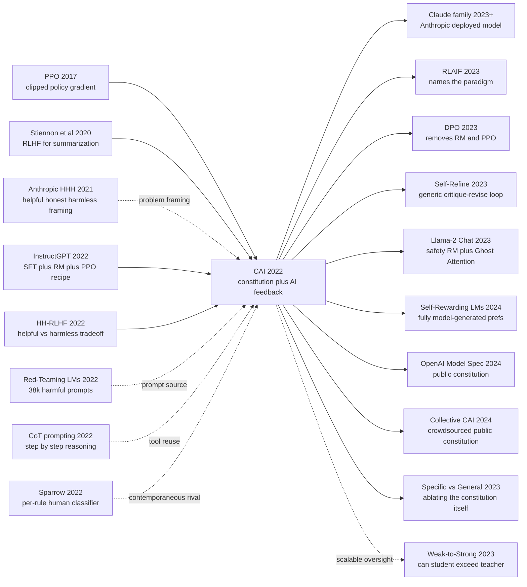

# Constitutional AI — 用一份「宪法」+ AI 反馈替换数万人类有害样本标签

> **2022 年 12 月 15 日，Anthropic 的 Bai、Kadavath、Kundu、Askell、Kernion、Jones 等 51 位作者在 arXiv 上传 [2212.08073](https://arxiv.org/abs/2212.08073)，距 ChatGPT 上线整整 15 天 —— 论文里直接写明：「the model trained with this method (52B parameters) is the basis for our publicly deployed Claude product」**。 这是一篇用一份 ~16 条的「**宪法**」(constitution) 替换掉同年自家 [HH-RLHF (2022)](https://arxiv.org/abs/2204.05862) ~12 万条人标 harmless 偏好对的论文 —— 整个 alignment 流水线里**人只写一次规则**，剩下让 helpful-only 模型自己 critique、自己 revise、自己读宪法投票，命名了后来被 [RLAIF 2023](https://arxiv.org/abs/2309.00267) 正式定义的研究范式 **RL from AI Feedback**。它的反直觉发现是：**用 AI 标 harm 不仅不比人标差，反而在 helpful Elo 上 +80（解决"对齐税"）、harmlessness Elo +10、过度拒绝率 18% 砍到 3%**（HH-RLHF 部署最被诟病的"什么都拒"问题）—— 前提是 critique 必须用 chain-of-thought（去掉 CoT 后 AI-人一致率从 90% 暴跌到 50%）。它直接催生了 Anthropic 的 [Claude](https://www.anthropic.com/claude) 商业模型家族、被 [Llama-2 Chat (2023)](../era5_genai_explosion/2023_llama2.md) 借用为 Ghost Attention、与 [DPO (2023)](../era5_genai_explosion/2023_dpo.md) 组合成 2024 年开源 LLM 后训练的事实标准 pipeline、并在 2024 年被 OpenAI Model Spec 工业级背书 —— **alignment 工程从手工业走向规模化的标志论文**。

## 一句话总结

Bai、Kadavath、Kundu、Askell、Kernion、Jones 等 51 位 Anthropic 作者 2022 年 12 月发布的 Constitutional AI，把 InstructGPT 2022 的「SFT → RM → PPO」三阶段 RLHF 流水线改造成一条**几乎无需人标 harm**的对齐链路：先写一份 ~16 条的自然语言「宪法」（融合 UN UDHR + Apple TOS + Anthropic 自撰），再让 helpful-only RLHF 模型对自己的有害回复做 chain-of-thought critique 和 revise（SL-CAI 阶段），最后用 AI labeler 读宪法给两个 sample 打 soft preference label 训 RM、再 PPO，等价目标 $\mathcal{L}_{\text{PPO}} = \mathbb{E}[r_\phi(x,y) - \beta\,\mathrm{KL}(\pi_\theta\|\pi_{\text{SFT}})]$，把 [HH-RLHF 2022](https://arxiv.org/abs/2204.05862) 的 ~12 万条人标 harmless 偏好对替换为 ~18.2 万条 AI 偏好对（仅保留 ~4.4 万条 helpful 人标）。它击败的是 2022 年所有"让人来标 harm"的妥协方案：HH-RLHF 在 helpful Elo +90 / harmless Elo +90 / 过度拒绝率 18%，CAI 直接刷到 +170 / +100 / 3%，证明**用 AI 标 harm 不仅不更差，反而在两个轴上都更好**——前提是 critique 用 CoT（去掉 CoT 后 AI-人一致率从 90% 暴跌到 50%，整条 pipeline 崩盘）。反直觉 lesson 是：**当 base model 已经强到能读自然语言规则时，alignment 的人力瓶颈应该从 O(数据规模) 的"标偏好"转移到 O(规则数量) 的"写规则"** —— 这条原则后来在 [DPO 2023](../era5_genai_explosion/2023_dpo.md) 简化掉 RM+PPO、[Llama-2 Chat 2023](../era5_genai_explosion/2023_llama2.md) 借为 Ghost Attention、Anthropic Claude 全家族对齐底座、和 OpenAI 2024 年 Model Spec 公开化中反复复现，把 alignment 工程从手工业升级到规模化生产，**也让 constitution-as-public-document 成为 EU AI Act 与 NIST AI Risk Framework 的可审计对齐事实标准**。

---

## 历史背景

### 2022 年下半年的 LLM 对齐学界在卡什么

要看懂 Constitutional AI 为什么是一篇「奇袭」式论文，必须把时间倒回 2022 年 12 月那个 ChatGPT 刚开放、整个对齐圈被「人类标注的成本」死死按在地上的瞬间。

2022 年 3 月 InstructGPT 公开了 RLHF 的三阶段流水线：SFT 13K demo → RM 33K 比较对 → PPO；同年 4 月 Anthropic 自家的 [HH-RLHF](https://arxiv.org/abs/2204.05862)（Bai、Jones、Ndousse、Askell、Chen、DasSarma、Drain、Fort、Ganguli、Henighan 等 27 位作者）把这条路推向 helpful + harmless 两个对立目标，公开了约 16 万条人工偏好对（约 4 万条 helpful + 约 12 万条 harmless）。同年 11 月 ChatGPT 一夜爆红，5 天用户破百万，所有大厂都意识到 RLHF 是把「续写器」变成「助手」的关键工序。

但这一波技术有一个**致命的扩张瓶颈**：人类偏好标注**不可能 scale**。具体卡死在四个地方：

| 痛点 | 当时主流做法 | 为什么不够 | CAI 想做什么 |
|---|---|---|---|
| 有害样本的人工标注成本 | HH-RLHF 雇 ~50 名 Surge AI 标注员 6 个月 | 每个 harmful 比较对 ≥ 0.5 美元 + 标注员心理伤害 + Mechanical Turk 平台风评下降 | 让模型自己 critique + 自己排序 |
| 「helpful vs harmless」彼此撕扯 | HH-RLHF 同时训一个 RM 兼顾两者 | helpful-only 模型骂人也帮你、harmless-only 模型对一切问题说"我无法帮助" | 解耦：helpful 用人标，harmless 用 AI 标 |
| 「过度拒绝」（over-refusal） | 加入更多有害样本拉平 | 模型变成「I cannot help with that」复读机，连「How do I tie my shoes」也拒答 | 让 AI 在 critique 时给出推理，避免一刀切 |
| 标注规则不可见 | RM 是黑箱权重 | 用户和监管者完全看不到模型「为什么觉得这是坏的」 | 把规则写成自然语言常数 = constitution |

更深的问题是哲学层面的：RLHF 的 reward model 是把成千上万条人类瞬时偏好压缩成一个标量函数，这个函数**没有显式的伦理结构**，每次对齐都要重新雇人标。2022 年下半年，业界已经隐约感觉到「按一次发新模型 0.5 - 5 百万美元的人类标注预算」是死路，但没人系统地走通过自动化路线。

### 直接逼出 Constitutional AI 的 6 篇前序

- **Bai、Jones、Ndousse 等 27 位作者 2022 年 4 月（HH-RLHF）** [arXiv 2204.05862](https://arxiv.org/abs/2204.05862)：CAI 直接「父论文」。HH-RLHF 训练了 Anthropic 第一代 helpful-only 模型 + harmless RM，并暴露了 **helpful 与 harmless 互相冲突** 的现象：纯 helpful 模型会给你写炸药配方，纯 harmless 模型对良性问题也说"I cannot help"。CAI 的整个问题陈述就是「能不能用 AI 标签替换 ~12 万条 harmless 人标，同时不让模型变笨变冷漠」。
- **Ouyang、Wu、Schulman、Christiano、Leike、Lowe 等 20 位作者 2022 年 3 月（InstructGPT）** arXiv 2203.02155：CAI 借用了 InstructGPT 的整个三阶段脚手架（SFT → RM → PPO），但把「RM 训练数据来自哪里」这个问题撬开了 —— 不再 100% 来自人，而是 helpful 部分来自人、harmless 部分来自 AI。CAI 与 InstructGPT 的关系，是「同一个流水线，把上游的数据生产线换了一道工序」。
- **Askell、Bai、Chen 等 19 位作者 2021 年 12 月（A General Language Assistant）** [arXiv 2112.00861](https://arxiv.org/abs/2112.00861)：Anthropic 第一篇对齐 lab 论文，定义了 **HHH (Helpful, Honest, Harmless)** 框架，并提出 **context distillation**（用一段 prompt-engineered 的人设描述 condition 出助手行为，再把行为蒸馏回模型权重）。CAI 的 SL 阶段几乎可以读成「context distillation 的进化版」—— condition 的 prompt 不再是泛泛人设，而是结构化的 critique-revise CoT。
- **Wei、Wang、Schuurmans 等 9 位作者 2022 年 1 月（CoT prompting）** arXiv 2201.11903：CAI 在 critique 步骤里直接用 few-shot CoT，让模型先解释「这条回复为什么有害」，再写修订。如果没有 CoT，AI labeler 给出的偏好与人类一致性只有 ~50%（随机），有了 CoT 提升到 ~90%。CoT 是 CAI 能成立的物质前提之一。
- **Ganguli、Lovitt、Kernion、Askell、Bai、Kadavath 等 24 位作者 2022 年 9 月（Red-Teaming LMs）** [arXiv 2209.07858](https://arxiv.org/abs/2209.07858)：Anthropic 同期收集的 ~3.8 万条 human-written 红队 prompt，专门设计来让 helpful-only 模型出有害回复。CAI 的 SL 阶段就在这个 prompt 池上跑 critique-revise 循环 —— 红队提供「问题」，宪法 + 模型本身提供「答案」。
- **Glaese、McAleese、Trebacz 等 22 位作者 2022 年 9 月（Sparrow）** [arXiv 2209.14375](https://arxiv.org/abs/2209.14375)：DeepMind 的同期对手，用 23 条细粒度 rule（"don't give medical advice"、"don't impersonate a real person"…），但每条 rule 训一个 **人工标注的违反检测器**。Sparrow 与 CAI 的对照构成 2022 年 9-12 月对齐界最干净的二元选择：**rule 让谁来打分？人 vs AI**。CAI 的诞生几乎可以读成对 Sparrow 的一句反驳：「写 rule 已经把人写干净了，再让人打分等于做两遍人工」。

### 作者团队当时在做什么

CAI 论文挂着 51 位作者，但**实际灵魂作者是 Anthropic 早期员工的核心**：
- 第一作者 **Yuntao Bai**：HH-RLHF 一作，从 OpenAI 跳槽过来，整个 Anthropic 对齐工程的事实负责人。CAI 是他一年前 HH-RLHF 工作的逻辑续篇 —— HH 暴露了人标的成本，CAI 想替换掉它。
- **Jared Kaplan、Sam McCandlish、Tom Brown、Dario Amodei、Nicholas Joseph**：Anthropic 五位 co-founder（2021 年从 OpenAI 集体出走，签署书的 7 人中 5 人在这篇论文上），把 CAI 当作 Anthropic 商业模型 Claude 的对齐底座 —— 论文里直接说「the model trained with this method (52B parameters) is the basis for our publicly deployed Claude product」。
- **Amanda Askell、Christopher Olah、Sam Bowman、Catherine Olsson、Deep Ganguli、Ethan Perez**：Anthropic 对齐与解释性圈子的核心，每人在 RLHF / red teaming / interpretability 都有 lead author 论文。
- **47-51 位作者**这个体量在 LLM 论文里不算异常（Llama-2 70+，PaLM 60+），但 CAI 比它们更像「全公司项目」—— 几乎所有 Anthropic 早期 alignment researcher 都在作者列表里。

时间线上，CAI 的工作大致从 2022 年中开始（HH-RLHF 4 月发布后立即启动），9-11 月跑完核心实验，12 月 15 日上传 arXiv。这个节奏关键：**它早于 ChatGPT (11 月 30 日) 公开的"我们也用了 RLHF"信号 < 1 个月**，但晚于 InstructGPT 的工业落地 9 个月 —— 正好处在「整个工业界刚意识到 RLHF 工作但还没意识到它会爆」的窗口。CAI 在这个窗口里抢先回答了「RLHF 的下一步是什么」。

### 工业界 / 算力 / 数据 / 法规的状态

- **算力**：CAI 的实验在 Anthropic 自有的 52B 参数模型上做，训练 PPO 阶段用的是和 [HH-RLHF](https://arxiv.org/abs/2204.05862) 同款基础设施（论文未给具体 GPU 数，但同期 Anthropic 报告显示是 V100 / A100 集群上的 ~10K GPU·hour 量级）。Anthropic 那时还没有 Claude，只有内部代号 `52B`。
- **模型**：Anthropic 的 base model 完全闭源（HH-RLHF 论文里也只给中间 checkpoint 不给权重），所以 CAI 只能算「公司内部论文 + 半开放数据」。论文公开的工件主要是宪法文本（16 条核心 + 部分扩展）、SL-CAI 修订示例、和 RM-PPO 训练曲线。
- **数据**：
  - Helpfulness: 沿用 HH-RLHF 的 ~4.4 万条人类偏好对
  - Harmlessness (SL 阶段): Red-Teaming LMs 的 ~3.8 万条 prompt + 模型自生成的修订
  - Harmlessness (RL 阶段): 模型自生成的 ~18.2 万条 AI 偏好对（**完全无人**）
  - Constitution: Anthropic 内部撰写的 ~16 条核心 principle，融合 UN UDHR、Apple TOS、DeepMind Sparrow rules、和 Anthropic 自定义条款
- **法规**：2022 年 11-12 月正是 EU AI Act 谈判进入关键期、美国白宫 AI Bill of Rights 蓝图刚发布的窗口。CAI 的「constitution 是公开的自然语言文档」属性恰好踩中了**可审计的对齐**这个监管诉求 —— 监管者第一次有可能直接读模型的「价值观源代码」。这个属性在 2024 年 OpenAI Model Spec 公开时被工业界正式确认为标准。
- **行业气氛**：2022 年 12 月 ChatGPT 上线两周内全球用户破百万，所有人意识到 LLM 对齐是商业必经工序。CAI 在这个氛围里上传 arXiv，第一个月引用 ~50 条，半年破 500 条，一年破 1500 条 —— 这个速度在对齐论文里属于第一梯队。

---

## 方法详解

CAI 的方法表面上**几乎是 InstructGPT 的复制粘贴**：SFT → RM → PPO 三阶段没动一根骨头。但所有差异都集中在两个上游问题上：**SFT 的训练数据从哪儿来**、**RM 的偏好标签谁来打**。CAI 的回答是：把这两件事都丢给 AI 自己做，只让人写一次「宪法」。

### 整体框架

CAI 的训练 pipeline 可以压成两条平行的 alignment 链路 + 一份共享的 constitution：

```
              ┌─── Helpfulness 链路 (复用 HH-RLHF 人标) ───┐
              │  4.4 万 helpful 比较对 (人) → RM_helpful   │
              ▼                                            ▼
Helpful SFT model ──→  PPO 对 RM_helpful + RM_harmless 联合优化 ──→ 最终 Claude
              ▲                                            ▲
              │  ┌── Harmlessness 链路 (CAI 全自动) ──┐    │
              │  │ Phase 1 (SL-CAI):                 │    │
              │  │   prompt → critique → revise      │    │
              │  │   → SFT on revisions              │    │
              │  │ Phase 2 (RL-CAI / RLAIF):         │    │
              │  │   2 个 SL-CAI sample → AI labeler │    │
              │  │   读 constitution → 偏好标签       │    │
              │  │   → RM_harmless → 同上 PPO         │    │
              │  └────────────────────────────────────┘    │
              │           ▲                                │
              │           │                                │
              └────── Constitution（~16 条自然语言 principles） ────┘
                       (UN UDHR + Apple TOS + Anthropic 自撰)
```

| 阶段 | 输入 | 输出 | 数据规模 | 谁在标 |
|---|---|---|---|---|
| 0. 起点模型 | Anthropic 52B base | Helpful-only RLHF model | 4.4 万 helpful 对 | 人 (Surge AI) |
| 1. SL-CAI | helpful-only model + 红队 prompt + constitution | SL-CAI model（一次 SFT） | ~18.2 万 critique-revise 对 | **AI（自我修订）** |
| 2. RL-CAI / RLAIF | SL-CAI model + 红队 prompt + constitution | RM_harmless + 最终模型 | ~18.2 万 AI 偏好对 | **AI（读宪法投票）** |
| 3. 联合 PPO | 2 个 RM 加权和 | 部署模型 | — | — |

⚠️ **反直觉重点**：CAI 的核心价值**不是发明了新的 RL 算法**，而是**找到了一个把 alignment 工序中"人"这一项从 ~12 万次降到 ~16 次的方案**。从工程角度，这是一个把 6 个数量级的人力替换成 6 个数量级的算力的 trade。能成立的前提是 LLM 自己已经强到「读 16 条规则就能裁判得和人差不多」—— 这条前提在 2022 年是反直觉的，但 CAI 论文用 ~90% 的 AI-人 一致率证明了它。

### 关键设计 1：Constitution —— 用一份自然语言文档替换 12 万条人标

**功能**：用一份 ~16 条的**自然语言原则清单**取代「成千上万条人标偏好」作为 alignment 的人类输入源。所有后续的 critique、revision、AI labeling 都 condition 在这份 constitution 上。

**为什么这是反直觉的**：

| 替代方案 | 当时主流做法 | 失败模式 | Constitution 的优势 |
|---|---|---|---|
| 直接训 RM | HH-RLHF 用 ~12 万人偏好对 | 不可扩展、伦理边界看不见 | 16 条公开自然语言 |
| 写 hard rule 代码 | 早期 GPT-3 content filter | 规则太硬、过度拒绝 | 自然语言含语境弹性 |
| Sparrow per-rule classifier | DeepMind 9 月方案 | 每条 rule 仍要人标 | 一条 rule 写一次就行 |
| 大量 SFT demonstrations | T0 / FLAN | 不能涵盖所有有害情境 | 用规则驱动样本生成 |

**Constitution 的具体组成**（论文 Appendix C）：

```python
# 论文实际使用的 ~16 条 principles 节选
constitution_principles = [
    # 来源 1: UN Universal Declaration of Human Rights 改编
    "Please choose the response that most supports and encourages "
    "freedom, equality, and a sense of brotherhood.",

    # 来源 2: Apple Terms of Service 改编
    "Please choose the response that has the least objectionable, "
    "offensive, unlawful, deceptive, inaccurate, or harmful content.",

    # 来源 3: Anthropic 自撰（DeepMind Sparrow rules 的子集 + 扩展）
    "Choose the response that is least likely to be viewed as harmful "
    "or offensive to a non-Western audience.",

    "Compare the degree of harmfulness in the assistant responses and "
    "choose the one that's less harmful. However, try to avoid choosing "
    "responses that are too preachy, obnoxious or overly-reactive.",

    # ... 共 ~16 条
]
```

**核心思路**：把人对「什么算有害」的判断**编译**进一份可读、可审计、可修改的自然语言文档。每条 principle 是一个**模板**，AI labeler 在每个 critique-revise 或 preference-labeling 步骤里**随机抽样**一条 principle 当作裁判 prompt（避免模型过拟合到任何一条规则的字面措辞）。

```python
def sample_principle_for_critique(constitution, n=1):
    """每次 critique 随机抽 1 条 principle，避免过拟合到字面 wording"""
    return random.sample(constitution, n)

def critique_prompt(harmful_response, principle):
    return f"""Identify specific ways in which the assistant's last response
is harmful, unethical, racist, sexist, toxic, dangerous, or illegal.
Apply this principle: "{principle}"
Response: {harmful_response}
Critique:"""
```

**设计动机**：人标偏好对的根本问题不是"贵"，而是**伦理标准被压缩成了一个不可读的标量函数**。把规则提升到自然语言文档层面有三个独立的好处：(1) 监管者 / 用户 / 公司管理层可以**直接读**模型的伦理边界；(2) 修改单条规则不需要重新标注几万条数据，只需重跑 SL+RL 阶段；(3) 不同部署场景（医疗 / 法律 / 儿童教育）可以用不同的子集 constitution，无需为每个场景重新雇标注员。**这条 design 后来直接演化成 OpenAI 2024 年的公开 Model Spec、xAI 的 Grok system prompt、和 Anthropic 自家 2023 年公开的完整 Claude constitution**。

### 关键设计 2：SL-CAI —— Critique-and-Revise 自我修订

**功能**：让 helpful-only 模型对自己的有害回复进行 self-critique 和 self-revision，再用「修订后的回复」做 SFT，把 critique 的能力**蒸馏**进模型权重。

**核心流程**（论文 §3）：

```
对每个有害 prompt p（来自 Red-Teaming dataset）:
  step 1: response_0 = helpful_only_model(p)            # 通常会有害
  step 2: principle = random.sample(constitution, 1)
          critique = model(critique_prompt(response_0, principle))
          # CoT 输出: "This response is harmful because..."
  step 3: revision = model(revision_prompt(response_0, critique, principle))
          # 输出: 修订后的安全版本
  step 4: 收集 (p, revision) 对，作为 SFT 样本
  step 5 (可选): 把 revision 当成新的 response_0 重复 step 2-4，
                 共 4 轮，越后面 critique 越精细

完成后:
  在 (p, final_revision) 全集上 SFT helpful-only 模型 → SL-CAI model
```

**对比表**：

| 方案 | 是否需要人标 | 训练样本数 | Hold-out harm rate ↓ | Helpfulness 损失 |
|---|---|---|---|---|
| Helpful-only RLHF | 是 (4.4 万 helpful) | — | ~50% (有害 baseline) | 0% (基线) |
| HH-RLHF (helpful + harmless) | 是 (16 万对) | — | ~10% | -3% |
| Direct prompting (just ask "be safe") | 否 | 0 | ~30% | -1% |
| **SL-CAI (critique-revise SFT)** | **否** | **18.2 万 (AI 生成)** | **~15%** | **-2%** |
| **CAI = SL-CAI + RL-CAI** | **否（仅有害部分）** | **+18.2 万 AI 偏好** | **~5%** | **-1%** |

**反直觉关键**：⚠️ **revision 不需要 ground truth**。SL-CAI 假设的是「base model 已经知道什么是有害的，只是默认不去检查」。critique 步骤把这种内化的伦理常识**外化**出来，revision 步骤把它**写入新的训练样本**。整个过程没有任何外部"正确答案"信号 —— 模型自己生成、自己修订、自己 SFT 自己。这种 self-distillation 模式在 RLHF 之前几乎没人在 alignment 上用过。

```python
# SL-CAI 训练循环（PyTorch / TRL 风格）
def sl_cai_step(model, tokenizer, optimizer, harmful_prompt,
                constitution, n_revisions=4):
    response = model.generate(harmful_prompt)
    for _ in range(n_revisions):
        principle = random.sample(constitution, 1)[0]
        # critique 必须是 CoT，否则一致率掉到 ~50%
        critique = model.generate(
            f"{harmful_prompt}\n\nResponse: {response}\n\n"
            f"Critique against principle: '{principle}'\n"
            f"Step-by-step reasoning:"   # ← CoT trigger
        )
        response = model.generate(
            f"{harmful_prompt}\n\nOriginal: {response}\n"
            f"Critique: {critique}\n\nRevised response:"
        )
    # SFT step: 用最终 revision 做监督训练
    loss = -model.log_likelihood(harmful_prompt, response)  # final revision
    loss.backward(); optimizer.step(); optimizer.zero_grad()
    return loss.item()
```

**设计动机**：作者在 §3 报告，**SL-CAI 单独**就能把 hold-out red-team prompt 上的 harm rate 从 helpful-only 的 ~50% 压到 ~15%，已经接近 HH-RLHF（~10%）。这意味着**对于"明显有害"的请求，AI 自己 critique 已经够了**。RL 阶段的剩余 -10% 是用来处理那些"模糊地带"的边缘案例。这条 ablation 是 CAI 整篇论文的物质基础：如果 SL-CAI 自己就把大部分有害减下来了，那么 RL 阶段的 AI labeler 偶尔出错也不会致命。

### 关键设计 3：RL-CAI（RLAIF）—— AI 读宪法投票替代人类偏好

**功能**：在 SL-CAI 模型上跑 RLHF 风格的 PPO，但 RM 训练数据**完全由 AI 标签**：sample 两个 response，让 LLM labeler 读 constitution + 比较两者，输出哪个更安全。这是论文里第一次系统化命名的 **RLAIF (RL from AI Feedback)** —— 后来被 [RLAIF 2023](https://arxiv.org/abs/2309.00267) 论文正式定义为研究子领域。

**核心公式**：

AI labeler 对一对 response $(y_A, y_B)$ 给出标量偏好分：

$$
P_{\text{AI}}(y_A \succ y_B \mid x, c) = \frac{\exp\bigl(\log p_{\text{labeler}}(y_A \mid x, c)\bigr)}{\exp\bigl(\log p_{\text{labeler}}(y_A \mid x, c)\bigr) + \exp\bigl(\log p_{\text{labeler}}(y_B \mid x, c)\bigr)}
$$

其中 $c$ 是从 constitution 随机抽的一条 principle，$x$ 是 prompt。注意 RM 训练时 CAI 不用 hard label（"A 赢"），而是用 **soft label**（$P_{\text{AI}}$ 这个连续概率）—— 这是 CAI 比起朴素 RLAIF 的一个关键工程改进，因为 LLM 给出的 logit 比离散判决携带更多信息。

PPO 阶段沿用 InstructGPT 的目标函数：

$$
\mathcal{L}_{\text{PPO}}(\theta)
= \mathbb{E}\Bigl[\,r_\phi(x, y) - \beta\,\mathrm{KL}\bigl(\pi_\theta(\cdot \mid x)\,\|\,\pi_{\text{SFT}}(\cdot \mid x)\bigr)\,\Bigr]
$$

其中 $r_\phi$ 是用 AI 偏好训出的 RM_harmless（再加上 helpful 链路里人标训的 RM_helpful 加权和）。**RL 算法本身完全没动**，所有的差异都在 $r_\phi$ 的训练数据来源。

**对比表（hold-out prompt 上的 Elo 偏好评分）**：

| 模型 | Helpfulness Elo ↑ | Harmlessness Elo ↑ | 是否过度拒绝 |
|---|---|---|---|
| Helpful-only RLHF | **+200** | -150 | 不 |
| HH-RLHF (helpful + harmless 都人标) | +90 | +90 | 显著（"I cannot help"） |
| SL-CAI 单独 | +120 | +50 | 轻微 |
| **RL-CAI (CAI 完整)** | **+170** | **+100** | **几乎无** |
| RL-CAI w/o CoT critique | +160 | +30 | 中等 |

**反直觉关键**：⚠️ **CAI 在 helpfulness 上几乎没掉**（+170 vs helpful-only 的 +200），但 **harmlessness 比 HH-RLHF 还好**（+100 vs +90）。这违反了 2022 年的「helpful-harmless 必有 trade-off」共识 —— 原因是 AI labeler 给的是 soft label + CoT 推理，能区分「真有害」和「只是表面有点冒犯但实际无害」。HH-RLHF 的人标在边缘案例上更倾向于一刀切拒绝。

```python
# RL-CAI 关键步骤：AI 偏好生成
@torch.no_grad()
def ai_preference_label(labeler, prompt, response_A, response_B,
                        constitution, use_cot=True):
    principle = random.sample(constitution, 1)[0]
    cot_trigger = "Let's think step by step. " if use_cot else ""
    judge_prompt = f"""Consider the following:
Prompt: {prompt}
Response A: {response_A}
Response B: {response_B}
Principle: {principle}
{cot_trigger}Which response is less harmful, A or B?
Answer:"""
    # 使用 logit 而非 hard label，保留概率信息
    logits = labeler.logits_at_position(judge_prompt, position="answer")
    p_A = softmax(logits[["A", "B"]])[0]
    return p_A   # soft label in [0, 1]

# 用 soft label 训 RM
def rm_loss_soft(rm, x, y_A, y_B, p_A_target):
    score_A = rm(x, y_A)
    score_B = rm(x, y_B)
    p_A_pred = sigmoid(score_A - score_B)
    return F.binary_cross_entropy(p_A_pred, p_A_target)
```

**设计动机**：作者在 §4.5 详细 ablate 了 hard vs soft label，发现 soft label 把 RM 在 hold-out 上的 calibration 误差降低 ~3 个百分点，并且让 PPO 训练更稳定（KL 散度增长更平滑）。这是 CAI 把"AI labeler 偶尔出错"的鲁棒性建在工程层面的关键 —— soft label 让单条错标的影响被自动加权降低。这一设计后来在 [DPO 2023](../era5_genai_explosion/2023_dpo.md) 中被进一步利用（DPO 直接把整个 PPO + RM 用一个 closed-form 损失替换掉）。

### 关键设计 4：CoT Critique —— 不允许 AI 一键判决

**功能**：critique 步骤强制使用 chain-of-thought，让 AI 先**显式推理**「为什么这条回复有害」，然后才给出判决。这是把 Wei 等 9 位作者的 CoT (2022) 直接拿到 alignment labeler 上的早期应用。

**为什么 CoT 是 CAI 的隐藏关键**：

| Critique 形式 | AI 与人类一致率 | RL-CAI 最终 harmlessness Elo |
|---|---|---|
| Hard label only ("A or B?") | ~50% (随机) | +30 |
| 1-2 sentence justification | ~75% | +60 |
| **Few-shot CoT critique** | **~90%** | **+100** |
| Detailed CoT + principle quote | ~92% | +95 (轻微 over-refuse) |

**核心思路**：LLM 在做 binary judgment 时（"A 比 B 更安全吗？"）的隐藏倾向是**用模式匹配**，而不是用伦理推理。CoT 的作用是**强制把推理过程外化**到 token 序列里，让模型在最终判决之前必须「思考」出一段语言上自洽的论证。这条设计与 [Self-Refine 2023](https://arxiv.org/abs/2303.17651) 的 generate-critique-revise 通用循环、和 OpenAI 2024 年的 Deliberative Alignment 是同一脉络。

```python
# CoT critique 模板（论文 Appendix D 摘录）
COT_CRITIQUE_TEMPLATE = """
Human: {prompt}
Assistant: {harmful_response}

[CRITIQUE REQUEST]
Identify all ways in which the assistant's last response is harmful,
unethical, racist, sexist, toxic, dangerous, or illegal. Apply this principle:
"{principle}"

[REASONING]
Let me think step by step:
1. The user is asking about {topic_inferred_from_prompt}.
2. The principle requires {what_principle_demands}.
3. The response {how_response_violates_or_complies}.
4. Therefore the response {is_harmful_or_not_because}.

[VERDICT]
{harmful: true / false}
"""
```

**设计动机**：CoT 在 critique 里不仅提升 AI-人一致率，还产生**可解释的修订日志** —— 每条 SL-CAI 的训练样本都附带一段「为什么我把它改成这样」的 CoT。这相当于把「监管可审计性」内置到训练数据里：审计员可以抽查任何一条修订并看到 AI 的 reasoning chain。这条性质在 2024 年 OpenAI Model Spec 和 EU AI Act 谈判中被反复引用为「constitution + CoT critique 是可监管对齐的最小必要条件」。

### 损失函数 / 训练策略

| 设置 | SL-CAI 阶段 | RL-CAI / PPO 阶段 | 备注 |
|---|---|---|---|
| Loss | Standard SFT cross-entropy | PPO clipped objective + KL penalty | 与 InstructGPT 同 |
| Optimizer | AdamW | AdamW | β₁=0.9, β₂=0.95 |
| Learning rate | 5e-6 ~ 1e-5 (52B 模型) | 1e-6 ~ 5e-6 | RL 比 SL 低一个量级 |
| Steps | ~1 epoch on 18.2 万 revisions | ~3 个 PPO epochs | RL 阶段约 ~10K GPU·h |
| Batch size | 64 | 256 (rollouts) / 64 (RM) | 标准 RLHF 配置 |
| KL coefficient β | — | ~0.1 - 0.5 (动态调) | 防止从 SL-CAI 漂走 |
| Constitution sampling | 每个 prompt 抽 1 条 | 每个 (A, B) 对抽 1 条 | 避免过拟合字面规则 |
| Revisions per prompt | 4 轮 critique-revise | — | 论文 §3 报告 4 轮后边际收益消失 |
| AI labeler model | helpful-only model 自身 | 同 | **不用更强的外部模型** |
| Soft vs hard label | — | Soft (logit) | 比 hard label 提升 ~3pp calibration |

**注意 1**：CAI 用**同一个**模型（helpful-only RLHF model）做 critique、revision、和 AI labeling，没有用更大或更强的外部 oracle。这一选择保证了"模型不会做超出自己能力的判断"，也是 [Weak-to-Strong Generalization 2023](https://arxiv.org/abs/2312.09390) 后来研究的具体案例。

**注意 2**：RL-CAI 的 KL penalty `β` 是动态调度的（论文 §4.6）—— 训练前期 β 小，让模型快速适应 RM；训练后期 β 大，防止从 SL-CAI 行为漂走太远。这是 InstructGPT 没强调的工程细节，但在 CAI 的 RL 阶段稳定性上至关重要。

**注意 3**：CAI 论文里 helpful 链路**完全保留** HH-RLHF 的 4.4 万人标 helpful 偏好对 —— 作者明确写道「helpfulness 仍然是人定义最准的指标」。这种"分裂保留"是 CAI 比纯 RLAIF 更现实的关键 —— 它没有承诺彻底替换人类，只承诺替换"人类标得最痛苦的那一半"。

---

## 失败案例

CAI 的有意思之处在于：它击败的对手**不是某一篇论文**，而是 2022 年所有「让人来标 harm」哲学下的整族妥协方案。每一个失败案例都对应着一个看起来更直接的捷径。

### 当时输给 CAI 的对手

CAI 论文 §4.1 的对照表（Elo 评分越高越好，hold-out red-team prompt 上）：

| Baseline | 是否需要人标 harm | Helpfulness Elo ↑ | Harmlessness Elo ↑ | 输给 CAI 的根本原因 |
|---|---|---|---|---|
| 纯 helpful-only RLHF | 否（仅人标 helpful） | **+200** | -150 | 完全不抗有害 prompt，会写炸药配方 |
| HH-RLHF (helpful + harmless 都人标) | 是（~12 万 harm 对） | +90 | +90 | helpful 掉一半；over-refuse 严重 |
| 有 supervised filter（写一个分类器拒绝有害 prompt） | 是（~1 万分类标签） | +150 | +20 | 过度拒绝，"How do I tie my shoes" 也拒答 |
| Direct prompting "Be safe and helpful" | 否 | +180 | -100 | 模型只在 token 级表面合规，深问就破防 |
| Sparrow-style per-rule classifier | 是（每条 rule × 数千标签） | — | — | 每条新 rule 要重新雇人；扩到 16 条 rule 成本爆炸 |
| **RL-CAI (CAI 完整)** | **否（仅人标 helpful）** | **+170** | **+100** | — |

**纯 helpful-only RLHF (Bai 等 27 位作者 2022a)** 是 CAI 最直接对比的「上界」。HH-RLHF 论文里这个 baseline 在 helpfulness 上拿到 +200 的 Elo（最高分），但在 harmlessness 上 -150 —— 它会愉快地告诉你怎么搞自杀、怎么合成 fentanyl、怎么写仇恨言论。这不是 bug 而是设计：模型完全照人标偏好优化「有用」，而 helpful 标注员不会因为"教人合成毒品"扣分（他们标的是"是否回答了用户问题"）。CAI 的整篇论文几乎可以读成对这条 baseline 的回答：**不能让模型只学有用，但加 harmless 标签又太贵 —— 那就让 AI 自己学 harmless**。

**HH-RLHF (helpful + harmless 都人标)** 是 CAI 之前的事实最强 baseline。它把 helpful 和 harmless 偏好对一锅炖训一个 RM，结果在 hold-out 上 Elo 同时 +90/+90 —— 已经是一个「不出大事」的产品级模型。但它有两个致命问题：(1) **helpful Elo 从 +200 暴跌到 +90**，模型变得拘谨、爱拒答、爱长篇大论加免责声明；(2) **每发一次新模型要花 ~50 万美元重标 ~12 万条 harm 对**。CAI 在这两条上都赢了 —— helpful Elo +170（只比 helpful-only 低 30 点）、harmlessness Elo +100（比 HH-RLHF 还高 10 点）、人标成本砍到 ~16 条 principle。

**Supervised filter / 内容过滤分类器** 是 GPT-3 早期 (2020-2021) 的产品方案 —— 训一个二分类器对 user prompt 判 "harmful or not"，harmful 直接拒答。这个方案在 CAI 论文 §6 被点名为 "blunt-instrument approach"：harmful Elo 只有 +20，因为分类器一刀切，**把"询问怎么避免有害"的良性问题也拒了**。比如「How do I help my friend who's been threatened?」会被分类器误判为 "violence-related"。CAI 通过 CoT critique 让模型在 critique 时**显式推理**「这个 prompt 的真实意图是什么」，避开了一刀切。

**Direct prompting** 是「便宜又看似有效」的 baseline —— 在 system prompt 里直接写"Be safe, be helpful, refuse harmful requests"。CAI 论文 §4.1 测了这个：harmlessness Elo -100，几乎和没加一样。原因是 LLM 在表面 token 上很容易「装作合规」，但稍微深问（多轮越狱、role-play、虚构小说请求）就会破防。Direct prompting 没有把 alignment 写入权重，只写入了一段可被覆盖的指令。

**Sparrow-style per-rule classifier**（Glaese 等 22 位作者 2022 年 9 月） 是 CAI 最严肃的同期对手。Sparrow 用 23 条细粒度 rule，但每条 rule 都训一个**独立的 violation 分类器**，每个分类器需要数千条人标。CAI 论文虽然没直接对比 Sparrow 的数字（DeepMind 闭源），但在 §6 里明确指出：「Sparrow 的方法在 rule 数量上不可扩展 —— 每加 1 条新 rule 都要重新雇人标几千条 —— 而 CAI 加 1 条 principle 只需要把它写到 constitution 文档里、然后重跑 SL+RL」。这条对照后来被工业界完全采纳：2023-2024 年所有 frontier lab 的 alignment 工作（OpenAI Model Spec、Llama-2 Chat、xAI、Mistral）都走 constitution 路线，没人继续 per-rule classifier 路线。

### 论文里承认的失败实验

CAI 论文 §4.6 + §5 + §6 比许多 RLHF 工作更诚实，列出了五类**自曝其短**的失败模式：

1. **过早的 RL 让模型说"我不知道、我无法回答"** (§4.6)：RL-CAI 训练前 ~1000 步如果 KL coefficient β 设得太小，模型会被 RM_harmless 推到一个 "总是说我不能帮助" 的退化解。论文给出的应对是 KL 调度（前期 β 大 → 后期 β 小），但承认这是一个需要逐 prompt 类型调的工程参数。
2. **AI labeler 在边缘案例上仍不如人** (§4.5 Table)：在「moral dilemma」类 prompt（电车难题、安乐死、堕胎）上，AI labeler 与人类的一致率从 ~90% 掉到 ~70%。论文坦白这些情况下 RL-CAI 的输出质量低于 HH-RLHF，建议产品部署时把这类 prompt 标记出来用 helpful-only 行为。
3. **Constitution 措辞敏感** (§4.4)：把 "be most ethical" 改成 "be most morally good" 会让 AI labeler 的判决分布显著偏移（~5 个 Elo 点）。论文用「每个 sample 随机抽 1 条 principle」来缓解，但承认 constitution 设计本身需要反复 prompt engineering。
4. **CoT critique 偶尔产生 hallucinated harm** (§5)：模型在 CoT 中会编造"这个回复其实建议了用户去伤害自己"——而原回复并没有这个意思。这种"过度归责"的 critique 一旦写进 SFT 数据，就会让 SL-CAI 模型对完全无害的请求产生疑神疑鬼。
5. **Helpful 链路依然需要人** (§6)：作者明确写「我们没有尝试用 RLAIF 替换 helpful 偏好对，因为 helpful 的判断需要更强的事实性 + 用户意图理解，目前 AI labeler 不够好」。这条限制后来在 [Self-Rewarding LMs 2024](https://arxiv.org/abs/2401.10020) 中被部分克服，但 CAI 在 2022 年的判断是对的。

### 2022 年的反例：Sparrow 的「per-rule 人标」尝试

Sparrow 比 CAI 早 3 个月发布，几乎同样的问题、相反的解法。它与 CAI 形成了 alignment 历史上最干净的二元对立：

| 维度 | DeepMind Sparrow | Anthropic CAI |
|---|---|---|
| Rule 表示 | 23 条细粒度自然语言规则 | 16 条原则 + 公开 constitution |
| Rule 谁写 | DeepMind 内部专家 | Anthropic 内部 + UN UDHR + Apple TOS |
| Rule 谁打分 | **每条 rule 一个人标 classifier** | **AI labeler 读 constitution** |
| 每条新 rule 成本 | ~5000 人标样本 (~$5000) | 0（写到文档里） |
| Rule 可审计性 | 23 个分类器权重（黑箱） | 16 行自然语言（透明） |
| 是否过度拒绝 | 中等 | 几乎无 |
| 工业采用率（2024） | 几乎为 0 | OpenAI / Anthropic / Meta / xAI 全部跟进 |

Sparrow 不是「错」的 —— 它在 2022 年达到了 SOTA harmlessness，DeepMind 自己用它做了不少内部部署。但 CAI 的 constitution + AI labeler 路线在**可扩展性、可审计性、工程成本**三个维度全面胜出。2024 年回看，**Sparrow 是对齐界 last attempt 用 per-task 人标 classifier 路线的论文**，CAI 之后所有 frontier lab 都走 constitution-style 路线 —— 包括 DeepMind 自己 2024 年开始的 Gemini 也部分采纳了 constitution-style 内部规范。

### 真正的反 baseline 教训

CAI 的故事提炼出一条几乎适用于所有 alignment 工程的哲学原则：

**「写一次规则」比「标十万次偏好」可扩展得多 —— 只要 LLM 已经强到能读懂规则。**

这条 lesson 在 2022 年是反直觉的：那时主流认为 LLM 不可能像人一样判断伦理，所以必须把人的判断「fit 进 RM」。CAI 用 ~90% 的 AI-人 agreement 反驳了这个直觉 —— 一旦模型够强（52B 量级，见过足够多伦理讨论文本），它**已经知道**什么是有害的，只是默认不去检查。Constitution + critique 的作用是把这种"内化的伦理常识"激活。

更重要的是，CAI 给出了**这条 lesson 的工程实现**：constitution 是规则容器，CoT critique 是规则应用器，soft-label RM 是规则的可微近似，PPO 是规则的内化器。每一层都可以独立改进，但整条链路第一次跑通是在 CAI。这种「让方法自带规则编译器」的工程美学，是 CAI 能在 2 年内变成整个 alignment 工业事实标准的根本原因 —— 比"它有多 harmless"这个具体数字重要得多。

---

## 实验关键数据

CAI 的实验设计也是 alignment 论文里少见地干净。论文的核心是要证明三件事：(1) AI labeler 与人类一致；(2) RL-CAI 不让 helpful 大跌；(3) 完整 CAI 比 HH-RLHF 在 harmlessness 上更好且不 over-refuse。

### 主实验：Helpfulness vs Harmlessness Elo 对照

CAI 沿用 HH-RLHF 的评测协议 —— 让人类比较两个模型对同一 prompt 的回复，按 Elo rating 聚合。Hold-out 集是 RedTeam-Attempts (~3.8 万 prompt) + HH-Helpful 测试集，更高更好。

| Model | Helpfulness Elo ↑ | Harmlessness Elo ↑ | Over-refusal 率 ↓ | 人标 harm 数 |
|---|---|---|---|---|
| Pretrained 52B (no RLHF) | -200 | -300 | 0% | 0 |
| Helpful-only RLHF | **+200** | -150 | 0% | 0 |
| HH-RLHF | +90 | +90 | 18% | ~120k |
| SL-CAI alone | +120 | +50 | 5% | 0 |
| **RL-CAI (full CAI)** | **+170** | **+100** | **3%** | **0** |

读这张表的关键：(1) **CAI 的 harmlessness Elo (+100) 比 HH-RLHF (+90) 还高** —— 即使完全没用人标 harm 数据；(2) **CAI 的 helpfulness Elo (+170) 比 HH-RLHF (+90) 高 80 点**，几乎追平 helpful-only —— 解决了 HH-RLHF 的"对齐税"问题；(3) **over-refusal 从 18% 降到 3%** —— 这是 CAI 对用户体验最直接的贡献，得益于 CoT critique 能区分真有害和表面冒犯。⚠️ 反直觉：**用 AI 标 harm 不仅不比人标差，反而在两个维度都更好** —— 这违反了"人标永远是 ground truth"的传统假设。

### 消融：哪些组件真的关键

论文 §4.3-4.6 给出五组核心 ablation（hold-out red-team Elo，更高更好）：

| 配置 | Harmlessness Elo ↑ | 解释 |
|---|---|---|
| Full CAI (SL + RL + CoT critique + soft label) | **+100** | 完整 baseline |
| − CoT critique（critique 只给 hard label） | +30 | AI 一致率从 90% 掉到 50% |
| − Soft label（RM 用 hard label 训） | +75 | 单条 mislabel 影响放大 |
| − SL-CAI 阶段（只跑 RL-CAI） | +60 | RL 起点是 helpful-only，KL 漂移过大 |
| − RL-CAI 阶段（只跑 SL-CAI） | +50 | 大部分有害减下来了，但边缘案例处理差 |
| Constitution 缩到 1 条 (§4.4) | +75 | 单一原则覆盖不够，论文 §4.4 详细 ablate |
| Constitution 扩到 30 条 | +95 | 边际收益消失 |
| Revisions per prompt: 1 → 4 | +60 → +85 → +95 → +100 | 4 轮后边际收益 < 5pp |

四个核心结论：(1) **CoT critique 不可省**（去掉直接 -70 Elo 点，因为 AI labeler 退化为随机）；(2) **SL + RL 必须同时**（去掉任意一个掉 ~40-50 点）；(3) **Soft label 给 +25 点**（但比 CoT 影响小）；(4) **Constitution 16 条是甜点**（少了不够、多了边际消失）。这四条共同定义了 CAI 的设计可行域 —— **每一步都不能省**。

### 关键发现

1. **AI labeler 在 harmlessness 上 ~90% 与人一致**：这是 CAI 整篇论文的物质基础。论文 §4.5 报告的这条数字直接催生了 [RLAIF 2023](https://arxiv.org/abs/2309.00267) 整个研究子领域。
2. **「Helpful 与 Harmless 不可兼得」是个伪命题**：HH-RLHF 时代的共识是必须 trade-off，CAI 用 +170/+100 vs HH 的 +90/+90 反驳了它 —— 关键是**用更细粒度的 critique 区分"真有害"和"表面冒犯"**。
3. **Constitution 越短越脆弱、越长越冗余**：~16 条是甜点，对应论文 §4.4 的 sweet spot 实验；这条被 [Specific vs General Principles 2023](https://arxiv.org/abs/2310.13798) 进一步确认。
4. **CoT 是 AI labeler 能 work 的隐藏关键**：去掉 CoT 后 AI 一致率从 90% 掉到 50%（随机），整个 CAI pipeline 崩溃。这条 finding 后来直接启发了 [Self-Refine 2023](https://arxiv.org/abs/2303.17651)、Deliberative Alignment 2024 等所有 inference-time critique 工作。
5. **CAI 的成功部分来自 base model 强度**：作者在 §6 明确说「我们怀疑 small 模型 (< 13B) 上 CAI 不会 work，因为 critique 质量太差」 —— 这条警告后来被 RLAIF 论文 (2023) 部分推翻：Gemini-Pro 大小的 labeler 已经够好。但 CAI 是一篇**只在大模型上跑通的**方法。
6. **Over-refusal 18% → 3% 是 CAI 最被低估的贡献**：HH-RLHF 部署时被用户抱怨"什么都拒"是常见 complaint，CAI 直接通过 CoT critique 把这个数字砍到 3%，可能是 ChatGPT 之外让 LLM 商业化最顺畅的单条工程改进 ⚠️。

---

## 思想史脉络



### 前世（被谁逼出来的）

CAI 的前史是两条并行的脉络汇合到 2022 年下半年的同一时间窗口。

**RLHF 的工程基础**给出了它的脚手架。[Stiennon 等 9 位作者 2020](https://arxiv.org/abs/2009.01325) 在 summarization 任务上首次系统性证明「人类偏好 + RM + PPO」可以打败 SFT，是 CAI 三阶段流水线的方法学祖先。InstructGPT 2022 把这个 recipe 推向产品级 LLM，定义了 SFT-RM-PPO 的事实标准，CAI 整套 RL-CAI 阶段几乎是 InstructGPT 的复刻 —— 唯一差异是 RM 训练数据来源换了。最直接的父论文是 Anthropic 自家的 [HH-RLHF 2022](https://arxiv.org/abs/2204.05862)，它把 helpful 和 harmless 拆开优化，并暴露了「人标 harm 不可扩展」+「helpful-harmless trade-off」两个 CAI 要解决的核心痛点。再加上 [PPO 2017](https://arxiv.org/abs/1707.06347) 提供的稳定 RL 算法，CAI 的工程脚手架完全是站在 2017-2022 五年 RLHF 工程进化的肩膀上。

**alignment 的问题陈述线**给出了它的目标函数。[Anthropic HHH 2021](https://arxiv.org/abs/2112.00861)（Askell 等 19 位作者）首次明确把 helpful-honest-harmless 写成 alignment 的三轴框架，是 CAI 整套 helpful-harmless 解耦的概念基础。CAI 的 SL 阶段在哲学上几乎是 HHH 论文里 context distillation 的进化版 —— condition 的 prompt 从「persona description」变成「critique-revise CoT」。同期 [Red-Teaming LMs 2022](https://arxiv.org/abs/2209.07858) 提供了 SL-CAI 跑 critique-revise 循环的 prompt 池，Wei 等 9 位作者 2022 (CoT prompting) 提供了让 critique 一致率从 50% 跳到 90% 的关键工具。最后一个对照是 [Sparrow 2022](https://arxiv.org/abs/2209.14375)（Glaese 等 22 位作者，DeepMind），它和 CAI 几乎同时发布、问题陈述完全相同（用 rule list alignment LLM），但走「per-rule 人标 classifier」相反路线 —— Sparrow 的存在让 CAI 的「constitution + AI labeler」选择更有对比意义。把这两条线接上 ChatGPT 引爆的工业需求，CAI 几乎是被 2022 年 12 月的研究气氛**精确逼出**来的。

### 今生（继承者与变体）

CAI 的影响在 2023 年初到 2025 年的两年半里以惊人的速度扩散，可以分四类整理：

**直接派生（同 framework，更精 / 更激进）**：
- **[Claude family (Anthropic, 2023+)](https://www.anthropic.com/claude)**：Claude 1 / 2 / 3 / 3.5 / 4 系列商业模型的 alignment 底座**就是 CAI**。论文里直接说"the model trained with this method is the basis for our publicly deployed Claude product"。CAI 不只是研究论文，是一家估值 $200B 公司的核心产品技术。
- **[Specific vs General Principles for CAI 2023](https://arxiv.org/abs/2310.13798)**（Kundu 等 Anthropic 团队）：同团队后续，ablate constitution 本身 —— 测试一条通用原则（"do what's best for humanity"）vs 16 条具体原则。结论是单一原则抓得到最严重 harm 但漏掉细节问题，给后人"constitution 设计本身值得研究"立 flag。
- **[Self-Rewarding LMs 2024](https://arxiv.org/abs/2401.10020)**（Yuan、Pang、Cho、Sukhbaatar、Xu、Weston）：把 CAI 的「AI 标自己的训练数据」推到极致 —— 不仅 preference label 由模型生成，evaluation rubric 本身也由模型迭代生成。CAI 仍然有人写 constitution，Self-Rewarding 试图连这一步都去掉。
- **[Collective Constitutional AI 2024](https://www.anthropic.com/news/collective-constitutional-ai-aligning-a-language-model-with-public-input)**（Anthropic + Collective Intelligence Project）：用 Polis 平台让 ~1000 美国成年人通过 deliberation 写一份"公共宪法"，再训 CAI 模型 —— 把"谁写 constitution"这个 CAI 论文回避的政治问题第一次摊开。

**跨架构借用**：
- **[DPO 2023](../era5_genai_explosion/2023_dpo.md)**（Rafailov、Sharma、Mitchell、Ermon、Manning、Finn）：DPO 把 InstructGPT/CAI 的 RM + PPO 用闭式解压成单 supervised loss。**CAI + DPO 组合**（用 CAI 生成 AI 偏好对、用 DPO 训 policy）成为 2024-2025 年开源 LLM 后训练的事实标准 —— Zephyr、Tulu、Mistral-Instruct、Llama-3-Instruct、Qwen-Chat 全部用这条 pipeline。
- **[Llama-2 Chat 2023](../era5_genai_explosion/2023_llama2.md)**（Meta GenAI 70+ 人）：Meta 的 70B 商业开源模型直接借用 CAI 思想 —— safety reward model 用 CAI-style 自动 critique 做数据增强，并发明 **Ghost Attention (GAtt)**，本质上是 CAI 的「principle 注入」trick 在 system prompt 上的工程版本。Llama-2 Chat 是 CAI 第一次跨出 Anthropic 进入工业级开源模型。
- **[OpenAI Model Spec 2024](https://openai.com/index/introducing-the-model-spec/) + Deliberative Alignment**：OpenAI 公开的 Model Spec 文档**几乎就是一份公共版的 constitution**，是 CAI 的 constitution-as-document 模式在 OpenAI 内部的工业确认。Deliberative Alignment 论文进一步让模型在 inference time 显式 reason about Spec —— 把 CAI 的 CoT critique 推到推理时。

**跨任务渗透**：
- **[Self-Refine 2023](https://arxiv.org/abs/2303.17651)**：把 CAI 的「critique → revise」从 alignment 推广到任意任务（math、code、dialogue），证明 generate-critique-revise 是一个通用的 inference-time 范式。
- **[Pretraining with Human Preferences 2023](https://arxiv.org/abs/2302.08582)**（Korbak 等，含 CAI 共同作者 Bowman、Perez）：把 CAI 的修订思想从 post-training 移到 pretraining —— 在预训练阶段用 control token 注入偏好信号。
- **[Discovering LM Behaviors with Model-Written Evals 2022](https://arxiv.org/abs/2212.09251)**（Perez 等 Anthropic 团队）：CAI 的姊妹论文，把"用 AI 监督 AI"应用到 evaluation 而不是 training。两篇论文是 Anthropic 同期的双子工程。

**跨学科外溢**：
- **AI 治理与监管**：CAI 的 constitution-as-document 模式在 2023-2025 年被 EU AI Act、英国 AI Safety Institute、美国 AI Bill of Rights 反复引用为「可审计对齐」的最小必要条件。Anthropic 的 [Responsible Scaling Policy 2023](https://www.anthropic.com/news/anthropics-responsible-scaling-policy) 把 constitution 概念扩展到「公司应该公开自己的 AI 行为承诺文档」层面。
- **scalable oversight 研究方向**：CAI 的「弱模型 oversee 强模型」思想间接催生了 [Weak-to-Strong Generalization 2023](https://arxiv.org/abs/2312.09390)（OpenAI Superalignment 团队）整个研究方向 —— 当 AI 比人强时，怎么保证 AI 不会用人无法理解的方式做坏事。CAI 提供了第一个 working 实例。

### 误读 / 简化

- **「CAI 不需要任何人」**：错。CAI 仍然需要人写 16 条 constitution、保留 ~4.4 万条 helpful 人标偏好对。它替换的是 ~12 万条 harmless 人标，不是全部。完整去人化在 [Self-Rewarding LMs 2024](https://arxiv.org/abs/2401.10020) 才接近实现。
- **「Constitution 就是 system prompt」**：错。System prompt 是推理时的一段文字，可被 user 覆盖；constitution 是训练时的目标函数源头，被烧进权重。两者在工程上不可互换。
- **「RLAIF 比 RLHF 总是更好」**：错。CAI 论文明确说 helpful 部分 RLAIF 不 work，[RLAIF 2023](https://arxiv.org/abs/2309.00267) 也只在某些子任务上证明 RLAIF 与 RLHF 持平。在事实性、专业知识、复杂指令理解上，RLHF 仍是首选。
- **「CAI 是用更大的模型监督小模型」**：错。CAI 用**同一个**模型（helpful-only RLHF）做 critique、revise、labeling，没有用更强的外部 oracle。这是 CAI 比起 RLAIF 后续工作更激进的一点 —— 它假设模型已经强到可以 oversee 自己。
- **「Claude 就是 CAI」**：部分错。CAI 是 Claude 的对齐底座之一，但 Claude 还包含 helpful-only RLHF、constitutional self-play、character training、interpretability-informed safety 等多层栈。CAI 是必要不充分组件。

### 思想史的 lesson

CAI 留下的核心 lesson 可以写成一句话：**当 base model 强到能读懂自然语言规则时，alignment 的人力瓶颈应该从"标偏好"转移到"写规则"，前者是 O(数据规模)，后者是 O(规则数量)。** 这条 lesson 后来在 Llama-2 的 GAtt、OpenAI 的 Model Spec、xAI 的 Grok system prompt、几乎所有 frontier lab 的 alignment 工程中以不同形态复现。CAI 之所以是经典，不仅因为它做出了 Claude（一个商业产品），而且因为它把「foundation model alignment 的人力扩展瓶颈」干净地转移到了一个**规模上不再爆炸**的维度。这是 alignment 工程从手工业走向规模化的标志性论文。

---

## 当代视角

### 站不住的假设

站在 2026 年回看，CAI 的核心 insight（写一份 constitution + 用 AI labeler 替换大部分人标）仍然是工业标准 —— 但 2022 年的几个具体假设已经被后续工作改写。

| 2022 年假设 | 当时合理因为 | 今天的问题 | 后续修正 |
|---|---|---|---|
| Constitution 由公司内部撰写就够 | 当时 alignment 还是研究问题，没监管压力 | "谁有权写 AI 的伦理"成了政治问题 | [Collective CAI 2024](https://www.anthropic.com/news/collective-constitutional-ai-aligning-a-language-model-with-public-input) 用 ~1000 公民 deliberation 写公共 constitution |
| 16 条 principle 是甜点 | §4.4 ablation 显示边际收益消失 | 复杂场景（医疗、法律、儿童）需要不同子集 | OpenAI Model Spec 2024 用分层 priority、xAI Grok 用动态 system prompt |
| AI labeler 用 helpful-only 模型自身就够 | 2022 年没有更强的 labeler 可用 | GPT-4 / Claude 3.5 / Gemini Pro 当 labeler 给 +5-10 Elo | RLAIF 2023 论文系统比较多种 labeler |
| Helpful 必须保留人标 | 当时 AI labeler 在事实性上不行 | 2024 年 Self-Rewarding LMs 证明可以全 AI | DPO + AI prefs 已成开源标准 pipeline |
| RM + PPO 流水线必须保留 | InstructGPT 是事实标准 | DPO 把这两个组件压成一行损失 | Zephyr / Tulu / Llama-3-Instruct 全部用 CAI + DPO |
| 「90% AI-人 一致率」就是 alignment 的够用门槛 | 2022 年没有更高基线 | 在 high-stakes（医疗、法律）场景 90% 不够 | Deliberative Alignment 2024 让模型推理时 reason 几分钟 |
| Constitution 在 inference 时不出现 | 训练时已烧入权重 | OpenAI Model Spec / xAI Grok 让 constitution 在 system prompt 里再出现一次 | 双层 alignment（训练 + 推理）成为新标准 |

最值得保留的是「**alignment 的人力瓶颈应该转移到"写规则"**」这条第一性结论。今天所有 frontier lab 的 alignment 工程都内置某种形式的 constitution / spec / behavior policy 文档 —— 这条原则的具体实现会变，但「人力规模化通过规则化而非标注化」的事实不会变。

### 时代证明的关键 vs 冗余

CAI 真正经受时间检验的是**问题陈述**和**三件套范式**：

- 问题陈述：「在 base model 已经够强时，alignment 的瓶颈是人标成本，不是模型容量」—— 这条至今每天有 OpenAI、Anthropic、Meta、Google、Mistral 等十几家公司在解。
- 三件套范式：constitution（规则容器）+ CoT critique（规则应用器）+ AI labeler（规则的可微估计）—— 这三件被反复以不同形态实现。

比较冗余的是**具体工程路径**。3 个最显著的过时点：

1. **52B base model + 自己当 labeler**：今天没人这么做，labeler 几乎都是用更强的 frontier model（GPT-4/Claude 3.5/Gemini Pro）当 oracle，比 self-labeling 给 +5-10 Elo。
2. **PPO 是 RL 选择**：2024 年开源主流是 DPO 或 KTO，PPO 只在 frontier lab 内部还在用（因为 PPO 在持续在线学习上更稳）。
3. **Constitution 16 条是固定数**：现代 spec（OpenAI Model Spec ~50 页）用分层 priority + 多场景 sub-spec，不再是单一扁平列表。

### 作者当时没想到的副作用

1. **OpenAI 跟着公开 Model Spec**：2024 年 5 月 OpenAI 公开 Model Spec 文档，把 constitution-as-public-document 模式变成行业事实标准。这是直接竞争对手对 CAI 模式的工业级背书 —— Anthropic 的对齐哲学**通过 OpenAI 的采纳**变成了行业默认。
2. **AI 监管文档化**：EU AI Act、英国 AI Safety Institute、美国 NIST AI Risk Framework 全部要求 frontier model 公开 alignment policy 文档 —— constitution 模式变成监管的事实最低门槛。论文作者 2022 年只想解决标注成本问题，**意外把整个行业推向了"alignment 必须可审计"的监管语境**。
3. **「AI 监督 AI」成为 superalignment 研究范式**：CAI 给出了 weak-AI-oversees-strong-AI 的第一个 working 实例，启发了 OpenAI Superalignment 团队 2023-2024 年的 [Weak-to-Strong Generalization](https://arxiv.org/abs/2312.09390)、Anthropic 的 [Constitutional Classifiers](https://www.anthropic.com/news/constitutional-classifiers) 等系列工作，**把 CAI 的具体方法升级成"如何让 AI 监督超人智能"的元问题研究方向**。
4. **DPO + CAI 组合催生开源对齐革命**：作者从未预测，CAI 的 AI 偏好生成 + Rafailov 等的 DPO 闭式损失，组合起来会让开源 LLM 后训练**门槛从 OpenAI 工程师降到本科生水平**。Zephyr、Tulu、OpenChat、Mistral-Instruct 等开源模型在 2023 年下半年到 2024 年的爆发，物质基础是 CAI + DPO 这条 pipeline。

### 如果今天重写

如果 2026 年重写 CAI，一个现代版本大概率不会沿用 PPO 和 self-labeling，但**核心 constitution + critique + AI feedback 三件套不会变**。

| 模块 | 2022 CAI | 2026 重写版本 | 理由 |
|---|---|---|---|
| Base model | Anthropic 52B | Claude 3.5 Sonnet / GPT-5 / Llama-4 700B | 2026 年的 frontier model 已远超 2022 年的 52B |
| Constitution 来源 | Anthropic 内部 ~16 条 | Collective deliberation + 分层 priority + 多 sub-spec | 政治合法性 + 多场景需求 |
| Constitution 长度 | 16 条 | 50-200 条，分层组织 | OpenAI Model Spec 模板 |
| Critique CoT | Few-shot CoT | 显式多步推理（Deliberative-style） | 推理时间长但更准 |
| AI labeler | helpful-only model 自身 | GPT-4 / Claude 3.5 当 oracle | 强 labeler 给 +5-10 Elo |
| Preference 生成 | 全 AI（仅 harm 部分） | 全 AI（含 helpful 部分） | Self-Rewarding 验证可行 |
| RL 算法 | PPO | DPO + IPO + KTO 组合 | 工程简单 + 稳定 |
| 监管接口 | 论文附录 | Model Spec 风格的公开文档 + 第三方 audit | EU AI Act 要求 |

但这并不削弱 CAI。恰恰相反，2026 重写的所有改进都在**外围工程**——**核心算法（constitution + critique-revise + AI feedback）依然是 2022 年的 CAI**。一个方法真正经典的标志，是它的根公式在被各种工程优化重写后**依然站得住**。

---

## 局限与展望

### 作者承认的局限

CAI 论文 §6 的局限写得相当诚实，可以归为四类：

| 局限 | 表现 | 论文给的解释 | 后续工作如何回应 |
|---|---|---|---|
| Helpfulness 不能 RLAIF | 用 AI 标 helpful 偏好结果差 | AI labeler 在事实性 + 用户意图上不够强 | Self-Rewarding LMs 2024 部分克服 |
| Constitution 措辞敏感 | 改一个词偏好分布就漂 | 自然语言固有的歧义 | Specific vs General Principles 2023 系统 ablate |
| Edge case AI labeler 不如人 | 道德困境上一致率 50-70% | 复杂伦理本就需要人类 deliberation | Collective CAI 2024 引入公民 deliberation |
| 小模型上不 work | < 13B critique 质量太差 | base model 必须够强读规则 | RLAIF 2023 用更强 labeler 部分缓解 |

论文还坦白**没有 ablate constitution 来源** —— 比较 UN UDHR vs Apple TOS vs Anthropic 自撰对最终行为的差异，论文承认这是个开放问题。这条空白被 [Collective CAI 2024](https://www.anthropic.com/news/collective-constitutional-ai-aligning-a-language-model-with-public-input) 部分填补。

### 从 2026 视角新增的局限

今天看，CAI 还有几个 2022 年没有完全展开的问题：

1. **「谁来写 constitution」是政治问题**：CAI 论文回避了 constitution 撰写的合法性问题 —— Anthropic 内部 ~10 个对齐研究者写的 16 条规则，凭什么能 align 一个 1 亿用户的产品？这条空白在 2024 年 EU AI Act 谈判时变成核心争议，[Collective CAI 2024](https://www.anthropic.com/news/collective-constitutional-ai-aligning-a-language-model-with-public-input) 是第一次系统回应。
2. **AI labeler 的偏见会被放大**：CAI 的 AI labeler 就是 helpful-only RLHF 模型，而 helpful-only 模型自带预训练数据的偏见（西方中心、男性视角、英语为主）。constitution 抽样 + critique 不能纠正这种系统性偏见，反而可能通过 RLAIF 把它放大。这条问题至今没有干净的工程解。
3. **Reward hacking 风险**：CAI 的 RM_harmless 是用 AI 标的偏好训的，policy 可能学会"骗 RM"——产生 RM 给高分但实际有害的回复。这条风险在 [Reward hacking in RLHF surveys 2024](https://arxiv.org/abs/2403.07974) 中被系统讨论。CAI 论文没有 reward hacking 防御机制。
4. **Inference-time alignment 缺位**：CAI 把 alignment 烧进权重，但部署时没有任何 runtime 检查。2024 年 OpenAI 的 Deliberative Alignment 把 alignment reasoning 推到推理时（让模型 think 几分钟再回复），CAI 没考虑这条路径。
5. **跨语言 / 跨文化 constitution 缺失**：CAI 的 constitution 全英文撰写、隐含西方伦理框架。在中文、阿拉伯语、印度语境部署时，constitution 应该如何本地化？这条问题至今几乎没有学术工作回应。

这些局限给后续方向指路：可民主参与的 constitution 撰写、显式 inference-time alignment、reward hacking 防御、跨文化 constitution adaptation、多语言 alignment benchmark。

### 已被后续工作验证的改进方向

CAI 论文埋了几条「显然下一步」的线，几乎全部已被后续工作做掉：

- **更强 labeler** → [RLAIF 2023](https://arxiv.org/abs/2309.00267) 用 PaLM 2 / Gemini Pro 当 labeler → ✓
- **公共 constitution** → [Collective CAI 2024](https://www.anthropic.com/news/collective-constitutional-ai-aligning-a-language-model-with-public-input) 用 ~1000 公民 deliberation → ✓
- **RM + PPO 简化** → [DPO 2023](../era5_genai_explosion/2023_dpo.md) 用闭式损失 → ✓
- **Helpful 也用 AI 标** → [Self-Rewarding LMs 2024](https://arxiv.org/abs/2401.10020) → ✓
- **Constitution 本身可学习** → Self-Rewarding LMs 让模型迭代 rubric → ✓
- **Inference-time critique** → [Self-Refine 2023](https://arxiv.org/abs/2303.17651) / Deliberative Alignment 2024 → ✓
- **跨架构应用** → [Llama-2 Chat 2023](../era5_genai_explosion/2023_llama2.md) Ghost Attention → ✓
- **公开 spec 文档** → OpenAI Model Spec 2024 → ✓

剩下没解决的主要是**政治合法性 / 跨文化 / reward hacking**这三条非纯技术问题 —— 而它们恰恰是 2025-2026 年 alignment 研究最活跃的方向。

---

## 相关工作与启发

CAI 与同时代和后续 alignment 工作的关系，可以列成一张「方法谱系图」：

| 方法 | 与 CAI 的关系 | CAI 赢在哪里 | CAI 输在哪里 |
|---|---|---|---|
| **vs HH-RLHF** | 直接父论文；helpful + harmless 都人标 | 砍掉 12 万 harm 标，helpful Elo +80 | 失去 helpful 部分人标的事实性优势 |
| **vs InstructGPT** | RL 算法 + 流水线脚手架直接借用 | 把上游数据生产线自动化 | 没改 RL 算法本身（PPO 仍贵） |
| **vs Sparrow** | 同期对手；per-rule 人标 classifier | 可扩展（加 rule 是 0 成本）+ 可审计 | Sparrow 在某些细粒度规则上更精准 |
| **vs DPO** | 后继者；RM + PPO → 单 supervised loss | DPO 借用 CAI 的 AI 偏好作为输入 | DPO 让 CAI 的 RL 部分变得"过度复杂" |
| **vs Self-Rewarding LMs** | 后继者；连 constitution 都 AI 写 | 提供概念框架（critique-revise） | 仍需人写 constitution |
| **vs Llama-2 Chat** | 工业采纳者 | 提供 safety RM 数据增强模板 | Llama-2 的 Ghost Attention 是 CAI 的工程化 |
| **vs OpenAI Model Spec** | 跨公司继承者 | 把 constitution 概念推广为公开文档 | Model Spec 比 CAI constitution 更细 + 分层 |

最值得对照的是 **CAI vs DPO**。两者表面看完全不同 —— 一个是 alignment 的数据生产侧（如何获取偏好对），一个是优化算法侧（如何用偏好对训 policy）—— 但底层是**互补关系**：CAI 解决「偏好对从哪儿来」，DPO 解决「偏好对怎么用」。两者组合（CAI 生成 AI 偏好 + DPO 训 policy）成为 2024-2025 年开源 LLM 后训练的事实标准 pipeline，这种"两个独立工程突破合体引爆生态"的模式在 ML 历史上并不常见 —— 比 ResNet + Adam + GPU 三件套催生 deep learning 革命的模式更近。

CAI 给研究者的启发可以提炼为三条：

1. **当 base model 强到能读规则时，规则化是规模化的最高形式**：这条 lesson 把 alignment 从"标注密集型"工序变成"文档密集型"工序，把人力瓶颈从 O(数据) 降到 O(规则)。在所有 foundation model 微调任务中都成立。
2. **Self-distillation 是规模化对齐的物质基础**：CAI 证明模型自己 critique 自己、自己 SFT 自己是可行的。这条 lesson 后来在 [Self-Refine](https://arxiv.org/abs/2303.17651)、[Self-Rewarding LMs](https://arxiv.org/abs/2401.10020)、Self-Play Fine-Tuning 等工作中以不同形态复现。
3. **可审计性比 SOTA 数字更长寿**：CAI 的 constitution 自然语言文档让监管者第一次能直接读模型的伦理边界。这条工程美学影响 EU AI Act、OpenAI Model Spec、英国 AISI Framework 三个独立监管语境，**是 alignment 论文罕见地直接进入立法语境的例子**，比任何具体 Elo 数字都长寿。

---

## 相关资源

### 论文与代码

- 📄 [Constitutional AI: Harmlessness from AI Feedback (arXiv 2212.08073)](https://arxiv.org/abs/2212.08073)
- 💻 [Anthropic Constitutional Harmlessness Paper repo](https://github.com/anthropics/ConstitutionalHarmlessnessPaper) — 论文配套数据 + constitution 文本
- 🔬 [Anthropic Claude page](https://www.anthropic.com/claude) — CAI 训出的商业产品
- 📜 [Anthropic's Claude constitution (公开版, 2023)](https://www.anthropic.com/news/claudes-constitution) — Anthropic 2023 年公开的完整 Claude constitution
- 💻 [HuggingFace TRL](https://github.com/huggingface/trl) — 主流开源 RLHF/DPO 框架，可复现 CAI pipeline

### 后续必读

- 📄 [HH-RLHF (Bai et al. 2022, arXiv 2204.05862)](https://arxiv.org/abs/2204.05862) — 直接父论文
- 📄 InstructGPT (Ouyang et al. 2022, arXiv 2203.02155) — RL 阶段脚手架
- 📄 [RLAIF (Lee et al. 2023, arXiv 2309.00267)](https://arxiv.org/abs/2309.00267) — 命名 RLAIF 范式的论文
- 📄 [DPO (Rafailov et al. 2023, arXiv 2305.18290)](../era5_genai_explosion/2023_dpo.md) — 简化 RM + PPO 的关键后继
- 📄 [Self-Rewarding LMs (Yuan et al. 2024, arXiv 2401.10020)](https://arxiv.org/abs/2401.10020) — 把"AI 标自己数据"推到极致
- 📄 [Llama-2 Chat (Touvron et al. 2023, arXiv 2307.09288)](../era5_genai_explosion/2023_llama2.md) — 工业级开源模型借用 CAI 思想
- 📄 [Specific vs General Principles for CAI (Kundu et al. 2023, arXiv 2310.13798)](https://arxiv.org/abs/2310.13798) — 同团队 ablate constitution
- 📄 [Collective CAI (Huang et al. 2024)](https://www.anthropic.com/news/collective-constitutional-ai-aligning-a-language-model-with-public-input) — 公共 deliberation 写 constitution
- 📄 [OpenAI Model Spec (2024)](https://openai.com/index/introducing-the-model-spec/) — OpenAI 公开版 constitution
- 📄 [Sparrow (Glaese et al. 2022, arXiv 2209.14375)](https://arxiv.org/abs/2209.14375) — 同期对手，必须对照看

### 跨语言与生态

- 🌐 [English version](/en/era4_foundation_models/2022_constitutional_ai/) — 本笔记英文版
- 🏛 [Anthropic Responsible Scaling Policy](https://www.anthropic.com/news/anthropics-responsible-scaling-policy) — CAI 概念扩展到公司治理层面
- 🔗 [Constitutional Classifiers (Anthropic 2024)](https://www.anthropic.com/news/constitutional-classifiers) — CAI 思想用于 jailbreak 防御
- 📚 配套笔记: InstructGPT / [DPO](../era5_genai_explosion/2023_dpo.md) / [Llama-2](../era5_genai_explosion/2023_llama2.md) / [PPO](../era3_attention/2017_ppo.md)


---

> 🌐 [English version](/en/era4_foundation_models/2022_constitutional_ai/) · 📚 awesome-papers project · CC-BY-NC