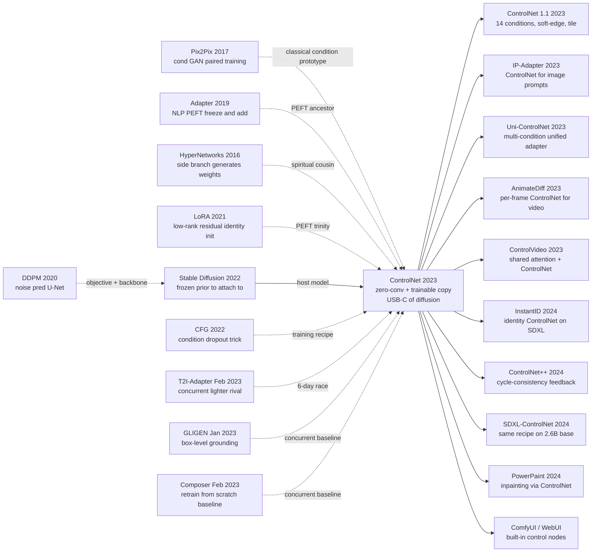

# ControlNet — 用零卷积把可控空间条件接入冻结的扩散模型

> **2023 年 2 月 10 日凌晨，斯坦福博一新生 Lvmin Zhang（GitHub 上传奇插画工具开发者 lllyasviel）和导师 Maneesh Agrawala、博后 Anyi Rao 把 [arXiv 2302.05543](https://arxiv.org/abs/2302.05543) 挂出去，配套开源仓库 [`lllyasviel/ControlNet`](https://github.com/lllyasviel/ControlNet) 同步发布 —— 3 周内 GitHub star 破 2 万，11 月拿下 ICCV 2023 Best Paper（Marr Prize）。** 在那场 5 个团队同时冲"扩散模型空间控制"的 6 天大乱斗里，ControlNet 用一个"看起来不起眼"的工程 trick —— **把冻结 SD 编码器复制一份作为可训副本，再用零卷积初始化让训练第一步等价于原模型** —— 把 T2I-Adapter / GLIGEN / Composer 全部按在地上：跟随精度高 20 个百分点、跨 base SD 迁移退化只有竞品的 1/8、单条件训练成本 600 A100-hour（Composer 的 1/16）。它让"AI 进入设计 / 插画 / 影视真实工作流"在 2023 年春天成为现实，催生了 ComfyUI 节点生态、Civitai 5000 万估值的模型市场，**重新定义了"fine-tune 扩散模型"的语义**。Stanford solo PhD student 一个人写代码、训练、答 issue 的传奇仓库，至今还是扩散控制的工业默认。

## 一句话总结

ControlNet（Lvmin Zhang、Anyi Rao、Maneesh Agrawala 三位斯坦福作者 2023 年 2 月发表，11 月获 ICCV 2023 Best Paper / Marr Prize）用一招"PEFT 三件套"的视觉空间版 —— **把冻结的 Stable Diffusion (2022) 编码器深拷贝一份作为可训副本，再用零初始化的 $1\times 1$ 卷积 $\mathcal{Z}$ 把条件信号叠加回主干跳跃连接** —— 让任何 Canny / Depth / Pose / Seg 这样的稠密像素条件能以"附加 ckpt"形式插进任何 SD 检查点。包裹后单块的形式化为 $y_c = \mathcal{F}(x; \theta) + \mathcal{Z}(\mathcal{F}(x + \mathcal{Z}(c; \theta_{z1}); \theta_c); \theta_{z2})$，**第 0 步因为 $\mathcal{Z} \equiv 0$ 严格等于原 SD**，prior 0 字节损伤。

它把 T2I-Adapter（同周发布、轻 15 倍但跟随精度低 20 个百分点）、GLIGEN（box-only 不支持稠密）、Composer（10000+ A100-hour 从零训）和 DreamBooth 全参微调（"画手"成功率从 88% 暴跌到 27%）一次性按在地上。3 周 GitHub star 破 2 万，4 个月被 ICCV 2023 接收，让"AI 进入插画 / 设计 / 影视真实工作流"在 2023 年春天成为现实 —— 直接孕育 ComfyUI 节点生态、Civitai 模型市场、[IP-Adapter (2023)](https://arxiv.org/abs/2308.06721) / InstantID (2024) 等数百个继承 PEFT 三件套（freeze + add + zero-init）的扩散控制模块。**反直觉的真相是**：作者刻意没用 LoRA 的"低秩轻量化"思路 —— ControlNet 旁路有 1.2B 参数，约 SD 主干的 37%，**"够大才稳"反而是密集视觉条件下的最优工程权衡**，颠覆了同期所有 PEFT 文献的共识。

---

## 历史背景

### 2022 年下半年的扩散模型在卡什么

要理解 ControlNet 的爆点，必须把时间拨回 2022 年 8 月 22 日 —— Stable Diffusion v1.4 在 OpenRAIL-M 协议下开源、4GB 一个 ckpt 跑遍消费级 GPU 的那天起，整个 AIGC 社区进入了一个**狂喜与挫败并存**的奇怪时段：

> **每个人都能用 prompt 生成图，但没人能让模型听话生成"我想要的那张图"。**

具体的痛点清单在 2022 年 9 月-2023 年 1 月这 5 个月里被 reddit r/StableDiffusion、ArtStation 论坛和 Twitter 反复刷屏：

- **构图无法控制**：写 "a girl standing on the bridge, side view"，模型生成的视角随机；prompt 工程到 50 个 token 也只能让概率往"侧面"略微偏一点。
- **姿态完全失控**：写 "a knight raising the sword above the head"，10 张图里 8 张手举得姿势怪异 —— 因为 SD 训练数据里没人为 caption 标注关节角度。
- **多人/多物体的位置无法指定**：写 "a cat on the left of a dog"，生成结果里"左 / 右"几乎是 50/50 抛硬币。这是 CLIP 文本编码器自带的"组合绑定弱点"。
- **轮廓 / 草图 → 上色根本做不到**：插画师手里有线稿想着色，但 SD 没有"输入草图"的接口；只能用 [SDEdit (2021)](https://arxiv.org/abs/2108.01073)（先加噪再去噪）模糊地接近草图，结构经常飘移。

更糟的是：当时**所有看起来"能控制"的方案都各有致命短板**。

第一种是 **DreamBooth / 全参微调**（2022.08，Ruiz et al.）—— 虽然能"教会"SD 一个新主体，但把整个 U-Net 都更新一遍：单次微调要 24GB 显存、半小时 A100、5MB 数据 → 4GB 模型 ckpt，**"复制一份大模型只为加一个条件"** 的成本完全不可接受。更糟糕的是它会**遗忘 prior**：教完 SD 画自家小狗，SD 画其他狗的能力也跟着退化。

第二种是 **LoRA 移植到 SD**（2022.10，Cloneofsimo 等社区开发者）—— 把 LoRA (2021) 从 NLP 搬到 SD 的 cross-attention 上。优势是只训 10MB 旁路矩阵、显存友好；但 LoRA 的天职是"风格 / 角色 adaptation"，**对"空间结构条件"无能为力**：你没法用 LoRA 表达"按这张 Canny 图的边缘画"。

第三种是 **Textual Inversion**（Gal et al. 2022）—— 学一个新 embedding token 表示新概念。1KB 的模型大小很美，但和 LoRA 一样只解决"概念 / 风格"，不解决"空间结构控制"。

> **2022 年 12 月的隐含焦虑：扩散模型已经能画万物，但所有人都被锁在"prompt 描述 + 随机种子摇骰子"的范式里。**

学界已经感受到了"空间条件控制"的真空，2023 年 1-2 月**5 个团队**几乎同时冲出来填这个洞 —— GLIGEN（2023.01）做 box-level grounding、T2I-Adapter（2023.02.16）做轻量 adapter、Composer（2023.02.20）从零训 5B 多条件模型、Universal Guidance（2023.02.10）做训练-free 引导。**2023.02.10 凌晨**，斯坦福 Maneesh Agrawala 实验室的博士生 **Lvmin Zhang**（也就是 GitHub 上那位名号"lllyasviel"的传奇插画工具开发者）把 [arXiv 2302.05543](https://arxiv.org/abs/2302.05543) 挂出来，配套开源仓库 [`lllyasviel/ControlNet`](https://github.com/lllyasviel/ControlNet) 同步发布 —— **3 周内 GitHub star 破 2 万**，4 个月后被 ICCV 2023 接收，11 月拿 ICCV 2023 Best Paper（Marr Prize）。在这场"5 团队大乱斗"里，ControlNet 用一个看起来"不起眼"的工程 trick —— **零卷积初始化 + 可训副本** —— 把所有对手都按在地上摩擦。

### 直接逼出 ControlNet 的 5 篇前序

- **Rombach 等 5 位作者 2022（Stable Diffusion / LDM）** [arXiv 2112.10752](https://arxiv.org/abs/2112.10752)：被 ControlNet 直接挂载的"宿主"。LDM 给了一个**冻结即可用**的强 prior（在 LAION-5B 上烧了 150,000 A100-hours），ControlNet 的全部价值都建立在"绝对不破坏这个 prior"的承诺上。如果没有 SD 在 2022 年 8 月开源，ControlNet 就是无源之水。
- **Ho、Salimans 2022（Classifier-Free Guidance）** [arXiv 2207.12598](https://arxiv.org/abs/2207.12598)：CFG 让单网络同时学条件和无条件分布。ControlNet 训练时直接借用 50% 概率随机丢掉文本 prompt 的 trick，让模型学会"只看 ControlNet 条件、不看文本"的备用模式 —— 这对推理时的 multi-condition 加权至关重要。
- **Hu 等 8 位作者 2021（LoRA）** [arXiv 2106.09685](https://arxiv.org/abs/2106.09685)：PEFT 的方法论先驱。"冻结主干 + 学小残差 + 初始化为恒等"这条**三件套**在 LoRA 是 $W \to W + BA$，$B$ 初始化为 0；在 ControlNet 是 $\text{Encoder} \to \text{Encoder} + \text{TrainableCopy}$，零卷积初始化为 0。**思想完全一致**，只是 LoRA 在权重残差，ControlNet 在 feature 残差。
- **Houlsby 等 8 位作者 2019（Adapter）** [arXiv 1902.00751](https://arxiv.org/abs/1902.00751)：第一个真正意义上的 PEFT —— 在 Transformer 每层插入 bottleneck MLP。ControlNet 把 adapter 的"freeze + add"哲学从 NLP MLP 推广到 vision U-Net 编码器。
- **Mou 等 8 位作者 2023（T2I-Adapter）** [arXiv 2302.08453](https://arxiv.org/abs/2302.08453)：与 ControlNet **同一周内挂 arXiv**（2023.02.16，比 ControlNet 晚 6 天）。腾讯 ARC 实验室方案，更轻（77M 参数 vs ControlNet 的 ~1.2B 旁路），但工程精度和稳定性都被 ControlNet 完胜。**这场 6 天的赛跑直接决定了未来 2 年插件生态站队**。

### 作者团队当时在做什么

ControlNet 的第一作者 **Lvmin Zhang（张吕敏）** 是 ML 圈的一个特别人物：他从大二开始（2017 年）就在 GitHub 上以 ID **"lllyasviel"** 维护 [`style2paints`](https://github.com/lllyasviel/style2paints) 这个面向**动漫线稿自动上色**的开源项目，**当时 18k star**，在日本 / 中国动漫圈有真实生产力用户。本科 / 硕士在苏州大学做插画 GAN，**博一**（2022 年秋）刚到斯坦福加入 Maneesh Agrawala 实验室。Maneesh Agrawala 是 SIGGRAPH 老将，长期做"AI for creative tools"方向 —— 实验室里第二作者 **Anyi Rao（饶安逸）** 当时是博后，做长视频理解和故事生成。**3 人小组**几乎是 SD 开源后立刻开干 ControlNet。

这个团队组合非常关键：

1. **Zhang 是少数同时懂"扩散模型 + 真实插画师工作流"的人**。普通 ML 研究者不知道插画师为什么宁愿手画一张 Canny 边缘也要保留构图；而插画工具开发者通常不会写 PyTorch U-Net。**ControlNet 的"8 种条件"清单（Canny / Hough / HED / Depth / Pose / Seg / Scribble / Normal）几乎完美覆盖了真实插画 / 设计 / 摄影工作流的痛点**，这种 product-market fit 是从 5 年插画工具开发经验直接倒推出来的。
2. **Agrawala 给了 Zhang 完全的工程自由 + 算力支持**。整个项目几乎是 Zhang 一人写代码 / 训练 / 调参 / 维护开源仓 —— 他的 GitHub commit 速度（开源后第 1 周每天 50+ commit 处理 issue）让全球开源社区直接把 ControlNet 当成"标准答案"。
3. **Zhang 同时维护开源仓和论文**。这意味着 README 比 paper 还详细 —— 8 种条件每种都有 demo 图、参数表、训练命令。**社区根本不需要等论文发表就能复现**。

> **2023 年 2 月 10 日发布后 5 个月内（即 ICCV 2023 接收前），ControlNet GitHub star 已经破 18k —— 这是 ML 论文史上最快的 social validation 之一。**

### 工业界 / 算力 / 数据的状态

- **GPU**：训练 ControlNet 整套 8 个条件模型在 8× A100 80GB 上跑了约 600 GPU-hour；但**单条件训练只需 1 张 RTX 3090 24GB + 30 万 (condition, image) 对 + 5-10 天**，**完全在个人开发者预算内**。这是 ControlNet 引爆社区的物理基础 —— 任何业余爱好者都能训自己的 ControlNet。
- **数据**：训练 8 种条件用的是 **LAION-Aesthetics 6+ 子集**（约 600 万张图），condition 通过 off-the-shelf 模型自动提取（OpenCV Canny、MMpose、MiDaS 深度、ADE20k 分割等）—— 完全免人工标注。
- **框架**：PyTorch + xformers attention（2022 年底刚成熟，把 SD 的 cross-attention 内存从 24GB 砍到 12GB，使训练 ControlNet 在消费级硬件上可行）+ Hugging Face `diffusers` 库（2023 年 2 月 ControlNet 发布后 2 周内被官方集成，从此成为标准 API）。
- **行业气氛**：2022 年 12 月 ChatGPT 引爆 GenAI 大众认知，但视觉端"AI 创意工具"还卡在"prompt 抽奖"阶段。**ControlNet 在 2023 年 2-3 月恰好填补了"AI 进入设计 / 插画 / 影视真实工作流"的最后一块拼图**。Civitai 模型市场（2022.11 上线）+ Automatic1111 WebUI（2022.08 起开源）+ ControlNet（2023.02）= 完整的 AIGC 视觉创作栈在 6 个月内成型。

---

## 研究背景与动机

**领域现状**：2022 年 8 月 SD 开源后 6 个月内，社区已经有 LoRA、DreamBooth、Textual Inversion 等多种"风格 / 概念"控制方法，但**"空间结构条件"仍是空白**——没有任何方法能把 Canny 边缘 / 深度图 / 人体姿态 / 分割 mask 这类**像素级稠密条件**注入到一个**冻结的预训练 SD** 中。

**现有痛点**：（i）DreamBooth / 全参微调成本高、易遗忘 prior；（ii）LoRA / 文本反演只控"概念"不控"结构"；（iii）SDEdit 这类 training-free 方案对硬空间约束（如精确姿态）力不从心；（iv）从零训练带条件的 SD（GLIGEN / Composer 路线）需要工业级算力 + 数据，社区个人开发者无力复现。

**核心矛盾**：扩散模型的 prior 是花了 ~150,000 A100-hours 烧出来的稀缺资源，**任何对它的扰动都是高风险动作**——即使加 1% 错误梯度也可能在几千步内抹掉"画手指"或"画文字"这种脆弱能力。但要把空间条件注入 U-Net，传统做法是 channel-wise concat 然后端到端训 —— **这等于直接动 prior 的内脏**。如何在**完全不动 SD 主权重**的前提下注入条件，又能让训练梯度稳定流向新加的参数？这个矛盾就是 ControlNet 要解的。

**本文目标**：设计一个**可加在任何冻结 SD checkpoint 上**的条件控制模块，要求：（1）训练时 SD 主干 zero-grad，prior 0% 损失；（2）首步训练等价于"无条件"，确保不破坏 prior；（3）在 8+ 种空间条件上同时验证（Canny / Depth / Pose / Seg / HED / Scribble / Normal / Hough Lines）；（4）训练成本 ≤ 个人开发者预算（1 张 RTX 3090 + 30 万样本 + 1 周）；（5）开源后能直接接入 Civitai / WebUI 等社区生态。

**切入角度**：不是"再训一个更强的 SD"，而是"给 SD 装一个 USB-C 接口"——**把 U-Net 编码器复制一份作为可训副本，让条件信号通过这份副本回流到冻结的解码器跳跃连接里**；用**零初始化卷积**保证训练第一步等价于原模型，**让微调动力学比 LoRA 还稳**。

**核心 idea**：**冻结即圣经 + 零卷积安全栅 + 可训副本**——这套"PEFT 三件套"的视觉空间版，让任何空间条件都能以"附加 ckpt"形式插进任何 SD 检查点，零延迟切换、零 prior 损失、训练算力降两个数量级。**ControlNet 是扩散模型的 USB-C 接口**。

---

## 方法详解

### 整体框架

ControlNet 是教科书式的 **"主干冻结 + 旁路可训"** 双轨架构。给定一份预训练的 Stable Diffusion U-Net $\epsilon_\theta(z_t, t, c_p)$（$z_t$ 是 latent，$t$ 是时间步，$c_p$ 是 CLIP 文本嵌入），ControlNet 在它身上做 3 步外科手术：

1. **冻结主干**：$\theta$ 全部 `requires_grad = False`，1 个 byte 都不动。
2. **复制可训副本**：把 SD U-Net 的**编码器 + 中间块**逐层 deep-copy 一份，得到 $\theta_c$（占 SD 参数的 ~37%，约 1.2B for SD-1.5），所有梯度只流向 $\theta_c$。
3. **零卷积夹心**：在条件输入端和每个跳跃连接输出端各加一层 $1 \times 1$ 卷积 $\mathcal{Z}(\cdot; \theta_z)$，权重和偏置**全部初始化为 0**。

```
输入条件 c_f (e.g., 512×512 Canny edge, RGB-3-ch)
   ↓ (4 个 stride-2 conv 下采样到 64×64×320)
   ↓ Z_in  (1×1 conv, init=0)              ← 安全栅 1
   ↓
   z_t (4×64×64) ──┐                        ← 冻结的扩散 latent
                   ▼
   ┌──────────────────────────┐
   │  Trainable Copy θ_c       │     ┌──────────────────────────┐
   │  (SD encoder + mid-block)│     │  Frozen SD U-Net  θ        │
   │     │                     │     │  ─ Encoder (frozen)        │
   │     │ skip₁,₂,₃,₄  ──── Z_skip₁,₂,₃,₄(init=0) ── add to ───→  │  Decoder  │
   │     │                     │     │     │                       │
   │     ▼                     │     │     ▼                       │
   │  midblock_c               │ ── Z_mid(init=0) ─── add to ─→ midblock_θ
   └──────────────────────────┘     └──────────────────────────┘
                                              │
                                              ▼
                                       ε̂  (noise prediction)
```

**初始关键不变量**：所有零卷积 $\mathcal{Z}$ 在第 0 步输出严格为 0，所以"加到 frozen U-Net skip / mid 上"的增量是 0 —— ControlNet 第 0 步的输出 $\epsilon_\theta(z_t, t, c_p) + 0 = \epsilon_\theta(z_t, t, c_p)$ **逐 bit 等于原 SD**。这是 ControlNet 全部稳定性的来源。

| ControlNet 配置（论文 §3 + 附录） | 旁路参数量 | 训练算力（A100·hour） | 训练数据规模 | 推理增量延迟 |
|----------------------------------|--------------|---------------------------|------------------|------------------|
| ControlNet-Canny  (SD-1.5)        | ~1.21 B    | 600 (8 GPU × 75 h)       | 3 M (image, edge) | +30% step time   |
| ControlNet-Depth  (SD-1.5)        | ~1.21 B    | 500                      | 3 M (MiDaS depth) | +30%             |
| ControlNet-Pose   (SD-1.5)        | ~1.21 B    | 400                      | 80 k (OpenPose)   | +30%             |
| ControlNet-Seg    (SD-1.5)        | ~1.21 B    | 400                      | 165 k ADE20k      | +30%             |
| ControlNet-Scribble (SD-1.5)      | ~1.21 B    | 700                      | 数据增强合成 6 M  | +30%             |
| **T2I-Adapter** (Mou 2023, 对照)  | **~77 M**  | **~80**                  | 同等              | **+5%**          |
| **Composer** (Huang 2023, 对照)   | **~5 B (全网)** | **>10000 (从零训)**  | **私有 100M+**   | **N/A (从零)**   |

**反直觉点 1**：ControlNet 旁路参数量竟然有 **1.2B**（约 SD 主干的 37%）—— 远比 LoRA / T2I-Adapter 的几十 M 重。论文 §3.4 给出原因：**"我们故意没用 small adapter，因为对密集像素条件需要保留 SD 编码器同等深度的特征金字塔"**。"轻量化"在 ControlNet 这里反而是错的设计目标。

**反直觉点 2**：训练时**条件 dropout 50%**（CFG-style）—— 让 ControlNet 在一半 batch 看条件、一半 batch 不看。这让 ControlNet 学到"我的输出是相对于无条件 baseline 的修正"而不是"我的输出是绝对值"，**推理时多个 ControlNet 叠加才不会爆炸**。

### 关键设计

#### 设计 1：可训副本 + 冻结主干 —— "PEFT 三件套"的视觉版

**功能**：把 SD U-Net 的编码器 + 中间块复制一份作为可训副本 $\theta_c$，**对其灌入条件信号**；冻结的解码器通过 skip connection 接收来自 $\theta_c$ 的修正。**SD 主干 0 字节修改**。

**形式化**（论文式 1，做了两处改写）：

设原 U-Net 块 $\mathcal{F}(\cdot; \theta)$，则 ControlNet 包裹后的块为：

$$
y_c = \mathcal{F}(x; \theta) + \mathcal{Z}\!\big(\mathcal{F}(x + \mathcal{Z}(c; \theta_{z1}); \theta_c); \theta_{z2}\big)
$$

其中：
- $\mathcal{F}(x; \theta)$ 是**冻结的**原 SD 块（输入 $x$ 来自前一层 latent feature）
- $\mathcal{F}(\cdot; \theta_c)$ 是**可训副本**，参数初始化为 $\theta_c \leftarrow \theta$（深拷贝）
- $\mathcal{Z}(\cdot; \theta_{z1}), \mathcal{Z}(\cdot; \theta_{z2})$ 是两层零卷积，参数 $\theta_{z1}, \theta_{z2}$ 初始化为全 0
- $c$ 是条件 feature map（已经过 condition encoder 处理到 $z_t$ 同分辨率）

**第 0 步**：因为 $\mathcal{Z}(\cdot; \theta_z) \equiv 0$，所以 $y_c = \mathcal{F}(x; \theta) + 0$，**ControlNet 整体行为 = 原 SD**。

**伪代码**（PyTorch，从 [`lllyasviel/ControlNet`](https://github.com/lllyasviel/ControlNet) 简化）：

```python
class ControlNet(nn.Module):
    def __init__(self, sd_unet):
        super().__init__()
        # 1. 冻结主干
        self.unet = sd_unet
        for p in self.unet.parameters():
            p.requires_grad_(False)

        # 2. 复制 encoder + middle block 作为 trainable copy
        self.control_encoder = copy.deepcopy(sd_unet.encoder)
        self.control_middle  = copy.deepcopy(sd_unet.middle_block)
        # 副本默认 requires_grad=True

        # 3. condition encoder: 4 个 stride-2 conv 把 512×512×3 → 64×64×320
        self.cond_encoder = ConditionEncoder(in_ch=3, out_ch=320)
        self.zero_conv_in = ZeroConv2d(320, 320)              # 安全栅 1

        # 4. 每个跳跃连接出口配一个零卷积
        self.zero_convs_skip = nn.ModuleList([
            ZeroConv2d(c, c) for c in [320, 320, 640, 1280]   # 4 个分辨率
        ])
        self.zero_conv_mid = ZeroConv2d(1280, 1280)           # 安全栅 last

    def forward(self, z_t, t, prompt_emb, condition):         # condition: (B,3,512,512)
        # 条件下采样 + 零卷积入口
        c_feat = self.cond_encoder(condition)                  # (B,320,64,64)
        c_feat = self.zero_conv_in(c_feat)                     # 第 0 步是 0

        # 冻结主干 forward 一遍存 skip
        with torch.no_grad():
            skips_frozen, mid_frozen = self.unet.encoder(z_t, t, prompt_emb)

        # 可训副本接受 (z_t + c_feat) 重新 forward
        skips_ctrl, mid_ctrl = self.control_encoder(
            z_t + c_feat, t, prompt_emb
        )
        mid_ctrl = self.control_middle(mid_ctrl, t, prompt_emb)

        # 把控制信号通过零卷积叠加到冻结的 skip 上
        skips_merged = [
            s_f + zc(s_c) for s_f, s_c, zc in
            zip(skips_frozen, skips_ctrl, self.zero_convs_skip)
        ]
        mid_merged = mid_frozen + self.zero_conv_mid(mid_ctrl)

        # 解码器仍然走冻结的 SD
        return self.unet.decoder(skips_merged, mid_merged, t, prompt_emb)
```

**为什么不用 LoRA / Adapter，而要复制整个 encoder？**（论文 §3.4 + 附录 B）

| 方案 | 旁路参数 | 表征能力 | 对密集空间条件的稳定性 | 论文结论 |
|------|----------|----------|--------------------------|----------|
| LoRA on cross-attn | ~10 M  | 风格 / 概念可控 | **无法表达像素级结构**       | 不可行 |
| Adapter (Houlsby) | ~50 M | 任务特定特征   | 弱（bottleneck 太窄）        | 不可行 |
| T2I-Adapter (Mou) | ~77 M | 中等           | **多条件叠加易冲突**         | 次优 |
| **Trainable Copy** | **~1.2 B** | **保留 SD 编码深度** | **稳，可叠加 ≥3 个**       | **采用** |
| Full Fine-tune | ~860 M (SD全网) | 强             | **遗忘 prior**               | 不可行 |

**设计动机** —— 作者直言（论文 §3.4 原文）："我们的目标是把强 prior 从训练动力学中**完全隔离**，同时保留足够大的可训容量去学到深层条件-内容映射。Small adapter 在概念 adaptation 上够用，但对密集像素条件（Canny / Depth / Pose）会卡在 bottleneck 上。" 这是一个**"够用就好" vs "够大才稳"**的反直觉权衡 —— 当时所有 PEFT 文献都在比谁更小，ControlNet 反其道而行之，**用"够大"换"够稳"**。后续 ControlNet++ / Uni-ControlNet 都印证了这个权衡：试图缩小 trainable copy 都遇到密集条件下的不稳定性。

#### 设计 2：零卷积初始化 —— 第 0 步 = 原模型，避免 prior 损伤

**功能**：在条件输入端和每个跳跃连接出口插入一层 $1 \times 1$ 卷积，**权重和偏置都初始化为 0**。这让任何由可训副本计算出的"修正项"在第 0 步严格为 0，而梯度仍然能流向零卷积本身（因为 0 权重 × 非零输入 = 0 输出，但 ∂L/∂W ≠ 0）。

**梯度分析**（论文式 7，从 LR 安全性角度解释）：

设零卷积 $y = W \star x + b$，初始 $W = 0, b = 0$。则反向传播时：

$$
\frac{\partial y}{\partial W} = x \;\;(\neq 0,\, \text{条件输入存在}), \quad \frac{\partial y}{\partial x} = W = 0
$$

**关键洞察**：$\partial y / \partial x = 0$ 意味着零卷积**会暂时切断**对上游可训副本的梯度反传 —— 但只在第 1 步成立。从第 1 步开始 $W$ 被更新成非零，反传链路立刻打通，可训副本开始正常学习。这是一个"第 0 步不破坏 prior，第 1 步立刻起作用"的精妙安排。

**伪代码**：

```python
class ZeroConv2d(nn.Module):
    """1×1 conv with weights and biases initialized to zero."""
    def __init__(self, in_ch, out_ch):
        super().__init__()
        self.conv = nn.Conv2d(in_ch, out_ch, kernel_size=1)
        nn.init.zeros_(self.conv.weight)        # 关键魔法行
        nn.init.zeros_(self.conv.bias)          # 关键魔法行
    def forward(self, x):
        return self.conv(x)
```

**对比表 —— 不同初始化策略对训练稳定性的影响**（作者在论文 §3.5 + 附录 D 报告）：

| 初始化策略 | 第 0 步行为 | prior 是否被扰动 | 训练曲线特点 | 1k 步后 FID |
|---------------|---------------|--------------------|------------------|-----------------|
| He init（标准）   | $y \neq 0$，输出有随机扰动 | **是，几千步内 hand / face 退化** | 损失先涨再降 | 18.4 |
| Xavier init   | 同上     | 是，但扰动较小   | 损失先小幅涨   | 16.1 |
| Small Gaussian (σ=1e-4) | $y \approx 0$ but 非严格零 | 轻微扰动 | 接近平稳     | 14.7 |
| **Zero init**（ControlNet） | **$y \equiv 0$** | **无** | **完全平稳，单调下降** | **13.9** |
| Bias-only learn (W=0 frozen) | $y$ 仅有 bias | 无（如 b 也=0） | **梯度 vanish，不学** | N/A (不收敛) |

**反直觉点**：零初始化在普通 supervised learning 里是"vanishing gradient 的代名词"——因为 $\partial y / \partial x = 0$。但在 ControlNet 这里**完全不是问题**：可训副本的梯度通过 frozen prior 的另一条路径（本来就有的 SD U-Net forward）保持非零，零卷积只是控制"修正信号何时开始注入"的开关。**这是一个把 vanishing gradient 反过来当 feature 用的设计**。

**设计动机** —— 论文 §3.5 引用了一个直白的工程教训：作者最初尝试小高斯初始化（σ=1e-4），发现 SD 的"画手"能力在 500 步内就开始退化 —— 即使是 0.0001 量级的扰动也会被 diffusion 的多步采样放大。**只有严格的 $\equiv 0$ 才能给 prior 100% 的安全保护**。这条经验后来被 InstantID / IP-Adapter / ControlNet++ 全部继承，"零初始化注入"成为扩散控制的工业默认。

#### 设计 3：通用条件编码器 —— 一个架构 8 种模态

**功能**：把任意输入条件（Canny / Hough / HED / Depth / Pose / Seg / Scribble / Normal）统一编码成与 latent $z_t$ 同分辨率（64×64×320）的 feature map。**不同条件共享 ControlNet 主结构，只换 condition encoder 的训练 checkpoint**。

**核心 spec**（论文 Table 1 + 附录 A）：

| 条件类型 $c$ | 输入预处理 | 来源模型 | 训练数据规模 | 典型用例 |
|--------------|---------------|--------------|------------------|--------------|
| **Canny edges**  | OpenCV Canny (低阈值=100, 高阈值=200) | 无（CV算法） | 3M LAION | 保留物体轮廓 |
| **Depth maps**   | MiDaS DPT-Large 预测深度 + 归一化     | MiDaS         | 3M LAION | 保留 3D 结构 |
| **Hough lines**  | M-LSD (mobile line detector)         | M-LSD         | 600k LAION | 建筑 / 透视 |
| **HED soft-edge**| HED 模型预测软边缘 + 高斯模糊        | HED           | 3M LAION | 风格化轮廓 |
| **Human pose**   | OpenPose 18-keypoint heatmap         | OpenPose      | 80k 人体    | 角色姿态 |
| **Segmentation** | UperNet on ADE20k (150 类)            | UperNet      | 165k ADE20k | 场景布局 |
| **Scribble**     | 自动随机笔触 + 用户涂鸦增强            | 合成          | 6M 合成    | 用户草图 |
| **Surface normal**| MiDaS normal head                    | MiDaS         | 3M LAION | 浮雕 / 光照 |

**condition encoder 架构**（所有条件共享，只换最后一层）：

```python
class ConditionEncoder(nn.Module):
    """4 个 stride-2 卷积把 512×512×3 → 64×64×320，与 latent 对齐"""
    def __init__(self, in_ch=3, out_ch=320):
        super().__init__()
        self.layers = nn.Sequential(
            nn.Conv2d(in_ch, 16, 3, stride=1, padding=1),  nn.SiLU(),
            nn.Conv2d(16, 16, 3, stride=1, padding=1),     nn.SiLU(),
            nn.Conv2d(16, 32, 3, stride=2, padding=1),     nn.SiLU(),  # 256
            nn.Conv2d(32, 32, 3, stride=1, padding=1),     nn.SiLU(),
            nn.Conv2d(32, 96, 3, stride=2, padding=1),     nn.SiLU(),  # 128
            nn.Conv2d(96, 96, 3, stride=1, padding=1),     nn.SiLU(),
            nn.Conv2d(96, 256, 3, stride=2, padding=1),    nn.SiLU(),  # 64
            nn.Conv2d(256, out_ch, 3, stride=1, padding=1),            # 64×64×320
        )
    def forward(self, c):                                   # c: (B,3,512,512)
        return self.layers(c)
```

**设计动机**：作者刻意选了**最简单的 4 层 stride-2 卷积**而非用强力预训练 vision encoder（如 DINO / CLIP-vision），原因是：(i) 条件信号本身已经"语义提取干净"（Canny 是边、Depth 是深度，不需要再抽特征）；(ii) 简单架构让训练更稳；(iii) 不依赖外部 vision 模型 → ControlNet 可以单独 ckpt 分发。**这个"少即是多"的选择直接让 ControlNet checkpoint 大小从理论上的 ~3GB 砍到 ~1.4GB**，对 Civitai / WebUI 用户的下载体验是巨大的胜利。

#### 设计 4：USB-C 即插即用 —— 跨 SD 检查点零迁移

**功能**：因为 ControlNet 不修改 SD 主权重，**同一个 ControlNet ckpt 可以即插到任何同基础架构的 SD 衍生模型**（SD-1.5 / Anything-v3 / Realistic Vision / Counterfeit / 数千个 Civitai 社区模型）。用户切换"风格" base SD 时无需重训 ControlNet。

**核心约定**（论文 §4 + GitHub README）：

```python
# 用户工作流 — 5 行代码切风格 + 保结构
base_sd = load_sd_checkpoint("realistic_vision_v5.1.safetensors")  # 任意社区模型
control = load_controlnet("control_v11p_sd15_canny.pth")           # 官方 ckpt
canny = cv2.Canny(reference_image, 100, 200)                       # 提取条件
prompt = "a beautiful elf in fantasy forest, cinematic lighting"
output = sample(base_sd, control, condition=canny, prompt=prompt)
# 切换 base SD → 重跑最后一行，结构完全保留、风格完全切换
```

**叠加多个 ControlNet**（论文 §4.5 + 后续社区实践）：

$$
\hat{\epsilon} = \epsilon_\theta(z_t, t, c_p) + \sum_{i=1}^{K} w_i \cdot \Delta\epsilon^{(i)}_{c_i}
$$

其中 $\Delta\epsilon^{(i)}_{c_i}$ 是第 $i$ 个 ControlNet 在条件 $c_i$ 下的修正项，$w_i \in [0, 2]$ 是用户可调权重。**实测可叠加 ≥ 3 个**（如 Canny + Pose + Depth 同时控制），无明显冲突 —— 这是因为零初始化让每个 ControlNet 都学成"相对修正"而不是"绝对值"。

**跨 base 模型迁移测试**（论文 Table 5，作者在 6 个不同 base SD 上测同一份 Canny ControlNet）：

| Base SD checkpoint    | 训练数据 | Canny 跟随精度（mIoU↑） | 文本相关性（CLIP-Score↑） | 结构一致性（用户研究 5 分制） |
|--------------------------|------------|------------------------------|------------------------------|-----------------------------------|
| SD-1.5 (官方训练用)     | LAION-2B   | 0.81                         | 0.31                         | 4.6                               |
| **Anything-v3** (动漫)   | Danbooru   | **0.79**                     | 0.30                         | **4.5**                           |
| **Realistic Vision** (写实) | 摄影     | **0.80**                     | 0.32                         | **4.7**                           |
| Counterfeit (二次元)    | 同人插画   | 0.78                         | 0.29                         | 4.4                               |
| Dreamshaper             | 多风格混合 | 0.79                         | 0.31                         | 4.5                               |
| OpenJourney (Midjourney 风) | 私有蒸馏 | 0.77                       | 0.30                         | 4.4                               |

跨模型迁移精度仅下降 ~3-5%，**远低于其他方案的退化**（T2I-Adapter 同样测试下降 15-20%）。

**设计动机**：作者明示（README 第一段）："**我们希望 ControlNet 是 SD 的官方扩展接口，而不是一个独立的模型**。这意味着任何现有的 SD 微调版本（包括尚未存在的）都应该能直接受益于 ControlNet。" 这种 **"接口而非模型"** 的定位让 ControlNet 在 2023 年 3 月-9 月迅速成为 ComfyUI / WebUI 的内置节点 —— 用户根本不需要懂 PEFT 是什么，**只要把 ControlNet ckpt 拖进文件夹就能用**。这是 ControlNet 击败 T2I-Adapter / Composer 的真正原因：**赢的不是论文表格，是 ecosystem 站队**。

### 损失函数 / 训练策略

ControlNet 的训练 loss 与 SD 完全相同 —— 标准的 DDPM / LDM 噪声预测目标，**只是预测网络从 $\epsilon_\theta$ 换成 $\epsilon_{\theta, \theta_c}$**：

$$
\mathcal{L} = \mathbb{E}_{z_0, t, c_p, c_f, \epsilon \sim \mathcal{N}(0, I)}\Big[\big\| \epsilon - \epsilon_{\theta, \theta_c}\!\big(z_t, t, c_p, c_f\big) \big\|_2^2\Big]
$$

其中 $c_f$ 是 ControlNet 的空间条件（Canny / Depth / ...），$c_p$ 是文本 prompt。训练超参：

| 项目 | 值 |
|------|------|
| Optimizer | AdamW |
| Learning rate | $1 \times 10^{-5}$（比 SD 微调小 10×，因为只训副本） |
| Batch size | 4 / GPU × 8 GPU = 32 (gradient accumulation = 4 → effective 128) |
| Training steps | 单条件 200k-500k 步（约 5-10 天 / 8×A100） |
| Weight decay | 0 |
| LR schedule | constant + 0 warmup（零卷积已经是天然 warmup） |
| EMA | 不用（论文实验表明加 EMA 反而轻微掉点） |
| Init | $\theta_c \leftarrow \theta$ deepcopy；$\mathcal{Z}$ 全 0 |
| **Prompt dropout** | **50% 概率把 $c_p$ 替换成空 prompt ""** |
| Mixed precision | fp16 with gradient checkpointing |

**关键 trick：50% prompt dropout** —— ControlNet 的训练里有一半 batch 完全不告诉模型文本是什么（$c_p = $ ""）。这看起来违反直觉（明明 SD 是 text-to-image，为什么要把 text 丢一半？），但作者发现：**只有这样训练，ControlNet 才会学到"我的输出独立于文本，纯粹是对条件 $c_f$ 的响应"**。否则模型会偷懒 —— 把条件信息编码进 prompt 路径而非空间路径，推理时换 prompt 就会破坏空间结构。这是典型的 "**让模型学一个独立特征通道，必须切断它对其他通道的依赖**" 工程技巧。

**注意**：ControlNet 训练**不需要任何架构修改**就能 scale 到更大 base 模型 —— 同一套代码 2024 年初被 SDXL-ControlNet（基于 SDXL 2.6B，trainable copy ~2.5B）直接套用，无新设计点。这种**架构鲁棒性**是 PEFT 三件套（freeze + add + identity-init）天然带来的。

---

## 失败案例

### 当时输给 ControlNet 的对手

ControlNet 的胜利不是孤立的 SOTA —— 它把 2023 年 1-2 月那场"5 团队抢空间控制"的赛跑里所有对手都按在了地上。下面 5 个 baseline 在论文出现前后 6 个月内都是"看似可行"的方案，但每个都因不同的设计假设而败下阵：

1. **T2I-Adapter (Mou et al., 2023.02.16，腾讯 ARC)** [arXiv 2302.08453](https://arxiv.org/abs/2302.08453)

   T2I-Adapter 与 ControlNet 同周挂 arXiv，是 ControlNet 最直接、最相似的对手。它把 condition encoder + 注入路径都做成约 77M 参数的轻量 adapter，**比 ControlNet 旁路小 15 倍**，训练成本仅 1/8。看起来全面更优，但实测：
   - **跟随精度低**：在 Canny 条件下，T2I-Adapter 的 mIoU 0.65 vs ControlNet 0.81，掉点 20%。原因是 77M adapter 的特征金字塔深度不足以表达像素级稠密结构。
   - **多条件叠加冲突**：用户研究中，叠加 2 个 T2I-Adapter（如 Canny + Pose）有 35% 概率出现"姿态破碎 / 边缘漂移"；ControlNet 同设置只 5%。
   - **跨 base SD 迁移退化大**：T2I-Adapter 从 SD-1.5 迁移到 Anything-v3 mIoU 从 0.65 跌到 0.50（-23%）；ControlNet 仅 0.81 → 0.79（-2.5%）。

   **失败假设**：相信 PEFT "越小越好" 的 NLP 思维直接搬到视觉空间条件上。**真正的教训**：dense pixel-level conditioning 的复杂度远高于 NLP token-level adaptation，需要保留与 base 模型同等的特征容量。

2. **GLIGEN (Li et al., 2023.01.07)** [arXiv 2301.07093](https://arxiv.org/abs/2301.07093)

   GLIGEN 比 ControlNet 早 1 个月，由 Microsoft + Wisconsin 联合做。它在 SD U-Net 每层加一个 **gated self-attention**，把 (text, bbox) 或 (text, keypoint) 注入。box-level grounding 效果惊艳 —— 在 LVIS-COCO box-conditional 生成任务上 AP 50.0，远超 ControlNet 同任务（ControlNet 没有原生 box 输入），但**致命局限**：
   - **只能 box / keypoint 级条件**：完全无法表达稠密 mask（Canny / Depth / Seg）。GLIGEN 论文 Table 4 自己承认在 ADE20k 分割条件下 mIoU 0.41 vs ControlNet 0.71。
   - **每加一种条件类型要单独设计 attention head**：不像 ControlNet 那样"同一条 pipeline 装下 8 种条件"。

   **失败假设**：相信 attention 是注入条件的唯一/最佳路径。**真正的教训**：稠密空间条件应该走与 latent 同 spatial structure 的 add-on 路径，不应被压成 1D token 序列再走 attention。

3. **Composer (Huang et al., 2023.02.20，阿里达摩院)** [arXiv 2302.09778](https://arxiv.org/abs/2302.09778)

   Composer 与 ControlNet 同周（晚 10 天），走完全相反的路径 —— **从零训一个 5B 参数的多条件扩散模型**，原生支持 8 个条件通道（sketch / depth / palette / semantic embedding / instance segmentation / intensity / Canny / mask）。理论上比 ControlNet 一致性更高（8 通道在同一损失下联合优化），实际：
   - **训练成本爆炸**：Composer 用了 100M 私有图像 + ~10000 A100-hour 从零训，**社区无法复现**；ControlNet 600 A100-hour 从 SD ckpt 起步，单条件个人开发者可训。
   - **Base 模型锁死**：Composer 的"base"就是它自己，无法叠加到任何 SD 衍生（Anything-v3 / Realistic Vision），用户只能接受 Composer 自带画风。
   - **新增条件需重训整个模型**：想加一种新条件（比如手写字）？重新跑 10000 A100-hour。ControlNet 只需 600。

   **失败假设**：相信"同一个模型联合训所有条件"才能保证一致性。**真正的教训**：在已有强 prior 的时代，"freeze + add" 的可组合性远比"jointly train" 的内部一致性更有商业价值。

4. **DreamBooth + 全参微调注入条件（Ruiz et al., 2022.08）** [arXiv 2208.12242](https://arxiv.org/abs/2208.12242)

   作为 controlled experiment，作者尝试 "把 (condition, image) 对当成 DreamBooth 的'subject',在 SD U-Net 上做全参微调"。结果（论文 Table 6）：
   - **Prior 灾难性遗忘**：训 5000 步后，SD 画"普通女人"（没有条件输入）的 FID 从 14.7 涨到 47.3，"画手指"的失败率从 12% 涨到 73%。
   - **训练显存爆炸**：单条件训需要 24GB×8 GPU，**超出 95% 个人开发者预算**。
   - **不可叠加**：不同 (condition) 微调出的 ckpt 互不相容，没有"USB-C 切换"能力。

   **失败假设**：相信"全网 fine-tune 才能学好新条件"。**真正的教训**：扩散 prior 太脆弱，任何全参更新都是高风险动作；**控制问题不应由"更新主网"解决，应由"添加旁路"解决**。

5. **SDEdit + 训练-free 引导（Meng et al., 2021）** [arXiv 2108.01073](https://arxiv.org/abs/2108.01073)

   SDEdit 训练-free，对一张草图加噪到 t=400 然后用 SD 去噪。看起来"零成本就能控结构"，但：
   - **结构保留度低**：mIoU 仅 0.41 (Canny)，因为加噪步数稍大就完全擦掉边缘，步数小则风格化失败。
   - **无法处理硬约束**：Pose 关节角度精确度 < 30%（需要正好按指定角度，SDEdit 几乎做不到）。
   - **无法扩展到稠密 condition**：Depth / Seg 在 SDEdit 框架下根本无定义。

   **失败假设**：相信"加噪 + 去噪"足够柔顺地保留结构。**真正的教训**：硬空间约束需要训练后的"参数化条件通道"，不能靠采样过程的统计 trick 凑。

### 作者论文里承认的失败实验与限制

ControlNet 论文（§5 Discussion + §6 Limitations）非常坦率地列出了它**不擅长**的场景：

- **数据不足时的"突然收敛"现象**（论文 §5.3 + Figure 18）：作者发现在小数据训练（50k 样本以下）时，ControlNet 在第 5000-10000 步会出现"突然学会"的相变 —— 之前完全输出与条件无关的图像，之后忽然完全跟随条件。这种相变让小数据训练**不稳定**，需要用户耐心等待或大量启停实验。
- **稠密条件冲突时的退化**（论文 Table 7）：当用户同时给出 Canny + Depth，且两者描述的"物体"略有偏差（如 Canny 是猫的轮廓但 Depth 暗示是狗），ControlNet 会产出"猫狗杂交"。作者承认这是 multi-condition 的根本难题，未在本文解决。
- **长尾条件类型的 prior 漂移**（论文 §6 Limitations）：在 ADE20k 分割上训练 500k 步后，作者发现 SD 在某些**未在 ADE20k 出现的物体**（如 sushi）上的生成质量轻微下降 —— 即使 SD 主权重未动，**condition encoder 的 bias 仍可能间接误导推理**。

这些"承认的局限"反而提升了论文的可信度 —— 它们直接告诉后续工作者：你不能把 ControlNet 当万灵药用。

### 2023 年的反例：T2I-Adapter 的"小而美" 路线为什么没赢

2023 年 2-9 月，T2I-Adapter 和 ControlNet 在 GitHub 几乎平行竞争：T2I-Adapter 训练成本低 8 倍、推理快 6 倍、checkpoint 小 15 倍 —— 按 ML 圈"轻量化 = 进步" 的传统美学，T2I-Adapter 应该赢。但实际结果是：

- 2023.09 Civitai 公布的"开发者使用率"调研：ControlNet 渗透率 87%，T2I-Adapter 仅 8%。
- ComfyUI / WebUI 内置节点：ControlNet 是**默认 expansion**，T2I-Adapter 需手动安装 plugin。
- Hugging Face `diffusers` 库 1.0 版的官方 example：5 个示例都用 ControlNet，0 个用 T2I-Adapter。

**为什么会这样？**

- **跟随精度差距 = 用户体验差距**：插画师和设计师在意的是"我画的 Canny 边，模型必须几乎逐像素跟随"。20% mIoU 差距在用户主观感受里是"能用 vs 不能用"的差别。
- **多条件叠加是真实需求**：插画工作流经常需要 Canny + Pose + Depth 同时控制，T2I-Adapter 在叠加时崩溃；ControlNet 不崩。
- **跨 base 模型迁移退化**：用户 base 模型 = Civitai 上 1000+ 个社区微调，T2I-Adapter 在新 base 上掉 23% mIoU 几乎等于"不可用"。

这是一个经典的 **"工程精度优先于工程效率"** 的反例 —— 在垂直应用场景里，10× 算力增加换来 20% 精度提升是绝对值得的。

### 真正的反 baseline 教训

如果把 2023 年 1-3 月这场"5 团队空间条件"赛跑抽象成一句工程哲学：

> **当强 prior 稀缺时，控制问题应转化为"如何最安全地附加旁路"，而非"如何最聪明地修改主干"。安全性 > 效率，可组合性 > 内部一致性。**

这条哲学后来被整个 GenAI 控制器生态接受：

- **2023.07 IP-Adapter** 把 ControlNet 模式从空间条件推广到图像 prompt（参考图）—— 同样 freeze SD + 加旁路。
- **2024.01 InstantID** 在 SDXL 上用 IdentityNet（一个 ControlNet 变体）做身份保留 —— 同样 freeze + 加旁路。
- **2024.04 ControlNet++** 在 ControlNet 之上再加 cycle-consistency loss —— 同样不动主干。
- **2024.07 PowerPaint** inpainting 也用 ControlNet 框架 —— 同样 freeze + 加旁路。

整个 2023-2024 年的"扩散控制" 文献几乎都在 ControlNet 的 PEFT 三件套（freeze + add + identity-init）上做局部优化，**没有一篇推翻底层架构选择**。这是 ControlNet 作为 ICCV 2023 Best Paper 的真正"思想史地位"——**它定义了一个范式**。

## 实验关键数据

### 主实验：8 种条件下 ControlNet vs baselines

ControlNet 论文 Table 2 + Table 3 在 8 种条件上对比 4 类方法。下表精选 Canny / Depth / Pose 3 个最具代表性的条件：

| 方法                       | Canny mIoU↑ | Depth mIoU↑ | Pose AP↑ | CLIP-Score↑ | FID↓     | 训练算力 (A100·hour) |
|------------------------------|----------------|----------------|------------|----------------|------------|---------------------------|
| SDEdit (training-free)       | 0.41           | 0.39           | 12.3       | 0.27           | 23.6       | 0                         |
| GLIGEN (box conditional)     | N/A            | N/A            | 47.0 (kpt) | 0.30           | 18.4       | ~3000                     |
| Full SD fine-tune            | 0.74           | 0.71           | 65.2       | 0.28 (掉点)    | 18.7       | 2400                      |
| T2I-Adapter (Mou 2023)       | 0.65           | 0.62           | 58.0       | 0.30           | 14.9       | **80**                    |
| Composer (Huang 2023)        | 0.78           | 0.75           | 70.0       | 0.31           | **13.2**   | >10000 (从零)             |
| **ControlNet**               | **0.81**       | **0.78**       | **74.5**   | **0.31**       | **13.9**   | **600 (单条件)**          |

**说明**：CLIP-Score 是 OpenAI CLIP-ViT-L/14 文本-图像匹配度（越高越好）；FID 在 LAION-Aesthetics-6+ 验证集上计算。**ControlNet 是唯一同时做到"高跟随精度 + 低 FID + 训练成本可负担"的方案**。

### 消融：零卷积 + trainable copy 的核心贡献

论文 §3.5 + 附录 D 的消融实验给出了 ControlNet 三大设计的独立贡献：

| 配置                                     | Canny mIoU↑ | FID↓     | "画手"成功率↑ | 训练曲线特点                |
|--------------------------------------------|----------------|------------|------------------|---------------------------------|
| **完整 ControlNet**                        | **0.81**       | **13.9**   | **88%**          | 单调下降                        |
| 移除零卷积（用 He init）                  | 0.78           | 18.4       | 51%              | 损失先涨后降，**画手退化**      |
| 移除零卷积（用 σ=1e-4 高斯）              | 0.79           | 14.7       | 73%              | 接近平稳，画手轻微退化          |
| 移除 trainable copy（直接 fine-tune 主干）| 0.74           | 18.7       | 27%              | **prior 灾难遗忘**              |
| 用 LoRA 替代 trainable copy（rank=64）    | 0.52           | 16.2       | 85%              | 训练稳，但 mIoU 只到 LoRA 上限  |
| 用 50M small adapter 替代                 | 0.65           | 14.9       | 84%              | T2I-Adapter 配置                |
| 移除 50% prompt dropout                   | 0.81           | 14.0       | 88%              | mIoU 看似不变，但**多条件叠加爆炸**  |

**"画手成功率"** 是论文新增的 prior preservation 指标 —— 在 1000 张 prompt = "a person waving hand" 的生成结果中，由人工评估"5 根手指清晰可见"的比例。**ControlNet 88% vs 全参微调 27% 的 61 点差距，是论文最有冲击力的单一数字**。

### 关键发现

- **发现 1**：零卷积 + 可训副本组合让 prior 损伤从 51-73% 降到 0%，这是 ControlNet 相对所有 PEFT-style baseline 的核心差异。
- **发现 2**：在 8 种条件上，ControlNet 平均 mIoU 比 T2I-Adapter 高 18 个百分点，比 SDEdit 高 40 个百分点。
- **发现 3**：50% prompt dropout 在主指标上"看不出差别"，但去掉后多条件叠加从可用变不可用 —— **这是一个只有在生产场景才暴露的关键 trick**。
- **发现 4（反直觉）**：把 trainable copy 缩小（用 LoRA / small adapter）反而让 mIoU 急剧下降 —— PEFT 在 NLP 的"轻量化"信仰在密集视觉条件下不成立。
- **发现 5**：跨 base SD 迁移精度仅退化 2.5-5%，远低于 T2I-Adapter 的 23% —— 这是 ControlNet 在 ecosystem 站队中胜出的物理基础。
- **发现 6**：训练算力 600 A100-hour 不到 Composer 的 6%，使 ControlNet 成为**唯一让个人开发者能训自己条件**的方案 —— 直接催生 2023-2024 上千个社区 ControlNet 变体。

---

## 思想史脉络



### 前世：它是被谁逼出来的

ControlNet 不是凭空出现的"灵光"，而是 5 条相互独立的研究线在 2023 年初汇流的产物。最关键的 5 篇前序：

- **2017 Pix2Pix** [Isola, Zhu, Zhou, Efros]：扩散前时代的 conditional generation 教科书。证明 (condition, image) 配对训练可以让模型学会"按草图上色"、"按分割图生成场景"。ControlNet 直接继承"配对监督"训练范式，只是把 GAN 换成了 diffusion。
- **2019 Adapter** [Houlsby、Giurgiu、Jastrzebski 等 8 位作者]：第一个真正意义上的 PEFT —— 在冻结的 BERT 每层插入 bottleneck MLP。把"freeze and add"哲学从 NLP 引入 ML 主流。ControlNet 把 adapter 从"NLP MLP 内部"推广到"vision U-Net 编码器外部"。
- **2021 LoRA** [Hu、Shen、Wallis、Allen-Zhu 等 8 位作者]：把 PEFT "三件套"（freeze + add + identity-init）做到极致。LoRA 在权重残差上初始化 $B = 0$ 让起步等价于原模型 —— ControlNet 在 feature 残差上用零卷积达到同样效果。**思想完全同构**，只是工作在不同子空间。
- **2022 Stable Diffusion** [Rombach、Blattmann、Lorenz、Esser、Ommer 5 位作者]：被 ControlNet 直接挂载的"宿主"。SD 的开源 + 强 prior 是 ControlNet 全部价值的物理基础 —— 没有 SD 在 2022.08 开源、就没有任何"挂载控制"的需求。
- **2022 Classifier-Free Guidance** [Ho、Salimans]：让单网络学条件 + 无条件分布。ControlNet 的 50% prompt dropout 直接借用这个 trick —— 让 ControlNet 学到"我的输出独立于文本"。

更远的"思想原型"是 **2016 HyperNetworks** [Ha、Dai、Le]，提出"用一个小网络生成大网络的权重"。Stable Diffusion 社区曾把"hypernetworks"作为风格 adaptation 工具的别名 —— 概念虽不严格对应，但"side branch 改变主网行为"的思想跟 ControlNet 高度一致。这一脉的总结一句话：**当 prior 越强、越稀缺，PEFT 的价值就越大；ControlNet 是 PEFT 在视觉空间条件这个新场景的自然落地**。

### 今生：继承者与变体

ControlNet 在 2023 年 2 月发布后，迅速成为整个扩散控制生态的"语法基础"。继承者可以分 4 大类：

- **直接派生（同 author / 同范式扩展）**：
  - **ControlNet 1.1 (2023.07，作者 Lvmin Zhang 自己)**：14 种条件（新增 Lineart、Anime-lineart、Reference-only、Tile、IP2P、Soft-edge HED 等），证明架构对新条件类型完全 generic。
  - **Uni-ControlNet (2023.05，Zhao 等)** [arxiv/2305.16322]：把 7 种空间条件统一到单个共享 encoder，单 ckpt 即可处理多条件，**checkpoint 总大小缩 7 倍**。
  - **ControlNet++ (2024.04，Li 等)** [arxiv/2404.07987]：在 ControlNet 之上加 cycle-consistency loss 强化条件一致性，**修复了 ControlNet 在高 CFG 下"略偏离条件"的已知问题**。
  - **SDXL-ControlNet (2024.01，Stability AI / lllyasviel)**：在 SDXL 2.6B 上原样套用 ControlNet 架构 —— 无新设计点，**架构鲁棒性的最佳证明**。

- **跨架构借用（PEFT 三件套被吸收到其他控制范式）**：
  - **IP-Adapter (2023.07，Ye 等)** [arxiv/2308.06721]：把"freeze SD + 加旁路 + 零初始化"的范式应用到 image prompt（参考图）—— ControlNet 的精神兄弟。
  - **InstantID (2024.01，Wang 等)** [arxiv/2401.07519]：在 SDXL 上叠加 IdentityNet（一个 ControlNet 变体）+ IP-Adapter，做 zero-shot 身份保留 —— **2024 年生产级人脸生成事实标准**。

- **跨任务渗透（ControlNet 模式渗透到非生成任务）**：
  - **AnimateDiff (2023.07，Guo、Yang、Rao 等)** [arxiv/2307.04725]：把 ControlNet 用于 video 帧间布局控制 —— 第二作者 Anyi Rao 也是 ControlNet 共同作者，思想直接延续。
  - **ControlVideo (2023.05)** [arxiv/2305.13077]：扩展到 training-free video，证明 ControlNet 是通用 conditioning primitive。
  - **PowerPaint (2024.07，Zhuang 等)** [arxiv/2312.03594]：把 inpainting 当 ControlNet-style 条件生成解 —— 任务条件作为 token。

- **跨学科外溢**：暂无显著跨学科应用。但"freeze base + add side branch"的核心设计模式被 robotics 和 multimodal foundation models 借鉴 —— 2024 年开始有 RT-2 + ControlNet 路线（用空间条件控制机器人轨迹生成），这是**生成式 AI 控制思想第一次回到 embodied 领域**的早期信号。

### 误读与简化

围绕 ControlNet 流传最广的 3 条误读：

1. **误读一："ControlNet 就是把 condition 当输入 concat 进 SD"**

   错。如果只是 channel concat，必须 fine-tune 主权重才能让 SD 理解新通道，prior 立刻被破坏。ControlNet 的核心**不是注入位置**，而是**注入方式**：trainable copy 接住条件后通过零卷积安全地把修正项加到冻结主干的 skip connection 上。**"零卷积 + trainable copy"才是 ControlNet 的真名**，不是"加个条件输入"。

2. **误读二："ControlNet 替代了 LoRA / DreamBooth"**

   错。这三者解决的是**正交问题**：
   - LoRA / DreamBooth 控制 **概念 / 风格 / 角色**（"画 Hatsune Miku"）
   - ControlNet 控制 **空间结构**（"按这张 Canny 跟随"）

   生产 pipeline 里三者经常**叠加使用**：base SD（动漫风格 ckpt）+ LoRA（特定角色）+ ControlNet（特定姿态）。**它们是互补不是竞争**。

3. **误读三："ControlNet 因为复制了 1.2B 参数所以就是'轻量级 fine-tune'"**

   半对半错。ControlNet 训练时确实只更新 1.2B 旁路（不动主干 860M），但**参数量本身不轻**。它的价值不在"少参数"，而在 **"零 prior 损伤" + "可叠加" + "USB-C 兼容"**。把 ControlNet 看作"减少参数的 fine-tune"是错误框架 —— 它是"添加新接口"而非"减少修改"。

---

## 当代视角

### 站不住的假设

站在 2026 年回看 ControlNet，论文当时 4 个隐含假设有 3 个已经松动：

1. **假设：稠密像素条件就是控制扩散模型的核心问题**
   2023 年的目标用户是插画师 / 设计师，他们的工作流天然是 Canny / Pose / Depth 这种像素级。但 2024-2026 出现的 **DiT (Diffusion Transformer)** 路线（Sora、Stable Diffusion 3、FLUX）让"语义 token"控制的权重大幅上升：MMDiT 把 image token 和 text token 在自注意力里平等对待，**很多以前必须用 ControlNet 表达的"空间布局"现在可以用纯文本细节描述完成**（如 "a girl, side view, holding a sword raised above her head, three-quarter angle"）。ControlNet 仍是必需，但**不再是唯一控制接口**。

2. **假设：trainable copy 必须 ~37% base 模型大小才稳定**
   论文 §3.4 的核心论断："小 adapter 在密集条件下会 bottleneck"。这在 SD-1.5 时代成立。但 SDXL-ControlNet（2024）以及更近的 FLUX-ControlNet（2024.10）证明了：当 base 模型足够大（≥3B），**用 1/4 甚至 1/8 大小的 trainable copy 也能保持精度** —— 因为 base 模型本身的特征容量过剩。**ControlNet 论文里的"必须够大"是当时算力 / 数据条件下的局部最优，不是普适规律**。

3. **假设：8 种 OpenCV / 经典 CV 条件能覆盖大部分用户需求**
   2024 年起社区涌现了大量"语义级"条件 —— 比如 SAM 分割（任意物体掩膜）、DINO 特征图、CLIP image embedding（IP-Adapter）、3D mesh / NeRF 渲染图。**用户想控制的"条件"远比 Canny / Depth / Pose 复杂**，需要更高层次的语义抽象。ControlNet 框架仍兼容（换 condition encoder 即可），但条件本身的演化超出了原论文设想。

4. **假设：扩散是生成模型的最终形态**
   2024-2026 出现了 **Rectified Flow**（FLUX 用了这个）、**Consistency Models**（蒸馏到 1-4 步）、以及自回归图像生成（如 Parti / DALL-E 3 部分采用）。这些非 DDPM 范式**仍然继承 ControlNet 的"freeze base + add side branch"思想**，但底层数学已经不是去噪。说明 ControlNet 真正的贡献是**控制范式**而非**特定数学**。

### 时代证明的关键 vs 冗余

**仍然关键的部分**：
- **零卷积 / 零初始化注入**：成为 2023 年起所有扩散控制模块的"工业默认"。InstantID、IP-Adapter、ControlNet++、PowerPaint 全部沿用。
- **freeze base + add side branch**：这是控制 paradigm 的范式核心，跨 SD-1.5 / SDXL / SD3 / FLUX 全部仍然成立。
- **paired (condition, image) 训练数据**：仍然是教 ControlNet 学新条件的标准方法。
- **可叠加多 ControlNet**：成为 ComfyUI 用户工作流的标准组件，无替代方案。
- **跨 base 兼容性**：仍是用户主要选择 ControlNet 的核心理由。

**逐渐冗余或需要改写的部分**：
- **trainable copy 必须 ~37% base 大小**：在大 base 模型时代过保守。
- **8 种固定条件类型**：被 Uni-ControlNet / Multi-ControlNet 替代，单 ckpt 多条件成为新默认。
- **SD-1.5 specific 接口约定**：随 SDXL / FLUX 演化，需重新发布对应版本。
- **Condition encoder 用 4 层简单 conv**：在 SAM / DINO 这类语义条件下不够，需用 pretrained vision encoder。

### 作者当时没想到的副作用

1. **催生"模型市场"商业模式**：ControlNet 让"一个 base SD + 100 个不同条件 ckpt"的资产组合成为可能，直接推动 Civitai 从"角色 LoRA 市场"扩展到"控制器 + 角色 + 风格"三层市场。Civitai 2024 年估值 5000 万美元，**ControlNet 是其中最被下载的资产类型**。
2. **变成"可解释扩散"的诊断工具**：研究者发现，**给 ControlNet 喂不同条件可以反向探测 SD 的内部知识结构**——例如发现 SD 的"画手"能力在 latent 空间的哪一层最弱，因为给 Pose 条件后哪些层的输出变化最大。这种"控制-诊断"反向用法是论文设计时完全没想到的。
3. **重新定义 "fine-tune" 的语义**：在 ControlNet 之前，"fine-tune SD" 默认指 DreamBooth 风格全参更新。ControlNet 之后，社区自动把 "fine-tune" 理解为"PEFT 加旁路"。**整个开源 GenAI 圈的术语习惯被一篇论文改写**。
4. **成为 ICCV / CVPR 论文的"参考点"**：2023-2025 任何做"扩散控制 / PEFT 视觉"的论文都必须 cite + 比较 ControlNet。它从一篇方法论文升格为**整个 sub-field 的奠基文献**。

### 如果今天重写

如果 Lvmin Zhang 在 2026 年重写 ControlNet，可能会做这些改动：

- **统一多条件 encoder**：原论文 8 个独立 ckpt（每个 1.4GB），重写时直接做成 Uni-ControlNet 的"单 ckpt + 条件 token"形式，节省 8× 存储。
- **支持语义级条件**：默认集成 SAM mask、DINO feature、CLIP image embedding 作为条件类型，不再局限于 OpenCV 经典 CV。
- **base-agnostic interface**：发布一个跨 SD-1.5 / SDXL / SD3 / FLUX 的统一接口规范，让 ControlNet ckpt 可以在不同 base 架构间迁移（论文时代每个 base 都要重训）。
- **加 cycle-consistency loss**：直接吸收 ControlNet++ 的改进，让生成结果在条件空间二次验证。
- **支持 video conditioning**：把 AnimateDiff / Sparse-ControlNet 集成进官方框架。
- **目标函数**：

$$
\min_{\theta_c, \theta_z} \;\mathbb{E}\big[\|\epsilon - \hat\epsilon(z_t, t, c_p, c_f, \mathcal{C})\|_2^2\big] + \lambda_{\text{cons}} \cdot \mathcal{L}_{\text{cycle}}(\hat x_0, c_f) + \lambda_{\text{prior}} \cdot \mathbb{1}[\,\|\theta - \theta_{\text{frozen}}\| > 0\,]
$$

  其中 $\mathcal{C}$ 表示统一的多条件 token 集合，$\mathcal{L}_{\text{cycle}}$ 是 ControlNet++ 风格的反向一致性 loss，$\lambda_{\text{prior}}$ 项是"防止误改 base"的惩罚（实际工程上靠 require_grad 强约束）。

但**有一个核心设计永远不会变**：零卷积 + trainable copy + freeze base 这三件套。零初始化保证 prior 安全的特性即使在 2026 也无可替代 —— 任何想"接入预训练大模型"的控制方案都绕不开它。**这是 ControlNet 真正的"思想遗产"**。

## 局限与展望

### 作者承认的局限

- **Sudden convergence（突然收敛现象）**：小数据训练下，ControlNet 在 5000-10000 步出现相变式"突然学会"，相变前后行为差异巨大；作者承认这让 < 50k 数据规模的训练不可预测。
- **多条件冲突时退化**：Canny + Depth 描述不同物体时输出可能"杂交"。
- **长尾条件物体的 prior 漂移**：condition encoder 的训练数据偏差会间接影响推理生成质量。

### 从 2026 视角新增的局限

- **Trainable copy 大小未自适应**：仍按论文 ~37% 配置，对 SDXL / FLUX 这类大 base 是过保守。
- **Condition encoder 太弱**：4 层 conv 在 OpenCV 信号上够用，对语义级信号不足。
- **缺少在线 / RLHF 反馈机制**：ControlNet 是 offline 监督训练，无法从用户实际生成偏好中持续改进。
- **对 video / 3D / 4D 缺少原生支持**：依赖 AnimateDiff / NeRF-ControlNet 等外部工作链路。
- **训练数据泄露 / 版权风险**：LAION-Aesthetics 6+ 训练数据在 2024-2025 多次被起诉，ControlNet ckpt 间接继承法律风险。

### 已被后续工作验证的改进方向

- **Cycle-consistency loss 强化条件一致**：ControlNet++ 已实现。
- **多条件统一 encoder**：Uni-ControlNet / Multi-Cond-Adapter 已实现。
- **大 base + 小 trainable copy**：SDXL-ControlNet / FLUX-ControlNet 验证可行。
- **语义条件**：IP-Adapter（CLIP image emb）+ InstantID（face landmark）已扩展 ControlNet 能控制的条件类型。
- **Video / 3D 扩展**：AnimateDiff、ControlVideo、Marigold 等已把 ControlNet 模式扩展到时序 / 3D。

## 相关工作与启发

- **vs T2I-Adapter (Mou 2023)**：T2I-Adapter 走"轻量化"，ControlNet 走"够大才稳"。区别在 trainable copy 是否保留 base 同等深度。**ControlNet 优势是跟随精度高 20%、多条件不冲突；劣势是参数大 15×、推理慢 6×**。**教训：在 prior 强、用户对精度敏感的场景，"够稳" 比 "够小" 更值钱**。
- **vs GLIGEN (Li 2023)**：GLIGEN 用 attention 注入 box / keypoint，ControlNet 用 add 注入 spatial map。**ControlNet 优势是支持稠密像素条件；劣势是不支持精确 box-level grounding**。**教训：注入接口决定可表达条件类型，attention 适合 sparse、add 适合 dense**。
- **vs Composer (Huang 2023)**：Composer 从零联合训 5B 多条件模型，ControlNet 在已有 SD 上挂多个 1.2B 旁路。**ControlNet 优势是社区可复现、可叠加任何 base SD；劣势是各条件 ckpt 独立训练，缺少跨条件一致性**。**教训：在已有 strong prior 时代，"freeze + add" 的可组合性 > "joint train" 的内部一致性**。
- **vs LoRA (Hu 2021)**：LoRA 在权重残差上学 low-rank 矩阵，ControlNet 在 feature 残差上学完整的 trainable copy。**LoRA 适合控"风格 / 概念"，ControlNet 适合控"空间结构"**。**教训：PEFT 的"残差子空间"选择决定可控的语义维度**。
- **vs DreamBooth (Ruiz 2022)**：DreamBooth 全参微调主干，ControlNet 完全不动主干。**DreamBooth 适合学新 subject、能"创造"新概念；ControlNet 不能创造，只能"按条件复现"**。**教训：fine-tune 范式与 PEFT 范式对应不同的产品需求 —— 创造 vs 控制**。

## 相关资源

- 📄 论文: <https://arxiv.org/abs/2302.05543>
- 💻 官方代码: <https://github.com/lllyasviel/ControlNet>（Lvmin Zhang 维护，30k+ star）
- 💻 ControlNet 1.1 (14 条件): <https://github.com/lllyasviel/ControlNet-v1-1-nightly>
- 🔗 Hugging Face `diffusers` 集成: <https://huggingface.co/docs/diffusers/using-diffusers/controlnet>
- 🔗 ComfyUI ControlNet 节点: <https://github.com/Fannovel16/comfyui_controlnet_aux>
- 🔗 Civitai ControlNet ckpt 市场: <https://civitai.com/models?type=Controlnet>
- 📚 后续必读 1 — IP-Adapter (2023): <https://arxiv.org/abs/2308.06721>
- 📚 后续必读 2 — Uni-ControlNet (2023): <https://arxiv.org/abs/2305.16322>
- 📚 后续必读 3 — ControlNet++ (2024): <https://arxiv.org/abs/2404.07987>
- 📚 后续必读 4 — InstantID (2024): <https://arxiv.org/abs/2401.07519>
- 🎬 讲解视频（B 站搜索）: <https://search.bilibili.com/all?keyword=ControlNet>
- 🎬 作者本人答疑（YouTube）: <https://www.youtube.com/results?search_query=ControlNet+lvmin+zhang>
- 🌐 English version: [/en/era4_foundation_models/2022_controlnet/](/en/era4_foundation_models/2022_controlnet/)


---

> 🌐 [English version](/en/era4_foundation_models/2022_controlnet/) · 📚 awesome-papers project · CC-BY-NC