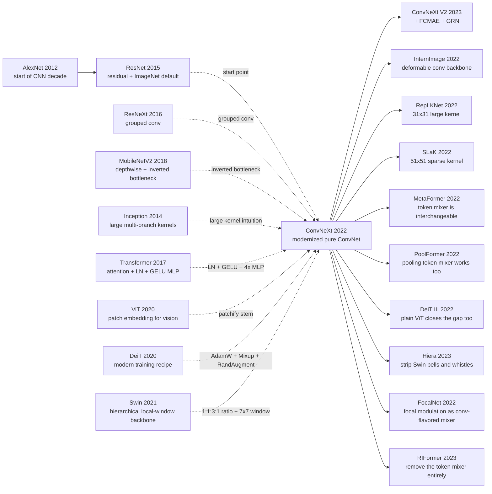

# ConvNeXt — 把 Swin 的所有 trick 搬回纯卷积，发现 CNN 一直都没有输

> **2022 年 1 月 10 日，FAIR + UC Berkeley 的 Liu、Mao、Wu、Feichtenhofer、Darrell、Xie 6 位作者把 [arXiv:2201.03545](https://arxiv.org/abs/2201.03545) 上传到 arXiv。** 上一年整个视觉社区刚被 Swin Transformer（2021） 和 ViT（2020） 轰炸了一年，"attention 是 all you need，CNN 时代结束了"几乎成了共识。这篇论文用最朴素的方式回答这个共识：从 vanilla ResNet-50 出发，每改一项跑一次 ImageNet，10 步走完——76.1 → 78.8 → 79.4 → 79.5 → 80.5 → 80.6 → 81.3 → 81.4 → 81.5 → 82.0，最后得到一个名叫 ConvNeXt 的纯卷积网络，在每个 scale 上都打平或反超 Swin（ConvNeXt-XL @ 22K 预训练 87.8% top-1 vs Swin-L 87.3%）。它揭穿的"反直觉"很尴尬：Transformer 赢的并不是 attention，而是 Transformer 顺手带来的 macro 设计 + 训练 recipe + LayerNorm + GELU + 倒置瓶颈这套小积木——其中最大的单步收益（+2.7）只是把现代 recipe 套到 ResNet-50 上、什么结构都没改。它真正动摇的是"用过时 baseline 做对照"这个学术习惯。

## 一句话总结

Liu、Mao、Wu、Feichtenhofer、Darrell、Xie 6 位作者 2022 年发表在 CVPR 的 ConvNeXt，用一篇论文走完了"后 AlexNet 十年里 ConvNet 学界没走完的现代化路径"：从 vanilla ResNet-50 出发，单变量阶梯式把 Swin（2021） 的非 attention 设计一项项搬回 ConvNet——macro 比例 (3,4,6,3) → (3,3,9,3)、4×4 patchify stem、3×3 → 7×7 depthwise conv（FLOPs 只随 $k^2$ 增长、无 channel 乘子，$\text{FLOPs}_{\text{dwconv}}=hwCk^2$）、倒置瓶颈、单 GELU + 单 LN、separate downsampling，再加 DeiT 现代训练 recipe，整条曲线 76.1 → 78.8 → 79.4 → 79.5 → 80.5 → 80.6 → 81.3 → 81.4 → 81.5 → 82.0。ConvNeXt-T 在 ImageNet 拿到 82.1（vs Swin-T 81.3），ConvNeXt-XL 在 22K 预训练后 87.8%（vs Swin-L 87.3、ResNet（2015） 时代 78.3%）。失败 baseline 很具体：ResNet-50 76.1、ViT-B 监督 77.9、Swin-T 81.3、单步小改（ReLU→GELU、BN→LN）几乎不涨点。最反直觉的是：单步最大收益 +2.7 完全来自换 recipe 而非任何新模块——社区把"recipe 进步"误读成了"attention 优势"。这条 lesson 后来催生 DeiT III、ConvNeXt-V2（FCMAE + GRN, 88.9%）、RepLKNet (31×31)、MetaFormer 等一整条"重新审视 token mixer 必要性"的研究。

---

## 历史背景

### 2021 年的视觉 backbone 学界在卡什么

2021 年下半年，视觉 backbone 的氛围非常不平静。年初 ViT（2020） 已经证明，只要数据足够、训练 recipe 现代，纯 Transformer 也能在 ImageNet 拿到 88+ top-1；3 月 Swin Transformer 上传 arXiv，10 月拿下 ICCV Marr Prize，把"层级特征 + 局部窗口 + relative position bias"打包成可替换 ResNet 的 backbone；同期 PVT、Focal、CSWin 等论文密集刷榜，Twitter 上的叙事很快收敛到一句话："attention 是 all you need，CNN 时代结束了"。

这种叙事其实有几个被掩盖的细节。第一，Swin / DeiT 的训练 recipe（AdamW、300 epoch、Mixup、Cutmix、RandAugment、Random Erasing、Stochastic Depth、Label Smoothing、EMA）和经典 ResNet 的 90 epoch + SGD + crop/flip 完全不同，但所有"CNN vs Transformer"对比表里，CNN 一栏几乎都用旧 recipe 的数字。第二，Swin 的关键设计——固定窗口、相对位置偏置、shifted window——在概念上和 depthwise conv + 局部感受野 + 平移先验高度同构，但被解释成"attention 的胜利"而不是"局部归纳偏置的胜利"。第三，工业界的检测 / 分割 / 视频 pipeline 仍然以 ResNet 为底座，模型库里的 CNN 没有被现代 recipe 重新训练过，性能与同期 Transformer 拉开 4-5 个点的差距，看起来是结构差距，其实是 recipe + macro design 差距。

ConvNeXt 论文的写作动机就是把这三层混淆拆开。它把对照实验组织得非常工整：从 vanilla ResNet-50 出发，每一步只改一件事，逐项把 Swin 的设计 trick 移植进 ConvNet，看 76.1 → 78.8 → 79.4 → 79.5 → 80.5 → 80.6 → 81.3 → 81.4 → 81.5 → 82.0 这条曲线如何爬升。它真正的对手不是某个 Transformer 模型，而是 2021 年那种"attention 是结构性胜利"的口号叙事。

### 直接逼出 ConvNeXt 的 5 篇前序

第一篇是 ResNet（2015）。He、Zhang、Ren、Sun 四位作者的 152 层残差网络是 2015 年之后所有视觉 backbone 的工业默认值，也正是 ConvNeXt 选作起点的"博物馆样本"。论文从 ResNet-50 出发，意图就是"用一篇 paper 走完后 AlexNet 十年里 ConvNet 学界自己也没好好走完的现代化路径"。

第二篇是 Swin Transformer（2021）。Liu、Lin、Cao、Hu 等 8 位作者的 shifted window backbone 是 ConvNeXt 的直接竞争对手，也是它的"参考标尺"。Swin-T 的层数比例 1:1:3:1、4x4 patchify stem、固定 7x7 局部窗口、LayerNorm、GELU、AdamW recipe，每一项都被 ConvNeXt 一对一移植回 ConvNet。

第三篇是 ViT（2020）。Dosovitskiy 等 12 位作者的 16x16 patch + 全局 attention 给了"图像可以被切成不重叠 patch"的合法性。ConvNeXt 的"patchify stem"（4x4 卷积、stride 4）就是 ViT patch embedding 的卷积版本，把 ResNet 那个 7x7 conv stride 2 + maxpool 的复杂下采样直接砍掉。

第四篇是 ResNeXt（2016, Xie、Girshick、Dollar、Tu、He 等 5 位作者）。Saining Xie——ConvNeXt 的通讯作者之一——在 6 年前已经把 grouped convolution 推到 32 个组的极限。ConvNeXt 把 group 数干脆推到 channel 数，让卷积变成 depthwise convolution。这条路 Xie 自己已经走了一半，ConvNeXt 是他对自己 6 年前工作的"再激进化"。

第五篇是 MobileNetV2（Sandler 等 5 位作者，2018）。倒置瓶颈（thin-wide-thin，hidden 4x）原本是为移动端设计的轻量结构，但 ConvNeXt 注意到它和 Transformer 的 MLP block（也是 hidden 4x）几何完全一致——这是把 Transformer 拆开后剩下的"小积木"，搬到 ConvNet 里几乎没有违和感。

### Liu / Xie / Feichtenhofer 团队当时在做什么

ConvNeXt 是 FAIR + UC Berkeley 联合工作。第一作者 Zhuang Liu 当时是 Berkeley 博士生（导师 Trevor Darrell），但他在更早的 DenseNet（2016）和 Stochastic Depth（2016）就是 Kilian Weinberger 组的核心，对 ConvNet 设计空间非常熟。通讯作者 Saining Xie 在 ResNeXt（2016）之后加入 FAIR，和 He、Girshick 长期合作；Christoph Feichtenhofer 是 FAIR 视频组负责人（SlowFast、X3D），一直在做时空 backbone；Chao-Yuan Wu、Hanzi Mao 都是同期 FAIR 视觉组成员。Trevor Darrell 是 Berkeley 视觉组掌门，从 R-CNN / DeCAF 时代就在塑造视觉迁移学习的工业范式。

这不是一个"突发奇想"的组合。FAIR 视觉组从 ResNet（2015）→ Mask R-CNN（2017）→ Detectron / Detectron2 → DETR（2020）→ MAE（2021）一路在制造工业级视觉系统，对"backbone 工程接口"的敏感度比绝大多数学术组高一个量级。当 Swin 在 2021 下半年迅速成为社区默认 Transformer backbone 时，这个团队不需要再发明一个新结构，他们要回答的是另一个更尴尬的问题：**FAIR 自己提了 ResNet，ResNet 真的输了吗？**ConvNeXt 是这个问题的实验性答卷。

### 工业界 / 算力 / 数据的状态

2021-2022 年的训练资源已经和 2015 年完全不是同一个量级。ConvNeXt 的标准 training recipe 是 ImageNet-1K 上 300 epoch、batch 4096、AdamW、cosine schedule、4x A100 节点（大约 40 GB 显存 / 卡，多卡分布式），单次实验大约一两天。论文做了几十组对比实验（macro / micro / kernel size / activation / norm 各一组），意味着至少几千 GPU 天预算——这个量级 5 年前在学术界根本不可能。

数据侧也变了。ImageNet-22K（约 1400 万张、22000 类）成了"中等规模预训练"的事实标准，比 ResNet 时代的 ImageNet-1K 大 14 倍；下游 COCO（118K 训练 / 5K 验证）和 ADE20K（20K 训练 / 2K 验证）保持不变，但所有 baseline 都迁到 mmdetection / mmsegmentation / Detectron2 这类强 framework，公平对照终于变得可能。

软件层面，PyTorch 在 2020-2021 年完成对 timm（Ross Wightman 维护的视觉模型库）和 DeiT/Swin 训练 recipe 的吸收，AdamW、Mixup、Cutmix、RandAugment、Stochastic Depth、EMA、LayerNorm、GELU 都是几行代码就能开关的标准件。这种"现代 recipe 即开即用"的工程基础，是 ConvNeXt 能用一篇论文跑完十年现代化路径的隐藏前提。如果没有 timm 和 DeiT recipe 的标准化，光是把 ResNet-50 从 76.1 升到 78.8 这第一步，就需要发一篇论文。

---

## 研究背景与动机

### "Attention vs convolution" 是个被偷换过的问题

2021 年的视觉社区里，"attention 还是 convolution"几乎被讨论成一个二选一题。但 ConvNeXt 提醒读者：被对比的两边其实从来不是同一组变量。Swin / DeiT 一边带着现代训练 recipe（AdamW、300 epoch、Mixup、Cutmix、RandAugment、Stochastic Depth、Label Smoothing、EMA、LayerNorm、GELU），还带着层级金字塔、4x4 patchify、1:1:3:1 的层数比例、7x7 局部窗口；ResNet 一边只带着 90 epoch SGD recipe、7x7 stride-2 + maxpool stem、3:4:6:3 的层数比例、3x3 卷积、ReLU、BatchNorm。在这种条件下宣布 attention 赢了 convolution，逻辑上等价于一辆装了涡轮的车赢了一辆没加油的车之后说"涡轮比汽油重要"。

ConvNeXt 拒绝接受这种打包对比。它把变量逐项拆开：先把训练 recipe 这个最大杠杆移到 ResNet-50 上，再依次替换 macro 设计、grouped conv、inverted bottleneck、kernel size、activation、normalization、downsampling，每改一项跑一次 ImageNet-1K，记录 top-1。这个写法的意义不仅是得到一个新 SOTA 的 ConvNet——更重要的是，它把"哪一步贡献多少点"做成可读的账本。

### 论文真正提出的问题

ConvNeXt 的核心问题可以写成一句话：**当我们去掉 self-attention 这一个 token mixer，把 Transformer 的所有其它设计选择和训练配方都搬到 ConvNet 上，性能差距还剩多少？** 这是一个非常克制的问题。它没有声称卷积一定比 attention 强，也没有否认 Transformer 的扩展性、self-supervised 预训练能力或多模态对接潜力。它只是把"attention 优势"的边界条件量化出来。

这个问题之所以重要，是因为它影响后续几年的研究分配。如果 attention 的优势是 1.5 个 ImageNet top-1 点，那社区可以放心用 ConvNet 做工程默认；如果 attention 的优势是 5 个点，那 ConvNet 就该被列入"经典遗产"，把研发重心全押在 Transformer 上。ConvNeXt 给的答案是前者：在公平 recipe 下，差距小到几乎可以忽略，甚至在某些 scale 上 ConvNet 反过来略胜。

### 实验组织：单变量阶梯

ConvNeXt 用一种近乎工程师 debug 的方法做对照实验。它不是先设计完整的 ConvNeXt 再和 Swin 比，而是构造一条 10 步长的阶梯，每一步只改一个设计点，记录该步带来的 top-1 增量。最终 ResNet-50 76.1 → 78.8 → 79.4 → 79.5 → 80.5 → 80.6 → 81.3 → 81.4 → 81.5 → 82.0。这条曲线本身就是论文的主图，比任何最终对比表都有说服力。

这种"路径化"写作不是文风选择，而是反 narrative 武器。每一步都对应一个可以被独立质疑的小决定，读者无法笼统说"是 attention 让 Swin 赢的"，必须具体反驳"是 macro 设计让它赢的"或"是 GELU 让它赢的"。从这个意义上，ConvNeXt 的 method 部分既是技术报告，也是方法论示范。

---

## 方法详解

### 整体框架：从 ResNet-50 一步步走向 Swin-T 等价 ConvNet

ConvNeXt 的最终形态可以理解为"长得像 Swin-T 的纯卷积网络"。输入图像先经过 4x4 stride-4 的 patchify stem，把 H x W x 3 投影到 H/4 x W/4 x 96 的 token 网格；之后分四个 stage，stage 之间用一个 2x2 stride-2 的 LN + 卷积单独做下采样，分辨率降到 H/8、H/16、H/32，通道扩到 192、384、768；每个 stage 内部堆叠 ConvNeXt block，block 数比例是 3:3:9:3，对应 Swin-T 的 1:1:3:1。

```
input H x W x 3
  ↓  patchify stem (4x4 conv, stride 4) + LN
H/4 x W/4 x 96
  ↓  stage 1: 3 x ConvNeXt block
  ↓  downsample (LN + 2x2 conv stride 2)
H/8 x W/8 x 192
  ↓  stage 2: 3 x ConvNeXt block
  ↓  downsample
H/16 x W/16 x 384
  ↓  stage 3: 9 x ConvNeXt block (深度集中在第三个 stage)
  ↓  downsample
H/32 x W/32 x 768
  ↓  stage 4: 3 x ConvNeXt block
global pool → LN → linear → logits
```

| 模型 | 层数比例 | 通道宽度 C | 参数 / FLOPs | ImageNet-1K top-1 |
|---|---|---:|---:|---:|
| ConvNeXt-T | (3, 3, 9, 3) | 96 | 28.6M / 4.5G | 82.1 |
| ConvNeXt-S | (3, 3, 27, 3) | 96 | 50M / 8.7G | 83.1 |
| ConvNeXt-B | (3, 3, 27, 3) | 128 | 89M / 15.4G | 83.8 |
| ConvNeXt-L | (3, 3, 27, 3) | 192 | 198M / 34.4G | 84.3 |
| ConvNeXt-XL | (3, 3, 27, 3) | 256 | 350M / 60.9G | 87.8 (22K pretrain) |

⚠️ **反直觉点**：四个 stage 的层数比例 3:3:9:3 和 ResNet-50 的 3:4:6:3 几乎只差一个数字，但这一个数字让整个网络的"算力分配"和 Swin-T 的 1:1:3:1 等价。把第三个 stage 的层数从 6 拉到 9，单步带来 +0.6 top-1。深层 backbone 的"算力应该花在哪个分辨率"这个问题，整个 ConvNet 时代默默用 ResNet 的 3:4:6:3，没有被显式优化过。

ConvNeXt block 的内部结构与 Transformer block 平行：先做一次 7x7 depthwise conv（对应 self-attention 的 token mixing），然后 LN，然后两个 1x1 conv 中间夹一个 GELU（对应 MLP block，hidden 维度 4x），最后一个 residual。整个 block 没有 SE、attention、relative position bias，没有 shifted window，也没有 BatchNorm；它就是把 Swin block 的 self-attention 换成 7x7 depthwise conv。

### 关键设计一：宏观设计 — stage 比例 1:1:3:1 + patchify stem

**功能**：让 ConvNet 的算力分配 / 输入处理与 Swin-T 等价。

**核心思路**。ResNet-50 的层数比例是 3:4:6:3，第三 stage 的相对算力很轻；Swin-T 的层数比例是 1:1:3:1，把绝大部分算力堆在第三 stage（高语义 / 中等分辨率层）。ConvNeXt 把 ResNet-50 的层数从 (3, 4, 6, 3) 改成 (3, 3, 9, 3)，单步从 78.8 → 79.4。Patchify stem 的本质是把"高分辨率第一层卷积"省掉，直接用 stride-4 卷积把 224×224 投到 56×56：

$$
\text{Stem}_{\text{ResNet}}: 7\!\times\!7\,\text{conv}(s=2) + 3\!\times\!3\,\text{maxpool}(s=2) \quad\Rightarrow\quad \text{Stem}_{\text{ConvNeXt}}: 4\!\times\!4\,\text{conv}(s=4)
$$

stem 改完，top-1 从 79.4 → 79.5。看起来微不足道，但工程上少了一层 BN + ReLU + maxpool 的"早期下采样泥潭"，对后续 LN / GELU 替换非常友好。

| Stem 选择 | 输入到第一 block 的分辨率 | 早期算力开销 | 与 Transformer 对齐度 |
|---|---|---|---|
| ResNet 7x7 conv stride 2 + maxpool | H/4 x W/4 | 高（密集卷积 + 池化） | 低 |
| ViT 16x16 patch embed | H/16 x W/16 | 中（一次大步长卷积） | 高（ViT 原版） |
| Swin 4x4 patch embed | H/4 x W/4 | 低 | 高 |
| ConvNeXt 4x4 conv stride 4 | H/4 x W/4 | 低 | 高（与 Swin 对齐） |

### 关键设计二：depthwise convolution + 大核 7x7

**功能**：让卷积扮演 self-attention 那样的"token mixer"——在通道之间不混合，只做空间上的局部聚合。

**核心思路**。Self-attention 的本质是"每个 token 看一组邻居 token，聚合方式由内容决定"，而 depthwise convolution 是"每个通道在自己的特征图上做一次空间卷积，通道之间不交互"。两者在"空间混合 / 通道独立"这一性质上同构。ConvNeXt 第一步把 ResNet 的 3x3 全卷积改成 3x3 depthwise，再把通道宽度从 64 扩到 96 以补偿表达力，top-1 从 79.5 → 80.5（+1.0）。第二步把 depthwise kernel 从 3x3 扩到 7x7，匹配 Swin 的 7x7 window，top-1 在 80.6 持平。

复杂度账本说明为什么 7x7 不爆炸：

$$
\text{FLOPs}_{\text{conv}}(k) = h\,w\,C_{\text{in}}\,C_{\text{out}}\,k^2,\qquad \text{FLOPs}_{\text{dwconv}}(k) = h\,w\,C\,k^2
$$

普通卷积的 kernel 大小一上去，FLOPs 涨 $k^2$ 倍 × $C$ 倍；depthwise 卷积只涨 $k^2$ 倍，没有通道乘子。从 3x3 到 7x7 的 FLOPs 只涨 5.4 倍，但相对整体网络只占很小比例，因为 1x1 投影占了大头。

```python
class ConvNeXtBlock(nn.Module):
    def __init__(self, dim, layer_scale_init=1e-6, drop_path=0.0):
        super().__init__()
        # 7x7 depthwise conv = "token mixer" (analogous to self-attention)
        self.dwconv = nn.Conv2d(dim, dim, kernel_size=7, padding=3, groups=dim)
        self.norm = nn.LayerNorm(dim, eps=1e-6)
        # inverted bottleneck: 1x1 -> 4x hidden -> GELU -> 1x1
        self.pwconv1 = nn.Linear(dim, 4 * dim)
        self.act = nn.GELU()
        self.pwconv2 = nn.Linear(4 * dim, dim)
        self.gamma = nn.Parameter(layer_scale_init * torch.ones(dim))  # LayerScale
        self.drop_path = DropPath(drop_path)

    def forward(self, x):                       # x: (N, C, H, W)
        residual = x
        x = self.dwconv(x)                      # spatial mixing only
        x = x.permute(0, 2, 3, 1)               # NCHW -> NHWC for LN/Linear
        x = self.norm(x)
        x = self.pwconv1(x); x = self.act(x); x = self.pwconv2(x)
        x = self.gamma * x                      # per-channel learnable scale
        x = x.permute(0, 3, 1, 2)               # NHWC -> NCHW
        return residual + self.drop_path(x)
```

| Token mixer | 空间感受野 | 通道交互 | 算力随 image 增长 | 硬件友好度 |
|---|---|---|---|---|
| ResNet 3x3 conv | 3x3 局部 | 全连接（同时混通道） | $O(hwC^2)$ | 高（cuDNN 极优） |
| Swin 7x7 window MSA | 7x7 局部 | 通过 attention 内容相关 | $O(hwM^2C)$ | 中（需要 cyclic shift / 自定义 kernel） |
| ConvNeXt 7x7 depthwise | 7x7 局部 | 空间步骤不混通道 | $O(hwk^2C)$ | 高（标准 depthwise 算子） |
| Sliding-window self-attention | 任意局部 | 内容相关 | $O(hwM^2C)$ | 低（key set 不共享） |

### 关键设计三：倒置瓶颈（Inverted Bottleneck）

**功能**：用"窄→宽→窄"的 1x1 投影包夹一个 token mixer，与 Transformer 的 MLP block 几何完全一致。

**核心思路**。ResNet bottleneck 的形状是 1×1 缩通道 → 3×3 卷积 → 1×1 扩通道（宽-窄-宽，hidden 维度 1/4 输入）。Transformer MLP block 的形状是 Linear 扩 4x → activation → Linear 缩回（窄-宽-窄，hidden 4x 输入）。MobileNetV2 注意到后者对 depthwise 友好。ConvNeXt 把 block 改成 depthwise(7x7) → 1x1 扩 4x → GELU → 1x1 缩回，单步从 80.5 → 80.6（+0.1，几乎持平），但这一步真正的收益不在数字，而在它让 block 的几何与 Transformer block 对齐：

$$
\text{Block}_{\text{Transformer}}: \underbrace{\text{Attn}}_{\text{token mix}} \to \underbrace{\text{Linear}\,4C \to \text{GELU} \to \text{Linear}\,C}_{\text{MLP}},\quad \text{Block}_{\text{ConvNeXt}}: \underbrace{\text{DWConv}\,7\!\times\!7}_{\text{token mix}} \to \underbrace{\text{Linear}\,4C \to \text{GELU} \to \text{Linear}\,C}_{\text{MLP}}
$$

```python
# Inverted bottleneck snippet (ConvNeXt-style)
hidden = 4 * dim                        # Transformer-style 4x expansion
self.pwconv1 = nn.Linear(dim, hidden)   # narrow -> wide
self.act     = nn.GELU()                # single activation in the middle
self.pwconv2 = nn.Linear(hidden, dim)   # wide -> narrow
# NOTE: 1x1 conv == nn.Linear when applied along channel dim of NHWC tensor
```

| Block 几何 | hidden 维度 | activation 数量 | norm 数量 | 与 Transformer MLP 对齐 |
|---|---|---:|---:|---|
| ResNet bottleneck (1x1↓ 3x3 1x1↑) | C/4 | 3 (ReLU x3) | 3 (BN x3) | 否 |
| MobileNetV2 倒置瓶颈 (1x1↑ 3x3dw 1x1↓) | 6C | 2 (ReLU6 x2) | 3 (BN x3) | 部分 |
| Transformer MLP block | 4C | 1 (GELU) | 1 (LN) | — |
| ConvNeXt block (7x7dw, 1x1↑ GELU 1x1↓) | 4C | 1 (GELU) | 1 (LN) | 完全对齐 |

### 关键设计四：微观设计 — GELU + LN + 减少激活和归一化 + 分离下采样

**功能**：把 block 内部的"细节噪声"逐步移除，让 ConvNet 的 micro design 也与 Transformer 一致。

**核心思路**。这一步的 ablation 很碎，但累计起来非常关键。从 80.6 到 82.0，靠的是四件小事：

1. **ReLU → GELU**：单换不掉点（80.6 → 80.6），但和后续步骤组合时是必要前置；
2. **更少的 activation**：原本 ResNet block 里每个 conv 后面都有一个 ReLU；ConvNeXt 在 inverted bottleneck 中只保留**一个** GELU（在两个 1x1 之间），单步 +0.7（80.6 → 81.3）；
3. **更少的 normalization**：保留**一个** LN，放在 7x7 depthwise 之后、1x1 投影之前，移除其它 BN，单步 +0.1（81.3 → 81.4）；BN → LN 单步再 +0.1（81.4 → 81.5）；
4. **分离的下采样层**：ResNet 把 stride-2 融在残差路径里（用 stride-2 的 1x1 + stride-2 的 3x3）；ConvNeXt 在 stage 之间用一个独立的 LN + 2x2 conv stride 2 做下采样，单步 +0.5（81.5 → 82.0），是这一节最大的单步收益。

这套微观调整背后的统一直觉是：**ConvNet block 和 Transformer block 的差异里，"过度归一化 + 过度激活"贡献了相当一部分性能差，而不是"卷积 vs attention"本身。**

| 微观调整 | 单步增量 | 与 Transformer 设计的对齐 |
|---|---:|---|
| ReLU → GELU | +0.0 | Transformer 默认 GELU |
| 减少 activation（一个 GELU） | +0.7 | Transformer 一个 MLP 一个 GELU |
| 减少 norm（一个 LN） | +0.1 | Transformer 一个 LN |
| BN → LN | +0.1 | Transformer 默认 LN |
| 分离下采样层 | +0.5 | Swin patch merging 独立成层 |

### 训练 recipe

ConvNeXt 全程用 DeiT / Swin 的现代 recipe，没有任何 conv 特定的 trick。这点必须强调：所有阶梯增量都是在同一套 recipe 下取得的，避免了"recipe 帮 ConvNet 涨点"和"结构帮 ConvNet 涨点"互相污染。

| 项目 | 设置 |
|---|---|
| Optimizer | AdamW |
| LR | 4e-3（base），cosine schedule，warmup 20 epoch |
| Weight decay | 0.05 |
| Batch size | 4096 |
| Epochs | 300 |
| Augmentation | Mixup (α=0.8), Cutmix (α=1.0), RandAugment (m9, n2), Random Erasing (p=0.25) |
| Regularization | Stochastic Depth (depth-dependent), Label Smoothing 0.1, LayerScale (init 1e-6) |
| EMA | 启用，decay 0.9999 |
| Resolution | 224 训练；下游可用 384 fine-tune |
| Init | trunc-normal（std 0.02） |
| Norm | LayerNorm（全网络只此一种 norm） |

⚠️ **注意**：第一行 ResNet-50 76.1 → 78.8 完全靠 recipe 升上去，没有改任何结构。这意味着 2.7 个点本来就属于"训练配方进步"，与 attention 完全无关。把这个信号从 Swin / ConvNeXt 的对比里减掉，所谓"Transformer vs ConvNet"的差距瞬间从 5+ 点缩到 ~0 点。

---

## 失败案例

### 失败一：vanilla ResNet-50（76.1）被 Swin-T（81.3）当作"结构性失败"

2021 年的 leaderboard 写法基本是同一种：左边一列 ResNet-50 / 101 / 152 配 90 epoch SGD recipe（76.1 / 77.4 / 78.3 top-1），右边一列 Swin-T / S / B 配 300 epoch AdamW recipe（81.3 / 83.0 / 83.5 top-1）。看起来 Swin-T 比 ResNet-50 高 5.2 个 ImageNet top-1，差距巨大，自然推论"Transformer backbone 已经全面超越 CNN backbone"。这就是 ConvNeXt 一开始要拆解的"打包失败"。

ConvNeXt 的第一行实验就把这个失败的真实归因揭穿。把 ResNet-50 换上同一套现代 recipe（AdamW、300 epoch、Mixup、Cutmix、RandAugment、Stochastic Depth、Label Smoothing、EMA），保持结构完全不变，top-1 直接从 76.1 涨到 78.8。这一步什么都没改，纯靠训练配方就吃到 2.7 个点。也就是说，常被解释为"结构差距"的 5.2 个点里，超过一半是配方差距。这不是 Swin 的功劳，是过去七八年里业内训练范式的演化。

更关键的是，这个"失败"其实是被错误归因塑造出来的。如果 2021 年的 ResNet 被有人——任何人——用 DeiT recipe 重新训练一遍并发出来，整个"attention 全面胜出"的叙事就会少掉一半燃料。ConvNeXt 真正打的不是 Swin，而是这种"对照实验默认沿用过时配方"的学术习惯。

### 失败二：Swin-T 在公平 recipe 下被纯 ConvNet 反超

接下来的失败更尴尬。把 ResNet-50 现代化到 ConvNeXt-T（28.6M / 4.5G FLOPs，与 Swin-T 28M / 4.5G 相当），ImageNet-1K 拿到 82.1 top-1，比 Swin-T 的 81.3 高 0.8。COCO Mask R-CNN 3x：ConvNeXt-T 46.2 box AP / 41.7 mask AP，对 Swin-T 的 46.0 / 41.6，略胜或持平。ADE20K UPerNet 160K iter：ConvNeXt-T 46.7 mIoU，对 Swin-T 45.8，略胜。

这组数字让 Swin 的"shifted window 是关键"这个直觉很难维持。如果 7x7 depthwise conv（无内容相关注意力、无跨窗口通信、无相对位置偏置）就能换出 Swin 的 7x7 window MSA，并且在分类、检测、分割上都不输，那 shifted window 的"必需性"就要打折扣。Swin 不是输给某个新 attention，是输给 Transformer 自己的 macro design + recipe + LN/GELU 被迁回 ConvNet。

不过这里有一个常被忽略的细节：ConvNeXt 并没有 disprove Swin。它只是把"Swin 的 attention 是结构性优势"这个命题的置信度从高拉到低。后来的 ConvNeXt-V2、SwinV2、MAE、DINO、ViTDet 各自加上 self-supervised pretraining 之后，对比图谱再次重排——这个故事还在继续。

### 失败三：单步现代化但漏了关键步骤的中间产物

ConvNeXt 的另一个"暗失败"藏在自己的消融阶梯里。如果只搬倒置瓶颈而不改 norm / activation 数量，single-step gain 只有 +0.1（80.5 → 80.6），看起来这个设计"几乎没用"。如果只把 BN 换成 LN 而不减少 norm 数量，single-step gain 也只有 +0.1。如果只把 ReLU 换成 GELU 不动其它任何东西，single-step gain 是 +0.0。

这些个体上几乎为零的"失败"，组合起来才贡献了 80.6 → 82.0 这 1.4 个点。这其实是 ConvNeXt 想让读者看的另一个隐藏教训：**单一改动是看不出"现代设计哲学"的总效用的**。如果一个研究者在 2018 年只把 ReLU 改成 GELU，写一篇论文，结论会是"GELU 在 ConvNet 里没用"。但当 GELU 与 inverted bottleneck、单一 LN、单一 GELU、separate downsampling 一起出现时，整体收益就涌现出来。这是为什么 ConvNet 时代有些设计（depthwise、inverted bottleneck、LN、GELU）零零碎碎地存在但从未被一起组装的原因——大家各自做单步实验，得出"不显著"的结论，错过了组合效应。

### 真正的反 baseline 教训：把 attention 当独立变量是错的

如果要从 ConvNeXt 提炼一条工程哲学，最准确的版本是：**"是不是 attention" 不是一个独立可对比的变量；attention 永远是和 macro design + recipe + micro 选择 + token 几何打包出现的。** 单独把 attention 拎出来比较，就像单独把"涡轮"拎出来比较两辆其它配置完全不同的车。

这个教训不只针对 ConvNeXt vs Swin。它也解释为什么后来 MetaFormer / PoolFormer / RIFormer 这些工作能用 pooling、identity、甚至 nothing 替换 token mixer 还能拿到不错的成绩——因为社区一直高估了 token mixer 的相对贡献，低估了 macro 结构和训练配方的贡献。在 LLM 时代回看，这条教训甚至延伸到"Transformer 是不是 LLM 唯一答案"的讨论：state-space model（Mamba）、recurrent model 在合适的 macro design + recipe 下也在缩小与 Transformer 的差距。一个核心组件的"必要性"，往往是被它周围的 ecosystem 锁定的。

| 失败路线 | 表面合理性 | ConvNeXt 揭示的真因 | 修正 |
|---|---|---|---|
| 旧 recipe 下的 ResNet-50 76.1 vs Swin-T 81.3 | 5+ 点的"结构差距" | 一半是 recipe，不是结构 | 同一 recipe 训练 |
| Swin-T 7x7 window MSA 对 ResNet 3x3 conv | "attention vs conv" | 7x7 depthwise + 现代 recipe 即可匹配 | 单变量替换 |
| 只换 ReLU→GELU、只换 BN→LN | "微调没用" | 单步增量小，组合增量大 | 把全套现代设计一起搬 |
| ViT-B/16 当 detection backbone | "Transformer 直接进入下游" | 单尺度 token 缺层级特征 | 用层级 backbone（Swin 或 ConvNeXt）|

---

## 实验关键数据

### 主实验：ImageNet-1K / 22K 上的 head-to-head

| 模型 | 预训练 | 分辨率 | Params / FLOPs | top-1 |
|---|---|---:|---:|---:|
| ResNet-50（原版 90ep recipe） | ImageNet-1K | 224 | 25M / 4.1G | 76.1 |
| ResNet-50（现代 recipe） | ImageNet-1K | 224 | 25M / 4.1G | **78.8** |
| Swin-T | ImageNet-1K | 224 | 28M / 4.5G | 81.3 |
| **ConvNeXt-T** | ImageNet-1K | 224 | 28.6M / 4.5G | **82.1** |
| Swin-S | ImageNet-1K | 224 | 50M / 8.7G | 83.0 |
| **ConvNeXt-S** | ImageNet-1K | 224 | 50M / 8.7G | **83.1** |
| Swin-B | ImageNet-1K | 224 | 88M / 15.4G | 83.5 |
| **ConvNeXt-B** | ImageNet-1K | 224 | 89M / 15.4G | **83.8** |
| Swin-B（22K → 1K，384） | ImageNet-22K | 384 | 88M / 47.0G | 86.4 |
| **ConvNeXt-B**（22K → 1K，384） | ImageNet-22K | 384 | 89M / 45.0G | **87.0** |
| Swin-L（22K → 1K，384） | ImageNet-22K | 384 | 197M / 103.9G | 87.3 |
| **ConvNeXt-L**（22K → 1K，384） | ImageNet-22K | 384 | 198M / 101.0G | **87.5** |
| **ConvNeXt-XL**（22K → 1K，384） | ImageNet-22K | 384 | 350M / 179G | **87.8** |

所有同 scale 对比里，ConvNeXt 都 ≥ Swin，差距 0.3~0.7 点。这不是天差地别的胜利，但已经足够否定"attention 在 ImageNet 上有结构性优势"的强命题。

### 消融：从 ResNet-50 到 ConvNeXt-T 的 10 步阶梯

| 步骤 | 改动 | top-1 | 单步增量 |
|---|---|---:|---:|
| 0 | ResNet-50 + 原版 recipe | 76.1 | — |
| 1 | + 现代 recipe（AdamW / 300ep / 强增广） | 78.8 | **+2.7** |
| 2 | macro: stage 比例 (3,4,6,3) → (3,3,9,3) | 79.4 | +0.6 |
| 3 | macro: stem 改为 4x4 conv stride 4 | 79.5 | +0.1 |
| 4 | ResNeXt-ify: 3x3 → 3x3 depthwise + C 64→96 | 80.5 | +1.0 |
| 5 | inverted bottleneck（4x hidden） | 80.6 | +0.1 |
| 6 | 大核：depthwise 3x3 → 7x7 | 80.6 | +0.0 |
| 7 | 减少 activation（一个 GELU） | 81.3 | +0.7 |
| 8 | 减少 norm（一个 LN） | 81.4 | +0.1 |
| 9 | BN → LN | 81.5 | +0.1 |
| 10 | 分离的下采样层 | **82.0** | +0.5 |

⚠️ **反直觉**：单步最大收益（+2.7）来自完全不动结构的"换 recipe"，第二大（+1.0）来自 depthwise 改造，第三大（+0.7）来自减少激活数量。三个最大收益里没有一个是"加了一个新模块"——全是"把多余的东西删掉"或"换更现代的替代品"。

### 关键发现

- **配方贡献被严重低估**：单纯换 recipe 让 ResNet-50 涨 2.7 点，超过整个结构现代化的总收益（80.6 → 82.0 = 1.4 点）。所有"X 比 Y 强 N 点"的对比表都应该问一句：两者的 recipe 一致吗？
- **单步实验诱导错误结论**：GELU、BN→LN、inverted bottleneck 单步几乎不涨点，但与其它步骤组合时贡献明显。研究方法论上这意味着，单变量 ablation 会系统性低估"设计哲学层面的整体迁移"。
- **大核回归是 free lunch**：从 3x3 到 7x7 在 depthwise 下几乎无 FLOPs 代价（depthwise 没有 channel 乘子），且与 Swin 7x7 window 一致。后来的 RepLKNet（31x31）、SLaK（51x51）正是把这条延续下去。
- **单一 norm + 单一 activation 是 Transformer 的隐性贡献**：ResNet block 每个 conv 后都有 BN + ReLU，整个 block 用了 3 个 norm + 3 个激活；Transformer block 只用 1 个 LN + 1 个 GELU。后者带来的不只是少几个算子，更是更平滑的优化 landscape。
- **下采样独立成层是 Swin 的隐性贡献**：Swin 用 patch merging 单独负责 stage 间下采样，ConvNeXt 抄过来后单步 +0.5。把"特征变换"和"分辨率变换"解耦，是值得跨架构借鉴的设计原则。
- **"attention vs convolution"在 ImageNet 上不再是结构性问题**：在公平 recipe + macro 设计 + micro 设计下，Swin-T 和 ConvNeXt-T 几乎打平，ConvNeXt 略胜。这把后续讨论从"应该用谁"推向"应该如何 scale、如何 self-supervised pretrain、如何 multimodal 对接"。

---

## 思想史脉络

### Mermaid 引用图



### 前世：CNN 十年被忽视的设计积木 + Transformer 五年学到的训练习惯

ConvNeXt 不是无中生有，它是把"CNN 十年里散落的好设计"和"Transformer 五年里压出来的好习惯"装在同一辆车上。最直接的前世是 **ResNet 2015**，它给了 backbone 设计的工业默认值，也给了 ConvNeXt 的"博物馆样本"——所有阶梯实验都从 ResNet-50 起步，每改一项跑一次 ImageNet。第二位是 **ResNeXt 2016**（同样由 Saining Xie 主笔），它把 grouped convolution 推到 32 组，ConvNeXt 把 group 数干脆等于 channel 数，让卷积变 depthwise。第三位是 **MobileNetV2 2018**，它把倒置瓶颈（thin → wide → thin，hidden = 4×）变成移动端的工程标配，ConvNeXt 在桌面级 backbone 上重新启用同一个几何，正好对齐 Transformer 的 MLP block。

第四位是 **Inception 2014**，它用 5×5、7×7 的多分支大核试图扩展感受野，但被 ResNet 之后的"3×3 简单堆叠"哲学盖了过去；ConvNeXt 用 7×7 depthwise 重新承认了"大核也是合理的"，只是要换成 depthwise 来控成本。第五位是 **ViT 2020**，它带来 patchify stem 的合法性，让 4×4 stride-4 卷积顶替掉 ResNet 的 7×7 conv + maxpool 复合下采样。

最关键的两位前世是 **Swin 2021** 和 **DeiT 2020 + 2021**。Swin 给了 1:1:3:1 的 macro 比例、7×7 窗口大小、LN、GELU、AdamW recipe；DeiT 给了把 ImageNet-1K 现代化训练的完整 recipe（AdamW、300 epoch、Mixup、Cutmix、RandAugment、Stochastic Depth、Label Smoothing、EMA）。如果没有 DeiT 把"Transformer 训练 recipe"标准化、没有 Swin 把"层级 + 局部 + 平移先验"重新合法化，ConvNeXt 找不到现成的"新 baseline"去模仿。

这些前世共同说明一件事：ConvNeXt 不发明任何新模块，它只把已经存在但没被组装的积木一次性拼起来。

### 今生：四类继承者

**直接派生（同一作者圈或同一问题域的下一步）**：

- **ConvNeXt-V2（Woo 等 7 位作者，2023, CVPR）**：与 Saining Xie 等原班人马合作。用 Fully Convolutional Masked Autoencoder（FCMAE）做自监督预训练，并加入 Global Response Normalization 解决"特征塌缩到少数 channel"的问题，ConvNeXt-Huge 拿到 ImageNet 88.9 top-1。这是 ConvNet 拿到"MAE 红利"的直接证据。
- **RepLKNet（Ding 等 4 位作者，2022, CVPR）**：把 ConvNeXt 提议的"7×7 depthwise"直接放大到 31×31，配合 reparameterization 技巧让大核可训练。
- **SLaK（Liu 等 6 位作者，2022, ICLR 2023）**：再走一步到 51×51，用稀疏分解控制参数。
- **InternImage（Wang 等 12 位作者，2022, CVPR 2023）**：保留 ConvNeXt 的 macro / micro 选择，把 token mixer 换成 deformable convolution v3，作为 Vision Foundation Model 的骨干。

**跨架构借用（不是 ConvNet，但吸收了 ConvNeXt 的洞见）**：

- **MetaFormer / PoolFormer（Yu 等 8 位作者，2022, CVPR）**：把 ConvNeXt 的隐性主张抽象成"token mixer 可替换"，证明 pooling、identity、甚至 random projection 都能撑起一个 backbone。
- **DeiT III（Touvron、Cord、Jegou 三位作者，2022, ECCV）**：从 Transformer 这一边回应——证明只要 recipe 现代，原版 ViT 也能逼近 ConvNeXt，进一步把"recipe 是关键变量"这件事坐实。
- **Hiera（Ryali 等 13 位作者，2023, ICML）**：在 hierarchical ViT 上做 ConvNeXt 同样的"删冗余"操作——去掉 shifted window、relative position bias，剩下纯局部 attention + MAE 预训练，效果不降反升。

**跨任务渗透（dense vision / 视频 / 医学）**：ConvNeXt 作为 backbone 很快进入 mmdetection、mmsegmentation、mmaction，被 Mask2Former、ViTDet、Cascade Mask R-CNN 等下游 head 直接采用；医学影像（如 nnUNet 系列）也开始把 ResNet encoder 替换成 ConvNeXt encoder。

**跨学科外溢**：本文几乎没有跨学科外溢——ConvNeXt 是非常专注的视觉 backbone 论文。它在生物 / 物理 / 化学领域没有被广泛引用为"新工具"，但被科学计算社区视为"如何在不引入 attention 的情况下保持竞争力"的案例。这是一个诚实的"无显著跨学科外溢"。

### 误读与简化

**误读一**："ConvNeXt 证明 CNN 比 Transformer 强。"——错。ConvNeXt 只证明在 ImageNet-1K / 22K 监督预训练 + 中等规模下，纯 ConvNet 可以匹配 Swin。它没有比较自监督预训练（MAE / DINO）、大模型 scaling、多模态对接、long-context reasoning 等场景，那些场景里 Transformer 仍然有不可替代的位置。

**误读二**："ConvNeXt 的关键是 7×7 depthwise。"——半对。7×7 大核单独贡献是 +0.0（80.6 → 80.6）；真正贡献的是 depthwise 改造（+1.0）+ 减少激活（+0.7）+ 分离下采样（+0.5）+ macro 比例（+0.6）+ 现代 recipe（+2.7）这一整套组合。把它压缩成"大核胜利"，正好掉进 ConvNeXt 想批评的"单变量解释"陷阱。

**误读三**："ConvNeXt 让 ConvNet 重回主流。"——只对了一部分。在工业部署、边缘设备、检测 / 分割 backbone 这些场景，ConvNeXt 确实让 ConvNet 保住了默认地位；但在 LLM / VLM / 通用大模型的视觉 encoder 这一边，主流仍是 ViT 系（CLIP、SigLIP、DINOv2、SAM 都用 ViT backbone）。准确说法是：ConvNeXt 让"在哪里用 CNN、在哪里用 Transformer"重新成为可讨论的问题。

---

## 当代视角

### 站不住的假设

ConvNeXt 论文写于 2022 年初，那时社区刚被 Swin / DeiT / PVT 这一波 Transformer backbone 洗了一年。论文里有些隐含假设，到 2026 年回看已经不能再无条件接受。

**假设一：ImageNet-1K / 22K 监督分类是 backbone 评估的金标准。** ConvNeXt 的所有阶梯实验都以 ImageNet top-1 为坐标。后来 MAE、DINO、CLIP、SigLIP、DINOv2 把"大规模自监督预训练 + zero-shot transfer"变成新的金标准，再后来 SAM、Florence-2、InternImage、EVA 把"作为 foundation model encoder"变成更高一层标准。在这些新标准下，ConvNeXt 与 Swin / ViT 的相对位置经常会反转——譬如 MAE 这条路径下 ViT-Huge 拿到 88.6 top-1，需要 ConvNeXt-V2 加 FCMAE 才能在 ConvNet 一边追平。"ImageNet 监督 top-1 等于 backbone 价值"这条假设不再成立。

**假设二：公平 recipe 下 ConvNet 可以等价 Transformer，因此选哪个无所谓。** ConvNeXt 用强 recipe 做了等价证明。但等价只在"中等规模 + 监督 + 224 / 384 分辨率 + 标准 dense vision benchmark"内成立。一旦走到大规模 multimodal 预训练，Transformer 的"序列任意配对 + 文本图像同 token 池"优势就显现出来；一旦走到"长上下文图像 / 视频 / 时空"任务，Transformer 的全局 attention 也比 depthwise 7×7 友好。"等价"这个结论必须加规模和场景边界。

**假设三：depthwise 7×7 是"局部 + 平移先验"的近似最优实现。** 后来 RepLKNet（31×31）和 SLaK（51×51）说明大核还可以更大，并且大核 + reparameterization + 强 recipe 在某些 dense prediction 任务上明显优于 7×7。再后来 deformable conv v3（InternImage）、focal modulation（FocalNet）甚至 state-space token mixer 都证明，"7×7 depthwise"只是众多可行解之一。

**假设四：BatchNorm 和大 batch 永远是好朋友。** ConvNeXt 把 BN 全部换成 LN，主要论据是 LN 对大 batch、长 sequence、混合精度更稳。这个直觉在 backbone 里成立，但在某些下游任务（小 batch detection、视频 / 时序）BN 仍然有它的优势，被某些后续工作（如部分检测器 head）保留。"LN 全面胜 BN"是个偏向 backbone 的视角，不是普适结论。

### 时代证明的关键 vs 冗余

**仍然关键的设计**：

1. **训练 recipe 是杠杆的另一半**：AdamW + cosine + 300 epoch + Mixup/Cutmix/RandAugment + Stochastic Depth + EMA 这套配方贡献了 ResNet-50 76.1 → 78.8 的 2.7 点，远大于任何单一结构改动。这条 lesson 之后被反复验证（DeiT III、ConvNeXt-V2、Hiera、MAE finetune 等），是 ConvNeXt 留下的最强 transferable 真理。
2. **depthwise + 大核**：作为 ConvNet 复兴的核心算子，至今活跃。
3. **macro 设计 1:1:3:1 + patchify stem**：被 InternImage、FocalNet、Hiera 等沿用。
4. **单 LN + 单 GELU**：作为现代视觉 block 的"micro 默认"被广泛接受。

**渐渐冗余 / 误导的细节**：

- **必须 7×7 不能更大**：被 RepLKNet / SLaK 推翻。
- **必须 1:1:3:1 不能更深**：ConvNeXt-V2 的 huge variant 调整了相对比例。
- **必须严格对齐 Swin 的所有 block 数量**：后续工作发现 token mixer 决定后，macro 比例可以更灵活。
- **不需要任何 attention**：在 self-supervised 大模型阶段，纯 ConvNet 仍需引入某种"全局信息"机制（如 GRN 或 query-key 类操作）才能匹配 ViT，所以"完全无 attention"不是终态。

### 作者当时没想到的副作用

1. **ConvNeXt 反过来抢救了一批中等规模视觉应用部署**。论文发表后，工业界（自动驾驶、医疗影像、遥感、移动端）把仍然在用的 ResNet-50 / ResNet-101 backbone 大面积换成 ConvNeXt-T / S / B，部署成本几乎不变（depthwise 在 cuDNN / TensorRT / NPU 上都成熟），但准确率涨 4-6 点。这是论文摘要里没写的、规模最大的一条社会效应。
2. **它催生了"Transformer 的功劳到底有多少是 recipe"的反思潮**。DeiT III、A ConvNet for Detection（ViTDet 的对照工作）、MetaFormer、PoolFormer、RIFormer、SLaK 都是在同一条思路上展开。这股潮流间接降低了 2022-2023 年对"全面押宝 Transformer"的过度热情，让 LLM 工业界在 2024 年后开始认真讨论 Mamba / state-space 等替代方案。
3. **它把 Saining Xie 推上了"现代 ConvNet 哲学家"的位置**。Xie 之后的 ConvNeXt-V2、SAM-2 工作里，ConvNet vs Transformer 的方法论分割线被反复重写。

### 如果今天重写 ConvNeXt（2026 年版本）

- **从 self-supervised 出发**：把 baseline 从"ResNet-50 监督 76.1"换成"ConvNet-base + MAE / FCMAE 自监督"，第一行就和 2022 年完全不同。
- **scale 维度需要更宽**：300M 到 3B 参数应该被覆盖，并讨论 ConvNet 在更大 scale 下是否仍然 match Transformer（已知答案：差距重新出现，需要新的 token mixer 或全局机制）。
- **多模态对接**：必须讨论"如何让 ConvNeXt 作为 CLIP / SigLIP / VLM 的 vision encoder"，包括是否需要在最后一两个 stage 引入 cross-attention。
- **更大的 kernel 与 sparse 设计**：默认 kernel 应从 7×7 升到 31×31 或 sparse 51×51，作为新的 ConvNet 微观默认。
- **下游接口**：增加 detection / segmentation / video / 3D / medical 的统一对比表，强调 ConvNeXt 的"接口可替换"价值。

**不会变的核心命题**：单变量阶梯 + 公平 recipe + macro / micro 解耦的写作方法学，永远是好工程论文的范式。**核心公式 / 设计**：depthwise 7×7（或更大）+ 单 LN + 单 GELU + 4×inverted bottleneck + separate downsampling + 1:1:3:1 macro 比例，这套微观默认到 2026 年仍然在很多 ConvNet 变体里基本不变。

---

## 局限与展望

### 作者承认的局限

ConvNeXt 论文在 §Discussion 和 §Limitations 中明确承认：
- 实验主要限定在监督预训练 + ImageNet-1K / 22K，没覆盖大规模自监督；
- 没探索"超大模型"区间（论文最大 ConvNeXt-XL 350M，对当时 ViT-G/22B 这种规模没有正面比较）；
- depthwise conv 在某些硬件（早期 NPU、移动端定点推理）上仍不如 dense conv 优化得好；
- 论文承诺自己"不发明新模块"，因此对"如果加入 attention 或 SE 会怎样"故意没做。

### 自己发现的局限（站在 2026 年视角）

- **缺多模态视角**：ConvNeXt 完全是单模态视觉论文，没有讨论 vision-language 联合建模下 backbone 选择的差异；CLIP / SigLIP / SAM 时代之后，纯视觉 backbone 评估已经无法单独判断价值。
- **缺 long-context / 视频维度**：原文只对 video 做了少量补充实验，2026 年这是一个独立需要现代化的子领域，ConvNet 在长时序上的"token 预算"是否如 Transformer 一样可控仍待证明。
- **未讨论 inference 性能优化的硬件依赖**：论文报了 throughput 数字，但 2022 年的"depthwise vs window MSA"硬件比较，到 2026 年因为 FlashAttention、CUDA Graph、定制 kernel 而结论会重新洗牌。
- **未讨论与 self-supervised 预训练的相容性**：这一空白被 ConvNeXt-V2 直接补上，但说明原文没有意识到预训练范式才是后续的关键变量。

### 改进方向（已被后续工作证实）

- **加 self-supervised 预训练**：ConvNeXt-V2 + FCMAE 把 huge variant 推到 88.9 ImageNet top-1，证明 ConvNet 也吃 MAE 红利。
- **更大的卷积核**：RepLKNet 31×31 / SLaK 51×51 在 ADE20K、COCO 上明显胜过 7×7。
- **更复杂的 token mixer**：InternImage 用 deformable conv v3，FocalNet 用 focal modulation，进一步缩小与 attention backbone 的最后差距。
- **加入 GRN（Global Response Normalization）等全局机制**：解决 ConvNet 自监督训练时的特征塌缩。

---

## 相关工作与启发

- **vs Swin Transformer**：他们用 7×7 window MSA 做 token 混合 + shifted window 做跨窗口连接；ConvNeXt 用 7×7 depthwise + macro/micro 现代化。区别在 token mixer 内容相关性。ConvNeXt 优势：硬件更友好、几乎所有 dense vision 框架原生支持、分类 / 检测 / 分割上略胜或持平；劣势：缺乏内容相关的全局信息聚合，scale 上去时不如 ViT 友好。**教训：架构差距经常被训练 recipe 掩盖；公平 recipe 是任何架构对比的前置条件。**
- **vs ViT**：他们做单尺度全局 attention + patch embedding；ConvNeXt 做层级 + 局部 depthwise。区别在金字塔结构 + 全局/局部。ConvNeXt 优势：dense prediction 自然适配 FPN/UPerNet；劣势：在大规模 self-supervised 预训练 + multimodal 场景下，ViT 仍是首选。**教训：层级金字塔不是终极答案，但仍是现实工程接口的最佳折中。**
- **vs MobileNetV2 / EfficientNet**：他们追求移动端高效；ConvNeXt 把它们的 inverted bottleneck 移植到桌面/服务器规模 backbone。区别在目标硬件 + 是否引入 NAS。ConvNeXt 优势：手工设计、可解释、易于复现；劣势：参数效率不如 NAS-driven 设计极致。**教训：手工设计 + 公平 recipe 已经能逼近 NAS 结果，过度追求 NAS 收益递减。**
- **vs ResNet**：他们用 wide-narrow-wide bottleneck + BN + ReLU；ConvNeXt 用 narrow-wide-narrow inverted bottleneck + LN + GELU。区别在 micro 设计哲学。ConvNeXt 优势：与 Transformer 默认对齐，自然吸收所有"现代视觉 trick"；劣势：BN 在某些 small-batch / streaming 场景仍有不可替代性。**教训：架构的 micro 默认值（norm 数量、激活数量、down-sampling 是否独立）是被时代默默继承的，值得周期性重审。**
- **vs Vision-Language Pretraining（CLIP / DINOv2 / SAM）**：他们做大规模图文对预训练 / 自监督预训练，把 backbone 当 encoder；ConvNeXt 做监督分类 backbone。区别在训练目标 + 评估口径。ConvNeXt 在 zero-shot 和多模态对接上不是直接竞争对手，但被这些系统作为"可选 vision encoder"采用。**教训：backbone 不应只评估在监督指标上；时代变了，评估指标也应该变。**

---

## 相关资源

| 资源 | 链接 | 用途 |
|---|---|---|
| arXiv 论文 | [2201.03545](https://arxiv.org/abs/2201.03545) | 论文原文 + 阶梯实验全表 |
| CVPR 2022 OpenAccess | [CVF 页面](https://openaccess.thecvf.com/content/CVPR2022/html/Liu_A_ConvNet_for_the_2020s_CVPR_2022_paper.html) | 官方会议页面 |
| 官方代码 | [facebookresearch/ConvNeXt](https://github.com/facebookresearch/ConvNeXt) | ImageNet 训练 / checkpoint / 下游任务入口 |
| timm 内置实现 | [rwightman/pytorch-image-models](https://github.com/huggingface/pytorch-image-models) | 一行 `timm.create_model('convnext_tiny')` 即可使用 |
| ConvNeXt-V2 | [facebookresearch/ConvNeXt-V2](https://github.com/facebookresearch/ConvNeXt-V2) | + FCMAE + GRN 的下一代 |
| 后续必读 | [DeiT III](https://arxiv.org/abs/2204.07118) · [RepLKNet](https://arxiv.org/abs/2203.06717) · [InternImage](https://arxiv.org/abs/2211.05778) · [MetaFormer](https://arxiv.org/abs/2111.11418) | ConvNeXt 的同代回应与延展 |
| 视频讲解 | [Yannic Kilcher](https://www.youtube.com/results?search_query=convnext+yannic) | 论文要点速读（YouTube） |
| 跨语言版本 | [English version](/en/era4_foundation_models/2022_convnext/) | 英文 deep note |


---

> 🌐 [English version](/en/era4_foundation_models/2022_convnext/) · 📚 awesome-papers project · CC-BY-NC