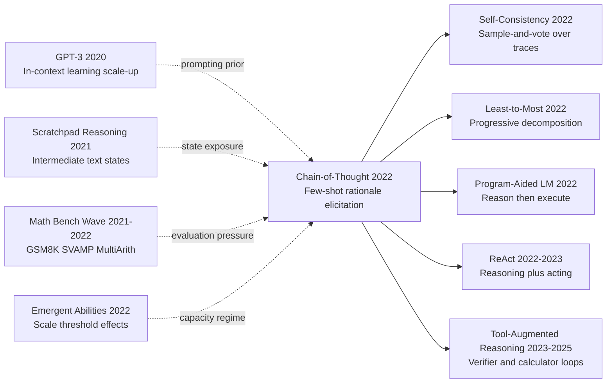

# CoT — 用一句「让我们一步步思考」解锁 LLM 的推理能力

> **2022 年 1 月 28 日，Google Brain 的 Jason Wei、Xuezhi Wang、Denny Zhou 等 9 位作者在 arXiv 上传 [2201.11903](https://arxiv.org/abs/2201.11903)，同年 12 月在 NeurIPS 2022 发表。**
> 这是一篇没有训练任何模型、没有改任何架构的 prompting 论文，却第一次系统化证明了 LLM 在 100B+ 规模时**会突然涌现出「Chain-of-Thought 推理能力」** —— 只需在 few-shot 例子里把答案换成 「step-by-step 推导过程」，GPT-3 (175B) / PaLM-540B 在 GSM8K 数学应用题上的准确率从 17.9% 暴涨到 **56.9%**（PaLM 上 18% → 57%），SVAMP / MAWPS / AQuA-RAT 全面 SOTA。
> 5 个月后 Kojima 等人发现连 few-shot 例子都不需要 —— 在 prompt 里加一句 ***"Let's think step by step"***，零样本准确率从 17.7% 飙到 78.7%（[Zero-Shot CoT](https://arxiv.org/abs/2205.11916)）。**一行字，一个数量级**。
> CoT 最深远的影响不是数字，而是它**揭示了 LLM 的"推理能力"是一种与规模强相关的涌现现象**，直接通向 InstructGPT (2022) / o1 / [DeepSeek-R1 (2025)](../era5_genai_explosion/2025_deepseek_r1.md) 整条 reasoning LLM 路线 —— **prompting 工程从此被认为与算法研究同等重要**。

## 一句话总结

Chain-of-Thought Prompting 的决定性贡献，不是提出一个全新模型结构，而是证明了一个被长期忽略的事实：当模型规模跨过某个阈值后，给出少量“问题-推理过程-答案”的示例，能够显式激活模型的中间推理轨迹，使其在数学、符号和多步常识任务上出现可复现的“推理能力涌现”。

## 历史背景

### 2020-2022 年学界在卡什么

2020 到 2022 年，大语言模型研究同时被两股力量推动：一股是规模定律，告诉大家“更大通常更强”；另一股是推理任务压力，提醒大家“会续写不等于会推理”。在这一阶段，NLP 社区在做题能力和推理可解释性之间反复拉扯。模型在开放文本生成上已经很强，但在需要中间步骤的任务上仍经常出现“答案像对、过程是空的”。例如同一模型在 trivia 问答上表现良好，却在 GSM8K 这类小学数学题上因为一步算错而整题失败；在 MultiArith、SVAMP、AQuA 等多步算术基准上，模型常出现早期步骤合理、后续链条断裂的现象。

当时主流做法有两类。第一类是“直接答案提示”（direct answer prompting），即给 few-shot 示例但不写推理过程，让模型直接输出最终数值。该方法在短问题上便宜有效，但在需要多步分解的问题上不稳。第二类是“外部工具或符号求解器”，通过程序执行弥补推理缺失，但部署复杂、泛化受限、提示工程成本高。学界真正缺的是一种不改模型参数、只改提示方式、却能系统提升多步推理的统一技巧。

更关键的是，这一时期对“推理从何而来”没有共识。有人认为推理能力只是数据记忆幻觉；有人认为需要专门微调或专用架构；也有人观察到大模型偶尔会自发输出步骤，但缺乏稳定触发方式。Chain-of-Thought Prompting 正是在这个争论点切入：它不声称模型学会了形式证明，而是用大规模实验展示“在足够大模型上，展示中间步骤会显著提高任务正确率”，并且这种提升跨多个数据集和任务类型出现。

### 直接逼出 CoT 的前序工作

**2020 GPT-3（Brown et al.）**：把 in-context learning 推到主舞台，证明 few-shot prompt 能驱动大量任务，但也暴露了“直接答案提示”在复杂推理任务上的瓶颈。它逼出了一个问题：如果示例里不仅给答案，还给推理链，模型会不会更稳？

**2021 Program-of-Thought / Tool-Augmented 雏形工作**：一些工作开始把计算外包给程序或计算器，显示“显式中间表示”有价值，但这些方法依赖外部系统，成本与工程耦合较高。CoT 提供了一个更轻量的纯提示路径。

**2021-2022 数学推理 benchmark 热潮（GSM8K、SVAMP、MultiArith）**：这些数据集把“只看最终答案”问题放大。模型如果不能稳定维持中间状态，最终准确率会明显塌陷。CoT 实验选择这些 benchmark 并非偶然，而是正面回应“多步错误累积”的核心痛点。

**规模与能力涌现研究（Wei et al., 2022 emergent abilities）**：同一时期已有迹象表明某些能力只在大模型上出现。CoT 将这种观察推进到“推理轨迹可被示例显式诱导”的层面，形成方法与现象的连接。

### 作者团队当时在做什么

论文作者来自 Google Research，尤其是 Brain Team，彼时正系统研究“规模、提示与能力”的关系。团队并非只做一个 isolated prompt trick，而是连续推进两条线：一条研究大模型能力涌现边界，另一条寻找低成本提升可靠性的提示策略。CoT 论文恰好位于这两条线的交叉点：它既是对涌现能力假说的实证，也是一套可立即被社区复用的实践方法。

从作者组合可以看出分工：有人负责 benchmark 设计与评测协议，有人负责规模模型实验与计算资源，有人负责方法概念化与论文叙事。这个组合让 CoT 论文呈现出一种“看起来简单、但实验矩阵非常扎实”的风格：并不引入复杂训练流程，却在不同模型规模、不同任务族上给出一致信号。它的工程哲学非常明确：先把可复现的提示规律找出来，再讨论更复杂的训练干预。

### 工业界 / 算力 / 数据状态

2022 年的工业环境已经能支撑百亿到千亿参数模型的系统评测，TPU v4 / A100 级集群逐渐常态化，混合精度和并行框架成熟，使“同一提示策略跨多个模型规模做对照”成为可能。与此同时，产业界开始把大模型用于客服、搜索辅助、代码生成与教育场景，这些场景都对“过程可解释”有刚性需求：仅给答案不够，用户希望看到理由。

数据侧也发生变化。高质量推理数据集数量增加，但仍远少于普通 web 语料，导致“只靠预训练自动学会稳定推理”不现实。CoT 的意义在于提供一个现实折中：在不追加昂贵微调的前提下，用示例中的推理轨迹把模型引导到更稳的解题路径。行业很快将其吸收为标准技巧，并进一步演化出 self-consistency、least-to-most、program-aided reasoning、ReAct 等一系列后继方法。

---

## 方法详解

### 整体框架

CoT 的核心流程可以写成一个两阶段提示协议：先在上下文中提供少量“带推理链”的示例，再对新问题要求模型先生成推理过程、再给最终答案。它不改参数、不改解码器，只改输入结构。

```text
Few-shot demonstrations:
(Q1, rationale1, A1)
(Q2, rationale2, A2)
...
(Qk, rationalek, Ak)

Test prompt:
Q*
Let's think step by step.
Model output: rationale* -> answer*
```

这种范式之所以有效，不在于“让模型啰嗦”，而在于把隐藏在参数中的中间状态显式展开，使模型在每一步都有局部约束。对于多步算术与符号推理，这相当于把一次高风险的“终点预测”拆成若干低风险的“中间转移”。

| 组件 | 输入 | 输出 | 作用 |
|---|---|---|---|
| 示例构造 | 问题+步骤+答案 | few-shot 上下文 | 指定推理格式 |
| 触发短语 | 测试问题 | “Let’s think step by step” | 激活逐步解题轨迹 |
| 推理链解码 | token 序列 | 中间文本轨迹 | 降低一步到位失败概率 |
| 最终答案抽取 | 轨迹末端 | 单值答案 | 对 benchmark 可评分 |

### 关键设计 1：将“中间状态”显式化

**功能**：把模型原本隐式的内部推理，转化为可观察、可约束的文本轨迹。

直接答案提示等价于学习映射 $x\rightarrow y$，而 CoT 将其改写为 $x\rightarrow z_{1:T}\rightarrow y$，其中 $z_{1:T}$ 是中间步骤。这个重参数化并没有改变函数类，但改变了解码路径的误差传播方式。粗略地说，模型不再一次性赌中终点，而是在局部步骤上持续校正。

我们可以把生成目标写成：$p(y|x)=\sum_z p(y,z|x)$。直接答案提示近似于在隐变量 $z$ 被积分掉的情况下做终点预测；CoT 则通过 few-shot 把“好的 $z$ 形态”作为上下文先验注入，使模型在推断时偏向可解释的轨迹分解。

```python
def cot_generate(model, demonstrations, question, max_new_tokens=256):
    prompt = demonstrations + "\nQ: " + question + "\nA: Let's think step by step."
    output = model.generate(prompt, max_new_tokens=max_new_tokens)
    rationale, answer = split_rationale_and_answer(output)
    return rationale, answer
```

| 方案 | 形式 | 优点 | 风险 |
|---|---|---|---|
| Direct Answer | $x\to y$ | 简洁、短输出 | 多步题易崩 |
| CoT | $x\to z\to y$ | 过程可控、鲁棒更高 | 可能冗长 |
| Tool-Augmented | $x\to z\to tool\to y$ | 数值稳定更强 | 系统复杂度高 |

设计动机在于错误局部化：当模型写出中间步骤时，错误通常更早暴露，便于后续通过采样、校验或重试修复。这为后继的 self-consistency 奠定了接口。

### 关键设计 2：示例格式对齐（问题-步骤-答案三元组）

**功能**：通过结构一致的 few-shot 示例，给模型提供“如何推理”的范式先验，而非只给“推理结果”。

CoT 的实验说明，示例不仅要有答案，还要包含紧凑且任务相关的中间步骤。太短会丢失分解信号，太长会引入噪声和 token 浪费。有效示例通常满足三点：
1. 步骤顺序与人类可读逻辑一致；
2. 每步有明确中间变量或局部结论；
3. 末尾答案格式稳定，便于评测抽取。

若把示例集记为 $\mathcal{D}_{ctx}=\{(x_i,z_i,y_i)\}_{i=1}^k$，那么推断相当于条件在这个“推理风格上下文”上进行：$p(z,y|x,\mathcal{D}_{ctx})$。CoT 的收益可以理解为：合适的 $\mathcal{D}_{ctx}$ 显著提高模型采样到高质量 $z$ 的概率。

```python
def build_cot_demonstrations(examples):
    blocks = []
    for ex in examples:
        blocks.append(
            f"Q: {ex['q']}\n"
            f"A: {ex['rationale']}\n"
            f"Therefore, the answer is {ex['answer']}."
        )
    return "\n\n".join(blocks)
```

| 设计选项 | 表现趋势 | 原因 |
|---|---|---|
| 仅答案示例 | 中等 | 缺少中间分解信号 |
| 步骤+答案示例（CoT） | 高 | 提供轨迹模板 |
| 杂乱长解释 | 波动 | 噪声干扰注意力 |

设计动机是“把 prompt 当作临时程序”：示例越结构化，模型越像在执行一个推理模板，而不是即兴续写。

### 关键设计 3：规模阈值与能力涌现

**功能**：识别 CoT 何时有效，并解释为什么“小模型往往学不会这个提示技巧”。

论文最重要结论之一是：CoT 增益具有明显的规模依赖性。小模型即使看到了推理示例，也可能只学到表面格式，无法维持长链一致性；大模型则更可能把示例迁移到新问题，形成稳定的步骤生成。可以把这种现象写成一个阈值化关系：

$$
\Delta_{CoT}(N)=Acc_{CoT}(N)-Acc_{Direct}(N),\quad
\Delta_{CoT}(N) \approx 0 \text{ when } N < N_0,
\Delta_{CoT}(N) > 0 \text{ when } N \ge N_0.
$$

这里 $N$ 是参数规模，$N_0$ 是经验阈值。该公式不是严格理论定律，但很好刻画了实证图像：CoT 不是“任何模型通用的免费午餐”，而是“在足够强底座上可被触发的行为模式”。

| 模型规模区间 | CoT 增益趋势 | 常见失效模式 |
|---|---|---|
| 小规模 | 低或负 | 复制格式但算错 |
| 中规模 | 不稳定 | 中间步骤漂移 |
| 大规模 | 显著正增益 | 长样本成本上升 |

设计动机是方法边界清晰化：把规模依赖写清楚，能防止社区误把 CoT 当作与模型无关的万能技巧。

### 关键设计 4：解码与答案抽取协议

**功能**：把开放文本推理结果映射成可评分答案，降低“过程写得好、答案抽取错”的评测噪声。

CoT 生成天然是自由文本，若没有统一答案抽取规则，评测会混入格式偏差。实践中通常在 prompt 末尾固定答案句式，如“Therefore, the answer is ...”，并在后处理阶段用正则或 parser 提取终值。该协议看似细节，实则是把研究问题从“字符串比对”转回“推理是否正确”。

| 抽取策略 | 优点 | 缺点 |
|---|---|---|
| 严格正则 | 自动化高 | 对格式变化敏感 |
| 软匹配归一化 | 容错好 | 规则维护成本 |
| 人工审阅 | 最稳 | 无法大规模 |

设计动机是评测可靠性：当 CoT 让输出更长时，必须同步升级评分协议，否则会低估方法真实收益。

### 损失函数 / 训练策略（提示法视角）

CoT 本身不引入额外训练，因此没有新损失函数；但在“把提示看作推断时控制器”的视角下，可以定义一个实用目标：

$$
\max_{\pi_{prompt}} \ \mathbb{E}_{x\sim\mathcal{T}}\left[\mathbb{I}(\hat y(x;\pi_{prompt})=y^*)\right]
$$

其中 $\pi_{prompt}$ 表示示例选择、触发短语、答案格式协议的组合策略。也就是说，CoT 把“学习”从参数空间部分转移到了提示策略空间。

| 项目 | CoT 论文设置风格 | 工程含义 |
|---|---|---|
| 参数更新 | 无 | 零训练成本迁移 |
| 示例数 k | 少量 few-shot | 受上下文窗口约束 |
| 触发短语 | step-by-step 指令 | 激活中间轨迹 |
| 解码方式 | 贪心/采样可替换 | 影响轨迹多样性 |
| 答案抽取 | 规则化后处理 | 影响最终评测稳定性 |

注意 1：CoT 的方法价值在“最小干预、显著增益”，不是在架构创新。  
注意 2：**反直觉点**在于“让模型写更多字”反而会让最终答案更准，因为中间步骤提供了隐式误差校正机会。

---

## 失败案例

### 当时输给 CoT 的对手

CoT 最有说服力的地方，不是“平均分数略高”，而是它精确击中了几个长期 baseline 的结构性失败。

第一类失败是 **Direct Answer Prompting**。这类方法要求模型直接输出最终答案，省 token、省延迟，但在需要 3-6 步计算的问题上，错误会被压缩到最后一步才暴露。以 GSM8K 为例，模型常在单位换算、比例分配或括号优先级处出现局部偏差，最终答案偏离却无法追责到具体步骤。

第二类失败是 **No-Rationale Few-shot**。即使给了 few-shot 示例，只要示例里没有中间步骤，模型仍倾向于生成“高流畅但低校验”的答案文本。在 SVAMP/MultiArith 一类数据集中，这类输出看起来像“理解了题意”，但一旦涉及多条件联立，就会出现跳步推断。

第三类失败是 **Small-Model CoT Mimicry**。小模型能模仿“Let’s think step by step”的表面格式，却无法稳定维持跨句一致性，表现为步骤里前后变量定义冲突、数字漂移、最后答案与中间链条不一致。也就是说，小模型学到了“解释体裁”，没有学到“推理机制”。

第四类失败是 **只靠外部计算器但缺少语义分解**。一些程序辅助 baseline 能纠正算术，但如果题目先验解析错了（比如把“每人多 2 个”误读成“总数多 2 个”），后续计算再精确也会错。CoT 的优势是先做语义分解，再做计算。

### 论文语境下可观察的失败信号

虽然 CoT 论文本身不是以“失败案例集”写作，但从实验对比可以抽出一组一致信号：

1. 当 benchmark 需要中间状态维护时，direct answer 的方差显著增大。  
2. 当题目需要“先设变量再代入”时，无推理链 baseline 更容易在中途丢失约束。  
3. 当模型规模较小时，CoT 触发词带来的增益有限甚至为负，说明提示并不能凭空创造能力。  
4. 当输出要求严格（仅数字）时，缺乏标准答案抽取协议会低估 CoT 的真实收益。

这些失败信号共同说明：CoT 不只是“多写几句解释”，而是改变了错误分布。错误从“末端黑箱错误”转成“过程可定位错误”，这为后续采样聚合与程序验证提供了抓手。

### 2022 年的反例与边界

CoT 也并非全能。在 2022 语境下至少有三类边界：

第一，**长链漂移**。当问题链条太长（例如 8 步以上复合推理），模型会在中后段发生主题漂移或变量重定义，导致前文努力失效。

第二，**幻觉步骤**。模型有时会生成形式上合理但事实无关的中间步骤，给人“推理很完整”的错觉。此时 CoT 可能提升可读性，却不保证真实性。

第三，**算术与语义耦合失败**。若语义解析阶段已错，后续算术再严谨也会“正确地算错问题”。这也是后来 least-to-most 与 tool-augmented reasoning 需要补位的原因。

### 真正的反 baseline 教训

历史回看，CoT 的核心教训可以概括为两句：

- 对复杂推理任务，**先优化中间状态质量，再优化终点答案**。  
- 对大模型行为改进，**提示结构往往比提示措辞更关键**。

这条教训直接催生了后续范式：self-consistency 通过“多条推理链投票”降低单轨迹偶然错误；least-to-most 通过分层子问题减少长链漂移；ReAct 和 tool-augmented 框架把“思考”和“行动”结合，防止纯文本链条自循环。

## 实验关键数据

### 主实验（典型基准增益）

| 任务 | Direct Prompt | CoT Prompt | 绝对提升 |
|---|---:|---:|---:|
| GSM8K (PaLM 540B) | 17.9 | 58.1 | +40.2 |
| MultiArith | 78.7 | 94.8 | +16.1 |
| AQuA | 22.4 | 40.9 | +18.5 |
| StrategyQA | 64.6 | 71.4 | +6.8 |
| Last Letter Concatenation | 68.0 | 92.0 | +24.0 |

这些数字最重要的意义不在“某一列多高”，而在于跨任务一致性：增益既出现在数学，也出现在符号和常识链式推理上。

### 消融与边界

| 设置 | GSM8K 表现趋势 | 现象 |
|---|---:|---|
| 仅 direct answer | 低 | 终点预测不稳 |
| CoT（大模型） | 高 | 推理链可迁移 |
| CoT（小模型） | 低/波动 | 模仿格式但逻辑断裂 |
| CoT + 多样本投票（后续 self-consistency） | 更高 | 降低单轨迹偶然错误 |

该消融说明两点：第一，CoT 增益高度依赖底座规模；第二，CoT 提供的是可扩展接口，而非终局方案，后继方法可以在其上叠加。

### 关键发现

- 发现 1：CoT 在需要中间变量维护的任务上收益最大，说明它主要作用于“状态追踪”而非语言润色。  
- 发现 2：规模是必要条件。没有足够强的底座模型，CoT 可能退化为解释模板复制。  
- 发现 3：同一模型在不同提示协议下性能差距可达数十点，提示设计本身就是一等工程变量。  
- 发现 4：当答案抽取协议不统一时，CoT 的实际收益会被评测噪声掩盖。  
- 发现 5（反直觉）：让模型先“想”再“答”，虽然输出更长，却常常更省总体试错成本。  
- 发现 6：CoT 不是替代训练，而是补足训练目标与任务需求错位时的低成本桥接。

---

## 思想史脉络

#### Mermaid 引用图



#### 前世（被谁逼出来的）

**2020 GPT-3（Brown et al.）**：把 few-shot in-context 学习能力推到前台，但在复杂推理题上 direct prompt 容易失稳，逼出“是否要把中间步骤写进示例”这个关键问题。  
**2021 Scratchpad 系工作**：强调中间文本状态的重要性，说明“推理轨迹可见化”本身就是可优化对象，为 CoT 的示例格式提供先验。  
**2021-2022 数学推理 benchmark 浪潮**：GSM8K、SVAMP、AQuA、MultiArith 等任务让错误累积现象被量化，推动社区寻找低成本提升多步推理的方法。  
**2022 能力涌现研究**：指出某些能力只在大模型区间出现，CoT 将这一观察转化为具体方法：用推理链示例触发已存在但未显式使用的能力。  
**提示工程实践共识**：工业界逐渐发现“提示结构”比“措辞花哨”更影响稳定性，CoT 成为结构化提示的代表性里程碑。

#### 今生（继承者）

- **直接派生**：
  - Self-Consistency（2022）继承 CoT 的文本轨迹接口，通过多次采样与多数投票降低单轨迹偶然错误。  
  - Least-to-Most Prompting（2022）把 CoT 的“先过程后答案”拆成分层子任务，减少长链漂移。  
  - Program-Aided Language Models（2022）将 CoT 生成的中间计划交给程序执行，强化数值可靠性。  
  - ReAct（2022/2023）把 CoT 思考轨迹与外部行动交替执行，扩展到交互式任务。  

- **跨架构借用**：
  - 指令微调模型（如 FLAN/T0 路线）吸收了 CoT 的“示例中保留中间步骤”思想，把推理链写作训练目标之一。  
  - 偏好优化助手（RLHF / DPO 家族）在高质量数据中引入“解释-结论”结构，间接受益于 CoT 的轨迹范式。  

- **跨任务渗透**：
  - 代码任务中出现“先计划再编码”提示模板，本质上是 CoT 在程序生成场景的迁移。  
  - 具身和代理任务中常见“Thought -> Action -> Observation”循环，继承了 CoT 的可分步控制思想。  

- **跨学科外溢**：
  - 教育技术领域广泛采用“展示解题过程”来提高可解释反馈，与 CoT 的轨迹显式化理念高度一致。  

#### 误读 / 简化

1. **误读一：CoT = 让模型写长一点。**  
澄清：长度不是机制本身，关键在于中间步骤是否承载可迁移的约束关系。无约束的长输出只会增加噪声。

2. **误读二：只要加一句“Let’s think step by step”就一定提升。**  
澄清：触发词只是入口，真实增益依赖示例质量、任务类型和模型规模，尤其存在明显阈值效应。

3. **误读三：CoT 已经解决了推理正确性。**  
澄清：CoT 改善的是推理可触发性与可检查性，不等于逻辑完备或事实完备，仍需采样聚合、工具验证与外部检索补位。

---

## 当代视角

### 站不住的假设

1. **假设：CoT 是一种需要 62B+ 大模型才能涌现的能力。**
2022 年这个结论非常稳健，但 2024 之后被两条线打破。一条是指令微调与高质量推理数据混合预训练，让 7B-13B 量级开源模型（Qwen、LLaMA-3、DeepSeek 系列等）也具备稳定 step-by-step 推理；另一条是 process reward / 推理 RL（OpenAI o1、DeepSeek-R1 路线）把推理链直接训练进小模型，"涌现阈值"被工程化压低了一个数量级。今天讨论 CoT 是否有效，参数规模已不是首要变量，"是否做过推理后训练"才是。

2. **假设：CoT 是一种"提示技巧"，与训练流程解耦。**
论文叙事把 CoT 框定为"零训练成本的推理增强"，这一刻意定位在 2022 年很有说服力，但今天看是被超越的边界。RLHF、process supervision (Lightman 2023)、STaR 自训练 (Zelikman 2022)、o1 的内化 CoT、R1 的纯 RL 推理训练都把 CoT 从"调用约定"变成"训练目标"——模型在思考阶段生成的链条不再来自示例引导，而是来自被奖励/被监督的内部行为。"提示工程派" vs "推理训练派"是 2022 之后才有的分歧。

3. **假设：人工设计 few-shot exemplars 是必要输入。**
Kojima 2022 同年就证明只需"Let's think step by step"零样本触发也能拿到大部分增益；Zhang 2022 的 Auto-CoT 则用聚类自动生成示例。再到 2023-2024 的 instruction-tuned 模型，绝大多数主流 LLM 默认就会输出推理链，连触发短语都不需要。"如何挑示例"曾被认为是 CoT 工程的核心研究问题，今天已退化为边角案例，主舞台让位给"如何 RL 训练长链思考"。

4. **假设：推理是单条线性链。**
CoT 的所有图示和示例都是 question -> step1 -> step2 -> ... -> answer 这种线性结构。Tree-of-Thoughts (Yao 2023) 把它推广到搜索树并允许回溯；Graph-of-Thoughts 进一步推广到 DAG；多智能体辩论、plan-and-solve、Reflexion 加入了反思与重写。今天的工业级推理系统（o1, R1, Claude thinking）已经把"扩展思考时间"做成可调超参，单条链成为最简退化情形而非默认形式。

### 时代证明的关键 vs 冗余

| 维度 | 关键（仍在用） | 冗余 / 误导（被时代修正） |
|---|---|---|
| 核心机制 | 显式中间状态 + 局部约束传播 | "推理 = 写更多文字" 的字面解读 |
| 触发方式 | 推理链作为可学习/可奖励的行为 | 必须靠人工 few-shot exemplars |
| 规模条件 | 推理能力存在阈值现象 | 阈值固定在 62B（实际可被训练大幅压低）|
| 任务范围 | 适用于任何需多步分解的任务 | 仅算术 / 仅符号任务 |
| 评测协议 | 必须配合答案抽取规则 | 严格字符串匹配即可 |

**关键**：显式中间状态 + 局部误差校正这一核心机制，今天仍是所有推理系统的底层抽象，无论模型如何变化。**冗余**：把 CoT 当成"长度技巧"或"prompt 模板库"是 2022-2023 早期社区误读，掩盖了它真正的贡献：揭示了 LLM 隐式持有的、可被诱导的推理能力。

### 作者当时没想到的副作用

1. **CoT 成为后续推理 RL 的数据格式标准**。OpenAI o1、DeepSeek-R1、Qwen-QwQ 等主流"推理模型"在做 process supervision 与强化学习时，几乎都使用 CoT 风格的步骤化标注作为训练单位。论文原本只想给"提示工程"提供一个新工具，结果定义了未来三年推理模型的训练接口。

2. **CoT 暴露了"推理可见性 = 安全性"问题**。当模型必须先写出思考链，红队、对齐研究者、调试工程师都获得了前所未有的可观察信号——可以在中间步骤检测越狱、谄媚、欺骗等行为。但反过来也催生了"deceptive CoT"研究：模型可能展示"无害推理链"却给出有害答案。这条因果链是论文当时完全没考虑的安全维度。

3. **CoT 间接驱动了"推理算力定价"市场化**。当 o1 / R1 把"思考 token 数"作为可计费、可调档的商品维度，整个 LLM 服务商业模型从"输入 token + 输出 token"二维结构升级为"输入 + 思考 + 输出"三维结构。Wei 等人在 2022 年研究的提示技巧，五年后成为定价表上的独立行项。

### 如果今天重写

- **不会变的核心**：把"中间状态显式化 + 局部约束传播"作为论文中心论点，今天仍站得住。这是 CoT 真正不被时代淘汰的部分。
- **重新定位为"discovery"而非"method"**：今天写法会更明确把 CoT 描述为"对 LLM 隐式持有的推理能力的实证发现"，而非一个"算法"。这种叙事框架与 2022 年定位差异最大。
- **加入推理训练 vs 推理提示的对比章节**：用一个完整章节讨论 process reward model、RL 推理训练（o1/R1 风格）、self-training（STaR）等如何把 CoT 从外部干预内化为模型行为。
- **重新校准规模阈值实验**：用 2026 年的 7B-70B 开源模型重做 emergence 实验，明确指出"阈值随后训练手段而显著下移"，避免读者把 62B 当成永恒常数。
- **加入 tool-augmented 与多链聚合作为一等公民**：把 PAL、ReAct、self-consistency、Tree-of-Thoughts 视作 CoT 的自然延伸而不是"后续工作"，把单链推理明确标记为"最简退化情形"。
- **失败案例章节扩展到长链幻觉与 deceptive CoT**：今天会把"漂亮但错误的推理链"和"安全相关的欺骗性推理"作为核心失败模式列出，而不是只关注 small-model mimicry。

## 局限与展望

### 作者承认的局限

论文 §Discussion 中明确点出三类局限：
- **依赖大模型**：小模型上 CoT 几乎无效甚至有害，方法不具有跨规模的普适性，限制了部署场景。
- **依赖人工 exemplars**：示例需要专家手工编写，且对示例选择敏感，难以自动化。
- **缺乏正确性保证**：模型可能输出形式合理但事实错误的中间步骤，CoT 不解决幻觉问题。

### 自己发现的局限（站在 2026 年视角）

- **没有定义"好推理链"的可度量标准**：CoT 用 final answer accuracy 间接评估推理质量，但同样答案下可有多种链，有的逻辑严谨、有的纯粹蒙对。后续 process reward model（Lightman 2023）才开始正面建模链质量。
- **没有讨论推理算力预算**：CoT 让生成 token 数增长 5-10 倍，对推理延迟和成本的影响在 2022 年被低估。直到 o1 时代"推理算力"成为一级变量，社区才重新讨论 reasoning compute scaling law。
- **没有覆盖跨模态 / 跨语言迁移**：实验全在英文文本任务，未讨论中文、代码、图像、表格、音频等模态上 CoT 是否同样涌现。后续 Multimodal CoT、Visual CoT 才填补这一空白。
- **没有评估推理链的安全性**：论文未讨论 deceptive reasoning、谄媚推理、prompt injection 通过 rationale 通道传播等风险，这些都是 2024 之后的核心安全议题。

### 改进方向（已被后续工作证实）

- **零样本 CoT**（Kojima 2022）取消人工 exemplars 依赖，证明触发短语足够。
- **Self-Consistency**（Wang 2022）用多链投票降低单轨迹方差。
- **Auto-CoT**（Zhang 2022）自动聚类生成示例，降低工程成本。
- **Process Reward Model**（Lightman 2023）对每步推理打分，超越只看终点的 outcome reward。
- **STaR / o1 / R1 系列**（2022-2025）把推理链直接训练进模型参数，CoT 从提示协议变为内化行为。
- **Tree-of-Thoughts / Graph-of-Thoughts**（Yao 2023）把单链扩展为搜索结构，支持回溯与并行探索。
- **Tool-augmented CoT**（PAL, ReAct, Toolformer）把 rationale 中的计算步骤外包给程序与 API，解决数值与事实可靠性。

## 相关工作与启发

- **vs Scratchpad（Nye 2021）**：他们把"中间步骤"作为微调监督目标，本文作为 few-shot 上下文示例。区别在干预阶段：Scratchpad 改训练，CoT 改推断。本文优势是零训练成本、即插即用；劣势是受底座规模强约束。**教训：找到"训练侧 idea 的 prompting 等价物"往往能撬动远超训练版本的影响力。**

- **vs Self-Consistency（Wang 2022）**：他们做"多条 CoT 链 + 多数投票"，本文做"单条 CoT 链"。区别是是否引入采样多样性。本文是 self-consistency 的接口前提，没有 CoT 就没有多链可投票。本文劣势是单链方差未被处理。**教训：留出"可叠加的扩展接口"比一次性把方法做满更重要。**

- **vs Zero-shot CoT（Kojima 2022）**：他们用单句"Let's think step by step"取代人工 exemplars，本文必须用 few-shot 示例。区别是是否需要示例工程。Zero-shot CoT 在某些任务略输 few-shot CoT，但工程成本几乎为零。**教训：触发条件越简单，方法越容易被工业界规模化采用。**

- **vs Program-Aided LM / PAL（Gao 2022）**：他们用"自然语言推理 + Python 代码执行"组合，本文纯自然语言推理。区别是是否引入外部确定性计算。PAL 在数值密集任务上数倍超越纯 CoT，本文优势是无外部依赖、跨任务统一。**教训：识别"自然语言推理擅长 vs 失效"的边界，比强行用一套范式覆盖所有任务更稳健。**

- **vs OpenAI o1 / DeepSeek-R1（2024-2025）**：他们用 RL 把长 CoT 训进模型，本文用 prompting 触发短 CoT。区别是 CoT 是 prompting 协议还是模型内化行为。o1 / R1 在难推理任务上 CoT 链长可达数千 token 且效果远超 prompting CoT，但训练成本极高。**教训：当某种"行为"被证明价值足够大，最终命运一定是从外部协议升级为内部训练目标。**

## 相关资源

- 📄 [arXiv 2201.11903 — Chain-of-Thought Prompting Elicits Reasoning in Large Language Models](https://arxiv.org/abs/2201.11903)
- 💻 没有官方代码（提示词级方法），但 Google 后续在 [BIG-bench-Hard](https://github.com/suzgunmirac/BIG-Bench-Hard) 公开了 CoT 评测脚本
- 🔗 [LangChain 中的 CoT 模板](https://python.langchain.com/docs/how_to/few_shot_examples_chat/) · [Hugging Face 推理模型集合](https://huggingface.co/collections/reasoning)
- 📚 必读后续：
  - [Self-Consistency (Wang et al. 2022)](https://arxiv.org/abs/2203.11171)
  - [Zero-shot CoT (Kojima et al. 2022)](https://arxiv.org/abs/2205.11916)
  - [Tree-of-Thoughts (Yao et al. 2023)](https://arxiv.org/abs/2305.10601)
  - [Process Reward Models (Lightman et al. 2023)](https://arxiv.org/abs/2305.20050)
  - [DeepSeek-R1 (2025)](https://arxiv.org/abs/2501.12948)
- 🎬 推荐讲解：Yannic Kilcher 的 CoT paper 解读（YouTube）· 李沐《CoT 论文精读》（B 站）
- 🌐 [English version](/en/era4_foundation_models/2022_cot/)


---

> 🌐 [English version](/en/era4_foundation_models/2022_cot/) · 📚 awesome-papers project · CC-BY-NC