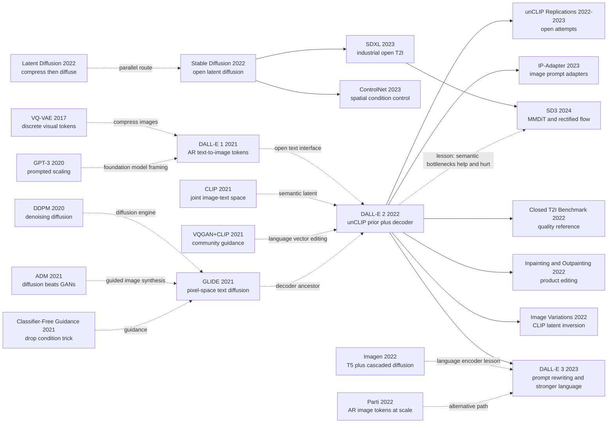

# DALL-E 2 - 用 CLIP 潜空间把文生图改写成先想象再渲染

> **2022 年 4 月 13 日，OpenAI 的 Ramesh、Dhariwal、Nichol、Chu、Chen 五位作者发布 [arXiv:2204.06125](https://arxiv.org/abs/2204.06125)。** DALL-E 2 最抓人的地方不是把 DALL-E 1 做大，而是把文生图拆成一个反直觉的两步：先让 CLIP 在语义空间里“想象”一张图的 embedding，再让扩散 decoder 把这个 embedding 渲染成像素。OpenAI 的公开页面说它比 DALL-E 1 分辨率高 4 倍，并在人评中以 71.7% 的 caption match、88.8% 的 photorealism 被偏好；但论文里的冷事实更有意思：它对 GLIDE 的画质优势并不压倒性，真正赢的是 diversity。这使 DALL-E 2 成为 2022 年闭源文生图的质量标尺，也成为 Stable Diffusion 爆发前那盏非常亮、但隔着玻璃看的灯。

## 一句话总结

DALL-E 2 把 2021 年 DALL-E 1 的“文本 token + 图像 token 自回归续写”改写成一个 CLIP 潜空间的层级生成问题：先用 prior 从 caption $y$ 生成 CLIP image embedding $z_i$，再用扩散 decoder 采样图像，核心分解是 $P(x\mid y)=P(x\mid z_i,y)P(z_i\mid y)$。这篇 2022 年 OpenAI 论文没有像 CLIP（2021） 那样开源权重，也没有像 Stable Diffusion（2022） 那样点燃社区生态；它更像闭源文生图时代的中间桥：DALL-E 1 证明“文本能生成图像”，GLIDE 证明“扩散能做高质量文本条件生成”，DALL-E 2 则证明“CLIP embedding 可以当作语义瓶颈，让 guidance 提升画质时不把样本多样性挤掉”。

关键数字并不只是 OpenAI 博客里“比 DALL-E 1 分辨率高 4 倍、人评 71.7% 更匹配文本、88.8% 更真实”：论文里更能解释方法价值的是，diffusion-prior unCLIP 对 GLIDE 的人评 photorealism 只有 48.9%（GLIDE 略优），caption similarity 45.3%（仍略输），但 diversity 达到 70.5%；在 MS-COCO zero-shot FID 上达到 10.39，并且小模型 ablation 里 full unCLIP FID 7.99 优于 text-embedding decoder 的 9.16 和零样本直接喂 CLIP text embedding 的 16.55。反直觉 lesson 是：DALL-E 2 的胜利不在“CLIP 懂一切”，而在承认 CLIP 只保留语义与风格，把像素细节留给 diffusion decoder；它也因此继承了 CLIP 的组合绑定、文字渲染和细节瓶颈。

---

## 历史背景

### 2021 年文生图站在三条路的岔口

DALL-E 2 出现之前，text-to-image generation 已经不再是一个单一技术路线的问题。2021 年同时存在三条看起来都合理、但各自有硬伤的路。

第一条是 **DALL-E 1 的离散 token 路线**。OpenAI 在 2021 年 1 月发布 DALL-E 1：先用 dVAE 把 $256\times256$ 图像压成 $32\times32=1024$ 个离散视觉 token，再用 12B 自回归 Transformer 预测文本 token 后面的图像 token。这条路线的优点是极度统一，视觉变成语言模型续写；缺点也同样明显：采样必须逐 token 顺序进行，高频细节被 dVAE 和离散 codebook 吃掉，公开效果还严重依赖 CLIP reranking。它证明了“任意文本可以驱动图像生成”，但还不像一个可部署的高保真图像系统。

第二条是 **GLIDE 的像素扩散路线**。同样来自 OpenAI 的 GLIDE 在 2021 年底证明，text-conditioned diffusion 加 classifier-free guidance 可以生成远比 DALL-E 1 更真实的图像，还能做编辑。它的问题不是画不出来，而是 guidance 会带来典型的 fidelity-diversity trade-off：scale 拉高，图更真实、更贴 prompt，但语义多样性会收缩，样本逐渐朝同一个构图坍缩。对于一个创意工具来说，这很要命，因为用户不只要“最像 caption 的那张图”，还要一组相互不同、可挑选的视觉方案。

第三条是 **社区的 CLIP-guided generation**。2021 年 VQGAN+CLIP、CLIP-guided diffusion、The Big Sleep 等实验在 Twitter、Colab 和艺术社区里爆发。它们用 CLIP 当外部审美/语义判别器，通过梯度或搜索把生成器往文本方向推。这条线有惊喜，也有不稳定：CLIP 会偏好贴字、符号、纹理捷径；优化过程慢；结果像艺术项目多于产品系统。但它暴露了一个关键信号：CLIP 空间里确实有可以操控图像语义与风格的坐标系。

DALL-E 2 的出现，正是这三条路的折中：保留 DALL-E 1 的“开放文本接口”，借 GLIDE 的扩散 decoder 负责像素质量，把社区 CLIP-guided generation 的“语义空间”变成模型内部的中间变量。

### CLIP 让语义空间第一次像基础设施

CLIP 的角色很容易被低估。DALL-E 2 并不是直接让文本 encoder 喂给 U-Net 生成图像，而是先生成 **CLIP image embedding**。这件事在 2022 年非常大胆，因为它把 CLIP 从“用来评估/检索”的模型，升格为“生成过程的潜变量空间”。

CLIP 训练目标是把图像和文本拉到同一个向量空间。这个空间不是像素空间，也不是 dVAE 的局部纹理 token 空间，而是一种混合了对象、风格、场景、材质和语义相似性的 embedding 空间。论文认为：如果 decoder 能把一个 CLIP image embedding 反演成图像，而 prior 能从 caption 生成 plausible image embedding，那么文生图就可以被拆成两个相对清晰的问题：

- 文本到图像语义：$P(z_i\mid y)$，决定“这句话可能对应什么样的视觉概念”。
- 图像语义到像素：$P(x\mid z_i,y)$，决定“把这个概念渲染成哪张具体图”。

这种拆分有一个很强的直觉：guidance 不再需要直接改变整张图的语义分布。prior 先采样出不同的 $z_i$，这些 $z_i$ 已经代表不同构图、对象细节和风格；decoder guidance 只负责把每个 $z_i$ 渲染得更清楚。于是质量可以上去，而样本多样性不必像 GLIDE 那样被 guidance 一起压扁。

### OpenAI 团队与 2022 年 4 月的发布

DALL-E 2 的五位作者都在 OpenAI 的生成模型主线上。Aditya Ramesh 是 DALL-E 1 第一作者；Prafulla Dhariwal 和 Alex Nichol 则是 OpenAI 扩散模型路线的核心作者，前者与 Nichol 共同写了 Diffusion Models Beat GANs，后者是一系列 improved diffusion/GLIDE 工作的重要作者；Casey Chu 和 Mark Chen 参与 OpenAI 多模态与大模型工程。这个作者组合本身就说明了 DALL-E 2 的性质：不是 DALL-E 1 小修小补，而是 **DALL-E 团队与 diffusion 团队合流**。

OpenAI 在 2022 年 4 月 13 日同时发布论文和 DALL-E 2 演示。公众看到的是“astronaut riding a horse”“teddy bear on Times Square”这类 1024×1024 样例，以及 variations、inpainting、outpainting 这些创意功能。论文里更朴素的名字是 **unCLIP**：因为模型做的是 CLIP image encoder 的近似逆过程。这个命名很准确。DALL-E 2 不是“让 CLIP 画图”，而是先用 CLIP 把视觉世界压成一个语义瓶颈，再训练 diffusion decoder 学会把这个瓶颈解码回图像。

这次发布也处在一个微妙的产业时间点。2022 年 4 月，DALL-E 2 仍然需要 waitlist，权重不开源；2022 年 5 月 Google 发布 Imagen，质量更惊艳但同样闭源；2022 年 8 月 Stable Diffusion v1 开源，整个文生图生态被改写。回头看，DALL-E 2 是闭源文生图的高光时刻：它定义了用户想象中的“AI 画图应该能做到什么”，却把真正的社区爆发留给了另一路技术和开源策略。

## 研究背景与动机

### 核心动机：先生成图像语义，再还原像素

DALL-E 2 的动机不是单纯追求更低 FID，而是解决一个生成模型常见的矛盾：高画质需要强 guidance，但强 guidance 会让多样性消失。GLIDE 之类像素空间扩散模型把所有信息都塞在同一个 denoising trajectory 里，模型一边决定“画什么”，一边决定“怎么画清楚”。guidance scale 一高，这两个过程一起被收紧，最后得到更锐利但更同质的图。

DALL-E 2 的切法是把“画什么”和“怎么画”分开。prior 采样 $z_i$，决定高层视觉语义；decoder 条件在 $z_i$ 上渲染图像，决定像素细节。这样，一组不同的 $z_i$ 可以对应同一 prompt 的不同解释：不同构图、视角、材质和风格。decoder guidance 提升每个解释的清晰度，却不必把所有解释拉成同一个样子。论文表 1 的 diversity 结果正是在验证这个设计。

### 为什么不是直接沿用 DALL-E 1 或 GLIDE

如果沿用 DALL-E 1，系统会继续受自回归视觉 token 的限制：生成慢，离散 codebook 损失细节，模型必须从左到右预测 1024 个视觉 token，错误会顺序累积。DALL-E 1 的历史价值是打开“语言模型化图像生成”的想象，但 2022 年的高质量文生图显然已经转向 diffusion。

如果只沿用 GLIDE，系统可以得到强 photorealism 和编辑能力，却很难解释为什么高 guidance 下多样性会变差，也很难自然支持“给定一张图生成保持语义与风格的 variations”。DALL-E 2 的 CLIP latent 让 image variation 成为结构内置能力：给输入图像编码得到 $z_i$，decoder 在随机 DDIM latent 上采样，就能保留 CLIP 认为重要的语义与风格，同时改变非关键细节。

因此 DALL-E 2 的目标可以概括成三件事：第一，把 CLIP 从评估器变成生成层级里的语义潜变量；第二，用 diffusion decoder 替代 DALL-E 1 的离散自回归像素化路线；第三，在 photorealism、caption match 和 diversity 之间找到比 GLIDE 更好的折中。它不是最终答案，但它把 2022 年文生图最关键的三个部件：CLIP、diffusion、classifier-free guidance，接成了一个能工作的产品级系统。

---

## 方法详解

### 整体框架：unCLIP 是一个两级生成模型

DALL-E 2 的论文名叫 Hierarchical Text-Conditional Image Generation with CLIP Latents，方法名则是 **unCLIP**。这个名字把方法讲得很清楚：CLIP 负责把图像编码成语义 embedding，unCLIP 训练一个生成系统把这个 embedding 反过来还原成图像。完整系统由两个主模型和两个超分模型组成：

| Component | Input | Output | Model type | Key role |
|---|---|---|---|---|
| CLIP encoder | image/text | $z_i$, $z_t$ | frozen ViT-H/16 CLIP | shared semantic space |
| Prior | caption $y$, text embedding $z_t$ | CLIP image embedding $z_i$ | AR prior or diffusion prior | imagine visual semantics |
| Decoder | $z_i$ and optional caption $y$ | 64x64 image | 3.5B GLIDE-style diffusion | render pixels |
| Upsampler 1 | 64x64 image | 256x256 image | 700M diffusion upsampler | recover resolution |
| Upsampler 2 | 256x256 image | 1024x1024 image | 300M diffusion upsampler | final high-res output |

核心因式分解是：

$$
P(x\mid y)=P(x,z_i\mid y)=P(x\mid z_i,y)P(z_i\mid y).
$$

其中 $x$ 是图像，$y$ 是 caption，$z_i$ 是 CLIP image embedding。第一项 $P(z_i\mid y)$ 是 prior：给一句话，先想象一个可能的 CLIP 图像向量。第二项 $P(x\mid z_i,y)$ 是 decoder：给这个图像向量，把它渲染成具体像素。CLIP 本身在 prior 和 decoder 训练时冻结，不参与反向更新。

用伪代码看，DALL-E 2 的采样流程非常短：

```python
def unclip_sample(caption, clip, prior, decoder, upsampler_256, upsampler_1024):
    text_embedding = clip.encode_text(caption)          # z_t, frozen CLIP
    image_embedding = prior.sample(caption, text_embedding)  # z_i ~ P(z_i | y)
    image_64 = decoder.sample(image_embedding, caption)      # x_64 ~ P(x | z_i, y)
    image_256 = upsampler_256.sample(image_64)
    image_1024 = upsampler_1024.sample(image_256)
    return image_1024
```

这段流程的反直觉点是：文本并不直接决定最终图像的全部细节。文本先决定一个 CLIP image embedding，而这个 embedding 只保留 CLIP 认为重要的语义、风格与布局信息。decoder 再补齐纹理、局部形状和像素级细节。因此 DALL-E 2 的能力和弱点都来自这个 bottleneck：它擅长保持语义与风格变化，却会在对象-属性绑定、文字拼写、复杂局部细节上丢信息。

### 关键设计 1：CLIP image embedding 作为语义瓶颈

**功能**：把文生图问题从“直接从文本采样像素”改成“先采样图像语义，再渲染像素”。CLIP image embedding $z_i$ 是整个系统的中间货币：prior 要生成它，decoder 要反演它，image variation 和 text diff 都围绕它做。

DALL-E 2 使用自己训练的 CLIP：image encoder 是 ViT-H/16，输入 256x256 图像，宽度 1280、32 个 Transformer block；text encoder 宽度 1024、24 个 Transformer block。训练 CLIP 时混合 CLIP 与 DALL-E 数据集，约 650M 图像；训练 prior、decoder 和 upsampler 时只使用 DALL-E 数据集，约 250M 图像，因为更噪的 CLIP 数据会伤害生成质量。

| Design choice | DALL-E 2 choice | Why it matters | Failure mode |
|---|---|---|---|
| Latent space | CLIP image embedding | keeps semantic/style information | loses spelling and exact binding |
| CLIP weights | frozen during generation training | stable target for prior and decoder | cannot adapt to decoder needs |
| Image embedding dimension | 1024 before PCA/compression | rich enough for semantics | not a full image code |
| Dataset split | 650M for CLIP, 250M for generator | noisy data ok for contrastive learning, harmful for synthesis | closed data prevents reproduction |
| Decoder target | invert $z_i$ rather than tokenize pixels | enables variations/interpolations | bottleneck inherits CLIP blind spots |

**设计动机**：DALL-E 1 的 dVAE token 是局部视觉 code，适合压缩像素，却不直接表达“这张图是什么”。CLIP image embedding 则反过来：它不保存所有像素，但保存对象、风格、场景和语义邻近性。DALL-E 2 把这个缺点变成优点：不要让 prior 管像素，把 prior 的任务压缩成“生成一个语义上合理的图像向量”。这让 prior 更容易学，也让 decoder 可以专注做图像反演。

### 关键设计 2：prior 从文本生成 CLIP 图像向量

**功能**：prior 是 DALL-E 2 的“想象器”。如果只有 decoder，系统只能把已有图像的 CLIP embedding 还原成 variations；要从文本生成图像，就必须先从 caption 采样一个可能的 $z_i$。论文比较了两种 prior：自回归 prior 和扩散 prior。

| Prior | Representation | Sampling | Paper finding | Main cost |
|---|---|---|---|---|
| AR prior | PCA to 319 dims, each quantized into 1024 buckets | autoregressive Transformer | workable but lower quality | sequential decoding |
| Diffusion prior | continuous CLIP image embedding | Gaussian diffusion in latent space | higher quality and more compute-efficient | iterative denoising |
| No prior | feed CLIP text embedding as image embedding | zero-shot shortcut | plausible but weak | semantic mismatch |
| Text-embedding decoder | train decoder on $z_t$ directly | direct text condition | worse than full unCLIP in ablation | loses image-latent capabilities |

AR prior 先对 $z_i$ 做 PCA。论文发现，带 SAM 训练的 CLIP representation rank 明显降低，保留 319 个 principal components 就几乎保存全部信息；再把每个维度量化到 1024 个桶，用 causal Transformer 逐个预测。为了让 AR prior 更偏向 caption 匹配好的图像，作者还 prepend 一个表示 $z_i\cdot z_t$ 的 token，并在采样时偏向上半分布的 dot product。

扩散 prior 则直接在连续 $z_i$ 上做 Gaussian diffusion。它把 encoded text、CLIP text embedding、diffusion timestep、noised CLIP image embedding 和一个 final prediction embedding 组成序列，用 decoder-only Transformer 预测干净的 $z_i$。论文明确说，比起常见的 $\epsilon$-prediction，他们发现直接预测 unnoised $z_i$ 更好：

$$
L_{\text{prior}}=\mathbb{E}_{t,z_i^{(t)}\sim q_t}\left[\left\|f_\theta(z_i^{(t)},t,y)-z_i\right\|_2^2\right].
$$

**设计动机**：DALL-E 2 不是把 CLIP text embedding 当作 image embedding 的粗暴替代。CLIP 的训练让 $z_t$ 和 $z_i$ 接近，但它们不是同一个分布。prior 的价值正是在 $z_t$ 附近采样一个真实 image embedding manifold 上的点。论文的小模型实验显示 full unCLIP FID 7.99，优于 text-embedding decoder 的 9.16，也远优于把 text embedding 直接喂给 unCLIP decoder 的 16.55。

### 关键设计 3：GLIDE 风格扩散 decoder 与级联超分

**功能**：decoder 是 DALL-E 2 的“渲染器”。它接收 CLIP image embedding，并可选接收 caption，生成 64x64 图像；之后两个 diffusion upsampler 把分辨率提升到 256x256 和 1024x1024。decoder 架构沿用 GLIDE 的 3.5B U-Net diffusion 模型，只是增加了 CLIP embedding 条件：一方面把 CLIP embedding 投影后加到 timestep embedding，另一方面把它投影成 4 个额外 context token，拼到 GLIDE text encoder 的输出序列里。

decoder 仍然是标准 diffusion 训练，只是条件换成了 CLIP embedding：

$$
L_{\text{decoder}}=\mathbb{E}_{t,x_0,\epsilon}\left[\left\|\epsilon_\theta(x_t,t,z_i,y)-\epsilon\right\|_2^2\right],\quad x_t=\sqrt{\bar{\alpha}_t}x_0+\sqrt{1-\bar{\alpha}_t}\epsilon.
$$

| Module | Paper size | Training/sampling detail | Conditioning | Why it exists |
|---|---:|---|---|---|
| Diffusion prior | 1B | 1000 diffusion steps, 64 sampling steps | text + $z_t$ | generate $z_i$ |
| Decoder | 3.5B | 250 strided sampling steps | $z_i$ + optional text | produce 64x64 image |
| Upsampler 64->256 | 700M | DDIM 27 steps | low-res image | first super-resolution stage |
| Upsampler 256->1024 | 300M | DDIM 15 steps | low-res image | final resolution |
| CLIP | ViT-H/16 | frozen during generator training | image/text encoders | latent space |

Classifier-free guidance 通过随机 drop condition 实现：训练 decoder 时 10% 概率把 CLIP embedding 置零或 learned null embedding，50% 概率 drop text caption；训练 prior 时 10% 概率 drop text conditioning。这里的一个细节很有意思：作者保留了 caption conditioning pathway，假设它能补足 CLIP 不擅长的自然语言细节，比如 variable binding；但论文后面承认，它在这方面帮助很小。这直接预示了 DALL-E 2 的一个核心局限：CLIP embedding 是很好的语义摘要，却不是可靠的句法绑定表示。

两个 upsampler 也很工程化。第一阶段用 Gaussian blur 腐蚀低分辨率条件图，第二阶段用更复杂的 BSR degradation；训练时只看目标分辨率四分之一大小的 random crop，推理时直接应用到目标分辨率。作者发现 upsampler 不需要 caption conditioning，也不用 attention，只靠空间卷积就能泛化到高分辨率。这说明高层语义在 64x64 阶段已经决定，超分更多是在补纹理和清晰度。

### 关键设计 4：同一个 CLIP 潜空间支持 variations、interpolations 和 text diffs

**功能**：DALL-E 2 不只是文生图模型，也是一套图像操控接口。给定一张图像，模型可以得到一个 bipartite representation：$z_i$ 来自 CLIP image encoder，描述 CLIP 识别到的语义和风格；$x_T$ 来自 DDIM inversion，保存 decoder 重建这张图所需的残差信息。固定或扰动这两部分，就得到 variations、interpolations 和 language-guided edits。

| Operation | Latent operation | What is preserved | What changes | Typical use |
|---|---|---|---|---|
| Variation | same $z_i$, stochastic DDIM latent | semantics and style | non-essential details | generate alternatives |
| Interpolation | slerp between two $z_i$ | shared visual manifold | content/style blend | morph concepts |
| Text diff | move $z_i$ toward $z_t-z_{t0}$ | source image identity partly | described attribute/style | language edit |
| DDIM inversion | recover $x_T$ for a source image | reconstruction path | controlled stochasticity | edit while preserving layout |
| PCA probing | decode partial CLIP dimensions | coarse-to-fine semantics | detail level | inspect CLIP space |

Text diff 的公式是：先给当前图像一个描述 $y_0$ 和目标描述 $y$，编码成 CLIP text embeddings $z_{t0}$ 与 $z_t$，再计算方向：

$$
z_d=\operatorname{norm}(z_t-z_{t0}),\quad z_\theta=\operatorname{slerp}(z_i,z_d,\theta),\quad \theta\in[0.25,0.50].
$$

**设计动机**：GAN inversion 也能在 latent space 里做图像编辑，但需要人去寻找方向；DALL-E 2 的优势是 CLIP 把文本和图像放在同一个空间里，方向可以直接由语言给出。论文的“cat -> anime super saiyan cat”“winter landscape -> fall landscape”这类例子，就是用语言向量差来推动图像 embedding。这个接口没有后来 DALL-E 3 或 Photoshop Generative Fill 那么稳定，却在 2022 年第一次把“prompt 不是只用来生成，也可以用来编辑”变成产品级概念。

真正要记住的是：DALL-E 2 的方法不是单个 U-Net trick，而是一种层级分工。CLIP latent 负责语义抽象，prior 负责从文本采样语义，decoder 负责从语义还原像素，upsampler 负责把分辨率补上。每个模块都不完美，但它们组合起来，形成了 2022 年第一批让大众相信“自然语言可以控制视觉世界”的系统。

---

## 失败案例

### 旧路线一：DALL-E 1 的离散自回归

DALL-E 2 首先是在替换 DALL-E 1。DALL-E 1 的路线很清楚：dVAE 把图像变成 1024 个视觉 token，12B Transformer 把文本与图像 token 当同一个序列建模。它的问题也很清楚：生成要从左到右逐 token 采样，速度慢；离散 codebook 对纹理、文字和细节有损；模型为了拿到好样例还需要 CLIP reranking。OpenAI 在 DALL-E 2 的公开页面上说，新系统比 2021 年 1 月的 DALL-E 1 分辨率高 4 倍，并在人评中 71.7% 被认为更匹配文字、88.8% 被认为更真实。

这不是单纯的模型大小胜利，而是 **表示形式的胜利**。DALL-E 1 的视觉 token 是压缩像素，DALL-E 2 的 CLIP image embedding 是压缩语义；DALL-E 1 的 Transformer 负责从文本一路续写到图像 token，DALL-E 2 把“想象语义”和“渲染像素”拆给 prior 与 decoder。被淘汰的不是自回归 Transformer 这个架构本身，而是“用离散视觉 token 顺序生成高保真图像”的路线。

### 旧路线二：GLIDE 的像素空间 guidance

GLIDE 是更强的对手。DALL-E 2 论文并没有把 GLIDE 打成过时 baseline；相反，它承认 GLIDE 在 photorealism 和 caption similarity 上仍然很强。表 1 的人评结果显示，diffusion-prior unCLIP 对 GLIDE 的 photorealism preference 是 48.9%，caption similarity 是 45.3%，都略低于 50%。如果只看“哪张更像照片”或“哪张更贴 caption”，DALL-E 2 并没有压倒性优势。

DALL-E 2 真正赢的是 diversity。diffusion-prior unCLIP 的 diversity preference 达到 70.5%，AR-prior unCLIP 也有 62.6%。论文 Figure 9 的解释很关键：GLIDE 提高 guidance scale 时，内容、相机角度、颜色和尺寸都会收敛；unCLIP 的语义信息被先前采样出的 CLIP image embedding 固定，decoder guidance 提高画质时不容易把这些语义选择一起压扁。因此 GLIDE 不是“失败”，而是暴露了 pixel-space guidance 的结构性代价。

### 旧路线三：不要 prior 或用错误 prior

DALL-E 2 论文还测试了几个看起来省事的替代方案。第一种是不要 prior，直接把 CLIP text embedding 当成 image embedding 喂给 decoder。因为 CLIP 把文本和图像放在同一空间，这招有时能出图，但它并不等价于从真实 image embedding manifold 上采样。第二种是训练一个 decoder 直接条件在 CLIP text embedding 上。第三种是使用 AR prior 而不是 diffusion prior。

小模型 ablation 很有说服力：text-embedding decoder 的 FID 是 9.16，完整 unCLIP stack 是 7.99，直接把 text embedding 零样本喂给 unCLIP decoder 是 16.55。也就是说，prior 不是可有可无的桥，它负责把文本 embedding 转换成更像真实图像 embedding 的点。AR prior 可用，但 diffusion prior 在同等模型规模下质量更好、训练计算更省，因此成为主线。

### 论文自己暴露的失败

DALL-E 2 最值得尊重的地方之一，是 limitations 写得相当直接。它没有声称 CLIP latent 是完美视觉表示，而是明确指出 unCLIP 会继承 CLIP 的盲点。

| Failure | Paper evidence | Root cause | Later repair direction |
|---|---|---|---|
| Attribute binding | red cube / blue cube examples worse than GLIDE | CLIP embedding weakly binds objects and attributes | stronger text encoders, dense attention, better data |
| Rendered text | prompt “A sign that says deep learning” fails | CLIP does not encode spelling precisely; BPE hides letters | OCR-aware data, T5/LLM encoders, DALL-E 3 recaptioning |
| Complex scene detail | Times Square / dog field examples lack fine detail | 64x64 base image plus upsampling hierarchy | higher base resolution, latent diffusion, DiT backbones |
| CLIP blind spots | typographic attack probes show logits can be fooled | contrastive representations mix object and text shortcuts | multimodal robustness, better objectives |
| Safety and deception | paper notes fewer AI traces increase misuse risk | photorealistic generation lowers detection cues | staged deployment, watermarking, policy filters |

这些失败不是边角 bug，而是架构边界：如果 $z_i$ 没有清楚保存“红色属于 cube A、蓝色属于 cube B”，decoder 很难凭空恢复；如果 CLIP 不重视每个字母的拼写，decoder 也很难写对 sign；如果 64x64 base 已经缺细节，1024x1024 upsampler 多半只能补纹理，补不了全局结构。DALL-E 2 的瓶颈正是它的优点的反面。

## 实验关键数据

### 人评：和 GLIDE 几乎打平质量，但赢在多样性

DALL-E 2 最重要的实验不是“FID 比谁低”，而是三维人评：photorealism、caption similarity、diversity。论文使用 MS-COCO validation captions，并为 diversity 设计了 4x4 grid 对比：人类评估者看到同一个 caption 下两组样本，选择哪组更多样。

| Model compared to GLIDE | Photorealism preference | Caption similarity preference | Diversity preference | Interpretation |
|---|---:|---:|---:|---|
| unCLIP with AR prior | 47.1% ± 3.1% | 41.1% ± 3.0% | 62.6% ± 3.0% | lower quality, still more diverse |
| unCLIP with diffusion prior | 48.9% ± 3.1% | 45.3% ± 3.0% | 70.5% ± 2.8% | near-tie quality, strong diversity win |
| GLIDE baseline | 50% reference | 50% reference | 50% reference | stronger direct prompt match |
| DALL-E 2 public page vs DALL-E 1 | 88.8% photorealism | 71.7% caption match | not reported | large product-level jump |
| Main lesson | not a knockout | not a knockout | decisive | CLIP latent preserves modes under guidance |

这组数字让 DALL-E 2 的历史位置更准确：它不是“所有指标碾压 GLIDE”的论文，而是“用 CLIP latent 解决 guidance 多样性坍缩”的论文。对创意产品而言，diversity win 可能比 1-2 个 FID 点更重要，因为用户的实际体验是从多张候选里挑一张。

### FID 与 prior ablation

论文在 MS-COCO zero-shot FID 上报告 diffusion-prior unCLIP 达到 10.39，优于同时期很多 zero-shot text-to-image 系统，并显著优于 DALL-E 1 约 28 的 FID。需要注意：FID 对多样性敏感，但不总与人类审美或 caption match 对齐；论文自己也强调人评更重要。

| Experiment | Metric | Result | What it shows | Caveat |
|---|---:|---:|---|---|
| Full unCLIP, diffusion prior | MS-COCO zero-shot FID | 10.39 | strong zero-shot benchmark result | FID imperfect for prompt quality |
| DALL-E 1 | MS-COCO zero-shot FID | around 28 | DALL-E 2 is a large generational jump | not same architecture scale |
| Text-embedding decoder | FID in small ablation | 9.16 | direct $z_t$ conditioning is plausible | weaker than full stack |
| Full small unCLIP stack | FID in small ablation | 7.99 | prior plus decoder is best | smaller than production model |
| Zero-shot $z_t$ into decoder | FID in small ablation | 16.55 | text embedding is not image embedding | shortcut fails distribution match |

prior 的价值在这里变得非常具体。CLIP 的 text embedding 与 image embedding 共享空间，但它们不是同分布；full unCLIP 做得好，是因为它学会了从 caption 分布采样到 image embedding manifold，而不是直接把文本向量当图像向量用。

### 训练规模与系统细节

DALL-E 2 的论文模型规模不小，但它不是单个巨型 Transformer，而是一组分工明确的模型。OpenAI 的 appendix 给出了关键超参：CLIP 用约 650M 图像训练，generative stack 用约 250M DALL-E 图像；decoder 是 3.5B GLIDE 风格模型；prior 是 1B；两个 upsampler 分别 700M 和 300M。

| Model | Size | Batch / iterations | Sampling detail | Why it matters |
|---|---:|---|---|---|
| AR prior | 1B | batch 4096, 1M iterations | sequential latent codes | baseline prior |
| Diffusion prior | 1B | batch 4096, 600K iterations | 64 strided sampling steps | final preferred prior |
| Decoder | 3.5B | batch 2048, 800K iterations | 250 strided steps | 64x64 rendering engine |
| Upsampler 64->256 | 700M | batch 1024, 1M iterations | DDIM 27 steps | resolution recovery |
| Upsampler 256->1024 | 300M | batch 512, 1M iterations | DDIM 15 steps | final high-res output |

这套系统解释了为什么 DALL-E 2 的论文能同时谈“生成”“变化”“插值”“语言编辑”和“CLIP probing”。它不是一个单模型结果，而是把表示学习、latent prior、像素扩散、超分、DDIM inversion 和 classifier-free guidance 组合成产品级系统。也因此，它难以被学术界完整复现：数据闭源、模型闭源、工程预算也远超普通实验室。

---

## 思想史脉络



### 前世

DALL-E 2 的前世不是一条线，而是两条线在 2022 年交叉。

第一条是 **token 化图像生成线**。VQ-VAE、VQ-VAE-2 和 DALL-E 1 共同证明：图像可以先被压缩成一个中间表示，再由大模型生成。DALL-E 1 把这件事做成了最 GPT 的形式：文本 token 后面接图像 token，统一自回归建模。这条线留下的不是最终架构，而是一个接口想象：prompt 可以像程序一样描述图像。

第二条是 **扩散模型线**。DDPM 建立 denoising diffusion 的训练目标，ADM 证明 diffusion 在 ImageNet 上能 beat GAN，GLIDE 把 text conditioning 和 classifier-free guidance 接入像素扩散。DALL-E 2 的 decoder 明确继承 GLIDE，因此它不是凭空发明“扩散文生图”，而是在 GLIDE 上加了一个 CLIP image embedding bottleneck。

真正把两条线扣在一起的是 **CLIP**。CLIP 既是 DALL-E 1 样本筛选的判别器，也是 2021 年 VQGAN+CLIP 社区创作的外部目标，更是 DALL-E 2 的内部潜变量空间。DALL-E 2 的思想史位置可以概括成一句：它把 CLIP 从“评委”升格为“草图”。prior 先画语义草图，decoder 再把草图渲染成图。

### 今生

DALL-E 2 的直接后代有点特殊，因为 OpenAI 没有开源权重和训练代码。它不像 Stable Diffusion 那样产生大量直接 fork，而是通过产品能力、研究叙事和接口设计影响后续系统。

最直接的继承是 **image variations / editing**。DALL-E 2 把“上传一张图，生成同语义同风格的变化”变成大众可理解的功能。后来的 IP-Adapter、image prompt adapter、reference-only control、style transfer diffusion 系统，都在不同程度上继承了这个问题设定：图像本身也可以是 prompt，不只是文本。

第二个继承是 **closed quality benchmark**。在 2022 年 4 月到 8 月之间，DALL-E 2 和 Imagen 定义了“闭源大厂文生图”的质量上限。Stable Diffusion 的开源爆发并不是因为它一开始全面超过 DALL-E 2，而是因为它足够接近、可本地运行、可 fine-tune、可扩展。DALL-E 2 在这里像一面镜子：让社区知道目标长什么样。

第三个继承是 **DALL-E 3 的反向修正**。DALL-E 3 没有公开说自己沿用 unCLIP 架构，反而把重点放在 prompt rewriting、更强语言理解和安全对齐上。这个转向本身说明 DALL-E 2 的 lesson 已经被吸收：CLIP latent 很适合作语义 bottleneck，但单靠 CLIP 不足以解决复杂指令、文字渲染和组合绑定。后来 SD3、Pixart、Imagen 系统也都转向更强 text encoder、合成 caption 和 DiT/flow 架构。

### 误读 / 简化

第一个误读是 **“DALL-E 2 证明 CLIP latent 是文生图的终极表示”**。更准确的说法是：CLIP latent 在 2022 年提供了一个非常有用的语义 bottleneck，但它不是完整图像表示。论文 limitations 已经写明，属性绑定、文字、复杂细节都会受损。后来的大模型并没有都去生成 CLIP image embedding；很多路线改成直接用 T5/LLM text embedding 条件 diffusion 或 flow。

第二个误读是 **“DALL-E 2 全面赢过 GLIDE”**。如果只读宣传页，很容易以为 DALL-E 2 在质量上全方位碾压。论文数字更克制：photorealism 和 caption similarity 人评都略低于 GLIDE，胜在 diversity。DALL-E 2 的科学贡献恰恰是解释并改善 diversity-fidelity trade-off，而不是简单刷榜。

第三个误读是 **“DALL-E 2 是 Stable Diffusion 的直接祖先”**。二者同属 2022 年文生图爆发，但技术路线不同。DALL-E 2 是 CLIP image latent prior + pixel diffusion decoder + cascade upsampler；Stable Diffusion 是 VAE latent diffusion + cross-attention text conditioning + open weights。Stable Diffusion 受 DALL-E 2 的产品压力和质量目标影响很大，但方法上更接近 Latent Diffusion Models。

### 这条线真正留下了什么

DALL-E 2 留下的核心不是某个具体模块，而是三个观念。

第一，**生成可以分层**。不要让一个模型同时决定语义、构图、纹理、分辨率和编辑接口；先让一个 latent 表达“要画什么”，再让另一个模型决定“怎么画出来”。后来的视频、3D、音频生成模型几乎都沿着这种分层思路走。

第二，**embedding space 可以是创作界面**。DALL-E 2 的 variations、interpolations、text diffs 让人看到：用户不一定只通过 prompt 从零生成，也可以在 latent space 中移动已有图像。这条思想后来在 ControlNet、IP-Adapter、reference image、style adapter 里不断复现。

第三，**语义瓶颈既是能力，也是损失函数**。CLIP latent 让 DALL-E 2 保住了多样性，也让它丢掉了 spelling、binding 和局部细节。这个教训影响了后来的生成模型：强表示不只是要“语义对齐”，还要保存足够可渲染的信息。2024 年以后大家转向更大 text encoder、更好 VAE、更密集条件和 flow/DiT，不是在否定 DALL-E 2，而是在修补它暴露的瓶颈。

---

## 当代视角

### 站不住的假设

- **“CLIP image embedding 是最佳文生图中介”**：2022 年它非常有效，因为 CLIP 同时懂对象、风格和场景。但 2026 年回看，CLIP latent 太稀疏、太全局，难以表达精确关系、文字拼写、多人场景和长 prompt 约束。Imagen 用 T5-XXL 证明强语言编码器很重要；DALL-E 3 用 prompt rewriting 把用户短 prompt 改写成详细 caption；SD3/FLUX 等路线用更大的文本编码器和 DiT/flow 直接条件生成。CLIP latent 是关键过渡，不是终点。
- **“64x64 base image 加级联超分足够”**：DALL-E 2 的 decoder 先出 64x64，再超到 1024x1024。这能省算力，却把复杂细节过早压进低分辨率瓶颈。后来的 latent diffusion、SDXL、SD3、Imagen 2 和 Midjourney 风格系统都在提高 base latent 信息密度、改进 VAE 或直接用更强 backbone。今天的高质量模型不再满足“低分辨率定语义，高分辨率只补纹理”这个简单分工。
- **“闭源质量领先足以定义生态”**：DALL-E 2 在 2022 年 4 月很惊艳，但没有开源权重。四个月后 Stable Diffusion 证明，足够好的开源模型加本地推理、LoRA、ControlNet、ComfyUI、Civitai，会比稍强的闭源模型产生更大的研究和创作生态。DALL-E 2 定义目标，Stable Diffusion 定义参与方式。
- **“人评 photorealism/caption similarity/diversity 就够”**：这三项在 2022 年合理，但今天远远不够。用户还关心长 prompt 遵循、文字渲染、手部与解剖、精确空间控制、风格版权、人物安全、可编辑性、可复现 workflow、商业授权和审计。DALL-E 2 论文已经谈风险，但当时还没有完整的生成式 AI 社会争议。
- **“CLIP 语义就是视觉理解”**：DALL-E 2 用 typographic attack probing 展示了一个微妙事实：CLIP 分类概率可能被文字干扰，但 decoder 仍可能重建苹果。这说明 embedding 里有比 logits 更丰富的信息，也说明 CLIP 的“理解”不是人类式的对象-文字分离。今天的多模态模型不再满足于对比学习 embedding，而会加入 caption、VQA、OCR、grounding、segmentation 和合成数据共同训练。

### 时代证明的关键 vs 冗余

DALL-E 2 经得起时间检验的部分有三块。

第一，**层级生成**。先在一个抽象 latent 中决定语义，再由生成器渲染细节，是文生图、视频生成、3D 生成和音频生成持续复用的思路。哪怕 CLIP latent 被换成 VAE latent、spacetime latent 或 DiT token，分层思想仍在。

第二，**image-as-prompt**。DALL-E 2 的 variations 让普通用户理解“图像也能当输入条件”。这一路从 DALL-E 2 variations 走到 ControlNet、IP-Adapter、reference image、style adapters，再走到今天的 multimodal editing workflow。

第三，**diversity-fidelity trade-off 的结构化分析**。DALL-E 2 没有只说“我们画得更好”，而是解释为什么 GLIDE 高 guidance 会压缩多样性，为什么先采样 CLIP image embedding 能固定语义模式。这种分析比单个指标更有长期价值。

相对冗余的部分也很清楚。CLIP image embedding 作为唯一 bottleneck 已不够强；3-stage cascade 被更好的 latent/DiT/flow 系统替代；闭源 waitlist 发布没有形成社区可复用基础设施；单纯靠 CLIP 或人评 proxy 做质量选择，也无法应对后来的安全、版权和可控性要求。

### 如果今天重写

如果 2026 年重写 DALL-E 2，我会保留“分层生成”和“image variation”目标，但换掉大部分实现。

- **prior/decoder 合并成 DiT 或 flow-based latent generator**：不再显式生成 CLIP image embedding，而是在更高维 VAE/spacetime latent 上用 Rectified Flow 或 Flow Matching 建模。
- **文本端使用多编码器**：CLIP 负责视觉语义，T5/LLM 负责长 prompt 和句法，OCR-aware encoder 负责文字渲染。DALL-E 3 的 prompt rewriting 会成为训练数据流水线的一部分。
- **训练数据用合成详细 caption**：把网页 alt-text 改写成包含对象、属性、关系、风格、相机和文字内容的 caption，补 DALL-E 2 最弱的 binding 和 spelling。
- **variation 不只靠 CLIP latent**：把源图分解成布局、风格、身份、局部 mask、深度/边缘/pose，多通道控制，而不是把所有信息压在一个全局 embedding 里。
- **安全从训练前进入模型设计**：数据过滤、人物/版权/水印、可追踪 metadata、输出策略和红队评估一起设计，而不是论文后面单独一节风险。
- **开放可复现子系统**：即便不公开全模型，也应公开更完整的 evaluation set、ablation、模型卡和接口规范，让社区能验证 claims。

但我不会删掉 DALL-E 2 的核心洞察：直接从文本到像素不是唯一选择。中间 latent 可以让模型先“想象”再“渲染”，也可以让用户在图像之间移动、混合、编辑。这仍然是生成式视觉最有生命力的接口之一。

## 局限与展望

### 作者承认的局限

- **属性绑定弱**：论文 Figure 14/15 里，unCLIP 在“red cube on top of blue cube”这类任务上比 GLIDE 更容易混淆颜色和对象；decoder reconstructions 也会混淆对象属性。
- **文字渲染弱**：prompt “A sign that says deep learning” 不能稳定生成正确文字。作者认为 CLIP embedding 不精确编码 spelling，BPE tokenization 又让模型更难看到字母级信息。
- **复杂场景细节不足**：论文 Figure 17 展示复杂场景细节偏低，作者把原因指向 64x64 base resolution 和 upsampling hierarchy。
- **风险更高**：相比 GLIDE，unCLIP 输出更真实，可能更难被识别为 AI 生成，从而提升欺骗、滥用和偏见复制风险。
- **部署依赖上下文**：作者明确说风险要结合数据、guardrails、部署空间和访问人群评估，并引用 DALL-E 2 Preview system card。

### 后来暴露的局限

- **产品能力被 DALL-E 3 反超**：DALL-E 3 的 prompt rewriting 和更强语言跟随，说明 DALL-E 2 的 CLIP bottleneck 不足以处理真实用户的长而混乱的 prompt。
- **开源生态缺位**：DALL-E 2 影响巨大，但模型不可下载、不可 fine-tune、不可接 ControlNet/LoRA 生态，导致技术影响部分让位给 Stable Diffusion。
- **编辑接口不够可控**：variations 很自然，但精确控制物体位置、pose、边缘、mask、身份保持，需要后续 ControlNet/IP-Adapter 类方法。
- **数据与版权不透明**：OpenAI 训练数据闭源，无法像 LAION/SD 那样被社区审计，也无法独立复现实验。
- **评估维度有限**：论文的人评很有价值，但缺少今天会要求的细粒度 compositional benchmark、OCR benchmark、bias/safety audit 和 provenance 评估。

### 改进方向

DALL-E 2 给后续工作的改进路线非常明确：用更强 text encoder 和 synthetic captions 修复 language binding；用更高信息密度的 latent 或更高 base resolution 修复细节；用 DiT/flow 替代 2022 年的 U-Net cascade；用多模态 condition adapter 支持图像、mask、pose、depth、layout；用系统卡、数据治理和可追踪输出处理部署风险。

从研究角度看，最值得继续追的问题仍然是：什么样的 latent 既能保存足够语义以便编辑，又能保存足够细节以便渲染？DALL-E 2 给了一个答案：CLIP image embedding。后来的 Stable Diffusion、SD3、Sora、DALL-E 3 都在给不同答案。

## 相关工作与启发

### 对比地图

- **vs DALL-E 1**：DALL-E 1 是 dVAE token + 12B AR Transformer，统一但慢且细节弱；DALL-E 2 是 CLIP latent + diffusion decoder，更适合高保真图像与 variations。
- **vs GLIDE**：GLIDE 是 pixel-space text diffusion，prompt match 更强；DALL-E 2 在相近画质下显著提高 diversity。
- **vs Imagen**：Imagen 用 T5-XXL + cascaded diffusion，证明强语言编码器能改善 prompt 理解；DALL-E 2 更强调 CLIP image latent 和 variations。
- **vs Stable Diffusion / LDM**：LDM 在 VAE latent 上直接 diffusion，开源且可扩展；DALL-E 2 在 CLIP image latent 上先采样语义，再用 pixel decoder 渲染，闭源且更像产品展示。
- **vs DALL-E 3**：DALL-E 3 更重视 prompt rewriting、语言跟随和安全部署，像是对 DALL-E 2 的语言瓶颈做系统修复。

### 对今天研究的启发

DALL-E 2 仍然值得读，不是因为它是今天最强的 text-to-image 配方，而是因为它把一个很难的系统问题拆得漂亮：表示学习、prior、decoder、超分、编辑、风险评估，各司其职。很多现代系统都在朝“端到端大模型”靠拢，但 DALL-E 2 提醒我们：有时候好的中间表示能让系统能力更可解释，也让失败更容易定位。

它也提醒研究者不要被单指标骗到。DALL-E 2 对 GLIDE 的 photorealism 和 caption similarity 没有赢，却在 diversity 上赢得非常清楚。如果只追最高人评或最低 FID，可能会错过“为什么这个系统更像创意工具”的本质。

## 相关资源

### Primary sources

- Paper: [Hierarchical Text-Conditional Image Generation with CLIP Latents](https://arxiv.org/abs/2204.06125)
- OpenAI publication page: [Hierarchical text-conditional image generation with CLIP latents](https://openai.com/index/hierarchical-text-conditional-image-generation-with-clip-latents/)
- OpenAI product page: [DALL-E 2](https://openai.com/index/dall-e-2/)
- DALL-E 2 Preview system card: [Risks and Limitations](https://github.com/openai/dalle-2-preview/blob/main/system-card.md)

### Follow-up reading

- [CLIP (2021)](https://arxiv.org/abs/2103.00020) - shared image-text representation
- [DALL-E 1 (2021)](https://arxiv.org/abs/2102.12092) - discrete autoregressive text-to-image
- [GLIDE (2021)](https://arxiv.org/abs/2112.10741) - text-guided diffusion baseline
- [Latent Diffusion Models (2022)](https://arxiv.org/abs/2112.10752) - Stable Diffusion route
- [Imagen (2022)](https://arxiv.org/abs/2205.11487) - T5 plus cascaded diffusion
- [Classifier-Free Diffusion Guidance](https://openreview.net/forum?id=qw8AKxfYbI) - guidance mechanism


---

> 🌐 [English version](/en/era4_foundation_models/2022_dalle2/) · 📚 awesome-papers project · CC-BY-NC