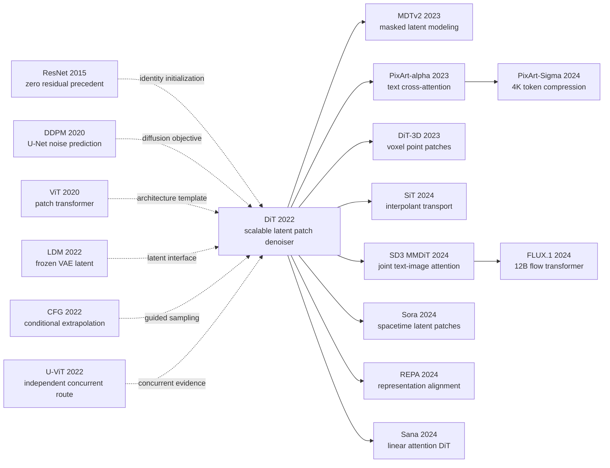

# DiT - 当扩散模型把 U-Net 换成 Transformer

> **2022 年 12 月 19 日，William Peebles 与 Saining Xie 上传 [arXiv:2212.09748](https://arxiv.org/abs/2212.09748)：他们没有再雕一座 U-Net，而是把 Stable Diffusion VAE 的 32×32 latent 切成 patch，交给几乎标准的 Vision Transformer。** 这场替换真正锋利的地方不只是 ImageNet 256×256 的 FID 2.27，而是一组受控证据：固定约 675M 参数，把 latent patch 从 8 缩到 2，forward 从 7.39 增到 118.64 Gflops，400K-step FID 从 106.41 降到 19.47；再用 adaLN-Zero 让 28 个 block 从 identity 起步。两年后，Sora 把 patch 延伸到时空，Stable Diffusion 3 把 block 改成 MMDiT，FLUX.1 扩到 12B。DiT 没有发明扩散，也不是第一个 ViT diffusion，却把“U-Net 只是一个可替换 backbone”变成了可缩放、可复查的工程事实。

## 一句话总结

William Peebles 与 Saining Xie 于 2022 年发布、后收入 ICCV 2023 的 DiT，把冻结 VAE 的 latent 切成 $T=(I/p)^2$ 个 token，用 Transformer 预测扩散噪声与协方差，并以 $c=e_t(t)+e_y(y)$ 驱动 adaLN-Zero：residual gate 全零初始化，使每层从 identity 起步。同为 DiT-XL/2、训练 400K steps 时，in-context、cross-attention、vanilla adaLN 的无引导 FID 分别为 35.24、26.14、25.21，adaLN-Zero 降到 19.47。最终 675M 参数模型在 118.64 Gflops、7M steps、CFG 1.5 下，把 ImageNet 256×256 FID 从 LDM-4-G 的 3.60 推到 2.27；512×512 得到 3.04，优于此前 diffusion baseline 3.85，但未超过 StyleGAN-XL 的 2.41。

更深的结论不是“参数越多越好”：固定参数减小 patch 也能持续降低 FID；小 DiT-L/2 即使用 1000 sampling steps、花 80.7 Tflops/图，仍输给只用 128 steps、15.2 Tflops/图的 XL/2。这个 token-denoiser 接口后来通向 [Sora](/era5_genai_explosion/2024_sora/) 的 spacetime patches、[Stable Diffusion 3 / MMDiT](/era5_genai_explosion/2024_stable_diffusion3/)、PixArt 与 FLUX。反直觉之处是 headline 既依赖长训练和 CFG，也依赖仍为卷积的 VAE；DiT 真正终结的是“扩散方程必须绑定 U-Net”这一默认假设。

---

## 历史背景

### 2022 年的扩散架构卡在哪里

2022 年底，图像扩散已经不是一条需要证明“能不能生成”的路线，而是在反复证明“同一副 U-Net 骨架还能堆多大”。2020 年的 DDPM 把噪声预测、逐步反演和卷积 U-Net 绑成一套可靠配方；2021 年的 ADM 又系统调整残差块、通道数、注意力位置和条件归一化，并在 ImageNet 256×256 上把 classifier-guided FID 做到 4.59，配合上采样器进一步到 3.94。到了 2022 年，LDM 把去噪过程移进 VAE latent，大幅降低空间开销，却仍保留多尺度下采样、上采样和长跳连组成的 U-Net。

问题因此发生了变化：**扩散的概率建模已经快速演进，承载它的主干网络却基本没有换过。** DDPM 使用的 U-Net 并非照搬 2015 年医学分割原版，而是由 ResNet 块、若干低分辨率 self-attention 和时间条件归一化组成的生成式变体；但高层结构仍是卷积金字塔。每次扩大模型，研究者都要重新决定各分辨率通道数、每层残差块数、注意力放在哪一层以及上下采样怎样配平。参数量也不能准确反映代价：同一 U-Net 在更高分辨率上的计算量会急剧增长。

另一边，Transformer 已在语言、识别和自回归图像生成里形成相反的工程文化：序列长度决定 token 计算，深度和宽度有标准缩放方法，block 本身尽量不随任务变化。ViT 在 2020 年证明图像可以切成 patch 后交给通用 Transformer；Parti 又把自回归文生图 Transformer 扩到 20B 参数。扩散模型是否也能摆脱专用 U-Net，成为 2022 年底一个尚未被干净回答的问题。

### 直接铺路的四条技术线

第一条是 **DDPM → ADM 的扩散配方**。[DDPM](https://arxiv.org/abs/2006.11239) 给出噪声预测目标，ADM 则提供 learned covariance、ImageNet 条件生成配方和统一评测工具。DiT 没有重写这部分数学，反而刻意保留 ADM 的 1000 步线性噪声日程、混合训练目标和 250 步 DDPM 评测，以便把变量集中在“主干是谁”。

第二条是 **ViT 的 patch Transformer**。[ViT](https://arxiv.org/abs/2010.11929) 已经说明，空间网格可以线性切块、加二维位置信息，再交给标准 self-attention。DiT 继承的不是 ViT 的分类头，而是它的设计空间：Small、Base、Large 通过深度、隐藏宽度和注意力头数共同缩放，patch size 则独立控制序列长度。

第三条是 **LDM 的感知压缩**。[Latent Diffusion](https://arxiv.org/abs/2112.10752) 把 256×256 RGB 图像压成 32×32×4 latent，让架构实验不必先支付像素空间的全部成本。DiT 直接采用 Stable Diffusion 的 f=8 VAE，冻结编码器和解码器，只替换 latent 上的去噪器。这一点很关键：论文证明的是“U-Net 不是 latent denoiser 的必要条件”，不是“整套图像生成都不需要卷积”。

第四条是 **条件控制与残差初始化**。Classifier-free guidance 允许同一网络同时学习条件与空条件；FiLM、ADM 的 adaptive normalization 说明全局条件可以通过 scale/shift 调制特征；ResNet 大规模训练经验又表明，把残差分支初始化为零有利于优化。adaLN-Zero 正是这三条经验的交点：用时间步与类别之和生成归一化参数和残差 gate，并让 gate 初始为零。

还必须把同期路线放回时间轴。U-ViT 的 [arXiv v1](https://arxiv.org/abs/2209.12152) 发布于 2022 年 9 月 25 日，比 DiT 的 12 月 19 日早近三个月；它把时间、条件和噪声 patch 都当 token，并保留浅层到深层的长跳连。RINs 则在 12 月 22 日提出用少量 latent token 路由高维数据。因而更准确的历史说法不是“DiT 第一个想到 Transformer 扩散”，而是：**多支团队同时看见 U-Net 并非唯一答案，DiT 用最整齐的规模/patch/conditioning 对照把这件事变成了可复用基线。**

### 作者与这篇论文的研究位置

论文只有两位作者：UC Berkeley 的 William Peebles 与 New York University 的 Saining Xie。如此小的作者表与论文的研究方式一致：它不像大型文生图系统报告那样把数据清洗、文本编码器、安全管线和部署一并打包，而是选择一个可以控制变量的架构问题。作者在致谢中点名 Kaiming He、Ronghang Hu、Alexander Berg、Shoubhik Debnath、Tim Brooks、Ilija Radosavovic 与 Tete Xiao参与讨论；这些名字横跨 ResNet/ViT 架构、生成建模和大规模视觉训练，也解释了论文为何把“设计空间”放在中心。

DiT 的题目没有承诺文本理解，也没有宣称提出新扩散方程。它把贡献压缩成三个可检验命题：标准 Transformer 能否作为 latent diffusion backbone；时间与类别条件怎样注入 block；扩大 forward-pass Gflops 是否稳定降低 FID。原始实验用 JAX 在 TPU 上完成，随后作者公开了 PyTorch 定义、训练与采样脚本以及 256/512 两个 DiT-XL/2 checkpoint。官方仓库后来被归档为只读，但代码仍把每个关键选择摊开：固定二维 sin-cos position、十个百分点 label dropout、adaLN-Zero 全零初始化，以及只对前三个 latent channel 做 CFG 的复现细节。

从后见之明看，Peebles 后来参与 Sora 会让 DiT 像一篇“视频模型预告”；但 2022 年的论文没有这些证据。它的结论只谨慎提出：未来可以继续扩大模型和 token 数，并把 DiT 作为 DALL-E 2、Stable Diffusion 这类文生图系统的可替换 backbone。把后来的 Sora 反写成当时已经规划好的路线，会抹掉这篇论文最值得学习的地方：先用受控实验回答一个小问题，再让工业系统决定它能走多远。

### 算力、数据与工具处在什么阶段

实验数据只有 ImageNet 类条件生成，而不是网页图文对。256×256 图像经冻结 VAE 变成 32×32×4，512×512 变成 64×64×4；类别标签只有 1000 个离散选择。这种设置牺牲了“看起来像产品”的展示，却让所有模型共享同一数据、条件、损失、优化器和评测，从而能把差异归因于主干计算。

原论文在 TPU v3 pod 上训练 JAX 模型。最重的 256×256 DiT-XL/2 在 TPU v3-256、global batch 256 下约 5.7 iteration/s，forward 为 118.6 Gflops；最终训练 7M 步。512×512 版本处理 1024 个 latent token，forward 上升到 524.6 Gflops，训练 3M 步。这里的“compute-efficient”是相对论断：它比论文列出的 1120-Gflop ADM 256 模型和 1983-Gflop ADM 512 模型便宜，但 7M 次更新仍是一笔巨额训练账单。

训练工具链也处在转折点。Transformer 已能直接借用成熟的 LayerNorm、multi-head attention 和 MLP kernel；Stable Diffusion 的 VAE 可以作为现成压缩器；ADM 的 TensorFlow evaluation suite 则提供可比 FID。与此同时，原始 DiT 还没有 FlashAttention、`torch.compile`、bf16/AMP 或 gradient checkpointing，官方 PyTorch README 把这些列为待办。换言之，论文看到的是**架构统一带来的潜力**，而不是已经兑现所有系统优化的终局。

## 研究背景与动机

### 三个被刻意拆开的研究问题

DiT 没把“Transformer 能不能生成图像”当成一个笼统问题，而是拆成三层。第一层是表示：VAE latent 应该怎样变成 token？答案由 patch size $p$ 控制，token 数为 $T=(I/p)^2$。第二层是条件：时间步 $t$ 和类别 $y$ 应作为额外 token、cross-attention 序列，还是归一化调制？第三层才是 scale：在条件机制固定后，增加深度/宽度，或减小 patch 以增加 token 数，是否都能改善生成质量？

这样的拆分让失败也有解释力。如果 cross-attention 输了，可以追问是条件接口还是算力开销；如果小 patch 变好而参数不增，便能排除“只是参数更多”；如果更长采样仍追不上大 backbone，就能区分训练时模型计算与推理时迭代计算。论文真正的新意不在单个 block，而在于让这些轴互相正交。

### 为什么先在 latent ImageNet 上回答

像素空间会把分辨率、backbone 和训练预算缠在一起。DiT 选 LDM 的 frozen VAE，是为了先把 256×256 压成固定 32×32 网格，再比较十二个 Transformer。ImageNet 类别又比自然语言条件简单：一个 class embedding 与一个 timestep embedding 都是长度 $d$ 的向量，可以直接测试四种注入方式，而不必处理 77 个文本 token、文本编码器容量或 caption 质量。

这是一种有意的实验收缩，不是能力声明。它使“adaLN-Zero 优于 cross-attention”只在全局类别条件下成立；到了 PixArt 的文本序列，cross-attention 重新成为必要接口；到了 SD3，文本和图像甚至各自保留参数后再联合注意。DiT 的实验设计之所以耐用，正因为它给后继者留下了清晰起点，而不是假装一个 ImageNet 结果已经解决所有条件生成。

### 论文真正想证明什么

最小命题是：**扩散模型的去噪目标不绑定 U-Net。** 只要保留输入/输出空间、时间条件和噪声/方差预测接口，标准 patch Transformer 就能成为 drop-in backbone。更强的命题是：在这组十二个模型里，forward Gflops 比参数量更能解释 FID；同一模型减小 patch、参数几乎不变，质量仍持续提高。

但这不是“算力越多必然越好”的空话。论文还给出预算分配结论：大模型训练较短，最终会比小模型训练更久更划算；大 backbone 少采样几步，也能胜过小 backbone 多采样几百步。DiT 因而把扩散研究的尺度单位从“多少参数”推进到“每次 denoiser evaluation 做了多少有效计算”。后来 Sora、MMDiT、PixArt、FLUX 把任务和规模推远，但它们真正继承的是这套可扩展接口，而不只是名字里多了一个 Transformer。

---

## 方法详解

### 整体框架：冻结 VAE，只替换 denoiser

DiT 最容易被误写成“把图像切成 patch 做扩散”，但真正的接口更精确：图像先由现成的 Stable Diffusion VAE 压进 latent；扩散前向过程在 latent 上加噪；DiT 只负责从 noisy latent 预测噪声与反向协方差。VAE 编解码器始终冻结，因此 U-Net 与 Transformer 的比较发生在同一个 $\mathcal{Z}$-space，而不是把压缩器、损失和采样器一起换掉。

以 256×256 为例，RGB 图像 $x$ 经 f=8 VAE 得到 $z_0\in\mathbb{R}^{32\times32\times4}$。训练时随机采样 $t$ 和高斯噪声 $\epsilon$ 得 $z_t$；patch embedding 把 $z_t$ 变成 token；固定二维 sine-cosine position 提供位置；每个 DiT block 都由同一个条件向量 $c=t_{emb}+y_{emb}$ 调制。末端线性层把每个 token 解成 $p\times p\times2C$，其中前 $C$ 个通道预测噪声，后 $C$ 个通道服务 ADM 的 learned covariance。unpatchify 恢复 latent 网格，采样结束后才调用一次 VAE decoder。

```text
RGB image x: (B, 3, H, W)
  -> frozen VAE encoder E, downsample 8x
latent z_0: (B, 4, H/8, W/8)
  -> sample t and noise epsilon; form z_t
  -> p x p latent patch embedding + fixed 2D sin-cos position
tokens: (B, ((H/8)/p)^2, d)
  -> N x [adaLN-Zero -> self-attention -> MLP]
  -> adaptive final LayerNorm + linear(p*p*2C)
  -> unpatchify into noise and covariance predictions
  -> reverse diffusion sampling
  -> frozen VAE decoder D
RGB sample x_hat: (B, 3, H, W)
```

这条流水线没有 U-Net 的 down path、up path、多尺度 feature map 或 encoder-decoder 长跳连。空间压缩已经由 VAE 完成，DiT 选择在单一 token 分辨率上反复做全局交互。**反直觉点在于：作者没有为生成任务发明视觉金字塔的 Transformer 替代物，而是尽量保留普通 ViT block，只对条件注入与输出头做必要改造。**

四个规模配置沿用 ViT 命名，下面的参数量取论文 Appendix Table 4 的 p=4 版本，Gflops 是 256×256 输入下的单次 Transformer forward，不含 84M 参数 VAE：

| 配置 | 深度 $N$ | 隐藏宽度 $d$ | 注意力头 | 参数量 | p=4 Gflops |
|---|---:|---:|---:|---:|---:|
| DiT-S | 12 | 384 | 6 | 33M | 1.41 |
| DiT-B | 12 | 768 | 12 | 130M | 5.56 |
| DiT-L | 24 | 1024 | 16 | 458M | 19.70 |
| DiT-XL | 28 | 1152 | 16 | 675M | 29.05 |

### 设计 1：latent patch 把分辨率变成可控的 token 预算

**功能**：把固定大小的 VAE latent 转成标准序列，并用 patch size $p$ 单独控制每次 denoiser evaluation 的计算量。

若 latent 空间边长为 $I$、通道数为 $C$，非重叠 $p\times p$ patch 经过线性投影后产生：

$$
T=\left(\frac{I}{p}\right)^2,\qquad
z_{tokens}=\operatorname{PatchEmbed}_p(z_t)+E_{pos},\qquad
E_{pos}\in\mathbb{R}^{T\times d}.
$$

VAE 每边先压缩 8 倍，所以一个 latent patch 覆盖像素空间的 $(8p)\times(8p)$ 区域。256×256 时 $I=32$：p=8 只有 16 个 token，p=4 有 64 个，p=2 有 256 个。512×512 的 DiT-XL/2 则从 $I=64$ 得到 1024 个 token。官方实现使用 `timm` 的 `PatchEmbed`，本质是 kernel=stride=p 的卷积，但权重按线性层方式初始化；位置编码是固定二维 sin-cos，不参与训练。

```python
class LatentPatchEmbed(nn.Module):
    def __init__(self, latent_size, patch_size, hidden_size):
        super().__init__()
        self.proj = nn.Conv2d(
            4, hidden_size,
            kernel_size=patch_size,
            stride=patch_size,
        )

    def forward(self, z_t, pos_embed):
        tokens = self.proj(z_t).flatten(2).transpose(1, 2)
        return tokens + pos_embed  # fixed 2D sine-cosine positions
```

同一个 DiT-XL 在 400K 步、无 CFG 时的对照最能说明 patch 的作用：

| 变体 | latent token 数 | Gflops | 参数量 | FID-50K ↓ |
|---|---:|---:|---:|---:|
| DiT-XL/8 | 16 | 7.39 | 676M | 106.41 |
| DiT-XL/4 | 64 | 29.05 | 675M | 43.01 |
| **DiT-XL/2** | **256** | **118.64** | **675M** | **19.47** |

patch 变小，参数甚至略降，FID 却从 106.41 降到 19.47，因此提升不能归因于“权重更多”。更长序列让每次去噪保留更细的空间单元，也让 self-attention/MLP 做更多工作。作者把这种工作量用 Gflops 而非 token 数单独衡量，因为 projection、attention 和 MLP 的成本并不只由 $T^2$ 一项决定。

这项设计也埋下了高分辨率瓶颈：256→512 时 token 从 256 增到 1024，XL/2 forward 从 118.64 增到 524.60 Gflops。DiT 证明了“加 token 有效”，没有证明二次注意力成本已经解决。后来的 window/linear attention 与更强 VAE 压缩，正是在补这张账单。

### 设计 2：时间步与类别先各自编码，再相加成全局条件

**功能**：在不改变图像 token 序列长度的前提下，让每个 block 知道当前噪声强度和目标 ImageNet 类别。

时间步 $t$ 先映射成 256 维正弦频率特征，再经 `Linear -> SiLU -> Linear` 投到隐藏宽度 $d$。类别 $y$ 由 embedding table 映射到同一宽度；训练时以 10% 概率把类别替换成额外的 null class。最后直接相加：

$$
c=e_t(t)+e_y(y)\in\mathbb{R}^{d}.
$$

相加是一项有意的限制：时间和类别都被压成单个全局向量，不保留序列结构。这对 1000 类 ImageNet 足够，也让四种 conditioning block 可以公平比较；它却不能直接代表自然语言。文本包含多个 token 与组合关系，后来的 PixArt 在 DiT 上重新加入 cross-attention，SD3/MMDiT 则为文本和图像保留不同参数流。

```python
def make_condition(t, y, training, drop_prob=0.10):
    t_freq = sinusoidal_embedding(t, dim=256)
    t_emb = timestep_mlp(t_freq)          # (B, d)
    if training:
        drop = torch.rand_like(y.float()) < drop_prob
        y = torch.where(drop, null_class_id, y)
    y_emb = class_embedding(y)            # (B, d)
    return t_emb + y_emb                  # shared condition for every block
```

这种接口有两个工程好处。第一，条件向量只需算一次，再复用到 28 个 XL block。第二，训练时随机丢类别就能获得条件/无条件双重能力，无需额外 classifier。它的代价同样明确：所有空间 token 收到同一份 $c$，细粒度文字-区域对应必须由更丰富的接口补上。

### 设计 3：adaLN-Zero 让每个 Transformer block 从恒等映射起步

**功能**：把全局条件写进 LayerNorm，同时用零初始化 gate 避免深 Transformer 在训练初期扰乱 latent token。

普通 LayerNorm 学一组固定 affine 参数；adaLN 改成由 $c$ 预测 shift 与 scale。adaLN-Zero 再为 attention 和 MLP 各预测一个残差 gate。官方代码把六个向量记为 `shift_msa, scale_msa, gate_msa, shift_mlp, scale_mlp, gate_mlp`：

$$
(s_a,r_a,g_a,s_m,r_m,g_m)=\operatorname{Linear}(\operatorname{SiLU}(c)),
$$

$$
x' = x + g_a\odot\operatorname{MSA}((1+r_a)\odot\operatorname{LN}(x)+s_a),
\qquad
x'' = x' + g_m\odot\operatorname{MLP}((1+r_m)\odot\operatorname{LN}(x')+s_m).
$$

最后一个 modulation linear 的权重与 bias 全部置零，所以初始 $s,r,g$ 都是零：LayerNorm 暂不做条件变换，两条残差分支也被 gate 关掉，block 精确等于 identity。最终 adaptive LayerNorm 和输出 projection 同样零初始化，整网初始输出为零。这不是让网络永远“接近恒等”，而是给优化器一个平稳起点；训练后 gate 与 scale 都可自由学习。

```python
class DiTBlock(nn.Module):
    def forward(self, x, c):
        shift_a, scale_a, gate_a, shift_m, scale_m, gate_m = (
            self.adaLN_modulation(c).chunk(6, dim=1)
        )
        attn_in = modulate(self.norm1(x), shift_a, scale_a)
        x = x + gate_a.unsqueeze(1) * self.attn(attn_in)
        mlp_in = modulate(self.norm2(x), shift_m, scale_m)
        x = x + gate_m.unsqueeze(1) * self.mlp(mlp_in)
        return x
```

论文用四个 DiT-XL/2 在 400K 步做 conditioning 消融，FID 均为无 guidance：

| 条件方式 | Gflops | 参数量 | FID-50K ↓ | 结论 |
|---|---:|---:|---:|---|
| in-context 两个 token | 119.37 | 449M | 35.24 | 便宜，但条件传播慢 |
| cross-attention | 137.62 | 598M | 26.14 | 约 15% 额外计算 |
| adaLN | 118.56 | 600M | 25.21 | 便宜，但初始化较差 |
| **adaLN-Zero** | **118.64** | **675M** | **19.47** | **同级最低 FID** |

adaLN-Zero 的 19.47 约为 in-context 35.24 的 55%，所以“nearly half”是近似描述。更关键的对照是 adaLN 25.21→adaLN-Zero 19.47：forward 计算几乎相同，差异来自残差 gate 与初始化。cross-attention 在这里也不是普遍失败；它处理两个全局向量时付出额外成本，却在文本序列条件中有不同价值。

### 设计 4：保留 ADM 目标，用 CFG 把条件质量推到 headline 数字

**功能**：让架构比较沿用成熟扩散目标，并在采样时显式调节 fidelity 与 diversity。

冻结 VAE 给出 clean latent $z_0$ 后，前向加噪为：

$$
q(z_t\mid z_0)=\mathcal{N}(\sqrt{\bar\alpha_t}z_0,(1-\bar\alpha_t)I),
\qquad
z_t=\sqrt{\bar\alpha_t}z_0+\sqrt{1-\bar\alpha_t}\epsilon.
$$

DiT 按 DDPM 的 $\epsilon$ 参数化训练噪声头，并按 Improved DDPM/ADM 用完整变分项训练协方差头。最直观的部分是：

$$
\mathcal{L}_{simple}=\mathbb{E}_{z_0,t,\epsilon,y}
\left[\left\|\epsilon_\theta(z_t,t,y)-\epsilon\right\|_2^2\right].
$$

因为 label dropout 已训练 null class，采样时可将条件与无条件预测外推：

$$
\hat\epsilon_\theta(z_t,y)=\epsilon_\theta(z_t,\varnothing)
+s\left(\epsilon_\theta(z_t,y)-\epsilon_\theta(z_t,\varnothing)\right),\qquad s>1.
$$

```python
def classifier_free_guidance(cond_eps, uncond_eps, cfg_scale):
    return uncond_eps + cfg_scale * (cond_eps - uncond_eps)

# Paper-reproduction quirk: guide the first 3 latent noise channels.
guided = classifier_free_guidance(
    model_out.cond[:, :3], model_out.uncond[:, :3], cfg_scale
)
```

headline 的 256×256 FID 2.27 与 512×512 FID 3.04 都用 $s=1.5$、250 个 DDPM steps 和 ft-EMA VAE decoder。无 guidance 时对应 FID 是 9.62 与 12.03，不能省略这个落差。Appendix 还披露，JAX 实验只引导四个 latent noise channel 中的前三个；全四通道 $s=1.375$ 得到 FID 2.20，与三通道 $s=1.5$ 的 2.27 接近。作者把原因留作未来问题。官方 PyTorch `sample.py` 为展示默认 `cfg-scale=4.0`，那不是论文 benchmark 的 scale。

CFG 的收益有代价。256×256 时无引导 recall 为 0.67，$s=1.5$ 后降到 0.57；precision 从 0.67 升到 0.83。也就是说 2.27 不是单纯“分布整体更好”，而是把多样性的一部分换成更强类别一致性和视觉保真度。

### 训练、采样与计算缩放配方

论文对十二个模型复用同一组超参数，刻意不为大/小模型分别调 recipe：

| 项目 | 配置 | 来源边界 |
|---|---|---|
| 数据 | ImageNet-1K class-conditional | 仅 256×256 / 512×512 |
| VAE | Stable Diffusion f=8，冻结 | 4-channel latent；VAE 不计 DiT Gflops |
| 优化器 | AdamW，$\beta=(0.9,0.999)$ | 官方代码与论文一致 |
| 学习率 | constant $1\times10^{-4}$ | 无 warmup / decay |
| weight decay | 0 | 未用 ViT 常见强正则 |
| global batch | 256 | 所有模型一致 |
| augmentation | random horizontal flip | 无其他增强 |
| EMA | 0.9999 | 报告结果均用 EMA |
| diffusion | 1000 steps，linear $\beta:10^{-4}\to2\times10^{-2}$ | 继承 ADM |
| FID 评测 | 50K 样本，250 DDPM steps | ADM TensorFlow suite |
| 最终训练 | 256: 7M steps；512: 3M steps | 两者均为 DiT-XL/2 |

作者把总训练计算近似为：

$$
C_{train}\approx \operatorname{Gflops}_{forward}\times B\times N_{steps}\times3,
$$

其中 3 近似一份 forward 加两份 backward。Figure 9 显示，在足够高的总预算下，大 DiT 用较少 steps 会超过小 DiT 用较多 steps；Figure 10 又显示，增加 sampling steps 不能补偿 backbone 太小。具体地，DiT-L/2 用 1000 步采样花 80.7 Tflops/图，FID-10K 25.9；DiT-XL/2 只用 128 步、15.2 Tflops/图，FID 反而更好，为 23.7。

这就是论文所说 scaling 的精确含义：**在固定数据、目标和训练 recipe 的 DiT 设计空间内，提高每次 forward 的有效计算，FID 在训练各阶段持续改善。** 论文没有拟合跨数据集的幂律指数，也没有证明 Gflops 是所有硬件或延迟场景的最佳复杂度指标。它提供的是一个强而有限的经验规律，以及一套后来可以继续换 transport objective、文本接口和高分辨率 attention 的标准骨架。

---

## 失败案例

### 失败的条件注入：不是“有条件”就够了

DiT 最有价值的 negative result 不是某个模型彻底训崩，而是同一个 DiT-XL/2 只改条件接口，400K 步后差出近一倍 FID。论文 Figure 5 与 Appendix Table 4 给出的无 guidance 结果如下：

| 条件方式 | Gflops | 参数量 | FID-50K ↓ |
|---|---:|---:|---:|
| in-context | 119.37 | 449M | 35.24 |
| cross-attention | 137.62 | 598M | 26.14 |
| adaLN | 118.56 | 600M | 25.21 |
| **adaLN-Zero** | **118.64** | **675M** | **19.47** |

**in-context 失败在信息路径。** 时间和类别被追加成两个普通 token，看起来最接近“什么都不改的 ViT”，但图像 token 只能靠多层 self-attention 逐步读取它们。400K 步 FID 35.24，而 adaLN-Zero 为 19.47。它并非零成本的优雅 baseline，而是把“每层都需要的全局控制”交给网络自行发现。

**cross-attention 失败在任务与机制不匹配。** 两个条件向量单独组成长度 2 的序列，每个 block 再加 cross-attention，forward 达 137.62 Gflops，比 adaLN-Zero 高约 16%，FID 仍是 26.14。这个结果不能外推成“文本 cross-attention 无用”：ImageNet class 和 timestep 都是全局向量；到了 PixArt 的长文本条件，保留 token 结构正是 cross-attention 的价值。

**vanilla adaLN 说明初始化不是装饰。** 它与 adaLN-Zero 的计算几乎相同，FID 却是 25.21 对 19.47。额外的 residual gate 与零初始化让每层从 identity 起步，才把 adaptive normalization 的潜力兑现出来。只抄“由条件预测 LayerNorm scale/shift”，没有抄 zero gate，不是等价实现。

### 小 backbone + 更多采样步不能补课

扩散模型天然允许测试时多算：把 denoising steps 从 16 增到 1000，似乎可以用廉价小网络反复迭代，代替昂贵的大网络。论文 Figure 10 对十二个 400K-step DiT 都测试了 16、32、64、128、256、1000 个采样步，结果否定了这条捷径。

最清楚的反例是 DiT-L/2 与 DiT-XL/2。L/2 用 1000 steps，每张图消耗 80.7 Tflops，FID-10K 为 25.9；XL/2 只用 128 steps，每张图 15.2 Tflops，计算少约 5 倍，FID 反而更低，为 23.7。小模型在每一步丢掉的表示能力，不能靠沿同一条较差的向量场走更多小步自动补回。

这项结论也有边界。它比较的是固定训练状态下增加传统 denoising steps，不是否定一切 inference-time scaling。2025 年的 [Inference-Time Scaling for Diffusion Models](https://arxiv.org/abs/2501.09732) 改为搜索多个初始噪声并用 verifier 选择，增加的是候选分支而不只是同一路径的步数。DiT 反驳的是“把 sampler 调长就等于把 backbone 做大”，不是“推理计算永远无价值”。

### U-Net 不是稻草人，DiT 也不是无条件赢家

如果只引用 2.27，很容易把历史改写成“Transformer 一上场就全面击败 U-Net”。论文表格本身更克制。

第一，DiT-XL/2 在 7M 步、**无 classifier-free guidance** 时，256×256 FID 是 9.62；ADM-G 为 4.59，LDM-4-G 为 3.60。DiT 的 headline 依赖 CFG 1.5，把 FID 拉到 2.27。CFG 同时把 recall 从 0.67 降到 0.57，precision 从 0.67 提到 0.83，说明胜利包含明确的 fidelity-diversity 交换。

第二，512×512 的 DiT-XL/2-G 用 524.6 Gflops 达到 FID 3.04，优于此前 diffusion baseline ADM-G+ADM-U 的 3.85；但同表 StyleGAN-XL 是 2.41。论文摘要说“outperform all prior diffusion models”，没有说击败所有生成模型。把 3.04 写成 512 分辨率全方法 SOTA 会越过原文。

第三，DiT 的完整系统仍依赖卷积 VAE。VAE 的 84M 参数不计入 DiT 参数/Gflops；原始 LDM、ft-MSE、ft-EMA 三个 decoder 可把同一 denoiser 的 FID 从 2.46 改到 2.27。Transformer 替代的是 denoiser backbone，不是图像压缩与解码的全部卷积。

### 真正的反 baseline 教训：把架构搜索变成受控实验

U-ViT 在 DiT 前近三个月发布，已经证明 ViT backbone 可以做 diffusion；RINs 又在 DiT 三天后给出 latent routing 的另一条 attention 路线。DiT 的历史地位因而不是“唯一先想到”，而是把争论变成可复查的坐标系：四种 block conditioning，四档模型规模，三档 patch size，同一 ImageNet、同一 VAE、同一 optimizer、同一 sampler。

这种设计让一个并不惊艳的 400K-step 数字也有价值。DiT-S/2 与 DiT-B/4 都约 6 Gflops，参数分别 33M 与 130M，FID 却同为 68.40/68.38；固定 DiT-XL 时，参数约 675M 不变，p=8→2 又把 FID 从 106.41 推到 19.47。两组对照一起说明：参数数目不是唯一尺度，**把计算花在更多 token 或更强 block 上才是论文测到的有效轴。**

工程教训不是“永远选 Transformer”，而是：先冻结概率目标、数据与评测，再把架构自由度拆成能单独拨动的旋钮。DiT 的标准化设计比某个手工多尺度拓扑更容易被后继工作替换局部组件，这也是 PixArt、SiT、MMDiT 与视频 DiT 能快速分叉的原因。

## 实验关键数据

### ImageNet 256×256 主实验

最终 DiT-XL/2 训练 7M steps，评测统一使用 50K 样本与 250 DDPM steps。DiT 的 final rows 使用 ft-EMA VAE decoder：

| 模型 | CFG | FID ↓ | sFID ↓ | IS ↑ | Precision ↑ | Recall ↑ |
|---|---:|---:|---:|---:|---:|---:|
| BigGAN-deep | - | 6.95 | 7.36 | 171.40 | **0.87** | 0.28 |
| StyleGAN-XL | - | 2.30 | 4.02 | 265.12 | 0.78 | 0.53 |
| ADM | - | 10.94 | 6.02 | 100.98 | 0.69 | 0.63 |
| ADM-U | - | 7.49 | 5.13 | 127.49 | 0.72 | 0.63 |
| ADM-G | classifier | 4.59 | 5.25 | 186.70 | 0.82 | 0.52 |
| ADM-G + ADM-U | classifier | 3.94 | 6.14 | 215.84 | 0.83 | 0.53 |
| LDM-4-G | 1.50 | 3.60 | - | 247.67 | **0.87** | 0.48 |
| DiT-XL/2 | 1.00 | 9.62 | 6.85 | 121.50 | 0.67 | **0.67** |
| DiT-XL/2-G | 1.25 | 3.22 | 5.28 | 201.77 | 0.76 | 0.62 |
| **DiT-XL/2-G** | **1.50** | **2.27** | **4.60** | **278.24** | **0.83** | **0.57** |

相对此前 diffusion 最好 LDM-4-G 的 3.60，2.27 下降 1.33 FID 点；它也略低于 StyleGAN-XL 的 2.30。论文还报告 DiT-XL/2 在 2.35M steps 已达 FID 2.55，说明最后 4.65M updates 仍有收益，但也提醒读者 headline 是长训练结果。

### 400K steps 的规模与 patch 消融

下面十二行全部是无 CFG、ft-MSE decoder，同样在 400K steps 比较：

| 模型 | Gflops | 参数量 | FID-50K ↓ |
|---|---:|---:|---:|
| DiT-S/8 | 0.36 | 33M | 153.60 |
| DiT-S/4 | 1.41 | 33M | 100.41 |
| DiT-S/2 | 6.06 | 33M | 68.40 |
| DiT-B/8 | 1.42 | 131M | 122.74 |
| DiT-B/4 | 5.56 | 130M | 68.38 |
| DiT-B/2 | 23.01 | 130M | 43.47 |
| DiT-L/8 | 5.01 | 459M | 118.87 |
| DiT-L/4 | 19.70 | 458M | 45.64 |
| DiT-L/2 | 80.71 | 458M | 23.33 |
| DiT-XL/8 | 7.39 | 676M | 106.41 |
| DiT-XL/4 | 29.05 | 675M | 43.01 |
| **DiT-XL/2** | **118.64** | **675M** | **19.47** |

每一列固定 patch 看 S→B→L→XL，FID 随模型变深变宽而降；每一行固定规模看 /8→/4→/2，FID 随 token 增多而降。DiT-L 与 XL 的 Gflops 比其他相邻档更接近，因此不应期待参数翻倍就线性换来质量。Figure 8 的主张是强相关，不是给出一个可外推到所有数据/架构的幂律系数。

### 512×512、forward compute 与 sampling compute

512 模型从头训练 3M steps；f=8 VAE 产生 64×64×4 latent，p=2 后为 1024 token：

| 模型 | CFG | Gflops | FID ↓ | sFID ↓ | IS ↑ | Precision ↑ | Recall ↑ |
|---|---:|---:|---:|---:|---:|---:|---:|
| StyleGAN-XL | - | - | **2.41** | 4.06 | 267.75 | 0.77 | 0.52 |
| ADM-G | classifier | 1983 | 7.72 | 6.57 | 172.71 | **0.87** | 0.42 |
| ADM-G + ADM-U | classifier | 4796 | 3.85 | 5.86 | 221.72 | 0.84 | 0.53 |
| DiT-XL/2 | 1.00 | 524.60 | 12.03 | 7.12 | 105.25 | 0.75 | **0.64** |
| DiT-XL/2-G | 1.25 | 524.60 | 4.64 | 5.77 | 174.77 | 0.81 | 0.57 |
| **DiT-XL/2-G** | **1.50** | **524.60** | **3.04** | **5.02** | **240.82** | **0.84** | **0.54** |

这里 ADM-G+ADM-U 的 4796 Gflops 是 base ADM 1983 加 upsampler 2813；DiT 不需要级联 upsampler。另一方面，DiT 的 524.60 仍是 256 版本 118.64 的 4.42 倍，说明 token 分辨率不是免费扩展。

sampling-compute 的定点反例为：

| 模型与 sampler | 每图采样计算 | FID-10K ↓ |
|---|---:|---:|
| DiT-L/2，1000 steps | 80.7 Tflops | 25.9 |
| **DiT-XL/2，128 steps** | **15.2 Tflops** | **23.7** |

### Decoder 消融与关键发现

同一个 256×256 DiT-XL/2 可直接替换三个共享 encoder 的 VAE decoder，无需重训 denoiser：

| VAE decoder | FID ↓ | sFID ↓ | IS ↑ | Precision ↑ | Recall ↑ |
|---|---:|---:|---:|---:|---:|
| original LDM | 2.46 | 5.18 | 271.56 | 0.82 | 0.57 |
| ft-MSE | 2.30 | 4.73 | 276.09 | 0.83 | 0.57 |
| **ft-EMA** | **2.27** | **4.60** | **278.24** | **0.83** | **0.57** |

- **架构规模有效，但不是参数量单轴。** 近似 Gflops 的 S/2 与 B/4 得到近似 FID，固定参数减小 patch 又持续改善。
- **初始化是 conditioning 的核心组成。** adaLN→adaLN-Zero 在计算不变时从 25.21 降到 19.47。
- **CFG 参与 headline。** 256 的 9.62→2.27伴随 recall 0.67→0.57；报告 FID 时必须同时报告 guidance。
- **模型计算优先于盲目加步。** XL/2 以五分之一采样计算胜过 L/2 的 1000-step 结果。
- **VAE 影响最终小数点，但不解释主增益。** original→ft-EMA 只改善 0.19 FID；换原始 decoder 后 DiT 仍是 2.46。
- **高分辨率结论有限而扎实。** 512 上 DiT 以较低 Gflops 打败此前 diffusion 方法，但没有打败 StyleGAN-XL 的 2.41。

---

## 思想史脉络

### 引用图



图中的虚线表示前置思想或同期证据，不表示所有箭头都是代码 fork。U-ViT 比 DiT 更早挂 arXiv，因此只能标作独立同期路线；FLUX 的连边则来自 Black Forest Labs 官方披露——它明确说 FLUX.1 混合使用 MMDiT 与 parallel diffusion-transformer blocks。对没有公开实现细节的 Sora，图只画官方报告承认的“diffusion transformer + spacetime latent patches”，不补参数量、attention 形式或训练目标。

### 前世：五种成熟组件在 2022 年汇合

- **2015 ResNet 与 2017 大批量训练经验**：残差连接让深网络可优化，Goyal 团队进一步报告将 residual block 的末端 normalization scale 置零有利于训练。DiT 把这条经验改写成 adaLN-Zero：不仅 shift/scale 从条件生成，attention/MLP 的 residual gate 也从零开始。
- **2020 DDPM 与 2021 ADM**：它们确定了 $\epsilon$-prediction、learned covariance、时间嵌入、ImageNet 评测和卷积 U-Net 配方。DiT 刻意不动这些，以便证明性能变化来自 backbone。这里 U-Net 是被替换的强 baseline，也是 DiT 实验能够解释的控制组。
- **2020 ViT**：patchify、固定 token 网格、pre-norm self-attention、MLP 与 S/B/L 规模命名都可以直接迁移。DiT 真正新增的是扩散条件接口和把 token 线性解回噪声/协方差 latent，而不是另造一种 attention。
- **2022 LDM**：冻结 f=8 VAE 把 256×256 RGB 变成 32×32×4 latent，使纯 Transformer sweep 在可接受空间成本内完成。LDM 提供“在哪儿扩散”，DiT 回答“谁来去噪”。
- **2022 CFG**：十个百分点 label dropout 让同一 DiT 同时学习有条件和空条件预测。最终 2.27/3.04 FID 都依赖 guidance，因此 CFG 不只是采样附注，而是 headline 配方的一部分。

同期还有两个必须保留的分叉。[U-ViT](https://arxiv.org/abs/2209.12152) 在 2022 年 9 月已把时间、条件和 noisy patch 都当作 token，并保留浅层到深层的长 skip；[RINs](https://arxiv.org/abs/2212.11972) 在 DiT 后三天用少量 latent token 读写高维 data token。它们说明 2022 年真正发生的是架构共识松动：研究者共同开始把 U-Net 视为可替换实现，而非扩散方程的一部分。

### 今生：从 ImageNet baseline 到通用生成 backbone

**直接改造训练或 block。** [MDTv2](https://arxiv.org/abs/2303.14389) 在 latent token 上加入 mask modeling 和不对称 encoder-decoder，目标是让 diffusion transformer 更快学会局部之间的语义关系；[DiffiT](https://arxiv.org/abs/2312.02139) 用 time-dependent multi-head self-attention 让注意力本身感知噪声时刻；[SiT](https://arxiv.org/abs/2401.08740) 保持 DiT 结构、参数与 Gflops 不变，改用 stochastic interpolant/flow 视角，在 256/512 ImageNet 报告 2.06/2.62 FID；[REPA](https://arxiv.org/abs/2410.06940) 则用外部视觉 encoder 的 clean representation 对齐 noisy hidden state，显示原始 DiT 的慢收敛部分来自表征学习负担，而不只是去噪难度。

**从类别条件走向文本条件。** [PixArt-alpha](https://arxiv.org/abs/2310.00426) 明确在 DiT 上增加 cross-attention 注入文本，并把 pixel dependency、text-image alignment、aesthetic quality 分阶段训练；PixArt-Sigma 再加入 key/value token compression，扩展到直接 4K 生成。[GenTron](https://arxiv.org/abs/2312.04557) 同样把 DiT 从 class conditioning 改成 text conditioning并扩到 3B 以上。[Hunyuan-DiT](https://arxiv.org/abs/2405.08748) 进一步针对中英文理解、multi-resolution 与 recaptioning 调整整套系统。这些工作反过来说明，DiT 的 class-only adaLN 胜利不是文本接口的终点。

**MMDiT 与工业分支。** [Stable Diffusion 3 论文](https://arxiv.org/abs/2403.03206) 明说 architecture “builds upon DiT”。它把文本/图像 token 拼到共同 attention 中，却给两种模态不同的 projection、normalization 和 MLP 权重，再把 DDPM 换成 rectified flow；规模扩大到 8B。Black Forest Labs 的 [FLUX.1 官方公告](https://bfl.ai/announcing-black-forest-labs/) 又披露 12B 模型混合 MMDiT 与 parallel DiT blocks，使用 flow matching、RoPE 和 parallel attention；`dev` 版做 guidance distillation。这里可以确认继承链，不能确认公告没有写出的数据集与训练预算。

**跨任务扩展。** [DiT-3D](https://arxiv.org/abs/2307.01831) 把 patch/position 改成 3D 并用 window attention 处理 voxelized point cloud；[VDT](https://arxiv.org/abs/2305.13311) 与 [Latte](https://arxiv.org/abs/2401.03048) 分解空间/时间 attention，将 latent token 推进视频。[Sora 官方报告](https://openai.com/index/video-generation-models-as-world-simulators/) 进一步确认：视频先做时空压缩，再切 spacetime patches，交给 diffusion transformer，且随训练 compute 增加样本质量改善。报告同时明确“不包含模型与实现细节”，所以任何“多少 B 参数”“使用某种具体 adaLN”都不能从这份材料推出。

到 2024-2025 年，Movie Gen 的 30B media transformer、CogVideoX 的 expert transformer、13B 以上的 HunyuanVideo、Wan 的 1.3B/14B 双档模型以及 LTX-Video 的高压缩 latent 都沿着“压缩视觉 token + Transformer denoiser/flow”继续发展。它们不一定逐行复用 DiT 代码，却共同采用了 DiT 帮助标准化的研究接口。站在 2026 年，最稳妥的历史结论是：**DiT 没有垄断所有后继架构，但它让 diffusion transformer 成为可以默认讨论、缩放和替换组件的一类 backbone。**

跨学科外溢需要更谨慎。引用图里能看到脑视觉重建、蛋白结构与物理 surrogate 等工作引用 DiT，但“引用”不等于“直接继承 adaLN-Zero 或官方 checkpoint”。本笔记不把它们画成主干后裔；有论文明确披露 patch transformer denoiser 与条件接口时，才适合建立更强连边。

### 误读与过度简化

- **“DiT 第一次把 Transformer 用进 diffusion。”** 不准确。DALL-E 2 已对 CLIP embedding 使用 transformer diffusion，U-ViT 更早公开图像 patch backbone，DiT 自己也把 RINs 称为 concurrent work。DiT 的核心贡献是纯 latent patch transformer 的设计空间与 scaling evidence。
- **“DiT 就是现代文生图架构。”** 原论文只有 ImageNet class label，没有文本 encoder、caption、cross-attention 文本序列或任意宽高比。PixArt、MMDiT 与 FLUX 是在这个骨架上补齐文生图系统，而不是原论文已经做完。
- **“Transformer 让生成模型彻底摆脱卷积。”** 原始 DiT 的 VAE 仍是卷积网络，且 84M 参数与编解码 compute 被排除在 DiT 统计之外。它替代的是 latent denoiser 中的 U-Net。
- **“参数越多，FID 就按 scaling law 自动下降。”** 论文发现的是 Gflops 与 FID 的强相关。S/2 与 B/4 参数差四倍而 FID 几乎相同；patch size 改变时参数不增、计算与质量却一起变。它没有拟合跨任务通用幂律。
- **“adaLN-Zero 赢了，所以 cross-attention 已经过时。”** 它只在长度 2 的 timestep/class 条件上输。文本是序列，PixArt 重新加入 cross-attention，MMDiT 甚至把文本 token 放进联合 self-attention；条件结构变了，最优接口也会变。

---

## 当代视角

### 站不住的实验假设

站在 2026 年回看，DiT 的核心判断“U-Net 不是扩散模型的必要 backbone”经受住了时间；站不住的是为了隔离这个判断而采用的一些实验假设。先分清“论文错了”与“论文故意没回答”，才能避免 hindsight bias。

**第一，单个全局条件向量不足以代表生成条件。** 原论文把 timestep 与 ImageNet class embedding 相加，adaLN-Zero 因而胜过 cross-attention。PixArt-alpha 随后明确给 DiT 加回文本 cross-attention；SD3/MMDiT 更进一步，让文本与图像拥有不同参数流，再做联合 attention。原消融没有错，它只回答了两个全局向量如何注入；把结果外推到长文本才错。

**第二，离散 1000-step DDPM 不是 Transformer backbone 的固定伴侣。** SiT 保持模型结构、参数和 Gflops 与 DiT 相同，只替换 stochastic interpolant、目标与采样过程，就在 ImageNet 256/512 报告 FID 2.06/2.62，优于 DiT 的 2.27/3.04。SD3 与 FLUX 又把大规模文生图切到 rectified flow/flow matching。DiT 真正留下的是网络接口，不是某一条噪声日程。

**第三，固定方形 token 网格不能覆盖生产分辨率。** 原论文只做 256/512 正方形，固定二维 sin-cos position。FiT 把图像视为动态长度序列，PixArt-Sigma 做 4K token compression，Sana 用 32× 压缩与 linear attention，Sora 则把 grid 扩成可变时长、宽高比的 spacetime patches。这些工作共同说明，patch tokenization 可延伸，原始全局 attention 成本却不能原样扩到任意分辨率。

**第四，Gflops 不是质量的唯一解释变量。** DiT 在统一 recipe 下发现强相关，这一结论仍有效；REPA 同时表明，denoiser 还在费力学习 clean visual representation。把 noisy hidden state 对齐外部视觉 encoder，可在不到 400K steps 匹配原本训练 7M steps 的 SiT-XL 无 CFG 表现。数据语义密度、latent tokenizer 和表示监督都能改变“同样 Gflops 能学多快”。

**第五，现成 f=8、4-channel VAE 不是透明管道。** DiT 自己的 decoder 消融已经造成 0.19 FID 差异；SD3 扩到 16 latent channels，Sana 改用更深压缩，LTX-Video 把 patchification 前移到高压缩视频 VAE。后继系统没有否定 latent diffusion，而是把 compressor 从固定前提提升成与 Transformer 联合设计的核心变量。

### 时代留下的关键与淘汰的细节

| 设计 | 2026 年判断 | 证据与边界 |
|---|---|---|
| latent patch + Transformer denoiser | **关键** | PixArt、SD3、Sora、FLUX、Wan 继续使用压缩视觉 token 与 Transformer |
| zero-init 条件 residual gate | **关键** | adaLN-Zero 成为大量 diffusion/flow transformer 的稳定起点 |
| 以 forward compute 分析规模 | **关键但有限** | Gflops-FID 趋势保留；硬件延迟、数据与表示学习仍需另算 |
| $t+y$ 单向量条件 | **过渡设计** | 类别条件有效；文本转向 cross-attention 或 joint modality attention |
| 1000-step linear DDPM | **可替换** | SiT、SD3、FLUX 采用 interpolant/flow 目标 |
| 固定方形 2D sin-cos grid | **可替换** | FiT、Sora、PixArt-Sigma 支持可变尺寸/时空 token |
| f=8、4-channel frozen VAE | **可替换** | SD3、Sana、LTX-Video 重新设计 latent 容量与压缩比 |
| 只引导前三个 latent channel | **复现细节** | 四通道 CFG 调整 scale 后同样有效，原文未给理论解释 |

真正穿越时代的不是 28 层、1152 hidden 或 250 个 sampling steps，而是一个稳定接口：空间/时空 latent 先 token 化；通用 Transformer 处理 token；时间和其他条件调制 block；输出再 unpatchify 成生成过程需要的场。只要接口保留，transport objective、条件序列、position encoding 与 attention kernel 都能独立升级。

### 作者当时没想到的副作用

1. **扩散 backbone 变成跨任务公共语言。** 过去论文常以“U-Net 某层通道数”描述系统，DiT 之后可以讨论 token count、hidden width、head、MLP ratio、modulation 和 context length。图像、视频、3D 的实现差别被压缩成 tokenizer 与 attention pattern，模型代码和系统优化更容易共享。
2. **U-Net 从默认答案变成需要论证的选择。** DiT 没证明卷积永远较差，却迫使后续工作说明多尺度卷积到底带来什么。Sana 用 linear attention、W.A.L.T. 用 window attention、LTX-Video 改 VAE 压缩，都是在回答“全局 token 太贵时怎样保留 Transformer 接口”，而不是默默退回 U-Net。
3. **视频扩展把 patch 的含义从面积改成时空体。** Sora 官方报告把视频压缩后切 spacetime patches，并展示训练 compute 增加时质量改善；Latte、VDT、CogVideoX、Movie Gen、HunyuanVideo 与 Wan 分别探索时空 attention、expert weights、长 context 和模型规模。DiT 的二维实验没有预言这些实现，但提供了“扩大 token + 统一 block”的可迁移问题定义。
4. **“训练更久”被拆成表示、transport 与架构三笔预算。** 原始 DiT-XL/2 需要 7M steps；SiT 改 transport，REPA 加 representation alignment，MDTv2 加 masked context，各自从不同方向缩短或改善训练。后来的研究不再把 loss curve 慢简单归因于优化器，而是追问 denoiser 到底同时学了几件事。

### 如果今天重写 DiT

若 William Peebles 与 Saining Xie 在 2026 年重做同一篇“控制变量的 backbone 论文”，合理版本可能会：

- 保留 class-conditional ImageNet 作为可比主实验，但增加 text-conditional 小规模受控实验，分别比较 adaLN、cross-attention 与 MMDiT 式 joint attention；
- 同时报告 DDPM、stochastic interpolant 与 rectified flow，让“架构 scale”不再绑定单一 transport；
- 把 latent tokenizer 纳入 sweep，至少比较 4/8/16 channels 与不同空间压缩率，并把 VAE compute 计入系统成本；
- 使用原生多宽高比训练、RoPE 或可外推二维位置编码，而不是只测固定正方形；
- 在 full attention 之外加入 window/linear/FlashAttention 实现，分别报告理论 Gflops、真实吞吐、显存和 wall-clock；
- 增加 representation alignment 对照，区分“网络学去噪”和“网络从头学语义表征”的计算；
- 全四 latent channel 做标准 CFG，并报告 guidance scale 的完整 precision-recall 曲线；
- 除 FID/IS 外加入语义一致性、复制风险、数据覆盖和能耗报告，但不把异质指标压成一个总分。

不会变的是核心实验骨架：**把 latent 切成 token，用条件调制的 Transformer 预测生成场，并沿模型宽深与 token 数两个轴做严格 scaling sweep。** 这正是 DiT 能被后继工作反复改造而没有失去身份的原因。

## 局限与展望

### 原文明确给出的边界

DiT 没有单列“Limitations”章节，因此不能把后来的批评伪装成作者亲口承认。原文可以直接确认的边界来自实验设置和结论：

- 只训练 class-conditional ImageNet 256×256/512×512；文本到图像被放在 conclusion 的 future work，而非已验证能力。
- 使用 off-the-shelf convolutional VAE，完整系统是 hybrid；84M VAE 参数与编解码计算不计入 DiT 复杂度。
- 主要 scaling sweep 停在 400K steps，最终 256 模型延长到 7M、512 延长到 3M；作者说二者尚未观察到 FID 饱和。
- 自注意力随 token 数快速增贵：256→512 使 XL/2 从 118.64 增到 524.60 Gflops。
- 最终比较以 FID 为主，并用 IS、sFID、precision/recall补充；这些分布指标不检验文字、关系或物理一致性。
- Appendix 明确留下“三通道 CFG 为何有效”这个未解释问题；该选择是复现事实，不是已建立原则。

### 2026 年视角补出的局限

- **训练成本仍高。** “比 ADM 省 forward”不等于便宜：7M updates 的 675M 模型仍难由普通实验室从头复现，原文也没有统一披露完整 TPU-hours/能源账单。
- **全局 attention 的高分辨率成本。** 1024 token 已需 524.6 Gflops；视频把 token 轴再乘时间。窗口、线性 attention 或更强压缩成为必要工程，而非可选微调。
- **条件接口过窄。** $t+y$ 适合类别，不表达长文本、参考图、音频或多轮编辑。直接套用 adaLN 会丢掉 token 级条件结构。
- **latent ceiling 被低估。** frozen VAE 决定可恢复细节，且 decoder 已能改变 FID。压缩器与 denoiser分开评测会隐藏系统瓶颈。
- **“Gflops 相同”不等于“设备成本相同”。** attention、MLP、memory traffic 和并行形态在 TPU/GPU 上效率不同；理论 Gflops 无法替代吞吐、延迟与显存。
- **ImageNet 与 CFG 限制结论。** 1000 类标签、中心裁剪和强 guidance 不代表开放词汇构图；2.27 也伴随 recall 下降。

### 已被后继工作验证的改进方向

- **换 transport，不换 backbone**：SiT 在相同结构/参数/Gflops 下改用 interpolant；SD3 与 FLUX 证明 flow 路线可扩到文生图。
- **丰富条件接口**：PixArt 的文本 cross-attention、MMDiT 的双参数流 joint attention、FLUX 的混合 block 都保留了 DiT token 主干。
- **优化 representation learning**：REPA 用预训练视觉表征监督 noisy hidden state，显著缩短达到同等生成质量的训练。
- **处理可变高分辨率**：FiT 的动态 token、PixArt-Sigma 的 K/V compression、Sana 的 deep compression + linear attention说明标准接口可保留，二次 attention 不必原封不动。
- **扩到时空与其他几何**：DiT-3D、VDT、Latte、Sora、CogVideoX、Movie Gen、HunyuanVideo、Wan 与 LTX-Video 已验证 patch denoiser 可以迁移到 3D/视频，但各自都需要新的 tokenizer 或 attention factorization。

## 相关工作与启发

### 六组对照告诉我们什么

- **vs ADM / LDM U-Net**：ADM 在像素空间用多尺度 U-Net，LDM 把 U-Net 搬到 latent；DiT 保留 LDM VAE，只把 denoiser 换成固定分辨率 Transformer。优势是标准化 scaling，代价是 token 增长带来的 attention 成本。**教训：替换主干时冻结其余系统，结论才可归因。**
- **vs U-ViT**：U-ViT 把 time/condition/image 都做 token，并保留长 skip；DiT 用 adaLN-Zero、无 U 型长 skip，并系统扫 Gflops。两者是同期独立路线。**教训：先发不等于定义标准，后发也不等于独占发明。**
- **vs PixArt-alpha**：PixArt 接受 DiT 是可扩 backbone，却为文本加 cross-attention、拆分训练阶段并改善 caption。**教训：class-conditioning 消融不能直接决定 text-conditioning 接口。**
- **vs SiT**：SiT 保持 DiT 结构和计算，改变 stochastic process 与 objective，得到更低 FID。**教训：backbone 与 transport 是正交旋钮，架构成功不等于原训练目标最优。**
- **vs SD3 / MMDiT**：MMDiT 让文本、图像各自在自己的参数空间处理，却共享 attention；它解决的是全局 adaLN 无法承载细粒度文本的问题。**教训：多模态统一不要求所有模态共享全部权重。**
- **vs Sora / FLUX**：Sora 把 patch 扩成时空单元但不披露实现；FLUX 官方披露 12B、MMDiT/parallel DiT 混合与 flow matching。**教训：只能继承公开证据，不能因家族相似就补齐闭源系统。**

## 相关资源

### 原论文、代码与复现

- 📄 [arXiv 2212.09748](https://arxiv.org/abs/2212.09748)（v1: 2022-12-19；本文核对 v2）
- 🏛️ [ICCV 2023 accepted paper](https://openaccess.thecvf.com/content/ICCV2023/html/Peebles_Scalable_Diffusion_Models_with_Transformers_ICCV_2023_paper.html)
- 📎 [ICCV supplement](https://openaccess.thecvf.com/content/ICCV2023/supplemental/Peebles_Scalable_Diffusion_Models_ICCV_2023_supplemental.pdf)
- 🖼️ [作者项目页](https://www.wpeebles.com/DiT)
- 💻 [官方 PyTorch 仓库](https://github.com/facebookresearch/DiT)（2025-08-06 起 archive/read-only）
- 🔬 [官方 models.py](https://github.com/facebookresearch/DiT/blob/main/models.py) · [train.py](https://github.com/facebookresearch/DiT/blob/main/train.py) · [sample.py](https://github.com/facebookresearch/DiT/blob/main/sample.py)
- 🤗 [Hugging Face Diffusers DiT API](https://huggingface.co/docs/diffusers/api/pipelines/dit)
- 🔗 站内前序：[ViT](/era4_foundation_models/2020_vit/) · [Stable Diffusion / LDM](/era4_foundation_models/2022_stable_diffusion/)

### 后续必读与证据边界

- [U-ViT](https://arxiv.org/abs/2209.12152)：更早公开的同期 ViT diffusion 路线
- [PixArt-alpha](https://arxiv.org/abs/2310.00426)：DiT 进入 text-to-image
- [SiT](https://arxiv.org/abs/2401.08740)：同 backbone 换 stochastic interpolant
- [Stable Diffusion 3 / MMDiT](/era5_genai_explosion/2024_stable_diffusion3/)：双模态参数流 + rectified flow
- [Sora technical report](/era5_genai_explosion/2024_sora/)：官方披露 spacetime latent patches，同时明确不披露实现
- [FLUX.1 官方公告](https://bfl.ai/announcing-black-forest-labs/)：12B hybrid transformer + flow matching 的公开边界
- [REPA](https://arxiv.org/abs/2410.06940)：表征对齐加速 diffusion transformer 训练
- [Sana](https://arxiv.org/abs/2410.10629)：deep compression + linear DiT
- [English version](/en/era4_foundation_models/2022_dit/)

仓库目前没有可确认的 ICCV 2023 DiT 浅笔记，因此这里不放一个看似存在、实际会 404 的 paper_notes 链接。


---

> 🌐 [English version](/en/era4_foundation_models/2022_dit/) · 📚 awesome-papers project · CC-BY-NC