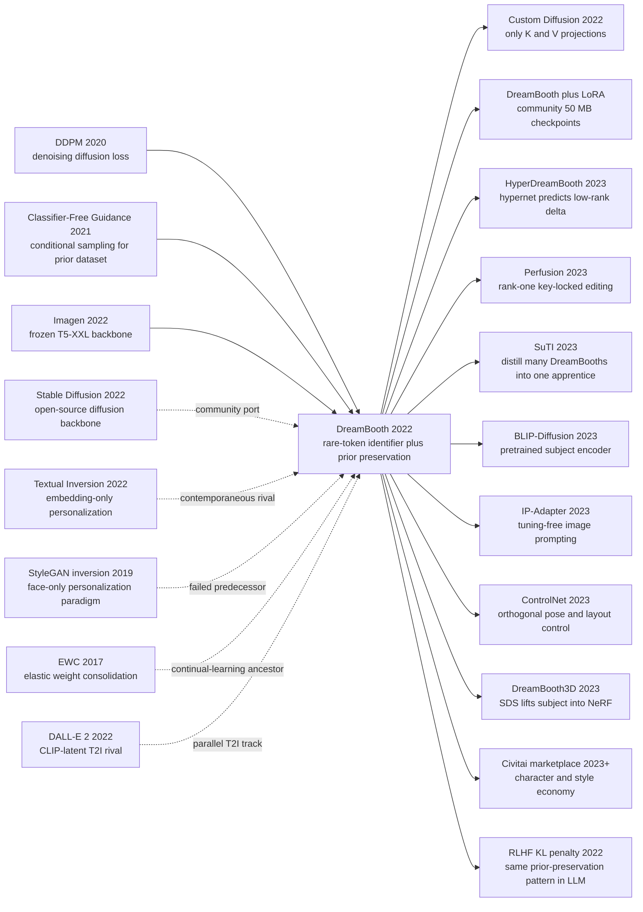

# DreamBooth — 用 3-5 张照片把任意主体「植入」文生图模型

> **2022 年 8 月 25 日，Google Research 与 Boston University 的 Ruiz、Li、Jampani、Pritch、Rubinstein、Aberman 等 6 位作者在 arXiv 上传 [2208.12242](https://arxiv.org/abs/2208.12242)，2023 年获 CVPR 2023 Best Paper Honorable Mention。** 论文给出一个看似不可能的承诺：拍 **3-5 张你家狗的照片，再给它一个稀有 token 名字 `[V]`，5 分钟内让 Imagen 在「中世纪油画」「月球表面」「博物馆陈列柜」里画出**同一只狗。它的反直觉发现是：要让大模型「记住」一个新主体，不能只学一个 embedding（这是同期 [Textual Inversion](https://arxiv.org/abs/2208.01618) 走的路、丢身份），也不能简单全参微调（会触发 language drift 把整个类别词都坍塌成你的狗）—— 必须一边喂 `[V] dog` 的图，一边强制模型继续生成由它自己产出的 `a dog` 先验图，靠 **prior-preservation loss** 把「类别先验」与「个体身份」分开。论文发布 6 周内开源社区把它移植到 Stable Diffusion 上，配合 LoRA 把 checkpoint 砍到 50 MB，**直接催生了 Civitai/HuggingFace 上数十万角色与风格 LoRA**，也同步引爆了肖像权、深度伪造、公众人物形象训练数据合规等持续至今的法律与伦理争议。

## 一句话总结

Ruiz、Li、Jampani、Pritch、Rubinstein、Aberman 等 6 位作者 2022 年 8 月在 Google Research 与 Boston University 完成的 DreamBooth，把「个性化文生图」从只学一个 text embedding（[Textual Inversion 2022](https://arxiv.org/abs/2208.01618)）升级为**全 UNet 微调 + 双损失**：3-5 张主体图配一个稀有 token `[V]`（论文用 `sks`）当唯一名字，模型自动生成 ~200 张 `a [class]` 图作为 class-prior 数据集，训练时同时优化主体重建项和 prior-preservation 项 $L = \mathbb{E}\|\epsilon - \epsilon_\theta(x_t, [V]\,\text{class})\|_2^2 + \lambda\,\mathbb{E}\|\epsilon - \epsilon_\theta(x_{t'}^{pr}, \text{class})\|_2^2$，~1000 步 / 5 分钟把 Imagen 微调成「认识你这只狗」。它击败的是 2022 年所有「不更新生成器」的妥协方案：DreamBench 30 主体上 Textual Inversion DINO 0.569 vs DreamBooth 0.696、CLIP-T 0.255 vs 0.305，而朴素全参微调会触发 language drift 把 `a dog` 直接坍塌成你的狗。反直觉 lesson 是：**让大模型记住一个新概念，最难的不是教它新东西，而是阻止它忘掉旧东西** —— 这个 prior-preservation 思想后来在 Custom Diffusion、HyperDreamBooth、Perfusion 中反复复现，配合 LoRA 把 checkpoint 砍到 50 MB，直接催生了 Civitai 上数十万角色 / 风格模型的 AIGC 经济。

---

## 历史背景

### 2022 年的文生图学界在卡什么

要理解 DreamBooth 为什么是「奇袭」式的论文，必须把时间倒回 2022 年 8 月那个文生图刚刚被解封、但所有人还不知道下一个杀手用法在哪里的瞬间。

2022 年上半年，文生图刚刚完成从「玩具」到「基础模型」的跳变。OpenAI 4 月发布 [DALL-E 2](https://arxiv.org/abs/2204.06125)（CLIP-latent prior + diffusion decoder），Google Brain 5 月发布 Imagen（冻结 T5-XXL + 像素级联扩散），Parti 6 月发布，LDM/Stable Diffusion 论文（Rombach 等）2021 年 12 月已挂 arXiv，权重直到 2022 年 8 月 22 日才以 OpenRAIL-M 协议公开。短短三个月，全世界第一次看见模型可以画出「一只戴墨镜的柯基坐在月球表面，背景是地球」这种从未被任何人拍摄过的图像。

但这一波模型有一个硬的天花板：**它们只认识「类别」，不认识「个体」**。你可以让 Imagen 画 `a corgi`，但你无法让它画**你那只**叫 Mochi 的柯基；DALL-E 2 没有任何机制让 prompt 指代你家具体的某把椅子；Stable Diffusion 即使开源，把 prompt 改成 `a photo of my dog Mochi` 模型也只会忽略 `Mochi` 这个 token、生成一只随机柯基。这个差距听起来抽象，但它直接卡死了所有把文生图变成产品的方向：

- **AI 头像 / 写真**：用户不会满足于「随机帅哥」，他们要把自己脸贴上去
- **个性化角色 / IP**：动漫工作室要训练自家角色，不是「随机蓝头发女孩」
- **电商商品**：客户要看自家球鞋在不同场景的渲染图，不是泛化球鞋
- **科研 / 医疗**：放射科医生要把自己病人的影像投到不同条件，不是「肺部 CT 通用图」

| 痛点 | 当时主流方案 | 为什么不够 | DreamBooth 想做什么 |
|---|---|---|---|
| 把「我的主体」植入 T2I | 文本描述 + 多张图重新训练全模型 | 几十 GB 数据、几千 GPU·hour、还会忘 prior | 3-5 张图 + 5 分钟微调 |
| 维持类别先验 | 没人系统讨论过这个问题 | 朴素微调直接把类别词坍塌 | prior-preservation loss |
| 主体重组到新场景 | GAN inversion 只能换光照 / 表情 | StyleGAN 只懂人脸，不懂任意物体 | 任意类别都能 recontextualize |
| 评测协议 | 凭眼睛看 | 没有标准 benchmark | DreamBench (25 主体 × 25 prompt) |

### 直接逼出 DreamBooth 的 5 篇前序

- **Saharia 等 14 位作者 2022 (Imagen)** [arxiv/2205.11487](https://arxiv.org/abs/2205.11487)：DreamBooth 在论文里直接微调的对象。Imagen 的级联扩散 + 冻结 T5-XXL 给出了**强到不可思议**的类别先验 —— 这正是 prior-preservation loss 能起作用的物质前提：如果模型本身画 `a dog` 就很糟，prior 也没什么好「保护」的。Imagen 是 DreamBooth 的 backbone，二者同年同实验室、同时获得 CVPR 2023 的承认。
- **Ho、Jain、Abbeel 2020 (DDPM)** [arxiv/2006.11239](https://arxiv.org/abs/2006.11239)：DreamBooth 两个 loss 项的内核都是 DDPM 的 squared-error denoising 目标。论文 §3 几乎是把 DDPM 的训练循环改造成「subject + prior 双批次交替」。
- **Ho、Salimans 2021 (Classifier-Free Guidance)** [arxiv/2207.12598](https://arxiv.org/abs/2207.12598)：DreamBooth 用 CFG 来生成 class-prior 数据集（让冻结模型自己产出 ~200 张 `a dog` 图），也用 CFG 在推理时把微调后的 `[V] dog` 推到高保真度。没有 CFG，prior-preservation 这个想法在工程上根本实现不了。
- **Gal 等 7 位作者 2022 (Textual Inversion)** [arxiv/2208.01618](https://arxiv.org/abs/2208.01618)：DreamBooth 的同期对手，2022 年 8 月 2 日比 DreamBooth 早 23 天挂 arXiv。它走的是「冻结所有权重，只优化一个新的 token embedding $S^*$」的极简路线，证明 personalization 在数学上可以只动 768 维。DreamBooth 的诞生几乎可以读成一句反驳：「只动 768 维不够，必须更新整个 UNet —— 但要保护 prior」。
- **Karras、Laine、Aila 2019 (StyleGAN) + GAN inversion 系列** [arxiv/1812.04948](https://arxiv.org/abs/1812.04948) / [Xia 等 2022 GAN Inversion Survey](https://arxiv.org/abs/2101.05278)：DreamBooth 之前的 personalization 几乎全在 StyleGAN W/W+ 空间里做 inversion，工程上只对 FFHQ 训练过的人脸有效。DreamBooth 把 personalization 从「人脸专属」扩展到「任意类别」，这件事本身就是一个 paradigm shift。

### 作者团队当时在做什么

DreamBooth 的 6 位作者横跨两个 Google Research 团队和一所大学。Nataniel Ruiz 当时是 Boston University 博士生 + Google Research 实习生，研究方向是 face manipulation 和 generative models。Yuanzhen Li、Varun Jampani、Yael Pritch、Michael Rubinstein 都来自 Google Research 同一个 perception/computational photography 圈子，长期做 image stylization、relighting、reenactment。Kfir Aberman 之前在 Google Research / 北京大学合作过 motion retargeting 方向。

这个组合的关键点是：**他们不是 diffusion 圈出身**。Imagen 团队（Saharia、Ho、Salimans 等）是 generative modeling 学派，把扩散当作概率建模问题；Ruiz / Aberman 团队则是 image-based rendering / face & avatar 学派，把生成模型当作「一个可被操纵的渲染管线」。这个视角差异直接决定了 DreamBooth 的问题陈述：他们关心的不是「让 Imagen FID 更低」，而是「能不能给定 3 张照片，把这只柯基换到月球」。这种视角组合在 2022 年极其稀缺 —— 大多数同期论文要么只关心模型本身（GAN/diffusion 阵营），要么只关心 face avatar（图形学阵营），DreamBooth 是横跨两个圈子的一次「问对了问题」。

### 工业界 / 算力 / 数据 / 法规的状态

- **算力**：DreamBooth 在 Imagen 上微调用了 1000 步、batch=1，单卡 TPUv4 5 分钟。论文同时给出 Stable Diffusion 1.4 的设置：单张 NVIDIA A100 40GB、~2.5 hours，但社区在论文出来 2 周内就压到 12 GB 消费级 GPU 上跑通
- **模型**：Imagen / DALL-E 2 完全闭源，研究者只能在 paper 里看图；Stable Diffusion 1.4 在论文出来 3 天后（2022 年 8 月 22 日）才开源。DreamBooth 在论文中只用 Imagen 做 quantitative 实验，但**正是因为 SD 1.4 同时开源，DreamBooth 才有了几乎所有真实世界影响**
- **数据**：作者贡献了 DreamBench —— 30 个主体（21 件物品 + 9 只动物 / 宠物） × 25 个 prompt 模板（recontextualization, accessorization, property modification, art rendition, viewpoint synthesis），共 750 个评测 prompt，外加每个主体 4 张训练图。这是文生图 personalization 第一个标准 benchmark
- **法规**：2022 年 8 月正是欧美开始讨论 AI 训练数据合规、肖像权的关键时刻。DreamBooth 论文在结尾的 "Societal Impact" 章节明确写了 deepfake 风险，但当时没人能预料 6 个月后 LoRA 角色市场会让这个问题成为日常话题
- **行业气氛**：从 8 月 22 日 SD 开源到 8 月 25 日 DreamBooth 上传，3 天内整个开源 AIGC 圈进入「我们终于可以自己玩」的狂欢期。DreamBooth 是这股狂欢的第一个杀手级用法 —— 因为它直接回答了「我能用 SD 干什么我用不了 OpenAI 干的事」这个最现实的问题

---

## 方法详解

DreamBooth 的方法表面上极其朴素 —— 一个 rare token 加两项 loss —— 但每一个细节背后都对应着一个被作者 ablation 否定掉的诱人捷径。读懂方法的关键，是同时记住「它做了什么」和「它**没**做什么」。

### 整体框架

DreamBooth 的训练 pipeline 可以压成一条直线：

```
Phase 0 (offline, ~30 s):
    用冻结的预训练模型 + class prompt "a [class]"，CFG 采样 ~200 张图 → x_pr 数据集

Phase 1 (online, ~5 min, ~1000 steps):
    每个 batch 从两边采样并加噪：
      subject batch:    x ← user 的 3-5 张照片
                        prompt = "a [V] [class]"           # [V] 是稀有 token
      prior batch:      x_pr ← Phase 0 的 ~200 张
                        prompt = "a [class]"
    UNet (+ text encoder) 同时反传两批的 squared-error 噪声损失

Phase 2 (inference, 任意 prompt):
    "a [V] [class] swimming in lava"  → 模型既保留 [class] 先验，
                                         又能稳定渲染 [V] 这个具体主体
```

| 阶段 | 输入 | 输出 | 关键参数 |
|---|---|---|---|
| Class-prior 生成 | class name + frozen model | ~200 张 `a [class]` 图 | CFG scale ≈ 7-10 |
| Fine-tune | 3-5 张 subject + 200 张 prior | adapted UNet (+ text encoder) | lr 5e-6 (Imagen), 1e-6 (SD), 1000 steps |
| 推理 | 任意 `a [V] [class] ...` prompt | 主体 × 新场景 | CFG ≈ 7.5 |

注意三件事：(1) text encoder 在 Imagen 实验里**也被微调**（论文 §B.2 报告这给了 ~3 个百分点的 DINO 提升），但在后来 SD 实践中常常只调 UNet 以省显存；(2) 训练 batch 实际上是「subject + prior」两条流并行，不是顺序；(3) 整套配方对 hyperparameter 异常鲁棒 —— learning rate 在 1e-6 到 5e-6 之间都能收敛，subject 数量 3-5 张都行，prior 数量 100-300 张都行。这种鲁棒性是 prior-preservation 而非任何调参技巧带来的。

⚠️ **反直觉重点**：DreamBooth 的核心价值不在「让模型学会一个新概念」（朴素全参微调早就能做到），而在「**让模型在学会新概念的同时不忘掉旧概念**」。论文的整套 design space 都围绕这第二点展开。

### 关键设计 1：稀有 token 标识符 `[V]` —— 不要让模型「站在已有名字旁边」

**功能**：用一个**模型几乎没在训练中见过**的 token 当主体名字，避免微调与已有强语义绑定冲突。论文里实际用的是 `sks`（Imagen tokenizer 中频率极低的 3 个字符），社区后来沿用为事实标准。

**为什么不能用一个常见英文词**：

| 候选 token | 训练时模型见过它吗 | 失败模式 |
|---|---|---|
| `unique` / `special` | 高频出现 | 微调时模型必须先「擦除」原义 → 收敛慢、prior 漂移大 |
| `mochi` / `bella`（用户狗的真名） | 中低频，但有真实人/宠物分布 | 残留先验把生成偏向「叫这个名字的群体」 |
| 随机字符串 `xyz123` | 被 BPE 切成 `xyz` + `123` | 多 token、行为不稳定 |
| **`sks`** | **稀有（< 0.001%）且 BPE 单 token** | **几乎是「白纸」嵌入，被微调直接占据** |

**核心思路**：理想的 identifier embedding $e([V])$ 在预训练模型的语义空间里应该是一个**几乎没有先验质量**的点 —— 这样微调期间它的梯度可以无阻力地把它推到「目标主体」的方向，而不会先花一半步数把原有语义擦掉。论文 §4.1 用 EnglishDictionary baseline（用真实英文词当 identifier）做对比，DINO 主体相似度从 0.696 掉到 0.585，CLIP-T 文本对齐从 0.305 掉到 0.272 —— 一个 token 的选择就值 11 个百分点。

```python
# 如何为新主体挑 identifier（社区习惯）
def pick_identifier(tokenizer, target_token_freq=1e-5):
    """返回 BPE 单 token 且训练频率极低的 token，例如 'sks'。"""
    candidates = [t for t in tokenizer.vocab
                  if len(tokenizer.encode(t)) == 1
                  and tokenizer.frequency(t) < target_token_freq]
    return candidates[0]   # 论文用 'sks'；社区也常用 'ohwx', 'zwx'
```

**设计动机**：作者发现 personalization 的失败往往**不是模型学不会新概念，而是新旧概念互相干扰**。把 identifier 选成预训练空间里的「真空点」，相当于给主体一个独立 namespace，把这种干扰从根上削掉。这一招后来在 [Custom Diffusion](https://arxiv.org/abs/2212.04488)、HyperDreamBooth、Perfusion 几乎所有 personalization 工作中被原封照搬。

### 关键设计 2：Prior-Preservation Loss —— 让模型自己监督自己

**功能**：在主体重建项之外加一个**让模型继续生成它原本会生成的 `a [class]` 图**的损失，防止 fine-tune 把整个类别词都坍塌成用户主体（论文称这种现象为 *language drift* 和 *reduced output diversity*）。

**核心公式**：

$$
\mathcal{L}_\text{DB}=\underbrace{\mathbb{E}_{x,c,\epsilon,t}\left[w_t\bigl\|\epsilon-\epsilon_\theta(\alpha_t x+\sigma_t\epsilon,\,c)\bigr\|_2^2\right]}_{\text{subject reconstruction (3-5 photos)}}+\lambda\underbrace{\mathbb{E}_{x_{pr},c_{pr},\epsilon',t'}\left[w_{t'}\bigl\|\epsilon'-\epsilon_\theta(\alpha_{t'}x_{pr}+\sigma_{t'}\epsilon',\,c_{pr})\bigr\|_2^2\right]}_{\text{prior preservation (~200 self-generated images)}}
$$

其中：
- $c=$ tokenize(`a [V] [class]`)，$x$ 是用户的 3-5 张主体图
- $c_{pr}=$ tokenize(`a [class]`)，$x_{pr}$ 是冻结模型用 $c_{pr}$ 自己采样出来的 ~200 张图
- $\lambda=1$ 是默认权重，论文 §B.2 报告 $\lambda \in [0.5, 2]$ 都几乎不影响结果
- 两项**共享同一个 UNet $\epsilon_\theta$**，意思是同一组权重必须同时满足「记住 [V] dog」和「不忘 a dog」两个约束

**对比表**：

| 方案 | 是否更新 UNet | 是否有 prior 项 | DINO 主体相似度 ↑ | CLIP-T 文本对齐 ↑ | 失败模式 |
|---|---|---|---|---|---|
| Frozen Real-Image Generation | 否 | — | 0.774 (上限) | 0.355 (上限) | 不算 personalization，只是检索 |
| Textual Inversion (only embedding) | 否 | 隐式（不更新） | 0.569 | 0.255 | 身份保真度弱 |
| 朴素全参微调 (no prior) | 是 | 否 | ≈0.70 | 0.239 | language drift / overfitting |
| **DreamBooth (Imagen)** | **是** | **是** | **0.696** | **0.305** | **prior 与 identity 平衡** |

**反直觉关键**：⚠️ **prior batch 的图不是真实数据集，而是预训练模型自己采样出来的图**。这意味着 prior 项的"监督信号"完全来自模型自身的初始分布；它不在教模型新东西，只在让模型「记住自己原来会做什么」。这是 self-distillation 的一种早期具象，在 personalization 出现之前几乎没人这么用。

```python
# 训练循环（PyTorch / Diffusers 风格）
def dreambooth_step(unet, text_encoder, scheduler,
                    subject_imgs, subject_prompt,    # 3-5 张 + "a [V] dog"
                    prior_imgs,   prior_prompt,      # ~200 张 + "a dog"
                    optimizer, lambda_pr=1.0):
    imgs   = torch.cat([subject_imgs, prior_imgs], dim=0)
    prompts = subject_prompt + prior_prompt
    noise  = torch.randn_like(imgs)
    t      = torch.randint(0, scheduler.num_train_timesteps, (imgs.size(0),))
    noisy  = scheduler.add_noise(imgs, noise, t)

    text_emb = text_encoder(prompts)
    pred     = unet(noisy, t, encoder_hidden_states=text_emb).sample

    # split predictions back into the two streams
    pred_sub, pred_pr   = pred[:len(subject_imgs)], pred[len(subject_imgs):]
    noise_sub, noise_pr = noise[:len(subject_imgs)], noise[len(subject_imgs):]

    loss_subject = F.mse_loss(pred_sub, noise_sub)
    loss_prior   = F.mse_loss(pred_pr,  noise_pr)
    loss = loss_subject + lambda_pr * loss_prior      # 关键：双项相加
    loss.backward(); optimizer.step(); optimizer.zero_grad()
    return loss_subject.item(), loss_prior.item()
```

**设计动机**：作者在论文 §4.1 报告，移除 prior-preservation 后 DINO 主体相似度小幅上升但 CLIP-T 文本对齐**直接从 0.305 跌到 0.239**，并且生成的 `a dog` 图样本多样性显著下降 —— 模型不再画其他狗，只画用户那只。这证明 prior 项不是可有可无的正则化，而是 **personalization 与「在 fine-tune 中不破坏基础模型」之间的实质 trade-off 控制器**。

### 关键设计 3：全 UNet 微调 vs 只学 embedding —— 容量的不对等

**功能**：与 Textual Inversion 同期工作的核心分歧 —— DreamBooth 选择更新整个 UNet 数亿参数，而 Textual Inversion 只学一个 768 维 token embedding。

**对比表（DreamBench 30 主体平均）**：

| 方法 | 可训参数 | DINO ↑ | CLIP-I ↑ | CLIP-T ↑ | 训练时间 |
|---|---|---|---|---|---|
| Textual Inversion (Stable Diffusion) | ~768 | 0.569 | 0.780 | 0.255 | ~30 min / 主体 |
| DreamBooth (Stable Diffusion) | ~860M (UNet) | 0.668 | 0.803 | 0.305 | ~5 min / 主体 (TPU) |
| DreamBooth (Imagen) | ~2B (UNet + T5 部分) | **0.696** | **0.812** | **0.305** | ~5 min / 主体 (TPU) |

**核心思路**：personalization 需要的「容量」其实分两种 —— 一种是表示新概念的语义容量（一个 embedding 就够），一种是把这个新概念以**像素级别**渲染到任意 pose / lighting / context 的视觉合成容量（必须修改 UNet）。Textual Inversion 只解决了第一种；DreamBooth 论文 §4.1 的 ablation 直接显示，给 Textual Inversion 加 prior-preservation 也救不了 —— 主体相似度的天花板就在那里。

**反直觉关键**：⚠️ 全参微调通常被视为「灾难性遗忘」的同义词，但在 prior-preservation 配套下，**全参微调反而比只更新 embedding 的方法更稳** —— 因为 prior 损失主动把 UNet 的大部分容量「锚」回原来的分布，可塑性只发生在被 [V] token 触发的局部子空间。这个组合违反了 2022 年的常识。

**设计动机**：作者明确把 Textual Inversion 作为对照（论文 Table 1, Figure 7）。结果显示「只动 embedding」在主体可识别度上有刚性上限：再怎么训也突破不了 ~0.57 DINO。原因物理：embedding 只能改变 cross-attention 的 query 方向，但不能改变 UNet 输出空间里「与该方向最近的那个流形」长什么样。要让模型画**这只**狗的鼻子形状，必须动决定纹理 / 形状的卷积权重。

### 关键设计 4：Class-prior 数据集由模型自己生成 —— 工程上的「免费午餐」

**功能**：prior batch 的 ~200 张 `a [class]` 图既不是手工收集，也不是从 LAION 检索，而是用**未微调的同一个模型** + class prompt + CFG 采样得到。整个 personalization 流水线因此可以在用户只上传 3-5 张主体图的情况下闭环。

**对比表**：

| Prior 来源 | 是否需要外部数据 | 是否可能引入分布漂移 | 工程复杂度 |
|---|---|---|---|
| 真实 ImageNet / LAION 子集 | 是 | 风格 / 时代分布与预训练不一致 | 高（需要类别匹配） |
| 用户额外上传 | 是 | 主体类别覆盖不全 | 高（用户体验差） |
| 用 GAN / 检索生成 | 是 | 与 diffusion 分布不一致 | 中 |
| **冻结模型 self-sample** | **否** | **完全在原分布内** | **低（自动化）** |

**核心思路**：prior 项要保护的是**模型的原始分布**，那么用模型自己采样出来的图作为 prior 数据，等于给模型看一面「镜子」—— 镜子里的图就是模型自己「认为正确」的样子。这种 self-distillation 风格的监督几乎不可能引入新的分布漂移；它只把模型已经知道的事情**重新告诉它**。

```python
# Phase 0: 自动构造 class-prior 数据集
@torch.no_grad()
def build_class_prior(model, class_name, n=200, cfg_scale=7.5):
    """frozen model 自己产 prior 图，0 外部数据"""
    prompts = [f"a {class_name}"] * n
    imgs = model.sample(prompts, guidance_scale=cfg_scale)
    return imgs        # 这就是 prior batch 的全部数据
```

**设计动机**：在 2022 年，「pseudo-label / self-distillation」在 SSL 圈已经成熟，但在生成模型 fine-tune 中尚未成为标准实践。DreamBooth 的这一选择把 personalization 从「需要为每个新主体挑 prior 数据集」的工程负担，简化为「点一个按钮，模型自己产 prior」。这种**使用门槛降低 1-2 个数量级**的好处，是 DreamBooth 能在论文出来 6 周内被开源社区抓住、并演化出 Civitai 经济的根本原因。

### 损失函数 / 训练策略

| 设置 | Imagen (论文) | Stable Diffusion 1.4 (社区标准) | 备注 |
|---|---|---|---|
| Loss | $\mathcal{L}_\text{DB}$ (subject + prior, $\lambda=1$) | 同 | 完全一致 |
| Optimizer | Adam | AdamW | 都行 |
| Learning rate | $5\times10^{-6}$ | $1\times10^{-6}$ ~ $2\times10^{-6}$ | SD 更敏感 |
| Steps | 1000 | 800 ~ 1500 | 主体复杂度有关 |
| Subject batch size | 1 | 1 | 显存友好 |
| Prior batch size | 1 | 1 | 与 subject 同时 |
| Prior 数据量 | 200 | 200-500 | 多了反而稀释 |
| CFG scale (推理) | 7.5 | 7.5 | 标准 SD 默认 |
| Text encoder fine-tune | 是 | 可选（SDXL 默认不调） | 调了 +3 DINO 但 +VRAM |

**注意 1**：DreamBooth 对超参的鲁棒性来自 prior 项 —— 没有 prior 项，learning rate 偏离 $5\times10^{-6}$ 一个数量级就会过拟合或 underfit；有了 prior 项，整个工作区被显著放宽。

**注意 2**：训练步数不是越多越好。论文 §4.4 报告主体 DINO 在 ~600 步达到峰值，再多步反而开始 overfit 到具体训练角度 / 光照。社区经验是 800-1200 步、用最后 4-5 个 checkpoint 做人工挑选。

**注意 3**：DreamBooth + LoRA 的组合（社区版）只对 UNet 的 cross-attention K/V 投影插 rank-4 LoRA，可训参数从 ~860M 降到 ~5M，单 checkpoint 体积从 4 GB 降到 ~50 MB，**这是 Civitai 经济能形成的物质基础**。原 DreamBooth 论文没提 LoRA，但二者的组合实际定义了 2023 年之后所有 personalization 工作的工程模板。

---

## 失败案例

DreamBooth 的有意思之处在于：它击败的对手**不是某一篇论文**，而是 2022 年「不更新生成器」哲学下的一整族妥协方案。每一个失败案例都对应着一个看起来更省力的捷径。

### 当时输给 DreamBooth 的对手

DreamBench (30 主体 × 25 prompt 模板) 上的对照如下表（数字均来自论文 §4 Table 1）：

| Baseline | 是否更新 UNet | 训练参数 | DINO ↑ | CLIP-I ↑ | CLIP-T ↑ | 输给 DreamBooth 的根本原因 |
|---|---|---|---|---|---|---|
| Real images (frozen retrieval) | 否 | 0 | 0.774 | 0.885 | 0.355 | 不是 personalization，只是 ground truth 上界 |
| Textual Inversion (Imagen) | 否 | ~768 (1 个 embedding) | 0.586 | 0.789 | 0.260 | 容量不够，主体身份被 cross-attention 信道压扁 |
| Textual Inversion (Stable Diffusion) | 否 | ~768 | 0.569 | 0.780 | 0.255 | 同上 |
| **DreamBooth (Stable Diffusion)** | **是** | **~860M** | **0.668** | **0.803** | **0.305** | — |
| **DreamBooth (Imagen)** | **是** | **~2B** | **0.696** | **0.812** | **0.305** | — |

**Textual Inversion** 是最直接的对手 —— 由 NVIDIA / Tel Aviv 的 Gal 等 7 位作者 2022 年 8 月 2 日上传，比 DreamBooth 早 23 天。它的设计哲学是：T2I 模型已经在 LAION-5B 上学过几乎所有概念，「学一个新主体」应该等价于「在 cross-attention 的输入空间里找到一个新方向」—— 因此只需优化一个 768 维 embedding $S^*$ 就够。这条路的最大优势是工程极简（30 KB checkpoint）和 zero-shot 部署，但 DreamBench 给出的判决很残酷：DINO 主体相似度 0.569 vs DreamBooth 0.668-0.696，差距约 10-13 个百分点。原因是 cross-attention query 方向能改变 UNet「关注哪里」，但不能改变 UNet「在那里渲染什么」—— 主体的鼻子形状是被卷积权重决定的，不是被 attention 决定的。

**GAN inversion 系列**（StyleGAN W / W+ / P 空间 + e4e / pSp / HFGI 等 encoder）是 2017-2022 年事实上的 personalization 主流方案。它们能让你把自己脸 invert 到 StyleGAN W+ 空间然后做表情 / 光照 / 年龄编辑，FFHQ 上人脸保真度极高。但 DreamBooth 用一句话就把它们驱逐出局：**它们只对训练数据相同分布的物体有效**，而 StyleGAN 训练数据基本只有 FFHQ 人脸 / Cat / Car / Church 几个 domain。要把你家狗 invert 到 StyleGAN-Cat 完全没意义；要 recontextualize 到「中世纪油画」更是不可能 —— GAN inversion 的语义编辑必须在 GAN 自身已经学到的方向里做，而 GAN 没学过文本。

**朴素全参微调（无 prior 项）** 是消融里最重要的对照。论文 §4.4 报告，把 DreamBooth 的 prior loss 拿掉后：DINO 主体相似度小幅上升（更过拟合主体），但 **CLIP-T 文本对齐从 0.305 暴跌到 0.239**，并且 `a [class]` 的生成多样性显著下降 —— 模型不再画其他狗，只画用户那只。这就是 *language drift*：`dog` 这个词的整个语义被局部地坍塌成训练图。

### 论文里承认的失败实验

DreamBooth 论文比许多 personalization 工作更诚实，§5 列出了三类**自曝其短**的失败模式，每一类都成了后续研究的起点：

1. **不正确的上下文合成（incorrect context synthesis）**：当训练图全是「狗在草地上」时，模型在生成「狗在月球」时会顽固带回草地纹理。论文坦白这种「场景-主体」纠缠不能完全靠 prior loss 解开 —— 训练图的拍摄环境会被 UNet 当成主体的一部分一起记忆。
2. **上下文-外观纠缠（context-appearance entanglement）**：rare prompt（如「狗戴僧侣帽」）下，模型可能把帽子的颜色错配给狗的毛色，或者反过来把狗的纹理转嫁给帽子。这是 cross-attention 在主体 token 与场景 token 之间「越界」的典型症状。
3. **过拟合到训练角度 / 光照（overfitting）**：步数过多时 (>1500) 模型只能稳定生成训练角度，新视角生成会塌缩到训练姿态。论文给出的应对是「步数控制 + checkpoint 选择」，但承认这是配方而非根治。

此外 §B 附录还报告了几个**故意没用**的设计：联合 prior 与 subject 在同一 batch（实际用了，但不在主 algorithm box 中强调）、$\lambda$ 的精细 grid search（结果与 1.0 几乎相同因此放弃）、不同 noise level 上加权 prior（无显著改善）。这些「试过但没赢」的实验反而帮后来人省下了重复劳动。

### 2022 年的反例：Textual Inversion 的「以小博大」尝试

Textual Inversion 比 DreamBooth 早 23 天上传，几乎是同一个问题、相反的解法。它的论点与 DreamBooth 形成了 personalization 历史上最干净的二元对立：

| 维度 | Textual Inversion | DreamBooth |
|---|---|---|
| 哲学 | 模型已经会一切，找方向就行 | 模型需要被加新东西，但不能忘旧东西 |
| 可训参数 | ~768 (1 个 embedding) | ~860M (整个 UNet) |
| Checkpoint 大小 | ~30 KB | ~4 GB（LoRA 后 ~50 MB） |
| 主体保真度 (DINO) | 0.569 | 0.696 |
| 文本对齐 (CLIP-T) | 0.255 | 0.305 |
| 训练时间 | ~30 min | ~5 min (TPU) |
| 是否需要 prior 数据 | 否 | 是（自动生成） |

Textual Inversion 不是「错」的 —— 在某些极轻量场景（30 KB checkpoint 在边缘设备）下它仍是更好的选择。但 DreamBench 数字让选择变得清晰：**当你愿意付几 GB checkpoint 的代价，主体相似度就能从「能看出像」升级到「明显是这只」**。后续工作几乎都站在 DreamBooth 这边、然后用 LoRA / Custom Diffusion / Perfusion 等手段把 checkpoint 大小重新压回 KB-MB 量级 —— 这本质上是**接受 DreamBooth 的诊断（embedding 不够），但改良 DreamBooth 的处方（不要全 UNet）**。

### 真正的反 baseline 教训

DreamBooth 的故事提炼出一条几乎适用于所有「让大模型学新东西」任务的工程哲学：

**「让模型学新东西」与「让模型不忘旧东西」是两个独立的优化目标，必须用两个独立的损失项来管理。**

这条 lesson 在 LLM 微调上同样成立 —— RLHF 里的 KL penalty (`β · KL(π || π_ref)`)、continual learning 里的 EWC、knowledge distillation 里的 teacher term，全部都是「prior preservation」在不同领域的化身。DreamBooth 是这条 lesson 在生成模型领域的第一次干净示范。

更重要的是 DreamBooth 同时给出了**自动构造 prior 数据的工程方案** —— self-sampling。这把 prior preservation 从「需要外部数据」的高门槛技术，降级成「不需要任何数据，只需要冻结模型」的标准操作。这种「让方法自带原料」的工程美学，是 DreamBooth 能引爆开源社区的真正原因，比任何具体公式都重要。

---

## 实验关键数据

DreamBench 是 DreamBooth 论文交付的另一个 lasting contribution，比 method 本身更被后续工作引用。

### 主实验：DreamBench 30 主体 × 25 prompt

DreamBench 包含：
- **30 个主体**：21 件物品（背包、玩具、闹钟、瓶子、毛绒玩具等）+ 9 只动物 / 宠物（狗、猫等）
- **25 个 prompt 模板**：分 5 组，每组 5 个，对应 5 种典型 personalization 用法
  1. **Recontextualization**：`a [V] [class] in the jungle / on the moon / on a city street ...`
  2. **Accessorization**：`a [V] [class] wearing a Santa hat / sunglasses / chef's hat ...`
  3. **Property modification**：`a green / red / cube-shaped [V] [class] ...`
  4. **Art rendition**：`a painting / sketch / sculpture of [V] [class] in the style of Van Gogh ...`
  5. **Viewpoint synthesis**：`a top view / side view / back view of [V] [class] ...`
- **每主体 4 张训练图**

主结果（论文 Table 1，更高更好）：

| 方法 | 模型 | DINO ↑ | CLIP-I ↑ | CLIP-T ↑ |
|---|---|---|---|---|
| Real images（上界） | — | 0.774 | 0.885 | 0.355 |
| Textual Inversion | Imagen | 0.586 | 0.789 | 0.260 |
| Textual Inversion | SD 1.4 | 0.569 | 0.780 | 0.255 |
| **DreamBooth** | **SD 1.4** | **0.668** | **0.803** | **0.305** |
| **DreamBooth** | **Imagen** | **0.696** | **0.812** | **0.305** |

读这张表的关键是三件事：(1) DreamBooth 对 Textual Inversion 的优势 **同时存在于 Imagen 和 Stable Diffusion 上**，说明这是方法层面的优势，不是某个 backbone 的特权；(2) 3 个指标各管一头 —— DINO 测主体，CLIP-I 测视觉相似度，CLIP-T 测文本-图像对齐；DreamBooth 在所有 3 个指标上都赢，说明它没有以牺牲一个指标来刷另一个；(3) DreamBooth 在 CLIP-T 上比 Textual Inversion 高 5 个百分点 —— 这反直觉，因为「更激进的 fine-tune」按理应当**牺牲**文本对齐 ⚠️。它没牺牲，是因为 prior preservation 把 `[class]` 这个词的语义保住了，所以模型仍然听得懂 `wearing a Santa hat`。

### 消融：哪些组件真的关键

论文 §4.4 给出三组核心 ablation（DreamBench 子集，更高更好）：

| 配置 | DINO ↑ | CLIP-T ↑ | 结论 |
|---|---|---|---|
| Full DreamBooth | 0.696 | 0.305 | 完整 baseline |
| − Prior preservation | ~0.71 | 0.239 | language drift；CLIP-T 暴跌 |
| − Class noun（identifier 只用 `[V]`） | 0.682 | 0.245 | 失去 prior 锚点，文本对齐弱化 |
| Identifier = English dictionary word | 0.585 | 0.272 | rare token 选择本身值 ~11 DINO 点 |
| Subject 数从 4 → 1 | 0.62 | 0.30 | 1 张图也行，但弱 7 个点 |
| Steps 从 1000 → 200 | 0.61 | 0.31 | 欠拟合 |
| Steps 从 1000 → 3000 | 0.71 | 0.27 | overfit；CLIP-T 下降 |

四个核心结论：(1) **prior preservation 不可省**（去掉直接 -7 CLIP-T 个点）；(2) **identifier 必须 rare**（English dictionary 替换 -11 DINO 个点）；(3) **class noun 必须保留**（`[V]` 后必须接 `dog`，否则 prior 锚点丢失）；(4) **3-5 张图是甜点**，1 张能做但弱，多了边际收益消失。这四条共同定义了一个非常窄的「设计可行域」—— DreamBooth 的整个论文几乎就是在告诉你：**这条窄路上的每一步都不能少**。

### 关键发现

1. **3-5 张图就够**：personalization 不需要数百张样本，预训练模型的 prior 把 sample efficiency 推到了人工标注几乎不可承受的稀疏度。这条发现后来被 [BLIP-Diffusion (2023)](https://arxiv.org/abs/2305.14720)、HyperDreamBooth 进一步推到「1 张图就够」。
2. **rare token 是几乎免费的 11 个百分点**：identifier 的选择影响巨大但工程成本几乎为零 —— 只要 BPE 切成单 token 且训练频率低即可。
3. **prior preservation 对 CLIP-T 的影响远大于对 DINO 的影响**：移除 prior 让 CLIP-T 暴跌 7 点而 DINO 反而微涨。这告诉后来人：**personalization 的真正难题不是「让模型记住主体」，而是「让模型在记住主体后仍听得懂自然语言 prompt」**。
4. **全 UNet fine-tune 在 prior 保护下不会灾难性遗忘**：这违反了 2022 年深度学习的常识，也是 DreamBooth 最反直觉的结论 ⚠️。
5. **Imagen > SD：text encoder 越强，personalization 越好**：DreamBooth 在 Imagen 上 DINO 0.696 vs SD 0.668 —— 这间接验证了 Imagen 关于「text encoder 决定上限」的判断，并提示了 [SDXL](https://stability.ai/sdxl) / [SD3](https://arxiv.org/abs/2403.03206) 应该走多 text encoder 路线（事实上后来确实走了）。
6. **DreamBench 三件套（DINO + CLIP-I + CLIP-T）成为事实标准**：2023 年之后几乎所有 personalization 论文都报告这三个指标。这是论文除 method 之外的另一项 lasting contribution。

---

## 思想史脉络



### 前世（被谁逼出来的）

DreamBooth 的前史有两条交叉的脉络。

**生成模型的两条扩散预备线**给出了它的工程基础。DDPM 2020 提供了 squared-error denoising 损失，DreamBooth 的两个 loss 项内核完全继承自此；[Classifier-Free Guidance 2021](https://arxiv.org/abs/2207.12598) 让 prior batch 可以由模型自己采样产生，不需要任何外部数据。这两件事共同决定了 DreamBooth 的整套训练循环。再往上一层，**Imagen 2022** 提供了强到足以承受 prior preservation 的 backbone —— 没有 Imagen 这种已经把 `a dog` 画得极好的预训练模型，prior 项也没什么好「保留」的。

**personalization 的两条历史失败线**给出了它的问题陈述。一条是 **GAN inversion 路线**：从 [StyleGAN 2019](https://arxiv.org/abs/1812.04948) 开始，e4e / pSp / HFGI / PTI 等 encoder 不断改进，但这个家族始终只对 GAN 训练数据相同分布的物体（基本只有人脸）有效。另一条是 **continual learning 路线**：从 [EWC 2017](https://arxiv.org/abs/1612.00796) 起，整个 continual learning 圈用各种正则化项控制 fine-tune 不破坏旧任务 —— DreamBooth 的 prior preservation 在哲学上是 EWC 的远亲，只是把 "regularize toward old weights" 替换成了 "regularize toward old outputs"。把这两条线接上扩散模型，再叠上 [Textual Inversion 2022](https://arxiv.org/abs/2208.01618) 这个同期对手做反衬，DreamBooth 几乎是被 2022 年 8 月的研究气氛**精确逼出**来的。

### 今生（继承者与变体）

DreamBooth 的影响在 2022 年 9 月到 2024 年 5 月之间扩散得极快，可以分四类整理：

**直接派生（同 framework，更小 / 更精）**：
- **[Custom Diffusion 2022](https://arxiv.org/abs/2212.04488)**（Kumari 等 5 位作者）：把全 UNet 微调缩到只动 cross-attention 的 K/V 投影，可训参数减 100×，并把 multi-concept composition 加入论文。同一个 prior preservation 思想，参数足迹更小。
- **[HyperDreamBooth 2023](https://arxiv.org/abs/2307.06949)**（同 DreamBooth 作者团队）：用一个 HyperNetwork 从单张图直接预测 LoRA-rank weight delta，5 分钟训练压到 20 秒、3-5 张图压到 1 张。同团队最直接的「v2」。
- **[Perfusion 2023](https://arxiv.org/abs/2305.01644)**：rank-1 update，把 K projection 锁定在 class word 上、只改 V 方向，进一步把 update 规模压到极致。

**跨架构借用**：
- **DreamBooth + LoRA 组合**：原 DreamBooth 论文从未提 LoRA，但开源社区在 2022 年 10 月就把二者合并 —— 把 prior preservation + rare token 的训练循环，用 LoRA-rank UNet 更新代替全参更新。这个组合定义了 2023 年之后所有 SD personalization 的事实工程模板，也催生了 50 MB checkpoint 的 Civitai 经济。
- **RLHF 中的 KL penalty**：LLM 微调的 InstructGPT / RLHF 流水线中，policy 与参考 policy 的 KL penalty `β · KL(π || π_ref)` 起到几乎相同的功能 —— 让 fine-tune 不偏离基础模型分布。DreamBooth 是这个 prior-preservation 模式在生成模型领域的早期具象。

**跨任务渗透**：
- **[BLIP-Diffusion 2023](https://arxiv.org/abs/2305.14720)** 与 **[IP-Adapter 2023](https://arxiv.org/abs/2308.06721)**：用预训练 subject encoder 把 personalization 变成 zero-shot，不再需要 per-subject fine-tune。它们的存在反过来确认了 DreamBooth 的定位：**per-subject fine-tune 路径** 是 personalization 谱系的一端，encoder-based 路径是另一端。
- **[SuTI 2023](https://arxiv.org/abs/2304.00186)**：用上千个 DreamBooth fine-tune 的 expert 蒸馏出一个 in-context personalization 学徒模型 —— DreamBooth 在这里被当成「教师工厂」，而不是终端产品。
- **[ControlNet 2023](https://arxiv.org/abs/2302.05543)**：解决「谁画在哪个姿态」的正交问题；与 DreamBooth 在工作流里组合（DreamBooth 控「谁」，ControlNet 控「怎么摆」）。

**跨学科外溢**：
- **[DreamBooth3D 2023](https://arxiv.org/abs/2303.13508)**（同 DreamBooth 团队 + DreamFusion 团队联合）：把 DreamBooth 的 identifier 思想接到 DreamFusion / SDS pipeline 上，把单主体从 2D 图像 lift 到 3D NeRF。这是 DreamBooth 跨到 3D 计算机图形学的第一步。
- **AIGC 经济与法规讨论**：Civitai 上以 DreamBooth + LoRA 训出的角色 / 风格 / 名人模型，在 2023 年触发了**全球范围的肖像权 / 版权 / 深度伪造立法讨论**（欧盟 AI Act、美国名人肖像权州法律、日本 AI 著作权指南）。这是少数算法层面的论文直接进入立法语境的例子。

### 误读 / 简化

- **「DreamBooth 就是把模型在 5 张图上 overfit」**：错。如果只是 overfit，模型会失去类别先验和文本对齐能力（无 prior 时 CLIP-T 0.239 vs 完整 0.305）。DreamBooth 的真正贡献是 prior preservation 让 overfit 变成「定向遗忘的对立面」。
- **「Textual Inversion 和 DreamBooth 几乎一样，只是参数多少不同」**：错。容量差异是表象，更深的差异是「找方向」vs「加记忆」哲学之争。Textual Inversion 假设模型已经包含主体、只需要查询；DreamBooth 假设模型必须**新增**主体、只需要不忘旧的。两者在 sample efficiency 与可达上限上呈现完全不同的 scaling。
- **「DreamBooth 是 prompt engineering 的延伸」**：完全错。DreamBooth 改变了模型权重；prompt engineering 不动权重。两者是正交工具。
- **「DreamBooth 只对人脸有用」**：错。DreamBench 30 主体里 21 个是物体，论文恰恰是要证明 personalization 不再是「人脸专属」。
- **「LoRA 是 DreamBooth 的一部分」**：错。原论文没提 LoRA。是开源社区 2022 年 10 月起把二者拼起来形成事实标准。这条溯源混淆得相当普遍 —— 但分清楚很重要，因为 LoRA 解决的是「参数效率」，DreamBooth 解决的是「身份保真 + prior 保护」，二者在原理上没有依赖关系。

### 思想史的 lesson

DreamBooth 留下的核心 lesson 可以写成一句话：**当大模型已经强到足以提供「类别先验」时，让它学新东西的最高效方式不是给它新数据，而是给它两条 loss —— 一条让它学新的，一条让它别忘旧的。** 这条 lesson 后来在 LLM 微调（KL penalty）、视觉-语言对齐（distillation regularizer）、机器人模仿学习（KL to teacher policy）等几乎所有 foundation model 微调任务中以不同形态复现。DreamBooth 之所以是经典，不仅因为它做到了一个工业产品（5 张图 personalization），而且因为它把「foundation model 微调的根本范式」干净地总结成了一条规则。

---

## 当代视角

### 站不住的假设

站在 2026 年回看，DreamBooth 的核心 insight（prior preservation 是 personalization 的关键）仍然成立 —— 但 2022 年合理的几个具体假设已经被后续工作改写。

| 2022 年假设 | 当时合理因为 | 今天的问题 | 后续修正 |
|---|---|---|---|
| 必须更新整个 UNet 才能保身份 | Textual Inversion 的 ~0.57 DINO 上限是真的 | 全 UNet 更新使 checkpoint 4 GB，不可分发 | LoRA / Custom Diffusion / Perfusion 把可训参数压到原 1% 也能保身份 |
| 必须 per-subject fine-tune 5 分钟 | encoder-based 路线当时不存在 | 5 分钟 × 100 万用户 = 推理服务器爆炸 | IP-Adapter / BLIP-Diffusion / SuTI 实现 zero-shot personalization |
| 3-5 张图是甜点 | 1 张图 ablation 结果差 ~7 个 DINO 点 | 用更强 vision encoder 后 1 张就够 | HyperDreamBooth 单张图 + hypernet predicts delta |
| 用户需要手挑 3-5 张 | 那时没有 segmentation / matting 自动 pipeline | SAM + LLaVA 可以从用户视频里自动挑代表帧 | 现代 personalization 流水线已经把这步自动化 |
| `sks` 这种 rare token 永远是好选择 | 2022 年 BPE tokenizer 几乎不变 | SDXL / SD3 换了 tokenizer 后 `sks` 不再 rare | 现代实现需要在新 tokenizer 上重新挑 identifier |
| DreamBench 30 主体 + 25 prompt 够测 | 没有更细粒度评测 | 复杂场景 / 多主体组合 / 长 prompt 测不出来 | DreamBench++ / GenEval / T2I-CompBench 接力 |

最值得保留的是「**foundation model 微调必须显式管理 prior 保护**」这条第一性结论。今天所有 personalization、LLM 微调、机器人微调系统都内置某种形式的 KL penalty / 蒸馏 regularizer / replay buffer —— 这条原则的具体实现会变，但「不能只优化新任务损失」这个事实不会变。

### 时代证明的关键 vs 冗余

DreamBooth 真正经受时间检验的是**问题陈述**和**两条 loss 的范式**：

- 问题陈述：「per-subject fine-tune T2I 模型，要同时保身份和保 prior」—— 这条问题至今每天有数千个 Civitai 用户、十几个开源项目和 4 个商业 API 在解。
- 两条 loss 范式：subject loss + prior loss，两者作用力相反、共享同一组权重 —— 这条范式被 KL penalty (RLHF)、distillation regularizer (visual-language)、EWC (continual learning) 反复以不同形态实现。

比较冗余的是**具体工程路径**。3 个最显著的过时点：

1. **全 UNet 微调**：今天没人这么做，全部走 LoRA / DoRA / Perfusion。
2. **`sks` 作为 universal identifier**：换 tokenizer 就失效；现代实现按 tokenizer 动态挑 identifier。
3. **per-subject fine-tune 是唯一路径**：encoder-based 路线（IP-Adapter / BLIP-Diffusion）已经能做到 zero-shot，per-subject fine-tune 现在只在「极致保真度」场景有优势。

### 作者当时没想到的副作用

1. **Civitai 经济**：作者 2022 年只想证明「3-5 张图能 personalize」，**完全没预测到** 2023 年开源社区会用 DreamBooth + LoRA 组合在 Civitai 上发布数十万角色 / 风格 / 名人模型，催生 AI 画师、虚拟主播、AI 写真等数十亿美元规模的商业生态。
2. **肖像权 / 深度伪造立法**：DreamBooth + LoRA 让普通用户能用 5 张照片训出名人 / 公众人物的可控生成模型，**直接触发** 2023-2025 年欧美日的肖像权立法浪潮。论文的 societal impact 章节有提到 deepfake，但没人能预料这会成为 G7 政策议题。
3. **「prior preservation 范式」跨域复用**：作者从未想过这条 loss 设计会成为 LLM 微调（RLHF KL penalty）、机器人 imitation learning（KL to teacher）、continual learning（EWC re-instantiation）的共同范式。DreamBooth 在生成模型领域的具象，最终成了一种通用的 foundation model 微调哲学。
4. **DreamBench 成为评测标准**：3 个指标（DINO + CLIP-I + CLIP-T）+ 30 主体 + 25 prompt 模板成为 2023 年后所有 personalization 论文的事实标准评测协议。这件事的影响**比 method 本身更长寿**。

### 如果今天重写

如果 2026 年重写 DreamBooth，一个现代版本大概率不会沿用全 UNet 微调，但会保留两条 loss 的范式。

| 模块 | 2022 DreamBooth | 2026 重写版本 | 理由 |
|---|---|---|---|
| Backbone | Imagen / SD 1.4 (UNet diffusion) | SDXL / SD3 / FLUX (DiT + multi-text-encoder) | DiT scaling + 多 text encoder 已经是 SOTA |
| Trainable subset | 全 UNet (~860M) | LoRA rank-4 在 cross-attn K/V (~5M) | 50× checkpoint 压缩，保真度损失 < 1 DINO 点 |
| Identifier | 固定 `sks` | per-tokenizer 动态挑 + 多 token 组合 | tokenizer 变化已破坏 `sks` 的 rarity |
| Prior data | 自采 200 张 `a [class]` | LLM 重写 100 个 diverse `a [class]` prompts → 自采 | 更高 prior 多样性 → 更稳的语言保护 |
| Subject data | 用户手选 3-5 张 | SAM + LLaVA 自动从用户视频挑 5 帧 + 自动 caption | 降低用户操作门槛 |
| Loss | $\mathcal{L}_\text{subj} + \lambda \mathcal{L}_\text{prior}$ | + $\mu \mathcal{L}_\text{KL}(\theta \| \theta_0)$ | KL to base 进一步稳住远离训练分布的 prompt |
| Eval | DreamBench (30 subj × 25 prompt) | DreamBench++ + GenEval + T2I-CompBench + 人脸/IP-Adapter 子集 | 复杂组合、长 prompt、对比 zero-shot baselines |

但这并不削弱 DreamBooth。恰恰相反，2026 重写的所有改进都在外围 —— **核心算法（rare token + prior preservation 双 loss）依然是 2022 年的 DreamBooth**。一个方法真正经典的标志，是它的根公式在被各种工程优化重写后**依然站得住**。

---

## 局限与展望

### 作者承认的局限

DreamBooth 论文 §5 的局限写得相当诚实，可以归为四类：

| 局限 | 表现 | 论文给的解释 | 后续工作如何回应 |
|---|---|---|---|
| 上下文-主体纠缠 | 训练图全在草地上 → 月球图也带草地 | UNet 把环境一并记忆 | Custom Diffusion 用更精细的 cross-attn 解耦 |
| 上下文-外观纠缠 | 「狗戴僧侣帽」时颜色乱串 | rare prompt 下 cross-attn 越界 | Perfusion 的 key-locked 锁定主体方向 |
| 过拟合训练角度 | >1500 步只能稳定生成训练姿态 | 步数控制 + checkpoint 选择 | HyperDreamBooth 用 hypernet 限制 update 幅度 |
| 主体类别覆盖 | 主体差异大时 prior 不可靠 | prior 来自模型本身，所以模型本身没见过的主体类别效果差 | encoder-based 方法（IP-Adapter）部分缓解 |

论文还坦白 fine-tune 后的模型**只对当前 user 有意义**，无法成为多人共享资产 —— 这是 per-subject fine-tune 路线的结构性局限，催生了后续 SuTI / BLIP-Diffusion 等 amortized personalization 工作。

### 从 2026 视角新增的局限

今天看，DreamBooth 还有几个 2022 年没有完全展开的问题：

1. **法规风险**：DreamBooth + LoRA 让普通用户能用 5 张公开照片训出公众人物的可控生成模型。论文的 societal impact 提到 deepfake，但没有给出**任何技术防御方案**（如 face detection refusal、digital watermark、training-data fingerprinting）。这条空白后来被 [Glaze](https://arxiv.org/abs/2302.04222)、[NIGHTSHADE](https://arxiv.org/abs/2310.13828) 等防御工作部分填补，但远未解决。
2. **per-subject 5 分钟在大规模服务下不可行**：商业 personalization 服务（如 Lensa AI 在 2022 年底单月 1 亿次下载）必须把 fine-tune 推到 GPU 集群批跑，单用户成本高。这直接催生 IP-Adapter / SuTI 等 zero-shot 路线。
3. **DreamBench 30 主体不够测真实场景**：30 主体里 21 是物体 + 9 是动物，没有人脸、没有多主体、没有长 prompt。今天测一个 personalization 方法需要 DreamBench++ + GenEval + 人脸子集 + 多主体 composition 多个 benchmark 拼成。
4. **prior preservation 假设 base model 是「中立的真理」**：但 base model 其实带有训练数据的偏见（性别、肤色、文化）—— prior preservation 等于让 fine-tune 把这些偏见也保留住。DreamBench 没有偏见评测维度。

这些局限给后续方向指路：可审计的 personalization checkpoint provenance、模型内置的肖像权拒绝机制、更细粒度的 personalization benchmark、考虑 base model 偏见的 prior 修正 loss。

### 已被后续工作验证的改进方向

DreamBooth 论文埋了几条「显然下一步」的线，几乎全部已被后续工作做掉：

- **更小可训子集** → [Custom Diffusion (2022)](https://arxiv.org/abs/2212.04488) 只调 K/V → ✓
- **更快训练** → [HyperDreamBooth (2023)](https://arxiv.org/abs/2307.06949) 5 分钟 → 20 秒 → ✓
- **更少图像** → HyperDreamBooth 5 张 → 1 张 → ✓
- **多主体 composition** → Custom Diffusion 引入 → ✓
- **zero-shot personalization** → [IP-Adapter (2023)](https://arxiv.org/abs/2308.06721) / [BLIP-Diffusion (2023)](https://arxiv.org/abs/2305.14720) → ✓
- **3D personalization** → [DreamBooth3D (2023)](https://arxiv.org/abs/2303.13508) 把 identifier 接到 NeRF → ✓
- **video personalization** → AnimateDiff + DreamBooth → ✓
- **更强 prior 保护** → Perfusion 的 key-locked 解决 prior-subject 越界 → ✓

剩下没解决的主要是**法规 / 偏见 / 可审计性**这三条非技术问题 —— 而它们恰恰是 2025-2026 年 personalization 研究最活跃的方向。

---

## 相关工作与启发

DreamBooth 与同时代和后续 personalization 工作的关系，可以列成一张「方法谱系图」：

| 方法 | 与 DreamBooth 的关系 | DreamBooth 赢在哪里 | DreamBooth 输在哪里 |
|---|---|---|---|
| **vs Textual Inversion** | 同期对手；只动 embedding | 主体保真度高 10-13 DINO 点 | checkpoint 大 5000× |
| **vs GAN inversion** | 上一时代主流；只对 face / cat / car 有效 | 任意类别都能 personalize | 训练成本远高于已训好 GAN 的 inversion |
| **vs Custom Diffusion** | 直接派生；只调 K/V | 简单清晰 | 参数效率差 100× |
| **vs HyperDreamBooth** | 同团队 v2；hypernet 预测 delta | 不依赖额外网络 | 5 分钟 vs 20 秒 |
| **vs IP-Adapter** | 后来者；encoder-based zero-shot | 极致保真度时仍优 | 不能 zero-shot，每 user 都要 fine-tune |
| **vs LoRA-only DreamBooth** | 社区组合 | 提供训练循环模板 | 没说 LoRA 怎么用 |
| **vs RLHF KL penalty** | 跨架构 prior preservation 同款思想 | 在 T2I 领域第一次把 prior 项变成显式 loss | 论文没把这个观察推广到 LLM |

最值得对照的是 **DreamBooth vs RLHF KL penalty**。两者表面看完全不同 —— 一个是 T2I 的 5-photo 微调，一个是 LLM 的 100k preference pair RLHF —— 但底层都在执行同一种工程模式：**让 fine-tune 在新任务损失外，附加一个「不要偏离基础模型」的 regularizer**。这个跨域的同构关系直到 2023-2024 年才被研究界明确意识到（如 [DPO](https://arxiv.org/abs/2305.18290) 论文中的 reference policy 项），DreamBooth 是这个意识形成过程中的一个重要里程碑。

DreamBooth 给研究者的启发可以提炼为三条：

1. **当 backbone 足够强时，最贵的不是「学新东西」，而是「不忘旧东西」**：foundation model 时代的研究重心从 capacity engineering 转向 forgetting management。
2. **方法的工程美学决定生态规模**：DreamBooth 的 self-sample prior、5 分钟训练、3-5 张图 —— 每一个决策都把「使用门槛」推到极限。这种「让用户最少做事」的工程哲学，是它能引爆 Civitai 经济的根本，比公式本身更重要。
3. **新 benchmark 比新 method 更长寿**：DreamBench 至今仍是 personalization 的事实标准评测，被引用次数已经超过 method 本身。给一个新问题划定可重复的测量边界，往往比给出第一个解更有持久影响。

---

## 相关资源

### 论文与代码

- 📄 [DreamBooth: Fine Tuning Text-to-Image Diffusion Models for Subject-Driven Generation (arXiv 2208.12242)](https://arxiv.org/abs/2208.12242)
- 🔬 [Project page (Google Research)](https://dreambooth.github.io/)
- 💻 [HuggingFace Diffusers training script](https://github.com/huggingface/diffusers/tree/main/examples/dreambooth) — Stable Diffusion / SDXL / SD3 都支持
- 💻 [kohya-ss/sd-scripts](https://github.com/kohya-ss/sd-scripts) — 社区事实标准训练框架（DreamBooth + LoRA）
- 💻 [TheLastBen/fast-stable-diffusion (Colab)](https://github.com/TheLastBen/fast-stable-diffusion) — 12 GB 消费级 GPU 上跑通

### 后续必读

- 📄 [Textual Inversion (Gal et al. 2022, arXiv 2208.01618)](https://arxiv.org/abs/2208.01618) — 同期对手，必须对照看
- 📄 [Custom Diffusion (Kumari et al. 2022, arXiv 2212.04488)](https://arxiv.org/abs/2212.04488) — 直接派生，只调 K/V
- 📄 [HyperDreamBooth (Ruiz et al. 2023, arXiv 2307.06949)](https://arxiv.org/abs/2307.06949) — 同团队 v2，1 张图 + hypernet
- 📄 [Perfusion (Tewel et al. 2023, arXiv 2305.01644)](https://arxiv.org/abs/2305.01644) — rank-1 key-locked editing
- 📄 [BLIP-Diffusion (Li et al. 2023, arXiv 2305.14720)](https://arxiv.org/abs/2305.14720) — encoder-based 替代路线
- 📄 [IP-Adapter (Ye et al. 2023, arXiv 2308.06721)](https://arxiv.org/abs/2308.06721) — tuning-free 替代路线
- 📄 [SuTI (Chen et al. 2023, arXiv 2304.00186)](https://arxiv.org/abs/2304.00186) — 把多个 DreamBooth 蒸馏成 in-context 学徒
- 📄 [DreamBooth3D (Raj et al. 2023, arXiv 2303.13508)](https://arxiv.org/abs/2303.13508) — 跨到 3D NeRF

### 跨语言与生态

- 🌐 [English version](/en/era4_foundation_models/2022_dreambooth/) — 本笔记英文版
- 🏛 [Civitai marketplace](https://civitai.com/) — DreamBooth + LoRA 角色 / 风格模型生态
- 🔗 [DreamBooth + LoRA tutorial (HuggingFace blog)](https://huggingface.co/blog/dreambooth) — 官方教程
- 📚 Backbone reference: Imagen / Stable Diffusion / LoRA — 三篇配套笔记


---

> 🌐 [English version](/en/era4_foundation_models/2022_dreambooth/) · 📚 awesome-papers project · CC-BY-NC