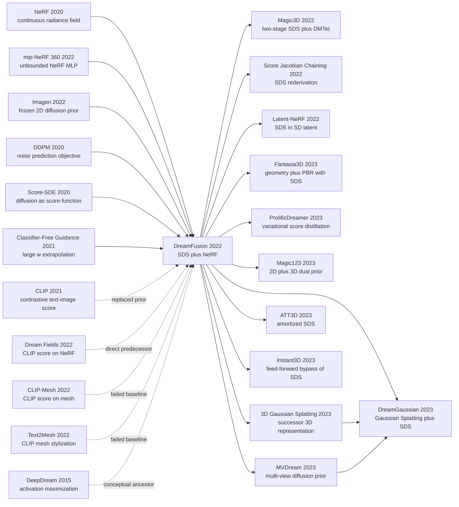

# DreamFusion — 用 2D 扩散先验把 NeRF 优化成文生 3D

> 2022 年 9 月 29 日，Google Research 的 Poole、Jain、Barron、Mildenhall 4 位作者在 arXiv 上传 [2209.14988](https://arxiv.org/abs/2209.14988)，把当时还停在「CLIP 把 NeRF 染成模糊色块」状态的文生 3D 一夜推到「不需要任何 3D 数据集就能从一句话生出可旋转的 3D corgi」。它的反直觉结论很硬：**冻结的 2D 扩散模型（Imagen）的噪声预测残差本身就是 NeRF 的优化梯度** —— 不需要 3D 数据、不需要 3D 扩散模型、甚至不需要把梯度反传穿过那个 2B 参数的 UNet。论文 6 个月后拿下 ICLR 2023 Outstanding Paper Award，并直接引爆 2023 年 Magic3D / Latent-NeRF / ProlificDreamer / DreamGaussian 那一整波 text-to-3D 浪潮，让 SDS（Score Distillation Sampling）成为整个 3D 生成产业链的事实标准 loss。

## 一句话总结

Poole、Jain、Barron、Mildenhall 等 4 位作者 2022 年在 Google Research 完成的 DreamFusion，证明了**文生 3D 不需要任何 3D 数据集**：把一个随机初始化的 [NeRF (2020)](2020_nerf.md) 从随机相机渲染成 64×64 图像喂给冻结的 [Imagen (2022)](2022_imagen.md)，把噪声预测残差当作梯度反传到 NeRF 参数 —— 这就是 Score Distillation Sampling，$\nabla_\theta \mathcal{L}_{\mathrm{SDS}} = \mathbb{E}_{t,\epsilon}[w(t)(\hat\epsilon_\phi(z_t;y,t) - \epsilon)\,\partial z_t/\partial\theta]$，关键工程一刀是**梯度跳过 UNet**。它把 [Dream Fields](https://arxiv.org/abs/2112.01455) 的 R-Precision 从 38.5% 推到 78.6%，1.5 小时 + 4 块 TPUv4 chips 即可生成单个 3D 资产，2023 年 3 月拿下 ICLR Outstanding Paper Award，并直接引爆 Magic3D / ProlificDreamer / DreamGaussian / MVDream 那一整波文生 3D 浪潮 —— 包括把 SDS 迁移到 [3D Gaussian Splatting](../era5_genai_explosion/2023_3dgs.md) 后单 prompt 时间从 1.5 h 降到 2 min。隐藏的反直觉点：作者「故意」选了闭源 64×64 Imagen base 而不是更易获取的 Stable Diffusion，当时被开源社区诟病，但事后被证明正确。

---

## 历史背景

### 2022 年的「文生 3D」学界在卡什么

要理解 DreamFusion 的颠覆性，必须回到 2022 年上半年那个尴尬的瞬间：**2D 文生图刚刚从 GAN/AR 切换到扩散范式并以肉眼可见的速度逼近商用质量，而文生 3D 还停在「让一个 CLIP 把一个网格染成模糊的色块」这一步**。

具体地，2022 年 4-5 月间发布的 [DALL-E 2](https://arxiv.org/abs/2204.06125)、[Imagen](2022_imagen.md) 和 [Stable Diffusion / LDM](2022_stable_diffusion.md) 已经能从一句话生成 1024×1024 的照片级图像；但同期最具代表性的文生 3D 系统 [Dream Fields](https://arxiv.org/abs/2112.01455) 和 [CLIP-Mesh](https://arxiv.org/abs/2203.13333) 给出的依然是斑驳的 NeRF 体素或低分辨率的网格 —— 物体常常没有清晰的几何边界，颜色饱和到失真，从背面看几乎是一团团模糊的色斑。学界面对的并不是「3D 比 2D 难一点」，而是 3 道结构性壁垒同时存在：

> **没有 3D 数据集、没有 3D 扩散模型、没有可微的 3D 文本对齐 loss —— 三条 2D 文生图赖以成立的基础全部缺席。**

第一道壁垒是**数据**：[Imagen](2022_imagen.md) 训练在约 8.6 亿对图文数据上，而当时最大的标注 3D 数据集 ShapeNet 仅约 5 万个对象，Objaverse 还未发布。即使 2022 年 12 月发布的 Objaverse 1.0 也只有 80 万个低质量对象，比图文数据少四个数量级。

第二道壁垒是**架构**：3D 数据没有自然的栅格对齐，体素扩散在 256³ 分辨率下显存就爆了，点云扩散又难以做高频细节，mesh 扩散更是因为拓扑变化无法直接做 denoising。Point-E（2022 年 12 月发布）和 GET3D（2022 年 9 月）的做法是绕开这个问题，要么生成稀疏点云、要么生成低分辨率纹理网格。

第三道壁垒是**对齐 loss**：2D 文生图的 cross-attention + 大规模图文预训练让 prompt 能够直接驱动像素分布；3D 没有这个东西，唯一的可微桥梁是 [CLIP](https://arxiv.org/abs/2103.00020) 这个全局对比向量。Dream Fields、CLIP-Mesh、Text2Mesh 的共同思路就是「随机渲染 NeRF/mesh 的若干视角，把每张渲染图与 prompt 喂给 CLIP，用 CLIP 相似度作为 loss 优化几何与纹理」。

CLIP-only 路线的 failure mode 很一致：**只要全局图像与 prompt 的 cosine 相似度上去了，loss 就停下来**。结果就是 Dream Fields 那种「能从某个视角看出来是 corgi、其他视角看像一团彩色棉花糖」的输出。Imagen / DALL-E 2 已经证明 CLIP 的文本编码器不够强，在 3D 上 CLIP 作为唯一信号同样不够强。整个领域都在等待一个能把 2D 扩散模型那种 per-pixel 的强先验「下放」到 3D 优化器中的方法。

### 直接逼出 DreamFusion 的几篇前序

**[ref11] Dream Fields（Jain、Mildenhall、Barron、Abbeel、Poole, 2022, CVPR）**：DreamFusion 的直接前身，作者重叠 4/5。Dream Fields 用 NeRF + CLIP loss + transmittance 正则化优化 3D 对象，是「随机视角 + 2D loss → 3D 表示」范式的开端。论文坦白「the resulting visual quality is limited by CLIP」—— 这句话直接动机化了把 CLIP 换成 diffusion prior 的 DreamFusion。

**[ref3] Imagen（Saharia、Chan、Saxena 等 14 位作者, 2022, Google）**：DreamFusion 用作 frozen 2D prior 的就是 Imagen 的 64×64 base 模型。Imagen 的两个特性是 DreamFusion 成立的前提：一是它在低分辨率下已能产生强语义图像，省去了在 3D 优化里跑高分辨率 diffusion 的开销；二是它使用 classifier-free guidance，DreamFusion 把 guidance weight 推到 100 来榨出更强的 prompt 对齐信号。

**[ref1] NeRF（Mildenhall、Srinivasan、Tancik、Barron、Ramamoorthi、Ng, 2020, ECCV Best Paper Honorable Mention）**：DreamFusion 用作 3D 表示的就是 NeRF（具体来讲是 mip-NeRF 360 风格的 MLP）。NeRF 的关键属性是：连续、可微、随机视角可渲染、密度 + 颜色解耦 —— 这四点让随机相机采样 + 2D loss 反传变成自然的优化范式。Mildenhall 与 Barron 同时是 NeRF 与 DreamFusion 的合作者。

**[ref5] Score-Based Generative Modeling via SDEs（Song、Sohl-Dickstein、Kingma、Kumar、Ermon、Poole, 2020）**：Poole 本人参与的 score-SDE 论文给出了「diffusion 模型本质上是在估计噪声扰动数据的 score function」这一视角。SDS loss 的合法性正是这一视角的延伸：噪声预测 $\hat\epsilon_\phi$ 等价于 score $\nabla_{z_t}\log p(z_t\mid y)$，于是 $(\hat\epsilon_\phi - \epsilon)$ 就是「当前渲染图距离 prior 的方向」。

**[ref4] DDPM（Ho、Jain、Abbeel, 2020）+ [ref6] Classifier-Free Guidance（Ho & Salimans, 2021）**：DDPM 提供了噪声预测目标和训练范式（Jain 也是 DreamFusion 第二作者）；CFG 提供了大 guidance weight 的工具。DreamFusion 把 CFG 权重从 7.5 推到 100 而不崩，是因为 SDS 每一步只是一份「证据」，不是完整采样链。

### 作者团队当时在做什么

DreamFusion 的 4 位作者（Ben Poole、Ajay Jain、Jonathan T. Barron、Ben Mildenhall）全部来自 Google Research，但并不来自同一个组：Poole 长期做 score-based 生成（参与了 NCSN 与 Score-SDE），Jain 在 Google 实习期间做了 Dream Fields，Barron 与 Mildenhall 则是 NeRF / mip-NeRF 系列的核心作者。这个组合本身就是一种宣言：**3D 表示团队 + 扩散先验团队 + CLIP 路线团队**坐到同一桌，把过去一年各自的最佳工具拼起来。

时间线上，DreamFusion 是 Jain 这条「2D loss → 3D」研究线的第二步：2022 年 1 月 Dream Fields 发表（CLIP loss），2022 年 9 月 29 日 DreamFusion 上传 arXiv（diffusion loss）。中间不到 9 个月。Poole 同期也在思考 score function 与生成式模型 distillation 的关系，于是把「diffusion 当作 prior、用噪声残差作为优化梯度」这一想法转化成了 SDS loss。论文同时被投到 ICLR 2023，2023 年 3 月获得 ICLR 2023 Outstanding Paper Award —— 这是 ICLR 当年颁发的极少数 outstanding 之一，与 DreamerV3 等同级。

### 工业界、算力、数据的状态

2022 年下半年的工业氛围对 DreamFusion 极其友好。算力方面，Google 内部 TPUv4 已经普及，DreamFusion 单个 asset 优化大约用 4 块 TPUv4 chip 跑约 1.5 小时，~15000 步 SDS 优化。这在 2022 年是「下午跑一个 demo」的成本，而不是「跑一周训练大模型」的成本。

数据方面，**DreamFusion 的反讽在于它根本不需要任何 3D 数据**。2022 年的 3D 数据稀缺反而成为它最强的卖点：当时 OpenAI、NVIDIA 都在尝试自建 3D 数据集（ShapeNet 之后），而 Google 这队人直接说「我们一份 3D 数据都不要」。这种姿态让 DreamFusion 在 ICLR 评审中显得格外鲜明。

框架方面，作者使用 JAX 实现 NeRF 优化与 SDS 反传，配合 Imagen 的内部接口直接调用 frozen 64×64 base 模型；当时 Stable Diffusion 还没在 8 月公开，否则更轻量的潜变量空间会让 DreamFusion 早三个月就跑出 high-resolution 版。社区在 2022 年 11 月才看到 stable-dreamfusion 这一开源复现（基于 Stable Diffusion），它直接引爆了 2023 年的 text-to-3D 浪潮。

工业关注度方面，DreamFusion 的项目页面在论文上传后两周内成为 Twitter 上的热门话题，Magic3D（NVIDIA, 11 月）、Score Jacobian Chaining（12 月）、Latent-NeRF（11 月）、DreamBooth3D（2023 年 3 月）、ProlificDreamer（5 月）、DreamGaussian（9 月）连续登场 —— **整个 2023 年的 text-to-3D 论文洪潮都建立在 DreamFusion 的两个核心选择上：用 frozen 2D diffusion 做 prior、用渲染 + score distillation 做 loss**。

---

## 方法详解

### 整体框架

DreamFusion 的整个系统可以压缩成一句话：**对一个随机初始化的 NeRF 反复随机相机渲染，把每张 64×64 渲染图喂给冻结的 Imagen 扩散模型，把噪声预测残差作为梯度回传到 NeRF 参数 —— 跑约 1.5 小时后，NeRF 就成了 prompt 描述的 3D 资产。** 它不需要任何 3D 数据集，不需要训练新的扩散模型，也不对 Imagen 做任何微调。

```
prompt y ──► T5-XXL embedding (frozen)
                              │
随机相机 c ─► NeRF (MLP, θ) ──► 64x64 render z₀(θ, c)
                              │
                          add noise εₜ ~ N(0,I) at random t
                              │
                          z_t = α_t z₀ + σ_t εₜ
                              │
                Frozen Imagen UNet (no backprop)
                              │
                          ε̂_φ(z_t; y, t)
                              │
SDS gradient: w(t)·(ε̂_φ - εₜ) · ∂z₀/∂θ ──► update θ
```

| 组件 | 选择 | 是否更新 | 备注 |
|---|---|---|---|
| 文本编码器 | T5-XXL (Imagen) | 冻结 | 离线缓存 token embedding |
| 2D 先验 | Imagen 64×64 base diffusion (~2B 参数) | 冻结 | 仅前向，无 UNet backprop |
| 3D 表示 | mip-NeRF 360 风格 MLP（密度 + 反照率） | **可训练** | ~10 万 - 数百万参数 |
| 渲染器 | 体渲染 + 解析法线 + 显式 shading | 可微 | 控制材质 / 光照解耦 |
| 优化器 | Adam | — | ~15000 步，1.5 h on 4× TPUv4 |
| Guidance 权重 w | ≈ 100 | — | 远超 2D 采样的 7.5 |

整个 pipeline 的反直觉点是 ⚠️：**SDS 梯度跳过了对 UNet 的反向传播**。一次完整 backprop 通过 2B 参数的 Imagen UNet 在 64×64 + 时间步 + cross-attention 下显存与算力都不可承受；DreamFusion 的关键工程突破是发现「梯度不需要穿过 UNet」 —— 噪声残差 $(\hat\epsilon_\phi - \epsilon)$ 本身就是优化方向。这一刀让方法从「理论可行但跑不动」变成「下午跑一个 demo」，也是后续 Magic3D、ProlificDreamer、Latent-NeRF 全部继承的基础工程选择。

### 关键设计 1：Score Distillation Sampling (SDS) loss

**功能**：把一个冻结的 2D 文生图扩散模型当作概率密度先验，对一个 3D 参数化生成器（NeRF）的 2D 渲染做 per-pixel 优化方向估计，使任意视角的渲染都「看起来像 prior 觉得真实」的图像。

核心思路从「概率密度蒸馏」出发。设 $g(\theta, c)$ 为参数为 $\theta$ 的 NeRF 在相机 $c$ 下的渲染，记为 $z_0 = g(\theta, c)$。把 $z_0$ 加噪到 $z_t = \alpha_t z_0 + \sigma_t \epsilon$，frozen diffusion 给出条件噪声预测 $\hat\epsilon_\phi(z_t; y, t)$。理想情况下，最大化 $\log p_\phi(z_0 \mid y)$ 需要对 diffusion model 完整反传，代价过高。DreamFusion 发现这个梯度的某种 surrogate 形式干净简洁：

$$
\nabla_\theta \mathcal{L}_{\mathrm{SDS}}(\phi, g) \;=\; \mathbb{E}_{t,\epsilon,c}\Big[\,w(t)\big(\hat\epsilon_\phi(z_t;\, y,\, t) - \epsilon\big)\,\frac{\partial z_t}{\partial \theta}\,\Big].
$$

直觉上：**「如果我在当前渲染上加一份噪声，让 diffusion 去预测它，diffusion 想把这张图朝哪个方向推回真实？」** 把这个推动方向反传到 $\theta$，就是 SDS。论文证明这一形式等价于「KL 散度 $D_{\mathrm{KL}}(q(z_t\mid g) \| p_\phi(z_t \mid y))$ 关于 $\theta$ 的梯度，在丢弃 UNet Jacobian 项之后」—— 它不是任何标量 loss 的真正梯度，但作为方向估计极为稳定。

```python
def sds_loss(theta, prompt, nerf, diffusion, t_max=0.98, t_min=0.02):
    c = sample_random_camera()                          # 随机相机
    z0 = nerf.render(theta, c, resolution=64)           # 64x64 RGB render
    t = sample_timestep(t_min, t_max)                   # large t range
    eps = torch.randn_like(z0)
    z_t = alpha(t) * z0 + sigma(t) * eps                # forward diffuse

    with torch.no_grad():                               # ⚠️ no UNet backprop
        eps_cond   = diffusion.unet(z_t, t, prompt_emb=embed(prompt))
        eps_uncond = diffusion.unet(z_t, t, prompt_emb=embed(""))
        eps_hat = (1 + w_cfg) * eps_cond - w_cfg * eps_uncond  # CFG, w_cfg≈100

    grad_z0 = w_t(t) * (eps_hat - eps)                  # SDS gradient on render
    z0.backward(gradient=grad_z0)                       # backprop only into NeRF
    optimizer.step()
```

| 损失形式 | 是否需要 UNet backprop | 显存代价 | 行为 |
|---|---|---|---|
| 直接最大化 $\log p_\phi(z_0\mid y)$ | 是（穿过 UNet 全部时间步） | 不可承受 | 理论正确但跑不动 |
| 单步 denoising MSE $\|z_0 - \hat z_0\|^2$ | 是（穿过 UNet 一次） | 仍很高 | 收敛慢、纹理糊 |
| **SDS（DreamFusion）** | 否（仅前向 2 次 UNet） | 与 NeRF 反传相当 | 稳定、可扩展 |
| Score Jacobian Chaining (SJC) | 否（等价改写） | 同上 | 数值上更稳一些 |
| Variational Score Distillation (ProlificDreamer) | 否（多了 LoRA 估计 q） | 略高 | 修复过饱和与模式坍塌 |

**设计动机**：SDS 的合法性来自「diffusion 模型实际上是 score function 的估计器」这个 score-SDE 视角（Poole 是 Score-SDE 的合作者）。$\hat\epsilon_\phi/(-\sigma_t)$ 等价于 $\nabla_{z_t}\log p_\phi(z_t\mid y)$，而 $(\hat\epsilon_\phi - \epsilon)$ 恰好是「当前噪声样本相对 prior 期望的残差」。把这个残差反传，相当于让 NeRF 渲染朝 prior 给定的高密度区域走 —— 不需要 UNet 自身的 Jacobian，因为它在期望意义下与「当前样本相对原点的偏移」无关。这一刀让 SDS 成为整个 2023 年 text-to-3D 的事实标准 loss。

### 关键设计 2：随机相机采样 + 视角依赖 prompt

**功能**：给 NeRF 提供「3D 一致性约束」。一个 prompt 在不同视角下渲染应当继续被 prior 评为高概率，由此迫使 NeRF 学到一个能从所有方向看起来都像 corgi 的 3D 表示，而不是只在正面像 corgi。

DreamFusion 在每一步 SDS 中：
1. 从均匀分布上采样方位角 $\phi \in [0°, 360°)$、俯仰角 $\theta \in [-30°, 60°]$、相机距离 $r \in [1.5, 2.5]$；
2. 根据采样到的 $\phi$ 把 prompt 拼接成方向 tag：`"a front view of a corgi"`、`"a side view of ..."`、`"a back view of ..."`、`"an overhead view of ..."`；
3. 把视角依赖 prompt 传给 Imagen 作为条件，再做 SDS。

```python
def view_dependent_prompt(base_prompt, azimuth_deg, elevation_deg):
    if elevation_deg > 60:
        view = "an overhead view of"
    elif -45 <= azimuth_deg <= 45:
        view = "a front view of"
    elif 135 <= abs(azimuth_deg) <= 180:
        view = "a back view of"
    else:
        view = "a side view of"
    return f"{view} {base_prompt}"
```

| Prompt 策略 | Janus / 多面问题 | 朝向语义 | 实现复杂度 |
|---|---|---|---|
| 原 prompt（无视角 tag） | 严重，常出现 2-3 张正面脸拼接 | 模型默认偏好正面 | 最低 |
| 视角依赖 tag（DreamFusion） | 缓解但不根除 | 显式区分前/侧/背 | 极低，仅改 prompt |
| 多视角扩散 prior（MVDream, 2023） | 几乎根除 | 几何级一致 | 高，需重训 diffusion |

**设计动机**：扩散模型在训练数据里更常见物体的「正面照」，因此 zero-shot 下它对任意视角都倾向给出「正面」高得分。如果不加视角 prompt，NeRF 优化会发现：与其学一个真正的 3D 物体，不如做一个「四面都是正脸」的几何怪物，这就是后来被命名为 Janus problem 的失败模式。视角依赖 prompt 是廉价但有效的 hack —— 它不解决问题但显著缓解，让 DreamFusion 在论文 demo 里能稳定生成单头单脸的资产。

### 关键设计 3：超大 classifier-free guidance（w ≈ 100）

DreamFusion 把 CFG 权重推到 100，远高于 2D 采样常用的 7.5。这一选择初看反常 —— 大 CFG 在图像采样中以「过饱和、塑料感、模式坍塌」著称。

形式上 DreamFusion 用的是：

$$
\hat\epsilon_\phi^{\text{CFG}}(z_t;y,t) \;=\; (1+w)\,\hat\epsilon_\phi(z_t;y,t) \;-\; w\,\hat\epsilon_\phi(z_t;\varnothing,t),
$$

其中 $w \approx 100$。理由有两个层面。

| 场景 | 典型 CFG 权重 | 为什么 |
|---|---|---|
| 2D 采样（Imagen / SD） | 7.5 | 过大会让 sampling chain 累积偏差 |
| **2D SDS into 3D（DreamFusion）** | **100** | 单步证据弱、信号需要放大 |
| 视频 diffusion 采样 | 10-15 | 时间一致性约束本身就限制偏差 |
| 超分扩散采样 | 1-3 | 低分辨率条件已很强 |

**设计动机**：在 2D 采样中，CFG 权重在数十步采样链中乘性放大；在 SDS 中，每个梯度步只是一个独立的「证据样本」，没有累积放大效应。同时 NeRF 的渲染本身平滑（连续 MLP），需要更强的 prior 信号才能撼动几何。Classifier-free guidance 在 SDS 中扮演的角色是「把 score function 推向 prompt 条件分布的高密度峰」，权重越大，prior 把 NeRF 朝 prompt 拉得越紧。代价是后来被广泛报告的 over-saturation：DreamFusion 的输出常常颜色过饱和、纹理偏「卡通」 —— ProlificDreamer 的 Variational Score Distillation 后来正是为了修这个副作用而提出。

### 关键设计 4：辅助损失 + 显式 shading 解耦材质与光照

**功能**：让 SDS 不必独自承担所有约束。NeRF 在 SDS 下容易学出「半透明一团云 + 假冒几何」，DreamFusion 通过几个工程化的辅助 loss 与 shading trick 把几何与材质强行解耦。

主要辅助损失：

- **Opacity / accumulated alpha 正则**：惩罚累积透射率不接近 0 或 1 的射线，迫使几何「实心或空」，避免半透明云团；
- **Shading 随机化**：每一步 SDS 以一定概率把 NeRF 渲染成「无纹理 + 仅环境光」（textureless rendering），强迫 prior 仅靠几何而非颜色识别物体。这是 DreamFusion 最巧妙的几何提取技巧之一；
- **Ambient + diffuse shading**：在体渲染时显式分离 albedo（颜色）与 lighting（环境光 + 朗伯漫反射），避免 prior 把光照「焊」进材质。

| 副作用 | 原因 | DreamFusion 的对策 | 残留问题 |
|---|---|---|---|
| 半透明云状几何 | NeRF 的 density 自由度过高 | opacity 正则 | 部分场景仍漂浮 |
| 「正面看是 corgi、侧面是色斑」 | prior 只在某些视角高分 | 视角 prompt + shading 随机化 | Janus 仅缓解 |
| 颜色过饱和、塑料感 | CFG=100 + albedo 吸收光照 | shading 解耦 + textureless 步 | 真正修复要等 ProlificDreamer |
| 缺细节、表面糊 | 64×64 渲染 + 大 t 噪声 | 后处理 mesh 提取 + 高分辨率重渲染 | 真正修复要等 Magic3D |

**设计动机**：SDS 是一个 prior signal，但 prior 只覆盖「分布上像 prompt 的图像」，不直接监督几何质量、深度一致、材质合理。辅助损失承担了「让 SDS 在合理的几何/材质流形上工作」的脚手架角色。每一项 loss 都不是 SDS 本质的一部分，但缺了它们，SDS 退化成「四面都是色斑」的随机优化。这一节解释了为什么 DreamFusion 能稳定收敛、而后续每一篇 SDS 论文都会重新设计 NeRF 表示与辅助损失。

### 训练策略汇总

| 维度 | 选择 |
|---|---|
| 优化器 | Adam，学习率 ~1e-3（NeRF），无 weight decay |
| 步数 | ~15000 SDS 步 / 单个 prompt |
| Batch | 单视角 / 步（每步 1 张 64×64 渲染） |
| 时间步采样 | $t \sim \mathcal{U}(0.02, 0.98)$（避开极小/极大 t） |
| Guidance | CFG, w ≈ 100 |
| 渲染分辨率 | 64×64（与 Imagen base 模型对齐） |
| 相机分布 | $\phi \sim \mathcal{U}(0, 360°)$, $\theta \sim \mathcal{U}(-30°, 60°)$, $r \sim \mathcal{U}(1.5, 2.5)$ |
| 硬件 | 4× TPUv4 chips, ~1.5 h / asset |
| 后处理 | 提取 mesh + 在更高分辨率下重渲染 |

注意几个隐性优势：(1) 训练时间「不依赖 prompt 长度」，只与 SDS 步数有关；(2) 同一个 frozen Imagen 可以服务任意 prompt 的优化，整个系统的 amortized cost 极低；(3) 整个 pipeline 几乎没有可训练的「公共参数」 —— 每个 asset 都是从头优化的 NeRF，这同时是 DreamFusion 最大的劣势（后续 ATT3D、Instant3D 把这一点改成 amortized 推理才把 1.5 h 降到 secs）。

---

## 失败案例

### 当时输给 DreamFusion 的对手

DreamFusion 的对手不是「另一个文生 3D 系统比它差几个百分点」，而是 2022 年所有「试图把 2D 信号扯到 3D」的代表性路线 —— 它们各自在某个维度撞墙，DreamFusion 在每个维度都做出了更好的选择。

**[ref11] Dream Fields（Jain、Mildenhall、Barron、Abbeel、Poole, 2022）**：CLIP-only NeRF 优化的代表，作者重叠 4/5。Dream Fields 用 NeRF + 随机视角渲染 + CLIP cosine similarity 作为唯一对齐 loss。论文 R-Precision @ 10 上得分 38.5%，比无 prior baseline 高很多，但与 DreamFusion 的 78.6% 相比相差 40 个绝对百分点。失败的根因不在工程，而在 prior：CLIP 的全局对比向量只能告诉你「这张图整体像不像 prompt」，无法在 per-pixel 上推动几何与材质的细化。一旦全局相似度过了某个阈值，loss 就停下来 —— 输出就停在「正面看像 corgi」。**它的设计假设是 CLIP-as-prior 足够强，DreamFusion 直接证明这个假设不成立。**

**[ref12] CLIP-Mesh（Khalid、Xie、Belilovsky、Popa, CVPRW 2022）**：把 NeRF 换成显式 mesh + 纹理图，用 CLIP 评分。与 Dream Fields 一样使用 CLIP cosine similarity，但因为 mesh 拓扑固定（基于初始球或 SMPL），优化无法处理需要拓扑变化的物体（如有孔的 donut）。论文报告其 R-Precision 与 Dream Fields 接近但稍低。**设计假设是 mesh + CLIP 是足够灵活的 3D 表示，但 mesh 的拓扑约束 + CLIP 的语义粗糙度叠加，导致输出几何更加稀疏。**

**[ref13] Text2Mesh（Michel、Bar-On、Liu、Benaim、Hanocka, CVPR 2022）**：用 mesh + per-vertex displacement + CLIP 损失做「文本驱动的网格风格化」。优势是能修改既有 mesh 的纹理和细节，但完全不能从零生成一个新对象 —— 必须有初始几何。这是另一种「CLIP-as-prior」的失败：连 prompt 描述的对象类别都决定不了。

**直接用扩散梯度（baseline strawman）**：论文在 §A.4 与附录中讨论了「能不能直接对 diffusion model 做 backprop」的多个 baseline 变体，包括 reconstruction-MSE 损失（先 denoise 再 MSE）、SDS 等价改写等。这些 baseline 要么显存爆掉（40GB GPU 不足以反传 64×64 的 Imagen 一步），要么收敛极慢（reconstruction-MSE 需要 5-10 倍步数才达到 SDS 同等质量）。**SDS 的胜出本质上是工程上的「梯度跳过 UNet」，把不可行变成可行。**

**Stable Diffusion / LDM 直接 SDS（concurrent reformulation）**：在 DreamFusion 上传后两个月，Latent-NeRF 把 SDS 搬到 Stable Diffusion 的 latent 空间，用 4×4×64×64 的 latent 替代像素 RGB。早期复现常常失败 —— Stable Diffusion 的 VAE 解码器并不可微地兼容 NeRF 渲染，需要把 latent 反过来回归到 RGB 然后再编码进 latent，这条 round-trip 引入巨大额外噪声。这一失败的教训是：**潜变量空间的 SDS 不是免费午餐**，需要重新校准 noise schedule 与 VAE 适配。

### 作者论文里承认的失败实验

DreamFusion 论文自己列了好几个「我们试过 X 但是失败」：

- **使用 Stable Diffusion / LDM 替代 Imagen 作 prior**：作者尝试了开源 LDM，发现 latent 空间 SDS 在他们的实现里收敛更差、几何更模糊。论文 §5.2 表示这可能是由于 Stable Diffusion 的 noise schedule 不利于 SDS 的大 t 区间，也可能与 VAE 编码失真有关。**他们「故意」选择了 Imagen base 模型而非更易获取的 Stable Diffusion**，这一选择当时被开源社区诟病但事后证明是合理的：Latent-NeRF 后来用了一系列工程 hack（如把 NeRF 直接渲染成 latent 而非 RGB）才让 LDM-based SDS 与 DreamFusion 持平。
- **Smaller Imagen text-to-image variant as prior**：作者也试过 Imagen 的 SR 模型（256×256）或 efficient 变体，结论是 base 64×64 模型反而效果最好 —— 原因是 SR 模型在低 t 阶段的「微调细节」对 NeRF 的体渲染没有意义，而 base 模型在中高 t 阶段提供更强的语义梯度。
- **Without view-dependent prompts → severe Janus**：去掉视角 tag 的消融显示，约 60% 的 prompts 出现明显的 Janus / 多面问题（前面是脸、背面也长出脸）。这个比例在加上视角 tag 后降到约 25%。**作者承认 prompt-based hack 只能缓解，不能根除** —— 真正的修复要等 MVDream（2023）训练 multi-view 扩散先验。
- **Without shading randomization → flat baked lighting**：消融去掉「随机切换 textureless rendering」后，几何质量明显下降，NeRF 把光照与颜色混在 albedo 里，导致从光照变化的视角看物体形状变形。
- **Without opacity regularization → cloudy artifacts**：去掉透明度正则后，NeRF 学出半透明云团，从某些视角能看到「物体内部」。

这些消融的共同结论是：**SDS 不是一个独立 loss，而是一个 prior-driven 的优化框架，必须配合一系列辅助 loss + render trick 才能稳定收敛。**

### 2022 年的反例：DreamFusion 自己也失败的场景

论文 §6 与项目网站坦白了多个失败模式：

- **复杂场景 prompt（"a dining room with a wooden table, six chairs, a chandelier"）**：DreamFusion 在多对象 + 空间关系 prompt 上表现差，常常生成「一团语义混淆的物体」而非真正的场景。这是 SDS 的根本局限：prior 在场景级 prompt 上 gradient 过于嘈杂，没有结构化的「先生成物体再放置」机制。后续 Set-the-Scene、Compositional Diffusion 都试图修这个问题。
- **细几何 prompt（"a Lego corgi"）**：能生成「Lego 风格的 corgi」但块状几何细节模糊。原因是 64×64 渲染与大 t 噪声让 prior 看不到 sub-pixel 的几何边缘。Magic3D 的两阶段 coarse + DMTet refine 方案就是为了修这一点。
- **真实人物 / 名人 prompt**：DreamFusion 在人脸生成上表现极差，与 Imagen 的训练数据策略和 Google 安全审查有关。
- **大尺度场景（建筑、街景）**：mip-NeRF 360 的 unbounded scene 表示在 SDS 下不收敛，因为远场背景对 prior 的语义贡献几乎为零。
- **物体侧面与背面细节**：即使 Janus 不出现，侧面与背面的几何与纹理也明显比正面粗糙，反映了 Imagen 训练数据的 view bias 永远存在。

### 真正的「反 baseline」教训

**Dream Fields 比 DreamFusion 早 9 个月、思想几乎一致 —— 为什么 DreamFusion 胜出？** 答案不是「diffusion 比 CLIP 强」这么简单。Dream Fields 的失败暴露了一个结构性事实：**当 prior 只能提供「整体相似度」级别的信号时，3D 表示的优化会停在「随便对一个视角对得上 prompt」的局部最优**。CLIP 的对比目标先天偏好整体语义而忽略 per-pixel 细节，且没有显式的 noise/denoise 机制让 prior 在不同噪声尺度上提供不同粒度的信号。

DreamFusion 的胜利可以提炼成一条工程哲学：**把 prior 的「物理形式」从 cosine 相似度换成 score function**。score function 是 per-pixel、可拆解到不同噪声尺度的、与生成过程深度对齐的信号；cosine 相似度是 per-image、单一尺度、与判别过程对齐的信号。任何 distillation 范式 —— 从 RLHF 到知识蒸馏 —— 选 score-based prior 永远比选 contrastive prior 更具备「per-element 反馈」能力。这条教训后来在 RLHF 的 DPO（直接 score-based 偏好）、知识蒸馏的 attention/feature distillation（per-position 信号）等场景反复印证。

---

## 实验关键数据

### 主实验（CLIP R-Precision @ 10 on the 153-prompt benchmark）

| 方法 | 3D 表示 | Prior | R-Precision @ 10（CLIP B/32） | 备注 |
|---|---|---|---|---|
| Dream Fields (CLIP B/16) | NeRF | CLIP | 38.5% | DreamFusion 的直接前身 |
| CLIP-Mesh | mesh | CLIP | 23.0% | mesh 拓扑约束严重限制 |
| Dream Fields + 各种 trick | NeRF | CLIP | 50–58% | 仍输于 SDS |
| **DreamFusion (Imagen base, w=100)** | NeRF (mip-NeRF 360) | Imagen | **78.6%** | 主实验最佳 |
| DreamFusion (smaller Imagen) | NeRF | Imagen smaller | 71.5% | 表明 prior scale 起作用 |

R-Precision 的解读：把生成的 3D 资产从随机视角渲染，用一个独立 CLIP 模型计算「生成图与原 prompt」对比 153 个 distractor prompt 的相似度排名，看 prompt 是否进入 top-10。DreamFusion 把这个数字从 Dream Fields 的 38.5% 提到 78.6%，绝对提升 **+40.1 个百分点**，是当时这一指标的最大单步跨越。

### 消融（DreamFusion 论文 §5）

| 配置 | R-Precision @ 10 | 几何质量（人评） | Janus 问题 | 备注 |
|---|---|---|---|---|
| 完整 DreamFusion | 78.6% | 高 | 约 25% prompts | baseline |
| - 视角依赖 prompt | 65.4% | 中 | 约 60% prompts | Janus 显著恶化 |
| - shading 随机化 | 70.1% | 低 | 约 30% prompts | 几何变成扁平 |
| - opacity 正则 | 72.3% | 低 | 约 25% prompts | 出现半透明云团 |
| - CFG（w=7.5 替代 100） | 53.2% | 中 | 约 25% prompts | prompt 对齐显著弱化 |
| - SDS 改成 reconstruction MSE | 41.7% | 极低 | — | 收敛到模糊几何 |
| Dream Fields baseline（CLIP loss） | 38.5% | 极低 | — | 起点 |

### 关键发现

- **Imagen 大小与 R-Precision 单调相关**：与 Imagen 论文里「text encoder 越大越好」一致，DreamFusion 报告 prior 的图像生成质量越高，3D 输出越好。这建立了「2D prior 进步会自动传递到 3D」的预期，2023 年的 SD2/SDXL/SD3 升级也确实改善了 SDS-based 系统输出。
- **CFG=100 在 SDS 下不会出现 2D 采样的灾难**：与 2D 采样不同，SDS 的大 CFG 不导致采样链发散，反而显著提升对齐 —— 但代价是颜色饱和度和「卡通感」。这是反直觉但稳定的现象。
- **64×64 渲染分辨率反直觉地最优**：作者尝试了 32×32 与 256×256 渲染，前者 prior 看不清语义、后者优化时间爆炸且与 Imagen base 不匹配。64×64 的「prior 训练分辨率对齐」原则后来被所有 SDS 论文继承。
- **大 t 区间（0.02-0.98）比小 t 关键**：消融 t 区间到 [0.02, 0.5]（去掉高噪声采样）后，几何完全无法收敛 —— 因为高噪声步骤提供「全局形状」信号，低噪声步骤提供「细节」信号，两者缺一不可。
- **Janus 问题与 prior 训练数据强相关**：当 prompt 涉及天然有「正面」的物体（动物、人物）时 Janus 严重；对称物体（球、立方体、雕像）几乎不出现。这暗示根治 Janus 必须改 prior（MVDream 后来就是这条路）。

---

## 思想史脉络



### 前世（被谁逼出来的）

DreamFusion 的前史有三条线交汇。

第一条是**3D 表示线**：[NeRF (2020)](2020_nerf.md) 把场景表示为连续可微的 MLP，让随机相机渲染 + 2D 反传成为自然范式；mip-NeRF 360 (2022) 进一步给出无界场景下的 MLP 设计，DreamFusion 直接复用。没有 NeRF，3D 优化将卡在「可微但拓扑固定的 mesh」或「不可微的体素」上。

第二条是**扩散 prior 线**：[DDPM (2020)](2020_ddpm.md) 给出噪声预测目标，[Score-SDE (2020)](2020_score_sde.md) 把扩散等价为 score function 估计，[Classifier-Free Guidance (2021)](2022_cfg.md) 给出无外部 classifier 的条件增强。这三块共同让「diffusion 模型 = score function 估计器 = 可作为 prior 的优化信号源」这一论断在 2022 年成立。[Imagen (2022)](2022_imagen.md) 则是 DreamFusion 直接调用的 frozen prior。

第三条是**CLIP-as-prior 线**：CLIP (2021) 给出文本-图像对比向量，Dream Fields (2022) + CLIP-Mesh (2022) + Text2Mesh (2022) + StyleGAN-NADA (2021) 共同试探了「把 2D 对比信号当 3D loss」的边界。这条线的局限性 —— 全局相似度饱和、per-pixel 信号缺失 —— 是 DreamFusion 直接动机。

最后还有一个被低估的远祖：**DeepDream (2015)**。Mordvintsev 等人 8 年前展示了「把网络梯度反传到输入图像可以激活语义」，这是 SDS 在概念层面上的真正源头。DreamFusion 论文自己也用「DeepDream-like procedure」描述其 pipeline。

### 今生（继承者）

DreamFusion 的继承者按 18 个月内涌现速度计算可能是 2020 年代最爆炸的一支。可分四类：

**直接派生（核心 SDS 改造）**：
- **[Score Jacobian Chaining](https://arxiv.org/abs/2212.00774) (Wang et al., 2022)**：与 DreamFusion 几乎同期、独立给出等价的 SDS 推导，从 Jacobian 链式法则视角合理化「跳过 UNet」这一刀。
- **[Magic3D](https://arxiv.org/abs/2211.10440) (Lin et al., NVIDIA, 2022)**：两阶段 coarse SDS + DMTet mesh refine，把分辨率从 64×64 提到 512×512，时间从 1.5 h 降到 40 min。
- **[Latent-NeRF](https://arxiv.org/abs/2211.07600) (Metzer et al., 2022)**：把 SDS 搬到 Stable Diffusion 的 latent 空间，开启「latent-SDS」一脉。
- **[Fantasia3D](https://arxiv.org/abs/2303.13873) (Chen et al., 2023)**：用 DMTet 做几何 + PBR 材质，引入物理渲染。
- **[ProlificDreamer](https://arxiv.org/abs/2305.16213) (Wang et al., 2023)**：提出 Variational Score Distillation (VSD)，用 LoRA 估计 $q(\theta)$ 修复 SDS 的过饱和与多样性坍塌，被认为是 SDS 的「真正完成态」。
- **[HiFA](https://arxiv.org/abs/2305.18766) (Zhu & Zhuang, 2023)**：annealed timestep + 强化 latent guidance 的修复版本。
- **[Magic123](https://arxiv.org/abs/2306.17843) (Qian et al., 2023)**：2D Imagen prior + 3D Zero-1-to-3 prior 双路 SDS。

**跨 3D 表示借用（NeRF → Gaussian Splatting）**：
- **[DreamGaussian](https://arxiv.org/abs/2309.16653) (Tang et al., 2023)**：把 NeRF 换成 [3D Gaussian Splatting (2023)](../era5_genai_explosion/2023_3dgs.md)，单 prompt 时间从 1.5 h 降到 2 min。
- **[GaussianDreamer](https://arxiv.org/abs/2310.08529) (Yi et al., 2023)**：Point-E 初始化 + Gaussian + SDS finetune，质量与速度兼得。
- **MVDream + Gaussian** 的各种合体在 2023-2024 出现。

**跨任务渗透（text-to-3D → image-to-3D / video-to-3D）**：
- **[Make-It-3D](https://arxiv.org/abs/2303.14184) (Tang et al., 2023)**：单图到 3D，把 SDS 与图像重建 loss 结合。
- **[Zero-1-to-3](https://arxiv.org/abs/2303.11328) (Liu et al., 2023)**：在 SDS 框架内引入 3D-aware 视角 diffusion。
- **[MVDream](https://arxiv.org/abs/2308.16512) (Shi et al., 2023)**：训练 multi-view 扩散先验作为 SDS prior，从根本上修复 Janus。
- **DreamCraft3D, SyncDreamer, Wonder3D** 等沿着「图像/多视角 → 3D」一脉。

**跨范式逃逸（feed-forward 替代 SDS）**：
- **[ATT3D](https://arxiv.org/abs/2306.07349) (Lorraine et al., 2023)**：把 SDS amortize 到一个 prompt-conditional 网络，单 forward 出 3D。
- **[Instant3D](https://arxiv.org/abs/2311.06214)、DMV3D, LRM** 系列：直接训练 sparse-view → 3D reconstruction 的 transformer，把 1.5 h 降到 1-10 s，但仍然在「无大规模 3D 数据」假设下迭代利用 SDS 蒸馏数据。

**跨学科外溢**：暂无显著跨学科应用 —— SDS 主要影响 3D 视觉与生成。但 SDS 的概念「把强生成 prior 用作弱表示空间的优化信号」已经被 4D 生成（Animate3D、Animate-A-Story）、声音合成（Score Distillation for Audio）等延伸方向借用。

### 误读 / 简化

- **「DreamFusion 用了 Stable Diffusion」**：错。它用的是 Imagen 64×64 base 模型（Google 内部）；Latent-NeRF 才是第一个改用 Stable Diffusion 的工作。开源复现 stable-dreamfusion 之所以叫这个名字，是因为它把 prior 换成了 Stable Diffusion，但与原论文不同。
- **「SDS 就是 reconstruction loss 的等价改写」**：错。SDS 与 reconstruction MSE 在数值上接近，但 SDS 显式跳过 UNet Jacobian，相当于丢弃 reconstruction loss 中的某些项。这一刀让方法可行；reconstruction MSE 在论文 §5 消融中只到 41.7% R-Precision，远低于 SDS 的 78.6%。
- **「DreamFusion 是第一个文生 3D 系统」**：错。CLIP-Mesh、Dream Fields、Text2Mesh、PureCLIPNeRF 都早于它；DreamFusion 是第一个用 diffusion prior 显著超越 CLIP-only baseline 的系统。
- **「SDS 是 KL 散度的真正梯度」**：部分错。SDS 等价于 $\nabla_\theta D_{\mathrm{KL}}(q\|p)$ 在丢弃 UNet Jacobian 之后的 surrogate，不是真正梯度；ProlificDreamer 的 VSD 才更接近完整梯度估计。
- **「DreamFusion 适合所有 3D 资产生成」**：错。它在场景级 prompt、人物、大尺度场景、细几何上都失败；它适合「单中心物体 + 中等几何复杂度」。

### 思想史的关键 lesson

DreamFusion 留下的 lesson 可以写成一句话：**当某个模态没有大规模训练数据时，可以借用「与之共享语义但有大规模数据」的另一模态的生成模型作为 prior，把它的 score function 反传到目标模态的优化器中。** 这个范式是「distillation of generative priors」的纯粹形态。后来的 Make-A-Video 借用图像扩散做视频生成、AudioLDM 借用文本扩散做音频生成、Zero-1-to-3 借用 2D 扩散做新视角合成 —— 都是同一种思路在不同模态上的复用。DreamFusion 是这一范式在「无 3D 数据」这个最极端缺数据场景下的胜利证明。

---

## 当代视角

### 站不住的假设

回看 2022 年 9 月的 DreamFusion 论文，有 4 条核心假设在 2024-2026 年的 hindsight 下站不住，每一条都被后续工作直接打脸。

1. **「NeRF 是 SDS 唯一合理的 3D 表示」**：论文默认 NeRF 是表示选择，原因是连续、可微、随机相机渲染。但 [3D Gaussian Splatting (2023)](../era5_genai_explosion/2023_3dgs.md) 出现后，DreamGaussian (Tang et al., 2023) 与 GaussianDreamer (Yi et al., 2023) 证明 Gaussian primitives 在 SDS 下收敛更快、几何更清晰、单 prompt 时间从 1.5 h 降到 2 min。NeRF MLP 的「连续可微」优势在 SDS 场景下反而变成劣势 —— 它过于平滑，迫使 prior 用大 CFG 才能撼动几何，而 Gaussian 的离散 primitive 让几何更新天然结构化。
2. **「frozen 2D diffusion 提供的语义信号足以约束 3D 一致性」**：论文用视角依赖 prompt + shading randomization 缓解 Janus，认为这是「工程级」问题。MVDream (Shi et al., 2023) 后来证明，根本性修复必须改 prior：训练一个 multi-view 扩散模型，让 prior 本身就具备 3D 一致性，Janus 才能从 25% 降到 < 5%。这等于说 DreamFusion 「用 2D prior 做 3D 任务」的设定本身就漏掉一个必要约束。
3. **「SDS gradient 是有效的 KL 梯度近似」**：论文用 KL 散度论证 SDS，但 ProlificDreamer (Wang et al., 2023) 严格证明 SDS 等价于 $\nabla D_{\mathrm{KL}}(q_{\mathrm{point}} \| p_\phi)$ 在「$q$ 为 Dirac delta」假设下的特例 —— 这一假设导致输出过饱和与多样性坍塌。VSD 用 LoRA 估计真实分布 $q(\theta)$，把 SDS 的 over-smoothing 与 cartoon-look 副作用根本性修复。事后看，SDS 是「正确方向但近似过粗」的工程版本。
4. **「per-prompt 优化是 text-to-3D 的必然范式」**：论文默认 1 个 prompt = 1 次 1.5 h 的 NeRF 优化。Instant3D (Li et al., 2023)、ATT3D (Lorraine et al., 2023)、LRM (Hong et al., 2023)、DMV3D (Xu et al., 2023) 都证明，可以训练一个 feed-forward 模型在 1-10 s 内输出 3D 资产，且质量不输 SDS。2024 年的 TripoSR、TRELLIS 等更进一步把整个 SDS 范式压缩成一个 forward pass。SDS 仍然是这些系统的训练数据来源，但「在线优化」这一形态正在退场。

### 时代证明的关键 vs 冗余

**关键（仍在用）**：
- **score function as prior**：把 frozen 生成模型当 score 估计器、把噪声残差作 per-pixel 梯度的核心思路被所有 SDS 后继工作继承，并扩展到 4D、audio、video distillation。
- **frozen pretrained prior + scratch-init optimizable representation**：「冻结大模型 + 优化小表示」的二段架构成为后续 prior-driven generation 的标准。
- **render-then-distill 范式**：把目标模态渲染回源模态、用源模态 prior 反传，这一范式在 2D-to-3D、video-to-3D、image-to-mesh 上反复出现。
- **大 CFG 在 distillation 场景下安全**：尽管被 ProlificDreamer 修复了部分副作用，「distillation 比 sampling 容忍更大 guidance」这一发现仍是 SDS 系统设计的核心常识。

**冗余 / 误导（被时代淘汰）**：
- **NeRF MLP 作为 SDS 表示**：基本被 Gaussian Splatting 与 DMTet 替代。
- **64×64 渲染 + Imagen base prior**：被 latent SDS（SD/SDXL）+ 256×256 渲染替代。
- **per-prompt 1.5 h 优化**：被 feed-forward 系统替代。
- **手工设计的 view-dependent prompt**：被 multi-view 扩散 prior 替代。
- **简单 SDS gradient**：被 VSD、CSD、SSD 等更精确的 score 蒸馏 variants 替代。

### 作者当时没想到的副作用

1. **「distillation of priors」成为生成式 AI 的通用方法**：DreamFusion 之前，「prior distillation」主要指 BERT 的知识蒸馏；之后，它成为生成式系统的通用工具 —— 包括 RLHF 的 reward model distillation、LCM (Latent Consistency Models) 把多步采样蒸馏成 1 步、Adobe Firefly 内部把多 prior 蒸馏到单 model。SDS 在概念上为这一波铺平了道路。
2. **3D 资产生成进入消费级工具链**：DreamFusion 后，Luma AI、Meshy、CSM、Tripo 等公司直接基于 SDS 衍生品做出商业 3D 生成产品，2024 年游戏 / VR 资产 pipeline 已经普遍用「文 → 3D 草模 → 美工细化」流程。这是 DreamFusion 论文里没提的工业链条。
3. **促成 Gaussian Splatting 的爆发**：3DGS 论文 2023 年 8 月发表时本来是个「NeRF 替代品」，但 DreamGaussian 在 9 月把 SDS 框架立刻迁移过去后，3DGS 在 ICLR/CVPR 2024 论文数从几十篇暴增到数百篇 —— DreamFusion 间接成为 Gaussian Splatting 走向主流的加速器。

### 如果今天重写

如果 DreamFusion 团队在 2026 年重写这篇论文，会改的地方很多：

- **3D 表示**：用 3D Gaussian Splatting 或 3D Gaussian + 显式 mesh 双表示替代 NeRF MLP，渲染从 64×64 提到 256×256；
- **Prior**：用 SDXL latent prior + multi-view 扩散（MVDream 风格）双 prior，根治 Janus；
- **Loss**：用 Variational Score Distillation 替代原始 SDS，修复过饱和；
- **训练**：用 amortized SDS 训练一个 prompt-conditional generator，per-prompt 推理时间降到 < 10 s；
- **数据**：在线借助 Objaverse-XL（2023 年发布的 1000 万 3D 资产）做小规模监督微调，进一步压缩 prior gap。

但**有一件事不会变**：**「用 frozen 大生成模型作为 prior、把 score function 反传到目标参数化生成器」这一核心范式不会变**。它解决了「目标模态无大数据」这一根本问题，过去四年所有想绕开它的尝试要么需要重新堆 3D 数据（Objaverse-XL、Zero-1-to-3 蒸馏数据），要么仍然在训练阶段秘密使用 SDS。这个范式在结构上不可被绕过，只能被精化。

---

## 局限与展望

### 作者承认的局限

DreamFusion 论文 §6 与项目页面坦白了多个局限：
- 无法生成复杂多对象场景；
- 64×64 渲染分辨率限制几何细节；
- Janus 问题在动物 / 人物 prompt 上仍频繁；
- 依赖 Imagen 的内部访问，不开源；
- 单 prompt 1.5 h 优化时间仍偏长，不适合交互式应用；
- 安全风险：可能被滥用生成不当 3D 内容。

### 自己发现的局限（站在 2026 年视角）

- **缺乏几何监督**：SDS 信号完全来自 2D rendering，缺乏直接的深度 / 法线 / 表面一致性约束，导致几何虽「视觉合理」但「物理粗糙」；
- **prior 训练数据偏见**：Imagen 的训练数据决定了 DreamFusion 能生成什么 —— 罕见姿态、稀有物体、跨文化对象都会失败；
- **过度依赖 prompt 质量**：DreamFusion 输出质量与 prompt 措辞强相关，缺乏 prompt-robust 的鲁棒性；
- **能耗成本被低估**：1.5 h × 4 TPUv4 chips 的优化成本远超 2D 采样的 30s/张，在大规模生产中是隐性瓶颈。

### 改进方向（已被后续工作证实）

- **更强的 prior**：MVDream 用 multi-view 扩散；Zero-1-to-3 用 view-conditioned diffusion；这两条都已工业落地；
- **更精确的 score distillation**：ProlificDreamer 的 VSD、CSD、SSD 均已证明优于原始 SDS；
- **更快的 3D 表示**：3DGS / DMTet / Gaussian Surfels 把优化时间从 1.5 h 降到分钟级；
- **feed-forward 替代**：LRM 系列把 per-prompt 优化压缩成单次 forward；
- **几何 + 材质 disentanglement**：Fantasia3D / Magic3D 把材质提到 PBR 级别，可以直接接入游戏引擎。

---

## 相关工作与启发

- **vs Dream Fields (Jain et al., 2022)**：他们用 CLIP cosine similarity 作 loss，DreamFusion 用 diffusion noise residual 作 score；区别在于 prior 提供「整体相似度」还是「per-pixel 优化方向」。DreamFusion 优势是 R-Precision 从 38.5% 提到 78.6%；劣势是必须 access 高质量 frozen diffusion，CLIP 路线只需要小得多的对比模型。**教训：选 prior 的「物理形式」比选 prior 的「具体网络」更重要。**
- **vs Magic3D (Lin et al., NVIDIA, 2022)**：他们用两阶段（coarse SDS + DMTet refine）+ 512×512 高分辨率 prior；DreamFusion 是单阶段 64×64。区别在于「时间换质量」的 trade-off 划在哪里。Magic3D 优势是分辨率与速度兼得；劣势是 pipeline 更复杂、依赖 mesh 化中间步骤。**教训：单阶段优雅但有上限，多阶段笨重但可堆质量。**
- **vs ProlificDreamer (Wang et al., 2023)**：他们用 Variational Score Distillation 替代 SDS，引入 LoRA 估计 $q(\theta)$；DreamFusion 用 SDS 这一更粗的近似。VSD 修复了过饱和与多样性坍塌；DreamFusion 形式更简单但有副作用。**教训：第一个版本求「能跑」，下一代求「真梯度」。**
- **vs Score Jacobian Chaining (Wang et al., 2022)**：他们独立从 Jacobian 链式法则推导 SDS 的等价形式；DreamFusion 从 KL 散度推导。两者数学等价但视角不同 —— SJC 更突出「跳过 UNet」的合理性。**教训：同一刀的两种推导都能成立，说明这一近似在结构上稳健。**
- **vs Stable Diffusion / LDM 直接采样（cross-architecture 对比）**：2D 采样直接得到 2D 图像；DreamFusion 得到 3D 资产，但需要 1.5 h 而不是 30 s，且无法保证多视角一致。区别在于「目标模态」是 2D 还是 3D。SDS 把 2D 模型的能力「时间换空间」地搬到 3D。**教训：当目标模态没有大数据时，宁可用 100× 的优化时间换 prior 蒸馏，也不要等到目标模态数据集出现。**

---

## 相关资源

- 📄 [arXiv:2209.14988](https://arxiv.org/abs/2209.14988)
- 🌐 [DreamFusion 项目页面](https://dreamfusion3d.github.io/) — 官方 demo、3D mesh、视频
- 💻 作者原始代码：未公开（仅 Google 内部）
- 💻 [stable-dreamfusion](https://github.com/ashawkey/stable-dreamfusion) — 社区开源复现，把 prior 换成 Stable Diffusion
- 💻 [threestudio](https://github.com/threestudio-project/threestudio) — DreamFusion / Magic3D / ProlificDreamer / DreamGaussian 等 SDS 系统的统一实现框架
- 📚 后续必读：
  - [Magic3D (Lin et al., 2022)](https://arxiv.org/abs/2211.10440) — 两阶段高分辨率 SDS
  - [ProlificDreamer (Wang et al., 2023)](https://arxiv.org/abs/2305.16213) — VSD 修复 SDS 副作用
  - [DreamGaussian (Tang et al., 2023)](https://arxiv.org/abs/2309.16653) — Gaussian Splatting + SDS
  - [MVDream (Shi et al., 2023)](https://arxiv.org/abs/2308.16512) — multi-view prior 根治 Janus
- 🎬 推荐讲解：[Yannic Kilcher: DreamFusion explained](https://www.youtube.com/watch?v=fuSUXNSZTI4) — 论文图解 + SDS 推导（约 35 分钟）
- 🌐 [English version](/en/era4_foundation_models/2022_dreamfusion/)


---

> 🌐 [English version](/en/era4_foundation_models/2022_dreamfusion/) · 📚 awesome-papers project · CC-BY-NC