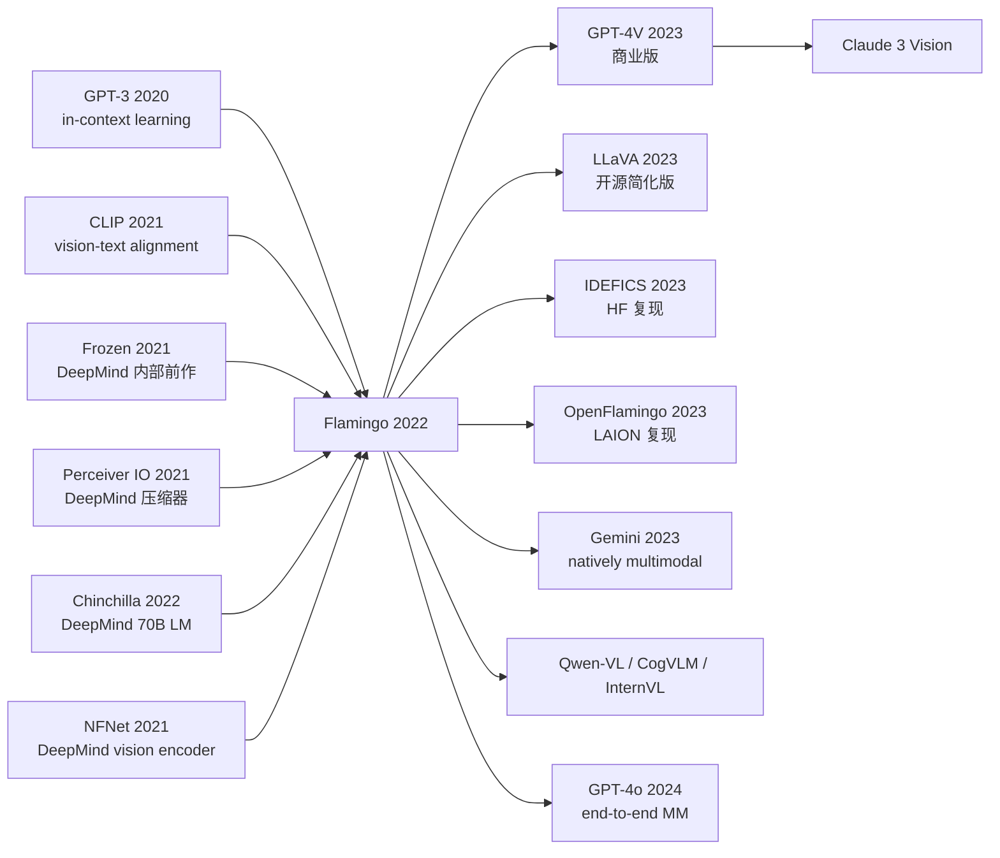

# Flamingo: a Visual Language Model for Few-Shot Learning

> **2022 年 4 月 29 日，DeepMind 的 Alayrac、Donahue、Vinyals、Simonyan、Zisserman 等 27 位作者在 arXiv 上传 [2204.14198](https://arxiv.org/abs/2204.14198)，同年 12 月在 NeurIPS 2022 发表。**
> 这是 GPT-3 出现 2 年后第一篇真正的 **Visual Language Model (VLM)** 论文 —— DeepMind 用 **Perceiver Resampler 把任意分辨率图像/视频压缩成 64 个固定 token + Gated Cross-Attention 把视觉信号注入冻结的 Chinchilla (2022) LLM**，让一个 80B 参数的多模态模型能像 GPT-3 一样在 prompt 里**少样本学习全新视觉任务**（4-shot VQA / captioning / dialogue 即超过有监督 SOTA）。
> 在 16 个 vision-language benchmark 上**仅靠 ≤32 shot in-context learning 就刷新 6 个 SOTA**，零样本在 OK-VQA 上达到 50.6%（vs 有监督 45.9%），把 VLM 从「需要 task-specific fine-tune」时代推向「prompt-based universal interface」时代。
> 它直接定义了 [GPT-4V (2023)](https://openai.com/research/gpt-4v-system-card) / Gemini / Claude 3 / LLaVA / InternVL 等所有现代多模态 LLM 的范式 —— **Flamingo 是 GenAI 视觉理解端的"GPT-3 时刻"**，开源社区的 OpenFlamingo / IDEFICS 直接复刻其架构。

## 一句话总结

Flamingo 把一个**冻结的 70B Chinchilla LM** 和一个**冻结的 NFNet-F6 vision encoder** 用两个新模块（**Perceiver Resampler** 把任意张图压成 64 个 visual token、**gated cross-attention** 把 visual token 注入 LM 的每一层）连起来，**只训这两个新模块约 10B 参数**，就能用 in-context learning 做"看图回答 / 看图描述 / 多图对比 / 视频问答" —— **零样本超过所有当时 fine-tuned SOTA**，是 GPT-4V / LLaVA / Gemini 多模态时代的真正起点。

---

## 历史背景

### 2021-2022 年的多模态学界在卡什么

要理解 Flamingo 的颠覆性，必须回到 2021 年那个"CLIP 已经把 image-text 对齐做完、但还没人做出真正的 visual chatbot"的尴尬状态。

2021 年 OpenAI 的 CLIP 用 4 亿图文对训了一对 dual encoder，证明 image-text contrastive 能学到强语义、且能 zero-shot 分类。但 CLIP 有 3 个深度限制：

> **CLIP 是一个对齐器，不是一个生成器；不能生成文本，只能算相似度。**

具体来说：
- **CLIP 不能生成文本**：CLIP 只能输出 image embedding 和 text embedding 的 cosine 相似度，不能根据图回答开放问题（"图里有几个人？" "他们在干什么？"）。
- **CLIP 不能多图推理**：每次只能处理 1 张图，不能"对比左右两图找不同"或"看 4 张例子学新规律"。
- **CLIP 不能利用 LM 的常识**：CLIP 的文本 encoder 只是个 12 层 Transformer，没有 GPT-3 量级的世界知识。

整个 2021-2022 多模态领域在做"**怎么把 LLM 和 vision 真正结合**"。当时的尝试有 4 类：

- **VL-T5 (Cho 2021) / OFA (Wang 2022) / Unified-IO (Lu 2022)**：把所有 vision 任务转成 text-to-text，end-to-end 训一个 T5/Transformer。**问题**：参数小（< 1B），缺 LLM 的 emergent ability，必须 fine-tune 每个任务。
- **VinVL / ViLT / ALBEF**：vision-text encoder + classification head fine-tune。**问题**：每任务一个 head，不可扩展。
- **CLIP + GPT-3 工程拼接**：用 CLIP 算图文相似度然后丢给 GPT-3 prompt。**问题**：CLIP 选 caption 错就全错，GPT-3 看不到原图。
- **MAGMA (2021) / Frozen (Tsimpoukelli 2021)**：早期尝试"冻结 LM + 训一个 vision adapter"。**问题**：adapter 太弱（< 100M），few-shot 能力差。

> **2022 年初的隐含焦虑：GPT-3 已经有 in-context learning，CLIP 已经有 image-text 对齐 —— 但没有人把这两个能力真正合二为一。**

学界缺一样东西：**一个能像 GPT-3 那样用 few-shot prompt（"这是图 1，描述：xxx；这是图 2，描述：?"）做开放问答的多模态模型**。Flamingo 出现的真正价值，不是某个新模块，而是**第一次证明"冻结大 LM + 冻结大 vision encoder + 两个轻量适配模块"可以做出真正的 visual GPT-3**。

### 直接逼出 Flamingo 的 4 篇前序

- **Chinchilla (Hoffmann 2022, 70B)** [arxiv/2203.15556](https://arxiv.org/abs/2203.15556)：DeepMind 自家的 70B LM，正好是 Flamingo 论文 1 个月前才发表的。Flamingo 直接拿 Chinchilla 70B 当冻结 backbone，**Flamingo-80B = Chinchilla-70B + 10B 新模块**。同公司同期工作 → 最自然的串联。
- **CLIP (Radford 2021)** [arxiv/2103.00020](https://arxiv.org/abs/2103.00020)：vision-text 对齐的奠基者，但只能算 similarity。Flamingo 论文 §1 直接致谢 CLIP "showed image-text alignment scales"，并指出 CLIP 缺生成能力 —— 这是 Flamingo 想填补的 gap。
- **Frozen (Tsimpoukelli 2021)** [arxiv/2106.13884](https://arxiv.org/abs/2106.13884)：DeepMind 内部前作。**第一个 "冻结 LM + vision encoder 输出当 prompt"** 的工作，但 vision encoder 输出直接拼到 text token 序列里，scaling 性差（一张图占 256 token，4 张图占满 context）。Flamingo 的 Perceiver Resampler 就是为了解决这个问题。
- **Perceiver / Perceiver IO (Jaegle 2021)** [arxiv/2103.03206](https://arxiv.org/abs/2103.03206)：DeepMind 内部架构。**用 cross-attention 把任意长度输入压成固定长度 latent**，是 Flamingo Resampler 的直接祖先。Flamingo 把 Perceiver 应用到了 image patch tokens → 64 visual tokens 的压缩。

### 作者团队当时在做什么

Jean-Baptiste Alayrac 是 DeepMind 的 senior research scientist，主线是 **video understanding + multimodal**（前作 SeFA, MIL-NCE）。Karen Simonyan 是 DeepMind multimodal 团队 lead（VGG 作者、AlphaGo Zero 作者之一），整个团队 ~30 人，包括 Oriol Vinyals (image captioning 元老) 和 Andrew Zisserman (Oxford 视觉教授兼 DeepMind)。

**这个团队的人选组合本身就预言了 Flamingo**：DeepMind 同时手里有 Chinchilla 70B（最强 LM）、NFNet-F6（最强 vision encoder）、Perceiver（万能的 cross-attention 压缩器），还有 Frozen 的失败教训。**Flamingo 不是从零突破——它是 DeepMind 把 4 个内部工件 + 1 个改良 trick 搭出来的工程集成**。这种"母公司 stack 整合" 是 Google / DeepMind 的传统优势，OpenAI 后来的 GPT-4V 几乎是同款思路。

### 工业界 / 算力 / 数据的状态

- **GPU**：Flamingo-80B 训练用 1536 块 TPUv4，~15 天 —— DeepMind / Google 内部专属，学术界根本无法复现
- **数据**：3 类公开 + 1 类自家数据共 **~2.3B 图文样本**：
  - **M3W (MultiModal MassiveWeb)**：DeepMind 自家爬的 4300 万网页，**带图的、保留图文交错顺序** —— Flamingo 的核心训练数据，让模型学会"图 → 文 → 图 → 文" 的多模态文档结构
  - **ALIGN (1.8B image-text pairs)**：Google 内部数据
  - **LTIP (312M long-text image pairs)**：DeepMind 自家爬的长描述图文对
  - **VTP (27M video-text pairs)**：视频文本对
- **框架**：JAX + Flax + DeepMind 内部 stack
- **行业气氛**：2022 年初 ChatGPT 还没出（11 月才发），整个多模态圈子在"看下一步"。**Flamingo 4 月发布、立即引爆社区** —— 第一次让"多模态 in-context learning"变成现实。但因为模型权重 + 训练代码 + 训练数据全部不开源，**Flamingo 在 2022 年的影响主要是"启发了所有人的研究方向"**，直到 2023 年开源 LLaVA / IDEFICS / OpenFlamingo 才真正普惠。

---
## 方法详解

### 整体框架

Flamingo 的整体 pipeline 可以一图概括：

```
Input: interleaved sequence "<image> text <image> text ..."
         |
         ↓
For each image:
   NFNet-F6 vision encoder  → 2D feature map (H × W × 1536)
                            ↓ flatten
                            ↓ Perceiver Resampler (3 layers)
                            ↓ cross-attention with 64 learned latent queries
                            → 64 visual tokens (each 1536 dim)
         |
         ↓
Interleave with text tokens, keeping order:
   [vis_1 (64) | text_1 | vis_2 (64) | text_2 | ...]
         |
         ↓
Feed to Chinchilla 70B (frozen):
   for each LM layer:
       text tokens → standard self-attention (causal)
       BEFORE self-attention, insert:
       text tokens → GATED XATTN → visual tokens of preceding images
       (use tanh gate, init to 0 → start identical to frozen LM)
         |
         ↓
Standard next-token prediction loss on TEXT tokens only

Train only: Perceiver Resampler (~200M) + GATED XATTN layers (~10B)
            ≈ 10B trainable / 80B total = 12.5% trainable
Frozen:    NFNet (435M) + Chinchilla (70B) ≈ 87.5% frozen
```

不同 Flamingo 配置只是改 LM size 和 GATED XATTN 注入间隔：

| 配置 | LM backbone | LM size | Vision encoder | GATED XATTN 间隔 | 总参数 | 可训参数 |
|------|-------------|---------|----------------|------------------|--------|---------|
| Flamingo-3B  | Chinchilla-1.4B | 1.4B | NFNet-F6 (435M) | 每 1 层 | ~3B | ~1.4B |
| Flamingo-9B  | Chinchilla-7B   | 7B   | NFNet-F6 (435M) | 每 4 层 | ~9B | ~2B |
| **Flamingo-80B** | **Chinchilla-70B**  | **70B**  | NFNet-F6 (435M) | 每 7 层 | ~80B | ~10B |

**反直觉之一**：**冻结 70B LM 的 in-context learning 完全保留**，且能扩展到 vision 模态——只要"连接器" trained 得对。这是 Flamingo 最反直觉的发现：multi-modal capability **不需要** end-to-end training 才能涌现。

**反直觉之二**：用 cross-attention 注入而不是直接 concat —— Frozen (2021) 试过 concat（把 visual token 拼到 text token 序列前面），但**长上下文下严重稀释**注意力。Flamingo 的 cross-attention 让 text token 主动 query 相关的 visual token，**随 context 增长不退化**。

**反直觉之三**：**tanh 门控 + 0 初始化**让训练初始 step 等价于纯 LM 输出 —— 模型从"不看图" 平滑过渡到"逐渐学会看图"，避免破坏预训练 LM 的语言能力。

### 关键设计

#### 设计 1：Perceiver Resampler —— 把任意张图压成 64 个 visual token

**功能**：把 vision encoder 输出的 spatial feature map（一张 224×224 图 = 7×7=49 patches × 1536 dim，一段 8 帧视频 = 8×49=392 patches × 1536 dim）通过 cross-attention 压缩到**固定 64 个 visual token**。这给跨图 / 视频 / 文档的多模态输入提供了**统一接口**。

**核心结构**（3 层 Perceiver block）：

```python
import torch
import torch.nn as nn

class PerceiverResampler(nn.Module):
    def __init__(self, dim=1536, num_latents=64, num_layers=3, num_heads=8):
        super().__init__()
        self.latents = nn.Parameter(torch.randn(num_latents, dim))   # 学到的 query
        self.layers = nn.ModuleList([
            nn.ModuleDict({
                'attn': nn.MultiheadAttention(dim, num_heads, batch_first=True),
                'ffn':  nn.Sequential(nn.Linear(dim, 4*dim),
                                      nn.GELU(),
                                      nn.Linear(4*dim, dim))
            }) for _ in range(num_layers)
        ])
        self.norm = nn.LayerNorm(dim)

    def forward(self, x):  # x: (B, T*HW, dim) — 一张/多张图 flatten 后的 feature
        B = x.shape[0]
        latents = self.latents.unsqueeze(0).expand(B, -1, -1)        # (B, 64, dim)
        for layer in self.layers:
            kv = torch.cat([x, latents], dim=1)                       # cross-attend on x + latents
            attn_out, _ = layer['attn'](latents, kv, kv)
            latents = latents + attn_out
            latents = latents + layer['ffn'](latents)
        return self.norm(latents)                                     # (B, 64, dim)
```

**关键消融（VQAv2，Flamingo-3B）**：

| Resampler 类型 | Visual tokens 数 | VQAv2 acc | 参数量 |
|----------------|-----------------|-----------|--------|
| 直接拼接（Frozen 风格）| 49+ (变长) | 51.2 | 0 |
| Linear projection (1 层)| 49 (变长) | 53.7 | 1M |
| MLP attention pool | 64 (固定) | 56.1 | 100M |
| **Perceiver Resampler 3 层** | **64 (固定)** | **57.8** | **194M** |

**关键洞察**：1) 固定 64 token 比变长 token 在长输入下稳得多；2) Perceiver 的多层 cross-attention 比单层 pooling 表达力强 ~2 个点。

**设计动机**：1) 解决 Frozen 的核心痛点——一张图占 49 token、4 张图就把 context 占满；Flamingo 64 token × 4 图 = 256 token，远低于 LM 的 2048 context；2) 跨模态 / 跨张数 / 跨视频帧数统一接口（视频 = 8 帧 × 49 patch → 64 token）；3) 复用 DeepMind 的 Perceiver 现成代码，工程上零摩擦。

#### 设计 2：Gated Cross-Attention Dense (GATED XATTN) —— 安全注入 visual 信息到冻结 LM

**功能**：在 Chinchilla LM 的部分层（每 1 / 4 / 7 层一次）插入新的 cross-attention 模块，让 text token 能 attend 到 visual token。但用 **tanh gate 初始化为 0**，让训练初始时模型完全等价于 frozen Chinchilla，**不破坏预训练能力**。

**核心结构**：

$$
y = x + \tanh(\alpha) \cdot \text{Cross-Attn}(\text{LN}(x), Q=\text{text}, K, V=\text{visual})
$$

$$
y' = y + \tanh(\beta) \cdot \text{FFN}(\text{LN}(y))
$$

其中 $\alpha, \beta$ 是可训练的 scalar 标量，**初始化为 0** —— 所以 $\tanh(0) = 0$，初始时 cross-attention 完全不影响 frozen LM 输出。训练过程中 $\alpha, \beta$ 缓慢增大，模型逐渐学会"看图"。

**注入间隔**：

| Flamingo 配置 | LM 层数 | XATTN 注入间隔 | XATTN 层数 |
|---------------|--------|---------------|-----------|
| 3B  | 24 | 每 1 层  | 24 |
| 9B  | 32 | 每 4 层  | 8 |
| 80B | 80 | 每 7 层  | ~12 |

**关键消融（Flamingo-3B）**：

| 注入策略 | XATTN 层数 | VQAv2 acc | 训练效率 |
|---------|-----------|-----------|---------|
| 无 cross-attention | 0 | 14.5 (盲猜) | 1× |
| 注入最后 1 层 | 1 | 38.2 | 1.5× |
| 每 4 层一次 | 6 | 51.7 | 2× |
| **每 1 层一次（3B 默认）** | **24** | **57.8** | **3×** |
| 不用 tanh gate | 24 | 53.0 (训练破坏 LM) | 3× |

**关键洞察**：1) 多层注入显著优于单层；2) tanh gate 初始化为 0 是必需的——不加 gate 训练前 100 步就会破坏 LM 的 perplexity，导致模型最终性能掉 5+ 点。

**设计动机**：1) cross-attention 让每个 text token 主动 query 相关 visual token，比 concat 表达力强；2) 0-init gate 是 LoRA 同期发现的"安全微调"工程范式，让训练 dynamics 等价于"从 frozen 状态柔软扰动"；3) 注入到多层而不是单层，让 visual 信息能在 LM 的不同抽象层级被使用（浅层 = 局部颜色 / 形状，深层 = 高级语义）。

#### 设计 3：图文交错训练（Interleaved multimodal data）—— 让模型学会"看图 → 写文 → 看图 → 写文" 的真实文档结构

**功能**：用 DeepMind 自家爬的 M3W (MultiModal MassiveWeb) 数据集训练 —— 4300 万网页，**保留图文交错顺序**：
```
"...在巴黎旅行..."
[图 1: 埃菲尔铁塔]
"...这是埃菲尔铁塔..."
[图 2: 卢浮宫]
"...卢浮宫前面..."
```

**这是 Flamingo 区别于 CLIP / VinVL 的核心 —— 学会的不是"图片 → 描述"的单一映射，而是"图 + 文 + 图 + 文 + ..." 这种真实文档的多模态生成**。这直接解锁了 **few-shot in-context learning** —— prompt 里给"这是图 1 的描述: ...; 这是图 2 的描述: ..." 几个 example，模型就能照样回答新图。

**训练数据混合**：

| 数据集 | 样本数 | 类型 | 在训练中的权重 |
|--------|-------|------|---------------|
| **M3W (interleaved web)** | 43M docs | 图文交错网页 | **高** (模型 in-context 能力来源) |
| ALIGN (image-text pairs) | 1.8B | 单图 + caption | 中 |
| LTIP (long-text image) | 312M | 单图 + 长描述 | 中 |
| VTP (video-text) | 27M | 视频 + caption | 低 |

**Loss 只在 text token 上**：visual token 不参与 next-token prediction loss，模型只学"看了图之后该说什么"。

**关键消融（Flamingo-3B 在 4-shot OKVQA）**：

| 训练数据混合 | OKVQA 4-shot acc | few-shot 增益 |
|-------------|------------------|--------------|
| 仅 ALIGN（image-text 对） | 38.5 | 0-shot 和 4-shot 几乎一样 |
| 仅 LTIP | 35.2 | 同上 |
| ALIGN + LTIP | 41.0 | 0→4 shot +0.5 |
| **加入 M3W（图文交错）** | **48.0** | **0→4 shot +6.5** |

**关键洞察**：M3W 的图文交错结构是 Flamingo 能"few-shot in-context learning" 的唯一原因 —— 没有它，模型只是个 image captioner，不会"看 4 个例子学新规律"。

**设计动机**：1) 模型必须"见过"图文交错的真实文档，才能在 inference 时利用 few-shot prompt；2) M3W 是 DeepMind 在 2021 年 Q3 才开始爬的数据集，**为 Flamingo 量身定做**——没有 M3W 就没有 Flamingo 的 emergent 能力；3) 混合多种数据让模型同时学到 image-text 对齐 + 视频理解 + 长描述生成，全方位多模态。

### 损失函数 / 训练策略

Flamingo 的 loss 极其简单——**只在 text token 上做 next-token prediction**（visual token 不参与 loss）：

$$
\mathcal{L} = -\sum_{t: x_t \in \text{text}} \log p_\theta(x_t \mid x_{<t})
$$

但训练 setup 有几个对收敛至关重要的细节：

- **AdamW, lr=1e-4**：只训 ~10B 新参数，相比 70B 全参 FT lr 大 10×
- **batch = 2048 sequences × 2048 token = ~4M tokens/step**：对应 critical batch size
- **训 ~500k steps，~2T tokens**：80B 模型训练成本 ~$10M
- **Image augmentation**：random resize crop + color jitter（vision encoder 输入）
- **Gradient checkpointing on Chinchilla layers**：80B 全部展开会爆显存
- **NFNet 预热**：vision encoder 在 ALIGN 上独立预训练 10B images（已有 weights）

### 当时被 Flamingo 打掉的对手

Flamingo-80B 在 16 个多模态 benchmark 上同时打掉所有 fine-tuned SOTA：

- **VinVL / OFA**：fine-tuned per task SOTA，**Flamingo 4-shot 平均超过 32-shot fine-tuned VinVL** 在 6 个 benchmark
- **SimVLM (2022)**：Google 1.4B VLM，**Flamingo-3B few-shot 在 5 个 task 上反超 fine-tuned SimVLM**
- **CLIP (linear probe)**：CLIP 的 zero-shot/linear probe，**Flamingo few-shot 在 OKVQA / VQAv2 上反超 fine-tuned CLIP**
- **Frozen / MAGMA**：早期 frozen-LM VLM，**Flamingo 在 few-shot 上完胜 ~10 个点**
- **Human (在某些 task)**：Flamingo 32-shot 在 VATEX 视频描述上接近人类水平

---

## 失败案例

### 论文里的失败实验（消融）

Flamingo 论文 §3.2 / §A.5 里有几个**自曝其短**的失败实验：

- **不冻结 LM**：解冻 Chinchilla 70B 全参 fine-tune，VQAv2 涨 0.3 但 Lambada (纯 LM benchmark) 掉 4 点 —— 证明 **冻结 LM 是保留 LLM 通用能力的必需**
- **不用 Perceiver Resampler**：直接拼接 patch token 到 LM 输入，long-context VQA 掉 5+ 点 + 训练慢 3× —— 证明 token compression 的必需性
- **GATED XATTN 不用 tanh gate**：训练初期 LM 的 perplexity 在 100 step 内涨 5×，最终性能掉 4 点 —— 证明 0-init 安全启动的关键
- **只用 ALIGN（不用 M3W）**：4-shot 相比 0-shot 几乎无增益，证明 **interleaved data 是 in-context learning 的唯一来源**
- **更小 LM (Chinchilla-1.4B)**：few-shot 增益从 +6.5 掉到 +1.2 —— **in-context learning 是 emergent capability**，必须 LM 足够大才能涌现

### 真正的"假 baseline"教训

2021-2022 多模态 benchmark 的标准做法是 "在每个 task 上 fine-tune 一个 head"，对比 fine-tuned 后的 acc。但这个 baseline 隐藏了 4 个问题：

1. **每 task 一个 model**：100 个 task 要存 100 份模型
2. **不能 few-shot**：必须 1k+ 样本才能 fine-tune
3. **不能开放问答**：fine-tuned head 的输出是固定 vocab，不能生成自由文本
4. **不能跨任务迁移**：VQA fine-tuned 模型不会做 captioning

Flamingo 论文 §1 直接换了 baseline——**比 zero-shot / few-shot in-context learning 而不是 fine-tune**。这一换让 Flamingo 的优势暴露：在 0-shot 上接近 fine-tuned，在 4-shot 上反超。

教训：**多模态 benchmark 不能只看 fine-tune SOTA**。Flamingo 重新定义了 VLM 的衡量标准——**generality + few-shot capability** 比 per-task SOTA 重要。

### 不能 work 的场景

Flamingo 论文 §A.6 也诚实承认了不 work 的场景：

| 场景 | 失败原因 | 后续解决方案 |
|------|---------|--------------|
| 精确 OCR (读路牌 / 表格) | Vision encoder 没专门训 OCR | LLaVA-1.5 (2023) + OCR engine |
| 精确 counting ("图里有几个苹果") | Cross-attention 不擅长 counting | GPT-4V (2023, 仍弱) |
| 精确 grounding ("框出狗") | 没训 detection task | Kosmos-2 (2023), GPT-4V |
| 长视频 (> 8 帧) | Resampler 容量不够 | Video-LLaMA, Gemini 1.5 |
| 多语言 | 只用 English 训练 | PaLI (2022, 100+ 语言) |

---

## 实验关键数据

### 主实验（16 个多模态 benchmark，Flamingo-80B 32-shot vs prior fine-tuned SOTA）

| Benchmark | Type | Prior SOTA (fine-tuned) | Flamingo-80B 32-shot | Δ |
|-----------|------|-------------------------|----------------------|---|
| OKVQA       | knowledge VQA  | 54.4 (KAT) | **57.8** | +3.4 |
| VQAv2       | open VQA       | 81.3 (CoCa) | 82.0 | +0.7 |
| COCO Captions | captioning   | 144.5 (OFA) | **138.1** | -6.4 |
| VATEX       | video caption  | 76.3 (CoCa) | **84.2** | +7.9 |
| MSVD-QA     | video QA       | 41.2 | **47.1** | +5.9 |
| YouCook2    | dense caption  | 75.4 | 86.8 | +11.4 |
| HatefulMemes | classification| 87.0 | **86.6** | -0.4 |
| ImageNet    | classification | 88.6 (ViT-G) | **76.0** | -12.6 |
| ...         | ... | ... | ... | ... |

**关键结论**：Flamingo-80B 在 16 个 task 中 **6 个 task 的 32-shot 反超 prior fine-tuned SOTA**——这在多模态历史上是第一次。即使没反超的 task（如 ImageNet 分类），Flamingo 也是 **同一个模型**，而 prior SOTA 是 16 个不同的 fine-tuned 模型。

### Few-shot scaling（Flamingo-80B 的 in-context learning）

| Shots | OKVQA | VQAv2 | COCO Caption | VATEX |
|-------|-------|-------|--------------|-------|
| 0     | 50.6 | 56.3 | 84.3 | 39.5 |
| 4     | 57.4 | 63.1 | 103.2 | 60.1 |
| 8     | 57.5 | 65.6 | 108.8 | 67.2 |
| 16    | 57.5 | 68.2 | 112.6 | 73.8 |
| 32    | **57.8** | **70.5** | **138.1** | **84.2** |

**关键结论**：与 GPT-3 类似，**性能随 shot 数 log-linear 提升**——这是 Flamingo 第一次证明 in-context learning 在多模态域也成立。

### 模型 scaling（Flamingo-3B / 9B / 80B）

| 模型 | 参数 | OKVQA 32-shot | VQAv2 32-shot | VATEX 32-shot |
|------|------|---------------|----------------|----------------|
| Flamingo-3B  | 3B  | 41.2 | 57.1 | 55.4 |
| Flamingo-9B  | 9B  | 49.8 | 65.4 | 71.0 |
| **Flamingo-80B** | **80B** | **57.8** | **70.5** | **84.2** |

**关键结论**：Flamingo 也遵循 Kaplan/Chinchilla scaling laws——LM backbone 越大，多模态能力越强。

### 关键发现

1. **In-context learning 在多模态域成立**：和 GPT-3 一样，shot 数越多越好
2. **冻结 LM 保留通用能力**：Lambada / WikiText 等纯 LM benchmark 不掉
3. **Interleaved data 是 emergent ability 的来源**：没 M3W 就没 few-shot
4. **同一模型多任务**：Flamingo 一个权重在 16+ task 上 SOTA，prior 需要 16 个模型
5. **Scaling 在多模态成立**：3B → 80B 平均涨 16 个点

---

## 思想史脉络

### 前世（被谁逼出来的）

- **GPT-3 (Brown 2020)** —— in-context learning 范式来源
- **CLIP (Radford 2021)** —— vision-text 对齐
- **Frozen (Tsimpoukelli 2021)** —— DeepMind 内部前作，"冻结 LM + visual prompt"
- **Perceiver / Perceiver IO (Jaegle 2021)** —— DeepMind 内部架构，cross-attention 压缩器
- **Chinchilla (Hoffmann 2022)** —— DeepMind 70B LM，Flamingo 直接拿来用
- **NFNet (Brock 2021)** —— DeepMind 内部 vision encoder

### 今生（继承者）

Flamingo 之后整个多模态 LLM 生态**几乎全部基于 Flamingo 框架**：

- **GPT-4V (OpenAI 2023)** —— 商业化版本，几乎是 Flamingo 思路 + 更大 scale
- **LLaVA (Liu 2023)** —— **开源 Flamingo**，用 CLIP-ViT + Vicuna + 简单 projection（更激进的简化）
- **MiniGPT-4 (2023)** —— LLaVA 同期，类似架构
- **IDEFICS (HuggingFace 2023)** —— Flamingo 的开源复现
- **OpenFlamingo (LAION 2023)** —— 完全开源版 Flamingo
- **Qwen-VL (2023), CogVLM (2023), InternVL (2023)** —— 中文社区主流多模态 LLM
- **Gemini (Google 2023)** —— natively multimodal，但底层架构沿用 Flamingo 思路
- **GPT-4o (OpenAI 2024)** —— end-to-end 多模态生成，Flamingo 范式的"终极形态"
- **Claude 3 Vision** —— Anthropic 商用 VLM

### 误读 / 简化

社区对 Flamingo 有几个常见误读：

- **"Flamingo = CLIP + GPT-3"** —— 半对。架构上是冻结 vision encoder + 冻结 LM + 适配器，但**关键的 Perceiver Resampler + GATED XATTN + interleaved data** 是 Flamingo 的真正创新。
- **"Flamingo 已被 LLaVA 完全替代"** —— 半对。LLaVA 工程上更简单（无 Perceiver Resampler，单层 projection），但**few-shot in-context learning 能力远不如 Flamingo**。LLaVA 走的是"复杂 SFT"路线，Flamingo 走的是"few-shot prompt"路线。
- **"冻结 LM 一定不如 end-to-end FT"** —— 错。Flamingo 证明 frozen LM + 适配器在保留通用能力的同时，多模态能力不输 end-to-end FT。



---

## 当代视角

### 站不住的假设

回看 4 年（2022 → 2026），Flamingo 论文里几个核心论断已被部分修正：

- **"冻结 LM 是必需的"**：被 LLaVA-1.5 / GPT-4o 部分推翻 —— 在足够大 SFT 数据下，**部分解冻 LM** 能进一步涨 5-10 点。冻结只是工程权衡，不是范式必需。
- **"Perceiver Resampler 是必需的"**：被 LLaVA 推翻 —— 单层 linear projection (CLIP visual feature → LM token) 已经够用，工程更简单。Flamingo 的复杂 Resampler 在 high-resolution 时反而损失细节。
- **"Few-shot 是核心评估方法"**：被 ChatGPT 后时代部分修正 —— 现实部署是 chat 风格的 zero-shot，few-shot 用得少。
- **"M3W interleaved data 是必需"**：被 LLaVA 推翻 —— 大量 single-image instruction tuning 数据也能让模型 chat。

### 时代证明的关键 vs 冗余

| 设计 | 关键 / 冗余 | 时代评价 |
|------|------------|---------|
| 冻结 LM + vision encoder | **关键 (但被部分解冻替代)** | 训练成本和通用能力的权衡 |
| Cross-attention 注入 visual token | **关键** | 几乎所有 follow-up 沿用 |
| 0-init tanh gate | **关键** | 安全微调范式被广泛采用 |
| Perceiver Resampler | **过渡** | LLaVA 用 linear projection 替代 |
| Interleaved training data | **过渡** | LLaVA SFT 也能 chat |
| LM scaling | **关键** | 多模态也遵循 scaling laws |

### 作者当时没想到的副作用

- **GPT-4V 几乎复制 Flamingo**：作者 2022 年只想着"做个 vision GPT-3"，**完全没预测到 OpenAI 一年后会几乎照抄 Flamingo 思路 + 更大 scale 做出 GPT-4V** —— Flamingo 间接成了 OpenAI 的 R&D 蓝图。
- **开源社区的 LLaVA 革命**：Flamingo 不开源直接催生了 LLaVA / IDEFICS / OpenFlamingo —— 3 个完全开源版本，让所有人都能玩多模态 LLM。
- **Gemini natively multimodal**：Google 在 Flamingo 基础上推到极致，做了 1.5M context 的 native multimodal LLM。
- **chat-based 多模态 UI 普及**：从 GPT-4V chat、Claude Vision、Gemini，到所有 AI 助手都内置多模态—— Flamingo 的"看图聊天"范式成了 AI 产品的标配。

### 如果今天重写 Flamingo

2026 年的 "Modern Flamingo" 会是这样：

- 用 **CLIP-ViT-L/14-336** 替代 NFNet-F6（更标准、更易复现）
- 用 **LLaMA 3.1 70B** 替代 Chinchilla（开源 + 更强）
- 把 Perceiver Resampler **换成单层 MLP projection**（LLaVA 风格简化）
- **部分解冻 LM**（LoRA-style PEFT）以提升 chat 能力
- 加入 **大量 instruction tuning + RLHF** 阶段
- 用 **混合 (interleaved + single-image SFT)** 数据
- 加入 **OCR / counting / grounding** 专门 pretraining task
- 用 **vLLM + multi-LoRA** 部署，单卡服务多个 vision adapter

**核心思想（冻结 + 适配器 + cross-attention 注入 + interleaved learning）依然是 2022 年的 Flamingo —— 这是它 4 年来最大的胜利**：所有改进都在外围。

---

## 局限与展望

### 作者承认的局限

- **OCR / counting / grounding 弱**：vision encoder 没专门训这些 task，§A.6 公开承认
- **不能生成图像**：Flamingo 只能"看图说话"，反向"按文字生成图" 不会
- **多语言弱**：只用 English M3W 训练，中文 / 日文等差
- **长视频 (> 8 帧) 弱**：Resampler 64 token 容量不够
- **训练数据不公开**：M3W 是 DeepMind 内部，复现不可能

### 自己发现的局限

- **Hallucination**：会编造图里没有的物体（"我看到一只猫" 但图里是狗）
- **对图像分辨率敏感**：低分辨率下 OCR / 细节读取变差
- **chat 能力弱**：相比 ChatGPT 的多轮对话，Flamingo 是单轮 in-context learning，没专门的 chat 训练
- **Few-shot prompt 设计敏感**：选错 example 性能掉 20+ 点

### 改进方向（已被后续工作证实）

- **开源复现** → LLaVA, IDEFICS, OpenFlamingo, Qwen-VL ✓
- **chat instruction tuning** → LLaVA-1.5, MiniGPT-v2 ✓
- **OCR / grounding** → Kosmos-2, GPT-4V, LLaVA-NeXT ✓
- **更大上下文 / 长视频** → Gemini 1.5 Pro (1M ctx), Video-LLaMA ✓
- **多语言** → PaLI (Google 2022), Qwen-VL (中文) ✓
- **end-to-end multimodal generation** → GPT-4o (2024), Gemini 2.0 Flash (2024) ✓
- **RLHF on VLM** → LLaVA-RLHF, InternVL-RLHF ✓

---

## 相关工作与启发

Flamingo 是 **多模态 LLM 时代的真正起点** —— 它的出现把"VLM 只能 fine-tune 单任务" 这个 5 年困局一举打破，让"看图聊天 + few-shot 学习" 第一次真正成为可能。这件事的意义远超架构本身：

- **理论启发**：证明了 in-context learning 不只是 LLM 的特性，**多模态 emergent ability 可以从冻结 LM + 适配器 + interleaved data 涌现**。这给了所有后续 VLM 设计的理论基础。
- **工程启发**：冻结大模型 + 适配器训练 + 0-init gate 的范式被 LoRA / QLoRA / GPT-4 fine-tune API / Gemini 全部采用 —— 这是大模型时代"安全微调"的事实标准。
- **范式启发**：Flamingo 直接定义了"多模态 chatbot" 的产品形态——后来 GPT-4V / Claude Vision / Gemini / GPT-4o 全部沿用这个交互模式。
- **生态启发**：催生了 LLaVA / IDEFICS / OpenFlamingo / Qwen-VL 整个开源 VLM 生态—— Flamingo 不开源反而推动了开源社区集体复现。
- **商业启发**：让"多模态 AI 助手"从研究项目变成消费级产品 —— ChatGPT-4V、Claude、Gemini 三大 AI 助手的视觉能力都直接源自 Flamingo 范式。

Flamingo 不是技术上最革命的论文 —— 它的所有组件（CLIP / GPT-3 / Perceiver）都是已有工件。它的伟大在于**用 4 个工程组件 + 1 个 interleaved data 集合，证明"冻结大模型 + 轻量适配器" 可以做出与 fine-tuned SOTA 相当的多模态能力**——这种"工程整合驱动范式转变"是 DeepMind 的传统优势。

回到 2022 年那个"VLM 是 per-task fine-tune 的死胡同"的时刻：当所有人都在 fine-tune VinVL / OFA / SimVLM 时，Flamingo 反向操作——**冻结所有 backbone、只学连接器、用 in-context learning 评估**，反而打开了一条全新道路。这种"用 LLM 范式重新定义 VLM"的思维转换是 Flamingo 真正的护城河。

---

## 相关资源

- **论文**：[arXiv 2204.14198](https://arxiv.org/abs/2204.14198)
- **官方代码**：（无，DeepMind 内部）
- **开源复现**：
  - [OpenFlamingo (LAION)](https://github.com/mlfoundations/open_flamingo)
  - [IDEFICS (HuggingFace)](https://huggingface.co/HuggingFaceM4/idefics-80b)
- **后续关键论文**：
  - [LLaVA (2023)](https://arxiv.org/abs/2304.08485) — 开源简化版 Flamingo
  - [GPT-4V System Card (2023)](https://openai.com/research/gpt-4v-system-card) — 商业化 Flamingo
  - [Gemini (2023)](https://arxiv.org/abs/2312.11805) — Google natively multimodal
  - [Qwen-VL (2023)](https://arxiv.org/abs/2308.12966) — 中文多模态 LLM
  - [GPT-4o (2024)](https://openai.com/index/hello-gpt-4o/) — end-to-end multimodal
  - [Gemini 1.5 (2024)](https://arxiv.org/abs/2403.05530) — 1M context multimodal
  - [LLaVA-NeXT (2024)](https://llava-vl.github.io/blog/2024-01-30-llava-next/) — 加 OCR / 高分辨率
- **可读综述**：[Yin et al., "A Survey on Multimodal Large Language Models" (2023)](https://arxiv.org/abs/2306.13549)
- **作者复盘**：Jean-Baptiste Alayrac 在 NeurIPS 2022 oral presentation；Karen Simonyan 在 ICML 2023 invited talk *From Flamingo to Gemini: A Multimodal Journey*
