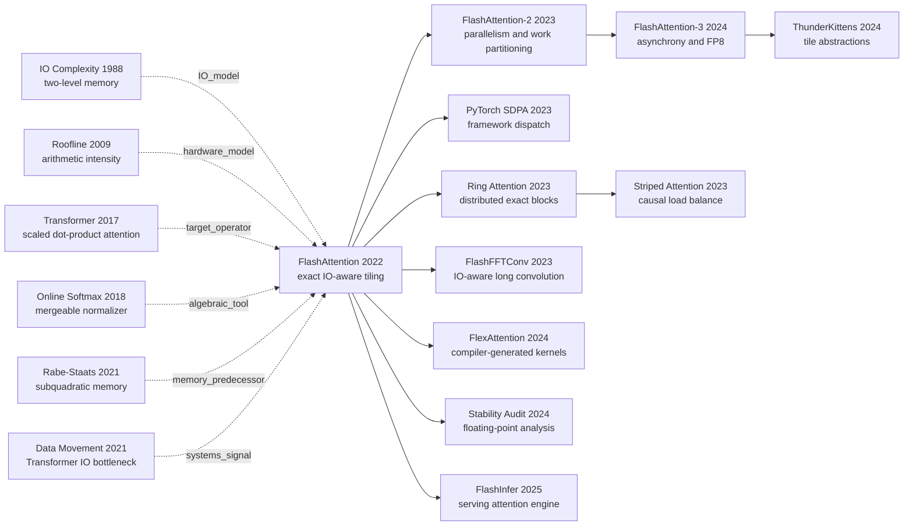

# FlashAttention：不减少一次注意力计算，为什么反而更快

> **2022 年 5 月 27 日，Tri Dao、Daniel Y. Fu、Stefano Ermon、Atri Rudra、Christopher Ré 五位作者把 [FlashAttention（arXiv:2205.14135）](https://arxiv.org/abs/2205.14135) 放上 arXiv；同年论文入选 NeurIPS 2022。** 当时长序列注意力研究几乎都在设法少算一些 token 对，FlashAttention 却保留完整的 $N^2$ 次交互，甚至在反向传播时主动多算一遍注意力块。它快的原因不是算术变少，而是拒绝把 $N\times N$ 的分数矩阵和概率矩阵来回搬进 GPU 的 HBM：论文 Figure 2 中，重计算把 66.6 GFLOPs 增到 75.2 GFLOPs，却把 HBM 读写从 40.3 GB 压到 4.4 GB、总时间从 41.7 ms 降到 7.3 ms。这个看似违反常识的结果，把“模型复杂度”问题改写成了“数据在存储层级间如何移动”的系统问题。

## 一句话总结

Tri Dao、Daniel Y. Fu、Stefano Ermon、Atri Rudra、Christopher Ré 五位作者在 NeurIPS 2022 发表的 FlashAttention，没有近似或删减 [Transformer](/era3_attention/2017_transformer/) 的缩放点积注意力 $O=\operatorname{softmax}(QK^\top/\sqrt d)V$，而是用 HBM/SRAM 分块、可合并的在线 softmax 统计量与反向重计算，让 $N\times N$ 的 $S$、$P$ 只在片上短暂存在。传统 PyTorch attention 在论文 Figure 2 的 GPT-2 medium 配置中读写 40.3 GB HBM、耗时 41.7 ms；FlashAttention 虽从 66.6 增至 75.2 GFLOPs，却只搬 4.4 GB、耗时 7.3 ms。它由此击败了两类失败 baseline：Reformer、Linformer、Performer 等方法降低理论 FLOPs 却改变注意力算子，Rabe 与 Staats 的精确低显存算法保住语义却没有把 IO 顺序优化到更快。后续 [FlashAttention-2](https://arxiv.org/abs/2307.08691) 把重点移到占用率与 warp 分工，[FlashAttention-3](https://arxiv.org/abs/2407.08608) 又针对 H100 的异步 TMA/WGMMA 和 FP8 重排流水线。隐藏的工程课不是“二次复杂度不重要”，而是：复杂度只说明工作量怎样增长，真实时间还取决于每类工作落在哪个硬件单元、数据被搬多少次。

---

## 历史背景

### 2022 年的长序列研究卡在哪里

2017 年的 [Transformer](https://arxiv.org/abs/1706.03762) 把一个注意力头写成 $S=QK^\top$、$P=\operatorname{softmax}(S)$、$O=PV$。这套结构可并行、效果好，但当序列长度从 $N$ 变为 $2N$，两个矩阵乘和中间注意力矩阵都会按 $N^2$ 增长。到 2020 年，问题已经催生出一整片“高效 Transformer”谱系：[Reformer](https://arxiv.org/abs/2001.04451) 用局部敏感哈希把复杂度改成 $O(N\log N)$，[Longformer](https://arxiv.org/abs/2004.05150) 只保留局部窗口与少量全局连接，[Linformer](https://arxiv.org/abs/2006.04768) 假设注意力矩阵可以低秩投影，[Performer](https://arxiv.org/abs/2009.14794) 则用随机特征近似 softmax 核。这些方法都在回答同一个模型问题：能否少算、少存一些 token 对？

但“渐近 FLOPs 更少”不自动等于“GPU 上更快”。FlashAttention 的论文在 Introduction 里直接指出，许多近似方法没有相对标准 attention 获得 wall-clock speedup，一个原因就是它们关注 FLOP 数，却忽略了内存访问、数据布局和 kernel 启动开销。密集 GEMM 已被 Tensor Core 与库函数高度优化；相反，mask、softmax、dropout 这类逐元素或归约操作常被 HBM 带宽限制。一个算法即使少做乘加，只要引入散乱访存、额外投影或多个 kernel，仍可能输给算得更多但数据路径规整的密集实现。

2021 年 12 月，Markus Rabe 与 Charles Staats 的 [Self-attention Does Not Need $O(n^2)$ Memory](https://arxiv.org/abs/2112.05682) 又把一个常见说法拆开：注意力的**时间**仍可为 $O(N^2)$，但辅助显存没有必要也是 $O(N^2)$。他们给出实践中 $O(\sqrt N)$ 显存、速度接近标准实现的算法。这证明“不物化完整注意力矩阵”在数学上可行，却留下了更尖锐的问题：怎样不仅省容量，还能真正减少慢速显存读写，让重算反而更快？FlashAttention 就从这里接过问题。

### 直接逼出 FlashAttention 的五条前史

第一条是经典的 IO complexity。Aggarwal 与 Vitter 1988 年的[两级存储模型](https://doi.org/10.1145/52325.52327)不只数算术操作，而是数数据在快、慢存储之间搬运多少次。FlashAttention 把 GPU 的片上 SRAM 与 HBM 放进这个模型，并把 IO 次数写成关于 SRAM 容量 $M$ 的函数。

第二条是 [Roofline 模型](https://doi.org/10.1145/1498765.1498785)。它用 arithmetic intensity，也就是“每搬一个字节能做多少运算”，区分 compute-bound 与 memory-bound。FlashAttention 不是否认 FLOPs，而是把 softmax attention 放回这个二维坐标：矩阵乘可以吃满 Tensor Core，softmax 与中间张量搬运却可能先撞上带宽屋顶。

第三条是 Milakov 与 Gimelshein 2018 年的[在线 softmax 归一化](https://arxiv.org/abs/1805.02867)。普通稳定 softmax 似乎必须先看完整一行才能知道最大值；在线算法证明只保存运行最大值 $m$ 与指数和 $\ell$，就能把多个分块精确合并。这是 FlashAttention 可以一块块消费 $QK^\top$、又不改变最终 softmax 的代数钥匙。

第四条是 Rabe 与 Staats 的精确低显存 attention。他们已经把 tiling 与重计算用于避免保存完整矩阵。FlashAttention Appendix B.5 对差异说得很清楚：前者主要优化峰值容量，运行时间与标准 attention 相近或略慢；FlashAttention 改写循环顺序、增量更新输出，并推导更直接的 backward，目标是同时降低 HBM 访问。

第五条来自同一团队在结构化矩阵上的连续实验。[Scatterbrain](https://arxiv.org/abs/2110.15343) 试图统一稀疏与低秩近似，[Pixelated Butterfly](https://arxiv.org/abs/2112.00029) 和 [Monarch](https://arxiv.org/abs/2204.00595) 则不断面对同一个现实：理论稀疏或低秩并不保证硬件收益。FlashAttention 最终采取更保守也更有穿透力的路线：先不改模型，只改等价计算的执行计划。

### 作者团队与论文的系统研究脉络

论文列出的五位作者来自 Stanford University 与 University at Buffalo, SUNY。Tri Dao、Daniel Y. Fu、Stefano Ermon、Atri Rudra、Christopher Ré 的组合把三个传统上分开的视角放进同一篇工作：机器学习模型语义、算法的 IO 复杂度，以及 CUDA kernel 的实际调度。论文不是凭空得到一段神奇 CUDA；Appendix E.4 明确说明，他们以 NVIDIA Apex 的 FMHA 为起点。FMHA 已经把 mask、softmax、dropout 与 $PV$ 融成一个 kernel，是当时短序列 BERT 的强实现，但它仍把 softmax 后的注意力矩阵写回 HBM，供 backward 使用。

团队做出的关键选择，是不把“算法论文”和“kernel 工程”分开。Theorem 1 证明分块在线更新仍返回完整 softmax attention；Theorem 2 把 HBM 访问写成 $\Theta(N^2d^2/M)$；CUDA 实现再验证块大小改变时，HBM 流量与运行时间如何共同变化。换言之，证明不是为实现装饰，profile 也不是为证明收尾：两者共同决定什么数据保留在 SRAM、什么统计量值得写回 HBM、什么中间量宁可重算。

这种研究方式还解释了论文为何把 block-sparse FlashAttention 放在“扩展”而非主算法中。主贡献先建立一个不牺牲语义的 exact primitive；只有在用户明确选择固定 butterfly sparsity 时，才跳过零块，进入近似路线。把 exact 与 approximate 的边界写清楚，是这篇系统论文比“某个 kernel 快了几倍”更耐久的原因。

### 当时的 GPU、框架与实现边界

FlashAttention 以 Ampere A100 为主要实验平台。论文给出的层级差异足以解释设计动机：HBM 容量巨大但相对慢，每个 SM 的 SRAM 极小却快一个数量级。关键不是把整个 $N\times N$ 矩阵塞进 SRAM，那不可能；而是选出能同时容纳 $Q_i,K_j,V_j,S_{ij}$ 与运行统计量的 tile，让每个 tile 在片上完成 GEMM、mask、softmax、dropout 和第二次 GEMM。

| 层级或执行单元 | FA1 论文给出的 A100 状态 | 对算法设计的含义 |
|---|---:|---|
| HBM | 40-80 GB，1.5-2.0 TB/s | 容量大，但应避免写入 $N\times N$ 中间矩阵 |
| 每个 SM 的 SRAM | 192 KB；108 个 SM | tile 必须很小，块尺寸受 $d$ 与 $M$ 共同约束 |
| 片上 SRAM 带宽 | 估计约 19 TB/s | 在片上多做一些运算通常比重复访问 HBM 便宜 |
| Tensor Core / GEMM | 密集矩阵乘高度优化 | 保留规整的块 GEMM，而不是只追求少 FLOPs |
| PyTorch / TensorFlow 接口 | 难以细控 HBM/SRAM 数据路径 | 论文需要手写 CUDA 并做跨算子融合 |

框架生态也塑造了论文。标准 PyTorch attention 把 $QK^\top$、softmax、dropout、$PV$ 当成多个算子；每个算子边界都可能把中间结果写回 HBM。编译器能融合若干逐元素操作，却很难在自动微分默认要求保存激活时跨越整条 attention 链。FlashAttention 因此选择一个手写融合 kernel，并保存极少的 $O$、$m$、$\ell$ 与随机数生成器状态。这个决定换来速度，也埋下平台依赖和可编程性成本，论文在 Section 5 主动把它列为局限。

## 研究背景与动机

### 二次算术复杂度为什么不是全部瓶颈

标准 attention 确实有 $O(N^2d)$ 算术量；序列足够长时，这项不可能被软件技巧抹去。FlashAttention 的论点更精确：在实际 GPU 上，**总时间不是只由 FLOP 数决定**。一次大 GEMM 的乘加能在专用单元上高吞吐执行，而把一个巨大矩阵写到 HBM、读回来做 softmax、再写回去，可能让算力等待数据。因而两个同为 $O(N^2d)$ 的实现，甚至 FLOPs 更多的那个，也可能更快。

Figure 2 给了最干净的对照：GPT-2 medium、序列 1024、head dimension 64、16 heads、batch 64、A100。标准 attention 是 66.6 GFLOPs、40.3 GB HBM 读写、41.7 ms；FlashAttention 因 backward 重算变成 75.2 GFLOPs，却只有 4.4 GB HBM 读写和 7.3 ms。这里不能推出“FLOPs 永远不重要”，只能推出：在这个协议里，减少约九成 HBM 流量的收益大过增加约 13% 算术的代价。

这也是近似 attention 当年的尴尬。Linformer 或 Performer 的渐近复杂度更低，但额外投影、随机特征、非规整访问与较小矩阵可能无法利用 GPU 的峰值吞吐。论文 Figure 3 明确显示，序列超过 512-1024 后某些近似方法会在 runtime 上交叉超过 dense FlashAttention；在更短序列，FlashAttention 仍可能更快。结论是一个性能区间，而不是对复杂度理论的否定。

### HBM/SRAM 层级如何改变最优执行计划

标准实现的中间对象生命周期很长：先把 $S=QK^\top$ 写入 HBM，softmax 再读 $S$ 写 $P$，最后读 $P$ 与 $V$。backward 还需要 $P$，因此自动微分倾向于一直保存它。FlashAttention 反过来问：$S_{ij}$ 与 $P_{ij}$ 是否真的需要离开产生它们的 SM？如果一个 tile 能立即完成 softmax 局部更新与 $PV$ 累加，答案是否定的。

于是最优计划从“每个数学算子单独调用一个高效 kernel”变成“把整条复合算子围绕数据驻留来重排”。$K_j,V_j$ 从 HBM 搬到 SRAM 后，kernel 遍历 $Q_i$ 分块；每次只把更新后的输出块和两条行统计写回。较大的 $M$ 允许较大的 key/value tile，遍历 $Q$ 的次数更少；但 tile 超过 SRAM 或寄存器预算就无法运行。Theorem 2 的 $M$ 正是在理论式里显式编码这个硬件约束。

### 精确 attention 与近似 attention 是两条正交路线

“exact”在这篇论文里指**数学算子不变**：给定同样的 $Q,K,V$、mask、dropout 随机状态与实数算术，算法返回 $\operatorname{softmax}(QK^\top)V$，没有低秩投影、哈希丢边或局部窗口。它不表示不同浮点归约顺序会逐 bit 相同，更不覆盖 FA3 的 FP8 路径。这个边界必须保留，否则很容易把“精确模型语义”误写成“无数值误差”。

近似方法解决的是另一轴：如果允许改变 token 交互图或核近似，就能把算术复杂度降到线性或近线性。FlashAttention 解决的是执行轴：给定要算的那些交互，怎样少搬数据。两者可以组合，原论文的 block-sparse FlashAttention 就是例子；其 IO 主项按非零块比例 $s$ 缩小，但这时结果相对 dense attention 已经是近似。后来 Ring Attention 把 exact blockwise reduction 扩到多设备，FlexAttention 则让自定义 mask 和 score modification 生成融合 kernel，都说明“算什么”和“怎样执行”应当分开设计。

---

## 方法详解

### 整体框架：不落盘的完整 attention

FlashAttention 接收与普通缩放点积 attention 完全相同的 $Q,K,V$。差别不在输入输出，也不在模型参数，而在中间对象的生命周期。标准实现按“GEMM 1 → softmax → GEMM 2”切成若干 kernel，因而把 $S$ 和 $P$ 作为算子边界上的完整张量写入 HBM。FlashAttention 按 tile 重排循环：把一块 $K_j,V_j$ 和一块 $Q_i$ 搬进 SRAM，现场生成 $S_{ij}$，立即更新该行块的 softmax 状态和输出累加器，然后丢弃 $S_{ij},P_{ij}$。完整的 $N\times N$ 矩阵从未出现在 HBM。

```text
HBM: Q, K, V
       │
       ├── load K_j, V_j ───────────────┐
       │                                 │ SRAM on one SM
       └── load Q_i ──> S_ij = Q_i K_j^T
                              │
                         mask + online softmax
                              │
                         update (m_i, l_i, O_i)
                              │
HBM: write only O_i and row statistics; discard S_ij and P_ij
```

这不是把两个 GEMM 简单切块。真正困难的是 softmax：一行的分母依赖所有 key，前半行算出的概率在看到更大的后半行 logit 后必须重新缩放。论文用可合并的 $(m,\ell)$ 状态解决这个依赖；backward 则用保存的统计量重建每个概率块。由此形成三个互相咬合的设计：**分块决定驻留，在线 softmax 保证精确，重计算缩短中间量寿命**。

| 阶段 | 标准 attention 的 HBM 对象 | FlashAttention 的片上对象 | 最终写回 HBM |
|---|---|---|---|
| $QK^\top$ | 完整 $S\in\mathbb{R}^{N\times N}$ | 当前 $S_{ij}$ tile | 无 $S$ |
| mask + softmax | 读 $S$、写完整 $P$ | 当前 $P_{ij}$ 与 $(m_i,\ell_i)$ | 行统计量 |
| $PV$ | 读完整 $P$ 与 $V$ | 当前 $P_{ij}V_j$ | 更新后的 $O_i$ |
| backward | 保存并读 $P$ | 从 $Q_i,K_j,m_i,\ell_i$ 重建 | $dQ,dK,dV$ |
| dropout | 保存大 mask 或概率 | 用保存的 RNG 状态再生 | RNG 状态 |

### 关键设计一：围绕 HBM/SRAM 的 tiling 与融合

**功能**：让二次规模的分数与概率块只在 SRAM/寄存器中存活，把 HBM 流量从“中间矩阵级”降到“输入、输出与少量行状态级”。

标准 attention 的数学定义没有变化：

$$
S=\frac{QK^\top}{\sqrt d}\in\mathbb{R}^{N\times N},\qquad
P=\operatorname{softmax}(S),\qquad
O=PV\in\mathbb{R}^{N\times d}.
$$

算法把 $Q$ 沿行切成大小 $B_r\times d$ 的块，把 $K,V$ 切成 $B_c\times d$ 的块。论文 Algorithm 1 以 SRAM 容量 $M$ 选择近似 $B_c=\lceil M/(4d)\rceil$、$B_r=\min(\lceil M/(4d)\rceil,d)$，理论分析只关心渐近关系；真实 CUDA kernel 还必须考虑元素字节数、shared memory、寄存器、warp 布局与 Tensor Core tile。每次外层固定 $K_j,V_j$，内层扫过 $Q_i$，让 key/value block 在片上被复用。

下面的伪代码省略 batch、head、mask 和 dropout，只保留数据驻留逻辑。它不是逐行复刻 CUDA，而是 Algorithm 1 的可读版本：

```python
def flash_attention_forward(q, k, v, block_q, block_k):
    output = zeros_like(q)
    row_max = full((q.shape[0],), -inf, device=q.device)
    row_sum = zeros((q.shape[0],), device=q.device)

    for key_start in range(0, k.shape[0], block_k):
        key_tile = load_to_sram(k[key_start:key_start + block_k])
        value_tile = load_to_sram(v[key_start:key_start + block_k])

        for query_start in range(0, q.shape[0], block_q):
            query_tile = load_to_sram(q[query_start:query_start + block_q])
            score_tile = query_tile @ key_tile.T
            output_tile, max_tile, sum_tile = online_update(
                output[query_start:query_start + block_q],
                row_max[query_start:query_start + block_q],
                row_sum[query_start:query_start + block_q],
                score_tile,
                value_tile,
            )
            store_small_state(output_tile, max_tile, sum_tile)

    return output, row_max, row_sum
```

| 方案 | 是否物化 $S/P$ 到 HBM | kernel 边界 | 主要瓶颈 | 语义 |
|---|---|---|---|---|
| 标准 PyTorch | 是 | GEMM / softmax / dropout / GEMM | HBM 往返 | 精确 |
| Apex FMHA | forward 仍保存 $P$ | 已融合多步 | backward 所需 $P$ | 精确 |
| Rabe-Staats | 否 | 低显存分块 | IO 顺序未以速度为首要目标 | 精确 |
| FlashAttention | 否 | 单个融合 attention kernel | tile 与片上资源平衡 | 精确 |

**设计动机**：若只融合 mask、softmax 和 dropout，而仍把 $P$ 写回 HBM，短序列可能很快，长序列的二次写入却仍在。若只做 checkpointing，而循环顺序导致每块反复从 HBM 取数据，容量下降也不保证速度。FlashAttention 把“是否保存”和“以何种顺序重用”作为同一个问题求解。

### 关键设计二：在线 softmax 让分块结果精确可合并

**功能**：在一次只看到一段 logits 时，保持与整行稳定 softmax 相同的归一化结果。

对当前 query 行块，旧分块状态为最大值 $m$、指数和 $\ell$、已经归一化的输出 $O$。新 score tile 的行最大值与局部指数和记为 $\tilde m,\tilde\ell$。合并时先取得新的全局最大值，再把旧、新两部分都缩放到同一基准：

$$
m'=\max(m,\tilde m),\qquad
\ell'=e^{m-m'}\ell+e^{\tilde m-m'}\tilde\ell.
$$

若 $\widetilde P=\exp(S_{ij}-\tilde m)$ 是未归一化的局部概率，输出更新为：

$$
O'=\frac{e^{m-m'}\ell O+e^{\tilde m-m'}\widetilde P V_j}{\ell'}.
$$

这两式构成一个可归并状态。处理完所有 $K,V$ block 后，$m'$ 就是整行最大值，$\ell'$ 是以它为基准的整行指数和，$O'$ 因而恰是完整 softmax 后乘 $V$ 的结果。证明可按已处理 column blocks 的数量做归纳；这也是论文 Theorem 1 的正确性核心。

```python
def online_update(old_output, old_max, old_sum, scores, value_tile):
    tile_max = scores.max(dim=-1).values
    new_max = maximum(old_max, tile_max)

    tile_prob = exp(scores - tile_max[:, None])
    tile_sum = tile_prob.sum(dim=-1)
    old_scale = exp(old_max - new_max)
    tile_scale = exp(tile_max - new_max)
    new_sum = old_scale * old_sum + tile_scale * tile_sum

    numerator = (
        (old_scale * old_sum)[:, None] * old_output
        + tile_scale[:, None] * (tile_prob @ value_tile)
    )
    return numerator / new_sum[:, None], new_max, new_sum
```

| 保存状态 | 每行大小 | 合并时的作用 | 为什么不能省 |
|---|---:|---|---|
| $m$ | 1 | 统一指数基准，防溢出 | 后块出现更大 logit 时需重缩放旧贡献 |
| $\ell$ | 1 | 保存当前归一化分母 | 不保存就无法给新旧贡献共同归一化 |
| $O$ | $d$ | 保存已归一化的 value 加权和 | 避免为每个 key block 留临时输出 |
| FA2 的 $L=m+\log\ell$ | 1 | backward 重建概率 | 用一个 logsumexp 取代分别保存 $m,\ell$ |

**反直觉点**：FlashAttention 不是“把 softmax 近似成分块 softmax”。每个 block 的局部概率会在新最大值出现时重新标定；若直接把各块 softmax 后的输出相加，结果会错误，因为每块各自的分母不可比。真正可组合的是 $(m,\ell,O)$，不是独立归一化后的概率块。

### 关键设计三：反向重计算比保存概率矩阵更快

**功能**：backward 不读取一个 $N\times N$ 的 $P$，而是在 $Q_i,K_j,V_j$ 已进入 SRAM 后现场重建 $S_{ij},P_{ij}$。

forward 保存 $O$、softmax 行统计和 dropout 的伪随机数生成器状态，不保存 $S$、$P$ 或完整 dropout mask。backward 重新执行块级 $Q_iK_j^\top$，按保存的归一化量恢复 $P_{ij}$，再计算梯度。softmax backward 中一个很有用的化简是：

$$
D_i=P_{i:}^{\top}dP_{i:}=dO_i^{\top}O_i,\qquad
dS_{ij}=P_{ij}\bigl(dP_{ij}-D_i\bigr).
$$

$D_i$ 因而只需两个长度 $d$ 的向量点积，不必对一整行 $P$ 与 $dP$ 做片上无法容纳的归约。随后按块累加 $dV=P^\top dO$、$dQ=dS K$、$dK=dS^\top Q$。

```python
def flash_attention_backward(q, k, v, output, grad_output, logsumexp):
    grad_q = zeros_like(q)
    grad_k = zeros_like(k)
    grad_v = zeros_like(v)
    correction = (grad_output * output).sum(dim=-1)

    for query_tile, key_tile, value_tile in tiled(q, k, v):
        scores = query_tile @ key_tile.T
        probs = exp(scores - logsumexp_for(query_tile)[:, None])
        grad_probs = grad_output_for(query_tile) @ value_tile.T
        grad_scores = probs * (grad_probs - correction_for(query_tile)[:, None])
        grad_v_for(key_tile) += probs.T @ grad_output_for(query_tile)
        grad_q_for(query_tile) += grad_scores @ key_tile
        grad_k_for(key_tile) += grad_scores.T @ query_tile

    return grad_q, grad_k, grad_v
```

| backward 策略 | HBM 中保留的二次对象 | 额外算术 | 主要代价 | FA1 论文观察 |
|---|---|---|---|---|
| 标准 attention | $P$，以及中间梯度路径 | 较少 | 大量读写 | Figure 2 为 40.3 GB 总 HBM 读写 |
| 通用 checkpoint | 不保留激活 | 重跑较大前向片段 | 常以时间换显存 | 不是针对 attention IO 排程 |
| Rabe-Staats | 不保留完整 $P$ | 分块重算 | 速度接近或略慢于标准实现 | 容量优先 |
| FlashAttention | $O$、行统计、RNG state | 重算 $S_{ij},P_{ij}$ | 更多 GEMM，少得多 HBM | 75.2 GFLOPs 但仅 4.4 GB、7.3 ms |

**设计动机**：传统 checkpointing 的经验是“多算换内存，通常更慢”。这里重算发生在 tile 已驻留片上的时刻，新增工作主要是 Tensor Core 擅长的矩阵乘；被删除的工作则是慢速 HBM 搬运。论文 Figure 2 因而出现全篇最重要的反例：算术从 66.6 增到 75.2 GFLOPs，时间却从 41.7 降到 7.3 ms。

### 关键设计四：一个递推式如何演化为 FA1、FA2、FA3

FA1 解决的是**内存层级**：不物化 $S,P$，建立 exact tiled attention。它的第一版实现仍没有榨干 GPU。FA2 把性能问题下钻到 thread block 与 warp：长序列往往伴随较小 batch，FA1 只按 batch × heads 分配 thread blocks，数量小于 A100 的 108 个 SM 时会低占用；split-K 又要求 warps 经 shared memory 归并。FA2 交换循环方向，沿 query 序列并行，把 $Q$ 分给 warps、共享 $K,V$，并用一个 $L=m+\log\ell$ 保存 backward 所需状态。

FA3 再把同一递推式适配到 Hopper 的**异步执行模型**。H100 的 TMA 可异步搬 HBM/SMEM，WGMMA 可异步驱动 Tensor Core；生产者 warp 负责搬数据，消费者 warpgroup 负责矩阵乘与 softmax。两阶段 pipeline 让第 $j$ 次的第二个 GEMM 与第 $j+1$ 次的 softmax 重叠，ping-pong 调度则让一个 warpgroup 的 softmax 藏在另一个的 GEMM 后面。FP8 路径还需按 block 量化，并对 $Q,K$ 同乘随机正交 Hadamard 变换，把 outlier 摊开；变换前有 $(QM)(KM)^\top=QMM^\top K^\top=QK^\top$，量化后则仍存在有限精度误差。

| 版本 | 主要硬件/瓶颈 | 不变的数学骨架 | 新的执行设计 | 论文内性能锚点 |
|---|---|---|---|---|
| FA1 (2022) | A100；HBM 流量 | tiled exact softmax + 重计算 | 单融合 CUDA kernel | Figure 2: 7.3 ms vs 41.7 ms，同协议 |
| FA2 (2023) | A100；占用率与 SMEM 通信 | 同一 exact recurrence | 序列并行、split-Q、少 non-matmul FLOPs | 最高 230 TFLOPs/s，attention kernel |
| FA3 FP16 (2024) | H100；异步单元未利用 | 同一 dense attention 算子 | TMA/WGMMA、warp specialization、流水线 | 最高 740 TFLOPs/s，H100 forward |
| FA3 FP8 (2024) | H100；吞吐与量化误差 | 同一目标算子，不同数值精度 | block quantization + incoherent processing | 接近 1.2 PFLOPs/s；非 bitwise/exact-real arithmetic |

**设计动机**：三代的共同点不是某套固定 tile，而是每代都先问“新硬件上最昂贵的移动或等待是什么”。FA1 的答案是 HBM 中间矩阵，FA2 是空闲 SM 与 warp 间 shared-memory 归并，FA3 是同步依赖和低吞吐 softmax 没有藏到异步 GEMM 后面。平台变了，具体 kernel 必须重写；IO-aware 的问题分解方式没有变。

### IO 复杂度、内存复杂度与 exactness 的边界

令 $M$ 表示可用片上 SRAM 的元素容量，论文在 $d\le M\le Nd$ 的范围给出：

$$
\operatorname{IO}_{\text{standard}}=\Theta(Nd+N^2),\qquad
\operatorname{IO}_{\text{flash}}=\Theta\!\left(\frac{N^2d^2}{M}\right).
$$

直觉是 $K,V$ 每块加载一次，而每个 key/value block 要扫一遍 $Q,O$；$B_c=\Theta(M/d)$，所以扫描次数 $T_c=\Theta(Nd/M)$，每次搬 $\Theta(Nd)$ 个元素。典型情况下 $M\gg d^2$，FlashAttention 的主项小于标准实现的 $N^2$。但它的算术仍是 $O(N^2d)$，因此不能被称为“线性 attention”。

论文 Proposition 3 的下界也要精确表述：不存在一个 exact 算法，能对区间内**所有** $M$ 都使用 $o(N^2d^2/M)$ 次 HBM 访问。证明在 $M=\Theta(Nd)$ 处退化为必须至少读输入、写输出的 $\Omega(Nd)$。它不是对每个固定 $M$ 都给出紧下界；论文把更细的参数化下界留作未来工作。

block-sparse 扩展在非零块比例为 $s$ 时给出：

$$
\operatorname{IO}_{\text{block-sparse}}
=\Theta\!\left(Nd+\frac{N^2d^2}{M}s\right).
$$

| 方法 | 模型语义 | 算术随 $N$ | 额外显存 | 主要承诺 |
|---|---|---:|---:|---|
| 标准 attention | 精确 dense | $O(N^2d)$ | $O(N^2)$ | 通用基准 |
| Rabe-Staats | 精确 dense | $O(N^2d)$ | 实践 $O(\sqrt N)$ | 降低峰值容量 |
| FlashAttention | 精确 dense | $O(N^2d)$ | $O(N)$ | 降低 HBM IO 并加速 |
| Block-sparse FlashAttention | 对 dense 近似 | 只算非零 block | $O(N)$ | IO 主项随 $s$ 缩小 |

“exact”还受浮点语义限制。FA1/FA2 不删 token pair，也不改变目标公式，但分块会改变归约顺序；不同 kernel 可能有不同末位舍入。2024 年的 [Is Flash Attention Stable?](https://arxiv.org/abs/2405.02803) 正是审计这种数值偏差。FA3 的 FP16 路径仍瞄准同一算子，FP8 路径则明确引入量化，不能沿用“不近似”的口号。

### 使用契约：它不是训练配方，而是硬件相关 primitive

FlashAttention 没有新的 loss、optimizer 或可训练参数；接入时最重要的是张量布局、精度、mask、dropout、head dimension 与 GPU 架构。下面区分原论文契约与 2026 年官方仓库状态，避免把今天的功能倒灌成 2022 年贡献。

| 项目 | FA1 论文范围 | 2026 官方仓库状态 | 使用时要检查 |
|---|---|---|---|
| 数学接口 | scaled dot-product attention | `flash_attn_func` / packed QKV 接口 | scale、causal、Q/KV 长度 |
| 精度 | 主要 FP16 mixed precision | FA2: FP16/BF16；FA3 beta 含 FP8 forward | exact 语义不等于 bitwise 相同 |
| NVIDIA GPU | 当时支持 Turing/Ampere，主测 A100 | FA2 CUDA 主线列 Ampere/Ada/Hopper | 不同代需要不同 kernel |
| CUDA | 论文时代环境 | 当前 FA2 要求 CUDA 12.0+ | PyTorch/CUDA/compiler 版本匹配 |
| head dimension | 论文列 16/32/64/128 | 当前 FA2 支持到 256，有配置限制 | 大 $d$ 降低 tile 与收益 |
| mask/dropout | padding、causal、dropout | 另有 sliding window、ALiBi、softcapping | 后端是否支持所需语义 |
| 验证 | 同模型曲线与 kernel benchmark | tests 对 reference output/gradient 设容差 | 在目标 shape/hardware 自测 |

当前官方接口的最小形态如下；生产代码应让框架 dispatcher 选择可用后端，并保留 math fallback：

```python
from flash_attn import flash_attn_func

output = flash_attn_func(
    query,
    key,
    value,
    dropout_p=0.0,
    softmax_scale=None,
    causal=True,
)
```

论文最值得保留的工程纪律是：**任何 speedup 都属于具体 shape、精度、mask、forward/backward、硬件和软件版本构成的协议**。FA1 在 Apex FMHA 的 128-token combined 测试里还慢约 4%，到 256/512 才快 8%/5%；FA2 的 230 TFLOPs/s 与 FA3 的 740 TFLOPs/s来自不同 GPU，不能当作同机三倍升级。把协议写全，才是在实践中真正继承 IO awareness。

---

## 失败案例

### 只优化 FLOPs 的近似 attention：理论更低，不保证同协议更好

FlashAttention 面对的 baseline 不是“粗糙的普通实现”，而是 2020-2021 年一批认真降低渐近复杂度的方法。Reformer 用哈希缩小候选集合，Linformer 做低秩投影，Performer 用随机特征估计 softmax 核，Longformer 与 BigBird 选择稀疏连接。它们可能在足够长的序列上更省算术，但代价是模型算子改变、质量需要重新验证，而且稀疏访问或小矩阵未必能把 GPU 喂满。

FA1 的 Long Range Arena Table 3 很适合看这种权衡。下表的平均分是五个 LRA 任务的平均准确率，speedup 是五个任务 wall-clock speedup 的几何平均；它不是跨论文拼表。精确 FlashAttention 的平均分 59.8 与标准 Transformer 的 59.3 接近，训练快 2.4 倍。Linformer 快 2.5 倍却只有 54.9；Performer 为 58.9 / 1.8 倍。block-sparse FlashAttention 达到 2.8 倍，但它已经选择了固定 butterfly sparsity，不能再称为 dense exact attention。

| LRA attention | 五任务平均准确率 | wall-clock speedup | 相对 dense attention 的语义 |
|---|---:|---:|---|
| Transformer | 59.3 | 1.0x | 精确基线 |
| **FlashAttention** | **59.8** | **2.4x** | 精确、同一算子 |
| Block-sparse FlashAttention | 59.6 | 2.8x | 固定稀疏近似 |
| Linformer | 54.9 | 2.5x | 低秩近似 |
| Performer | 58.9 | 1.8x | 随机特征近似 |
| Reformer | 56.0 | 1.3x | 哈希稀疏近似 |

这并不证明近似 attention “失败”。论文 Figure 3 明确报告，序列在约 512-1024 之后，Linformer 等方法开始在 runtime 上越过 exact FlashAttention。真正失败的是一个评价习惯：只凭 $O(N)$ 或 $O(N\log N)$ 公式宣布硬件胜利，却不同时测质量、真实时间和目标长度区间。

### 只降低峰值显存的精确路线：省空间还不等于省 IO

Rabe 与 Staats 的 [Self-attention Does Not Need $O(n^2)$ Memory](https://arxiv.org/abs/2112.05682) 是最接近的前序，不应被写成“错误方法”。它正确证明 exact attention 不必保存二次规模中间矩阵，实践实现也可在序列 16384 时显著降低显存。问题在目标函数：它首先问“最大同时驻留多少数据”，而 FlashAttention 问“总共在 HBM 和 SRAM 之间搬多少数据”。

FA1 Appendix B.5 给出的协议内结论是：Rabe-Staats 实现与标准 attention 速度大致相同或略慢，而 FlashAttention 相对标准实现快 2-4 倍。差异来自三处。其一，FA1 增量更新一个输出，不为每个 block 保存临时输出；其二，backward 做了 attention 专用的代数化简，不重算临时输出；其三，循环顺序围绕片上重用安排。这个 baseline 教会的是：**capacity complexity、IO complexity 与 wall-clock 是三个不同指标**。

### Apex FMHA 与短序列反例：融合不保证每个 shape 都赢

NVIDIA Apex FMHA 是 FA1 实现的起点，也是比普通 PyTorch 更强的短序列 baseline。它只面向 A100、head dimension 64 和最长 512 的 BERT 类设置，但已经融合 mask、softmax、dropout 与 $PV$。FlashAttention 不保存 $P$，所以 forward 更快，backward 却要重算；在序列很短时，省下的 HBM 不足以抵消重算和调度。

| 序列长度 | Apex FMHA forward+backward | FlashAttention forward+backward | FA 相对结果 |
|---:|---:|---:|---:|
| 128 | 0.27 ms | 0.28 ms | 约 4% 更慢 |
| 256 | 0.81 ms | 0.75 ms | 约 8% 更快 |
| 512 | 2.95 ms | 2.81 ms | 约 5% 更快 |

这些数字来自 FA1 Table 7，同为 A100-SXM4-40GB、batch 64、16 heads、head dimension 64、含 masking 与 dropout。它给出一个很实用的失败边界：kernel 选择应该由 dispatcher 根据 shape 决定，而不是因为“FlashAttention”名字更响就强制使用。

另一个失败尝试藏在 Figure 2 的 block-size 扫描里。增大 $B_c$ 会减少 HBM 访问，运行时间先下降；超过约 256 后，算术等其他因素成为瓶颈，而更大的 block 也塞不进有限 SRAM。“tile 越大越好”因此同样站不住。

### 长上下文的反例：能放进去，不等于任务一定受益

FlashAttention 让长上下文可计算，但没有证明每个任务都随 context 单调上升。FA1 Table 5 中，MIMIC-III micro-F1 从长度 512 的 52.8 上升到 16K 的 57.1；ECtHR 却在 8K 达到 80.7，到了 16K 回落到 79.2。论文把差异与文档长度分布和 domain shift 联系起来。换言之，kernel 消除了容量障碍，数据分布、位置编码和优化问题仍在。

Path-X 也不是“一次训练自然成功”。Appendix E.3 说明，模型先在 Path-64 预训练 200 epochs，插值位置嵌入后在目标任务微调 200 epochs；Path-X 还多微调 200 epochs，约增加 4 个点，随后开始过拟合。最终 61.4% 很重要，但它属于一条明确的训练与迁移协议，不能归因于 kernel 自身提高了推理能力。

最后，FA1 的 exact 路线仍是二次算术。论文 Figure 3 观察到近似方法在更长序列发生速度交叉；单卡 SRAM 也限制 tile。它解决“同一个 dense attention 怎样执行”，没有解决“百万 token 是否应该对所有 token pair 做 attention”。

### 真正的反 baseline 教训

这组对照留下的工程哲学不是“永远不要近似”，而是**先分离语义、算术、IO 与硬件利用率，再决定优化哪一层**。近似 attention 改“算什么”，Rabe-Staats 改“同时存多少”，Apex FMHA 改“哪些算子融合”，FlashAttention 再改“tile 以何种顺序驻留和重算”。四者可以组合，也各有适用区间。

最危险的 baseline 是只报一个维度：只报 FLOPs 会漏掉 HBM，只报峰值显存会漏掉总流量，只报 kernel microbenchmark 会漏掉端到端占比，只报最长可运行 context 会漏掉质量。FlashAttention 的历史价值，在于把这些指标放进同一个实验叙事；它自己的短序列、平台与长上下文反例也应当一起保留。

还要区分“实现因果”和“可用性因果”。同一 context、同一模型定义下，exact kernel 的输出目标不变，速度差可以归给执行计划；把省下的显存投入更长 context 后，质量变化则同时受数据、位置表示和训练配方影响。前者回答系统是否更高效，后者回答新预算是否被模型有效利用。把两层结果混成一句“FlashAttention 提高准确率”，会抹掉论文最严谨的控制变量，也会让后来者无法判断该复现 kernel、改 context，还是重新训练模型。

## 实验关键数据

### 协议匹配的端到端训练

FA1 的端到端结果分成三个可核协议。BERT-large 从同一个 MLPerf 1.1 初始化出发，以达到 masked-LM accuracy 72.0% 为停止条件，8×A100-80GB 上重复 10 次；FlashAttention 从 20.0 分钟降到 17.4 分钟，即论文所说的 15%。GPT-2 则在同一 OpenWebText split、同一 optimizer 和 400K steps 下比较 Hugging Face、Megatron-LM 与 FlashAttention，使用 8×A100-40GB。因为模型定义不变，perplexity 曲线几乎重合，时间差才可以解释为实现差。

| 工作负载与实现 | 目标指标 | 训练时间 | 硬件 |
|---|---:|---:|---|
| BERT-large, NVIDIA MLPerf 1.1 | MLM accuracy 72.0% | 20.0 +/- 1.5 min | 8×A100-80GB |
| **BERT-large, FlashAttention** | **MLM accuracy 72.0%** | **17.4 +/- 1.4 min** | **8×A100-80GB** |
| GPT-2 small, Hugging Face | PPL 18.2 | 9.5 days | 8×A100-40GB |
| GPT-2 small, Megatron-LM | PPL 18.2 | 4.7 days | 8×A100-40GB |
| **GPT-2 small, FlashAttention** | **PPL 18.2** | **2.7 days** | **8×A100-40GB** |
| GPT-2 medium, Hugging Face | PPL 14.2 | 21.0 days | 8×A100-40GB |
| GPT-2 medium, Megatron-LM | PPL 14.3 | 11.5 days | 8×A100-40GB |
| **GPT-2 medium, FlashAttention** | **PPL 14.3** | **6.9 days** | **8×A100-40GB** |

### 核心机制消融：多算 13%，少搬约九成

Figure 2 的 GPT-2 medium attention forward+backward 对照固定 sequence 1024、head dimension 64、16 heads、batch 64、A100。它直接把 FLOPs、HBM 与时间并列，是论文论证 IO awareness 的关键消融。

| 实现 | GFLOPs | HBM 读写 | runtime |
|---|---:|---:|---:|
| Standard attention | 66.6 | 40.3 GB | 41.7 ms |
| **FlashAttention** | **75.2** | **4.4 GB** | **7.3 ms** |

另一个 Appendix E.6 协议用单张 A100-40GB、batch 16、8 heads、head dimension 64，报告 forward+backward 的 attention memory。不同于 Figure 2，这张表只比较峰值容量，不能把两张表的绝对数混用。

| 序列长度 | PyTorch attention | FlashAttention | 节省倍数 |
|---:|---:|---:|---:|
| 1024 | 1184 MB | 209 MB | 5.7x |
| 2048 | 4416 MB | 418 MB | 10.6x |
| 4096 | 17024 MB | 836 MB | 20.4x |

### 更长 context 带来的质量，以及不单调处

Table 4 的 GPT-2 small 对照最能说明“省显存”怎样变成模型能力：Megatron-LM 在 1K context 训练 4.7 天得到 PPL 18.2；FlashAttention 在 4K context 训练 3.6 天得到 17.5。这里的 0.7 改善来自模型看到了更长上下文，不是 exact kernel 在相同输入上改变输出。

| 实现 | context | validation PPL | 训练时间 |
|---|---:|---:|---:|
| Megatron-LM | 1K | 18.2 | 4.7 days |
| FlashAttention | 1K | 18.2 | 2.7 days |
| FlashAttention | 2K | 17.6 | 3.0 days |
| **FlashAttention** | **4K** | **17.5** | **3.6 days** |

Table 5 的长文档分类进一步显示收益与边界。表中均为 micro-F1；ECtHR 在 16K 的回落不能省略。

| 数据集 | 512 | 1K | 2K | 4K | 8K | 16K |
|---|---:|---:|---:|---:|---:|---:|
| MIMIC-III | 52.8 | 50.7 | 51.7 | 54.6 | 56.4 | **57.1** |
| ECtHR | 72.2 | 74.3 | 77.1 | 78.6 | **80.7** | 79.2 |

Path-X/Path-256 的意义在于“标准 Transformer 第一次越过随机水平”，不是声称 attention kernel 自己学会视觉连通性。叉号表示论文报告的 OOM 或随机表现；block-sparse 一行是近似方法。

| 方法 | Path-X (16K) | Path-256 (64K) |
|---|---:|---:|
| Transformer | fail | fail |
| Linformer | fail | fail |
| Linear Attention | fail | fail |
| Performer | fail | fail |
| Local Attention | fail | fail |
| Reformer | fail | fail |
| SMYRF | fail | fail |
| **FlashAttention** | **61.4** | fail |
| **Block-sparse FlashAttention** | **56.0** | **63.1** |

### 六条可复用的实验结论

- **IO 才是 Figure 2 的主解释变量**：75.2 GFLOPs 比 66.6 更多，但 4.4 GB 比 40.3 GB 少得多；不能只拿其中一个数字讲故事。
- **exact 是可验证的控制变量**：GPT-2 small 三种实现都到 PPL 18.2，medium 为 14.2-14.3，说明训练时间比较没有偷换模型。
- **加速会被端到端占比稀释**：attention kernel 可出现 7.6 倍量级差异，BERT-large 整体训练则是 15%；非 attention 层仍需运行。
- **显存收益随序列增长**：同一 Table 21 协议下，1024/2048/4096 的节省约为 5.7/10.6/20.4 倍，符合标准二次、FA 线性额外显存的差异。
- **更长 context 能改善质量，但不保证单调**：GPT-2 PPL 与 MIMIC 上升，ECtHR 在 8K 后回落；context 是可用预算，不是自动有效信息。
- **近似与 exact 可以叠加**：block-sparse FA 在 LRA 更快并把 Path-256 扩到 64K，但必须同时报告它改变了 dense attention 的交互图。

---

## 思想史脉络



### 前世：六条线怎样汇到同一个 kernel

- **1988, The Input/Output Complexity of Sorting and Related Problems**（[Aggarwal 与 Vitter](https://doi.org/10.1145/52325.52327)）：把算法成本从“算了多少步”扩展为“在快慢存储之间搬了多少块”。FA1 的 $M$-参数化 HBM 分析直接继承这套语言。
- **2009, Roofline**（[Williams、Waterman、Patterson](https://doi.org/10.1145/1498765.1498785)）：用 arithmetic intensity 解释为什么峰值 FLOPs 与真实吞吐之间有屋顶。FA1 把 attention 的 GEMM 与 softmax/IO 放在不同硬件瓶颈下看。
- **2017, Attention Is All You Need**（[Vaswani 等八位作者](https://arxiv.org/abs/1706.03762)）：提供被优化的目标算子。FlashAttention 的意义恰恰是没有把这套 dense scaled dot-product attention 换掉。
- **2018, Online Normalizer Calculation for Softmax**（[Milakov 与 Gimelshein](https://arxiv.org/abs/1805.02867)）：证明稳定 softmax 的最大值与归一化和可以单遍更新。FA1 将这条标量/向量递推嵌入矩阵 tile，并同步更新 $PV$ 累加器。
- **2021, Self-attention Does Not Need $O(n^2)$ Memory**（[Rabe 与 Staats](https://arxiv.org/abs/2112.05682)）：先证明 exact attention 不需要二次辅助显存。FA1 的突破不是否定它，而是把“能省空间”升级为“按 IO 顺序重排后还能更快”。
- **2021, Data Movement Is All You Need**（[Ivanov 等五位作者](https://arxiv.org/abs/2007.00072)）：以 Transformer 系统实验证明数据移动已成为训练瓶颈。它给了 FA1 一个直接的系统信号：优化单算子时也应把数据路径当一等公民。

这六条前史来自算法、体系结构、模型与编译系统，单独一条都不等于 FlashAttention。在线 softmax 解决“怎样分块仍精确”，Rabe-Staats 解决“怎样不保存完整矩阵”，IO complexity 解决“该优化什么指标”，A100 与 CUDA 则决定“怎样让它在真实硬件上成立”。论文的原创性在于把它们收束为一个可证明、可 profile、可端到端替换的执行计划。

### 今生：从一版 CUDA 到框架原语、分布式 attention 与新算子

- **直接版本演进**：[FlashAttention-2](https://arxiv.org/abs/2307.08691) 保留 exact recurrence，却交换循环方向、沿 sequence 增加 thread blocks、重分 warp 工作；[FlashAttention-3](https://arxiv.org/abs/2407.08608) 再利用 Hopper 的 TMA/WGMMA 异步性，并为 FP8 增加 block quantization 与 incoherent processing。它们不是两个新 attention 模型，而是同一数学算子在新执行模型上的重编排。
- **框架原语化**：PyTorch 2.0 把 fused FlashAttention 与 memory-efficient attention 纳入 [`scaled_dot_product_attention`](https://pytorch.org/blog/out-of-the-box-acceleration/) 的 dispatcher，保留 math fallback；[xFormers](https://github.com/facebookresearch/xformers) 也把 memory-efficient exact attention 做成可选 backend。论文的最大“继承者”因此不是某个模型，而是 API 默认路径。
- **跨设备扩展**：[Ring Attention](https://arxiv.org/abs/2310.01889) 在设备环上流动 KV blocks，并把通信藏在本地 blockwise attention 后面；[Striped Attention](https://arxiv.org/abs/2311.09431) 重排 token 所属设备，修复 causal 三角计算造成的负载不均；[BurstAttention](https://arxiv.org/abs/2403.09347) 与 [DeepSpeed Ulysses](https://arxiv.org/abs/2309.14509) 分别从分层 IO/通信和 all-to-all sequence parallelism 继续扩展长序列。它们继承的是“块状态可组合”，不是 FA1 的单卡最优性定理。
- **可编程 kernel**：[Triton fused-attention tutorial](https://triton-lang.org/main/getting-started/tutorials/06-fused-attention.html) 把算法写进较高层 tile language；[FlexAttention](https://arxiv.org/abs/2412.05496) 直接把手写 monolithic kernel 称为 software lottery，让用户用少量 PyTorch 描述 score modification 与 mask，再生成融合实现；[ThunderKittens](https://arxiv.org/abs/2410.20399) 则把 tile、warp 异步和 grid 调度提炼为可复用抽象。
- **跨算子借用**：[FlashFFTConv](https://arxiv.org/abs/2311.05908) 把“围绕 Tensor Core 与存储层级重写算法”迁移到长卷积，通过矩阵分解和融合降低 FFT 的 IO；[Transformers are SSMs](https://arxiv.org/abs/2405.21060) 的 SSD/Mamba-2 block algorithm 延续了模型表达与硬件执行共同设计的路线。
- **推理专门化**：[LeanAttention](https://arxiv.org/abs/2405.10480) 把在线 softmax 状态视作可结合归约，为长 KV cache 的 decode 做 Stream-K 风格负载均衡；[FlashInfer](https://arxiv.org/abs/2501.01005) 将 JIT attention template、KV-cache 格式与动态请求调度组合成 serving engine。它们也说明 FA1 的训练/prefill 强项不会自动解决单 token decode。
- **数值审计**：[Is Flash Attention Stable?](https://arxiv.org/abs/2405.02803) 不继承性能设计，而是追问重排浮点归约的偏差会怎样传播。它让“exact”从口号变成可测试的语义层与数值层区分。
- **跨学科外溢**：截至这份笔记的主来源范围，没有足够证据把某个非计算机学科成果称为 FlashAttention 的直接继承者。更可靠的表述是，视频、医学长文档与基因序列等任务使用了更长 context；底层 IO 算法的思想谱系仍主要发生在 ML systems、编译与体系结构内部。

### 误读与简化

1. **“FlashAttention 把二次 attention 变成线性 attention。”** 错。FA1 的额外显存随 $N$ 线性增长，HBM IO 因 $M$ 而下降，但 dense arithmetic 仍为 $O(N^2d)$。线性或近线性算术需要稀疏、低秩、核近似或其他模型变化。
2. **“exact 意味着逐 bit 等于 PyTorch。”** 错。exact 指 token 交互与目标算子不变；分块重排浮点加法会改变舍入顺序。FA3 的 FP8 路径还明确量化。正确验证是对 reference output/gradient 设误差界，并把精度写入协议。
3. **“装上 FlashAttention，所有模型都固定快若干倍。”** 错。FA1 Table 7 在 128-token Apex FMHA 对照里略慢，head dimension、mask、dropout、batch、GPU 代际和 backward 都会改变结果。框架 dispatcher 与目标 shape benchmark 比品牌名更可靠。
4. **“更长 context 的质量提升来自 kernel。”** 错。exact kernel 在同输入上不改变模型函数；它释放显存与时间，使训练者可以选择更长 context。质量随后是否提高，取决于数据、位置表示、训练和任务，ECtHR 在 8K 到 16K 的回落就是反例。

思想史上最值得记住的不是某个 CUDA 模板，而是一个研究动作：**先固定数学语义，再把复杂度扩展到数据移动，最后让理论变量与真实 profile 对上。** 这套动作比任何一代 GPU 活得更久。

---

## 当代视角

### 站不住的四个假设

1. **“额外显存线性，长上下文问题就解决了。”** FA1 消除了 $S,P$ 的二次落盘，却保留 dense attention 的 $O(N^2d)$ 算术。context 再翻倍，待计算 token pair 仍约增四倍。到百万 token，系统需要 Ring/Striped/Burst 等多设备分块，或者 sliding-window、稀疏、低秩、SSM 等模型级改变。FA1 让更长序列成为可能，不等于让任意长度变得便宜。
2. **“单卡 HBM/SRAM 最优计划可以原样跨硬件。”** FA1 自己已承认 CUDA kernel 可能无法迁移到不同 GPU 架构。FA2 为 A100 重做 thread-block/warp 分工，FA3 又围绕 H100 的 TMA、WGMMA、register reallocation 重排。算法状态可以传承，tile、pipeline 和调度必须随硬件重估。
3. **“exact 就是数值逐位一致。”** 分块改变浮点归约顺序；[Is Flash Attention Stable?](https://arxiv.org/abs/2405.02803) 在 BF16 isolated forward 中观察到比 baseline 更大的数值偏差，同时估计这种偏差对训练权重的影响仍小于低精度训练本身。FA3 FP8 更明确地引入量化。今天更准确的契约是“模型语义精确 + 有界数值误差”，而不是 bitwise identity。
4. **“手写一个融合 kernel 后，attention 变体都能免费继承。”** 实际模型需要 causal、padding、ALiBi、RoPE、GQA、sliding window、softcapping、paged KV cache 与自定义 mask；组合数量迅速爆炸。[FlexAttention](https://arxiv.org/abs/2412.05496) 把它称为 software lottery，说明 FA1 Section 5 期待的高层编程/编译方向仍是现实问题。

这些“站不住”并不削弱母篇，反而精确标出了它的层级：FA1 建立了一个新的 operator implementation 范式，而非一劳永逸的长上下文架构、数值标准或跨平台编译器。

### 时代证明的关键与被淘汰的偶然细节

| 2026 年仍关键的部分 | 为什么保留下来 | 与时代绑定的部分 | 后来怎样变化 |
|---|---|---|---|
| 把 IO 纳入复杂度 | FLOPs 不能预测 memory-bound runtime | FA1 的 K/V 外循环 | FA2 交换循环并沿 Q blocks 并行 |
| 在线 softmax 可结合状态 | 支撑单卡、分布式和 decode 归并 | 分别保存 $m,\ell$ | FA2 改存 logsumexp $L$ |
| 重计算换掉 HBM 中间量 | Tensor Core 算术可比慢速搬运便宜 | FA1 split-K warp 分工 | FA2 改 split-Q，减少 SMEM 通信 |
| 语义与执行计划分离 | 同一模型可替换 backend | 手写 CUDA 覆盖每个变体 | Triton、FlexAttention、TK 提升可编程性 |
| benchmark 协议完整 | shape/精度/硬件决定 speedup | A100 是主平台 | FA3 针对 H100 异步与 FP8 重写 |

关键部分都比具体 CUDA 代码更抽象：运行最大值与归一化和如何合并、何时重算比写回更便宜、怎样把 HBM 次数写成 $M$ 的函数。偶然部分则包括 loop orientation、warp 划分、tile 大小和保存哪种等价统计。FA2 推翻 FA1 的若干低层选择，却没有推翻母篇；这正说明“原则”与“实现”分层成功。

### 作者当时难以预见的四个副作用

1. **attention kernel 变成公共 API 的隐藏后端。** PyTorch 2.0 的 scaled-dot-product attention dispatcher 会在可用时选择 fused backend，在不可用时回落 math。多数模型作者不再直接调用 FA1 API，却每天使用它建立的执行范式。
2. **kernel 论文重新进入模型研究中心。** FA2、FA3、ThunderKittens、FlexAttention、FlashInfer 不再只是“工程附录”；它们直接决定 context、batch 与精度的可行区域，也让 GPU architecture 成为模型设计者必须理解的变量。
3. **“Flash”成为跨算子设计模式。** FlashFFTConv 把矩阵分解、Tensor Core 映射、融合与 IO 缩减用于长卷积；Mamba-2/SSD 也把 block algorithm 当成模型贡献的一部分。真正传播的是 hardware-aware algorithm design，不是 attention 专属技巧。
4. **exact/approximate 的分层更清楚。** 一旦 exact dense attention 足够快，研究者可以把稀疏、量化、分布式与 kernel 优化作为正交旋钮，并分别测质量与系统收益。FA1 自带的 block-sparse 扩展已经预演了这种组合方式。

### 如果在 2026 年重写母篇

今天重写，主线仍会从“算术复杂度无法解释时间”出发，但实验与实现至少会增加六项：

- 用 roofline/throughput model 分别报告 Tensor Core、special-function unit、HBM、SMEM 与 register pressure，而不只给总 GFLOPs 和 HBM bytes。
- 把 prefill、training backward、single-token decode 分成三套协议；decode 的 KV-cache 读带宽和负载均衡不能由 training kernel 代表。
- 同时覆盖 CUDA 与 ROCm，或给出可生成两者的 tile-level implementation，量化平台可移植性而非只把它写在 Limitations。
- 把单 GPU 的 $M$ 模型扩展成多 GPU 的 HBM、L2、NVLink/网络通信层级，并区分通信量、重叠程度与负载均衡。
- 报告 FP32/FP16/BF16/FP8 相对 FP64 的 output、gradient 与训练轨迹误差，并明确 deterministic 与 non-deterministic backward。
- 发布完整 protocol matrix：shape、head dimension、causal/mask、dropout、软件版本、时钟、功耗与重复次数，避免峰值图被误当普遍承诺。

不会变的是可结合的在线状态与核心问题：给定数学上必须计算的交互，怎样让中间量在离产生它最近、最快的存储里完成使命，然后尽快消失。FA2/FA3 的每次重写都证明，这个问题比任何一份具体 kernel 更耐久。

## 局限与展望

### 原论文主动承认的局限

FA1 Section 5 首先承认开发成本：每个新 attention 变体都要写新的低层 CUDA kernel，工程量远高于 PyTorch，而且实现可能无法跨 GPU 架构迁移。论文期待高层语言自动编译出 IO-aware CUDA；Triton 与 FlexAttention 后来分别从 tile language 和 PyTorch-level score/mask abstraction 推进了这条路，但“任意组合都达到手写峰值”仍没有自动成立。

第二个局限是分析范围。论文的 IO 最优性面向单 GPU，并明确把多 GPU 数据传输留作未来工作。多设备增加 HBM-to-HBM、互联拓扑、collective、通信-计算重叠和负载均衡；Ring Attention、Striped Attention、BurstAttention、Ulysses 给出的不同方案说明，这不是给 FA1 外面套一层 all-reduce 就能完成。

第三个局限是 attention 之外的端到端瓶颈。每层 MLP、normalization、embedding、optimizer 与通信仍访问 HBM。BERT kernel 级收益最终变成 15% 端到端改善，说明优化占比受 Amdahl's Law 限制。论文把 IO-aware deep learning 扩展到其他模块列为方向，FlashFFTConv 正是一个后续实例。

### 平台依赖与性能包络

| 边界 | FA1/家族证据 | 不能推出的结论 | 实践中的处理 |
|---|---|---|---|
| 短序列 | FA1 在 128-token Apex 对照略慢 | 所有 shape 都更快 | dispatcher + shape benchmark |
| head dimension | $d$ 增大会缩小可用 tile | 同一 speedup 适用于任意 $d$ | 为 $d$ 和 GPU 调 tile |
| GPU 代际 | FA2 在 H100 只直接复用也有限 | A100 kernel 自动吃满 Hopper | 使用 TMA/WGMMA 专门实现 |
| attention 占比 | BERT 端到端改善 15% | kernel 峰值等于训练峰值 | profile 完整模型 |
| 软件组合 | mask/dropout/layout 影响 dispatch | 安装包即启用最快路径 | 记录 backend 与 fallback |

官方仓库到 2026 年已有 NVIDIA Ampere/Ada/Hopper 与 AMD ROCm 路径，但这恰好证明平台依赖没有消失，只是维护者为更多平台写了更多 backend。FA3 beta 仍明确要求 H100/H800 与 CUDA 12.3+；它的 740 TFLOPs/s 不能外推到 A100、消费卡或 AMD。

### 数值精确、低精度与可复现性

FA1 的 Theorem 1 在实数运算模型中证明 exact output。GPU 实现用 mixed precision、Tensor Core 与并行归约，执行顺序不同会产生舍入差。官方测试的合理契约是：FlashAttention 相对 reference 的最大数值误差，不应超过 PyTorch baseline 自身误差的某个容差倍数；这比要求逐 bit 相等符合浮点现实。

FA3 的 FP16 实验甚至报告相对 FP64 的 RMSE 低于 standard attention，因为中间 softmax rescaling 保持 FP32；但这个结果属于指定 outlier 分布和实现。FP8 通过 block scale 与 incoherent transform 把 RMSE 从 per-tensor baseline 的 2.4e-2 降到 9.1e-3，仍然不是 exact-real arithmetic。大型训练是否因 FP8 attention 积累偏差，FA3 明确列为未解问题。

dropout 还引入随机状态问题。FA1 不保存 $O(N^2)$ mask，而保存 RNG state，backward 再生同一 mask；若框架的随机数布局、并行分块或版本改变，可复现性契约必须重新测试。当前官方接口也区分默认 backward 与更慢、占更多内存的 deterministic 选项。

### 仍未解决的长上下文与推理问题

训练/prefill 的大矩阵有足够并行度，适合 FA 的 tiled GEMM；single-token decode 的 query 很短，瓶颈变成扫描不断增长的 KV cache，工作形态不同。官方仓库后来加入 `flash_attn_with_kvcache`、paged cache 与小-query 优化，LeanAttention、FlashInfer 则专门研究 decode 负载均衡。这些是后续工作，不应倒写成 FA1 已经完成。

更根本地，dense attention 仍为二次算术。IO-aware exact kernel 应与以下方向共同发展：模型级 sparse/local attention 控制交互数量，GQA/MQA 与 KV quantization 控制 cache 字节，多 GPU 算法控制通信，编译器控制变体组合，数值分析控制低精度误差。未来不是由一个 kernel 吞掉所有方向，而是让这些正交选择共享清楚的语义与 benchmark 协议。

## 相关工作与启发

### 对比近似 attention：优化“算什么”还是“怎样算”

- **vs Reformer / Linformer / Performer / BigBird**：这些方法分别用哈希、低秩、随机特征或稀疏图改变交互，能取得次二次算术；FA1 保留 dense exact operator，只减少 IO。**教训：模型近似与执行优化是两根轴，质量预算与硬件预算应分别记账。**
- **vs block-sparse FlashAttention**：母篇自己的扩展证明两轴能叠加；跳过零 block 会同时降低算术与 IO，但结果相对 dense attention 是近似。**教训：组合优化时不要继承不再成立的 exact 标签。**

### 对比低显存 exact attention：峰值容量与总流量

- **vs Rabe-Staats**：两者都用在线归一化、tiling 与重计算避免完整 attention matrix。Rabe-Staats 优先压低最大驻留，FA1 进一步围绕 HBM 访问排循环并化简 backward。**教训：memory-efficient 至少要拆成 capacity-efficient 与 bandwidth-efficient。**
- **vs xFormers memory-efficient attention**：xFormers 提供可调度的 exact backend 生态，FA1 提供一套具体 IO 分析与官方 kernel 家族。**教训：高性能算子最终需要算法与 dispatcher 两层，单个 kernel 无法覆盖所有 shape。**

### 对比 FA2 与 FA3：母篇是原则，不是最终实现

- **vs FA2**：FA1 先消除 HBM 中间矩阵；FA2 再减少 non-matmul bookkeeping、增加 sequence parallelism、取消 forward split-K 归并。**教训：解决最大瓶颈后，profile 会暴露下一层瓶颈。**
- **vs FA3**：FA3 以 Hopper TMA/WGMMA 重写异步 pipeline，并把 FP8 精度纳入算法。**教训：硬件新能力若改变执行模型，就应参与算法设计，而不是只替换指令。**

### 对比分布式与 serving 系统：单卡 primitive 不是完整系统

- **vs Ring / Striped / Burst / Ulysses**：这些工作在设备间拆 sequence，处理通信重叠与 causal 负载均衡；local block 内仍可调用 FA 类 primitive。**教训：每增加一层存储/互联，就要增加一层 IO 模型。**
- **vs PagedAttention / FlashInfer / LeanAttention**：它们关注动态 KV cache、请求调度和小-query decode；FA1 主要展示训练与大-query attention。**教训：prefill 与 decode 应分开建模，不能用一个 kernel benchmark代表 serving。**

### 对比编译器路线：峰值性能与可编程性

- **vs Triton / FlexAttention / ThunderKittens**：FA1 用手写 CUDA证明上限，这些工作把 tile、mask、score modification 与异步 pipeline 抽象出来。**教训：经典 kernel 的下一阶段，是把专家技巧变成可验证、可组合的编程模型。**
- **vs vendor cuDNN**：供应商库能针对新硬件提供强闭源实现，FA3 仍在中长序列超过其对照。**教训：开放算法论文不仅给一个实现，也给社区一套可质疑、可复现的性能解释。**

### 对比替代序列模型：attention 更快，不代表它永远最优

- **vs S4 / Mamba / xLSTM**：这些模型从 recurrent 或 state-space 方向避免 dense $N^2$ 交互，解决的是架构复杂度；FA 保留 attention 的表达与生态。**教训：当 IO 优化逼近硬件边界后，是否改变算子应由任务质量和全生命周期成本决定。**
- **vs FlashFFTConv / SSD block algorithm**：它们继承 hardware-aware 方法，却服务于卷积或 SSM。**教训：可迁移的遗产是“算法—硬件共同设计”的方法，不是把 Flash 前缀贴到任意 kernel。**

## 相关资源

### 三篇主论文

- [FlashAttention, arXiv:2205.14135](https://arxiv.org/abs/2205.14135) — FA1 主论文，NeurIPS 2022；算法、IO 定理、A100 实验与限制。
- [FlashAttention-2, arXiv:2307.08691](https://arxiv.org/abs/2307.08691) — A100 上的并行度与 warp 工作划分，后以 ICLR 2024 论文形式发表。
- [FlashAttention-3, arXiv:2407.08608](https://arxiv.org/abs/2407.08608) — H100 异步流水线、FP8 block quantization 与数值实验。

### 官方代码与框架入口

- [Dao-AILab/flash-attention](https://github.com/Dao-AILab/flash-attention) — FA1/FA2 官方实现与 FA3 beta，BSD-3-Clause；README 同时列出 CUDA/ROCm、精度与 head-dimension 条件。
- [PyTorch scaled-dot-product attention integration](https://pytorch.org/blog/out-of-the-box-acceleration/) — 官方说明 flash、memory-efficient、math 三类 backend 与 fallback 边界。
- [Triton fused attention tutorial](https://triton-lang.org/main/getting-started/tutorials/06-fused-attention.html) — 更接近论文符号的 tile-level 实现。
- [xFormers](https://github.com/facebookresearch/xformers) — memory-efficient exact attention 与多 backend dispatch。
- [FlexAttention](https://arxiv.org/abs/2412.05496) — attention 变体的编译生成路线。

### 复核这份笔记的证据路径

- 公式与复杂度：FA1 Theorem 1、Theorem 2、Proposition 3、Proposition 4、Appendix B/C。
- 训练与显存数字：FA1 Figure 2、Tables 1-7、Table 21、Appendix E；不同表的 batch/head/hardware 不混用。
- 家族演进数字：FA2 Section 4 与 Table 1；FA3 Section 4、Tables 1-3 与 Appendix C.1。
- 数值边界：[Is Flash Attention Stable?](https://arxiv.org/abs/2405.02803) 与 FA3 Table 3；“exact”只用于未改变 dense operator 的路径。
- 工作区内已保存 `r0_source_records.json`、`r0_source_excerpts.md`、主论文全文 `paper.txt` 与 FA2/FA3 定位摘录，可按表号回查。
- [English version](/en/era4_foundation_models/2022_flashattention/)


---

> 🌐 [English version](/en/era4_foundation_models/2022_flashattention/) · 📚 awesome-papers project · CC-BY-NC