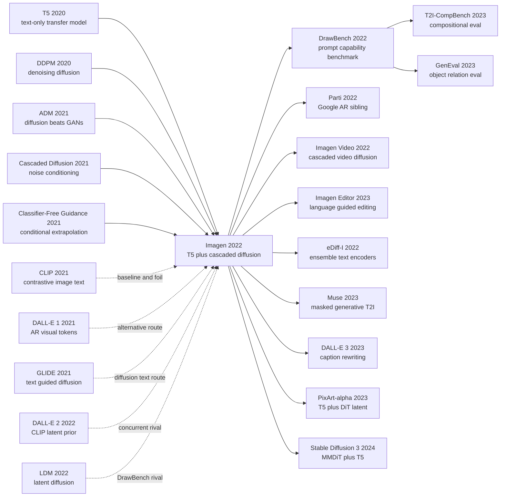

# Imagen — 用大语言模型理解提示词的级联扩散文生图

> 2022 年 5 月 23 日，Google Research Brain Team 在 arXiv 上传 [2205.11487](https://arxiv.org/abs/2205.11487)：它没有把文生图问题继续交给更大的图像生成器，而是把最难的“读懂提示词”交给一个冻结的 T5-XXL。Imagen 的反直觉结论很硬：扩大 text encoder 比扩大 U-Net 更能提升图像质量和文本对齐。它用 64→256→1024 的级联扩散、dynamic thresholding 和 DrawBench，把 DALL-E 2 / GLIDE / LDM 的弱点直接摆到复杂提示词面前，也把 2022 年文生图竞赛从“谁的图更像照片”推进到“模型到底懂不懂语言”。

## 一句话总结

Saharia、Chan、Saxena 等 14 位作者 2022 年在 Google Research Brain Team 完成的 Imagen，把文生图系统拆成“冻结大语言模型读 prompt + 级联扩散负责像素”：T5-XXL 先把文本编码成序列 embedding，64×64 base diffusion 生成低分辨率图，再由两个 text-conditional SR diffusion 模型放大到 256×256 和 1024×1024；训练目标仍是扩散 denoising $\mathbb{E}\|x_\theta(\alpha_t x+\sigma_t\epsilon,c)-x\|_2^2$，采样时用 classifier-free guidance $\tilde\epsilon=w\epsilon(z_t,c)+(1-w)\epsilon(z_t)$，再靠 dynamic thresholding 防止大 guidance 权重把 $\hat{x}_0$ 推出 $[-1,1]$。它打掉的不是单个 baseline，而是 2021 年文生图的三种默认假设：GAN/AR 路线在复杂语言上脆弱，[DALL-E 2](https://arxiv.org/abs/2204.06125) 的 CLIP-latent prior 仍会错配颜色和文字，[Stable Diffusion / LDM](2022_stable_diffusion.md) 的 CLIP text encoder 也不够懂组合语义。Imagen 在 zero-shot COCO FID-30K 做到 7.27，优于 GLIDE 12.24、DALL-E 2 10.39，并用 DrawBench 把评测从 COCO caption 推向颜色、数量、空间关系、长描述、拼写错误和文字渲染。它的隐藏 lesson 是：文生图的瓶颈不只在 diffusion backbone，而在“文本到底被读懂多少”；后续 [DALL-E 3](https://openai.com/dall-e-3)、PixArt-α、[Stable Diffusion 3](https://arxiv.org/abs/2403.03206) 都沿着“更强文本编码器 + 更好 caption + 扩散生成器”这条线继续走。

---

## 历史背景

### 2021-2022：文生图从玩具变成基础模型战场

Imagen 出现时，文生图刚刚从“小数据集上的漂亮 demo”变成云巨头之间的基础模型竞赛。2016-2020 年的主流路线仍是 GAN：StackGAN、AttnGAN、DM-GAN、XMC-GAN 一路把 COCO FID 往下压，但它们依赖图文配对数据、专门损失和复杂判别器，遇到长句、属性绑定和罕见词时很容易崩。2021 年 [DALL-E](2021_dalle.md) 把问题改写成离散视觉 token 上的自回归语言建模，证明“互联网图文对 + 大 Transformer”能生成开放域图像；同一天发布的 [CLIP](2021_clip.md) 又给生成结果一个强大的文本-图像相似度裁判。可是 DALL-E 1 仍然慢、模糊，且对复杂提示词的语义绑定并不可靠。

扩散模型在另一条线上迅速成熟。[DDPM](2020_ddpm.md) 把图像生成变成逐步去噪，ADM / GLIDE 又证明扩散在照片级保真度上可以压过 GAN。2021 年底的 GLIDE 已经是一个非常强的 text-guided diffusion 系统：它用 classifier-free guidance 让提示词能明显牵引采样，也让“扩散模型 + 文本条件”成为下一代文生图主线。但 GLIDE 仍把语言理解主要交给图文数据训练出来的 text encoder，模型能画出更好的图，却未必真正读懂复杂句子。

| 线索 | 当时进展 | 卡点 | Imagen 的回答 |
|---|---|---|---|
| GAN 文生图 | AttnGAN / DM-GAN / XMC-GAN 刷 COCO | 长句和组合语义弱 | 换成扩散生成器 |
| 自回归文生图 | DALL-E 1 用 dVAE token + 12B Transformer | 采样慢、图像细节弱 | 不走离散 AR 主路 |
| 扩散文生图 | GLIDE / DALL-E 2 证明质量路线 | 文本编码仍偏视觉对比 | 借冻结 T5 读语言 |
| 评测 | COCO FID + CLIP score 成为默认 | COCO caption 太短、CLIP 不会数数 | 提出 DrawBench |

### Google Brain 的路线：把语言理解外包给 T5

Google Research 的优势不只是 TPU 和图像数据，更是同一时期已经拥有 T5、PaLM、C4 语料和一整套语言模型 scaling 经验。Imagen 的关键赌注因此很自然：如果文本提示词本质上是一个自然语言理解问题，为什么要只依赖图文对比训练出来的 CLIP text encoder？CLIP 擅长判断“这张图和这句话是否匹配”，但它不一定擅长解析长描述、否定、空间关系、罕见词、拼写错误和 quoted text。T5 的训练目标虽然从未看过图像，却在大规模文本上学到更细的句法和语义结构。

这也是 Imagen 与同时代 DALL-E 2 的分叉。DALL-E 2 通过 CLIP image embedding 建一个“文本到图像 latent”的 prior，再用 diffusion decoder 生成图像；Imagen 则把 CLIP-latent 这层中介拿掉，直接让 T5-XXL 的文本序列通过 cross-attention 条件控制扩散模型。这个选择看起来更朴素，却让论文能问一个更清晰的问题：**文生图质量是否主要受 text encoder 规模限制？** 论文的回答是肯定的，而且这个结论后来深刻影响了 PixArt、SD3、DALL-E 3 和多路 text encoder 的工业配方。

### 评测气氛：COCO FID 已经不够用了

2022 年之前，许多文生图论文仍把 MS-COCO FID 当主战场。COCO 的好处是公开、可复现、历史基线多；坏处也同样明显：caption 多为短句，视觉对象常见，复杂组合少，几乎不能逼出模型在“读语言”上的短板。更麻烦的是，CLIP score 既是评测指标又可能被模型路线间接优化，容易奖励“像 CLIP 觉得匹配”的图，而不是人真正觉得语义正确的图。

Imagen 的 DrawBench 正是在这个背景下出现。它只有约 200 个 prompt，但按 11 类能力组织：颜色、数量、空间位置、罕见词、拼写错误、长描述、quoted text、复杂或反常组合等。每个 prompt 给人类评审两组各 8 张随机生成图，让评审分别判断图像质量和文本对齐。这个设计的价值不在“大”，而在“刺”：它专门刺向 COCO 看不出的语言理解伤口。

## 研究背景与动机

### 核心问题：图像质量、文本绑定和评测都卡住了

Imagen 要解决的不是“能不能生成漂亮图”这么宽泛的问题，而是三个同时存在的瓶颈。第一，图像生成器必须有扩散模型的高保真度；第二，文本条件必须能保留完整 token 序列，而不是把句子压成一个含混向量；第三，评测必须能区分“看起来像照片”和“真的执行了提示词”。如果没有第一点，模型只是语言理解好但图差；没有第二点，模型只能画大概主题；没有第三点，论文只能在 COCO FID 上赢，却不知道到底赢在哪里。

| 瓶颈 | 旧做法 | 失败模式 | Imagen 的动机 |
|---|---|---|---|
| 图像保真度 | GAN 或 AR token | 局部细节差、模式覆盖弱 | 用扩散作为生成核心 |
| 文本理解 | CLIP / pooled embedding | 属性绑定、长句、空间关系出错 | 冻结 T5-XXL 并保留序列 |
| 高分辨率 | 单模型直接生成 | 训练昂贵、细节不稳 | 64→256→1024 级联超分 |
| 条件强度 | 小 guidance 权重 | prompt 跟随弱 | dynamic thresholding 支撑大 guidance |
| 评测 | COCO FID / CLIP score | 看不出语言理解差异 | DrawBench + 人类偏好 |

### Imagen 的赌注：冻结语言模型，级联扩散负责像素

从架构上看，Imagen 反而很克制。它没有重新训练一个端到端图文 foundation model，也没有引入复杂的 latent prior。系统由三块组成：冻结 T5-XXL 负责把 prompt 读成 token embedding；64×64 base diffusion 负责生成粗图；两个 text-conditional super-resolution diffusion 模型负责逐级放大到 1024×1024。三层扩散模型都看同一个文本 embedding，都用 classifier-free guidance，超分模型还用 noise conditioning augmentation 增强对低分辨率输入 artifacts 的鲁棒性。

这篇论文的历史地位，正来自这个克制设计带来的清晰结论：当扩散生成器足够强时，文生图的上限很大一部分转移到了 text encoder。T5-XXL 从未在图文对上训练，却比 CLIP 更适合处理 DrawBench 里的复杂提示词；这件事在 2022 年并不直觉，因为 CLIP 看起来才是“视觉语义”模型。Imagen 等于提醒整个领域：**prompt following 不是图像任务的附属品，而是语言理解任务本身。**

---

## 方法详解

### 整体框架

Imagen 的架构可以压缩成一句话：**冻结 T5-XXL 读提示词，64×64 扩散模型负责语义布局，两个 text-conditional super-resolution 扩散模型逐级补细节，最后得到 1024×1024 图像。** 它不是 latent diffusion：主生成路径仍在像素空间级联扩散中完成；它也不是 DALL-E 2 那种 CLIP image embedding prior：文本序列直接通过 cross-attention 进入每一级扩散网络。

| 阶段 | 输入 | 输出 | 关键条件 |
|---|---|---|---|
| Text encoder | prompt | T5-XXL token embeddings | 冻结，离线可缓存 |
| Base diffusion | noise + text | 64×64 image | text cross-attention + CFG |
| SR diffusion 1 | 64×64 image + text | 256×256 image | noise conditioning augmentation |
| SR diffusion 2 | 256×256 image + text | 1024×1024 image | text cross-attention, no self-attention |

基础扩散训练目标沿用 denoising diffusion 的形式。给定图像 $x$、文本条件 $c$、噪声 $\epsilon$ 和时间 $t$，模型学习从带噪样本 $z_t=\alpha_t x+\sigma_t\epsilon$ 预测干净图像或等价的噪声参数化：

$$
\mathcal{L}=\mathbb{E}_{x,c,\epsilon,t}\left[w_t\left\|x_\theta(\alpha_t x+\sigma_t\epsilon,c)-x\right\|_2^2\right].
$$

在实现上，论文的默认配置很重：64×64 base model 约 2B 参数；64×64→256×256 超分模型约 600M；256×256→1024×1024 超分模型约 400M。三者都训练 2.5M steps，batch size 2048；base 用 256 个 TPU-v4 chips，两个超分模型各用 128 个 TPU-v4 chips。训练数据约为 4.6 亿内部图文对加 4 亿 LAION 图文对。

### 关键设计 1：冻结 T5-XXL 文本编码器

**功能**：把 prompt 的语言理解从图像生成器里拆出来，交给一个已在大规模纯文本上预训练的语言模型。Imagen 不微调 T5，直接使用其 encoder 侧 contextual embeddings；这样做能把文本 embedding 离线缓存，训练 diffusion 时几乎不增加显存和计算，同时避免让图像损失破坏语言模型已有的语义结构。

| Text encoder | 预训练数据 | 规模 | Imagen 里的发现 |
|---|---|---|---|
| BERT base/large | Wikipedia + BooksCorpus 约 20GB | 到 340M | 能用，但 scale 不够 |
| CLIP ViT-L/14 text | 图文对比数据 | 视觉语义强 | COCO 上接近 T5，DrawBench 输 |
| T5 small/base/large/XL | C4 纯文本 | 逐级增大 | scale 越大，FID/CLIP 曲线越好 |
| T5-XXL | C4 纯文本 | 论文使用 4.6B | DrawBench 对齐和保真度最佳 |

这部分的反直觉在于：T5 从未学过“图像是什么”，却比 CLIP 更会告诉生成器“句子是什么意思”。论文的 Figure 4 和 Appendix D.1 都强调，扩大 text encoder 带来的收益比扩大 64×64 U-Net 更明显；T5-XXL 与 CLIP 在 COCO 自动指标上可能接近，但人类评审在 DrawBench 的 11 类 prompt 上都更偏好 T5-XXL，尤其是 image-text alignment。

**设计动机**：文生图 prompt 的难点不是单词是否视觉化，而是词与词之间的关系是否被保留。`a small blue object on a large red object` 这类 prompt 需要属性绑定，quoted text 需要字符级约束，长描述需要句法结构。CLIP 的全局对比目标倾向于学“图里有什么”，T5 的 denoising 语言目标更倾向于学“句子怎样组织意义”。Imagen 把这一区别变成了可测的系统收益。

### 关键设计 2：序列级 cross-attention，而不是 pooled text

**功能**：保留完整 token 序列，让 U-Net 的中间特征在多个分辨率上按需读取文本。base model 在 32、16、8 分辨率处加入 text cross-attention，同时使用 attention-pooled 文本向量接入 timestep embedding；超分模型也保留 text cross-attention，特别是 256→1024 阶段去掉 self-attention 后仍保留文本注意力。

Cross-attention 的形式可以写成：

$$
\operatorname{Attn}(Q,K,V)=\operatorname{softmax}\left(\frac{QK^\top}{\sqrt d}\right)V,\quad Q=W_Q\phi_i(z_t),\quad K=W_K\tau(y),\quad V=W_V\tau(y).
$$

这里 $\phi_i(z_t)$ 是 U-Net 第 $i$ 层图像特征，$\tau(y)$ 是 T5 输出的 token embeddings。注意力把“图像某个位置现在需要问文本哪一部分”显式建模出来，比 mean pooling 或 attention pooling 的单向量条件更适合属性绑定和空间关系。

| 条件方式 | 信息形态 | 失败点 | 论文结论 |
|---|---|---|---|
| Mean pooling | 一个全局向量 | token 关系被压扁 | FID/CLIP Pareto 差 |
| Attention pooling | 一个学习出的全局向量 | 仍缺位置级读取 | 好于 mean，弱于 cross-attn |
| Cross-attention | 全序列 K/V | 计算稍增 | 对齐和保真度最好 |
| Cross-attn + LayerNorm | 稳定后的全序列 | 训练更稳 | Imagen 默认选择 |

**设计动机**：文生图不是图像分类。分类可以把一句话压成一个 label-like embedding，生成却需要每个空间区域在不同 denoising 阶段反复查询文本。Imagen 的 cross-attention 把语言从“条件标签”变成了“可被图像特征检索的上下文”。这也是后来 SD、PixArt、SD3 都保留的关键接口。

### 关键设计 3：大 guidance 权重与 dynamic thresholding

Classifier-free guidance 是 Imagen 的采样核心。训练时，三层 diffusion 都以 10% 概率把文本 embedding 置零，于是同一个网络同时学条件和无条件分布；采样时用条件预测与无条件预测线性外推：

$$
\tilde{\epsilon}_\theta(z_t,c)=w\,\epsilon_\theta(z_t,c)+(1-w)\,\epsilon_\theta(z_t),\quad w>1.
$$

大 $w$ 能提升 prompt following，却会制造 train-test mismatch：模型在训练中看到的 $x$ 被归一化到 $[-1,1]$，但大 guidance 会让预测的 $\hat{x}_0$ 越界，产生过饱和、空白图或发散。静态 clipping 能防止空白，却仍会让颜色和纹理僵硬。Imagen 的 dynamic thresholding 在每个采样步计算 $\hat{x}_0$ 绝对值的高分位数 $s$，再缩放回合法范围：

$$
s=\max\left(1,\operatorname{percentile}(|\hat{x}_0|,p)\right),\quad \hat{x}_0\leftarrow \operatorname{clip}(\hat{x}_0,-s,s)/s.
$$

| 采样方法 | 大 guidance 下的行为 | 图像结果 | Imagen 判断 |
|---|---|---|---|
| No thresholding | $\hat{x}_0$ 大量越界 | 空白、过饱和、发散 | 不可用 |
| Static thresholding | 直接 clip 到 $[-1,1]$ | 稳定但细节僵硬 | 必要但不够 |
| Dynamic thresholding | 按样本分位数缩放 | 保真度和对齐更好 | 默认选择 |

```python
def imagen_sample(z_t, text, guidance_weight, percentile=99.5):
    for timestep in reversed(schedule):
        eps_cond = unet(z_t, timestep, text)
        eps_uncond = unet(z_t, timestep, empty_text)
        eps = guidance_weight * eps_cond + (1.0 - guidance_weight) * eps_uncond
        x0 = predict_x0(z_t, eps, timestep)
        scale = percentile_abs(x0, percentile).clamp(min=1.0)
        x0 = x0.clamp(-scale, scale) / scale
        z_t = sampler_step(z_t, x0, timestep)
    return x0
```

**设计动机**：Imagen 想用比此前更大的 guidance 权重换取文本对齐，但不能接受“越对齐越像塑料”的副作用。Dynamic thresholding 的美妙之处在于它不改变训练目标，只修正采样分布的数值边界；这让大 guidance 变成可用工具，而不是灾难按钮。

### 关键设计 4：鲁棒级联超分与 Efficient U-Net

**功能**：把生成问题拆成三个分辨率，而不是让一个模型直接生成 1024×1024。64×64 base model 主要负责全局布局和语义；64→256 与 256→1024 超分模型负责纹理、边缘和高频细节。两级超分都用 noise conditioning augmentation：训练时随机给低分辨率条件加噪，并把噪声强度 `aug_level` 告诉模型；推理时可以扫不同 `aug_level`，让超分模型既能修正低分辨率 artifacts，又能听从文本改变风格或细节。

| 组件 | 设计 | 为什么重要 | 代价 |
|---|---|---|---|
| Cascaded diffusion | 64→256→1024 | 高分辨率生成更稳定 | 三个模型顺序采样 |
| Noise conditioning augmentation | 给低分辨率条件加噪并告知噪声级别 | 超分模型更鲁棒 | 多一个推理超参 |
| Efficient U-Net | 参数移到低分辨率 block | 更省显存、更快收敛 | 架构需重写 |
| Text cross-attn in SR | 超分阶段仍读取文本 | 细节可按 prompt 调整 | 计算略增 |

Efficient U-Net 的核心是把模型容量从高分辨率 block 移到低分辨率 block，在低分辨率处堆更多 residual blocks；skip connection 缩放 1/2 以稳定深层残差；并反转 downsample / upsample 与卷积的顺序以提升 forward speed。论文报告它在 64→256 超分任务上比此前 U-Net 实现采样快 2-3 倍，收敛也更快。

**设计动机**：如果 base model 已经决定了全局语义，超分模型就不该只是“放大器”。Imagen 把超分也做成 text-conditional diffusion，是为了让高频细节继续受语言控制；noise augmentation 则让超分模型不要过度相信 64×64 粗图中的错误。这个细节解释了为什么 Imagen 能在 1024×1024 上保持 prompt 语义，而不是只生成漂亮纹理。

### 设计对照：为什么 Imagen 不是 DALL-E 2 或 LDM

Imagen 的方法地位常被简化成“Google 的 DALL-E 2”，但技术路线并不一样。DALL-E 2 的中介变量是 CLIP image embedding：先学文本到图像 embedding 的 prior，再用 diffusion decoder；LDM / Stable Diffusion 的中介变量是 VAE latent：先把图像压缩到 latent，再在 latent 上 denoise。Imagen 的中介变量则几乎只有文本本身：T5 直接提供 token 序列，扩散级联直接在像素分辨率上生成和超分。

| 模型 | 文本接口 | 图像生成空间 | 历史优势 | 主要代价 |
|---|---|---|---|---|
| DALL-E 2 | CLIP text/image latent prior | pixel diffusion decoder | 图像质量强 | prior + decoder 两阶段复杂 |
| LDM / Stable Diffusion | CLIP text encoder | VAE latent diffusion | 可部署、开源生态强 | 文本理解弱于 T5 |
| Imagen | frozen T5-XXL sequence | pixel cascaded diffusion | prompt 理解和保真度强 | 闭源、三模型推理重 |
| Parti | seq2seq Transformer | VQGAN token AR | scaling 统一 | 20B 参数且采样慢 |

因此 Imagen 的核心贡献不是“又一个扩散文生图模型”，而是把文生图的主瓶颈重新定位：语言理解不应由生成器顺手学，而应由足够强的 frozen LM 提供。这个定位后来比具体的 pixel cascade 更长寿。

---

## 失败案例

### 失败案例 1：COCO GAN 体系被“开放域语言”逼到边界

Imagen 之前的 AttnGAN、DM-GAN、DF-GAN、XMC-GAN、LAFITE 都能在 COCO 上持续进步，但它们的世界观仍是“在一个相对固定的 caption 分布里合成图像”。这条路线的问题不只是 FID 落后，而是模型能力被 COCO caption 本身限制。COCO 很少要求模型处理长句、矛盾动作、文字渲染、罕见词或精确空间关系；因此在 COCO 上看起来不错的 GAN，一旦进入开放域 prompt，就会暴露语义组合弱、模式覆盖弱、细节不稳定的问题。

| Baseline | 代表方法 | 强项 | 输给 Imagen 的位置 | 关键数字 |
|---|---|---|---|---|
| GAN + attention | AttnGAN | 早期 caption-to-image | photorealism 和语言组合都弱 | COCO FID 35.49 |
| GAN + memory | DM-GAN | 局部细节增强 | 仍依赖窄 caption 分布 | COCO FID 32.64 |
| Deep fusion GAN | DF-GAN | 训练更简洁 | 开放域 prompt 弱 | COCO FID 21.42 |
| Contrastive GAN | XMC-GAN / LAFITE | COCO FID 已接近 10 | 缺少扩散的覆盖和细节 | 9.33 / 8.12 |
| Scene prior | Make-A-Scene | 加入布局先验 | 需要训练在 COCO 上 | COCO-trained FID 7.55 |

Imagen 对 GAN 路线的“失败判决”并不是单纯说 FID 更低，而是说：开放域文生图需要同时解决语言、组合和照片级细节，GAN 的局部判别器和任务特定结构已经很难继续扩展。

### 失败案例 2：CLIP/AR 路线能生成，但不等于懂复杂语言

DALL-E 1 的历史地位很高，因为它第一次把开放域文生图变成“大规模 token 语言模型”问题。但在 Imagen 的视角里，DALL-E 1 暴露了离散自回归路线的两个弱点：一是采样顺序长，二是视觉 token 压缩后的细节不足。它可以组合概念，却不擅长照片级真实感。

DALL-E 2 是更强的对手。它用 CLIP latents 连接文本和图像，生成质量已经非常高，但 Imagen 在 DrawBench 中指出了它的语言短板：颜色绑定、位置关系、quoted text、复杂描述等类别里，人类评审更偏好 Imagen。论文附录还特别指出，DALL-E 2 在给多个物体分配颜色、生成提示词中的文字时更容易出错；这说明 CLIP latent 是一个强视觉语义空间，却不是完整语言解析器。

GLIDE 则证明扩散路线正确，却没有证明 text encoder 足够强。它的质量和编辑能力已经很接近现代文生图，但 DrawBench 仍显示 Imagen 在 8/11 类 alignment、10/11 类 fidelity 上优于 GLIDE。换句话说，GLIDE 输的不是 diffusion，而是“语言理解层”没有 Imagen 的 T5-XXL 这么强。

### 失败案例 3：小 text encoder 和 pooled text 都不够

Imagen 的内部消融比外部 baseline 更有价值。论文比较 BERT、T5 不同规模、CLIP text encoder，并比较 mean pooling、attention pooling、cross-attention。结果很清楚：文本编码器越大，FID/CLIP Pareto 曲线越好；同样的 T5-XXL，在 COCO 自动指标上和 CLIP 接近，但 DrawBench 人类评审明显更偏好 T5-XXL；把文本序列压成 pooled embedding 会明显输给 cross-attention。

这个失败案例很重要，因为它排除了“只是 Google 算力大”的解释。扩大 U-Net 的确有用，但扩大 text encoder 更有用；cross-attention 的确更贵，但它保留了 prompt 中 token 之间的关系。Imagen 真正证明的是：文生图系统不是“生成器 + 一个文本标签”，而是“语言模型 + 条件生成器”的耦合系统。

### 真正被打掉的假设

1. **“图文对比模型天然最适合 prompt encoding”**：CLIP 在图文检索上强，但 DrawBench 暴露它对复杂句法和绑定关系的不足。
2. **“COCO FID 足以代表文生图能力”**：Imagen 在 COCO 上赢，但论文更有影响的是 DrawBench，因为它指出了 COCO 没测到的语言维度。
3. **“扩散模型越大越重要”**：Imagen 的 ablation 显示 text encoder scale 的收益比 U-Net scale 更明显。
4. **“超分只是后处理”**：Imagen 的超分模型继续读取文本并用 noise augmentation，说明高分辨率细节仍需要语言条件控制。
5. **“开源/公开 demo 是论文影响的必要条件”**：Imagen 没有发布代码和 demo，却通过方法结论和评测基准深刻影响后续闭源与开源系统。

---

## 实验关键数据

### COCO：7.27 FID 的含义

Imagen 在 MS-COCO 256×256 zero-shot FID-30K 上报告 7.27。这个数字有两层含义：第一，它低于所有当时 zero-shot baseline；第二，它甚至低于一些直接在 COCO 上训练的方法，如 Make-A-Scene 的 7.55。注意这不是“Imagen 已经解决文生图”的证明，因为 COCO 仍然简单；它更像一张入场券，证明 Imagen 在标准指标上没有牺牲质量，然后论文才能把重点转向 DrawBench。

| 方法 | 是否训练在 COCO | FID-30K ↓ | 备注 |
|---|---|---:|---|
| AttnGAN | 是 | 35.49 | 早期 attention GAN |
| DM-GAN | 是 | 32.64 | dynamic memory GAN |
| DF-GAN | 是 | 21.42 | deep fusion GAN |
| XMC-GAN | 是 | 9.33 | contrastive GAN |
| LAFITE | 是 | 8.12 | language-free training |
| Make-A-Scene | 是 | 7.55 | scene prior |
| DALL-E 1 | 否 | 17.89 | autoregressive token model |
| GLIDE | 否 | 12.24 | text-guided diffusion |
| DALL-E 2 | 否 | 10.39 | CLIP-latent diffusion |
| **Imagen** | **否** | **7.27** | T5 + cascaded diffusion |

COCO 人类评测更能说明细节。参考图像的 photorealism preference 被定义为 50%，Imagen 约 39.5%；去掉包含人的 prompt 后，Imagen 上升到约 43.9%。Caption similarity 上，参考图像约 91.9，Imagen 约 91.4；去掉人的子集里，参考约 92.2，Imagen 约 92.1。这说明 Imagen 的文本对齐已接近 COCO reference，但人物生成仍是明显短板。

| 评测 | Reference | Imagen | 解释 |
|---|---:|---:|---|
| Image quality preference | 50.0% | 39.5% | 图像质量接近但未追平真实图 |
| Caption similarity | 91.9 | 91.4 | 文本对齐几乎持平 |
| No-people quality preference | 50.0% | 43.9% | 人物是质量拖累 |
| No-people caption similarity | 92.2 | 92.1 | 非人物 prompt 对齐很强 |

### DrawBench：把语言理解逼出来

DrawBench 的设计很小但很锋利。它约 200 个 prompts，分成 11 类；每个 prompt 让评审比较两个模型各 8 张随机样本。论文主图显示 Imagen 在与 DALL-E 2、GLIDE、VQ-GAN+CLIP、Latent Diffusion 的 pairwise human evaluation 中，整体 image fidelity 和 image-text alignment 都被明显偏好。附录进一步显示，Imagen 对 DALL-E 2 在 7/11 类 alignment、11/11 类 fidelity 上领先；对 GLIDE 在 8/11 类 alignment、10/11 类 fidelity 上领先。

| DrawBench 类别 | 测什么 | 为什么 COCO 不够 | Imagen 的意义 |
|---|---|---|---|
| Colors / Counting | 属性和数量绑定 | COCO 很少精确要求 | 检验 token 关系 |
| Positional | 空间关系 | caption 通常描述对象而非布局 | 检验句法理解 |
| Text | quoted text 渲染 | COCO 几乎不测文字 | 暴露视觉-语言断层 |
| Rare words / Misspellings | 词汇鲁棒性 | 常见词偏多 | 检验语言模型先验 |
| Long descriptions | 长程依赖 | COCO caption 太短 | 检验 full-sequence conditioning |

DrawBench 的历史价值在于，它让“prompt following”变成可讨论的实验对象。后来的 T2I-CompBench、GenEval、DALL-E 3 caption rewriting、SD3 多 text encoder，都可以看作对 DrawBench 问题意识的延续。

### Ablation：哪些设计真的必要

Imagen 的 ablation 给出几条后续系统直接继承的结论。第一，T5 规模越大越好，T5-XXL 最强。第二，text encoder scale 比 U-Net scale 更有效。第三，dynamic thresholding 是大 guidance 权重可用的关键。第四，noise conditioning augmentation 对超分很关键。第五，cross-attention 明显优于 pooled text。

| 消融对象 | 对比 | 观察 | 后续影响 |
|---|---|---|---|
| Text encoder size | T5 small → T5-XXL | scale 提升 fidelity 和 alignment | 大 text encoder 成默认方向 |
| Text encoder family | T5-XXL vs CLIP | COCO 接近，DrawBench T5 胜 | SD3 / PixArt 加入 T5 |
| U-Net size | 300M → 2B | 有收益但不如 text encoder scale | 生成器 scale 不是唯一瓶颈 |
| Thresholding | none/static/dynamic | dynamic 支撑大 guidance | CFG 采样更稳定 |
| SR augmentation | no noise vs noise conditioning | 有噪训练更鲁棒 | 级联扩散标准技巧 |
| Text conditioning | pooling vs cross-attention | cross-attn 最好 | 成为主流接口 |

### 训练规模与非发布选择

Imagen 是大规模工业研究，不是学术小模型。论文默认训练 2B base、600M SR、400M SR，所有模型 2.5M steps，batch size 2048；训练数据约 8.6 亿图文对，其中包括内部数据和 LAION。这样的规模解释了它为何能在质量上领先，也解释了为什么它没有像 Stable Diffusion 那样形成开源生态。

| 组件 | 参数量 | 训练资源 | 备注 |
|---|---:|---|---|
| 64×64 base diffusion | 2B | 256 TPU-v4 chips | Adafactor，文本 cross-attn |
| 64→256 SR diffusion | 600M | 128 TPU-v4 chips | Efficient U-Net |
| 256→1024 SR diffusion | 400M | 128 TPU-v4 chips | 去掉 self-attn，保留 text cross-attn |
| 数据 | 约 860M pairs | 内部数据 + LAION | 存在偏见和安全风险 |

非发布选择也是实验结论的一部分。论文明确说，当时不发布代码或 public demo，是因为训练数据包含 web-scraped 内容、LAION-400M 已被审计出有害内容，模型在人物生成和社会偏见上仍有严重问题。这让 Imagen 在历史上形成一个有趣位置：方法影响巨大，社会部署却被主动刹车。

---

## 思想史脉络



### 前世（被谁逼出来的）

Imagen 的前史有两条线。第一条是扩散生成线：DDPM 证明 denoising objective 可行，ADM 证明 diffusion 在 ImageNet 上能击败 GAN，Cascaded Diffusion Models 证明 64→256 这类级联超分可以稳定地产生高保真图像，Classifier-Free Guidance 证明不需要外部 classifier 也能用条件增强采样。这些工作给 Imagen 提供了像素生成的引擎。

第二条是语言理解线：T5 用 text-to-text transfer 和 C4 语料证明大规模纯文本预训练能学到通用语言表示；CLIP 证明图文对比学习能给视觉和语言一个共享空间；DALL-E 1 证明开放域图文对能驱动生成模型；GLIDE 证明 text-guided diffusion 比 GAN/AR 更适合照片级图像。Imagen 的独特之处，是把这两条线拼在一起后选择了 T5 而不是 CLIP 作为核心文本接口。

### 今生（继承者）

Imagen 的直接继承者分两类。Google 内部路线包括 Parti、Imagen Video、Imagen Editor、Muse 和后来的 Imagen 2：它们延续了“大模型 + 高质量生成 + 严格安全门控”的路线，但具体生成器在 AR、mask token、diffusion 之间切换。外部路线更有意思：PixArt-α 和 Stable Diffusion 3 都在不同程度上吸收了 Imagen 的教训，把 T5 引入 text-to-image 系统，承认 CLIP-only text encoder 在复杂 prompt 上不够。

DrawBench 的影响同样持久。它不是最大的 benchmark，却让文生图评测从“COCO FID”转向“模型会不会数数、会不会绑定颜色、会不会理解空间关系、会不会写提示词中的文字”。T2I-CompBench、GenEval、DPG-Bench 等后续评测，都继承了这种把 prompt following 分解成能力维度的思路。

### 误读 / 简化

- **“Imagen 只是 DALL-E 2 的 Google 版本”**：DALL-E 2 的核心是 CLIP latent prior；Imagen 的核心是 frozen T5 + pixel diffusion cascade。两者都生成 1024×1024 图，但信息瓶颈完全不同。
- **“7.27 FID 是论文最重要的贡献”**：FID 只是证明 Imagen 没在标准指标上掉队。更重要的是 text encoder scale 和 DrawBench，这两点改变了后续系统设计。
- **“T5 好是因为参数多”**：参数多是原因之一，但关键是 T5 的 text-only denoising pretraining 保留了更强的句法和组合语义；CLIP 即使用图文数据，也会把复杂关系压成检索友好的语义。
- **“级联扩散是最终答案”**：级联在 2022 年有效，但后来 latent diffusion、DiT、rectified flow 证明具体生成路径会变。真正留下来的，是“强语言编码器 + 语言条件生成”的分工。
- **“不发布模型削弱了影响力”**：不发布限制了生态，但没有阻止论文影响方法和评测。Imagen 是少数没有开源却改变开源系统设计的文生图论文。

### 思想史的关键 lesson

Imagen 留下的 lesson 可以写成一句话：**当生成器足够强后，prompt following 的瓶颈会回到语言理解。** 这个 lesson 解释了为什么 DALL-E 3 要先用更强模型改写 caption，为什么 SD3 要把 CLIP 与 T5 并联，为什么 PixArt-α 要用 T5 条件训练 DiT，也解释了为什么 2023 年以后文生图评测越来越关注 compositionality。Imagen 不是开源生态的起点，却是“文本编码器决定生成上限”这条工业规律的清晰起点。

---

## 当代视角

### 站不住的假设

站在 2026 年回看，Imagen 的许多判断仍然准确，但几个 2022 年合理的假设已经被后续系统改写。

| 2022 年假设 | 为什么当时合理 | 今天的问题 | 后续修正 |
|---|---|---|---|
| Pixel-space cascade 是最高质量路线 | Imagen / DALL-E 2 都用 64→1024 级联 | 三个模型推理重、部署复杂 | latent diffusion + DiT / flow |
| T5 单路文本编码足够 | T5-XXL 在 DrawBench 明显胜 CLIP | 视觉风格和检索语义仍需要 CLIP | SD3 多 text encoder 并联 |
| COCO + DrawBench 已能说明大部分能力 | DrawBench 比 COCO 刺得更深 | 仍缺组合计数、空间、偏见、OCR 的系统量化 | GenEval / T2I-CompBench / DPG-Bench |
| Dynamic thresholding 是大 guidance 的主要解法 | 它让高 CFG 不崩 | 高 CFG 仍会牺牲多样性和自然度 | CFG distillation / guidance-free flow |
| 不发布是唯一负责方式 | 训练数据和偏见风险真实存在 | 外部审计也需要可访问模型 | 分级访问、红队、安全评测、数据文档 |

最值得保留的是第一性结论：text encoder 很重要。今天的生产模型已经不再把 CLIP-only 当成终点：SD3 用 CLIP-L、OpenCLIP-G、T5-XXL 多路文本编码；PixArt-α 用 T5 条件训练 DiT；DALL-E 3 则用更强语言模型把用户 prompt 改写成详细 caption。它们都在不同方式上承认 Imagen 的判断：生成器越强，语言接口越决定上限。

### 时代证明的关键 vs 冗余

Imagen 证明的关键，不是“级联像素扩散永远最好”，而是“强语言模型可以独立成为文生图系统的核心部件”。这点经受住了时间检验。DrawBench 也经受住了时间检验：今天所有严肃文生图系统都会被问到颜色绑定、数量、位置、文字和长 prompt，不再只展示漂亮样图。

比较冗余的是具体工程路径。三阶段 pixel cascade 在闭源大模型中可以接受，但不适合本地部署和社区生态；dynamic thresholding 很实用，但后续 flow matching、distillation 和更好噪声参数化让“高 CFG + 修边界”的方式不再是唯一选择；Efficient U-Net 是当时很好的超分架构，但 DiT / MMDiT 已经把 backbone scaling 迁移到 Transformer 路线。

### 如果今天重写

如果 2026 年重写 Imagen，一个现代版本大概率不会沿用原封不动的三模型 pixel cascade，而会保留语言-生成分工，再替换掉生成器和训练配方。

| 模块 | 2022 Imagen | 2026 重写版本 | 理由 |
|---|---|---|---|
| Text encoder | frozen T5-XXL | T5/LLM + CLIP/OpenCLIP 多路 | 同时保留语法、世界知识和视觉检索语义 |
| Generator | pixel cascaded diffusion | latent DiT / MMDiT + rectified flow | 更易扩展、更易部署 |
| Prompt data | 原始 alt-text + 内部过滤 | VLM/LLM 重写 caption + 数据卡 | prompt following 更依赖 caption 质量 |
| Guidance | CFG + dynamic thresholding | distillable guidance 或 flow guidance | 降低采样步数和过饱和 |
| Evaluation | COCO + DrawBench | DrawBench + GenEval + bias/OCR/long-prompt suites | 更系统地覆盖真实失败模式 |

但这并不削弱 Imagen。恰恰相反，后续系统替换了 pixel cascade，却保留了它关于文本编码器的核心 lesson。一个方法真正经典，不是每个模块都被永久照抄，而是它指出的瓶颈在多年后仍然让工程师无法绕开。

---

## 局限与展望

### 作者承认的局限

Imagen 的局限写得比许多 2022 年生成模型论文更严肃。作者明确说，当时不发布代码或 public demo，是因为 text-to-image 可能被用于骚扰、误导信息和其他滥用；训练数据来自大规模网页图文对，包含未充分整理和审计的内容；LAION-400M 已被外部审计指出含有不当图像、有害词汇和社会刻板印象；模型还继承了大语言模型的偏见。

| 局限 | 论文描述 | 为什么重要 | 后续问题 |
|---|---|---|---|
| Web data bias | LAION 和内部网页数据有有害内容 | 生成模型会复制或放大偏见 | 版权、同意和数据治理 |
| People generation | 包含人物时质量偏好明显下降 | 人脸和身份相关错误风险高 | 安全过滤和身份保护 |
| Social stereotypes | lighter skin tone / Western gender stereotypes | 代表性伤害 | 偏见评测仍不成熟 |
| No public release | 为避免滥用不开放代码/demo | 负责但限制外部审计 | 分级访问机制需求 |
| Evaluation gaps | 社会偏见评测方法不足 | 无法只靠 COCO/DrawBench | 安全 benchmark 发展 |

### 2026 视角下的新局限

今天看，Imagen 还有一些作者当时没有完全展开的问题。第一，闭源让方法可被学习，却让社会风险只能由内部团队自查；这在 AI safety 上并不充分。第二，级联像素扩散的推理成本过高，难以像 Stable Diffusion 那样形成社区改造生态。第三，DrawBench 虽然开创性，但 prompt 数少、人工评估成本高，难以成为持续回归测试。第四，T5-XXL 读语言强，但如果训练 caption 本身过短或噪声大，模型仍只能学到弱监督。

这些局限也给后续方向指路：更透明的数据文档、授权训练数据、可审计的分级模型访问、合成 caption 重写、更细粒度 prompt-following benchmark，以及能在少步采样下保持对齐的 flow / distillation 方法。Imagen 是闭源研究系统，但它提出的问题已经变成公开生态必须回答的问题。

---

## 相关工作与启发

### 和同时代模型的关系

| 模型 | 与 Imagen 的关系 | Imagen 赢在哪里 | Imagen 输在哪里 |
|---|---|---|---|
| DALL-E 1 | 早期开放域 AR 文生图 | 质量和对齐大幅领先 | DALL-E 1 更统一为 token LM |
| GLIDE | text-guided diffusion 前身 | T5 + DrawBench 对齐更好 | GLIDE 更接近可编辑系统 |
| DALL-E 2 | 同期最强闭源对手 | COCO FID 和 DrawBench 偏好领先 | DALL-E 2 的 CLIP latent 更适合编辑/variation |
| LDM / Stable Diffusion | 同年开源路线 | Imagen 语言理解更强 | LDM/SD 可部署和生态完胜 |
| Parti | Google sibling AR route | Imagen 图像质量和扩散采样更自然 | Parti 展示了序列建模 scaling 的统一性 |

Imagen 与 Stable Diffusion 的对照尤其重要。Imagen 代表“闭源高质量 + 强语言编码器 + 安全刹车”，Stable Diffusion 代表“可部署够好 + 开源权重 + 社区扩展”。2022 年后，整个领域其实在融合两者：SD3 学 Imagen 加 T5，闭源模型学 SD 生态里的可控生成和本地工具链。

### 方法启发

Imagen 给研究者的启发有三条。第一，**不要把条件编码当成附属模块**：当生成器足够强时，condition encoder 的预训练目标、规模和输出结构会成为主瓶颈。第二，**评测要刺向系统最脆的地方**：DrawBench 不大，但问题设计准确，因此比很多大而泛的指标更有思想穿透力。第三，**安全选择会改变技术扩散方式**：Imagen 没有开源，但仍然通过论文和 benchmark 扩散；Stable Diffusion 开源后通过生态扩散。两种路径都塑造了生成模型时代。

对今天做多模态生成的人来说，Imagen 的最可迁移原则是：先问“条件是否被充分理解”，再问“生成器是否足够大”。这适用于文生图，也适用于视频、音频、3D、机器人轨迹和分子生成。条件信号越复杂，越不能把它压成一个草率的全局向量。

---

## 相关资源

### 阅读入口

- 📄 [Imagen paper: Photorealistic Text-to-Image Diffusion Models with Deep Language Understanding](https://arxiv.org/abs/2205.11487)
- 🔬 [Google Research Imagen project page](https://imagen.research.google/)
- 📊 [DrawBench prompt sheet](https://docs.google.com/spreadsheets/d/1y7nAbmR4FREi6npB1u-Bo3GFdwdOPYJc617rBOxIRHY/edit#gid=0)
- 📄 [DALL-E 2: Hierarchical Text-Conditional Image Generation with CLIP Latents](https://arxiv.org/abs/2204.06125)
- 📄 [GLIDE: Towards Photorealistic Image Generation and Editing](https://arxiv.org/abs/2112.10741)
- 📄 [Latent Diffusion Models / Stable Diffusion](https://arxiv.org/abs/2112.10752)
- 📄 [Classifier-Free Diffusion Guidance](https://arxiv.org/abs/2207.12598)
- 📄 [T5: Exploring the Limits of Transfer Learning with a Unified Text-to-Text Transformer](https://arxiv.org/abs/1910.10683)
- 📄 [Stable Diffusion 3: Scaling Rectified Flow Transformers for High-Resolution Image Synthesis](https://arxiv.org/abs/2403.03206)
- 📄 [PixArt-alpha: Fast Training of Diffusion Transformer for Photorealistic Text-to-Image Synthesis](https://arxiv.org/abs/2310.00426)


---

> 🌐 [English version](/en/era4_foundation_models/2022_imagen/) · 📚 awesome-papers project · CC-BY-NC