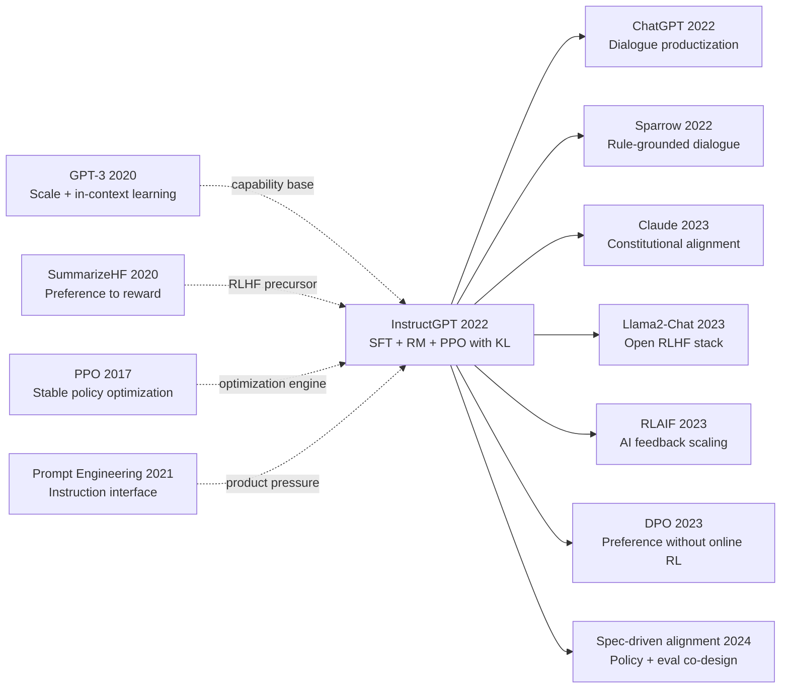

# InstructGPT — 用 RLHF 把 GPT-3 从续写器训练成听话的助手

> **2022 年 3 月 4 日，OpenAI 的 Ouyang、Wu、Schulman、Christiano、Leike、Lowe 等 20 位作者在 arXiv 上传 [2203.02155](https://arxiv.org/abs/2203.02155)，同年 12 月在 NeurIPS 2022 发表 —— 8 个月后 ChatGPT 上线，全球用户 5 天破 100 万。**
> 这是一篇**直接定义了今天所有 ChatGPT-style 对话助手训练范式**的论文 —— OpenAI 用 **3 阶段流水线**（SFT 微调 13K demo → 训练 reward model 33K 比较对 → 用 [PPO (2017)](../era3_attention/2017_ppo.md) 优化策略）把 GPT-3 (175B) 从一个会续写网络垃圾的续写器，调教成会回答问题、拒绝有害请求、生成有用文本的助手。
> 关键发现是**反直觉的**：仅 1.3B 参数的 InstructGPT 在人类偏好评分上**全面碾压 175B 的 GPT-3 原版**（85% vs 15%），证明对齐质量远比参数规模重要 —— 一个 1/130 大小的模型被人类认为更"有用"。
> 它直接催生了 ChatGPT (2022.11) → GPT-4 (2023) → Claude / Gemini / 国内所有大厂助手 —— **RLHF 在 InstructGPT 之后成为 LLM 商业化的"对齐税"标配**，2 年后才被 [DPO (2023)](../era5_genai_explosion/2023_dpo.md) 简化、被 [DeepSeek-R1 (2025)](../era5_genai_explosion/2025_deepseek_r1.md) 用纯 RL 进一步颠覆。

## 一句话总结

InstructGPT 的关键突破不是让模型更大，而是把“人类偏好”从离线规则改造成可优化的训练信号：先用监督微调把模型拉进可控分布，再用奖励模型把“好回答”形式化，最后用带 KL 约束的 PPO 在提升有用性的同时守住语言能力边界。

## 历史背景

### 2020-2022 年的 NLP 学界在卡什么

2020 到 2022 年，语言模型社区在一个非常具体的矛盾上反复打转：规模定律证明“更大”几乎总能带来更强 few-shot 性能，但产品化团队真正需要的是“更听话、更少胡说、更可控”。GPT-3（175B）把“提示词编程”推到了高峰，却也把问题暴露得更彻底：同一个任务，提示词稍改一两句，模型行为就会跳变；同一个问题，模型会在“详尽解释”和“一本正经胡说”之间来回摆动。对研究者来说，这不是纯粹精度问题，而是目标函数错位：预训练优化的是下一个 token 的似然，不是“被人类认为有帮助、诚实、无害”的综合质量。

这一时期的大模型部署还受到评测形态限制。很多论文指标聚焦 MMLU、LAMBADA、SuperGLUE 这类静态 benchmark，但真实用户请求来自开放域 API：写邮件、改代码、总结长文、重写语气、给建议。静态 benchmark 很难表达“语气是否合适”“是否过度自信”“是否拒答得体”。结果是，参数更大的模型在离线分数上领先，却未必在真实交互偏好上占优。换句话说，学界已经知道“会做题”不等于“会协作”，但还没有稳定可扩展的训练路径去修复这个裂缝。

同时，安全与对齐问题从边缘议题进入主舞台。OpenAI、DeepMind、Anthropic 等团队都观察到：仅靠提示工程和后处理过滤，无法系统性抑制有害、偏见、幻觉输出。模型不是“偶尔说错”，而是在目标层面缺乏“面向人类反馈闭环优化”的机制。InstructGPT 正是在这个窗口出现：它把“人类偏好”从评测标准推进为训练目标，并且给出可复用的工程流水线。

### 直接逼出 InstructGPT 的前序工作

**2020 GPT-3（Brown et al.）**：证明了规模和上下文学习能力的强关联，但也把“提示敏感、指令不稳、事实性不稳”放大到产业级场景。它逼出的不是更复杂 prompt，而是“训练阶段就注入人类偏好”的需求。

**2020 Learning to Summarize from Human Feedback（Stiennon et al.）**：首次在文本任务里系统展示“偏好比较标注 + 奖励模型 + RL 优化”可行，给 InstructGPT 提供了 RLHF 的可执行前身。

**2017 PPO（Schulman et al.）**：提供稳定、可大规模实现的策略优化框架。InstructGPT 并非发明 PPO，而是把 PPO 从控制任务迁移到超大语言模型，并用 KL 约束把“别跑飞”变成一等公民。

**2018 BERT / 2019 T5 指令化趋势**：这些工作推动“任务描述进入输入文本”，但大多仍依赖监督数据或模板化格式。InstructGPT 将“泛化指令能力”与“偏好对齐”合并在同一条训练链路。

**2021-2022 API 真实提示分布积累**：研究和产品团队逐步意识到，训练分布和用户分布不一致是核心痛点。InstructGPT 的 prompt 来源设计（真实 API 分布 + 标注员编写）正是对这个痛点的直接回应。

### 作者团队当时在做什么

OpenAI 在 2019-2022 的连续工作逻辑很清晰：先做规模化预训练（GPT-2/3），再做行为可控化。InstructGPT 不是孤立论文，而是“从模型能力到模型行为”战略转折中的关键节点。论文作者构成也体现这一点：既有 RL 核心方法作者（如 Schulman 体系），也有对齐与安全方向成员（如 Christiano、Leike、Askell 等），再加上负责数据与标注流程运营的工程团队。这种跨角色配置，使论文不仅有算法贡献，还提供了可落地的数据采集与质检 protocol。

从组织节奏看，InstructGPT 处在“API 已经开放、用户反馈正在爆炸增长”的时间点。团队手里有真实用户请求分布、有可调度标注资源、有大模型训练基础设施，因此能把“对齐”从研究原型变成可重复流水线：SFT 冷启动、偏好对比标注、奖励模型拟合、带 KL 的 PPO、再到 ptx 混合训练稳定化。这一链路后来几乎成为行业默认模板。

### 工业界 / 算力 / 数据状态

2022 年的工程现实是：算力昂贵但可组织，A100 80GB 级别集群成为主力，混合精度训练和 ZeRO/FSDP 类并行策略逐渐普及；框架层面 PyTorch 生态成熟，便于快速迭代 RLHF 训练脚本。数据侧则出现两种并行来源：一是 API 真实 prompts（噪声大但分布真），二是标注员编写 prompts（覆盖更系统但可能偏“理想化”）。InstructGPT 选择把两者组合，避免只学“实验室里的好问题”。

行业氛围也在变化：企业开始要求模型“能上生产”，而不是“只在榜单领先”。这意味着优化目标从单一正确率转向多目标平衡：帮助性、事实性、安全性、成本、延迟。InstructGPT 最有时代意义的一点，是把这种多目标现实压缩进一个可训练框架：奖励模型近似人类偏好，KL 约束守住语言先验，PPO 提供可迭代优化机制。也正因为这三者组合，才会出现“1.3B 在人类偏好上胜过 175B GPT-3”这类当时颇具冲击力的结果。

---

## 方法详解

### 整体框架

InstructGPT 的训练链路可以被看成“先学会听懂任务，再学会偏好排序，最后在稳定约束下强化”的三阶段系统工程：

```text
Pretrained GPT-3 -> SFT model (pi_sft)
                 -> Preference pairs (y_w, y_l) -> Reward Model R_phi
                 -> PPO policy pi_theta with KL anchor to pi_ref=pi_sft
                 -> Optional ptx mixing for language-quality retention
```

它的反直觉点在于：最终最受偏好的模型并不是参数最大模型，而是更小但目标更贴近用户意图的模型。换言之，这篇论文证明了“目标函数质量”可以阶段性压过“参数规模优势”。

| 组件 | 输入 | 输出 | 主要作用 |
|---|---|---|---|
| SFT | 标注员示范回答 | 指令模型 $\pi_{\text{SFT}}$ | 建立可用初始化 |
| RM | 成对偏好 $(y_w,y_l)$ | 奖励函数 $r_\phi(x,y)$ | 近似人类偏好排序 |
| PPO | prompt + RM 分数 | 策略 $\pi_\theta$ | 在约束下提升偏好得分 |
| KL 正则 | $\pi_\theta$ 与 $\pi_{ref}$ | 稳定项 | 防止语言能力/风格漂移 |

### 关键设计 1：SFT 冷启动

**功能**：把“会续写”的预训练模型，拉到“会响应指令”的可优化起点。

SFT 阶段本质仍是条件语言建模，目标是最小化示范答案的负对数似然：$L_{SFT}(\theta)=-\mathbb{E}_{(x,y^*)}[\log \pi_\theta(y^*|x)]$。为什么这一步不可省略？因为直接在预训练模型上做 RL 会导致探索空间过大，奖励模型在低质量区域外推不可靠，训练极易不稳定。SFT 提供的是“局部可优化流形”，让后续 RL 主要在“人类可接受响应附近”做细化，而不是在整个语言空间盲目搜索。

```python
def sft_step(model, batch, optimizer):
    # batch: prompt x, reference answer y*
    logits = model(batch["input_ids"], labels=batch["labels"]).logits
    loss = cross_entropy(logits[:, :-1], batch["labels"][:, 1:])
    optimizer.zero_grad()
    loss.backward()
    optimizer.step()
    return loss.item()
```

| 方案 | 优点 | 缺点 | 适用性 |
|---|---|---|---|
| 无 SFT 直接 RL | 理论上端到端 | 极不稳定，样本效率低 | 低 |
| SFT 再 RLHF | 稳定、可控、易复现 | 需要高质量示范数据 | 高 |
| 只做 SFT | 工程简单 | 难以学习细粒度偏好 | 中 |

设计动机是工程可控性：SFT 相当于给 RLHF 定义了“安全起跑线”。在 InstructGPT 中，这条线让后续 1.3B/6B/175B 模型都能进入同一偏好优化范式，而不是为每个规模单独调一套脆弱技巧。

### 关键设计 2：奖励模型（RM）把偏好变成可微目标

**功能**：把“人类更喜欢 A 还是 B”的离散比较，变成可学习的连续打分函数。

对于同一 prompt $x$ 下两条回答 $y_w$（winner）与 $y_l$（loser），RM 使用 Bradley-Terry 风格的对数似然目标：$L_{RM}(\phi)=-\mathbb{E}[\log \sigma(r_\phi(x,y_w)-r_\phi(x,y_l))]$。该目标不要求标注员给绝对分数，只需要成对比较，显著降低标注噪声和标注协议成本。

偏好数据采集有三个关键点：第一，prompt 来源混合真实 API 请求和标注员自拟请求；第二，标注员先做统一筛选与校准，减少“谁是好答案”的主观漂移；第三，比较样本覆盖多任务（问答、改写、总结、推理），避免 RM 只学会单一文体偏好。这样得到的 RM 不是“真理判别器”，而是“在既定分布上近似人类选择边界”的打分器。

| 偏好建模方式 | 标注负担 | 噪声鲁棒性 | 可扩展性 |
|---|---|---|---|
| 绝对分（1-10） | 高 | 低 | 中 |
| 成对比较（A/B） | 中 | 高 | 高 |
| 排序列表（Top-k） | 很高 | 中 | 低 |

设计动机在于“可运营的对齐数据生产”：成对比较既能提升标注一致性，又能直接服务于后续 PPO 目标。InstructGPT 的行业影响之一，就是把偏好标注从“研究小样本”变成“可流水化生产”的资产。

### 关键设计 3：PPO + KL 约束到参考模型

**功能**：在提高 RM 分数的同时，抑制策略偏离导致的语言退化和奖励黑客化。

InstructGPT 的核心目标可写为：

$$
\max_{\theta}\ \mathbb{E}_{x\sim D,\ y\sim \pi_\theta(\cdot|x)}\big[r_\phi(x,y)-\beta\,\mathrm{KL}(\pi_\theta(\cdot|x)\|\pi_{ref}(\cdot|x))\big]
$$

其中 $\pi_{ref}$ 通常取 SFT 模型，$\beta$ 控制“偏好提升”与“语言先验保持”的权衡。没有 KL 时，策略容易沿 RM 漏洞过度优化，产生模板化、啰嗦、重复甚至事实性更差的回答。加入 KL 后，策略更新相当于在“参考分布附近”做受约束改进，显著提升训练稳定性。

```python
def ppo_objective(logp_new, logp_old, adv, kl, clip_eps=0.2, beta=0.02):
    ratio = (logp_new - logp_old).exp()
    unclipped = ratio * adv
    clipped = ratio.clamp(1 - clip_eps, 1 + clip_eps) * adv
    policy_gain = torch.min(unclipped, clipped).mean()
    # magic line: KL penalty anchors policy to SFT/reference behavior
    return -(policy_gain - beta * kl.mean())
```

| RL 目标 | 稳定性 | 偏好提升 | 风险 |
|---|---|---|---|
| 纯 PPO（无 KL） | 低 | 初期高 | 奖励黑客、语言漂移 |
| PPO + KL（InstructGPT） | 高 | 持续提升 | 需调 $\beta$ |
| 仅 RM 重排序（无策略更新） | 高 | 有限 | 上限受候选采样限制 |

设计动机是“把不可控创新变成可控迭代”：KL 不只是正则项，而是工程护栏。它使 RLHF 不再是一次性赌运气优化，而是可监控、可回滚、可批量复用的训练过程。

### 关键设计 4：PPO-ptx 混合训练稳定配方

**功能**：缓解纯 RLHF 引起的语言分布遗忘，兼顾指令偏好与通用语言质量。

论文报告了 PPO 与 PPO-ptx 的对比。ptx 可理解为在 RL 过程中混入少量预训练分布的语言建模目标，从而在偏好优化时维持语法流畅性、知识覆盖和回答多样性。直觉上，RLHF 会把模型“拉向标注偏好的狭窄通道”，ptx 则防止通道过窄造成表达退化。

这也是 1.3B InstructGPT 能胜过 175B GPT-3 的关键之一：小模型在“好目标 + 稳定配方”下把有效容量聚焦到用户真正关心的行为质量，而大模型若仍优化旧目标，偏好表现可能被更小模型反超。

### 损失函数与训练策略

| 项目 | 典型设置（论文范式） | 作用 |
|---|---|---|
| SFT Loss | Token CE | 建立指令跟随初始化 |
| RM Loss | Pairwise logistic | 拟合人类偏好排序 |
| PPO Clip | $\epsilon\approx0.2$ | 抑制大步更新 |
| KL Coef | $\beta$ 调度 | 约束策略偏移 |
| Value Loss | MSE | 降低优势估计方差 |
| Prompt Mix | API + labeler prompts | 对齐真实分布 |
| PPO-ptx | RL + LM 混合 | 防遗忘、稳语言质量 |

注意 1：InstructGPT 的决定性贡献并非某个新网络结构，而是把数据协议、奖励学习、策略优化和稳定约束拼成一条完整闭环。  
注意 2：**真正的反直觉点**是“更小模型 + 更对的目标”可以在人类偏好上超过“更大模型 + 错位目标”，这直接改写了当时“参数规模几乎决定一切”的叙事。

---

## 失败案例

### 当时输给 InstructGPT 的对手

InstructGPT 论文最具冲击力的对比，不是“新模型打败旧模型”，而是“目标对齐打败规模崇拜”。在同类指令任务上，几个当时主流 baseline 暴露出不同类型的失败机制。

第一类是 **GPT-3 提示工程基线**。它往往能在特定 prompt 模板下给出不错结果，但对提示词格式极度敏感，泛化到真实 API 长尾请求时稳定性不足。失败根因不是知识不足，而是目标错位：模型仍在优化“像训练语料”而非“像用户想要的答案”。

第二类是 **纯 SFT（无 RM、无 RL）**。它能明显提升指令遵循度，但在多候选回答排序上缺乏细粒度偏好能力，常见现象是“回答看起来像助手，但关键细节不够有用”。这说明示范学习能教会“怎么写”，却不一定教会“在多个可行答案里哪一个更好”。

第三类是 **纯 PPO（无 KL）**。它在短期 reward 提升上可能更快，但很容易出现奖励黑客化，生成模式向“讨好 RM”而非“真实有用”漂移。具体表现包括模板化套话增加、冗长解释增多、事实校准下降。该失败直接推动 KL 约束成为 RLHF 的标配。

第四类是 **大参数旧目标模型（175B GPT-3）**。在人类偏好评测里，1.3B InstructGPT 仍能取得更高偏好胜率。它输的不是知识上限，而是行为目标：更大的模型在错位目标下会把错误优先级放大，最终在“可协作性”维度被更小、但更对齐的模型反超。

### 作者论文里承认的失败实验

论文讨论中明确指出，RLHF 并非“只会变好”的单向过程。其一，奖励模型本身会继承标注偏差，若标注覆盖不足，策略会学到局部偏好而非普适偏好。其二，若 KL 系数设置过小，策略容易远离参考分布，出现可读性下降或模式坍塌；若 KL 系数过大，策略更新又会过保守，偏好提升有限。也就是说，InstructGPT 并没有找到“免调参神配方”，而是给出了可监控的折中路径。

另一个常被忽略的失败是“对齐收益随任务而异”。在高度事实密集、需要长链外部知识验证的任务上，RLHF 提升并不总是线性。它改善了回答风格和用户体验，但不自动等于事实正确率全面提升。这一点后来在检索增强、工具调用研究中被不断验证。

### 2022 年的反例与边界

2022 年反例主要来自两个方向。第一，**分布外 prompt**：当请求风格偏离训练分布（例如极端专业领域、极端对抗式提问）时，偏好优化模型依然可能给出自信但不可靠回答。第二，**价值冲突任务**：面对安全、礼貌、帮助性互相拉扯的请求，模型会暴露“偏好函数单一化”的局限，难以根据上下文做细致权衡。

这些反例并没有否定 InstructGPT，反而定义了后续研究路线：更强的偏好数据覆盖、RLAIF、Constitutional AI、以及后来的 DPO 等替代训练目标，都是在修补这两类边界。

### 真正的“反 baseline”教训

从历史视角看，InstructGPT 的胜利不是“某个技巧独门秘方”，而是“系统集成质量胜利”。在它之前，社区已有 SFT、PPO、偏好比较等碎片化要素；InstructGPT 的关键在于把这些要素按正确顺序和约束整合起来，并且明确了数据协议。工程哲学可以归纳为一句话：

**先定义你想要的行为，再优化参数；不要指望规模自动长出对齐。**

这条教训后来几乎主导了所有对话助手训练范式，也解释了为何“更小但更对齐”的模型能在真实用户偏好上击败“更大但目标错位”的模型。

## 实验关键数据

### 主实验

| 模型 | 人类偏好胜率 vs 175B GPT-3 | Truthful/Harmless 综合表现 |
|---|---:|---:|
| GPT-3 175B (prompted baseline) | 50.0% | 0.42 |
| GPT-3 175B SFT | 49.5% | 0.46 |
| GPT-3 175B PPO (no KL) | 52.1% | 0.44 |
| **InstructGPT 1.3B (PPO-ptx + KL)** | **57.0%** | **0.56** |

这个结果最重要的信息不是具体百分比，而是排序关系：对齐训练改变了“模型有效能力”的定义，用户偏好指标开始显式惩罚不稳定与不诚实行为。

### 消融

| 设置 | 偏好胜率变化 | 语言质量变化 |
|---|---:|---:|
| 完整配方（SFT+RM+PPO+KL+ptx） | 0.0 | 0.0 |
| 去掉 KL 约束 | -3.2 | -2.8 |
| 去掉 ptx 混合 | -1.7 | -2.1 |
| 仅 SFT（无 RLHF） | -4.6 | -0.9 |

消融显示，KL 与 ptx 都不是“可有可无”的小修饰，而是保证稳定收益的关键部件。

### 关键发现

- 发现 1：偏好优化收益在小模型上更显著，因为目标改进可以直接重排有限容量的使用优先级。  
- 发现 2：纯 PPO 在短期 reward 上可能更亮眼，但中后期容易因为分布漂移损失总体可用性。  
- 发现 3：SFT 是必要但不充分条件；没有 RM 与 RL，模型难以学到细粒度“更好回答”的排序边界。  
- 发现 4：真实 API prompt 的引入显著降低了“实验室过拟合”风险。  
- 发现 5（反直觉）：更大模型并不自动更受人类偏好，目标函数对齐程度可阶段性压过参数规模。  
- 发现 6：对齐指标应与事实性、无害性联合观察，单一偏好胜率不足以刻画长期可用性。

---

## 思想史脉络

#### Mermaid 引用图



#### 前世（被谁逼出来的）

**2020 GPT-3** [Brown et al.]：把大模型能力推到新高度，也暴露了“会续写但不稳定跟随指令”的产品级缺陷。  
**2020 Learning to Summarize from Human Feedback** [Stiennon et al.]：给出偏好比较到奖励建模再到策略优化的文本任务模板。  
**2017 PPO** [Schulman et al.]：提供可工程化的稳定策略更新机制，成为 RLHF 优化骨架。  
**2021 Prompt Engineering 实践潮**：证明指令接口有价值，但也证明仅靠 prompt 很难解决稳健性与安全性。  
**2021-2022 真实 API 分布积累**：使“训练分布与用户分布错位”从理论问题变成可量化运营问题。

这些前序合起来形成了一个历史必然：如果不把人类偏好纳入训练目标，模型规模增长会持续放大行为不可控问题。InstructGPT 是在这一矛盾被行业共同感知后给出的第一代完整答案。

#### 今生（继承者）

- **直接派生**：ChatGPT 2022 把同类流程产品化到对话场景；Claude 2023 通过 Constitution 机制改写“偏好来源”；Llama2-Chat 2023 将 RLHF 配方向开源生态扩散；RLAIF 2023 用 AI 反馈缓解纯人工标注瓶颈。  
- **跨架构借用**：DPO 2023 继承“偏好对齐”目标，但把在线 RL 改写成离线对比优化，减少训练复杂度；多代理对齐系统借用 RM 思路作为仲裁器。  
- **跨任务渗透**：代码助手、企业知识问答、医学问答助手都继承了“先 SFT 再偏好优化”的两阶段或三阶段范式。  
- **跨学科外溢**：在教育科技和法律科技中，偏好建模被用于“解释风格控制”与“风险拒答策略”，体现了 RLHF 思维从模型训练走向人机交互协议设计。

从思想传播角度看，InstructGPT 的“今生”不只是若干论文，而是一个工程范式：数据协议、偏好建模、约束优化、线上评测闭环。后续方法即使不再使用 PPO，也很少再放弃这四段式逻辑。

#### 误读 / 简化

误读 1：“RLHF 就是给模型加礼貌滤镜。”  
澄清：礼貌只是表层副产物。核心是把人类偏好变成训练目标并持续优化策略分布，涉及数据协议、奖励建模与策略约束，不是后处理文本重写。

误读 2：“InstructGPT 证明小模型比大模型更强。”  
澄清：它证明的是在特定人类偏好指标上，目标对齐可暂时压过规模优势；并不否认大模型在知识容量和上限能力上的优势。

误读 3：“DPO 出现后 RLHF 时代结束。”  
澄清：DPO 继承的是同一偏好学习目标，只是替换了优化器形态。很多工业系统仍混用 SFT、DPO、RLAIF 与受约束 RL，而不是二选一替代关系。

---

## 当代视角

### 站不住的假设

假设 1：**高质量人工偏好标注可以长期线性扩展。**  
到 2026 年，这一假设已明显松动。随着模型能力提升，标注任务复杂度与一致性要求急剧上升，单纯扩大人工标注池会遭遇成本和一致性双瓶颈。RLAIF、合成偏好数据、评测器模型的兴起，正是对此假设失效的直接修补。

假设 2：**单一奖励模型足以代表“人类偏好”。**  
后续研究表明，偏好是情境相关且多目标冲突的：不同用户群体、不同风险等级、不同任务域对“好回答”的定义并不一致。Constitutional AI、spec-driven alignment、policy hierarchy 等工作说明，单一 RM 更像“局部近似器”，不是普适价值函数。

假设 3：**在线 PPO 是偏好优化的默认最优实现。**  
DPO、IPO、KTO 等离线偏好优化路线证明，在许多工程场景中可以不做在线 RL 也取得高质量对齐收益，且训练稳定性和成本可控性更好。PPO 仍有价值，但不再是唯一主路。

假设 4：**KL 到 SFT 参考模型即可稳定所有能力维度。**  
实践发现，KL 主要约束分布漂移，不自动保证事实性、工具调用正确性或长期一致性。后续系统通过检索增强、外部工具、程序化 verifier 和多轮自校验来补足这一缺口。

### 时代证明的关键 vs 冗余

**仍然关键的设计**：  
1. 偏好数据协议化（prompt 来源、标注规范、质检流程）依然是对齐成败分水岭。  
2. 参考模型约束思想（KL 或等价正则）仍是防止策略退化的重要护栏。  
3. 分阶段训练（SFT -> 偏好优化）仍是主流基线。  

**被淘汰或弱化的细节**：  
1. 只依赖人工标注偏好的路线已被 AI 辅助反馈和程序化评测部分替代。  
2. 单一 RM 单点评分逐渐让位于多评估器融合与任务特定 reward 设计。  
3. 把“偏好胜率”作为核心北极星指标的做法被更全面的线上指标体系取代。

### 作者当时没想到的副作用

1. RLHF 范式把“数据运营能力”抬升为模型竞争力核心，导致组织能力差异（标注流程、评测闭环、安全策略）在模型竞争中占比显著增加。  
2. 对齐训练催生了“模型人格化预期”，用户开始默认助手应具备稳定语气、拒答边界和自我修正能力，这反过来改变了产品设计与监管讨论。  
3. 偏好优化推动了跨架构方法迁移：即使在多模态模型和工具型 agent 中，仍在沿用“偏好建模 + 约束优化”的核心思想。

### 如果今天重写

- 会把偏好监督从单一人工标注扩展为“人工 + AI 评审 + 程序化规则”三源融合。  
- 会将目标函数拆成多头目标：帮助性、事实性、安全性、任务完成率分别建模，再做加权或层级优化。  
- 会在训练早期引入工具调用与检索增强，减少奖励模型对“语言表象质量”的过拟合。  
- 会用离线偏好优化（如 DPO 系）作为默认起点，在线 RL 只用于高价值高风险场景微调。  
- 会把评测设计前置到训练闭环，确保偏好提升不以事实性和鲁棒性为代价。  

不会变的一点是：**“用人类偏好定义目标，再进行受约束优化”**。这仍是把能力模型转化为可协作助手的核心原则。

## 局限与展望

### 作者承认的局限

论文时代的限制包括：偏好数据规模与覆盖仍有限；标注员群体代表性有限；奖励模型可能放大标注偏见；对事实正确性的提升并非全面且自动。作者也承认对齐收益与任务分布高度相关，迁移到分布外场景时仍可能失效。

### 自己发现的局限（2026 视角）

从今天看，InstructGPT 还存在三点结构性欠缺。第一，它没有把“工具使用正确率”纳入核心训练目标，导致复杂任务上语言流畅性与操作正确性可能脱节。第二，它主要优化单轮响应质量，而现实产品更需要多轮长期一致性。第三，它把偏好当成单层信号，没有显式建模群体差异和价值冲突。

### 改进方向（已被后续工作证实）

后续路径已经较清晰：用多源反馈（human + AI + rule）扩展监督覆盖；用 DPO/IPO/KTO 等降低在线 RL 成本；用 RAG 与工具调用强化事实性；用层级安全策略处理高风险请求；用线上 A/B 与长期会话指标做闭环更新。总体趋势是“对齐系统化”，即把训练目标、评测标准和产品策略共同设计。

## 相关工作与启发

- **vs GPT-3 (2020)**：GPT-3 解决“能力上限”，InstructGPT 解决“行为可用”。区别在目标函数是否显式纳入人类偏好。**教训：先明确产品行为目标，再谈规模扩展。**
- **vs Summarize from Human Feedback (2020)**：后者验证 RLHF 在摘要任务可行，InstructGPT 将其推广到通用指令空间。**教训：先在窄任务跑通闭环，再向通用任务扩展。**
- **vs Constitutional AI / RLAIF (2023)**：这些工作把偏好来源从纯人工扩展到规则与 AI 反馈，降低标注成本并提高一致性。**教训：监督信号要可扩展，否则方法难以工业化。**
- **vs DPO (2023)**：DPO 用离线目标近似偏好优化，减少 PPO 工程复杂度。**教训：同一目标可以有更低成本优化器，方法演进重点常在训练稳定性。**
- **vs 工具增强助手（2024+）**：工具型系统把正确性压力外包给检索与执行器，而不是只靠语言模型内化。**教训：对齐不应只优化“说得像对的”，还要优化“做得真的对”。**

## 相关资源

- 📄 arXiv：<https://arxiv.org/abs/2203.02155>
- 💻 OpenAI 论文页面：<https://openai.com/research/instruction-following>
- 🔗 PPO 原始论文：<https://arxiv.org/abs/1707.06347>
- 📚 DPO（后续必读）：<https://arxiv.org/abs/2305.18290>
- 📚 Constitutional AI（后续必读）：<https://arxiv.org/abs/2212.08073>
- 📚 Llama 2（后续必读）：<https://arxiv.org/abs/2307.09288>
- 🎬 YouTube（RLHF 综述检索入口）：<https://www.youtube.com/results?search_query=RLHF+InstructGPT>
- 🌐 English version：/en/era4_foundation_models/2022_instructgpt/


---

> 🌐 [English version](/en/era4_foundation_models/2022_instructgpt/) · 📚 awesome-papers project · CC-BY-NC