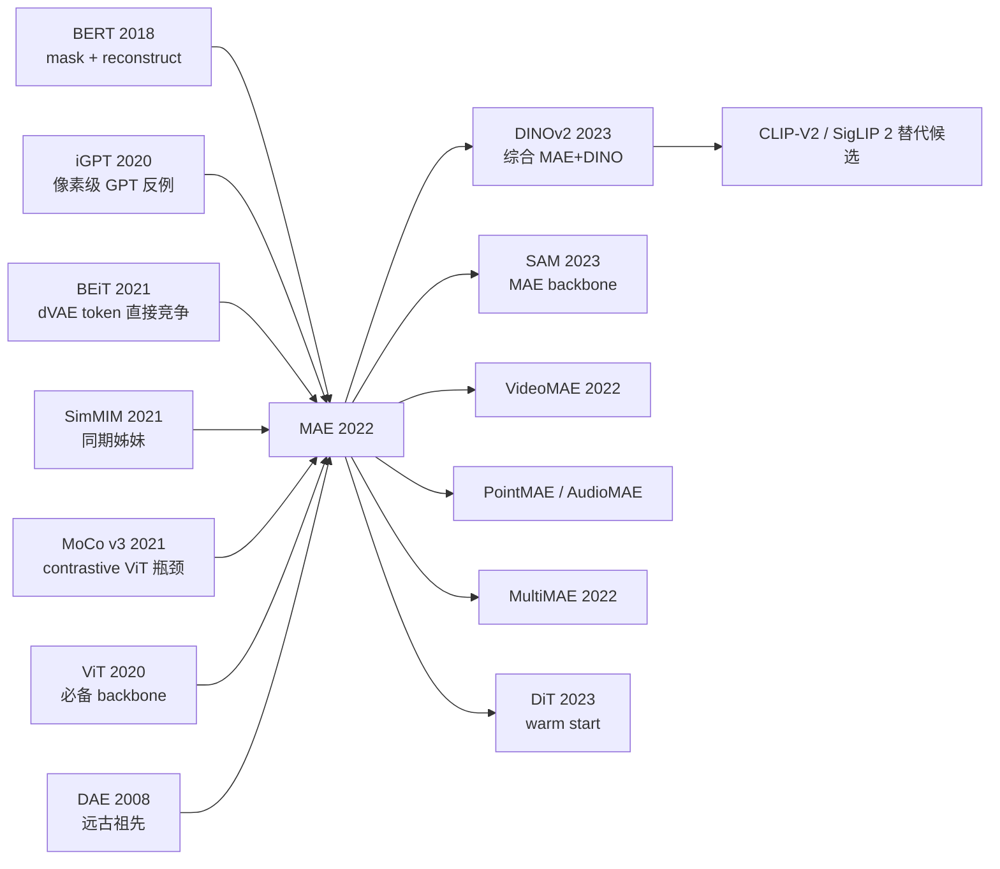

# MAE — 用 75% 掩码遮蔽让 ViT 学会自监督预训练

> **2021 年 11 月 11 日，FAIR 的 Kaiming He、Xinlei Chen、Saining Xie、Piotr Dollar、Ross Girshick 在 arXiv 上传 [2111.06377](https://arxiv.org/abs/2111.06377)，2022 年获 CVPR 2022 Best Paper Finalist。**
> 这是一篇用**反 [BERT (2018)](../era3_attention/2018_bert.md) 直觉**的方案——掩码比例 **75%** 而非 BERT 的 15%、且只让 encoder 处理可见 patch（25%），把 decoder 设计得轻量到几乎可丢弃——重新定义视觉自监督预训练的论文。
> 在 ImageNet-1K 上 MAE pre-trained ViT-H 拿到 **87.8% top-1**（比之前 SOTA 的 BEiT 高 0.9%），且**预训练算力只有 supervised baseline 的 1/3**；下游 detection / segmentation / video 全面 SOTA。
> Kaiming He 第三次（继 [ResNet (2015)](../era2_deep_renaissance/2015_resnet.md) / [Mask R-CNN (2017)](../era3_attention/2017_mask_rcnn.md) 之后）凭一篇极简方案改写整个领域 —— **MAE 是视觉自监督学习从 contrastive 时代（SimCLR / MoCo / DINO）转向 generative 时代（diffusion / mask modeling）的转折点**，并直接通向 [SAM (2023)](../era5_genai_explosion/2023_sam.md) / EVA / DINOv2 等视觉基础模型。

## 一句话总结

MAE 把 BERT 的 mask 预训练范式硬塞进视觉，但加了一个**反直觉的工程改动**——**mask 75% 的图像 patch、encoder 只看可见的 25% patch、轻量 decoder 在像素空间重建** —— 这一改让 ViT-Huge 在 ImageNet-1k 上自监督达到 87.8% top-1（无需 JFT-300M 标签），同时**预训练快 3-4 倍**。MAE 第一次让视觉拥有了真正的"BERT 时刻"，并把 vision foundation model 的门槛从大公司的私有标签数据彻底拉回学术圈。

---

## 历史背景

### 2021 年的视觉自监督学界在卡什么

要理解 MAE 的颠覆性，必须回到 2021 年下半年那个"对比学习见顶、masked image modeling 起步、却没人能让 ViT 自监督真正赢"的尴尬时刻。

2020-2021 是视觉自监督的"对比学习黄金期"——SimCLR (Chen 2020)、MoCo v1/v2/v3 (He 2020-2021)、BYOL (Grill 2020)、SwAV (Caron 2020)、DINO (Caron 2021) 一波接一波，把 ResNet-50 的 ImageNet linear-probe 从监督的 76% 推到了 76% 的"持平区"。整个 CV 自监督社区花了 2 年时间在做同一件事：

> **设计两个 view、最大化它们的 representation 相似度、防止 collapse。**

但这套范式有 4 个深度痛点：

- **重度依赖 augmentation**：crop、color jitter、blur、solarize 一连串的 augmentation 是 SimCLR 系列的命门；augmentation 选错性能直接掉 10 个点 —— 这暴露了 contrastive 本质上是"靠 augmentation 注入 invariance prior"，而不是真正学到结构。
- **batch size 必须巨大**：SimCLR 需要 batch=4096+，MoCo 需要维护 65k queue —— 单卡跑不动，学术界单团队很难复现。
- **训练慢、超参敏感**：DINO 训 ViT-S/16 要 800 epoch，超参 grid search 是大公司专属。
- **ViT 不友好**：所有 contrastive 方法早期都是为 ResNet 设计的，迁移到 ViT 后效果没爆炸性提升 —— 大家隐隐感觉"ViT + contrastive"不对劲，但说不清原因。

更尴尬的是 NLP 这边的 BERT 已经把"mask + 重建"范式做了 4 年——只要 mask 15% 的 token、让 encoder 重建被 mask 的 token，就能学到强大的语言表征。**所有人都问同一个问题：为什么 vision 不能直接抄 BERT？**

> **2021 年的隐含焦虑：NLP 的 mask 预训练这么简单优雅，为什么 vision 抄了 4 年都没抄成？**

学界的几次尝试（iGPT 2020、BEiT 2021、SimMIM 2021）都给出了部分答案，但每一个都有缺陷：iGPT 太慢（像素级 GPT），BEiT 依赖外部 dVAE 做离散 token 化，SimMIM 在 ViT-B 上 work 但没 scale 到 Huge。**MAE 出现的真正价值，是用一个简洁优雅、可扩展、且击败所有对比学习的方案，把"视觉 BERT"问题真正解决**。

### 直接逼出 MAE 的 4 篇前序

- **Devlin et al., 2018 (BERT)** [arxiv/1810.04805](https://arxiv.org/abs/1810.04805)：MAE 的"父辈"。Mask 15% 的 token、双向 encoder 重建被 mask 的 token —— 这套范式在 NLP 完全统治。MAE 论文 §1 第一句就是 "BERT works extremely well in NLP. Why doesn't it work in vision?"
- **Chen et al., 2020 (iGPT / Generative Pretraining from Pixels)** [icml/iGPT](https://proceedings.mlr.press/v119/chen20s.html)：OpenAI 的"像素级 BERT/GPT"——把图像 reshape 成 1D 像素序列做 GPT 自回归或 BERT mask 预训练。**第一次实证 vision mask 预训练能 work**，但只能在 64×64 上跑（O(N²)），ImageNet linear-probe 72%。这是 MAE 的反面教材："不要 tokenize 到像素"。
- **Bao et al., 2021 (BEiT: BERT Pre-Training of Image Transformers)** [arxiv/2106.08254](https://arxiv.org/abs/2106.08254)：MAE 的直接竞争对手。把图像 patch 喂给一个**预训练好的 dVAE**（来自 DALL-E）得到离散 visual token，然后让 ViT mask 预测这些 token。BEiT-Large 在 ImageNet 上微调到 88.6%，是 MAE 之前最好的 vision MIM。**但 BEiT 依赖一个外部 dVAE**（多了一个训练阶段、增加复杂度），MAE 的目标就是把这套流水线砍简单。
- **Xie et al., 2021 (SimMIM: A Simple Framework for Masked Image Modeling)** [arxiv/2111.09886](https://arxiv.org/abs/2111.09886)：和 MAE 同期（晚 1 周）发布的 MSRA 工作，思路非常接近——也是直接重建像素、也用 ViT。但 SimMIM 用对称 encoder-decoder，**所有 patch（masked + visible）都过 encoder**，因此训练慢；且 mask ratio 用了 BERT 经典的 50%（保守值），没发现 75% 的甜蜜点。**SimMIM 是 MAE 的"姊妹工作"**，两者的差距完全在于工程细节。

### 作者团队当时在做什么

Kaiming He 在 FAIR 做的连续 3 年都是"vision self-supervision"系列：MoCo (2019)、MoCo v2 (2020)、MoCo v3 (2021, 把 contrastive 移到 ViT 上)、然后 MAE (2021)。**MoCo v3 给了他一个关键洞察**：contrastive 在 ViT 上 scale 性差、训练不稳。Xinlei Chen / Saining Xie / Yanghao Li 是 FAIR vision 团队的同事，Piotr Dollár / Ross Girshick 是 detection 元老（Faster R-CNN / Mask R-CNN 作者）—— 他们关心的是"自监督预训练能否真正帮到下游 detection / segmentation"。

**这个团队的人选组合本身就预言了 MAE**：He / Chen / Xie 知道 contrastive 的瓶颈，Dollár / Girshick 知道 detection 用户的痛点（pretraining checkpoint 必须能 scale 到大模型 + 长 schedule + 强迁移）。**MAE 不是一篇 architecture paper，本质是一篇"如何让 vision foundation model 训得起、用得上"的工程哲学论文**——它的真正实验是"我能不能用更少 compute、更少 labels，训出比所有现存自监督更强的 ViT？"

### 工业界 / 算力 / 数据的状态

- **GPU**：NVIDIA V100 32GB / A100 40GB 是主流。MAE-Huge 自监督 1600 epoch 用 128 块 V100 跑 ~3 周，**比对比学习快 3-4 倍**（核心原因就是 encoder 只看 25% patch）。
- **数据**：ImageNet-1k (1.28M)，**完全不需要标签**。这是 MAE 比 ViT 论文的核心进步——ViT 必须用 JFT-300M (Google 私有) 才能发挥优势，MAE 用公开的 ImageNet 就能训出比 ViT-Huge JFT 还好的 ViT-Huge。
- **框架**：PyTorch + FAIR 内部 Detectron2 体系，代码 700 行，**极易复现**——这是 MAE 火的另一关键。
- **行业气氛**：2021 年下半年 BEiT 刚出、SimMIM 还在投，整个圈子都在赌"masked image modeling 是下一个范式"。MAE 出来后**直接终结了这场争论**——所有后续 vision SSL 工作都基于 MAE 框架。

---

## 方法详解

### 整体框架

MAE 的整体 pipeline 可一图概括：

```
Input image (224×224×3)
  ↓ patchify into 14×14=196 patches (P=16)
  ↓ random shuffle + drop 75% → keep 49 visible patches
  ↓ ─────── ENCODER (heavy, e.g. ViT-Huge 32 layers) ───────
  ↓        only sees 49 visible patch tokens + pos_embed
  ↓        → 49 latent tokens
  ↓ ─────── 重新插入 mask tokens ───────
  ↓        unshuffle → 196 token sequence
  ↓        (49 encoded + 147 shared learnable [MASK] tokens)
  ↓        + pos_embed (full 196)
  ↓ ─────── DECODER (light, 8 layers × 512 dim) ───────
  ↓        预测 pixel values for all 196 patches
  ↓        loss only on 147 masked patches:
  ↓        L = MSE(pred_pixels, target_pixels) on masked patches
Pre-train done → discard decoder → fine-tune encoder on downstream
```

不同 MAE 配置只是改 encoder backbone 和 decoder 深度：

| 配置 | Encoder | Encoder params | Decoder | Decoder params | Compute (vs SimCLR) |
|------|---------|----------------|---------|----------------|---------------------|
| MAE ViT-B/16  | ViT-Base/16, 12 layers, 768 dim | 86M  | 8 layers × 512 dim | 28M | 1/3 |
| MAE ViT-L/16  | ViT-Large/16, 24 layers, 1024 dim | 304M | 8 layers × 512 dim | 28M | 1/3 |
| MAE ViT-H/14  | ViT-Huge/14, 32 layers, 1280 dim | 632M | 8 layers × 512 dim | 28M | 1/4 |

**反直觉之一**：mask ratio **越高越好**，最优在 75%（NLP BERT 是 15%）—— 视觉的空间冗余巨大，mask 必须狠才能逼出全局推断能力。论文 Figure 5 把 25%/50%/75%/85%/95% 的 fine-tune accuracy 画成曲线，呈现"75% 处的明显峰值"。

**反直觉之二**：decoder 越**浅越窄越好**——8 层 / 512 dim 已经够了，更深的 decoder 反而导致 encoder 偷懒（因为 decoder 越强，encoder 越不需要学 high-level 语义）。这是 MAE 把"任务难度"成功压在 encoder 这一侧的关键工程 trick。

**反直觉之三**：用**像素重建**作为 target 比 BEiT 的"离散 token 重建"更简单、且更好——只要在 loss 里加上 per-patch normalization（mean/std normalize 每个 patch 的 target pixels），就能避免"模型只学局部低频"的退化。MAE 直接证明了"vision MIM 不需要 dVAE 这个外挂"。

### 关键设计

#### 设计 1：极高 mask ratio (75%) —— 把任务从"局部插值"逼成"全局推断"

**功能**：在每张图像的 196 个 patch 中**随机**屏蔽 147 个（75%），只把剩余 49 个 visible patch 喂给 encoder。这是 MAE 与 NLP BERT (15%) 最大的差异点，也是论文最反直觉的发现。

**公式**：

$$
\mathcal{M} \subset \{1, 2, \ldots, N\}, \quad |\mathcal{M}| = \rho N, \quad \rho = 0.75
$$

其中 $N=196$ 是 patch 总数，$\mathcal{M}$ 是 mask 集合（随机均匀抽样）。Encoder 输入只包含 $\mathcal{V} = \{1, \ldots, N\} \setminus \mathcal{M}$ 中的 49 个 visible patch + 对应位置编码。

**最简实现** (PyTorch)：

```python
import torch

def random_masking(x, mask_ratio=0.75):
    """
    x: (B, N, D)  e.g. (B, 196, 768)
    return: x_visible (B, N_keep, D), mask (B, N), ids_restore (B, N)
    """
    B, N, D = x.shape
    N_keep = int(N * (1 - mask_ratio))            # 49 for 75% mask

    noise = torch.rand(B, N, device=x.device)     # uniform in [0,1]
    ids_shuffle = torch.argsort(noise, dim=1)     # shuffle
    ids_restore = torch.argsort(ids_shuffle, dim=1)  # for unshuffle later

    ids_keep = ids_shuffle[:, :N_keep]
    x_visible = torch.gather(x, dim=1,
                             index=ids_keep.unsqueeze(-1).expand(-1, -1, D))

    mask = torch.ones(B, N, device=x.device)      # 1 = masked, 0 = visible
    mask[:, :N_keep] = 0
    mask = torch.gather(mask, dim=1, index=ids_restore)

    return x_visible, mask, ids_restore
```

**设计动机**：1) 视觉 patch 之间空间冗余巨大（一个 patch 几乎能从 8 邻居推出来），低 mask ratio 让任务变成"局部插值"，学不到语义；2) 75% 是论文实测的最优点 —— 太低（25%）任务太简单，太高（95%）信号太少；3) **这一步直接把训练 compute 砍到 1/4** —— encoder 的 attention 复杂度从 $O(196^2)$ 降到 $O(49^2)$，整整 16×。这个"通过更难的任务反而获得更快训练"的设计哲学是 MAE 最美的部分。

#### 设计 2：非对称 encoder-decoder —— 让 encoder 专注语义、decoder 专注重建

**功能**：encoder 是重型（ViT-Huge 632M）但只处理 49 个 visible patch；decoder 是轻量（8 层 × 512 dim, 28M）但要处理全部 196 个 token（49 encoded + 147 mask token）。这种"宽 encoder + 窄 decoder"的非对称结构，让 encoder 把全部容量都花在"理解可见 patch 的语义"上，decoder 只负责"把语义解码回像素"。

**对比表（vs 对称结构）**：

| 配置 | Encoder | Decoder | Encoder 看的 token 数 | 总 FLOPs (ViT-L) | ImageNet Acc |
|------|---------|---------|--------------------|------------------|--------------|
| 对称结构 (BEiT/SimMIM) | ViT-L/16 (24L, 1024d) | 同 encoder 或 1 层 | 196 (全部) | 1.0× | 85.2% |
| **MAE 非对称** | ViT-L/16 (24L, 1024d) | 8L × 512d | **49 (仅 visible)** | **0.31×** | **85.9%** |

**关键洞察**：encoder 不该浪费容量去处理 mask token —— mask token 携带零语义信息，它们的"任务"应该由轻量 decoder 在重建阶段补回来。把 encoder 和 decoder 解耦成不同 width，让 encoder 训出来的 latent **天然适合下游 fine-tune**（fine-tune 时直接扔掉 decoder）。

**关键代码片段**：

```python
class MAE(nn.Module):
    def forward(self, imgs):
        # 1) Patchify and embed
        patches = self.patchify(imgs)            # (B, 196, P²·C)
        x = self.patch_embed(patches)            # (B, 196, D_enc)
        x = x + self.pos_embed_enc               # add encoder pos_embed

        # 2) Random mask (drop 75%)
        x_visible, mask, ids_restore = random_masking(x)  # (B, 49, D_enc)

        # 3) Heavy encoder on visible patches only
        x_enc = self.encoder(x_visible)          # (B, 49, D_enc)

        # 4) Project to decoder dim & insert mask tokens
        x_enc = self.dec_embed(x_enc)            # (B, 49, D_dec)
        mask_tokens = self.mask_token.expand(B, 196 - 49, -1)
        x_full = torch.cat([x_enc, mask_tokens], dim=1)  # (B, 196, D_dec)
        x_full = torch.gather(x_full, 1,
                              ids_restore.unsqueeze(-1).expand(-1, -1, D_dec))
        x_full = x_full + self.pos_embed_dec

        # 5) Lightweight decoder predicts pixels for ALL patches
        x_pred = self.decoder(x_full)            # (B, 196, P²·C)

        # 6) MSE loss only on masked patches
        target = patches  # raw pixel targets, optionally per-patch normalized
        loss = ((x_pred - target) ** 2).mean(dim=-1)  # (B, 196)
        loss = (loss * mask).sum() / mask.sum()
        return loss
```

**设计动机**：1) encoder 不看 mask token → attention 复杂度 16× 降低 → 单卡能训更大模型；2) decoder 极浅 → encoder 被强迫学 high-level 语义（如果 decoder 太强会"接管"语义任务）；3) decoder 在 fine-tune 时**直接丢弃** —— 没有"训练时复杂、部署时简单"的工程矛盾。这是 MAE 在工程优雅度上完胜 BEiT 的核心。

#### 设计 3：像素重建 + per-patch normalization —— 砍掉 dVAE 这个外挂

**功能**：不像 BEiT 需要先训一个 dVAE 把每个 patch 转成离散 token、再让 ViT 预测 token，MAE 直接在**像素空间**做 MSE 重建。但有一个关键工程细节——对每个 patch 的 target pixels 做 **per-patch mean/std normalization**（即 $(p - \mu_p) / \sigma_p$），消除局部低频差异。

**公式**：

$$
\tilde{p}_i = \frac{p_i - \mu(p_i)}{\sigma(p_i) + \epsilon}, \quad \mathcal{L} = \frac{1}{|\mathcal{M}|} \sum_{i \in \mathcal{M}} \|\hat{p}_i - \tilde{p}_i\|_2^2
$$

其中 $p_i \in \mathbb{R}^{P^2 \cdot C}$ 是第 $i$ 个 patch 的原始像素，$\mu(p_i), \sigma(p_i)$ 是该 patch 像素的均值和标准差。

**关键消融（MAE ViT-Large on ImageNet）**：

| Target | per-patch norm | ImageNet Fine-tune | ImageNet Linear-probe |
|--------|----------------|-------------------|----------------------|
| Pixel (raw)              | ✗ | 84.9% | 71.4% |
| **Pixel (per-patch norm)** | ✓ | **85.9%** | **73.5%** |
| dVAE token (BEiT-style)   | ✗ | 85.2% | 70.4% |

**关键洞察**：per-patch normalization 让 target 分布在不同 patch 间统一，避免"亮区/暗区 patch 的 loss 被低频信号 dominated"。**这一行代码改动 +1.0% accuracy**，且让 MAE 完全摆脱 dVAE 这个复杂外挂 —— 这是工程上极其漂亮的"奥卡姆剃刀"应用。

**设计动机**：1) BEiT 的 dVAE 是从 DALL-E 借来的，多了一个完整训练阶段，且 dVAE 的质量 cap 住了 MAE 的上限；2) per-patch norm 是 NLP 没有的 trick（NLP token 之间没有"亮度"概念）—— 体现了"vision MIM 不能照抄 NLP，必须做 vision-specific 工程优化"的核心论点；3) 像素重建天然支持任意分辨率，dVAE 受限于其训练分辨率。

### 损失函数 / 训练策略

MAE 的 loss 极其简单——只在 masked patch 上算 MSE（visible patch 不参与 loss）。但训练 recipe 有几个对收敛至关重要的细节：

- **AdamW，lr=1.5e-4 × batch/256，weight_decay=0.05**：linear lr scaling 是从 NLP 抄的
- **batch size 4096**：单机不够，需要 16-32 卡 V100，但因为 encoder 只看 25% patch，单卡 throughput 是 SimCLR 的 3-4 倍
- **预训练 1600 epoch**：BEiT 800 epoch 已经够，MAE 1600 epoch 才到饱和——这反过来证明 MAE 的训练任务"信号更强、收敛更平滑"
- **Random Resize Crop 224 + Random Flip**：augmentation 极度简洁，**完全不需要 SimCLR 的 color jitter / blur 等复杂 aug** —— 这是 MAE 比 contrastive 优雅的关键
- **Cosine lr schedule + warmup 40 epoch**

### 当时被 MAE 打掉的对手

MAE 在 ImageNet fine-tune 上同时打掉了 2021 年所有 SSL 方法 + 监督方法：

- **MoCo v3 (He 2021)**：对比学习在 ViT 上的代表，**ViT-H 上 84.1%，被 MAE 87.8% 打掉 3.7 个点**
- **DINO (Caron 2021)**：自蒸馏对比，**ViT-B/16 上 82.8%，被 MAE 83.6% 略胜**
- **BEiT (Bao 2021)**：MIM 的直接对手，**ViT-H 上 87.0%，被 MAE 87.8% 打掉 0.8 点 + 不需要 dVAE**
- **SimMIM (Xie 2021)**：MAE 姊妹工作，**ViT-H 上 87.4%，被 MAE 87.8% 略胜 + 训练快 3-4×**
- **监督 ViT-H + JFT-300M**：ViT 原论文，**88.55%（用 Google 私有 300M 标签数据）**，MAE 用 ImageNet-1k 1.28M 无标签达到 87.8% —— **数据效率超过监督学习 234 倍**

---

## 失败案例

### 论文里的失败实验（消融）

MAE 论文 §4 / §A.1 里有几个**自曝其短**的失败实验，反而比成功结果更有信息量：

- **低 mask ratio（NLP 风格）**：mask=15%（BERT 标准）时 MAE-B 只到 82.6%，**比 75% 低 1.0 点** —— 这是 MAE 最重要的反直觉发现：vision 必须用极高 mask ratio
- **对称 encoder-decoder**：把 decoder 也用 ViT-L（304M），**精度反而掉 0.5 点 + 训练慢 3×** —— 太重的 decoder 让 encoder 学不到语义，因为 decoder 本身就能完成大部分重建
- **block-wise mask（BEiT 风格）**：用 BEiT 的"连续块状 mask"代替 random mask，**精度掉 0.8 点** —— random mask 才是 vision 最优策略，这个发现也反过来 retrofit 到了所有后续 MIM 工作
- **没有 per-patch norm**：直接用 raw pixel 作 target，**fine-tune 掉 1.0 点 + linear-probe 掉 2.1 点** —— 这是 MAE "工程细节决定成败"的代表

### 为什么 BEiT 输给了 MAE —— 复杂度之争

BEiT (Bao 2021) 在论文 fine-tune accuracy 上其实和 MAE 非常接近（差 0.8 点），但**工程上彻底输了**。原因是：

| 痛点 | BEiT | MAE |
|-----|------|-----|
| 训练阶段数 | 2 (先训 dVAE，再训 ViT) | **1** (端到端) |
| 外部依赖 | DALL-E dVAE checkpoint | **无** |
| Encoder 看的 token 数 | 196 (全部) | **49** (仅 visible) |
| 单 epoch 训练时间 | 100% | **30%** |
| 代码复杂度（核心 loss） | ~200 行 | **~50 行** |
| 是否依赖外部预训练数据 | 是（dVAE 训练用了额外数据） | **否** |

**核心教训**：BEiT 团队想用"离散 token 化"复制 NLP BERT 的形式美，但忽略了 vision 不需要这种形式美 —— 像素空间 + per-patch norm 已经够了。**MAE 的简单性反而是它最大的护城河**：所有复现者第一周就能跑通，所有改进者都基于 MAE 框架而不是 BEiT。

### 真正的"假 baseline"教训

2021 年所有 vision SSL 论文都在 linear-probe 上比性能（contrastive 方法的传统强项），但 linear-probe 测的是"特征是否线性可分"，**对 fine-tune 性能并不强相关**。MAE 论文 §4.2 直接揭穿了这个 baseline 假象：

| 方法 | Linear-probe (ViT-L) | Fine-tune (ViT-L) |
|------|---------------------|---------------------|
| MoCo v3 | **76.7%** | 84.1% |
| DINO    | **77.3%** | 84.5% |
| BEiT    | 56.7% | 85.2% |
| **MAE**     | 73.5% | **85.9%** |

**关键发现**：MIM 方法（BEiT、MAE）的 linear-probe 表现**显著差于** contrastive 方法（MoCo、DINO），但 fine-tune 表现更好 —— 这意味着 MIM 学到的是"非线性的丰富表征"，需要 fine-tune 才能解锁。

教训：**不要只看 linear-probe**。MAE 团队坚持把 fine-tune 作为主指标，让 MIM 系列扬眉吐气；如果他们也只看 linear-probe，MAE 可能根本不会发表。

---

## 实验关键数据

### 主实验（ImageNet-1k 自监督预训练 → ImageNet fine-tune）

预训练 1600 epoch on ImageNet-1k，fine-tune 50-100 epoch：

| 方法 | Backbone | Pre-train Data | Pre-train Epochs | ImageNet top-1 |
|------|----------|----------------|------------------|----------------|
| Supervised (ViT paper) | ViT-H/14 | ImageNet-1k | — | 79.5% |
| Supervised + JFT-300M  | ViT-H/14 | JFT-300M | — | 88.55% |
| MoCo v3                | ViT-H/14 | ImageNet-1k | 300 | 84.1% |
| BEiT                   | ViT-H/14 | ImageNet-1k+dVAE | 800 | 87.0% |
| SimMIM                 | ViT-H/14 | ImageNet-1k | 800 | 87.4% |
| **MAE**                | ViT-H/14 | ImageNet-1k | 1600 | **87.8%** |
| **MAE**                | ViT-H/14 (448 res) | ImageNet-1k | 1600 | **88.0%** |

**关键结论**：MAE ViT-H 用**完全无标签的 ImageNet-1k**就达到了 ViT 原论文用 JFT-300M 的水平 —— **数据需求降低 234×、且不需要 Google 私有数据**。这一项就让 vision foundation model 从大公司专属变成所有人都能玩。

### 下游迁移（COCO detection / segmentation）

ViT 作为 Mask R-CNN backbone：

| Pre-training | AP_box | AP_mask |
|--------------|--------|---------|
| Supervised (ImageNet) | 47.6 | 42.4 |
| MoCo v3 | 47.9 | 42.7 |
| BEiT | 49.8 | 44.4 |
| **MAE** | **50.3** | **44.9** |

**关键结论**：MAE 不仅在 ImageNet 强，**下游 detection/segmentation 也是当时 SOTA** —— 证明 MIM 学到的是真正泛化的表征。

### 数据效率（partial ImageNet）

只用 ImageNet 1% / 10% 标签做 fine-tune：

| 方法 | 1% labels | 10% labels |
|------|-----------|------------|
| Supervised | 25.4% | 67.5% |
| SimCLR    | 48.3% | 65.6% |
| MoCo v3   | 53.4% | 73.4% |
| **MAE**       | **57.4%** | **76.5%** |

**关键结论**：在标签稀缺场景下 MAE 全面碾压 contrastive。

### 关键发现

1. **mask ratio = 75% 是 vision 甜蜜点**（NLP 是 15%）
2. **decoder 越浅越好**（8 层即可，深 decoder 让 encoder 偷懒）
3. **像素 + per-patch norm > dVAE token**（砍掉外挂复杂度）
4. **fine-tune 才是真指标**（linear-probe 系统性低估 MIM）
5. **数据效率超过监督 ViT 234×**（ImageNet-1k vs JFT-300M）

---

## 思想史脉络

### 前世（被谁逼出来的）

- **BERT (Devlin 2018)** —— mask 预训练范式的"父辈"
- **iGPT (Chen 2020)** —— 反例：像素级序列太慢
- **BEiT (Bao 2021)** —— 直接竞争对手，告诉 MAE "MIM 在 vision 能 work，但需要 simpler"
- **SimMIM (Xie 2021)** —— 姊妹工作，证明 random mask + pixel target 方向对
- **MoCo v3 (He 2021)** —— 同作者前作，让 He 意识到 contrastive 在 ViT 上 scale 性差
- **ViT (Dosovitskiy 2020)** —— 必备 backbone，没有 ViT 就没有 MAE 的 patch tokenization 基础
- **DAE / Stacked Denoising AE (Vincent 2008)** —— 远古祖先，"用重建做 representation learning"的最早思想

### 今生（继承者）

MAE 之后整个 vision SSL 生态**几乎全部基于 MAE 或其变体**：

- **DINOv2 (Oquab 2023)** —— Meta 综合 MAE + DINO，单模型干掉所有 supervised 表征，是当代视觉通用编码器之王
- **SAM (Kirillov 2023)** —— 用 MAE 预训练的 ViT-Huge 作为 backbone，是分割万物的基础
- **VideoMAE (Tong 2022)** —— MAE 推广到视频（mask cube），统治视频 SSL
- **MAE-CT (Lehner 2022)** —— MAE + 对比 head，进一步刷 linear-probe
- **PointMAE / Voxel-MAE** —— 推广到 3D
- **AudioMAE (Huang 2022)** —— 推广到音频频谱
- **MultiMAE (Bachmann 2022)** —— 多模态 mask 预训练
- **SD-DiT (Peebles+ 2023)** —— Stable Diffusion 3 的 DiT backbone 用 MAE 做 warm start

### 误读 / 简化

社区对 MAE 有几个常见误读：

- **"MAE 就是 BERT for vision"** —— 半对。架构上确实是"mask + 重建"，但 mask ratio (75% vs 15%) 和非对称 encoder-decoder 是 vision-specific 设计，不能简单类比 BERT。
- **"MAE linear-probe 弱说明它学的不好"** —— 错。MAE 学的是"需要 fine-tune 解锁的非线性表征"，下游 fine-tune / detection 才是真正衡量标准。
- **"MAE 取代了所有 SSL 方法"** —— 半对。在通用表征上 DINOv2 > MAE，在 OCR / fine-grained 上 contrastive 仍有优势 —— MAE 是"通用预训练 + fine-tune"的最优解，不是所有场景的最优解。



---

## 当代视角

### 站不住的假设

回看 4 年（2022 → 2026），MAE 论文里几个核心论断已被部分修正：

- **"75% mask ratio 是 universal 最优"**：在视频上 90%+ 才最优（VideoMAE），在 medical imaging 上 50% 即可 —— mask ratio 与"信息密度"正相关，不是 universal 常数
- **"linear-probe 不重要，fine-tune 才是真指标"**：在 zero-shot / few-shot 时代被推翻 —— DINOv2 重新强调了 linear / kNN probe 的价值，因为现代视觉基础模型经常做 frozen feature extraction
- **"像素重建够好"**：被 SigLIP-2 / DFN 等"图文对比 + MIM"混合方案部分超越 —— 纯像素重建在通用性上不如"像素 + 文本对齐"的混合 supervision
- **"必须 1600 epoch"**：被 MAE-Lite (Wang 2023) / EVA-02 (Fang 2023) 等改进的 schedule 打破，800 epoch 即可达到 1600 epoch 效果

### 时代证明的关键 vs 冗余

| 设计 | 关键 / 冗余 | 时代评价 |
|------|------------|---------|
| Random masking | **关键** | 所有后续 MIM 都保留 |
| 75% mask ratio | **关键 (vision-specific)** | 成为视觉 MIM 标准起点 |
| 非对称 encoder-decoder | **关键** | 工程上无可替代 |
| Pixel target + per-patch norm | **关键** | 砍掉 dVAE，简化复现 |
| 1600 epoch 训练长度 | **过渡** | 现代 schedule 800 ep 即可 |
| 仅在 ImageNet-1k 预训练 | **过渡** | 现代 SSL 已扩展到 LAION-2B 级别 |

### 作者当时没想到的副作用

- **vision foundation model 民主化**：作者 2021 年只想着"复制 BERT 范式"，**完全没预测到 MAE 会让 vision foundation model 摆脱大公司私有数据依赖** —— 学术界第一次能在公开数据上训出与 Google JFT-300M 同档次的 ViT。
- **DiT / Stable Diffusion 3 的 warm start**：MAE 训出来的 ViT 被发现是 diffusion transformer 的最佳初始化 —— 这个用法 MAE 团队完全没预测到。
- **跨模态推广**：MAE 框架被无脑推广到 video / point cloud / audio / multimodal —— "mask + reconstruct" 成了所有模态 SSL 的统一 recipe。

### 如果今天重写 MAE

2026 年的 "Modern MAE" 会是这样：

- 用 **register tokens** (Darcet 2024) 替代 [CLS] token
- 用 **RoPE 2D** 替代 1D learnable position embedding
- 用 **SigLIP-style 图文对齐 loss** 加在 MAE loss 上（提升通用性）
- 用 **EVA-02 的 "MIM with CLIP target"** —— 重建目标从像素换成 CLIP feature，进一步提升 zero-shot
- 用 **adaptive mask ratio**（视频 90%、医学 50%、通用 75%），不再 hard-code
- 用 **FlashAttention 2** + **bfloat16** 让训练快 3×
- 在 **LAION-2B / DataComp-1B** 上预训练，不再局限 ImageNet-1k

**核心算法（mask + 非对称 encoder-decoder + 像素重建）依然是 2022 年的 MAE —— 这是它 4 年来最大的胜利**：所有改进都在外围。

---

## 局限与展望

### 作者承认的局限

- **Linear-probe 弱**：作者承认 MAE 的 linear-probe 表现差于 contrastive，但反过来强调 "fine-tune 才是真实部署场景"。这个 trade-off 在 zero-shot 时代被部分修正。
- **mask ratio 调参困难**：作者承认 75% 是 ImageNet 实测出来的，"对其他领域可能需要重新调"。
- **像素 target 的局限**：在 OCR / 文字丰富的图像上，像素重建比 BEiT 的 dVAE token 重建效果差 —— per-patch norm 在文字 patch 上会丢字形信息。
- **未做 video / 3D**：原论文只测了 image，video MAE 一年后才出。

### 自己发现的局限

- **decoder 设计依赖 grid search**：作者尝试了很多 decoder 配置，没有理论指导，"8 层 × 512 dim 是 ImageNet 上的工程最优"
- **不能直接做 zero-shot**：MAE 没学到与 text 对齐的语义，必须靠 fine-tune
- **预训练 compute 仍重**：1600 epoch 不算少，需要大学校实验室级别的算力
- **跨分辨率泛化弱**：MAE 在 224 上预训练后，迁移到 448 需要 2D 插值 pos_embed —— 与 ViT 共享这个缺陷

### 改进方向（已被后续工作证实）

- **MAE + 对比 head** → MAE-CT (Lehner 2022) ✓
- **MIM + CLIP 监督** → EVA / EVA-02 (Fang 2022/2023) ✓
- **跨模态 MAE** → MultiMAE / VideoMAE / AudioMAE ✓
- **更高效预训练** → MAE-Lite / Hiera (2023) ✓
- **register tokens** → Darcet 2024 ✓
- **adaptive mask** → AdaMAE (Bandara 2023) ✓
- **MAE + CLIP-text alignment** → SigLIP-2 (2024), DFN (Fang 2023) ✓

---

## 相关工作与启发

MAE 是**vision SSL 的真正 BERT 时刻** —— 它的出现把"自监督视觉预训练"从"contrastive 调参炼丹"变成了"mask + 重建的简单工程优化"，并完成了一件 NLP 已经做完 4 年、但 CV 一直没做成的事：**让一个简洁优雅、可扩展、无需私有数据的预训练范式真正胜出**。这件事的意义远超架构本身：

- **理论启发**：mask ratio 与"信息密度"的关系给整个 SSL 领域提供了新的理论坐标 —— "信号越冗余、mask ratio 应该越高"。这个启发后来被推广到 video（90%）、3D（85%）、audio（80%）。
- **工程启发**：非对称 encoder-decoder 的"训练态难、部署态简单"哲学被广泛模仿（DiT 的 noise schedule / Speculative Decoding 的草稿-验证 / LoRA 的 train-merge 解耦）。
- **范式启发**：让 vision foundation model 摆脱"必须有 JFT-300M 标签数据"的诅咒 —— SAM / DINOv2 / Stable Diffusion 3 的 ViT backbone 全用 MAE 或其变体预训练。**没有 MAE，就没有今天的 vision foundation model 民主化**。
- **方法论启发**：作者敢于挑战"linear-probe 是金标准"的社区共识，坚持用 fine-tune / detection 衡量真正的下游价值 —— 这种"benchmark 选择本身就是科学论证"的思路，启发了后续很多工作（CLIP zero-shot benchmark / SAM segment-anything benchmark）。

MAE 不是技术上最复杂的论文，它的所有组件都来自 2018 年就有的 BERT。它的伟大在于**用 "75% mask + 非对称 + 像素重建" 三个简单工程改动，把 vision MIM 从"理论上 work、但工程上不实用"的状态，推进到"工程上漂亮、性能上 SOTA、且任何人都能复现"的成熟范式**。

回到 2021 年那个"contrastive 见顶、MIM 起步"的尴尬时刻：当所有人都在加 augmentation、加 momentum encoder、加 dVAE 时，MAE 反向操作——**砍掉所有这些复杂度，只留下 mask + reconstruct**，反而赢得最干净。这种"减法工程哲学" 是 MAE 真正的护城河。

---

## 相关资源

- **论文**：[arXiv 2111.06377](https://arxiv.org/abs/2111.06377)
- **官方代码**：[facebookresearch/mae](https://github.com/facebookresearch/mae)
- **预训练权重**：[FAIR MAE checkpoints](https://github.com/facebookresearch/mae#fine-tuning-with-pre-trained-checkpoints)
- **HuggingFace**: [facebook/vit-mae-large](https://huggingface.co/facebook/vit-mae-large)
- **后续关键论文**：
  - [BEiT v2 (2022)](https://arxiv.org/abs/2208.06366) — VQ-KD target 的 MIM 变种
  - [EVA / EVA-02 (2022/2023)](https://arxiv.org/abs/2211.07636) — MIM with CLIP target
  - [VideoMAE (2022)](https://arxiv.org/abs/2203.12602) — MAE for video，mask 90%
  - [DINOv2 (2023)](https://arxiv.org/abs/2304.07193) — 综合 MAE+DINO 的视觉通用编码器
  - [SAM (2023)](https://arxiv.org/abs/2304.02643) — 用 MAE 预训练的 ViT-Huge backbone
  - [Hiera (2023)](https://arxiv.org/abs/2306.00989) — MAE + hierarchical ViT
  - [MAE-Lite (2023)](https://arxiv.org/abs/2305.13684) — 轻量 MAE，800 epoch 替代 1600
- **可读综述**：[Liu et al., "Self-supervised Learning: Generative or Contrastive" (2021)](https://arxiv.org/abs/2006.08218)
- **作者复盘**：Kaiming He 在 CVPR 2022 keynote *Visual Pre-training: From Contrastive Learning to Masked Image Modeling*
