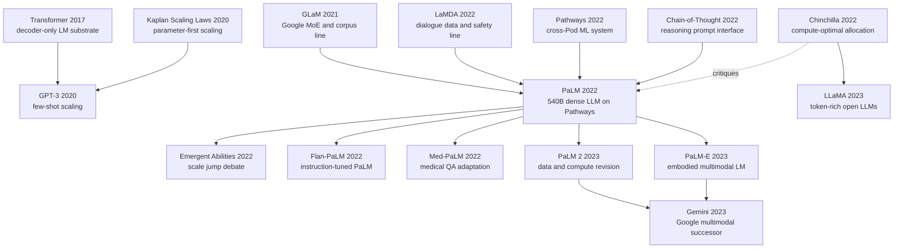

# PaLM — Pathways 把 dense LLM 推到 540B 的那一刻

> **2022 年 4 月 4 日，Google Research 在官方博客发布 PaLM；次日 Chowdhery、Narang、Devlin 领衔的 67 位作者把 [arXiv:2204.02311](https://arxiv.org/abs/2204.02311) 上传到 arXiv。** 这篇论文的戏剧性不只是“540B 参数”这个数字，而是 Google 第一次把 Pathways 这个跨 TPU Pod 的系统承诺压到一篇 dense decoder-only LLM 上：6144 块 TPU v4、780B token、46.2% MFU、57.8% HFU。PaLM 一边用规模把 BIG-bench、GSM8K、代码生成推到当时前沿，一边又被同月的 Chinchilla 反过来指出“参数太多、token 太少”。它因此成了 2022 年 LLM 史里很特殊的一块路标：既是参数军备竞赛的高峰，也是训练配比重新洗牌前最后一次盛大展示。

## 一句话总结

Chowdhery、Narang、Devlin 领衔的 67 位作者 2022 年发布的 PaLM，是 Google 用 Pathways 系统训练的 540B dense decoder-only Transformer：在近似训练成本 $C \approx 6ND$ 下，它选择把 $N$ 推到 540.35B、用 780B token 训练，并通过 SwiGLU、parallel Transformer block、multi-query attention、RoPE、256k lossless vocabulary、Adafactor + z-loss 等工程配方，把 6144 块 TPU v4 的训练效率推到 46.2% MFU。它替代的不是某个模块，而是 GPT-3 之后“175B 已经接近天花板”的心理边界：PaLM 540B 在 28/29 个 English NLP few-shot 任务上刷新单 checkpoint LLM SOTA，MMLU 5-shot 到 69.3，BIG-bench 58 个共同任务中赢 44 个，GSM8K 8-shot CoT+calculator 到 58%，HumanEval pass@100 到 76.2。

反直觉 lesson 是：PaLM 同时证明了“继续 scale 还有效”和“只堆参数并不最优”。论文自己在 Open Questions 里问过“62B 训 7T token 会怎样”，同月的 Chinchilla 给出答案：540B/780B 其实只有约 1.44 token/parameter，远离后来的 20 token/parameter 经验线。PaLM 的遗产因此分成两条：一条通向 Flan-PaLM、Med-PaLM、PaLM-E、PaLM 2、Gemini；另一条作为反面坐标，帮助 LLaMA 之后的开源模型转向 token-rich、parameter-modest 的训练哲学。

---

## 历史背景

### 2022 年初的 LLM 学界在卡什么

PaLM 出现时，LLM 社区正处在一个很奇怪的夹层。2020 年 5 月 [GPT-3](https://arxiv.org/abs/2005.14165) 用 175B 参数证明了 few-shot prompting 的价值，但它留下两个悬而未决的问题：第一，继续堆 dense 参数是否还会带来能力跃迁；第二，这种模型能不能被工业系统稳定、可复现、高效率地训练。到 2021 年底，答案仍不清楚。DeepMind 的 Gopher 280B、Microsoft/NVIDIA 的 MT-NLG 530B、Google 自家的 GLaM 和 LaMDA 都在推进边界，但每篇论文都只照亮一块局部：Gopher 强调分析，MT-NLG 强调 GPU pipeline scale，GLaM 强调稀疏 MoE，LaMDA 强调对话安全。还没有一篇 Google 内部的 dense LLM 论文把“更大模型、更强系统、更广评测、风险分析”一次性放到同一张桌子上。

PaLM 就是在这个窗口里出现的。它不是第一个大语言模型，也不是第一个 500B 量级模型；它真正补上的，是“Google 能否用自己的下一代训练系统 Pathways，把一个普通但极大的 decoder-only Transformer 推到可用前沿”。论文的标题把 Pathways 放进去很诚实，因为 PaLM 的技术故事有一半在模型，另一半在训练系统。没有 6144 块 TPU v4、没有跨两个 Pod 的数据并行、没有 JAX/T5X/XLA/Flaxformer 这一整套栈，540B 参数只是一个写在 proposal 里的数字。

### 直接推到 PaLM 的 5 条前序线索

**GPT-3 (Brown et al., 2020)** 给 PaLM 设定了外部基准：decoder-only、left-to-right LM、few-shot evaluation、自然语言任务描述加少量 exemplars。PaLM 沿用这套评测哲学，但把模型从 175B 推到 540B，把训练 token 从 300B 推到 780B，并扩展到 BIG-bench、GSM8K、代码、多语和风险分析。

**Kaplan scaling laws (2020)** 给了早期资源分配的心理模型：参数越大，few-shot loss 越可预测地下行。PaLM 继承了这种“继续 scale”的乐观，但它也把这个模型推到暴露裂缝的位置。论文第 13 节直接问：如果 62B 模型训 7T token，或者 120B 模型训 3.6T token，会不会比 540B/780B 更好？这个问题几乎就是 Chinchilla 的预告。

**GLaM 和 LaMDA (Google, 2021-2022)** 提供了 Google 内部的语料、评测和系统经验。PaLM 的 780B token 语料基于 LaMDA/GLaM 数据路线，包含 multilingual conversations、filtered webpages、books、Wikipedia、news 和 GitHub code。它没有走 GLaM 的稀疏 MoE，而是用 dense 模型证明：即使不靠条件计算，Google 的训练栈也能把模型推到前沿。

**Pathways (Barham et al., 2022)** 是系统侧前序。Google 在 2021 年提出 Pathways 愿景：一个模型跨任务、跨模态、跨硬件高效泛化。PaLM 是这个愿景的第一个大型语言模型落点。它的训练不是传统单机多卡或单 Pod 训练，而是让一个 Python client 调度两个 TPU v4 Pod，并让两边在每一步交换梯度后保持 bitwise-identical 参数。

**Chain-of-thought prompting (Wei et al., 2022)** 给 PaLM 的“能力跃迁”提供了放大镜。GSM8K、SVAMP、MAWPS、StrategyQA 等任务上，模型规模本身不够，必须让模型先写中间推理链，再给答案。PaLM 540B + CoT 的组合让 2022 年的读者第一次很直观地看到：规模带来的不只是更会补全文本，而是能把多步推理格式稳定接起来。

### 作者团队当时在做什么

PaLM 是一个典型的 Google Brain 大工程，作者名单有 67 位，论文附录还按贡献阶段拆了角色。Aakanksha Chowdhery、Sharan Narang、Jacob Devlin 是共同第一作者；Narang、Chowdhery、Noah Fiedel 负责 overall project leadership；Noam Shazeer、Yi Tay、Rewon Child 等人参与模型架构和优化器选择；Paul Barham、Sanjay Ghemawat、Michael Isard、Hyeontaek Lim 等人把 Pathways 系统接到训练主循环；Jason Wei、Xuezhi Wang、Denny Zhou 负责 reasoning 评测；Katherine Lee、Daphne Ippolito、Jacob Devlin 负责 memorization；Marie Pellat、Kevin Robinson、Sunipa Dev、Parker Barnes 等人负责 Responsible AI 和风险分析。

这个分工透露出 PaLM 的真实性质：它不是一篇“某个研究生提出新模块”的论文，而是 Google 把语言模型、分布式系统、数据管线、评测平台、安全分析和产品级 serving 经验压成一篇 100 多页报告。第一作者里既有做模型 scaling 的，也有做基础设施的；最后几位顾问包括 Kathy Meier-Hellstern、Douglas Eck、Jeff Dean、Slav Petrov、Noah Fiedel。PaLM 因此很像一座桥：一端连着 Transformer/LLM 学术线，另一端连着 Google 数据中心和 TPU 产品线。

### 工业界 / 算力 / 数据的状态

2022 年 4 月的工业背景是参数竞赛的峰值。Gopher 280B 刚发布几个月，MT-NLG 530B 把 dense 参数表面数字推到 500B 以上，DeepMind 的 Chinchilla 同月提醒大家 token/parameter 配比可能错了。PaLM 则站在两者中间：它用 540B 参数展示 Google 的系统规模，但训练 token 只有 780B，约 1.44 token/parameter；从后来的视角看，它强到离谱，同时又明显 under-trained。

训练 PaLM 540B 的硬件是两个 TPU v4 Pod，共 6144 块芯片、1536 台 host。论文报告平均 throughput 为 238.3K tokens/sec，MFU 为 46.2%，HFU 为 57.8%，并把跨 Pod 梯度传输描述到 81 Tbps burst 这个级别。这个数字重要，因为它说明 PaLM 的贡献不只是“多花钱训练了更大模型”，而是证明跨 Pod、pipeline-free 的训练可以接近 2x weak scaling。相比 MT-NLG 的 pipeline parallelism，PaLM 选择的是 pod-level data parallelism + within-pod model/data sharding，减少 pipeline bubble，但把压力转移到数据中心网络。

数据侧同样有 2022 年的工业味道：780B token 不是公开语料，而是 Google 内部混合语料，50% multilingual social media conversations、27% multilingual filtered webpages、13% English books、5% GitHub code、4% multilingual Wikipedia、1% English news。论文说训练只走一个 epoch，避免重复 subcorpora；同时也承认部分语料在 780B 后开始重复。这个“数据够大但还不无限”的边界，正是后来 Chinchilla 和 LLaMA 重新设计训练配比的起点。

## 研究背景与动机

### PaLM 真正要回答的问题

PaLM 的核心问题不是“能不能把参数堆到 540B”，而是三个更具体的问题。第一，dense decoder-only Transformer 在 GPT-3 之后是否还能继续按 scale 获益；第二，Google 的 Pathways 系统是否能让单个模型跨多个 TPU Pod 高效训练；第三，这种大模型的能力提升是否只体现在传统 NLP，还是会在 reasoning、code、multilingual、BIG-bench 这类更难的场景里显现。

论文的实验设计也围绕这三个问题展开：8B、62B、540B 三个 scale 同数据同词表训练，用来观察 log-linear 与 discontinuous improvements；29 个 English NLP 任务、MMLU、BIG-bench、reasoning、code、translation、多语生成和 QA，用来覆盖能力边界；memorization、dataset contamination、bias/toxicity、model card 和 datasheet，用来回应“模型太大以后风险也会变大”的批评。

### 为什么 Pathways 不是论文标题里的装饰词

如果只看模型结构，PaLM 其实很朴素：dense decoder-only Transformer，下一 token 预测，2048 上下文，标准 few-shot。它真正让论文成立的，是 Pathways 把这个朴素模型推到以前难以执行的硬件规模。Pathways 在 PaLM 中做的事情可以概括为：一个 client 把训练 batch 分发到两个 TPU v4 Pod；每个 Pod 内部用 12-way model parallelism 和 256-way fully sharded data parallelism；两个 Pod 各自算半个 batch 的梯度，再通过数据中心网络交换梯度并同步更新。

这件事的意义在于，它把“训练大模型”从模型作者手里的 PyTorch/JAX 程序，变成一个跨数据中心网络、编译器、调度器、checkpoint、deterministic input pipeline 的系统问题。PaLM 后来的影响不只在模型能力，也在这种系统观：如果 LLM 真的会成为基础设施，那么模型、数据、训练系统和评测体系必须一起设计。PaLM 是 Google 对这个命题的第一次完整公开回答。

---

## 方法详解

### 整体框架

PaLM 的方法可以用一句话概括：**用 Google 的 Pathways 系统，把一个经过若干工程改良的 dense decoder-only Transformer 按 8B/62B/540B 三个尺度训练在同一份 780B token 语料上，然后用极宽评测面观察 scaling 后果。** 它没有引入 retrieval，没有 MoE，没有新型预训练目标，也没有 RLHF；训练目标仍然是标准 autoregressive language modeling，即给定前缀预测下一个 token。

$$
\mathcal{L}_{\text{LM}}=-\sum_{t=1}^{T}\log p_\theta(x_t\mid x_{<t})
$$

这种“朴素”很关键。PaLM 想证明的是：当架构足够稳定、训练系统足够强、数据足够大时，dense Transformer 本身还能不能继续产生能力。论文用三档模型做对照：8B 用 32 层、62B 用 64 层、540B 用 118 层；三者共享训练数据、词表和大多数训练 recipe，只在 batch schedule 与规模上变化。这样一来，BIG-bench 上的 discontinuous improvements、GSM8K 上的 CoT 跃迁、code 上的 sample efficiency 都更容易归因到规模和系统，而不是某个额外模块。

| 模型 | 层数 | heads | $d_{model}$ | 参数量 | batch schedule |
|---|---:|---:|---:|---:|---|
| PaLM 8B | 32 | 16 | 4096 | 8.63B | 256 -> 512 |
| PaLM 62B | 64 | 32 | 8192 | 62.50B | 512 -> 1024 |
| PaLM 540B | 118 | 48 | 18432 | 540.35B | 512 -> 1024 -> 2048 |

注意表里每个 attention head 的维度固定为 256，FFN 维度固定为 $4d_{model}$。PaLM 540B 因此有 $d_{ff}=73728$，每层 MLP 和 attention 都是极大的矩阵乘。论文真正要优化的，不是“有没有新模块”，而是这些矩阵乘如何在数千块 TPU 上稳定吞吐。

### 关键设计 1：Pathways 上的 dense decoder-only scaling

**功能**：保持模型为 dense decoder-only Transformer，让所有 token 激活同一套参数；再用 Pathways 把训练切到两个 TPU v4 Pod 上。这个选择看起来保守，但它让 PaLM 的评测结论更干净：如果能力提升出现，原因主要是 scale、数据和训练系统，而不是 MoE routing、retrieval cache 或任务特化头。

对于 dense Transformer，训练 FLOPs 近似为：

$$
C \approx 6ND
$$

其中 $N$ 是参数量，$D$ 是训练 token 数。PaLM 540B 用 $N=540.35\text{B}$、$D=780\text{B}$，论文报告训练 FLOPs 约 $2.5272\times10^{24}$，即 2527.2 ZFLOPs。这个数比 Chinchilla 70B/1.4T 的 588 ZFLOPs 大约 4.3 倍，但 PaLM 的 token/parameter 只有约 1.44；这也是它后来被视为“强但不 compute-optimal”的根源。

**Pathways 训练伪代码**可以简化成下面这样：

```python
def palm_pathways_step(batch):
    pod_a_batch, pod_b_batch = split(batch, parts=2)
    grad_a = tpu_pod_forward_backward(pod_a_batch, shard="pod_a")
    grad_b = tpu_pod_forward_backward(pod_b_batch, shard="pod_b")
    grad_a_remote, grad_b_remote = cross_pod_exchange(grad_a, grad_b)
    apply_update(grad_a + grad_a_remote, shard="pod_a")
    apply_update(grad_b + grad_b_remote, shard="pod_b")
    assert bitwise_identical_parameters("pod_a", "pod_b")
```

设计动机很直接：pipeline parallelism 会有 bubble，micro-batch 会增加权重重载压力；Pathways 让每个 Pod 内部保留完整模型 shard 布局，Pod 之间只做两路 data parallel。代价是每步梯度交换形成突发网络流量，论文报告 1536 台 host 每步互换约 1.3GB 梯度，总 burst 约 81Tbps。PaLM 的系统贡献就在这里：把模型规模问题转化成可调度、可编译、可复现的数据中心问题。

| 训练系统 | 硬件规模 | 并行主轴 | reported efficiency | 关键风险 |
|---|---:|---|---:|---|
| GPT-3 | V100 集群 | model/data parallel | 21.3% MFU | GPU 集群利用率低 |
| Gopher | 4096 TPU v3 | 多 Pod + pipeline | 32.5% MFU | pipeline bubble |
| MT-NLG | 2240 A100 | tensor + pipeline | 30.2% MFU | 跨节点 pipeline 复杂 |
| PaLM 540B | 6144 TPU v4 | Pathways pod-level data parallel | 46.2% MFU / 57.8% HFU | 81Tbps 梯度 burst |

### 关键设计 2：并行 Transformer block 和 SwiGLU

PaLM 的 block 仍是 pre-norm decoder block，但把标准串行形式改成并行形式。标准 Transformer block 可以写成：

$$
y=x+\mathrm{MLP}(\mathrm{LN}(x+\mathrm{Attention}(\mathrm{LN}(x))))
$$

PaLM 使用的 parallel formulation 是：

$$
y=x+\mathrm{MLP}(\mathrm{LN}(x))+\mathrm{Attention}(\mathrm{LN}(x))
$$

这个改动的目标不是表达能力，而是训练速度。attention 和 MLP 的输入矩阵乘可以被更好地 fuse，论文说大规模训练约快 15%。8B ablation 有轻微质量下降，62B 没有质量下降，于是作者外推到 540B 认为质量中性。这个判断有一点工业味：不是所有小规模 ablation 都完美，但在一次 540B 训练无法反复试错的条件下，团队必须用 8B/62B 结果做决策。

SwiGLU 是另一个质量/效率折中。PaLM 的 MLP 不用 ReLU/GELU，而用 Shazeer 2020 的 gated activation：

$$
\mathrm{SwiGLU}(x)=\mathrm{Swish}(xW)\odot xV
$$

它需要三次矩阵乘而不是两次，但在 compute-equivalent 实验中质量更好。PaLM 是第一批在 500B 级 dense LLM 上公开采用 SwiGLU 的旗舰模型；后来 LLaMA、Mistral、Qwen、Gemma 等开源模型把 gated FFN 变成默认配置。这里的 lesson 是：PaLM 的“架构创新”看似小，但它把一组后来成为 LLM 标配的小件在工业规模上压测了一遍。

| 设计件 | 论文中的作用 | 直接收益 | 后续影响 |
|---|---|---|---|
| SwiGLU | 替代 ReLU/GELU MLP | 更好质量/compute trade-off | LLaMA/Mistral/Qwen/Gemma 默认 FFN 路线 |
| Parallel block | attention 与 MLP 并行分支 | 大规模训练约 15% 加速 | GPT-J/PaLM 风格 block 被后续复用 |
| No bias | 去掉 dense kernel / LayerNorm bias | 大模型训练更稳 | 大模型实现中常见简化 |
| Shared embedding | input/output embedding 共享 | 节省参数并稳定 logits | decoder-only LM 常见做法 |

### 关键设计 3：Multi-Query Attention、RoPE 和 lossless vocabulary

Multi-query attention 是 PaLM 对推理成本的提前投资。标准 multi-head attention 给每个 head 都存一份 key/value；multi-query attention 保留多个 query heads，但所有 heads 共享一组 key/value projection。训练质量和速度基本中性，但 autoregressive decoding 时 KV cache 体积显著下降。对 540B 这种模型，推理不是论文主评测焦点，却已经是系统瓶颈；PaLM 在这里提前把“能训练”与“能服务”绑在一起。

RoPE 的作用是位置编码。PaLM 放弃 absolute / relative position embeddings，采用 rotary positional embeddings，理由是长序列表现更好。虽然 PaLM 的训练 context 仍是 2048 token，不是后来的 32K/128K 长上下文模型，但 RoPE 在 2022 年已经成为“比 learned absolute 更稳”的选择。LLaMA 后来继承 RoPE，让它从 Google 内部选择变成开源 LLM 标配。

词表设计则服务于多语和代码：PaLM 用 256k SentencePiece lossless vocabulary，保留 whitespace，把 OOV Unicode 拆成 UTF-8 bytes，并把数字按位拆开。最后一点常被忽略，但论文在 reasoning 部分猜测，digit-level tokenization 可能帮助 GSM8K 这类算术任务。对代码来说，保留空白同样重要；对多语来说，256k 大词表减少高资源语言之外的 tokenization 损耗。

| 子设计 | 具体做法 | 为什么对 PaLM 重要 | 典型后果 |
|---|---|---|---|
| Multi-query attention | 多 query heads 共享 key/value | 降低 540B 推理 KV cache 成本 | 后续大模型服务普遍重视 MQA/GQA |
| RoPE | rotary positional embedding | 相比 absolute/relative 更适合长序列 | LLaMA 系开源模型继承 |
| 256k lossless vocab | 保留空白、UTF-8 bytes、数字逐位 | 支持多语、代码和算术 prompt | 代码/数字任务更不易被 tokenization 破坏 |
| One-epoch data | 780B token 尽量不重复 | 减少 overfit 和重复语料副作用 | 暴露 token 供应边界 |

### 关键设计 4：训练稳定性、Adafactor 与 z-loss

PaLM 的训练 recipe 里最有价值的一点，是它诚实记录了大模型训练的不稳定。540B run 大约出现 20 次 loss spike，而且时间不规则；团队没有找到 principled fix，而是从 spike 前约 100 step 的 checkpoint 重启，并跳过 200-500 个 batch。论文还说这些 batch 并非“坏数据”：换一个更早 checkpoint 重训同一批 batch 不一定 spike。这说明 loss spike 来自具体数据片段与具体参数状态的交互，而不是简单数据过滤能解决的问题。

优化器使用不带 factorization 的 Adafactor，本质上类似带 parameter scaling 的 Adam。学习率先在前 10k steps 设为 $10^{-2}$，之后按 $1/k$ 衰减；全局梯度裁剪为 1.0；预训练不用 dropout；序列长度 2048；输入拼接后按固定长度切块，中间用 `[eod]` 区分样本。为了稳定 softmax，PaLM 加了 z-loss：

$$
z_{loss}=10^{-4}\cdot \log^2 Z
$$

其中 $Z$ 是 softmax normalizer。这个小项的意义是防止 logits 规模无控制地漂移，让超大词表下的 softmax 更稳定。它不是读者最容易记住的设计，却是 540B 训练能跑完的重要保险丝。

| 稳定性组件 | PaLM 具体设置 | 解决的问题 | 仍未解决的问题 |
|---|---|---|---|
| Adafactor parameter scaling | unfactorized Adafactor, $10^{-2}$ then $1/k$ decay | 不同参数矩阵学习率尺度更稳 | 对 loss spike 没有根治 |
| Global grad clipping | norm 1.0 | 限制异常梯度 | spike 仍出现约 20 次 |
| z-loss | $10^{-4}\log^2 Z$ | 稳定 softmax normalizer | 需要经验系数 |
| Deterministic pipeline | checkpoint 可 bitwise 重放 | 方便 spike 定位与恢复 | 无法解释 spike 根因 |
| Batch schedule | 1M -> 2M -> 4M tokens | 早期 sample efficiency 与后期 TPU efficiency 折中 | 更大 batch 是否伤害泛化仍不清楚 |

---

## 失败案例

### 当时输给 PaLM 的 baseline

PaLM 的“失败 baseline”不能理解成某些弱模型被新 trick 打败。它击败的是 2020-2022 年最强的一批大语言模型范式：GPT-3 的 few-shot dense scaling、GLaM 的 sparse MoE、Gopher 的 DeepMind dense analysis、MT-NLG 的 GPU pipeline 巨模、LaMDA 的对话模型、Codex 的代码专用模型。PaLM 的胜利并非来自一个新的训练目标，而是来自规模、数据、系统和一组稳定工程细节的总和。

| baseline | 当时代表什么 | PaLM 怎么赢 | 关键 caveat |
|---|---|---|---|
| GPT-3 175B | few-shot dense LM 标杆 | 29 个 English NLP 上平均大幅超过，PaLM 62B 均值也超过 GPT-3 | GPT-3 更早，训练数据/评测细节不同 |
| GLaM 64B/64E | Google sparse MoE 路线 | PaLM 540B 在多数 English NLP few-shot 上刷新 GLaM 结果 | GLaM 推理 FLOPs 更低，目标不同 |
| Gopher 280B | DeepMind dense scale 分析 | BIG-bench、部分 QA、MMLU 对比中 PaLM 更强 | Chinchilla 后来证明 Gopher under-trained |
| MT-NLG 530B | 最大 dense 参数数字之一 | 相近参数量下 PaLM 多数 benchmark 更好 | 数据、系统和 token 数都不同 |
| Codex 12B | 代码专用模型 | PaLM 540B 用 50x 少 Python code 达到近似 HumanEval few-shot 水平 | Codex 是专用代码模型，污染与 API 细节不完全可知 |

这组 baseline 的共同 lesson 是：2022 年的 LLM 前沿已经不是“谁有一个新模块”决定胜负，而是“谁能把数据、硬件、模型 recipe 和评测体系一起推进”。PaLM 的 540B dense 模型并不优雅，甚至从 Chinchilla 视角看并不经济，但它把系统工程的强度直接转化成了 benchmark 结果。

### 论文自己承认的失败实验

PaLM 论文最值得尊重的一点，是没有把失败藏起来。最大模型训练中出现约 20 次 loss spike；团队没有找到 principled fix，只能 rewind checkpoint 并跳过若干 batch。对一个 540B 模型来说，这说明训练稳定性还处在经验工程阶段：你可以把模型训完，但你未必完全理解为什么某一步会炸。

论文第 13 节还主动提出了 Chinchilla 式问题：如果把相同训练预算放到更小模型、更长 token 上，会怎样？作者举例说 62B 训 7T token、120B 训 3.6T token、240B 训 1.8T token，理论上训练成本都可能与 PaLM 540B/780B 相近。PaLM 没有做这些实验，原因是 full-scale ablation 太贵、数据重复会出现、batch size 和 TPU efficiency 会变复杂。这个“没做”后来变成了 Chinchilla 和 LLaMA 的主战场。

| 暴露问题 | 论文中怎么描述 | 为什么重要 | 后来谁接着解决 |
|---|---|---|---|
| loss spike | 约 20 次，不规则出现，靠 rewind + skip batch 缓解 | 说明大模型稳定性仍靠经验 | 后续 optimizer、norm、data ordering、checkpoint 策略 |
| token/parameter 配比 | 公开询问更小模型训更多 token 会怎样 | 预示 PaLM 不是 compute-optimal | Chinchilla、LLaMA、Mistral |
| repeated data | 780B 后部分 subcorpora 开始重复 | 数据不是无限资源 | Chinchilla 数据配比、LLaMA token-rich corpus |
| prompt variance | WebQuestions 等 checkpoint/prompt 波动明显 | few-shot 分数不是单点绝对真理 | HELM、lm-eval、multiple-seed evaluation |

### 真正没有被 scale 解决的问题

PaLM 很强，但论文给出的失败信号也很明确。BIG-bench 上，PaLM 540B 虽然 aggregate 超过平均人类，但平均人类仍在 35% 的 individual tasks 上更好；BIG-bench Lite 里，navigate、symbol interpretation、logic grid puzzle、tracking shuffled objects、Chinese remainder theorem 等任务距离最好人类仍很远。也就是说，scale 打开了一批能力，但没有把系统性推理、严格符号操作、长程状态跟踪一次性解决。

风险侧也没有被 scale 消掉。论文的 memorization 实验显示，PaLM 540B 对随机训练 span 的 50-token exact continuation 率为 2.4%，高于 8B 的 1.6%；出现超过 500 次的片段，540B memorization rate 超过 40%。bias/toxicity 分析也显示，训练数据和模型输出里会出现宗教、种族、性别相关的刻板关联，例如 Islam 与 terrorist/violent/radical 的共现。论文强调这些分析主要是 English-centric，不能代表所有语言和文化语境。

代码任务同样有边界。PaLM-Coder 的 DeepFix compile rate 很高，但论文明确说 compile 不等于安全、鲁棒或正确。学生 C 语言作业里的测试集允许很多不适合真实生产的假设；模型生成的程序可能通过少数测试，却留下 subtle bug 或 security issue。这一点在后来的代码助手时代变得更重要：pass@k 是能力指标，不是部署保证。

### 反 baseline lesson

如果把 PaLM 的失败案例压成一句话，就是：**scale 是必要但不充分的基础设施变量。** 它能让模型跨过某些能力阈值，却不能自动给出最优训练配比、可解释稳定性、开放复现、安全行为或可靠推理。PaLM 最大的历史价值恰恰在于，它同时展示了 scale 的威力和 scale 的盲点。

后来看，PaLM 不是被某一个模型“淘汰”，而是被两个方向分解了。Chinchilla 把它分解成“参数太多、token 太少”的训练经济学问题；InstructGPT/Flan-PaLM 把它分解成“base model 强但需要 instruction/RLHF 对齐”的交互问题；LLaMA 把它分解成“闭源巨模可以被更小、更充分训练的开源模型逼近”的生态问题。PaLM 的失败不是无效，而是太清楚地暴露了下一轮问题。

## 实验关键数据

### 主实验 1：English NLP 与 MMLU

PaLM 的第一组硬结果是 29 个 English NLP 任务。论文只比较 pretrained single checkpoint 的 few-shot/1-shot 结果，不纳入 instruction tuning 或 multitask adaptation。PaLM 540B 在 1-shot setting 赢 24/29，在 few-shot setting 赢 28/29；平均 NLG/NLU 上，PaLM 62B 已经超过 GPT-3 175B，PaLM 540B 则继续拉开距离。

| 模型 | 参数 | 训练 token | Avg NLG 1-shot | Avg NLU 1-shot | MMLU 5-shot |
|---|---:|---:|---:|---:|---:|
| GPT-3 | 175B | 300B | 52.9 | 65.4 | 43.9 |
| GLaM | 64B/64E | 1.6T | 58.4 | 68.7 | - |
| PaLM 8B | 8.63B | 780B | 41.5 | 59.2 | - |
| PaLM 62B | 62.50B | 795B | 57.7 | 67.3 | 53.7 |
| PaLM 540B | 540.35B | 780B | 63.9 | 74.7 | 69.3 |

MMLU 69.3 这个数字后来常被记住，因为它把 PaLM 放到 GPT-3、Gopher、Chinchilla 这条比较线上。但更有意思的是 PaLM 62B：它参数只有 GPT-3 的约三分之一，却在平均 NLG/NLU 上接近或超过 GPT-3。这说明 PaLM 的收益不只是参数，还包括更好的数据、更长训练、更强训练 recipe。

### 主实验 2：BIG-bench 与 discontinuous behavior

BIG-bench 是 PaLM 论文最能制造“能力跃迁感”的部分。PaLM 540B 在 58 个共同任务上 5-shot 赢 prior SOTA 44 个，aggregate 超过平均人类表现；在 150 个文本任务上，约 25% 的任务从 62B 到 540B 出现超过 +10% 的 discontinuity，约 15% 超过 +20%。这类结果后来被“emergent abilities”论文反复引用，也引发了关于指标尺度和非线性显示方式的争论。

| BIG-bench 现象 | PaLM 8B | PaLM 62B | PaLM 540B | 解释 |
|---|---:|---:|---:|---|
| logical_sequence normalized score | 13 | 25 | 87 | 62B -> 540B 跳变远超 log-linear 外推 |
| english_proverbs | 约 25 | - | 87 | 抽象隐喻理解出现大幅跃迁 |
| 58 common tasks | - | - | 赢 44/58 | 相对 GPT-3/Gopher/Chinchilla prior SOTA |
| aggregate human comparison | - | - | 超过 average human | 但 individual tasks 中 35% 仍输平均人类 |

这部分既是 PaLM 的高光，也是后来争议的源头。它让研究者相信“大模型到某个尺度会突然会做某些事”，但也让评测学者追问：这些 discontinuity 有多少来自真实能力阈值，有多少来自 metric normalization、multiple-choice chance correction 或展示方式？PaLM 给出了现象，后续研究才开始拆解现象。

### 主实验 3：reasoning 与 CoT

PaLM 的 reasoning 结果与 chain-of-thought 绑定在一起。GSM8K 上，PaLM 540B 不加 CoT 只有 17%；加 8-shot CoT 到 54%；再加外部 calculator 到 58%，超过当时 GPT-3 finetuning + CoT + calculator + verifier 的 55%。这组数字说明两个事实：规模让模型能更稳定地产生中间推理链；但算术本身仍不完全可靠，所以 calculator 仍有价值。

| 设置 | GSM8K accuracy | 说明 |
|---|---:|---|
| PaLM 540B without CoT | 17% | 直接答题仍很弱 |
| PaLM 62B + CoT | 33% | CoT 有效，但规模不足 |
| PaLM 540B + CoT | 54% | scale 与 CoT 叠加产生跃迁 |
| PaLM 540B + CoT + calculator | 58% | 超过 prior SOTA 55% |
| GPT-3 finetune + CoT + calculator | 34% | 没有 verifier 时明显落后 |
| GPT-3 finetune + CoT + calculator + verifier | 55% | 任务特化系统仍被 few-shot PaLM 追上 |

在 7 个 reasoning benchmark 上，PaLM 540B + CoT 在 GSM8K、MAWPS、SVAMP、StrategyQA 达到 SOTA，在 ASDiv、AQuA、CommonsenseQA 接近 SOTA。论文还展示了 joke explanation 和 logical inference 的定性样例，这些样例后来成为“模型是否真正理解”的公共讨论素材。严谨地说，它们不是 quantitative proof；但从写作史角度看，它们让 PaLM 第一次有了“能解释自己答案”的视觉冲击。

### 主实验 4：code、多语与风险数据

PaLM 的 code 结果经常被低估。它只有 5% 预训练数据是 GitHub code，总 code token 为 39B，其中 Python 约 2.7B；相比 Codex 12B 报告的 100B Python token，PaLM 用少得多的 Python code 达到接近 Codex 的 HumanEval few-shot 结果。PaLM-Coder 再用 Python-heavy 数据 finetune 后，HumanEval pass@100 到 88.4，DeepFix compile rate 到 82.1%。

| 结果类别 | PaLM 540B | PaLM-Coder 540B | 对照/含义 |
|---|---:|---:|---|
| HumanEval pass@100 | 76.2 | 88.4 | Codex 12B 为 72.3 |
| HumanEval pass@1 | 26.2 | 36.0 | pretraining-only 已接近代码专用模型 |
| MBPP pass@1 | 36.8 | 47.0 | code finetuning 继续有效 |
| DeepFix compile rate | 73.7 | 82.1 | prior work 71.7 |
| Memorization exact continuation | 2.4% | - | 540B 高于 8B 的 1.6% |
| Toxic continuation risk | prompt toxicity 强相关 | - | 62B/540B 毒性曲线相近 |

多语结果展示了另一个侧面：虽然非英语 token 只有约 22%，PaLM 在 translation、TyDiQA、GEM generation 上已经接近或超过一些专用系统；但论文也承认，生成非英语文本、非西方语境 fairness、方言与 code-switching 都没有被充分覆盖。也就是说，PaLM 是一个强 generalist，但它的 generality 仍被训练数据、评测语言和部署语境严格限制。

---

## 思想史脉络

### Mermaid 引用图



### 前世：从 GPT-3 到 Google 自己的 scale stack

PaLM 的前世不是单线继承，而是三条线汇合。第一条是 GPT-3 代表的 decoder-only few-shot scaling：用自然语言 prompt 和少量示例让模型临时适配任务，不再每个任务都 finetune。PaLM 接受这个范式，并把它放大到更大模型、更长训练、更广 benchmark。

第二条是 Google 内部的模型和数据线。T5 证明了大规模 text-to-text 预训练和统一任务格式；GLaM 证明 Google 的 filtered corpus 与 MoE 系统可以支撑 trillion-parameter headline；LaMDA 则把对话、safety、data documentation 推到 Google LLM 工作流里。PaLM 不是从外部突然空降，而是把这些经验压回一个 dense decoder-only 模型中。

第三条是系统线：Mesh TensorFlow、GSPMD、T5X、Pathways、TPU v4 Pod、XLA 编译器和数据中心网络。没有这条线，PaLM 就只是 GPT-3 的更大复刻；有了这条线，它变成了“Google 训练基础设施可公开展示的极限案例”。这也是为什么 PaLM 的论文篇幅里系统、数据、风险和 appendix 占比很高。

| 前序工作 | 传给 PaLM 的东西 | PaLM 做出的变形 | 后来的误读 |
|---|---|---|---|
| Transformer 2017 | decoder/self-attention 基底 | 118 层 dense decoder-only LM | 以为架构本身有大创新 |
| GPT-3 2020 | few-shot prompting 范式 | 更大 dense 模型 + 更广评测 | 以为只需复制 GPT-3 并放大 |
| Kaplan 2020 | scaling law 乐观 | 把参数继续推到 540B | 忽略 token allocation 问题 |
| GLaM/LaMDA 2021-22 | Google 语料、评测、安全经验 | 从 sparse/dialogue 回到 dense generalist | 忽略内部系统积累 |
| Pathways 2022 | 跨 Pod 数据流系统 | 6144 TPU v4 pipeline-free 训练 | 把 Pathways 当宣传词 |

### 今生：PaLM 分裂成三条后继线

PaLM 的第一条今生是 instruction-tuned PaLM。Flan-PaLM 把 PaLM 接到 FLAN-style instruction tuning 上，显著提升 zero-shot/few-shot 可用性；Med-PaLM 又把 Flan-PaLM/COT/self-consistency 等技术带进医学问答，成为医学 LLM 评测早期标杆。这里 PaLM 的角色是强 base model：不是直接服务用户，而是被 instruction tuning、domain prompting、safety filtering 继续塑形。

第二条今生是 multimodal / embodied PaLM。PaLM-E 把视觉/状态输入接进语言模型，用 PaLM 作为 embodied reasoning backbone；PaLM-SayCan 则把语言模型规划与机器人 affordance 模型结合；RT-2 后来又把 PaLM-E/PaLI-X 这种 VLM backbone 与机器人动作 token 接在一起。PaLM 在这里不是“聊天模型”，而是 Google 把语言模型变成通用决策/语义层的底座。

第三条今生是 Google 自己的 successor line：PaLM 2 和 Gemini。PaLM 2 技术报告明显吸收了 Chinchilla 后的教训，更强调数据质量、多语、推理和 compute-efficient training，而不是继续炫耀参数量；Gemini 则把 PaLM/PaLM-E/Pathways 的系统线推进到原生多模态。可以说，PaLM 是 Gemini 之前最后一个“以 dense text LM 规模为中心”的 Google 旗舰。

### 误读：PaLM 不是“参数越大越好”的证明

PaLM 最常见的误读是把它当成“540B 参数必然赢”的证据。论文实际上比这个复杂得多。它确实证明了 GPT-3 之后继续 scale dense LM 仍有效，但也亲手列出 open question：更小模型训更多 token 是否更好？同月 Chinchilla 证明，按固定训练预算看，PaLM/Gopher/MT-NLG/GPT-3 这批模型都偏向 over-parameterized、under-trained。PaLM 因此不是参数崇拜的终点，而是参数崇拜暴露问题的现场。

第二个误读是“emergent abilities = 神秘涌现”。PaLM 的 BIG-bench discontinuity 很震撼，但后续研究提醒我们，指标归一化、chance baseline、任务选择和 plotting scale 都会影响“跃迁”的视觉效果。更稳妥的读法是：PaLM 说明某些任务在 8B/62B 不足以形成可见行为，到 540B 后行为变得可测；这不必然意味着模型内部突然出现一个离散开关。

第三个误读是“Pathways 只是营销词”。从论文细节看，Pathways 是训练可行性的核心。6144 块 TPU v4、两个 Pod、81Tbps 梯度 burst、1.95x weak scaling、bitwise deterministic pipeline，这些不是常规 appendix 装饰，而是 PaLM 和普通“更大 Transformer”之间的差别。

### 思想史位置

PaLM 在思想史上的位置很像一个转轴。它把 GPT-3 后的 dense few-shot scaling 推到 Google 级别的极限，让研究社区看到继续 scale 仍能打开 BIG-bench、CoT reasoning、code 和 multilingual 能力；同时它也把 token scarcity、loss spike、closed data、风险评测不足、benchmark 争议暴露到纸面上。它既是旧范式的胜利，也是新范式的前奏。

2023 年之后，最成功的 LLM 不再只问“参数是多少”。大家开始问训练 token 够不够、数据质量如何、是否 instruction-tuned、是否有 RLHF/RLAIF、推理成本多少、上下文长度多大、是否开源、能否 tool use、能否 multimodal。PaLM 本身没有回答所有问题，但它让这些问题变得不可回避。读 PaLM，最有价值的不是记住 540B，而是看到一个行业怎样从“能不能 scale”过渡到“怎样 scale 才值得”。

---

## 当代视角

### 2026 年回看，PaLM 哪些判断仍成立

第一，PaLM 对“dense decoder-only Transformer 仍有 scaling room”的判断是对的。2022 年以后，LLaMA、Mistral、Qwen、Gemma、DeepSeek、GPT-4 系列和 Gemini 系列都继续证明：只要数据、训练和对齐配方足够强，decoder-only Transformer 仍然是最可靠的基础模型骨架。PaLM 不是最后一个 dense LLM，反而是后续 dense/open LLM 爆发前的工业预演。

第二，PaLM 对系统工程重要性的判断是对的。今天训练前沿模型时，真正的难题从来不是写一个 Transformer class，而是数据去重、tokenization、并行策略、checkpoint、故障恢复、optimizer 稳定性、评测管线、serving 成本和安全监控。PaLM 把这些内容公开写进论文，让读者看到 LLM 不是“模型文件”，而是一整套基础设施。

第三，PaLM 对 CoT 和 scale 结合的判断仍然成立。后来的 self-consistency、tool use、program-of-thought、verifier、process reward model、reasoning model 都在不同方式上扩展同一个直觉：大模型的生成能力可以被用来组织中间计算，而不只是吐出最终答案。PaLM 不是 reasoning 的终点，但它让“写出推理过程”成为大模型能力展示的核心格式之一。

| 2022 PaLM 判断 | 2026 年状态 | 为什么仍重要 |
|---|---|---|
| dense Transformer 还能继续 scale | 成立，但不再只靠参数 | 架构仍稳，数据/训练/对齐成为主变量 |
| 系统效率决定能否训练 | 更成立 | 训练和推理都变成系统工程竞赛 |
| CoT 放大 reasoning 能力 | 成立但需 verifier/tool | 生成中间步骤是可用接口，不是可靠性保证 |
| 多语/代码可从 generalist 中涌现 | 部分成立 | 需要更好数据配比和专门评测 |

### 哪些假设已经站不住了

最明显站不住的是参数优先。PaLM 540B 的 token/parameter 约 1.44，今天看非常低。Chinchilla、LLaMA、Llama 2/3、Qwen、DeepSeek 等路线都证明，训练 token、数据质量和推理成本比 headline parameter count 更关键。PaLM 不是错在模型弱，而是训练经济学还停留在 GPT-3/Kaplan 时代。

第二个站不住的是“few-shot base model 本身就足够有用”。PaLM 论文展示了强 few-shot 能力，但 ChatGPT/InstructGPT 之后，行业很快发现 base model 需要 instruction tuning、RLHF/RLAIF、安全策略、tool interface 和产品级 eval，才能稳定成为助手。PaLM 的后继 Flan-PaLM/Med-PaLM 正是对这一点的修正。

第三个站不住的是“闭源巨模论文足以推动可复现科学”。PaLM 的模型权重、训练数据和完整训练代码都没有公开，外部只能复现思想，不能复现实验。2023 年以后，LLaMA 泄露、Mistral/Qwen/DeepSeek 开源、OpenWebText/FineWeb/RedPajama 等数据努力，把社区注意力从“读巨模报告”转向“能不能真的训练/微调/评测”。PaLM 的科学价值仍高，但复现价值有限。

### 它对今天训练 LLM 的启发

PaLM 给今天的第一个启发是：**系统瓶颈要和模型设计一起写进 paper。** 如果一个设计需要跨千卡训练，论文只报告 loss 和 benchmark 已经不够；必须报告吞吐、MFU/HFU、故障恢复、parallelism、batch schedule、数据重复、能耗和 serving 约束。PaLM 在这些方面比很多后来的模型报告更透明。

第二个启发是：**base model benchmark 要和风险评估一起看。** PaLM 同时报告 BIG-bench、GSM8K、HumanEval、memorization、contamination、bias/toxicity 和 model card。这个结构后来成为 frontier model report 的常见形态。模型越通用，越不能只用能力表格讲故事。

第三个启发是：**不要把一次成功训练误读成最优训练。** PaLM 是成功的，但不是 compute-optimal；Chinchilla 是更优训练配比，但不是产品助手；LLaMA 是更开放、更推理便宜，但不是闭源 SOTA 的完全替代。现代 LLM 训练要同时优化训练预算、推理预算、开放性、数据合法性、安全和可维护性。PaLM 的价值是把这些维度一次性摆到了桌上。

## 局限与展望

### 论文自身局限

PaLM 的第一类局限是可复现性。模型权重、训练数据和完整系统栈都没有开放，外部团队无法严格复现实验。即使论文给了很多系统细节，6144 TPU v4 + Google 数据中心网络也不是学术界或普通公司能获取的实验条件。

第二类局限是训练配比。论文自己已经意识到 540B/780B 可能不是最佳预算分配，但没有做 full-scale alternative。今天回看，这正是最核心的缺口：如果 2022 年 Google 同时训练了 70B/1.4T、120B/3.6T 或 240B/1.8T 的同数据模型，LLM 训练史可能会更早进入 token-rich 阶段。

第三类局限是评测与风险覆盖。PaLM 的风险分析在当时很完整，但仍主要集中在英语和有限 identity axes；多语 bias、方言、低资源语言、真实交互安全、工具调用风险、隐私泄露攻击都没有充分覆盖。BIG-bench 的 emergent behavior 也需要后来更严格的评测方法来解释。

| 局限 | 论文已承认程度 | 2026 年看法 | 可能的改进方向 |
|---|---|---|---|
| 闭源权重/数据 | 部分承认 | 严重限制复现 | 发布小模型、数据卡、训练日志或可复现实验 |
| token/parameter 不最优 | 明确提出 open question | 核心训练经济学缺口 | 多配比 scaling sweep |
| loss spike 根因不明 | 明确记录 | 仍是大模型训练难题 | optimizer/norm/data ordering 系统研究 |
| 风险评估英语中心 | 明确承认 | 覆盖远远不够 | 多语多文化 benchmark 与 red-teaming |
| benchmark contamination | 做了 n-gram/人工分析 | 仍不充分 | canary、dataset provenance、动态评测 |

### 今天使用这篇论文要小心的地方

读 PaLM 时不要把所有数字当成严格可比 leaderboard。GPT-3、Gopher、Chinchilla、GLaM、MT-NLG 使用的数据、prompt、shot count、checkpoint、清洗策略都不同；PaLM 论文尽量做可比，但不可能完全 apples-to-apples。最可靠的结论是趋势：PaLM 在同一评测框架下大幅刷新许多任务，而不是每个单点数字永远压过后继模型。

也不要把 BIG-bench discontinuity 直接等同于人类式理解。PaLM 的例子很有说服力，但模型仍会在 navigate、mathematical induction、symbol tracking、simple editing 等任务上失败。更准确的说法是：规模让某些能力从不可测变成可测，让某些 prompt 格式变得稳定，但不保证稳健推理。

最后，不要把 PaLM 的工程 recipe 机械搬到今天。SwiGLU、RoPE、MQA 仍有价值，但 2026 年的大模型还会考虑 GQA、FlashAttention、long-context RoPE scaling、MoE、post-training、speculative decoding、KV cache compression、tool calling、RLAIF 和数据治理。PaLM 是基线，不是现代配方全集。

## 相关工作与启发

### 推荐阅读路径

读 PaLM 最好的顺序是先看 GPT-3，理解 few-shot dense LM 的起点；再看 Kaplan scaling laws，理解为什么 2020-2022 的团队会偏向堆参数；然后看 PaLM，理解 Google 如何用 Pathways 把这个路线推到 540B；紧接着看 Chinchilla，理解 PaLM 式 parameter-first 训练为何不是 compute-optimal；最后看 Flan-PaLM、LLaMA 和 PaLM 2/Gemini，理解后来的 instruction tuning、开放生态和 Google successor line。

| 阅读顺序 | 论文/系统 | 读它时关注什么 |
|---|---|---|
| 1 | GPT-3 (2020) | few-shot prompting 为什么成立 |
| 2 | Scaling Laws (2020) | 参数优先处方从哪里来 |
| 3 | PaLM (2022) | Pathways + 540B dense scaling 的系统实证 |
| 4 | Chinchilla (2022) | 为什么 PaLM 这类模型 under-trained |
| 5 | Flan-PaLM / LLaMA / PaLM 2 | 后继如何改数据、指令、开放性和训练经济学 |

### 和相邻 awesome-papers 的关系

PaLM 与 2020_gpt3 是直接继承关系：PaLM 复用了 GPT-3 的 few-shot evaluation language，却把系统和评测范围大幅扩展。PaLM 与 2022_chinchilla 是同月的张力关系：PaLM 说“继续堆 dense scale 还有效”，Chinchilla 说“但你堆的方向不经济”。两篇要一起读，单读任何一篇都容易误解 2022 年。

PaLM 与 2022_cot 的关系也很紧：CoT 是 PaLM reasoning 结果的接口放大器，没有 CoT，GSM8K 17%；有 CoT，54%；加 calculator，58%。PaLM 与 [2023_llama](../era5_genai_explosion/2023_llama.md) 的关系则是生态反转：LLaMA 用更小参数、更长 token 和开放权重，把 PaLM 这类闭源巨模的部分能力压力带回社区。

## 相关资源

### 原始资料

| 资源 | 链接 | 用途 |
|---|---|---|
| PaLM arXiv | https://arxiv.org/abs/2204.02311 | 论文全文、元数据、版本记录 |
| Google Research blog | https://research.google/blog/pathways-language-model-palm-scaling-to-540-billion-parameters-for-breakthrough-performance/ | 官方发布叙事、系统和结果摘要 |
| ar5iv HTML | https://ar5iv.labs.arxiv.org/html/2204.02311 | 便于检索表格、章节和 appendix |
| Pathways paper | https://arxiv.org/abs/2203.12533 | 训练系统背景 |
| T5X / SeqIO paper | https://arxiv.org/abs/2203.17189 | Google 训练框架背景 |
| Chinchilla paper | https://arxiv.org/abs/2203.15556 | PaLM 的训练经济学对照 |


---

> 🌐 [English version](/en/era4_foundation_models/2022_palm/) · 📚 awesome-papers project · CC-BY-NC